# Gold Data Mart HLD — Phân hệ Nhà Đầu Tư Nước Ngoài (NDTNN)

**Phiên bản:** 2.3
**Ngày:** 24/04/2026

---

## Quy ước trạng thái

| Ký hiệu | Ý nghĩa |
|---|---|
| READY | Silver đủ — thiết kế đầy đủ |
| PENDING | Silver chưa có — placeholder + lý do |

---

## Section 1 — Data Lineage: Source → Silver → Gold Mart

### Cụm 1: Nhà đầu tư nước ngoài (Foreign Investor)

Phục vụ Tab GIAO DỊCH Nhóm 1 (3 box KPI NĐT mới). Tỷ lệ tham gia (SGDCK) không xuất hiện vì PENDING.

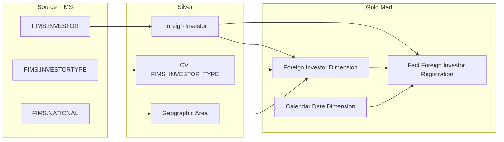
```mermaid
flowchart LR
    subgraph SRC["Source FIMS"]
        S1["FIMS.INVESTOR"]
        S2["FIMS.INVESTORTYPE"]
        S3["FIMS.NATIONAL"]
    end

    subgraph SIL["Silver"]
        SV1["Foreign Investor"]
        SV2["CV FIMS_INVESTOR_TYPE"]
        SV3["Geographic Area"]
    end

    subgraph GOLD["Gold Mart"]
        G1["Fact Foreign Investor Registration"]
        G2["Foreign Investor Dimension"]
        G3["Calendar Date Dimension"]
    end

    S1 --> SV1
    S2 --> SV2
    S3 --> SV3

    SV1 --> G1
    SV1 --> G2
    SV2 --> G2
    SV3 --> G2

    G2 --> G1
    G3 --> G1
```

---

### Cụm 2: NĐTNN 360 — Hồ sơ định danh + Biến động tài sản

Phục vụ Tab NĐTNN 360: danh sách tìm kiếm, hồ sơ định danh, biến động tài sản theo tháng.

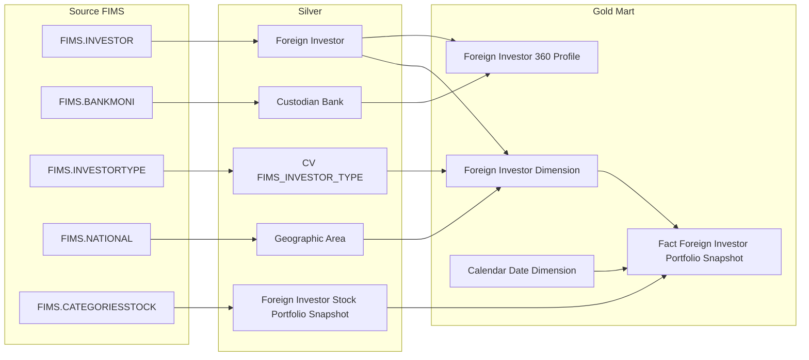
```mermaid
flowchart LR
    subgraph SRC["Source FIMS"]
        S1["FIMS.INVESTOR"]
        S2["FIMS.BANKMONI"]
        S3["FIMS.INVESTORTYPE"]
        S4["FIMS.NATIONAL"]
        S5["FIMS.CATEGORIESSTOCK"]
    end

    subgraph SIL["Silver"]
        SV1["Foreign Investor"]
        SV2["Custodian Bank"]
        SV3["CV FIMS_INVESTOR_TYPE"]
        SV4["Geographic Area"]
        SV5["Foreign Investor Stock Portfolio Snapshot"]
    end

    subgraph GOLD["Gold Mart"]
        G1["Foreign Investor 360 Profile"]
        G2["Fact Foreign Investor Portfolio Snapshot"]
        G3["Foreign Investor Dimension"]
        G5["Calendar Date Dimension"]
    end

    S1 --> SV1
    S2 --> SV2
    S3 --> SV3
    S4 --> SV4
    S5 --> SV5

    SV1 --> G1
    SV2 --> G1
    SV5 --> G2
    SV1 --> G3
    SV3 --> G3
    SV4 --> G3

    G3 --> G2
    G5 --> G2
```

---

### Cụm 3: Lịch sử tuân thủ NĐTNN (Thanh Tra)

Phục vụ Sub-tab C — Lịch sử tuân thủ trong NĐTNN 360. Silver từ phân hệ Thanh Tra (luồng GS_).

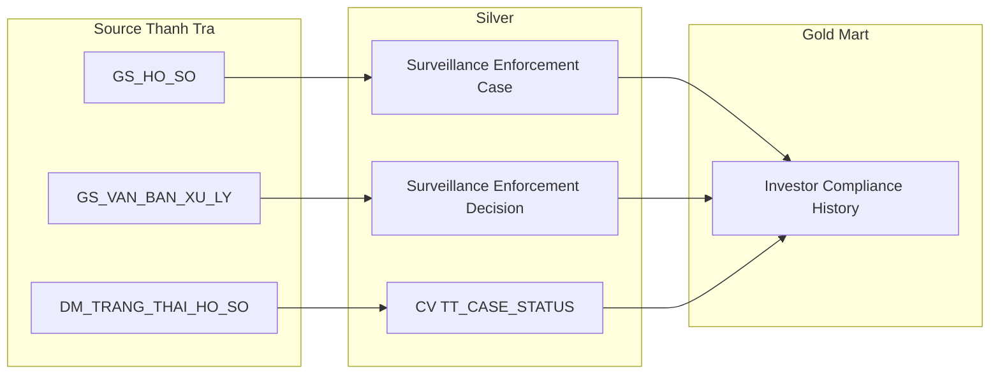
```mermaid
flowchart LR
    subgraph SRC["Source Thanh Tra"]
        S1["GS_HO_SO"]
        S2["GS_VAN_BAN_XU_LY"]
        S3["DM_TRANG_THAI_HO_SO"]
    end

    subgraph SIL["Silver"]
        SV1["Surveillance Enforcement Case"]
        SV2["Surveillance Enforcement Decision"]
        SV3["CV TT_CASE_STATUS"]
    end

    subgraph GOLD["Gold Mart"]
        G1["Investor Compliance History"]
    end

    S1 --> SV1
    S2 --> SV2
    S3 --> SV3

    SV1 --> G1
    SV2 --> G1
    SV3 --> G1
```

---

### Cụm 4: Dòng vốn đầu tư gián tiếp (Capital Flow)

Phục vụ Tab GIÁM SÁT DÒNG VỐN Nhóm 3–5 (dòng tiền vào/ra + phân loại theo loại hình và quốc gia). Silver từ FIMS báo cáo NH lưu ký.

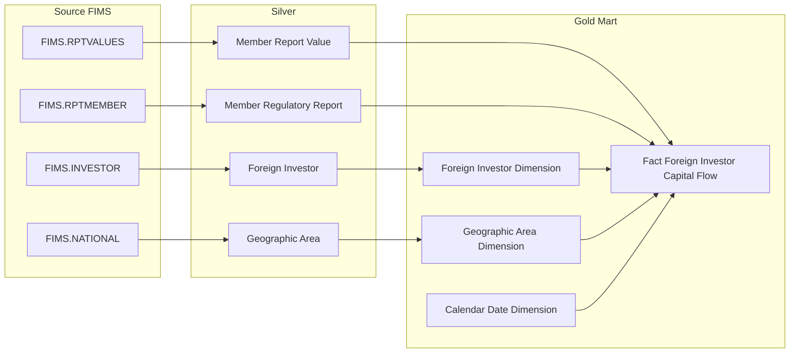
```mermaid
flowchart LR
    subgraph SRC["Source FIMS"]
        S1["FIMS.RPTVALUES"]
        S2["FIMS.RPTMEMBER"]
        S3["FIMS.INVESTOR"]
        S4["FIMS.NATIONAL"]
    end

    subgraph SIL["Silver"]
        SV1["Member Report Value"]
        SV2["Member Regulatory Report"]
        SV3["Foreign Investor"]
        SV4["Geographic Area"]
    end

    subgraph GOLD["Gold Mart"]
        G1["Fact Foreign Investor Capital Flow"]
        G2["Foreign Investor Dimension"]
        G3["Geographic Area Dimension"]
        G4["Calendar Date Dimension"]
    end

    S1 --> SV1
    S2 --> SV2
    S3 --> SV3
    S4 --> SV4

    SV1 --> G1
    SV2 --> G1
    SV3 --> G2
    SV4 --> G3

    G2 --> G1
    G3 --> G1
    G4 --> G1
```

---

### Cụm 5: Danh mục chứng khoán (Portfolio)

Phục vụ Tab DANH MỤC Nhóm 6–7 + Sub-tab B NĐTNN 360.

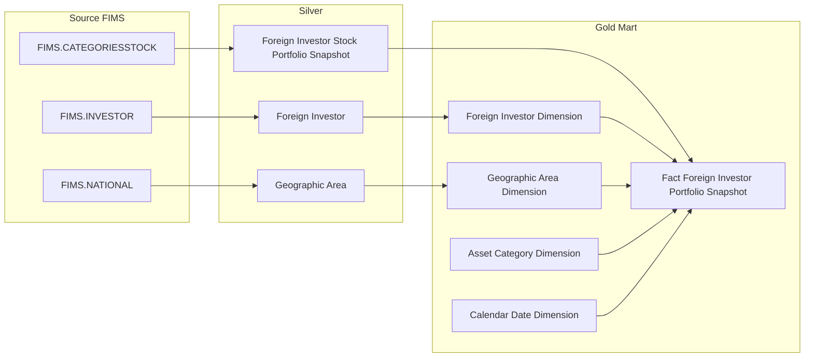
```mermaid
flowchart LR
    subgraph SRC["Source FIMS"]
        S1["FIMS.CATEGORIESSTOCK"]
        S2["FIMS.INVESTOR"]
        S3["FIMS.NATIONAL"]
    end

    subgraph SIL["Silver"]
        SV1["Foreign Investor Stock Portfolio Snapshot"]
        SV2["Foreign Investor"]
        SV3["Geographic Area"]
    end

    subgraph GOLD["Gold Mart"]
        G1["Fact Foreign Investor Portfolio Snapshot"]
        G2["Foreign Investor Dimension"]
        G3["Geographic Area Dimension"]
        G4["Asset Category Dimension"]
        G5["Calendar Date Dimension"]
    end

    S1 --> SV1
    S2 --> SV2
    S3 --> SV3

    SV1 --> G1
    SV2 --> G2
    SV3 --> G3

    G2 --> G1
    G3 --> G1
    G4 --> G1
    G5 --> G1
```

---

### Cụm 6: Giới hạn sở hữu nước ngoài + Phân ngành (IDS)

Phục vụ Tab DANH MỤC Nhóm 8 (Phân ngành) + Nhóm 9 (ROOM). Silver từ IDS (`foreign_owner_limit` + `company_profiles` + `company_detail`).

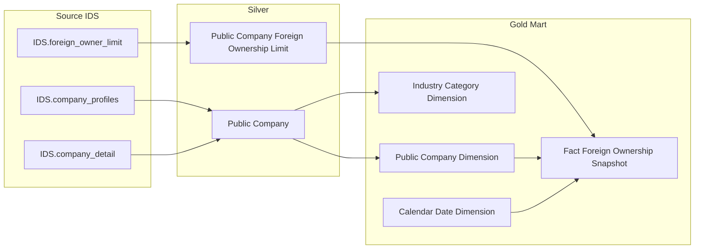
```mermaid
flowchart LR
    subgraph SRC["Source IDS"]
        S1["IDS.foreign_owner_limit"]
        S2["IDS.company_profiles"]
        S3["IDS.company_detail"]
    end

    subgraph SIL["Silver"]
        SV1["Public Company Foreign Ownership Limit"]
        SV2["Public Company"]
    end

    subgraph GOLD["Gold Mart"]
        G1["Fact Foreign Ownership Snapshot"]
        G2["Public Company Dimension"]
        G3["Industry Category Dimension"]
        G4["Calendar Date Dimension"]
    end

    S1 --> SV1
    S2 --> SV2
    S3 --> SV2

    SV1 --> G1
    SV2 --> G2
    SV2 --> G3

    G2 --> G1
    G4 --> G1
```

---

## Section 2 — Tổng quan báo cáo

### Tab: GIAO DỊCH

**Slicer chung:** Ngày (date picker — ví dụ: 12/31/2024)

---

#### Nhóm 1 — KPI Cards tổng quan

**Mockup:**

| Tỷ lệ tham gia | Tăng trưởng NĐT mới | Tăng trưởng NĐT Cá nhân mới | Tăng trưởng NĐT Tổ chức mới |
|:---:|:---:|:---:|:---:|
| **12.4** % | **2,450** Mã | **1,830** Mã | **620** Mã |

---

##### PENDING — Box 1: Tỷ lệ tham gia (STT 1–4)

**KPI liên quan:** Tỷ lệ tham gia, Tổng giá trị mua NĐTNN, Tổng giá trị bán NĐTNN, Tổng giá trị giao dịch toàn thị trường

**Lý do pending:** Công thức `(GT mua + GT bán NĐTNN) × 100 / (GT GD toàn thị trường × 2)` phụ thuộc hoàn toàn vào dữ liệu khớp lệnh từ SGDCK. Silver entity cho giao dịch chứng khoán của NĐTNN chưa được thiết kế — không có entity FIMS nào thay thế được cho use case này.

**Silver cần bổ sung:** Entity giao dịch CK NĐTNN từ SGDCK với attributes: Foreign Investor Buy Value, Foreign Investor Sell Value, Total Market Value, mã CK, ngày GD, sàn (HOSE/HNX/UPCoM).

**Mart dự kiến khi Silver sẵn sàng:** `Fact Securities Foreign Trading Snapshot` — grain = 1 mã CK × 1 ngày giao dịch.

---

##### READY — Box 2–4: Tăng trưởng NĐT mới (STT 5–7)

> Phân loại: **Phân tích**
> Silver: `Foreign Investor` ← FIMS.INVESTOR — sẵn sàng
> Registration Date: FIMS.INVESTOR.DateCreated → Silver attribute `Created Timestamp`

**Source:** `Fact Foreign Investor Registration` → `Foreign Investor Dimension`, `Calendar Date Dimension`

**Bảng KPI:**

| KPI ID | Tên | Đơn vị | Tính chất | Công thức / Mô tả |
|---|---|---|---|---|
| K_NDTNN_5 | Tăng trưởng NĐT mới | Mã | Flow (Base) | `COUNT(Investor Dimension Id)` WHERE `Registration Date` BETWEEN `01/01/Year(selected)` AND `selected_date` |
| K_NDTNN_6 | Tăng trưởng NĐT Cá nhân mới | Mã | Flow (Base) | K_NDTNN_5 + filter `Foreign Investor Dimension.Investor Object Type Code = 'INDIVIDUAL'` |
| K_NDTNN_7 | Tăng trưởng NĐT Tổ chức mới | Mã | Flow (Base) | K_NDTNN_5 + filter `Foreign Investor Dimension.Investor Object Type Code IN ('FUND', 'OTHER_ORG')` |
| K_NDTNN_5_YOY | YoY% NĐT mới | % | Derived | `(K_NDTNN_5[Year=Y] − K_NDTNN_5[Year=Y−1]) / K_NDTNN_5[Year=Y−1] × 100%` |

> **Lưu ý:** K_NDTNN_5, 6, 7 là Base — COUNT trực tiếp event trên fact, không derive từ KPI khác. K6 + K7 = K5 (partition disjoint theo ObjectType). YTD = đếm event trong khoảng ngày, không cần diff giữa 2 snapshot. YoY là Derived — tính ở presentation layer.

**Star Schema:**

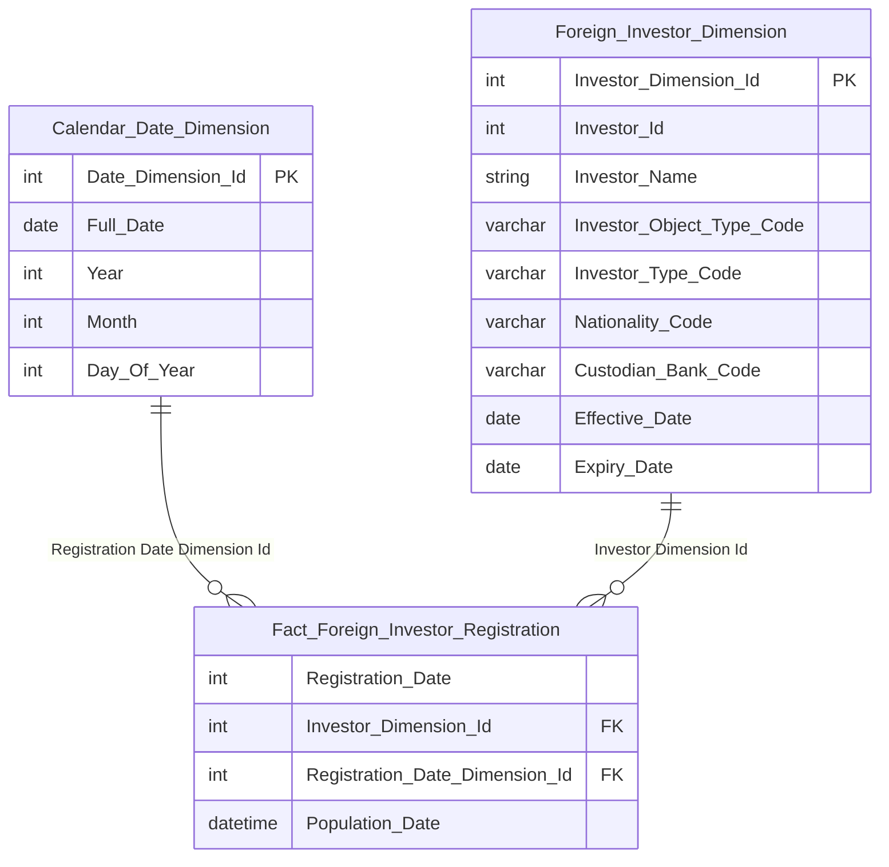
```mermaid
erDiagram
    Calendar_Date_Dimension {
        int Date_Dimension_Id PK
        date Full_Date
        int Year
        int Month
        int Day_Of_Year
    }
    Foreign_Investor_Dimension {
        int Investor_Dimension_Id PK
        int Investor_Id
        string Investor_Name
        varchar Investor_Object_Type_Code
        varchar Investor_Type_Code
        varchar Nationality_Code
        varchar Custodian_Bank_Code
        date Effective_Date
        date Expiry_Date
    }
    Fact_Foreign_Investor_Registration {
        int Registration_Date
        int Investor_Dimension_Id FK
        int Registration_Date_Dimension_Id FK
        datetime Population_Date
    }

    Calendar_Date_Dimension ||--o{ Fact_Foreign_Investor_Registration : "Registration Date Dimension Id"
    Foreign_Investor_Dimension ||--o{ Fact_Foreign_Investor_Registration : "Investor Dimension Id"
```

**Lineage Mart → Báo cáo:**

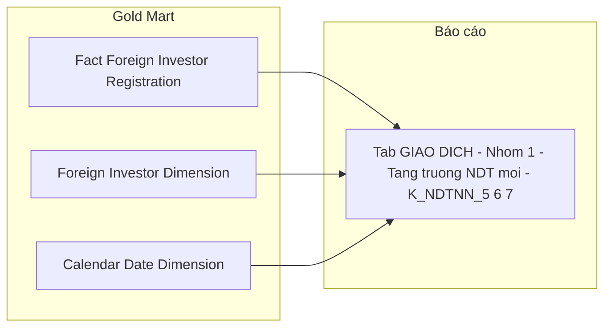
```mermaid
flowchart LR
    subgraph GOLD["Gold Mart"]
        G1["Fact Foreign Investor Registration"]
        G2["Foreign Investor Dimension"]
        G3["Calendar Date Dimension"]
    end
    subgraph RPT["Báo cáo"]
        R1["Tab GIAO DICH - Nhom 1 - Tang truong NDT moi - K_NDTNN_5 6 7"]
    end
    G1 --> R1
    G2 --> R1
    G3 --> R1
```

**Bảng grain:**

| Tên bảng | Grain |
|---|---|
| Fact Foreign Investor Registration | 1 row = 1 NĐT NN đăng ký mã giao dịch (event — 1 lần duy nhất per NĐT) |
| Foreign Investor Dimension | 1 row = 1 NĐT NN (SCD2) |
| Calendar Date Dimension | 1 row = 1 ngày đăng ký |

---

#### Nhóm 2 — Tổng giá trị mua/bán ròng của NĐTNN

**Mockup:**

| Bar chart | Lũy kế mua/bán ròng |
|:---|---:|
| Trục X: Tháng (Jan → Oct) | -8,300 B |
| Trục Y: Giá trị (tỉ đồng) | (lũy kế kỳ chọn) |

| TOP NGÀNH BÁN RÒNG | | TOP NGÀNH MUA RÒNG | | TOP MÃ BÁN RÒNG | | TOP MÃ MUA RÒNG | |
|:---|---:|:---|---:|:---|---:|:---|---:|
| Bất động sản | -1200B | Ngân hàng | +4500B | VHM | -700B | HPG | +3300B |
| Thực phẩm | -450B | Thép / Tài nguyên | +2800B | MSN | -400B | VCB | +600B |
| Khác | -200B | Công nghệ | +1200B | VIC | -1300B | FPT | +2400B |
| Tiện ích | -300B | Dầu khí | +150B | VNM | -1300B | TCB | +1300B |
| Dịch vụ tài chính | -150B | Bán lẻ | +600B | STB | -700B | MWG | +1700B |

**Slicer:** Từ ngày — Đến ngày (date range picker)

---

##### PENDING — Nhóm 2: Tổng GT mua/bán ròng + Lũy kế + Top ngành/mã (STT 8–16)

**KPI liên quan:**

| STT | Tên KPI | Ghi chú |
|---|---|---|
| 8 | Giá trị mua/bán ròng (theo tháng) | Bar chart — GT mua − GT bán per tháng |
| 11 | Lũy kế mua/bán ròng | SUM(GT ròng) trong khoảng ngày chọn |
| 13 | Top 5 ngành bán ròng | GROUP BY ngành, 5 ngành có GT ròng âm lớn nhất |
| 14 | Top 5 ngành mua ròng | GROUP BY ngành, 5 ngành có GT ròng dương lớn nhất |
| 15 | Top 5 mã bán ròng | GROUP BY mã CK, 5 mã có GT ròng âm lớn nhất |
| 16 | Top 5 mã mua ròng | GROUP BY mã CK, 5 mã có GT ròng dương lớn nhất |
| — | Tỷ trọng GD theo ngày | (GT mua + GT bán NĐTNN) / (GT GD toàn thị trường × 2) per ngày |
| — | Tổng GT GD NĐTNN | GT mua + GT bán NĐTNN per ngày |
| — | Tỷ trọng TB phiên | Trung bình tỷ trọng trong khoảng thời gian chọn |

**Lý do pending:** Tất cả KPI phụ thuộc dữ liệu khớp lệnh từ SGDCK. Top ngành cần thêm IDS-GSĐC để map mã CK → nhóm ngành. Không có Silver entity FIMS nào thay thế được.

**Silver cần bổ sung:**
- `Securities Foreign Trading Record` (SGDCK): Foreign Investor Buy/Sell Value, Total Market Value, mã CK, ngày GD, sàn
- `Listed Security` (SGDCK): mã CK, tên, sàn
- `Industry` (IDS-GSĐC): nhóm ngành, map với mã CK

**Mart dự kiến khi Silver sẵn sàng:**
- `Fact Securities Foreign Trading Snapshot` — grain = 1 mã CK × 1 ngày GD
- `Listed Security Dimension` — SCD2
- `Industry Dimension` — SCD2

---

#### Nhóm 3 — Tỷ trọng giao dịch NĐTNN

**Mockup** *(theo screenshot)*:

```
TỶ TRỌNG GIAO DỊCH NĐTNN                    TỶ TRỌNG TB PHIÊN
Toàn bộ thị trường với nhóm ngành                        12.4%

Line chart — Trục X: ngày / Trục Y: % tỷ trọng (0–20%)
Series: Tỷ trọng GD NĐTNN theo ngày

TỶ TRỌNG THEO NGÀNH          TOP MÃ TỶ TRỌNG CAO
Ngân hàng        19.8%        FPT   53.3%
Bất động sản     18.4%        MWG   58.8%
Thép/Tài nguyên  14.3%        PNJ   42.4%
Thực phẩm        16.4%        MBB   52.7%
Công nghệ        16.7%        CTG   63.8%
```

**Slicer:** Từ ngày — Đến ngày (date range picker)

---

##### PENDING — Nhóm 3: Tỷ trọng GD NĐTNN (STT 17–21)

**KPI liên quan:**

| KPI ID | Tên KPI | Ghi chú |
|---|---|---|
| K_NDTNN_17 | Tỷ trọng TB phiên | (GT mua + GT bán NĐTNN) / (GT GD toàn thị trường × 2) trung bình trong khoảng ngày chọn |
| K_NDTNN_18 | Tỷ trọng GD NĐTNN theo ngày | Line chart — tỷ trọng per ngày GD |
| K_NDTNN_19 | Tỷ trọng theo ngành | (GT GD NĐTNN của ngành X) / (GT GD NĐTNN tổng) × 100% GROUP BY ngành |
| K_NDTNN_20 | Top mã tỷ trọng cao — Tỷ lệ sở hữu | Tỷ lệ sở hữu NĐTNN per mã CK (%) — từ `Fact Foreign Ownership Snapshot` |
| K_NDTNN_21 | Tổng GT GD NĐTNN theo ngày | GT mua + GT bán NĐTNN per ngày |

> **Lưu ý phân tách nguồn:**
> - K_NDTNN_17, 18, 19, 21: nguồn SGDCK (khớp lệnh) — PENDING
> - K_NDTNN_20 (Tỷ lệ sở hữu per mã): nguồn IDS (`Fact Foreign Ownership Snapshot`) — **READY**. Đã thiết kế tại Nhóm 9 Tab DANH MỤC (K_NDTNN_45)

**Lý do pending (K_NDTNN_17–19, 21):** Phụ thuộc dữ liệu khớp lệnh từ SGDCK — GT mua/bán NĐTNN per ngày, GT GD toàn thị trường per ngày. Không có Silver entity FIMS thay thế.

**Silver cần bổ sung:** `Securities Foreign Trading Record` (SGDCK) — Foreign Investor Buy/Sell Value per ngày GD, Total Market Value per ngày GD, mã CK, nhóm ngành.

**Mart dự kiến khi Silver sẵn sàng:** `Fact Securities Foreign Trading Snapshot` — grain = 1 mã CK × 1 ngày GD (dùng chung với Nhóm 2).

---

### Tab: GIÁM SÁT DÒNG VỐN

**Slicer chung:** Từ ngày — Đến ngày (date range picker)

---

#### Nhóm 3 — KPI Cards: Dòng tiền vào / ra / ròng (STT 23–25)

> Phân loại: **Phân tích**
> Silver: `Member Report Value` ← FIMS.RPTVALUES + `Member Regulatory Report` ← FIMS.RPTMEMBER — sẵn sàng

**Mockup:**

| Dòng tiền vào | Dòng tiền ra | Dòng tiền ròng |
|:---:|:---:|:---:|
| **1,284.3** Tỉ đồng | **1,736.8** Tỉ đồng | **-452.5** Tỉ đồng |

**Source:** `Fact Foreign Investor Capital Flow` → `Calendar Date Dimension`

**Bảng KPI:**

| KPI ID | Tên | Đơn vị | Tính chất | Công thức / Mô tả |
|---|---|---|---|---|
| K_NDTNN_23 | Dòng tiền vào | Tỉ đồng | Flow (Base) | `SUM(Capital Amount)` WHERE `Event Type Code = 'IN'` AND `Event Date` BETWEEN Từ ngày AND Đến ngày |
| K_NDTNN_24 | Dòng tiền ra | Tỉ đồng | Flow (Base) | `SUM(Capital Amount)` WHERE `Event Type Code = 'OUT'` AND `Event Date` BETWEEN Từ ngày AND Đến ngày |
| K_NDTNN_25 | Dòng tiền ròng | Tỉ đồng | Derived | `K_NDTNN_23 − K_NDTNN_24` |

**Star Schema:**

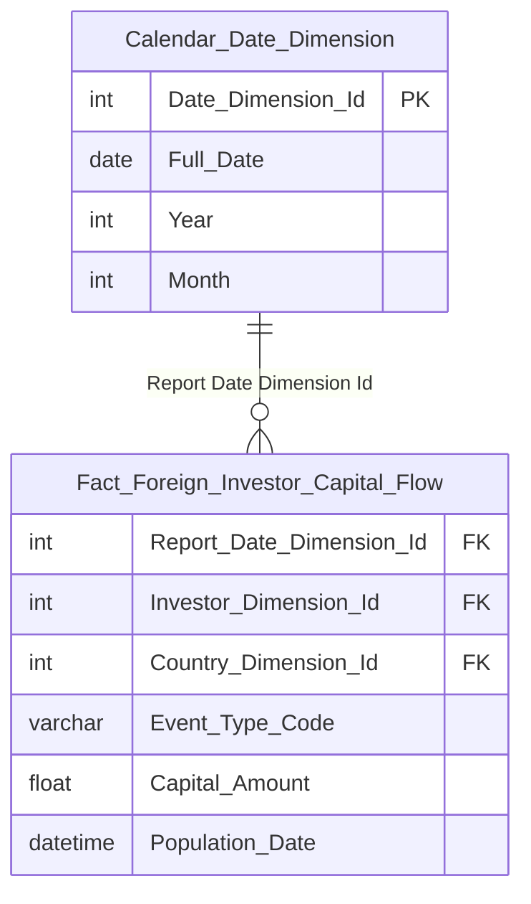
```mermaid
erDiagram
    Calendar_Date_Dimension {
        int Date_Dimension_Id PK
        date Full_Date
        int Year
        int Month
    }
    Fact_Foreign_Investor_Capital_Flow {
        int Report_Date_Dimension_Id FK
        int Investor_Dimension_Id FK
        int Country_Dimension_Id FK
        varchar Event_Type_Code
        float Capital_Amount
        datetime Population_Date
    }

    Calendar_Date_Dimension ||--o{ Fact_Foreign_Investor_Capital_Flow : "Report Date Dimension Id"
```

**Lineage Mart → Báo cáo:**

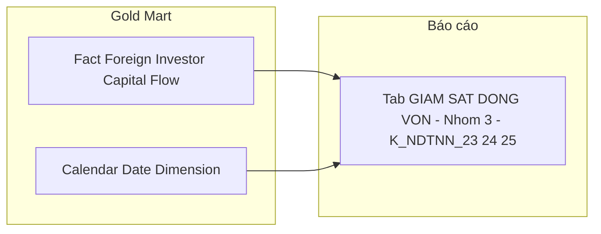
```mermaid
flowchart LR
    subgraph GOLD["Gold Mart"]
        G1["Fact Foreign Investor Capital Flow"]
        G2["Calendar Date Dimension"]
    end
    subgraph RPT["Báo cáo"]
        R1["Tab GIAM SAT DONG VON - Nhom 3 - K_NDTNN_23 24 25"]
    end
    G1 --> R1
    G2 --> R1
```

**Bảng grain:**

| Tên bảng | Grain |
|---|---|
| Fact Foreign Investor Capital Flow | 1 row = 1 sự kiện vào/ra vốn của 1 NĐT NN (Event — FIMS.RPTMEMBER × cell code IN/OUT) |
| Calendar Date Dimension | 1 row = 1 ngày (Report Date = FIMS.RPTMEMBER.DayReport) |

---

#### Nhóm 4 — Tương quan Net Flow & VN-Index (không STT trong BRD)

> Phân loại: **Phân tích**
> Silver FIMS: `Member Report Value` — sẵn sàng (dòng tiền ròng)
> Silver SGDCK: chưa có (Giá trị mua/bán ròng + VN-Index)

**Mockup** *(theo screenshot — 3 series line chart dual Y-axis)*:

| Series | Nguồn | Trục Y | Trạng thái |
|:---|:---|:---|:---|
| MUA/BÁN RÒNG (đỏ) | SGDCK | Trái (Tỉ đồng) | PENDING |
| DÒNG TIỀN RÒNG (xanh lá) | FIMS | Trái (Tỉ đồng) | READY |
| VN-INDEX (tím) | SGDCK | Phải (Điểm) | PENDING |

> **Ghi chú thiết kế:** 3 series từ 3 fact riêng biệt — presentation layer chịu trách nhiệm query độc lập và align theo trục tháng. Series Dòng tiền ròng reuse `Fact Foreign Investor Capital Flow` (Nhóm 3). 2 series còn lại chờ Silver SGDCK.

**Bảng KPI:**

| KPI ID | Tên | Tính chất | Trạng thái |
|---|---|---|---|
| K_NDTNN_25b | Dòng tiền ròng lũy kế (tháng) | Derived — reuse K_NDTNN_25 aggregate by tháng | READY |
| K_NDTNN_22 | Giá trị mua/bán ròng (tháng) | Derived — từ `Fact Securities Foreign Trading Snapshot` | PENDING — chờ Silver SGDCK |
| K_NDTNN_24b | Điểm đóng cửa VN-Index | Base — từ `Fact Market Index Snapshot` | PENDING — chờ Silver SGDCK |

---

#### Nhóm 5 — Dòng vốn đầu tư gián tiếp nước ngoài (không STT trong BRD)

> Phân loại: **Phân tích**
> Silver: `Member Report Value` + `Foreign Investor` — sẵn sàng

**Mockup** *(theo screenshot — stacked bar theo tháng + 4 bảng Top)*:

| Stacked bar | Trục X | Trục Y | Legend |
|:---|:---|:---|:---|
| Dòng vốn ròng theo loại hình NĐT | Tháng T1→T12 | Tỉ đồng | Cá nhân / Quỹ / Tổ chức khác quỹ |

| TOP QUỐC GIA VÀO RÒNG | | TOP QUỐC GIA RÚT RÒNG | |
|:---|---:|:---|---:|
| Singapore | +450B | Trung Quốc | -380B |
| Hoa Kỳ | +320B | Đài Loan | -210B |
| Nhật Bản | +210B | Thái Lan | -165B |

| TOP NĐT VÀO RÒNG | | TOP NĐT RÚT RÒNG | |
|:---|---:|:---|---:|
| Dragon Capital | +185B | iShares MSCI | -210B |
| Fubon ETF | +162B | KIM Vietnam | -178B |

**Slicer:** Từ ngày — Đến ngày + Loại hình NĐTNN + Quốc gia

**Source:** `Fact Foreign Investor Capital Flow` → `Foreign Investor Dimension`, `Geographic Area Dimension`, `Calendar Date Dimension`

**Bảng KPI:**

| KPI ID | Tên | Tính chất | Công thức / Mô tả |
|---|---|---|---|
| K_NDTNN_26 | Dòng vốn ròng | Derived | `SUM(Capital Amount WHERE IN) − SUM(Capital Amount WHERE OUT)` GROUP BY tháng / loại hình / quốc gia |
| K_NDTNN_27 | Dòng vốn ròng — Quỹ | Derived | K_NDTNN_26 WHERE `Foreign Investor Dimension.Investor Object Type Code = 'FUND'` |
| K_NDTNN_28 | Dòng vốn ròng — Cá nhân | Derived | K_NDTNN_26 WHERE `Foreign Investor Dimension.Investor Object Type Code = 'INDIVIDUAL'` |
| K_NDTNN_29 | Dòng vốn ròng — Tổ chức khác quỹ | Derived | K_NDTNN_26 WHERE `Foreign Investor Dimension.Investor Object Type Code = 'OTHER_ORG'` |
| K_NDTNN_30 | Top 5 quốc gia vào ròng | Derived | `SUM(IN) − SUM(OUT)` GROUP BY `Geographic Area Dimension.Geographic Area Name`, WHERE > 0, TOP 5 DESC |
| K_NDTNN_31 | Top 5 quốc gia rút ròng | Derived | Tương tự K_NDTNN_30, WHERE < 0, TOP 5 ASC |
| K_NDTNN_32 | Top 5 NĐT vào ròng | Derived | `SUM(IN) − SUM(OUT)` GROUP BY `Foreign Investor Dimension.Investor Name`, WHERE > 0, TOP 5 DESC |
| K_NDTNN_33 | Top 5 NĐT rút ròng | Derived | Tương tự K_NDTNN_32, WHERE < 0, TOP 5 ASC |

**Star Schema:**

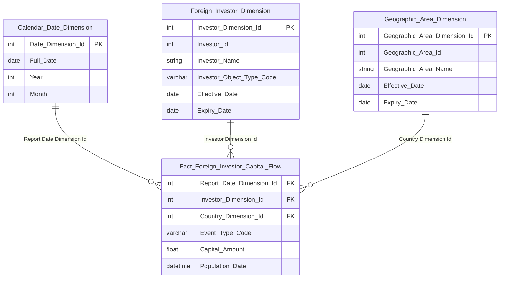
```mermaid
erDiagram
    Calendar_Date_Dimension {
        int Date_Dimension_Id PK
        date Full_Date
        int Year
        int Month
    }
    Foreign_Investor_Dimension {
        int Investor_Dimension_Id PK
        int Investor_Id
        string Investor_Name
        varchar Investor_Object_Type_Code
        date Effective_Date
        date Expiry_Date
    }
    Geographic_Area_Dimension {
        int Geographic_Area_Dimension_Id PK
        int Geographic_Area_Id
        string Geographic_Area_Name
        date Effective_Date
        date Expiry_Date
    }
    Fact_Foreign_Investor_Capital_Flow {
        int Report_Date_Dimension_Id FK
        int Investor_Dimension_Id FK
        int Country_Dimension_Id FK
        varchar Event_Type_Code
        float Capital_Amount
        datetime Population_Date
    }

    Calendar_Date_Dimension ||--o{ Fact_Foreign_Investor_Capital_Flow : "Report Date Dimension Id"
    Foreign_Investor_Dimension ||--o{ Fact_Foreign_Investor_Capital_Flow : "Investor Dimension Id"
    Geographic_Area_Dimension ||--o{ Fact_Foreign_Investor_Capital_Flow : "Country Dimension Id"
```

**Lineage Mart → Báo cáo:**

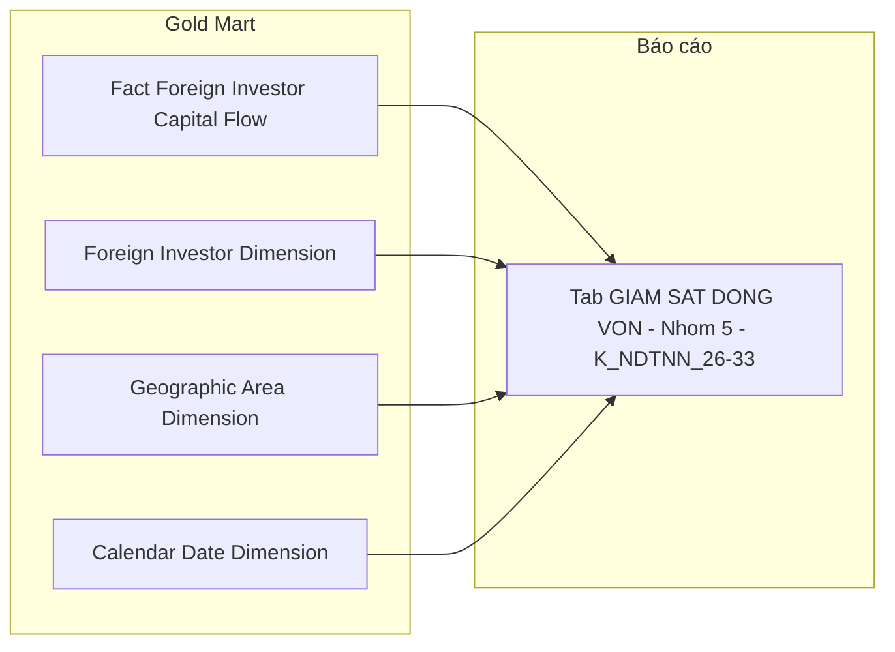
```mermaid
flowchart LR
    subgraph GOLD["Gold Mart"]
        G1["Fact Foreign Investor Capital Flow"]
        G2["Foreign Investor Dimension"]
        G3["Geographic Area Dimension"]
        G4["Calendar Date Dimension"]
    end
    subgraph RPT["Báo cáo"]
        R1["Tab GIAM SAT DONG VON - Nhom 5 - K_NDTNN_26-33"]
    end
    G1 --> R1
    G2 --> R1
    G3 --> R1
    G4 --> R1
```

**Bảng grain:**

| Tên bảng | Grain |
|---|---|
| Fact Foreign Investor Capital Flow | 1 row = 1 sự kiện vào/ra vốn của 1 NĐT NN (Event) |
| Foreign Investor Dimension | 1 row = 1 NĐT NN (SCD2) |
| Geographic Area Dimension | 1 row = 1 quốc gia (SCD2) |
| Calendar Date Dimension | 1 row = 1 ngày (Report Date = FIMS.RPTMEMBER.DayReport) |

---

### Tab: DANH MỤC

**Slicer chung:** Kỳ (Tháng + Năm) cho danh mục / Ngày (date picker) cho ROOM

---

#### Nhóm 6 — KPI Cards + Top: Tổng giá trị danh mục (không STT)

> Phân loại: **Phân tích**
> Silver: `Foreign Investor Stock Portfolio Snapshot` (FIMS.CATEGORIESSTOCK) — sẵn sàng. Xem O_NDTNN_5 về nguồn giá trị thị trường.

**Mockup** *(theo screenshot)*:

| Tổng GTDM | Danh mục Cá nhân | Danh mục Quỹ | Danh mục Tổ chức khác quỹ |
|:---:|:---:|:---:|:---:|
| **1,315** Tỉ đồng | **284.6** Tỉ đồng | **752.3** Tỉ đồng | **278.1** Tỉ đồng |

| TOP QUỐC GIA | | TOP NĐT | |
|:---|---:|:---|---:|
| Singapore | 312.4B | Dragon Capital | 198.5B |
| Hoa Kỳ | 284.1B | VinaCapital | 167.3B |
| Nhật Bản | 198.7B | Fubon ETF | 145.8B |

**Source:** `Fact Foreign Investor Portfolio Snapshot` → `Foreign Investor Dimension`, `Geographic Area Dimension`, `Calendar Date Dimension`

**Bảng KPI:**

| KPI ID | Tên | Đơn vị | Tính chất | Công thức / Mô tả |
|---|---|---|---|---|
| K_NDTNN_34 | Tổng giá trị danh mục | Tỉ đồng | Stock (Base) | `SUM(Portfolio Market Value)` WHERE Snapshot Month = tháng chọn |
| K_NDTNN_35 | Danh mục Cá nhân | Tỉ đồng | Derived | K_NDTNN_34 WHERE `Foreign Investor Dimension.Investor Object Type Code = 'INDIVIDUAL'` |
| K_NDTNN_36 | Danh mục Quỹ | Tỉ đồng | Derived | K_NDTNN_34 WHERE `Foreign Investor Dimension.Investor Object Type Code = 'FUND'` |
| K_NDTNN_37 | Danh mục Tổ chức khác quỹ | Tỉ đồng | Derived | K_NDTNN_34 WHERE `Foreign Investor Dimension.Investor Object Type Code = 'OTHER_ORG'` |
| K_NDTNN_38 | Top 5 quốc gia theo GTDM | Tỉ đồng | Derived | `SUM(Portfolio Market Value)` GROUP BY `Geographic Area Dimension.Geographic Area Name`, TOP 5 DESC |
| K_NDTNN_39 | Top 5 NĐT theo GTDM | Tỉ đồng | Derived | `SUM(Portfolio Market Value)` GROUP BY `Foreign Investor Dimension.Investor Name`, TOP 5 DESC |

**Star Schema:**

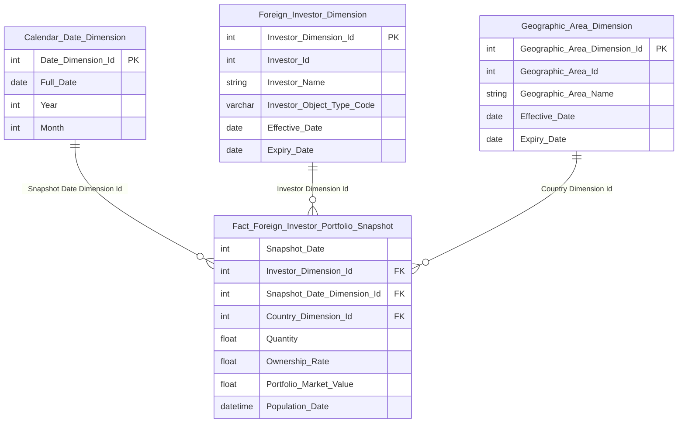
```mermaid
erDiagram
    Calendar_Date_Dimension {
        int Date_Dimension_Id PK
        date Full_Date
        int Year
        int Month
    }
    Foreign_Investor_Dimension {
        int Investor_Dimension_Id PK
        int Investor_Id
        string Investor_Name
        varchar Investor_Object_Type_Code
        date Effective_Date
        date Expiry_Date
    }
    Geographic_Area_Dimension {
        int Geographic_Area_Dimension_Id PK
        int Geographic_Area_Id
        string Geographic_Area_Name
        date Effective_Date
        date Expiry_Date
    }
    Fact_Foreign_Investor_Portfolio_Snapshot {
        int Snapshot_Date
        int Investor_Dimension_Id FK
        int Snapshot_Date_Dimension_Id FK
        int Country_Dimension_Id FK
        float Quantity
        float Ownership_Rate
        float Portfolio_Market_Value
        datetime Population_Date
    }

    Calendar_Date_Dimension ||--o{ Fact_Foreign_Investor_Portfolio_Snapshot : "Snapshot Date Dimension Id"
    Foreign_Investor_Dimension ||--o{ Fact_Foreign_Investor_Portfolio_Snapshot : "Investor Dimension Id"
    Geographic_Area_Dimension ||--o{ Fact_Foreign_Investor_Portfolio_Snapshot : "Country Dimension Id"
```

**Lineage Mart → Báo cáo:**

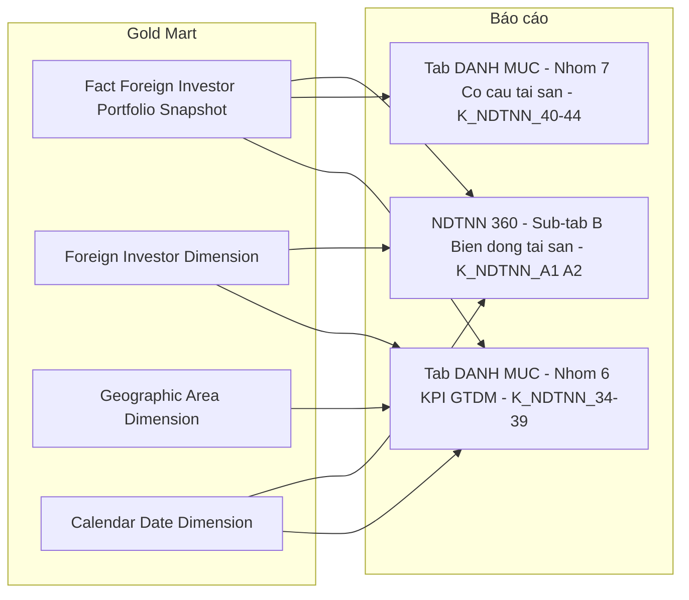
```mermaid
flowchart LR
    subgraph GOLD["Gold Mart"]
        G1["Fact Foreign Investor Portfolio Snapshot"]
        G2["Foreign Investor Dimension"]
        G3["Geographic Area Dimension"]
        G4["Calendar Date Dimension"]
    end
    subgraph RPT["Báo cáo"]
        R1["Tab DANH MUC - Nhom 6 KPI GTDM - K_NDTNN_34-39"]
        R2["Tab DANH MUC - Nhom 7 Co cau tai san - K_NDTNN_40-44"]
        R3["NDTNN 360 - Sub-tab B Bien dong tai san - K_NDTNN_A1 A2"]
    end
    G1 --> R1
    G2 --> R1
    G3 --> R1
    G4 --> R1
    G1 --> R2
    G1 --> R3
    G2 --> R3
    G4 --> R3
```

**Bảng grain:**

| Tên bảng | Grain |
|---|---|
| Fact Foreign Investor Portfolio Snapshot | 1 row = 1 NĐT NN × 1 mã tài sản × 1 tháng snapshot |
| Foreign Investor Dimension | 1 row = 1 NĐT NN (SCD2) |
| Geographic Area Dimension | 1 row = 1 quốc gia (SCD2) |
| Calendar Date Dimension | 1 row = 1 ngày (ngày cuối tháng = Snapshot Date) |

---

#### Nhóm 7 — Cơ cấu danh mục theo loại hình tài sản (không STT)

> Phân loại: **Phân tích**
> Silver: `Foreign Investor Stock Portfolio Snapshot` — sẵn sàng. Xem O_NDTNN_2b về mapping 5 loại tài sản.

**Mockup** *(theo screenshot — donut chart)*:

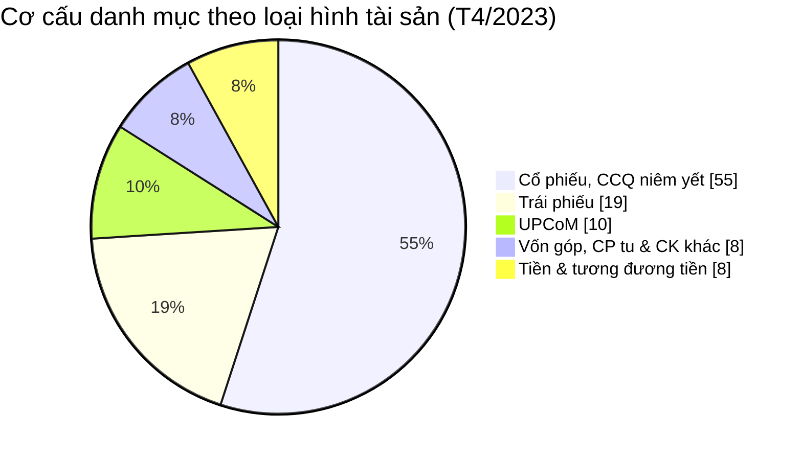
```mermaid
pie showData
    title Cơ cấu danh mục theo loại hình tài sản (T4/2023)
    "Cổ phiếu, CCQ niêm yết" : 55
    "Trái phiếu" : 19
    "UPCoM" : 10
    "Vốn góp, CP tu & CK khác" : 8
    "Tiền & tương đương tiền" : 8
```

**Source:** `Fact Foreign Investor Portfolio Snapshot` → `Asset Category Dimension`, `Calendar Date Dimension`

**Bảng KPI:**

| KPI ID | Tên | Đơn vị | Tính chất | Công thức / Mô tả |
|---|---|---|---|---|
| K_NDTNN_40 | GT tài sản — Cổ phiếu/CCQ niêm yết | Tỉ đồng | Derived | `SUM(Portfolio Market Value)` WHERE `Asset Category Dimension.Asset Category Code = 'LISTED_EQUITY'` |
| K_NDTNN_41 | GT tài sản — Trái phiếu | Tỉ đồng | Derived | WHERE `Asset Category Dimension.Asset Category Code = 'BOND'` |
| K_NDTNN_42 | GT tài sản — UPCoM | Tỉ đồng | Derived | WHERE `Asset Category Dimension.Asset Category Code = 'UPCOM'` |
| K_NDTNN_43 | GT tài sản — Vốn góp/CP tư/CK khác | Tỉ đồng | Derived | WHERE `Asset Category Dimension.Asset Category Code = 'OTHER_EQUITY'` |
| K_NDTNN_44 | GT tài sản — Tiền và tương đương | Tỉ đồng | Derived | WHERE `Asset Category Dimension.Asset Category Code = 'CASH'` |

**Star Schema:**

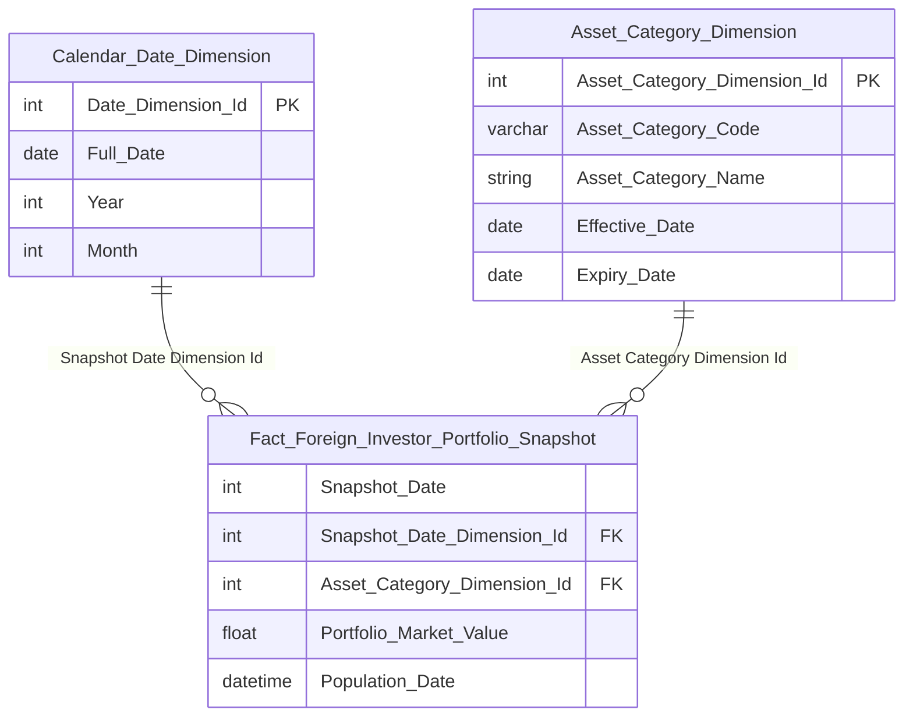
```mermaid
erDiagram
    Calendar_Date_Dimension {
        int Date_Dimension_Id PK
        date Full_Date
        int Year
        int Month
    }
    Asset_Category_Dimension {
        int Asset_Category_Dimension_Id PK
        varchar Asset_Category_Code
        string Asset_Category_Name
        date Effective_Date
        date Expiry_Date
    }
    Fact_Foreign_Investor_Portfolio_Snapshot {
        int Snapshot_Date
        int Snapshot_Date_Dimension_Id FK
        int Asset_Category_Dimension_Id FK
        float Portfolio_Market_Value
        datetime Population_Date
    }

    Calendar_Date_Dimension ||--o{ Fact_Foreign_Investor_Portfolio_Snapshot : "Snapshot Date Dimension Id"
    Asset_Category_Dimension ||--o{ Fact_Foreign_Investor_Portfolio_Snapshot : "Asset Category Dimension Id"
```

**Bảng grain:**

| Tên bảng | Grain |
|---|---|
| Fact Foreign Investor Portfolio Snapshot | 1 row = 1 NĐT NN × 1 mã tài sản × 1 tháng |
| Asset Category Dimension | 1 row = 1 loại tài sản (SCD2) |
| Calendar Date Dimension | 1 row = 1 ngày (ngày cuối tháng) |

---

#### Nhóm 8 — Bản đồ nhiệt phân ngành (không STT — nguồn IDS)

> Phân loại: **Phân tích**
> Silver: `Public Company` (IDS.company_profiles + IDS.company_detail — có `Industry Category Level1/Level2 Code`) — sẵn sàng
> **Ghi chú thiết kế:** `Industry Category Dimension` là Conformed Dim được ETL extract từ `Public Company.Industry Category Level1/Level2 Code` — Silver không có entity riêng cho danh mục ngành, nhưng Gold tạo Dim riêng để (1) đúng ngữ nghĩa khi GROUP BY ngành, (2) tái sử dụng cross-module (QLKD, NHNCK). Đây là pattern **ETL-derived Conformed Dimension** — `source_entity` trong attributes CSV ghi `Public Company`.
> Join chain: `Fact Foreign Investor Portfolio Snapshot` → mã CK → `Public Company` (IDS) → `Industry Category Dimension`

**Mockup** *(theo screenshot — treemap)*:

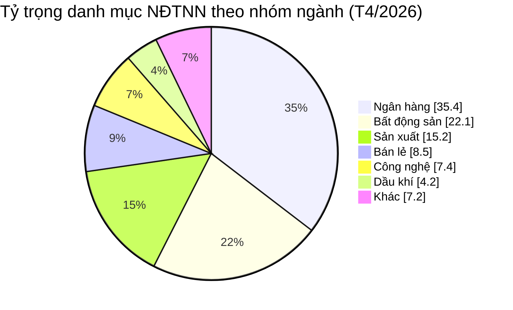
```mermaid
pie showData
    title Tỷ trọng danh mục NĐTNN theo nhóm ngành (T4/2026)
    "Ngân hàng" : 35.4
    "Bất động sản" : 22.1
    "Sản xuất" : 15.2
    "Bán lẻ" : 8.5
    "Công nghệ" : 7.4
    "Dầu khí" : 4.2
    "Khác" : 7.2
```

**Ghi chú thiết kế:** `FIMS.CATEGORIESSTOCK` có mã CK (`SecId`). Join sang `Public Company` qua mã CK → lấy `Industry Category Level1 Code` từ `Public Company.Industry Category Level1 Code`. ETL Gold join cross-source (FIMS × IDS).

**Source:** `Fact Foreign Investor Portfolio Snapshot` → `Industry Category Dimension`, `Calendar Date Dimension`

**Bảng KPI:**

| KPI ID | Tên | Đơn vị | Tính chất | Công thức / Mô tả |
|---|---|---|---|---|
| K_NDTNN_51 | Tỷ trọng danh mục theo ngành | % | Derived | `SUM(Portfolio Market Value) WHERE Industry Category Dimension.Industry Category Name = X / SUM(Portfolio Market Value) × 100%` GROUP BY `Industry Category Dimension.Industry Category Name` |

**Star Schema:**

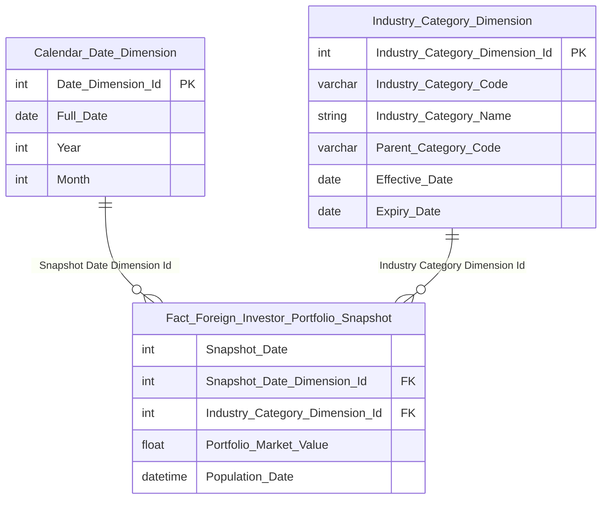
```mermaid
erDiagram
    Calendar_Date_Dimension {
        int Date_Dimension_Id PK
        date Full_Date
        int Year
        int Month
    }
    Industry_Category_Dimension {
        int Industry_Category_Dimension_Id PK
        varchar Industry_Category_Code
        string Industry_Category_Name
        varchar Parent_Category_Code
        date Effective_Date
        date Expiry_Date
    }
    Fact_Foreign_Investor_Portfolio_Snapshot {
        int Snapshot_Date
        int Snapshot_Date_Dimension_Id FK
        int Industry_Category_Dimension_Id FK
        float Portfolio_Market_Value
        datetime Population_Date
    }

    Calendar_Date_Dimension ||--o{ Fact_Foreign_Investor_Portfolio_Snapshot : "Snapshot Date Dimension Id"
    Industry_Category_Dimension ||--o{ Fact_Foreign_Investor_Portfolio_Snapshot : "Industry Category Dimension Id"
```

**Lineage Mart → Báo cáo:**

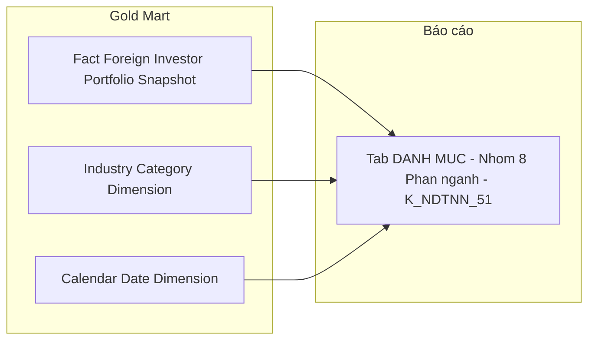
```mermaid
flowchart LR
    subgraph GOLD["Gold Mart"]
        G1["Fact Foreign Investor Portfolio Snapshot"]
        G2["Industry Category Dimension"]
        G3["Calendar Date Dimension"]
    end
    subgraph RPT["Báo cáo"]
        R1["Tab DANH MUC - Nhom 8 Phan nganh - K_NDTNN_51"]
    end
    G1 --> R1
    G2 --> R1
    G3 --> R1
```

**Bảng grain:**

| Tên bảng | Grain |
|---|---|
| Fact Foreign Investor Portfolio Snapshot | 1 row = 1 NĐT NN × 1 mã tài sản × 1 tháng |
| Industry Category Dimension | 1 row = 1 nhóm ngành — ETL extract từ Public Company.Industry Category Level1 Code (IDS) |
| Calendar Date Dimension | 1 row = 1 ngày (ngày cuối tháng) |

---

#### Nhóm 9 — Sở hữu NĐT nước ngoài ROOM (không STT — nguồn IDS)

> Phân loại: **Phân tích**
> Silver: `Public Company Foreign Ownership Limit` (IDS.foreign_owner_limit) + `Foreign Investor Stock Portfolio Snapshot` (FIMS.CATEGORIESSTOCK) — sẵn sàng
> K_NDTNN_45–49: READY. K_NDTNN_50 (Room theo ngành): PENDING — cần join thêm Industry Category

**Mockup** *(theo screenshot)*:

| MÃ "KÍN ROOM" (Foreign Owned = 100%) | | CHẠM NGƯỠNG CẢNH BÁO (Room còn lại < 5%) | |
|:---|---|:---|---|
| FPT | | MWG | 0.5% |
| | | PNJ | 0.8% |

| SỞ HỮU NĐT NƯỚC NGOÀI (ROOM) — Room theo ngành (%) | |
|:---|---:|
| Ngân hàng | 80% |
| Thép / Tài nguyên | 52% |
| Bất động sản | 62% |
| Thực phẩm | 55% |

**Ghi chú thiết kế:**
- `Room tối đa` = `Public Company Foreign Ownership Limit.Max Ownership Rate` (IDS) — grain per công ty × khoảng ngày hiệu lực
- `Tỷ lệ sở hữu hiện tại` = `Foreign Investor Stock Portfolio Snapshot.Ownership Rate` (FIMS) — tổng % per mã CK
- `Room còn lại` = `Max Ownership Rate − Ownership Rate` — tính ở query time
- Fact grain = 1 mã CK × 1 ngày → ETL join FIMS.CATEGORIESSTOCK + IDS.foreign_owner_limit theo mã CK tại ngày snapshot

**Bảng KPI:**

| KPI ID | Tên | Tính chất | Mô tả | Trạng thái |
|---|---|---|---|---|
| K_NDTNN_45 | Tỷ lệ sở hữu (theo mã CK) | Base | `SUM(Ownership Rate)` per mã CK — từ `Fact Foreign Ownership Snapshot` | READY |
| K_NDTNN_46 | Room tối đa | Base | `Max Ownership Rate` — từ `Public Company Foreign Ownership Limit` (IDS) | READY |
| K_NDTNN_47 | Room còn lại (%) | Derived | `K_NDTNN_46 − K_NDTNN_45` — tính query time | READY |
| K_NDTNN_48 | Danh sách kín room (Room còn lại = 0) | Derived | Filter `K_NDTNN_47 = 0` — hiển thị danh sách mã CK | READY |
| K_NDTNN_49 | Danh sách cảnh báo (Room còn lại < 5%) | Derived | Filter `K_NDTNN_47 < 5` ORDER BY Room còn lại ASC | READY |
| K_NDTNN_50 | Room theo ngành (%) | Derived | `SUM(Quantity NĐT) / SUM(Tổng cổ phiếu) × 100%` GROUP BY ngành | PENDING — cần `Industry Category Dimension` |

**Source:** `Fact Foreign Ownership Snapshot` → `Public Company Dimension`, `Calendar Date Dimension`

**Star Schema:**

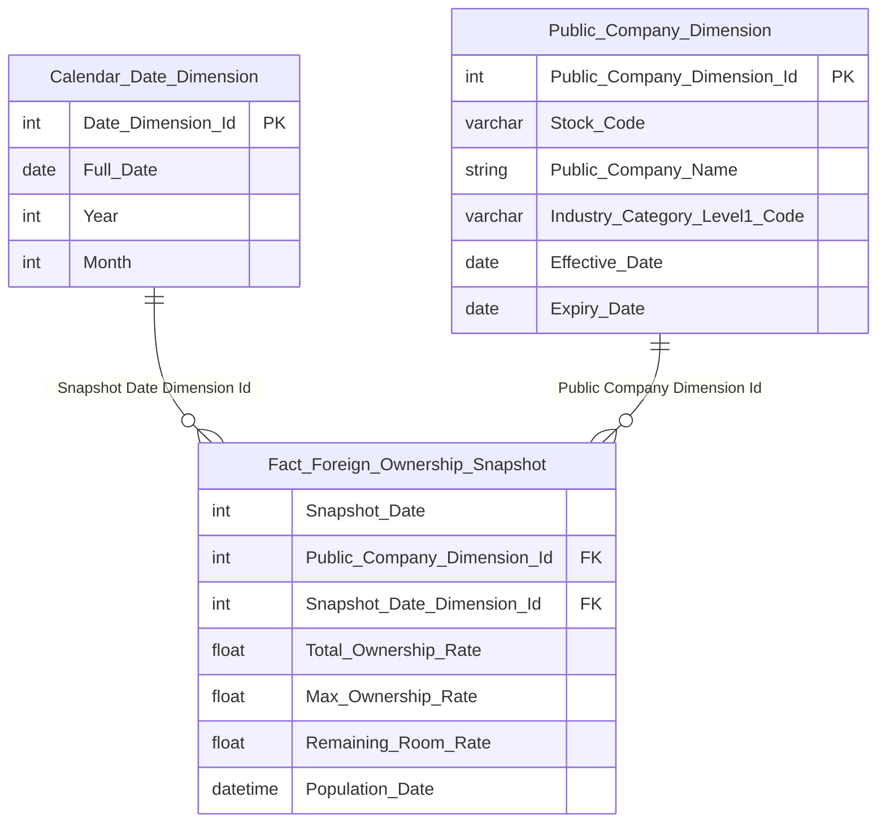
```mermaid
erDiagram
    Calendar_Date_Dimension {
        int Date_Dimension_Id PK
        date Full_Date
        int Year
        int Month
    }
    Public_Company_Dimension {
        int Public_Company_Dimension_Id PK
        varchar Stock_Code
        string Public_Company_Name
        varchar Industry_Category_Level1_Code
        date Effective_Date
        date Expiry_Date
    }
    Fact_Foreign_Ownership_Snapshot {
        int Snapshot_Date
        int Public_Company_Dimension_Id FK
        int Snapshot_Date_Dimension_Id FK
        float Total_Ownership_Rate
        float Max_Ownership_Rate
        float Remaining_Room_Rate
        datetime Population_Date
    }

    Calendar_Date_Dimension ||--o{ Fact_Foreign_Ownership_Snapshot : "Snapshot Date Dimension Id"
    Public_Company_Dimension ||--o{ Fact_Foreign_Ownership_Snapshot : "Public Company Dimension Id"
```

**Lineage Mart → Báo cáo:**

```mermaid
flowchart LR
    subgraph GOLD["Gold Mart"]
        G1["Fact Foreign Ownership Snapshot"]
        G2["Public Company Dimension"]
        G3["Calendar Date Dimension"]
    end
    subgraph RPT["Báo cáo"]
        R1["Tab DANH MUC - Nhom 9 ROOM - K_NDTNN_45-49"]
    end
    G1 --> R1
    G2 --> R1
    G3 --> R1
```

**Bảng grain:**

| Tên bảng | Grain |
|---|---|
| `Fact Foreign Ownership Snapshot` | 1 row = 1 mã CK × 1 ngày snapshot |
| `Public Company Dimension` | 1 row = 1 công ty đại chúng (SCD2) |
| `Calendar Date Dimension` | 1 row = 1 ngày |

---

### Tab: NĐTNN 360

**Mô tả chung:** Tra cứu hồ sơ 360° của từng NĐT nước ngoài. Chọn NĐT qua thanh tìm kiếm (Mã FII hoặc Tên NĐT) → hiển thị 3 sub-tab: Hồ sơ định danh / Biến động tài sản / Lịch sử tuân thủ.

**Slicer chung:** Mã FII hoặc Tên NĐT (search box) + Date picker.

---

#### Danh sách tìm kiếm NĐT

**Mockup:**

| # | Tên NĐT | Mã MSGD | Quốc gia | Loại hình | |
|---|---|---|---|---|---|
| 01 | Công ty A | FII001 | UK/VN | INSTITUTIONAL | 360° → |
| 02 | Quỹ tín dụng B | FII002 | Taiwan | INSTITUTIONAL | 360° → |
| 03 | Công ty C | FII003 | USA/Global | SPECIAL | 360° → |
| 04 | Công ty D | FII004 | USA | INSTITUTIONAL | 360° → |
| 05 | Quỹ tín dụng E | FII005 | Korea | INDIVIDUAL | 360° → |

**Source:** `Foreign Investor 360 Profile`

**Bảng KPI:**

| KPI ID | Tên | Tính chất | Mô tả |
|---|---|---|---|
| K_NDTNN_L1 | Tên NĐT | Attribute | `Foreign Investor 360 Profile.Investor Name` |
| K_NDTNN_L2 | Mã MSGD | Attribute | `Foreign Investor 360 Profile.Investor Code` (= Transaction Code) |
| K_NDTNN_L3 | Quốc gia | Attribute | `Foreign Investor 360 Profile.Nationality Code` |
| K_NDTNN_L4 | Loại hình | Attribute | `Foreign Investor 360 Profile.Investor Type Code` |

---

#### Sub-tab A: Hồ sơ định danh — READY

> Phân loại: **Tác nghiệp**
> Silver: `Foreign Investor` (FIMS.INVESTOR) + `Custodian Bank` (FIMS.BANKMONI)

**Mockup:**

| THÔNG TIN CƠ BẢN | | ĐẠI DIỆN GIAO DỊCH |
|---|---|---|
| QUỐC TỊCH | UK/VN | NGUYỄN VĂN A |
| MÃ SỐ GIAO DỊCH (MSGD) | FII001 | CCCD: 0123xxxx5678 |
| NGÂN HÀNG LƯU KÝ | Ngân hàng A | Status: Verified |
| LOẠI HÌNH NĐT | Institutional | |

**Source:** `Foreign Investor 360 Profile` — lookup 1 NĐT theo Mã FII.

**Bảng KPI:**

| KPI ID | Tên | Tính chất | Mô tả — column trong bảng tác nghiệp |
|---|---|---|---|
| K_NDTNN_P1 | Quốc tịch | Attribute | `Nationality Code` — từ FIMS.INVESTOR.NaId lookup |
| K_NDTNN_P2 | Mã số giao dịch (MSGD) | Attribute | `Investor Code` = Transaction Code — FIMS.INVESTOR.TransactionCode |
| K_NDTNN_P3 | Ngân hàng lưu ký | Attribute | `Custodian Bank Name` — denorm từ FIMS.BANKMONI.Name qua INVESTOR.BankAddId |
| K_NDTNN_P4 | Loại hình NĐT | Attribute | `Investor Type Code` — FIMS.INVESTOR.InvestorTypeId |
| K_NDTNN_P5 | Đại diện giao dịch | Attribute | `Director Name` — FIMS.INVESTOR.Director |

**Schema bảng tác nghiệp:**

```mermaid
erDiagram
    Foreign_Investor_360_Profile {
        varchar Investor_Code PK
        string Investor_Name
        string English_Name
        varchar Investor_Object_Type_Code
        varchar Investor_Type_Code
        varchar Nationality_Code
        string Custodian_Bank_Name
        string Director_Name
        varchar Life_Cycle_Status_Code
        datetime Created_Timestamp
    }
```

**Lineage Mart → Báo cáo:**

```mermaid
flowchart LR
    subgraph GOLD["Gold Mart"]
        G1["Foreign Investor 360 Profile"]
    end
    subgraph RPT["Báo cáo"]
        R1["NDTNN 360 - Danh sach tim kiem - K_NDTNN_L1 L2 L3 L4"]
        R2["NDTNN 360 - Sub-tab A Ho so dinh danh - K_NDTNN_P1 P2 P3 P4 P5"]
    end
    G1 --> R1
    G1 --> R2
```

**Bảng grain:**

| Tên bảng | Grain |
|---|---|
| `Foreign Investor 360 Profile` | 1 row = 1 NĐT NN (trạng thái mới nhất) |

---

#### Sub-tab B: Biến động tài sản — READY

> Phân loại: **Phân tích**
> Silver: `Foreign Investor Stock Portfolio Snapshot` (FIMS.CATEGORIESSTOCK)

**Mockup:**

```
GIÁ TRỊ DANH MỤC HIỆN TẠI
125,000 B

LỊCH SỬ BIẾN ĐỘNG TÀI SẢN (12 THÁNG)
Line chart — Trục X: T1 đến T12 / Trục Y: Giá trị (tỉ đồng)
Series: GIÁ TRỊ DANH MỤC (màu xanh, area fill)
Peak: ~150,000B (T2, T7) / Bottom: ~110,000B (T3)
```

**Source:** `Fact Foreign Investor Portfolio Snapshot` → `Foreign Investor Dimension`, `Calendar Date Dimension`

**Bảng KPI:**

| KPI ID | Tên | Đơn vị | Tính chất | Công thức / Mô tả |
|---|---|---|---|---|
| K_NDTNN_A1 | Giá trị danh mục hiện tại | Tỉ đồng | Stock (Base) | `SUM(Portfolio Market Value)` WHERE `Investor Dimension Id = selected` AND `Snapshot Date = MAX(Snapshot Date)` |
| K_NDTNN_A2 | Lịch sử giá trị danh mục 12 tháng | Tỉ đồng | Stock (Base) | `SUM(Portfolio Market Value)` WHERE `Investor Dimension Id = selected` GROUP BY Snapshot Date, lấy 12 tháng gần nhất |

> **Ghi chú:** Sub-tab B reuse `Fact Foreign Investor Portfolio Snapshot` — cùng fact phục vụ Tab DANH MỤC. Chỉ khác ở filter: thêm `Investor Dimension Id = selected NĐT`. Xem O_NDTNN_5 về nguồn Portfolio Market Value.

**Star Schema:**

```mermaid
erDiagram
    Calendar_Date_Dimension {
        int Date_Dimension_Id PK
        date Full_Date
        int Year
        int Month
    }
    Foreign_Investor_Dimension {
        int Investor_Dimension_Id PK
        int Investor_Id
        string Investor_Name
        varchar Investor_Object_Type_Code
        date Effective_Date
        date Expiry_Date
    }
    Fact_Foreign_Investor_Portfolio_Snapshot {
        int Snapshot_Date
        int Investor_Dimension_Id FK
        int Snapshot_Date_Dimension_Id FK
        float Quantity
        float Ownership_Rate
        float Portfolio_Market_Value
        datetime Population_Date
    }

    Calendar_Date_Dimension ||--o{ Fact_Foreign_Investor_Portfolio_Snapshot : "Snapshot Date Dimension Id"
    Foreign_Investor_Dimension ||--o{ Fact_Foreign_Investor_Portfolio_Snapshot : "Investor Dimension Id"
```

**Lineage Mart → Báo cáo:**

```mermaid
flowchart LR
    subgraph GOLD["Gold Mart"]
        G1["Fact Foreign Investor Portfolio Snapshot"]
        G2["Foreign Investor Dimension"]
        G3["Calendar Date Dimension"]
    end
    subgraph RPT["Báo cáo"]
        R1["NDTNN 360 - Sub-tab B Bien dong tai san - K_NDTNN_A1 A2"]
    end
    G1 --> R1
    G2 --> R1
    G3 --> R1
```

**Bảng grain:**

| Tên bảng | Grain |
|---|---|
| Fact Foreign Investor Portfolio Snapshot | 1 row = 1 NĐT NN × 1 mã tài sản × 1 tháng snapshot |
| Foreign Investor Dimension | 1 row = 1 NĐT NN (SCD2) |
| Calendar Date Dimension | 1 row = 1 ngày (ngày cuối tháng = Snapshot Date) |

---

#### Sub-tab C: Lịch sử tuân thủ — READY

> Phân loại: **Tác nghiệp**
> Silver: `Surveillance Enforcement Case` (TT.GS_HO_SO) + `Surveillance Enforcement Decision` (TT.GS_VAN_BAN_XU_LY)

**Mockup:**

| NGÀY QUYẾT ĐỊNH | PHÂN LOẠI | NỘI DUNG / TRÍCH YẾU | MỨC ĐỘ | TRẠNG THÁI |
|:---|:---|:---|:---|:---|
| 15/10/2023 | REMINDER | Chậm báo cáo tỷ trọng sở hữu | LOW | Resolved |
| 12/05/2023 | ADMINISTRATIVE SANCTION | Giao dịch không công bố đúng thời hạn | MEDIUM | Penalty Paid |

**Source:** `Investor Compliance History` — denormalize từ `Surveillance Enforcement Case` + `Surveillance Enforcement Decision`, filter theo Investor Code = NĐT đang chọn.

**Bảng KPI:**

| KPI ID | Tên | Tính chất | Mô tả — column và Silver source thực tế |
|---|---|---|---|
| K_NDTNN_C1 | Ngày quyết định | Attribute | `Decision Date` — từ GS_VAN_BAN_XU_LY.NGAY_BIEN_BAN. Xem O_NDTNN_8 |
| K_NDTNN_C2 | Phân loại | Attribute | `Decision Status Code` (scheme TT_CASE_STATUS) — từ GS_VAN_BAN_XU_LY.TRANG_THAI. Xem O_NDTNN_8 |
| K_NDTNN_C3 | Nội dung / Trích yếu | Attribute | `Penalty Content` — từ GS_VAN_BAN_XU_LY.NOI_DUNG_XU_PHAT |
| K_NDTNN_C4 | Mức độ | Attribute | `Case Status Code` (scheme TT_CASE_STATUS) — từ GS_HO_SO.TRANG_THAI_ID. Xem O_NDTNN_8 |
| K_NDTNN_C5 | Trạng thái | Attribute | `Decision Status Code` (scheme TT_CASE_STATUS) — từ GS_VAN_BAN_XU_LY.TRANG_THAI |

> **Lưu ý O_NDTNN_8:** Mockup hiển thị Phân loại = REMINDER / ADMINISTRATIVE SANCTION và Mức độ = LOW / MEDIUM / HIGH, nhưng Silver GS_ chỉ có TT_CASE_STATUS cho cả hai trường. Cần xác nhận với BA Thanh Tra cách hiển thị các giá trị này trên UI.

**Schema bảng tác nghiệp:**

```mermaid
erDiagram
    Investor_Compliance_History {
        varchar Investor_Code PK
        varchar Enforcement_Case_Code PK
        varchar Decision_Code PK
        date Decision_Date
        varchar Decision_Status_Code
        string Penalty_Content
        float Total_Penalty_Amount
        varchar Case_Status_Code
        string Case_Content
        varchar Business_Sector_Code
    }
```

**Lineage Mart → Báo cáo:**

```mermaid
flowchart LR
    subgraph GOLD["Gold Mart"]
        G1["Investor Compliance History"]
    end
    subgraph RPT["Báo cáo"]
        R1["NDTNN 360 - Sub-tab C Lich su tuan thu - K_NDTNN_C1 C2 C3 C4 C5"]
    end
    G1 --> R1
```

**Bảng grain:**

| Tên bảng | Grain |
|---|---|
| `Investor Compliance History` | 1 row = 1 quyết định xử phạt / văn bản xử lý của 1 NĐT NN |

---

## Section 3 — Mô hình tổng thể (READY only)

```mermaid
graph TB
    classDef dim fill:#E6F1FB,stroke:#185FA5,color:#0C447C
    classDef fact fill:#FAECE7,stroke:#993C1D,color:#4A1B0C
    classDef oper fill:#E8F5E9,stroke:#2E7D32,color:#1B5E20

    DIM_DATE["Calendar Date Dimension"]:::dim
    DIM_INVESTOR["Foreign Investor Dimension SCD2"]:::dim
    DIM_GEO["Geographic Area Dimension SCD2"]:::dim
    DIM_ASSET["Asset Category Dimension SCD2"]:::dim

    FACT_REG["Fact Foreign Investor Registration"]:::fact
    FACT_PORT["Fact Foreign Investor Portfolio Snapshot"]:::fact
    FACT_FLOW["Fact Foreign Investor Capital Flow"]:::fact

    OPR_PROFILE["Foreign Investor 360 Profile"]:::oper
    OPR_COMPLY["Investor Compliance History"]:::oper

    DIM_DATE --> FACT_REG
    DIM_INVESTOR --> FACT_REG

    DIM_DATE --> FACT_PORT
    DIM_INVESTOR --> FACT_PORT
    DIM_GEO --> FACT_PORT
    DIM_ASSET --> FACT_PORT

    DIM_DATE --> FACT_FLOW
    DIM_INVESTOR --> FACT_FLOW
    DIM_GEO --> FACT_FLOW
```

### Bảng Phân tích (Star Schema)

| Bảng | Pattern | Grain | KPI | Trạng thái |
|---|---|---|---|---|
| Fact Foreign Investor Registration | Event | 1 NĐT × 1 ngày đăng ký | K_NDTNN_5–7 | READY |
| Fact Foreign Investor Portfolio Snapshot | Periodic Snapshot | 1 NĐT × 1 mã tài sản × 1 tháng | K_NDTNN_34–44, 51, A1–A2 | READY |
| Fact Foreign Investor Capital Flow | Event | 1 sự kiện vào/ra vốn × 1 NĐT × 1 ngày | K_NDTNN_23–25, 26–33 | READY |
| Fact Foreign Ownership Snapshot | Periodic Snapshot | 1 mã CK × 1 ngày | K_NDTNN_45–49 | READY |
| Fact Securities Foreign Trading Snapshot | Periodic Snapshot | 1 mã CK × 1 ngày GD | K_NDTNN_1–4, 8–16, 17–19, 21, 22 | PENDING — chờ Silver SGDCK |
| Fact Market Index Snapshot | Periodic Snapshot | 1 chỉ số × 1 ngày | K_NDTNN_24b | PENDING — chờ Silver SGDCK |

### Bảng Tác nghiệp (Denormalized)

| Bảng | Grain | KPI | Trạng thái |
|---|---|---|---|
| Foreign Investor 360 Profile | 1 NĐT (trạng thái mới nhất) | K_NDTNN_L1–L4, P1–P5 | READY |
| Investor Compliance History | 1 quyết định xử phạt per NĐT | K_NDTNN_C1–C5 | READY |

### Dimension

| Dimension | Loại | Mô tả | Trạng thái |
|---|---|---|---|
| Calendar Date Dimension | Conformed | Lịch ngày — tĩnh / generated | READY |
| Foreign Investor Dimension | Conformed SCD2 | NĐTNN — Mã GD / Tên / ObjectType / Loại hình / Quốc tịch / FK NHLK | READY |
| Geographic Area Dimension | Conformed SCD2 | Quốc gia / quốc tịch — FIMS.NATIONAL | READY |
| Asset Category Dimension | Reference SCD2 | Loại hình tài sản (5 giá trị). Xem O_NDTNN_9 | READY |

| Public Company Dimension | Reference SCD2 | Công ty đại chúng — IDS.company_profiles. Chứa Stock Code + Industry Category | READY |
| Industry Category Dimension | Conformed SCD2 | Nhóm ngành — ETL extract từ Public Company.Industry Category Level1/Level2 Code (IDS). Tái sử dụng cross-module | READY |
| Listed Security Dimension | Conformed SCD2 | Mã CK — SGDCK | PENDING — chờ Silver SGDCK |

---

## Section 4 — Vấn đề mở

| ID | Vấn đề | Giả định hiện tại | KPI liên quan | Trạng thái |
|---|---|---|---|---|
| O_NDTNN_1 | **Registration Date:** `FIMS.INVESTOR.DateCreated` là ngày tạo hồ sơ trên hệ thống — có thể khác ngày cấp mã GD thực tế nếu NĐT import từ VSDC batch. Cần xác nhận với BA field nào là ngày đăng ký chính thức. | Tạm dùng `DateCreated`. Nếu BA xác nhận field khác → update Silver LLD + ETL rule. | K_NDTNN_5–7 | Open |
| O_NDTNN_2 | **Investor Object Type mapping:** `FIMS.INVESTOR.ObjectType` là INT (1=Cá nhân / 2=Tổ chức). Tổ chức bao gồm cả Quỹ và Tổ chức khác quỹ. Cần xác nhận ETL phân biệt Quỹ vs Tổ chức khác từ `ObjectType=2` hay cần join thêm `INVESTORTYPE`. | Tạm gộp chung `ObjectType=2` → filter thêm `INVESTORTYPE` để tách nếu cần. | K_NDTNN_6, K_NDTNN_7 | Open |
| O_NDTNN_3 | **Tỷ lệ tham gia + GT mua/bán ròng + Tỷ trọng GD (STT 1–4, 8–19, 21):** Toàn bộ phụ thuộc Silver SGDCK chưa có. | Thiết kế bổ sung khi Silver SGDCK sẵn sàng — không ảnh hưởng thiết kế hiện tại. | K_NDTNN_1–4, 8–19, 21 | Open — chờ Silver SGDCK |
| O_NDTNN_4 | **Industry source — đã xác định là IDS:** BA ghi `IDS - GSĐC` nhưng ngành nghề công ty đại chúng nằm trong `Public Company` (IDS.company_profiles → category_l1_id/l2_id). Silver READY. Join chain: FIMS.CATEGORIESSTOCK (mã CK) → `Public Company` (IDS, có ngành) → `Industry Category Dimension`. | Thiết kế theo IDS — `Industry Category Dimension` READY. | STT 13–14, Nhóm 8 | Closed |
| O_NDTNN_5 | **Portfolio Market Value source:** Silver `CATEGORIESSTOCK` chỉ có `Quantity` và `Ownership Rate` — không có giá trị thị trường tính sẵn. Cần giá đóng cửa CK từ SGDCK để tính `Portfolio Market Value = Quantity × giá`. Cần kiểm tra FIMS.RPTVALUES trước. | Tạm ghi ETL derived — pending xác nhận nguồn. | K_NDTNN_34–44, A1–A2 | Open |
| O_NDTNN_6 | **Silver Thanh Tra:** Đã có `Surveillance Enforcement Case` + `Surveillance Enforcement Decision`. Đã thiết kế `Investor Compliance History`. | Đã giải quyết. | K_NDTNN_C1–C5 | Closed |
| O_NDTNN_7 | **FK NĐT trong GS_HO_SO:** Silver chỉ có `Subject Name` (text tự do — `GS_HO_SO.TEN_DOI_TUONG`) — không có FK sang `FIMS.INVESTOR`. ETL phải resolve qua text matching hoặc lookup bảng khác. | Tạm giả định resolve qua Subject Name match với `INVESTOR.name`. | K_NDTNN_C1–C5 | Open |
| O_NDTNN_8 | **Phân loại và Mức độ trên Sub-tab C:** Mockup hiển thị `REMINDER / ADMINISTRATIVE SANCTION` và `LOW / MEDIUM / HIGH` nhưng Silver GS_ chỉ có scheme `TT_CASE_STATUS`. Cần xác nhận với BA Thanh Tra. | Tạm map K_NDTNN_C2 = `Decision Status Code` và K_NDTNN_C4 = `Case Status Code`. | K_NDTNN_C2, K_NDTNN_C4 | Open |
| O_NDTNN_9 | **Asset Category scheme:** 5 loại tài sản trong BRD cần mapping với scheme `FIMS_SECURITIES_TYPE`. Code cụ thể chưa profile. | Placeholder code (LISTED_EQUITY / BOND / UPCOM / OTHER_EQUITY / CASH) — chờ BA/Silver confirm. | K_NDTNN_40–44 | Open |
| O_NDTNN_10 | **ROOM source — đã xác định là IDS:** `Public Company Foreign Ownership Limit` (IDS.foreign_owner_limit) có `Max Ownership Rate` = Room tối đa. Thiết kế `Fact Foreign Ownership Snapshot` = join FIMS.CATEGORIESSTOCK (Ownership Rate) + IDS.foreign_owner_limit (Max Ownership Rate) theo mã CK. K_NDTNN_45–49 READY. K_NDTNN_50 (Room theo ngành) PENDING vì cần thêm Industry Category join. | Thiết kế theo IDS. K_NDTNN_45–49 đã có mart. | K_NDTNN_45–50 | Closed |
| O_NDTNN_11 | **Room theo ngành (K_NDTNN_50):** Cần tính `SUM(Quantity NĐT) / SUM(Tổng cổ phiếu niêm yết) × 100%` GROUP BY ngành. Phân tử lấy từ `Fact Foreign Ownership Snapshot`, mẫu số cần tổng cổ phiếu niêm yết per mã CK — Silver chưa có. | Thiết kế bổ sung khi có nguồn tổng cổ phiếu lưu hành. | K_NDTNN_50 | Open — chờ nguồn tổng CP |