# Data Mart Design — Nhà Đầu Tư Nước Ngoài (NDTNN)

**Phiên bản:** 8.2  
**Ngày:** 16/04/2026  
**Phạm vi:** Dashboard NĐTNN — Tab GIAO DỊCH (3 nhóm) + Tab GIÁM SÁT DÒNG VỐN (3 nhóm) + Tab DANH MỤC VÀ RỦI RO (6 nhóm) + Tab NĐTNN 360 (2 nhóm)  
**Mô hình:** Star Schema thuần túy (không snowflake)  
**File BA nguồn:** BA_analyst_NDTNN.xlsx (STT 1–69)  
**Thay đổi v8.2:** Bổ sung Tab NĐTNN 360 (Nhóm 13 Hồ sơ định danh + Nhóm 14 Lịch sử tuân thủ chờ Silver). Tách Custodian Bank Dimension + thêm FK trên Fact Foreign Investor Snapshot. Foreign Investor Dim thêm Nationality Code/Name + Director Name. Thêm O6 (Silver Thanh tra).

---

## 1. Tổng quan báo cáo

### 1.1 Dashboard: Giao dịch NĐTNN — Tab GIAO DỊCH

**Slicer chung:** Ngày (date picker: 31/12/2024)

Giao diện gồm **3 nhóm**:

| Nhóm | Nội dung | Slicer riêng |
|------|---------|-------------|
| 1 | KPI Cards — Tỷ lệ tham gia + Tăng trưởng NĐT mới | Ngày |
| 2 | Tổng giá trị mua/bán ròng + Lũy kế + Top ngành/mã | Kỳ (Ngày/Tháng), Từ — Đến |
| 3 | Tỷ trọng giao dịch NĐTNN + TB phiên + Theo ngành + Top mã | Từ ngày — Đến ngày |

---

#### Nhóm 1 — KPI Cards

**Mockup:**

| Tỷ lệ tham gia | Tăng trưởng NĐT mới | Tăng trưởng NĐT (Cá nhân) mới | Tăng trưởng NĐT (Tổ chức) mới |
| :---: | :---: | :---: | :---: |
| **12.4** % | **2,450** Mã | **1,830** Mã | **620** Mã |

**Source:** K_NDTNN_1–4 từ `Fact Securities Foreign Trading Snapshot` → `Listed Security Dimension`, `Industry Dimension`, `Calendar Date Dimension`; K_NDTNN_5–7 từ `Fact Foreign Investor Snapshot` → `Foreign Investor Dimension`, `Calendar Date Dimension`

**KPI:**

| # | Tên KPI | Đơn vị | Tính chất | Mô tả |
|---|---------|--------|-----------|-------|
| K_NDTNN_1 | Tỷ lệ tham gia | % | Derived (Flow-based ratio) | (SUM Foreign Investor Buy Value + SUM Foreign Investor Sell Value) × 100 / (SUM Total Market Value × 2). Filter: Snapshot Date = ngày chọn |
| K_NDTNN_2 | Tổng giá trị mua của NĐTNN | VNĐ | Flow | SUM Foreign Investor Buy Value. Filter: Snapshot Date = ngày chọn |
| K_NDTNN_3 | Tổng giá trị bán của NĐTNN | VNĐ | Flow | SUM Foreign Investor Sell Value. Filter: Snapshot Date = ngày chọn |
| K_NDTNN_4 | Tổng giá trị GD toàn thị trường | VNĐ | Flow | SUM Total Market Value. Filter: Snapshot Date = ngày chọn |
| K_NDTNN_5 | Tăng trưởng NĐT mới | Mã | Flow | COUNT(*) tại Snapshot Date = ngày chọn − COUNT(*) tại Snapshot Date = 31/12 năm trước. Luỹ kế NĐT tăng mới từ đầu năm tới thời điểm tra cứu |
| K_NDTNN_6 | NĐT mới — Cá nhân | Mã | Flow | K5 JOIN Foreign Investor Dimension WHERE Investor Type Code = 'INDIVIDUAL' |
| K_NDTNN_7 | NĐT mới — Tổ chức | Mã | Flow | K5 JOIN Foreign Investor Dimension WHERE Investor Type Code IN ('FUND', 'OTHER_ORG'). Tổ chức = Quỹ + Tổ chức khác quỹ |

**Star schema — K1–K4:**

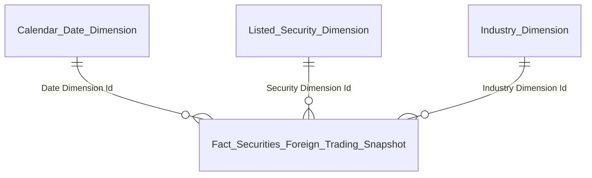

| Tên bảng (Logical) | Grain |
|---|---|
| Fact Securities Foreign Trading Snapshot | 1 row = 1 Mã CK × 1 ngày giao dịch |
| Listed Security Dimension | 1 row = 1 mã CK (SCD2) |
| Industry Dimension | 1 row = 1 ngành (SCD2) |
| Calendar Date Dimension | 1 row = 1 ngày snapshot |

**Star schema — K5–K7:**

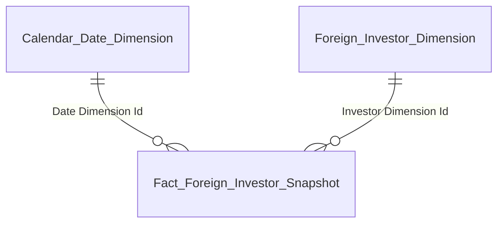

| Tên bảng (Logical) | Grain |
|---|---|
| Fact Foreign Investor Snapshot | 1 row = 1 NĐTNN × 1 Snapshot Date (daily) |
| Foreign Investor Dimension | 1 row = 1 NĐTNN (SCD2) |
| Calendar Date Dimension | 1 row = 1 ngày snapshot |

---

#### Nhóm 2 — Tổng giá trị mua/bán ròng của NĐTNN

**Mockup (bar chart — xanh: mua ròng dương, đỏ: bán ròng âm):**

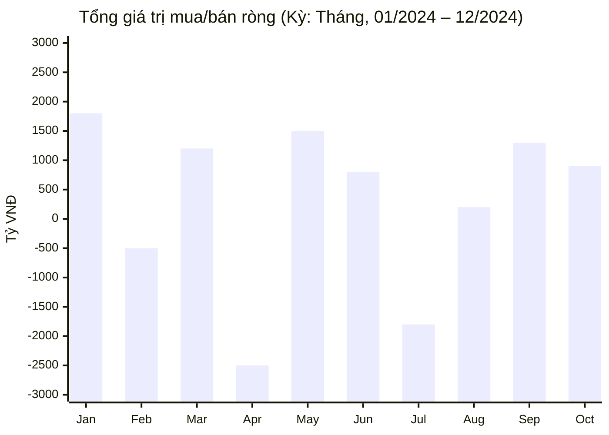

| Lũy kế mua/bán ròng |
| :---: |
| **-8,300 B** |

| Top ngành bán ròng | | Top ngành mua ròng | | Top mã bán ròng | | Top mã mua ròng |
|---|---|---|---|---|---|---|
| Bất động sản: -1200B | | Ngân hàng: +4500B | | VHM: -700B | | HPG: +3300B |
| Thực phẩm: -450B | | Thép/Tài nguyên: +2800B | | MSN: -400B | | VCB: +600B |

**Source:** `Fact Securities Foreign Trading Snapshot` → `Listed Security Dimension`, `Industry Dimension`, `Calendar Date Dimension`

**KPI:**

| # | Tên KPI | Đơn vị | Tính chất | Mô tả |
|---|---------|--------|-----------|-------|
| K_NDTNN_8 | Giá trị mua/bán ròng | VNĐ | Flow | SUM(Foreign Investor Buy Value − Foreign Investor Sell Value) per Mã CK. Group by Kỳ (Ngày/Tháng) trong khoảng Từ — Đến |
| K_NDTNN_9 | Lũy kế mua/bán ròng | VNĐ | Flow | SUM K8 toàn bộ khoảng thời gian đã chọn |
| K_NDTNN_10 | Top ngành bán ròng | VNĐ | Derived | K8 GROUP BY Industry Dimension.Industry Name → RANK ASC → TOP 5 |
| K_NDTNN_11 | Top ngành mua ròng | VNĐ | Derived | K8 GROUP BY Industry Dimension.Industry Name → RANK DESC → TOP 5 |
| K_NDTNN_12 | Top mã bán ròng | VNĐ | Derived | K8 GROUP BY Listed Security Dimension.Ticker Code → RANK ASC → TOP 5 |
| K_NDTNN_13 | Top mã mua ròng | VNĐ | Derived | K8 GROUP BY Listed Security Dimension.Ticker Code → RANK DESC → TOP 5 |

**Star schema — K8–K13:** (cùng Nhóm 1 K1–K4)

---

#### Nhóm 3 — Tỷ trọng giao dịch NĐTNN

**Mockup (line chart):**

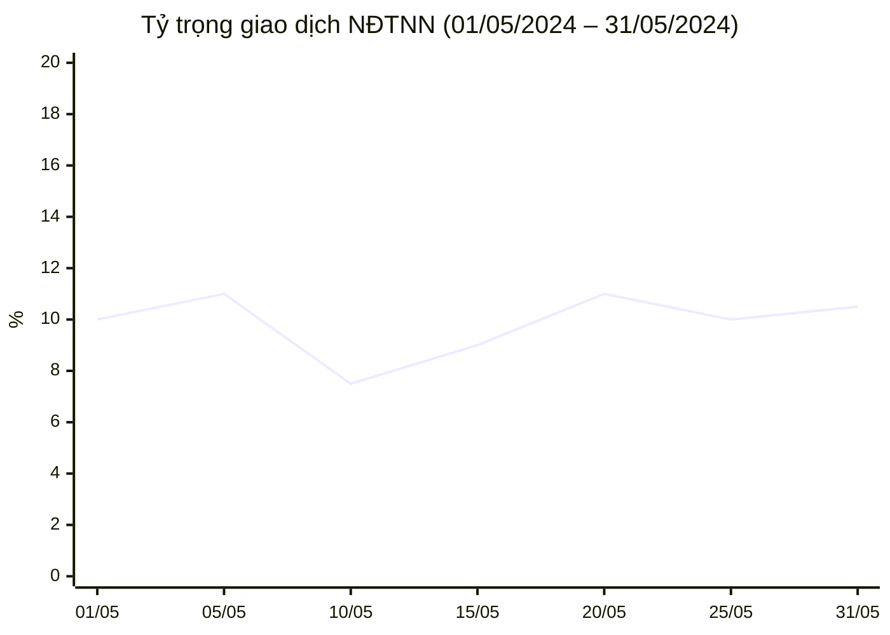

| Tỷ trọng TB phiên |
| :---: |
| **12.4%** |

| Tỷ trọng theo ngành | | Top mã tỷ trọng cao |
|---|---|---|
| Công nghệ: 14.7% | | PNJ: 58.3% |
| Ngân hàng: 12.3% | | FPT: 54.2% |

**Source:** `Fact Securities Foreign Trading Snapshot` → `Listed Security Dimension`, `Industry Dimension`, `Calendar Date Dimension`

**KPI:**

| # | Tên KPI | Đơn vị | Tính chất | Mô tả |
|---|---------|--------|-----------|-------|
| K_NDTNN_14 | Tỷ trọng giao dịch theo ngày | % | Derived (Flow-based ratio) | (SUM Foreign Investor Buy Value + SUM Foreign Investor Sell Value) × 100 / (SUM Total Market Value × 2) per ngày |
| K_NDTNN_15 | Tổng giá trị GD NĐTNN | VNĐ | Flow | SUM(Foreign Investor Buy Value + Foreign Investor Sell Value) |
| K_NDTNN_16 | Tỷ trọng TB phiên | % | Chỉ tiêu phái sinh | Tính từ K14: SUM(K14 per ngày) / COUNT(số ngày giao dịch thực tế trong kỳ). Fact cung cấp 3 measure cơ sở — logic tính K16 xử lý tại presentation layer |
| K_NDTNN_17 | Tỷ trọng theo ngành | % | Derived (Flow-based ratio) | Tỷ trọng GD của NĐTNN trong từng ngành = SUM(Foreign Investor Buy Value + Foreign Investor Sell Value) per Industry × 100 / (SUM Total Market Value per Industry × 2). TOP 5 |
| K_NDTNN_18 | Top mã tỷ trọng cao | % | Derived (Flow-based ratio) | SUM(Foreign Investor Buy Value + Foreign Investor Sell Value) per Ticker × 100 / (SUM Total Market Value per Ticker × 2). TOP 5 |

**Star schema — K14–K18:** (cùng Nhóm 2)

---

### 1.2 Dashboard: Giám sát dòng vốn — Tab GIÁM SÁT DÒNG VỐN

**Slicer chung:** Từ ngày — Đến ngày (01/01/2024 — 31/12/2024)

Giao diện gồm **3 nhóm**:

| Nhóm | Nội dung | Slicer riêng |
|------|---------|-------------|
| 4 | KPI Cards — Dòng tiền vào / ra / ròng (IICA) | Từ ngày — Đến ngày |
| 5 | Tương quan Net Flow & VN-Index (3 line series theo tháng) | Từ ngày — Đến ngày |
| 6 | Dòng vốn đầu tư gián tiếp nước ngoài (stacked bar + Top QG/NĐT) | Từ ngày — Đến ngày |

---

#### Nhóm 4 — KPI Cards (Dòng tiền IICA)

**Mockup:**

| Dòng tiền vào | Dòng tiền ra | Dòng tiền ròng (IICA) |
| :---: | :---: | :---: |
| **1,284.3** Tỉ đồng | **1,736.8** Tỉ đồng | **-452.5** Tỉ đồng |

**Source:** `Fact Foreign Investor Capital Flow` → `Calendar Date Dimension`

**KPI:**

| # | Tên KPI | Đơn vị | Tính chất | Mô tả |
|---|---------|--------|-----------|-------|
| K_NDTNN_19 | Dòng tiền vào | Tỉ đồng | Flow | SUM Capital Inflow Amount trong khoảng Từ ngày — Đến ngày |
| K_NDTNN_20 | Dòng tiền ra | Tỉ đồng | Flow | SUM Capital Outflow Amount trong khoảng Từ ngày — Đến ngày |
| K_NDTNN_21 | Dòng tiền ròng (IICA) | Tỉ đồng | Derived | K19 − K20 |

**Star schema — K19–K21:**

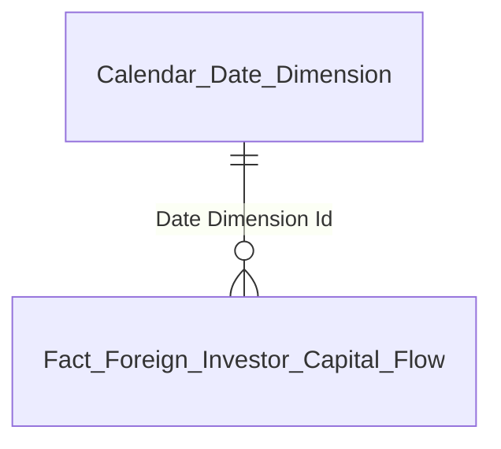

| Tên bảng (Logical) | Grain |
|---|---|
| Fact Foreign Investor Capital Flow | 1 row = 1 NĐTNN × 1 kỳ nửa tháng |
| Calendar Date Dimension | 1 row = 1 ngày |

> **Ghi chú:** Nhóm 4 chỉ cần SUM toàn bộ fact filter theo date range — không cần JOIN sang Foreign Investor Dimension hay Geographic Area Dimension. 2 dim đó có FK trên fact nhưng phục vụ Nhóm 6.

---

#### Nhóm 5 — Tương quan Net Flow & VN-Index

**Mockup (3 line series theo tháng — dual Y-axis):**

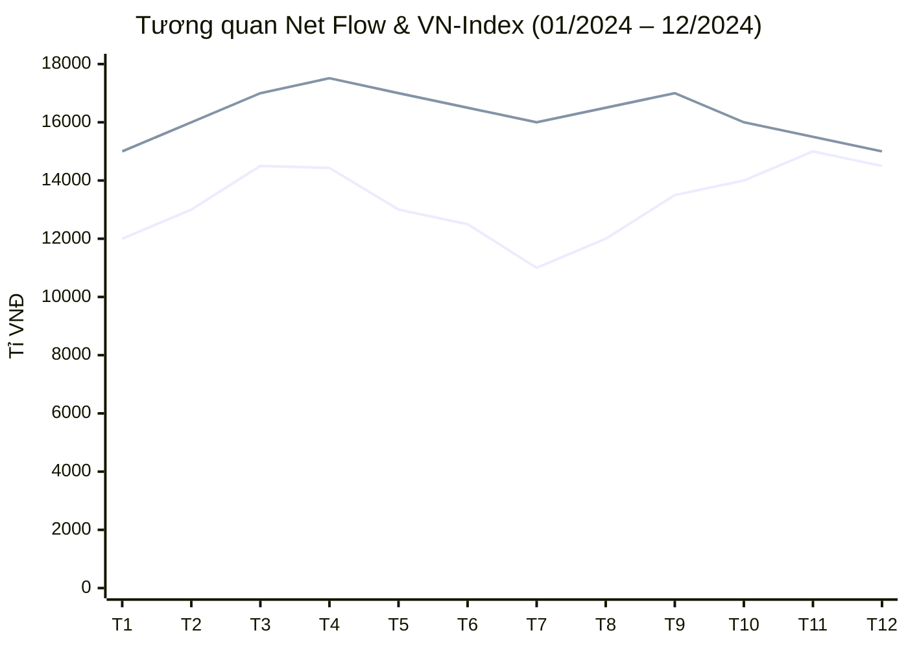

| Legend | Series | Y-axis | Fact source |
|-------|--------|--------|-------------|
| 🔴 MUA/BÁN RÒNG | Giá trị mua/bán ròng hàng tháng | Trái (VNĐ) | Fact Securities Foreign Trading Snapshot |
| 🟢 DÒNG TIỀN RÒNG | Dòng tiền ròng luỹ kế hàng tháng | Trái (VNĐ) | Fact Foreign Investor Capital Flow |
| 🔵 VN-INDEX | Điểm đóng cửa VN-Index cuối tháng | Phải (Điểm) | Fact Market Index Snapshot |

> **Ghi chú thiết kế:** 3 series từ **3 fact riêng biệt** — không cross-fact join. Presentation layer chịu trách nhiệm: (1) Query 3 fact riêng biệt, (2) Align kết quả theo trục tháng chung, (3) Render dual Y-axis (trái: VNĐ cho K22/K23, phải: Điểm cho K24).

**KPI:**

| # | Tên KPI | Đơn vị | Tính chất | Mô tả | Fact source |
|---|---------|--------|-----------|-------|-------------|
| K_NDTNN_22 | Mua/Bán ròng (tháng) | VNĐ | Flow | = K8 aggregate by tháng: SUM(Foreign Investor Buy Value − Foreign Investor Sell Value) GROUP BY tháng | Fact Securities Foreign Trading Snapshot |
| K_NDTNN_23 | Dòng tiền ròng luỹ kế (tháng) | Tỉ đồng | Flow | SUM(Capital Inflow Amount − Capital Outflow Amount) luỹ kế từ đầu kỳ chọn tới cuối từng tháng. Cùng logic K21 nhưng hiển thị running cumulative per tháng trên biểu đồ thay vì 1 con số duy nhất | Fact Foreign Investor Capital Flow |
| K_NDTNN_24 | Điểm đóng cửa VN-Index | Điểm | Stock | Closing Value tại ngày giao dịch cuối cùng của mỗi tháng | Fact Market Index Snapshot |

**Star schema — K22 (Mua/Bán ròng):**

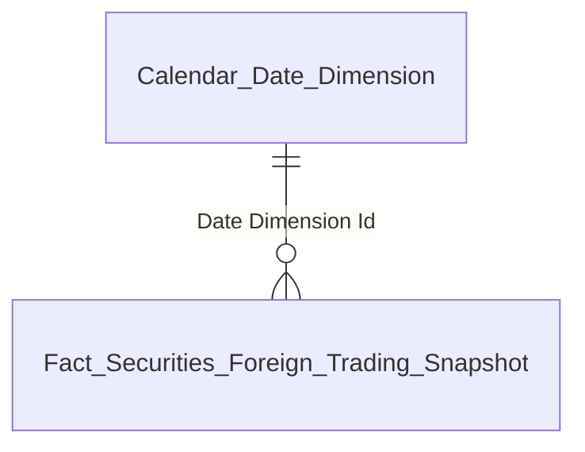

| Tên bảng (Logical) | Grain |
|---|---|
| Fact Securities Foreign Trading Snapshot | 1 row = 1 Mã CK × 1 ngày giao dịch |
| Calendar Date Dimension | 1 row = 1 ngày snapshot |

**Star schema — K23 (Dòng tiền ròng luỹ kế):**

| Tên bảng (Logical) | Grain |
|---|---|
| Fact Foreign Investor Capital Flow | 1 row = 1 NĐTNN × 1 kỳ nửa tháng |
| Calendar Date Dimension | 1 row = 1 ngày |

**Star schema — K24 (VN-Index):**

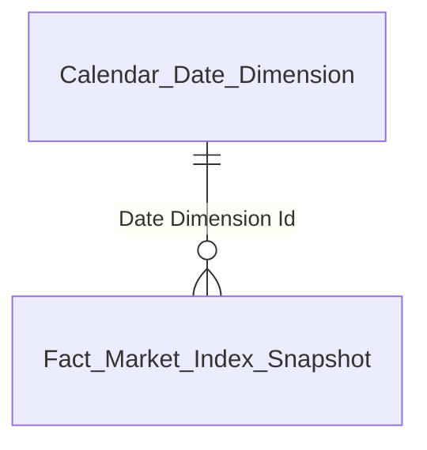

| Tên bảng (Logical) | Grain |
|---|---|
| Fact Market Index Snapshot | 1 row = 1 Index × 1 ngày |
| Calendar Date Dimension | 1 row = 1 ngày |

---

#### Nhóm 6 — Dòng vốn đầu tư gián tiếp nước ngoài

**Mockup (stacked bar chart theo tháng — 3 segments):**

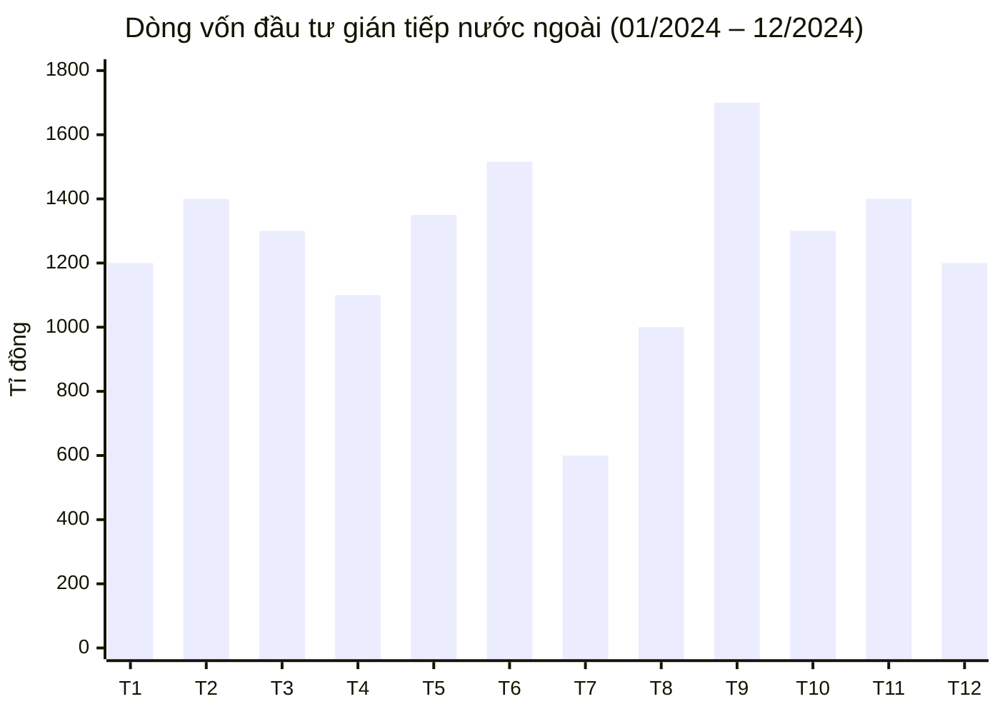

Legend: 🟢 CÁ NHÂN | 🔵 QUỸ | 🟣 TỔ CHỨC KHÁC QUỸ

| Top QG vào ròng | | Top QG rút ròng | | Top NĐT vào ròng | | Top NĐT rút ròng |
|---|---|---|---|---|---|---|
| Singapore: +450B | | Trung Quốc: -380B | | Dragon Cap.: +185B | | iShares MSCI: -210B |
| Hoa Kỳ: +320B | | Đài Loan: -210B | | Fubon ETF: +162B | | KIM Vietnam: -178B |

**Source:** `Fact Foreign Investor Capital Flow` → `Foreign Investor Dimension` (Investor Type Code / Investor Name), `Geographic Area Dimension` (Country Name), `Calendar Date Dimension`

**KPI:**

| # | Tên KPI | Đơn vị | Tính chất | Mô tả |
|---|---------|--------|-----------|-------|
| K_NDTNN_25 | Dòng vốn ròng theo loại hình | Tỉ đồng | Flow | SUM(Capital Inflow Amount − Capital Outflow Amount) GROUP BY Investor Type Code, GROUP BY tháng |
| K_NDTNN_25a | Cá nhân | Tỉ đồng | Flow | K25 WHERE Investor Type Code = 'INDIVIDUAL' |
| K_NDTNN_25b | Quỹ | Tỉ đồng | Flow | K25 WHERE Investor Type Code = 'FUND' |
| K_NDTNN_25c | Tổ chức khác quỹ | Tỉ đồng | Flow | K25 WHERE Investor Type Code = 'OTHER_ORG' |
| K_NDTNN_26 | Top 5 QG vào ròng | Tỉ đồng | Derived | SUM(Capital Inflow − Capital Outflow) GROUP BY Country Name → filter dương → TOP 5 DESC |
| K_NDTNN_27 | Top 5 QG rút ròng | Tỉ đồng | Derived | SUM(Capital Inflow − Capital Outflow) GROUP BY Country Name → filter âm → TOP 5 ASC |
| K_NDTNN_28 | Top 5 NĐT vào ròng | Tỉ đồng | Derived | SUM(Capital Inflow − Capital Outflow) GROUP BY Investor Name → filter dương → TOP 5 DESC |
| K_NDTNN_29 | Top 5 NĐT rút ròng | Tỉ đồng | Derived | SUM(Capital Inflow − Capital Outflow) GROUP BY Investor Name → filter âm → TOP 5 ASC |

**Star schema — K25–K29:**

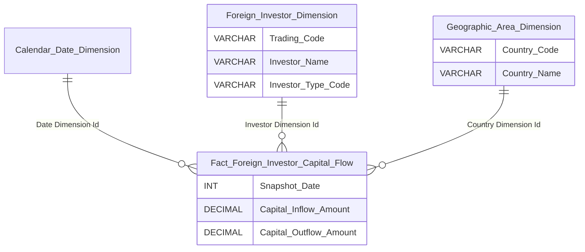

| Tên bảng (Logical) | Grain |
|---|---|
| Fact Foreign Investor Capital Flow | 1 row = 1 NĐTNN × 1 kỳ nửa tháng |
| Foreign Investor Dimension | 1 row = 1 NĐTNN (SCD2) |
| Geographic Area Dimension | 1 row = 1 quốc gia (SCD2) |
| Calendar Date Dimension | 1 row = 1 ngày |

---

### 1.3 Dashboard: Danh mục và Rủi ro — Tab DANH MỤC VÀ RỦI RO

**Slicer chung:** Kỳ (Tháng + Năm) cho danh mục / Ngày (date picker) cho ROOM

Giao diện gồm **6 nhóm**:

| Nhóm | Nội dung | Slicer riêng |
|------|---------|-------------|
| 7 | KPI Card — Tổng giá trị danh mục | Kỳ (Tháng + Năm) |
| 8 | Top giá trị danh mục (Quốc gia / NĐT) | Kỳ (Tháng + Năm) |
| 9 | Cơ cấu danh mục theo loại hình tài sản (Donut chart) | Tháng + Năm |
| 10 | Bản đồ nhiệt phân ngành (Treemap) | Tháng + Năm |
| 11 | Sở hữu NĐT nước ngoài ROOM (Room ngành + Top cạn kiệt) | Ngày |
| 12 | Cảnh báo Room (Kín Room 100% + Chạm ngưỡng < 5%) | Ngày |

---

#### Nhóm 7 — KPI Card Tổng giá trị danh mục

**Mockup:**

| Tổng giá trị danh mục |
| :---: |
| **1,315** Tỉ đồng |

**Source:** `Fact Foreign Investor Portfolio Snapshot` → `Calendar Date Dimension`

> **Ghi chú:** K30 chỉ cần SUM toàn bộ fact filter theo tháng/năm — không cần JOIN sang Foreign Investor / Geographic Area / Asset Category / Industry. Các dim đó có FK trên fact nhưng phục vụ Nhóm 8–10.

**KPI:**

| # | Tên KPI | Đơn vị | Tính chất | Mô tả |
|---|---------|--------|-----------|-------|
| K_NDTNN_30 | Tổng giá trị danh mục | Tỉ đồng | Stock | SUM Portfolio Market Value. Filter: tháng/năm chọn |

**Star schema — K30:**

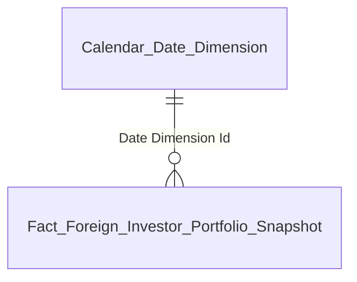

| Tên bảng (Logical) | Grain |
|---|---|
| Fact Foreign Investor Portfolio Snapshot | 1 row = 1 NĐTNN × 1 Mã tài sản × 1 tháng |
| Calendar Date Dimension | 1 row = 1 ngày |

---

#### Nhóm 8 — Top giá trị danh mục

**Mockup:**

| Top Quốc gia | | Top NĐT |
|---|---|---|
| Singapore: 312.4B | | Dragon Capital: 198.5B |
| Hoa Kỳ: 284.1B | | VinaCapital: 167.3B |
| Nhật Bản: 198.7B | | Fubon ETF: 145.8B |
| Hàn Quốc: 156.2B | | Mirae Asset: 128.4B |
| Châu Âu: 134.8B | | SSIAM VN30: 112.6B |

**Source:** `Fact Foreign Investor Portfolio Snapshot` → `Foreign Investor Dimension`, `Geographic Area Dimension`, `Calendar Date Dimension`

**KPI:**

| # | Tên KPI | Đơn vị | Tính chất | Mô tả |
|---|---------|--------|-----------|-------|
| K_NDTNN_31 | Top 5 quốc gia | Tỉ đồng | Derived | SUM Portfolio Market Value GROUP BY Country Name → TOP 5 DESC |
| K_NDTNN_32 | Top 5 NĐT | Tỉ đồng | Derived | SUM Portfolio Market Value GROUP BY Investor Name → TOP 5 DESC |

**Star schema — K31–K32:**

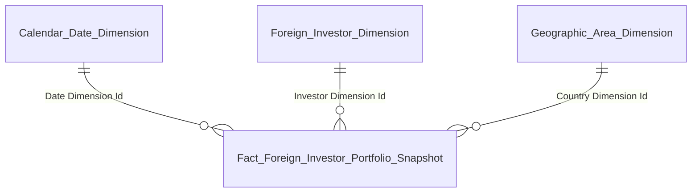

| Tên bảng (Logical) | Grain |
|---|---|
| Fact Foreign Investor Portfolio Snapshot | 1 row = 1 NĐTNN × 1 Mã tài sản × 1 tháng |
| Foreign Investor Dimension | 1 row = 1 NĐTNN (SCD2) |
| Geographic Area Dimension | 1 row = 1 quốc gia (SCD2) |
| Calendar Date Dimension | 1 row = 1 ngày |

---

#### Nhóm 9 — Cơ cấu danh mục theo loại hình tài sản

**Mockup (donut chart):**

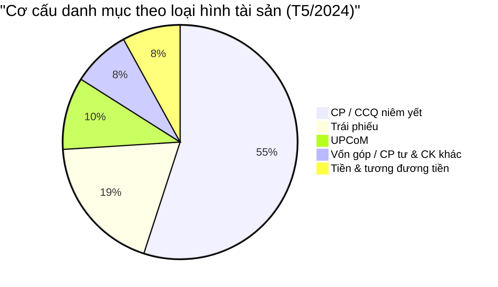

**Source:** `Fact Foreign Investor Portfolio Snapshot` → `Asset Category Dimension`, `Calendar Date Dimension`

**KPI:**

| # | Tên KPI | Đơn vị | Tính chất | Mô tả |
|---|---------|--------|-----------|-------|
| K_NDTNN_33 | Cơ cấu theo loại tài sản | % | Derived | SUM Portfolio Market Value per Asset Category / Total × 100 |

**Star schema — K33:**

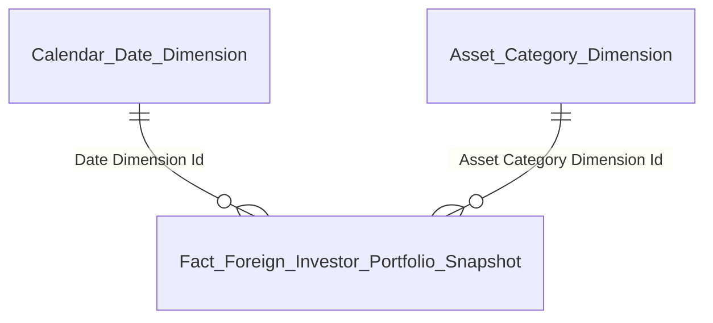

| Tên bảng (Logical) | Grain |
|---|---|
| Fact Foreign Investor Portfolio Snapshot | 1 row = 1 NĐTNN × 1 Mã tài sản × 1 tháng |
| Asset Category Dimension | 1 row = 1 loại tài sản (SCD2) |
| Calendar Date Dimension | 1 row = 1 ngày |

---

#### Nhóm 10 — Bản đồ nhiệt phân ngành

**Mockup (treemap):**

| Ngành | Tỷ trọng |
|---|---|
| Ngân hàng | 35.4% |
| Bất động sản | 22.1% |
| Sản xuất | 15.2% |
| Bán lẻ | 8.5% |
| Công nghệ | 7.4% |
| Dầu khí | 4.2% |
| Khác | 7.2% |

**Source:** `Fact Foreign Investor Portfolio Snapshot` → `Industry Dimension`, `Calendar Date Dimension`

> **Ghi chú:** K34 chỉ tính cho holdings có mã tài sản gắn Industry (equity-type: CP / CCQ niêm yết / UPCoM). Non-equity (Trái phiếu / Tiền / Vốn góp) có Industry Dimension Id = N/A → presentation layer filter loại bỏ trước khi tính %. Tổng % = 100% phần equity.

**KPI:**

| # | Tên KPI | Đơn vị | Tính chất | Mô tả |
|---|---------|--------|-----------|-------|
| K_NDTNN_34 | Tỷ trọng phân ngành | % | Derived | SUM Portfolio Market Value per Industry / Total equity portfolio × 100. Chỉ equity holdings |

**Star schema — K34:**

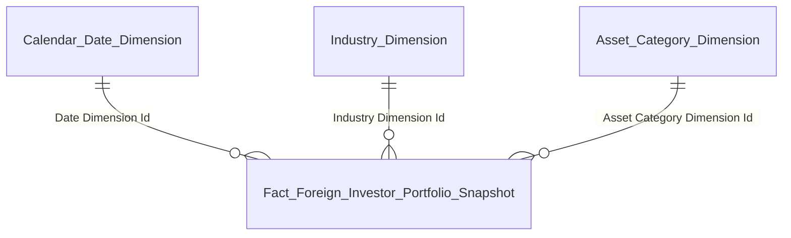

| Tên bảng (Logical) | Grain |
|---|---|
| Fact Foreign Investor Portfolio Snapshot | 1 row = 1 NĐTNN × 1 Mã tài sản × 1 tháng |
| Industry Dimension | 1 row = 1 ngành (SCD2) |
| Asset Category Dimension | 1 row = 1 loại tài sản (SCD2) — filter equity-type trước khi tính % |
| Calendar Date Dimension | 1 row = 1 ngày |

---

#### Nhóm 11 — Sở hữu NĐT nước ngoài ROOM

**Mockup:**

| Room theo ngành (%) | | Top mã cạn kiệt Room (Critical) |
|---|---|---|
| Ngân hàng: 61% | | FPT: sở hữu 49% / room 0% |
| Bất động sản: 59% | | MWG: 48.5% / 0.5% |
| Thép/Tài nguyên: 81% | | PNJ: 48.2% / 0.8% |
| Thực phẩm: 87% | | CTG: 28.5% / 1.5% |

**Source:** `Fact Foreign Ownership Snapshot` → `Listed Security Dimension`, `Industry Dimension`, `Calendar Date Dimension`

**KPI:**

| # | Tên KPI | Đơn vị | Tính chất | Mô tả |
|---|---------|--------|-----------|-------|
| K_NDTNN_35 | Room theo ngành (%) | % | Derived | SUM Foreign Owned Shares per Industry / SUM Max Foreign Shares per Industry × 100 |
| K_NDTNN_36 | Top mã cạn kiệt Room | Danh sách | Derived | Top mã có (Max Foreign Shares − Foreign Owned Shares) / Max Foreign Shares thấp nhất. Hiển thị: Mã CK + Sở hữu (%) + Room còn lại (%) — Pct tính tại presentation layer |

**Star schema — K35–K36:**

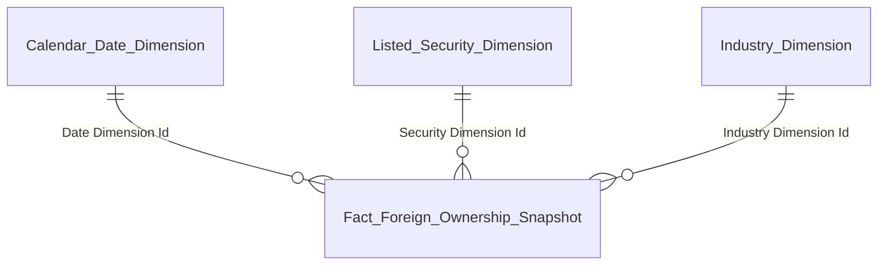

| Tên bảng (Logical) | Grain |
|---|---|
| Fact Foreign Ownership Snapshot | 1 row = 1 Mã CK × 1 ngày |
| Listed Security Dimension | 1 row = 1 mã CK (SCD2) |
| Industry Dimension | 1 row = 1 ngành (SCD2) |
| Calendar Date Dimension | 1 row = 1 ngày |

---

#### Nhóm 12 — Cảnh báo Room

**Mockup:**

| Mã "Kín Room" (Foreign Owned = 100%) | | Chạm ngưỡng cảnh báo (Room còn lại < 5%) |
|---|---|---|
| FPT — 1 Mã | | MWG: 0.5% / PNJ: 0.8% / CTG: 1.5% / VIB: 0.3% / ACB: 0.2% / TCB: 0.4% — 6 Mã |

**Source:** `Fact Foreign Ownership Snapshot` → `Listed Security Dimension`, `Calendar Date Dimension`

**KPI:**

| # | Tên KPI | Đơn vị | Tính chất | Mô tả |
|---|---------|--------|-----------|-------|
| K_NDTNN_37 | Mã "Kín Room" (100%) | Danh sách | Derived | Filter mã có Foreign Owned Shares = Max Foreign Shares. COUNT = số mã |
| K_NDTNN_38 | Chạm ngưỡng cảnh báo (< 5%) | Danh sách | Derived | Filter mã có (Max Foreign Shares − Foreign Owned Shares) / Max Foreign Shares > 0 AND < 5%. Hiển thị: Mã CK + Room còn lại (%). COUNT = số mã. Pct tính tại presentation layer |

**Star schema — K37–K38:**

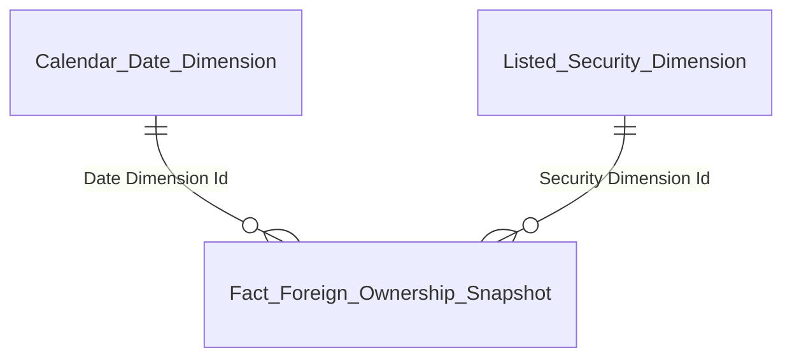

| Tên bảng (Logical) | Grain |
|---|---|
| Fact Foreign Ownership Snapshot | 1 row = 1 Mã CK × 1 ngày |
| Listed Security Dimension | 1 row = 1 mã CK (SCD2) |
| Calendar Date Dimension | 1 row = 1 ngày |

> **Ghi chú:** Nhóm 12 không cần Industry Dimension — chỉ filter theo Room threshold + hiển thị Mã CK.

---

### 1.4 Dashboard: NĐTNN 360 — Tab NĐTNN 360

**Slicer chung:** Chọn NĐT cụ thể + Ngày (date picker: 31/12/2024)

Giao diện gồm **2 nhóm**:

| Nhóm | Nội dung | Slicer riêng |
|------|---------|-------------|
| 13 | Hồ sơ định danh (Thông tin cơ bản + Đại diện giao dịch) | Chọn NĐT + Ngày |
| 14 | Lịch sử tuân thủ (Ngày QĐ / Phân loại / Nội dung / Mức độ / Trạng thái) | Chọn NĐT |

---

#### Nhóm 13 — Hồ sơ định danh

**Mockup:**

| Thông tin cơ bản | | Đại diện giao dịch |
|---|---|---|
| Quốc tịch: UK/VN | | NGUYỄN VĂN A |
| Mã số giao dịch (MSGD): FII001 | | CCCD: 0123xxxx5678 |
| Ngân hàng lưu ký: Ngân hàng A | | Status: Verified |
| Loại hình NĐT: Institutional | | |

**Source:** `Fact Foreign Investor Snapshot` → `Foreign Investor Dimension` (Quốc tịch / MSGD / Loại hình / Đại diện GD), `Custodian Bank Dimension` (NHLK), `Calendar Date Dimension`

**KPI:**

| # | Tên KPI | Đơn vị | Tính chất | Mô tả |
|---|---------|--------|-----------|-------|
| K_NDTNN_39 | Quốc tịch | Text | Attribute | Foreign Investor Dimension.Nationality Name |
| K_NDTNN_40 | Mã số giao dịch | Text | Attribute | Foreign Investor Dimension.Trading Code |
| K_NDTNN_41 | Ngân hàng lưu ký | Text | Attribute | Custodian Bank Dimension.Custodian Bank Name (via Fact Foreign Investor Snapshot FK) |
| K_NDTNN_42 | Loại hình NĐT | Text | Attribute | Foreign Investor Dimension.Investor Type Name |
| K_NDTNN_43 | Đại diện giao dịch | Text | Attribute | Foreign Investor Dimension.Director Name |

**Star schema — K39–K43:**

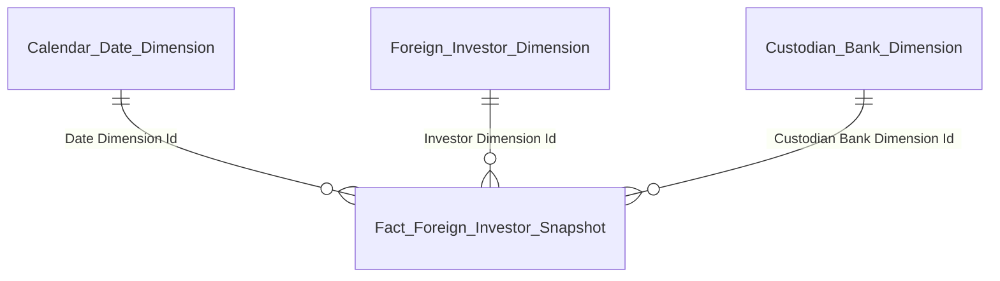

| Tên bảng (Logical) | Grain |
|---|---|
| Fact Foreign Investor Snapshot | 1 row = 1 NĐTNN × 1 Snapshot Date (daily) |
| Foreign Investor Dimension | 1 row = 1 NĐTNN (SCD2) — chứa Quốc tịch / Loại hình / Đại diện GD |
| Custodian Bank Dimension | 1 row = 1 NHLK (SCD2) |
| Calendar Date Dimension | 1 row = 1 ngày |

---

#### Nhóm 14 — Lịch sử tuân thủ

> **⚠ Chờ Silver phân hệ Thanh tra.** Source chưa sẵn sàng. Placeholder KPI:

**KPI:**

| # | Tên KPI | Đơn vị | Tính chất | Mô tả | Source |
|---|---------|--------|-----------|-------|--------|
| K_NDTNN_44 | Ngày quyết định | DATE | Attribute | Ngày ra quyết định xử phạt | TBD (Thanh tra) |
| K_NDTNN_45 | Phân loại | Text | Attribute | Phân loại hình thức xử lý: nhắc nhở / xử phạt HC… | TBD (Thanh tra) |
| K_NDTNN_46 | Nội dung/Trích yếu | Text | Attribute | Tóm tắt nội dung xử phạt | TBD (Thanh tra) |
| K_NDTNN_47 | Mức độ | Text | Attribute | Mức độ vi phạm: thấp / trung bình / cao | TBD (Thanh tra) |
| K_NDTNN_48 | Trạng thái | Text | Attribute | Trạng thái xử lý: đã khắc phục / đã nộp phạt… | TBD (Thanh tra) |

> **Ghi chú:** Khi Silver Thanh tra sẵn sàng → thiết kế Fact Investor Violation (event fact) + các dimension vi phạm. Xem O6.

---

## 2. Mô hình Star Schema tổng thể

```mermaid
graph TB
    subgraph Dimensions
        DIM_DATE[Calendar Date Dimension]
        DIM_SECURITY[Listed Security Dimension]
        DIM_INDUSTRY[Industry Dimension]
        DIM_INVESTOR[Foreign Investor Dimension]
        DIM_COUNTRY[Geographic Area Dimension]
        DIM_ASSET[Asset Category Dimension]
        DIM_CUSTODIAN[Custodian Bank Dimension]
    end

    subgraph Facts
        F_TRADING[Fact Securities Foreign Trading Snapshot]
        F_INVESTOR[Fact Foreign Investor Snapshot]
        F_CAPITAL[Fact Foreign Investor Capital Flow]
        F_INDEX[Fact Market Index Snapshot]
        F_PORTFOLIO[Fact Foreign Investor Portfolio Snapshot]
        F_OWNERSHIP[Fact Foreign Ownership Snapshot]
    end

    DIM_DATE --> F_TRADING
    DIM_SECURITY --> F_TRADING
    DIM_INDUSTRY --> F_TRADING

    DIM_DATE --> F_INVESTOR
    DIM_INVESTOR --> F_INVESTOR
    DIM_CUSTODIAN --> F_INVESTOR

    DIM_DATE --> F_CAPITAL
    DIM_INVESTOR --> F_CAPITAL
    DIM_COUNTRY --> F_CAPITAL

    DIM_DATE --> F_INDEX

    DIM_DATE --> F_PORTFOLIO
    DIM_INVESTOR --> F_PORTFOLIO
    DIM_COUNTRY --> F_PORTFOLIO
    DIM_ASSET --> F_PORTFOLIO
    DIM_INDUSTRY --> F_PORTFOLIO
    DIM_SECURITY --> F_PORTFOLIO

    DIM_DATE --> F_OWNERSHIP
    DIM_SECURITY --> F_OWNERSHIP
    DIM_INDUSTRY --> F_OWNERSHIP
```

### Bảng Fact

| Fact Table | Type | Grain | KPI phục vụ |
|-----------|------|-------|-------------|
| Fact Securities Foreign Trading Snapshot | Periodic snapshot (daily) | 1 Mã CK × 1 ngày GD | K1–K4 / K8–K18 / K22 |
| Fact Foreign Investor Snapshot | Periodic snapshot (daily) | 1 NĐTNN × 1 ngày | K5–K7 / K39–K43 |
| Fact Foreign Investor Capital Flow | Periodic snapshot (semi-monthly) | 1 NĐTNN × 1 kỳ nửa tháng | K19–K21 / K23 / K25–K29 |
| Fact Market Index Snapshot | Periodic snapshot (daily) | 1 Index × 1 ngày | K24 |
| Fact Foreign Investor Portfolio Snapshot | Periodic snapshot (monthly) | 1 NĐTNN × 1 Mã tài sản × 1 tháng | K30–K34 |
| Fact Foreign Ownership Snapshot | Periodic snapshot (daily) | 1 Mã CK × 1 ngày | K35–K38 |

### Bảng Dimension

| Dimension | Loại | Mô tả |
|-----------|------|-------|
| Calendar Date Dimension | Conformed | Lịch ngày — tĩnh / generated |
| Listed Security Dimension | Conformed | Mã CK / SCD2. Tên tạm — cập nhật khi có Silver SGDCK |
| Industry Dimension | Conformed | Nhóm ngành IDS-GSĐC / SCD2. Tên tạm — cập nhật khi có Silver |
| Foreign Investor Dimension | Conformed | NĐTNN — Mã GD / Tên / Quốc tịch / Loại hình NĐT (3 giá trị) / Đại diện GD / Ngày ĐK / SCD2 |
| Geographic Area Dimension | Conformed | Quốc gia / SCD2 |
| Asset Category Dimension | Reference | Loại hình tài sản (5 giá trị) / SCD2 |
| Custodian Bank Dimension | Reference | Ngân hàng lưu ký / SCD2 |

---

## 3. Vấn đề mở & Giả định

| # | Vấn đề | Giả định hiện tại | KPI liên quan | Status |
|---|--------|-------------------|---------------|--------|
| O1 | **Silver layer SGDCK:** Dữ liệu giao dịch + VN-Index chưa có Silver entity. | Sẽ bổ sung Source khi SGDCK Silver layer sẵn sàng. | K1–K4 / K8–K18 / K22 / K24 | Open |
| O2 | **Silver layer VSDC:** Nguồn dữ liệu danh sách NĐTNN. BA ghi nguồn "VSDC". | Giả định FIMS.INVESTOR là source chính. Sẽ bổ sung khi VSDC Silver layer sẵn sàng. | K5–K7 | Open |
| O3 | **Listed Security + Industry Dimension source:** Mã CK + Ngành — nguồn tổng hợp từ SGDCK + IDS-GSĐC. | Sẽ bổ sung Source khi Silver layer sẵn sàng. | K10–K13 / K17–K18 | Open |
| O4 | **VSDC ROOM data:** Silver chưa sẵn sàng cho Fact Foreign Ownership Snapshot. Measures cần: Foreign Owned Shares / Max Foreign Shares. | Sẽ bổ sung Source khi VSDC Silver layer sẵn sàng. Foreign Owned Shares có thể lấy từ FIMS.CATEGORIESSTOCK. | K35–K38 | Open |
| O5 | **Listed Security Dimension scope:** Dim hiện chỉ chứa mã CK niêm yết. Fact Portfolio Snapshot có non-equity holdings (mã TP / mã vốn góp) → Security Dimension Id = N/A. Cần quyết định: mở rộng dim thành Financial Instrument Dimension (chứa tất cả loại mã tài sản) hay giữ nguyên Listed Security + N/A cho non-equity. | Tạm giữ Listed Security Dimension. Non-equity → Security Dimension Id = N/A row. Cần trao đổi với BA và reviewer. | K30–K34 | Open |
| O6 | **Silver Thanh tra:** Dữ liệu lịch sử tuân thủ / vi phạm NĐTNN chưa có Silver entity. Khi sẵn sàng → thiết kế Fact Investor Violation (event fact) + dimension vi phạm. | Placeholder K44–K48. Chờ Silver phân hệ Thanh tra. | K44–K48 | Open |