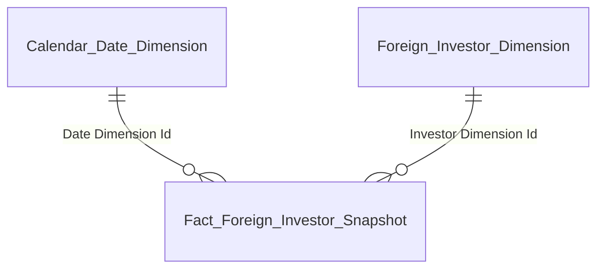
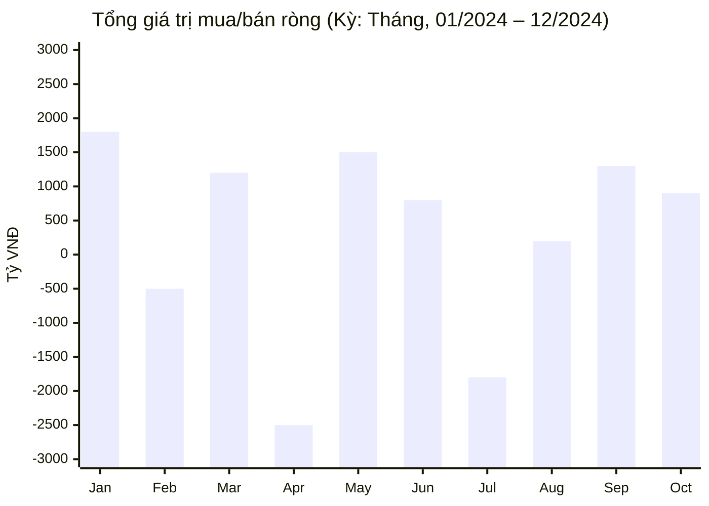
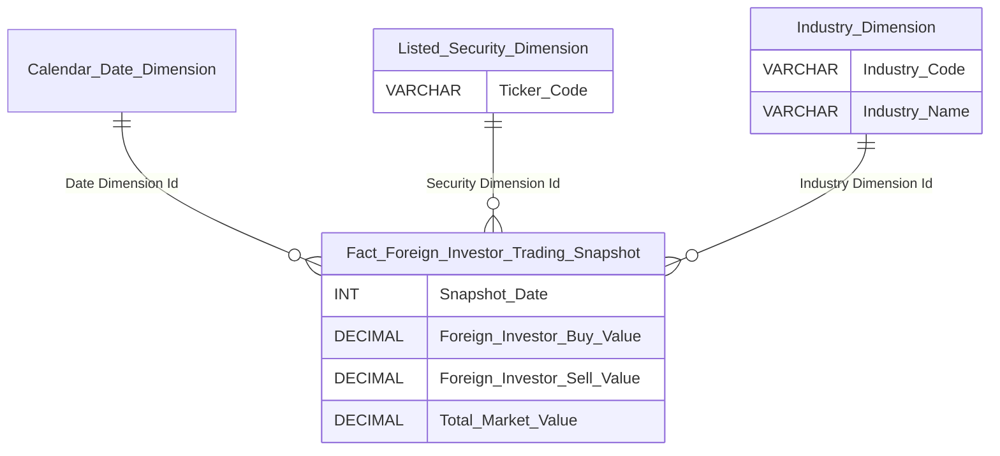
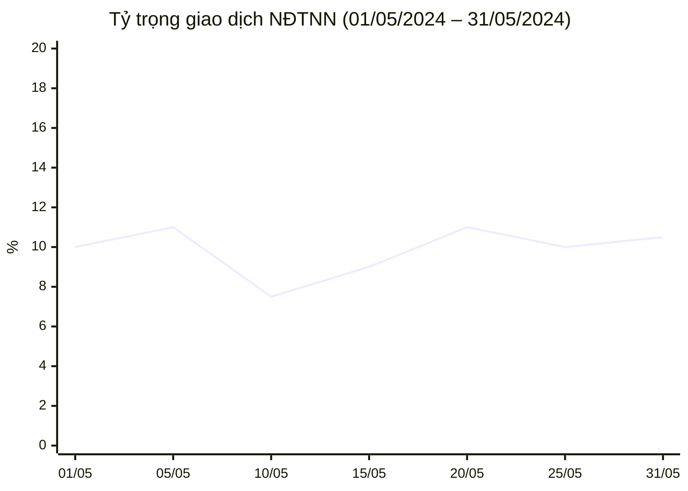
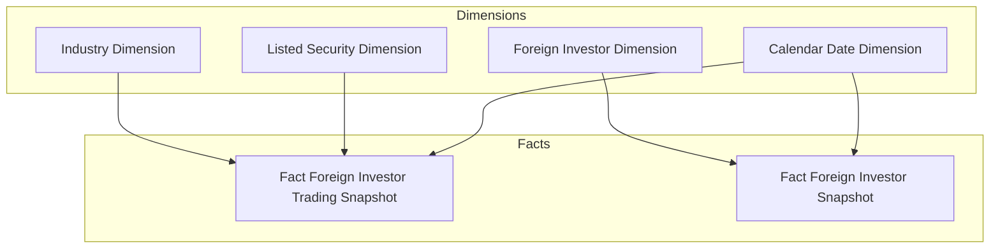

# Data Mart Design — Nhà Đầu Tư Nước Ngoài (NDTNN)

**Phiên bản:** 5.1  
**Ngày:** 15/04/2026  
**Phạm vi:** Dashboard Giao dịch NĐTNN — Tab GIAO DỊCH (2 màn hình)  
**Mô hình:** Star Schema thuần túy (không snowflake)  
**File BA nguồn:** BA_analyst_NDTNN.xlsx (STT 1–22)  
**Thay đổi v5.1:** (1) K16 ghi rõ chỉ tiêu phái sinh — xử lý tại presentation layer. (2) Industry Dimension Id là FK độc lập — bỏ ghi chú shortcut. (3) Listed Security Dimension bỏ Exchange Code/Name + Securities Type Code/Name (chưa dùng). (4) Fact Foreign Investor Snapshot cập nhật mô tả factless. (5) O3 confirmed — còn 3 Open issues.

---

## 1. Tổng quan báo cáo

### 1.1 Dashboard: Giao dịch NĐTNN — Tab GIAO DỊCH

**Slicer chung:** Ngày (date picker: 31/12/2024)

Giao diện gồm **3 nhóm**:

| Nhóm | Nội dung | Slicer riêng |
|------|---------|-------------|
| 1 | KPI Cards — Tỷ lệ tham gia + Tăng trưởng NĐT mới | Ngày |
| 2 | Tổng giá trị mua/bán ròng + Lũy kế + Top ngành/mã | Kỳ (Ngày/Tháng), Từ — Đến |
| 3 | Tỷ trọng giao dịch NĐTNN + TB phiên + Theo ngành + Top mã | Từ ngày — Đến ngày |

---

#### Nhóm 1 — KPI Cards

**Mockup:**

| Tỷ lệ tham gia | Tăng trưởng NĐT mới | Tăng trưởng NĐT (Cá nhân) mới | Tăng trưởng NĐT (Tổ chức) mới |
| :---: | :---: | :---: | :---: |
| **12.4** % | **2,450** Mã | **1,830** Mã | **620** Mã |

**Source:** K_NDTNN_1–4 từ `Fact Foreign Investor Trading Snapshot` → `Listed Security Dimension`, `Industry Dimension`, `Calendar Date Dimension`; K_NDTNN_5–7 từ `Fact Foreign Investor Snapshot` → `Foreign Investor Dimension`, `Calendar Date Dimension`

**KPI:**

| # | Tên KPI | Đơn vị | Tính chất | Mô tả |
|---|---------|--------|-----------|-------|
| K_NDTNN_1 | Tỷ lệ tham gia | % | Derived (Flow-based ratio) | (SUM Foreign Investor Buy Value + SUM Foreign Investor Sell Value) × 100 / (SUM Total Market Value × 2). Filter: Snapshot Date = ngày chọn |
| K_NDTNN_2 | Tổng giá trị mua của NĐTNN | VNĐ | Flow | SUM Foreign Investor Buy Value. Filter: Snapshot Date = ngày chọn |
| K_NDTNN_3 | Tổng giá trị bán của NĐTNN | VNĐ | Flow | SUM Foreign Investor Sell Value. Filter: Snapshot Date = ngày chọn |
| K_NDTNN_4 | Tổng giá trị GD toàn thị trường | VNĐ | Flow | SUM Total Market Value. Filter: Snapshot Date = ngày chọn |
| K_NDTNN_5 | Tăng trưởng NĐT mới | Mã | Flow | COUNT(*) tại Snapshot Date = ngày chọn − COUNT(*) tại Snapshot Date = 31/12 năm trước. Luỹ kế NĐT tăng mới từ đầu năm tới thời điểm tra cứu |
| K_NDTNN_6 | NĐT mới — Cá nhân | Mã | Flow | K5 JOIN Foreign Investor Dimension WHERE Investor Type Code = 'INDIVIDUAL' |
| K_NDTNN_7 | NĐT mới — Tổ chức | Mã | Flow | K5 JOIN Foreign Investor Dimension WHERE Investor Type Code = 'ORGANIZATION' |

**Star schema — K1–K4 (Tỷ lệ tham gia):**


| Tên bảng (Logical) | Grain |
|---|---|
| Fact Foreign Investor Trading Snapshot | 1 row = 1 Mã CK × 1 ngày giao dịch |
| Listed Security Dimension | 1 row = 1 mã CK (SCD2) |
| Industry Dimension | 1 row = 1 ngành (SCD2) |
| Calendar Date Dimension | 1 row = 1 ngày snapshot |

**Star schema — K5–K7 (Tăng trưởng NĐT mới):**



| Tên bảng (Logical) | Grain |
|---|---|
| Fact Foreign Investor Snapshot | 1 row = 1 NĐTNN × 1 Snapshot Date (daily) |
| Foreign Investor Dimension | 1 row = 1 NĐTNN (SCD2) — chứa Investor Type Code / Name |
| Calendar Date Dimension | 1 row = 1 ngày snapshot |

---

#### Nhóm 2 — Tổng giá trị mua/bán ròng của NĐTNN

**Mockup (bar chart — xanh: mua ròng dương, đỏ: bán ròng âm):**



| Lũy kế mua/bán ròng |
| :---: |
| **-8,300 B** |

| Top ngành bán ròng | | Top ngành mua ròng | | Top mã bán ròng | | Top mã mua ròng |
|---|---|---|---|---|---|---|
| Bất động sản: -1200B | | Ngân hàng: +4500B | | VHM: -700B | | HPG: +3300B |
| Thực phẩm: -450B | | Thép/Tài nguyên: +2800B | | MSN: -400B | | VCB: +600B |
| Khác: -200B | | Công nghệ: +1200B | | VIC: -1300B | | FPT: +2400B |
| Tiện ích: -300B | | Dầu khí: +150B | | VNM: -1300B | | TCB: +1300B |
| Dịch vụ tài chính: -150B | | Bán lẻ: +600B | | STB: -700B | | MWG: +1700B |

**Source:** `Fact Foreign Investor Trading Snapshot` → `Listed Security Dimension` (Ticker Code), `Industry Dimension` (Industry Name), `Calendar Date Dimension`

**KPI:**

| # | Tên KPI | Đơn vị | Tính chất | Mô tả |
|---|---------|--------|-----------|-------|
| K_NDTNN_8 | Giá trị mua/bán ròng | VNĐ | Flow | SUM(Foreign Investor Buy Value − Foreign Investor Sell Value) per Mã CK. Group by Kỳ (Ngày/Tháng) trong khoảng Từ — Đến |
| K_NDTNN_9 | Lũy kế mua/bán ròng | VNĐ | Flow | SUM K8 toàn bộ khoảng thời gian đã chọn |
| K_NDTNN_10 | Top ngành bán ròng | VNĐ | Derived | K8 GROUP BY Industry Dimension.Industry Name → RANK ASC → TOP 5 |
| K_NDTNN_11 | Top ngành mua ròng | VNĐ | Derived | K8 GROUP BY Industry Dimension.Industry Name → RANK DESC → TOP 5 |
| K_NDTNN_12 | Top mã bán ròng | VNĐ | Derived | K8 GROUP BY Listed Security Dimension.Ticker Code → RANK ASC → TOP 5 |
| K_NDTNN_13 | Top mã mua ròng | VNĐ | Derived | K8 GROUP BY Listed Security Dimension.Ticker Code → RANK DESC → TOP 5 |

**Star schema — K8–K13:**



| Tên bảng (Logical) | Grain |
|---|---|
| Fact Foreign Investor Trading Snapshot | 1 row = 1 Mã CK × 1 ngày giao dịch |
| Listed Security Dimension | 1 row = 1 mã CK (SCD2) |
| Industry Dimension | 1 row = 1 ngành (SCD2) |
| Calendar Date Dimension | 1 row = 1 ngày snapshot |

---

#### Nhóm 3 — Tỷ trọng giao dịch NĐTNN

**Mockup (line chart — tỷ trọng % theo ngày):**



| Tỷ trọng TB phiên |
| :---: |
| **12.4%** |

| Tỷ trọng theo ngành | | Top mã tỷ trọng cao |
|---|---|---|
| Công nghệ: 14.7% | | PNJ: 58.3% |
| Ngân hàng: 12.3% | | FPT: 54.2% |
| Bất động sản: 9.7% | | MWG: 50.2% |
| Thép/Tài nguyên: 8.3% | | MBB: 47.8% |
| Thực phẩm: 6.6% | | CTG: 50.4% |

**Source:** `Fact Foreign Investor Trading Snapshot` → `Listed Security Dimension`, `Industry Dimension`, `Calendar Date Dimension`

**KPI:**

| # | Tên KPI | Đơn vị | Tính chất | Mô tả |
|---|---------|--------|-----------|-------|
| K_NDTNN_14 | Tỷ trọng giao dịch theo ngày | % | Derived (Flow-based ratio) | (SUM Foreign Investor Buy Value + SUM Foreign Investor Sell Value) × 100 / (SUM Total Market Value × 2) per ngày |
| K_NDTNN_15 | Tổng giá trị GD NĐTNN | VNĐ | Flow | SUM(Foreign Investor Buy Value + Foreign Investor Sell Value) |
| K_NDTNN_16 | Tỷ trọng TB phiên | % | Chỉ tiêu phái sinh | Tính từ K14: SUM(K14 per ngày) / COUNT(số ngày giao dịch thực tế trong kỳ). Chỉ tiêu phái sinh — fact cung cấp 3 measure cơ sở (Foreign Investor Buy Value / Sell Value / Total Market Value), logic tính K16 xử lý tại presentation layer |
| K_NDTNN_17 | Tỷ trọng theo ngành | % | Derived (Flow-based ratio) | Tỷ trọng GD của NĐTNN trong từng ngành = SUM(Foreign Investor Buy Value + Foreign Investor Sell Value) per Industry × 100 / (SUM Total Market Value per Industry × 2). TOP 5 |
| K_NDTNN_18 | Top mã tỷ trọng cao | % | Derived (Flow-based ratio) | SUM(Foreign Investor Buy Value + Foreign Investor Sell Value) per Ticker × 100 / (SUM Total Market Value per Ticker × 2). TOP 5 |

**Star schema — K14–K18 (cùng schema với Nhóm 2):**


| Tên bảng (Logical) | Grain |
|---|---|
| Fact Foreign Investor Trading Snapshot | 1 row = 1 Mã CK × 1 ngày giao dịch |
| Listed Security Dimension | 1 row = 1 mã CK (SCD2) |
| Industry Dimension | 1 row = 1 ngành (SCD2) |
| Calendar Date Dimension | 1 row = 1 ngày snapshot |

---

## 2. Mô hình Star Schema tổng thể



### Bảng Fact

| Fact Table | Type | Grain | KPI phục vụ |
|-----------|------|-------|-------------|
| Fact Foreign Investor Trading Snapshot | Periodic snapshot (daily) | 1 Mã CK × 1 ngày GD | K1–K4, K8–K18 |
| Fact Foreign Investor Snapshot | Periodic snapshot (daily) | 1 NĐTNN × 1 ngày | K5–K7 |

### Bảng Dimension

| Dimension | Loại | Mô tả |
|-----------|------|-------|
| Calendar Date Dimension | Conformed | Lịch ngày — tĩnh / generated |
| Listed Security Dimension | Conformed | Mã CK / SCD2 |
| Industry Dimension | Conformed | Nhóm ngành IDS-GSĐC / SCD2 |
| Foreign Investor Dimension | Conformed | NĐTNN — Mã GD / Tên / Loại hình NĐT (denormalize) / Ngày ĐK / SCD2 |

---

## 3. Đặc tả Dimension

### 3.1 Calendar Date Dimension

| Attribute | Data Type | Mandatory | Mô tả | Source |
|-----------|-----------|-----------|-------|--------|
| Date Dimension Id | INT | PK | Surrogate key (YYYYMMDD) | Generated |
| Full Date | DATE | BK | Ngày đầy đủ | Generated |
| Year | INT | ✓ | Năm | Generated |
| Month | INT | ✓ | Tháng | Generated |

**SCD:** Tĩnh.

### 3.2 Listed Security Dimension

| Attribute | Data Type | Mandatory | Mô tả | Source |
|-----------|-----------|-----------|-------|--------|
| Security Dimension Id | INT | PK | Surrogate key | Generated |
| Ticker Code | VARCHAR | BK | Mã CK (VNM, FPT, HPG…) | TBD (SGDCK) |
| Ticker Name | NVARCHAR | ✓ | Tên CK | TBD (SGDCK) |
| Effective Date | DATE | ✓ (SCD2) | Ngày hiệu lực | ETL derived |
| End Date | DATE | ✓ (SCD2) | 9999-12-31 = hiện hành | ETL derived |

**SCD:** Type 2 — theo dõi Ticker Name.

### 3.3 Foreign Investor Dimension

| Attribute | Data Type | Mandatory | Mô tả | Source |
|-----------|-----------|-----------|-------|--------|
| Investor Dimension Id | INT | PK | Surrogate key | Generated |
| Trading Code | VARCHAR | BK | Mã số giao dịch — định danh duy nhất NĐTNN (1 Mã GD = 1 NĐT) | Foreign Investor.Trading Code (attr_FIMS_INVESTOR.csv) |
| Investor Name | NVARCHAR | ✓ | Tên NĐT | Foreign Investor.Investor Name (attr_FIMS_INVESTOR.csv) |
| Investor Type Code | VARCHAR | ✓ | Loại hình NĐT: INDIVIDUAL / ORGANIZATION. Thuộc tính bất biến — denormalize, không tách dim riêng | Foreign Investor.Investor Type Code (attr_FIMS_INVESTOR.csv) |
| Investor Type Name | NVARCHAR | ✓ | Cá nhân / Tổ chức (denormalize) | Classification Value (FIMS_INVESTOR_TYPE) |
| Registration Date | DATE | ✓ | Ngày đăng ký mã GD | Foreign Investor.Registration Date (attr_FIMS_INVESTOR.csv) |
| Effective Date | DATE | ✓ (SCD2) | Ngày hiệu lực | ETL derived |
| End Date | DATE | ✓ (SCD2) | 9999-12-31 = hiện hành | ETL derived |

**SCD:** Type 2 — theo dõi Investor Name. Investor Type Code là thuộc tính bất biến (NĐT không đổi loại hình).

### 3.4 Industry Dimension (Conformed)

| Attribute | Data Type | Mandatory | Mô tả | Source |
|-----------|-----------|-----------|-------|--------|
| Industry Dimension Id | INT | PK | Surrogate key | Generated |
| Industry Code | VARCHAR | BK | Mã ngành theo phân loại IDS-GSĐC | TBD (IDS-GSĐC) |
| Industry Name | NVARCHAR | ✓ | Tên ngành (Ngân hàng / Bất động sản / Công nghệ…) | TBD (IDS-GSĐC) |
| Effective Date | DATE | ✓ (SCD2) | Ngày hiệu lực | ETL derived |
| End Date | DATE | ✓ (SCD2) | 9999-12-31 = hiện hành | ETL derived |

**SCD:** Type 2 — theo dõi Industry Name (ngành có thể đổi tên hoặc tái phân loại).

**Ghi chú:** Conformed dimension — có thể reuse khi GSDC hoặc module khác cần phân ngành cùng danh mục IDS-GSĐC. Source Silver sẽ bổ sung khi IDS-GSĐC Silver layer sẵn sàng.

---

## 4. Đặc tả Fact

### 4.1 Fact Foreign Investor Trading Snapshot

**Grain:** 1 row = 1 Mã CK × 1 ngày giao dịch.  
**Type:** Periodic snapshot (daily).  
**Mô tả:** Giá trị mua/bán của NĐTNN và tổng thị trường theo mã CK. Phục vụ Nhóm 1 (Tỷ lệ tham gia), Nhóm 2 (Mua/bán ròng), Nhóm 3 (Tỷ trọng). Silver source SGDCK sẽ bổ sung khi Silver layer sẵn sàng.

| Attribute | Data Type | Mandatory | Mô tả | Source |
|-----------|-----------|-----------|-------|--------|
| Snapshot Date | INT | ✓ | YYYYMMDD — ngày giao dịch | TBD (SGDCK) |
| Population Date | TIMESTAMP | ✓ | ETL load timestamp | ETL derived |
| Date Dimension Id | INT | FK | FK → Calendar Date Dimension | Calendar Date Dimension.Date Dimension Id |
| Security Dimension Id | INT | FK | FK → Listed Security Dimension | Listed Security Dimension.Security Dimension Id |
| Industry Dimension Id | INT | FK | FK → Industry Dimension | Industry Dimension.Industry Dimension Id |
| Foreign Investor Buy Value | DECIMAL(18,2) | ✓ | Giá trị mua của NĐTNN (VNĐ) | TBD (SGDCK) |
| Foreign Investor Sell Value | DECIMAL(18,2) | ✓ | Giá trị bán của NĐTNN (VNĐ) | TBD (SGDCK) |
| Total Market Value | DECIMAL(18,2) | ✓ | Tổng giá trị GD toàn thị trường per mã CK per ngày | TBD (SGDCK) |

**Grain uniqueness:** Snapshot Date + Security Dimension Id.

**Mapping KPI → Cột:**

| KPI | Cách tính từ fact |
|-----|-------------------|
| K1 (Tỷ lệ tham gia) | (SUM Foreign Investor Buy Value + SUM Foreign Investor Sell Value) / (SUM Total Market Value × 2) × 100 |
| K2 (GT mua NĐTNN) | SUM Foreign Investor Buy Value |
| K3 (GT bán NĐTNN) | SUM Foreign Investor Sell Value |
| K4 (GT GD toàn TT) | SUM Total Market Value |
| K8 (Giá trị ròng) | SUM(Foreign Investor Buy Value − Foreign Investor Sell Value) |
| K9 (Lũy kế ròng) | SUM K8 trong khoảng thời gian |
| K10–K11 (Top ngành) | K8 GROUP BY Industry (JOIN Industry Dimension) |
| K12–K13 (Top mã) | K8 GROUP BY Ticker Code (JOIN Listed Security Dimension) |
| K14 (Tỷ trọng/ngày) | K1 per ngày |
| K16 (TB phiên) | Chỉ tiêu phái sinh: AVG(K14) — xử lý tại presentation layer |
| K17 (Theo ngành) | K1 tính per Industry (JOIN Industry Dimension) |
| K18 (Top mã tỷ trọng) | K1 tính per Ticker Code |

### 4.2 Fact Foreign Investor Snapshot

**Grain:** 1 row = 1 NĐTNN × 1 Snapshot Date (daily).  
**Type:** Periodic snapshot (daily).  
**Mô tả:** Factless periodic snapshot — chỉ chứa FK, không có measure. Measure duy nhất là COUNT(*). Chụp full danh sách toàn bộ NĐTNN đã đăng ký mỗi ngày batch. K5–K7 tính bằng chênh lệch COUNT giữa 2 snapshot (ngày hiện tại vs cuối năm trước). Khi NĐT bị huỷ mã GD → biến mất khỏi snapshot → K5 phản ánh đúng net change. Silver source VSDC sẽ bổ sung khi Silver layer sẵn sàng.

| Attribute | Data Type | Mandatory | Mô tả | Source |
|-----------|-----------|-----------|-------|--------|
| Snapshot Date | INT | ✓ | YYYYMMDD — ngày dữ liệu batch (batch T → Snapshot Date = T-1) | TBD (VSDC / FIMS) |
| Population Date | TIMESTAMP | ✓ | ETL load timestamp | ETL derived |
| Date Dimension Id | INT | FK | FK → Calendar Date Dimension | Calendar Date Dimension.Date Dimension Id |
| Investor Dimension Id | INT | FK | FK → Foreign Investor Dimension | Foreign Investor Dimension.Investor Dimension Id |

**Grain uniqueness:** Snapshot Date + Investor Dimension Id.

**Volume ước tính:** ~5.000 NĐTNN × 365 ngày ≈ 1,8M rows/năm — rất nhẹ.

**Mapping KPI → Cột:**

| KPI | Cách tính từ fact |
|-----|-------------------|
| K5 (NĐT tăng mới YTD) | COUNT(*) tại Snapshot Date = ngày chọn − COUNT(*) tại Snapshot Date = 31/12 năm trước |
| K6 (Cá nhân) | K5 với cả 2 vế JOIN Foreign Investor Dimension WHERE Investor Type Code = 'INDIVIDUAL' |
| K7 (Tổ chức) | K5 với cả 2 vế JOIN Foreign Investor Dimension WHERE Investor Type Code = 'ORGANIZATION' |

**Query mẫu K5:**
```sql
SELECT
  (SELECT COUNT(*) FROM Fact_Foreign_Investor_Snapshot
   WHERE Snapshot_Date = :slicer_date)
  -
  (SELECT COUNT(*) FROM Fact_Foreign_Investor_Snapshot
   WHERE Snapshot_Date = (YEAR(:slicer_date) - 1) * 10000 + 1231)
AS new_investor_ytd
```

---

## 5. Vấn đề mở & Giả định

| # | Vấn đề | Giả định hiện tại | KPI liên quan | Status |
|---|--------|-------------------|---------------|--------|
| O1 | **Silver layer SGDCK:** Dữ liệu giao dịch chưa có Silver entity. | Sẽ bổ sung Source khi SGDCK Silver layer sẵn sàng. | K1–K4, K8–K18 | Open |
| O2 | **Silver layer VSDC:** Nguồn dữ liệu danh sách NĐTNN. BA ghi nguồn "VSDC" nhưng Foreign Investor Dimension source từ FIMS.INVESTOR. | Giả định FIMS.INVESTOR là source chính. Sẽ bổ sung khi VSDC Silver layer sẵn sàng. | K5–K7 | Open |
| O3 | **Listed Security + Industry Dimension source:** Mã CK + Ngành — nguồn tổng hợp từ SGDCK + IDS-GSĐC. | Sẽ bổ sung Source khi Silver layer sẵn sàng. Industry Dimension là conformed — reuse cross-module. | K10–K13, K17–K18 | Open |