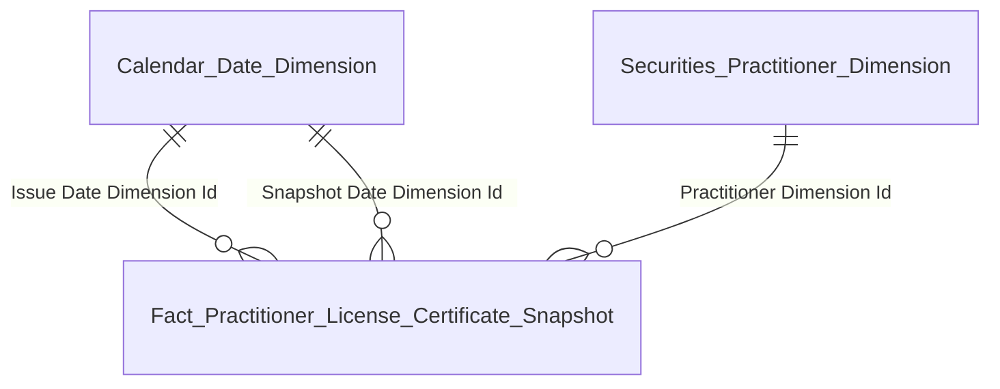
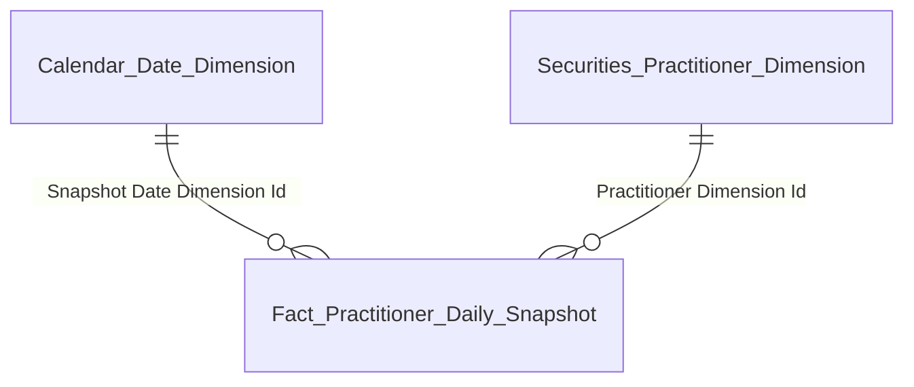

# Gold Entities Overview — NHNCK (Người hành nghề chứng khoán)

---

## Tổng quan toàn bộ Star Schema — GOLD NHNCK

> Hình này thể hiện toàn bộ 12 entities của Gold Mart NHNCK: 2 Fact, 2 Dimension và 8 bảng Tác nghiệp, cùng các mối quan hệ giữa Fact và Dimension.

```mermaid
graph TB
    classDef dim fill:#E6F1FB,stroke:#185FA5,color:#0C447C
    classDef fact fill:#FAECE7,stroke:#993C1D,color:#4A1B0C
    classDef oper fill:#E8F5E9,stroke:#2E7D32,color:#1B5E20

    DIM_DATE["Calendar Date Dimension"]:::dim
    DIM_PRAC["Securities Practitioner Dimension SCD2"]:::dim
    DIM_CLASS["Classification Dimension"]:::dim

    FACT_CERT["Fact Practitioner License Certificate Snapshot"]:::fact
    FACT_DAILY["Fact Practitioner Daily Snapshot"]:::fact

    OPR1["Practitioner 360 Profile"]:::oper
    OPR2["Practitioner Certificate History"]:::oper
    OPR3["Practitioner Employment History"]:::oper
    OPR4["Practitioner Violation History"]:::oper
    OPR5["Practitioner Exam History"]:::oper
    OPR6["Practitioner Training History"]:::oper
    OPR7["Practitioner Related Party Profile"]:::oper
    OPR8["Practitioner Data Explorer"]:::oper

    DIM_DATE --> FACT_CERT
    DIM_DATE --> FACT_DAILY
    DIM_PRAC --> FACT_CERT
    DIM_PRAC --> FACT_DAILY
    DIM_CLASS --> FACT_CERT
```

---

## Tab THỐNG KÊ CHUNG

### Nhóm 1 — Các chỉ tiêu tổng hợp CCHN (KPI thẻ)

#### Star schema

#### Bảng entity

| Gold entity | Description | Grain | KPI |
|---|---|---|---|
| Fact Practitioner License Certificate Snapshot | Periodic Snapshot tháng — đếm CCHN theo trạng thái, loại hình, cấp mới, thu hồi | 1 CCHN × 1 tháng | K_NHNCK_2, 2a, 2b, 3, 5–8 |
| Securities Practitioner Dimension | NHN — định danh, trình độ, quốc tịch (SCD2) | 1 NHN per SCD2 version | — |
| Calendar Date Dimension | Lịch ngày | 1 ngày | — |

---

### Nhóm 2 — Tổng NHN & Cảnh báo NHNCK

#### Star schema

#### Bảng entity

| Gold entity | Description | Grain | KPI |
|---|---|---|---|
| Fact Practitioner Daily Snapshot | Periodic Snapshot ngày — đếm tổng NHN đang hành nghề và NHN có cảnh báo vi phạm | 1 NHN × 1 ngày | K_NHNCK_1, 4 |
| Securities Practitioner Dimension | NHN — định danh, trình độ, quốc tịch (SCD2) | 1 NHN per SCD2 version | — |
| Calendar Date Dimension | Lịch ngày | 1 ngày | — |

---

### Nhóm 3 — Biểu đồ cơ cấu theo loại hình CCHN

#### Star schema

#### Bảng entity

| Gold entity | Description | Grain | KPI |
|---|---|---|---|
| Fact Practitioner License Certificate Snapshot | Dùng chung với Nhóm 1 — GROUP BY Certificate_Type_Code tại snapshot cuối năm | 1 CCHN × 1 tháng | K_NHNCK_17–22 |
| Securities Practitioner Dimension | NHN — định danh (SCD2) | 1 NHN per SCD2 version | — |
| Calendar Date Dimension | Lịch ngày | 1 ngày | — |

---

### Nhóm 4 — Biểu đồ trình độ chuyên môn

#### Star schema

#### Bảng entity

| Gold entity | Description | Grain | KPI |
|---|---|---|---|
| Fact Practitioner Daily Snapshot | Dùng chung với Nhóm 2 — filter Has_Active_Certificate = true, GROUP BY Education_Level_Code | 1 NHN × 1 ngày | K_NHNCK_9–14 |
| Securities Practitioner Dimension | NHN — Education Level Code (SCD2) | 1 NHN per SCD2 version | — |
| Calendar Date Dimension | Lịch ngày | 1 ngày | — |

---

### Nhóm 5 — Biểu đồ phân bổ độ tuổi

#### Star schema

#### Bảng entity

| Gold entity | Description | Grain | KPI |
|---|---|---|---|
| Fact Practitioner Daily Snapshot | Dùng chung với Nhóm 2 — filter Has_Active_Certificate = true, GROUP BY Age band + Nationality_Code | 1 NHN × 1 ngày | K_NHNCK_23–32 |
| Securities Practitioner Dimension | NHN — Nationality Code (SCD2) | 1 NHN per SCD2 version | — |
| Calendar Date Dimension | Lịch ngày | 1 ngày | — |

---

## Tab TRA CỨU HỒ SƠ 360°

### Nhóm 6 — Danh sách & Header NHN 360°

> **Ghi chú:** `Practitioner 360 Profile` là bảng tác nghiệp — lấy trực tiếp từ Silver `Securities Practitioner`, `Securities Practitioner License Certificate Document`, `Securities Practitioner Organization Employment Report`, `Securities Practitioner Related Party`, không join qua Dimension.

#### Star schema

*Không có relationship line — bảng tác nghiệp*

#### Bảng entity

| Gold entity | Description | Grain | KPI |
|---|---|---|---|
| Practitioner 360 Profile | Hồ sơ 360° NHN — latest state. Silver: Securities Practitioner + License Certificate Document + Organization Employment Report + Related Party | 1 NHN | K_NHNCK_33–42 |

---

### Nhóm 7 — Lịch sử cấp chứng chỉ hành nghề

> **Ghi chú:** `Practitioner Certificate History` là bảng tác nghiệp — lấy trực tiếp từ Silver `Securities Practitioner License Certificate Document` và `Securities Practitioner License Decision Document`.

#### Star schema

*Không có relationship line — bảng tác nghiệp*

#### Bảng entity

| Gold entity | Description | Grain | KPI |
|---|---|---|---|
| Practitioner Certificate History | Lịch sử cấp CCHN — toàn bộ CCHN per NHN. Silver: License Certificate Document + License Decision Document | 1 CCHN per NHN | K_NHNCK_43–48 |

---

### Nhóm 8 — Quá trình hành nghề

> **Ghi chú:** `Practitioner Employment History` là bảng tác nghiệp — lấy trực tiếp từ Silver `Securities Practitioner Organization Employment Report`.

#### Star schema

*Không có relationship line — bảng tác nghiệp*

#### Bảng entity

| Gold entity | Description | Grain | KPI |
|---|---|---|---|
| Practitioner Employment History | Quá trình hành nghề — toàn bộ lần công tác per NHN. Silver: Organization Employment Report | 1 lần công tác per NHN | K_NHNCK_49–53 |

---

### Nhóm 9 — Lịch sử vi phạm & xử phạt

> **Ghi chú:** `Practitioner Violation History` là bảng tác nghiệp — lấy trực tiếp từ Silver `Securities Practitioner Conduct Violation` và `Securities Practitioner License Decision Document`.

#### Star schema

*Không có relationship line — bảng tác nghiệp*

#### Bảng entity

| Gold entity | Description | Grain | KPI |
|---|---|---|---|
| Practitioner Violation History | Lịch sử vi phạm — toàn bộ vi phạm per NHN. Silver: Conduct Violation + License Decision Document | 1 vi phạm per NHN | K_NHNCK_54–58 |

---

### Nhóm 10 — Đợt thi sát hạch

> **Ghi chú:** `Practitioner Exam History` là bảng tác nghiệp — lấy trực tiếp từ Silver `Securities Practitioner Qualification Examination Assessment Result`, `Securities Practitioner Qualification Examination Assessment` và `Securities Practitioner License Decision Document`.

#### Star schema

*Không có relationship line — bảng tác nghiệp*

#### Bảng entity

| Gold entity | Description | Grain | KPI |
|---|---|---|---|
| Practitioner Exam History | Lịch sử thi sát hạch — toàn bộ lần thi per NHN. Silver: Examination Assessment Result + Examination Assessment + License Decision Document | 1 lần thi per NHN | K_NHNCK_59–63 |

---

### Nhóm 11 — Cập nhật kiến thức hành nghề

> **Ghi chú:** `Practitioner Training History` là bảng tác nghiệp — lấy trực tiếp từ Silver `Securities Practitioner Professional Training Class Enrollment` và `Securities Practitioner Professional Training Class`. **DRAFT** — thiếu Training Hours (xem O_NHNCK_9).

#### Star schema

*Không có relationship line — bảng tác nghiệp*

#### Bảng entity

| Gold entity | Description | Grain | KPI |
|---|---|---|---|
| Practitioner Training History | Lịch sử cập nhật kiến thức — 1 enrollment per NHN, GROUP BY Training_Year khi hiển thị. Silver: Training Class Enrollment + Training Class | 1 enrollment per NHN | K_NHNCK_64–67 (partial — xem O_NHNCK_9) |

---

### Nhóm 12 — Mạng lưới người liên quan

> **Ghi chú:** `Practitioner Related Party Profile` là bảng tác nghiệp — lấy trực tiếp từ Silver `Securities Practitioner Related Party`.

#### Star schema

*Không có relationship line — bảng tác nghiệp*

#### Bảng entity

| Gold entity | Description | Grain | KPI |
|---|---|---|---|
| Practitioner Related Party Profile | Mạng lưới người liên quan — toàn bộ người liên quan per NHN. Silver: Securities Practitioner Related Party | 1 người liên quan per NHN | K_NHNCK_75–78 |

---

## Tab DATA EXPLORER

### Nhóm 13 — Data Explorer (Tra cứu tổng hợp CCHN)

> **Ghi chú:** `Practitioner Data Explorer` là bảng tác nghiệp dạng flat list — lấy trực tiếp từ Silver `Securities Practitioner License Certificate Document`, `Securities Practitioner` và `Securities Practitioner Organization Employment Report`. Slicer Loại hình và Trạng thái filter tại query time.

#### Star schema

*Không có relationship line — bảng tác nghiệp*

#### Bảng entity

| Gold entity | Description | Grain | KPI |
|---|---|---|---|
| Practitioner Data Explorer | Flat list CCHN toàn thị trường — toàn bộ trạng thái. Silver: License Certificate Document + Securities Practitioner + Organization Employment Report | 1 CCHN per NHN | K_NHNCK_68–74 |

---

## Tổng hợp tất cả entities

| Gold entity | table_type | status | Grain | KPI | source_table |
|---|---|---|---|---|---|
| `Calendar Date Dimension` | dim | draft | 1 ngày | — | Generated |
| `Securities Practitioner Dimension` | dim | draft | 1 NHN per SCD2 version | — | Securities Practitioner |
| `Fact Practitioner License Certificate Snapshot` | fact | draft | 1 CCHN × 1 tháng | K_NHNCK_2, 2a, 2b, 3, 5–8, 17–22 | Securities Practitioner License Certificate Document / Securities Practitioner License Application |
| `Fact Practitioner Daily Snapshot` | fact | draft | 1 NHN × 1 ngày | K_NHNCK_1, 4, 9–14, 23–32 | Securities Practitioner / Securities Practitioner Conduct Violation |
| `Practitioner 360 Profile` | operational | draft | 1 NHN | K_NHNCK_33–42 | Securities Practitioner / Securities Practitioner License Certificate Document / Securities Practitioner Organization Employment Report / Securities Practitioner Related Party |
| `Practitioner Certificate History` | operational | draft | 1 CCHN per NHN | K_NHNCK_43–48 | Securities Practitioner License Certificate Document / Securities Practitioner License Decision Document |
| `Practitioner Employment History` | operational | draft | 1 lần công tác per NHN | K_NHNCK_49–53 | Securities Practitioner Organization Employment Report |
| `Practitioner Violation History` | operational | draft | 1 vi phạm per NHN | K_NHNCK_54–58 | Securities Practitioner Conduct Violation / Securities Practitioner License Decision Document |
| `Practitioner Exam History` | operational | draft | 1 lần thi per NHN | K_NHNCK_59–63 | Securities Practitioner Qualification Examination Assessment Result / Securities Practitioner Qualification Examination Assessment / Securities Practitioner License Decision Document |
| `Practitioner Training History` | operational | draft | 1 enrollment per NHN | K_NHNCK_64–67 | Securities Practitioner Professional Training Class Enrollment / Securities Practitioner Professional Training Class |
| `Practitioner Related Party Profile` | operational | draft | 1 người liên quan per NHN | K_NHNCK_75–78 | Securities Practitioner Related Party |
| `Practitioner Data Explorer` | operational | draft | 1 CCHN per NHN | K_NHNCK_68–74 | Securities Practitioner License Certificate Document / Securities Practitioner / Securities Practitioner Organization Employment Report |
