# GOLD_NHNCK_HLD — High Level Design
**Module:** NHNCK — Người hành nghề chứng khoán  
**Phiên bản:** 6.1  
**Ngày:** 27/04/2026  
**Phạm vi:** Tab THỐNG KÊ CHUNG + Tab TRA CỨU HỒ SƠ 360° + Tab DATA EXPLORER

---

## Section 1 — Data Lineage: Source → Silver → Gold Mart

### Cụm 1: Chứng chỉ hành nghề — Thống kê tổng hợp (`Fact Practitioner License Certificate Snapshot`)

Phục vụ **Tab THỐNG KÊ CHUNG** — Nhóm 1 (KPI thẻ đếm CCHN theo trạng thái) và Nhóm 3 (Cơ cấu theo loại hình CCHN).

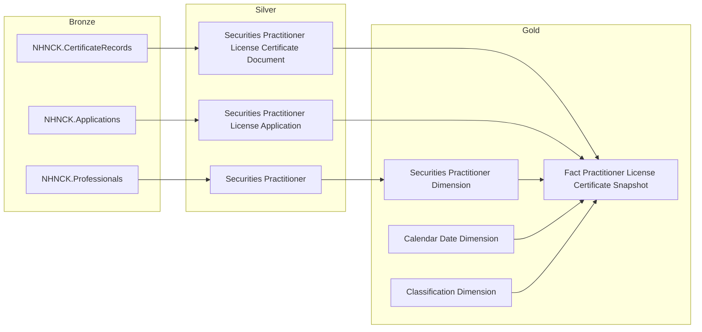

---

### Cụm 2: Người hành nghề — Trình độ & Phân bổ độ tuổi (`Fact Practitioner Daily Snapshot`)

Phục vụ **Tab THỐNG KÊ CHUNG** — Nhóm 2 (Tổng NHN, Cảnh báo NHNCK), Nhóm 4 (Trình độ chuyên môn), Nhóm 5 (Phân bổ độ tuổi).

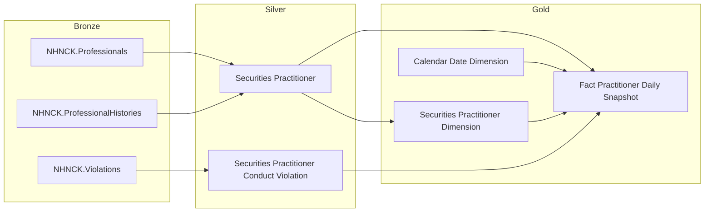

---

### Cụm 3: Tra cứu NHN 360° — Danh sách & Header (`Practitioner 360 Profile`)

Phục vụ **Tab TRA CỨU HỒ SƠ 360°** — màn hình danh sách tra cứu và header thông tin tổng quát của từng NHN.

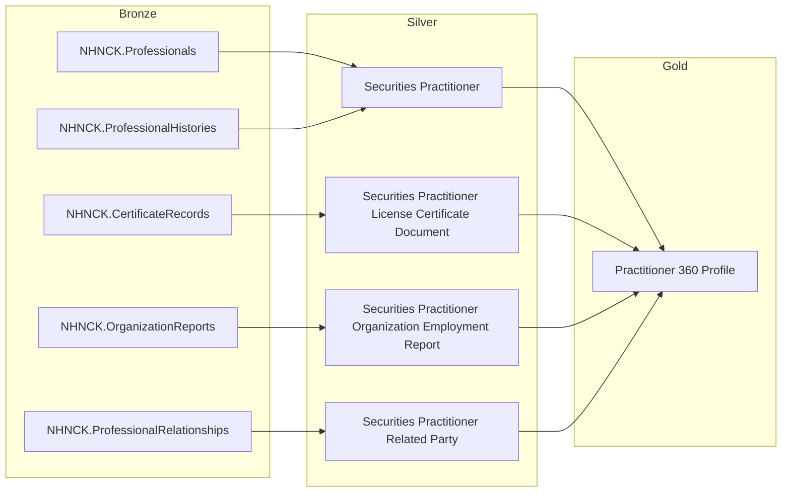

---

### Cụm 4: Lịch sử CCHN, Quá trình hành nghề, Vi phạm, Thi sát hạch, Cập nhật kiến thức

Phục vụ **Tab TRA CỨU HỒ SƠ 360°** — 5 sub-tab chi tiết. Mỗi bảng là Tác nghiệp — lookup 1 NHN cụ thể, lấy trực tiếp từ Silver.

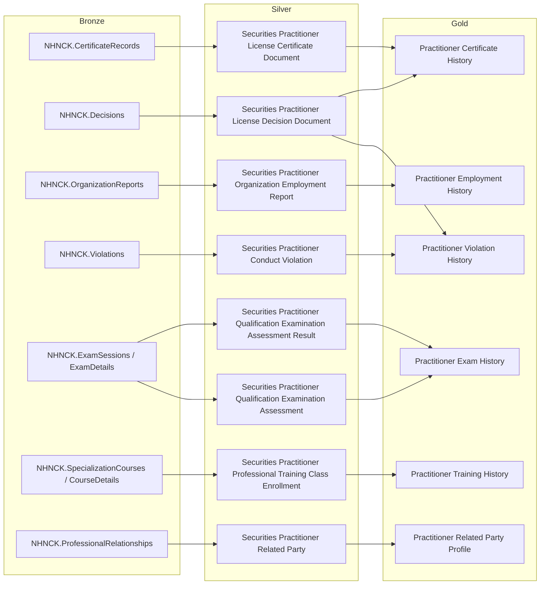

> **Ghi chú Cụm 4:** `Practitioner Employment History` (G2) nguồn từ `Securities Practitioner Organization Employment Report` (SV3) ← `NHNCK.OrganizationReports`. Không có Silver entity `Securities Practitioner Employment Status` từ `ProfessionalWorkHistories` trong scope này.

---

### Cụm 5: Data Explorer — Tra cứu danh sách CCHN (`Practitioner Data Explorer`)

Phục vụ **Tab DATA EXPLORER** — bảng tra cứu flat toàn bộ CCHN theo filter Loại chứng chỉ và Trạng thái. Lấy trực tiếp từ Silver, không khai thác qua Fact/Dim.

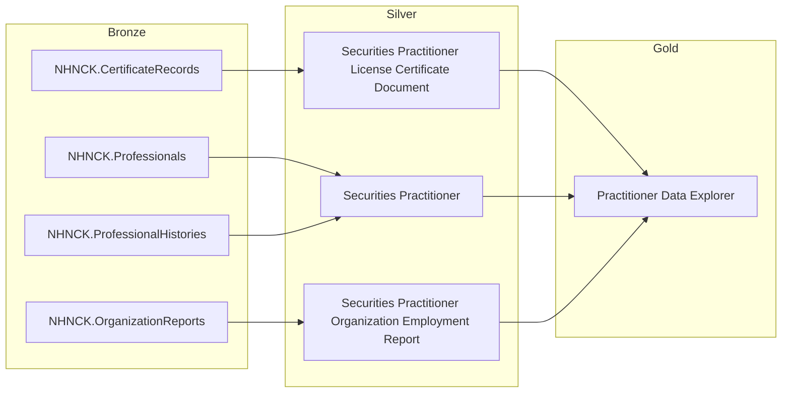

---

## Section 2 — Tổng quan báo cáo

### Tab: THỐNG KÊ CHUNG

**Slicer chung:** Năm (Year) — lấy từ `Calendar Date Dimension`. KPI lũy kế tính đến cuối năm đã chọn; KPI YTD (năm hiện tại) tính từ 01/01 đến today; KPI năm quá khứ tính đến 31/12/Y.

---

#### Nhóm 1 — Các chỉ tiêu tổng hợp thông tin chung (KPI thẻ)

> Phân loại: **Phân tích**
> Silver: `Securities Practitioner License Certificate Document` ← NHNCK.CertificateRecords — **READY**
> Ghi chú: `Certificate_Type_Code` (scheme: CERTIFICATE_TYPE) và `Certificate_Status_Code` (scheme: CERTIFICATE_STATUS) là FK → Classification Dimension — không vẽ relationship line trong erDiagram.

**Mockup:**

| KPI thẻ | Giá trị | So sánh cùng kỳ |
|---|---|---|
| Chứng chỉ cấp mới (YTD) | 1,580 CCHN (Cấp mới: 1,290 / Cấp lại: 290) | +13.7% |
| Bị thu hồi | 95 Case | +8% |
| CCHN đang hoạt động | 20,180 CCHN | +7.7% |
| CCHN Thu hồi 3 năm | 312 CCHN | -12.2% |
| CCHN Thu hồi vĩnh viễn | 98 CCHN | +11.4% |
| CCHN Đã bị hủy | 750 CCHN | -5% |

**Source:** `Fact Practitioner License Certificate Snapshot` → `Securities Practitioner Dimension`, `Calendar Date Dimension`, `Classification Dimension`

**Bảng KPI:**

| KPI ID | Tên KPI | Đơn vị | Tính chất | Công thức |
|---|---|---|---|---|
| K_NHNCK_2 | Chứng chỉ cấp mới (YTD) | CCHN | Base | COUNT(DISTINCT License Certificate Document Code) WHERE Certificate Issue Date BETWEEN 01/01/Y AND today (Y hiện tại) hoặc 31/12/Y (Y quá khứ) |
| K_NHNCK_2a | Cấp mới (lần đầu) | CCHN | Base | COUNT(DISTINCT License Certificate Document Code) WHERE Certificate Issue Date trong năm chọn AND Is Reissue Indicator = false |
| K_NHNCK_2b | Cấp lại | CCHN | Base | COUNT(DISTINCT License Certificate Document Code) WHERE Certificate Issue Date trong năm chọn AND Is Reissue Indicator = true |
| K_NHNCK_2_YOY | So sánh cùng kỳ — CCHN cấp mới YTD | % | Derived | (K_NHNCK_2[Y] − K_NHNCK_2[Y−1]) / K_NHNCK_2[Y−1] × 100% |
| K_NHNCK_3 | Bị thu hồi (lũy kế) | Case | Base | COUNT(DISTINCT License Certificate Document Code) WHERE Certificate Status Code = 'REVOKED' AND Revocation Date ≤ 31/12/Y (quá khứ) hoặc ≤ MAX(Snapshot_Date) trong Y (hiện tại) |
| K_NHNCK_3_YOY | So sánh cùng kỳ — Bị thu hồi | % | Derived | (K_NHNCK_3[Y] − K_NHNCK_3[Y−1]) / K_NHNCK_3[Y−1] × 100% |
| K_NHNCK_5 | CCHN đang hoạt động (lũy kế) | CCHN | Base | COUNT(DISTINCT License Certificate Document Code) WHERE Certificate Status Code = 'ACTIVE' tại Snapshot Date = 31/12/Y (quá khứ) hoặc MAX(Snapshot_Date) trong Y (hiện tại) |
| K_NHNCK_5_YOY | So sánh cùng kỳ — CCHN đang hoạt động | % | Derived | (K_NHNCK_5[Y] − K_NHNCK_5[Y−1]) / K_NHNCK_5[Y−1] × 100% |
| K_NHNCK_6 | CCHN Thu hồi 3 năm (lũy kế) | CCHN | Base | COUNT(DISTINCT License Certificate Document Code) WHERE Certificate Status Code = 'REVOKED' AND Allow Reissue Indicator = 1 AND Revocation Date ≤ 31/12/Y (quá khứ) hoặc ≤ MAX(Snapshot_Date) trong Y (hiện tại) |
| K_NHNCK_6_YOY | So sánh cùng kỳ — Thu hồi 3 năm | % | Derived | (K_NHNCK_6[Y] − K_NHNCK_6[Y−1]) / K_NHNCK_6[Y−1] × 100% |
| K_NHNCK_7 | CCHN Thu hồi vĩnh viễn (lũy kế) | CCHN | Base | COUNT(DISTINCT License Certificate Document Code) WHERE Certificate Status Code = 'REVOKED' AND Allow Reissue Indicator = 0 AND Revocation Date ≤ 31/12/Y (quá khứ) hoặc ≤ MAX(Snapshot_Date) trong Y (hiện tại) |
| K_NHNCK_7_YOY | So sánh cùng kỳ — Thu hồi vĩnh viễn | % | Derived | (K_NHNCK_7[Y] − K_NHNCK_7[Y−1]) / K_NHNCK_7[Y−1] × 100% |
| K_NHNCK_8 | CCHN Đã bị hủy (lũy kế) | CCHN | Base | COUNT(DISTINCT License Certificate Document Code) WHERE Certificate Status Code = 'CANCELLED' AND Revocation Date ≤ 31/12/Y (quá khứ) hoặc ≤ MAX(Snapshot_Date) trong Y (hiện tại) |
| K_NHNCK_8_YOY | So sánh cùng kỳ — Đã bị hủy | % | Derived | (K_NHNCK_8[Y] − K_NHNCK_8[Y−1]) / K_NHNCK_8[Y−1] × 100% |

> **Ghi chú KPI gap:** K_NHNCK_15 và K_NHNCK_16 không được sử dụng — gap do quá trình điều chỉnh phân loại KPI. Không re-number.

**Star Schema — Nhóm 1 (Fact Practitioner License Certificate Snapshot):**

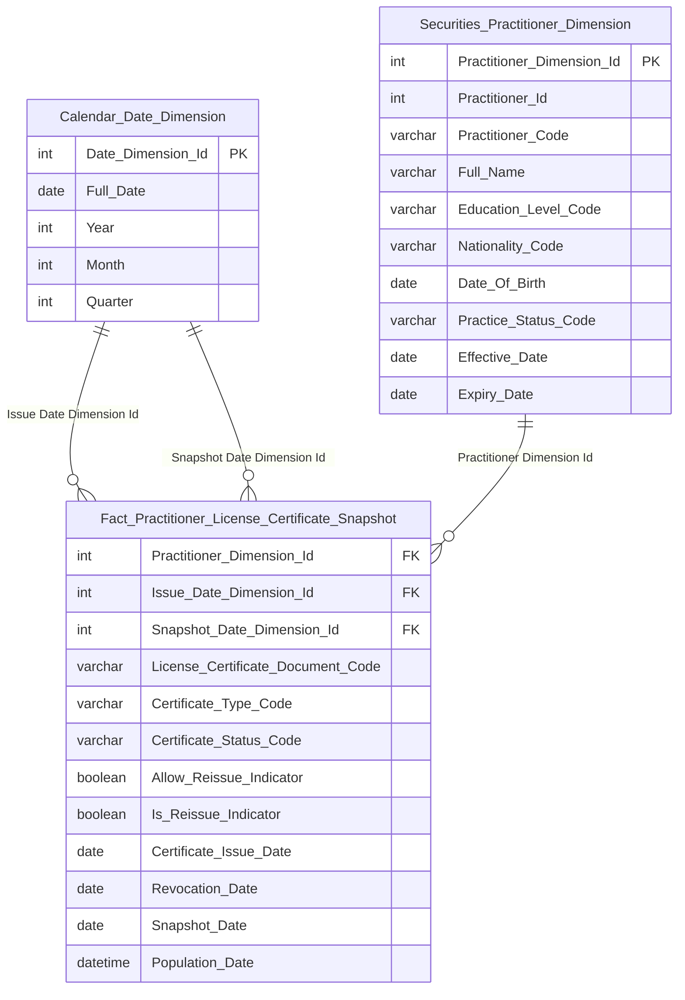

> **Ghi chú erDiagram:** `Certificate_Type_Code` (scheme: CERTIFICATE_TYPE) và `Certificate_Status_Code` (scheme: CERTIFICATE_STATUS) là FK → Classification Dimension — không vẽ relationship line theo convention. `License_Certificate_Document_Code` là DD — đơn vị đếm `COUNT(DISTINCT ...)`. `Is_Reissue_Indicator` là ETL-derived boolean: TRUE nếu `Application_Type_Code` (scheme: APPLICATION_TYPE) của hồ sơ liên kết = loại cấp lại — ETL join `CertificateRecords → Applications` qua `IssueDecisionId`. Tab DATA EXPLORER dùng bảng Tác nghiệp `Practitioner Data Explorer` riêng — không khai thác Fact này.

**Lineage Mart → Báo cáo — Nhóm 1:**

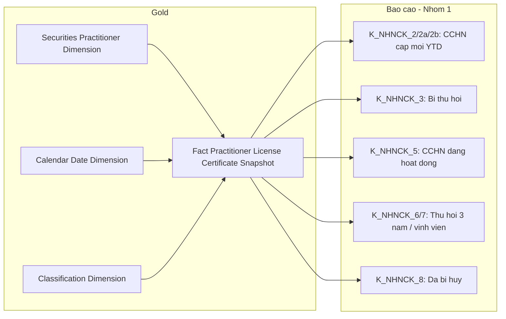

**Bảng grain — Nhóm 1:**

| Tên bảng | Grain |
|---|---|
| `Fact Practitioner License Certificate Snapshot` | 1 CCHN × 1 tháng snapshot (cuối tháng) |
| `Securities Practitioner Dimension` | 1 NHN per SCD2 version |
| `Calendar Date Dimension` | 1 ngày |
| `Classification Dimension` | 1 giá trị phân loại per scheme |

---

#### Nhóm 2 — Tổng người hành nghề & Cảnh báo NHNCK

> Phân loại: **Phân tích**
> Silver: `Securities Practitioner` ← NHNCK.Professionals / NHNCK.ProfessionalHistories — **READY**
> Silver: `Securities Practitioner Conduct Violation` ← NHNCK.Violations — **READY**

**Source:** `Fact Practitioner Daily Snapshot` → `Securities Practitioner Dimension`, `Calendar Date Dimension`

**Mockup:**

| KPI thẻ | Giá trị | So sánh cùng kỳ |
|---|---|---|
| Tổng người hành nghề | 21,340 NHN | +7.7% |
| Cảnh báo NHNCK | 148 NHN | +8.8% |

**Bảng KPI:**

| KPI ID | Tên KPI | Đơn vị | Tính chất | Công thức |
|---|---|---|---|---|
| K_NHNCK_1 | Tổng người hành nghề | Người | Base | COUNT(DISTINCT Dim.Practitioner Code) WHERE Has_Active_Certificate = true AND Snapshot_Date = 31/12/Y (năm quá khứ) hoặc MAX(Snapshot_Date) trong năm Y (năm hiện tại) — từ `Fact Practitioner Daily Snapshot` JOIN Dim |
| K_NHNCK_1_YOY | So sánh cùng kỳ — Tổng NHN | % | Derived | (K_NHNCK_1[Y] − K_NHNCK_1[Y−1]) / K_NHNCK_1[Y−1] × 100% |
| K_NHNCK_4 | Cảnh báo NHNCK | NHN | Base | COUNT(DISTINCT Dim.Practitioner Code) WHERE Has_Active_Violation = true AND Snapshot_Date = 31/12/Y (năm quá khứ) hoặc MAX(Snapshot_Date) trong năm Y (năm hiện tại) — từ `Fact Practitioner Daily Snapshot` JOIN Dim |
| K_NHNCK_4_YOY | So sánh cùng kỳ — Cảnh báo | % | Derived | (K_NHNCK_4[Y] − K_NHNCK_4[Y−1]) / K_NHNCK_4[Y−1] × 100% |

**Star Schema — Nhóm 2 (Fact Practitioner Daily Snapshot):**

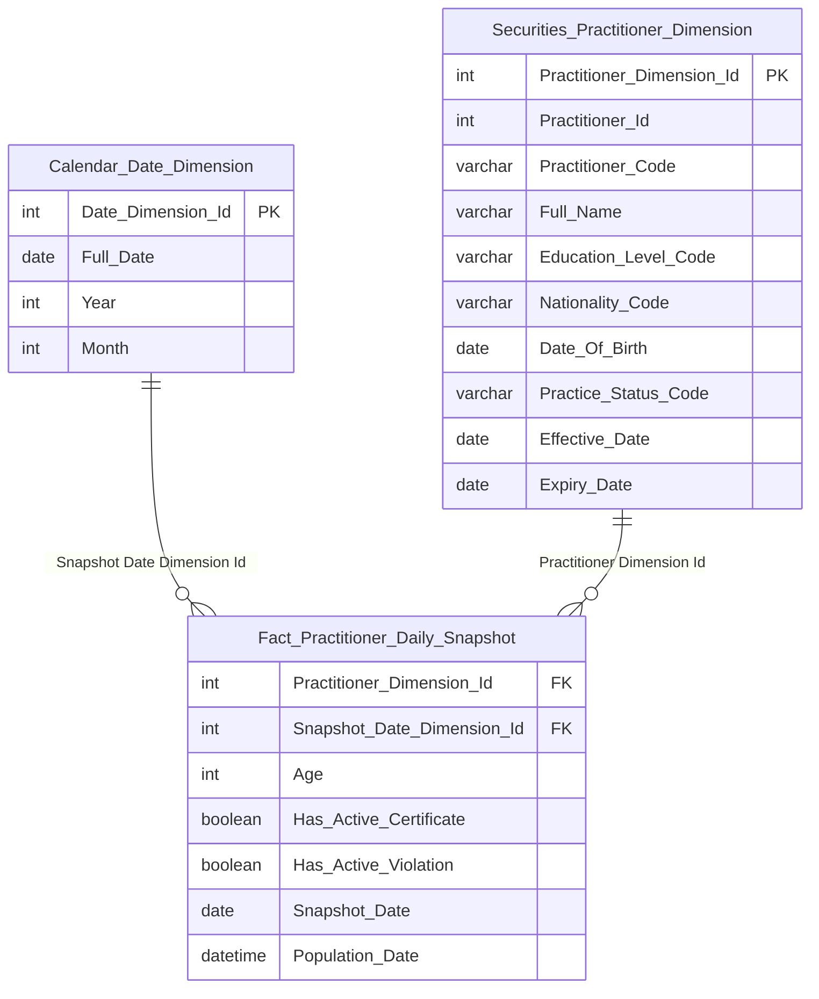

> **Ghi chú Fact Practitioner Daily Snapshot:**
> - Grain ngày: ETL append 1 row per NHN mỗi ngày. Slicer "chọn năm Y" = filter `Snapshot_Date = 31/12/Y` (năm quá khứ) hoặc `Snapshot_Date = MAX(Snapshot_Date) WHERE Year = Y` (năm hiện tại = ngày mới nhất có dữ liệu).
> - `Age` = ETL-derived int = Year(Snapshot_Date) − Year(Date_Of_Birth), tính từ `ProfessionalHistories.BirthDate`. Presentation layer tự nhóm thành age bands.
> - `Has_Active_Certificate` = boolean ETL-derived: TRUE nếu NHN có ít nhất 1 CCHN có `Certificate_Status_Code = 1 (Đang sử dụng)` tại ngày snapshot. Phục vụ K_NHNCK_1, K_NHNCK_9–14, K_NHNCK_23–32 (filter = true).
> - `Has_Active_Violation` = boolean ETL-derived: TRUE nếu NHN có ít nhất 1 vi phạm có `Violation_Status_Code = 1 (ACTIVE)` tại ngày snapshot. Xem O_NHNCK_5. Phục vụ K_NHNCK_4 (filter = true).
> - Thông tin Education_Level_Code, Nationality_Code, Practitioner_Code đọc qua JOIN `Securities Practitioner Dimension`.

**Lineage Mart → Báo cáo — Nhóm 2:**

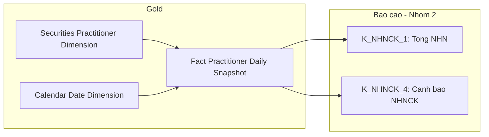

**Bảng grain — Nhóm 2:**

| Tên bảng | Grain |
|---|---|
| `Fact Practitioner Daily Snapshot` | 1 NHN × 1 ngày snapshot |
| `Securities Practitioner Dimension` | 1 NHN per SCD2 version |
| `Calendar Date Dimension` | 1 ngày |

---

#### Nhóm 3 — Biểu đồ cơ cấu theo loại hình CCHN

> Phân loại: **Phân tích**
> Silver: `Securities Practitioner License Certificate Document` ← NHNCK.CertificateRecords — **READY**
> Ghi chú: Dùng chung `Fact Practitioner License Certificate Snapshot` với Nhóm 1 — không thiết kế bảng mới.

**Source:** `Fact Practitioner License Certificate Snapshot` → `Securities Practitioner Dimension`, `Calendar Date Dimension`, `Classification Dimension`

**Bảng KPI:**

| KPI ID | Tên KPI | Đơn vị | Tính chất | Công thức |
|---|---|---|---|---|
| K_NHNCK_17 | Số lượng CCHN là Môi giới | CCHN | Base | COUNT(DISTINCT License Certificate Document Code) WHERE Certificate Type Code = 'MGCK' AND Certificate Status Code = 'ACTIVE' AND Snapshot Date = 31/12/Y (quá khứ) hoặc MAX(Snapshot_Date) trong Y (hiện tại) |
| K_NHNCK_18 | Số lượng CCHN là Phân tích | CCHN | Base | COUNT(DISTINCT License Certificate Document Code) WHERE Certificate Type Code = 'PTTC' AND Certificate Status Code = 'ACTIVE' AND Snapshot Date = 31/12/Y (quá khứ) hoặc MAX(Snapshot_Date) trong Y (hiện tại) |
| K_NHNCK_19 | Số lượng CCHN là QLQ | CCHN | Base | COUNT(DISTINCT License Certificate Document Code) WHERE Certificate Type Code = 'QLQ' AND Certificate Status Code = 'ACTIVE' AND Snapshot Date = 31/12/Y (quá khứ) hoặc MAX(Snapshot_Date) trong Y (hiện tại) |
| K_NHNCK_20 | Tỷ lệ CCHN Môi giới | % | Derived | K_NHNCK_17 / K_NHNCK_5 × 100% |
| K_NHNCK_21 | Tỷ lệ CCHN Phân tích | % | Derived | K_NHNCK_18 / K_NHNCK_5 × 100% |
| K_NHNCK_22 | Tỷ lệ CCHN QLQ | % | Derived | K_NHNCK_19 / K_NHNCK_5 × 100% |

**Lineage Mart → Báo cáo — Nhóm 3:**

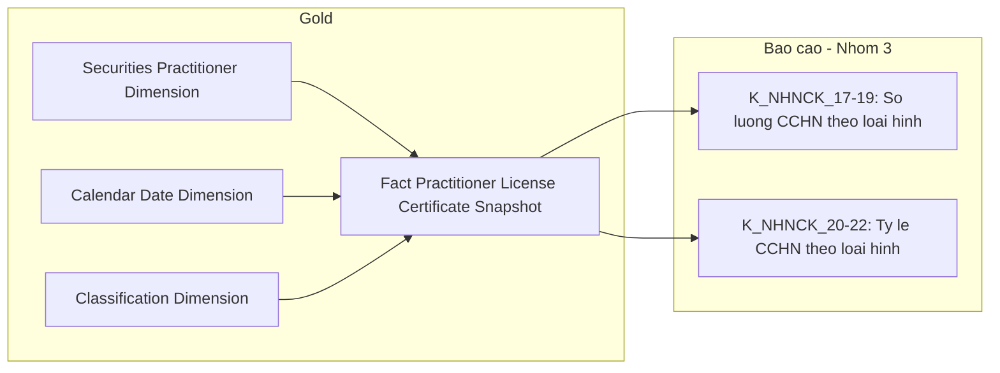

**Bảng grain — Nhóm 3:**

| Tên bảng | Grain |
|---|---|
| `Fact Practitioner License Certificate Snapshot` | 1 CCHN × 1 tháng snapshot (cuối tháng) — dùng chung với Nhóm 1 |

---

#### Nhóm 4 — Biểu đồ trình độ chuyên môn

> Phân loại: **Phân tích**
> Silver: `Securities Practitioner` ← NHNCK.Professionals / NHNCK.ProfessionalHistories — **READY**

**Source:** `Fact Practitioner Daily Snapshot` → `Securities Practitioner Dimension`, `Calendar Date Dimension`

**Mockup:**

| Trình độ | Số NHN | Tỷ lệ |
|---|---|---|
| Tiến sĩ | 450 | 2.1% |
| Thạc sĩ | 5,200 | 24.4% |
| Đại học | 15,690 | 73.5% |

**Bảng KPI:**

| KPI ID | Tên KPI | Đơn vị | Tính chất | Công thức |
|---|---|---|---|---|
| K_NHNCK_9 | Số lượng NHN Tiến sĩ | Người | Base | COUNT(DISTINCT Dim.Practitioner Code) WHERE Dim.Education Level Code = 'DOCTORATE' AND Has_Active_Certificate = true AND Snapshot_Date = 31/12/Y (quá khứ) hoặc MAX(Snapshot_Date) trong Y (hiện tại) |
| K_NHNCK_10 | Số lượng NHN Thạc sĩ | Người | Base | COUNT(DISTINCT Dim.Practitioner Code) WHERE Dim.Education Level Code = 'MASTER' AND Has_Active_Certificate = true AND Snapshot_Date = 31/12/Y (quá khứ) hoặc MAX(Snapshot_Date) trong Y (hiện tại) |
| K_NHNCK_11 | Số lượng NHN Đại học | Người | Base | COUNT(DISTINCT Dim.Practitioner Code) WHERE Dim.Education Level Code = 'BACHELOR' AND Has_Active_Certificate = true AND Snapshot_Date = 31/12/Y (quá khứ) hoặc MAX(Snapshot_Date) trong Y (hiện tại) |
| K_NHNCK_12 | Tỷ lệ Tiến sĩ | % | Derived | K_NHNCK_9 / K_NHNCK_1 × 100% |
| K_NHNCK_13 | Tỷ lệ Thạc sĩ | % | Derived | K_NHNCK_10 / K_NHNCK_1 × 100% |
| K_NHNCK_14 | Tỷ lệ Đại học | % | Derived | K_NHNCK_11 / K_NHNCK_1 × 100% |

**Star Schema — Nhóm 4 (Fact Practitioner Daily Snapshot):**


**Lineage Mart → Báo cáo — Nhóm 4:**

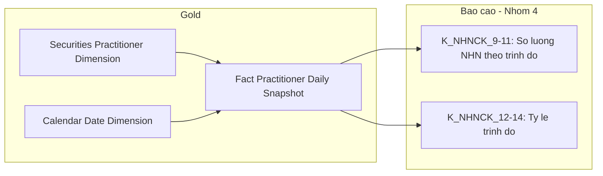

**Bảng grain — Nhóm 4:**

| Tên bảng | Grain |
|---|---|
| `Fact Practitioner Daily Snapshot` | 1 NHN × 1 ngày snapshot |
| `Securities Practitioner Dimension` | 1 NHN per SCD2 version |
| `Calendar Date Dimension` | 1 ngày |

---

#### Nhóm 5 — Biểu đồ phân bổ độ tuổi

> Phân loại: **Phân tích**
> Silver: `Securities Practitioner` ← NHNCK.Professionals / NHNCK.ProfessionalHistories — **READY**

**Source:** `Fact Practitioner Daily Snapshot` → `Securities Practitioner Dimension`, `Calendar Date Dimension`

**Mockup:**

| Nhóm tuổi | Quốc tịch VN | Nước ngoài |
|---|---|---|
| 18–21 | 120 | 5 |
| 22–30 | 4,500 | 85 |
| 31–40 | 9,800 | 210 |
| 41–50 | 5,200 | 180 |
| 50+ | 1,200 | 40 |

**Bảng KPI:**

| KPI ID | Tên KPI | Đơn vị | Tính chất | Công thức |
|---|---|---|---|---|
| K_NHNCK_23 | Số NHN 18–21 quốc tịch VN | Người | Base | COUNT(DISTINCT Dim.Practitioner Code) WHERE Age BETWEEN 18 AND 21 AND Dim.Nationality Code = 'VN' AND Has_Active_Certificate = true AND Snapshot_Date = 31/12/Y (quá khứ) hoặc MAX(Snapshot_Date) trong Y (hiện tại) |
| K_NHNCK_24 | Số NHN 22–30 quốc tịch VN | Người | Base | COUNT(DISTINCT Dim.Practitioner Code) WHERE Age BETWEEN 22 AND 30 AND Dim.Nationality Code = 'VN' AND Has_Active_Certificate = true AND Snapshot_Date = 31/12/Y (quá khứ) hoặc MAX(Snapshot_Date) trong Y (hiện tại) |
| K_NHNCK_25 | Số NHN 31–40 quốc tịch VN | Người | Base | COUNT(DISTINCT Dim.Practitioner Code) WHERE Age BETWEEN 31 AND 40 AND Dim.Nationality Code = 'VN' AND Has_Active_Certificate = true AND Snapshot_Date = 31/12/Y (quá khứ) hoặc MAX(Snapshot_Date) trong Y (hiện tại) |
| K_NHNCK_26 | Số NHN 41–50 quốc tịch VN | Người | Base | COUNT(DISTINCT Dim.Practitioner Code) WHERE Age BETWEEN 41 AND 50 AND Dim.Nationality Code = 'VN' AND Has_Active_Certificate = true AND Snapshot_Date = 31/12/Y (quá khứ) hoặc MAX(Snapshot_Date) trong Y (hiện tại) |
| K_NHNCK_27 | Số NHN 50+ quốc tịch VN | Người | Base | COUNT(DISTINCT Dim.Practitioner Code) WHERE Age > 50 AND Dim.Nationality Code = 'VN' AND Has_Active_Certificate = true AND Snapshot_Date = 31/12/Y (quá khứ) hoặc MAX(Snapshot_Date) trong Y (hiện tại) |
| K_NHNCK_28 | Số NHN 18–21 nước ngoài | Người | Base | COUNT(DISTINCT Dim.Practitioner Code) WHERE Age BETWEEN 18 AND 21 AND Dim.Nationality Code != 'VN' AND Has_Active_Certificate = true AND Snapshot_Date = 31/12/Y (quá khứ) hoặc MAX(Snapshot_Date) trong Y (hiện tại) |
| K_NHNCK_29 | Số NHN 22–30 nước ngoài | Người | Base | COUNT(DISTINCT Dim.Practitioner Code) WHERE Age BETWEEN 22 AND 30 AND Dim.Nationality Code != 'VN' AND Has_Active_Certificate = true AND Snapshot_Date = 31/12/Y (quá khứ) hoặc MAX(Snapshot_Date) trong Y (hiện tại) |
| K_NHNCK_30 | Số NHN 31–40 nước ngoài | Người | Base | COUNT(DISTINCT Dim.Practitioner Code) WHERE Age BETWEEN 31 AND 40 AND Dim.Nationality Code != 'VN' AND Has_Active_Certificate = true AND Snapshot_Date = 31/12/Y (quá khứ) hoặc MAX(Snapshot_Date) trong Y (hiện tại) |
| K_NHNCK_31 | Số NHN 41–50 nước ngoài | Người | Base | COUNT(DISTINCT Dim.Practitioner Code) WHERE Age BETWEEN 41 AND 50 AND Dim.Nationality Code != 'VN' AND Has_Active_Certificate = true AND Snapshot_Date = 31/12/Y (quá khứ) hoặc MAX(Snapshot_Date) trong Y (hiện tại) |
| K_NHNCK_32 | Số NHN 50+ nước ngoài | Người | Base | COUNT(DISTINCT Dim.Practitioner Code) WHERE Age > 50 AND Dim.Nationality Code != 'VN' AND Has_Active_Certificate = true AND Snapshot_Date = 31/12/Y (quá khứ) hoặc MAX(Snapshot_Date) trong Y (hiện tại) |

**Star Schema — Nhóm 5 (Fact Practitioner Daily Snapshot):**


**Lineage Mart → Báo cáo — Nhóm 5:**

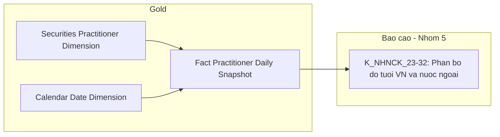

**Bảng grain — Nhóm 5:**

| Tên bảng | Grain |
|---|---|
| `Fact Practitioner Daily Snapshot` | 1 NHN × 1 ngày snapshot |
| `Securities Practitioner Dimension` | 1 NHN per SCD2 version |
| `Calendar Date Dimension` | 1 ngày |

---

### Tab: TRA CỨU HỒ SƠ 360°

**Slicer:** Tìm kiếm theo Tên, Số CCHN, Nơi công tác. Filter Loại chứng chỉ. Không có slicer thời gian.

---

#### Nhóm 6 — Màn hình danh sách & Header NHN 360°

> Phân loại: **Tác nghiệp**
> Silver: `Securities Practitioner` ← NHNCK.Professionals / NHNCK.ProfessionalHistories — **READY**
> Silver: `Securities Practitioner License Certificate Document` ← NHNCK.CertificateRecords — **READY**
> Silver: `Securities Practitioner Organization Employment Report` ← NHNCK.OrganizationReports — **READY**
> Silver: `Securities Practitioner Related Party` ← NHNCK.ProfessionalRelationships — **READY**

**Mockup — Danh sách:**

| Tên | Tuổi | Quốc tịch | Loại CCHN | Số CCHN | Nơi công tác | Trạng thái |
|---|---|---|---|---|---|---|
| Nguyễn Văn A | 34 tuổi | Việt Nam | Môi giới | CCHN-2023-001 | TESLA | Đang hoạt động |
| Lê Thị Thu B | 37 tuổi | Việt Nam | Phân tích | CCHN-2024-045 | META | Đang hoạt động |
| Trần Minh C | 42 tuổi | Nhật | Quản lý quỹ | CCHN-QLQ-2019-112 | GOOGLE | Đang hoạt động |

**Mockup — Header chi tiết NHN:**

```
[Avatar] Nguyễn Văn A  ● Môi giới chứng khoán
15/03/1991 (34y) | Việt Nam | 001091003456 | TESLA | ĐANG HOẠT ĐỘNG
AS OF: 30/09/2025 | 3 N/Quan | 4 Doanh nghiệp (PENDING SGDCK)
```

**Source:** `Practitioner 360 Profile` (Tác nghiệp — trực tiếp từ Silver)

**Bảng KPI:**

| KPI ID | Tên KPI | Đơn vị | Tính chất | Nguồn |
|---|---|---|---|---|
| K_NHNCK_33 | Họ tên NHN | Text | Base | `Securities Practitioner`.Full Name |
| K_NHNCK_34 | Ngày sinh | Date | Base | `Securities Practitioner`.Date Of Birth |
| K_NHNCK_35 | Tuổi | Int | Derived | Year(Population_Date) − Year(Date_Of_Birth) — ETL-derived khi populate `Practitioner 360 Profile` |
| K_NHNCK_36 | Quốc tịch | Text | Base | `Securities Practitioner`.Nationality Code — ETL denormalize Name từ Classification (scheme: NATIONALITY) khi populate bảng |
| K_NHNCK_37 | Số định danh / Hộ chiếu | Text | Base | `Securities Practitioner`.Identity Reference Code |
| K_NHNCK_38 | Nơi công tác hiện tại | Text | Base | `Securities Practitioner Organization Employment Report`.Securities Organization Code — bản report mới nhất có Termination Date = NULL |
| K_NHNCK_39 | Loại CCHN hiện tại | Text | Base | `Securities Practitioner License Certificate Document`.Certificate Type Code — CCHN trạng thái ACTIVE |
| K_NHNCK_40 | Số CCHN hiện tại | Text | Base | `Securities Practitioner License Certificate Document`.Certificate Number — CCHN trạng thái ACTIVE |
| K_NHNCK_41 | Trạng thái NHNCK | Text | Base | `Securities Practitioner`.Practice Status Code |
| K_NHNCK_42 | Số người liên quan (N/Quan) | Int | Base | COUNT(*) từ `Securities Practitioner Related Party` per NHN — chờ BA xác nhận có filter loại quan hệ không (O_NHNCK_7) |

**Schema bảng tác nghiệp:**

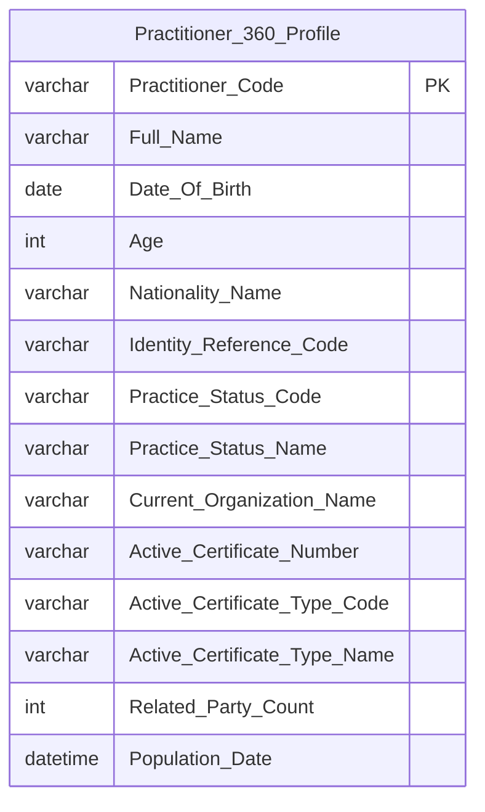

> **Ghi chú schema:** `Current_Organization_Name` ETL-derived — lookup `Securities Organization Reference`.Organization Name qua `Securities_Organization_Code` từ `Organization Employment Report`. `Nationality_Name`, `Practice_Status_Name`, `Active_Certificate_Type_Name` là ETL-derived — denormalize từ Classification tại thời điểm populate bảng, không join ở query time. `Related_Party_Count` READY từ `Securities Practitioner Related Party` — chờ BA xác nhận filter (O_NHNCK_7). `Listed_Company_Count` đã xóa — PENDING SGDCK (O_NHNCK_6).

**Lineage Mart → Báo cáo — Nhóm 6:**

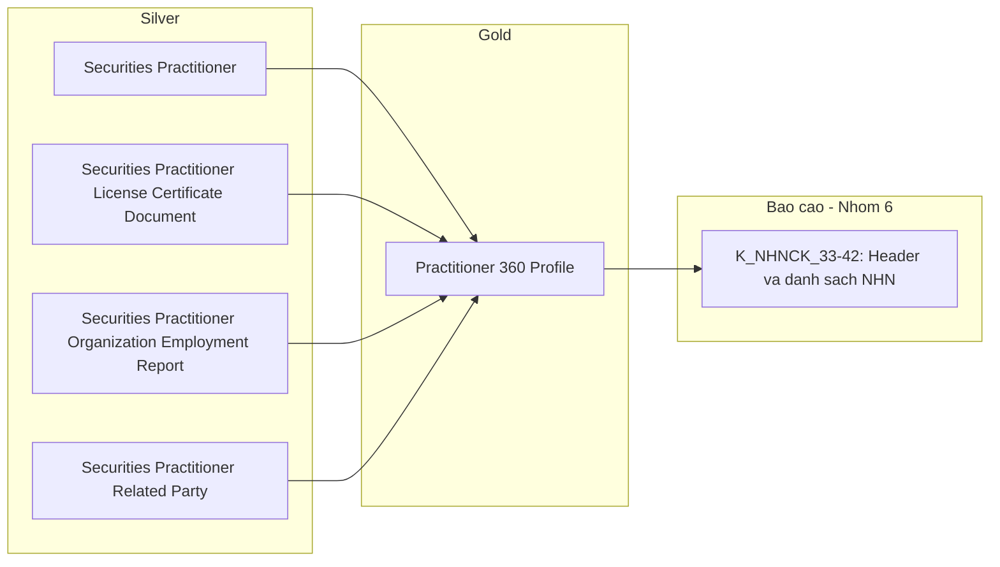

**Bảng grain — Nhóm 6:**

| Tên bảng | Grain |
|---|---|
| `Practitioner 360 Profile` | 1 NHN (latest state) |

---

#### Nhóm 7 — Sub-tab Lịch sử cấp chứng chỉ hành nghề

> Phân loại: **Tác nghiệp**
> Silver: `Securities Practitioner License Certificate Document` ← NHNCK.CertificateRecords — **READY**
> Silver: `Securities Practitioner License Decision Document` ← NHNCK.Decisions — **READY**

**Mockup:**

| Số CCHN | Loại hình | Ngày cấp | Ngày thu hồi | Quyết định cấp | Trạng thái |
|---|---|---|---|---|---|
| CCHN-2023-001 | Môi giới chứng khoán | 12/05/2023 | — | 145/QĐ-UBCK | Đang hiệu lực |
| CCHN-2020-045 | Phân tích chứng khoán | 20/10/2020 | 20/10/2023 | 89/QĐ-UBCK | Thu hồi trong 3 năm |
| CCHN-2017-012 | Môi giới chứng khoán | 15/01/2017 | 15/01/2020 | 12/QĐ-UBCK | Thu hồi vĩnh viễn |

**Source:** `Practitioner Certificate History` (Tác nghiệp)

**Bảng KPI:**

| KPI ID | Tên KPI | Đơn vị | Tính chất | Nguồn |
|---|---|---|---|---|
| K_NHNCK_43 | Số CCHN | Text | Base | `Securities Practitioner License Certificate Document`.Certificate Number |
| K_NHNCK_44 | Loại hình hành nghề | Text | Base | `Securities Practitioner License Certificate Document`.Certificate Type Code — ETL denormalize Certificate Type Name khi populate bảng |
| K_NHNCK_45 | Ngày cấp | Date | Base | Certificate Issue Date |
| K_NHNCK_46 | Ngày thu hồi | Date | Base | Revocation Date (nullable) |
| K_NHNCK_47 | Số quyết định cấp | Text | Base | `Securities Practitioner License Decision Document`.Decision Number (Issuance) |
| K_NHNCK_48 | Trạng thái CCHN | Text | Base | `Securities Practitioner License Certificate Document`.Certificate Status Code — ETL denormalize Certificate Status Name khi populate bảng |

**Schema bảng tác nghiệp:**

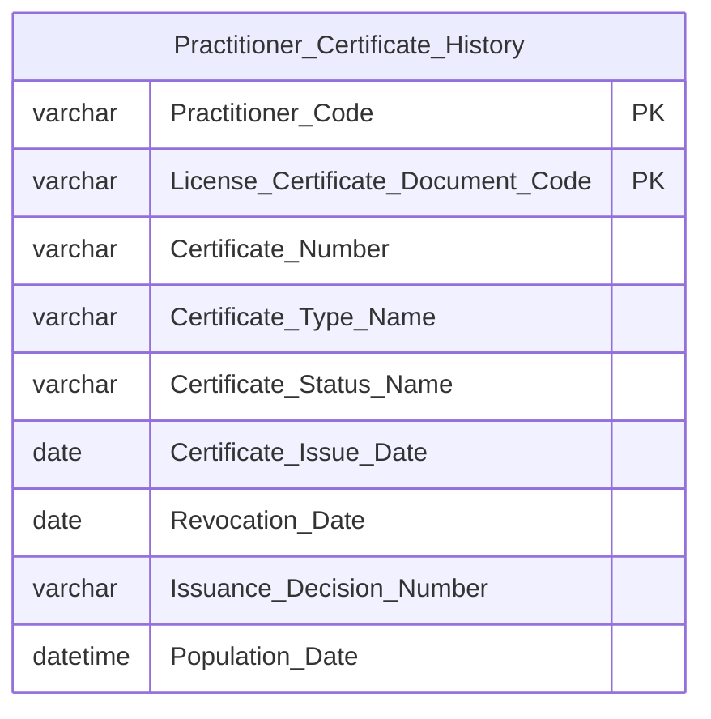

> **Ghi chú schema Nhóm 7:** `Certificate_Type_Name` và `Certificate_Status_Name` là ETL-derived — denormalize từ Classification tại thời điểm populate bảng Tác nghiệp. Presentation layer đọc trực tiếp từ bảng này, không join Classification ở query time.

**Lineage Mart → Báo cáo — Nhóm 7:**

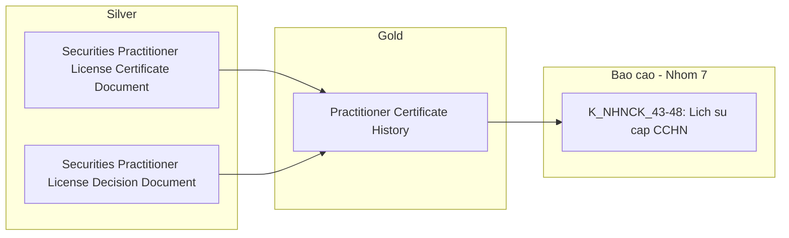

**Bảng grain — Nhóm 7:**

| Tên bảng | Grain |
|---|---|
| `Practitioner Certificate History` | 1 CCHN per NHN (toàn bộ lịch sử) |

---

#### Nhóm 8 — Sub-tab Quá trình hành nghề

> Phân loại: **Tác nghiệp**
> Silver: `Securities Practitioner Organization Employment Report` ← NHNCK.OrganizationReports — **READY**
> Ghi chú: Nguồn là `NHNCK.OrganizationReports` — không phải `ProfessionalWorkHistories`. `Current_Organization_Name` ETL-derived qua join `Securities Organization Reference`.Organization Name theo `Securities_Organization_Code`.

**Mockup:**

| Tổ chức | Vị trí | Từ tháng | Đến tháng | Trạng thái |
|---|---|---|---|---|
| Tesla | Môi giới chứng khoán | 12/05/2023 | Hiện nay | Hiện tại |
| Công ty CP Chứng khoán AAA | Trưởng phòng Môi giới | 12/01/2018 | 11/05/2023 | Quá khứ |
| Vụ Giám sát TTCK - UBCKNN | Chuyên viên chính | 30/10/2012 | 11/01/2018 | Quá khứ |

**Source:** `Practitioner Employment History` (Tác nghiệp)

**Bảng KPI:**

| KPI ID | Tên KPI | Đơn vị | Tính chất | Nguồn |
|---|---|---|---|---|
| K_NHNCK_49 | Tên tổ chức | Text | Base | `Practitioner Employment History`.Securities Organization Name — ETL-derived: lookup `Securities Organization Reference`.Organization Name theo `Securities_Organization_Code` khi populate bảng |
| K_NHNCK_50 | Vị trí công tác | Text | Base | Position Name (text tự do từ OrganizationReports) |
| K_NHNCK_51 | Từ tháng | Date | Base | Hire Date |
| K_NHNCK_52 | Đến tháng | Date | Base | Termination Date (NULL = Hiện nay) |
| K_NHNCK_53 | Trạng thái làm việc | Text | Derived | NULL Termination Date → "Hiện tại"; có Termination Date → "Quá khứ" — derive tại presentation layer từ `Hire_Date` và `Termination_Date` |

**Schema bảng tác nghiệp:**

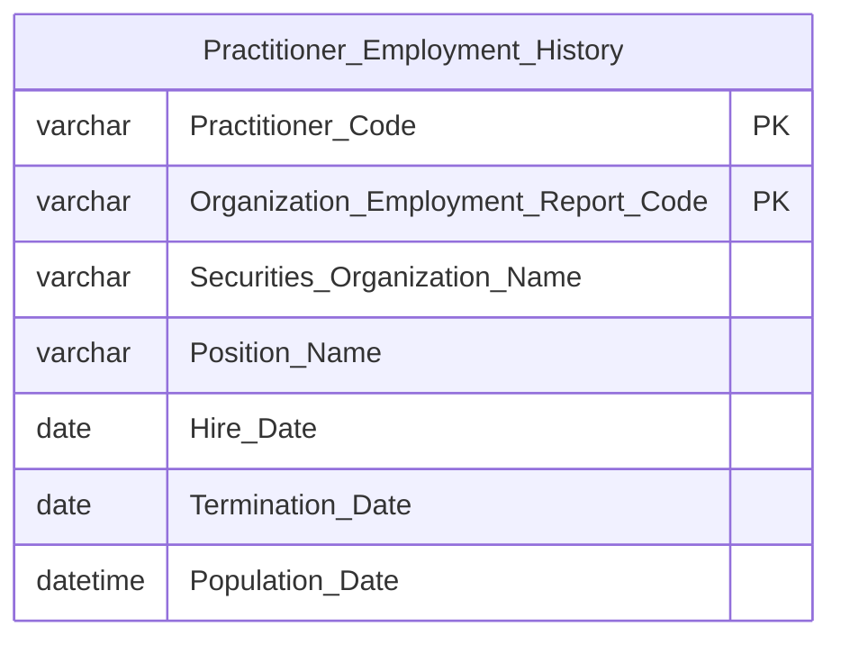

**Lineage Mart → Báo cáo — Nhóm 8:**

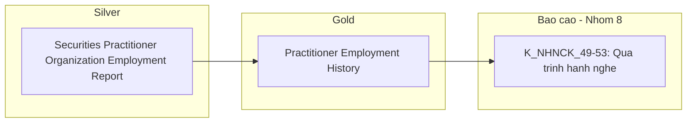

**Bảng grain — Nhóm 8:**

| Tên bảng | Grain |
|---|---|
| `Practitioner Employment History` | 1 lần công tác per NHN (toàn bộ lịch sử) |

---

#### Nhóm 9 — Sub-tab Lịch sử vi phạm & xử phạt hành chính

> Phân loại: **Tác nghiệp**
> Silver: `Securities Practitioner Conduct Violation` ← NHNCK.Violations — **READY**
> Silver: `Securities Practitioner License Decision Document` ← NHNCK.Decisions — **READY**

**Mockup:**

| Ngày quyết định | Số quyết định | Nội dung vi phạm | Hình thức xử phạt | Trạng thái |
|---|---|---|---|---|
| 15/10/2023 | 142/QĐ-XPHC | Thao túng giá chứng khoán | 550,000,000 VND | Đã thực thi |
| 05/02/2021 | 24/QĐ-UBCK | Chậm công bố thông tin sở hữu | Cảnh cáo | Đã ban hành |
| 12/11/2019 | BC-0012/CTCK | Vi phạm quy trình mở tài khoản | Đình chỉ hành nghề 3 tháng | Đang thực thi |

**Source:** `Practitioner Violation History` (Tác nghiệp)

**Bảng KPI:**

| KPI ID | Tên KPI | Đơn vị | Tính chất | Nguồn |
|---|---|---|---|---|
| K_NHNCK_54 | Số quyết định xử phạt | Text | Base | `Securities Practitioner License Decision Document`.Decision Number |
| K_NHNCK_55 | Ngày quyết định | Date | Base | `Securities Practitioner License Decision Document`.Issue Date |
| K_NHNCK_56 | Nội dung vi phạm | Text | Base | `Securities Practitioner Conduct Violation`.Violation Note |
| K_NHNCK_57 | Hình thức xử phạt | Text | Base | `Securities Practitioner Conduct Violation`.Conduct Violation Type Code — ETL denormalize Violation Type Name khi populate bảng |
| K_NHNCK_58 | Trạng thái vi phạm | Text | Base | `Securities Practitioner Conduct Violation`.Violation Status Code — ETL denormalize Violation Status Name khi populate bảng |

**Schema bảng tác nghiệp:**

```mermaid
erDiagram
    Practitioner_Violation_History {
        varchar Practitioner_Code PK
        varchar Conduct_Violation_Code PK
        varchar Conduct_Violation_Type_Name
        varchar Violation_Note
        varchar Violation_Status_Name
        varchar Decision_Number
        date Decision_Issue_Date
        datetime Population_Date
    }
```

> **Ghi chú schema Nhóm 9:** `Conduct_Violation_Type_Name` và `Violation_Status_Name` là ETL-derived — denormalize từ Classification tại thời điểm populate bảng. Presentation đọc trực tiếp.

**Lineage Mart → Báo cáo — Nhóm 9:**

```mermaid
flowchart LR
    subgraph SIL["Silver"]
        SV1["Securities Practitioner Conduct Violation"]
        SV2["Securities Practitioner License Decision Document"]
    end
    subgraph GOLD["Gold"]
        G1["Practitioner Violation History"]
    end
    subgraph RPT["Bao cao - Nhom 9"]
        R1["K_NHNCK_54-58: Lich su vi pham"]
    end
    SV1 --> G1
    SV2 --> G1
    G1 --> R1
```

**Bảng grain — Nhóm 9:**

| Tên bảng | Grain |
|---|---|
| `Practitioner Violation History` | 1 vi phạm per NHN (toàn bộ lịch sử) |

---

#### Nhóm 10 — Sub-tab Đợt thi sát hạch

> Phân loại: **Tác nghiệp**
> Silver: `Securities Practitioner Qualification Examination Assessment Result` ← NHNCK.ExamDetails — **READY**
> Silver: `Securities Practitioner Qualification Examination Assessment` ← NHNCK.ExamSessions — **READY**
> Silver: `Securities Practitioner License Decision Document` ← NHNCK.Decisions — **READY**

**Mockup:**

| Đợt thi | Điểm thi | Ngày thi | Số quyết định công bố | Trạng thái |
|---|---|---|---|---|
| Đợt 1/2025 | 82 | 15/03/2025 | 45/QĐ-UBCK · 20/03/2025 | Đạt |
| Đợt 2/2024 | 58 | 10/09/2023 | — | Không đạt |
| Đợt 1/2023 | 75 | 18/03/2023 | 28/QĐ-UBCK · 25/03/2025 | Đạt |

**Source:** `Practitioner Exam History` (Tác nghiệp)

**Bảng KPI:**

| KPI ID | Tên KPI | Đơn vị | Tính chất | Nguồn |
|---|---|---|---|---|
| K_NHNCK_59 | Tên đợt thi | Text | Base | `Securities Practitioner Qualification Examination Assessment`.Session Name |
| K_NHNCK_60 | Ngày thi | Date | Base | Examination Start Date |
| K_NHNCK_61 | Điểm thi | Text | Base | `Securities Practitioner Qualification Examination Assessment Result`.Law Score / Specialization Score |
| K_NHNCK_62 | Số quyết định công bố | Text | Base | `Securities Practitioner License Decision Document`.Decision Number — Decision trên ExamSession |
| K_NHNCK_63 | Trạng thái Đạt/Không đạt | Text | Base | `Securities Practitioner Qualification Examination Assessment Result`.Examination Result Code (scheme: EXAMINATION_RESULT — 1: Đạt, 0: Không đạt) — Silver READY, không cần derive |

**Schema bảng tác nghiệp:**

```mermaid
erDiagram
    Practitioner_Exam_History {
        varchar Practitioner_Code PK
        varchar Examination_Assessment_Result_Code PK
        varchar Session_Name
        date Examination_Start_Date
        varchar Law_Score
        varchar Specialization_Score
        varchar Examination_Result_Code
        varchar Decision_Number
        date Decision_Issue_Date
        datetime Population_Date
    }
```

**Lineage Mart → Báo cáo — Nhóm 10:**

```mermaid
flowchart LR
    subgraph SIL["Silver"]
        SV1["Securities Practitioner Qualification Examination Assessment Result"]
        SV2["Securities Practitioner Qualification Examination Assessment"]
        SV3["Securities Practitioner License Decision Document"]
    end
    subgraph GOLD["Gold"]
        G1["Practitioner Exam History"]
    end
    subgraph RPT["Bao cao - Nhom 10"]
        R1["K_NHNCK_59-63: Dot thi sat hach"]
    end
    SV1 --> G1
    SV2 --> G1
    SV3 --> G1
    G1 --> R1
```

**Bảng grain — Nhóm 10:**

| Tên bảng | Grain |
|---|---|
| `Practitioner Exam History` | 1 lần thi per NHN (toàn bộ lịch sử) |

---

#### Nhóm 11 — Sub-tab Cập nhật kiến thức hành nghề

> Phân loại: **Tác nghiệp**
> Silver: `Securities Practitioner Professional Training Class Enrollment` ← NHNCK.SpecializationCourseDetails — **READY**
> Silver: `Securities Practitioner Professional Training Class` ← NHNCK.SpecializationCourses — **READY**
> Ghi chú: Silver `SpecializationCourses` phục vụ khóa học chứng chỉ chuyên môn (CPA, CFA...) theo UID04, đồng thời UID10 dùng cùng bảng này cho cập nhật kiến thức hành nghề. Cần BA xác nhận Silver có attribute giờ học không — xem O_NHNCK_9.

**Mockup:**

| Năm | Số giờ | Kết quả | Trạng thái |
|---|---|---|---|
| 2024 | 10/8h | Loại A | Đã đủ 8h |
| 2023 | 5/8h | Chưa kiểm tra | Chưa đủ 8h |
| 2022 | 0/8h | N/A | Chưa đủ 8h |
| 2021 | 8/8h | Loại B | Đã đủ 8h |

**Source:** `Practitioner Training History` (Tác nghiệp)

**Bảng KPI:**

| KPI ID | Tên KPI | Đơn vị | Tính chất | Nguồn |
|---|---|---|---|---|
| K_NHNCK_64 | Năm cập nhật | Int | Base | `Securities Practitioner Professional Training Class`.Academic Year (CAST sang int) |
| K_NHNCK_65 | Số giờ cập nhật | Float | Base | Chưa xác định attribute trong Silver — xem O_NHNCK_9 |
| K_NHNCK_66 | Kết quả kiểm tra | Text | Base | `Securities Practitioner Professional Training Class Enrollment`.Assessment Result Code — ETL denormalize Assessment Result Name khi populate bảng |
| K_NHNCK_67 | Trạng thái đủ 8h | Text | Derived | **PENDING** — phụ thuộc O_NHNCK_9: cần có `Training_Hours` trước khi có thể derive. Logic dự kiến: SUM(Training_Hours) WHERE Training_Year = Y ≥ 8 → "Đã đủ 8h" |

**Schema bảng tác nghiệp:**

```mermaid
erDiagram
    Practitioner_Training_History {
        varchar Practitioner_Code PK
        varchar Enrollment_Code PK
        int Training_Year
        varchar Assessment_Result_Name
        datetime Population_Date
    }
```

> **Ghi chú:** `Training_Hours` bị xóa khỏi schema — chưa tìm thấy attribute tương ứng trong Silver. `Is_Hours_Sufficient` bị xóa — phụ thuộc việc có `Training_Hours` không. Xem O_NHNCK_9.

**Lineage Mart → Báo cáo — Nhóm 11:**

```mermaid
flowchart LR
    subgraph SIL["Silver"]
        SV1["Securities Practitioner Professional Training Class Enrollment"]
        SV2["Securities Practitioner Professional Training Class"]
    end
    subgraph GOLD["Gold"]
        G1["Practitioner Training History"]
    end
    subgraph RPT["Bao cao - Nhom 11"]
        R1["K_NHNCK_64-67: Cap nhat kien thuc"]
    end
    SV1 --> G1
    SV2 --> G1
    G1 --> R1
```

**Bảng grain — Nhóm 11:**

| Tên bảng | Grain |
|---|---|
| `Practitioner Training History` | 1 lần đăng ký khóa học per NHN — presentation GROUP BY `Training_Year` để hiển thị tổng hợp theo năm |

---

#### Nhóm 12 — Sub-tab Hồ sơ / Mạng lưới người liên quan

> Phân loại: **Tác nghiệp**
> Silver: `Securities Practitioner Related Party` ← NHNCK.ProfessionalRelationships — **READY**
> Ghi chú: Phục vụ phần "Mạng lưới người liên quan" trong sub-tab Hồ sơ. Mỗi row = 1 người liên quan của NHN (vợ/chồng, con, bố/mẹ...). Cần BA xác nhận filter loại quan hệ — xem O_NHNCK_7.

**Mockup:**

| Họ và tên | Mối quan hệ | Nghề nghiệp | Nơi làm việc |
|---|---|---|---|
| Lê Thị Hồng A | Vợ | Kinh doanh tự do | — |
| Nguyễn Thế B | Con trai | Du học sinh | — |
| Trần Văn C | Em rể | Giám đốc DN tư nhân | — |

**Source:** `Practitioner Related Party Profile` (Tác nghiệp — trực tiếp từ Silver)

**Bảng KPI:**

| KPI ID | Tên KPI | Đơn vị | Tính chất | Nguồn |
|---|---|---|---|---|
| K_NHNCK_75 | Họ và tên người liên quan | Text | Base | `Securities Practitioner Related Party`.Related Party Full Name |
| K_NHNCK_76 | Mối quan hệ | Text | Base | `Securities Practitioner Related Party`.Relationship Type Code — ETL denormalize Relationship Type Name khi populate bảng |
| K_NHNCK_77 | Nghề nghiệp | Text | Base | `Securities Practitioner Related Party`.Occupation Name |
| K_NHNCK_78 | Nơi làm việc | Text | Base | `Securities Practitioner Related Party`.Workplace Name |

**Schema bảng tác nghiệp:**

```mermaid
erDiagram
    Practitioner_Related_Party_Profile {
        varchar Practitioner_Code PK
        varchar Securities_Practitioner_Related_Party_Code PK
        varchar Related_Party_Full_Name
        varchar Relationship_Type_Name
        varchar Occupation_Name
        varchar Workplace_Name
        datetime Population_Date
    }
```

**Lineage Mart → Báo cáo — Nhóm 12:**

```mermaid
flowchart LR
    subgraph SIL["Silver"]
        SV1["Securities Practitioner Related Party"]
    end
    subgraph GOLD["Gold"]
        G1["Practitioner Related Party Profile"]
    end
    subgraph RPT["Bao cao - Nhom 12"]
        R1["K_NHNCK_75-78: Mang luoi nguoi lien quan"]
    end
    SV1 --> G1
    G1 --> R1
```

> **Ghi chú schema Nhóm 12:** `Relationship_Type_Name` là ETL-derived — denormalize từ Classification (scheme: RELATIONSHIP_TYPE) tại thời điểm populate bảng. Presentation đọc trực tiếp.

**Bảng grain — Nhóm 12:**

| Tên bảng | Grain |
|---|---|
| `Practitioner Related Party Profile` | 1 người liên quan per NHN (toàn bộ) |

---

### Tab: DATA EXPLORER

**Slicer:** Loại chứng chỉ (Mọi loại / MGCK / PTTC / QLQ) + Trạng thái (Đang hoạt động / Thu hồi / Đã hủy). Hiển thị "KẾT QUẢ: N NHN" góc phải. Hỗ trợ export file.

---

#### Nhóm 13 — Practitioner Data Explorer (bảng tra cứu tổng hợp)

> Phân loại: **Tác nghiệp**
> Silver: `Securities Practitioner License Certificate Document` ← NHNCK.CertificateRecords — **READY**
> Silver: `Securities Practitioner` ← NHNCK.Professionals / NHNCK.ProfessionalHistories — **READY**
> Silver: `Securities Practitioner Organization Employment Report` ← NHNCK.OrganizationReports — **READY**
> Ghi chú: Bảng flat denormalized ETL trực tiếp từ Silver — không khai thác qua Fact/Dim. Grain = 1 CCHN per NHN (latest active state). Slicer Loại chứng chỉ và Trạng thái filter trực tiếp trên `Certificate_Type_Code` và `Certificate_Status_Code` trong bảng này.

**Mockup:**

| Tên cán bộ | Số CCHN | Loại hình | Công ty | Ngày cấp | Trạng thái |
|---|---|---|---|---|---|
| Nguyễn Văn A | CCHN-2023-001 | Môi giới chứng khoán | TESLA | 12/05/2023 | Đang hoạt động |
| Lê Thị Thu B | CCHN-2024-045 | Phân tích chứng khoán | META | 20/10/2022 | Đang hoạt động |
| Trần Minh C | CCHN-QLQ-2019-112 | Quản lý quỹ | GOOGLE | 05/01/2019 | Đang hoạt động |
| Đinh Quốc G | CCHN-QLQ-2020-055 | Quản lý quỹ | DEEPSEEK | 22/07/2020 | Đang hoạt động |

**Source:** `Practitioner Data Explorer` (Tác nghiệp — trực tiếp từ Silver)

**Bảng KPI:**

| KPI ID | Tên KPI | Đơn vị | Tính chất | Nguồn |
|---|---|---|---|---|
| K_NHNCK_68 | Tên cán bộ | Text | Base | `Securities Practitioner`.Full Name |
| K_NHNCK_69 | Số CCHN | Text | Base | `Securities Practitioner License Certificate Document`.Certificate Number |
| K_NHNCK_70 | Loại hình hành nghề | Text | Base | `Securities Practitioner License Certificate Document`.Certificate Type Code — ETL denormalize Certificate Type Name khi populate bảng |
| K_NHNCK_71 | Công ty (nơi công tác hiện tại) | Text | Base | `Securities Practitioner Organization Employment Report`.Securities Organization Code — bản report mới nhất có Termination Date = NULL, ETL lookup Organization Name từ `Securities Organization Reference` |
| K_NHNCK_72 | Ngày cấp CCHN | Date | Base | `Securities Practitioner License Certificate Document`.Certificate Issue Date |
| K_NHNCK_73 | Trạng thái CCHN | Text | Base | `Securities Practitioner License Certificate Document`.Certificate Status Code — ETL denormalize Certificate Status Name khi populate bảng |
| K_NHNCK_74 | Tổng số kết quả (NHN) | Int | Base | COUNT(DISTINCT Practitioner Code) sau khi áp slicer — hiển thị "KẾT QUẢ: N NHN" |

**Schema bảng tác nghiệp:**

```mermaid
erDiagram
    Practitioner_Data_Explorer {
        varchar Practitioner_Code PK
        varchar License_Certificate_Document_Code PK
        varchar Full_Name
        varchar Certificate_Number
        varchar Certificate_Type_Code
        varchar Certificate_Type_Name
        varchar Certificate_Status_Code
        varchar Certificate_Status_Name
        date Certificate_Issue_Date
        varchar Current_Organization_Name
        datetime Population_Date
    }
```

> **Ghi chú schema:** Grain = 1 CCHN per NHN, lưu toàn bộ CCHN mọi trạng thái (ACTIVE, REVOKED, CANCELLED). Slicer `Certificate_Status_Code` và `Certificate_Type_Code` filter tại query time — không pre-filter khi ETL populate. `Certificate_Type_Name` và `Certificate_Status_Name` ETL-denormalized từ Classification khi populate — presentation không join ở query time. `Current_Organization_Name` ETL-derived từ `Organization Employment Report` mới nhất có Termination Date = NULL.

**Lineage Mart → Báo cáo — Nhóm 13:**

```mermaid
flowchart LR
    subgraph SIL["Silver"]
        SV1["Securities Practitioner"]
        SV2["Securities Practitioner License Certificate Document"]
        SV3["Securities Practitioner Organization Employment Report"]
    end
    subgraph GOLD["Gold"]
        G1["Practitioner Data Explorer"]
    end
    subgraph RPT["Bao cao - Nhom 13"]
        R1["K_NHNCK_68-73: Bang tra cuu CCHN"]
        R2["K_NHNCK_74: Tong so NHN"]
    end
    SV1 --> G1
    SV2 --> G1
    SV3 --> G1
    G1 --> R1
    G1 --> R2
```

**Bảng grain — Nhóm 13:**

| Tên bảng | Grain |
|---|---|
| `Practitioner Data Explorer` | 1 CCHN per NHN (toàn bộ trạng thái — slicer filter tại query time) |

---

---

##### PENDING — Mạng lưới NHNCK tại DN niêm yết (BA: Dashboard Mạng lưới)

**KPI liên quan:** Đơn vị công tác, Chức vụ/vai trò tại DN niêm yết/UPCOM, Họ tên người có liên quan tại DN, Mối quan hệ, Đơn vị công tác người liên quan, Chức vụ người liên quan (nguồn SGDCK, VSDC)

**Lý do pending:** Silver SGDCK và VSDC chưa có entity có khóa kỹ thuật join được với `Securities Practitioner` (NHNCK). Không thể join qua tên text — không đảm bảo chính xác.

**Silver cần bổ sung:** Entity vai trò quản trị tại DN niêm yết (SGDCK) có FK về `Securities Practitioner`; Entity sở hữu cổ phần cá nhân (VSDC) có FK về `Securities Practitioner`.

**Mart dự kiến khi Silver sẵn sàng:** `Practitioner Listed Company Role` — grain = 1 vai trò tại DN per NHN; `Practitioner Network` — đồ thị quan hệ.

---

##### PENDING — Hồ sơ & Danh mục — Vai trò tại DN niêm yết (STT 3.2.2.3)

**KPI liên quan:** Tên DN niêm yết/UPCOM, Vai trò (HĐQT, cổ đông lớn, cố vấn...), Trạng thái, Số lượng cổ phiếu sở hữu (nguồn SGDCK, VSDC)

**Lý do pending:** Cùng lý do với Mạng lưới — Silver SGDCK/VSDC chưa có FK về `Securities Practitioner`.

**Silver cần bổ sung:** Tương tự block trên.

**Mart dự kiến khi Silver sẵn sàng:** `Practitioner Listed Company Role` — grain = 1 vai trò per NHN per DN — dùng chung với Mạng lưới.

---

##### PENDING — Hồ sơ & Danh mục — Tài khoản & Số dư Cross-broker (STT 3.2.2.3)

**KPI liên quan:** Mã CTCK, Số tài khoản, Tên chủ tài khoản, Mã CK nắm giữ chính (tối đa 2 mã lớn nhất), Số dư tài khoản (tỷ VNĐ) (nguồn VSDC)

**Lý do pending:** Silver VSDC chưa có entity tài khoản giao dịch cá nhân join được với `Securities Practitioner`.

**Silver cần bổ sung:** Entity tài khoản giao dịch (VSDC) có FK về `Securities Practitioner` qua CMND/CCCD hoặc mã NHN.

**Mart dự kiến khi Silver sẵn sàng:** `Practitioner Brokerage Account` — grain = 1 tài khoản per NHN per CTCK.

---

##### PENDING — Hồ sơ & Danh mục — Mạng lưới người có liên quan (STT 3.2.2.3)

**KPI liên quan:** Họ và tên, Mối quan hệ, Nghề nghiệp, CCCD/CMND/HC của người có liên quan (BA ghi nguồn SGDCK)

**Lý do pending:** BA ghi nguồn SGDCK, nhưng Silver NHNCK đã có `Securities Practitioner Related Party` ← `NHNCK.ProfessionalRelationships` với đầy đủ họ tên, mối quan hệ, nghề nghiệp — đây là nguồn READY. Cần BA xác nhận: đây có phải cùng dữ liệu không, hay SGDCK lưu quan hệ khác (quan hệ quản trị DN thay vì quan hệ gia đình)? Xem O_NHNCK_11.

**Silver cần bổ sung:** Chờ BA xác nhận nguồn đúng — nếu là NHNCK thì đã READY (Nhóm 12 đã thiết kế); nếu là SGDCK thì PENDING như các block trên.

**Mart dự kiến khi Silver sẵn sàng:** `Practitioner Related Party Profile` (Nhóm 12) — đã thiết kế cho nguồn NHNCK. Nếu nguồn SGDCK cần bảng riêng.

---

## Section 3 — Mô hình tổng thể (READY only)

```mermaid
graph TB
    classDef dim fill:#E6F1FB,stroke:#185FA5,color:#0C447C
    classDef fact fill:#FAECE7,stroke:#993C1D,color:#4A1B0C
    classDef oper fill:#E8F5E9,stroke:#2E7D32,color:#1B5E20

    DIM_DATE["Calendar Date Dimension"]:::dim
    DIM_PRAC["Securities Practitioner Dimension SCD2"]:::dim
    DIM_CLASS["Classification Dimension"]:::dim

    FACT_CERT["Fact Practitioner License Certificate Snapshot"]:::fact
    FACT_ANN["Fact Practitioner Daily Snapshot"]:::fact

    OPR1["Practitioner 360 Profile"]:::oper
    OPR2["Practitioner Certificate History"]:::oper
    OPR3["Practitioner Employment History"]:::oper
    OPR4["Practitioner Violation History"]:::oper
    OPR5["Practitioner Exam History"]:::oper
    OPR6["Practitioner Training History"]:::oper
    OPR7["Practitioner Related Party Profile"]:::oper
    OPR8["Practitioner Data Explorer"]:::oper

    DIM_DATE --> FACT_CERT
    DIM_DATE --> FACT_ANN
    DIM_PRAC --> FACT_CERT
    DIM_PRAC --> FACT_ANN
    DIM_CLASS --> FACT_CERT
```

**Bảng Phân tích (Star Schema):**

| Bảng | Pattern | Grain | KPI | Trạng thái |
|---|---|---|---|---|
| `Fact Practitioner License Certificate Snapshot` | Periodic Snapshot | 1 CCHN × 1 tháng | K_NHNCK_2, 2a, 2b, 3, 5–8, 17–22 | READY |
| `Fact Practitioner Daily Snapshot` | Periodic Snapshot | 1 NHN × 1 ngày | K_NHNCK_1, 4, 9–14, 23–32 | READY |

**Bảng Tác nghiệp (Denormalized):**

| Bảng | Grain | KPI | Trạng thái |
|---|---|---|---|
| `Practitioner 360 Profile` | 1 NHN (latest state) | K_NHNCK_33–42 | READY |
| `Practitioner Certificate History` | 1 CCHN per NHN | K_NHNCK_43–48 | READY |
| `Practitioner Employment History` | 1 lần công tác per NHN | K_NHNCK_49–53 | READY |
| `Practitioner Violation History` | 1 vi phạm per NHN | K_NHNCK_54–58 | READY |
| `Practitioner Exam History` | 1 lần thi per NHN | K_NHNCK_59–63 | READY |
| `Practitioner Training History` | 1 khóa học per NHN | K_NHNCK_64–67 (partial — xem O_NHNCK_9) | DRAFT |
| `Practitioner Related Party Profile` | 1 người liên quan per NHN | K_NHNCK_75–78 | READY |
| `Practitioner Data Explorer` | 1 CCHN per NHN (toàn bộ trạng thái — slicer filter tại query time) | K_NHNCK_68–74 | READY |

**Bảng Dimension:**

| Dimension | Loại | Mô tả | Scheme | Trạng thái |
|---|---|---|---|---|
| `Calendar Date Dimension` | Conformed | Lịch ngày — năm/quý/tháng/ngày | — | READY |
| `Securities Practitioner Dimension` | Reference per module (SCD2) | NHN — định danh, trình độ, quốc tịch, ngày sinh, trạng thái | — | READY |
| `Classification Dimension` | Conformed | Danh mục phân loại — Code + Name + Description per scheme | CERTIFICATE_TYPE, CERTIFICATE_STATUS, CONDUCT_VIOLATION_TYPE, VIOLATION_STATUS | READY |

---

## Section 4 — Vấn đề mở

| ID | Vấn đề | Giả định hiện tại | KPI liên quan | Trạng thái |
|---|---|---|---|---|
| O_NHNCK_1 | Phân biệt Thu hồi 3 năm vs Thu hồi vĩnh viễn qua `Allow_Reissue_Indicator`. | `Allow Reissue Indicator = 1` → Thu hồi 3 năm; `= 0` → Thu hồi vĩnh viễn. Đã xác nhận. | K_NHNCK_6, K_NHNCK_7 | Closed |
| O_NHNCK_2 | `Nationality_Code` nguồn từ `ProfessionalHistories.NationalityCode`. | Đã xác nhận — có trên Silver. | K_NHNCK_23–32 | Closed |
| O_NHNCK_3 | Logic YTD: năm hiện tại đến today; năm quá khứ đến 31/12/Y. | Đã xác nhận. | K_NHNCK_2, 2a, 2b | Closed |
| O_NHNCK_4 | Tuổi tính từ `Date_Of_Birth` (date) từ `ProfessionalHistories.BirthDate`. | `Age = Year(Snapshot_Date) − Year(Date_Of_Birth)`. Đã xác nhận. | K_NHNCK_23–32, K_NHNCK_35 | Closed |
| O_NHNCK_5 | `Has_Active_Violation`: ETL tính tại thời điểm snapshot chạy hàng ngày — Silver không lưu lịch sử thay đổi trạng thái vi phạm theo ngày nên không thể tính point-in-time chính xác. Logic tạm: `Has_Active_Violation = TRUE` nếu NHN có ít nhất 1 `Conduct Violation` có `Violation_Status_Code = 1 (ACTIVE)` tại thời điểm ETL chạy. Slicer năm lấy row Snapshot_Date = 31/12/Y (quá khứ) hoặc MAX ngày (hiện tại). | Tạm chấp nhận — cần BA xác nhận có đúng yêu cầu nghiệp vụ không. | K_NHNCK_4 | Open |
| O_NHNCK_6 | Sub-tab Hồ sơ — "Vai trò tại DN niêm yết/UPCOM" và "Tài khoản & Số dư (Cross-broker)": BA xác định nguồn là SGDCK. Sub-tab Mạng lưới (đồ thị 360°) cũng PENDING cùng lý do. | PENDING — chờ Silver SGDCK. Không thiết kế Gold trong phiên bản này. | K_NHNCK_33 (một phần), PENDING SGDCK blocks | Open |
| O_NHNCK_7 | Counter "N N/Quan": nguồn `Securities Practitioner Related Party` (NHNCK) READY. Cần BA xác nhận filter loại quan hệ: toàn bộ hay chỉ một số loại (vợ/chồng, con, bố/mẹ...)? Counter "N Doanh nghiệp": PENDING chờ Silver SGDCK. | `Related_Party_Count` = COUNT(*) từ `Securities Practitioner Related Party` — tạm tính toàn bộ. | K_NHNCK_42 | Open |
| O_NHNCK_8 | Logic Đạt/Không đạt trong `Practitioner Exam History`: Silver `ExamDetails` có `Examination_Result_Code` (scheme: EXAMINATION_RESULT — 1: Đạt, 0: Không đạt) — đã có sẵn, không cần derive. | Dùng `Examination_Result_Code` trực tiếp từ Silver. Đã xác nhận. | K_NHNCK_63 | Closed |
| O_NHNCK_9 | `Training_Hours` (số giờ cập nhật kiến thức) hiển thị trên màn hình nhưng không tìm thấy attribute tương ứng trong Silver `SpecializationCourseDetails`. Cần BA xác nhận: (1) giờ học lưu ở đâu trong nguồn? (2) `SpecializationCourses` (UID04 — chứng chỉ chuyên môn) có phải cùng nguồn với "Cập nhật kiến thức 8h/năm" (UID10) không? | `Practitioner Training History` ở trạng thái DRAFT — thiếu attribute giờ học. K_NHNCK_65, K_NHNCK_67 tạm PENDING. | K_NHNCK_65, K_NHNCK_67 | Open |
| O_NHNCK_10 | `Is_Reissue_Indicator` trên Fact Certificate Snapshot: ETL-derived bằng cách join `CertificateRecords → Applications` lấy `Application_Type_Code` (scheme: APPLICATION_TYPE). Cần BA xác nhận giá trị cụ thể trong scheme APPLICATION_TYPE phân biệt "cấp lần đầu" vs "cấp lại" (ref_shared_entity_classifications.csv). | Tạm giả định APPLICATION_TYPE có giá trị rõ ràng phân loại cấp mới / cấp lại. ETL derive: `Is_Reissue_Indicator = TRUE` nếu Application_Type_Code = giá trị cấp lại. | K_NHNCK_2a, K_NHNCK_2b | Open |
| O_NHNCK_11 | "Mạng lưới người có liên quan" (STT 3.2.2.3) — BA ghi nguồn SGDCK nhưng Silver NHNCK đã có `Securities Practitioner Related Party` ← `ProfessionalRelationships` với đầy đủ họ tên, mối quan hệ, nghề nghiệp (READY). Cần BA xác nhận: (1) Đây có phải cùng dữ liệu không? (2) SGDCK lưu quan hệ quản trị DN còn NHNCK lưu quan hệ gia đình — hay là 1 nguồn duy nhất? | Tạm thiết kế `Practitioner Related Party Profile` (Nhóm 12) từ Silver NHNCK. Nếu BA xác nhận cần nguồn SGDCK riêng → bổ sung block PENDING mới. | K_NHNCK_75–78 | Open |