# Gold Data Mart HLD — Phân hệ Quản lý Chào bán (QLCB)

**Phiên bản:** 1.0  
**Ngày:** 24/04/2026

---

## Quy ước trạng thái

| Ký hiệu | Ý nghĩa |
|---|---|
| READY | Silver đủ — thiết kế đầy đủ |
| PENDING | Silver chưa có — placeholder + lý do |

---

## Section 1 — Data Lineage: Source → Silver → Gold Mart

### Cụm 1: Chào bán phát hành (Securities Offering)

Phục vụ Tab CHÀO BÁN PHÁT HÀNH — Nhóm 1 (KPI tình hình cấp phép/huy động theo ngành), Nhóm 2 (giá trị cấp phép theo loại hình), Nhóm 3 (giá trị huy động theo loại hình × ngành). Tab HỒ SƠ ĐĂNG KÝ CHÀO BÁN không xuất hiện trong Cụm này vì toàn bộ PENDING — nguồn TTHC chưa có Silver entity.

---

### Cụm 2: Chi tiết đợt chào bán (Bảng tác nghiệp)

Phục vụ Tab CHÀO BÁN PHÁT HÀNH — Nhóm 4 (bảng chi tiết số lượng CK chào bán & phát hành) và Tab CHÀO BÁN VÀ PHÁT HÀNH — Nhóm 8–11 (tra cứu chi tiết đợt chào bán theo 4 nhóm chỉ số). Bảng tác nghiệp nhận dữ liệu trực tiếp từ Silver, không qua Dimension.

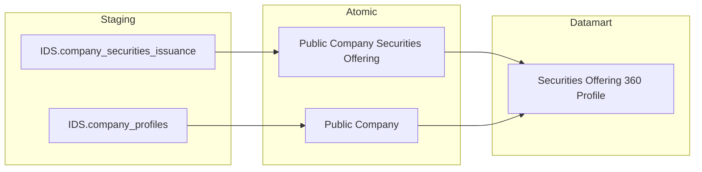

---

### Cụm 3: Hồ sơ đăng ký chào bán (PENDING — TTHC)

Phục vụ Tab HỒ SƠ ĐĂNG KÝ CHÀO BÁN — Nhóm 5 (KPI Cards), Nhóm 6 (donut Tỷ lệ xử lý hồ sơ), Nhóm 7 (bảng chi tiết hồ sơ theo hình thức × năm). Toàn bộ Cụm PENDING vì nguồn TTHC chưa có Silver entity — không có TTHC_Source_Analysis.md. Sẽ thiết kế khi Silver TTHC sẵn sàng.

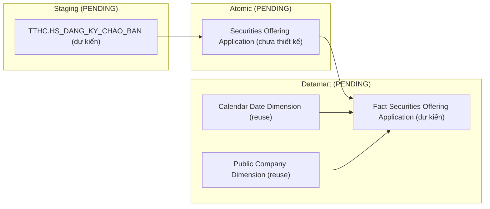

---

## Section 2 — Tổng quan báo cáo

### Tab: CHÀO BÁN PHÁT HÀNH

**Slicer chung:** Ngày (date picker), Ngành

---

#### Nhóm 1 — Tình hình thực hiện chào bán phát hành theo ngành

> Phân loại: **Phân tích**  
> Silver: `Public Company Securities Offering` ← IDS.company_securities_issuance — **READY**  
> Silver: `Public Company` ← IDS.company_profiles / IDS.company_detail — **READY**

**Mockup:**

| Ngành | Giá trị Cấp phép (tỷ đ) | Giá trị Huy động (tỷ đ) | Chưa thành công (tỷ đ) |
|---|---|---|---|
| Tài chính - Ngân hàng | 12,500 | 10,200 | 2,300 |
| Bất động sản | 8,700 | 7,100 | 1,600 |
| Công nghiệp | 5,300 | 4,800 | 500 |

**Source:** `Fact Securities Offering` → `Public Company Dimension`, `Industry Category Dimension`, `Calendar Date Dimension`

**Bảng KPI:**

| KPI ID | Tên | Đơn vị | Tính chất | Công thức / Mô tả |
|---|---|---|---|---|
| K_QLCB_1 | Giá trị Cấp phép | Tỷ VNĐ | Flow (Base) | `SUM(Planned Proceeds Amount)` per ngành × kỳ |
| K_QLCB_2 | Giá trị Huy động thành công | Tỷ VNĐ | Flow (Base) | `SUM(Actual Proceeds Amount)` per ngành × kỳ |
| K_QLCB_3 | Chưa thành công | Tỷ VNĐ | Derived | `K_QLCB_1 − K_QLCB_2` — tính ở presentation layer |
| K_QLCB_1_YOY | YoY% Giá trị Cấp phép | % | Derived | `(K_QLCB_1[Y] − K_QLCB_1[Y−1]) / K_QLCB_1[Y−1] × 100%` |
| K_QLCB_2_YOY | YoY% Giá trị Huy động | % | Derived | `(K_QLCB_2[Y] − K_QLCB_2[Y−1]) / K_QLCB_2[Y−1] × 100%` |

> **Lưu ý:** K_QLCB_1 và K_QLCB_2 là Base — lấy trực tiếp từ `Planned Proceeds Amount` và `Actual Proceeds Amount` của `Public Company Securities Offering`. K_QLCB_3 và YoY là Derived — tính ở presentation layer, không lưu mart.

> **Ghi chú — Industry Category Dimension:** ETL-derived Conformed Dimension — Silver không có entity riêng cho ngành. ETL extract từ `Public Company.Industry Category Level1/Level2 Code` (IDS.company_detail.category_l1_id, category_l2_id). Lý do tạo Dim riêng: (1) GROUP BY ngành ≠ GROUP BY công ty đại chúng, (2) Conformed Dim tái sử dụng cross-module (NDTNN, NHNCK, QLKD).

**Star Schema:**

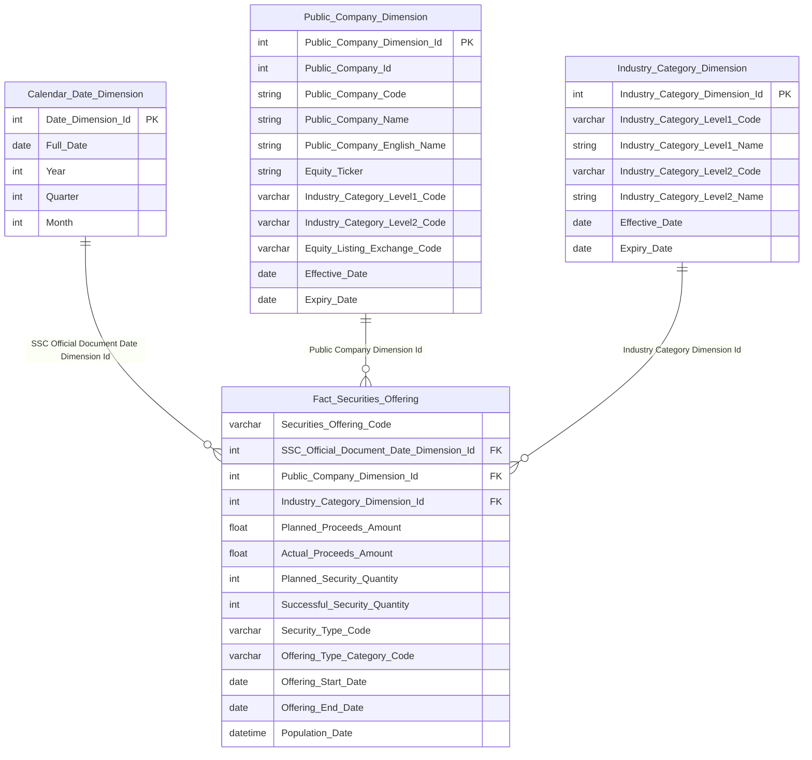

**Lineage Mart → Báo cáo:**

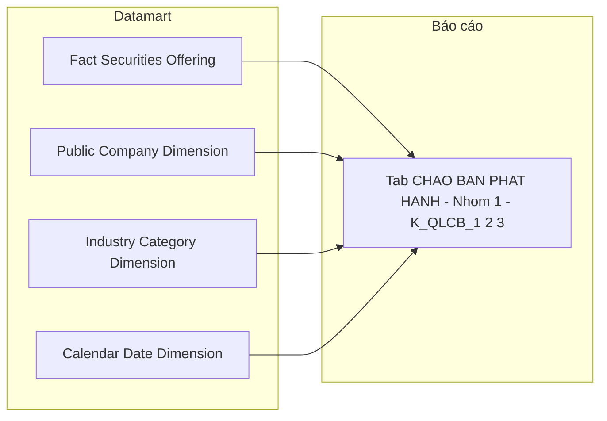

**Bảng grain:**

| Tên bảng | Grain |
|---|---|
| Fact Securities Offering | 1 row = 1 đợt chào bán/phát hành CK của 1 công ty đại chúng (Event — 1 record per company_securities_issuance) |
| Public Company Dimension | 1 row = 1 công ty đại chúng (SCD2) |
| Industry Category Dimension | 1 row = 1 ngành cấp 1 × 1 ngành cấp 2 (SCD2 — ETL extract từ Public Company) |
| Calendar Date Dimension | 1 row = 1 ngày (SSC Official Document Date — ngày công văn UBCKNN) |

---

#### Nhóm 2 — Giá trị cấp phép chào bán phát hành theo ngành

> Phân loại: **Phân tích**  
> Silver: `Public Company Securities Offering` ← IDS.company_securities_issuance — **READY**  
> Xem Issue O_QLCB_1 về logic mapping loại hình phát hành

**Mockup:**

| Loại hình | Giá trị cấp phép (tỷ đ) | % tổng |
|---|---|---|
| Công chúng | 8,200 | 42% |
| Riêng lẻ | 5,100 | 26% |
| ESOP | 2,300 | 12% |
| Trả cổ tức | 1,800 | 9% |
| Tăng vốn từ VCSH | 1,500 | 8% |
| Khác | 600 | 3% |

**Source:** `Fact Securities Offering` → `Industry Category Dimension`, `Calendar Date Dimension`
Filter thêm theo `Offering Type Category Code` (FK → Classification Dimension, scheme: `QLCB_OFFERING_TYPE_CATEGORY`)

**Bảng KPI:**

| KPI ID | Tên | Đơn vị | Tính chất | Công thức / Mô tả |
|---|---|---|---|---|
| K_QLCB_4 | Loại hình phát hành | — | Chiều | `GROUP BY Offering Type Category Code` — scheme: `QLCB_OFFERING_TYPE_CATEGORY` |
| K_QLCB_5 | Giá trị cấp phép — Công chúng | Tỷ VNĐ | Derived | `SUM(Planned Proceeds Amount) WHERE Offering Type Category Code = 'PUBLIC'` |
| K_QLCB_6 | Giá trị cấp phép — Riêng lẻ | Tỷ VNĐ | Derived | `SUM(Planned Proceeds Amount) WHERE Offering Type Category Code = 'PRIVATE'` |
| K_QLCB_7 | Giá trị cấp phép — ESOP | Tỷ VNĐ | Derived | `SUM(Planned Proceeds Amount) WHERE Offering Type Category Code = 'ESOP'` |
| K_QLCB_8 | Giá trị cấp phép — Trả cổ tức | Tỷ VNĐ | Derived | `SUM(Planned Proceeds Amount) WHERE Offering Type Category Code = 'DIVIDEND'` |
| K_QLCB_9 | Giá trị cấp phép — Tăng vốn từ VCSH | Tỷ VNĐ | Derived | `SUM(Planned Proceeds Amount) WHERE Offering Type Category Code = 'OWNER_CAPITAL'` |
| K_QLCB_10 | Giá trị cấp phép — Các loại khác | Tỷ VNĐ | Derived | `SUM(Planned Proceeds Amount) WHERE Offering Type Category Code = 'OTHER'` |

> **Lưu ý:** K_QLCB_5–10 đều là Derived từ K_QLCB_1 với filter loại hình — tính ở presentation layer. Tổng K_QLCB_5 + ... + K_QLCB_10 = K_QLCB_1. Xem O_QLCB_1 về business rule mapping loại hình từ Silver.

**Star Schema:** Kế thừa từ Nhóm 1 — thêm filter theo `Offering Type Category Code` và GROUP BY `Industry Category Dimension`.

**Lineage Mart → Báo cáo:**

**Bảng grain:**

| Tên bảng | Grain |
|---|---|
| Fact Securities Offering | 1 row = 1 đợt chào bán/phát hành CK (kế thừa Nhóm 1) |
| Industry Category Dimension | 1 row = 1 ngành cấp 1 × 1 ngành cấp 2 (SCD2) |
| Calendar Date Dimension | 1 row = 1 ngày |

---

#### Nhóm 3 — Giá trị phát hành theo hình thức phát hành và nhóm ngành

> Phân loại: **Phân tích**  
> Silver: `Public Company Securities Offering` ← IDS.company_securities_issuance — **READY**  
> Xem Issue O_QLCB_1 về logic mapping loại hình phát hành

**Mockup:**

| Ngành \ Loại hình | Công chúng | Riêng lẻ | ESOP | Trả cổ tức | Tăng vốn VCSH | Khác |
|---|---|---|---|---|---|---|
| Tài chính - Ngân hàng | 4,200 | 3,100 | 800 | 600 | 400 | 200 |
| Bất động sản | 2,100 | 1,800 | 500 | 400 | 700 | 100 |
| Công nghiệp | 1,800 | 950 | 300 | 200 | 150 | 100 |

**Source:** `Fact Securities Offering` → `Industry Category Dimension`, `Calendar Date Dimension`

**Bảng KPI:**

| KPI ID | Tên | Đơn vị | Tính chất | Công thức / Mô tả |
|---|---|---|---|---|
| K_QLCB_11 | Giá trị huy động — Công chúng | Tỷ VNĐ | Derived | `SUM(Actual Proceeds Amount) WHERE Offering Type Category Code = 'PUBLIC'` GROUP BY ngành |
| K_QLCB_12 | Giá trị huy động — Riêng lẻ | Tỷ VNĐ | Derived | `SUM(Actual Proceeds Amount) WHERE Offering Type Category Code = 'PRIVATE'` GROUP BY ngành |
| K_QLCB_13 | Giá trị huy động — ESOP | Tỷ VNĐ | Derived | `SUM(Actual Proceeds Amount) WHERE Offering Type Category Code = 'ESOP'` GROUP BY ngành |
| K_QLCB_14 | Giá trị huy động — Trả cổ tức | Tỷ VNĐ | Derived | `SUM(Actual Proceeds Amount) WHERE Offering Type Category Code = 'DIVIDEND'` GROUP BY ngành |
| K_QLCB_15 | Giá trị huy động — Tăng vốn từ VCSH | Tỷ VNĐ | Derived | `SUM(Actual Proceeds Amount) WHERE Offering Type Category Code = 'OWNER_CAPITAL'` GROUP BY ngành |
| K_QLCB_16 | Giá trị huy động — Các loại khác | Tỷ VNĐ | Derived | `SUM(Actual Proceeds Amount) WHERE Offering Type Category Code = 'OTHER'` GROUP BY ngành |

> **Lưu ý:** Nhóm 3 khác Nhóm 2 ở chỗ dùng `Actual Proceeds Amount` (thực tế huy động) thay vì `Planned Proceeds Amount` (cấp phép). Cùng 1 Fact, GROUP BY ngành × loại hình thay vì chỉ theo loại hình.

**Star Schema:** Cùng star schema với Nhóm 1 — GROUP BY `Industry Category Dimension` × `Offering Type Category Code`.

**Lineage Mart → Báo cáo:**

**Bảng grain:**

| Tên bảng | Grain |
|---|---|
| Fact Securities Offering | 1 row = 1 đợt chào bán/phát hành CK (kế thừa Nhóm 1) |
| Industry Category Dimension | 1 row = 1 ngành cấp 1 × 1 ngành cấp 2 (SCD2) |
| Calendar Date Dimension | 1 row = 1 ngày |

---

#### Nhóm 4 — Bảng Chi tiết số lượng chứng khoán Chào bán & Phát hành

> Phân loại: **Tác nghiệp**  
> Silver: `Public Company Securities Offering` ← IDS.company_securities_issuance — **READY**  
> Silver: `Public Company` ← IDS.company_profiles — **READY**  
> **PENDING (4 attributes):** Đơn vị tư vấn, Tổ chức kiểm toán, Đơn vị bảo lãnh, Đơn vị xếp hạng tín nhiệm — nguồn TTHC chưa có Source Analysis MD

**Mockup:**

| Mã CK | Tên DN | Hình thức | Đvị tư vấn | Tổ chức KT | Đvị bảo lãnh | Đvị XHTN | SL cấp phép | SL thành công | GT cấp phép (tỷ) | GT thành công (tỷ) | Tỷ lệ % |
|---|---|---|---|---|---|---|---|---|---|---|---|
| ABC | Công ty ABC | Công chúng | — | — | — | — | 10,000,000 | 9,500,000 | 500 | 475 | 95% |
| DEF | Công ty DEF | Riêng lẻ | — | — | — | — | 5,000,000 | 5,000,000 | 250 | 250 | 100% |

**Source:** `Securities Offering 360 Profile` — lookup theo đợt chào bán / công ty

**Bảng KPI:**

| KPI ID | Tên | Đơn vị | Tính chất | Công thức / Mô tả |
|---|---|---|---|---|
| K_QLCB_17 | Thông tin doanh nghiệp (Mã CK, Tên DN) | — | Attribute | `SELECT Equity Ticker, Public Company Name` — Equity Ticker = mã CK (IDS.company_profiles.equity_ticker); Public Company Name = tên DN |
| K_QLCB_18 | Hình thức chào bán | — | Attribute | `SELECT Offering Type Category Code` |
| K_QLCB_19 | Đơn vị tư vấn | — | Attribute | **PENDING** — nguồn TTHC chưa có Source Analysis |
| K_QLCB_20 | Tổ chức kiểm toán | — | Attribute | **PENDING** — nguồn TTHC chưa có Source Analysis |
| K_QLCB_21 | Đơn vị bảo lãnh | — | Attribute | **PENDING** — nguồn TTHC chưa có Source Analysis |
| K_QLCB_22 | Đơn vị xếp hạng tín nhiệm | — | Attribute | **PENDING** — nguồn TTHC chưa có Source Analysis |
| K_QLCB_23 | Số lượng CK được cấp phép | CK | Attribute | `Planned Security Quantity` — IDS.company_securities_issuance.planned_security_qty |
| K_QLCB_24 | Số lượng CK chào bán thành công | CK | Attribute | `Successful Security Quantity` — IDS.company_securities_issuance.successful_security_qty |
| K_QLCB_25 | Giá trị cấp phép | Tỷ VNĐ | Attribute | `Planned Proceeds Amount` — IDS.company_securities_issuance.planned_proceeds_am |
| K_QLCB_26 | Giá trị chào bán thành công | Tỷ VNĐ | Attribute | `Actual Proceeds Amount` — IDS.company_securities_issuance.actual_proceeds_am |
| K_QLCB_27 | Tỷ lệ chào bán thành công | % | Derived | `K_QLCB_24 / K_QLCB_23 × 100%` — tính ở presentation layer |

> **PENDING — K_QLCB_19 đến K_QLCB_22:** 4 KPI có nguồn TTHC. Không có TTHC_Source_Analysis.md → không xác định được Silver entity. Giữ placeholder NULL trong `Securities Offering 360 Profile`.  
> **Silver cần bổ sung:** Entity tư vấn, kiểm toán, bảo lãnh, xếp hạng tín nhiệm từ hồ sơ đăng ký chào bán trong TTHC — bao gồm attributes: tên đơn vị, mã đơn vị, FK sang đợt chào bán.

**Schema bảng tác nghiệp:**

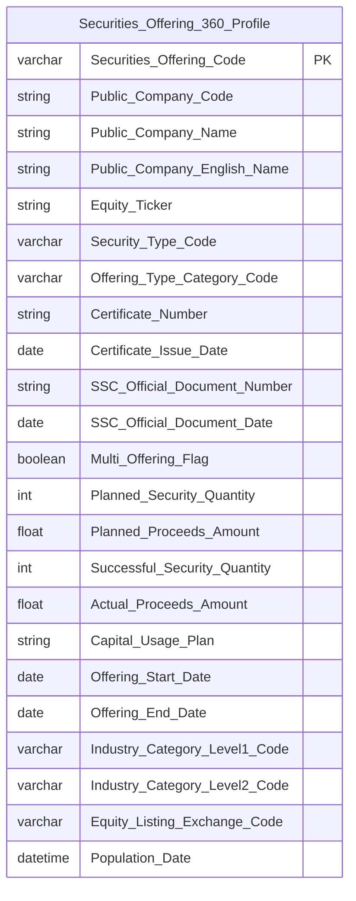

**Lineage Mart → Báo cáo:**

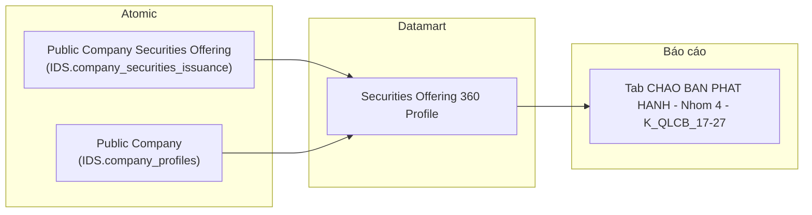

**Bảng grain:**

| Tên bảng | Grain |
|---|---|
| `Securities Offering 360 Profile` | 1 row = 1 đợt chào bán/phát hành (latest state — 1 row per company_securities_issuance) |

---

### Tab: HỒ SƠ ĐĂNG KÝ CHÀO BÁN

**Slicer chung:** Từ ngày — Đến ngày (date range picker)

---

#### Nhóm 5 — KPI Cards tổng quan hồ sơ

##### PENDING — KPI Cards hồ sơ (STT 29–32)

**KPI liên quan:**

> **Lưu ý:** 4 KPI card trên màn hình hiển thị **số lượng hồ sơ** (không phải tỷ lệ %). Tỷ lệ % là chỉ tiêu phái sinh tính tại presentation layer từ các số lượng Base. BA đặt tên "Tỷ lệ..." nhưng thực tế card hiển thị số nguyên (ví dụ: Hồ sơ đăng ký = 1, Đang xử lý = 1, Bị từ chối = 2).

| STT BA | Tên KPI (BA) | Tên KPI thực tế | Tính chất | Công thức |
|---|---|---|---|---|
| 29 | Tỷ lệ hồ sơ đăng ký | Số lượng hồ sơ đăng ký | Cơ sở | COUNT(hồ sơ có trạng thái = Đăng ký) |
| 30 | Tỷ lệ hồ sơ đang xử lý | Số lượng hồ sơ đang xử lý | Cơ sở | COUNT(hồ sơ có trạng thái = Đang xử lý) |
| 31 | Tỷ lệ hồ sơ đã chấp thuận | Số lượng hồ sơ đã chấp thuận | Cơ sở | COUNT(hồ sơ có trạng thái = Đã cấp phép) |
| 32 | Tỷ lệ hồ sơ bị từ chối | Số lượng hồ sơ bị từ chối | Cơ sở | COUNT(hồ sơ có trạng thái = Từ chối) |
| — | Tỷ lệ % per trạng thái | Phái sinh | Derived | COUNT(trạng thái X) / SUM(tất cả trạng thái) × 100% — tính ở presentation layer |

**Lý do pending:** Toàn bộ KPI thuộc nguồn TTHC (hệ thống thủ tục hành chính). Không có TTHC_Source_Analysis.md trong project knowledge. Không xác định được Silver entity nào lưu trạng thái hồ sơ đăng ký chào bán (đăng ký / đang xử lý / chấp thuận / từ chối). Không thể thiết kế Fact hay Dim mà không có Silver LLD.

**Silver cần bổ sung:** Entity hồ sơ đăng ký chào bán từ TTHC, tối thiểu cần các attributes: mã hồ sơ, hình thức chào bán, năm nộp, trạng thái hồ sơ (scheme trạng thái: đăng ký / đang xử lý / đã cấp phép / bị từ chối), ngày nộp, ngày cập nhật trạng thái, FK sang công ty đại chúng.

**Mart dự kiến khi Silver sẵn sàng:** `Fact Securities Offering Application` — grain = 1 hồ sơ đăng ký × 1 ngày nộp.

---

#### Nhóm 6 — Biểu đồ Tỷ lệ xử lý hồ sơ (donut)

##### PENDING — Biểu đồ donut Tỷ lệ xử lý hồ sơ (STT 29–32)

**KPI liên quan:** Tỷ lệ hồ sơ đăng ký / đang xử lý / đã chấp thuận / bị từ chối — cùng KPI với Nhóm 5, hiển thị dạng donut chart.

**Lý do pending:** Cùng nguồn TTHC với Nhóm 5 — xem lý do chi tiết tại Nhóm 5. Biểu đồ donut hiển thị tỷ lệ % 4 trạng thái, cần đúng 4 Base KPI đếm hồ sơ per trạng thái.

**Silver cần bổ sung:** Xem Nhóm 5 — cùng entity TTHC.

**Mart dự kiến khi Silver sẵn sàng:** `Fact Securities Offering Application` — grain = 1 hồ sơ × 1 ngày nộp. Biểu đồ donut = GROUP BY `Application Status Code` COUNT(hồ sơ).

---

#### Nhóm 7 — Bảng Chi tiết hồ sơ chào bán & phát hành

##### PENDING — Bảng chi tiết hồ sơ theo hình thức × năm (STT 33–39)

**KPI liên quan:**

| STT BA | Tên KPI | Phân loại | Công thức |
|---|---|---|---|
| 33 | Hình thức chào bán | Cơ sở | GROUP BY hình thức chào bán |
| 34 | Năm | Cơ sở | GROUP BY năm nộp hồ sơ |
| 35 | Số lượng hồ sơ đăng ký | Cơ sở | COUNT hồ sơ có trạng thái = đăng ký |
| 36 | Số lượng hồ sơ đang xử lý | Cơ sở | COUNT hồ sơ có trạng thái = đang xử lý |
| 37 | Số lượng hồ sơ đã cấp phép | Cơ sở | COUNT hồ sơ có trạng thái = đã cấp phép |
| 38 | Số lượng hồ sơ bị từ chối | Cơ sở | COUNT hồ sơ có trạng thái = bị từ chối |
| 39 | Tổng hồ sơ | Phái sinh | SUM(STT 35 + 36 + 37 + 38) |

**Lý do pending:** Toàn bộ nguồn TTHC. Bảng chi tiết cần GROUP BY hình thức chào bán × năm. Screenshot cho thấy các hình thức: Chào bán cho CĐ hiện hữu, Phát hành Riêng lẻ hoán đổi nợ, Phát hành CP thưởng (Bonus), Chào bán CP riêng lẻ, Phát hành CP ESOP — các giá trị này cần scheme phân loại từ TTHC Silver.

**Silver cần bổ sung:** Xem Nhóm 5 — cùng entity TTHC. Thêm attribute `Offering Form Type Code` (scheme: `TTHC_OFFERING_FORM_TYPE`) và `Application Year`.

**Mart dự kiến khi Silver sẵn sàng:** `Fact Securities Offering Application` — grain = 1 hồ sơ × 1 ngày nộp. Bảng chi tiết = GROUP BY `Offering Form Type Code` × `Year` COUNT per `Application Status Code`.

---

### Tab: CHÀO BÁN VÀ PHÁT HÀNH (Data Explorer)

**Slicer chung:** Sàn (dropdown), Ngành nghề (dropdown), Khoảng thời gian (Từ ngày — Đến ngày)

> **Ghi chú thiết kế:** Data Explorer là màn hình tra cứu chi tiết từng đợt chào bán, cho phép người dùng chọn tổ hợp chỉ số (checkbox) từ 4 nhóm rồi hiển thị bảng kết quả. Đây là use case Tác nghiệp — lookup n đợt chào bán theo điều kiện lọc. Tab này **reuse** `Securities Offering 360 Profile` đã thiết kế ở Nhóm 4 Tab CHÀO BÁN PHÁT HÀNH, mở rộng thêm các attribute chi tiết theo từng hình thức phát hành (ESOP target, Dividend qty...). Không cần thêm Fact hay Dim mới.

---

#### Nhóm 8 — Thông tin cơ sở (STT 40–45)

> Phân loại: **Tác nghiệp**  
> Silver: `Public Company Securities Offering` ← IDS.company_securities_issuance — **READY**  
> Silver: `Public Company` ← IDS.company_profiles / IDS.company_detail — **READY**  
> Ghi chú: Attribute "Chuyên viên" (STT 65) — PENDING vì `Created By Login Name` map về `logins` (bảng hệ thống out-of-scope trong IDS Silver). Xem O_QLCB_5.

**Mockup:**

| Mã CK | Tên công ty | Sàn | Ngành | Thời điểm báo cáo | Chuyên viên | Loại CK |
|---|---|---|---|---|---|---|
| VIC | VinGroup | HOSE | Bất động sản | 24/03/2026 | — | Cổ phiếu |
| VCB | Vietcombank | UPCOM | Ngân hàng | 24/03/2026 | — | Cổ phiếu |

**Source:** `Securities Offering 360 Profile`

**Bảng KPI:**

| KPI ID | Tên | Đơn vị | Tính chất | Nguồn Silver | Ghi chú |
|---|---|---|---|---|---|
| K_QLCB_28 | Thời điểm báo cáo | Ngày | Attribute | `Public Company Securities Offering.SSC Official Document Date` — IDS.company_securities_issuance.ssc_official_doc_date | Ngày công văn UBCKNN — dùng làm thời điểm báo cáo (FK date chính). Xem O_QLCB_3 (Closed). |
| K_QLCB_29 | Chuyên viên | Text | Attribute | `Public Company Securities Offering.Created By Login Name` — IDS.company_securities_issuance.created_by. Giá trị là login_name kỹ thuật (không phải tên đầy đủ). Xem O_QLCB_5 |
| K_QLCB_30 | Tên công ty | Text | Attribute | `Public Company.Public Company Name` | |
| K_QLCB_31 | Mã chứng khoán | Text | Attribute | `Public Company.Equity Ticker` — IDS.company_profiles.equity_ticker | |
| K_QLCB_32 | Sàn | Text | Attribute | `Public Company.Equity Listing Exchange Code` | Scheme: IDS_EQUITY_LISTING_EXCH |
| K_QLCB_33 | Loại chứng khoán | Text | Attribute | `Public Company Securities Offering.Security Type Code` | Scheme: IDS_ISSUANCE_SECURITY_TYPE |

**Schema bảng tác nghiệp:** Kế thừa `Securities Offering 360 Profile` — xem Nhóm 4 Tab CHÀO BÁN PHÁT HÀNH.

**Lineage Mart → Báo cáo:**

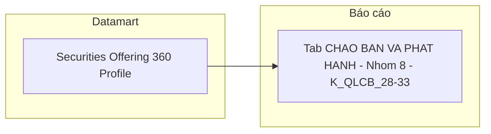

**Bảng grain:**

| Tên bảng | Grain |
|---|---|
| `Securities Offering 360 Profile` | 1 row = 1 đợt chào bán/phát hành (1 row per company_securities_issuance) |

---

#### Nhóm 9 — Thông tin công văn cấp phép (STT 46–50)

> Phân loại: **Tác nghiệp**  
> Silver: `Public Company Securities Offering` ← IDS.company_securities_issuance — **READY**

**Mockup:**

| Số GCN | Ngày cấp GCN | Số công văn gửi CT | Ngày công văn | Hình thức phát hành |
|---|---|---|---|---|
| 12/GCN-UBCK | 15/01/2026 | 14/CV-UBCK | 14/01/2026 | Công chúng |
| 08/GCN-UBCK | 10/02/2026 | 07/CV-UBCK | 09/02/2026 | Riêng lẻ |

**Source:** `Securities Offering 360 Profile`

**Bảng KPI:**

| KPI ID | Tên | Đơn vị | Tính chất | Nguồn Silver |
|---|---|---|---|---|
| K_QLCB_34 | Số giấy chứng nhận | Text | Attribute | `Public Company Securities Offering.Certificate Number` — IDS.company_securities_issuance.certificate_no |
| K_QLCB_35 | Ngày cấp giấy chứng nhận | Ngày | Attribute | `Public Company Securities Offering.Certificate Issue Date` — IDS.company_securities_issuance.certificate_issue_date |
| K_QLCB_36 | Số công văn gửi công ty | Text | Attribute | `Public Company Securities Offering.SSC Official Document Number` — IDS.company_securities_issuance.ssc_official_doc_no |
| K_QLCB_37 | Ngày công văn | Ngày | Attribute | `Public Company Securities Offering.SSC Official Document Date` — IDS.company_securities_issuance.ssc_official_doc_date |
| K_QLCB_38 | Hình thức phát hành | Text | Attribute | `Securities Offering 360 Profile.Offering Type Category Code` — ETL derived từ plan_xxx_qty. Xem O_QLCB_1 |

**Schema bảng tác nghiệp:** Kế thừa `Securities Offering 360 Profile`.

**Lineage Mart → Báo cáo:**

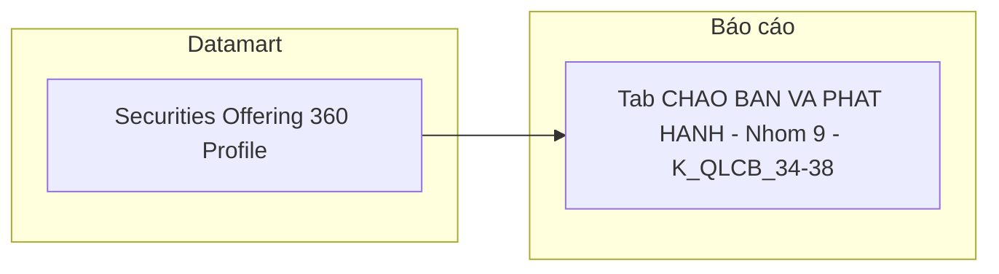

**Bảng grain:**

| Tên bảng | Grain |
|---|---|
| `Securities Offering 360 Profile` | 1 row = 1 đợt chào bán/phát hành |

---

#### Nhóm 10 — Thông tin cấp phép chào bán (STT 51–56)

> Phân loại: **Tác nghiệp**  
> Silver: `Public Company Securities Offering` ← IDS.company_securities_issuance — **READY**  
> Ghi chú: "Giá (cấp phép)" — Silver lưu giá riêng per hình thức (plan_esop_price, plan_single_price...), không có giá tổng hợp. Cần giải quyết qua O_QLCB_1 (Offering Type Category). "Số lượng người lao động" và "Đối tượng" là các text field riêng per hình thức — đã có trong Silver (`plan_esop_no`, `plan_single_obj`...).

**Mockup:**

| Số lượng cấp phép | Giá (cấp phép) | Giá trị cấp phép | SL người LĐ | Đối tượng | Mục đích sử dụng vốn |
|---|---|---|---|---|---|
| 10,000,000 | 15,000 đ | 150 tỷ | 500 | CBNV công ty | Bổ sung vốn lưu động |

**Source:** `Securities Offering 360 Profile`

**Bảng KPI:**

| KPI ID | Tên | Đơn vị | Tính chất | Nguồn Silver |
|---|---|---|---|---|
| K_QLCB_39 | Số lượng cấp phép | CK | Attribute | `Public Company Securities Offering.Planned Security Quantity` — IDS.company_securities_issuance.planned_security_qty |
| K_QLCB_40 | Giá (cấp phép) | VNĐ | Attribute | ETL derived — giá theo `Offering Type Category Code` chính. Xem O_QLCB_1 |
| K_QLCB_41 | Giá trị cấp phép | Tỷ VNĐ | Attribute | `Public Company Securities Offering.Planned Proceeds Amount` — IDS.company_securities_issuance.planned_proceeds_am |
| K_QLCB_42 | Số lượng người lao động | Người | Attribute | ETL derived — từ `plan_esop_no` / `plan_bonus_share_no` tùy hình thức. Xem O_QLCB_5 |
| K_QLCB_43 | Đối tượng | Text | Attribute | ETL derived — từ `plan_esop_no` / `plan_single_obj` / `plan_shareholder_qty`... tùy hình thức |
| K_QLCB_44 | Mục đích sử dụng vốn | Text | Attribute | `Public Company Securities Offering.Capital Usage Plan` — IDS.company_securities_issuance.capital_usage_plan |

**Schema bảng tác nghiệp:** Kế thừa `Securities Offering 360 Profile` — cần bổ sung thêm các attribute ESOP/bonus/private target.

**Lineage Mart → Báo cáo:**

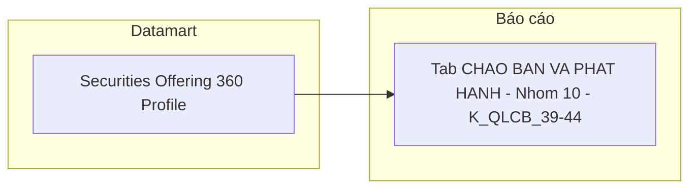

**Bảng grain:**

| Tên bảng | Grain |
|---|---|
| `Securities Offering 360 Profile` | 1 row = 1 đợt chào bán/phát hành |

---

#### Nhóm 11 — Thông tin kết quả chào bán (STT 57–61)

> Phân loại: **Tác nghiệp**  
> Silver: `Public Company Securities Offering` ← IDS.company_securities_issuance — **READY**

**Mockup:**

| Số lượng thực tế | Giá thực tế | Giá trị thực tế | SL người LĐ (TT) | Đối tượng (TT) |
|---|---|---|---|---|
| 9,800,000 | 15,000 đ | 147 tỷ | 490 | CBNV công ty |

**Source:** `Securities Offering 360 Profile`

**Bảng KPI:**

| KPI ID | Tên | Đơn vị | Tính chất | Nguồn Silver |
|---|---|---|---|---|
| K_QLCB_45 | Số lượng thực tế | CK | Attribute | `Public Company Securities Offering.Successful Security Quantity` — IDS.company_securities_issuance.successful_security_qty |
| K_QLCB_46 | Giá thực tế | VNĐ | Attribute | ETL derived — giá theo `Offering Type Category Code` chính (result). Xem O_QLCB_1 |
| K_QLCB_47 | Giá trị thực tế | Tỷ VNĐ | Attribute | `Public Company Securities Offering.Actual Proceeds Amount` — IDS.company_securities_issuance.actual_proceeds_am |
| K_QLCB_48 | Số lượng người lao động (TT) | Người | Attribute | ETL derived — từ `result_esop_no` / `result_bonus_share_no` tùy hình thức. Xem O_QLCB_5 |
| K_QLCB_49 | Đối tượng (thực tế) | Text | Attribute | ETL derived — từ `result_esop_no` / `result_single_obj`... tùy hình thức |

**Schema bảng tác nghiệp:** Kế thừa `Securities Offering 360 Profile`.

**Lineage Mart → Báo cáo:**

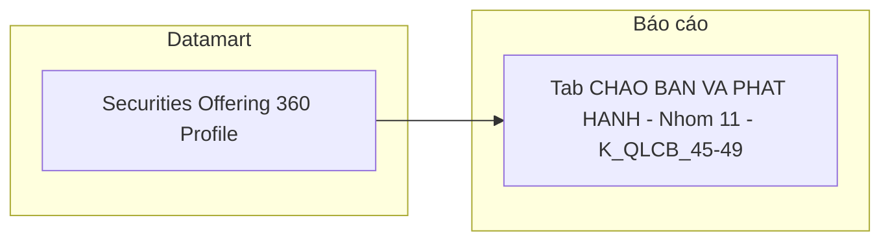

**Bảng grain:**

| Tên bảng | Grain |
|---|---|
| `Securities Offering 360 Profile` | 1 row = 1 đợt chào bán/phát hành |

---

## Section 3 — Mô hình tổng thể (READY only)

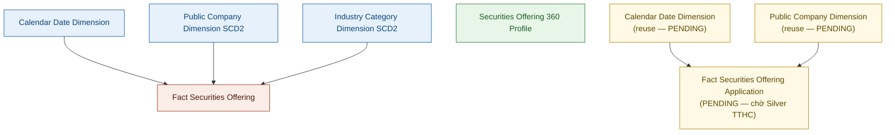

### Bảng Phân tích (Star Schema)

| Bảng | Pattern | Grain | KPI | Trạng thái |
|---|---|---|---|---|
| Fact Securities Offering | Event | 1 đợt chào bán × 1 công ty đại chúng | K_QLCB_1–2, 4–16 | READY |

### Bảng Tác nghiệp (Denormalized)

| Bảng | Grain | KPI | Trạng thái |
|---|---|---|---|
| Securities Offering 360 Profile | 1 đợt chào bán (latest state) | K_QLCB_17–26, 28–49 | READY (một phần — K_QLCB_19–22 PENDING TTHC) |

### Dimension

| Dimension | Loại | Mô tả | Trạng thái |
|---|---|---|---|
| Calendar Date Dimension | Conformed | Lịch ngày — tĩnh / generated | READY |
| Public Company Dimension | Reference SCD2 | Công ty đại chúng — IDS.company_profiles. Chứa mã CK + Industry Category | READY |
| Industry Category Dimension | Conformed SCD2 | Nhóm ngành — ETL extract từ Public Company.Industry Category Level1/Level2 Code (IDS). Tái sử dụng cross-module | READY |

---

## Section 4 — Vấn đề mở

| ID | Vấn đề | Giả định hiện tại | KPI liên quan | Trạng thái |
|---|---|---|---|---|
| O_QLCB_1 | **Mapping Loại hình phát hành:** Silver `Public Company Securities Offering` không có field `offering_type_category` thống nhất — các loại hình lưu dưới dạng nhiều cặp field riêng biệt (`plan_public_company_qty`, `plan_single_qty`, `plan_dividend_qty`, `plan_bonus_share_qty`, `plan_owner_qty`...). | BA đồng ý ETL derived từ Silver — ETL sinh `Offering Type Category Code` từ field `planned_qty` cao nhất. Scheme: `QLCB_OFFERING_TYPE_CATEGORY`. | K_QLCB_4–16 | **Closed** |
| O_QLCB_2 | **KPI nguồn TTHC:** 4 KPI trong Nhóm 4 (Đơn vị tư vấn, Tổ chức kiểm toán, Đơn vị bảo lãnh, Đơn vị XHTN) có nguồn TTHC — không có TTHC_Source_Analysis.md trong project knowledge. Không thể xác định Silver entity, tên bảng nguồn hay field tương ứng. | Đánh dấu PENDING, giữ placeholder NULL trong `Securities Offering 360 Profile`. ETL bổ sung sau khi có Silver TTHC. | K_QLCB_19–22 | **Open** |
| O_QLCB_3 | **Ngày làm FK date trên Fact:** Silver `Public Company Securities Offering` có 3 trường ngày: `certificate_issue_date` (ngày cấp GCN chào bán), `offering_start_date` (ngày chào bán chứng khoán), `ssc_official_doc_date` (ngày ra công văn UBCKNN). | BA xác nhận (cập nhật): FK date chính = `ssc_official_doc_date` (ngày công văn UBCKNN) → `SSC Official Document Date Dimension Id`. `certificate_issue_date` và `offering_start_date` lưu thêm dạng date field trên Fact/Tác nghiệp nhưng không làm FK date chính. | K_QLCB_1–16 | **Closed** |
| O_QLCB_4 | **Toàn bộ Tab Hồ sơ đăng ký chào bán (STT 29–39) nguồn TTHC:** 11 KPI gồm 3 Nhóm (KPI Cards, donut chart, bảng chi tiết hồ sơ) đều có nguồn TTHC — không có TTHC_Source_Analysis.md. Không tìm thấy Silver entity nào lưu trạng thái hồ sơ đăng ký chào bán trong `silver_attributes.csv`. Khi có Silver TTHC, cần thiết kế thêm: `Fact Securities Offering Application` (Event, grain = 1 hồ sơ × 1 ngày nộp), `Calendar Date Dimension` (reuse), `Public Company Dimension` (reuse). | Đánh dấu PENDING toàn bộ tab. Không thiết kế mart khi chưa có Silver LLD. | K_QLCB_28–38 | **Open** |
| O_QLCB_5 | **Chuyên viên và Giá/Đối tượng/SL NLĐ per hình thức:** (a) "Chuyên viên" = `Created By Login Name` (IDS.company_securities_issuance.created_by) — BA xác nhận dùng field này. Lưu ý giá trị là login_name kỹ thuật, không phải tên đầy đủ. ETL lấy trực tiếp, hiển thị login_name. (b) "Giá (cấp phép/thực tế)", "Số lượng NLĐ", "Đối tượng" không có field tổng hợp trên Silver — ETL pick theo `Offering Type Category Code` chính (O_QLCB_1 đã Closed). | (a) READY — map `Created By Login Name`, hiển thị login_name. (b) ETL pick theo Offering Type Category Code chính. | K_QLCB_29, K_QLCB_40, K_QLCB_42–43, K_QLCB_46, K_QLCB_48–49 | **Closed** |
| O_QLCB_6 | **Ngày hết hạn CCHN (K_QLCB_63):** BA xác nhận map về `CertificateRecords.RevocationDate` (ngày bị thu hồi chứng chỉ). | Map về `Securities Practitioner License Certificate Document.Revocation Date` — NHNCK.CertificateRecords.RevocationDate. | K_QLCB_63 | **Closed** |