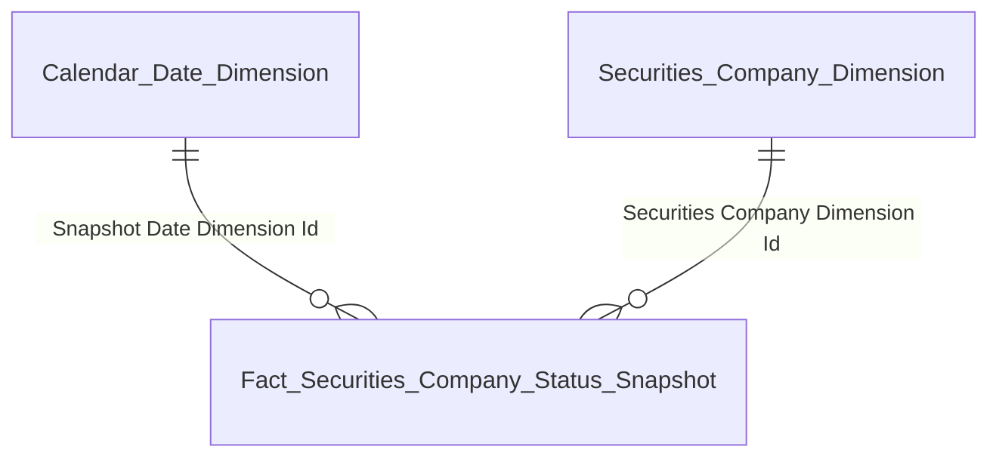
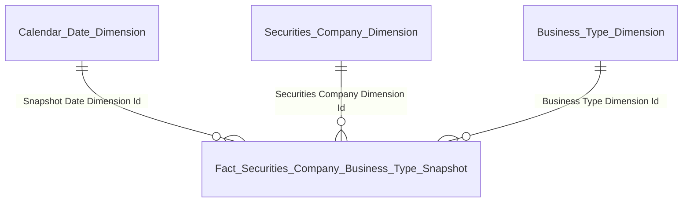
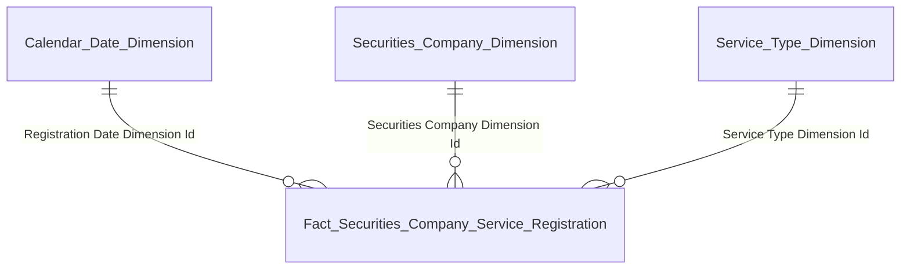
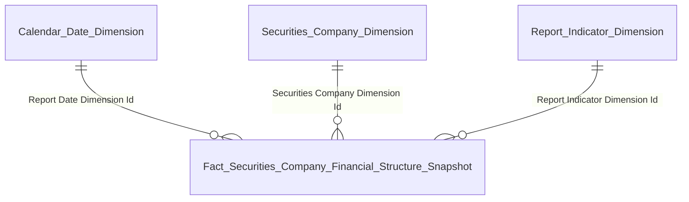
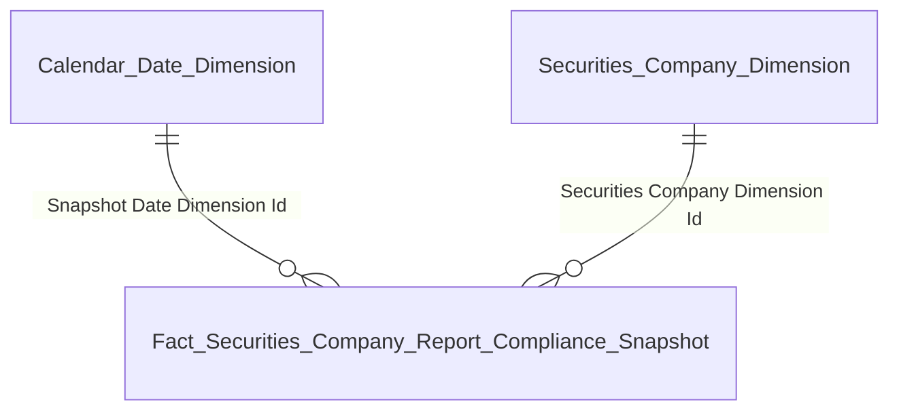

# GOLD_QLKD_Entities — Star Schema per Nhóm báo cáo
**Module:** QLKD — Quản lý kinh doanh
**Phiên bản:** 2.0 — 05/05/2026

## Tab TỔNG QUAN

### Nhóm 1 — Chỉ tiêu thống kê chung (K_QLKD_1–11)

| Gold entity | Description | Grain | KPI |
|---|---|---|---|
| Fact Securities Company Status Snapshot | Periodic Snapshot tình trạng CTCK — 1 CTCK × 1 ngày | 1 CTCK × 1 ngày snapshot | K_QLKD_1–11 |
| Securities Company Dimension | CTCK — tên, mã, trạng thái, vốn điều lệ, niêm yết (SCD2) | 1 CTCK (SCD2) | — |
| Calendar Date Dimension | Lịch ngày — năm/quý/tháng/tuần phục vụ slicer và time-series | 1 ngày | — |

### Nhóm 2 — Biểu đồ Nghiệp vụ (K_QLKD_12–15)

| Gold entity | Description | Grain | KPI |
|---|---|---|---|
| Fact Securities Company Business Type Snapshot | Periodic Snapshot nghiệp vụ CTCK (FIMS) — 1 CTCK × 1 nghiệp vụ × 1 ngày | 1 CTCK × 1 nghiệp vụ × 1 ngày snapshot | K_QLKD_12–15 |
| Securities Company Dimension | CTCK — tên, mã, trạng thái, vốn điều lệ, niêm yết (SCD2) | 1 CTCK (SCD2) | — |
| Business Type Dimension | Nghiệp vụ CTCK (FIMS_BUSINESS_TYPE) — môi giới/bảo lãnh/tư vấn/tự doanh (SCD2) | 1 mã nghiệp vụ (SCD2) | — |
| Calendar Date Dimension | Lịch ngày — năm/quý/tháng/tuần phục vụ slicer và time-series | 1 ngày | — |

### Nhóm 3/4 — Biểu đồ Dịch vụ & Dịch vụ phái sinh (K_QLKD_16–21)

| Gold entity | Description | Grain | KPI |
|---|---|---|---|
| Fact Securities Company Service Registration | Event đăng ký dịch vụ CTCK (SCMS) — 1 CTCK × 1 dịch vụ × 1 lần đăng ký | 1 CTCK × 1 dịch vụ × 1 lần đăng ký (Event) | K_QLKD_16–21 |
| Securities Company Dimension | CTCK — tên, mã, trạng thái, vốn điều lệ, niêm yết (SCD2) | 1 CTCK (SCD2) | — |
| Service Type Dimension | Dịch vụ CTCK (SCMS_SERVICE_TYPE) — ký quỹ/ứng trước/lưu ký/phái sinh (SCD2) | 1 mã dịch vụ (SCD2) | — |
| Calendar Date Dimension | Lịch ngày — năm/quý/tháng/tuần phục vụ slicer và time-series | 1 ngày | — |

### Nhóm 8/9 — Cơ cấu tài chính toàn thị trường (K_QLKD_31–40)

| Gold entity | Description | Grain | KPI |
|---|---|---|---|
| Fact Securities Company Financial Structure Snapshot | Periodic Snapshot chỉ tiêu BCTC — 1 CTCK × 1 chỉ tiêu × 1 kỳ | 1 CTCK × 1 chỉ tiêu × 1 kỳ | K_QLKD_31–86 |
| Securities Company Dimension | CTCK — tên, mã, trạng thái, vốn điều lệ, niêm yết (SCD2) | 1 CTCK (SCD2) | — |
| Report Indicator Dimension | Chỉ tiêu báo cáo — mã, tên, hàng/cột/sheet biểu mẫu | 1 chỉ tiêu báo cáo | — |
| Calendar Date Dimension | Lịch ngày — năm/quý/tháng/tuần phục vụ slicer và time-series | 1 ngày | — |

## Tab GIÁM SÁT

### Nhóm GS-1→GS-8 — Hoạt động tài chính CTCK (K_QLKD_41–69)

> Tái sử dụng `Fact Securities Company Financial Structure Snapshot` — Star Schema giống Nhóm 8/9

| Gold entity | Description | Grain | KPI |
|---|---|---|---|
| Fact Securities Company Financial Structure Snapshot | Periodic Snapshot chỉ tiêu BCTC — 1 CTCK × 1 chỉ tiêu × 1 kỳ | 1 CTCK × 1 chỉ tiêu × 1 kỳ | K_QLKD_31–86 |
| Securities Company Dimension | CTCK — tên, mã, trạng thái, vốn điều lệ, niêm yết (SCD2) | 1 CTCK (SCD2) | — |
| Report Indicator Dimension | Chỉ tiêu báo cáo — mã, tên, hàng/cột/sheet biểu mẫu | 1 chỉ tiêu báo cáo | — |
| Calendar Date Dimension | Lịch ngày — năm/quý/tháng/tuần phục vụ slicer và time-series | 1 ngày | — |

### Nhóm GS-9 — Giám sát tuân thủ nộp báo cáo (K_QLKD_70–73)

| Gold entity | Description | Grain | KPI |
|---|---|---|---|
| Fact Securities Company Report Compliance Snapshot | Periodic Snapshot tuân thủ nộp báo cáo — 1 CTCK × 1 biểu mẫu × 1 kỳ | 1 CTCK × 1 biểu mẫu × 1 kỳ | K_QLKD_70–73 |
| Securities Company Dimension | CTCK — tên, mã, trạng thái, vốn điều lệ, niêm yết (SCD2) | 1 CTCK (SCD2) | — |
| Calendar Date Dimension | Lịch ngày — năm/quý/tháng/tuần phục vụ slicer và time-series | 1 ngày | — |

## Tab HỒ SƠ CTCK 360

### Nhóm 360-2→5 — Biểu đồ tài chính per CTCK (K_QLKD_79–86)

> Tái sử dụng `Fact Securities Company Financial Structure Snapshot`

| Gold entity | Description | Grain | KPI |
|---|---|---|---|
| Fact Securities Company Financial Structure Snapshot | Periodic Snapshot chỉ tiêu BCTC — 1 CTCK × 1 chỉ tiêu × 1 kỳ | 1 CTCK × 1 chỉ tiêu × 1 kỳ | K_QLKD_31–86 |
| Securities Company Dimension | CTCK — tên, mã, trạng thái, vốn điều lệ, niêm yết (SCD2) | 1 CTCK (SCD2) | — |
| Report Indicator Dimension | Chỉ tiêu báo cáo — mã, tên, hàng/cột/sheet biểu mẫu | 1 chỉ tiêu báo cáo | — |
| Calendar Date Dimension | Lịch ngày — năm/quý/tháng/tuần phục vụ slicer và time-series | 1 ngày | — |

### Nhóm 360-1 Banner (K_QLKD_74–78) (Tác nghiệp)

| Gold entity | Description | Grain | KPI |
|---|---|---|---|
| Securities Company 360 Profile | Hồ sơ tổng quan CTCK — latest state / banner 5 thẻ KPI | 1 CTCK (latest state) | K_QLKD_74–78 |

### Nhóm 360-6 Lịch sử BCTC (K_QLKD_87–90) (Tác nghiệp)

| Gold entity | Description | Grain | KPI |
|---|---|---|---|
| Securities Company Financial Report History | Lịch sử BCTC CTCK — 1 CTCK × 1 biểu mẫu × 1 kỳ × 1 chỉ tiêu | 1 CTCK × 1 biểu mẫu × 1 kỳ × 1 chỉ tiêu | K_QLKD_87–90 |

### Nhóm 360-7 NHNCK (K_QLKD_91–95) (Tác nghiệp)

| Gold entity | Description | Grain | KPI |
|---|---|---|---|
| Securities Company Practitioner Profile | Người hành nghề CK tại CTCK — GCN, chứng chỉ, trạng thái | 1 NHN × 1 CTCK | K_QLKD_91–95 |

### Nhóm 360-8 Nhân sự & Cổ đông (K_QLKD_96–98) (Tác nghiệp)

| Gold entity | Description | Grain | KPI |
|---|---|---|---|
| Securities Company Personnel Profile | Nhân sự cao cấp CTCK — HĐQT/BĐH/BKS, thông tin cá nhân, email, phone | 1 nhân sự × 1 CTCK | K_QLKD_96–98 |
| Securities Company Shareholder Profile | Cổ đông CTCK — tên, tỷ lệ sở hữu, số tài khoản | 1 cổ đông × 1 CTCK | K_QLKD_97 |

### Nhóm 360-9 Tuân thủ & Vi phạm (K_QLKD_99–102) (Tác nghiệp)

| Gold entity | Description | Grain | KPI |
|---|---|---|---|
| Securities Company Compliance History | Lịch sử tuân thủ & vi phạm CTCK — BC định kỳ + thanh tra | 1 lần nộp BC / 1 kết luận × 1 CTCK | K_QLKD_99–102 |

### Nhóm 360-10 CN/PGD/VPĐD (K_QLKD_103, 108) (Tác nghiệp)

| Gold entity | Description | Grain | KPI |
|---|---|---|---|
| Securities Company Organization Unit Profile | CN/PGD/VPĐD của CTCK — tên, địa chỉ, ngày thành lập | 1 đơn vị × 1 CTCK | K_QLKD_103, 108 |

## Tab TRA CỨU CÁ NHÂN

### Nhóm TCA-1 Landing page (K_QLKD_109) (Tác nghiệp)

| Gold entity | Description | Grain | KPI |
|---|---|---|---|
| Individual Profile | Hồ sơ cá nhân nội bộ/NHN — merge SCMS + NHNCK theo CMND/CCCD | 1 cá nhân (latest state) | K_QLKD_109 |

### Nhóm TCA-2 Mạng lưới 360° (K_QLKD_110–111) (Tác nghiệp)

| Gold entity | Description | Grain | KPI |
|---|---|---|---|
| Individual Related Party Network | Mạng lưới người liên quan — gia đình + DN niêm yết nodes | 1 người liên quan × 1 cá nhân | K_QLKD_110–111, 114, 117 |

### Nhóm TCA-3 Vai trò DN niêm yết (K_QLKD_112–113) (Tác nghiệp)

| Gold entity | Description | Grain | KPI |
|---|---|---|---|
| Individual Listed Company Role | Vai trò cá nhân tại DN niêm yết — VCB/FPT/HPG... (IDS) | 1 vai trò × 1 DN niêm yết × 1 cá nhân | K_QLKD_112–113 |

### Nhóm TCA-4/4b Người liên quan & Tài khoản (K_QLKD_114–118) (Tác nghiệp)

| Gold entity | Description | Grain | KPI |
|---|---|---|---|
| Individual Related Party Network | Mạng lưới người liên quan — gia đình + DN niêm yết nodes | 1 người liên quan × 1 cá nhân | K_QLKD_110–111, 114, 117 |
| Individual Trading Account | Tài khoản giao dịch CK cá nhân mở tại CTCK | 1 tài khoản × 1 CTCK × 1 cá nhân | K_QLKD_118 |

### Nhóm TCA-5 Quá trình hành nghề (K_QLKD_119–122) (Tác nghiệp)

| Gold entity | Description | Grain | KPI |
|---|---|---|---|
| Individual Work History | Lịch sử công tác CTCK — 1 cá nhân × 1 lần bổ nhiệm × 1 CTCK | 1 lần bổ nhiệm × 1 CTCK × 1 cá nhân | K_QLKD_119–122 |

### Nhóm TCA-6 Lịch sử vi phạm (K_QLKD_123–127) (Tác nghiệp)

| Gold entity | Description | Grain | KPI |
|---|---|---|---|
| Individual Violation History | Lịch sử vi phạm & xử phạt cá nhân — ThanhTra TT_HO_SO + TT_KET_LUAN | 1 kết luận × 1 cá nhân | K_QLKD_123–127 |

## Tab DATA EXPLORER

### Nhóm DE-1 — Tra cứu báo cáo biểu mẫu định kỳ (K_QLKD_128+)

| Gold entity | Description | Grain | KPI |
|---|---|---|---|
| Securities Company Report Data | Báo cáo biểu mẫu định kỳ EAV — 1 chỉ tiêu × 1 kỳ × 1 CTCK × 1 biểu mẫu | 1 chỉ tiêu × 1 kỳ × 1 CTCK × 1 biểu mẫu | K_QLKD_128+ |
| Report Indicator Dimension | Chỉ tiêu báo cáo — mã, tên, hàng/cột/sheet biểu mẫu | 1 chỉ tiêu báo cáo | — |
