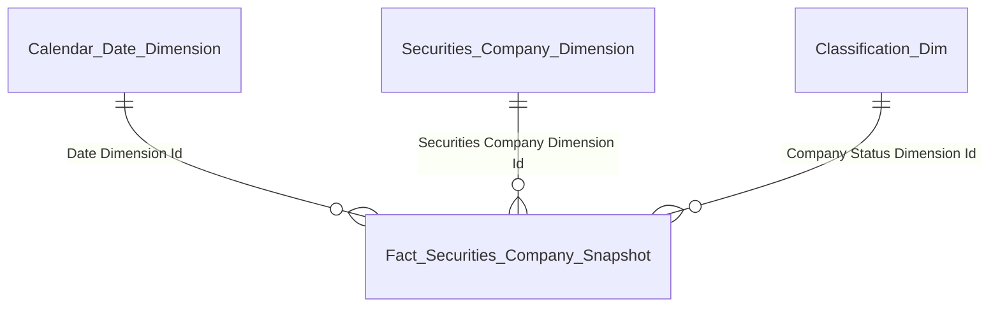
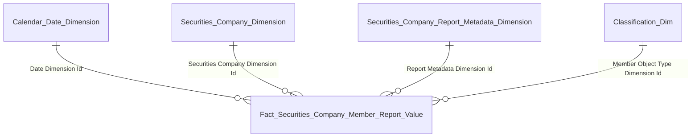
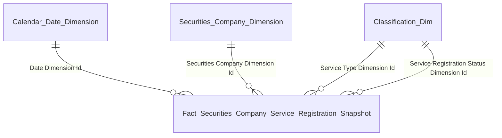
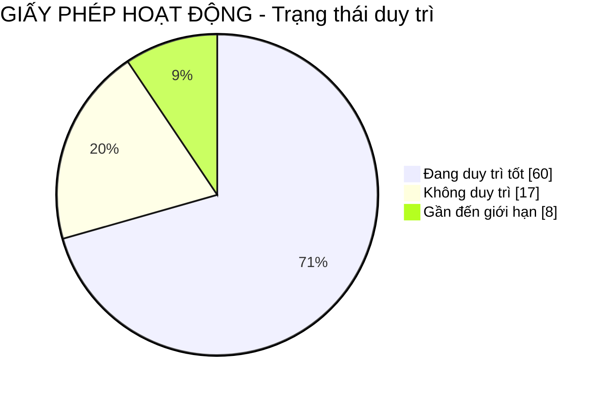
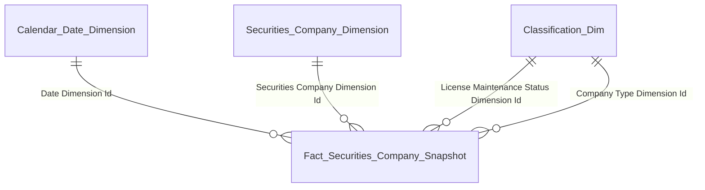
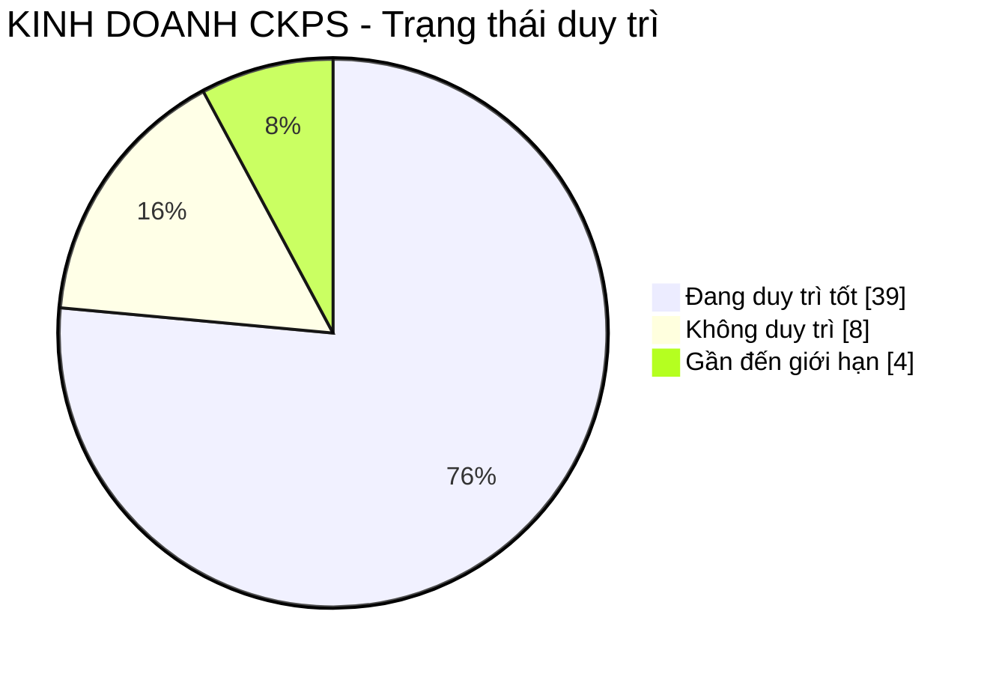
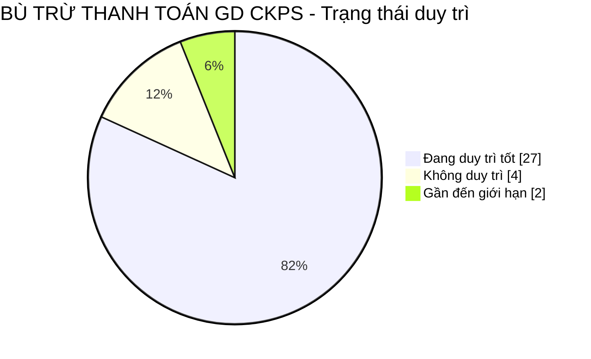
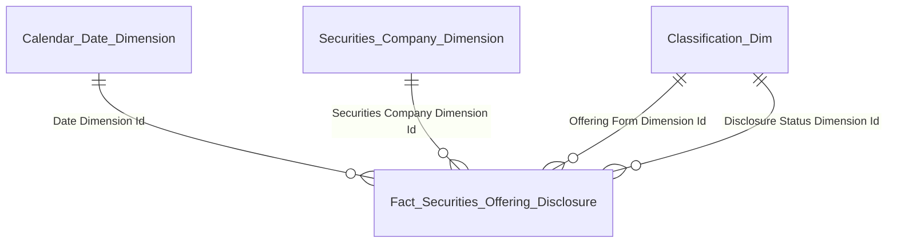

# Gold Data Mart HLD — Phân hệ Quản lý Kinh doanh Chứng khoán (QLKD)

**Phiên bản:** 0.6  **Ngày:** 17/04/2026
**Phạm vi phiên bản này:** 3 Dashboard, 39 block in-scope (Dashboard 1: 10 + Dashboard 2: 7 + Dashboard 3: 22) + 3 block DROP/rút scope (Block 17, 32, 33)
**Mô hình:** Star Schema thuần túy

## Thay đổi so với v0.5

- **QLKD_O9 chốt Option B (cross-module NHNCK):** Tab 3 (Block 28-30) dùng `Fact QLKD Practitioner License Certificate Snapshot` + `Securities Company Practitioner Dimension` — đọc Silver NHNCK, tạo entity riêng cho QLKD (không reuse Gold NHNCK per §7.6). Gỡ Option A khỏi design.
- **QLKD_O10 chốt Option B (cross-module TT):** Block 42 refactor — fact mới `Fact QLKD Inspection Penalty Record` source Silver TT (4 bảng: `Inspection Decision` + `Inspection Case` + `Inspection Case Conclusion` + `Inspection Decision Subject`). Silver TT cover 6/7 field BA đầy đủ với scheme chuẩn `TT_VIOLATION_TYPE` + `TT_PENALTY_TYPE`. Field 7 "Biện pháp khắc phục" không có attribute riêng — parse text từ `Conclusion Summary` query time (see QLKD_O12).
- **Block 40 K_QLKD_123 giữ nguyên SCMS:** `Fact Securities Company Administrative Penalty` (SCMS) vẫn tồn tại, dùng cho count tổng số QĐ XP ở KPI card. Block 42 dùng fact TT khác — 2 fact song song cho 2 mục đích khác nhau (count nhanh vs detail đầy đủ).
- **QLKD_O11 chốt rút scope Block 32 + 33:** 2 block trong screenshot (Cổ đông lớn + Lịch sử thay đổi nhân sự) không có trong BA — rút khỏi HLD v0.6. Entity Shareholder Dim + Fact Shareholder Ownership Snapshot cũng remove. Tab 4 còn 1 block (Block 31 Nhân sự cao cấp).
- **QLKD_O12 mới:** "Biện pháp khắc phục" (K_QLKD_135) chưa có attribute riêng trong Silver TT — tạm parse từ `Conclusion Summary` text. Chờ Silver TT bổ sung attribute.
- **Đóng issue đã confirmed:** QLKD_O4 (scheme SCMS_COMPANY_TYPE confirmed), QLKD_O7 (bucket ATTC query time confirmed). Chuyển sang rationale trong chat log, remove khỏi Section 3.
- **Tối ưu wording Section 3:** rút gọn mô tả vấn đề + giả định, chuẩn hóa format `Vấn đề → Giả định tạm → Hành động`.

## Thay đổi so với v0.4

Thêm Dashboard 3 (24 block per-CTCK drill-down) + 5 fact mới + 3 dim mới. Raise 3 issue QLKD_O9/O10/O11 (đã chốt ở v0.6).

## Thay đổi so với v0.3

Gộp 3 dim metadata báo cáo thành 1 `Securities Company Report Metadata Dimension` (§7.7). Thêm Dashboard 2 (7 block + 1 DROP). Confirmed scheme `SCMS_OFFERING_FORM`, thu hẹp QLKD_O8 còn 4 chỉ số thị trường MSS.

## Thay đổi so với v0.2

Thêm Dashboard 2 (Block 11→18, 7 in-scope + 1 DROP Block 17 Thị phần môi giới do SGDCK chưa có Silver). Thêm fact `Fact Securities Offering Disclosure` cho Block 13. Block 16 chỉ thiết kế phần SCMS (Dư nợ margin), 4 chỉ số thị trường tạm out-of-scope chờ Silver MSS. Raise QLKD_O6/O7/O8.

## Thay đổi so với v0.1

Tách Block 1 cũ thành Block 1 (Snapshot) + Block 2 (Member Report Value) theo quy tắc "1 block = 1 star schema" (§5.3). Thêm fact `Fact Securities Company Service Registration Snapshot` cho các Block dịch vụ có trạng thái per đăng ký (4, 5, 7, 8). Block 3 (Nghiệp vụ) + Block 6 (Duy trì GPHD) giữ flag trên Snapshot. Close QLKD_O1, O3.

---

## 1. Tổng quan báo cáo

### Dashboard Tổng quan công ty chứng khoán toàn thị trường

**Slicer toàn dashboard:**
- Chiều thời gian theo ngày (Calendar Date Dimension)
- Chiều thời gian theo quý (Calendar Date Dimension — Block 9, 10)
- Chiều trạng thái công ty (Classification — scheme `SCMS_COMPANY_STATUS`)
- Chiều nghiệp vụ kinh doanh CK (Classification — scheme `FIMS_BUSINESS_TYPE`): Môi giới / Bảo lãnh phát hành / Tư vấn / Tự doanh
- Chiều dịch vụ (Classification — scheme `SCMS_SERVICE_TYPE`): bao phủ cả dịch vụ KD CK (Ký quỹ / Ứng trước tiền bán / Lưu ký) và dịch vụ phái sinh (Môi giới PS / Tư vấn PS / Tự doanh PS / KD CKPS / Bù trừ CKPS)
- Chiều trạng thái đăng ký dịch vụ (Classification — scheme `QLKD_SERVICE_REGISTRATION_STATUS` — xem Issue QLKD_O2): Đang duy trì tốt / Gần đến giới hạn / Không duy trì / Đã thu hồi
- Chiều trạng thái duy trì GPHD toàn công ty (Classification — scheme `QLKD_LICENSE_MAINTENANCE_STATUS` — Block 6)
- Chiều phân loại CTCK (Classification — scheme `SCMS_COMPANY_TYPE` — xem Issue QLKD_O4)
- Chiều danh mục chỉ tiêu BCTC (attribute `Cell Code`/`Indicator Group Code` trên `Securities Company Report Metadata Dimension` — xem Issue QLKD_O5)

---

#### Block 1 — Thống kê số lượng CTCK theo trạng thái

**1. Mockup**

```
┌─────────────────────────────────────────────────────────────────────────────┐
│ TỔNG SỐ CTCK ĐƯỢC CẤP PHÉP                                                   │
│     85  ↑+2.4%                                             Ẩn chi tiết  ∧   │
└─────────────────────────────────────────────────────────────────────────────┘

┌──────────────┐ ┌──────────────┐ ┌──────────────┐ ┌──────────────┐
│ HOẠT ĐỘNG BT │ │ BỊ THU HỒI   │ │ CẢNH BÁO     │ │ KIỂM SOÁT    │
│    60        │ │    12        │ │    5         │ │    3         │
└──────────────┘ └──────────────┘ └──────────────┘ └──────────────┘

┌──────────────┐ ┌──────────────┐ ┌──────────────┐
│ KS ĐẶC BIỆT  │ │ ĐÌNH CHỈ HĐ  │ │ TRẠNG THÁI   │
│    1         │ │    2         │ │ KHÁC   2     │
└──────────────┘ └──────────────┘ └──────────────┘
```

Verify breakdown: 60 + 12 + 5 + 3 + 1 + 2 + 2 = 85 ✓

**2. Source:** `Fact Securities Company Snapshot` → `Securities Company Dimension`, `Classification Dimension`, `Calendar Date Dimension`.

**3. Bảng KPI**

| # | KPI ID | Tên | Đơn vị | Tính chất | Công thức / Mô tả |
|---|---|---|---|---|---|
| 1 | K_QLKD_1 | Tổng số CTCK đã được cấp phép | CTCK | Stock (Base) | `COUNT DISTINCT "Fact Securities Company Snapshot"."Securities Company Dimension Id" WHERE "Snapshot Date" = <last day of selected period>` |
| 2 | K_QLKD_2 | Số CTCK đã bị thu hồi | CTCK | Stock (Base) | `COUNT DISTINCT ... WHERE "Snapshot Date" = <selected> AND "Company Status Dimension Id" lookup scheme SCMS_COMPANY_STATUS = 'REVOKED'` |
| 3 | K_QLKD_3 | Số CTCK đang hoạt động bình thường | CTCK | Stock (Base) | `COUNT DISTINCT ... WHERE "Snapshot Date" = <selected> AND "Company Status Dimension Id" lookup = 'ACTIVE'` |
| 4 | K_QLKD_4 | Số CTCK thuộc diện cảnh báo | CTCK | Stock (Base) | `COUNT DISTINCT ... WHERE "Snapshot Date" = <selected> AND "Company Status Dimension Id" lookup = 'WARNING'` |
| 5 | K_QLKD_5 | Số CTCK thuộc diện kiểm soát | CTCK | Stock (Base) | `COUNT DISTINCT ... WHERE "Snapshot Date" = <selected> AND "Company Status Dimension Id" lookup = 'CONTROL'` |
| 6 | K_QLKD_6 | Số CTCK thuộc diện kiểm soát đặc biệt | CTCK | Stock (Base) | `COUNT DISTINCT ... WHERE "Snapshot Date" = <selected> AND "Company Status Dimension Id" lookup = 'SPECIAL_CONTROL'` |
| 7 | K_QLKD_7 | Số CTCK đình chỉ hoạt động | CTCK | Stock (Base) | `COUNT DISTINCT ... WHERE "Snapshot Date" = <selected> AND "Company Status Dimension Id" lookup = 'SUSPENDED'` |
| 8 | K_QLKD_8 | Số CTCK trạng thái khác | CTCK | Stock (Base) | `COUNT DISTINCT ... WHERE "Snapshot Date" = <selected> AND "Company Status Dimension Id" lookup NOT IN (REVOKED, ACTIVE, WARNING, CONTROL, SPECIAL_CONTROL, SUSPENDED)` |
| 9 | K_QLKD_1_SSCK | So sánh cùng kỳ Tổng số CTCK | % | Derived | `(K_QLKD_1 − K_QLKD_1 [Year − 1]) / K_QLKD_1 [Year − 1] × 100%` |

**4. Star schema**



**5. Bảng tham gia**

| Tên bảng | Grain |
|---|---|
| Fact Securities Company Snapshot | 1 row = 1 CTCK × 1 Snapshot Date (daily batch) |
| Securities Company Dimension | 1 row = 1 CTCK (SCD2) |
| Classification Dimension | 1 row = 1 classification value (SCD2) |
| Calendar Date Dimension | 1 row = 1 ngày snapshot |

---

#### Block 2 — Tài khoản & dư tiền gửi giao dịch toàn thị trường

**1. Mockup**

```
┌─────────────────────────────────────┐  ┌─────────────────────────────────────┐
│ TỔNG SỐ TÀI KHOẢN CÓ PHÁT SINH GD   │  │ TỔNG SỐ DƯ TIỀN GỬI GIAO DỊCH       │
│                                     │  │                                     │
│       2,450,000  TÀI KHOẢN          │  │       125.400  TỶ VNĐ              │
└─────────────────────────────────────┘  └─────────────────────────────────────┘
```

**2. Source:** `Fact Securities Company Member Report Value` → `Securities Company Dimension`, `Securities Company Report Metadata Dimension`, `Classification Dimension`, `Calendar Date Dimension`.

**3. Bảng KPI**

| # | KPI ID | Tên | Đơn vị | Tính chất | Công thức / Mô tả |
|---|---|---|---|---|---|
| 1 | K_QLKD_9 | Số tài khoản có phát sinh giao dịch | Tài khoản | Stock (Base) | `SUM(CAST("Fact Securities Company Member Report Value"."Cell Value" AS BIGINT)) WHERE "Cell Code" = '<mã chỉ tiêu số TK có PS GD — cần profile>' AND "Report Date" = <selected>` (cell code xem Issue QLKD_O5) |
| 2 | K_QLKD_10 | Số dư tiền gửi giao dịch | Tỷ VNĐ | Stock (Base) | `SUM(CAST("Cell Value" AS DECIMAL(20,2)) / 1e9) WHERE "Cell Code" = '<mã chỉ tiêu dư tiền gửi GD>' AND "Report Date" = <selected>` |

> **Ghi chú:** Grain fact = grain Silver `Member Report Indicator Value` (1 lần nộp × 1 mã chỉ tiêu). KPI = filter theo Cell Code + aggregate + CAST inline (pattern §7.7).

**4. Star schema**



**5. Bảng tham gia**

| Tên bảng | Grain |
|---|---|
| Fact Securities Company Member Report Value | 1 row = 1 lần nộp báo cáo × 1 mã chỉ tiêu báo cáo (grain = Silver Member Report Indicator Value) |
| Securities Company Dimension | 1 row = 1 CTCK (SCD2) |
| Securities Company Report Metadata Dimension | 1 row = 1 tổ hợp (Biểu mẫu × Kỳ báo cáo × Mã chỉ tiêu) — SCD2 |
| Classification Dimension | 1 row = 1 classification value (SCD2) |
| Calendar Date Dimension | 1 row = 1 ngày báo cáo |

---

#### Block 3 — Biểu đồ Nghiệp vụ kinh doanh chứng khoán

**1. Mockup**

```
SỐ LƯỢNG CTCK THEO NGHIỆP VỤ (horizontal bar)

Môi giới       ████████████████████████████  68
Bảo lãnh       █████████████████             42
Tư vấn         ██████████████████████        55
Tự doanh       ████████████████████████      58
               0    20    40    60    80
```

**2. Source:** `Fact Securities Company Snapshot` → `Securities Company Dimension`, `Classification Dimension`, `Calendar Date Dimension`.

**3. Bảng KPI**

| # | KPI ID | Tên | Đơn vị | Tính chất | Công thức / Mô tả |
|---|---|---|---|---|---|
| 1 | K_QLKD_12 | Số CTCK có nghiệp vụ Môi giới chứng khoán | CTCK | Stock (Base) | `COUNT DISTINCT "Fact Securities Company Snapshot"."Securities Company Dimension Id" WHERE "Snapshot Date" = <selected> AND "Is Brokerage Business Flag" = TRUE` |
| 2 | K_QLKD_13 | Số CTCK có nghiệp vụ Bảo lãnh phát hành | CTCK | Stock (Base) | `COUNT DISTINCT ... WHERE "Snapshot Date" = <selected> AND "Is Underwriting Business Flag" = TRUE` |
| 3 | K_QLKD_14 | Số CTCK có nghiệp vụ Tư vấn đầu tư chứng khoán | CTCK | Stock (Base) | `COUNT DISTINCT ... WHERE "Snapshot Date" = <selected> AND "Is Advisory Business Flag" = TRUE` |
| 4 | K_QLKD_15 | Số CTCK có nghiệp vụ Tự doanh chứng khoán | CTCK | Stock (Base) | `COUNT DISTINCT ... WHERE "Snapshot Date" = <selected> AND "Is Prop Trading Business Flag" = TRUE` |

> **Ghi chú thiết kế:** 4 nghiệp vụ kinh doanh CK có tính ngang hàng và tập hợp đóng (4 code cố định theo luật). Thiết kế thành 4 boolean flag riêng trên fact snapshot. Flag được ETL derive từ attribute `Business Type Codes: Array<Text>` của Silver `Securities Company` (scheme `FIMS_BUSINESS_TYPE`). Không dùng fact Service Registration cho Block này vì Silver Business Type không có trạng thái riêng per đăng ký (khác dịch vụ).

**4. Star schema**


**5. Bảng tham gia**

| Tên bảng | Grain |
|---|---|
| Fact Securities Company Snapshot | 1 row = 1 CTCK × 1 Snapshot Date (daily batch) |
| Securities Company Dimension | 1 row = 1 CTCK (SCD2) |
| Classification Dimension | 1 row = 1 classification value (SCD2) |
| Calendar Date Dimension | 1 row = 1 ngày snapshot |

---

#### Block 4 — Biểu đồ Dịch vụ kinh doanh chứng khoán

**1. Mockup**

```
SỐ LƯỢNG CTCK THEO DỊCH VỤ (horizontal bar)

Giao dịch ký quỹ   ████████████████████████  62
Ứng trước tiền bán ████████████████████       48
Lưu ký             ██████████████            38
                   0    20    40    60    80
```

**2. Source:** `Fact Securities Company Service Registration Snapshot` → `Securities Company Dimension`, `Classification Dimension`, `Calendar Date Dimension`.

**3. Bảng KPI**

| # | KPI ID | Tên | Đơn vị | Tính chất | Công thức / Mô tả |
|---|---|---|---|---|---|
| 1 | K_QLKD_16 | Số CTCK cung cấp dịch vụ Giao dịch ký quỹ | CTCK | Stock (Base) | `COUNT DISTINCT "Fact Securities Company Service Registration Snapshot"."Securities Company Dimension Id" WHERE "Snapshot Date" = <selected> AND "Service Type Dimension Id" lookup scheme SCMS_SERVICE_TYPE = '<mã ký quỹ>' AND "Service Registration Status Dimension Id" lookup NOT IN ('REVOKED')` |
| 2 | K_QLKD_17 | Số CTCK cung cấp dịch vụ Ứng trước tiền bán | CTCK | Stock (Base) | `COUNT DISTINCT ... WHERE "Snapshot Date" = <selected> AND "Service Type Dimension Id" lookup = '<mã ứng trước>' AND "Service Registration Status Dimension Id" lookup NOT IN ('REVOKED')` |
| 3 | K_QLKD_18 | Số CTCK cung cấp dịch vụ Lưu ký | CTCK | Stock (Base) | `COUNT DISTINCT ... WHERE "Snapshot Date" = <selected> AND "Service Type Dimension Id" lookup = '<mã lưu ký>' AND "Service Registration Status Dimension Id" lookup NOT IN ('REVOKED')` |

> **Ghi chú:** Filter `Service Registration Status NOT IN ('REVOKED')` để loại CTCK đã bị thu hồi đăng ký dịch vụ — đếm các CTCK đang đăng ký active (bao gồm cả Đang duy trì tốt / Gần giới hạn / Không duy trì). Mã code chính xác cho Ký quỹ / Ứng trước / Lưu ký cần profile từ `SCMS.DM_DICH_VU`.

**4. Star schema**



**5. Bảng tham gia**

| Tên bảng | Grain |
|---|---|
| Fact Securities Company Service Registration Snapshot | 1 row = 1 CTCK × 1 Dịch vụ × 1 Snapshot Date (daily batch) |
| Securities Company Dimension | 1 row = 1 CTCK (SCD2) |
| Classification Dimension | 1 row = 1 classification value (SCD2) |
| Calendar Date Dimension | 1 row = 1 ngày snapshot |

---

#### Block 5 — Biểu đồ Dịch vụ phái sinh

**1. Mockup**

```
SỐ LƯỢNG CTCK - DỊCH VỤ PHÁI SINH (horizontal bar)

Môi giới phái sinh ██████████████████████████  45
Tư vấn phái sinh   ██████████████              28
Tự doanh phái sinh ████████████████            32
                   0    15    30    45    60
```

**2. Source:** `Fact Securities Company Service Registration Snapshot` → `Securities Company Dimension`, `Classification Dimension`, `Calendar Date Dimension`.

**3. Bảng KPI**

| # | KPI ID | Tên | Đơn vị | Tính chất | Công thức / Mô tả |
|---|---|---|---|---|---|
| 1 | K_QLKD_19 | Số CTCK cung cấp dịch vụ Môi giới phái sinh | CTCK | Stock (Base) | `COUNT DISTINCT "Fact Securities Company Service Registration Snapshot"."Securities Company Dimension Id" WHERE "Snapshot Date" = <selected> AND "Service Type Dimension Id" lookup scheme SCMS_SERVICE_TYPE = '<mã MG phái sinh>' AND "Service Registration Status Dimension Id" lookup NOT IN ('REVOKED')` |
| 2 | K_QLKD_20 | Số CTCK cung cấp dịch vụ Tư vấn phái sinh | CTCK | Stock (Base) | `COUNT DISTINCT ... WHERE "Snapshot Date" = <selected> AND "Service Type Dimension Id" lookup = '<mã TV phái sinh>' AND "Service Registration Status Dimension Id" lookup NOT IN ('REVOKED')` |
| 3 | K_QLKD_21 | Số CTCK cung cấp dịch vụ Tự doanh phái sinh | CTCK | Stock (Base) | `COUNT DISTINCT ... WHERE "Snapshot Date" = <selected> AND "Service Type Dimension Id" lookup = '<mã TD phái sinh>' AND "Service Registration Status Dimension Id" lookup NOT IN ('REVOKED')` |

> **Ghi chú:** Cùng fact với Block 4, chỉ khác code filter trong cùng scheme `SCMS_SERVICE_TYPE`. Mã code cụ thể cần profile `SCMS.DM_DICH_VU` để xác định code cho 3 dịch vụ phái sinh. Filter tương tự Block 4 — chỉ đếm CTCK đang đăng ký active.

**4. Star schema**


**5. Bảng tham gia**

| Tên bảng | Grain |
|---|---|
| Fact Securities Company Service Registration Snapshot | 1 row = 1 CTCK × 1 Dịch vụ × 1 Snapshot Date (daily batch) |
| Securities Company Dimension | 1 row = 1 CTCK (SCD2) |
| Classification Dimension | 1 row = 1 classification value (SCD2) |
| Calendar Date Dimension | 1 row = 1 ngày snapshot |

---

#### Block 6 — Duy trì điều kiện cấp phép: Giấy phép hoạt động

**1. Mockup**



**2. Source:** `Fact Securities Company Snapshot` → `Securities Company Dimension`, `Classification Dimension`, `Calendar Date Dimension`.

**3. Bảng KPI**

| # | KPI ID | Tên | Đơn vị | Tính chất | Công thức / Mô tả |
|---|---|---|---|---|---|
| 1 | K_QLKD_22 | Số CTCK đang duy trì tốt Giấy phép hoạt động | CTCK | Stock (Base) | `COUNT DISTINCT "Fact Securities Company Snapshot"."Securities Company Dimension Id" WHERE "Snapshot Date" = <selected> AND "License Maintenance Status Dimension Id" lookup scheme QLKD_LICENSE_MAINTENANCE_STATUS = 'GOOD'` |
| 2 | K_QLKD_23 | Số CTCK gần đến giới hạn duy trì Giấy phép hoạt động | CTCK | Stock (Base) | `COUNT DISTINCT ... WHERE "Snapshot Date" = <selected> AND "License Maintenance Status Dimension Id" lookup = 'NEAR_LIMIT'` |
| 3 | K_QLKD_24 | Số CTCK không duy trì điều kiện Giấy phép hoạt động | CTCK | Stock (Base) | `COUNT DISTINCT ... WHERE "Snapshot Date" = <selected> AND "License Maintenance Status Dimension Id" lookup = 'FAILED'` |

> **Ghi chú:** "Giấy phép hoạt động" là giấy phép thành lập công ty chung (cấp CTCK, không per dịch vụ). Trạng thái duy trì derived từ ngưỡng chỉ tiêu tài chính/nhân sự/hạ tầng cấp CTCK (vốn điều lệ, vốn khả dụng, tỷ lệ ATT, nhân sự cao cấp...) — xem Issue QLKD_O2. Phân loại CTCK (xem Issue QLKD_O4) dùng cùng dim filter bổ sung — `"Company Type Dimension Id" lookup scheme SCMS_COMPANY_TYPE`.

**4. Star schema**



**5. Bảng tham gia**

| Tên bảng | Grain |
|---|---|
| Fact Securities Company Snapshot | 1 row = 1 CTCK × 1 Snapshot Date (daily batch) |
| Securities Company Dimension | 1 row = 1 CTCK (SCD2) |
| Classification Dimension | 1 row = 1 classification value (SCD2) |
| Calendar Date Dimension | 1 row = 1 ngày snapshot |

---

#### Block 7 — Duy trì điều kiện cấp phép: Kinh doanh chứng khoán phái sinh

**1. Mockup**



**2. Source:** `Fact Securities Company Service Registration Snapshot` → `Securities Company Dimension`, `Classification Dimension`, `Calendar Date Dimension`.

**3. Bảng KPI**

| # | KPI ID | Tên | Đơn vị | Tính chất | Công thức / Mô tả |
|---|---|---|---|---|---|
| 1 | K_QLKD_25 | Số CTCK KD CKPS đang duy trì tốt | CTCK | Stock (Base) | `COUNT DISTINCT "Fact Securities Company Service Registration Snapshot"."Securities Company Dimension Id" WHERE "Snapshot Date" = <selected> AND "Service Type Dimension Id" lookup scheme SCMS_SERVICE_TYPE = '<mã KD CKPS>' AND "Service Registration Status Dimension Id" lookup scheme QLKD_SERVICE_REGISTRATION_STATUS = 'GOOD'` |
| 2 | K_QLKD_26 | Số CTCK KD CKPS gần đến giới hạn duy trì | CTCK | Stock (Base) | `COUNT DISTINCT ... WHERE "Snapshot Date" = <selected> AND "Service Type Dimension Id" lookup = '<mã KD CKPS>' AND "Service Registration Status Dimension Id" lookup = 'NEAR_LIMIT'` |
| 3 | K_QLKD_27 | Số CTCK KD CKPS không duy trì điều kiện | CTCK | Stock (Base) | `COUNT DISTINCT ... WHERE "Snapshot Date" = <selected> AND "Service Type Dimension Id" lookup = '<mã KD CKPS>' AND "Service Registration Status Dimension Id" lookup = 'FAILED'` |

> **Ghi chú:** "KD CKPS" là 1 dịch vụ trong scheme `SCMS_SERVICE_TYPE` (code cần profile từ `DM_DICH_VU`). Trạng thái duy trì lấy trực tiếp từ `TRANG_THAI` của Silver `Securities Company Service Registration` (bảng nguồn `CTCK_DICH_VU`). Nếu Silver TRANG_THAI chỉ có 2 mức (đăng ký / thu hồi) — cần ETL derive thêm các mức Đang duy trì / Gần giới hạn / Không duy trì từ threshold (xem Issue QLKD_O2).

**4. Star schema**


**5. Bảng tham gia**

| Tên bảng | Grain |
|---|---|
| Fact Securities Company Service Registration Snapshot | 1 row = 1 CTCK × 1 Dịch vụ × 1 Snapshot Date (daily batch) |
| Securities Company Dimension | 1 row = 1 CTCK (SCD2) |
| Classification Dimension | 1 row = 1 classification value (SCD2) |
| Calendar Date Dimension | 1 row = 1 ngày snapshot |

---

#### Block 8 — Duy trì điều kiện cấp phép: Bù trừ, thanh toán giao dịch chứng khoán phái sinh

**1. Mockup**



**2. Source:** `Fact Securities Company Service Registration Snapshot` → `Securities Company Dimension`, `Classification Dimension`, `Calendar Date Dimension`.

**3. Bảng KPI**

| # | KPI ID | Tên | Đơn vị | Tính chất | Công thức / Mô tả |
|---|---|---|---|---|---|
| 1 | K_QLKD_28 | Số CTCK Bù trừ CKPS đang duy trì tốt | CTCK | Stock (Base) | `COUNT DISTINCT "Fact Securities Company Service Registration Snapshot"."Securities Company Dimension Id" WHERE "Snapshot Date" = <selected> AND "Service Type Dimension Id" lookup = '<mã Bù trừ CKPS>' AND "Service Registration Status Dimension Id" lookup = 'GOOD'` |
| 2 | K_QLKD_29 | Số CTCK Bù trừ CKPS gần đến giới hạn duy trì | CTCK | Stock (Base) | `COUNT DISTINCT ... WHERE "Snapshot Date" = <selected> AND "Service Type Dimension Id" lookup = '<mã Bù trừ CKPS>' AND "Service Registration Status Dimension Id" lookup = 'NEAR_LIMIT'` |
| 3 | K_QLKD_30 | Số CTCK Bù trừ CKPS không duy trì điều kiện | CTCK | Stock (Base) | `COUNT DISTINCT ... WHERE "Snapshot Date" = <selected> AND "Service Type Dimension Id" lookup = '<mã Bù trừ CKPS>' AND "Service Registration Status Dimension Id" lookup = 'FAILED'` |

> **Ghi chú:** Cùng fact với Block 7, chỉ khác code filter Service Type (Bù trừ CKPS thay cho KD CKPS). Logic trạng thái tương tự Block 7.

**4. Star schema**


**5. Bảng tham gia**

| Tên bảng | Grain |
|---|---|
| Fact Securities Company Service Registration Snapshot | 1 row = 1 CTCK × 1 Dịch vụ × 1 Snapshot Date (daily batch) |
| Securities Company Dimension | 1 row = 1 CTCK (SCD2) |
| Classification Dimension | 1 row = 1 classification value (SCD2) |
| Calendar Date Dimension | 1 row = 1 ngày snapshot |

---

#### Block 9 — Biểu đồ Cơ cấu tài sản toàn thị trường

**1. Mockup**

```
CƠ CẤU TÀI SẢN (stacked column theo quý, unit: nghìn tỷ)

160K                                  [151K]
         [133K]  [133K]  [143K]        ▓▓▓  ← Các khoản cho vay (tím)
120K      ▓▓▓    ▓▓▓    ▓▓▓          ░░░  ← Khác (xám)
          ░░░    ░░░    ░░░           ▒▒▒  ← TS tài chính sẵn sàng để bán (xanh dương nhạt)
 80K      ▒▒▒    ▒▒▒    ▒▒▒           ███  ← TS tài chính qua lãi/lỗ (xanh dương)
          ███    ███    ███           ▓▓▓  ← Đầu tư nắm giữ đến hạn (vàng)
 40K      ▓▓▓    ▓▓▓    ▓▓▓           ███  ← Tiền và tương đương (xanh lá)
          ███    ███    ███
  0    Q4/23   Q1/24   Q2/24   Q3/24
```

**2. Source:** `Fact Securities Company Member Report Value` → `Securities Company Dimension`, `Securities Company Report Metadata Dimension`, `Classification Dimension`, `Calendar Date Dimension`.

**3. Bảng KPI**

| # | KPI ID | Tên | Đơn vị | Tính chất | Công thức / Mô tả |
|---|---|---|---|---|---|
| 1 | K_QLKD_31 | Tiền và tương đương tiền — toàn thị trường | Nghìn tỷ VNĐ | Flow (Base) | `SUM(CAST("Fact Securities Company Member Report Value"."Cell Value" AS DECIMAL(20,2))) / 1e12 WHERE "Cell Code" = '<mã BCTC - Tiền và tương đương>' AND "Report Metadata Dimension"."Reporting Period Code" = <quý chọn>` |
| 2 | K_QLKD_32 | Tài sản tài chính ghi nhận thông qua lãi/lỗ — toàn thị trường | Nghìn tỷ VNĐ | Flow (Base) | `SUM(CAST(...AS DECIMAL(20,2))) / 1e12 WHERE "Cell Code" = '<mã BCTC - FVTPL>' AND "Reporting Period" = <quý chọn>` |
| 3 | K_QLKD_33 | Các khoản đầu tư nắm giữ đến ngày đáo hạn — toàn thị trường | Nghìn tỷ VNĐ | Flow (Base) | `SUM(CAST(...AS DECIMAL(20,2))) / 1e12 WHERE "Cell Code" = '<mã BCTC - HTM>' AND "Reporting Period" = <quý chọn>` |
| 4 | K_QLKD_34 | Tài sản tài chính sẵn sàng để bán — toàn thị trường | Nghìn tỷ VNĐ | Flow (Base) | `SUM(CAST(...AS DECIMAL(20,2))) / 1e12 WHERE "Cell Code" = '<mã BCTC - AFS>' AND "Reporting Period" = <quý chọn>` |
| 5 | K_QLKD_35 | Các khoản cho vay — toàn thị trường | Nghìn tỷ VNĐ | Flow (Base) | `SUM(CAST(...AS DECIMAL(20,2))) / 1e12 WHERE "Cell Code" = '<mã BCTC - Cho vay>' AND "Reporting Period" = <quý chọn>` |
| 6 | K_QLKD_36 | Tài sản khác — toàn thị trường | Nghìn tỷ VNĐ | Flow (Base) | `SUM(CAST(...AS DECIMAL(20,2))) / 1e12 WHERE "Cell Code" = '<mã BCTC - Tài sản khác>' AND "Reporting Period" = <quý chọn>` |

> **Ghi chú:** Mã cell code cụ thể cho từng chỉ tiêu BCTC phải profile từ Silver `SCMS.BC_BAO_CAO_GT` + `SCMS.BM_BAO_CAO_CT` — xem Issue QLKD_O5. Khi profile xong, cập nhật Detail Mapping (Phase 3).

**4. Star schema**


**5. Bảng tham gia**

| Tên bảng | Grain |
|---|---|
| Fact Securities Company Member Report Value | 1 row = 1 lần nộp báo cáo × 1 mã chỉ tiêu báo cáo (grain = Silver Member Report Indicator Value) |
| Securities Company Dimension | 1 row = 1 CTCK (SCD2) |
| Securities Company Report Metadata Dimension | 1 row = 1 tổ hợp (Biểu mẫu × Kỳ báo cáo × Mã chỉ tiêu) — SCD2 |
| Classification Dimension | 1 row = 1 classification value (SCD2) |
| Calendar Date Dimension | 1 row = 1 ngày báo cáo |

---

#### Block 10 — Biểu đồ Cơ cấu nguồn vốn toàn thị trường

**1. Mockup**

```
CƠ CẤU NGUỒN VỐN (stacked column theo quý, unit: nghìn tỷ)

180K                                  [161K]
         [141K]  [143K]  [152K]        ███  ← Vốn chủ sở hữu (xanh lá)
135K      ███    ███    ███           ▓▓▓  ← Vay và nợ ngắn hạn (cam)
          ▓▓▓    ▓▓▓    ▓▓▓           ░░░  ← Nợ phải trả dài hạn (đỏ cam)
 90K      ░░░    ░░░    ░░░           ▒▒▒  ← Nợ khác (xám)
          ▒▒▒    ▒▒▒    ▒▒▒
 45K
  0    Q4/23   Q1/24   Q2/24   Q3/24
```

**2. Source:** `Fact Securities Company Member Report Value` → `Securities Company Dimension`, `Securities Company Report Metadata Dimension`, `Classification Dimension`, `Calendar Date Dimension`.

**3. Bảng KPI**

| # | KPI ID | Tên | Đơn vị | Tính chất | Công thức / Mô tả |
|---|---|---|---|---|---|
| 1 | K_QLKD_37 | Vay và nợ thuê tài chính ngắn hạn — toàn thị trường | Nghìn tỷ VNĐ | Flow (Base) | `SUM(CAST(...AS DECIMAL(20,2))) / 1e12 WHERE "Cell Code" = '<mã BCTC - Vay ngắn hạn>' AND "Reporting Period" = <quý chọn>` |
| 2 | K_QLKD_38 | Nợ phải trả dài hạn — toàn thị trường | Nghìn tỷ VNĐ | Flow (Base) | `SUM(CAST(...AS DECIMAL(20,2))) / 1e12 WHERE "Cell Code" = '<mã BCTC - Nợ dài hạn>' AND "Reporting Period" = <quý chọn>` |
| 3 | K_QLKD_39 | Vốn chủ sở hữu — toàn thị trường | Nghìn tỷ VNĐ | Flow (Base) | `SUM(CAST(...AS DECIMAL(20,2))) / 1e12 WHERE "Cell Code" = '<mã BCTC - Vốn CSH>' AND "Reporting Period" = <quý chọn>` |
| 4 | K_QLKD_40 | Nợ khác — toàn thị trường | Nghìn tỷ VNĐ | Flow (Base) | `SUM(CAST(...AS DECIMAL(20,2))) / 1e12 WHERE "Cell Code" = '<mã BCTC - Nợ khác>' AND "Reporting Period" = <quý chọn>` |

**4. Star schema**


**5. Bảng tham gia**

| Tên bảng | Grain |
|---|---|
| Fact Securities Company Member Report Value | 1 row = 1 lần nộp báo cáo × 1 mã chỉ tiêu báo cáo (grain = Silver Member Report Indicator Value) |
| Securities Company Dimension | 1 row = 1 CTCK (SCD2) |
| Securities Company Report Metadata Dimension | 1 row = 1 tổ hợp (Biểu mẫu × Kỳ báo cáo × Mã chỉ tiêu) — SCD2 |
| Classification Dimension | 1 row = 1 classification value (SCD2) |
| Calendar Date Dimension | 1 row = 1 ngày báo cáo |

---
---

### Dashboard Giám sát tình hình hoạt động của CTCK toàn thị trường

**Slicer toàn dashboard:**
- Chiều thời gian theo quý (Block 11, 12, 15) / theo tháng (Block 13, 14, 16) / theo ngày (Block 18) — Calendar Date Dimension
- Chiều phân loại hình thức tăng vốn (Classification — scheme `SCMS_OFFERING_FORM` — xem Issue QLKD_O6): Chào bán công chúng / Chào bán riêng lẻ / Chào bán khác / Phát hành trái phiếu riêng lẻ / Phát hành trái phiếu công chúng
- Chiều phân loại tỷ lệ vốn khả dụng (Classification — scheme `QLKD_CAPITAL_ADEQUACY_LEVEL` — xem Issue QLKD_O7): Cao (>150%) / Trung bình (120-150%) / Thấp (<120%)
- Chiều danh mục chỉ tiêu BCTC (attribute `Cell Code`/`Indicator Group Code` trên `Securities Company Report Metadata Dimension` — xem Issue QLKD_O5)
- Chiều mã CTCK (Securities Company Dimension — Block 18)

---

#### Block 11 — Cơ cấu vốn chủ sở hữu toàn thị trường

**1. Mockup**

```
CƠ CẤU VỐN CHỦ SỞ HỮU (stacked column theo quý, nghìn tỷ VNĐ)

207K
         [165.400] [168.800] [172.200] [176.600]
165K      ░░░       ░░░       ░░░       ░░░       ← Vốn khác (xám)
          ▓▓▓       ▓▓▓       ▓▓▓       ▓▓▓       ← Quỹ, thặng dư vốn CP (vàng)
110K      ███       ███       ███       ███       ← Lợi nhuận sau thuế chưa PP (xanh lá)
          ███       ███       ███       ███       ← Vốn đầu tư của CSH (tím)
 55K      ███       ███       ███       ███
   0    Q1/24     Q2/24     Q3/24     Q4/24
```

**2. Source:** `Fact Securities Company Member Report Value` → `Securities Company Dimension`, `Securities Company Report Metadata Dimension`, `Classification Dimension`, `Calendar Date Dimension`.

**3. Bảng KPI**

| # | KPI ID | Tên | Đơn vị | Tính chất | Công thức / Mô tả |
|---|---|---|---|---|---|
| 1 | K_QLKD_41 | Vốn điều lệ (Vốn góp CSH) — toàn thị trường | Nghìn tỷ VNĐ | Flow (Base) | `SUM(CAST("Fact Securities Company Member Report Value"."Cell Value" AS DECIMAL(20,2))) / 1e12 WHERE "Cell Code" = '<mã BCTC - Vốn điều lệ>' AND "Report Metadata Dimension"."Reporting Period Code" = <quý chọn>` |
| 2 | K_QLKD_42 | Lợi nhuận sau thuế chưa phân phối — toàn thị trường | Nghìn tỷ VNĐ | Flow (Base) | `SUM(CAST(...AS DECIMAL(20,2))) / 1e12 WHERE "Cell Code" = '<mã BCTC - LNST chưa PP>' AND "Reporting Period" = <quý chọn>` |
| 3 | K_QLKD_43 | Quỹ, thặng dư vốn cổ phần — toàn thị trường | Nghìn tỷ VNĐ | Flow (Base) | `SUM(CAST(...AS DECIMAL(20,2))) / 1e12 WHERE "Cell Code" = '<mã BCTC - Quỹ + thặng dư>' AND "Reporting Period" = <quý chọn>` |
| 4 | K_QLKD_44 | Vốn khác — toàn thị trường | Nghìn tỷ VNĐ | Flow (Base) | `SUM(CAST(...AS DECIMAL(20,2))) / 1e12 WHERE "Cell Code" = '<mã BCTC - Vốn khác CSH>' AND "Reporting Period" = <quý chọn>` |

**4. Star schema**


**5. Bảng tham gia**

| Tên bảng | Grain |
|---|---|
| Fact Securities Company Member Report Value | 1 row = 1 lần nộp báo cáo × 1 mã chỉ tiêu báo cáo (grain = Silver Member Report Indicator Value) |
| Securities Company Dimension | 1 row = 1 CTCK (SCD2) |
| Securities Company Report Metadata Dimension | 1 row = 1 tổ hợp (Biểu mẫu × Kỳ báo cáo × Mã chỉ tiêu) — SCD2 |
| Classification Dimension | 1 row = 1 classification value (SCD2) |
| Calendar Date Dimension | 1 row = 1 ngày báo cáo |

---

#### Block 12 — Biến động Vốn đầu tư chủ sở hữu theo quý

**1. Mockup**

```
VỐN GÓP CHỦ SỞ HỮU (line chart, Q1/2020 → Q4/2024, tỷ VNĐ)

32K                                                          ●
                                                      ●───●
24K                                           ●───●
                                    ●───●
                             ●───●
16K  ●───●───●
   2020Q1  2020Q4  2021Q3  2022Q2  2023Q1  2023Q4  2024Q4
```

**2. Source:** `Fact Securities Company Member Report Value` → `Securities Company Dimension`, `Securities Company Report Metadata Dimension`, `Classification Dimension`, `Calendar Date Dimension`.

**3. Bảng KPI**

| # | KPI ID | Tên | Đơn vị | Tính chất | Công thức / Mô tả |
|---|---|---|---|---|---|
| 1 | K_QLKD_45 | Vốn góp của chủ sở hữu trên BCTC — toàn thị trường | Tỷ VNĐ | Flow (Base) | `SUM(CAST("Cell Value" AS DECIMAL(20,2))) / 1e9 WHERE "Cell Code" = '<mã BCTC - Vốn góp CSH>' AND "Report Metadata Dimension"."Reporting Period Code" = <quý chọn>` |

> **Ghi chú:** KPI này có thể chia sẻ cùng cell code với K_QLKD_41 (Vốn điều lệ = Vốn góp CSH trên BCTC của CTCK). UI render line chart theo trục thời gian đa quý, không phải stack column như Block 11. Cùng cell code → cùng fact, chỉ khác filter time range.

**4. Star schema**


**5. Bảng tham gia**

| Tên bảng | Grain |
|---|---|
| Fact Securities Company Member Report Value | 1 row = 1 lần nộp báo cáo × 1 mã chỉ tiêu báo cáo (grain = Silver Member Report Indicator Value) |
| Securities Company Dimension | 1 row = 1 CTCK (SCD2) |
| Securities Company Report Metadata Dimension | 1 row = 1 tổ hợp (Biểu mẫu × Kỳ báo cáo × Mã chỉ tiêu) — SCD2 |
| Classification Dimension | 1 row = 1 classification value (SCD2) |
| Calendar Date Dimension | 1 row = 1 ngày báo cáo |

---

#### Block 13 — Nguồn vốn tăng thêm trong kỳ (chào bán + phát hành)

**1. Mockup**

```
NGUỒN VỐN TĂNG THÊM (stacked column theo tháng, tỷ VNĐ)
                                                              [9.100]
10K                                               [8.000]  [8.400]
                          [7.000]          [7.500]  [7.000]   ▓▓▓  ← Trái phiếu riêng lẻ (hồng)
 8K              [5.300]   [5.500] [6.400]   ▓▓▓   ▓▓▓   ▓▓▓  ▓▓▓  ← Trái phiếu công chúng (cam)
         [5.700]  ▓▓▓      ▓▓▓    ▓▓▓   ▓▓▓ ▓▓▓   ▓▓▓   ▓▓▓  ▓▓▓  ← Chào bán riêng lẻ (xanh dương)
 5K      ▓▓▓    ▓▓▓      ▓▓▓    ▓▓▓   ▓▓▓ ▓▓▓   ▓▓▓   ▓▓▓  ▓▓▓  ← Chào bán khác (tím)
         ███    ███      ███    ███   ███ ███   ███   ███  ███  ← Chào bán công chúng (xanh lá)
 3K      ███    ███      ███    ███   ███ ███   ███   ███  ███
   0    T1/24 T2/24 T3/24 T4/24 T5/24 T6/24 T7/24 T8/24 T9/24 T10 T11 T12
```

**2. Source:** `Fact Securities Offering Disclosure` → `Securities Company Dimension`, `Classification Dimension`, `Calendar Date Dimension`.

**3. Bảng KPI**

| # | KPI ID | Tên | Đơn vị | Tính chất | Công thức / Mô tả |
|---|---|---|---|---|---|
| 1 | K_QLKD_46 | Vốn tăng thêm do chào bán công chúng | Tỷ VNĐ | Flow (Base) | `SUM("Fact Securities Offering Disclosure"."Offering Value Amount") / 1e9 WHERE "Offering Form Dimension Id" lookup scheme SCMS_OFFERING_FORM = '<mã chào bán công chúng>' AND "Disclosure Date" BETWEEN <tháng chọn start, end>` |
| 2 | K_QLKD_47 | Vốn tăng thêm do chào bán riêng lẻ | Tỷ VNĐ | Flow (Base) | `SUM("Offering Value Amount") / 1e9 WHERE "Offering Form Dimension Id" lookup = '<mã chào bán riêng lẻ>' AND "Disclosure Date" BETWEEN ...` |
| 3 | K_QLKD_48 | Vốn tăng thêm do chào bán khác | Tỷ VNĐ | Flow (Base) | `SUM("Offering Value Amount") / 1e9 WHERE "Offering Form Dimension Id" lookup = '<mã chào bán khác>' AND "Disclosure Date" BETWEEN ...` |
| 4 | K_QLKD_49 | Vốn tăng thêm do phát hành trái phiếu riêng lẻ | Tỷ VNĐ | Flow (Base) | `SUM("Offering Value Amount") / 1e9 WHERE "Offering Form Dimension Id" lookup = '<mã trái phiếu riêng lẻ>' AND "Disclosure Date" BETWEEN ...` |
| 5 | K_QLKD_50 | Vốn tăng thêm do phát hành trái phiếu ra công chúng | Tỷ VNĐ | Flow (Base) | `SUM("Offering Value Amount") / 1e9 WHERE "Offering Form Dimension Id" lookup = '<mã trái phiếu công chúng>' AND "Disclosure Date" BETWEEN ...` |

> **Ghi chú:** Fact mới `Fact Securities Offering Disclosure` là event fact (grain = 1 công bố chào bán/phát hành). Source Silver: `Disclosure Securities Offering` (SCMS.CBTT_CHAO_BAN_CHUNG_KHOAN). Measure `Offering Value Amount` lấy trực tiếp từ Silver attribute `Offering Value`. Mã scheme `SCMS_OFFERING_FORM` cho 5 hình thức cần profile `SCMS.HINH_THUC_CHAO_BAN` → xem Issue QLKD_O6.

**4. Star schema**



**5. Bảng tham gia**

| Tên bảng | Grain |
|---|---|
| Fact Securities Offering Disclosure | 1 row = 1 công bố chào bán/phát hành chứng khoán (event) |
| Securities Company Dimension | 1 row = 1 CTCK (SCD2) |
| Classification Dimension | 1 row = 1 classification value (SCD2) |
| Calendar Date Dimension | 1 row = 1 ngày công bố |

---

#### Block 14 — Tỷ lệ an toàn tài chính (số lượng CTCK theo mức tỷ lệ vốn khả dụng)

**1. Mockup**

```
TỶ LỆ AN TOÀN TÀI CHÍNH (stacked column theo tháng — số CTCK)

100
 75    ▓▓        ▓▓         ▓▓        ▓▓         ← Thấp (<120%) — hồng
       ▓▓▓       ▓▓▓        ▓▓▓       ▓▓▓        ← Trung bình (120-150%) — cam
 50    ▓▓▓       ▓▓▓        ▓▓▓       ▓▓▓        ← Cao (>150%) — xanh lá
       ███       ███        ███       ███
 25    ███       ███        ███       ███
       ███       ███        ███       ███
   0  T1/23   T6/23   T12/23   T6/24   T12/24
```

**2. Source:** `Fact Securities Company Member Report Value` → `Securities Company Dimension`, `Securities Company Report Metadata Dimension`, `Classification Dimension`, `Calendar Date Dimension`.

**3. Bảng KPI**

| # | KPI ID | Tên | Đơn vị | Tính chất | Công thức / Mô tả |
|---|---|---|---|---|---|
| 1 | K_QLKD_51 | Số lượng CTCK tỷ lệ vốn khả dụng ở mức Cao (>150%) | CTCK | Stock (Base) | `COUNT DISTINCT "Securities Company Dimension Id" FROM "Fact Securities Company Member Report Value" WHERE "Cell Code" = '<mã VKD ratio>' AND "Report Date" = <tháng chọn> AND CAST("Cell Value" AS DECIMAL(10,4)) > 1.5` |
| 2 | K_QLKD_52 | Số lượng CTCK tỷ lệ vốn khả dụng ở mức Trung bình (120-150%) | CTCK | Stock (Base) | `COUNT DISTINCT "Securities Company Dimension Id" ... WHERE "Cell Code" = '<mã VKD ratio>' AND "Report Date" = <tháng chọn> AND CAST("Cell Value" AS DECIMAL(10,4)) BETWEEN 1.2 AND 1.5` |
| 3 | K_QLKD_53 | Số lượng CTCK tỷ lệ vốn khả dụng ở mức Thấp (<120%) | CTCK | Stock (Base) | `COUNT DISTINCT "Securities Company Dimension Id" ... WHERE "Cell Code" = '<mã VKD ratio>' AND "Report Date" = <tháng chọn> AND CAST("Cell Value" AS DECIMAL(10,4)) < 1.2` |

> **Ghi chú:** Bucket (Cao / Trung bình / Thấp) tính query time từ giá trị `Cell Value` (pattern §7.7 — CAST inline tại Detail Mapping). Không pre-aggregate bucket lên fact (giữ grain Silver). Ngưỡng `>150%` / `120-150%` / `<120%` lấy từ legend screenshot. Mã cell code chính xác cho chỉ tiêu VKD (có thể là "CAR", "Tỷ lệ VKD", "Vốn khả dụng/Tổng rủi ro") cần profile `SCMS.DM_CHI_TIEU` — xem Issue QLKD_O7.

**4. Star schema**


**5. Bảng tham gia**

| Tên bảng | Grain |
|---|---|
| Fact Securities Company Member Report Value | 1 row = 1 lần nộp báo cáo × 1 mã chỉ tiêu báo cáo (grain = Silver Member Report Indicator Value) |
| Securities Company Dimension | 1 row = 1 CTCK (SCD2) |
| Securities Company Report Metadata Dimension | 1 row = 1 tổ hợp (Biểu mẫu × Kỳ báo cáo × Mã chỉ tiêu) — SCD2 |
| Classification Dimension | 1 row = 1 classification value (SCD2) |
| Calendar Date Dimension | 1 row = 1 ngày báo cáo |

---

#### Block 15 — Doanh thu và lợi nhuận toàn thị trường (theo nghiệp vụ)

**1. Mockup**

```
DOANH THU & LỢI NHUẬN (stacked column + line, theo quý — tỷ VNĐ)

32K    ●───●───●───●  ← TỔNG DOANH THU (line đen)
       [31K] [31K] [31K] [32K]
24K    ▓▓▓   ▓▓▓   ▓▓▓   ▓▓▓   ← Tự doanh (tím)
       ░░░   ░░░   ░░░   ░░░   ← Khác (xám)
16K    ███   ███   ███   ███   ← Môi giới (xanh lá)
       ▒▒▒   ▒▒▒   ▒▒▒   ▒▒▒   ← Tư vấn (xanh lá nhạt)
 8K    ●───●───●───●   ← LỢI NHUẬN SAU THUẾ (line đỏ)
       ███   ███   ███   ███   ← Bảo lãnh phát hành (xanh đậm)
   0  2024Q1 2024Q2 2024Q3 2024Q4
```

**2. Source:** `Fact Securities Company Member Report Value` → `Securities Company Dimension`, `Securities Company Report Metadata Dimension`, `Classification Dimension`, `Calendar Date Dimension`.

**3. Bảng KPI**

| # | KPI ID | Tên | Đơn vị | Tính chất | Công thức / Mô tả |
|---|---|---|---|---|---|
| 1 | K_QLKD_54 | Tổng doanh thu — toàn thị trường | Tỷ VNĐ | Flow (Base) | `SUM(CAST("Cell Value" AS DECIMAL(20,2))) / 1e9 WHERE "Cell Code" = '<mã BCTC - Tổng doanh thu>' AND "Reporting Period" = <quý chọn>` |
| 2 | K_QLKD_55 | Lợi nhuận sau thuế — toàn thị trường | Tỷ VNĐ | Flow (Base) | `SUM(CAST("Cell Value" AS DECIMAL(20,2))) / 1e9 WHERE "Cell Code" = '<mã BCTC - LNST>' AND "Reporting Period" = <quý chọn>` |
| 3 | K_QLKD_56 | Doanh thu theo nghiệp vụ Môi giới — toàn thị trường | Tỷ VNĐ | Flow (Base) | `SUM(CAST("Cell Value" AS DECIMAL(20,2))) / 1e9 WHERE "Cell Code" = '<mã BCTC - DT môi giới, chỉ tiêu 1.6>' AND "Reporting Period" = <quý chọn>` |
| 4 | K_QLKD_57 | Doanh thu theo nghiệp vụ Tự doanh — toàn thị trường | Tỷ VNĐ | Flow (Base) | `SUM(CAST("Cell Value" AS DECIMAL(20,2))) / 1e9 WHERE "Cell Code" = '<mã BCTC - DT tự doanh>' AND "Reporting Period" = <quý chọn>` |
| 5 | K_QLKD_58 | Doanh thu theo nghiệp vụ Tư vấn — toàn thị trường | Tỷ VNĐ | Flow (Base) | `SUM(CAST("Cell Value" AS DECIMAL(20,2))) / 1e9 WHERE "Cell Code" = '<mã BCTC - DT tư vấn>' AND "Reporting Period" = <quý chọn>` |
| 6 | K_QLKD_59 | Doanh thu theo nghiệp vụ Bảo lãnh phát hành — toàn thị trường | Tỷ VNĐ | Flow (Base) | `SUM(CAST("Cell Value" AS DECIMAL(20,2))) / 1e9 WHERE "Cell Code" = '<mã BCTC - DT bảo lãnh, chỉ tiêu 1.7>' AND "Reporting Period" = <quý chọn>` |
| 7 | K_QLKD_60 | Doanh thu hoạt động khác — toàn thị trường | Tỷ VNĐ | Flow (Base) | `SUM(CAST("Cell Value" AS DECIMAL(20,2))) / 1e9 WHERE "Cell Code" IN (<mã các chỉ tiêu 1.3, 1.11, ...>) AND "Reporting Period" = <quý chọn>` |

> **Ghi chú:** "Doanh thu hoạt động khác" (K_QLKD_60) theo BA là tổng của khoản 1.3 (Lãi cho vay và phải thu) + 1.11 (Thu nhập khác). Ở Detail Mapping sẽ liệt kê cell codes cụ thể — filter IN (...). Đây vẫn là **base metric** (SUM aggregation tại query time), không vi phạm "không pre-aggregate".

**4. Star schema**


**5. Bảng tham gia**

| Tên bảng | Grain |
|---|---|
| Fact Securities Company Member Report Value | 1 row = 1 lần nộp báo cáo × 1 mã chỉ tiêu báo cáo (grain = Silver Member Report Indicator Value) |
| Securities Company Dimension | 1 row = 1 CTCK (SCD2) |
| Securities Company Report Metadata Dimension | 1 row = 1 tổ hợp (Biểu mẫu × Kỳ báo cáo × Mã chỉ tiêu) — SCD2 |
| Classification Dimension | 1 row = 1 classification value (SCD2) |
| Calendar Date Dimension | 1 row = 1 ngày báo cáo |

---

#### Block 16 — Biến động dư nợ margin (phần in-scope SCMS)

**1. Mockup**

```
DƯ NỢ MARGIN (bar) + CHỈ SỐ THỊ TRƯỜNG (line, theo tháng)

60K                                               ▓▓              1425
                                              ▓▓ ▓▓
45K                                    VN-Idx line ──── 1330
                                ▓▓ ▓▓ ▓▓                    1235
30K                   ▓▓ ▓▓ ▓▓                              1140
         ▓▓ ▓▓ ▓▓                                            1045
15K  ▓▓
   T1/23 T6/23 T12/23 T6/24 T12/24

— BAR: Tổng dư nợ Margin (tỷ VNĐ) — in-scope SCMS (K_QLKD_61)
— LINE: VN-Index, HNX, UPCOM, VN30 — out-of-scope (chờ Silver MSS)
```

**2. Source:** `Fact Securities Company Member Report Value` → `Securities Company Dimension`, `Securities Company Report Metadata Dimension`, `Classification Dimension`, `Calendar Date Dimension`.

**3. Bảng KPI**

| # | KPI ID | Tên | Đơn vị | Tính chất | Công thức / Mô tả |
|---|---|---|---|---|---|
| 1 | K_QLKD_61 | Tổng dư nợ margin — toàn thị trường | Tỷ VNĐ | Flow (Base) | `SUM(CAST("Cell Value" AS DECIMAL(20,2))) / 1e9 WHERE "Cell Code" = '<mã BCTC - Dư nợ margin>' AND "Report Date" = <tháng chọn>` |

> **Ghi chú phạm vi:** 4 chỉ số thị trường theo BA (VN-Index, HNX Index, UPCOM Index, VN30) **out-of-scope** ở v0.3 — BA cột I ghi MSS/SCMS, nhưng Silver MSS chưa thiết kế và SCMS không có entity chỉ số thị trường. Chờ Silver MSS sẵn sàng → thiết kế fact mới `Fact Market Index Snapshot` (grain = 1 chỉ số × 1 ngày). Issue QLKD_O8.

**4. Star schema**


**5. Bảng tham gia**

| Tên bảng | Grain |
|---|---|
| Fact Securities Company Member Report Value | 1 row = 1 lần nộp báo cáo × 1 mã chỉ tiêu báo cáo (grain = Silver Member Report Indicator Value) |
| Securities Company Dimension | 1 row = 1 CTCK (SCD2) |
| Securities Company Report Metadata Dimension | 1 row = 1 tổ hợp (Biểu mẫu × Kỳ báo cáo × Mã chỉ tiêu) — SCD2 |
| Classification Dimension | 1 row = 1 classification value (SCD2) |
| Calendar Date Dimension | 1 row = 1 ngày báo cáo |

---

#### Block 18 — Lưu chuyển tiền thuần từ hoạt động kinh doanh (CFO) per CTCK

**1. Mockup**

```
CFO PER CTCK (card matrix — tô đỏ nếu CFO < 0)

┌──────────┐ ┌──────────┐ ┌──────────┐ ┌──────────┐ ┌──────────┐ ┌──────────┐ ┌──────────┐ ┌──────────┐
│    S     │ │    V     │ │   VS🔴   │ │    VI    │ │    TC    │ │    HC    │ │    MS    │ │   SH🔴   │
│ CFO 4500 │ │ CFO 2100 │ │CFO -1200 │ │ CFO 1800 │ │ CFO 5200 │ │ CFO 1500 │ │ CFO  850 │ │ CFO -450 │
│ LNST 3200│ │ LNST 1850│ │ LNST  920│ │ LNST 1450│ │ LNST 4800│ │ LNST 1200│ │ LNST  620│ │ LNST  310│
└──────────┘ └──────────┘ └──────────┘ └──────────┘ └──────────┘ └──────────┘ └──────────┘ └──────────┘
┌──────────┐ ┌──────────┐ ┌──────────┐ ┌──────────┐ ┌──────────┐ ┌──────────┐ ┌──────────┐ ┌──────────┐
│    KS    │ │    MA    │ │   TI🔴   │ │    PS    │ │    VX    │ │    BS    │ │    CS    │ │   OS🔴   │
│ CFO 1100 │ │ CFO 1400 │ │CFO -2500 │ │ CFO  210 │ │ CFO 3200 │ │ CFO  450 │ │ CFO  620 │ │ CFO -820 │
│ LNST  950│ │ LNST 1250│ │ LNST -450│ │ LNST  185│ │ LNST 2800│ │ LNST  380│ │ LNST  510│ │ LNST  420│
└──────────┘ └──────────┘ └──────────┘ └──────────┘ └──────────┘ └──────────┘ └──────────┘ └──────────┘
```

**2. Source:** `Fact Securities Company Member Report Value` → `Securities Company Dimension`, `Securities Company Report Metadata Dimension`, `Classification Dimension`, `Calendar Date Dimension`.

**3. Bảng KPI**

| # | KPI ID | Tên | Đơn vị | Tính chất | Công thức / Mô tả |
|---|---|---|---|---|---|
| 1 | K_QLKD_62 | Lưu chuyển tiền thuần từ HĐKD (CFO) per CTCK | Tỷ VNĐ | Flow (Base) | `CAST("Cell Value" AS DECIMAL(20,2)) / 1e9 WHERE "Cell Code" = '<mã BCLC tiền tệ - CFO>' AND "Report Date" = <ngày BCTC mới nhất per CTCK> AND "Securities Company Dimension Id" = <CTCK filter>` |
| 2 | K_QLKD_63 | Lợi nhuận sau thuế (LNST) per CTCK | Tỷ VNĐ | Flow (Base) | `CAST("Cell Value" AS DECIMAL(20,2)) / 1e9 WHERE "Cell Code" = '<mã BCTC - LNST>' AND "Report Date" = <ngày BCTC mới nhất per CTCK> AND "Securities Company Dimension Id" = <CTCK filter>` |

> **Ghi chú grain hiển thị:** Dashboard hiển thị card per CTCK (grain fact đã per CTCK). Logic "BCTC mới nhất" = max Report Date trong kỳ báo cáo hiện hành cho mỗi CTCK — derived tại query time, không lưu mart. Cảnh báo màu (đỏ = CFO < 0 hoặc LNST < 0) là UI styling, không phải measure.

**4. Star schema**


**5. Bảng tham gia**

| Tên bảng | Grain |
|---|---|
| Fact Securities Company Member Report Value | 1 row = 1 lần nộp báo cáo × 1 mã chỉ tiêu báo cáo (grain = Silver Member Report Indicator Value) |
| Securities Company Dimension | 1 row = 1 CTCK (SCD2) |
| Securities Company Report Metadata Dimension | 1 row = 1 tổ hợp (Biểu mẫu × Kỳ báo cáo × Mã chỉ tiêu) — SCD2 |
| Classification Dimension | 1 row = 1 classification value (SCD2) |
| Calendar Date Dimension | 1 row = 1 ngày báo cáo |


### Dashboard Tra cứu hồ sơ 360° CTCK

**Mô tả:** Dashboard drill-down per-CTCK. Trang entry hiển thị danh sách CTCK (search + filter trạng thái). Click 1 CTCK → modal tabs 6 phần: Tổng quan / Tài chính / NHNCK / Nhân sự / Tuân thủ / CN, PGD, VPĐD.

**Slicer toàn dashboard:**
- **Securities Company** (bắt buộc — 1 CTCK duy nhất, mã hoặc tên CTCK) — screen header
- **Calendar Date** (thời điểm báo cáo) — tab Tổng quan mặc định tháng mới nhất; tab Tài chính chọn kỳ quý báo cáo; tab CN/PGD/VPĐD chọn ngày cụ thể
- **Company Status** — entry screen filter (Active / Đã thu hồi...)

**Ghi chú quan trọng:** Tất cả block trong Dashboard 3 đều có **filter bắt buộc `Securities Company Dimension Id = <selected CTCK>`**. KPI "card toàn thị trường" trên các dashboard 1/2 khi thêm filter này trở thành "card per CTCK" với cùng KPI ID cơ sở — không tạo KPI ID mới nếu công thức base trùng. KPI ID mới chỉ khi có measure/derivation mới (VD Margin/VCSH%).

---

#### Tab 1 — Tổng quan

##### Block 19 — Biểu đồ Thống kê chung (KPI cards tổng quan CTCK)

**1. Mockup**

```
┌────────────────┐  ┌────────────────┐  ┌────────────────┐  ┌────────────────┐  ┌────────────────┐
│ $    VỐN CSH   │  │ 🏢 VỐN ĐIỀU LỆ │  │ 📈 DƯ NỢ MARGIN│  │ 📊 TỶ LỆ ATTC  │  │ 🏛 NHÂN VIÊN   │
│ 3.900 Tỷ VND   │  │ 3.315 Tỷ VND   │  │ 3.200 Tỷ VND   │  │ 168 %          │  │ 50 người       │
│ +8.5%          │  │ 0              │  │ +12.3%         │  │ -2.1%          │  │                │
└────────────────┘  └────────────────┘  └────────────────┘  └────────────────┘  └────────────────┘
```

5 KPI card hiển thị giá trị CTCK tại tháng chọn. Số phía trên (+8.5%, +12.3%, -2.1%) là % change so với tháng trước — derived.

**2. Source:** `Fact Securities Company Member Report Value` → `Securities Company Report Metadata Dimension`, `Securities Company Dimension`, `Calendar Date Dimension`, `Classification Dimension`

**3. Bảng KPI**

| # | KPI ID | Tên | Đơn vị | Tính chất | Công thức / Mô tả |
|---|---|---|---|---|---|
| 1 | K_QLKD_41 (reuse) | Vốn chủ sở hữu | Tỷ VND | Flow (Base) | `SUM(CAST("Cell Value" AS DECIMAL(18,2)))` WHERE `"Cell Code" = 'EQUITY'` AND `"Securities Company Dimension Id" = <selected>` AND `"Report Date" = last available month <= selected month`. Chuyển đổi /1.000.000.000. |
| 2 | K_QLKD_64 (mới) | Vốn điều lệ | Tỷ VND | Stock (Base) | `SUM(CAST("Cell Value" AS DECIMAL(18,2)))` WHERE `"Cell Code" = 'CHARTER_CAPITAL'` AND `"Securities Company Dimension Id" = <selected>` AND Report Date = last month. |
| 3 | K_QLKD_61 (reuse) | Dư nợ margin | Tỷ VND | Stock (Base) | `SUM(CAST("Cell Value" AS DECIMAL(18,2)))` WHERE `"Cell Code" = 'MARGIN_BALANCE'` AND `"Securities Company Dimension Id" = <selected>` AND Report Date = last month. |
| 4 | K_QLKD_51 (reuse) | Tỷ lệ ATTC | % | Stock (Base) | `MAX(CAST("Cell Value" AS DECIMAL(10,2)))` WHERE `"Cell Code" = 'CAPITAL_ADEQUACY_RATIO'` AND `"Securities Company Dimension Id" = <selected>` AND Report Date = last month. |
| 5 | K_QLKD_8 (reuse) | Số nhân viên | người | Stock (Base) | `SUM(CAST("Cell Value" AS INT))` WHERE `"Cell Code" = 'TOTAL_EMPLOYEES'` AND `"Securities Company Dimension Id" = <selected>` AND Report Date = last month. HOẶC nếu có fact Snapshot chứa Total Employee Count → COUNT lấy trực tiếp. |
| 6 | K_QLKD_41_MOM (mới) | % thay đổi VCSH (MoM) | % | Derived | `(K_QLKD_41 [Month = selected] − K_QLKD_41 [Month − 1]) / K_QLKD_41 [Month − 1] × 100%` |
| 7 | K_QLKD_61_MOM (mới) | % thay đổi Dư nợ margin (MoM) | % | Derived | `(K_QLKD_61 [Month = selected] − K_QLKD_61 [Month − 1]) / K_QLKD_61 [Month − 1] × 100%` |
| 8 | K_QLKD_51_MOM (mới) | % thay đổi Tỷ lệ ATTC (MoM) | % | Derived | `(K_QLKD_51 [Month = selected] − K_QLKD_51 [Month − 1]) / K_QLKD_51 [Month − 1] × 100%` |

**4. Star schema**

```mermaid
erDiagram
    Calendar_Date_Dimension ||--o{ Fact_Securities_Company_Member_Report_Value : "Date Dimension Id"
    Securities_Company_Dimension ||--o{ Fact_Securities_Company_Member_Report_Value : "Securities Company Dimension Id"
    Securities_Company_Report_Metadata_Dimension ||--o{ Fact_Securities_Company_Member_Report_Value : "Report Metadata Dimension Id"
    Classification_Dimension ||--o{ Fact_Securities_Company_Member_Report_Value : "Member Object Type Dimension Id"
```

**5. Bảng tham gia**

| Tên bảng | Grain |
|---|---|
| Fact Securities Company Member Report Value | 1 row = 1 lần nộp báo cáo × 1 mã chỉ tiêu báo cáo |
| Securities Company Dimension | 1 row = 1 CTCK (SCD2) |
| Securities Company Report Metadata Dimension | 1 row = 1 tổ hợp (Biểu mẫu × Kỳ báo cáo × Mã chỉ tiêu) — SCD2 |
| Calendar Date Dimension | 1 row = 1 ngày |
| Classification Dimension | 1 row = 1 classification value (SCD2) |

---

##### Block 20 — Biểu đồ Biến động Vốn CSH per CTCK (theo quý)

**1. Mockup**

```
Vốn chủ sở hữu (Tỷ VND)
  |
4k|   ┌───┐
  |   │   │   ┌───┐   ┌───┐
3k|   │   │   │   │   │   │   ┌───┐
  |   │   │   │   │   │   │   │   │
2k|   │   │   │   │   │   │   │   │
  |___└───┘___└───┘___└───┘___└───┘___
      Q1       Q2       Q3       Q4
```

**2. Source:** `Fact Securities Company Member Report Value` → `Securities Company Report Metadata Dimension`, `Securities Company Dimension`, `Calendar Date Dimension`, `Classification Dimension`

**3. Bảng KPI**

| # | KPI ID | Tên | Đơn vị | Tính chất | Công thức / Mô tả |
|---|---|---|---|---|---|
| 1 | K_QLKD_41 (reuse) | Chỉ tiêu vốn CSH trên BCTC | Tỷ VND | Flow (Base) | Giống Block 19 nhưng group by Quarter. `SUM(CAST("Cell Value" AS DECIMAL))` WHERE `"Cell Code" = 'EQUITY'` AND `"Securities Company Dimension Id" = <selected>` GROUP BY `"Calendar Year"`, `"Calendar Quarter"`. |

**4. Star schema**

```mermaid
erDiagram
    Calendar_Date_Dimension ||--o{ Fact_Securities_Company_Member_Report_Value : "Date Dimension Id"
    Securities_Company_Dimension ||--o{ Fact_Securities_Company_Member_Report_Value : "Securities Company Dimension Id"
    Securities_Company_Report_Metadata_Dimension ||--o{ Fact_Securities_Company_Member_Report_Value : "Report Metadata Dimension Id"
    Classification_Dimension ||--o{ Fact_Securities_Company_Member_Report_Value : "Member Object Type Dimension Id"
```

**5. Bảng tham gia**

| Tên bảng | Grain |
|---|---|
| Fact Securities Company Member Report Value | 1 row = 1 lần nộp báo cáo × 1 mã chỉ tiêu báo cáo |
| Securities Company Dimension | 1 row = 1 CTCK (SCD2) |
| Securities Company Report Metadata Dimension | 1 row = 1 tổ hợp (Biểu mẫu × Kỳ × Mã chỉ tiêu) — SCD2 |
| Calendar Date Dimension | 1 row = 1 ngày |

---

##### Block 21 — Biểu đồ Cơ cấu tổng tài sản CTCK (theo quý)

**1. Mockup:** Stacked bar per quarter, 6 cấu phần tài sản (Tiền & TĐ tiền, TSTC ghi nhận qua lãi/lỗ, Đầu tư giữ đến đáo hạn, TSTC sẵn sàng bán, Các khoản cho vay, Khác). Giống Block 9 nhưng filter 1 CTCK.

**2. Source:** `Fact Securities Company Member Report Value` → `Securities Company Report Metadata Dimension`, `Securities Company Dimension`, `Calendar Date Dimension`

**3. Bảng KPI**

| # | KPI ID | Tên | Đơn vị | Tính chất | Công thức / Mô tả |
|---|---|---|---|---|---|
| 1 | K_QLKD_31 (reuse) | Tiền và tương đương tiền | Tỷ VND | Flow (Base) | `SUM(CAST("Cell Value" AS DECIMAL))` WHERE `"Cell Code" = 'CASH_AND_EQUIVALENTS'` AND CTCK = selected, group by quarter |
| 2 | K_QLKD_32 (reuse) | TSTC ghi nhận qua lãi/lỗ | Tỷ VND | Flow (Base) | `... "Cell Code" = 'FVTPL_FIN_ASSETS' ...` |
| 3 | K_QLKD_33 (reuse) | Đầu tư giữ đến đáo hạn | Tỷ VND | Flow (Base) | `... "Cell Code" = 'HTM_INVESTMENTS' ...` |
| 4 | K_QLKD_34 (reuse) | TSTC sẵn sàng bán | Tỷ VND | Flow (Base) | `... "Cell Code" = 'AFS_FIN_ASSETS' ...` |
| 5 | K_QLKD_35 (reuse) | Các khoản cho vay | Tỷ VND | Flow (Base) | `... "Cell Code" = 'LOANS_RECEIVABLE' ...` |
| 6 | K_QLKD_36 (reuse) | Khác | Tỷ VND | Derived | `K_QLKD_36 = Tổng TS − (K_QLKD_31..35)` |

**4. Star schema:** Giống Block 20 (cùng Fact Member Report Value + 3 dim).

```mermaid
erDiagram
    Calendar_Date_Dimension ||--o{ Fact_Securities_Company_Member_Report_Value : "Date Dimension Id"
    Securities_Company_Dimension ||--o{ Fact_Securities_Company_Member_Report_Value : "Securities Company Dimension Id"
    Securities_Company_Report_Metadata_Dimension ||--o{ Fact_Securities_Company_Member_Report_Value : "Report Metadata Dimension Id"
    Classification_Dimension ||--o{ Fact_Securities_Company_Member_Report_Value : "Member Object Type Dimension Id"
```

**5. Bảng tham gia**

| Tên bảng | Grain |
|---|---|
| Fact Securities Company Member Report Value | 1 row = 1 lần nộp × 1 mã chỉ tiêu |
| Securities Company Dimension | 1 row = 1 CTCK (SCD2) |
| Securities Company Report Metadata Dimension | 1 row = 1 tổ hợp (Biểu mẫu × Kỳ × Mã chỉ tiêu) — SCD2 |
| Calendar Date Dimension | 1 row = 1 ngày |

---

##### Block 22 — Biểu đồ Cơ cấu nguồn vốn CTCK (theo quý)

**1. Mockup:** Stacked bar per quarter, 4 cấu phần nguồn vốn (Vay nợ ngắn hạn, Nợ dài hạn, VCSH, Khác). Giống Block 10 nhưng filter 1 CTCK.

**2. Source:** `Fact Securities Company Member Report Value` → `Securities Company Report Metadata Dimension`, `Securities Company Dimension`, `Calendar Date Dimension`

**3. Bảng KPI**

| # | KPI ID | Tên | Đơn vị | Tính chất | Công thức / Mô tả |
|---|---|---|---|---|---|
| 1 | K_QLKD_37 (reuse) | Vay và nợ thuê TC ngắn hạn | Tỷ VND | Flow (Base) | `"Cell Code" = 'SHORT_TERM_DEBT'` AND CTCK = selected, group by quarter |
| 2 | K_QLKD_38 (reuse) | Nợ phải trả dài hạn | Tỷ VND | Flow (Base) | `"Cell Code" = 'LONG_TERM_LIABILITIES'` |
| 3 | K_QLKD_39 (reuse) | Vốn chủ sở hữu | Tỷ VND | Flow (Base) | `"Cell Code" = 'EQUITY'` — same K_QLKD_41 semantics |
| 4 | K_QLKD_40 (reuse) | Khác (nguồn vốn) | Tỷ VND | Derived | `= Tổng nguồn vốn − (K_QLKD_37 + K_QLKD_38 + K_QLKD_39)` |

**4. Star schema:** Identical pattern như Block 21.

```mermaid
erDiagram
    Calendar_Date_Dimension ||--o{ Fact_Securities_Company_Member_Report_Value : "Date Dimension Id"
    Securities_Company_Dimension ||--o{ Fact_Securities_Company_Member_Report_Value : "Securities Company Dimension Id"
    Securities_Company_Report_Metadata_Dimension ||--o{ Fact_Securities_Company_Member_Report_Value : "Report Metadata Dimension Id"
    Classification_Dimension ||--o{ Fact_Securities_Company_Member_Report_Value : "Member Object Type Dimension Id"
```

**5. Bảng tham gia**

| Tên bảng | Grain |
|---|---|
| Fact Securities Company Member Report Value | 1 row = 1 lần nộp × 1 mã chỉ tiêu |
| Securities Company Dimension | 1 row = 1 CTCK (SCD2) |
| Securities Company Report Metadata Dimension | 1 row = 1 tổ hợp (Biểu mẫu × Kỳ × Mã chỉ tiêu) — SCD2 |
| Calendar Date Dimension | 1 row = 1 ngày |

---

##### Block 23 — Biểu đồ Doanh thu, Lợi nhuận sau thuế CTCK (theo quý)

**1. Mockup:** Stacked bar doanh thu per nghiệp vụ (Môi giới / Tự doanh / Tư vấn / Bảo lãnh) + line Lợi nhuận sau thuế overlay. Giống Block 15 nhưng filter 1 CTCK.

**2. Source:** `Fact Securities Company Member Report Value` → `Securities Company Report Metadata Dimension`, `Securities Company Dimension`, `Calendar Date Dimension`

**3. Bảng KPI**

| # | KPI ID | Tên | Đơn vị | Tính chất | Công thức / Mô tả |
|---|---|---|---|---|---|
| 1 | K_QLKD_54 (reuse) | DT môi giới | Tỷ VND | Flow (Base) | `"Cell Code" = 'REV_BROKERAGE'` AND CTCK = selected, group by quarter |
| 2 | K_QLKD_55 (reuse) | DT tự doanh | Tỷ VND | Flow (Base) | `"Cell Code" = 'REV_PROP_TRADING'` |
| 3 | K_QLKD_56 (reuse) | DT tư vấn | Tỷ VND | Flow (Base) | `"Cell Code" = 'REV_ADVISORY'` |
| 4 | K_QLKD_57 (reuse) | DT bảo lãnh | Tỷ VND | Flow (Base) | `"Cell Code" = 'REV_UNDERWRITING'` |
| 5 | K_QLKD_58 (reuse) | Tổng doanh thu | Tỷ VND | Flow (Base) | `"Cell Code" = 'TOTAL_REVENUE'` |
| 6 | K_QLKD_59 (reuse) | Lợi nhuận sau thuế | Tỷ VND | Flow (Base) | `"Cell Code" = 'NET_PROFIT_AFTER_TAX'` |

**4. Star schema:** Giống Block 21.

```mermaid
erDiagram
    Calendar_Date_Dimension ||--o{ Fact_Securities_Company_Member_Report_Value : "Date Dimension Id"
    Securities_Company_Dimension ||--o{ Fact_Securities_Company_Member_Report_Value : "Securities Company Dimension Id"
    Securities_Company_Report_Metadata_Dimension ||--o{ Fact_Securities_Company_Member_Report_Value : "Report Metadata Dimension Id"
    Classification_Dimension ||--o{ Fact_Securities_Company_Member_Report_Value : "Member Object Type Dimension Id"
```

**5. Bảng tham gia**

| Tên bảng | Grain |
|---|---|
| Fact Securities Company Member Report Value | 1 row = 1 lần nộp × 1 mã chỉ tiêu |
| Securities Company Dimension | 1 row = 1 CTCK (SCD2) |
| Securities Company Report Metadata Dimension | 1 row = 1 tổ hợp (Biểu mẫu × Kỳ × Mã chỉ tiêu) — SCD2 |
| Calendar Date Dimension | 1 row = 1 ngày |

---

##### Block 24 — Biểu đồ Chỉ số Dư nợ margin / Vốn CSH (%) theo tháng

**1. Mockup:** Line chart tỷ lệ Margin/VCSH % theo tháng (12 tháng gần nhất).

**2. Source:** `Fact Securities Company Member Report Value` → `Securities Company Report Metadata Dimension`, `Securities Company Dimension`, `Calendar Date Dimension`

**3. Bảng KPI**

| # | KPI ID | Tên | Đơn vị | Tính chất | Công thức / Mô tả |
|---|---|---|---|---|---|
| 1 | K_QLKD_65 (mới) | Margin / VCSH (%) | % | Derived | `K_QLKD_65 = K_QLKD_61 [Month = T] / K_QLKD_41 [Month = T] × 100%` — computed per month per CTCK. BA ghi "Chỉ tiêu phái sinh" → derived, không lưu mart. |

**4. Star schema**

```mermaid
erDiagram
    Calendar_Date_Dimension ||--o{ Fact_Securities_Company_Member_Report_Value : "Date Dimension Id"
    Securities_Company_Dimension ||--o{ Fact_Securities_Company_Member_Report_Value : "Securities Company Dimension Id"
    Securities_Company_Report_Metadata_Dimension ||--o{ Fact_Securities_Company_Member_Report_Value : "Report Metadata Dimension Id"
    Classification_Dimension ||--o{ Fact_Securities_Company_Member_Report_Value : "Member Object Type Dimension Id"
```

**5. Bảng tham gia**

| Tên bảng | Grain |
|---|---|
| Fact Securities Company Member Report Value | 1 row = 1 lần nộp × 1 mã chỉ tiêu |
| Securities Company Dimension | 1 row = 1 CTCK (SCD2) |
| Securities Company Report Metadata Dimension | 1 row = 1 tổ hợp (Biểu mẫu × Kỳ × Mã chỉ tiêu) — SCD2 |
| Calendar Date Dimension | 1 row = 1 ngày |

---

##### Block 25 — Biểu đồ Tỷ lệ ATTC theo tháng

**1. Mockup:** Line chart Tỷ lệ an toàn tài chính (%) theo tháng (12 tháng gần nhất). Vạch ngưỡng cảnh báo 150% và 120%.

**2. Source:** `Fact Securities Company Member Report Value` → `Securities Company Report Metadata Dimension`, `Securities Company Dimension`, `Calendar Date Dimension`

**3. Bảng KPI**

| # | KPI ID | Tên | Đơn vị | Tính chất | Công thức / Mô tả |
|---|---|---|---|---|---|
| 1 | K_QLKD_51 (reuse) | Tỷ lệ an toàn tài chính | % | Stock (Base) | `MAX(CAST("Cell Value" AS DECIMAL(10,2)))` WHERE `"Cell Code" = 'CAPITAL_ADEQUACY_RATIO'` AND CTCK = selected, group by month |

**4. Star schema**

```mermaid
erDiagram
    Calendar_Date_Dimension ||--o{ Fact_Securities_Company_Member_Report_Value : "Date Dimension Id"
    Securities_Company_Dimension ||--o{ Fact_Securities_Company_Member_Report_Value : "Securities Company Dimension Id"
    Securities_Company_Report_Metadata_Dimension ||--o{ Fact_Securities_Company_Member_Report_Value : "Report Metadata Dimension Id"
    Classification_Dimension ||--o{ Fact_Securities_Company_Member_Report_Value : "Member Object Type Dimension Id"
```

**5. Bảng tham gia**

| Tên bảng | Grain |
|---|---|
| Fact Securities Company Member Report Value | 1 row = 1 lần nộp × 1 mã chỉ tiêu |
| Securities Company Dimension | 1 row = 1 CTCK (SCD2) |
| Securities Company Report Metadata Dimension | 1 row = 1 tổ hợp (Biểu mẫu × Kỳ × Mã chỉ tiêu) — SCD2 |
| Calendar Date Dimension | 1 row = 1 ngày |

---

#### Tab 2 — Tài chính

##### Block 26 — KPI cards Tài chính (Doanh thu YTD / LN YTD / ROA / ROE)

**1. Mockup**

```
┌───────────────────┐  ┌───────────────────┐  ┌───────────────────┐  ┌───────────────────┐
│ 📈 TỔNG DOANH THU │  │ 💰 TỔNG LỢI NHUẬN │  │ % ROA (%)         │  │ % ROE (%)         │
│ 4.725 B           │  │ 336 B             │  │ 2.15 %            │  │ 12.80 %           │
└───────────────────┘  └───────────────────┘  └───────────────────┘  └───────────────────┘
```

Slicer: Filter kỳ báo cáo "Từ [Year-Quarter] ĐẾN [Year-Quarter]". YTD tính từ đầu năm đến quarter chọn.

**2. Source:** `Fact Securities Company Member Report Value` → `Securities Company Report Metadata Dimension`, `Securities Company Dimension`, `Calendar Date Dimension`

**3. Bảng KPI**

| # | KPI ID | Tên | Đơn vị | Tính chất | Công thức / Mô tả |
|---|---|---|---|---|---|
| 1 | K_QLKD_66 (mới) | Doanh thu YTD | Tỷ VND | Derived | `SUM(K_QLKD_58 [Year = selected.Year AND Quarter ≤ selected.Quarter])` — YTD tổng doanh thu từ Q1 đến Q chọn. |
| 2 | K_QLKD_67 (mới) | Lợi nhuận sau thuế YTD | Tỷ VND | Derived | `SUM(K_QLKD_59 [Year = selected.Year AND Quarter ≤ selected.Quarter])` |
| 3 | K_QLKD_68 (mới) | ROA (%) | % | Derived | `K_QLKD_67 / (K_QLKD_69 [Year = selected.Year]) × 100%` với `K_QLKD_69 = Tổng tài sản`. Cần `"Cell Code" = 'TOTAL_ASSETS'` là base measure. |
| 4 | K_QLKD_69 (mới) | Tổng tài sản (quarter selected) | Tỷ VND | Stock (Base) | `SUM(CAST("Cell Value" AS DECIMAL))` WHERE `"Cell Code" = 'TOTAL_ASSETS'` AND CTCK = selected AND Report Date = quarter chọn. Lưu mart vì cần cho ROA. |
| 5 | K_QLKD_70 (mới) | ROE (%) | % | Derived | `K_QLKD_67 / K_QLKD_41 [Year = selected.Year] × 100%` |

**4. Star schema**

```mermaid
erDiagram
    Calendar_Date_Dimension ||--o{ Fact_Securities_Company_Member_Report_Value : "Date Dimension Id"
    Securities_Company_Dimension ||--o{ Fact_Securities_Company_Member_Report_Value : "Securities Company Dimension Id"
    Securities_Company_Report_Metadata_Dimension ||--o{ Fact_Securities_Company_Member_Report_Value : "Report Metadata Dimension Id"
    Classification_Dimension ||--o{ Fact_Securities_Company_Member_Report_Value : "Member Object Type Dimension Id"
```

**5. Bảng tham gia**

| Tên bảng | Grain |
|---|---|
| Fact Securities Company Member Report Value | 1 row = 1 lần nộp × 1 mã chỉ tiêu |
| Securities Company Dimension | 1 row = 1 CTCK (SCD2) |
| Securities Company Report Metadata Dimension | 1 row = 1 tổ hợp (Biểu mẫu × Kỳ × Mã chỉ tiêu) — SCD2 |
| Calendar Date Dimension | 1 row = 1 ngày |

---

##### Block 27 — Bảng lịch sử báo cáo tài chính (IDS Lakehouse)

**1. Mockup (bảng)**

| KỲ BÁO CÁO | DOANH THU (B) | LỢI NHUẬN (B) | ROA (%) | ROE (%) | NGÀY NỘP | TRẠNG THÁI |
|---|---|---|---|---|---|---|
| Q3/2024 | 4.725 | 336 | 2.15% | 12.8% | 25/10/2024 | ĐÚNG HẠN |

**2. Source:** `Fact Member Periodic Report Submission` (NEW) + `Fact Securities Company Member Report Value` → `Securities Company Dimension`, `Securities Company Report Metadata Dimension`, `Calendar Date Dimension`, `Classification Dimension`

Block này là **composite view** — mỗi row bảng chứa 2 loại dữ liệu:
- Trạng thái nộp (Kỳ BC, Ngày nộp, Trạng thái) → từ `Fact Member Periodic Report Submission`
- Số liệu BCTC (DT, LN, ROA, ROE) → từ `Fact Member Report Value` đã có

**3. Bảng KPI**

| # | KPI ID | Tên | Đơn vị | Tính chất | Công thức / Mô tả |
|---|---|---|---|---|---|
| 1 | K_QLKD_71 (mới) | Kỳ báo cáo | label | Base (DD) | Attribute `"Reporting Period Code"` / `"Reporting Period Name"` trên Report Metadata Dim của submission, group by Member Periodic Report Id |
| 2 | K_QLKD_72 (mới) | Doanh thu của kỳ | Tỷ VND | Flow (Base) | `SUM(CAST("Cell Value" AS DECIMAL))` WHERE `"Cell Code" = 'TOTAL_REVENUE'` AND `"Member Periodic Report Id" = <row>` |
| 3 | K_QLKD_73 (mới) | Lợi nhuận của kỳ | Tỷ VND | Flow (Base) | `... "Cell Code" = 'NET_PROFIT_AFTER_TAX' ...` |
| 4 | K_QLKD_68 (reuse) | ROA (%) | % | Derived | Same formula Block 26 |
| 5 | K_QLKD_70 (reuse) | ROE (%) | % | Derived | Same formula Block 26 |
| 6 | K_QLKD_74 (mới) | Ngày nộp | date | Base (DD) | `"Submission Date"` trên Fact Member Periodic Report Submission |
| 7 | K_QLKD_75 (mới) | Trạng thái nộp | label | Base (DD) | `"Report Submission Status Code"` (FK Classification, scheme `FMS_REPORT_SUBMISSION_STATUS`) — decoded: ĐÚNG HẠN / QUÁ HẠN / CHƯA NỘP / ... |

**4. Star schema**

```mermaid
erDiagram
    Calendar_Date_Dimension ||--o{ Fact_Member_Periodic_Report_Submission : "Submission Date Dimension Id"
    Securities_Company_Dimension ||--o{ Fact_Member_Periodic_Report_Submission : "Securities Company Dimension Id"
    Securities_Company_Report_Metadata_Dimension ||--o{ Fact_Member_Periodic_Report_Submission : "Report Metadata Dimension Id"
    Classification_Dimension ||--o{ Fact_Member_Periodic_Report_Submission : "Report Submission Status Dimension Id"
    Calendar_Date_Dimension ||--o{ Fact_Securities_Company_Member_Report_Value : "Date Dimension Id"
    Securities_Company_Dimension ||--o{ Fact_Securities_Company_Member_Report_Value : "Securities Company Dimension Id"
    Securities_Company_Report_Metadata_Dimension ||--o{ Fact_Securities_Company_Member_Report_Value : "Report Metadata Dimension Id"
```

**5. Bảng tham gia**

| Tên bảng | Grain |
|---|---|
| Fact Member Periodic Report Submission | 1 row = 1 lần nộp báo cáo của 1 CTCK cho 1 kỳ báo cáo (event) |
| Fact Securities Company Member Report Value | 1 row = 1 lần nộp × 1 mã chỉ tiêu |
| Securities Company Dimension | 1 row = 1 CTCK (SCD2) |
| Securities Company Report Metadata Dimension | 1 row = 1 tổ hợp (Biểu mẫu × Kỳ × Mã chỉ tiêu) — SCD2 |
| Calendar Date Dimension | 1 row = 1 ngày |
| Classification Dimension | 1 row = 1 classification value (SCD2) |

---

#### Tab 3 — NHNCK của CTCK

##### Block 28 — KPI cards NHNCK (Tổng LĐ / Có CCHN / Chưa có CC)

**1. Mockup**

```
┌──────────────────┐  ┌──────────────────────┐  ┌──────────────────────┐
│ 🔵 TỔNG LAO ĐỘNG │  │ 🟢 CÓ CHỨNG CHỈ HN   │  │ 🟠 CHƯA CÓ CHỨNG CHỈ │
│ 50 NHÂN VIÊN     │  │ 38 — 76.0% TỶ LỆ CC  │  │ 12 — 24.0% CHƯA CC   │
└──────────────────┘  └──────────────────────┘  └──────────────────────┘
```

**2. Source:**
- Tổng lao động (K_QLKD_8): `Fact Securities Company Member Report Value` (Report Value cell `TOTAL_EMPLOYEES`) → `Securities Company Report Metadata Dimension`, `Securities Company Dimension`, `Calendar Date Dimension`
- Số NHN có CCHN (K_QLKD_76): `Fact QLKD Practitioner License Certificate Snapshot` (cross-module Silver NHNCK) → `Securities Company Practitioner Dimension`, `Securities Company Dimension`, `Calendar Date Dimension`, `Classification Dimension`

**3. Bảng KPI**

| # | KPI ID | Tên | Đơn vị | Tính chất | Công thức / Mô tả |
|---|---|---|---|---|---|
| 1 | K_QLKD_8 (reuse) | Tổng lao động | người | Stock (Base) | `SUM(CAST("Cell Value" AS INT))` WHERE `"Cell Code" = 'TOTAL_EMPLOYEES'` AND CTCK = selected AND Report Date = latest month |
| 2 | K_QLKD_76 | Tổng số LĐ có CCHN | người | Stock (Base) | `COUNT DISTINCT "Practitioner Dimension Id"` trên `Fact QLKD Practitioner License Certificate Snapshot` WHERE `"Managing Securities Company Dimension Id" = <selected>` AND `"Is Active Flag" = TRUE` AND Snapshot Date = T |
| 3 | K_QLKD_77 | Tổng số LĐ chưa có CCHN | người | Derived | `K_QLKD_77 = K_QLKD_8 − K_QLKD_76` |
| 4 | K_QLKD_78 | Tỷ lệ có CCHN (%) | % | Derived | `K_QLKD_76 / K_QLKD_8 × 100%` |

**4. Star schema**

```mermaid
erDiagram
    Calendar_Date_Dimension ||--o{ Fact_Securities_Company_Member_Report_Value : "Date Dimension Id"
    Securities_Company_Dimension ||--o{ Fact_Securities_Company_Member_Report_Value : "Securities Company Dimension Id"
    Securities_Company_Report_Metadata_Dimension ||--o{ Fact_Securities_Company_Member_Report_Value : "Report Metadata Dimension Id"
    Calendar_Date_Dimension ||--o{ Fact_QLKD_Practitioner_License_Certificate_Snapshot : "Snapshot Date Dimension Id"
    Securities_Company_Dimension ||--o{ Fact_QLKD_Practitioner_License_Certificate_Snapshot : "Managing Securities Company Dimension Id"
    Securities_Company_Practitioner_Dimension ||--o{ Fact_QLKD_Practitioner_License_Certificate_Snapshot : "Practitioner Dimension Id"
    Classification_Dimension ||--o{ Fact_QLKD_Practitioner_License_Certificate_Snapshot : "Certificate Type Dimension Id"
```

**5. Bảng tham gia**

| Tên bảng | Grain |
|---|---|
| Fact Securities Company Member Report Value | 1 row = 1 lần nộp × 1 mã chỉ tiêu |
| Fact QLKD Practitioner License Certificate Snapshot | 1 row = 1 NHN × 1 loại CCHN × 1 Snapshot Date (cross-module Silver NHNCK, entity riêng QLKD) |
| Securities Company Dimension | 1 row = 1 CTCK (SCD2) |
| Securities Company Report Metadata Dimension | 1 row = 1 tổ hợp (Biểu mẫu × Kỳ × Mã chỉ tiêu) — SCD2 |
| Securities Company Practitioner Dimension | 1 row = 1 NHN (SCD2) — source Silver NHNCK `Securities Practitioner` |
| Classification Dimension | 1 row = 1 classification value (SCD2) |
| Calendar Date Dimension | 1 row = 1 ngày |

---

##### Block 29 — Số lượng NHN theo 4 nghiệp vụ

**1. Mockup (bar chart)**

```
Nhân sự theo 4 nghiệp vụ
20│              17
  │      11           13
15│     ┌──┐  ┌──┐  ┌──┐         9
  │     │  │  │  │  │  │       ┌──┐
10│     │  │  │  │  │  │       │  │
  │     │  │  │  │  │  │       │  │
 5│     │  │  │  │  │  │       │  │
  │_____└──┘__└──┘__└──┘_______└──┘__
      Tự doanh  Môi giới  Tư vấn  Bảo lãnh
```

**2. Source:** `Fact QLKD Practitioner License Certificate Snapshot` → `Securities Company Practitioner Dimension`, `Securities Company Dimension`, `Calendar Date Dimension`, `Classification Dimension` (scheme `NHNCK_CERTIFICATE_TYPE` — loại CCHN theo nghiệp vụ)

**3. Bảng KPI**

| # | KPI ID | Tên | Đơn vị | Tính chất | Công thức / Mô tả |
|---|---|---|---|---|---|
| 1 | K_QLKD_79 | Số NHN môi giới | người | Stock (Base) | `COUNT DISTINCT "Practitioner Dimension Id"` WHERE CTCK = selected AND `"Certificate Type Code" = 'BROKERAGE'` AND `"Is Active Flag" = TRUE` AND Snapshot Date = T |
| 2 | K_QLKD_80 | Số NHN bảo lãnh phát hành | người | Stock (Base) | `... "Certificate Type Code" = 'UNDERWRITING' ...` |
| 3 | K_QLKD_81 | Số NHN tư vấn | người | Stock (Base) | `... "Certificate Type Code" = 'ADVISORY' ...` |
| 4 | K_QLKD_82 | Số NHN tự doanh | người | Stock (Base) | `... "Certificate Type Code" = 'PROPRIETARY_TRADING' ...` |

**4. Star schema**

```mermaid
erDiagram
    Calendar_Date_Dimension ||--o{ Fact_QLKD_Practitioner_License_Certificate_Snapshot : "Snapshot Date Dimension Id"
    Securities_Company_Dimension ||--o{ Fact_QLKD_Practitioner_License_Certificate_Snapshot : "Managing Securities Company Dimension Id"
    Securities_Company_Practitioner_Dimension ||--o{ Fact_QLKD_Practitioner_License_Certificate_Snapshot : "Practitioner Dimension Id"
    Classification_Dimension ||--o{ Fact_QLKD_Practitioner_License_Certificate_Snapshot : "Certificate Type Dimension Id"
```

**5. Bảng tham gia**

| Tên bảng | Grain |
|---|---|
| Fact QLKD Practitioner License Certificate Snapshot | 1 row = 1 NHN × 1 loại CCHN × 1 Snapshot Date |
| Securities Company Dimension | 1 row = 1 CTCK (SCD2) |
| Securities Company Practitioner Dimension | 1 row = 1 NHN (SCD2) |
| Classification Dimension | 1 row = 1 classification value (SCD2) |
| Calendar Date Dimension | 1 row = 1 ngày |

---

##### Block 30 — Số lượng NHN theo dịch vụ CKPS (môi giới PS / tư vấn PS / tự doanh PS)

**1. Mockup (bar chart)**

```
Nhân sự theo dịch vụ phái sinh
12│           11
  │    6           5
 9│   ┌──┐  ┌──┐  ┌──┐
  │   │  │  │  │  │  │
 6│   │  │  │  │  │  │
  │   │  │  │  │  │  │
 3│   │  │  │  │  │  │
  │___└──┘__└──┘__└──┘___
     Tự doanh  Môi giới  Tư vấn
       PD        PD       PD
```

**2. Source:** `Fact QLKD Practitioner License Certificate Snapshot` → `Securities Company Practitioner Dimension`, `Securities Company Dimension`, `Calendar Date Dimension`, `Classification Dimension` (scheme `NHNCK_CERTIFICATE_TYPE` — filter các code phái sinh)

**3. Bảng KPI**

| # | KPI ID | Tên | Đơn vị | Tính chất | Công thức / Mô tả |
|---|---|---|---|---|---|
| 1 | K_QLKD_83 | Số NHN môi giới CKPS | người | Stock (Base) | `COUNT DISTINCT "Practitioner Dimension Id"` WHERE CTCK = selected AND `"Certificate Type Code" = 'DERIVATIVE_BROKERAGE'` AND `"Is Active Flag" = TRUE` AND Snapshot Date = T |
| 2 | K_QLKD_84 | Số NHN tư vấn CKPS | người | Stock (Base) | `... "Certificate Type Code" = 'DERIVATIVE_ADVISORY' ...` |
| 3 | K_QLKD_85 | Số NHN tự doanh CKPS | người | Stock (Base) | `... "Certificate Type Code" = 'DERIVATIVE_PROP_TRADING' ...` |

**4. Star schema**

```mermaid
erDiagram
    Calendar_Date_Dimension ||--o{ Fact_QLKD_Practitioner_License_Certificate_Snapshot : "Snapshot Date Dimension Id"
    Securities_Company_Dimension ||--o{ Fact_QLKD_Practitioner_License_Certificate_Snapshot : "Managing Securities Company Dimension Id"
    Securities_Company_Practitioner_Dimension ||--o{ Fact_QLKD_Practitioner_License_Certificate_Snapshot : "Practitioner Dimension Id"
    Classification_Dimension ||--o{ Fact_QLKD_Practitioner_License_Certificate_Snapshot : "Certificate Type Dimension Id"
```

**5. Bảng tham gia**

| Tên bảng | Grain |
|---|---|
| Fact QLKD Practitioner License Certificate Snapshot | 1 row = 1 NHN × 1 loại CCHN × 1 Snapshot Date |
| Securities Company Dimension | 1 row = 1 CTCK (SCD2) |
| Securities Company Practitioner Dimension | 1 row = 1 NHN (SCD2) |
| Classification Dimension | 1 row = 1 classification value (SCD2) |
| Calendar Date Dimension | 1 row = 1 ngày |

---


#### Tab 4 — Nhân sự

> **Ghi chú rút scope (QLKD_O11):** Screenshot tab Nhân sự hiển thị thêm 2 block không có trong BA — **Cổ đông lớn nắm giữ trên 5% vốn điều lệ** và **Lịch sử thay đổi nhân sự**. Theo chốt với BA, 2 block này rút khỏi v0.6, KPI ID K_QLKD_95..100 giữ gap để không xáo trộn KPI ID block sau. Khi BA bổ sung, sẽ design lại: Cổ đông dùng fact mới `Fact Securities Company Shareholder Ownership Snapshot` (periodic, source Silver `Securities Company Shareholder` SCMS.CTCK_CO_DONG); Lịch sử thay đổi nhân sự reuse `Fact Securities Company Senior Personnel Tenure` với derive event từ Tenure Start/End Date.

##### Block 31 — Nhân sự cao cấp (HĐQT / HĐTV / BKS-UB KT / Ban điều hành)

**1. Mockup** (4 section cards, mỗi section có số thành viên + danh sách card)

```
🛡 HỘI ĐỒNG QUẢN TRỊ  (3 thành viên)
┌─────────────────────┐ ┌─────────────────────┐ ┌─────────────────────┐
│ Nguyễn Văn An       │ │ Trần Thị Bình       │ │ Lê Văn Cường        │
│ Chủ tịch HĐQT       │ │ Phó Chủ tịch HĐQT   │ │ Thành viên HĐQT     │
│ 📅 Từ 01-01-2020    │ │ 📅 Từ 01-01-2020    │ │ 📅 Từ 15-06-2021    │
│ ✉ an.nguyen@...     │ │ ✉ binh.tran@...     │ │ ✉ cuong.le@...      │
│ ☎ 0901234567        │ │ ☎ 0901234568        │ │ ☎ 0901234569        │
└─────────────────────┘ └─────────────────────┘ └─────────────────────┘

👥 HỘI ĐỒNG THÀNH VIÊN  (2 thành viên)   ...
🛡 BAN KIỂM SOÁT / UB KIỂM TOÁN  (2 thành viên)   ...
💼 BAN ĐIỀU HÀNH  (4 thành viên)   ...
```

**2. Source:** `Fact Securities Company Senior Personnel Tenure` (NEW) → `Securities Company Senior Personnel Dimension` (NEW), `Securities Company Dimension`, `Calendar Date Dimension`, `Classification Dimension`

**3. Bảng KPI**

| # | KPI ID | Tên | Đơn vị | Tính chất | Công thức / Mô tả |
|---|---|---|---|---|---|
| 1 | K_QLKD_86 | Họ và tên | label | Base (DD) | `"Senior Personnel Dimension"."Full Name"` — filter CTCK = selected AND Tenure active |
| 2 | K_QLKD_87 | Email | label | Base (DD) | `"Senior Personnel Dimension"."Email Disclosure"` |
| 3 | K_QLKD_88 | Số điện thoại | label | Base (DD) | `"Senior Personnel Dimension"."Phone Number"` |
| 4 | K_QLKD_89 | Chức vụ | label | Base (FK) | FK `"Position Type Dimension Id"` → Classification (scheme `SCMS_POSITION_TYPE`). Dashboard group theo nhóm chức vụ (HĐQT / HĐTV / BKS / BĐH) dùng attribute `"Position Group Code"` trên Classification Dim hoặc derive từ parent code. |
| 5 | K_QLKD_90 | Thời gian bắt đầu làm việc | date | Base | `"Fact Senior Personnel Tenure"."Tenure Start Date"` — lookup `"Calendar Date Dimension"."Calendar Date"` |
| 6 | K_QLKD_91 | COUNT thành viên HĐQT | người | Derived | `COUNT DISTINCT "Senior Personnel Dimension Id"` WHERE CTCK = selected AND `"Position Type Code" IN ('HDQT_CHAIRMAN', 'HDQT_VICE', 'HDQT_MEMBER')` AND `"Tenure End Date" IS NULL` |
| 7 | K_QLKD_92 | COUNT thành viên HĐTV | người | Derived | `... IN ('HDTV_MEMBER')` |
| 8 | K_QLKD_93 | COUNT thành viên BKS/UB KT | người | Derived | `... IN ('BKS_HEAD', 'BKS_MEMBER', 'AUDIT_COMMITTEE_MEMBER')` |
| 9 | K_QLKD_94 | COUNT thành viên Ban điều hành | người | Derived | `... IN ('CEO', 'DEPUTY_CEO', 'CFO', 'CHIEF_ACCOUNTANT', ...)` |

**4. Star schema**

```mermaid
erDiagram
    Calendar_Date_Dimension ||--o{ Fact_Securities_Company_Senior_Personnel_Tenure : "Tenure Start Date Dimension Id"
    Securities_Company_Dimension ||--o{ Fact_Securities_Company_Senior_Personnel_Tenure : "Securities Company Dimension Id"
    Securities_Company_Senior_Personnel_Dimension ||--o{ Fact_Securities_Company_Senior_Personnel_Tenure : "Senior Personnel Dimension Id"
    Classification_Dimension ||--o{ Fact_Securities_Company_Senior_Personnel_Tenure : "Position Type Dimension Id"
```

**5. Bảng tham gia**

| Tên bảng | Grain |
|---|---|
| Fact Securities Company Senior Personnel Tenure | 1 row = 1 nhiệm kỳ nhân sự cao cấp (1 cá nhân × 1 CTCK × 1 vị trí) — accumulating snapshot với milestone Tenure Start + Tenure End |
| Securities Company Dimension | 1 row = 1 CTCK (SCD2) |
| Securities Company Senior Personnel Dimension | 1 row = 1 nhân sự cao cấp (SCD2) |
| Classification Dimension | 1 row = 1 classification value (SCD2) |
| Calendar Date Dimension | 1 row = 1 ngày |

---

##### Block 34 — KPI cards Tổng số CN / PGD / VPĐD

**1. Mockup**

```
┌──────────────────┐  ┌──────────────────────┐  ┌──────────────────────┐
│ 🔵 CHI NHÁNH     │  │ 🟢 PHÒNG GIAO DỊCH   │  │ 🟣 VĂN PHÒNG ĐẠI DIỆN│
│ 2                │  │ 0                    │  │ 1                    │
└──────────────────┘  └──────────────────────┘  └──────────────────────┘
```

Slicer: date picker "31-12-2024" hoặc "HIỆN TẠI" (latest snapshot).

**2. Source:** `Fact Securities Company Organization Unit Snapshot` (NEW) → `Securities Company Organization Unit Dimension` (NEW), `Securities Company Dimension`, `Calendar Date Dimension`, `Classification Dimension`

**3. Bảng KPI**

| # | KPI ID | Tên | Đơn vị | Tính chất | Công thức / Mô tả |
|---|---|---|---|---|---|
| 1 | K_QLKD_101 | Số lượng chi nhánh | đơn vị | Stock (Base) | `COUNT DISTINCT "Organization Unit Dimension Id"` WHERE CTCK = selected AND `"Organization Unit Type Code" = 'BRANCH'` AND `"Is Active Flag" = TRUE` AND Snapshot Date = selected |
| 2 | K_QLKD_102 | Số lượng phòng giao dịch | đơn vị | Stock (Base) | `... "Organization Unit Type Code" = 'TRANSACTION_OFFICE' ...` |
| 3 | K_QLKD_103 | Số lượng văn phòng đại diện | đơn vị | Stock (Base) | `... "Organization Unit Type Code" = 'REPRESENTATIVE_OFFICE' ...` |

**4. Star schema**

```mermaid
erDiagram
    Calendar_Date_Dimension ||--o{ Fact_Securities_Company_Organization_Unit_Snapshot : "Snapshot Date Dimension Id"
    Securities_Company_Dimension ||--o{ Fact_Securities_Company_Organization_Unit_Snapshot : "Securities Company Dimension Id"
    Securities_Company_Organization_Unit_Dimension ||--o{ Fact_Securities_Company_Organization_Unit_Snapshot : "Organization Unit Dimension Id"
    Classification_Dimension ||--o{ Fact_Securities_Company_Organization_Unit_Snapshot : "Organization Unit Type Dimension Id"
```

**5. Bảng tham gia**

| Tên bảng | Grain |
|---|---|
| Fact Securities Company Organization Unit Snapshot | 1 row = 1 đơn vị (CN/PGD/VPĐD) × 1 Snapshot Date — periodic snapshot |
| Securities Company Dimension | 1 row = 1 CTCK (SCD2) |
| Securities Company Organization Unit Dimension | 1 row = 1 đơn vị trực thuộc (SCD2) |
| Classification Dimension | 1 row = 1 classification value (SCD2) |
| Calendar Date Dimension | 1 row = 1 ngày snapshot |

---

##### Block 35 — Số lượng CN, PGD, VPĐD theo nghiệp vụ (MG/BL/TV/TD)

**1. Mockup (horizontal bar)**

```
Môi giới        ┃████  1
Bảo lãnh phát   ┃████████  2
Tư vấn          ┃████  1
Tự doanh        ┃████  1
              0   1   2
```

**2. Source:** `Fact Securities Company Organization Unit Snapshot` → `Organization Unit Dimension`, `Securities Company Dimension`, `Calendar Date Dimension`

**3. Bảng KPI**

| # | KPI ID | Tên | Đơn vị | Tính chất | Công thức / Mô tả |
|---|---|---|---|---|---|
| 1 | K_QLKD_104 | SL CN/PGD/VPĐD theo môi giới | đơn vị | Stock (Base) | `COUNT DISTINCT "Organization Unit Dimension Id"` WHERE CTCK = selected AND `"Is Brokerage Flag" = TRUE` AND `"Is Active Flag" = TRUE` AND Snapshot Date = selected |
| 2 | K_QLKD_105 | SL theo bảo lãnh | đơn vị | Stock (Base) | `... "Is Underwriting Flag" = TRUE ...` |
| 3 | K_QLKD_106 | SL theo tư vấn | đơn vị | Stock (Base) | `... "Is Advisory Flag" = TRUE ...` |
| 4 | K_QLKD_107 | SL theo tự doanh | đơn vị | Stock (Base) | `... "Is Proprietary Trading Flag" = TRUE ...` |

**4. Star schema**

```mermaid
erDiagram
    Calendar_Date_Dimension ||--o{ Fact_Securities_Company_Organization_Unit_Snapshot : "Snapshot Date Dimension Id"
    Securities_Company_Dimension ||--o{ Fact_Securities_Company_Organization_Unit_Snapshot : "Securities Company Dimension Id"
    Securities_Company_Organization_Unit_Dimension ||--o{ Fact_Securities_Company_Organization_Unit_Snapshot : "Organization Unit Dimension Id"
```

**5. Bảng tham gia**

| Tên bảng | Grain |
|---|---|
| Fact Securities Company Organization Unit Snapshot | 1 row = 1 đơn vị × 1 Snapshot Date |
| Securities Company Dimension | 1 row = 1 CTCK (SCD2) |
| Securities Company Organization Unit Dimension | 1 row = 1 đơn vị trực thuộc (SCD2) |
| Calendar Date Dimension | 1 row = 1 ngày |

---

##### Block 36 — Số lượng CN, PGD, VPĐD theo dịch vụ KD CK (ký quỹ / ứng trước tiền bán / lưu ký)

**1. Mockup (horizontal bar)**

```
Giao dịch ký quỹ   ┃████████  2
Ứng trước tiền bán ┃████  1
Lưu ký             ┃████  1
                 0   1   2
```

**2. Source:** `Fact Securities Company Organization Unit Service Registration Snapshot` (NEW) → `Securities Company Organization Unit Dimension`, `Securities Company Dimension`, `Calendar Date Dimension`, `Classification Dimension`

**3. Bảng KPI**

| # | KPI ID | Tên | Đơn vị | Tính chất | Công thức / Mô tả |
|---|---|---|---|---|---|
| 1 | K_QLKD_108 | SL theo dịch vụ GD ký quỹ | đơn vị | Stock (Base) | `COUNT DISTINCT "Organization Unit Dimension Id"` WHERE CTCK = selected AND `"Service Type Code" = 'MARGIN_TRADING'` AND `"Service Registration Status Code" = 'ACTIVE'` AND Snapshot Date = selected |
| 2 | K_QLKD_109 | SL theo ứng trước tiền bán | đơn vị | Stock (Base) | `... "Service Type Code" = 'ADVANCE_SALE_PROCEEDS' ...` |
| 3 | K_QLKD_110 | SL theo lưu ký | đơn vị | Stock (Base) | `... "Service Type Code" = 'SECURITIES_DEPOSITORY' ...` |

**4. Star schema**

```mermaid
erDiagram
    Calendar_Date_Dimension ||--o{ Fact_Securities_Company_Organization_Unit_Service_Registration_Snapshot : "Snapshot Date Dimension Id"
    Securities_Company_Dimension ||--o{ Fact_Securities_Company_Organization_Unit_Service_Registration_Snapshot : "Securities Company Dimension Id"
    Securities_Company_Organization_Unit_Dimension ||--o{ Fact_Securities_Company_Organization_Unit_Service_Registration_Snapshot : "Organization Unit Dimension Id"
    Classification_Dimension ||--o{ Fact_Securities_Company_Organization_Unit_Service_Registration_Snapshot : "Service Type Dimension Id"
```

**5. Bảng tham gia**

| Tên bảng | Grain |
|---|---|
| Fact Securities Company Organization Unit Service Registration Snapshot | 1 row = 1 đơn vị × 1 dịch vụ × 1 Snapshot Date — periodic snapshot |
| Securities Company Dimension | 1 row = 1 CTCK (SCD2) |
| Securities Company Organization Unit Dimension | 1 row = 1 đơn vị trực thuộc (SCD2) |
| Classification Dimension | 1 row = 1 classification value (SCD2) |
| Calendar Date Dimension | 1 row = 1 ngày |

---

##### Block 37 — Số lượng CN, PGD, VPĐD theo dịch vụ phái sinh

**1. Mockup (horizontal bar)**

```
Môi giới phái sinh    ┃████████  1
Tư vấn phái sinh      ┃████████  1
Tự doanh phái sinh    ┃████████  1
                     0   0.5   1
```

**2. Source:** Giống Block 36 — `Fact Securities Company Organization Unit Service Registration Snapshot`

**3. Bảng KPI**

| # | KPI ID | Tên | Đơn vị | Tính chất | Công thức / Mô tả |
|---|---|---|---|---|---|
| 1 | K_QLKD_111 | SL theo môi giới CKPS | đơn vị | Stock (Base) | `... "Service Type Code" = 'DERIVATIVE_BROKERAGE' ...` |
| 2 | K_QLKD_112 | SL theo tư vấn CKPS | đơn vị | Stock (Base) | `... "Service Type Code" = 'DERIVATIVE_ADVISORY' ...` |
| 3 | K_QLKD_113 | SL theo tự doanh CKPS | đơn vị | Stock (Base) | `... "Service Type Code" = 'DERIVATIVE_PROP_TRADING' ...` |

**4. Star schema:** Giống Block 36.

```mermaid
erDiagram
    Calendar_Date_Dimension ||--o{ Fact_Securities_Company_Organization_Unit_Service_Registration_Snapshot : "Snapshot Date Dimension Id"
    Securities_Company_Dimension ||--o{ Fact_Securities_Company_Organization_Unit_Service_Registration_Snapshot : "Securities Company Dimension Id"
    Securities_Company_Organization_Unit_Dimension ||--o{ Fact_Securities_Company_Organization_Unit_Service_Registration_Snapshot : "Organization Unit Dimension Id"
    Classification_Dimension ||--o{ Fact_Securities_Company_Organization_Unit_Service_Registration_Snapshot : "Service Type Dimension Id"
```

**5. Bảng tham gia**

| Tên bảng | Grain |
|---|---|
| Fact Securities Company Organization Unit Service Registration Snapshot | 1 row = 1 đơn vị × 1 dịch vụ × 1 Snapshot Date |
| Securities Company Dimension | 1 row = 1 CTCK (SCD2) |
| Securities Company Organization Unit Dimension | 1 row = 1 đơn vị trực thuộc (SCD2) |
| Classification Dimension | 1 row = 1 classification value (SCD2) |
| Calendar Date Dimension | 1 row = 1 ngày |

---

##### Block 38 — Duy trì điều kiện cấp phép (donut 3 mức)

**1. Mockup**

```mermaid
pie showData
    title Duy trì điều kiện cấp phép CN/PGD/VPĐD
    "Đang duy trì tốt" : 3
    "Gần đến giới hạn" : 0
    "Không duy trì" : 0
```

**2. Source:** `Fact Securities Company Organization Unit Snapshot` → `Securities Company Organization Unit Dimension`, `Securities Company Dimension`, `Calendar Date Dimension`, `Classification Dimension`

**3. Bảng KPI**

| # | KPI ID | Tên | Đơn vị | Tính chất | Công thức / Mô tả |
|---|---|---|---|---|---|
| 1 | K_QLKD_114 | SL CN/PGD/VPĐD duy trì tốt | đơn vị | Stock (Base) | `COUNT DISTINCT "Organization Unit Dimension Id"` WHERE CTCK = selected AND `"Is License Maintained Good Flag" = TRUE` AND Snapshot Date = selected |
| 2 | K_QLKD_115 | SL gần đến giới hạn | đơn vị | Stock (Base) | `... "Is License Maintained Near Limit Flag" = TRUE ...` |
| 3 | K_QLKD_116 | SL không duy trì | đơn vị | Stock (Base) | `... "Is License Not Maintained Flag" = TRUE ...` |

**Ghi chú:** Logic xác định 3 mức giống Block 6/7/8 (GPHD CTCK) — dùng scheme `QLKD_LICENSE_MAINTENANCE_STATUS` từ issue QLKD_O2. ETL derive từ threshold chỉ tiêu cảnh báo của đơn vị.

**4. Star schema**

```mermaid
erDiagram
    Calendar_Date_Dimension ||--o{ Fact_Securities_Company_Organization_Unit_Snapshot : "Snapshot Date Dimension Id"
    Securities_Company_Dimension ||--o{ Fact_Securities_Company_Organization_Unit_Snapshot : "Securities Company Dimension Id"
    Securities_Company_Organization_Unit_Dimension ||--o{ Fact_Securities_Company_Organization_Unit_Snapshot : "Organization Unit Dimension Id"
```

**5. Bảng tham gia**

| Tên bảng | Grain |
|---|---|
| Fact Securities Company Organization Unit Snapshot | 1 row = 1 đơn vị × 1 Snapshot Date |
| Securities Company Dimension | 1 row = 1 CTCK (SCD2) |
| Securities Company Organization Unit Dimension | 1 row = 1 đơn vị trực thuộc (SCD2) |
| Calendar Date Dimension | 1 row = 1 ngày |

---

##### Block 39 — Danh sách CN, PGD, VPĐD (table)

**1. Mockup (table — inferred từ BA STT 37, không hiển thị trong screenshot)**

| TÊN CN/PGD/VPĐD | ĐỊA CHỈ | NGHIỆP VỤ | NGÀY THÀNH LẬP | GIÁM ĐỐC CN / TRƯỞNG VPĐD |
|---|---|---|---|---|
| CN Hà Nội | 123 Nguyễn Trãi, HN | Môi giới, Tự doanh | 15/03/2015 | Nguyễn Văn A |

**2. Source:** `Fact Securities Company Organization Unit Snapshot` → `Securities Company Organization Unit Dimension`, `Securities Company Dimension`, `Calendar Date Dimension`

**3. Bảng KPI**

| # | KPI ID | Tên | Đơn vị | Tính chất | Công thức / Mô tả |
|---|---|---|---|---|---|
| 1 | K_QLKD_117 | Tên CN, PGD, VPĐD | label | Base (DD) | `"Organization Unit Dimension"."Organization Unit Name"` |
| 2 | K_QLKD_118 | Địa chỉ CN, PGD, VPĐD | label | Base (DD) | `"Organization Unit Dimension"."Address"` |
| 3 | K_QLKD_119 | Nghiệp vụ | label | Derived | Concat các nghiệp vụ active: `CASE WHEN "Is Brokerage Flag"=TRUE THEN 'Môi giới' END || ', ' || ...` query time |
| 4 | K_QLKD_120 | Ngày thành lập | date | Base (DD) | `"Organization Unit Dimension"."Establishment Date"` |
| 5 | K_QLKD_121 | Giám đốc CN / Trưởng VPĐD | label | Base (DD) | `"Organization Unit Dimension"."Representative Name"` |

**4. Star schema**

```mermaid
erDiagram
    Calendar_Date_Dimension ||--o{ Fact_Securities_Company_Organization_Unit_Snapshot : "Snapshot Date Dimension Id"
    Securities_Company_Dimension ||--o{ Fact_Securities_Company_Organization_Unit_Snapshot : "Securities Company Dimension Id"
    Securities_Company_Organization_Unit_Dimension ||--o{ Fact_Securities_Company_Organization_Unit_Snapshot : "Organization Unit Dimension Id"
```

**5. Bảng tham gia**

| Tên bảng | Grain |
|---|---|
| Fact Securities Company Organization Unit Snapshot | 1 row = 1 đơn vị × 1 Snapshot Date |
| Securities Company Dimension | 1 row = 1 CTCK (SCD2) |
| Securities Company Organization Unit Dimension | 1 row = 1 đơn vị trực thuộc (SCD2) |
| Calendar Date Dimension | 1 row = 1 ngày |

---

#### Tab 6 — Tuân thủ

##### Block 40 — KPI cards Tuân thủ (Báo cáo YTD / Số QĐ xử phạt)

**1. Mockup**

```
┌────────────────────────┐  ┌────────────────────────────┐
│ 📄 BÁO CÁO (YTD)       │  │ ⚠️ SỐ LƯỢNG QĐ XỬ PHẠT     │
│ 24                     │  │ 3                          │
└────────────────────────┘  └────────────────────────────┘
```

**2. Source:** `Fact Member Periodic Report Submission` (reuse Block 27) + `Fact Securities Company Administrative Penalty` (SCMS, source `CTCK_XU_LY_HANH_CHINH`) → `Securities Company Dimension`, `Calendar Date Dimension`

Block này composite — 2 KPI cards từ 2 fact khác nhau. Mỗi card là 1 star schema con, cùng 1 block vì đều thuộc tab "Tuân thủ" của 1 CTCK.

> **Ghi chú 2 fact cho xử phạt:** Block 40 dùng `Fact Securities Company Administrative Penalty` (SCMS) cho count nhanh (grain 1 QĐ XP trong SCMS sync). Block 42 dùng `Fact QLKD Inspection Penalty Record` (Silver TT cross-module) cho detail đầy đủ 7 field. 2 fact song song vì serve 2 mục đích khác nhau, và không phải mọi QĐ XP trong SCMS đều có Inspection Case tương ứng ở TT (xử phạt có thể phát sinh từ các nguồn khác như vi phạm CBTT).

**3. Bảng KPI**

| # | KPI ID | Tên | Đơn vị | Tính chất | Công thức / Mô tả |
|---|---|---|---|---|---|
| 1 | K_QLKD_122 | Số báo cáo đã nộp (YTD) | lần | Flow (Base) | `COUNT DISTINCT "Member Periodic Report Code"` trên `Fact Member Periodic Report Submission` WHERE CTCK = selected AND `"Submission Date" BETWEEN 01/01/selected.Year AND selected.Date` |
| 2 | K_QLKD_123 | Số lượng quyết định xử phạt | quyết định | Flow (Base) | `COUNT DISTINCT "Administrative Penalty Decision Code"` trên `Fact Securities Company Administrative Penalty` WHERE CTCK = selected AND `"Penalty Decision Date" BETWEEN 01/01/selected.Year AND selected.Date` |

**4. Star schema**

```mermaid
erDiagram
    Calendar_Date_Dimension ||--o{ Fact_Member_Periodic_Report_Submission : "Submission Date Dimension Id"
    Securities_Company_Dimension ||--o{ Fact_Member_Periodic_Report_Submission : "Securities Company Dimension Id"
    Calendar_Date_Dimension ||--o{ Fact_Securities_Company_Administrative_Penalty : "Penalty Decision Date Dimension Id"
    Securities_Company_Dimension ||--o{ Fact_Securities_Company_Administrative_Penalty : "Securities Company Dimension Id"
    Classification_Dimension ||--o{ Fact_Securities_Company_Administrative_Penalty : "Inspection Type Dimension Id"
```

**5. Bảng tham gia**

| Tên bảng | Grain |
|---|---|
| Fact Member Periodic Report Submission | 1 row = 1 lần nộp báo cáo của 1 CTCK (event) |
| Fact Securities Company Administrative Penalty | 1 row = 1 quyết định xử phạt (event) |
| Securities Company Dimension | 1 row = 1 CTCK (SCD2) |
| Securities Company Report Metadata Dimension | 1 row = 1 tổ hợp (Biểu mẫu × Kỳ × Mã chỉ tiêu) — SCD2 |
| Calendar Date Dimension | 1 row = 1 ngày |
| Classification Dimension | 1 row = 1 classification value (SCD2) |

---

##### Block 41 — Lịch sử nộp báo cáo của CTCK (table)

**1. Mockup (table — inferred từ BA STT 39)**

| LOẠI BÁO CÁO | KỲ KÊ KHAI | HẠN NỘP | NGÀY NỘP | TRẠNG THÁI |
|---|---|---|---|---|
| Báo cáo tỷ lệ ATTC | Q3/2024 | 25/10/2024 | 25/10/2024 | ĐÚNG HẠN |
| BCTC quý | Q3/2024 | 20/10/2024 | 22/10/2024 | QUÁ HẠN |

**2. Source:** `Fact Member Periodic Report Submission` → `Securities Company Report Metadata Dimension`, `Securities Company Dimension`, `Calendar Date Dimension`, `Classification Dimension`

**3. Bảng KPI**

| # | KPI ID | Tên | Đơn vị | Tính chất | Công thức / Mô tả |
|---|---|---|---|---|---|
| 1 | K_QLKD_124 | Loại báo cáo | label | Base (FK) | `"Report Metadata Dimension"."Report Template Name"` |
| 2 | K_QLKD_125 | Kỳ kê khai | label | Base (FK) | `"Report Metadata Dimension"."Reporting Period Name"` |
| 3 | K_QLKD_126 | Hạn nộp | date | Base (FK) | `"Fact Member Periodic Report Submission"."Submission Deadline Date"` — FK Calendar Date |
| 4 | K_QLKD_127 | Ngày nộp | date | Base (FK) | `"Fact Member Periodic Report Submission"."Submission Date"` — FK Calendar Date |
| 5 | K_QLKD_128 | Trạng thái | label | Base (FK) | `"Report Submission Status Dimension"."Code"` — FK Classification (scheme `FMS_REPORT_SUBMISSION_STATUS`). Decoded: ĐÚNG HẠN / QUÁ HẠN / CHƯA NỘP / ... |

**4. Star schema**

```mermaid
erDiagram
    Calendar_Date_Dimension ||--o{ Fact_Member_Periodic_Report_Submission : "Submission Date Dimension Id"
    Securities_Company_Dimension ||--o{ Fact_Member_Periodic_Report_Submission : "Securities Company Dimension Id"
    Securities_Company_Report_Metadata_Dimension ||--o{ Fact_Member_Periodic_Report_Submission : "Report Metadata Dimension Id"
    Classification_Dimension ||--o{ Fact_Member_Periodic_Report_Submission : "Report Submission Status Dimension Id"
```

**5. Bảng tham gia**

| Tên bảng | Grain |
|---|---|
| Fact Member Periodic Report Submission | 1 row = 1 lần nộp báo cáo của 1 CTCK (event) |
| Securities Company Dimension | 1 row = 1 CTCK (SCD2) |
| Securities Company Report Metadata Dimension | 1 row = 1 tổ hợp (Biểu mẫu × Kỳ × Mã chỉ tiêu) — SCD2 |
| Calendar Date Dimension | 1 row = 1 ngày |
| Classification Dimension | 1 row = 1 classification value (SCD2) |

---

##### Block 42 — Lịch sử xử phạt, thanh tra, kiểm tra đối với CTCK

**1. Mockup (table)**

| LOẠI TT, KT | NGÀY BAN HÀNH QĐ TT, KT | SỐ QĐ XỬ PHẠT | NGÀY BAN HÀNH QĐ XP | HÀNH VI VI PHẠM | HÌNH THỨC XP BỔ SUNG | BIỆN PHÁP KHẮC PHỤC |
|---|---|---|---|---|---|---|
| Thanh tra định kỳ 2023 | 15-05-2023 | 145/QĐ-XPHC | 20-06-2023 | Vi phạm tỷ lệ an toàn vốn và cho vay Margin | Phạt tiền 125.000.000 VNĐ | Cơ cấu lại danh mục cho vay |
| Kiểm tra đột xuất Margin | 01-12-2022 | 12/QĐ-UBCK | 15-02-2024 | Vi phạm nghiêm trọng quy trình quản lý rủi ro | Đình chỉ hoạt động 03 tháng | Chấn chỉnh công tác quản trị |
| Kiểm tra tuân thủ định kỳ | 10-10-2021 | 89/QĐ-UBCK | 20-10-2021 | Công bố thông tin không đúng thời hạn | - | - |

**2. Source:** `Fact QLKD Inspection Penalty Record` (NEW, cross-module Silver TT) → `Securities Company Dimension`, `Calendar Date Dimension`, `Classification Dimension`

**Cross-module reference:** Fact này đọc 4 bảng Silver TT (`Inspection Decision` / `Inspection Case` / `Inspection Case Conclusion` / `Inspection Decision Subject`), **không reuse Gold fact module TT** (§7.6). Module QLKD tạo entity riêng, ETL build bằng JOIN chain:
```
Inspection Decision Subject (lọc CTCK = selected)
  → Inspection Decision (lấy Loại TT/KT, Ngày QĐ TT/KT)
  → Inspection Case
  → Inspection Case Conclusion (lấy Số + Ngày QĐ XP, Hành vi VP, Hình thức phạt, Số tiền)
```

**3. Bảng KPI**

| # | KPI ID | Tên | Đơn vị | Tính chất | Công thức / Mô tả | Silver TT source |
|---|---|---|---|---|---|---|
| 1 | K_QLKD_129 | Loại thanh tra, kiểm tra | label | Base (FK) | FK `"Inspection Type Dimension Id"` → Classification (scheme `TT_PLAN_TYPE`: THANH_TRA / KIEM_TRA) | `Inspection Decision.Inspection Type Code` |
| 2 | K_QLKD_130 | Ngày ban hành QĐ thanh tra, kiểm tra | date | Base (FK) | `"Inspection Decision Issue Date"` — FK Calendar Date | `Inspection Decision.Issue Date` (NGAY_RA_QUYET_DINH) |
| 3 | K_QLKD_131 | Số quyết định xử phạt | label | Base (DD) | `"Conclusion Document Number"` | `Inspection Case Conclusion.Conclusion Document Number` |
| 4 | K_QLKD_132 | Ngày ban hành QĐ xử phạt | date | Base (FK) | `"Conclusion Signing Date"` — FK Calendar Date | `Inspection Case Conclusion.Signing Date` |
| 5 | K_QLKD_133 | Hành vi vi phạm | label | Base (FK) | FK `"Violation Type Dimension Id"` → Classification (scheme `TT_VIOLATION_TYPE`, danh mục chuẩn) + text `"Violation Clause"` (điều khoản) | `Inspection Case Conclusion.Violation Type Code` + `Violation Clause` |
| 6 | K_QLKD_134 | Hình thức xử phạt bổ sung | label | Base (FK) + amount | FK `"Penalty Type Dimension Id"` → Classification (scheme `TT_PENALTY_TYPE`) + `"Penalty Amount"` decimal + text `"Penalty Clause"` | `Inspection Case Conclusion.Penalty Type Code` + `Penalty Amount` + `Penalty Clause` |
| 7 | K_QLKD_135 | Biện pháp khắc phục | text | Base (DD) | Parse query-time từ text `"Conclusion Summary"` (NOI_DUNG). Chờ Silver TT bổ sung attribute riêng — xem QLKD_O12. | `Inspection Case Conclusion.Conclusion Summary` (parse) |

**4. Star schema**

```mermaid
erDiagram
    Calendar_Date_Dimension ||--o{ Fact_QLKD_Inspection_Penalty_Record : "Inspection Decision Issue Date Dimension Id"
    Securities_Company_Dimension ||--o{ Fact_QLKD_Inspection_Penalty_Record : "Securities Company Dimension Id"
    Classification_Dimension ||--o{ Fact_QLKD_Inspection_Penalty_Record : "Inspection Type Dimension Id"
    Classification_Dimension ||--o{ Fact_QLKD_Inspection_Penalty_Record : "Violation Type Dimension Id"
    Classification_Dimension ||--o{ Fact_QLKD_Inspection_Penalty_Record : "Penalty Type Dimension Id"
```

**Ghi chú text fields trên fact:** `Violation Clause`, `Penalty Clause`, `Conclusion Summary` là text tự do, per §7.1 đây là ngoại lệ được phép — text là thuộc tính cốt lõi của 1 event xử phạt, không thuộc entity có BK riêng. Giữ dạng degenerate.

**5. Bảng tham gia**

| Tên bảng | Grain |
|---|---|
| Fact QLKD Inspection Penalty Record | 1 row = 1 kết luận thanh tra × 1 CTCK đối tượng (event, source Silver TT cross-module) |
| Securities Company Dimension | 1 row = 1 CTCK (SCD2) |
| Classification Dimension | 1 row = 1 classification value (SCD2) — scheme mới `TT_PLAN_TYPE`, `TT_VIOLATION_TYPE`, `TT_PENALTY_TYPE` |
| Calendar Date Dimension | 1 row = 1 ngày |

---

## 2. Mô hình Star Schema (tổng thể)

### 2.1 Diagram

```mermaid
graph TB
    subgraph Shared_Dimensions
        CAL[Calendar Date Dimension]
        CLS[Classification Dimension]
    end
    subgraph Module_Dimensions
        SCD[Securities Company Dimension]
        RMD[Securities Company Report Metadata Dimension]
        SPD[Securities Company Senior Personnel Dimension]
        OUD[Securities Company Organization Unit Dimension]
        PRD[Securities Company Practitioner Dimension - cross-module Silver NHNCK]
    end
    subgraph Facts_Dashboard_1_2
        F_SCS[Fact Securities Company Snapshot]
        F_SRS[Fact Securities Company Service Registration Snapshot]
        F_MRV[Fact Securities Company Member Report Value]
        F_SOD[Fact Securities Offering Disclosure]
    end
    subgraph Facts_Dashboard_3_NEW
        F_SPT[Fact Securities Company Senior Personnel Tenure - accumulating]
        F_OUS[Fact Securities Company Organization Unit Snapshot - periodic]
        F_OSR[Fact Securities Company Organization Unit Service Registration Snapshot - periodic]
        F_MRS[Fact Member Periodic Report Submission - event]
        F_AP[Fact Securities Company Administrative Penalty - event, source SCMS]
        F_IPR[Fact QLKD Inspection Penalty Record - event, cross-module Silver TT]
        F_PLC[Fact QLKD Practitioner License Certificate Snapshot - cross-module Silver NHNCK]
    end

    CAL --> F_SCS
    SCD --> F_SCS
    CLS --> F_SCS

    CAL --> F_SRS
    SCD --> F_SRS
    CLS --> F_SRS

    CAL --> F_MRV
    SCD --> F_MRV
    RMD --> F_MRV
    CLS --> F_MRV

    CAL --> F_SOD
    SCD --> F_SOD
    CLS --> F_SOD

    CAL --> F_SPT
    SCD --> F_SPT
    SPD --> F_SPT
    CLS --> F_SPT

    CAL --> F_OUS
    SCD --> F_OUS
    OUD --> F_OUS
    CLS --> F_OUS

    CAL --> F_OSR
    SCD --> F_OSR
    OUD --> F_OSR
    CLS --> F_OSR

    CAL --> F_MRS
    SCD --> F_MRS
    RMD --> F_MRS
    CLS --> F_MRS

    CAL --> F_AP
    SCD --> F_AP
    CLS --> F_AP

    CAL --> F_IPR
    SCD --> F_IPR
    CLS --> F_IPR

    CAL --> F_PLC
    SCD --> F_PLC
    PRD --> F_PLC
    CLS --> F_PLC
```

### 2.2 Bảng Fact

| Fact | Pattern | Grain | KPI phục vụ | Source module |
|---|---|---|---|---|
| Fact Securities Company Snapshot | Periodic Snapshot (daily) | 1 CTCK × 1 Snapshot Date | K_QLKD_1..8 + K_QLKD_1_SSCK (Block 1); K_QLKD_12..15 (Block 3); K_QLKD_22..24 (Block 6) | SCMS |
| Fact Securities Company Service Registration Snapshot | Periodic Snapshot (daily) | 1 CTCK × 1 Dịch vụ × 1 Snapshot Date | K_QLKD_16..18 (Block 4); K_QLKD_19..21 (Block 5); K_QLKD_25..27 (Block 7); K_QLKD_28..30 (Block 8) | SCMS |
| Fact Securities Company Member Report Value | Event (Report Value Fact §7.7) | 1 lần nộp báo cáo × 1 mã chỉ tiêu báo cáo | K_QLKD_8, 9, 10 (Block 2, 19); K_QLKD_31..36 (Block 9, 21); K_QLKD_37..40 (Block 10, 22); K_QLKD_41..44 (Block 11); K_QLKD_45 (Block 12, 20); K_QLKD_51..53 (Block 14, 25); K_QLKD_54..60 (Block 15, 23); K_QLKD_61 (Block 16, 19, 24); K_QLKD_62..63 (Block 18); K_QLKD_64 (Block 19); K_QLKD_66..70 (Block 26); K_QLKD_72..73 (Block 27) | SCMS |
| Fact Securities Offering Disclosure | Event | 1 công bố chào bán/phát hành chứng khoán | K_QLKD_46..50 (Block 13) | SCMS |
| **Fact Securities Company Senior Personnel Tenure** (mới D3) | Accumulating Snapshot | 1 nhiệm kỳ nhân sự cao cấp (1 cá nhân × 1 CTCK × 1 vị trí) — milestone Tenure Start + Tenure End | K_QLKD_86..94 (Block 31) | SCMS |
| **Fact Securities Company Organization Unit Snapshot** (mới D3) | Periodic Snapshot | 1 đơn vị (CN/PGD/VPĐD) × 1 Snapshot Date | K_QLKD_101..107 (Block 34, 35); K_QLKD_114..116 (Block 38); K_QLKD_117..121 (Block 39) | SCMS |
| **Fact Securities Company Organization Unit Service Registration Snapshot** (mới D3) | Periodic Snapshot | 1 đơn vị × 1 dịch vụ × 1 Snapshot Date | K_QLKD_108..113 (Block 36, 37) | SCMS |
| **Fact Member Periodic Report Submission** (mới D3) | Event | 1 lần nộp báo cáo của 1 CTCK | K_QLKD_71..75 (Block 27); K_QLKD_122 (Block 40); K_QLKD_124..128 (Block 41) | SCMS |
| **Fact Securities Company Administrative Penalty** (mới D3) | Event | 1 quyết định xử phạt hành chính (từ SCMS sync) | K_QLKD_123 (Block 40 — count nhanh) | SCMS |
| **Fact QLKD Inspection Penalty Record** (mới D3) | Event | 1 kết luận thanh tra × 1 CTCK đối tượng (detail đầy đủ) | K_QLKD_129..135 (Block 42) | **TT (cross-module)** — tạo entity riêng QLKD per §7.6 |
| **Fact QLKD Practitioner License Certificate Snapshot** (mới D3) | Periodic Snapshot | 1 NHN × 1 loại CCHN × 1 Snapshot Date | K_QLKD_76..85 (Block 28, 29, 30) | **NHNCK (cross-module)** — tạo entity riêng QLKD per §7.6 |

### 2.3 Bảng Dimension

| Dim | Loại | Mô tả |
|---|---|---|
| Calendar Date Dimension | Conformed | Lịch ngày — năm/quý/tháng/tuần phục vụ slicer toàn dashboard |
| Classification Dimension | Conformed | Gộp tất cả classification value theo scheme sau:<br/>**Base (v0.4):** `SCMS_COMPANY_STATUS` / `SCMS_COMPANY_TYPE` / `FIMS_BUSINESS_TYPE` / `SCMS_SERVICE_TYPE` / `QLKD_SERVICE_REGISTRATION_STATUS` / `QLKD_LICENSE_MAINTENANCE_STATUS` / `SCMS_OFFERING_FORM` / `SCMS_DISCLOSURE_STATUS` / `SCMS_MEMBER_OBJECT_TYPE` / `QLKD_CAPITAL_ADEQUACY_LEVEL`<br/>**D3 mới (SCMS):** `SCMS_POSITION_TYPE` / `SCMS_PERSONNEL_STATUS` / `SCMS_ORG_UNIT_TYPE` (BRANCH/TRANSACTION_OFFICE/REPRESENTATIVE_OFFICE) / `SCMS_ORG_UNIT_STATUS` / `FMS_REPORT_SUBMISSION_STATUS` / `FMS_REPORTING_PERIOD_TYPE` / `SCMS_PENALTY_FORM` (Block 40) / `INDIVIDUAL_GENDER`<br/>**D3 mới (cross-module):** `NHNCK_CERTIFICATE_TYPE` (Block 28-30, Silver NHNCK) / `TT_PLAN_TYPE` (Block 42) / `TT_VIOLATION_TYPE` (Block 42) / `TT_PENALTY_TYPE` (Block 42) |
| Securities Company Dimension | Reference per module | CTCK — tên TV/EN/viết tắt/mã số thuế/vốn điều lệ/loại hình/quốc gia đăng ký (SCD2). Source Silver: `Securities Company`. Module QLKD tạo dim riêng — không reuse cross-module. |
| Securities Company Report Metadata Dimension | Reference per module | Dim gộp theo pattern §7.7. Grain: 1 row = 1 tổ hợp (Report Template × Reporting Period × Cell Code). BK composite. SCD2. Cardinality ~100K rows. Source: JOIN 4 bảng SCMS (BM_BAO_CAO + BM_BAO_CAO_DINH_KY + BM_BAO_CAO_CT + DM_CHI_TIEU). |
| **Securities Company Senior Personnel Dimension** (mới D3) | Reference per module | Nhân sự cao cấp CTCK (HĐQT / HĐTV / BKS / BĐH). Grain: 1 row = 1 cá nhân (SCD2). Attributes: Full Name, Date Of Birth, Birth Place, Gender Code, Nationality Code, Email Disclosure, Phone Number, Fax Number, Identification Number. Source Silver: `Securities Company Senior Personnel` (SCMS.CTCK_NHAN_SU_CAO_CAP) + `Involved Party Electronic Address`. |
| **Securities Company Organization Unit Dimension** (mới D3) | Reference per module | Đơn vị trực thuộc CTCK (CN/PGD/VPĐD). Grain: 1 row = 1 đơn vị (SCD2). Attributes: Organization Unit Name, Organization Unit Type Code, Address, Representative Name, Establishment Date, Decision Number, Decision Date, Parent Organization Unit (self-ref cho PGD trực thuộc CN). Source Silver: `Securities Company Organization Unit` (union SCMS.CTCK_CHI_NHANH + CTCK_PHONG_GIAO_DICH + CTCK_VP_DAI_DIEN). |
| **Securities Company Practitioner Dimension** (mới D3, cross-module) | Reference per module | NHN (người hành nghề chứng khoán). Grain: 1 row = 1 NHN (SCD2). Source Silver cross-module: NHNCK `Securities Practitioner` — **tạo dim riêng QLKD, không reuse Gold dim NHNCK** per §7.6. |

---

## 3. Vấn đề mở & Giả định

Chỉ liệt kê issue **Open**. Issue đã Confirmed / Closed không hiển thị trong file HLD (giữ trong chat log).

| ID | Vấn đề | Giả định tạm | Hành động cần | KPI liên quan | Status |
|---|---|---|---|---|---|
| QLKD_O2 | Silver `CTCK_DICH_VU.TRANG_THAI` có thể chỉ là nhị phân (đăng ký/thu hồi) — không đủ 3 mức duy trì tốt / gần giới hạn / không duy trì. | Scheme `QLKD_SERVICE_REGISTRATION_STATUS` (4 code: GOOD/NEAR_LIMIT/FAILED/REVOKED). ETL derive 2 bước: (1) lookup TRANG_THAI cho REVOKED/active; (2) active → threshold từ `DM_CANH_BAO` + `BC_BAO_CAO_GT` cho 3 mức. Block 6 GPHD dùng scheme riêng `QLKD_LICENSE_MAINTENANCE_STATUS` (3 mức, không có REVOKED). | Reviewer confirm cấu trúc `CTCK_DICH_VU.TRANG_THAI` + quy tắc threshold. | K_QLKD_22..30 | Open |
| QLKD_O5 | Cell code cụ thể cho các KPI Report Value (BCTC, ATTC) chưa biết chính xác. | Cell code tồn tại trong Silver `Report Template Indicator` (đã gộp vào Report Metadata Dim). Phase 3 Detail Mapping điền cell code thực tế. | Reviewer cung cấp data mẫu / danh sách cell code. | K_QLKD_9, 10, 31..40, 41..44, 51..53, 54..60, 61, 62..63, 64, 66..70, 72..73 | Open — pending data |
| QLKD_O8 | 4 chỉ số thị trường (VN-Index / HNX / UPCOM / VN30) và Thị phần môi giới Block 17 cần Silver MSS/SGDCK chưa thiết kế. | Out-of-scope tạm thời. Khi Silver MSS sẵn sàng → add `Fact Market Index Snapshot` (1 chỉ số × 1 ngày). Block 17 vẫn DROP chờ SGDCK. | Chờ Silver MSS + SGDCK. | Block 16 (4 line chỉ số), Block 17 (drop) | Open — pending Silver |
| QLKD_O12 | Silver TT `Inspection Case Conclusion` không có attribute riêng cho "Biện pháp khắc phục" — chỉ có text tự do trong `Conclusion Summary` (NOI_DUNG). | Field 7 K_QLKD_135 parse query-time từ text `Conclusion Summary`. Chấp nhận độ chính xác thấp cho v1 (phụ thuộc pattern text nhất quán của TT). | (1) Reviewer confirm phương án parse text. (2) Đề xuất Silver TT bổ sung attribute `Remediation Measure` trong `Inspection Case Conclusion` ở version sau. | K_QLKD_135 (Block 42) | Open — pending Silver |

### Issue đã đóng (tham chiếu)

| ID | Kết quả | v |
|---|---|---|
| QLKD_O1 | Closed — confirmed scheme `SCMS_SERVICE_TYPE` cho Block 4 | v0.1 |
| QLKD_O3 | Closed — confirmed cùng scheme `SCMS_SERVICE_TYPE` với Block 4, khác code filter | v0.1 |
| QLKD_O4 | Closed — confirmed dùng scheme `SCMS_COMPANY_TYPE` cho phân loại CTCK Block 6 | v0.5 |
| QLKD_O6 | Closed — confirmed scheme `SCMS_OFFERING_FORM` cho Block 13 | v0.3 |
| QLKD_O7 | Closed — confirmed bucket ATTC (Cao >150% / TB 120-150% / Thấp <120%) CAST query time trong Detail Mapping | v0.5 |
| QLKD_O9 | Closed — chọn Option B (cross-module NHNCK). Block 28-30 dùng `Fact QLKD Practitioner License Certificate Snapshot` + `Securities Company Practitioner Dimension` | v0.6 |
| QLKD_O10 | Closed — chọn Option B (cross-module TT). Block 42 dùng `Fact QLKD Inspection Penalty Record` source Silver TT (4 bảng JOIN). Block 40 giữ `Fact Securities Company Administrative Penalty` SCMS cho count nhanh K_QLKD_123 | v0.6 |
| QLKD_O11 | Closed — chốt rút scope Block 32 (Cổ đông lớn) + Block 33 (Lịch sử thay đổi nhân sự). Thiết kế theo BA. KPI ID K_QLKD_95..100 giữ gap | v0.6 |