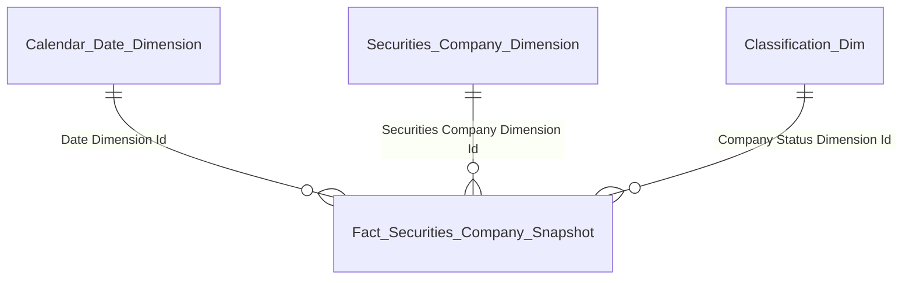
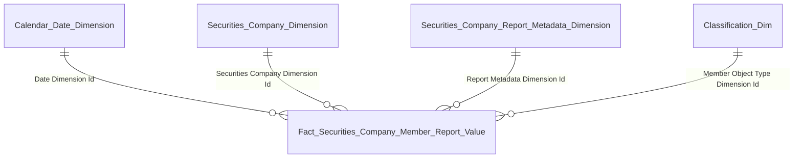
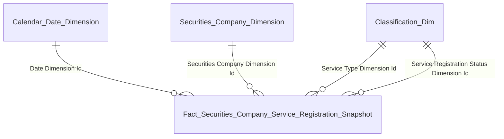
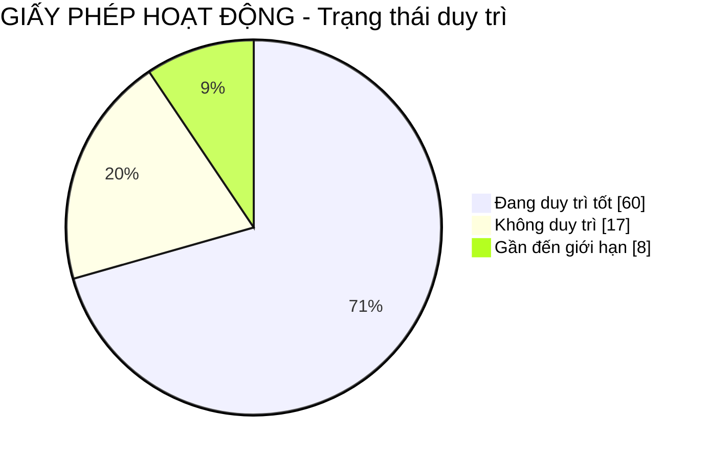
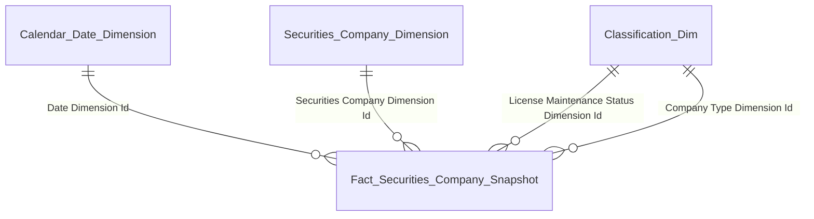
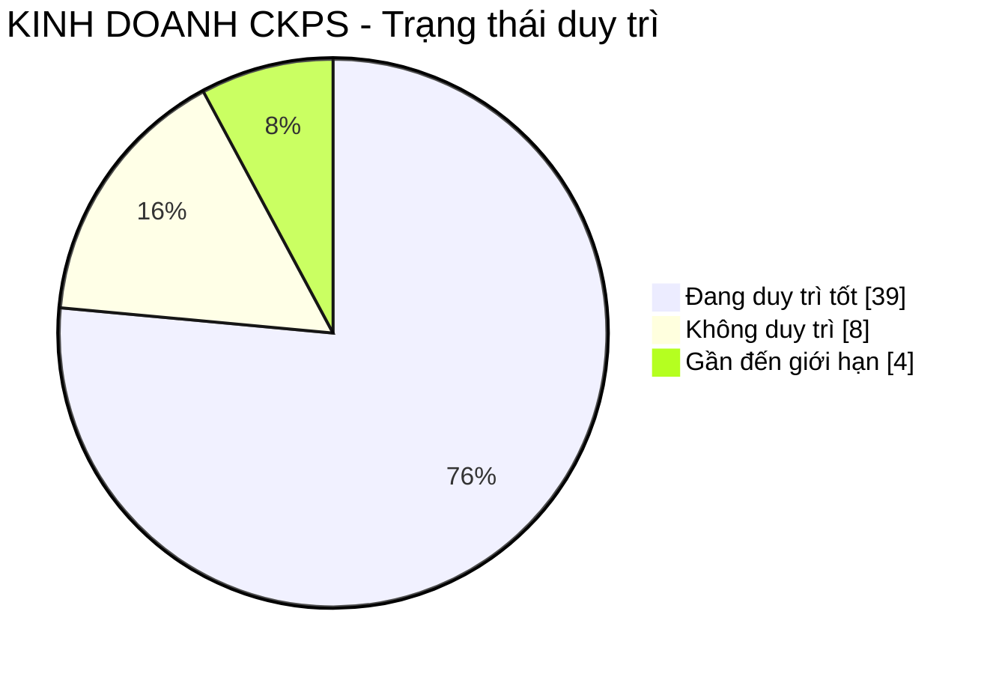
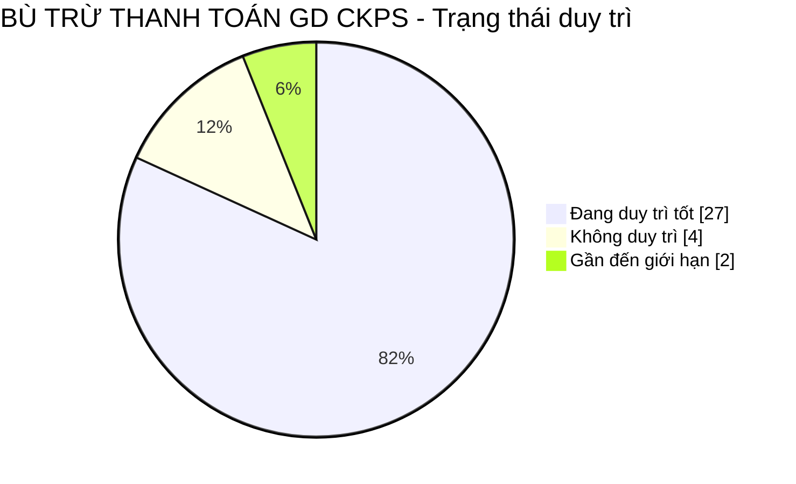
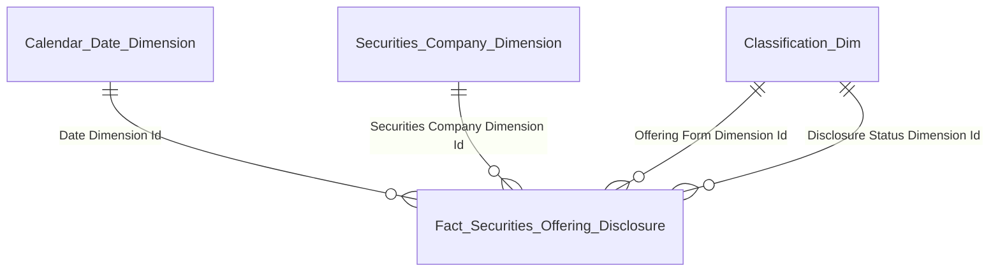

# Gold Data Mart HLD — Phân hệ Quản lý Kinh doanh Chứng khoán (QLKD)

**Phiên bản:** 0.4  **Ngày:** 17/04/2026
**Phạm vi phiên bản này:** Dashboard Tổng quan công ty chứng khoán toàn thị trường (10 block) + Dashboard Giám sát tình hình hoạt động của CTCK toàn thị trường (7 block in-scope + 1 DROP)
**Mô hình:** Star Schema thuần túy

## Thay đổi so với v0.3

- **Gộp 3 dim (Report Template + Reporting Period + Securities Company Report Cell) thành 1 dim `Securities Company Report Metadata Dimension`** theo pattern §7.7 Report Value Fact đã cập nhật trong instruction. Lý do: cả 3 entity metadata đặc trưng cho 1 dòng giá trị báo cáo (biểu mẫu × kỳ × mã chỉ tiêu); user yêu cầu đơn giản hóa thiết kế.
- **Fact Securities Company Member Report Value** giảm từ 6 FK dim xuống 4 FK: Date, Securities Company, Report Metadata, Classification (Member Object Type — vẫn giữ vì CTCK trong nước / CN CTCK NN là 2 Member Object Type trong Silver). Bỏ FK `Reporting Period Type Dimension Id` (redundant — đã nằm trong Report Metadata Dim như attribute).
- **Tất cả Block dùng Report Value Fact** (Block 2, 9, 10, 11, 12, 14, 15, 16, 18) cập nhật source + star schema + bảng tham gia theo cấu trúc dim mới.
- **Issue QLKD_O6 đóng** — confirmed scheme `SCMS_OFFERING_FORM` đúng.
- **Issue QLKD_O8 update** — thu hẹp phạm vi out-of-scope. K_QLKD_61 (Dư nợ margin) và các chỉ tiêu tài chính từ BCTC đã in-scope SCMS (do CTCK gửi báo cáo lên, lưu trong Silver `Member Report Indicator Value`). Chỉ còn **4 chỉ số thị trường (VN-Index / HNX Index / UPCOM Index / VN30)** thuộc Silver MSS chưa sẵn sàng → out-of-scope. Block 17 (Thị phần môi giới) vẫn DROP do SGDCK chưa có Silver.

## Thay đổi so với v0.2

- **Thêm Dashboard 2 — Giám sát tình hình hoạt động của CTCK toàn thị trường** (Block 11 → Block 18). 7 block in-scope, 1 block DROP (Block 17 — Thị phần môi giới, SGDCK chưa có Silver).
- **Thêm fact mới `Fact Securities Offering Disclosure`** (event fact) — nguồn `Disclosure Securities Offering` (SCMS.CBTT_CHAO_BAN_CHUNG_KHOAN). Phục vụ Block 13 (Nguồn vốn tăng thêm). Grain: 1 row = 1 công bố chào bán/phát hành.
- **Block 16 (Biến động dư nợ margin & diễn biến thị trường) chỉ thiết kế phần SCMS** — Dư nợ margin (K_QLKD_56) in-scope từ `Fact Securities Company Member Report Value` (BCTC tháng). 4 chỉ số thị trường (VN-Index / HNX Index / UPCOM Index / VN30) — BA cột I ghi MSS/SCMS; MSS chưa có Silver → toàn bộ 4 chỉ số tracking out-of-scope, chưa thiết kế fact chỉ số thị trường (sẽ add khi Silver MSS/SGDCK sẵn sàng).
- **Block 17 (Thị phần môi giới) DROP** — 2 KPI base đều cần dữ liệu giao dịch từ SGDCK (Silver chưa có). Không borrow entity module khác (instruction §5.2).
- **Thêm issue mới:** QLKD_O6 (scheme SCMS_OFFERING_FORM cần profile code map với 5 hình thức BA), QLKD_O7 (cách xác định bucket tỷ lệ vốn khả dụng query-time), QLKD_O8 (chờ Silver MSS/SGDCK cho chỉ số thị trường + thị phần môi giới).

## Thay đổi so với v0.1

- **Tách Block 1 cũ ("Các chỉ tiêu thống kê chung") thành Block 1 + Block 2** để tuân thủ quy tắc "1 block = 1 star schema" (instruction §5.3). Block 1 cũ dùng đồng thời 2 fact (`Snapshot` + `Member Report Value`) → vi phạm. Block 1 mới chỉ `Fact Securities Company Snapshot` (stats CTCK); Block 2 mới chỉ `Fact Securities Company Member Report Value` (số TK + dư tiền). KPI ID giữ nguyên — K_QLKD_1..8 ở Block 1, K_QLKD_9, K_QLKD_10 ở Block 2.
- **Thêm fact mới `Fact Securities Company Service Registration Snapshot`** (grain = 1 CTCK × 1 Dịch vụ × 1 Snapshot Date). Nguyên nhân: Silver `CTCK_DICH_VU` có field trạng thái per đăng ký dịch vụ — nếu denormalize thành Array trên `Securities Company` sẽ mất trạng thái. Tạo fact riêng giữ nguyên grain junction.
- **Block 4 (Dịch vụ KD CK) và Block 5 (Dịch vụ phái sinh)** chuyển từ pattern "flag trên Snapshot" sang "FK Service Type trên Service Registration fact" — cùng scheme `SCMS_SERVICE_TYPE`, khác code filter.
- **Block 7 (Duy trì KD CKPS) và Block 8 (Duy trì Bù trừ CKPS)** chuyển sang `Fact Securities Company Service Registration Snapshot` — filter theo Service Type + Service Registration Status.
- **Block 3 (Nghiệp vụ) giữ pattern flag trên Snapshot** — vì nghiệp vụ kinh doanh (4 cái cố định) đã có attribute `Business Type Codes: Array<Text>` trên Silver `Securities Company` (scheme `FIMS_BUSINESS_TYPE`) và không có trạng thái riêng per đăng ký.
- **Block 6 (Duy trì GPHD) giữ trên Snapshot** — vì Giấy phép hoạt động chung là thuộc tính cấp CTCK, không phải per dịch vụ.
- **Issues đóng:** QLKD_O1 (Closed — confirmed scheme `SCMS_SERVICE_TYPE`), QLKD_O3 (Closed — confirmed cùng scheme `SCMS_SERVICE_TYPE` với Block 4, khác code).
- **Issues update:** QLKD_O2 (maintenance status lấy từ `CTCK_DICH_VU.TRANG_THAI` Silver), QLKD_O4 (scheme phân loại CTCK cho duy trì = `SCMS_COMPANY_TYPE` theo reviewer).

---

## 1. Tổng quan báo cáo

### Dashboard Tổng quan công ty chứng khoán toàn thị trường

**Slicer toàn dashboard:**
- Chiều thời gian theo ngày (Calendar Date Dimension)
- Chiều thời gian theo quý (Calendar Date Dimension — Block 9, 10)
- Chiều trạng thái công ty (Classification — scheme `SCMS_COMPANY_STATUS`)
- Chiều nghiệp vụ kinh doanh CK (Classification — scheme `FIMS_BUSINESS_TYPE`): Môi giới / Bảo lãnh phát hành / Tư vấn / Tự doanh
- Chiều dịch vụ (Classification — scheme `SCMS_SERVICE_TYPE`): bao phủ cả dịch vụ KD CK (Ký quỹ / Ứng trước tiền bán / Lưu ký) và dịch vụ phái sinh (Môi giới PS / Tư vấn PS / Tự doanh PS / KD CKPS / Bù trừ CKPS)
- Chiều trạng thái đăng ký dịch vụ (Classification — scheme `QLKD_SERVICE_REGISTRATION_STATUS` — xem Issue QLKD_O2): Đang duy trì tốt / Gần đến giới hạn / Không duy trì / Đã thu hồi
- Chiều trạng thái duy trì GPHD toàn công ty (Classification — scheme `QLKD_LICENSE_MAINTENANCE_STATUS` — Block 6)
- Chiều phân loại CTCK (Classification — scheme `SCMS_COMPANY_TYPE` — xem Issue QLKD_O4)
- Chiều danh mục chỉ tiêu BCTC (attribute `Cell Code`/`Indicator Group Code` trên `Securities Company Report Metadata Dimension` — xem Issue QLKD_O5)

---

#### Block 1 — Thống kê số lượng CTCK theo trạng thái

**1. Mockup**

```
┌─────────────────────────────────────────────────────────────────────────────┐
│ TỔNG SỐ CTCK ĐƯỢC CẤP PHÉP                                                   │
│     85  ↑+2.4%                                             Ẩn chi tiết  ∧   │
└─────────────────────────────────────────────────────────────────────────────┘

┌──────────────┐ ┌──────────────┐ ┌──────────────┐ ┌──────────────┐
│ HOẠT ĐỘNG BT │ │ BỊ THU HỒI   │ │ CẢNH BÁO     │ │ KIỂM SOÁT    │
│    60        │ │    12        │ │    5         │ │    3         │
└──────────────┘ └──────────────┘ └──────────────┘ └──────────────┘

┌──────────────┐ ┌──────────────┐ ┌──────────────┐
│ KS ĐẶC BIỆT  │ │ ĐÌNH CHỈ HĐ  │ │ TRẠNG THÁI   │
│    1         │ │    2         │ │ KHÁC   2     │
└──────────────┘ └──────────────┘ └──────────────┘
```

Verify breakdown: 60 + 12 + 5 + 3 + 1 + 2 + 2 = 85 ✓

**2. Source:** `Fact Securities Company Snapshot` → `Securities Company Dimension`, `Classification Dimension`, `Calendar Date Dimension`.

**3. Bảng KPI**

| # | KPI ID | Tên | Đơn vị | Tính chất | Công thức / Mô tả |
|---|---|---|---|---|---|
| 1 | K_QLKD_1 | Tổng số CTCK đã được cấp phép | CTCK | Stock (Base) | `COUNT DISTINCT "Fact Securities Company Snapshot"."Securities Company Dimension Id" WHERE "Snapshot Date" = <last day of selected period>` |
| 2 | K_QLKD_2 | Số CTCK đã bị thu hồi | CTCK | Stock (Base) | `COUNT DISTINCT ... WHERE "Snapshot Date" = <selected> AND "Company Status Dimension Id" lookup scheme SCMS_COMPANY_STATUS = 'REVOKED'` |
| 3 | K_QLKD_3 | Số CTCK đang hoạt động bình thường | CTCK | Stock (Base) | `COUNT DISTINCT ... WHERE "Snapshot Date" = <selected> AND "Company Status Dimension Id" lookup = 'ACTIVE'` |
| 4 | K_QLKD_4 | Số CTCK thuộc diện cảnh báo | CTCK | Stock (Base) | `COUNT DISTINCT ... WHERE "Snapshot Date" = <selected> AND "Company Status Dimension Id" lookup = 'WARNING'` |
| 5 | K_QLKD_5 | Số CTCK thuộc diện kiểm soát | CTCK | Stock (Base) | `COUNT DISTINCT ... WHERE "Snapshot Date" = <selected> AND "Company Status Dimension Id" lookup = 'CONTROL'` |
| 6 | K_QLKD_6 | Số CTCK thuộc diện kiểm soát đặc biệt | CTCK | Stock (Base) | `COUNT DISTINCT ... WHERE "Snapshot Date" = <selected> AND "Company Status Dimension Id" lookup = 'SPECIAL_CONTROL'` |
| 7 | K_QLKD_7 | Số CTCK đình chỉ hoạt động | CTCK | Stock (Base) | `COUNT DISTINCT ... WHERE "Snapshot Date" = <selected> AND "Company Status Dimension Id" lookup = 'SUSPENDED'` |
| 8 | K_QLKD_8 | Số CTCK trạng thái khác | CTCK | Stock (Base) | `COUNT DISTINCT ... WHERE "Snapshot Date" = <selected> AND "Company Status Dimension Id" lookup NOT IN (REVOKED, ACTIVE, WARNING, CONTROL, SPECIAL_CONTROL, SUSPENDED)` |
| 9 | K_QLKD_1_SSCK | So sánh cùng kỳ Tổng số CTCK | % | Derived | `(K_QLKD_1 − K_QLKD_1 [Year − 1]) / K_QLKD_1 [Year − 1] × 100%` |

**4. Star schema**



**5. Bảng tham gia**

| Tên bảng | Grain |
|---|---|
| Fact Securities Company Snapshot | 1 row = 1 CTCK × 1 Snapshot Date (daily batch) |
| Securities Company Dimension | 1 row = 1 CTCK (SCD2) |
| Classification Dimension | 1 row = 1 classification value (SCD2) |
| Calendar Date Dimension | 1 row = 1 ngày snapshot |

---

#### Block 2 — Tài khoản & dư tiền gửi giao dịch toàn thị trường

**1. Mockup**

```
┌─────────────────────────────────────┐  ┌─────────────────────────────────────┐
│ TỔNG SỐ TÀI KHOẢN CÓ PHÁT SINH GD   │  │ TỔNG SỐ DƯ TIỀN GỬI GIAO DỊCH       │
│                                     │  │                                     │
│       2,450,000  TÀI KHOẢN          │  │       125.400  TỶ VNĐ              │
└─────────────────────────────────────┘  └─────────────────────────────────────┘
```

**2. Source:** `Fact Securities Company Member Report Value` → `Securities Company Dimension`, `Securities Company Report Metadata Dimension`, `Classification Dimension`, `Calendar Date Dimension`.

**3. Bảng KPI**

| # | KPI ID | Tên | Đơn vị | Tính chất | Công thức / Mô tả |
|---|---|---|---|---|---|
| 1 | K_QLKD_9 | Số tài khoản có phát sinh giao dịch | Tài khoản | Stock (Base) | `SUM(CAST("Fact Securities Company Member Report Value"."Cell Value" AS BIGINT)) WHERE "Cell Code" = '<mã chỉ tiêu số TK có PS GD — cần profile>' AND "Report Date" = <selected>` (cell code xem Issue QLKD_O5) |
| 2 | K_QLKD_10 | Số dư tiền gửi giao dịch | Tỷ VNĐ | Stock (Base) | `SUM(CAST("Cell Value" AS DECIMAL(20,2)) / 1e9) WHERE "Cell Code" = '<mã chỉ tiêu dư tiền gửi GD>' AND "Report Date" = <selected>` |

> **Ghi chú:** Grain fact = grain Silver `Member Report Indicator Value` (1 lần nộp × 1 mã chỉ tiêu). KPI = filter theo Cell Code + aggregate + CAST inline (pattern §7.7).

**4. Star schema**



**5. Bảng tham gia**

| Tên bảng | Grain |
|---|---|
| Fact Securities Company Member Report Value | 1 row = 1 lần nộp báo cáo × 1 mã chỉ tiêu báo cáo (grain = Silver Member Report Indicator Value) |
| Securities Company Dimension | 1 row = 1 CTCK (SCD2) |
| Securities Company Report Metadata Dimension | 1 row = 1 tổ hợp (Biểu mẫu × Kỳ báo cáo × Mã chỉ tiêu) — SCD2 |
| Classification Dimension | 1 row = 1 classification value (SCD2) |
| Calendar Date Dimension | 1 row = 1 ngày báo cáo |

---

#### Block 3 — Biểu đồ Nghiệp vụ kinh doanh chứng khoán

**1. Mockup**

```
SỐ LƯỢNG CTCK THEO NGHIỆP VỤ (horizontal bar)

Môi giới       ████████████████████████████  68
Bảo lãnh       █████████████████             42
Tư vấn         ██████████████████████        55
Tự doanh       ████████████████████████      58
               0    20    40    60    80
```

**2. Source:** `Fact Securities Company Snapshot` → `Securities Company Dimension`, `Classification Dimension`, `Calendar Date Dimension`.

**3. Bảng KPI**

| # | KPI ID | Tên | Đơn vị | Tính chất | Công thức / Mô tả |
|---|---|---|---|---|---|
| 1 | K_QLKD_12 | Số CTCK có nghiệp vụ Môi giới chứng khoán | CTCK | Stock (Base) | `COUNT DISTINCT "Fact Securities Company Snapshot"."Securities Company Dimension Id" WHERE "Snapshot Date" = <selected> AND "Is Brokerage Business Flag" = TRUE` |
| 2 | K_QLKD_13 | Số CTCK có nghiệp vụ Bảo lãnh phát hành | CTCK | Stock (Base) | `COUNT DISTINCT ... WHERE "Snapshot Date" = <selected> AND "Is Underwriting Business Flag" = TRUE` |
| 3 | K_QLKD_14 | Số CTCK có nghiệp vụ Tư vấn đầu tư chứng khoán | CTCK | Stock (Base) | `COUNT DISTINCT ... WHERE "Snapshot Date" = <selected> AND "Is Advisory Business Flag" = TRUE` |
| 4 | K_QLKD_15 | Số CTCK có nghiệp vụ Tự doanh chứng khoán | CTCK | Stock (Base) | `COUNT DISTINCT ... WHERE "Snapshot Date" = <selected> AND "Is Prop Trading Business Flag" = TRUE` |

> **Ghi chú thiết kế:** 4 nghiệp vụ kinh doanh CK có tính ngang hàng và tập hợp đóng (4 code cố định theo luật). Thiết kế thành 4 boolean flag riêng trên fact snapshot. Flag được ETL derive từ attribute `Business Type Codes: Array<Text>` của Silver `Securities Company` (scheme `FIMS_BUSINESS_TYPE`). Không dùng fact Service Registration cho Block này vì Silver Business Type không có trạng thái riêng per đăng ký (khác dịch vụ).

**4. Star schema**


**5. Bảng tham gia**

| Tên bảng | Grain |
|---|---|
| Fact Securities Company Snapshot | 1 row = 1 CTCK × 1 Snapshot Date (daily batch) |
| Securities Company Dimension | 1 row = 1 CTCK (SCD2) |
| Classification Dimension | 1 row = 1 classification value (SCD2) |
| Calendar Date Dimension | 1 row = 1 ngày snapshot |

---

#### Block 4 — Biểu đồ Dịch vụ kinh doanh chứng khoán

**1. Mockup**

```
SỐ LƯỢNG CTCK THEO DỊCH VỤ (horizontal bar)

Giao dịch ký quỹ   ████████████████████████  62
Ứng trước tiền bán ████████████████████       48
Lưu ký             ██████████████            38
                   0    20    40    60    80
```

**2. Source:** `Fact Securities Company Service Registration Snapshot` → `Securities Company Dimension`, `Classification Dimension`, `Calendar Date Dimension`.

**3. Bảng KPI**

| # | KPI ID | Tên | Đơn vị | Tính chất | Công thức / Mô tả |
|---|---|---|---|---|---|
| 1 | K_QLKD_16 | Số CTCK cung cấp dịch vụ Giao dịch ký quỹ | CTCK | Stock (Base) | `COUNT DISTINCT "Fact Securities Company Service Registration Snapshot"."Securities Company Dimension Id" WHERE "Snapshot Date" = <selected> AND "Service Type Dimension Id" lookup scheme SCMS_SERVICE_TYPE = '<mã ký quỹ>' AND "Service Registration Status Dimension Id" lookup NOT IN ('REVOKED')` |
| 2 | K_QLKD_17 | Số CTCK cung cấp dịch vụ Ứng trước tiền bán | CTCK | Stock (Base) | `COUNT DISTINCT ... WHERE "Snapshot Date" = <selected> AND "Service Type Dimension Id" lookup = '<mã ứng trước>' AND "Service Registration Status Dimension Id" lookup NOT IN ('REVOKED')` |
| 3 | K_QLKD_18 | Số CTCK cung cấp dịch vụ Lưu ký | CTCK | Stock (Base) | `COUNT DISTINCT ... WHERE "Snapshot Date" = <selected> AND "Service Type Dimension Id" lookup = '<mã lưu ký>' AND "Service Registration Status Dimension Id" lookup NOT IN ('REVOKED')` |

> **Ghi chú:** Filter `Service Registration Status NOT IN ('REVOKED')` để loại CTCK đã bị thu hồi đăng ký dịch vụ — đếm các CTCK đang đăng ký active (bao gồm cả Đang duy trì tốt / Gần giới hạn / Không duy trì). Mã code chính xác cho Ký quỹ / Ứng trước / Lưu ký cần profile từ `SCMS.DM_DICH_VU`.

**4. Star schema**



**5. Bảng tham gia**

| Tên bảng | Grain |
|---|---|
| Fact Securities Company Service Registration Snapshot | 1 row = 1 CTCK × 1 Dịch vụ × 1 Snapshot Date (daily batch) |
| Securities Company Dimension | 1 row = 1 CTCK (SCD2) |
| Classification Dimension | 1 row = 1 classification value (SCD2) |
| Calendar Date Dimension | 1 row = 1 ngày snapshot |

---

#### Block 5 — Biểu đồ Dịch vụ phái sinh

**1. Mockup**

```
SỐ LƯỢNG CTCK - DỊCH VỤ PHÁI SINH (horizontal bar)

Môi giới phái sinh ██████████████████████████  45
Tư vấn phái sinh   ██████████████              28
Tự doanh phái sinh ████████████████            32
                   0    15    30    45    60
```

**2. Source:** `Fact Securities Company Service Registration Snapshot` → `Securities Company Dimension`, `Classification Dimension`, `Calendar Date Dimension`.

**3. Bảng KPI**

| # | KPI ID | Tên | Đơn vị | Tính chất | Công thức / Mô tả |
|---|---|---|---|---|---|
| 1 | K_QLKD_19 | Số CTCK cung cấp dịch vụ Môi giới phái sinh | CTCK | Stock (Base) | `COUNT DISTINCT "Fact Securities Company Service Registration Snapshot"."Securities Company Dimension Id" WHERE "Snapshot Date" = <selected> AND "Service Type Dimension Id" lookup scheme SCMS_SERVICE_TYPE = '<mã MG phái sinh>' AND "Service Registration Status Dimension Id" lookup NOT IN ('REVOKED')` |
| 2 | K_QLKD_20 | Số CTCK cung cấp dịch vụ Tư vấn phái sinh | CTCK | Stock (Base) | `COUNT DISTINCT ... WHERE "Snapshot Date" = <selected> AND "Service Type Dimension Id" lookup = '<mã TV phái sinh>' AND "Service Registration Status Dimension Id" lookup NOT IN ('REVOKED')` |
| 3 | K_QLKD_21 | Số CTCK cung cấp dịch vụ Tự doanh phái sinh | CTCK | Stock (Base) | `COUNT DISTINCT ... WHERE "Snapshot Date" = <selected> AND "Service Type Dimension Id" lookup = '<mã TD phái sinh>' AND "Service Registration Status Dimension Id" lookup NOT IN ('REVOKED')` |

> **Ghi chú:** Cùng fact với Block 4, chỉ khác code filter trong cùng scheme `SCMS_SERVICE_TYPE`. Mã code cụ thể cần profile `SCMS.DM_DICH_VU` để xác định code cho 3 dịch vụ phái sinh. Filter tương tự Block 4 — chỉ đếm CTCK đang đăng ký active.

**4. Star schema**


**5. Bảng tham gia**

| Tên bảng | Grain |
|---|---|
| Fact Securities Company Service Registration Snapshot | 1 row = 1 CTCK × 1 Dịch vụ × 1 Snapshot Date (daily batch) |
| Securities Company Dimension | 1 row = 1 CTCK (SCD2) |
| Classification Dimension | 1 row = 1 classification value (SCD2) |
| Calendar Date Dimension | 1 row = 1 ngày snapshot |

---

#### Block 6 — Duy trì điều kiện cấp phép: Giấy phép hoạt động

**1. Mockup**



**2. Source:** `Fact Securities Company Snapshot` → `Securities Company Dimension`, `Classification Dimension`, `Calendar Date Dimension`.

**3. Bảng KPI**

| # | KPI ID | Tên | Đơn vị | Tính chất | Công thức / Mô tả |
|---|---|---|---|---|---|
| 1 | K_QLKD_22 | Số CTCK đang duy trì tốt Giấy phép hoạt động | CTCK | Stock (Base) | `COUNT DISTINCT "Fact Securities Company Snapshot"."Securities Company Dimension Id" WHERE "Snapshot Date" = <selected> AND "License Maintenance Status Dimension Id" lookup scheme QLKD_LICENSE_MAINTENANCE_STATUS = 'GOOD'` |
| 2 | K_QLKD_23 | Số CTCK gần đến giới hạn duy trì Giấy phép hoạt động | CTCK | Stock (Base) | `COUNT DISTINCT ... WHERE "Snapshot Date" = <selected> AND "License Maintenance Status Dimension Id" lookup = 'NEAR_LIMIT'` |
| 3 | K_QLKD_24 | Số CTCK không duy trì điều kiện Giấy phép hoạt động | CTCK | Stock (Base) | `COUNT DISTINCT ... WHERE "Snapshot Date" = <selected> AND "License Maintenance Status Dimension Id" lookup = 'FAILED'` |

> **Ghi chú:** "Giấy phép hoạt động" là giấy phép thành lập công ty chung (cấp CTCK, không per dịch vụ). Trạng thái duy trì derived từ ngưỡng chỉ tiêu tài chính/nhân sự/hạ tầng cấp CTCK (vốn điều lệ, vốn khả dụng, tỷ lệ ATT, nhân sự cao cấp...) — xem Issue QLKD_O2. Phân loại CTCK (xem Issue QLKD_O4) dùng cùng dim filter bổ sung — `"Company Type Dimension Id" lookup scheme SCMS_COMPANY_TYPE`.

**4. Star schema**



**5. Bảng tham gia**

| Tên bảng | Grain |
|---|---|
| Fact Securities Company Snapshot | 1 row = 1 CTCK × 1 Snapshot Date (daily batch) |
| Securities Company Dimension | 1 row = 1 CTCK (SCD2) |
| Classification Dimension | 1 row = 1 classification value (SCD2) |
| Calendar Date Dimension | 1 row = 1 ngày snapshot |

---

#### Block 7 — Duy trì điều kiện cấp phép: Kinh doanh chứng khoán phái sinh

**1. Mockup**



**2. Source:** `Fact Securities Company Service Registration Snapshot` → `Securities Company Dimension`, `Classification Dimension`, `Calendar Date Dimension`.

**3. Bảng KPI**

| # | KPI ID | Tên | Đơn vị | Tính chất | Công thức / Mô tả |
|---|---|---|---|---|---|
| 1 | K_QLKD_25 | Số CTCK KD CKPS đang duy trì tốt | CTCK | Stock (Base) | `COUNT DISTINCT "Fact Securities Company Service Registration Snapshot"."Securities Company Dimension Id" WHERE "Snapshot Date" = <selected> AND "Service Type Dimension Id" lookup scheme SCMS_SERVICE_TYPE = '<mã KD CKPS>' AND "Service Registration Status Dimension Id" lookup scheme QLKD_SERVICE_REGISTRATION_STATUS = 'GOOD'` |
| 2 | K_QLKD_26 | Số CTCK KD CKPS gần đến giới hạn duy trì | CTCK | Stock (Base) | `COUNT DISTINCT ... WHERE "Snapshot Date" = <selected> AND "Service Type Dimension Id" lookup = '<mã KD CKPS>' AND "Service Registration Status Dimension Id" lookup = 'NEAR_LIMIT'` |
| 3 | K_QLKD_27 | Số CTCK KD CKPS không duy trì điều kiện | CTCK | Stock (Base) | `COUNT DISTINCT ... WHERE "Snapshot Date" = <selected> AND "Service Type Dimension Id" lookup = '<mã KD CKPS>' AND "Service Registration Status Dimension Id" lookup = 'FAILED'` |

> **Ghi chú:** "KD CKPS" là 1 dịch vụ trong scheme `SCMS_SERVICE_TYPE` (code cần profile từ `DM_DICH_VU`). Trạng thái duy trì lấy trực tiếp từ `TRANG_THAI` của Silver `Securities Company Service Registration` (bảng nguồn `CTCK_DICH_VU`). Nếu Silver TRANG_THAI chỉ có 2 mức (đăng ký / thu hồi) — cần ETL derive thêm các mức Đang duy trì / Gần giới hạn / Không duy trì từ threshold (xem Issue QLKD_O2).

**4. Star schema**


**5. Bảng tham gia**

| Tên bảng | Grain |
|---|---|
| Fact Securities Company Service Registration Snapshot | 1 row = 1 CTCK × 1 Dịch vụ × 1 Snapshot Date (daily batch) |
| Securities Company Dimension | 1 row = 1 CTCK (SCD2) |
| Classification Dimension | 1 row = 1 classification value (SCD2) |
| Calendar Date Dimension | 1 row = 1 ngày snapshot |

---

#### Block 8 — Duy trì điều kiện cấp phép: Bù trừ, thanh toán giao dịch chứng khoán phái sinh

**1. Mockup**



**2. Source:** `Fact Securities Company Service Registration Snapshot` → `Securities Company Dimension`, `Classification Dimension`, `Calendar Date Dimension`.

**3. Bảng KPI**

| # | KPI ID | Tên | Đơn vị | Tính chất | Công thức / Mô tả |
|---|---|---|---|---|---|
| 1 | K_QLKD_28 | Số CTCK Bù trừ CKPS đang duy trì tốt | CTCK | Stock (Base) | `COUNT DISTINCT "Fact Securities Company Service Registration Snapshot"."Securities Company Dimension Id" WHERE "Snapshot Date" = <selected> AND "Service Type Dimension Id" lookup = '<mã Bù trừ CKPS>' AND "Service Registration Status Dimension Id" lookup = 'GOOD'` |
| 2 | K_QLKD_29 | Số CTCK Bù trừ CKPS gần đến giới hạn duy trì | CTCK | Stock (Base) | `COUNT DISTINCT ... WHERE "Snapshot Date" = <selected> AND "Service Type Dimension Id" lookup = '<mã Bù trừ CKPS>' AND "Service Registration Status Dimension Id" lookup = 'NEAR_LIMIT'` |
| 3 | K_QLKD_30 | Số CTCK Bù trừ CKPS không duy trì điều kiện | CTCK | Stock (Base) | `COUNT DISTINCT ... WHERE "Snapshot Date" = <selected> AND "Service Type Dimension Id" lookup = '<mã Bù trừ CKPS>' AND "Service Registration Status Dimension Id" lookup = 'FAILED'` |

> **Ghi chú:** Cùng fact với Block 7, chỉ khác code filter Service Type (Bù trừ CKPS thay cho KD CKPS). Logic trạng thái tương tự Block 7.

**4. Star schema**


**5. Bảng tham gia**

| Tên bảng | Grain |
|---|---|
| Fact Securities Company Service Registration Snapshot | 1 row = 1 CTCK × 1 Dịch vụ × 1 Snapshot Date (daily batch) |
| Securities Company Dimension | 1 row = 1 CTCK (SCD2) |
| Classification Dimension | 1 row = 1 classification value (SCD2) |
| Calendar Date Dimension | 1 row = 1 ngày snapshot |

---

#### Block 9 — Biểu đồ Cơ cấu tài sản toàn thị trường

**1. Mockup**

```
CƠ CẤU TÀI SẢN (stacked column theo quý, unit: nghìn tỷ)

160K                                  [151K]
         [133K]  [133K]  [143K]        ▓▓▓  ← Các khoản cho vay (tím)
120K      ▓▓▓    ▓▓▓    ▓▓▓          ░░░  ← Khác (xám)
          ░░░    ░░░    ░░░           ▒▒▒  ← TS tài chính sẵn sàng để bán (xanh dương nhạt)
 80K      ▒▒▒    ▒▒▒    ▒▒▒           ███  ← TS tài chính qua lãi/lỗ (xanh dương)
          ███    ███    ███           ▓▓▓  ← Đầu tư nắm giữ đến hạn (vàng)
 40K      ▓▓▓    ▓▓▓    ▓▓▓           ███  ← Tiền và tương đương (xanh lá)
          ███    ███    ███
  0    Q4/23   Q1/24   Q2/24   Q3/24
```

**2. Source:** `Fact Securities Company Member Report Value` → `Securities Company Dimension`, `Securities Company Report Metadata Dimension`, `Classification Dimension`, `Calendar Date Dimension`.

**3. Bảng KPI**

| # | KPI ID | Tên | Đơn vị | Tính chất | Công thức / Mô tả |
|---|---|---|---|---|---|
| 1 | K_QLKD_31 | Tiền và tương đương tiền — toàn thị trường | Nghìn tỷ VNĐ | Flow (Base) | `SUM(CAST("Fact Securities Company Member Report Value"."Cell Value" AS DECIMAL(20,2))) / 1e12 WHERE "Cell Code" = '<mã BCTC - Tiền và tương đương>' AND "Report Metadata Dimension"."Reporting Period Code" = <quý chọn>` |
| 2 | K_QLKD_32 | Tài sản tài chính ghi nhận thông qua lãi/lỗ — toàn thị trường | Nghìn tỷ VNĐ | Flow (Base) | `SUM(CAST(...AS DECIMAL(20,2))) / 1e12 WHERE "Cell Code" = '<mã BCTC - FVTPL>' AND "Reporting Period" = <quý chọn>` |
| 3 | K_QLKD_33 | Các khoản đầu tư nắm giữ đến ngày đáo hạn — toàn thị trường | Nghìn tỷ VNĐ | Flow (Base) | `SUM(CAST(...AS DECIMAL(20,2))) / 1e12 WHERE "Cell Code" = '<mã BCTC - HTM>' AND "Reporting Period" = <quý chọn>` |
| 4 | K_QLKD_34 | Tài sản tài chính sẵn sàng để bán — toàn thị trường | Nghìn tỷ VNĐ | Flow (Base) | `SUM(CAST(...AS DECIMAL(20,2))) / 1e12 WHERE "Cell Code" = '<mã BCTC - AFS>' AND "Reporting Period" = <quý chọn>` |
| 5 | K_QLKD_35 | Các khoản cho vay — toàn thị trường | Nghìn tỷ VNĐ | Flow (Base) | `SUM(CAST(...AS DECIMAL(20,2))) / 1e12 WHERE "Cell Code" = '<mã BCTC - Cho vay>' AND "Reporting Period" = <quý chọn>` |
| 6 | K_QLKD_36 | Tài sản khác — toàn thị trường | Nghìn tỷ VNĐ | Flow (Base) | `SUM(CAST(...AS DECIMAL(20,2))) / 1e12 WHERE "Cell Code" = '<mã BCTC - Tài sản khác>' AND "Reporting Period" = <quý chọn>` |

> **Ghi chú:** Mã cell code cụ thể cho từng chỉ tiêu BCTC phải profile từ Silver `SCMS.BC_BAO_CAO_GT` + `SCMS.BM_BAO_CAO_CT` — xem Issue QLKD_O5. Khi profile xong, cập nhật Detail Mapping (Phase 3).

**4. Star schema**


**5. Bảng tham gia**

| Tên bảng | Grain |
|---|---|
| Fact Securities Company Member Report Value | 1 row = 1 lần nộp báo cáo × 1 mã chỉ tiêu báo cáo (grain = Silver Member Report Indicator Value) |
| Securities Company Dimension | 1 row = 1 CTCK (SCD2) |
| Securities Company Report Metadata Dimension | 1 row = 1 tổ hợp (Biểu mẫu × Kỳ báo cáo × Mã chỉ tiêu) — SCD2 |
| Classification Dimension | 1 row = 1 classification value (SCD2) |
| Calendar Date Dimension | 1 row = 1 ngày báo cáo |

---

#### Block 10 — Biểu đồ Cơ cấu nguồn vốn toàn thị trường

**1. Mockup**

```
CƠ CẤU NGUỒN VỐN (stacked column theo quý, unit: nghìn tỷ)

180K                                  [161K]
         [141K]  [143K]  [152K]        ███  ← Vốn chủ sở hữu (xanh lá)
135K      ███    ███    ███           ▓▓▓  ← Vay và nợ ngắn hạn (cam)
          ▓▓▓    ▓▓▓    ▓▓▓           ░░░  ← Nợ phải trả dài hạn (đỏ cam)
 90K      ░░░    ░░░    ░░░           ▒▒▒  ← Nợ khác (xám)
          ▒▒▒    ▒▒▒    ▒▒▒
 45K
  0    Q4/23   Q1/24   Q2/24   Q3/24
```

**2. Source:** `Fact Securities Company Member Report Value` → `Securities Company Dimension`, `Securities Company Report Metadata Dimension`, `Classification Dimension`, `Calendar Date Dimension`.

**3. Bảng KPI**

| # | KPI ID | Tên | Đơn vị | Tính chất | Công thức / Mô tả |
|---|---|---|---|---|---|
| 1 | K_QLKD_37 | Vay và nợ thuê tài chính ngắn hạn — toàn thị trường | Nghìn tỷ VNĐ | Flow (Base) | `SUM(CAST(...AS DECIMAL(20,2))) / 1e12 WHERE "Cell Code" = '<mã BCTC - Vay ngắn hạn>' AND "Reporting Period" = <quý chọn>` |
| 2 | K_QLKD_38 | Nợ phải trả dài hạn — toàn thị trường | Nghìn tỷ VNĐ | Flow (Base) | `SUM(CAST(...AS DECIMAL(20,2))) / 1e12 WHERE "Cell Code" = '<mã BCTC - Nợ dài hạn>' AND "Reporting Period" = <quý chọn>` |
| 3 | K_QLKD_39 | Vốn chủ sở hữu — toàn thị trường | Nghìn tỷ VNĐ | Flow (Base) | `SUM(CAST(...AS DECIMAL(20,2))) / 1e12 WHERE "Cell Code" = '<mã BCTC - Vốn CSH>' AND "Reporting Period" = <quý chọn>` |
| 4 | K_QLKD_40 | Nợ khác — toàn thị trường | Nghìn tỷ VNĐ | Flow (Base) | `SUM(CAST(...AS DECIMAL(20,2))) / 1e12 WHERE "Cell Code" = '<mã BCTC - Nợ khác>' AND "Reporting Period" = <quý chọn>` |

**4. Star schema**


**5. Bảng tham gia**

| Tên bảng | Grain |
|---|---|
| Fact Securities Company Member Report Value | 1 row = 1 lần nộp báo cáo × 1 mã chỉ tiêu báo cáo (grain = Silver Member Report Indicator Value) |
| Securities Company Dimension | 1 row = 1 CTCK (SCD2) |
| Securities Company Report Metadata Dimension | 1 row = 1 tổ hợp (Biểu mẫu × Kỳ báo cáo × Mã chỉ tiêu) — SCD2 |
| Classification Dimension | 1 row = 1 classification value (SCD2) |
| Calendar Date Dimension | 1 row = 1 ngày báo cáo |

---
---

### Dashboard Giám sát tình hình hoạt động của CTCK toàn thị trường

**Slicer toàn dashboard:**
- Chiều thời gian theo quý (Block 11, 12, 15) / theo tháng (Block 13, 14, 16) / theo ngày (Block 18) — Calendar Date Dimension
- Chiều phân loại hình thức tăng vốn (Classification — scheme `SCMS_OFFERING_FORM` — xem Issue QLKD_O6): Chào bán công chúng / Chào bán riêng lẻ / Chào bán khác / Phát hành trái phiếu riêng lẻ / Phát hành trái phiếu công chúng
- Chiều phân loại tỷ lệ vốn khả dụng (Classification — scheme `QLKD_CAPITAL_ADEQUACY_LEVEL` — xem Issue QLKD_O7): Cao (>150%) / Trung bình (120-150%) / Thấp (<120%)
- Chiều danh mục chỉ tiêu BCTC (attribute `Cell Code`/`Indicator Group Code` trên `Securities Company Report Metadata Dimension` — xem Issue QLKD_O5)
- Chiều mã CTCK (Securities Company Dimension — Block 18)

---

#### Block 11 — Cơ cấu vốn chủ sở hữu toàn thị trường

**1. Mockup**

```
CƠ CẤU VỐN CHỦ SỞ HỮU (stacked column theo quý, nghìn tỷ VNĐ)

207K
         [165.400] [168.800] [172.200] [176.600]
165K      ░░░       ░░░       ░░░       ░░░       ← Vốn khác (xám)
          ▓▓▓       ▓▓▓       ▓▓▓       ▓▓▓       ← Quỹ, thặng dư vốn CP (vàng)
110K      ███       ███       ███       ███       ← Lợi nhuận sau thuế chưa PP (xanh lá)
          ███       ███       ███       ███       ← Vốn đầu tư của CSH (tím)
 55K      ███       ███       ███       ███
   0    Q1/24     Q2/24     Q3/24     Q4/24
```

**2. Source:** `Fact Securities Company Member Report Value` → `Securities Company Dimension`, `Securities Company Report Metadata Dimension`, `Classification Dimension`, `Calendar Date Dimension`.

**3. Bảng KPI**

| # | KPI ID | Tên | Đơn vị | Tính chất | Công thức / Mô tả |
|---|---|---|---|---|---|
| 1 | K_QLKD_41 | Vốn điều lệ (Vốn góp CSH) — toàn thị trường | Nghìn tỷ VNĐ | Flow (Base) | `SUM(CAST("Fact Securities Company Member Report Value"."Cell Value" AS DECIMAL(20,2))) / 1e12 WHERE "Cell Code" = '<mã BCTC - Vốn điều lệ>' AND "Report Metadata Dimension"."Reporting Period Code" = <quý chọn>` |
| 2 | K_QLKD_42 | Lợi nhuận sau thuế chưa phân phối — toàn thị trường | Nghìn tỷ VNĐ | Flow (Base) | `SUM(CAST(...AS DECIMAL(20,2))) / 1e12 WHERE "Cell Code" = '<mã BCTC - LNST chưa PP>' AND "Reporting Period" = <quý chọn>` |
| 3 | K_QLKD_43 | Quỹ, thặng dư vốn cổ phần — toàn thị trường | Nghìn tỷ VNĐ | Flow (Base) | `SUM(CAST(...AS DECIMAL(20,2))) / 1e12 WHERE "Cell Code" = '<mã BCTC - Quỹ + thặng dư>' AND "Reporting Period" = <quý chọn>` |
| 4 | K_QLKD_44 | Vốn khác — toàn thị trường | Nghìn tỷ VNĐ | Flow (Base) | `SUM(CAST(...AS DECIMAL(20,2))) / 1e12 WHERE "Cell Code" = '<mã BCTC - Vốn khác CSH>' AND "Reporting Period" = <quý chọn>` |

**4. Star schema**


**5. Bảng tham gia**

| Tên bảng | Grain |
|---|---|
| Fact Securities Company Member Report Value | 1 row = 1 lần nộp báo cáo × 1 mã chỉ tiêu báo cáo (grain = Silver Member Report Indicator Value) |
| Securities Company Dimension | 1 row = 1 CTCK (SCD2) |
| Securities Company Report Metadata Dimension | 1 row = 1 tổ hợp (Biểu mẫu × Kỳ báo cáo × Mã chỉ tiêu) — SCD2 |
| Classification Dimension | 1 row = 1 classification value (SCD2) |
| Calendar Date Dimension | 1 row = 1 ngày báo cáo |

---

#### Block 12 — Biến động Vốn đầu tư chủ sở hữu theo quý

**1. Mockup**

```
VỐN GÓP CHỦ SỞ HỮU (line chart, Q1/2020 → Q4/2024, tỷ VNĐ)

32K                                                          ●
                                                      ●───●
24K                                           ●───●
                                    ●───●
                             ●───●
16K  ●───●───●
   2020Q1  2020Q4  2021Q3  2022Q2  2023Q1  2023Q4  2024Q4
```

**2. Source:** `Fact Securities Company Member Report Value` → `Securities Company Dimension`, `Securities Company Report Metadata Dimension`, `Classification Dimension`, `Calendar Date Dimension`.

**3. Bảng KPI**

| # | KPI ID | Tên | Đơn vị | Tính chất | Công thức / Mô tả |
|---|---|---|---|---|---|
| 1 | K_QLKD_45 | Vốn góp của chủ sở hữu trên BCTC — toàn thị trường | Tỷ VNĐ | Flow (Base) | `SUM(CAST("Cell Value" AS DECIMAL(20,2))) / 1e9 WHERE "Cell Code" = '<mã BCTC - Vốn góp CSH>' AND "Report Metadata Dimension"."Reporting Period Code" = <quý chọn>` |

> **Ghi chú:** KPI này có thể chia sẻ cùng cell code với K_QLKD_41 (Vốn điều lệ = Vốn góp CSH trên BCTC của CTCK). UI render line chart theo trục thời gian đa quý, không phải stack column như Block 11. Cùng cell code → cùng fact, chỉ khác filter time range.

**4. Star schema**


**5. Bảng tham gia**

| Tên bảng | Grain |
|---|---|
| Fact Securities Company Member Report Value | 1 row = 1 lần nộp báo cáo × 1 mã chỉ tiêu báo cáo (grain = Silver Member Report Indicator Value) |
| Securities Company Dimension | 1 row = 1 CTCK (SCD2) |
| Securities Company Report Metadata Dimension | 1 row = 1 tổ hợp (Biểu mẫu × Kỳ báo cáo × Mã chỉ tiêu) — SCD2 |
| Classification Dimension | 1 row = 1 classification value (SCD2) |
| Calendar Date Dimension | 1 row = 1 ngày báo cáo |

---

#### Block 13 — Nguồn vốn tăng thêm trong kỳ (chào bán + phát hành)

**1. Mockup**

```
NGUỒN VỐN TĂNG THÊM (stacked column theo tháng, tỷ VNĐ)
                                                              [9.100]
10K                                               [8.000]  [8.400]
                          [7.000]          [7.500]  [7.000]   ▓▓▓  ← Trái phiếu riêng lẻ (hồng)
 8K              [5.300]   [5.500] [6.400]   ▓▓▓   ▓▓▓   ▓▓▓  ▓▓▓  ← Trái phiếu công chúng (cam)
         [5.700]  ▓▓▓      ▓▓▓    ▓▓▓   ▓▓▓ ▓▓▓   ▓▓▓   ▓▓▓  ▓▓▓  ← Chào bán riêng lẻ (xanh dương)
 5K      ▓▓▓    ▓▓▓      ▓▓▓    ▓▓▓   ▓▓▓ ▓▓▓   ▓▓▓   ▓▓▓  ▓▓▓  ← Chào bán khác (tím)
         ███    ███      ███    ███   ███ ███   ███   ███  ███  ← Chào bán công chúng (xanh lá)
 3K      ███    ███      ███    ███   ███ ███   ███   ███  ███
   0    T1/24 T2/24 T3/24 T4/24 T5/24 T6/24 T7/24 T8/24 T9/24 T10 T11 T12
```

**2. Source:** `Fact Securities Offering Disclosure` → `Securities Company Dimension`, `Classification Dimension`, `Calendar Date Dimension`.

**3. Bảng KPI**

| # | KPI ID | Tên | Đơn vị | Tính chất | Công thức / Mô tả |
|---|---|---|---|---|---|
| 1 | K_QLKD_46 | Vốn tăng thêm do chào bán công chúng | Tỷ VNĐ | Flow (Base) | `SUM("Fact Securities Offering Disclosure"."Offering Value Amount") / 1e9 WHERE "Offering Form Dimension Id" lookup scheme SCMS_OFFERING_FORM = '<mã chào bán công chúng>' AND "Disclosure Date" BETWEEN <tháng chọn start, end>` |
| 2 | K_QLKD_47 | Vốn tăng thêm do chào bán riêng lẻ | Tỷ VNĐ | Flow (Base) | `SUM("Offering Value Amount") / 1e9 WHERE "Offering Form Dimension Id" lookup = '<mã chào bán riêng lẻ>' AND "Disclosure Date" BETWEEN ...` |
| 3 | K_QLKD_48 | Vốn tăng thêm do chào bán khác | Tỷ VNĐ | Flow (Base) | `SUM("Offering Value Amount") / 1e9 WHERE "Offering Form Dimension Id" lookup = '<mã chào bán khác>' AND "Disclosure Date" BETWEEN ...` |
| 4 | K_QLKD_49 | Vốn tăng thêm do phát hành trái phiếu riêng lẻ | Tỷ VNĐ | Flow (Base) | `SUM("Offering Value Amount") / 1e9 WHERE "Offering Form Dimension Id" lookup = '<mã trái phiếu riêng lẻ>' AND "Disclosure Date" BETWEEN ...` |
| 5 | K_QLKD_50 | Vốn tăng thêm do phát hành trái phiếu ra công chúng | Tỷ VNĐ | Flow (Base) | `SUM("Offering Value Amount") / 1e9 WHERE "Offering Form Dimension Id" lookup = '<mã trái phiếu công chúng>' AND "Disclosure Date" BETWEEN ...` |

> **Ghi chú:** Fact mới `Fact Securities Offering Disclosure` là event fact (grain = 1 công bố chào bán/phát hành). Source Silver: `Disclosure Securities Offering` (SCMS.CBTT_CHAO_BAN_CHUNG_KHOAN). Measure `Offering Value Amount` lấy trực tiếp từ Silver attribute `Offering Value`. Mã scheme `SCMS_OFFERING_FORM` cho 5 hình thức cần profile `SCMS.HINH_THUC_CHAO_BAN` → xem Issue QLKD_O6.

**4. Star schema**



**5. Bảng tham gia**

| Tên bảng | Grain |
|---|---|
| Fact Securities Offering Disclosure | 1 row = 1 công bố chào bán/phát hành chứng khoán (event) |
| Securities Company Dimension | 1 row = 1 CTCK (SCD2) |
| Classification Dimension | 1 row = 1 classification value (SCD2) |
| Calendar Date Dimension | 1 row = 1 ngày công bố |

---

#### Block 14 — Tỷ lệ an toàn tài chính (số lượng CTCK theo mức tỷ lệ vốn khả dụng)

**1. Mockup**

```
TỶ LỆ AN TOÀN TÀI CHÍNH (stacked column theo tháng — số CTCK)

100
 75    ▓▓        ▓▓         ▓▓        ▓▓         ← Thấp (<120%) — hồng
       ▓▓▓       ▓▓▓        ▓▓▓       ▓▓▓        ← Trung bình (120-150%) — cam
 50    ▓▓▓       ▓▓▓        ▓▓▓       ▓▓▓        ← Cao (>150%) — xanh lá
       ███       ███        ███       ███
 25    ███       ███        ███       ███
       ███       ███        ███       ███
   0  T1/23   T6/23   T12/23   T6/24   T12/24
```

**2. Source:** `Fact Securities Company Member Report Value` → `Securities Company Dimension`, `Securities Company Report Metadata Dimension`, `Classification Dimension`, `Calendar Date Dimension`.

**3. Bảng KPI**

| # | KPI ID | Tên | Đơn vị | Tính chất | Công thức / Mô tả |
|---|---|---|---|---|---|
| 1 | K_QLKD_51 | Số lượng CTCK tỷ lệ vốn khả dụng ở mức Cao (>150%) | CTCK | Stock (Base) | `COUNT DISTINCT "Securities Company Dimension Id" FROM "Fact Securities Company Member Report Value" WHERE "Cell Code" = '<mã VKD ratio>' AND "Report Date" = <tháng chọn> AND CAST("Cell Value" AS DECIMAL(10,4)) > 1.5` |
| 2 | K_QLKD_52 | Số lượng CTCK tỷ lệ vốn khả dụng ở mức Trung bình (120-150%) | CTCK | Stock (Base) | `COUNT DISTINCT "Securities Company Dimension Id" ... WHERE "Cell Code" = '<mã VKD ratio>' AND "Report Date" = <tháng chọn> AND CAST("Cell Value" AS DECIMAL(10,4)) BETWEEN 1.2 AND 1.5` |
| 3 | K_QLKD_53 | Số lượng CTCK tỷ lệ vốn khả dụng ở mức Thấp (<120%) | CTCK | Stock (Base) | `COUNT DISTINCT "Securities Company Dimension Id" ... WHERE "Cell Code" = '<mã VKD ratio>' AND "Report Date" = <tháng chọn> AND CAST("Cell Value" AS DECIMAL(10,4)) < 1.2` |

> **Ghi chú:** Bucket (Cao / Trung bình / Thấp) tính query time từ giá trị `Cell Value` (pattern §7.7 — CAST inline tại Detail Mapping). Không pre-aggregate bucket lên fact (giữ grain Silver). Ngưỡng `>150%` / `120-150%` / `<120%` lấy từ legend screenshot. Mã cell code chính xác cho chỉ tiêu VKD (có thể là "CAR", "Tỷ lệ VKD", "Vốn khả dụng/Tổng rủi ro") cần profile `SCMS.DM_CHI_TIEU` — xem Issue QLKD_O7.

**4. Star schema**


**5. Bảng tham gia**

| Tên bảng | Grain |
|---|---|
| Fact Securities Company Member Report Value | 1 row = 1 lần nộp báo cáo × 1 mã chỉ tiêu báo cáo (grain = Silver Member Report Indicator Value) |
| Securities Company Dimension | 1 row = 1 CTCK (SCD2) |
| Securities Company Report Metadata Dimension | 1 row = 1 tổ hợp (Biểu mẫu × Kỳ báo cáo × Mã chỉ tiêu) — SCD2 |
| Classification Dimension | 1 row = 1 classification value (SCD2) |
| Calendar Date Dimension | 1 row = 1 ngày báo cáo |

---

#### Block 15 — Doanh thu và lợi nhuận toàn thị trường (theo nghiệp vụ)

**1. Mockup**

```
DOANH THU & LỢI NHUẬN (stacked column + line, theo quý — tỷ VNĐ)

32K    ●───●───●───●  ← TỔNG DOANH THU (line đen)
       [31K] [31K] [31K] [32K]
24K    ▓▓▓   ▓▓▓   ▓▓▓   ▓▓▓   ← Tự doanh (tím)
       ░░░   ░░░   ░░░   ░░░   ← Khác (xám)
16K    ███   ███   ███   ███   ← Môi giới (xanh lá)
       ▒▒▒   ▒▒▒   ▒▒▒   ▒▒▒   ← Tư vấn (xanh lá nhạt)
 8K    ●───●───●───●   ← LỢI NHUẬN SAU THUẾ (line đỏ)
       ███   ███   ███   ███   ← Bảo lãnh phát hành (xanh đậm)
   0  2024Q1 2024Q2 2024Q3 2024Q4
```

**2. Source:** `Fact Securities Company Member Report Value` → `Securities Company Dimension`, `Securities Company Report Metadata Dimension`, `Classification Dimension`, `Calendar Date Dimension`.

**3. Bảng KPI**

| # | KPI ID | Tên | Đơn vị | Tính chất | Công thức / Mô tả |
|---|---|---|---|---|---|
| 1 | K_QLKD_54 | Tổng doanh thu — toàn thị trường | Tỷ VNĐ | Flow (Base) | `SUM(CAST("Cell Value" AS DECIMAL(20,2))) / 1e9 WHERE "Cell Code" = '<mã BCTC - Tổng doanh thu>' AND "Reporting Period" = <quý chọn>` |
| 2 | K_QLKD_55 | Lợi nhuận sau thuế — toàn thị trường | Tỷ VNĐ | Flow (Base) | `SUM(CAST("Cell Value" AS DECIMAL(20,2))) / 1e9 WHERE "Cell Code" = '<mã BCTC - LNST>' AND "Reporting Period" = <quý chọn>` |
| 3 | K_QLKD_56 | Doanh thu theo nghiệp vụ Môi giới — toàn thị trường | Tỷ VNĐ | Flow (Base) | `SUM(CAST("Cell Value" AS DECIMAL(20,2))) / 1e9 WHERE "Cell Code" = '<mã BCTC - DT môi giới, chỉ tiêu 1.6>' AND "Reporting Period" = <quý chọn>` |
| 4 | K_QLKD_57 | Doanh thu theo nghiệp vụ Tự doanh — toàn thị trường | Tỷ VNĐ | Flow (Base) | `SUM(CAST("Cell Value" AS DECIMAL(20,2))) / 1e9 WHERE "Cell Code" = '<mã BCTC - DT tự doanh>' AND "Reporting Period" = <quý chọn>` |
| 5 | K_QLKD_58 | Doanh thu theo nghiệp vụ Tư vấn — toàn thị trường | Tỷ VNĐ | Flow (Base) | `SUM(CAST("Cell Value" AS DECIMAL(20,2))) / 1e9 WHERE "Cell Code" = '<mã BCTC - DT tư vấn>' AND "Reporting Period" = <quý chọn>` |
| 6 | K_QLKD_59 | Doanh thu theo nghiệp vụ Bảo lãnh phát hành — toàn thị trường | Tỷ VNĐ | Flow (Base) | `SUM(CAST("Cell Value" AS DECIMAL(20,2))) / 1e9 WHERE "Cell Code" = '<mã BCTC - DT bảo lãnh, chỉ tiêu 1.7>' AND "Reporting Period" = <quý chọn>` |
| 7 | K_QLKD_60 | Doanh thu hoạt động khác — toàn thị trường | Tỷ VNĐ | Flow (Base) | `SUM(CAST("Cell Value" AS DECIMAL(20,2))) / 1e9 WHERE "Cell Code" IN (<mã các chỉ tiêu 1.3, 1.11, ...>) AND "Reporting Period" = <quý chọn>` |

> **Ghi chú:** "Doanh thu hoạt động khác" (K_QLKD_60) theo BA là tổng của khoản 1.3 (Lãi cho vay và phải thu) + 1.11 (Thu nhập khác). Ở Detail Mapping sẽ liệt kê cell codes cụ thể — filter IN (...). Đây vẫn là **base metric** (SUM aggregation tại query time), không vi phạm "không pre-aggregate".

**4. Star schema**


**5. Bảng tham gia**

| Tên bảng | Grain |
|---|---|
| Fact Securities Company Member Report Value | 1 row = 1 lần nộp báo cáo × 1 mã chỉ tiêu báo cáo (grain = Silver Member Report Indicator Value) |
| Securities Company Dimension | 1 row = 1 CTCK (SCD2) |
| Securities Company Report Metadata Dimension | 1 row = 1 tổ hợp (Biểu mẫu × Kỳ báo cáo × Mã chỉ tiêu) — SCD2 |
| Classification Dimension | 1 row = 1 classification value (SCD2) |
| Calendar Date Dimension | 1 row = 1 ngày báo cáo |

---

#### Block 16 — Biến động dư nợ margin (phần in-scope SCMS)

**1. Mockup**

```
DƯ NỢ MARGIN (bar) + CHỈ SỐ THỊ TRƯỜNG (line, theo tháng)

60K                                               ▓▓              1425
                                              ▓▓ ▓▓
45K                                    VN-Idx line ──── 1330
                                ▓▓ ▓▓ ▓▓                    1235
30K                   ▓▓ ▓▓ ▓▓                              1140
         ▓▓ ▓▓ ▓▓                                            1045
15K  ▓▓
   T1/23 T6/23 T12/23 T6/24 T12/24

— BAR: Tổng dư nợ Margin (tỷ VNĐ) — in-scope SCMS (K_QLKD_61)
— LINE: VN-Index, HNX, UPCOM, VN30 — out-of-scope (chờ Silver MSS)
```

**2. Source:** `Fact Securities Company Member Report Value` → `Securities Company Dimension`, `Securities Company Report Metadata Dimension`, `Classification Dimension`, `Calendar Date Dimension`.

**3. Bảng KPI**

| # | KPI ID | Tên | Đơn vị | Tính chất | Công thức / Mô tả |
|---|---|---|---|---|---|
| 1 | K_QLKD_61 | Tổng dư nợ margin — toàn thị trường | Tỷ VNĐ | Flow (Base) | `SUM(CAST("Cell Value" AS DECIMAL(20,2))) / 1e9 WHERE "Cell Code" = '<mã BCTC - Dư nợ margin>' AND "Report Date" = <tháng chọn>` |

> **Ghi chú phạm vi:** 4 chỉ số thị trường theo BA (VN-Index, HNX Index, UPCOM Index, VN30) **out-of-scope** ở v0.3 — BA cột I ghi MSS/SCMS, nhưng Silver MSS chưa thiết kế và SCMS không có entity chỉ số thị trường. Chờ Silver MSS sẵn sàng → thiết kế fact mới `Fact Market Index Snapshot` (grain = 1 chỉ số × 1 ngày). Issue QLKD_O8.

**4. Star schema**


**5. Bảng tham gia**

| Tên bảng | Grain |
|---|---|
| Fact Securities Company Member Report Value | 1 row = 1 lần nộp báo cáo × 1 mã chỉ tiêu báo cáo (grain = Silver Member Report Indicator Value) |
| Securities Company Dimension | 1 row = 1 CTCK (SCD2) |
| Securities Company Report Metadata Dimension | 1 row = 1 tổ hợp (Biểu mẫu × Kỳ báo cáo × Mã chỉ tiêu) — SCD2 |
| Classification Dimension | 1 row = 1 classification value (SCD2) |
| Calendar Date Dimension | 1 row = 1 ngày báo cáo |

---

#### Block 18 — Lưu chuyển tiền thuần từ hoạt động kinh doanh (CFO) per CTCK

**1. Mockup**

```
CFO PER CTCK (card matrix — tô đỏ nếu CFO < 0)

┌──────────┐ ┌──────────┐ ┌──────────┐ ┌──────────┐ ┌──────────┐ ┌──────────┐ ┌──────────┐ ┌──────────┐
│    S     │ │    V     │ │   VS🔴   │ │    VI    │ │    TC    │ │    HC    │ │    MS    │ │   SH🔴   │
│ CFO 4500 │ │ CFO 2100 │ │CFO -1200 │ │ CFO 1800 │ │ CFO 5200 │ │ CFO 1500 │ │ CFO  850 │ │ CFO -450 │
│ LNST 3200│ │ LNST 1850│ │ LNST  920│ │ LNST 1450│ │ LNST 4800│ │ LNST 1200│ │ LNST  620│ │ LNST  310│
└──────────┘ └──────────┘ └──────────┘ └──────────┘ └──────────┘ └──────────┘ └──────────┘ └──────────┘
┌──────────┐ ┌──────────┐ ┌──────────┐ ┌──────────┐ ┌──────────┐ ┌──────────┐ ┌──────────┐ ┌──────────┐
│    KS    │ │    MA    │ │   TI🔴   │ │    PS    │ │    VX    │ │    BS    │ │    CS    │ │   OS🔴   │
│ CFO 1100 │ │ CFO 1400 │ │CFO -2500 │ │ CFO  210 │ │ CFO 3200 │ │ CFO  450 │ │ CFO  620 │ │ CFO -820 │
│ LNST  950│ │ LNST 1250│ │ LNST -450│ │ LNST  185│ │ LNST 2800│ │ LNST  380│ │ LNST  510│ │ LNST  420│
└──────────┘ └──────────┘ └──────────┘ └──────────┘ └──────────┘ └──────────┘ └──────────┘ └──────────┘
```

**2. Source:** `Fact Securities Company Member Report Value` → `Securities Company Dimension`, `Securities Company Report Metadata Dimension`, `Classification Dimension`, `Calendar Date Dimension`.

**3. Bảng KPI**

| # | KPI ID | Tên | Đơn vị | Tính chất | Công thức / Mô tả |
|---|---|---|---|---|---|
| 1 | K_QLKD_62 | Lưu chuyển tiền thuần từ HĐKD (CFO) per CTCK | Tỷ VNĐ | Flow (Base) | `CAST("Cell Value" AS DECIMAL(20,2)) / 1e9 WHERE "Cell Code" = '<mã BCLC tiền tệ - CFO>' AND "Report Date" = <ngày BCTC mới nhất per CTCK> AND "Securities Company Dimension Id" = <CTCK filter>` |
| 2 | K_QLKD_63 | Lợi nhuận sau thuế (LNST) per CTCK | Tỷ VNĐ | Flow (Base) | `CAST("Cell Value" AS DECIMAL(20,2)) / 1e9 WHERE "Cell Code" = '<mã BCTC - LNST>' AND "Report Date" = <ngày BCTC mới nhất per CTCK> AND "Securities Company Dimension Id" = <CTCK filter>` |

> **Ghi chú grain hiển thị:** Dashboard hiển thị card per CTCK (grain fact đã per CTCK). Logic "BCTC mới nhất" = max Report Date trong kỳ báo cáo hiện hành cho mỗi CTCK — derived tại query time, không lưu mart. Cảnh báo màu (đỏ = CFO < 0 hoặc LNST < 0) là UI styling, không phải measure.

**4. Star schema**


**5. Bảng tham gia**

| Tên bảng | Grain |
|---|---|
| Fact Securities Company Member Report Value | 1 row = 1 lần nộp báo cáo × 1 mã chỉ tiêu báo cáo (grain = Silver Member Report Indicator Value) |
| Securities Company Dimension | 1 row = 1 CTCK (SCD2) |
| Securities Company Report Metadata Dimension | 1 row = 1 tổ hợp (Biểu mẫu × Kỳ báo cáo × Mã chỉ tiêu) — SCD2 |
| Classification Dimension | 1 row = 1 classification value (SCD2) |
| Calendar Date Dimension | 1 row = 1 ngày báo cáo |


## 2. Mô hình Star Schema (tổng thể)

### 2.1 Diagram

```mermaid
graph TB
    subgraph Shared_Dimensions
        CAL[Calendar Date Dimension]
        CLS[Classification Dimension]
    end
    subgraph Module_Dimensions
        SCD[Securities Company Dimension]
        RMD[Securities Company Report Metadata Dimension]
    end
    subgraph Facts
        F_SCS[Fact Securities Company Snapshot<br/>grain: 1 CTCK × 1 Snapshot Date]
        F_SRS[Fact Securities Company Service Registration Snapshot<br/>grain: 1 CTCK × 1 Dịch vụ × 1 Snapshot Date]
        F_MRV[Fact Securities Company Member Report Value<br/>grain: 1 lần nộp × 1 mã chỉ tiêu]
        F_SOD[Fact Securities Offering Disclosure<br/>grain: 1 công bố chào bán/phát hành - event]
    end

    CAL --> F_SCS
    SCD --> F_SCS
    CLS --> F_SCS

    CAL --> F_SRS
    SCD --> F_SRS
    CLS --> F_SRS

    CAL --> F_MRV
    SCD --> F_MRV
    RMD --> F_MRV
    CLS --> F_MRV

    CAL --> F_SOD
    SCD --> F_SOD
    CLS --> F_SOD
```

### 2.2 Bảng Fact

| Fact | Pattern | Grain | KPI phục vụ |
|---|---|---|---|
| Fact Securities Company Snapshot | Periodic Snapshot (daily) | 1 CTCK × 1 Snapshot Date | K_QLKD_1..8 + K_QLKD_1_SSCK (Block 1); K_QLKD_12..15 (Block 3 Nghiệp vụ với flag); K_QLKD_22..24 (Block 6 Duy trì GPHD) |
| Fact Securities Company Service Registration Snapshot | Periodic Snapshot (daily) | 1 CTCK × 1 Dịch vụ × 1 Snapshot Date | K_QLKD_16..18 (Block 4 Dịch vụ KD CK); K_QLKD_19..21 (Block 5 Dịch vụ PS); K_QLKD_25..27 (Block 7 Duy trì KD CKPS); K_QLKD_28..30 (Block 8 Duy trì Bù trừ CKPS) |
| Fact Securities Company Member Report Value | Event (Report Value Fact §7.7) | 1 lần nộp báo cáo × 1 mã chỉ tiêu báo cáo | K_QLKD_9, 10 (Block 2); K_QLKD_31..36 (Block 9 Cơ cấu tài sản); K_QLKD_37..40 (Block 10 Cơ cấu nguồn vốn); K_QLKD_41..44 (Block 11 Cơ cấu vốn CSH); K_QLKD_45 (Block 12); K_QLKD_51..53 (Block 14 Tỷ lệ VKD); K_QLKD_54..60 (Block 15 Doanh thu LN); K_QLKD_61 (Block 16 Margin); K_QLKD_62..63 (Block 18 CFO) |
| Fact Securities Offering Disclosure | Event | 1 công bố chào bán/phát hành chứng khoán | K_QLKD_46..50 (Block 13 Nguồn vốn tăng thêm) |

### 2.3 Bảng Dimension

| Dim | Loại | Mô tả |
|---|---|---|
| Calendar Date Dimension | Conformed | Lịch ngày — năm/quý/tháng/tuần phục vụ slicer toàn dashboard |
| Classification Dimension | Conformed | Gộp tất cả classification value theo scheme: `SCMS_COMPANY_STATUS` / `SCMS_COMPANY_TYPE` / `FIMS_BUSINESS_TYPE` / `SCMS_SERVICE_TYPE` (bao phủ cả KD CK + phái sinh) / `QLKD_SERVICE_REGISTRATION_STATUS` (mới) / `QLKD_LICENSE_MAINTENANCE_STATUS` (mới) / `SCMS_OFFERING_FORM` / `SCMS_DISCLOSURE_STATUS` / `SCMS_MEMBER_OBJECT_TYPE` (FK Member Object Type trên Report Value Fact) / `QLKD_CAPITAL_ADEQUACY_LEVEL` (mới, UI slicer — không lưu fact) |
| Securities Company Dimension | Reference per module | CTCK — tên TV/EN/viết tắt/mã số thuế/vốn điều lệ/loại hình/quốc gia đăng ký (SCD2). Source Silver: `Securities Company` (shared FIMS/SCMS/ThanhTra). Module QLKD tạo dim riêng — không reuse cross-module. |
| Securities Company Report Metadata Dimension | Reference per module | **Dim gộp** theo pattern §7.7 Report Value Fact. Grain: 1 row = 1 tổ hợp (Report Template × Reporting Period × Cell Code). BK composite: `Report Template Code + Reporting Period Code + Cell Code`. Attribute: Report Template Code/Name, Reporting Period Code/Name, Reporting Period Type Code (monthly/quarterly/annual), Year Value, Day Report, Submission Deadline Date, Cell Code, Cell Name, Cell Data Type Code, Indicator Group Code, Sheet Code, Row Code, Column Code, Formula. SCD2. Source Silver gộp: `Report Template` (SCMS.BM_BAO_CAO) + `Reporting Period` (SCMS.BM_BAO_CAO_DINH_KY) + `Report Template Indicator` (SCMS.BM_BAO_CAO_CT) + `Report Indicator` (SCMS.DM_CHI_TIEU). Cardinality ước tính: 50 template × 20 period × 100 cell = 100K rows. |

---

## 3. Vấn đề mở & Giả định

| ID | Vấn đề | Giả định tạm | KPI liên quan | Status |
|---|---|---|---|---|
| QLKD_O2 | Trạng thái duy trì điều kiện (Đang duy trì tốt / Gần giới hạn / Không duy trì) hiện chưa chắc có đủ giá trị trong Silver `CTCK_DICH_VU.TRANG_THAI`. Nếu Silver chỉ ghi trạng thái đăng ký nhị phân (đăng ký / thu hồi), 3 mức chi tiết phải ETL derive từ threshold chỉ tiêu cảnh báo (Silver `DM_CANH_BAO` + `BC_BAO_CAO_GT`). | Định nghĩa scheme `QLKD_SERVICE_REGISTRATION_STATUS` với 4 code: GOOD / NEAR_LIMIT / FAILED / REVOKED. ETL gán code theo 2 bước: (1) lookup Silver `CTCK_DICH_VU.TRANG_THAI` để xác định REVOKED / active; (2) nếu active, apply threshold rule từ `DM_CANH_BAO` để phân GOOD / NEAR_LIMIT / FAILED. Block 6 (GPHD) dùng scheme riêng `QLKD_LICENSE_MAINTENANCE_STATUS` (3 mức, không có REVOKED vì CTCK thu hồi GPHD coi như không còn tồn tại). Cần reviewer xác nhận cụ thể cấu trúc `CTCK_DICH_VU.TRANG_THAI` và quy tắc threshold. | K_QLKD_22..30 | Open |
| QLKD_O4 | BA Block 5 (nay là Block 6) mô tả "Phân loại CTCK" (không có CKPS / có CKPS không lưu ký / có CKPS có lưu ký...) — reviewer confirm dùng scheme `SCMS_COMPANY_TYPE`. Tuy nhiên `SCMS_COMPANY_TYPE` trong Silver hiện đang là "Loại công ty (CTCK cổ phần/TNHH/nhà nước...)", không phải phân loại theo dịch vụ CKPS + lưu ký. | Thiết kế FK `Company Type Dimension Id` trên `Fact Securities Company Snapshot` trỏ về Classification Dim với scheme `SCMS_COMPANY_TYPE`. Giả định Silver `SCMS_COMPANY_TYPE` sẽ được mở rộng với code phân loại theo dịch vụ (hoặc scheme hiện tại thực ra chứa cả 2 nhóm). Cần reviewer verify semantics cụ thể — scheme hiện tại chỉ mô tả loại hình pháp lý, không khớp với mô tả phân loại của BA. | K_QLKD_22..24 | Open |
| QLKD_O5 | Mã chỉ tiêu báo cáo (cell code) cho từng KPI Report Value (K_QLKD_9, K_QLKD_10, K_QLKD_31..40) cần profile data từ Silver `SCMS.BC_BAO_CAO_GT` + `SCMS.BM_BAO_CAO_CT` + `SCMS.DM_CHI_TIEU` để xác định cụ thể code nào ứng với KPI nào. Dashboard BCTC có 6 chỉ tiêu tài sản + 4 chỉ tiêu nguồn vốn + 2 chỉ tiêu Block 2 — cần map cell code chính xác. | Giả định các cell code tồn tại trong Silver `Report Template Indicator` (đã gộp vào `Securities Company Report Metadata Dimension` theo §7.7). Phase 3 (Detail Mapping) sẽ điền cell code thực tế sau khi reviewer cung cấp data mẫu. | K_QLKD_9, 10, 31..40 | Open |
| QLKD_O7 | Tỷ lệ vốn khả dụng (Capital Adequacy Ratio — VKD) không lưu pre-compute, phải CAST + bucket query time. Mã cell code cho chỉ tiêu VKD trong báo cáo ATTC (Tỷ lệ an toàn tài chính — TT 121/2020) cần profile `SCMS.BM_BAO_CAO` + `SCMS.BM_BAO_CAO_CT` để xác định. Ngưỡng bucket (Cao >150% / Trung bình 120-150% / Thấp <120%) lấy theo legend screenshot — cần reviewer confirm đúng quy định. | Detail Mapping (Phase 3) sẽ viết inline filter `CAST("Cell Value" AS DECIMAL) > 1.5` cho mức Cao, `BETWEEN 1.2 AND 1.5` cho Trung bình, `< 1.2` cho Thấp. Scheme `QLKD_CAPITAL_ADEQUACY_LEVEL` chỉ dùng để phân loại trong UI, không cần lưu fact. Reviewer note: chờ data mẫu. | K_QLKD_51..53 | Open — pending data |
| QLKD_O8 | Chỉ số thị trường (VN-Index / HNX Index / UPCOM Index / VN30 — Block 16 line) và Thị phần môi giới (Block 17) yêu cầu dữ liệu từ Silver MSS + SGDCK, hiện tại 2 nguồn này chưa thiết kế. Reviewer confirm: các chỉ tiêu tài chính khác (Dư nợ margin K_QLKD_61, doanh thu, LN, vốn CSH, ATTC, CFO...) đã in-scope SCMS vì nằm trong Silver `Member Report Indicator Value` — CTCK gửi báo cáo lên phân hệ SCMS. | **Phạm vi out-of-scope thu hẹp:** chỉ còn 4 chỉ số thị trường (line chart Block 16). Khi Silver MSS sẵn sàng → add `Fact Market Index Snapshot` (grain 1 chỉ số × 1 ngày) ở version sau. Block 17 (Thị phần môi giới + Xếp hạng) vẫn DROP — cần SGDCK. | Block 16 (4 line chỉ số), Block 17 (drop) | Open |
