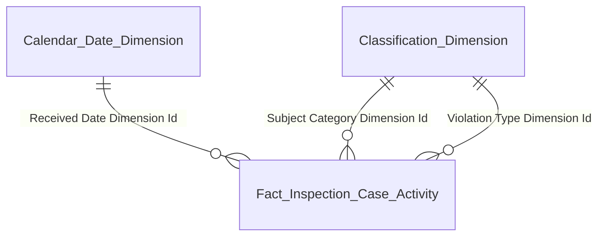
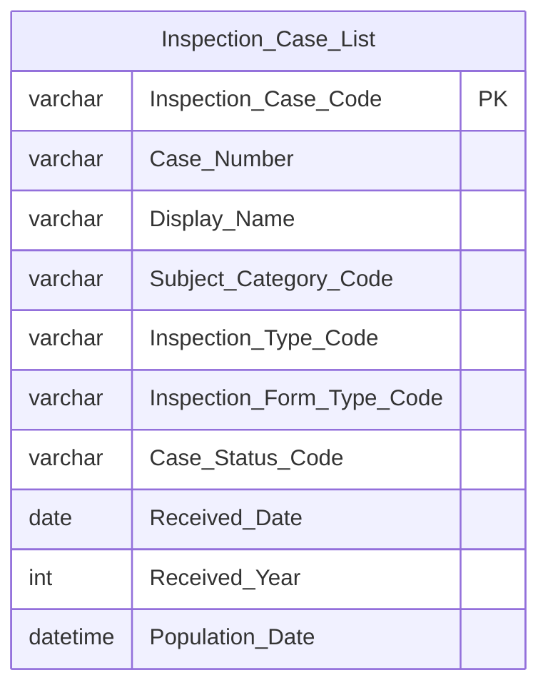
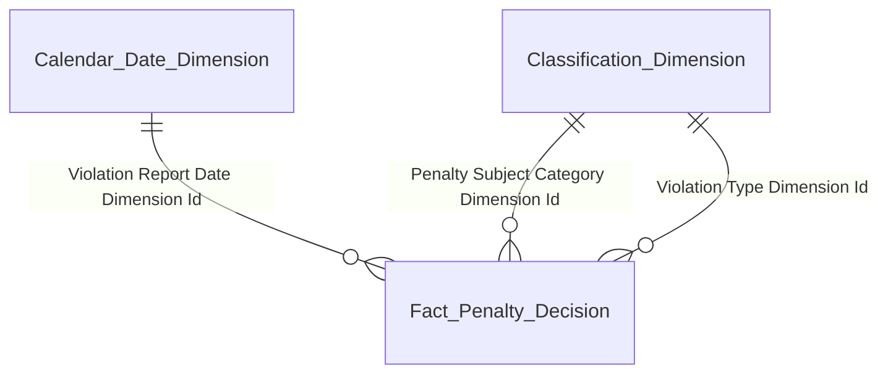
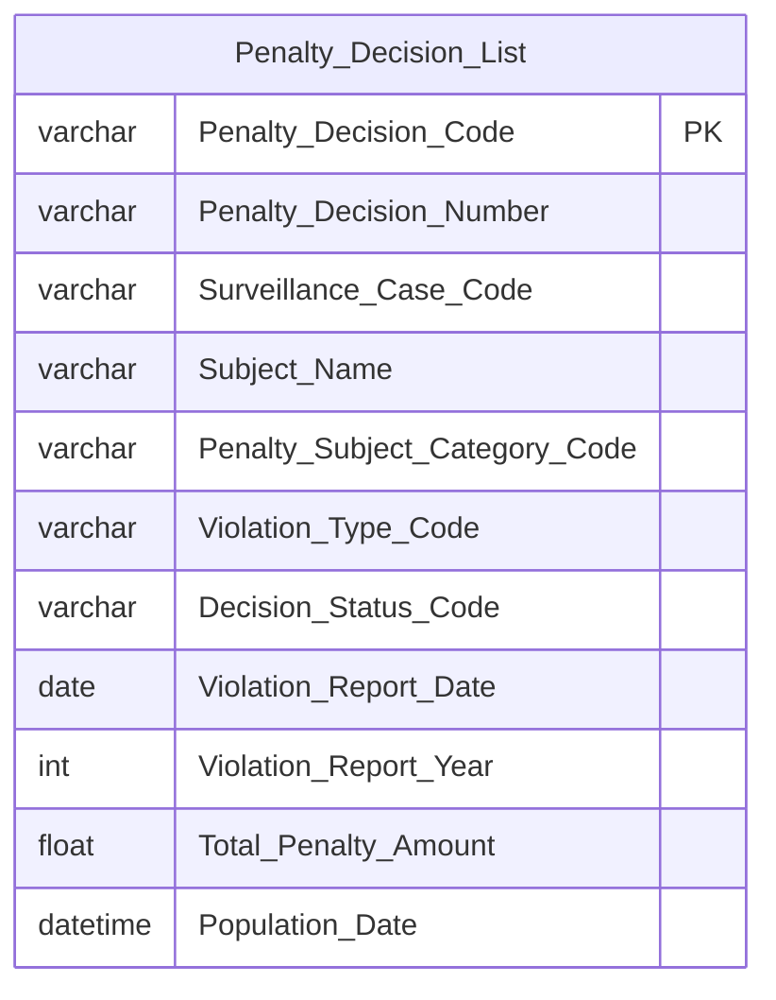
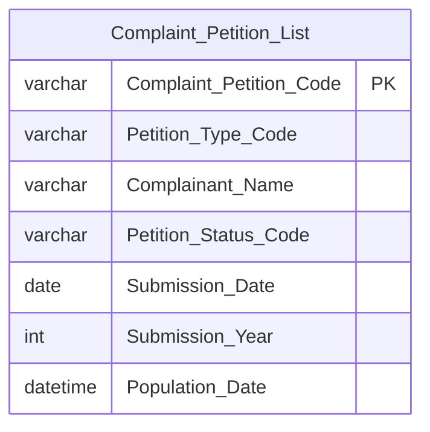
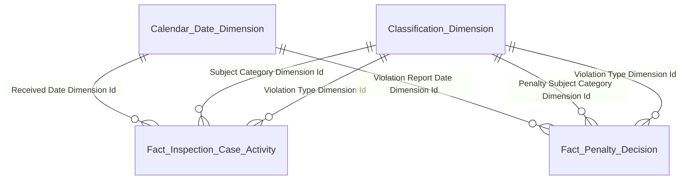

# GOLD_TT_Entities — Gold Data Mart: Phân hệ Thanh Tra (TT)

**Phiên bản:** 1.0  
**Ngày:** 28/04/2026  
**Phạm vi:** 7 Gold entities — 2 Fact + 2 Dim + 3 Tác nghiệp

---

## Nhóm 1: Tab TỔNG QUAN + KIỂM TRA — Phân tích vụ việc TT/KT

Phục vụ **8 nhóm phân tích** thuộc Tab TỔNG QUAN (Nhóm 1–4) và Tab KIỂM TRA (Nhóm 6–9). Nhóm 5 (Tab TQ) và Nhóm 10 (Tab KT) là danh sách tác nghiệp — serve bởi `Inspection Case List`. Hai tab reuse cùng `Fact Inspection Case Activity` — phân biệt bằng filter `Inspection_Type_Code`.

**Star schema:**

**Bảng entity:**

| Gold entity | Description | Grain | KPI |
|---|---|---|---|
| Fact Inspection Case Activity | Event vụ việc TT/KT — 1 hồ sơ × 1 đối tượng | 1 row per `TT_HO_SO` × `TT_QUYET_DINH_DOI_TUONG`. Đếm hồ sơ: COUNT(DISTINCT Inspection_Case_Code) | K_TT_1–54 |
| Calendar Date Dimension | Lịch ngày — slicer NĂM, GROUP BY tháng | 1 ngày | — |
| Classification Dimension | Phân loại — scheme `TT_SUBJECT_CATEGORY` và `TT_VIOLATION_TYPE` | 1 row per (Scheme, Code) | — |

---

## Nhóm 2: Danh sách vụ việc TT/KT — Tác nghiệp tra cứu hồ sơ

Phục vụ Nhóm 5 (Tab TỔNG QUAN) và Nhóm 10 (Tab KIỂM TRA). Phân biệt TT vs KT bằng filter `Inspection_Type_Code` ở query time.

**Schema tác nghiệp:**

**Bảng entity:**

| Gold entity | Description | Grain | KPI |
|---|---|---|---|
| Inspection Case List | Hồ sơ TT/KT — latest state | 1 row per hồ sơ (`TT_HO_SO`) | Nhóm 5, Nhóm 10 |

---

## Nhóm 3: Tab XỬ PHẠT — Phân tích quyết định xử phạt

Phục vụ toàn bộ Tab XỬ PHẠT (Nhóm 11–15) và Báo cáo STT 20 (Nhóm 20). Reuse `Fact Penalty Decision` cho cả KPI dashboard và bảng pivot.

**Star schema:**

**Bảng entity:**

| Gold entity | Description | Grain | KPI |
|---|---|---|---|
| Fact Penalty Decision | Event quyết định xử phạt | 1 row per QĐ (`GS_VAN_BAN_XU_LY`) | K_TT_55–80, K_TT_89–100 |
| Calendar Date Dimension | Lịch ngày — slicer NĂM, GROUP BY tháng | 1 ngày | — |
| Classification Dimension | Phân loại — scheme `TT_PENALTY_SUBJECT_CATEGORY` và `TT_VIOLATION_TYPE` | 1 row per (Scheme, Code) | — |

---

## Nhóm 4: Danh sách quyết định xử phạt — Tác nghiệp tra cứu QĐ

Phục vụ Nhóm 15 (Tab XỬ PHẠT) — bảng danh sách QĐXP.

**Schema tác nghiệp:**

**Bảng entity:**

| Gold entity | Description | Grain | KPI |
|---|---|---|---|
| Penalty Decision List | Quyết định xử phạt — latest state | 1 row per QĐ (`GS_VAN_BAN_XU_LY`) | Nhóm 15 |

---

## Nhóm 5: Tab ĐƠN THƯ — Tác nghiệp đơn thư khiếu nại tố cáo

Phục vụ toàn bộ Tab ĐƠN THƯ (Nhóm 16–19). Một bảng tác nghiệp serve cả KPI aggregate (COUNT theo loại đơn, theo tháng) và danh sách chi tiết.

**Schema tác nghiệp:**

**Bảng entity:**

| Gold entity | Description | Grain | KPI |
|---|---|---|---|
| Complaint Petition List | Đơn thư khiếu nại tố cáo — latest state | 1 row per đơn (`DT_DON_THU`) | K_TT_81–88b, Nhóm 16–19 |

---

## Tổng quan toàn bộ mô hình

**Bảng tổng hợp:**

| Gold entity | Loại | Grain | Source Silver | KPI phục vụ |
|---|---|---|---|---|
| Fact Inspection Case Activity | Fact — Event | 1 hồ sơ × 1 đối tượng | Inspection Case / Inspection Decision Subject / Inspection Case Conclusion | K_TT_1–54 |
| Fact Penalty Decision | Fact — Event | 1 QĐXP | Surveillance Enforcement Decision | K_TT_55–80, K_TT_89–100 |
| Calendar Date Dimension | Dim — Conformed | 1 ngày | Generated | — |
| Classification Dimension | Dim — Conformed | 1 (Scheme, Code) | Generated — 3 scheme: TT_SUBJECT_CATEGORY / TT_PENALTY_SUBJECT_CATEGORY / TT_VIOLATION_TYPE | — |
| Inspection Case List | Tác nghiệp | 1 hồ sơ (latest) | Inspection Case / Inspection Decision | Nhóm 5, 10 |
| Penalty Decision List | Tác nghiệp | 1 QĐXP (latest) | Surveillance Enforcement Decision / Surveillance Enforcement Case | Nhóm 15 |
| Complaint Petition List | Tác nghiệp | 1 đơn thư (latest) | Complaint Petition | K_TT_81–88b, Nhóm 16–19 |
