# GOLD_TT_HLD — Gold Data Mart: Phân hệ Thanh Tra (TT)

**Phiên bản:** 2.3  
**Ngày:** 27/04/2026  
**Phạm vi:** Tab **TỔNG QUAN** + **KIỂM TRA** + **XỬ PHẠT** + **ĐƠN THƯ** + **Báo cáo hoạt động vi phạm TTCK** — 4 tab dashboard + 1 báo cáo, 20 nhóm (K_TT_1–88 + K_TT_89–100)

---

## Section 1 — Data Lineage: Source → Silver → Gold Mart

### Cụm 1: Thống kê & Cơ cấu vụ việc Thanh tra/Kiểm tra (Fact Inspection Case Activity)

Phục vụ toàn bộ Tab TỔNG QUAN — KPI cards, biểu đồ bar theo tháng, donut cơ cấu theo hành vi và theo đối tượng.

- **Grain: 1 row per `TT_QUYET_DINH_DOI_TUONG` × `TT_HO_SO`** — 1 hồ sơ có nhiều đối tượng → nhiều row. Mọi KPI đếm số hồ sơ phải dùng `COUNT(DISTINCT Inspection_Case_Code)`.
- `Violation_Type_Dimension_Id` ← ETL-derived từ `TT_KET_LUAN.HANH_VI_VI_PHAM_ID` (scheme `TT_VIOLATION_TYPE`) → lookup `Classification Dimension` lấy surrogate key. ETL join `Inspection Case Conclusion → Inspection Case`, lấy `MAX(Conclusion_Sequence_Number)`.
- `Inspection_Form_Type_Code` ← ETL-derived: `TT_HO_SO.QUYET_DINH_ID` → join `TT_QUYET_DINH.KE_HOACH_ID`: `NULL` → `DOT_XUAT`; `NOT NULL` → `DINH_KY`. **Lưu ý: field này chỉ lưu trong bảng tác nghiệp `Inspection Case List`, không lưu trên Fact.**
- `Subject_Category_Code` ← ETL-derived: `TT_QUYET_DINH_DOI_TUONG.DOI_TUONG_REF_ID` → lookup polymorphic sang các bảng DM_ (không load trực tiếp attribute từ DM_ vào Fact) — xem O_TT_4.

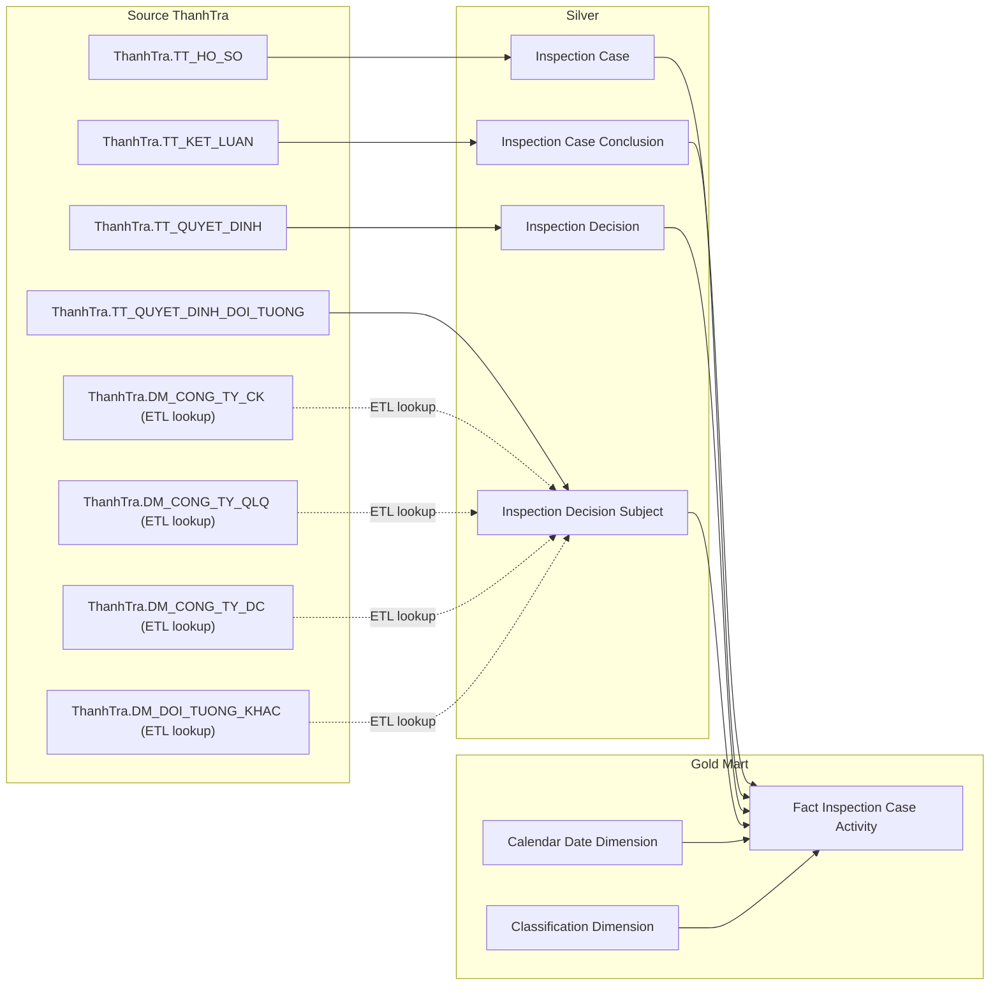
```mermaid
flowchart LR
    subgraph SRC["Source ThanhTra"]
        S1["ThanhTra.TT_HO_SO"]
        S2["ThanhTra.TT_KET_LUAN"]
        S3["ThanhTra.TT_QUYET_DINH"]
        S4["ThanhTra.TT_QUYET_DINH_DOI_TUONG"]
        S5["ThanhTra.DM_CONG_TY_CK (ETL lookup)"]
        S6["ThanhTra.DM_CONG_TY_QLQ (ETL lookup)"]
        S7["ThanhTra.DM_CONG_TY_DC (ETL lookup)"]
        S8["ThanhTra.DM_DOI_TUONG_KHAC (ETL lookup)"]
    end

    subgraph SIL["Silver"]
        SV1["Inspection Case"]
        SV2["Inspection Case Conclusion"]
        SV3["Inspection Decision"]
        SV4["Inspection Decision Subject"]
    end

    subgraph GOLD["Gold Mart"]
        G1["Fact Inspection Case Activity"]
        G2["Calendar Date Dimension"]
        G3["Classification Dimension"]
    end

    S1 --> SV1
    S2 --> SV2
    S3 --> SV3
    S4 --> SV4
    S5 -.->|ETL lookup| SV4
    S6 -.->|ETL lookup| SV4
    S7 -.->|ETL lookup| SV4
    S8 -.->|ETL lookup| SV4

    SV1 --> G1
    SV2 --> G1
    SV3 --> G1
    SV4 --> G1

    G2 --> G1
    G3 --> G1
```

### Cụm 2: Danh sách vụ việc Tác nghiệp (Inspection Case List)

Phục vụ block Danh sách vụ việc Thanh tra/Kiểm tra — bảng tra cứu từng hồ sơ. `Inspection_Form_Type_Code` (DINH_KY/DOT_XUAT) ETL-derive từ `TT_QUYET_DINH.KE_HOACH_ID` và lưu trực tiếp vào bảng tác nghiệp này. Lấy dữ liệu trực tiếp từ Silver — không qua Dimension.

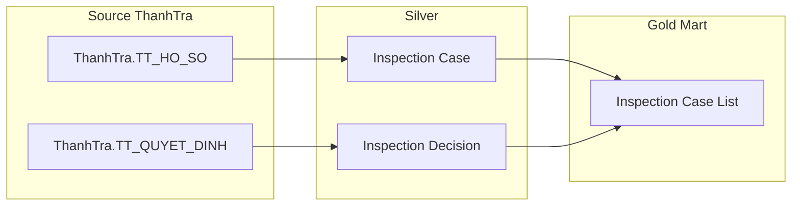
```mermaid
flowchart LR
    subgraph SRC["Source ThanhTra"]
        S1["ThanhTra.TT_HO_SO"]
        S2["ThanhTra.TT_QUYET_DINH"]
    end

    subgraph SIL["Silver"]
        SV1["Inspection Case"]
        SV2["Inspection Decision"]
    end

    subgraph GOLD["Gold Mart"]
        G1["Inspection Case List"]
    end

    S1 --> SV1
    S2 --> SV2

    SV1 --> G1
    SV2 --> G1
```

### Cụm 3: Xử phạt vi phạm (Fact Penalty Decision + Penalty Decision List)

Phục vụ Tab XỬ PHẠT — KPI cards tổng hợp, biểu đồ dual axis theo tháng, donut cơ cấu hành vi và đối tượng, danh sách quyết định. Nguồn Silver khác hoàn toàn với Cụm 1 — từ luồng Giám sát (`GS_*`), không phải luồng Thanh tra (`TT_*`).

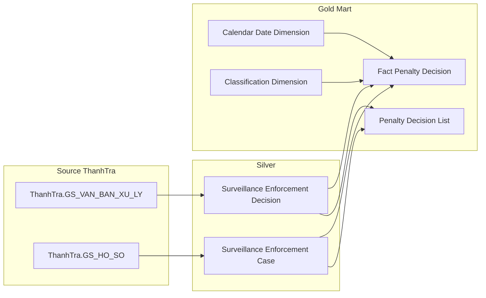
```mermaid
flowchart LR
    subgraph SRC["Source ThanhTra"]
        S1["ThanhTra.GS_VAN_BAN_XU_LY"]
        S2["ThanhTra.GS_HO_SO"]
    end

    subgraph SIL["Silver"]
        SV1["Surveillance Enforcement Decision"]
        SV2["Surveillance Enforcement Case"]
    end

    subgraph GOLD["Gold Mart"]
        G1["Fact Penalty Decision"]
        G2["Penalty Decision List"]
        G3["Calendar Date Dimension"]
        G4["Classification Dimension"]
    end

    S1 --> SV1
    S2 --> SV2

    SV1 --> G1
    SV2 --> G1
    SV1 --> G2
    SV2 --> G2

    G3 --> G1
    G4 --> G1
```

### Cụm 4: Đơn thư khiếu nại tố cáo (Complaint Petition List)

Phục vụ Tab ĐƠN THƯ — KPI aggregate (tổng, theo tháng, theo loại) và danh sách chi tiết. Toàn bộ KPI serve từ `Complaint Petition List` — không tạo Fact riêng vì grain giống hệt tác nghiệp, volume nhỏ, không có fanout.

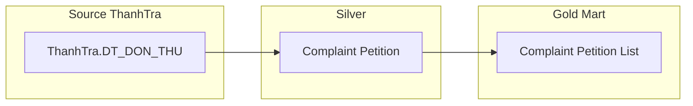
```mermaid
flowchart LR
    subgraph SRC["Source ThanhTra"]
        S1["ThanhTra.DT_DON_THU"]
    end

    subgraph SIL["Silver"]
        SV1["Complaint Petition"]
    end

    subgraph GOLD["Gold Mart"]
        G1["Complaint Petition List"]
    end

    S1 --> SV1
    SV1 --> G1
```

### Cụm 5: Báo cáo hoạt động vi phạm TTCK (Fact Penalty Decision — reuse)

Phục vụ Báo cáo STT 20 — bảng pivot nhóm đối tượng × loại vi phạm × (số lượng + số tiền). Reuse hoàn toàn `Fact Penalty Decision` từ Cụm 3 — không tạo Fact hay Silver entity mới.

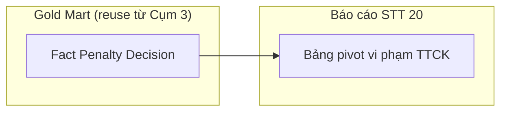
```mermaid
flowchart LR
    subgraph GOLD["Gold Mart (reuse từ Cụm 3)"]
        G1["Fact Penalty Decision"]
    end
    subgraph RPT["Báo cáo STT 20"]
        R1["Bảng pivot vi phạm TTCK"]
    end
    G1 --> R1
```

---

## Section 2 — Tổng quan báo cáo

### Tab: TỔNG QUAN

**Slicer chung:** Năm (NĂM 202X — góc trên phải dashboard)

---

#### Nhóm 1 — KPI cards Thống kê chung (STT 1)

> Phân loại: **Phân tích**
> Silver: `Inspection Case` ← ThanhTra.TT_HO_SO — **READY**
> Silver: `Inspection Decision` ← ThanhTra.TT_QUYET_DINH — **READY**
> Ghi chú:
> - `Inspection_Type_Code` ← `TT_HO_SO.LOAI_HINH`, scheme `TT_PLAN_TYPE`, giá trị: `THANH_TRA / KIEM_TRA` — dùng để **lọc** TT vs KT, không hiển thị.
> - `Case_Status_Code` ← `TT_HO_SO.TRANG_THAI_ID`, scheme `TT_CASE_STATUS`.

**Mockup:**

| ĐOÀN ▲ 8% | ĐOÀN ▲ 12% | ĐOÀN ▲ 5% |
|---|---|---|
| Tổng số đoàn thanh tra | Số đoàn đã hoàn thành | Số đoàn đang thực hiện |

**Source:** `Fact Inspection Case Activity` → `Calendar Date Dimension`, `Classification Dimension`

**Bảng KPI:**

| KPI ID | Tên KPI | Đơn vị | Tính chất | Công thức |
|---|---|---|---|---|
| K_TT_1 | Tổng số đoàn thanh tra | Đoàn | Base | COUNT(DISTINCT Inspection_Case_Code) WHERE Inspection_Type_Code=`THANH_TRA` (TT_PLAN_TYPE) AND Year=selected_year |
| K_TT_2 | Tổng số thanh tra SSCK (%) | % | Derived | (K_TT_1[Y] − K_TT_1[Y−1]) / K_TT_1[Y−1] × 100% |
| K_TT_3 | Số đoàn đã hoàn thành | Đoàn | Base | COUNT(DISTINCT Inspection_Case_Code) WHERE Inspection_Type_Code=`THANH_TRA` AND Case_Status_Code=`HOAN_THANH` (TT_CASE_STATUS) AND Year=selected_year |
| K_TT_4 | Số đoàn hoàn thành SSCK (%) | % | Derived | (K_TT_3[Y] − K_TT_3[Y−1]) / K_TT_3[Y−1] × 100% |
| K_TT_5 | Số đoàn đang thực hiện | Đoàn | Base | COUNT(DISTINCT Inspection_Case_Code) WHERE Inspection_Type_Code=`THANH_TRA` AND Case_Status_Code≠`HOAN_THANH` AND Year=selected_year |
| K_TT_6 | Số đoàn đang thực hiện SSCK (%) | % | Derived | (K_TT_5[Y] − K_TT_5[Y−1]) / K_TT_5[Y−1] × 100% |

**Star Schema:**

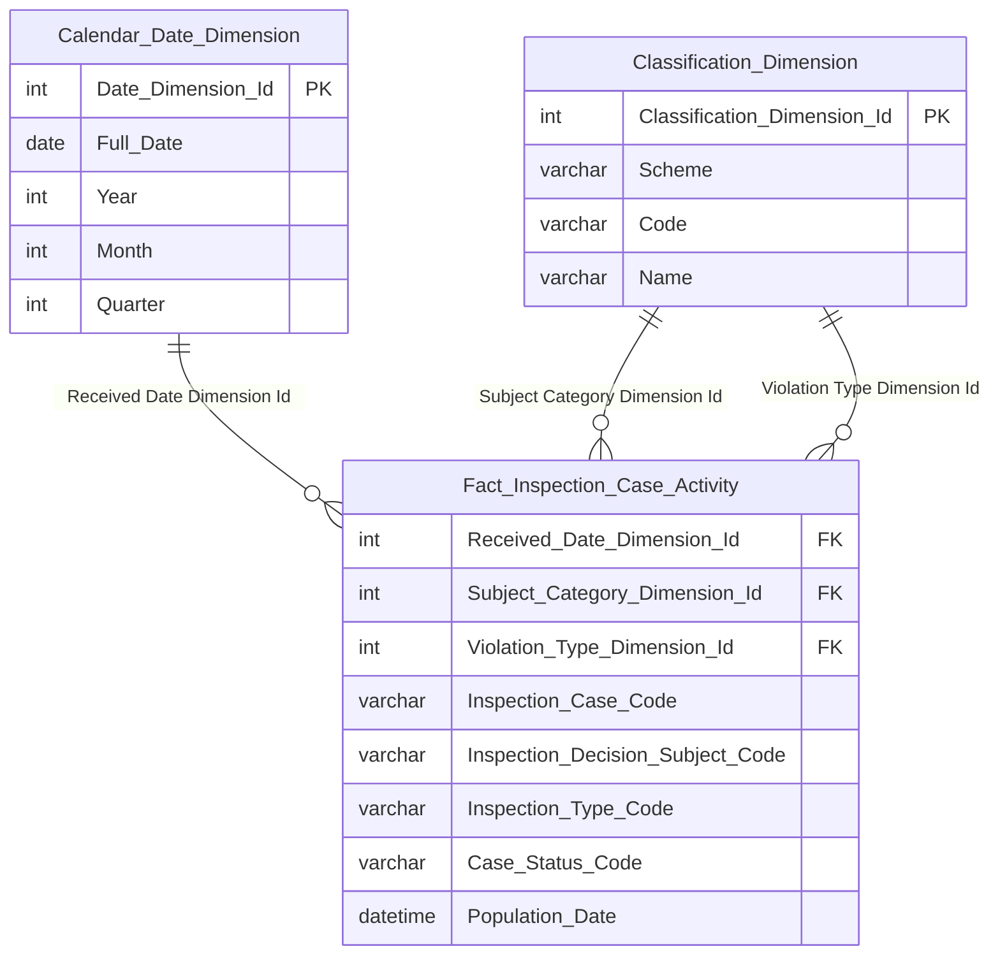
```mermaid
erDiagram
    Calendar_Date_Dimension ||--o{ Fact_Inspection_Case_Activity : "Received Date Dimension Id"
    Classification_Dimension ||--o{ Fact_Inspection_Case_Activity : "Subject Category Dimension Id"
    Classification_Dimension ||--o{ Fact_Inspection_Case_Activity : "Violation Type Dimension Id"
    Fact_Inspection_Case_Activity {
        int Received_Date_Dimension_Id FK
        int Subject_Category_Dimension_Id FK
        int Violation_Type_Dimension_Id FK
        varchar Inspection_Case_Code
        varchar Inspection_Decision_Subject_Code
        varchar Inspection_Type_Code
        varchar Case_Status_Code
        datetime Population_Date
    }
    Calendar_Date_Dimension {
        int Date_Dimension_Id PK
        date Full_Date
        int Year
        int Month
        int Quarter
    }
    Classification_Dimension {
        int Classification_Dimension_Id PK
        varchar Scheme
        varchar Code
        varchar Name
    }
```

*Ghi chú erDiagram — các DD trên Fact:*

| Field | Silver source | Scheme / Giá trị | Ghi chú |
|---|---|---|---|
| `Inspection_Case_Code` | `TT_HO_SO.ID` | — | DD — PK nguồn dùng làm degenerate key hồ sơ trên Fact. Dùng `COUNT(DISTINCT Inspection_Case_Code)` để đếm hồ sơ. (Lưu ý: `TT_HO_SO.MA_HO_SO` = business key hiển thị, lưu trong bảng tác nghiệp) |
| `Inspection_Decision_Subject_Code` | `TT_QUYET_DINH_DOI_TUONG.ID` | — | DD — PK nguồn của đối tượng trong quyết định. Cùng với `Inspection_Case_Code` tạo composite grain key |
| `Inspection_Type_Code` | `TT_HO_SO.LOAI_HINH` | `TT_PLAN_TYPE`: THANH_TRA / KIEM_TRA | DD — bộ lọc phân biệt TT vs KT, không hiển thị trực tiếp |
| `Case_Status_Code` | `TT_HO_SO.TRANG_THAI_ID` | `TT_CASE_STATUS` | DD — trạng thái hồ sơ |
| `Violation_Type_Dimension_Id` | ETL: `TT_KET_LUAN.HANH_VI_VI_PHAM_ID` → lookup `Classification Dimension` (scheme `TT_VIOLATION_TYPE`) lấy surrogate key | scheme: `TT_VIOLATION_TYPE` | FK → Classification Dimension. 11 giá trị: CBTT / CHAO_BAN / CO_DONG_NOI_BO / GIAO_DICH / CTDC_VI_PHAM / CTCK / TO_CHUC_PHTP_VI_PHAM / THAO_TUNG / CHO_MUON / TO_CHUC_KIEM_TOAN / SO_GIAO_DICH |
| `Subject_Category_Dimension_Id` | ETL-derived: `TT_QUYET_DINH_DOI_TUONG.DOI_TUONG_REF_ID` → lookup DM_ entities → derive code | scheme: `TT_SUBJECT_CATEGORY` | FK → Classification Dimension — **6 giá trị tạm thời**: CTCK / CTQLQ / CTDC / CA_NHAN / TO_CHUC_KHAC (xem O_TT_4) |

**Lineage Mart → Báo cáo:**

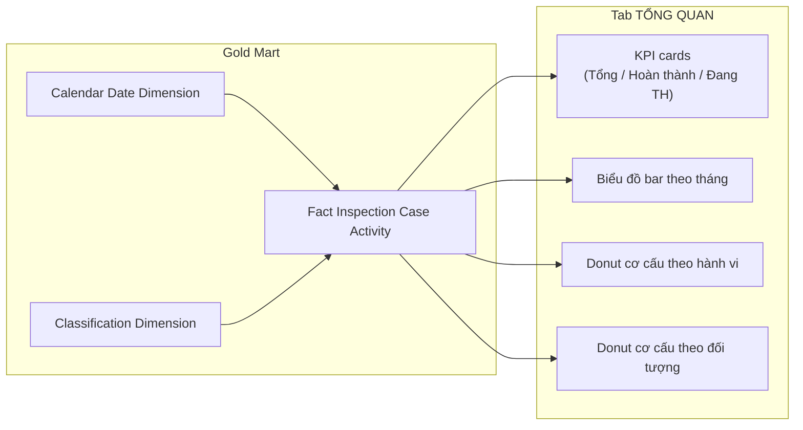
```mermaid
flowchart LR
    subgraph GOLD["Gold Mart"]
        G1["Fact Inspection Case Activity"]
        G2["Calendar Date Dimension"]
        G3["Classification Dimension"]
    end
    subgraph RPT["Tab TỔNG QUAN"]
        R1["KPI cards\n(Tổng / Hoàn thành / Đang TH)"]
        R2["Biểu đồ bar theo tháng"]
        R3["Donut cơ cấu theo hành vi"]
        R4["Donut cơ cấu theo đối tượng"]
    end
    G2 --> G1
    G3 --> G1
    G1 --> R1
    G1 --> R2
    G1 --> R3
    G1 --> R4
```

**Bảng grain:**

| Tên bảng | Grain | Date key | Filter mặc định | Phân biệt TT/KT |
|---|---|---|---|---|
| Fact Inspection Case Activity | 1 hồ sơ × 1 đối tượng (`TT_HO_SO` × `TT_QUYET_DINH_DOI_TUONG`) — composite key: `Inspection_Case_Code` + `Inspection_Decision_Subject_Code`. Đếm số hồ sơ dùng `COUNT(DISTINCT Inspection_Case_Code)` | `Received_Date_Dimension_Id` ← `TT_HO_SO.NGAY_NHAN_HO_SO` join Calendar Date Dimension (xem O_TT_3) | Year = selected_year (slicer NĂM 202X) | `Inspection_Type_Code` = `THANH_TRA` hoặc `KIEM_TRA` (scheme `TT_PLAN_TYPE`) |

---

#### Nhóm 2 — Biểu đồ Thống kê số vụ việc theo tháng (STT 2)

> Phân loại: **Phân tích**
> Silver: `Inspection Case` ← ThanhTra.TT_HO_SO — **READY**
> Ghi chú: Reuse `Fact Inspection Case Activity` — GROUP BY `Calendar_Date_Dimension.Month` ở presentation layer. Trục thời gian = tháng trong năm selected (slicer). Xem O_TT_3 về lựa chọn date key.

**Mockup:**

| Tháng | T1 | T2 | T3 | ... | T12 |
|---|---|---|---|---|---|
| Tổng số vụ | 4 | 6 | 5 | ... | 24 |
| Đang thực hiện | 2 | 3 | 2 | ... | 12 |
| Đã hoàn thành | 2 | 3 | 3 | ... | 12 |

**Source:** `Fact Inspection Case Activity` → `Calendar Date Dimension`

**Bảng KPI:**

| KPI ID | Tên KPI | Đơn vị | Tính chất | Công thức |
|---|---|---|---|---|
| K_TT_7 | Số vụ việc thanh tra theo tháng (tổng) | Vụ | Base | COUNT(DISTINCT Inspection_Case_Code) WHERE Inspection_Type_Code=`THANH_TRA` AND Year=selected_year GROUP BY Calendar_Date_Dimension.Month |
| K_TT_8 | Số vụ đang thực hiện theo tháng | Vụ | Base | COUNT(DISTINCT Inspection_Case_Code) WHERE Inspection_Type_Code=`THANH_TRA` AND Year=selected_year AND Case_Status_Code≠`HOAN_THANH` GROUP BY Month |
| K_TT_9 | Số vụ đã hoàn thành theo tháng | Vụ | Base | COUNT(DISTINCT Inspection_Case_Code) WHERE Inspection_Type_Code=`THANH_TRA` AND Year=selected_year AND Case_Status_Code=`HOAN_THANH` GROUP BY Month |

**Bảng grain:**

| Tên bảng | Grain | Date key | Filter mặc định | Phân tích theo tháng |
|---|---|---|---|---|
| Fact Inspection Case Activity | reuse — 1 hồ sơ × 1 đối tượng. Đếm hồ sơ dùng `COUNT(DISTINCT Inspection_Case_Code)` | `Received_Date_Dimension_Id` | Year=selected_year, Inspection_Type_Code=`THANH_TRA` | GROUP BY Calendar_Date_Dimension.Month ở query time |

---

#### Nhóm 3 — Cơ cấu vi phạm theo loại hành vi (STT 3)

> Phân loại: **Phân tích**
> Silver: `Inspection Case` ← ThanhTra.TT_HO_SO — **READY**
> Silver: `Inspection Case Conclusion` ← ThanhTra.TT_KET_LUAN — **READY**
> Ghi chú: `Violation_Type_Dimension_Id` ← ETL join `TT_HO_SO → TT_KET_LUAN` (via `Inspection Case Id`), lấy `MAX(Conclusion_Sequence_Number)`, map `HANH_VI_VI_PHAM_ID` → `Classification Dimension` (scheme `TT_VIOLATION_TYPE`). BA STT 3 định nghĩa 3 hành vi: Thao túng thị trường / Cho mượn tài khoản / CBTT.

**Mockup:**

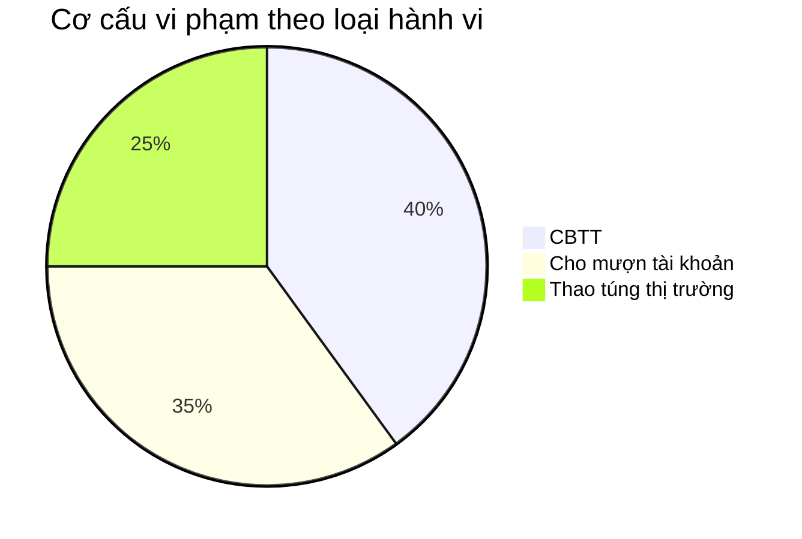
```mermaid
pie title Cơ cấu vi phạm theo loại hành vi
    "CBTT" : 40
    "Cho mượn tài khoản" : 35
    "Thao túng thị trường" : 25
```

**Source:** `Fact Inspection Case Activity` → `Calendar Date Dimension`, `Classification Dimension`

**Bảng KPI:**

| KPI ID | Tên KPI | Đơn vị | Tính chất | Công thức |
|---|---|---|---|---|
| K_TT_10 | Số vi phạm Thao túng thị trường | Vụ | Base | COUNT(DISTINCT Inspection_Case_Code) WHERE Inspection_Type_Code=`THANH_TRA` AND Year=selected_year AND Violation_Type_Dimension_Id=[THAO_TUNG] |
| K_TT_11 | Tỷ lệ % Thao túng thị trường | % | Derived | K_TT_10 / K_TT_1 × 100% |
| K_TT_12 | Số vi phạm Cho mượn tài khoản | Vụ | Base | COUNT(DISTINCT Inspection_Case_Code) WHERE Inspection_Type_Code=`THANH_TRA` AND Year=selected_year AND Violation_Type_Dimension_Id=[CHO_MUON] |
| K_TT_13 | Tỷ lệ % Cho mượn tài khoản | % | Derived | K_TT_12 / K_TT_1 × 100% |
| K_TT_14 | Số vi phạm CBTT | Vụ | Base | COUNT(DISTINCT Inspection_Case_Code) WHERE Inspection_Type_Code=`THANH_TRA` AND Year=selected_year AND Violation_Type_Dimension_Id=[CBTT] |
| K_TT_15 | Tỷ lệ % CBTT | % | Derived | K_TT_14 / K_TT_1 × 100% |

**Bảng grain:**

| Tên bảng | Grain | Date key | Filter mặc định | Phân tích theo hành vi |
|---|---|---|---|---|
| Fact Inspection Case Activity | reuse — 1 hồ sơ × 1 đối tượng. Đếm hồ sơ dùng `COUNT(DISTINCT Inspection_Case_Code)` | `Received_Date_Dimension_Id` | Year=selected_year, Inspection_Type_Code=`THANH_TRA` | GROUP BY Violation_Type_Dimension_Id join Classification Dimension (scheme TT_VIOLATION_TYPE) ở query time |

---

#### Nhóm 4 — Cơ cấu vi phạm theo đối tượng (STT 4)

> Phân loại: **Phân tích**
> Silver: `Inspection Decision Subject` ← ThanhTra.TT_QUYET_DINH_DOI_TUONG — **READY**
> Silver: `Securities Company` ← ThanhTra.DM_CONG_TY_CK — **READY**
> Silver: `Fund Management Company` ← ThanhTra.DM_CONG_TY_QLQ — **READY**
> Silver: `Public Company` ← ThanhTra.DM_CONG_TY_DC — **READY**
> Silver: `Inspection Subject Other Party` ← ThanhTra.DM_DOI_TUONG_KHAC — **READY**
> Ghi chú: `Subject_Category_Dimension_Id` FK → `Classification Dimension` (scheme `TT_SUBJECT_CATEGORY`). ETL resolve polymorphic FK `TT_QUYET_DINH_DOI_TUONG.DOI_TUONG_REF_ID`:
> - → `DM_CONG_TY_CK` → `CTCK`
> - → `DM_CONG_TY_QLQ` → `CTQLQ`
> - → `DM_CONG_TY_DC` → `CTDC`
> - → `DM_DOI_TUONG_KHAC` AND `LOAI_DOI_TUONG=CA_NHAN` → `CA_NHAN`
> - → `DM_DOI_TUONG_KHAC` AND `LOAI_DOI_TUONG=TO_CHUC` → `TO_CHUC_KHAC` (tạm thời — Silver `DM_DOI_TUONG_KHAC` không có field phân biệt CTKT/NHLK/TO_CHUC_PHTP. Chờ khảo sát nguồn, xem O_TT_4)
> **6 giá trị scheme tạm thời:** CTCK / CTDC / CTQLQ / CA_NHAN / TO_CHUC_KHAC. Thứ tự hiển thị theo BA STT 4: Cá nhân → CTĐC → CTCK → CTQLQ. Xem O_TT_4.

**Mockup:**

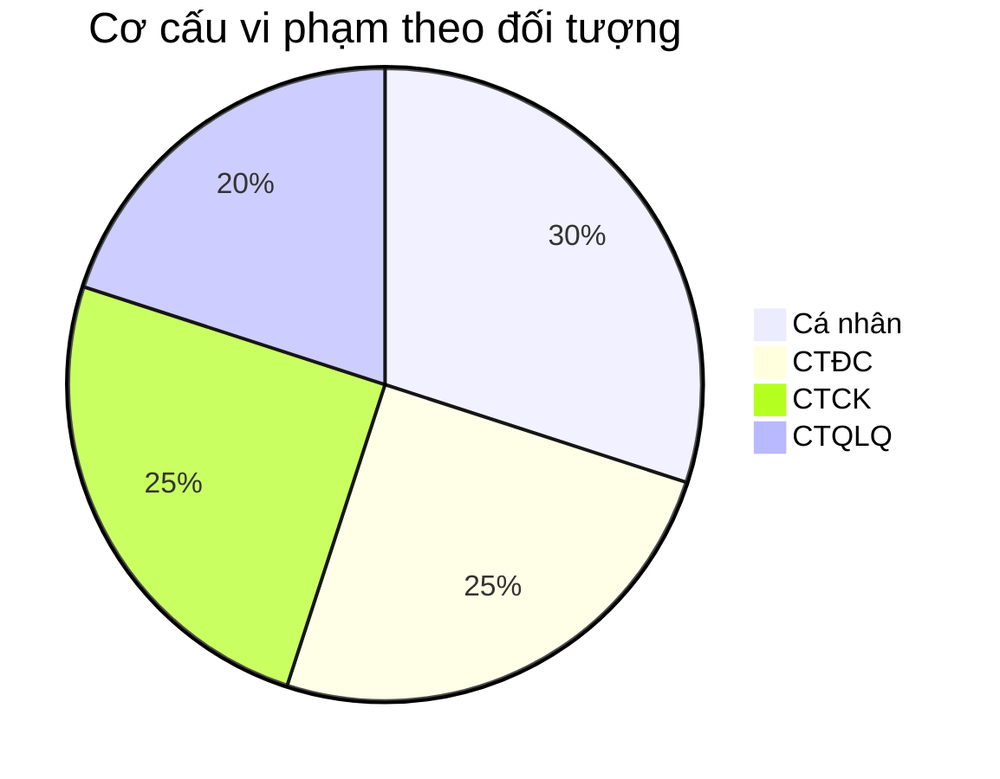
```mermaid
pie title Cơ cấu vi phạm theo đối tượng
    "Cá nhân" : 30
    "CTĐC" : 25
    "CTCK" : 25
    "CTQLQ" : 20
```

**Source:** `Fact Inspection Case Activity` → `Calendar Date Dimension`, `Classification Dimension`

**Bảng KPI:**

| KPI ID | Tên KPI | Đơn vị | Tính chất | Công thức |
|---|---|---|---|---|
| K_TT_16 | Số vi phạm đối tượng Cá nhân | Vụ | Base | COUNT(DISTINCT Inspection_Case_Code) WHERE Inspection_Type_Code=`THANH_TRA` AND Year=selected_year AND Subject_Category_Dimension_Id=[CA_NHAN] (TT_SUBJECT_CATEGORY) |
| K_TT_17 | Tỷ lệ % Cá nhân | % | Derived | K_TT_16 / K_TT_1 × 100% |
| K_TT_18 | Số vi phạm đối tượng CTĐC | Vụ | Base | COUNT(DISTINCT Inspection_Case_Code) WHERE Inspection_Type_Code=`THANH_TRA` AND Year=selected_year AND Subject_Category_Dimension_Id=[CTDC] |
| K_TT_19 | Tỷ lệ % CTĐC | % | Derived | K_TT_18 / K_TT_1 × 100% |
| K_TT_20 | Số vi phạm đối tượng CTCK | Vụ | Base | COUNT(DISTINCT Inspection_Case_Code) WHERE Inspection_Type_Code=`THANH_TRA` AND Subject_Category_Dimension_Id=[CTCK] |
| K_TT_21 | Tỷ lệ % CTCK | % | Derived | K_TT_20 / K_TT_1 × 100% |
| K_TT_22 | Số vi phạm đối tượng CTQLQ | Vụ | Base | COUNT(DISTINCT Inspection_Case_Code) WHERE Inspection_Type_Code=`THANH_TRA` AND Subject_Category_Dimension_Id=[CTQLQ] |
| K_TT_23 | Tỷ lệ % CTQLQ | % | Derived | K_TT_22 / K_TT_1 × 100% |

**Bảng grain:**

| Tên bảng | Grain | Date key | Filter mặc định | Phân tích theo đối tượng |
|---|---|---|---|---|
| Fact Inspection Case Activity | reuse — 1 hồ sơ × 1 đối tượng. Đếm hồ sơ dùng `COUNT(DISTINCT Inspection_Case_Code)` | `Received_Date_Dimension_Id` | Year=selected_year, Inspection_Type_Code=`THANH_TRA` | GROUP BY Subject_Category_Dimension_Id join Classification Dimension ở query time |

---

#### Nhóm 5 — Danh sách vụ việc Thanh tra/Kiểm tra (STT 5)

> Phân loại: **Tác nghiệp**
> Silver: `Inspection Case` ← ThanhTra.TT_HO_SO — **READY**
> Silver: `Inspection Decision` ← ThanhTra.TT_QUYET_DINH — **READY**
> Ghi chú:
> - Cột **"Mã vụ việc"** ← `TT_HO_SO.MA_HO_SO` (`Inspection Case.Case_Number`)
> - Cột **"Đối tượng"** ← ETL: `COALESCE(TT_HO_SO.TEN_DOI_TUONG, TT_HO_SO.HO_TEN)` — Silver có 2 field: `Subject_Organization_Name` ← `TT_HO_SO.TEN_DOI_TUONG` (tổ chức) và `Subject_Full_Name` ← `TT_HO_SO.HO_TEN` (cá nhân). ETL merge thành 1 cột `Display_Name` dựa vào `LOAI_DOI_TUONG`.
> - Cột **"Phân loại đối tượng"** ← `Subject_Category_Code` ETL-derived (resolve polymorphic `TT_QUYET_DINH_DOI_TUONG.DOI_TUONG_REF_ID`)
> - Cột **"Loại hình"** ← `Inspection_Form_Type_Code` ETL-derived: `TT_QUYET_DINH.KE_HOACH_ID IS NULL` → Đột xuất / `NOT NULL` → Định kỳ. **Không phải** `Inspection_Type_Code` (THANH_TRA/KIEM_TRA)
> - Cột **"Trạng thái"** ← `TT_HO_SO.TRANG_THAI_ID` (`Case_Status_Code`, scheme `TT_CASE_STATUS`)

**Mockup:**

| Mã vụ việc | Đối tượng | Phân loại đối tượng | Loại hình | Trạng thái |
|---|---|---|---|---|
| INS-2024-001 | Công ty ABC | Công ty chứng khoán | Đột xuất | Tại thực địa |
| INS-2024-002 | Công ty XYZ | Quỹ đầu tư | Định kỳ | Đang thực hiện |

**Schema bảng tác nghiệp:**

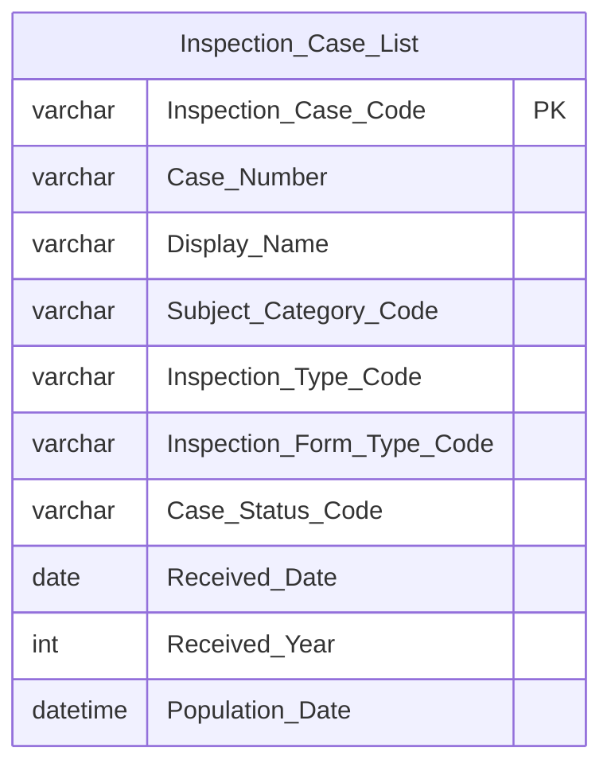
```mermaid
erDiagram
    Inspection_Case_List {
        varchar Inspection_Case_Code PK
        varchar Case_Number
        varchar Display_Name
        varchar Subject_Category_Code
        varchar Inspection_Type_Code
        varchar Inspection_Form_Type_Code
        varchar Case_Status_Code
        date Received_Date
        int Received_Year
        datetime Population_Date
    }
```

**Lineage Mart → Báo cáo:**

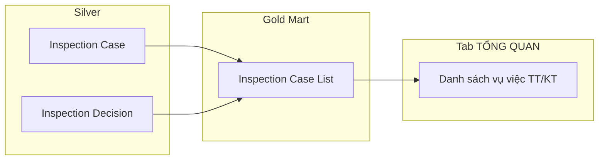
```mermaid
flowchart LR
    subgraph SIL["Silver"]
        SV1["Inspection Case"]
        SV2["Inspection Decision"]
    end
    subgraph GOLD["Gold Mart"]
        G1["Inspection Case List"]
    end
    subgraph RPT["Tab TỔNG QUAN"]
        R1["Danh sách vụ việc TT/KT"]
    end
    SV1 --> G1
    SV2 --> G1
    G1 --> R1
```

**Bảng grain:**

| Tên bảng | Grain | Nguồn chính | Filter mặc định | Ghi chú |
|---|---|---|---|---|
| Inspection Case List | 1 hồ sơ TT/KT — mỗi row = 1 `TT_HO_SO` (latest state) | `Inspection Case` + `Inspection Decision` (join lấy `KE_HOACH_ID`) + ETL-derived `Subject_Category_Code` | Year=selected_year; filter Loại hình và Trạng thái ở query time | Phân trang ở presentation layer |

---

### Tab: KIỂM TRA

**Slicer chung:** Năm (NĂM 202X — góc trên phải dashboard)

> Ghi chú chung Tab KIỂM TRA: Toàn bộ 5 block reuse `Fact Inspection Case Activity` và `Inspection Case List` — chỉ filter `Inspection_Type_Code = KIEM_TRA` (scheme `TT_PLAN_TYPE`). Không tạo Fact hay Tác nghiệp mới.

---

#### Nhóm 6 — KPI cards Thống kê chung Kiểm tra (STT 6)

> Phân loại: **Phân tích**
> Silver: `Inspection Case` ← ThanhTra.TT_HO_SO — **READY**
> Ghi chú: Reuse `Fact Inspection Case Activity` — filter `Inspection_Type_Code=KIEM_TRA`. Các field DD và FK giống hệt Tab TỔNG QUAN.

**Mockup:**

| TỔNG SỐ CUỘC KIỂM TRA ▲ 10% | TỔNG SỐ ĐÃ HOÀN THÀNH ▲ 15% | TỔNG SỐ ĐANG THỰC HIỆN ▲ 5% |
|---|---|---|
| 5 Số cuộc | 2 Số cuộc | 3 Số cuộc |

**Source:** `Fact Inspection Case Activity` → `Calendar Date Dimension`

**Bảng KPI:**

| KPI ID | Tên KPI | Đơn vị | Tính chất | Công thức |
|---|---|---|---|---|
| K_TT_24 | Tổng số cuộc kiểm tra | Cuộc | Base | COUNT(DISTINCT Inspection_Case_Code) WHERE Inspection_Type_Code=`KIEM_TRA` AND Year=selected_year |
| K_TT_25 | Tổng số kiểm tra SSCK (%) | % | Derived | (K_TT_24[Y] − K_TT_24[Y−1]) / K_TT_24[Y−1] × 100% |
| K_TT_26 | Số cuộc kiểm tra đã hoàn thành | Cuộc | Base | COUNT(DISTINCT Inspection_Case_Code) WHERE Inspection_Type_Code=`KIEM_TRA` AND Case_Status_Code=`HOAN_THANH` AND Year=selected_year |
| K_TT_27 | Số cuộc kiểm tra hoàn thành SSCK (%) | % | Derived | (K_TT_26[Y] − K_TT_26[Y−1]) / K_TT_26[Y−1] × 100% |
| K_TT_28 | Số cuộc kiểm tra đang thực hiện | Cuộc | Base | COUNT(DISTINCT Inspection_Case_Code) WHERE Inspection_Type_Code=`KIEM_TRA` AND Case_Status_Code≠`HOAN_THANH` AND Year=selected_year |
| K_TT_29 | Số cuộc kiểm tra đang thực hiện SSCK (%) | % | Derived | (K_TT_28[Y] − K_TT_28[Y−1]) / K_TT_28[Y−1] × 100% |

**Bảng grain:** reuse `Fact Inspection Case Activity` — filter `Inspection_Type_Code=KIEM_TRA`, `COUNT(DISTINCT Inspection_Case_Code)`.

---

#### Nhóm 7 — Biểu đồ xu hướng số cuộc kiểm tra theo tháng (STT 7)

> Phân loại: **Phân tích**
> Silver: `Inspection Case` ← ThanhTra.TT_HO_SO — **READY**
> Ghi chú: Reuse `Fact Inspection Case Activity` — GROUP BY tháng ở presentation layer. Xem O_TT_3 về lựa chọn date key.

**Mockup:**

| Tháng | T1 | T2 | ... | T12 |
|---|---|---|---|---|
| Số lượng vụ việc kiểm tra | 2 | 4 | ... | 32 |
| Đang thực hiện | 1 | 2 | ... | 18 |
| Đã hoàn thành | 1 | 2 | ... | 14 |

**Source:** `Fact Inspection Case Activity` → `Calendar Date Dimension`

**Bảng KPI:**

| KPI ID | Tên KPI | Đơn vị | Tính chất | Công thức |
|---|---|---|---|---|
| K_TT_30 | Số lượng vụ việc kiểm tra theo tháng (tổng) | Cuộc | Base | COUNT(DISTINCT Inspection_Case_Code) WHERE Inspection_Type_Code=`KIEM_TRA` AND Year=selected_year GROUP BY Calendar_Date_Dimension.Month |
| K_TT_31 | Số cuộc đang thực hiện theo tháng | Cuộc | Base | COUNT(DISTINCT Inspection_Case_Code) WHERE Inspection_Type_Code=`KIEM_TRA` AND Year=selected_year AND Case_Status_Code≠`HOAN_THANH` GROUP BY Month |
| K_TT_32 | Số cuộc đã hoàn thành theo tháng | Cuộc | Base | COUNT(DISTINCT Inspection_Case_Code) WHERE Inspection_Type_Code=`KIEM_TRA` AND Year=selected_year AND Case_Status_Code=`HOAN_THANH` GROUP BY Month |

**Bảng grain:** reuse `Fact Inspection Case Activity` — filter `Inspection_Type_Code=KIEM_TRA`, GROUP BY Month ở query time.

---

#### Nhóm 8 — Cơ cấu kiểm tra theo loại hành vi (STT 8)

> Phân loại: **Phân tích**
> Silver: `Inspection Case Conclusion` ← ThanhTra.TT_KET_LUAN — **READY**
> Ghi chú: `Violation_Type_Dimension_Id` FK → `Classification Dimension` (scheme `TT_VIOLATION_TYPE`) ← ETL map từ `TT_KET_LUAN.HANH_VI_VI_PHAM_ID`. BA STT 8 định nghĩa **11 hành vi**: CBTT / Hoạt động chào bán / Cổ đông nội bộ+lớn / Giao dịch / CTĐC / CTCK / Tổ chức PHTP / Thao túng / Cho mượn / Tổ chức kiểm toán / Sở giao dịch. HLD thiết kế đủ 11 hành vi theo BA.

**Mockup:**

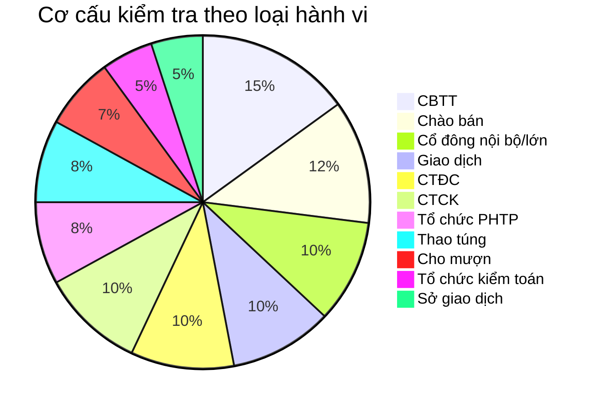
```mermaid
pie title Cơ cấu kiểm tra theo loại hành vi
    "CBTT" : 15
    "Chào bán" : 12
    "Cổ đông nội bộ/lớn" : 10
    "Giao dịch" : 10
    "CTĐC" : 10
    "CTCK" : 10
    "Tổ chức PHTP" : 8
    "Thao túng" : 8
    "Cho mượn" : 7
    "Tổ chức kiểm toán" : 5
    "Sở giao dịch" : 5
```

**Source:** `Fact Inspection Case Activity` → `Calendar Date Dimension`, `Classification Dimension`

**Bảng KPI:**

| KPI ID | Tên KPI | Đơn vị | Tính chất | Công thức |
|---|---|---|---|---|
| K_TT_33 | Số vi phạm CBTT (KT) | Cuộc | Base | COUNT(DISTINCT Inspection_Case_Code) WHERE Inspection_Type_Code=`KIEM_TRA` AND Year=selected_year AND Violation_Type_Dimension_Id=[CBTT] |
| K_TT_34 | Tỷ lệ % CBTT (KT) | % | Derived | K_TT_33 / K_TT_24 × 100% |
| K_TT_35 | Số vi phạm Hoạt động chào bán (KT) | Cuộc | Base | COUNT(DISTINCT Inspection_Case_Code) WHERE Inspection_Type_Code=`KIEM_TRA` AND Year=selected_year AND Violation_Type_Dimension_Id=[CHAO_BAN] |
| K_TT_36 | Tỷ lệ % Hoạt động chào bán (KT) | % | Derived | K_TT_35 / K_TT_24 × 100% |
| K_TT_37 | Số vi phạm Cổ đông nội bộ/lớn (KT) | Cuộc | Base | COUNT(DISTINCT Inspection_Case_Code) WHERE Inspection_Type_Code=`KIEM_TRA` AND Year=selected_year AND Violation_Type_Dimension_Id=[CO_DONG_NOI_BO] |
| K_TT_38 | Tỷ lệ % Cổ đông nội bộ/lớn (KT) | % | Derived | K_TT_37 / K_TT_24 × 100% |
| K_TT_39 | Số vi phạm Giao dịch (KT) | Cuộc | Base | COUNT(DISTINCT Inspection_Case_Code) WHERE Inspection_Type_Code=`KIEM_TRA` AND Year=selected_year AND Violation_Type_Dimension_Id=[GIAO_DICH] |
| K_TT_40 | Tỷ lệ % Giao dịch (KT) | % | Derived | K_TT_39 / K_TT_24 × 100% |
| K_TT_41 | Số vi phạm CTĐC (KT) | Cuộc | Base | COUNT(DISTINCT Inspection_Case_Code) WHERE Inspection_Type_Code=`KIEM_TRA` AND Year=selected_year AND Violation_Type_Dimension_Id=[CTDC_VI_PHAM] |
| K_TT_42 | Tỷ lệ % CTĐC (KT) | % | Derived | K_TT_41 / K_TT_24 × 100% |
| K_TT_43 | Số vi phạm CTCK (KT) | Cuộc | Base | COUNT(DISTINCT Inspection_Case_Code) WHERE Inspection_Type_Code=`KIEM_TRA` AND Year=selected_year AND Violation_Type_Dimension_Id=[CTCK] |
| K_TT_44 | Tỷ lệ % CTCK (KT) | % | Derived | K_TT_43 / K_TT_24 × 100% |
| K_TT_44b | Số vi phạm Tổ chức phát hành TP (KT) | Cuộc | Base | COUNT(DISTINCT Inspection_Case_Code) WHERE Inspection_Type_Code=`KIEM_TRA` AND Year=selected_year AND Violation_Type_Dimension_Id=[TO_CHUC_PHTP_VI_PHAM] |
| K_TT_44c | Tỷ lệ % Tổ chức PHTP (KT) | % | Derived | K_TT_44b / K_TT_24 × 100% |
| K_TT_44d | Số vi phạm Thao túng (KT) | Cuộc | Base | COUNT(DISTINCT Inspection_Case_Code) WHERE Inspection_Type_Code=`KIEM_TRA` AND Year=selected_year AND Violation_Type_Dimension_Id=[THAO_TUNG] |
| K_TT_44e | Tỷ lệ % Thao túng (KT) | % | Derived | K_TT_44d / K_TT_24 × 100% |
| K_TT_44f | Số vi phạm Cho mượn tài khoản (KT) | Cuộc | Base | COUNT(DISTINCT Inspection_Case_Code) WHERE Inspection_Type_Code=`KIEM_TRA` AND Year=selected_year AND Violation_Type_Dimension_Id=[CHO_MUON] |
| K_TT_44g | Tỷ lệ % Cho mượn (KT) | % | Derived | K_TT_44f / K_TT_24 × 100% |
| K_TT_44h | Số vi phạm Tổ chức kiểm toán (KT) | Cuộc | Base | COUNT(DISTINCT Inspection_Case_Code) WHERE Inspection_Type_Code=`KIEM_TRA` AND Year=selected_year AND Violation_Type_Dimension_Id=[TO_CHUC_KIEM_TOAN] |
| K_TT_44i | Tỷ lệ % Tổ chức kiểm toán (KT) | % | Derived | K_TT_44h / K_TT_24 × 100% |
| K_TT_44j | Số vi phạm Sở giao dịch (KT) | Cuộc | Base | COUNT(DISTINCT Inspection_Case_Code) WHERE Inspection_Type_Code=`KIEM_TRA` AND Year=selected_year AND Violation_Type_Dimension_Id=[SO_GIAO_DICH] |
| K_TT_44k | Tỷ lệ % Sở giao dịch (KT) | % | Derived | K_TT_44j / K_TT_24 × 100% |

**Bảng grain:** reuse `Fact Inspection Case Activity` — filter `Inspection_Type_Code=KIEM_TRA`, GROUP BY Violation_Type_Dimension_Id join Classification Dimension ở query time.

---

#### Nhóm 9 — Cơ cấu kiểm tra theo đối tượng Cá nhân/Tổ chức (STT 9)

> Phân loại: **Phân tích**
> Silver: `Inspection Decision Subject` ← ThanhTra.TT_QUYET_DINH_DOI_TUONG — **READY**
> Ghi chú: Reuse `Subject_Category_Dimension_Id` FK → `Classification Dimension` (scheme `TT_SUBJECT_CATEGORY`, **6 giá trị tạm thời**). BA STT 9 định nghĩa 5 nhóm (CTCK / CTQLQ+NHLK / CTĐC / CTKT / Tổ chức PHTP) nhưng Silver `DM_DOI_TUONG_KHAC` không có field phân biệt CTKT/NHLK/TO_CHUC_PHTP — tạm thời các nhóm này gộp thành `TO_CHUC_KHAC`. K_TT_47, K_TT_49b, K_TT_53 PENDING chờ O_TT_4.

**Mockup:**

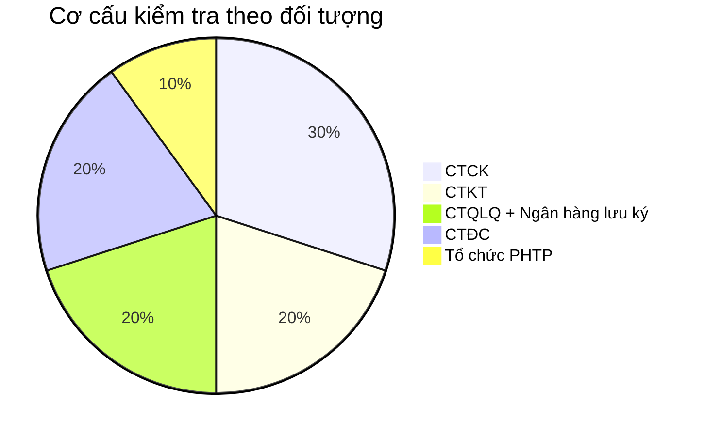
```mermaid
pie title Cơ cấu kiểm tra theo đối tượng
    "CTCK" : 30
    "CTKT" : 20
    "CTQLQ + Ngân hàng lưu ký" : 20
    "CTĐC" : 20
    "Tổ chức PHTP" : 10
```

**Source:** `Fact Inspection Case Activity` → `Calendar Date Dimension`, `Classification Dimension`

**Bảng KPI:**

| KPI ID | Tên KPI | Đơn vị | Tính chất | Công thức |
|---|---|---|---|---|
| K_TT_45 | Số cuộc KT đối tượng CTCK | Cuộc | Base | COUNT(DISTINCT Inspection_Case_Code) WHERE Inspection_Type_Code=`KIEM_TRA` AND Year=selected_year AND Subject_Category_Dimension_Id=[CTCK] |
| K_TT_46 | Tỷ lệ % CTCK (KT) | % | Derived | K_TT_45 / K_TT_24 × 100% |
| K_TT_47 | Số cuộc KT đối tượng CTKT | Cuộc | Base | COUNT(DISTINCT Inspection_Case_Code) WHERE Inspection_Type_Code=`KIEM_TRA` AND Year=selected_year AND Subject_Category_Dimension_Id=[TO_CHUC_KHAC] — *tạm thời gộp với NHLK/TO_CHUC_PHTP, xem O_TT_4* |
| K_TT_48 | Tỷ lệ % CTKT (KT) | % | Derived | K_TT_47 / K_TT_24 × 100% |
| K_TT_49 | Số cuộc KT đối tượng CTQLQ | Cuộc | Base | COUNT(DISTINCT Inspection_Case_Code) WHERE Inspection_Type_Code=`KIEM_TRA` AND Year=selected_year AND Subject_Category_Dimension_Id=[CTQLQ] |
| K_TT_49b | Số cuộc KT đối tượng NHLK/TO_CHUC_PHTP | Cuộc | Base | *PENDING — chờ O_TT_4: Silver chưa phân biệt được* |
| K_TT_50 | Tỷ lệ % TO_CHUC_KHAC (KT) | % | Derived | K_TT_47 / K_TT_24 × 100% — *tạm thời dùng TO_CHUC_KHAC gộp* |
| K_TT_51 | Số cuộc KT đối tượng CTĐC | Cuộc | Base | COUNT(DISTINCT Inspection_Case_Code) WHERE Inspection_Type_Code=`KIEM_TRA` AND Year=selected_year AND Subject_Category_Dimension_Id=[CTDC] |
| K_TT_52 | Tỷ lệ % CTĐC (KT) | % | Derived | K_TT_51 / K_TT_24 × 100% |
| K_TT_53 | Số cuộc KT đối tượng Tổ chức PHTP | Cuộc | Base | *PENDING — chờ O_TT_4: Silver chưa phân biệt được* |
| K_TT_54 | Tỷ lệ % Tổ chức PHTP (KT) | % | Derived | *PENDING — chờ O_TT_4* |

**Bảng grain:** reuse `Fact Inspection Case Activity` — filter `Inspection_Type_Code=KIEM_TRA`, GROUP BY Subject_Category_Dimension_Id join Classification Dimension ở query time.

---

#### Nhóm 10 — Danh sách vụ việc Kiểm tra (STT 10)

> Phân loại: **Tác nghiệp**
> Silver: `Inspection Case` ← ThanhTra.TT_HO_SO — **READY**
> Silver: `Inspection Decision` ← ThanhTra.TT_QUYET_DINH — **READY**
> Ghi chú: Reuse `Inspection Case List` — filter `Inspection_Type_Code=KIEM_TRA` ở query time. Cột "Loại hình" chỉ có 2 giá trị: `ĐỊNH KỲ` / `ĐỘT XUẤT` (ETL-derived từ `TT_QUYET_DINH.KE_HOACH_ID`).

**Mockup:**

| Mã vụ việc | Đối tượng | Phân loại đối tượng | Loại hình | Trạng thái |
|---|---|---|---|---|
| EXM-2024-001 | Công ty Chứng khoán VPS | CTCK | Định kỳ | Đã kết luận |
| EXM-2024-002 | Công ty CP Đầu tư ABC | CTĐC | Đột xuất | Đang thực hiện |
| EXM-2024-003 | Nguyễn Văn A | Cá nhân | Định kỳ | Tại thực địa |
| EXM-2024-004 | Quỹ Đầu tư XYZ | CTQLQ | Định kỳ | Đang thực hiện |
| EXM-2024-005 | Công ty Chứng khoán SSI | CTCK | Đột xuất | Đã kết luận |

**Schema bảng tác nghiệp:** reuse `Inspection Case List` — không tạo bảng mới.

**Lineage Mart → Báo cáo:**

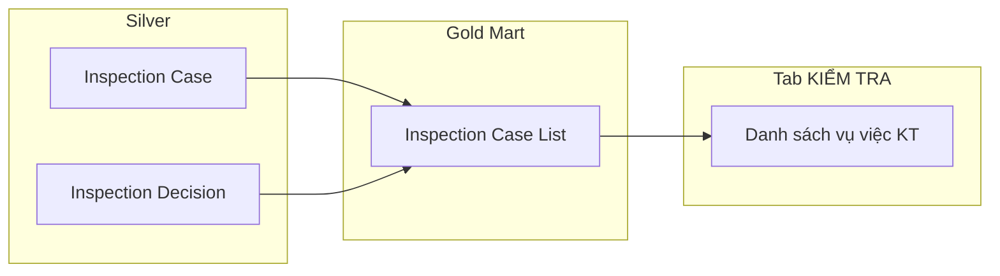
```mermaid
flowchart LR
    subgraph SIL["Silver"]
        SV1["Inspection Case"]
        SV2["Inspection Decision"]
    end
    subgraph GOLD["Gold Mart"]
        G1["Inspection Case List"]
    end
    subgraph RPT["Tab KIỂM TRA"]
        R1["Danh sách vụ việc KT"]
    end
    SV1 --> G1
    SV2 --> G1
    G1 --> R1
```

**Bảng grain:** reuse `Inspection Case List` — filter `Inspection_Type_Code=KIEM_TRA` ở query time.

---

### Tab: XỬ PHẠT

**Slicer chung:** Năm (NĂM 202X — góc trên phải dashboard)

> Ghi chú chung Tab XỬ PHẠT: Nguồn Silver khác hoàn toàn với Tab TT/KT — dùng `Surveillance Enforcement Decision` (`GS_VAN_BAN_XU_LY`) và `Surveillance Enforcement Case` (`GS_HO_SO`). Cần **Fact mới**: `Fact Penalty Decision`. Không reuse `Fact Inspection Case Activity`.

---

#### Nhóm 11 — KPI cards Thống kê chung Xử phạt (STT 11)

> Phân loại: **Phân tích**
> Silver: `Surveillance Enforcement Decision` ← ThanhTra.GS_VAN_BAN_XU_LY — **READY**
> Silver: `Surveillance Enforcement Case` ← ThanhTra.GS_HO_SO — **READY**
> Ghi chú: `Total_Penalty_Amount` ← `GS_VAN_BAN_XU_LY.TONG_SO_TIEN_PHAT` — measure tiền phạt. `Decision_Status_Code` ← `GS_VAN_BAN_XU_LY.TRANG_THAI`, scheme `TT_CASE_STATUS`.

**Mockup:**

| TỔNG SỐ QUYẾT ĐỊNH XỬ PHẠT ▲ 12% | TỔNG TIỀN XỬ PHẠT ▲ 18% |
|---|---|
| 5 Số quyết định | 1075 tỷ VNĐ |

**Source:** `Fact Penalty Decision` → `Calendar Date Dimension`

**Bảng KPI:**

| KPI ID | Tên KPI | Đơn vị | Tính chất | Công thức |
|---|---|---|---|---|
| K_TT_55 | Tổng số quyết định xử phạt | QĐ | Base | COUNT(DISTINCT Penalty_Decision_Code) WHERE Year=selected_year |
| K_TT_56 | Tổng số QĐXP SSCK (%) | % | Derived | (K_TT_55[Y] − K_TT_55[Y−1]) / K_TT_55[Y−1] × 100% |
| K_TT_57 | Tổng tiền xử phạt | Tỷ VNĐ | Base | SUM(Total_Penalty_Amount) / 1_000_000_000 WHERE Year=selected_year |
| K_TT_58 | Tổng tiền xử phạt SSCK (%) | % | Derived | (K_TT_57[Y] − K_TT_57[Y−1]) / K_TT_57[Y−1] × 100% |

**Star Schema:**

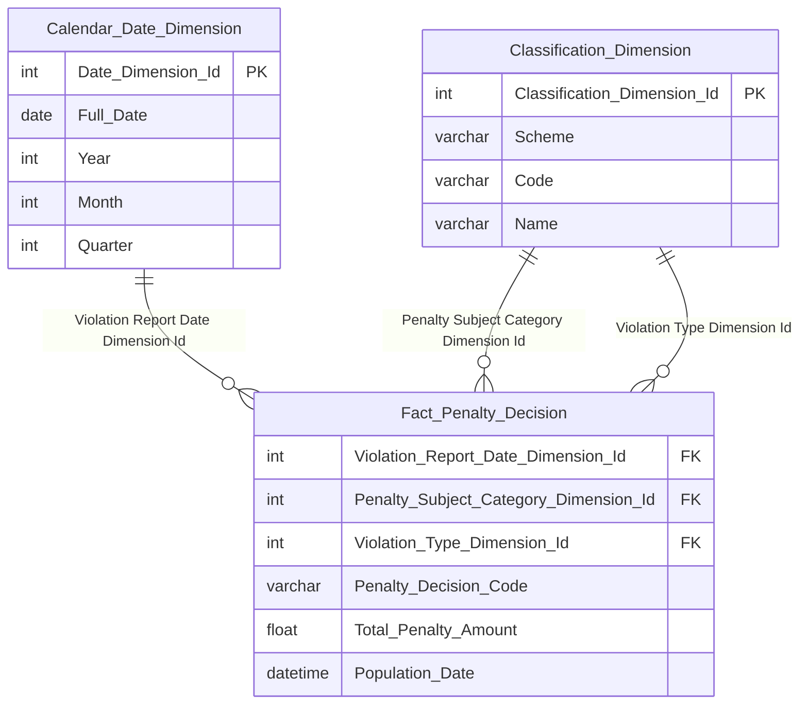
```mermaid
erDiagram
    Calendar_Date_Dimension ||--o{ Fact_Penalty_Decision : "Violation Report Date Dimension Id"
    Classification_Dimension ||--o{ Fact_Penalty_Decision : "Penalty Subject Category Dimension Id"
    Classification_Dimension ||--o{ Fact_Penalty_Decision : "Violation Type Dimension Id"
    Fact_Penalty_Decision {
        int Violation_Report_Date_Dimension_Id FK
        int Penalty_Subject_Category_Dimension_Id FK
        int Violation_Type_Dimension_Id FK
        varchar Penalty_Decision_Code
        float Total_Penalty_Amount
        datetime Population_Date
    }
    Calendar_Date_Dimension {
        int Date_Dimension_Id PK
        date Full_Date
        int Year
        int Month
        int Quarter
    }
    Classification_Dimension {
        int Classification_Dimension_Id PK
        varchar Scheme
        varchar Code
        varchar Name
    }
```

*Ghi chú erDiagram — các field trên Fact Penalty Decision:*

| Field | Silver source | Scheme / Giá trị | Ghi chú |
|---|---|---|---|
| `Penalty_Decision_Code` | `GS_VAN_BAN_XU_LY.ID` | — | DD — PK nguồn dùng làm degenerate key quyết định xử phạt trên Fact. Dùng `COUNT(DISTINCT Penalty_Decision_Code)` để đếm QĐ |
| `Violation_Type_Dimension_Id` | ETL: field Silver chưa xác định → lookup `Classification Dimension` (scheme `TT_VIOLATION_TYPE`) | scheme: `TT_VIOLATION_TYPE` | FK → Classification Dimension — dùng chung scheme với Tab TT/KT. Xem O_TT_8 |
| `Total_Penalty_Amount` | `GS_VAN_BAN_XU_LY.TONG_SO_TIEN_PHAT` | — | Measure — tổng tiền phạt (VNĐ). Presentation layer chia /1_000_000_000 → tỷ VNĐ hoặc /1_000_000 → triệu VNĐ |
| `Penalty_Subject_Category_Dimension_Id` | ETL-derived từ `GS_HO_SO` | scheme: `TT_PENALTY_SUBJECT_CATEGORY` | FK → Classification Dimension — 4 giá trị: TO_CHUC_KHAC / CTKT / GIAO_DICH_NDT / CA_NHAN (xem O_TT_9) |

**Lineage Mart → Báo cáo:**

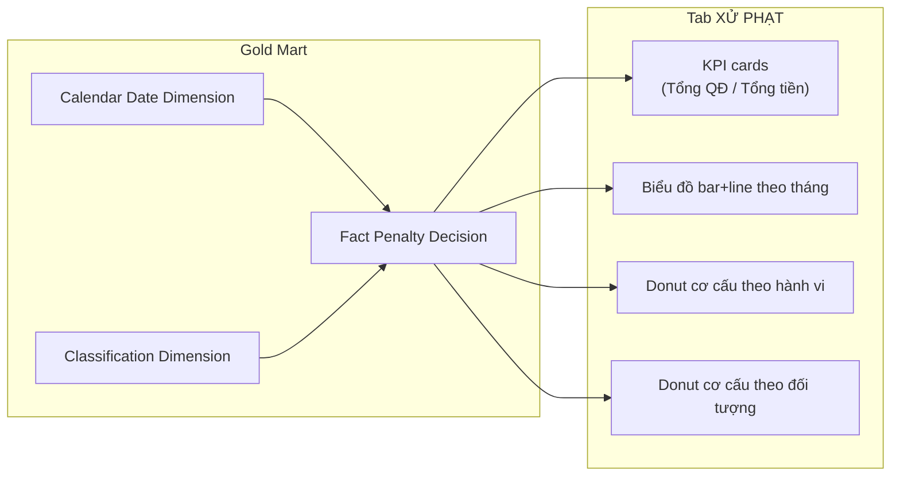
```mermaid
flowchart LR
    subgraph GOLD["Gold Mart"]
        G1["Fact Penalty Decision"]
        G2["Calendar Date Dimension"]
        G3["Classification Dimension"]
    end
    subgraph RPT["Tab XỬ PHẠT"]
        R1["KPI cards\n(Tổng QĐ / Tổng tiền)"]
        R2["Biểu đồ bar+line theo tháng"]
        R3["Donut cơ cấu theo hành vi"]
        R4["Donut cơ cấu theo đối tượng"]
    end
    G2 --> G1
    G3 --> G1
    G1 --> R1
    G1 --> R2
    G1 --> R3
    G1 --> R4
```

**Bảng grain:**

| Tên bảng | Grain | Date key | Filter mặc định | Ghi chú |
|---|---|---|---|---|
| Fact Penalty Decision | 1 quyết định xử phạt — mỗi row = 1 `GS_VAN_BAN_XU_LY` | `Violation_Report_Date_Dimension_Id` ← `GS_VAN_BAN_XU_LY.NGAY_BIEN_BAN` join Calendar Date Dimension | Year=selected_year | 1 hồ sơ `GS_HO_SO` có thể có nhiều QĐ — grain tự nhiên là per QĐ, không fanout |

---

#### Nhóm 12 — Biểu đồ thống kê xử phạt theo tháng (STT 12)

> Phân loại: **Phân tích**
> Silver: `Surveillance Enforcement Decision` ← ThanhTra.GS_VAN_BAN_XU_LY — **READY**
> Ghi chú: Dual axis — bar = số QĐ, line = tổng tiền phạt. Reuse `Fact Penalty Decision` — GROUP BY tháng ở presentation layer.

**Mockup:**

| Tháng | T1 | T2 | ... | T12 |
|---|---|---|---|---|
| Số QĐ xử phạt (bar) | 8 | 10 | ... | 40 |
| Tổng tiền phạt — tỷ VNĐ (line) | 200 | 350 | ... | 11000 |

**Source:** `Fact Penalty Decision` → `Calendar Date Dimension`

**Bảng KPI:**

| KPI ID | Tên KPI | Đơn vị | Tính chất | Công thức |
|---|---|---|---|---|
| K_TT_59 | Số QĐ xử phạt theo tháng | QĐ | Base | COUNT(DISTINCT Penalty_Decision_Code) WHERE Year=selected_year GROUP BY Calendar_Date_Dimension.Month |
| K_TT_60 | Tổng tiền xử phạt theo tháng | Tỷ VNĐ | Base | SUM(Total_Penalty_Amount) / 1_000_000_000 WHERE Year=selected_year GROUP BY Month |

**Bảng grain:** reuse `Fact Penalty Decision` — GROUP BY Month ở query time.

---

#### Nhóm 13 — Cơ cấu xử phạt theo loại hành vi (STT 13)

> Phân loại: **Phân tích**
> Silver: `Surveillance Enforcement Decision` ← ThanhTra.GS_VAN_BAN_XU_LY — **READY**
> Ghi chú: `Violation_Type_Dimension_Id` FK → `Classification Dimension` (scheme `TT_VIOLATION_TYPE`) — dùng chung scheme với Tab TT/KT. BA STT 13 định nghĩa **11 hành vi**: CBTT / Hoạt động chào bán / Cổ đông nội bộ+lớn / Giao dịch / CTĐC / CTCK / Tổ chức PHTP / Thao túng / Cho mượn / Tổ chức kiểm toán / Sở giao dịch. Xem O_TT_8 về field nguồn trong Silver.

**Mockup:**

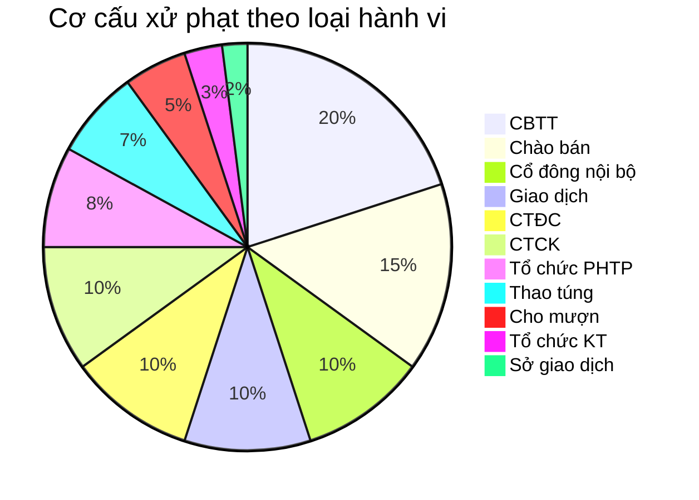
```mermaid
pie title Cơ cấu xử phạt theo loại hành vi
    "CBTT" : 20
    "Chào bán" : 15
    "Cổ đông nội bộ" : 10
    "Giao dịch" : 10
    "CTĐC" : 10
    "CTCK" : 10
    "Tổ chức PHTP" : 8
    "Thao túng" : 7
    "Cho mượn" : 5
    "Tổ chức KT" : 3
    "Sở giao dịch" : 2
```

**Source:** `Fact Penalty Decision` → `Calendar Date Dimension`, `Classification Dimension`

**Bảng KPI:**

| KPI ID | Tên KPI | Đơn vị | Tính chất | Công thức |
|---|---|---|---|---|
| K_TT_61 | Số QĐ XP hành vi CBTT | QĐ | Base | COUNT(DISTINCT Penalty_Decision_Code) WHERE Year=selected_year AND Violation_Type_Dimension_Id=[CBTT] |
| K_TT_62 | Tỷ lệ % CBTT (XP) | % | Derived | K_TT_61 / K_TT_55 × 100% |
| K_TT_63 | Số QĐ XP Hoạt động chào bán | QĐ | Base | COUNT(DISTINCT Penalty_Decision_Code) WHERE Year=selected_year AND Violation_Type_Dimension_Id=[CHAO_BAN] |
| K_TT_64 | Tỷ lệ % Chào bán (XP) | % | Derived | K_TT_63 / K_TT_55 × 100% |
| K_TT_65 | Số QĐ XP Cổ đông nội bộ/lớn | QĐ | Base | COUNT(DISTINCT Penalty_Decision_Code) WHERE Year=selected_year AND Violation_Type_Dimension_Id=[CO_DONG_NOI_BO] |
| K_TT_66 | Tỷ lệ % Cổ đông nội bộ/lớn (XP) | % | Derived | K_TT_65 / K_TT_55 × 100% |
| K_TT_67 | Số QĐ XP Giao dịch | QĐ | Base | COUNT(DISTINCT Penalty_Decision_Code) WHERE Year=selected_year AND Violation_Type_Dimension_Id=[GIAO_DICH] |
| K_TT_68 | Tỷ lệ % Giao dịch (XP) | % | Derived | K_TT_67 / K_TT_55 × 100% |
| K_TT_69 | Số QĐ XP CTĐC | QĐ | Base | COUNT(DISTINCT Penalty_Decision_Code) WHERE Year=selected_year AND Violation_Type_Dimension_Id=[CTDC_VI_PHAM] |
| K_TT_70 | Tỷ lệ % CTĐC (XP) | % | Derived | K_TT_69 / K_TT_55 × 100% |
| K_TT_71 | Số QĐ XP CTCK | QĐ | Base | COUNT(DISTINCT Penalty_Decision_Code) WHERE Year=selected_year AND Violation_Type_Dimension_Id=[CTCK] |
| K_TT_72 | Tỷ lệ % CTCK (XP) | % | Derived | K_TT_71 / K_TT_55 × 100% |
| K_TT_72b | Số QĐ XP Tổ chức PHTP | QĐ | Base | COUNT(DISTINCT Penalty_Decision_Code) WHERE Year=selected_year AND Violation_Type_Dimension_Id=[TO_CHUC_PHTP_VI_PHAM] |
| K_TT_72c | Tỷ lệ % Tổ chức PHTP (XP) | % | Derived | K_TT_72b / K_TT_55 × 100% |
| K_TT_72d | Số QĐ XP Thao túng | QĐ | Base | COUNT(DISTINCT Penalty_Decision_Code) WHERE Year=selected_year AND Violation_Type_Dimension_Id=[THAO_TUNG] |
| K_TT_72e | Tỷ lệ % Thao túng (XP) | % | Derived | K_TT_72d / K_TT_55 × 100% |
| K_TT_72f | Số QĐ XP Cho mượn tài khoản | QĐ | Base | COUNT(DISTINCT Penalty_Decision_Code) WHERE Year=selected_year AND Violation_Type_Dimension_Id=[CHO_MUON] |
| K_TT_72g | Tỷ lệ % Cho mượn (XP) | % | Derived | K_TT_72f / K_TT_55 × 100% |
| K_TT_72h | Số QĐ XP Tổ chức kiểm toán | QĐ | Base | COUNT(DISTINCT Penalty_Decision_Code) WHERE Year=selected_year AND Violation_Type_Dimension_Id=[TO_CHUC_KIEM_TOAN] |
| K_TT_72i | Tỷ lệ % Tổ chức kiểm toán (XP) | % | Derived | K_TT_72h / K_TT_55 × 100% |
| K_TT_72j | Số QĐ XP Sở giao dịch | QĐ | Base | COUNT(DISTINCT Penalty_Decision_Code) WHERE Year=selected_year AND Violation_Type_Dimension_Id=[SO_GIAO_DICH] |
| K_TT_72k | Tỷ lệ % Sở giao dịch (XP) | % | Derived | K_TT_72j / K_TT_55 × 100% |

**Bảng grain:** reuse `Fact Penalty Decision` — GROUP BY Violation_Type_Dimension_Id join Classification Dimension ở query time.

---

#### Nhóm 14 — Cơ cấu xử phạt theo đối tượng (STT 14)

> Phân loại: **Phân tích**
> Silver: `Surveillance Enforcement Case` ← ThanhTra.GS_HO_SO — **READY**
> Ghi chú: `Penalty_Subject_Category_Dimension_Id` FK → Classification Dimension (scheme `TT_PENALTY_SUBJECT_CATEGORY`). BA STT 14 định nghĩa 4 nhóm đối tượng theo thứ tự: Tổ chức khác / CTKT / Giao dịch NĐT / Cá nhân. Xem O_TT_9 về field nguồn phân loại đối tượng trong `GS_HO_SO`.

**Mockup:**

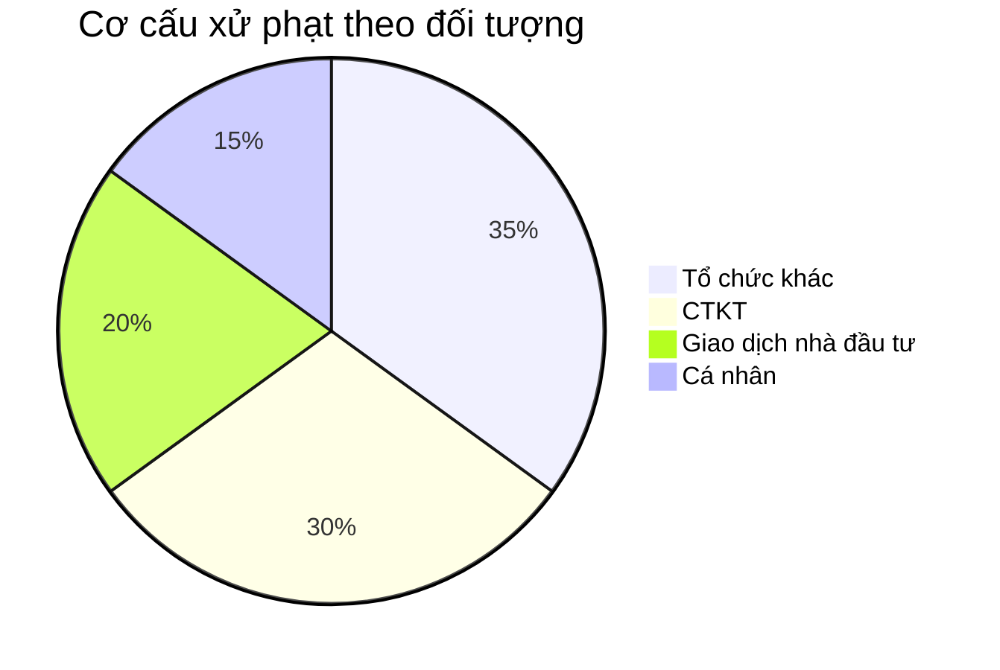
```mermaid
pie title Cơ cấu xử phạt theo đối tượng
    "Tổ chức khác" : 35
    "CTKT" : 30
    "Giao dịch nhà đầu tư" : 20
    "Cá nhân" : 15
```

**Source:** `Fact Penalty Decision` → `Calendar Date Dimension`, `Classification Dimension`

**Bảng KPI:**

| KPI ID | Tên KPI | Đơn vị | Tính chất | Công thức |
|---|---|---|---|---|
| K_TT_73 | Số QĐ XP đối tượng Tổ chức khác | QĐ | Base | COUNT(DISTINCT Penalty_Decision_Code) WHERE Year=selected_year AND Penalty_Subject_Category_Dimension_Id=[TO_CHUC_KHAC] (TT_PENALTY_SUBJECT_CATEGORY) |
| K_TT_74 | Tỷ lệ % Tổ chức khác (XP) | % | Derived | K_TT_73 / K_TT_55 × 100% |
| K_TT_75 | Số QĐ XP đối tượng CTKT | QĐ | Base | COUNT(DISTINCT Penalty_Decision_Code) WHERE Year=selected_year AND Penalty_Subject_Category_Dimension_Id=[CTKT] |
| K_TT_76 | Tỷ lệ % CTKT (XP) | % | Derived | K_TT_75 / K_TT_55 × 100% |
| K_TT_77 | Số QĐ XP đối tượng Giao dịch nhà đầu tư | QĐ | Base | COUNT(DISTINCT Penalty_Decision_Code) WHERE Year=selected_year AND Penalty_Subject_Category_Dimension_Id=[GIAO_DICH_NDT] |
| K_TT_78 | Tỷ lệ % Giao dịch NĐT (XP) | % | Derived | K_TT_77 / K_TT_55 × 100% |
| K_TT_79 | Số QĐ XP đối tượng Cá nhân | QĐ | Base | COUNT(DISTINCT Penalty_Decision_Code) WHERE Year=selected_year AND Penalty_Subject_Category_Dimension_Id=[CA_NHAN] |
| K_TT_80 | Tỷ lệ % Cá nhân (XP) | % | Derived | K_TT_79 / K_TT_55 × 100% |

**Bảng grain:** reuse `Fact Penalty Decision` — GROUP BY Penalty_Subject_Category_Dimension_Id join Classification Dimension ở query time.

---

#### Nhóm 15 — Danh sách quyết định xử phạt (STT 15)

> Phân loại: **Tác nghiệp**
> Silver: `Surveillance Enforcement Decision` ← ThanhTra.GS_VAN_BAN_XU_LY — **READY**
> Silver: `Surveillance Enforcement Case` ← ThanhTra.GS_HO_SO — **READY**
> Ghi chú:
> - Cột **"Mã vụ việc"** ← `GS_VAN_BAN_XU_LY.SO_QD_XU_PHAT` (`Penalty_Decision_Number`)
> - Cột **"Phân loại đối tượng"** ← ETL-derived `Penalty_Subject_Category_Code` (xem O_TT_9)
> - Cột **"Đối tượng"** ← `GS_HO_SO.TEN_DOI_TUONG` (`Subject_Name` — denormalized)
> - Cột **"Loại hình"** ← `Violation_Type_Code` (lookup từ `Violation_Type_Dimension_Id` → `Classification Dimension`, scheme `TT_VIOLATION_TYPE`, xem O_TT_8) — **không phải** Định kỳ/Đột xuất
> - Cột **"Trạng thái"** ← `GS_VAN_BAN_XU_LY.TRANG_THAI` (`Decision_Status_Code`, scheme `TT_CASE_STATUS`)

**Mockup:**

| Mã vụ việc | Phân loại đối tượng | Đối tượng | Loại hình | Trạng thái |
|---|---|---|---|---|
| QD-2024-001 | Cá nhân | Nguyễn Văn A | Thao túng nội gián | Đã hoàn thành |
| QD-2024-002 | CTCK | Công ty Chứng khoán X | CBTT | Đã hoàn thành |
| QD-2024-003 | CTĐC | Tập đoàn Bất động sản Y | Vi phạm hoạt động chào bán | Đã hoàn thành |
| QD-2024-004 | CTQLQ | Công ty Quản lý Quỹ Z | Vi phạm hoạt động của công ty QLQ | Đã hoàn thành |
| QD-2024-005 | Tổ chức khác | CTCP Thương mại M | Vi phạm đăng ký CTĐC | Đã hoàn thành |

**Schema bảng tác nghiệp:**

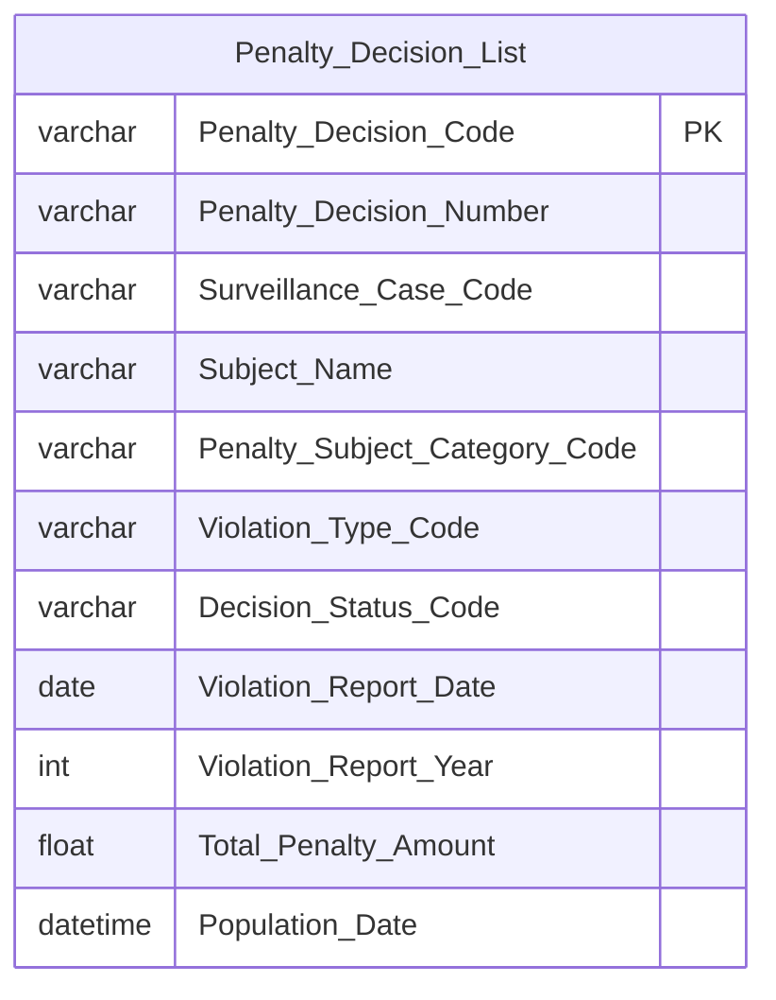
```mermaid
erDiagram
    Penalty_Decision_List {
        varchar Penalty_Decision_Code PK
        varchar Penalty_Decision_Number
        varchar Surveillance_Case_Code
        varchar Subject_Name
        varchar Penalty_Subject_Category_Code
        varchar Violation_Type_Code
        varchar Decision_Status_Code
        date Violation_Report_Date
        int Violation_Report_Year
        float Total_Penalty_Amount
        datetime Population_Date
    }
```

**Lineage Mart → Báo cáo:**

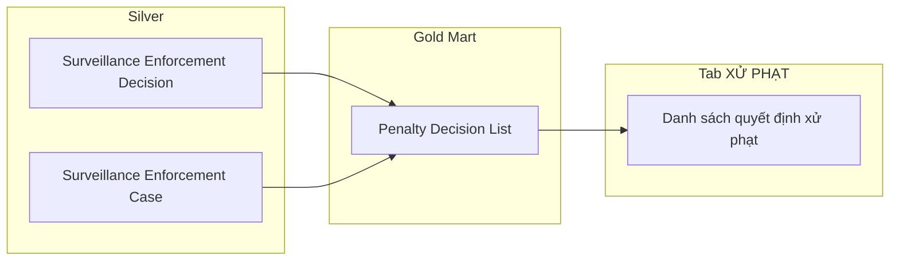
```mermaid
flowchart LR
    subgraph SIL["Silver"]
        SV1["Surveillance Enforcement Decision"]
        SV2["Surveillance Enforcement Case"]
    end
    subgraph GOLD["Gold Mart"]
        G1["Penalty Decision List"]
    end
    subgraph RPT["Tab XỬ PHẠT"]
        R1["Danh sách quyết định xử phạt"]
    end
    SV1 --> G1
    SV2 --> G1
    G1 --> R1
```

**Bảng grain:**

| Tên bảng | Grain | Nguồn chính | Filter mặc định | Ghi chú |
|---|---|---|---|---|
| Penalty Decision List | 1 quyết định xử phạt — mỗi row = 1 `GS_VAN_BAN_XU_LY` (latest state) | `Surveillance Enforcement Decision` + `Surveillance Enforcement Case` | Year=selected_year | Phân trang ở presentation layer |

---

### Tab: ĐƠN THƯ

**Slicer chung:** Năm (NĂM 202X — góc trên phải dashboard)

> Ghi chú chung Tab ĐƠN THƯ: Nguồn Silver `Complaint Petition` (`DT_DON_THU`). Toàn bộ KPI aggregate (tổng/tháng/loại) và danh sách đều serve từ `Complaint Petition List` — không tạo Fact riêng vì grain giống hệt, volume nhỏ, không fanout.

---

#### Nhóm 16 — KPI card Tổng số đơn đã xử lý (STT 16)

> Phân loại: **Tác nghiệp** (bảng tác nghiệp phục vụ cả KPI aggregate và danh sách)
> Silver: `Complaint Petition` ← ThanhTra.DT_DON_THU — **READY**
> Ghi chú:
> - `Petition_Status_Code` ← `DT_DON_THU.TRANG_THAI`, scheme `TT_PETITION_STATUS` (MOI / DANG_XU_LY / HOAN_THANH / DONG)
> - `Petition_Type_Code` ← `DT_DON_THU.LOAI_DON`, scheme `TT_PETITION_TYPE` — 3 giá trị Gold: KHIEU_NAI / TO_CAO / PHAN_ANH_KIEN_NGHI
> - `Submission_Date` ← `DT_DON_THU.NGAY_TIEP_NHAN` — dùng `YEAR()` / `MONTH()` ở query time

**Mockup:**

| TỔNG SỐ ĐƠN ĐÃ XỬ LÝ ▲ 12% |
|---|
| 286 Đơn thư |

**Source:** `Complaint Petition List`

**Bảng KPI:**

| KPI ID | Tên KPI | Đơn vị | Tính chất | Công thức |
|---|---|---|---|---|
| K_TT_81 | Tổng số đơn đã xử lý | Đơn | Base | COUNT(DISTINCT Complaint_Petition_Code) WHERE Petition_Status_Code=`HOAN_THANH` AND YEAR(Submission_Date)=selected_year |
| K_TT_82 | Tổng đơn đã xử lý SSCK (%) | % | Derived | (K_TT_81[Y] − K_TT_81[Y−1]) / K_TT_81[Y−1] × 100% |

**Lineage Mart → Báo cáo:**

```mermaid
flowchart LR
    subgraph SIL["Silver"]
        SV1["Complaint Petition"]
    end
    subgraph GOLD["Gold Mart"]
        G1["Complaint Petition List"]
    end
    subgraph RPT["Tab ĐƠN THƯ"]
        R1["KPI card Tổng đơn đã xử lý"]
        R2["Biểu đồ tình hình xử lý"]
        R3["Biểu đồ cơ cấu theo loại đơn"]
    end
    SV1 --> G1
    G1 --> R1
    G1 --> R2
    G1 --> R3
```

**Bảng grain:**

| Tên bảng | Grain | Nguồn chính | Filter mặc định | Ghi chú |
|---|---|---|---|---|
| Complaint Petition List | 1 đơn thư — mỗi row = 1 `DT_DON_THU` (latest state) | `Complaint Petition` | YEAR(Submission_Date)=selected_year | Serve cả KPI aggregate lẫn danh sách chi tiết |
---

#### Nhóm 17 — Biểu đồ Thống kê tình hình xử lý đơn thư (STT 17)

> Phân loại: **Phân tích**
> Silver: `Complaint Petition` ← ThanhTra.DT_DON_THU — **READY**
> Ghi chú: Biểu đồ bar 1 series — số đơn đã xử lý theo tháng. Reuse `Complaint Petition List` — GROUP BY MONTH(Submission_Date) ở query time. BA STT 17 chỉ định nghĩa 1 KPI: "Số lượng đơn thư đã xử lý".

**Mockup:**

| Tháng | T1 | T2 | ... | T12 |
|---|---|---|---|---|
| Số đơn đã xử lý (bar) | 9 | 11 | ... | 35 |

**Source:** `Complaint Petition List`

**Bảng KPI:**

| KPI ID | Tên KPI | Đơn vị | Tính chất | Công thức |
|---|---|---|---|---|
| K_TT_83 | Số đơn đã xử lý theo tháng | Đơn | Base | COUNT(DISTINCT Complaint_Petition_Code) WHERE Petition_Status_Code=`HOAN_THANH` AND YEAR(Submission_Date)=selected_year GROUP BY MONTH(Submission_Date) |

**Bảng grain:** reuse `Complaint Petition List` — GROUP BY MONTH(Submission_Date) ở query time.

---

#### Nhóm 18 — Biểu đồ Cơ cấu theo loại đơn thư (STT 18)

> Phân loại: **Phân tích**
> Silver: `Complaint Petition` ← ThanhTra.DT_DON_THU — **READY**
> Ghi chú: Biểu đồ bar grouped — 3 series theo tháng: Khiếu nại / Tố cáo / Phản ánh kiến nghị. `Petition_Type_Code` ← `DT_DON_THU.LOAI_DON`, scheme `TT_PETITION_TYPE`. *Lưu ý: BA STT 18 đặt tên block là "Biểu đồ cơ cấu theo đối tượng" nhưng KPI thực tế (Rows 132–137) là phân loại theo loại đơn (Khiếu nại/Tố cáo/Phản ánh kiến nghị) — thiết kế theo nội dung KPI, không theo tên block.* ETL map PHAN_ANH và KIEN_NGHI từ Silver → 1 giá trị `PHAN_ANH_KIEN_NGHI` trên Gold (O_TT_10 Closed).

**Mockup:**

| Tháng | T1 | T2 | ... | T12 |
|---|---|---|---|---|
| Khiếu nại (xanh dương) | 5 | 7 | ... | 20 |
| Tố cáo (cam) | 2 | 2 | ... | 8 |
| Phản ánh kiến nghị (tím) | 2 | 2 | ... | 7 |

**Source:** `Complaint Petition List`

**Bảng KPI:**

| KPI ID | Tên KPI | Đơn vị | Tính chất | Công thức |
|---|---|---|---|---|
| K_TT_86 | Số đơn Khiếu nại đã xử lý theo tháng | Đơn | Base | COUNT(DISTINCT Complaint_Petition_Code) WHERE Petition_Type_Code=`KHIEU_NAI` AND Petition_Status_Code=`HOAN_THANH` AND YEAR(Submission_Date)=selected_year GROUP BY MONTH(Submission_Date) |
| K_TT_86b | Tỷ lệ % Khiếu nại | % | Derived | K_TT_86[Month=M] / K_TT_83[Month=M] × 100% |
| K_TT_87 | Số đơn Tố cáo đã xử lý theo tháng | Đơn | Base | COUNT(DISTINCT Complaint_Petition_Code) WHERE Petition_Type_Code=`TO_CAO` AND Petition_Status_Code=`HOAN_THANH` AND YEAR(Submission_Date)=selected_year GROUP BY MONTH(Submission_Date) |
| K_TT_87b | Tỷ lệ % Tố cáo | % | Derived | K_TT_87[Month=M] / K_TT_83[Month=M] × 100% |
| K_TT_88 | Số đơn Phản ánh kiến nghị đã xử lý theo tháng | Đơn | Base | COUNT(DISTINCT Complaint_Petition_Code) WHERE Petition_Type_Code=`PHAN_ANH_KIEN_NGHI` AND Petition_Status_Code=`HOAN_THANH` AND YEAR(Submission_Date)=selected_year GROUP BY MONTH(Submission_Date) |
| K_TT_88b | Tỷ lệ % Phản ánh kiến nghị | % | Derived | K_TT_88[Month=M] / K_TT_83[Month=M] × 100% |

**Bảng grain:** reuse `Complaint Petition List` — GROUP BY MONTH(Submission_Date) + Petition_Type_Code ở query time.

---

#### Nhóm 19 — Danh sách đơn thư chi tiết (STT 19)

> Phân loại: **Tác nghiệp**
> Silver: `Complaint Petition` ← ThanhTra.DT_DON_THU — **READY**
> Ghi chú:
> - Cột **"Mã đơn"** ← `DT_DON_THU.ID` (`Complaint_Petition_Code`)
> - Cột **"Loại đơn"** ← `DT_DON_THU.LOAI_DON` (`Petition_Type_Code`, scheme `TT_PETITION_TYPE`)
> - Cột **"Đối tượng"** ← `DT_DON_THU.TEN_TO_CHUC_CA_NHAN` (`Complaint Petition.Complainant_Name` — snapshot tại thời điểm tiếp nhận)
> - Cột **"Trạng thái"** ← `DT_DON_THU.TRANG_THAI` (`Petition_Status_Code`, scheme `TT_PETITION_STATUS`)

**Mockup:**

| Mã đơn | Loại đơn | Đối tượng | Trạng thái |
|---|---|---|---|
| DT-2024-001 | Khiếu nại | Công ty A | Đã hoàn thành |
| DT-2024-002 | Tố cáo | Ông Nguyễn Văn B | Đã hoàn thành |
| DT-2024-003 | Phản ánh kiến nghị | Bà Lê Thị C | Đã hoàn thành |
| DT-2024-004 | Khiếu nại | Quỹ X | Đã hoàn thành |
| DT-2024-005 | Tố cáo | Công ty Y | Đã hoàn thành |

**Schema bảng tác nghiệp:**

```mermaid
erDiagram
    Complaint_Petition_List {
        varchar Complaint_Petition_Code PK
        varchar Petition_Type_Code
        varchar Complainant_Name
        varchar Petition_Status_Code
        date Submission_Date
        int Submission_Year
        datetime Population_Date
    }
```

**Lineage Mart → Báo cáo:**

```mermaid
flowchart LR
    subgraph SIL["Silver"]
        SV1["Complaint Petition"]
    end
    subgraph GOLD["Gold Mart"]
        G1["Complaint Petition List"]
    end
    subgraph RPT["Tab ĐƠN THƯ"]
        R1["Danh sách đơn thư chi tiết"]
    end
    SV1 --> G1
    G1 --> R1
```

**Bảng grain:**

| Tên bảng | Grain | Nguồn chính | Filter mặc định | Ghi chú |
|---|---|---|---|---|
| Complaint Petition List | 1 đơn thư — mỗi row = 1 `DT_DON_THU` (latest state) | `Complaint Petition` (DT_DON_THU) | Year=selected_year | Phân trang ở presentation layer |

---

### Báo cáo: Hoạt động vi phạm trên TTCK (STT 20)

**Slicer chung:** Năm (tương tự các tab dashboard)

> Ghi chú chung: Báo cáo dạng bảng pivot — 6 nhóm đối tượng vi phạm × breakdown theo loại vi phạm × 2 measure (số lượng + số tiền). Reuse `Fact Penalty Decision` — GROUP BY `Penalty_Subject_Category_Dimension_Id` × `Violation_Type_Dimension_Id`. Xem O_TT_8, O_TT_9 về field nguồn trong Silver.

---

#### Nhóm 20 — Bảng báo cáo hoạt động vi phạm TTCK (STT 20)

> Phân loại: **Phân tích**
> Silver: `Surveillance Enforcement Decision` ← ThanhTra.GS_VAN_BAN_XU_LY — **READY**
> Silver: `Surveillance Enforcement Case` ← ThanhTra.GS_HO_SO — **READY**
> Ghi chú: BA STT 20 định nghĩa 6 nhóm đối tượng (CTĐC+CBCK / CTCK / CTQLQ / CĐ nội bộ / Giao dịch thao túng+nội bộ / CBCK / Vi phạm khác) nhưng mỗi nhóm có "Độ chi tiết: Loại vi phạm". Phân tích BA: các nhóm này thực chất là phân nhóm theo **loại hành vi vi phạm** của đối tượng bị xử phạt (không phải Subject_Category của Fact). ETL cần phân biệt qua kết hợp `Penalty_Subject_Category_Dimension_Id` × `Violation_Type_Dimension_Id`. Phụ thuộc O_TT_8, O_TT_9.

**Mockup:**

| Loại hình xử lý | Số lượng vi phạm | Số tiền xử phạt (triệu đồng) |
|---|---|---|
| **Vi phạm của CTĐC, tổ chức CBCK** | | |
| — Hành vi CBTT | N | X |
| — Hành vi Chào bán | N | X |
| — ... | ... | ... |
| **Vi phạm của CTCK** | | |
| **Vi phạm của CTQLQ** | | |
| **Vi phạm của CĐ lớn, CĐ nội bộ** | | |
| **Vi phạm giao dịch thao túng, giao dịch nội bộ** | | |
| **Vi phạm về CBCK** | | |
| **Vi phạm khác** | | |

**Source:** `Fact Penalty Decision` → `Calendar Date Dimension`, `Classification Dimension`

**Bảng KPI:**

| KPI ID | Tên KPI | Đơn vị | Tính chất | Công thức |
|---|---|---|---|---|
| K_TT_89 | Số lượng vi phạm — CTĐC/CBCK | QĐ | Base | COUNT(DISTINCT Penalty_Decision_Code) WHERE Year=selected_year AND Penalty_Subject_Category IN (`CTDC`, `CBCK`) GROUP BY Violation_Type_Dimension_Id — xem O_TT_9 |
| K_TT_90 | Số tiền xử phạt — CTĐC/CBCK | Triệu VNĐ | Base | SUM(Total_Penalty_Amount) / 1_000_000 WHERE Year=selected_year AND Penalty_Subject_Category IN (`CTDC`, `CBCK`) GROUP BY Violation_Type_Dimension_Id — xem O_TT_9 |
| K_TT_91 | Số lượng vi phạm — CTCK | QĐ | Base | COUNT(DISTINCT Penalty_Decision_Code) WHERE Year=selected_year AND Penalty_Subject_Category_Dimension_Id=[CTCK] GROUP BY Violation_Type_Dimension_Id — xem O_TT_9 |
| K_TT_92 | Số tiền xử phạt — CTCK | Triệu VNĐ | Base | SUM(Total_Penalty_Amount) / 1_000_000 WHERE Year=selected_year AND Penalty_Subject_Category_Dimension_Id=[CTCK] GROUP BY Violation_Type_Dimension_Id |
| K_TT_93 | Số lượng vi phạm — CTQLQ | QĐ | Base | COUNT(DISTINCT Penalty_Decision_Code) WHERE Year=selected_year AND Penalty_Subject_Category_Dimension_Id=[CTQLQ] GROUP BY Violation_Type_Dimension_Id — xem O_TT_9 |
| K_TT_94 | Số tiền xử phạt — CTQLQ | Triệu VNĐ | Base | SUM(Total_Penalty_Amount) / 1_000_000 WHERE Year=selected_year AND Penalty_Subject_Category_Dimension_Id=[CTQLQ] GROUP BY Violation_Type_Dimension_Id |
| K_TT_95 | Số lượng vi phạm — CĐ lớn/nội bộ | QĐ | Base | COUNT(DISTINCT Penalty_Decision_Code) WHERE Year=selected_year AND Penalty_Subject_Category_Dimension_Id=[CA_NHAN] AND Violation_Type_Dimension_Id IN [CO_DONG_NOI_BO, GIAO_DICH] GROUP BY Violation_Type_Dimension_Id — xem O_TT_8, O_TT_9 |
| K_TT_96 | Số tiền xử phạt — CĐ lớn/nội bộ | Triệu VNĐ | Base | SUM(Total_Penalty_Amount) / 1_000_000 WHERE Year=selected_year AND Penalty_Subject_Category_Dimension_Id=[CA_NHAN] AND Violation_Type_Dimension_Id IN [CO_DONG_NOI_BO, GIAO_DICH] GROUP BY Violation_Type_Dimension_Id |
| K_TT_97 | Số lượng vi phạm — Giao dịch thao túng/nội bộ | QĐ | Base | COUNT(DISTINCT Penalty_Decision_Code) WHERE Year=selected_year AND Violation_Type_Dimension_Id IN [THAO_TUNG, GIAO_DICH] GROUP BY Violation_Type_Dimension_Id — xem O_TT_8 |
| K_TT_98 | Số tiền xử phạt — Giao dịch thao túng/nội bộ | Triệu VNĐ | Base | SUM(Total_Penalty_Amount) / 1_000_000 WHERE Year=selected_year AND Violation_Type_Dimension_Id IN [THAO_TUNG, GIAO_DICH] GROUP BY Violation_Type_Dimension_Id |
| K_TT_99 | Số lượng vi phạm — CBCK | QĐ | Base | COUNT(DISTINCT Penalty_Decision_Code) WHERE Year=selected_year AND Violation_Type_Dimension_Id=[CBTT] GROUP BY Violation_Type_Dimension_Id — xem O_TT_8 |
| K_TT_100 | Số tiền xử phạt — CBCK | Triệu VNĐ | Base | SUM(Total_Penalty_Amount) / 1_000_000 WHERE Year=selected_year AND Violation_Type_Dimension_Id=[CBTT] GROUP BY Violation_Type_Dimension_Id |

*Ghi chú K_TT_89–100: BA STT 20 phân nhóm theo đối tượng bị xử phạt × loại hành vi vi phạm. Các giá trị `Penalty_Subject_Category` và `Violation_Type_Code` phụ thuộc giải quyết O_TT_8 và O_TT_9 — hiện dùng giá trị tạm thời. Nhóm "Vi phạm khác" chưa có KPI ID vì chờ BA xác nhận mapping scheme.*

**Lineage Mart → Báo cáo:**

```mermaid
flowchart LR
    subgraph GOLD["Gold Mart"]
        G1["Fact Penalty Decision"]
        G2["Calendar Date Dimension"]
        G3["Classification Dimension"]
    end
    subgraph RPT["Báo cáo vi phạm TTCK"]
        R1["Bảng pivot: Nhóm đối tượng × Loại vi phạm × Số lượng + Số tiền"]
    end
    G2 --> G1
    G3 --> G1
    G1 --> R1
```

**Bảng grain:**

| Tên bảng | Grain | Date key | Filter mặc định | Ghi chú |
|---|---|---|---|---|
| Fact Penalty Decision | reuse — 1 QĐ xử phạt | `Violation_Report_Date_Dimension_Id` | Year=selected_year | GROUP BY Penalty_Subject_Category_Dimension_Id × Violation_Type_Dimension_Id ở presentation layer — tạo bảng pivot |

---

## Section 3 — Mô hình tổng thể (READY only)

```mermaid
graph TB
    classDef dim fill:#E6F1FB,stroke:#185FA5,color:#0C447C
    classDef fact fill:#FAECE7,stroke:#993C1D,color:#4A1B0C
    classDef oper fill:#E8F5E9,stroke:#2E7D32,color:#1B5E20

    DIM_DATE["Calendar Date Dimension"]:::dim
    DIM_CLASS["Classification Dimension"]:::dim
    FACT_INSP["Fact Inspection Case Activity"]:::fact
    FACT_PEN["Fact Penalty Decision"]:::fact
    OPR_LIST["Inspection Case List"]:::oper
    OPR_PEN["Penalty Decision List"]:::oper
    OPR_COMP["Complaint Petition List"]:::oper

    DIM_DATE --> FACT_INSP
    DIM_CLASS --> FACT_INSP
    DIM_CLASS --> FACT_INSP
    DIM_DATE --> FACT_PEN
    DIM_CLASS --> FACT_PEN
    DIM_CLASS --> FACT_PEN
```

**Bảng Phân tích (Star Schema):**

| Bảng | Pattern | Grain | KPI | Trạng thái |
|---|---|---|---|---|
| Fact Inspection Case Activity | Event | 1 hồ sơ × 1 đối tượng (`TT_HO_SO` × `TT_QUYET_DINH_DOI_TUONG`) — composite key: `Inspection_Case_Code` + `Inspection_Decision_Subject_Code`. Đếm số hồ sơ dùng `COUNT(DISTINCT Inspection_Case_Code)`. Date key: Received Date (xem O_TT_3) | K_TT_1–23 (TT) + K_TT_24–44k (KT, bao gồm sub-KPI và K_TT_49b PENDING) | READY |
| Fact Penalty Decision | Event | 1 quyết định xử phạt (`GS_VAN_BAN_XU_LY`). Date key: Violation Report Date | K_TT_55–80 (XP dashboard, bao gồm sub-KPI K_TT_72b–72k) + K_TT_89–100 (Báo cáo STT 20) | READY — xem O_TT_8, O_TT_9 |

**Bảng Tác nghiệp (Denormalized):**

| Bảng | Grain | KPI | Trạng thái |
|---|---|---|---|
| Inspection Case List | 1 hồ sơ TT/KT (TT_HO_SO) — latest state | Nhóm 5 (TT), Nhóm 10 (KT) | READY |
| Penalty Decision List | 1 quyết định xử phạt (GS_VAN_BAN_XU_LY) — latest state | Nhóm 15 (XP) | READY |
| Complaint Petition List | 1 đơn thư (DT_DON_THU) — latest state. Serve cả KPI aggregate (Nhóm 16–18) lẫn danh sách chi tiết (Nhóm 19) | Nhóm 16–19 (ĐT), K_TT_81–88b | READY |

**Bảng Dimension:**

| Dimension | Loại | Mô tả | Trạng thái |
|---|---|---|---|
| Calendar Date Dimension | Conformed | Lịch ngày — năm/quý/tháng | READY |
| Classification Dimension | Conformed | Danh mục phân loại — phục vụ 3 scheme trên 2 Fact: (1) scheme `TT_SUBJECT_CATEGORY` (**6 giá trị tạm thời**: CTCK/CTDC/CTQLQ/CA_NHAN/TO_CHUC_KHAC — xem O_TT_4); (2) scheme `TT_PENALTY_SUBJECT_CATEGORY` (4 giá trị Tab XP — xem O_TT_9); (3) scheme `TT_VIOLATION_TYPE` (11 giá trị — dùng chung TT/KT/XP — xem O_TT_8). Mọi query JOIN Classification Dimension phải kèm filter `WHERE Scheme='...'` đúng với FK tương ứng | READY |

---

## Section 4 — Vấn đề mở

| ID | Vấn đề | Giả định hiện tại | KPI liên quan | Trạng thái |
|---|---|---|---|---|
| O_TT_1 | `Violation_Type_Code` — 1 hồ sơ có thể có nhiều kết luận (sơ bộ/chính thức/bổ sung). | ETL lấy kết luận có `MAX(Conclusion_Sequence_Number)` per hồ sơ — grain Fact không fanout. | K_TT_10–15 | **Closed** |
| O_TT_2 | "Số ngày trễ" — BA không có KPI này. | Out of scope — đã loại khỏi thiết kế. | — | **Closed (Out of scope)** |
| O_TT_3 | Trục thời gian biểu đồ bar: dùng `Received Date` (`TT_HO_SO.NGAY_NHAN_HO_SO`) hay `Issue Date` (`TT_QUYET_DINH.NGAY_RA_QUYET_DINH`)? | Tạm thời giữ `Received Date` từ `Inspection Case` làm date key. Chờ BA xác nhận. | K_TT_7–9 | Open |
| O_TT_4 | `Subject_Category_Code` ETL-derived từ polymorphic FK `TT_QUYET_DINH_DOI_TUONG.DOI_TUONG_REF_ID`. ETL dùng `Source_System_Code` để nhận biết bảng nguồn: `ThanhTra_DM_CONG_TY_CK` → CTCK, `ThanhTra_DM_CONG_TY_QLQ` → CTQLQ, `ThanhTra_DM_CONG_TY_DC` → CTDC. Với `ThanhTra_DM_DOI_TUONG_KHAC`: `LOAI_DOI_TUONG=CA_NHAN` → CA_NHAN, `LOAI_DOI_TUONG=TO_CHUC` → **không thể phân biệt CTKT/NHLK/TO_CHUC_PHTP** vì Silver `DM_DOI_TUONG_KHAC` không có field `Organization_Type_Code`. | Tạm thời gộp tất cả `TO_CHUC` từ `DM_DOI_TUONG_KHAC` thành `TO_CHUC_KHAC` (6 giá trị scheme). Chờ khảo sát dữ liệu nguồn và trao đổi BA để bổ sung logic phân biệt chi tiết. | K_TT_16–23 (TT), K_TT_45–54 (KT) | Open |
| O_TT_5 | `TT_QUYET_DINH_DOI_TUONG` quan hệ 1:N với `TT_QUYET_DINH` — 1 hồ sơ có thể có nhiều đối tượng thanh tra gây fanout grain Fact. | **Phương án B:** đổi grain Fact thành 1 row per hồ sơ × đối tượng. Composite key: `Inspection_Case_Code` + `Inspection_Decision_Subject_Code`. Mọi KPI đếm hồ sơ dùng `COUNT(DISTINCT Inspection_Case_Code)`. | K_TT_1–23 | **Closed** |
| O_TT_6 | Tab KIỂM TRA — cột "Loại hình" trong danh sách có xuất hiện giá trị `KIỂM TRA` bên cạnh ĐỊNH KỲ / ĐỘT XUẤT. | Xác nhận: chỉ có 2 giá trị ĐỊNH KỲ / ĐỘT XUẤT. Giá trị "KIỂM TRA" trong screenshot là dữ liệu mẫu sai — không phải giá trị nghiệp vụ. Mockup đã sửa. | Nhóm 10 | **Closed** |
| O_TT_7 | Scheme `TT_SUBJECT_CATEGORY` — Tab KIỂM TRA screenshot hiển thị 5 nhóm riêng biệt (CTCK/CTKT/CTQLQ+NHLK/CTĐC/TO_CHUC_PHTP) nhưng Silver `DM_DOI_TUONG_KHAC` không có field phân biệt CTKT/NHLK/TO_CHUC_PHTP. Tạm thời gộp thành `TO_CHUC_KHAC`. | Chờ kết quả khảo sát O_TT_4. Nếu nguồn có thể phân biệt → tách scheme thành 7+ giá trị và cập nhật K_TT_47, K_TT_49b, K_TT_53. | K_TT_45–54 | **Reopen** — phụ thuộc O_TT_4 |
| O_TT_8 | Tab XỬ PHẠT — `Violation_Type_Code` (hành vi vi phạm) cần thiết cho cột "Loại hình" trong danh sách và donut cơ cấu theo hành vi. Silver `Surveillance Enforcement Decision` (`GS_VAN_BAN_XU_LY`) không có field này rõ ràng — `Penalty_Content` là text tự do. Silver `Surveillance Enforcement Case` (`GS_HO_SO`) cũng không có field hành vi vi phạm có thể map về scheme. Source Analysis xác nhận `DM_HANH_VI_VI_PHAM` dùng ở B.2.2 nhưng chưa tìm thấy field FK tương ứng trong Silver `GS_HO_SO` hay `GS_VAN_BAN_XU_LY`. | Cần xác nhận field nguồn trong `GS_VAN_BAN_XU_LY` hoặc `GS_HO_SO` lưu mã hành vi vi phạm. Nếu có → reuse scheme `TT_VIOLATION_TYPE`. Nếu không → PENDING. Tạm thời để `Violation_Type_Code` PENDING trên `Fact Penalty Decision`. | K_TT_61–72k, K_TT_89–100, Nhóm 15 | Open |
| O_TT_9 | Tab XỬ PHẠT — `Penalty_Subject_Category_Code` (phân loại đối tượng: CTKT/Cá nhân/Giao dịch NĐT/Tổ chức khác) cần thiết cho donut và danh sách. Silver `GS_HO_SO.TEN_DOI_TUONG` là text tự do — không có polymorphic FK như `TT_QUYET_DINH_DOI_TUONG`. Không rõ ETL resolve phân loại đối tượng từ field nào trong `GS_HO_SO`. | Cần BA/nghiệp vụ xác nhận field phân loại đối tượng trong `GS_HO_SO` hoặc bảng liên kết khác. Scheme `TT_PENALTY_SUBJECT_CATEGORY` tạm thời có 4 giá trị từ BA STT 14: TO_CHUC_KHAC / CTKT / GIAO_DICH_NDT / CA_NHAN. | K_TT_73–80, K_TT_89–96, Nhóm 15 | Open |
| O_TT_10 | Tab ĐƠN THƯ — Silver `TT_PETITION_TYPE` có 4 giá trị: KHIEU_NAI / TO_CAO / PHAN_ANH / KIEN_NGHI. Dashboard gộp PHAN_ANH và KIEN_NGHI thành 1 legend "Phản ánh kiến nghị". | **Closed:** Mart lưu 1 giá trị gộp `PHAN_ANH_KIEN_NGHI` theo BA. ETL map cả PHAN_ANH và KIEN_NGHI từ Silver → `PHAN_ANH_KIEN_NGHI` trên Gold. K_TT_88 đã cập nhật. | K_TT_88, Nhóm 19 | **Closed** |