# NHNCK — Gold Layer Relationship Diagram (Star Schema)

> **Phiên bản:** Thiết kế Datamart tầng Gold cho phân hệ Người hành nghề chứng khoán
>
> **Source layer:** Silver — Securities Practitioner domain
>
> **Mô hình:** Dimensional Modeling (Star Schema) — 6 Dimension + 8 Fact
>
> **Domain prefix:** `SP` (Securities Practitioner)
>
> **Render:** Mở file này trong VS Code với extension **Markdown Preview Mermaid Support**, hoặc dán từng block vào [mermaid.live](https://mermaid.live).
>
> **Ký hiệu:**
> - `──►` (mũi tên liền): quan hệ FK (Fact → Dimension)
> - 🔵 Xanh dương nhạt: Dimension table
> - 🟢 Xanh lá: Fact table
> - Mỗi Fact là trung tâm của 1 star, JOIN sang Dimension qua `<SUBJECT>_DIM_ID`

---

## Đầu vào — Tổng hợp yêu cầu từ BA (file BA_analyst_NHNCK.csv)

> **Nguồn dữ liệu:** NHNCK (Phân hệ Quản lý giám sát người hành nghề chứng khoán)
>
> **Tổng số KPI/Attribute:** 87 chỉ tiêu (80 Chỉ tiêu cơ sở + 2 Chỉ tiêu phái sinh + 2 Chiều lọc + 3 header nhóm)
>
> **Nhóm yêu cầu:** 9 Dashboard + 1 Data Explorer

---

### Dashboard 1 — Tổng quan NHNCK toàn thị trường

> **Mô tả:** Dashboard tổng hợp toàn cảnh về người hành nghề chứng khoán trên toàn thị trường. Bao gồm 5 nhóm chart/widget, sử dụng 3 bảng Fact khác nhau theo grain.

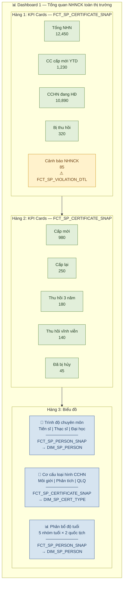

#### Widget 1a: Các chỉ tiêu tổng hợp thông tin chung (10 KPI)
- **Fact:** `FCT_SP_CERTIFICATE_SNAP` (9 KPI) + `FCT_SP_VIOLATION_DTL` (1 KPI)
- **Dimension:** `DIM_SP_PERSON`, `DIM_SP_CERT_TYPE`, `DIM_SP_VIOLATION_TYPE`
- **Dạng hiển thị:** KPI Cards (2 hàng × 5 cột)

| KPI | Fact | Rule |
|---|---|---|
| Tổng người hành nghề | FCT_SP_CERTIFICATE_SNAP | COUNT(DISTINCT PERSON_DIM_ID) WHERE CERTIFICATE_STATUS = 'Đang hoạt động' |
| Chứng chỉ cấp mới (YTD) | FCT_SP_CERTIFICATE_SNAP | COUNT(CERTIFICATE_NO) WHERE ISSUE_TYPE IN ('Cấp mới','Cấp lại') AND YEAR(ISSUE_DATE) = YEAR(DATA_DT) |
| Cấp mới | FCT_SP_CERTIFICATE_SNAP | COUNT(CERTIFICATE_NO) WHERE ISSUE_TYPE = 'Cấp mới' |
| Cấp lại | FCT_SP_CERTIFICATE_SNAP | COUNT(CERTIFICATE_NO) WHERE ISSUE_TYPE = 'Cấp lại' |
| Bị thu hồi | FCT_SP_CERTIFICATE_SNAP | COUNT(CERTIFICATE_NO) WHERE CERTIFICATE_STATUS IN ('Thu hồi 3 năm','Thu hồi vĩnh viễn') |
| CCHN đang hoạt động | FCT_SP_CERTIFICATE_SNAP | COUNT(CERTIFICATE_NO) WHERE CERTIFICATE_STATUS = 'Đang hoạt động' |
| Thu hồi trong 3 năm | FCT_SP_CERTIFICATE_SNAP | COUNT(CERTIFICATE_NO) WHERE CERTIFICATE_STATUS = 'Thu hồi 3 năm' |
| Thu hồi vĩnh viễn | FCT_SP_CERTIFICATE_SNAP | COUNT(CERTIFICATE_NO) WHERE CERTIFICATE_STATUS = 'Thu hồi vĩnh viễn' |
| Đã bị hủy | FCT_SP_CERTIFICATE_SNAP | COUNT(CERTIFICATE_NO) WHERE CERTIFICATE_STATUS = 'Bị hủy' |
| Cảnh báo NHNCK | FCT_SP_VIOLATION_DTL | COUNT(DISTINCT PERSON_DIM_ID) |

#### Widget 1b: Biểu đồ Trình độ chuyên môn (6 KPI)
- **Fact:** `FCT_SP_PERSON_SNAP`
- **Dimension:** `DIM_SP_PERSON`
- **Dạng hiển thị:** Biểu đồ Doughnut

| KPI | Rule |
|---|---|
| Số lượng Tiến sĩ | COUNT(PERSON_DIM_ID) JOIN DIM_SP_PERSON WHERE EDUCATION_LEVEL = 'Tiến sĩ' |
| Số lượng Thạc sĩ | COUNT(PERSON_DIM_ID) JOIN DIM_SP_PERSON WHERE EDUCATION_LEVEL = 'Thạc sĩ' |
| Số lượng Đại học | COUNT(PERSON_DIM_ID) JOIN DIM_SP_PERSON WHERE EDUCATION_LEVEL = 'Đại học' |
| Tỷ lệ Tiến sĩ (%) | COUNT(WHERE 'Tiến sĩ') / COUNT(ALL) * 100 |
| Tỷ lệ Thạc sĩ (%) | COUNT(WHERE 'Thạc sĩ') / COUNT(ALL) * 100 |
| Tỷ lệ Đại học (%) | COUNT(WHERE 'Đại học') / COUNT(ALL) * 100 |

#### Widget 1c: Biểu đồ Cơ cấu theo loại hình CCHN (3 KPI)
- **Fact:** `FCT_SP_CERTIFICATE_SNAP`
- **Dimension:** `DIM_SP_CERT_TYPE`
- **Dạng hiển thị:** Biểu đồ Doughnut

| KPI | Rule |
|---|---|
| Số lượng CCHN là Môi giới | COUNT(CERTIFICATE_NO) JOIN DIM_SP_CERT_TYPE WHERE CERT_TYPE_NAME = 'Môi giới' |
| Số lượng CCHN là Phân tích | COUNT(CERTIFICATE_NO) JOIN DIM_SP_CERT_TYPE WHERE CERT_TYPE_NAME = 'Phân tích' |
| Số lượng CCHN là QLQ | COUNT(CERTIFICATE_NO) JOIN DIM_SP_CERT_TYPE WHERE CERT_TYPE_NAME = 'Quản lý quỹ' |

#### Widget 1d: Biểu đồ Phân bổ độ tuổi (10 KPI)
- **Fact:** `FCT_SP_PERSON_SNAP`
- **Dimension:** `DIM_SP_PERSON`
- **Dạng hiển thị:** Biểu đồ Bar (grouped) — 5 nhóm tuổi × 2 quốc tịch

| KPI | Rule |
|---|---|
| Số lượng NHN 18–21 quốc tịch VN | COUNT(PERSON_DIM_ID) WHERE AGE_GROUP = '18-21' AND NATIONALITY = 'Việt Nam' |
| Số lượng NHN 22–30 quốc tịch VN | COUNT(PERSON_DIM_ID) WHERE AGE_GROUP = '22-30' AND NATIONALITY = 'Việt Nam' |
| Số lượng NHN 31–40 quốc tịch VN | COUNT(PERSON_DIM_ID) WHERE AGE_GROUP = '31-40' AND NATIONALITY = 'Việt Nam' |
| Số lượng NHN 41–50 quốc tịch VN | COUNT(PERSON_DIM_ID) WHERE AGE_GROUP = '41-50' AND NATIONALITY = 'Việt Nam' |
| Số lượng NHN 50+ quốc tịch VN | COUNT(PERSON_DIM_ID) WHERE AGE_GROUP = '50+' AND NATIONALITY = 'Việt Nam' |
| Số lượng NHN 18–21 quốc tịch nước ngoài | COUNT(PERSON_DIM_ID) WHERE AGE_GROUP = '18-21' AND NATIONALITY = 'Nước ngoài' |
| Số lượng NHN 22–30 quốc tịch nước ngoài | COUNT(PERSON_DIM_ID) WHERE AGE_GROUP = '22-30' AND NATIONALITY = 'Nước ngoài' |
| Số lượng NHN 31–40 quốc tịch nước ngoài | COUNT(PERSON_DIM_ID) WHERE AGE_GROUP = '31-40' AND NATIONALITY = 'Nước ngoài' |
| Số lượng NHN 41–50 quốc tịch nước ngoài | COUNT(PERSON_DIM_ID) WHERE AGE_GROUP = '41-50' AND NATIONALITY = 'Nước ngoài' |
| Số lượng NHN 50+ quốc tịch nước ngoài | COUNT(PERSON_DIM_ID) WHERE AGE_GROUP = '50+' AND NATIONALITY = 'Nước ngoài' |

---

### Dashboard 2 — Tra cứu hồ sơ 360 (8 KPI)

> **Mô tả:** Tra cứu thông tin cá nhân chi tiết của từng người hành nghề. Dạng Profile Card.

```mermaid
graph TB
    classDef profile fill:#D6E4F0,stroke:#2F5496,color:#1e3a5f
    classDef field fill:#E2EFDA,stroke:#548235,color:#1e3a1e

    subgraph DB2["👤 Dashboard 2 — Tra cứu hồ sơ 360"]
        direction TB
        subgraph HEADER["Profile Header"]
            H1["🟢 Đang hoạt động\n─────────\nHọ tên: Nguyễn Văn Thành\nMã NHN: NHN-20150234"]:::profile
        end
        subgraph DETAIL["Chi tiết — FCT_SP_PERSON_SNAP → DIM_SP_PERSON + DIM_SP_CERT_TYPE"]
            direction LR
            F1["Ngày sinh\n15/03/1985"]:::field
            F2["Tuổi\n41"]:::field
            F3["Quốc tịch\nViệt Nam"]:::field
            F4["Số định danh\n001085012345"]:::field
        end
        subgraph DETAIL2[""]
            direction LR
            F5["Nơi công tác\nCTCK ABC"]:::field
            F6["Loại CCHN\nMôi giới"]:::field
            F7["Trạng thái\nĐang hoạt động"]:::field
        end
        HEADER --> DETAIL --> DETAIL2
    end
```

- **Fact:** `FCT_SP_PERSON_SNAP`
- **Dimension:** `DIM_SP_PERSON`, `DIM_SP_CERT_TYPE`

| KPI | Column | Rule |
|---|---|---|
| Họ tên | PERSON_DIM_ID | Direct — JOIN DIM_SP_PERSON.PERSON_NAME |
| Ngày sinh | PERSON_DIM_ID | Direct — JOIN DIM_SP_PERSON.DATE_OF_BIRTH |
| Tuổi | PERSON_DIM_ID | Direct — JOIN DIM_SP_PERSON.AGE |
| Quốc tịch | PERSON_DIM_ID | Direct — JOIN DIM_SP_PERSON.NATIONALITY |
| Số định danh / Hộ chiếu | PERSON_DIM_ID | Direct — JOIN DIM_SP_PERSON.ID_NUMBER |
| Nơi công tác hiện tại | PERSON_DIM_ID | Direct — JOIN DIM_SP_PERSON.CURRENT_WORKPLACE |
| Loại CCHN | CERT_TYPE_DIM_ID | Direct — JOIN DIM_SP_CERT_TYPE.CERT_TYPE_NAME |
| Trạng thái NHNCK | PERSON_DIM_ID | Direct — JOIN DIM_SP_PERSON.PRACTITIONER_STATUS |

---

### Dashboard 3 — Mạng lưới của NHNCK (6 KPI)

> **Mô tả:** Hiển thị mạng lưới quan hệ NHN — DN niêm yết — người có liên quan. Dạng 2 bảng song song (Vai trò tại DN + Người liên quan).

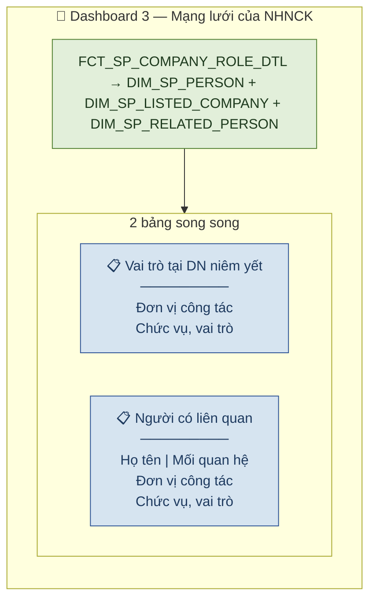

- **Fact:** `FCT_SP_COMPANY_ROLE_DTL`
- **Dimension:** `DIM_SP_PERSON`, `DIM_SP_LISTED_COMPANY`, `DIM_SP_RELATED_PERSON`

| KPI | Column | Rule |
|---|---|---|
| Đơn vị công tác | LISTED_COMPANY_DIM_ID | Direct — JOIN DIM_SP_LISTED_COMPANY.LISTED_COMPANY_NAME |
| Chức vụ, vai trò | ROLE_NAME | Direct |
| Họ tên người có liên quan | RELATED_PERSON_DIM_ID | Direct — JOIN DIM_SP_RELATED_PERSON.RELATED_PERSON_NAME |
| Mối quan hệ | RELATED_PERSON_DIM_ID | Direct — JOIN DIM_SP_RELATED_PERSON.RELATIONSHIP_TYPE |
| Đơn vị công tác của người liên quan | RELATED_PERSON_DIM_ID | Direct — JOIN DIM_SP_RELATED_PERSON.WORKPLACE |
| Chức vụ, vai trò của người liên quan | RELATED_PERSON_DIM_ID | Direct — JOIN DIM_SP_RELATED_PERSON.POSITION |

---

### Dashboard 4 — Hồ sơ & Danh mục của NHNCK (13 KPI)

> **Mô tả:** Thông tin chi tiết hồ sơ NHN gồm 3 widget: Vai trò DN, Mạng lưới người liên quan, Tài khoản & số dư. Sử dụng 2 bảng Fact khác nhau.

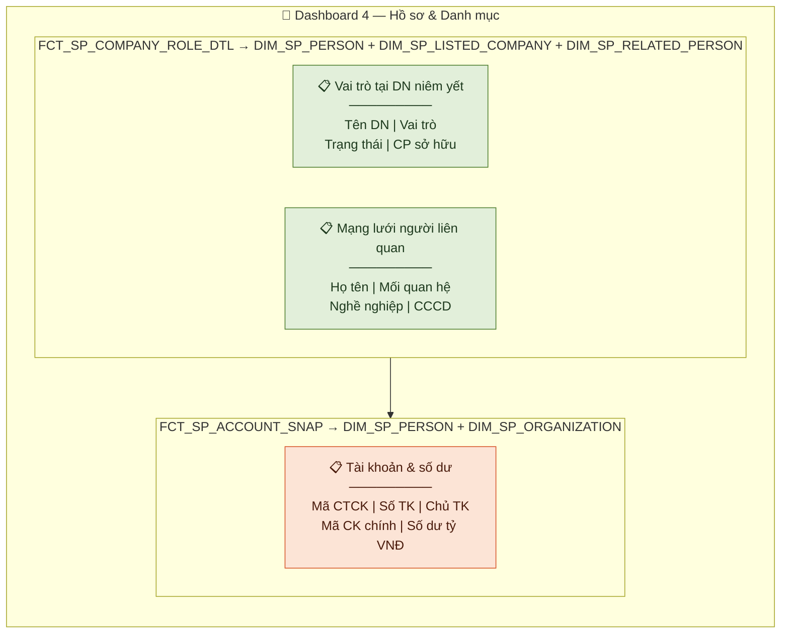

#### Widget 4a: Vai trò tại DN niêm yết + Mạng lưới người liên quan (8 KPI)
- **Fact:** `FCT_SP_COMPANY_ROLE_DTL`
- **Dimension:** `DIM_SP_PERSON`, `DIM_SP_LISTED_COMPANY`, `DIM_SP_RELATED_PERSON`
- **Dạng hiển thị:** Bảng danh sách

| KPI | Column | Rule |
|---|---|---|
| Tên DN niêm yết / UPCOM | LISTED_COMPANY_DIM_ID | Direct — JOIN DIM_SP_LISTED_COMPANY.LISTED_COMPANY_NAME |
| Vai trò | ROLE_NAME | Direct |
| Trạng thái | ROLE_STATUS | Direct |
| Số lượng cổ phiếu sở hữu | SHARES_QUANTITY | Direct |
| Họ và tên (người liên quan) | RELATED_PERSON_DIM_ID | Direct — JOIN DIM_SP_RELATED_PERSON.RELATED_PERSON_NAME |
| Mối quan hệ | RELATED_PERSON_DIM_ID | Direct — JOIN DIM_SP_RELATED_PERSON.RELATIONSHIP_TYPE |
| Nghề nghiệp | RELATED_PERSON_DIM_ID | Direct — JOIN DIM_SP_RELATED_PERSON.OCCUPATION |
| CCCD/CMND/HC | RELATED_PERSON_DIM_ID | Direct — JOIN DIM_SP_RELATED_PERSON.ID_NUMBER |

#### Widget 4b: Tài khoản & số dư (5 KPI)
- **Fact:** `FCT_SP_ACCOUNT_SNAP`
- **Dimension:** `DIM_SP_PERSON`, `DIM_SP_ORGANIZATION`
- **Dạng hiển thị:** Bảng danh sách

| KPI | Column | Rule |
|---|---|---|
| Mã CTCK | ORGANIZATION_DIM_ID | Direct — JOIN DIM_SP_ORGANIZATION.ORGANIZATION_SHORT_NAME |
| Số tài khoản | ACCOUNT_NO | Direct |
| Tên chủ tài khoản | ACCOUNT_HOLDER_NAME | Direct |
| Mã CK nắm giữ chính | TOP_SECURITIES_CODE | Direct |
| Số dư tài khoản (tỷ VNĐ) | ACCOUNT_BALANCE | Direct |

---

### Dashboard 5 — Quá trình hành nghề của NHNCK (5 KPI)

> **Mô tả:** Lịch sử quá trình công tác của NHN qua các tổ chức. Dạng bảng timeline.

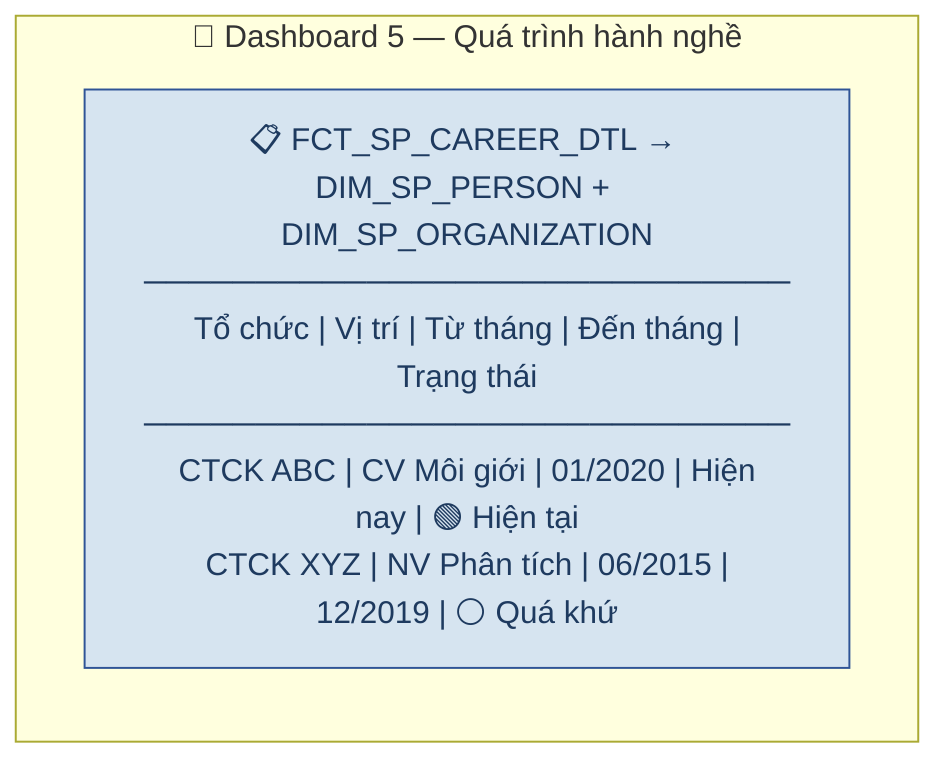

- **Fact:** `FCT_SP_CAREER_DTL`
- **Dimension:** `DIM_SP_PERSON`, `DIM_SP_ORGANIZATION`

| KPI | Column | Rule |
|---|---|---|
| Tổ chức | ORGANIZATION_DIM_ID | Direct — JOIN DIM_SP_ORGANIZATION.ORGANIZATION_NAME |
| Vị trí | POSITION | Direct |
| Từ tháng | START_DATE | Direct |
| Đến tháng | END_DATE | Direct |
| Trạng thái | CAREER_STATUS | Direct — Giá trị: Hiện tại / Quá khứ |

---

### Dashboard 6 — Lịch sử cấp chứng chỉ của NHNCK (6 KPI)

> **Mô tả:** Chi tiết các lần cấp, thu hồi, hủy chứng chỉ hành nghề. Dạng bảng chi tiết.

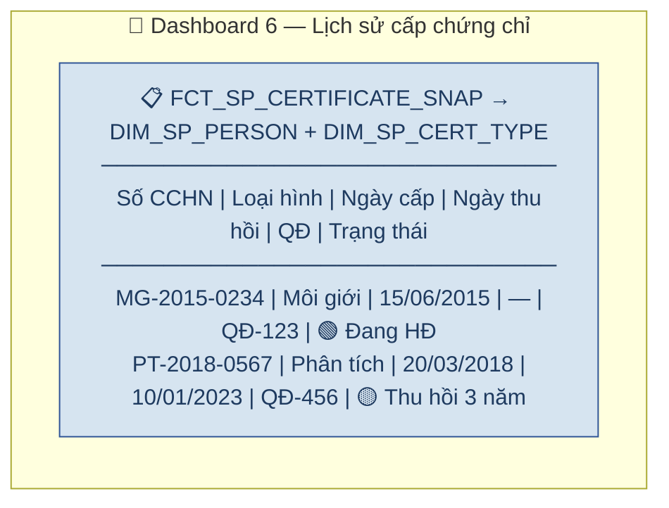

- **Fact:** `FCT_SP_CERTIFICATE_SNAP`
- **Dimension:** `DIM_SP_PERSON`, `DIM_SP_CERT_TYPE`

| KPI | Column | Rule |
|---|---|---|
| Số CCHN | CERTIFICATE_NO | Direct |
| Loại hình | CERT_TYPE_DIM_ID | Direct — JOIN DIM_SP_CERT_TYPE.CERT_TYPE_NAME |
| Ngày cấp | ISSUE_DATE | Direct |
| Ngày thu hồi | REVOKE_DATE | Direct |
| Quyết định | DECISION_NO | Direct |
| Trạng thái | CERTIFICATE_STATUS | Direct — Giá trị: Đang hoạt động / Thu hồi 3 năm / Thu hồi vĩnh viễn / Bị hủy |

---

### Dashboard 7 — Đợt thi sát hạch của NHNCK (5 KPI)

> **Mô tả:** Kết quả thi sát hạch của NHN qua các đợt. Dạng bảng kết quả.

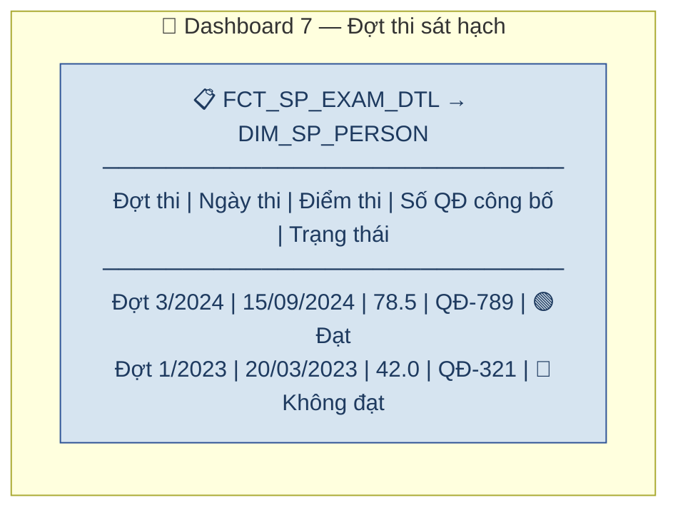

- **Fact:** `FCT_SP_EXAM_DTL`
- **Dimension:** `DIM_SP_PERSON`

| KPI | Column | Rule |
|---|---|---|
| Đợt thi | EXAM_SESSION | Direct |
| Ngày thi | EXAM_DATE | Direct |
| Điểm thi | EXAM_SCORE | Direct |
| Số quyết định công bố | ANNOUNCEMENT_DECISION_NO | Direct |
| Trạng thái | EXAM_STATUS | Direct — Giá trị: Đạt / Không đạt |

---

### Dashboard 8 — Cập nhật kiến thức của NHNCK (2 KPI)

> **Mô tả:** Theo dõi quá trình cập nhật kiến thức hàng năm. Dạng bảng. **Cả 2 KPI đều là chỉ tiêu phái sinh.**

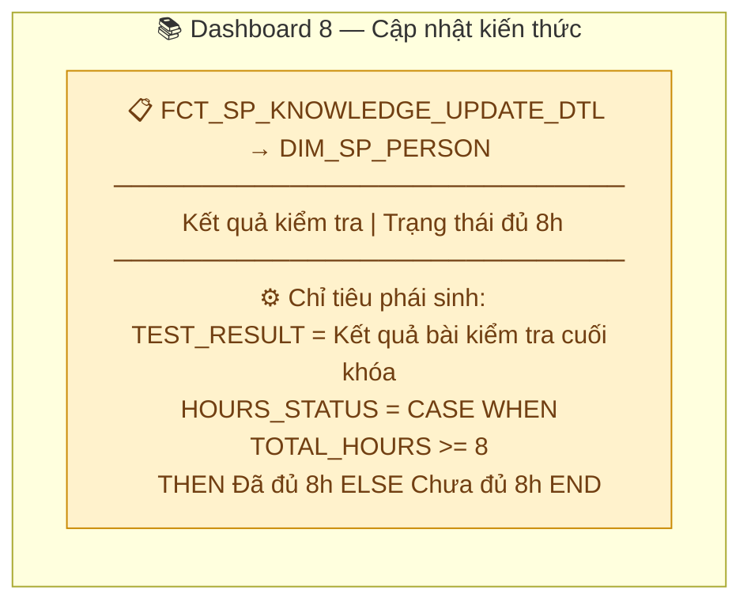

- **Fact:** `FCT_SP_KNOWLEDGE_UPDATE_DTL`
- **Dimension:** `DIM_SP_PERSON`

| KPI | Column | Rule | Phân loại |
|---|---|---|---|
| Kết quả kiểm tra, phân loại (nếu có) | TEST_RESULT | Direct — xác định theo kết quả bài kiểm tra cuối khóa | Chỉ tiêu phái sinh |
| Trạng thái đã đủ 8h hay chưa | HOURS_STATUS | CASE WHEN TOTAL_HOURS >= 8 THEN 'Đã đủ 8h' ELSE 'Chưa đủ 8h' END | Chỉ tiêu phái sinh |

---

### Dashboard 9 — Lịch sử vi phạm của NHNCK (5 KPI)

> **Mô tả:** Chi tiết các quyết định xử phạt vi phạm. Dạng bảng chi tiết.

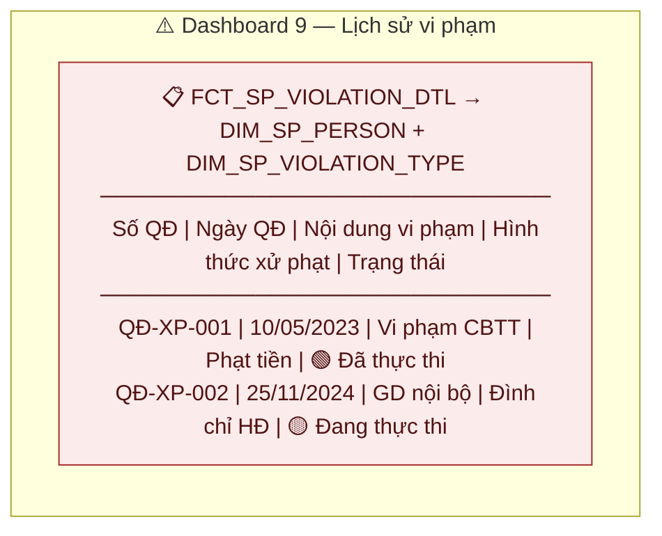

- **Fact:** `FCT_SP_VIOLATION_DTL`
- **Dimension:** `DIM_SP_PERSON`, `DIM_SP_VIOLATION_TYPE`

| KPI | Column | Rule |
|---|---|---|
| Số quyết định | DECISION_NO | Direct |
| Ngày quyết định | DECISION_DATE | Direct |
| Nội dung vi phạm | VIOLATION_CONTENT | Direct |
| Hình thức xử phạt | VIOLATION_TYPE_DIM_ID | Direct — JOIN DIM_SP_VIOLATION_TYPE.PENALTY_TYPE |
| Trạng thái | EXECUTION_STATUS | Direct — Giá trị: Chưa thực thi / Đã thực thi / Cưỡng chế thi hành / Đang thực thi / Đã hoàn thành / Đã ban hành |

---

### Data Explorer — Yêu cầu khai thác dữ liệu (6 KPI + 2 Filter)

> **Mô tả:** Khai thác dữ liệu NHN với bộ lọc động. Dạng bảng + dropdown filter.

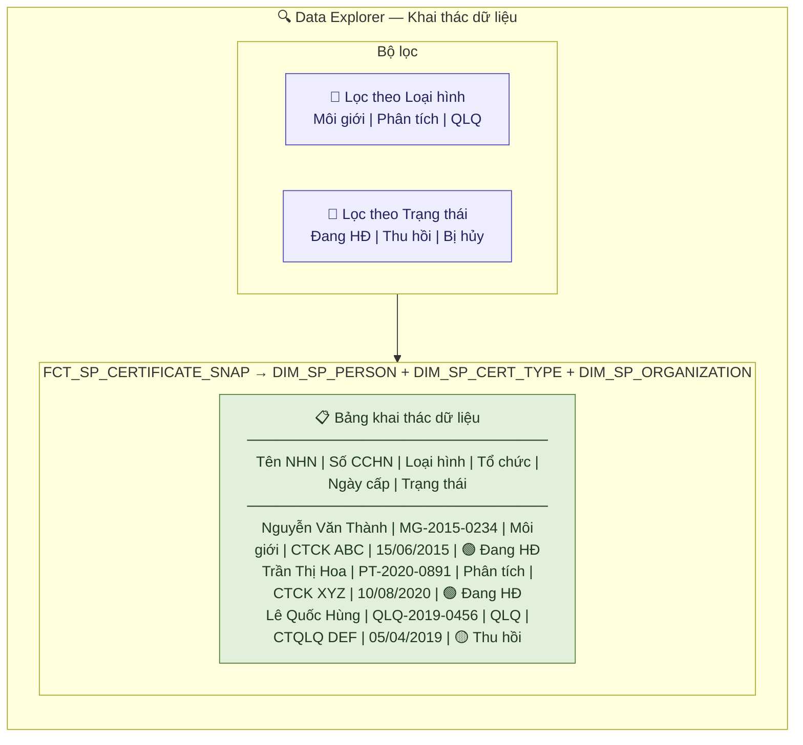

- **Fact:** `FCT_SP_CERTIFICATE_SNAP`
- **Dimension:** `DIM_SP_PERSON`, `DIM_SP_CERT_TYPE`, `DIM_SP_ORGANIZATION`

| KPI | Column | Rule |
|---|---|---|
| Tên NHN | PERSON_DIM_ID | Direct — JOIN DIM_SP_PERSON.PERSON_NAME |
| Số CCHN | CERTIFICATE_NO | Direct |
| Loại hình | CERT_TYPE_DIM_ID | Direct — JOIN DIM_SP_CERT_TYPE.CERT_TYPE_NAME |
| Tổ chức | PERSON_DIM_ID | Direct — JOIN DIM_SP_PERSON.CURRENT_WORKPLACE |
| Ngày cấp | ISSUE_DATE | Direct |
| Trạng thái | CERTIFICATE_STATUS | Direct |

| Điều kiện lọc | Column | Rule |
|---|---|---|
| Lọc theo Loại hình | CERT_TYPE_DIM_ID | Filter — JOIN DIM_SP_CERT_TYPE.CERT_TYPE_NAME |
| Lọc theo Trạng thái | CERTIFICATE_STATUS | Filter |

---

## Tổng quan Star Schema — Toàn bộ phân hệ NHNCK

```mermaid
graph TB
    classDef dim fill:#D6E4F0,stroke:#2F5496,color:#1e3a5f
    classDef fct fill:#E2EFDA,stroke:#548235,color:#1e3a1e

    DIM_PERSON["🔵 DIM_SP_PERSON\nPerson Dimension\n─────────\nPERSON_DIM_ID (PK)\nPERSON_CODE\nPERSON_NAME\nDATE_OF_BIRTH\nAGE | GENDER\nNATIONALITY\nID_NUMBER\nEDUCATION_LEVEL\nCURRENT_WORKPLACE\nPRACTITIONER_STATUS\nEFF_DT | END_DT"]:::dim

    DIM_ORG["🔵 DIM_SP_ORGANIZATION\nOrganization Dimension\n─────────\nORGANIZATION_DIM_ID (PK)\nORGANIZATION_CODE\nORGANIZATION_NAME\nORGANIZATION_TYPE\nORGANIZATION_SHORT_NAME\nEFF_DT | END_DT"]:::dim

    DIM_CERT["🔵 DIM_SP_CERT_TYPE\nCertificate Type Dimension\n─────────\nCERT_TYPE_DIM_ID (PK)\nCERT_TYPE_CODE\nCERT_TYPE_NAME\nEFF_DT | END_DT"]:::dim

    DIM_COMPANY["🔵 DIM_SP_LISTED_COMPANY\nListed Company Dimension\n─────────\nLISTED_COMPANY_DIM_ID (PK)\nLISTED_COMPANY_CODE\nLISTED_COMPANY_NAME\nLISTING_TYPE\nEFF_DT | END_DT"]:::dim

    DIM_RELATED["🔵 DIM_SP_RELATED_PERSON\nRelated Person Dimension\n─────────\nRELATED_PERSON_DIM_ID (PK)\nRELATED_PERSON_CODE\nRELATED_PERSON_NAME\nRELATIONSHIP_TYPE\nOCCUPATION | ID_NUMBER\nWORKPLACE | POSITION\nEFF_DT | END_DT"]:::dim

    DIM_VIOL["🔵 DIM_SP_VIOLATION_TYPE\nViolation Type Dimension\n─────────\nVIOLATION_TYPE_DIM_ID (PK)\nVIOLATION_TYPE_CODE\nVIOLATION_TYPE_NAME\nPENALTY_TYPE\nEFF_DT | END_DT"]:::dim

    FCT_PERSON["🟢 FCT_SP_PERSON_SNAP\nPerson Snapshot Fact\n─────────\nDATA_DT (PK) | PPN_DT\nPERSON_DIM_ID (FK)\nCERT_TYPE_DIM_ID (FK)\nAGE_GROUP\nTOTAL_CERTIFICATES"]:::fct

    FCT_CERT["🟢 FCT_SP_CERTIFICATE_SNAP\nCertificate Snapshot Fact\n─────────\nDATA_DT (PK) | PPN_DT\nPERSON_DIM_ID (FK)\nCERT_TYPE_DIM_ID (FK)\nCERTIFICATE_NO (PK)\nISSUE_DATE | REVOKE_DATE\nDECISION_NO\nCERTIFICATE_STATUS\nISSUE_TYPE"]:::fct

    FCT_CAREER["🟢 FCT_SP_CAREER_DTL\nCareer Detail Fact\n─────────\nDATA_DT (PK) | PPN_DT\nPERSON_DIM_ID (FK)\nORGANIZATION_DIM_ID (FK)\nPOSITION\nSTART_DATE (PK) | END_DATE\nCAREER_STATUS"]:::fct

    FCT_EXAM["🟢 FCT_SP_EXAM_DTL\nExam Detail Fact\n─────────\nDATA_DT (PK) | PPN_DT\nPERSON_DIM_ID (FK)\nEXAM_SESSION (PK)\nEXAM_DATE | EXAM_SCORE\nANNOUNCEMENT_DECISION_NO\nEXAM_STATUS"]:::fct

    FCT_VIOL["🟢 FCT_SP_VIOLATION_DTL\nViolation Detail Fact\n─────────\nDATA_DT (PK) | PPN_DT\nPERSON_DIM_ID (FK)\nVIOLATION_TYPE_DIM_ID (FK)\nDECISION_NO (PK)\nDECISION_DATE\nVIOLATION_CONTENT\nPENALTY_DETAIL\nEXECUTION_STATUS"]:::fct

    FCT_ACCOUNT["🟢 FCT_SP_ACCOUNT_SNAP\nAccount Snapshot Fact\n─────────\nDATA_DT (PK) | PPN_DT\nPERSON_DIM_ID (FK)\nORGANIZATION_DIM_ID (FK)\nACCOUNT_NO (PK)\nACCOUNT_HOLDER_NAME\nTOP_SECURITIES_CODE\nACCOUNT_BALANCE"]:::fct

    FCT_ROLE["🟢 FCT_SP_COMPANY_ROLE_DTL\nCompany Role Detail Fact\n─────────\nDATA_DT (PK) | PPN_DT\nPERSON_DIM_ID (FK)\nLISTED_COMPANY_DIM_ID (FK)\nRELATED_PERSON_DIM_ID (FK)\nROLE_NAME (PK)\nROLE_STATUS\nSHARES_QUANTITY"]:::fct

    FCT_KNOWLEDGE["🟢 FCT_SP_KNOWLEDGE_UPDATE_DTL\nKnowledge Update Detail Fact\n─────────\nDATA_DT (PK) | PPN_DT\nPERSON_DIM_ID (FK)\nUPDATE_YEAR (PK)\nTOTAL_HOURS\nTEST_RESULT\nHOURS_STATUS"]:::fct

    %% FK relationships
    FCT_PERSON -->|PERSON_DIM_ID| DIM_PERSON
    FCT_PERSON -->|CERT_TYPE_DIM_ID| DIM_CERT

    FCT_CERT -->|PERSON_DIM_ID| DIM_PERSON
    FCT_CERT -->|CERT_TYPE_DIM_ID| DIM_CERT

    FCT_CAREER -->|PERSON_DIM_ID| DIM_PERSON
    FCT_CAREER -->|ORGANIZATION_DIM_ID| DIM_ORG

    FCT_EXAM -->|PERSON_DIM_ID| DIM_PERSON

    FCT_VIOL -->|PERSON_DIM_ID| DIM_PERSON
    FCT_VIOL -->|VIOLATION_TYPE_DIM_ID| DIM_VIOL

    FCT_ACCOUNT -->|PERSON_DIM_ID| DIM_PERSON
    FCT_ACCOUNT -->|ORGANIZATION_DIM_ID| DIM_ORG

    FCT_ROLE -->|PERSON_DIM_ID| DIM_PERSON
    FCT_ROLE -->|LISTED_COMPANY_DIM_ID| DIM_COMPANY
    FCT_ROLE -->|RELATED_PERSON_DIM_ID| DIM_RELATED

    FCT_KNOWLEDGE -->|PERSON_DIM_ID| DIM_PERSON
```

---

## Star Schema chi tiết theo từng Dashboard

### Star 1 — Dashboard tổng quan NHNCK toàn thị trường

> **3 Fact phục vụ 5 chart/widget:**
> - Chỉ tiêu tổng hợp + Cơ cấu loại hình → `FCT_SP_CERTIFICATE_SNAP`
> - Trình độ chuyên môn + Phân bổ độ tuổi → `FCT_SP_PERSON_SNAP`
> - Cảnh báo NHNCK → `FCT_SP_VIOLATION_DTL`

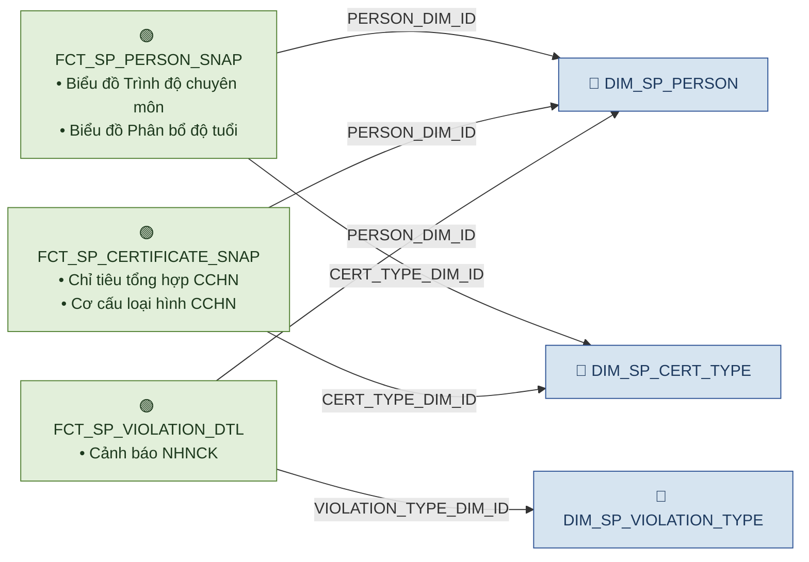

---

### Star 2 — Dashboard Tra cứu hồ sơ 360

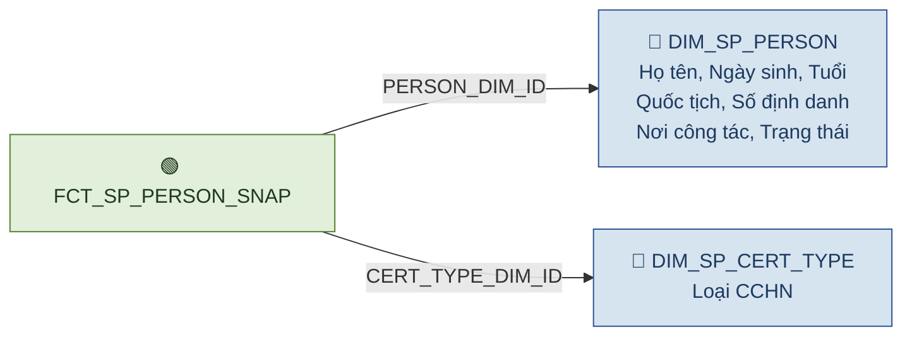

---

### Star 3 — Dashboard Mạng lưới + Hồ sơ & Danh mục (Vai trò DN)

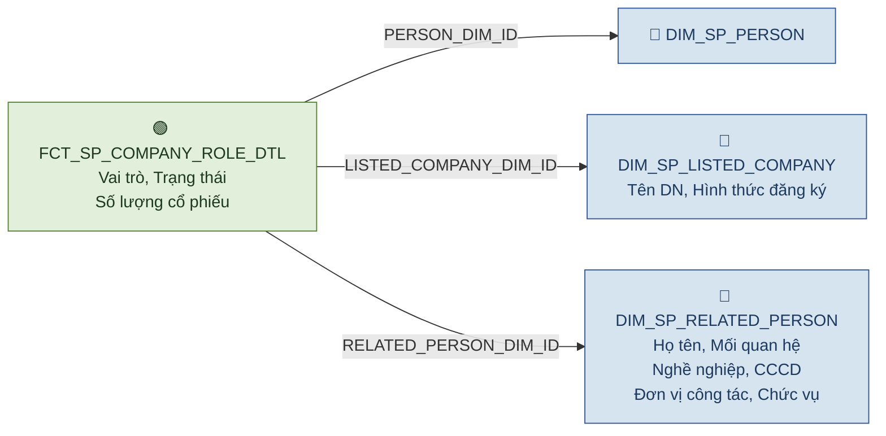

---

### Star 4 — Dashboard Hồ sơ & Danh mục (Tài khoản & số dư)

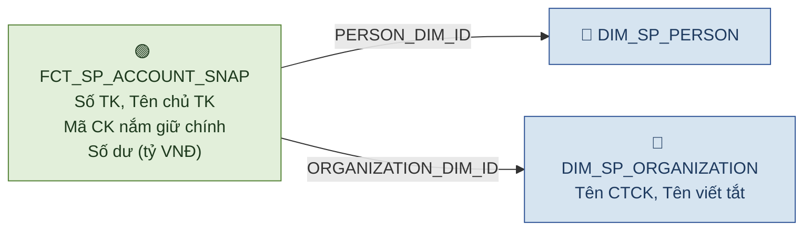

---

### Star 5 — Dashboard Quá trình hành nghề

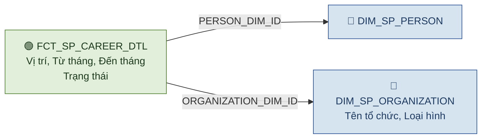

---

### Star 6 — Dashboard Lịch sử cấp chứng chỉ + Data Explorer

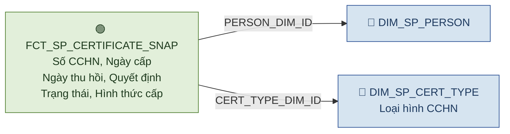

---

### Star 7 — Dashboard Đợt thi sát hạch

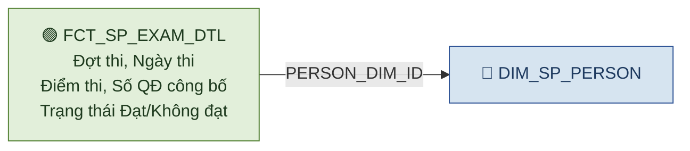

---

### Star 8 — Dashboard Cập nhật kiến thức

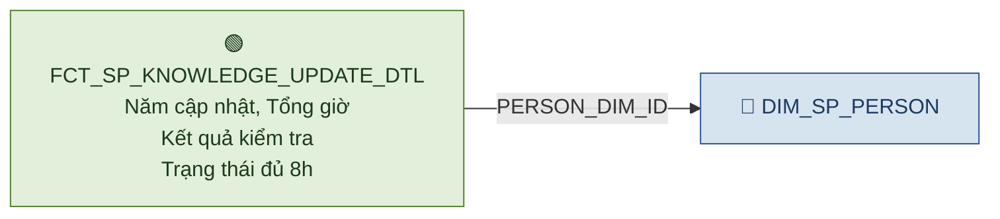

---

### Star 9 — Dashboard Lịch sử vi phạm

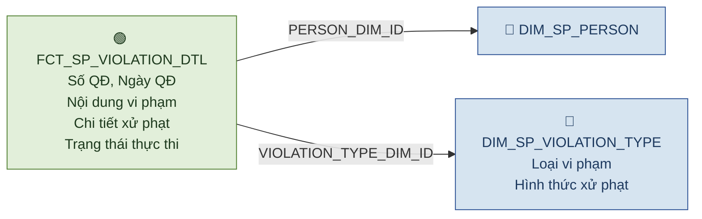

---

## Ma trận Fact — Dimension (Bus Matrix)

| Dimension ↓ \ Fact → | FCT_SP_PERSON_SNAP | FCT_SP_CERTIFICATE_SNAP | FCT_SP_CAREER_DTL | FCT_SP_EXAM_DTL | FCT_SP_VIOLATION_DTL | FCT_SP_ACCOUNT_SNAP | FCT_SP_COMPANY_ROLE_DTL | FCT_SP_KNOWLEDGE_UPDATE_DTL |
|---|:---:|:---:|:---:|:---:|:---:|:---:|:---:|:---:|
| **DIM_SP_PERSON** | ✅ | ✅ | ✅ | ✅ | ✅ | ✅ | ✅ | ✅ |
| **DIM_SP_ORGANIZATION** | | | ✅ | | | ✅ | | |
| **DIM_SP_CERT_TYPE** | ✅ | ✅ | | | | | | |
| **DIM_SP_LISTED_COMPANY** | | | | | | | ✅ | |
| **DIM_SP_RELATED_PERSON** | | | | | | | ✅ | |
| **DIM_SP_VIOLATION_TYPE** | | | | | ✅ | | | |

---

## Mapping Dashboard → Star Schema

| Dashboard / Data Explorer | Chart / Widget | Fact | Dimensions |
|---|---|---|---|
| Tổng quan / Chỉ tiêu tổng hợp | Thống kê CCHN | FCT_SP_CERTIFICATE_SNAP | DIM_SP_PERSON, DIM_SP_CERT_TYPE |
| Tổng quan / Trình độ chuyên môn | Biểu đồ trình độ | FCT_SP_PERSON_SNAP | DIM_SP_PERSON |
| Tổng quan / Cơ cấu loại hình | Biểu đồ cơ cấu | FCT_SP_CERTIFICATE_SNAP | DIM_SP_CERT_TYPE |
| Tổng quan / Phân bổ độ tuổi | Biểu đồ tuổi | FCT_SP_PERSON_SNAP | DIM_SP_PERSON |
| Tổng quan / Cảnh báo | Chỉ số vi phạm | FCT_SP_VIOLATION_DTL | DIM_SP_PERSON, DIM_SP_VIOLATION_TYPE |
| Tra cứu hồ sơ 360 | Thông tin cá nhân | FCT_SP_PERSON_SNAP | DIM_SP_PERSON, DIM_SP_CERT_TYPE |
| Mạng lưới | Quan hệ NHN-DN | FCT_SP_COMPANY_ROLE_DTL | DIM_SP_PERSON, DIM_SP_LISTED_COMPANY, DIM_SP_RELATED_PERSON |
| Hồ sơ & Danh mục / Vai trò DN | Danh sách vai trò | FCT_SP_COMPANY_ROLE_DTL | DIM_SP_PERSON, DIM_SP_LISTED_COMPANY, DIM_SP_RELATED_PERSON |
| Hồ sơ & Danh mục / Tài khoản | Tài khoản & số dư | FCT_SP_ACCOUNT_SNAP | DIM_SP_PERSON, DIM_SP_ORGANIZATION |
| Quá trình hành nghề | Lịch sử công tác | FCT_SP_CAREER_DTL | DIM_SP_PERSON, DIM_SP_ORGANIZATION |
| Lịch sử cấp CC | Chi tiết CCHN | FCT_SP_CERTIFICATE_SNAP | DIM_SP_PERSON, DIM_SP_CERT_TYPE |
| Đợt thi sát hạch | Kết quả thi | FCT_SP_EXAM_DTL | DIM_SP_PERSON |
| Cập nhật kiến thức | Trạng thái CNKT | FCT_SP_KNOWLEDGE_UPDATE_DTL | DIM_SP_PERSON |
| Lịch sử vi phạm | Chi tiết vi phạm | FCT_SP_VIOLATION_DTL | DIM_SP_PERSON, DIM_SP_VIOLATION_TYPE |
| Data Explorer | Khai thác dữ liệu | FCT_SP_CERTIFICATE_SNAP | DIM_SP_PERSON, DIM_SP_CERT_TYPE |