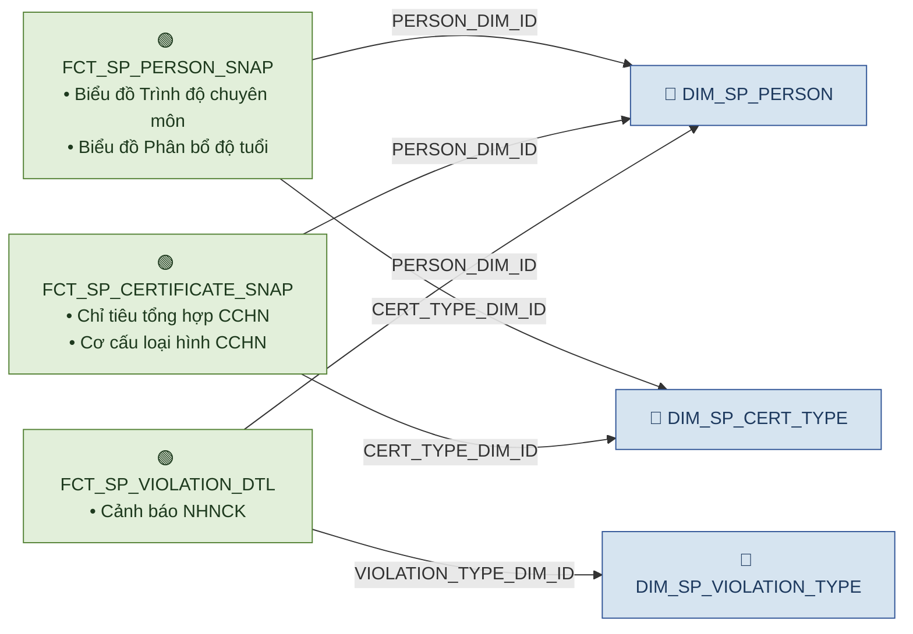
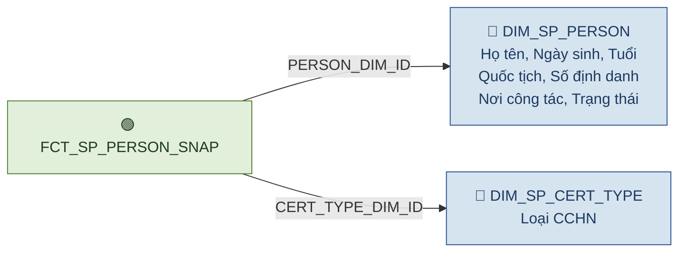
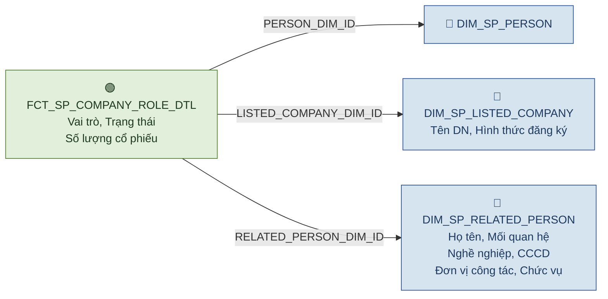
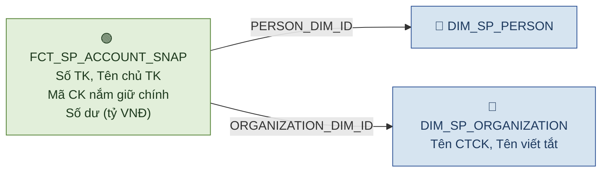
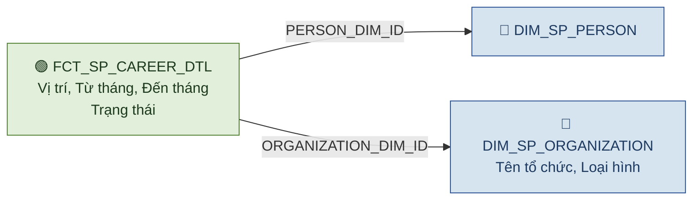
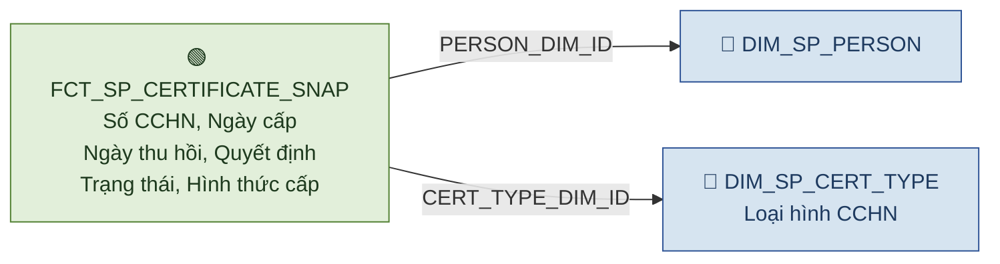
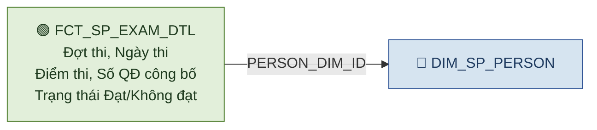
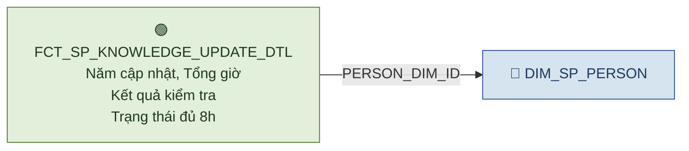
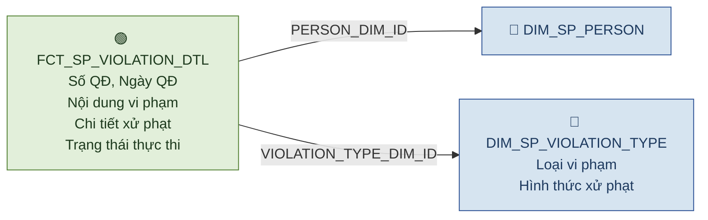

# NHNCK — Gold Layer Relationship Diagram (Star Schema)

> **Phiên bản:** Thiết kế Datamart tầng Gold cho phân hệ Người hành nghề chứng khoán
>
> **Source layer:** Silver — Securities Practitioner domain
>
> **Mô hình:** Dimensional Modeling (Star Schema) — 6 Dimension + 8 Fact
>
> **Domain prefix:** `SP` (Securities Practitioner)
>
> **Render:** Mở file này trong VS Code với extension **Markdown Preview Mermaid Support**, hoặc dán từng block vào [mermaid.live](https://mermaid.live).
>
> **Ký hiệu:**
> - `──►` (mũi tên liền): quan hệ FK (Fact → Dimension)
> - 🔵 Xanh dương nhạt: Dimension table
> - 🟢 Xanh lá: Fact table
> - Mỗi Fact là trung tâm của 1 star, JOIN sang Dimension qua `<SUBJECT>_DIM_ID`

---

## Tổng quan Star Schema — Toàn bộ phân hệ NHNCK

```mermaid
graph TB
    classDef dim fill:#D6E4F0,stroke:#2F5496,color:#1e3a5f
    classDef fct fill:#E2EFDA,stroke:#548235,color:#1e3a1e

    DIM_PERSON["🔵 DIM_SP_PERSON\nPerson Dimension\n─────────\nPERSON_DIM_ID (PK)\nPERSON_CODE\nPERSON_NAME\nDATE_OF_BIRTH\nAGE | GENDER\nNATIONALITY\nID_NUMBER\nEDUCATION_LEVEL\nCURRENT_WORKPLACE\nPRACTITIONER_STATUS\nEFF_DT | END_DT"]:::dim

    DIM_ORG["🔵 DIM_SP_ORGANIZATION\nOrganization Dimension\n─────────\nORGANIZATION_DIM_ID (PK)\nORGANIZATION_CODE\nORGANIZATION_NAME\nORGANIZATION_TYPE\nORGANIZATION_SHORT_NAME\nEFF_DT | END_DT"]:::dim

    DIM_CERT["🔵 DIM_SP_CERT_TYPE\nCertificate Type Dimension\n─────────\nCERT_TYPE_DIM_ID (PK)\nCERT_TYPE_CODE\nCERT_TYPE_NAME\nEFF_DT | END_DT"]:::dim

    DIM_COMPANY["🔵 DIM_SP_LISTED_COMPANY\nListed Company Dimension\n─────────\nLISTED_COMPANY_DIM_ID (PK)\nLISTED_COMPANY_CODE\nLISTED_COMPANY_NAME\nLISTING_TYPE\nEFF_DT | END_DT"]:::dim

    DIM_RELATED["🔵 DIM_SP_RELATED_PERSON\nRelated Person Dimension\n─────────\nRELATED_PERSON_DIM_ID (PK)\nRELATED_PERSON_CODE\nRELATED_PERSON_NAME\nRELATIONSHIP_TYPE\nOCCUPATION | ID_NUMBER\nWORKPLACE | POSITION\nEFF_DT | END_DT"]:::dim

    DIM_VIOL["🔵 DIM_SP_VIOLATION_TYPE\nViolation Type Dimension\n─────────\nVIOLATION_TYPE_DIM_ID (PK)\nVIOLATION_TYPE_CODE\nVIOLATION_TYPE_NAME\nPENALTY_TYPE\nEFF_DT | END_DT"]:::dim

    FCT_PERSON["🟢 FCT_SP_PERSON_SNAP\nPerson Snapshot Fact\n─────────\nDATA_DT (PK) | PPN_DT\nPERSON_DIM_ID (FK)\nCERT_TYPE_DIM_ID (FK)\nAGE_GROUP\nTOTAL_CERTIFICATES"]:::fct

    FCT_CERT["🟢 FCT_SP_CERTIFICATE_SNAP\nCertificate Snapshot Fact\n─────────\nDATA_DT (PK) | PPN_DT\nPERSON_DIM_ID (FK)\nCERT_TYPE_DIM_ID (FK)\nCERTIFICATE_NO (PK)\nISSUE_DATE | REVOKE_DATE\nDECISION_NO\nCERTIFICATE_STATUS\nISSUE_TYPE"]:::fct

    FCT_CAREER["🟢 FCT_SP_CAREER_DTL\nCareer Detail Fact\n─────────\nDATA_DT (PK) | PPN_DT\nPERSON_DIM_ID (FK)\nORGANIZATION_DIM_ID (FK)\nPOSITION\nSTART_DATE (PK) | END_DATE\nCAREER_STATUS"]:::fct

    FCT_EXAM["🟢 FCT_SP_EXAM_DTL\nExam Detail Fact\n─────────\nDATA_DT (PK) | PPN_DT\nPERSON_DIM_ID (FK)\nEXAM_SESSION (PK)\nEXAM_DATE | EXAM_SCORE\nANNOUNCEMENT_DECISION_NO\nEXAM_STATUS"]:::fct

    FCT_VIOL["🟢 FCT_SP_VIOLATION_DTL\nViolation Detail Fact\n─────────\nDATA_DT (PK) | PPN_DT\nPERSON_DIM_ID (FK)\nVIOLATION_TYPE_DIM_ID (FK)\nDECISION_NO (PK)\nDECISION_DATE\nVIOLATION_CONTENT\nPENALTY_DETAIL\nEXECUTION_STATUS"]:::fct

    FCT_ACCOUNT["🟢 FCT_SP_ACCOUNT_SNAP\nAccount Snapshot Fact\n─────────\nDATA_DT (PK) | PPN_DT\nPERSON_DIM_ID (FK)\nORGANIZATION_DIM_ID (FK)\nACCOUNT_NO (PK)\nACCOUNT_HOLDER_NAME\nTOP_SECURITIES_CODE\nACCOUNT_BALANCE"]:::fct

    FCT_ROLE["🟢 FCT_SP_COMPANY_ROLE_DTL\nCompany Role Detail Fact\n─────────\nDATA_DT (PK) | PPN_DT\nPERSON_DIM_ID (FK)\nLISTED_COMPANY_DIM_ID (FK)\nRELATED_PERSON_DIM_ID (FK)\nROLE_NAME (PK)\nROLE_STATUS\nSHARES_QUANTITY"]:::fct

    FCT_KNOWLEDGE["🟢 FCT_SP_KNOWLEDGE_UPDATE_DTL\nKnowledge Update Detail Fact\n─────────\nDATA_DT (PK) | PPN_DT\nPERSON_DIM_ID (FK)\nUPDATE_YEAR (PK)\nTOTAL_HOURS\nTEST_RESULT\nHOURS_STATUS"]:::fct

    %% FK relationships
    FCT_PERSON -->|PERSON_DIM_ID| DIM_PERSON
    FCT_PERSON -->|CERT_TYPE_DIM_ID| DIM_CERT

    FCT_CERT -->|PERSON_DIM_ID| DIM_PERSON
    FCT_CERT -->|CERT_TYPE_DIM_ID| DIM_CERT

    FCT_CAREER -->|PERSON_DIM_ID| DIM_PERSON
    FCT_CAREER -->|ORGANIZATION_DIM_ID| DIM_ORG

    FCT_EXAM -->|PERSON_DIM_ID| DIM_PERSON

    FCT_VIOL -->|PERSON_DIM_ID| DIM_PERSON
    FCT_VIOL -->|VIOLATION_TYPE_DIM_ID| DIM_VIOL

    FCT_ACCOUNT -->|PERSON_DIM_ID| DIM_PERSON
    FCT_ACCOUNT -->|ORGANIZATION_DIM_ID| DIM_ORG

    FCT_ROLE -->|PERSON_DIM_ID| DIM_PERSON
    FCT_ROLE -->|LISTED_COMPANY_DIM_ID| DIM_COMPANY
    FCT_ROLE -->|RELATED_PERSON_DIM_ID| DIM_RELATED

    FCT_KNOWLEDGE -->|PERSON_DIM_ID| DIM_PERSON
```

---

## Star Schema chi tiết theo từng Dashboard

### Star 1 — Dashboard tổng quan NHNCK toàn thị trường

> **3 Fact phục vụ 5 chart/widget:**
> - Chỉ tiêu tổng hợp + Cơ cấu loại hình → `FCT_SP_CERTIFICATE_SNAP`
> - Trình độ chuyên môn + Phân bổ độ tuổi → `FCT_SP_PERSON_SNAP`
> - Cảnh báo NHNCK → `FCT_SP_VIOLATION_DTL`

---

### Star 2 — Dashboard Tra cứu hồ sơ 360

---

### Star 3 — Dashboard Mạng lưới + Hồ sơ & Danh mục (Vai trò DN)

---

### Star 4 — Dashboard Hồ sơ & Danh mục (Tài khoản & số dư)

---

### Star 5 — Dashboard Quá trình hành nghề

---

### Star 6 — Dashboard Lịch sử cấp chứng chỉ + Data Explorer

---

### Star 7 — Dashboard Đợt thi sát hạch

---

### Star 8 — Dashboard Cập nhật kiến thức

---

### Star 9 — Dashboard Lịch sử vi phạm

---

## Ma trận Fact — Dimension (Bus Matrix)

| Dimension ↓ \ Fact → | FCT_SP_PERSON_SNAP | FCT_SP_CERTIFICATE_SNAP | FCT_SP_CAREER_DTL | FCT_SP_EXAM_DTL | FCT_SP_VIOLATION_DTL | FCT_SP_ACCOUNT_SNAP | FCT_SP_COMPANY_ROLE_DTL | FCT_SP_KNOWLEDGE_UPDATE_DTL |
|---|:---:|:---:|:---:|:---:|:---:|:---:|:---:|:---:|
| **DIM_SP_PERSON** | ✅ | ✅ | ✅ | ✅ | ✅ | ✅ | ✅ | ✅ |
| **DIM_SP_ORGANIZATION** | | | ✅ | | | ✅ | | |
| **DIM_SP_CERT_TYPE** | ✅ | ✅ | | | | | | |
| **DIM_SP_LISTED_COMPANY** | | | | | | | ✅ | |
| **DIM_SP_RELATED_PERSON** | | | | | | | ✅ | |
| **DIM_SP_VIOLATION_TYPE** | | | | | ✅ | | | |

---

## Mapping Dashboard → Star Schema

| Dashboard / Data Explorer | Chart / Widget | Fact | Dimensions |
|---|---|---|---|
| Tổng quan / Chỉ tiêu tổng hợp | Thống kê CCHN | FCT_SP_CERTIFICATE_SNAP | DIM_SP_PERSON, DIM_SP_CERT_TYPE |
| Tổng quan / Trình độ chuyên môn | Biểu đồ trình độ | FCT_SP_PERSON_SNAP | DIM_SP_PERSON |
| Tổng quan / Cơ cấu loại hình | Biểu đồ cơ cấu | FCT_SP_CERTIFICATE_SNAP | DIM_SP_CERT_TYPE |
| Tổng quan / Phân bổ độ tuổi | Biểu đồ tuổi | FCT_SP_PERSON_SNAP | DIM_SP_PERSON |
| Tổng quan / Cảnh báo | Chỉ số vi phạm | FCT_SP_VIOLATION_DTL | DIM_SP_PERSON, DIM_SP_VIOLATION_TYPE |
| Tra cứu hồ sơ 360 | Thông tin cá nhân | FCT_SP_PERSON_SNAP | DIM_SP_PERSON, DIM_SP_CERT_TYPE |
| Mạng lưới | Quan hệ NHN-DN | FCT_SP_COMPANY_ROLE_DTL | DIM_SP_PERSON, DIM_SP_LISTED_COMPANY, DIM_SP_RELATED_PERSON |
| Hồ sơ & Danh mục / Vai trò DN | Danh sách vai trò | FCT_SP_COMPANY_ROLE_DTL | DIM_SP_PERSON, DIM_SP_LISTED_COMPANY, DIM_SP_RELATED_PERSON |
| Hồ sơ & Danh mục / Tài khoản | Tài khoản & số dư | FCT_SP_ACCOUNT_SNAP | DIM_SP_PERSON, DIM_SP_ORGANIZATION |
| Quá trình hành nghề | Lịch sử công tác | FCT_SP_CAREER_DTL | DIM_SP_PERSON, DIM_SP_ORGANIZATION |
| Lịch sử cấp CC | Chi tiết CCHN | FCT_SP_CERTIFICATE_SNAP | DIM_SP_PERSON, DIM_SP_CERT_TYPE |
| Đợt thi sát hạch | Kết quả thi | FCT_SP_EXAM_DTL | DIM_SP_PERSON |
| Cập nhật kiến thức | Trạng thái CNKT | FCT_SP_KNOWLEDGE_UPDATE_DTL | DIM_SP_PERSON |
| Lịch sử vi phạm | Chi tiết vi phạm | FCT_SP_VIOLATION_DTL | DIM_SP_PERSON, DIM_SP_VIOLATION_TYPE |
| Data Explorer | Khai thác dữ liệu | FCT_SP_CERTIFICATE_SNAP | DIM_SP_PERSON, DIM_SP_CERT_TYPE |