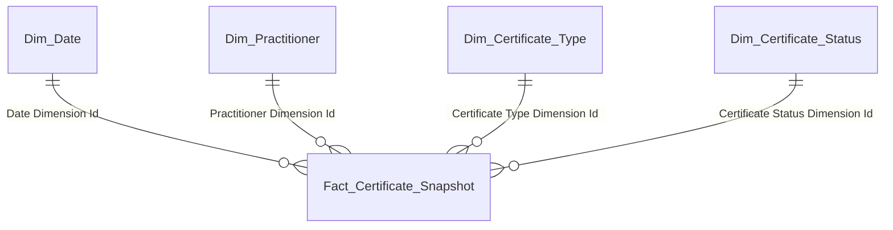
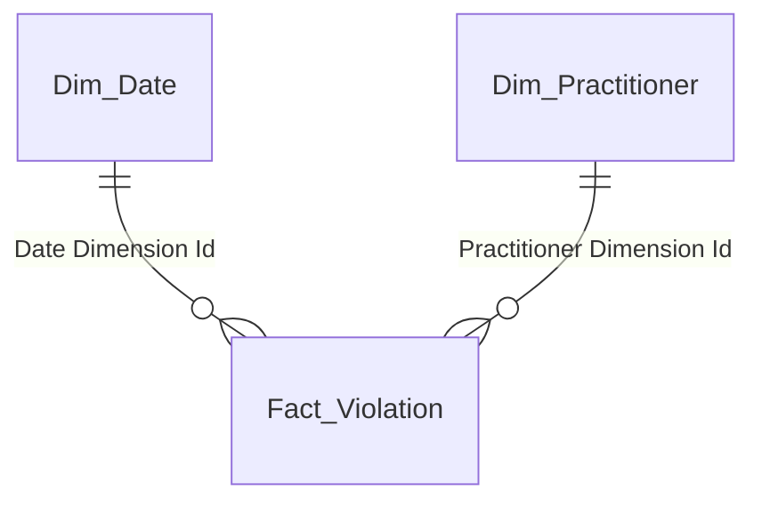
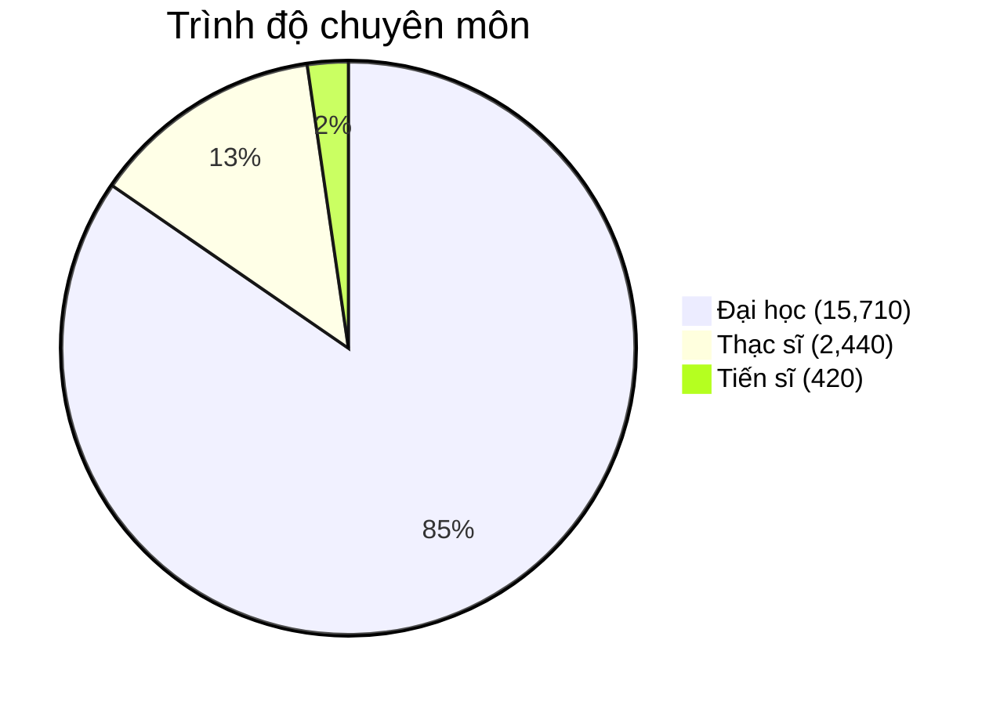
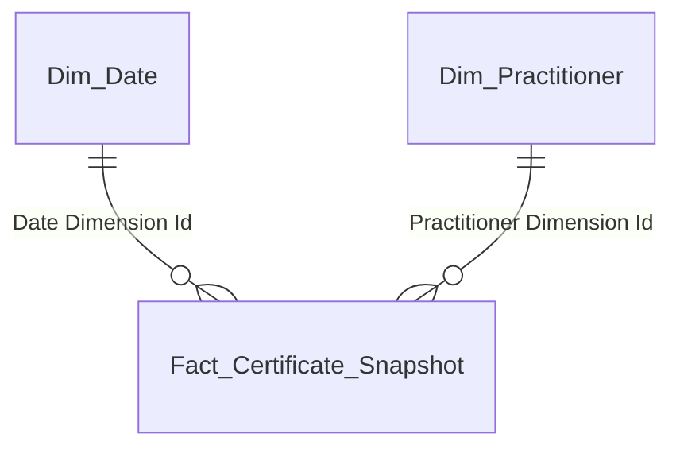
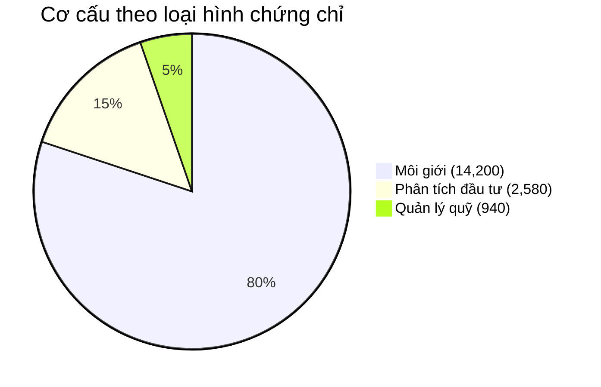
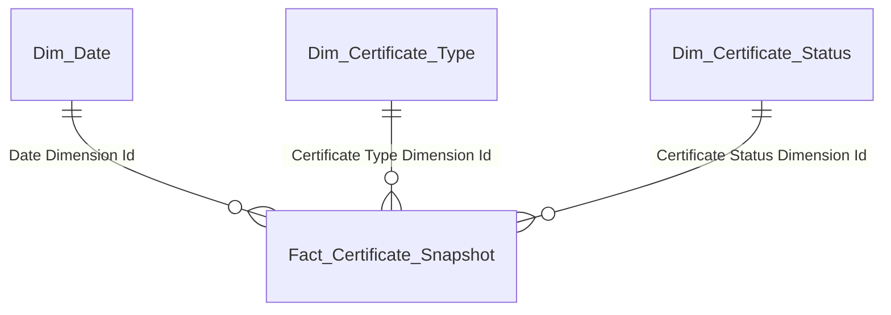
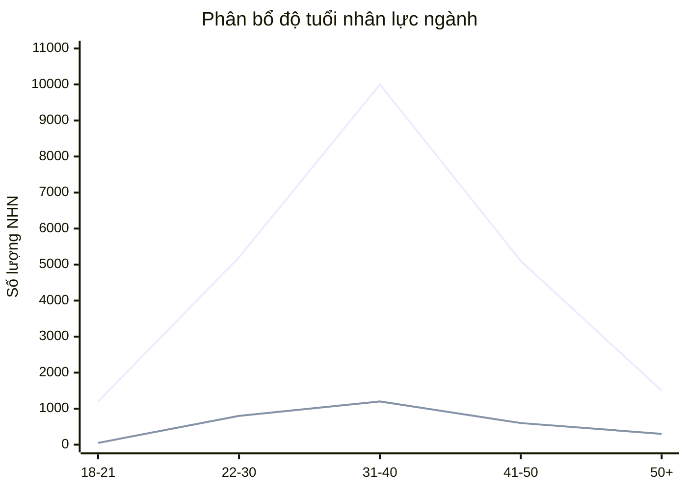
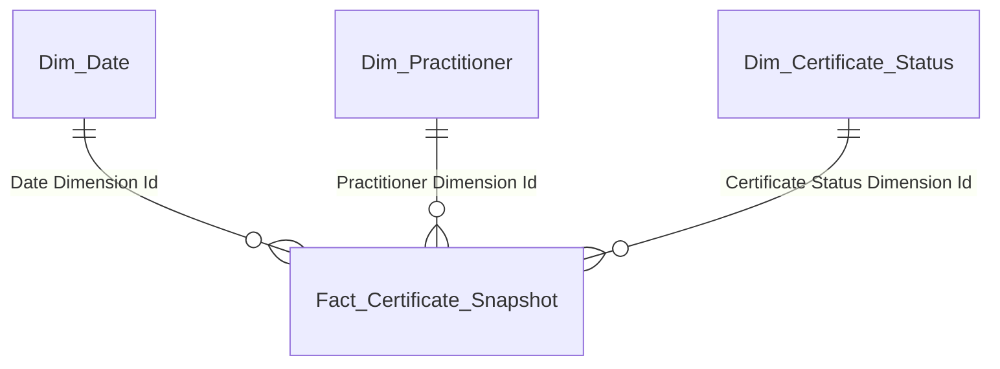
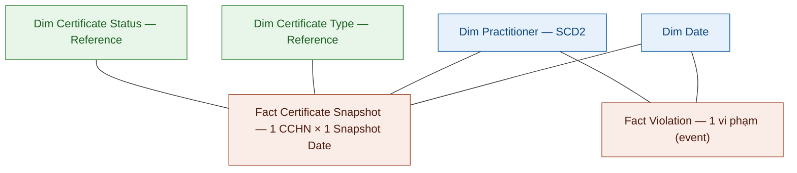

# Data Mart Design — Người hành nghề Chứng khoán (NHNCK)

**Phiên bản:** 1.3  
**Ngày:** 14/04/2026  
**Phạm vi:** Dashboard tổng quan của Người hành nghề chứng khoán toàn thị trường  
**Mô hình:** Star Schema thuần túy (không snowflake)

---

## 1. Tổng quan báo cáo

### 1.1 Dashboard: Tổng quan Người hành nghề chứng khoán toàn thị trường

**Slicer:** Năm (dropdown)

---

#### Nhóm 1 — Các chỉ tiêu tổng hợp thông tin chung

**Mockup:**

| Tổng người hành nghề | Chứng chỉ cấp mới (YTD) | Bị thu hồi | Cảnh báo NHNCK |
| :---: | :---: | :---: | :---: |
| **21,340** ppl | **1,580** CCHN | **95** case | **148** NHN |
| | Cấp mới: 1,290 · Cấp lại: 290 | | |
| YoY +7.7% | YoY +13.7% | YoY +8% | YoY +8.8% |

| CCHN đang hoạt động | CCHN thu hồi 3 năm | CCHN thu hồi vĩnh viễn | CCHN đã bị hủy |
| :---: | :---: | :---: | :---: |
| **20,180** CCHN | **312** CCHN | **98** CCHN | **750** CCHN |
| YoY +7.7% | YoY -12.2% | YoY +11.4% | YoY -5% |

**Source:** `Fact Certificate Snapshot` → `Dim Certificate Status`, `Dim Date`; K6 từ `Fact Violation` → `Dim Practitioner`

**KPI:**

| # | Tên KPI | Đơn vị | Tính chất | Mô tả |
|---|---------|--------|-----------|-------|
| K_NHNCK_1 | Tổng người hành nghề | Người | Stock | COUNT DISTINCT Practitioner Dimension Id có CCHN lũy kế |
| K_NHNCK_1_YOY | YoY% | % | Derived | So sánh cùng kỳ K1 |
| K_NHNCK_2 | Chứng chỉ cấp mới (YTD) | CCHN | Flow | COUNT CCHN có Issued In Year Flag = TRUE |
| K_NHNCK_2a | Cấp mới | CCHN | Flow | Is First Issuance Flag = TRUE |
| K_NHNCK_2b | Cấp lại | CCHN | Flow | Is First Issuance Flag = FALSE |
| K_NHNCK_2_YOY | YoY% | % | Derived | So sánh cùng kỳ K2 |
| K_NHNCK_3 | Bị thu hồi | Case | ⚠ O1 | Cần xác nhận Stock hay Flow |
| K_NHNCK_3_YOY | YoY% | % | Derived | So sánh cùng kỳ K3 |
| K_NHNCK_4 | CCHN đang hoạt động | CCHN | Stock | Certificate Status Code = 1 |
| K_NHNCK_4_YOY | YoY% | % | Derived | So sánh cùng kỳ K4 |
| K_NHNCK_3a | CCHN thu hồi 3 năm | CCHN | Stock | ⚠ O2: chờ Silver bổ sung phân biệt |
| K_NHNCK_3a_YOY | YoY% | % | Derived | So sánh cùng kỳ K3a |
| K_NHNCK_3b | CCHN thu hồi vĩnh viễn | CCHN | Stock | ⚠ O2 |
| K_NHNCK_3b_YOY | YoY% | % | Derived | So sánh cùng kỳ K3b |
| K_NHNCK_5 | CCHN đã bị hủy | CCHN | Stock | Certificate Status Code = 3 |
| K_NHNCK_5_YOY | YoY% | % | Derived | So sánh cùng kỳ K5 |
| K_NHNCK_6 | Cảnh báo NHNCK | NHN | Stock | Số NHN có vi phạm lũy kế (COUNT DISTINCT người) |
| K_NHNCK_6_YOY | YoY% | % | Derived | So sánh cùng kỳ K6 |

**Star schema — K1–K5:**

| Tên bảng (Logical) | Grain |
|---|---|
| Fact Certificate Snapshot | 1 row = 1 CCHN × 1 Snapshot Date (daily) |
| Dim Date | 1 row = 1 ngày |
| Dim Practitioner | 1 row = 1 NHN (SCD2) |
| Dim Certificate Type | 1 row = 1 loại chứng chỉ |
| Dim Certificate Status | 1 row = 1 trạng thái CCHN |

**Star schema — K6:**

| Tên bảng (Logical) | Grain |
|---|---|
| Fact Violation | 1 row = 1 vi phạm NHN (event — 1 row duy nhất) |
| Dim Date | 1 row = 1 ngày |
| Dim Practitioner | 1 row = 1 NHN (SCD2) |

---

#### Nhóm 2 — Biểu đồ Trình độ chuyên môn

**Mockup:**

**Source:** `Fact Certificate Snapshot` → `Dim Practitioner` (Education Level Code)

**KPI:**

| # | Tên KPI | Đơn vị | Tính chất | Mô tả |
|---|---------|--------|-----------|-------|
| K_NHNCK_7 | Số lượng Tiến sĩ | Người | Stock | COUNT DISTINCT NHN có Education Level Code = Tiến sĩ |
| K_NHNCK_8 | Số lượng Thạc sĩ | Người | Stock | COUNT DISTINCT NHN có Education Level Code = Thạc sĩ |
| K_NHNCK_9 | Số lượng Đại học | Người | Stock | COUNT DISTINCT NHN có Education Level Code = Đại học |
| K_NHNCK_10 | Tỷ lệ Tiến sĩ (%) | % | Derived | K7 / K1 × 100 |
| K_NHNCK_11 | Tỷ lệ Thạc sĩ (%) | % | Derived | K8 / K1 × 100 |
| K_NHNCK_12 | Tỷ lệ Đại học (%) | % | Derived | K9 / K1 × 100 |

**Star schema — K7–K12:**

| Tên bảng (Logical) | Grain |
|---|---|
| Fact Certificate Snapshot | 1 row = 1 CCHN × 1 Snapshot Date (daily) |
| Dim Practitioner | 1 row = 1 NHN (SCD2) |
| Dim Date | 1 row = 1 ngày |

---

#### Nhóm 3 — Biểu đồ Cơ cấu theo loại hình CCHN

**Mockup:**

**Source:** `Fact Certificate Snapshot` → `Dim Certificate Type`, `Dim Certificate Status`

**KPI:**

| # | Tên KPI | Đơn vị | Tính chất | Mô tả |
|---|---------|--------|-----------|-------|
| K_NHNCK_13 | Số lượng CCHN là Môi giới | CCHN | Stock | CCHN đang hoạt động loại Môi giới |
| K_NHNCK_14 | Số lượng CCHN là Phân tích đầu tư | CCHN | Stock | CCHN đang hoạt động loại Phân tích đầu tư |
| K_NHNCK_15 | Số lượng CCHN là Quản lý quỹ | CCHN | Stock | CCHN đang hoạt động loại Quản lý quỹ |

**Star schema — K13–K15:**

| Tên bảng (Logical) | Grain |
|---|---|
| Fact Certificate Snapshot | 1 row = 1 CCHN × 1 Snapshot Date (daily) |
| Dim Certificate Type | 1 row = 1 loại chứng chỉ |
| Dim Certificate Status | 1 row = 1 trạng thái CCHN |
| Dim Date | 1 row = 1 ngày |

---

#### Nhóm 4 — Biểu đồ Phân bổ độ tuổi nhân lực ngành

**Mockup (line chart — 2 đường: Việt Nam / Nước ngoài):**

| Nhóm tuổi | 18–21 | 22–30 | 31–40 | 41–50 | 50+ |
|---|:---:|:---:|:---:|:---:|:---:|
| Việt Nam | 1,200 | 5,200 | **10,000** | 5,100 | 1,500 |
| Nước ngoài | 50 | 800 | **1,200** | 600 | 300 |

**Source:** `Fact Certificate Snapshot` → `Dim Practitioner` (Date Of Birth, Nationality Code), `Dim Certificate Status`

**KPI:**

| # | Tên KPI | Đơn vị | Tính chất | Mô tả |
|---|---------|--------|-----------|-------|
| K_NHNCK_16–20 | NHN theo nhóm tuổi VN | Người | Stock | 5 nhóm: 18–21, 22–30, 31–40, 41–50, 50+ quốc tịch VN |
| K_NHNCK_21–25 | NHN theo nhóm tuổi nước ngoài | Người | Stock | 5 nhóm tương tự, quốc tịch nước ngoài |

**Star schema — K16–K25:**

| Tên bảng (Logical) | Grain |
|---|---|
| Fact Certificate Snapshot | 1 row = 1 CCHN × 1 Snapshot Date (daily) |
| Dim Practitioner | 1 row = 1 NHN (SCD2) |
| Dim Certificate Status | 1 row = 1 trạng thái CCHN |
| Dim Date | 1 row = 1 ngày |

---

## 2. Mô hình Star Schema

| Fact Table | Grain | KPI phục vụ |
|------------|-------|-------------|
| Fact Certificate Snapshot | 1 CCHN × 1 Snapshot Date (daily) | K1–K5, K7–K25 |
| Fact Violation | 1 vi phạm NHN (event) | K6 |

| Dimension | Loại | Mô tả |
|-----------|------|-------|
| Dim Date | Conformed | Lịch — slicer năm |
| Dim Practitioner | Conformed (SCD2) | NHN — ngày sinh, quốc tịch, trình độ |
| Dim Certificate Type | Reference (SCD2) | Loại chứng chỉ (3 loại: Môi giới / Phân tích / QLQ) |
| Dim Certificate Status | Reference (SCD2) | Trạng thái CCHN (1: Đang sử dụng, 2: Thu hồi, 3: Đã hủy) |

---

## 3. Đặc tả Dimension

### 3.1 Dim Date

| Attribute | Data Type | Mandatory | Mô tả | Source |
|-----------|-----------|-----------|-------|--------|
| Date Dimension Id | INT | PK | Surrogate key (YYYYMMDD) | Generated |
| Full Date | DATE | BK | Ngày đầy đủ | Generated |
| Year | INT | ✓ | Năm — slicer dashboard | Generated |

**SCD:** Tĩnh.

### 3.2 Dim Practitioner

| Attribute | Data Type | Mandatory | Mô tả | Source |
|-----------|-----------|-----------|-------|--------|
| Practitioner Dimension Id | INT | PK | Surrogate key | Generated |
| Practitioner Code | VARCHAR | BK | Mã người hành nghề | Securities Practitioner.Practitioner Code (attr_NHNCK_Professionals.csv) |
| Date Of Birth | DATE | ✓ | Ngày sinh — tính tuổi cho biểu đồ phân bổ | Securities Practitioner.Date Of Birth (attr_NHNCK_Professionals.csv) |
| Nationality Code | VARCHAR | ✓ | Quốc tịch — phân nhóm VN / nước ngoài | Securities Practitioner.Nationality Code (attr_NHNCK_Professionals.csv) |
| Is Vietnamese Flag | BOOLEAN | Derived | TRUE = quốc tịch VN, FALSE = nước ngoài | Derived: Nationality Code = 'VN' |
| Education Level Code | VARCHAR | ✓ | Trình độ học vấn — biểu đồ trình độ chuyên môn | Classification Value (EDUCATION_LEVEL) |
| Education Level Name | NVARCHAR | ✓ | Tên trình độ (Tiến sĩ / Thạc sĩ / Đại học) | Classification Value (EDUCATION_LEVEL) |
| Effective Date | DATE | ✓ (SCD2) | Ngày hiệu lực | ETL derived |
| End Date | DATE | ✓ (SCD2) | 9999-12-31 = hiện hành | ETL derived |

**SCD:** Type 2 — theo dõi Nationality Code, Education Level Code.

### 3.3 Dim Certificate Type (Reference)

| Attribute | Data Type | Mandatory | Mô tả | Source |
|-----------|-----------|-----------|-------|--------|
| Certificate Type Dimension Id | INT | PK | Surrogate key | Generated |
| Certificate Type Code | VARCHAR | BK | Mã loại chứng chỉ (3 loại: Môi giới / Phân tích đầu tư / Quản lý quỹ) | Classification Value (CERTIFICATE_TYPE) |
| Certificate Type Name | NVARCHAR | ✓ | Tên loại | Classification Value (CERTIFICATE_TYPE) |
| Effective Date | DATE | ✓ (SCD2) | Ngày hiệu lực | ETL derived |
| End Date | DATE | ✓ (SCD2) | 9999-12-31 = hiện hành | ETL derived |

**SCD:** Type 2.

### 3.4 Dim Certificate Status (Reference)

| Attribute | Data Type | Mandatory | Mô tả | Source |
|-----------|-----------|-----------|-------|--------|
| Certificate Status Dimension Id | INT | PK | Surrogate key | Generated |
| Certificate Status Code | VARCHAR | BK | Mã trạng thái (0: Chưa sử dụng, 1: Đang sử dụng, 2: Thu hồi, 3: Đã hủy) | Classification Value (CERTIFICATE_STATUS) |
| Certificate Status Name | NVARCHAR | ✓ | Tên trạng thái | Classification Value (CERTIFICATE_STATUS) |
| Effective Date | DATE | ✓ (SCD2) | Ngày hiệu lực | ETL derived |
| End Date | DATE | ✓ (SCD2) | 9999-12-31 = hiện hành | ETL derived |

**SCD:** Type 2.

---

## 4. Đặc tả Fact

### 4.1 Fact Certificate Snapshot

**Grain:** 1 row = 1 CCHN × 1 Snapshot Date (daily).  
**Mô tả:** Full periodic snapshot — batch T chụp toàn bộ CCHN, Snapshot Date = T-1.

| Attribute | Data Type | Mandatory | Mô tả | Source |
|-----------|-----------|-----------|-------|--------|
| Snapshot Date | INT | ✓ | Ngày dữ liệu nghiệp vụ (YYYYMMDD) | ETL derived |
| Population Date | TIMESTAMP | ✓ | Thời gian ghi vào Database | ETL load timestamp |
| Date Dimension Id | INT | FK | FK → Dim Date | Dim Date.Date Dimension Id |
| Practitioner Dimension Id | INT | FK | FK → Dim Practitioner | Dim Practitioner.Practitioner Dimension Id |
| Certificate Type Dimension Id | INT | FK | FK → Dim Certificate Type | Dim Certificate Type.Certificate Type Dimension Id |
| Certificate Status Dimension Id | INT | FK | FK → Dim Certificate Status | Dim Certificate Status.Certificate Status Dimension Id |
| License Certificate Document Code | VARCHAR | DD | Mã CCHN (grain key) | Securities Practitioner License Certificate Document.License Certificate Document Code (attr_NHNCK_CertificateRecords.csv) |
| Issued In Year Flag | BOOLEAN | Derived | TRUE = có sự kiện CẤP year-to-date | Securities Practitioner License Certificate Document Status History.New Status Code (attr_NHNCK_CertificateRecordStatusHistories.csv) |
| Is First Issuance Flag | BOOLEAN | Derived | TRUE = cấp lần đầu, FALSE = cấp lại | Securities Practitioner License Certificate Group Member.Is Reissue Indicator (attr_NHNCK_CertificateRecordGroupMembers.csv) — đảo giá trị |
| Revoked In Year Flag | BOOLEAN | Derived | TRUE = có sự kiện THU HỒI year-to-date | Securities Practitioner License Certificate Document Status History.New Status Code (attr_NHNCK_CertificateRecordStatusHistories.csv) |

**Grain uniqueness:** Snapshot Date + License Certificate Document Code.

### 4.2 Fact Violation

**Grain:** 1 row = 1 vi phạm / cảnh báo (mỗi vi phạm chỉ xuất hiện 1 lần duy nhất).  
**Mô tả:** Event fact — ghi nhận sự kiện vi phạm của NHN. K6 = COUNT DISTINCT Practitioner Dimension Id (số NHN có vi phạm).

| Attribute | Data Type | Mandatory | Mô tả | Source |
|-----------|-----------|-----------|-------|--------|
| Violation Date | INT | ✓ | Ngày sự kiện vi phạm xảy ra (YYYYMMDD) | Securities Practitioner Conduct Violation.Created Timestamp (attr_NHNCK_Violations.csv) |
| Population Date | TIMESTAMP | ✓ | Thời gian ghi vào Database | ETL load timestamp |
| Date Dimension Id | INT | FK | FK → Dim Date (theo Violation Date) | Dim Date.Date Dimension Id |
| Practitioner Dimension Id | INT | FK | FK → Dim Practitioner | Dim Practitioner.Practitioner Dimension Id |
| Conduct Violation Code | VARCHAR | DD | Mã vi phạm (grain key — duy nhất) | Securities Practitioner Conduct Violation.Conduct Violation Code (attr_NHNCK_Violations.csv) |
| Violation Status Code | VARCHAR | DD | Trạng thái hiệu lực | Securities Practitioner Conduct Violation.Violation Status Code (attr_NHNCK_Violations.csv) |

**Grain uniqueness:** Conduct Violation Code.

---

## 5. Vấn đề mở & Giả định

| # | Vấn đề | Giả định hiện tại | KPI liên quan | Status |
|---|--------|-------------------|---------------|--------|
| O1 | K3 "Bị thu hồi" Stock hay Flow? Dashboard K3=95 trong khi K3a=312, K3b=98 | Tạm giả định K3 là Flow (Revoked In Year Flag) | K3, K3a, K3b | Open |
| O2 | Certificate Status Code "2: Thu hồi" không phân biệt 3 năm vs vĩnh viễn. Silver sẽ bổ sung | Chờ Silver cập nhật | K3a, K3b | Open |
| O3 | BA sẽ phản hồi sau về K3a/K3b khi Silver bổ sung loại thu hồi | Chờ BA | K3a, K3b | Open |