# Data Mart Design — Người hành nghề Chứng khoán (NHNCK)

**Phiên bản:** 4.0  
**Ngày:** 13/04/2026  
**Phạm vi:** Dashboard tổng quan + Tra cứu 360° + Mạng lưới + Hồ sơ & Danh mục + Quá trình hành nghề + Lịch sử cấp CC + Đợt thi sát hạch + Cập nhật kiến thức + Lịch sử vi phạm + Data Explorer  
**Mô hình:** Star Schema (không snowflake)

---

## 1. Tổng quan báo cáo

### 1.1 Dashboard: Tổng quan Người hành nghề chứng khoán toàn thị trường

**Slicer:** Năm (dropdown)

Dashboard gồm 4 nhóm chỉ tiêu:

#### Nhóm 1 — Các chỉ tiêu tổng hợp thông tin chung

| # | Tên KPI | Đơn vị | Tính chất | Mô tả |
|---|---------|--------|-----------|-------|
| K_NHNCK_1 | Tổng người hành nghề | Người | Stock | Tổng số cá nhân có ít nhất 1 CCHN lũy kế đến ngày cuối cùng năm đã chọn |
| K_NHNCK_2 | Chứng chỉ cấp mới (YTD) | CCHN | Flow | Số CCHN được cấp mới trong năm hiện tại |
| K_NHNCK_2a | Cấp mới | CCHN | Flow | Số chứng chỉ cấp lần đầu |
| K_NHNCK_2b | Cấp lại | CCHN | Flow | Số chứng chỉ cấp lại |
| K_NHNCK_3 | Bị thu hồi | CCHN | Stock | Tổng số CCHN bị thu hồi lũy kế đến ngày cuối cùng năm đã chọn |
| K_NHNCK_3a | Thu hồi trong 3 năm | CCHN | Stock | Số CCHN bị thu hồi có thời hạn 3 năm lũy kế đến ngày cuối cùng năm đã chọn |
| K_NHNCK_3b | Thu hồi vĩnh viễn | CCHN | Stock | Số CCHN thu hồi không thời hạn lũy kế đến ngày cuối cùng năm đã chọn |
| K_NHNCK_4 | CCHN đang hoạt động | CCHN | Stock | Số CCHN trạng thái hoạt động lũy kế đến ngày cuối cùng năm đã chọn |
| K_NHNCK_5 | Đã bị hủy | CCHN | Stock | Số CCHN bị hủy lũy kế đến ngày cuối cùng năm đã chọn |
| K_NHNCK_6 | Cảnh báo NHNCK | NHN | Stock | Số NHN có vi phạm lũy kế đến ngày cuối cùng năm đã chọn |

Mỗi KPI kèm **So sánh cùng kỳ (YoY%)**:
```
YoY% = (Giá trị năm N − Giá trị năm N−1) / Giá trị năm N−1 × 100
```

#### Nhóm 2 — Biểu đồ Trình độ chuyên môn

| # | Tên KPI | Đơn vị | Tính chất | Mô tả |
|---|---------|--------|-----------|-------|
| K_NHNCK_7 | Số lượng Tiến sĩ | Người | Stock | Số lượng NHN trình độ Tiến sĩ |
| K_NHNCK_8 | Số lượng Thạc sĩ | Người | Stock | Số lượng NHN trình độ Thạc sĩ |
| K_NHNCK_9 | Số lượng Đại học | Người | Stock | Số lượng NHN trình độ Đại học |
| K_NHNCK_10 | Tỷ lệ Tiến sĩ (%) | % | Derived | Tỷ lệ NHN trình độ Tiến sĩ / Tổng số NHN |
| K_NHNCK_11 | Tỷ lệ Thạc sĩ (%) | % | Derived | Tỷ lệ NHN trình độ Thạc sĩ / Tổng số NHN |
| K_NHNCK_12 | Tỷ lệ Đại học (%) | % | Derived | Tỷ lệ NHN trình độ Đại học / Tổng số NHN |

#### Nhóm 3 — Biểu đồ Cơ cấu theo loại hình CCHN

| # | Tên KPI | Đơn vị | Tính chất | Mô tả |
|---|---------|--------|-----------|-------|
| K_NHNCK_13 | Số lượng CCHN là Môi giới | CCHN | Stock | Số lượng CCHN loại Môi giới |
| K_NHNCK_14 | Số lượng CCHN là Phân tích | CCHN | Stock | Số lượng CCHN loại Phân tích |
| K_NHNCK_15 | Số lượng CCHN là QLQ | CCHN | Stock | Số lượng CCHN loại Quản lý quỹ |

#### Nhóm 4 — Biểu đồ Phân bố độ tuổi

| # | Tên KPI | Đơn vị | Tính chất | Mô tả |
|---|---------|--------|-----------|-------|
| K_NHNCK_16 | NHN 18–21 tuổi quốc tịch VN | Người | Stock | Số lượng NHN có độ tuổi 18–21 quốc tịch VN |
| K_NHNCK_17 | NHN 22–30 tuổi quốc tịch VN | Người | Stock | Chiều độ tuổi NHN |
| K_NHNCK_18 | NHN 31–40 tuổi quốc tịch VN | Người | Stock | Số lượng NHN có độ tuổi 31–40 quốc tịch VN |
| K_NHNCK_19 | NHN 41–50 tuổi quốc tịch VN | Người | Stock | Số lượng NHN có độ tuổi 41–50 quốc tịch VN |
| K_NHNCK_20 | NHN 50+ tuổi quốc tịch VN | Người | Stock | Số lượng NHN có độ tuổi 50+ quốc tịch VN |
| K_NHNCK_21 | NHN 18–21 tuổi nước ngoài | Người | Stock | Số lượng NHN có độ tuổi 18–21 quốc tịch nước ngoài |
| K_NHNCK_22 | NHN 22–30 tuổi nước ngoài | Người | Stock | Số lượng NHN có độ tuổi 22–30 quốc tịch nước ngoài |
| K_NHNCK_23 | NHN 31–40 tuổi nước ngoài | Người | Stock | Số lượng NHN có độ tuổi 31–40 quốc tịch nước ngoài |
| K_NHNCK_24 | NHN 41–50 tuổi nước ngoài | Người | Stock | Số lượng NHN có độ tuổi 41–50 quốc tịch nước ngoài |
| K_NHNCK_25 | NHN 50+ tuổi nước ngoài | Người | Stock | Số lượng NHN có độ tuổi 50+ quốc tịch nước ngoài |

### 1.2 Dashboard: Tra cứu hồ sơ 360°

Hiển thị thông tin tổng quan 1 NHN được chọn.

| # | Trường | Mô tả | Mart source |
|---|--------|-------|-------------|
| K_NHNCK_26 | Họ tên | Họ tên NHN | dim_practitioner.full_name |
| K_NHNCK_27 | Ngày sinh | Ngày sinh NHN | dim_practitioner.date_of_birth |
| K_NHNCK_28 | Tuổi | Tuổi NHN (derived) | Derived: DATEDIFF(YEAR, date_of_birth, GETDATE()) |
| K_NHNCK_29 | Quốc tịch | Quốc tịch NHN | dim_practitioner.nationality_code |
| K_NHNCK_30 | Số định danh cá nhân/Hộ chiếu | CCCD hoặc hộ chiếu | dim_practitioner.identification_number |
| K_NHNCK_31 | Nơi công tác hiện tại | Tổ chức đang làm việc | fact_employment_history (bản ghi hiện tại) → dim_organization |
| K_NHNCK_32 | Loại CCHN | Loại chứng chỉ | fact_certificate_snapshot.cert_type_name |
| K_NHNCK_33 | Trạng thái NHNCK | Trạng thái hành nghề | dim_practitioner.practice_status_code |

### 1.3 Dashboard: Mạng lưới của NHNCK

Hiển thị mạng lưới quan hệ và vai trò tại DN của 1 NHN.

| # | Trường | Mô tả | Mart source |
|---|--------|-------|-------------|
| K_NHNCK_34 | Đơn vị công tác | DN niêm yết/UPCOM mà NHN tham gia | fact_employment_history → dim_organization |
| K_NHNCK_35 | Chức vụ, vai trò | Vai trò tại DN | fact_employment_history.position_name |
| K_NHNCK_36 | Họ tên người liên quan | Người liên quan | fact_related_party.related_individual_full_name |
| K_NHNCK_37 | Mối quan hệ | Quan hệ với NHN | fact_related_party.relationship_type_code |
| K_NHNCK_38 | Đơn vị công tác người liên quan | DN của người liên quan | fact_related_party.related_individual_workplace |
| K_NHNCK_39 | Chức vụ người liên quan | Vai trò người liên quan | fact_related_party.related_individual_occupation |

### 1.4 Dashboard: Hồ sơ & Danh mục của NHNCK

3 sub-section:

**Sub 1 — Vai trò tại DN niêm yết/UPCOM:**

| # | Trường | Mô tả | Mart source |
|---|--------|-------|-------------|
| K_NHNCK_40 | Tên DN | DN niêm yết/UPCOM | fact_employment_history → dim_organization.organization_name |
| K_NHNCK_41 | Vai trò | Chức vụ tại DN | fact_employment_history.position_name |
| K_NHNCK_42 | Trạng thái | Trạng thái hiện tại | fact_employment_history.employment_status_code |
| K_NHNCK_43 | Số lượng cổ phiếu sở hữu | Cổ phiếu sở hữu tại DN | fact_practitioner_account.stock_holding_quantity |

**Sub 2 — Mạng lưới người có liên quan:**

| # | Trường | Mô tả | Mart source |
|---|--------|-------|-------------|
| K_NHNCK_44 | Họ và tên | Người liên quan | fact_related_party.related_individual_full_name |
| K_NHNCK_45 | Mối quan hệ | Quan hệ | fact_related_party.relationship_type_code |
| K_NHNCK_46 | Nghề nghiệp | Nghề nghiệp người liên quan | fact_related_party.related_individual_occupation |
| K_NHNCK_47 | CCCD/CMND/HC | Giấy tờ người liên quan | fact_related_party.related_individual_identification_number |

**Sub 3 — Tài khoản & số dư:**

| # | Trường | Mô tả | Mart source |
|---|--------|-------|-------------|
| K_NHNCK_48 | Mã CTCK | Tên viết tắt CTCK | fact_practitioner_account.broker_code |
| K_NHNCK_49 | Số tài khoản | Số tài khoản NHN | fact_practitioner_account.account_number |
| K_NHNCK_50 | Tên chủ tài khoản | Tên chủ tài khoản | fact_practitioner_account.account_holder_name |
| K_NHNCK_51 | Mã CK nắm giữ chính | Top 2 mã CK giá trị lớn nhất | fact_practitioner_account.top_stock_codes |
| K_NHNCK_52 | Số dư tài khoản (tỷ VNĐ) | Tổng giá trị tài sản | fact_practitioner_account.account_balance_amount |

### 1.5 Dashboard: Quá trình hành nghề của NHNCK

| # | Trường | Mô tả | Mart source |
|---|--------|-------|-------------|
| K_NHNCK_53 | Tổ chức | Tổ chức đã/đang công tác | fact_employment_history → dim_organization.organization_name |
| K_NHNCK_54 | Vị trí | Vị trí công tác | fact_employment_history.position_name |
| K_NHNCK_55 | Từ tháng | Thời gian bắt đầu | fact_employment_history.employment_start_date |
| K_NHNCK_56 | Đến tháng | Thời gian kết thúc ("Hiện nay" nếu NULL) | fact_employment_history.employment_end_date |
| K_NHNCK_57 | Trạng thái | Quá khứ / Hiện tại | Derived: employment_end_date IS NULL → 'Hiện tại' else 'Quá khứ' |

### 1.6 Dashboard: Lịch sử cấp chứng chỉ của NHNCK

| # | Trường | Mô tả | Mart source |
|---|--------|-------|-------------|
| K_NHNCK_58 | Số CCHN | Số chứng chỉ | fact_certificate_snapshot.certificate_number |
| K_NHNCK_59 | Loại hình | Loại hình hành nghề | fact_certificate_snapshot.cert_type_name |
| K_NHNCK_60 | Ngày cấp | Ngày cấp CCHN | fact_certificate_snapshot.issue_date |
| K_NHNCK_61 | Ngày thu hồi | Ngày thu hồi (nếu có) | fact_certificate_snapshot.revocation_date |
| K_NHNCK_62 | Quyết định | Số quyết định cấp | fact_certificate_snapshot.issuance_decision_number |
| K_NHNCK_63 | Trạng thái | Đang HĐ / Thu hồi 3Y / Thu hồi VV / Hủy | fact_certificate_snapshot.current_status_name |

### 1.7 Dashboard: Đợt thi sát hạch của NHNCK

| # | Trường | Mô tả | Mart source |
|---|--------|-------|-------------|
| K_NHNCK_64 | Đợt thi | Tên/mã đợt thi | fact_exam_result.session_name |
| K_NHNCK_65 | Ngày thi | Ngày thi | fact_exam_result.examination_date |
| K_NHNCK_66 | Điểm thi | Điểm pháp luật + chuyên môn | fact_exam_result.law_score, professional_score |
| K_NHNCK_67 | Số QĐ công bố | Số quyết định | fact_exam_result.decision_number |
| K_NHNCK_68 | Trạng thái | Đạt/Không đạt | fact_exam_result.examination_result_code |

### 1.8 Dashboard: Cập nhật kiến thức của NHNCK

| # | Trường | Mô tả | Mart source |
|---|--------|-------|-------------|
| K_NHNCK_69 | Kết quả kiểm tra/phân loại | Kết quả bài kiểm tra cuối khóa | fact_training_enrollment.assessment_result_code |
| K_NHNCK_70 | Trạng thái đã đủ 8h | ≥8h: Đã đủ; <8h: Chưa đủ | Derived: tổng giờ trong năm từ fact_training_enrollment |

### 1.9 Dashboard: Lịch sử vi phạm của NHNCK

| # | Trường | Mô tả | Mart source |
|---|--------|-------|-------------|
| K_NHNCK_71 | Số quyết định | Số QĐ xử phạt | fact_violation.decision_number |
| K_NHNCK_72 | Ngày quyết định | Ngày QĐ xử phạt | fact_violation.decision_date |
| K_NHNCK_73 | Nội dung vi phạm | Nội dung vi phạm | fact_violation.violation_detail |
| K_NHNCK_74 | Hình thức xử phạt | Hình thức xử phạt | fact_violation.penalty_type_name |
| K_NHNCK_75 | Trạng thái | Trạng thái thực thi QĐ | fact_violation.execution_status_code |

### 1.10 Data Explorer

Danh sách flat NHN với bộ lọc. Không phải detail 1 người — liệt kê nhiều NHN.

| # | Trường | Vai trò | Mart source |
|---|--------|---------|-------------|
| K_NHNCK_76 | Tên NHN | Display | dim_practitioner.full_name |
| K_NHNCK_77 | Số CCHN | Display | fact_certificate_snapshot.certificate_number |
| K_NHNCK_78 | Loại hình | Display | fact_certificate_snapshot.cert_type_name |
| K_NHNCK_79 | Tổ chức | Display | fact_employment_history → dim_organization (bản ghi hiện tại) |
| K_NHNCK_80 | Ngày cấp | Display | fact_certificate_snapshot.issue_date |
| K_NHNCK_81 | Trạng thái | Display | fact_certificate_snapshot.current_status_name |
| K_NHNCK_82 | Filter: Loại hình | Slicer | fact_certificate_snapshot.cert_type_code |
| K_NHNCK_83 | Filter: Trạng thái | Slicer | fact_certificate_snapshot.current_status_code |

---

## 2. Mô hình Star Schema

### 2.1 Tổng quan

Mart gồm **6 fact tables** và **3 shared dimensions**. Tất cả thuộc tính phân loại được **denormalize trực tiếp vào fact** (degenerate dimension), không tạo dimension riêng → đảm bảo star schema thuần túy.

| Fact Table | Grain | KPI phục vụ |
|------------|-------|-------------|
| fact_certificate_snapshot | 1 CCHN × 1 snapshot date | K1–5, K7–25, K58–63, K76–83 |
| fact_violation | 1 vi phạm NHN | K6, K71–75 |
| fact_employment_history | 1 employment record (NHN × tổ chức × period) | K31, K34–35, K40–42, K53–57, K79 |
| fact_exam_result | 1 kết quả thi (NHN × đợt thi) | K64–68 |
| fact_training_enrollment | 1 đăng ký đào tạo (NHN × khóa học) | K69–70 |
| fact_related_party | 1 mối quan hệ (NHN × người liên quan) | K36–39, K44–47 |

**Pending (chờ Silver entity):** fact_practitioner_account — K43, K48–52

| Dimension | Mô tả | Shared bởi |
|-----------|-------|------------|
| dim_date | Lịch | Tất cả fact |
| dim_practitioner | Người hành nghề (SCD2) | Tất cả fact |
| dim_organization | Tổ chức CK (CTCK, QLQ, NH...) | fact_employment_history, fact_practitioner_account |

**Ghi chú thiết kế quan trọng:**
- **fact_certificate_snapshot** — periodic snapshot chụp trạng thái CCHN cuối mỗi năm. Kết hợp Stock (current_status) + Flow flags (issued_in_year, revoked_in_year). Bổ sung v4.0: certificate_number, issuance_decision_number, revocation_date cho dashboard Lịch sử cấp CC.
- **dim_practitioner** — SCD Type 2. Bổ sung v4.0: identification_number, practice_status_code cho dashboard 360°.
- **dim_organization** — NEW v4.0. Tổ chức CK (CTCK, QLQ, NH...). Shared giữa employment history và account.
- **fact_employment_history** — NEW v4.0. Lịch sử công tác tại tổ chức. Phục vụ Quá trình hành nghề, Mạng lưới, 360° (nơi công tác), Data Explorer.
- **fact_exam_result** — NEW v4.0. Kết quả thi sát hạch. Denormalize session info vào fact.
- **fact_training_enrollment** — NEW v4.0. Đăng ký đào tạo + kết quả. Denormalize course info vào fact.
- **fact_related_party** — NEW v4.0. Mối quan hệ gia đình/xã hội. Denormalize thông tin người liên quan.
- **fact_violation** — enriched v4.0: thêm decision_number, decision_date, violation_detail, penalty_type, execution_status cho dashboard Lịch sử vi phạm.
- **fact_practitioner_account** — PENDING. Chờ xác định Silver entity cho thông tin tài khoản CK, số dư, danh mục nắm giữ.

### 2.2 Sơ đồ Star Schema

```mermaid
graph TB
    classDef dim fill:#E6F1FB,stroke:#185FA5,color:#0C447C
    classDef fact fill:#FAECE7,stroke:#993C1D,color:#4A1B0C
    classDef pending fill:#FFF3CD,stroke:#856404,color:#533508

    DIM_DATE["<b>dim_date</b>"]:::dim
    DIM_PRAC["<b>dim_practitioner</b><br/>SCD2"]:::dim
    DIM_ORG["<b>dim_organization</b><br/>Tổ chức CK"]:::dim

    FACT_CERT["<b>fact_certificate_snapshot</b><br/>1 CCHN × 1 snapshot"]:::fact
    FACT_VIO["<b>fact_violation</b><br/>1 vi phạm"]:::fact
    FACT_EMP["<b>fact_employment_history</b><br/>1 employment record"]:::fact
    FACT_EXAM["<b>fact_exam_result</b><br/>1 kết quả thi"]:::fact
    FACT_TRAIN["<b>fact_training_enrollment</b><br/>1 đăng ký đào tạo"]:::fact
    FACT_REL["<b>fact_related_party</b><br/>1 mối quan hệ"]:::fact
    FACT_ACCT["<b>fact_practitioner_account</b><br/>PENDING Silver"]:::pending

    DIM_DATE --- FACT_CERT
    DIM_DATE --- FACT_VIO
    DIM_DATE --- FACT_EMP
    DIM_DATE --- FACT_EXAM
    DIM_DATE --- FACT_TRAIN

    DIM_PRAC --- FACT_CERT
    DIM_PRAC --- FACT_VIO
    DIM_PRAC --- FACT_EMP
    DIM_PRAC --- FACT_EXAM
    DIM_PRAC --- FACT_TRAIN
    DIM_PRAC --- FACT_REL
    DIM_PRAC --- FACT_ACCT

    DIM_ORG --- FACT_EMP
    DIM_ORG --- FACT_ACCT
```



---

## 3. Đặc tả Dimension

### 3.1 dim_date

| Attribute | Data Type | Mandatory | Mô tả | Source |
|-----------|-----------|-----------|-------|--------|
| DATE_DIM_ID | INT | PK | Surrogate key (format YYYYMMDD) | Generated |
| full_date | DATE | BK | Ngày đầy đủ | Generated |
| year | INT | ✓ | Năm — dùng cho slicer và YoY | Generated |
| quarter | INT | ✓ | Quý | Generated |
| month | INT | ✓ | Tháng | Generated |

**Source:** Generated (calendar table).  
**SCD:** Không áp dụng (dimension tĩnh).

### 3.2 dim_practitioner

| Attribute | Data Type | Mandatory | Mô tả | Source |
|-----------|-----------|-----------|-------|--------|
| PRACTITIONER_DIM_ID | INT | PK | Surrogate key | Generated |
| practitioner_code | VARCHAR | BK | Mã người hành nghề | Securities Practitioner.Practitioner Code |
| full_name | NVARCHAR | ✓ | Họ và tên | Securities Practitioner.Full Name |
| date_of_birth | DATE | ✓ | Ngày sinh — tính tuổi cho biểu đồ phân bố | Securities Practitioner.Date Of Birth |
| individual_gender_code | VARCHAR | ✓ | Giới tính | Securities Practitioner.Individual Gender Code |
| education_level_code | VARCHAR | ✓ | Trình độ học vấn — biểu đồ trình độ chuyên môn | Securities Practitioner.Education Level Code |
| education_level_name | NVARCHAR | ✓ | Tên trình độ (denormalized) | Classification Value (EDUCATION_LEVEL) |
| nationality_code | VARCHAR | ✓ | Quốc tịch — biểu đồ phân bố độ tuổi theo VN/nước ngoài | Securities Practitioner.Nationality Code |
| is_vietnamese_flag | BOOLEAN | Derived | TRUE = quốc tịch VN, FALSE = nước ngoài | Derived: nationality_code = 'VN' |
| identification_number | VARCHAR | ✓ | Số CCCD/CMND/Hộ chiếu — tra cứu 360° | Involved Party Alternative Identification.Identification Number |
| practice_status_code | VARCHAR | ✓ | Trạng thái hành nghề — tra cứu 360° | Securities Practitioner.Practice Status Code |
| practice_status_name | NVARCHAR | ✓ | Tên trạng thái hành nghề (denormalized) | Classification Value (PRACTICE_STATUS) |
| EFF_DT | DATE | ✓ (SCD2) | Ngày bắt đầu hiệu lực bản ghi | ETL derived |
| END_DT | DATE | ✓ (SCD2) | Ngày kết thúc hiệu lực. 9999-12-31 = hiện hành | ETL derived |

**Source:** Securities Practitioner (Nhóm B) + Involved Party Alternative Identification (shared entity).  
**SCD:** Type 2 — theo dõi thay đổi education_level_code, nationality_code, practice_status_code. Khi có thay đổi → tạo bản ghi mới, cập nhật END_DT bản ghi cũ.

### 3.3 dim_organization

| Attribute | Data Type | Mandatory | Mô tả | Source |
|-----------|-----------|-----------|-------|--------|
| ORGANIZATION_DIM_ID | INT | PK | Surrogate key | Generated |
| organization_code | VARCHAR | BK | Mã tổ chức (nghiệp vụ) | Securities Organization Reference.Organization Code |
| organization_name | NVARCHAR | ✓ | Tên tổ chức | Securities Organization Reference.Organization Name |
| abbreviation | VARCHAR | ✓ | Tên viết tắt | Securities Organization Reference.Abbreviation |
| organization_type_code | VARCHAR | DD | Loại tổ chức (CTCK/QLQ/NH/Khác) | Securities Organization Reference.Organization Type Code |
| organization_type_name | NVARCHAR | DD | Tên loại tổ chức (denormalized) | Classification Value (ORGANIZATION_TYPE) |
| organization_status_code | VARCHAR | DD | Trạng thái tổ chức | Securities Organization Reference.Organization Status Code |

**Source:** Securities Organization Reference (Nhóm E).  
**SCD:** Không áp dụng (cập nhật SCD Type 1 — overwrite).

---

## 4. Đặc tả Fact

### 4.1 fact_certificate_snapshot

**Grain:** 1 row = 1 CCHN × 1 ngày snapshot (cuối năm).  
**Mô tả:** Periodic snapshot — chụp trạng thái toàn bộ CCHN vào cuối mỗi năm (DATA_DT = YYYY-12-31). Kết hợp trạng thái tại thời điểm (Stock) với các cờ sự kiện trong năm (Flow), đảm bảo 1 dashboard query chỉ cần 1 fact.

| Attribute | Data Type | Mandatory | Mô tả | Source |
|-----------|-----------|-----------|-------|--------|
| DATA_DT | DATE | ✓ | Ngày snapshot (cuối năm: YYYY-12-31) | ETL derived |
| PPN_DT | TIMESTAMP | ✓ | Thời gian ghi nhận vào hệ thống | ETL load timestamp |
| DATE_DIM_ID | INT | FK → dim_date | FK ngày snapshot | DATA_DT → dim_date |
| PRACTITIONER_DIM_ID | INT | FK → dim_practitioner | FK người hành nghề (point-in-time) | Securities Practitioner.Practitioner Id → dim_practitioner (match EFF_DT/END_DT) |
| cert_code | VARCHAR | BK | Mã CCHN | License Certificate Document.License Certificate Document Code |
| cert_type_code | VARCHAR | DD | Mã loại chứng chỉ (Môi giới/Phân tích/QLQ) | License Certificate Document.Certificate Type Code |
| cert_type_name | NVARCHAR | DD | Tên loại chứng chỉ (denormalized) | Classification Value (CERTIFICATE_TYPE) |
| current_status_code | VARCHAR | DD | Trạng thái CCHN tại thời điểm snapshot | License Certificate Document.Certificate Status Code |
| current_status_name | NVARCHAR | DD | Tên trạng thái (denormalized) | Classification Value (CERTIFICATE_STATUS) |
| issue_date | DATE | DD | Ngày cấp CCHN lần đầu | License Certificate Document.Certificate Issue Date |
| group_type_code | VARCHAR | DD | Loại nhóm quyết định: CẤP / THU_HOI / HUY / CHUYEN_DOI | License Certificate Group Document.Group Type Code (qua Group Members) |
| issued_in_year_flag | BOOLEAN | Derived | TRUE = CCHN có sự kiện CẤP (cấp mới hoặc cấp lại) trong năm snapshot | License Certificate Document Status History: có transition TO ACTIVE via group_type = 'CAP' trong năm DATA_DT |
| is_first_issuance_flag | BOOLEAN | Derived | TRUE = cấp lần đầu, FALSE = cấp lại. Chỉ có ý nghĩa khi issued_in_year_flag = TRUE | Derived: không tồn tại CCHN cùng PRACTITIONER_DIM_ID + cert_type_code có issue_date sớm hơn |
| revoked_in_year_flag | BOOLEAN | Derived | TRUE = CCHN có sự kiện THU HỒI trong năm snapshot (kể cả sau đó được cấp lại) | License Certificate Document Status History: có transition TO REVOKED_* trong năm DATA_DT |
| revocation_type_code | VARCHAR | Derived | Loại thu hồi gần nhất trong năm: REVOKED_3YR / REVOKED_PERMANENT. NULL nếu revoked_in_year_flag = FALSE | License Certificate Document Status History: to_status_code của lần revoke cuối cùng trong năm |
| certificate_number | VARCHAR | DD | Số chứng chỉ (hiển thị) — dashboard Lịch sử cấp CC | License Certificate Document.Certificate Number |
| issuance_decision_number | VARCHAR | DD | Số quyết định cấp — dashboard Lịch sử cấp CC | License Decision Document.Decision Number (qua Issuance Decision Document Id) |
| revocation_date | DATE | DD | Ngày thu hồi (NULL nếu chưa thu hồi) — dashboard Lịch sử cấp CC | License Certificate Document Status History: Status Change Timestamp của lần revoke gần nhất |

**DD = Degenerate Dimension.**  
**Grain uniqueness:** DATA_DT + cert_code (mỗi CCHN chỉ xuất hiện 1 lần trong 1 snapshot).  
**Fact không có surrogate key** — grain = tổ hợp DATA_DT + cert_code.

**Ghi chú ETL:** Các cột `*_in_year_flag` được derive bằng cách lookup Silver entity `License Certificate Document Status History` — lọc các bản ghi có `Status Change Timestamp` trong năm của DATA_DT. Đây là **pre-derive flag ở cùng grain** (1 CCHN × 1 snapshot), không phải pre-aggregate.

### 4.2 fact_violation

**Grain:** 1 row = 1 vi phạm / cảnh báo đối với người hành nghề.  
**Mô tả:** Event fact — ghi nhận mỗi vi phạm của NHN, độc lập với vòng đời CCHN.

| Attribute | Data Type | Mandatory | Mô tả | Source |
|-----------|-----------|-----------|-------|--------|
| DATA_DT | DATE | ✓ | Ngày ghi nhận vi phạm | Securities Practitioner Conduct Violation.Created Timestamp |
| PPN_DT | TIMESTAMP | ✓ | Thời gian ghi nhận vào hệ thống | ETL load timestamp |
| DATE_DIM_ID | INT | FK → dim_date | FK ngày vi phạm | DATA_DT → dim_date |
| PRACTITIONER_DIM_ID | INT | FK → dim_practitioner | FK người hành nghề (point-in-time) | Securities Practitioner Conduct Violation.Practitioner Id |
| violation_code | VARCHAR | BK | Mã vi phạm | Securities Practitioner Conduct Violation.Conduct Violation Code |
| violation_type_code | VARCHAR | DD | Loại vi phạm (Pháp luật / Hành chính) | Securities Practitioner Conduct Violation.Conduct Violation Type Code |
| violation_type_name | NVARCHAR | DD | Tên loại vi phạm (denormalized) | Classification Value (CONDUCT_VIOLATION_TYPE) |
| violation_status_code | VARCHAR | DD | Trạng thái: Hiệu lực / Không hiệu lực | Securities Practitioner Conduct Violation.Violation Status Code |
| violation_detail | NVARCHAR | DD | Nội dung vi phạm — dashboard Lịch sử vi phạm | Securities Practitioner Conduct Violation.Violation Detail |
| decision_number | VARCHAR | DD | Số quyết định xử phạt | License Decision Document.Decision Number (qua License Decision Document Id) |
| decision_date | DATE | DD | Ngày quyết định xử phạt | License Decision Document.Signed Date |
| penalty_type_name | NVARCHAR | DD | Hình thức xử phạt (denormalized) | Cần xác nhận Silver attribute — xem O12 |
| execution_status_code | VARCHAR | DD | Trạng thái thực thi QĐ (Chưa/Đã/Đang/Cưỡng chế) | Cần xác nhận Silver attribute — xem O13 |

### 4.3 fact_employment_history

**Grain:** 1 row = 1 employment record (NHN × tổ chức × giai đoạn).  
**Mô tả:** Lịch sử công tác của NHN tại các tổ chức chứng khoán.

| Attribute | Data Type | Mandatory | Mô tả | Source |
|-----------|-----------|-----------|-------|--------|
| DATA_DT | DATE | ✓ | Ngày bắt đầu làm việc | Securities Practitioner Employment Status.Employment Start Date |
| PPN_DT | TIMESTAMP | ✓ | Thời gian ghi nhận vào hệ thống | ETL load timestamp |
| DATE_DIM_ID | INT | FK → dim_date | FK ngày bắt đầu | DATA_DT → dim_date |
| PRACTITIONER_DIM_ID | INT | FK → dim_practitioner | FK người hành nghề | Securities Practitioner Employment Status.Practitioner Id |
| ORGANIZATION_DIM_ID | INT | FK → dim_organization | FK tổ chức | Securities Practitioner Employment Status.Securities Organization Id |
| employment_status_code | VARCHAR | BK | Mã bản ghi | Securities Practitioner Employment Status.Employment Status Code |
| position_name | NVARCHAR | DD | Chức vụ/vị trí | Securities Practitioner Employment Status.Position Name |
| department_name | NVARCHAR | DD | Phòng ban | Securities Practitioner Employment Status.Department Name |
| employment_start_date | DATE | DD | Từ tháng | Securities Practitioner Employment Status.Employment Start Date |
| employment_end_date | DATE | DD | Đến tháng (NULL = đang làm việc) | Securities Practitioner Employment Status.Employment End Date |
| is_current_flag | BOOLEAN | Derived | TRUE = đang làm việc | Derived: employment_end_date IS NULL |

### 4.4 fact_exam_result

**Grain:** 1 row = 1 kết quả thi (NHN × đợt thi).  
**Mô tả:** Kết quả thi sát hạch. Session info denormalized vào fact.

| Attribute | Data Type | Mandatory | Mô tả | Source |
|-----------|-----------|-----------|-------|--------|
| DATA_DT | DATE | ✓ | Ngày thi | Qualification Examination Assessment.Examination Start Date |
| PPN_DT | TIMESTAMP | ✓ | Thời gian ghi nhận | ETL load timestamp |
| DATE_DIM_ID | INT | FK → dim_date | FK ngày thi | DATA_DT → dim_date |
| PRACTITIONER_DIM_ID | INT | FK → dim_practitioner | FK NHN | Qualification Examination Assessment Result.Practitioner Id |
| exam_result_code | VARCHAR | BK | Mã bản ghi | Qualification Examination Assessment Result.Examination Assessment Result Code |
| session_name | NVARCHAR | DD | Tên đợt thi | Qualification Examination Assessment.Session Name |
| examination_date | DATE | DD | Ngày thi | Qualification Examination Assessment.Examination Start Date |
| law_score | VARCHAR | DD | Điểm pháp luật | Qualification Examination Assessment Result.Law Score |
| professional_score | VARCHAR | DD | Điểm chuyên môn | Qualification Examination Assessment Result.Professional Score |
| examination_result_code | VARCHAR | DD | Đạt/Không đạt | Qualification Examination Assessment Result.Examination Result Code |
| decision_number | VARCHAR | DD | Số QĐ công bố | License Decision Document.Decision Number (qua Exam Assessment → Decision Id) |

### 4.5 fact_training_enrollment

**Grain:** 1 row = 1 đăng ký đào tạo (NHN × khóa học).  
**Mô tả:** Cập nhật kiến thức. Course info denormalized.

| Attribute | Data Type | Mandatory | Mô tả | Source |
|-----------|-----------|-----------|-------|--------|
| DATA_DT | DATE | ✓ | Ngày thi cuối khóa | Professional Training Class.Examination Date |
| PPN_DT | TIMESTAMP | ✓ | Thời gian ghi nhận | ETL load timestamp |
| DATE_DIM_ID | INT | FK → dim_date | FK ngày thi | DATA_DT → dim_date |
| PRACTITIONER_DIM_ID | INT | FK → dim_practitioner | FK NHN | Professional Training Class Enrollment.Practitioner Id |
| enrollment_code | VARCHAR | BK | Mã bản ghi | Professional Training Class Enrollment.Professional Training Class Enrollment Code |
| course_name | NVARCHAR | DD | Tên khóa học | Professional Training Class.Course Name |
| academic_year | VARCHAR | DD | Năm học | Professional Training Class.Academic Year |
| assessment_score | VARCHAR | DD | Điểm | Professional Training Class Enrollment.Assessment Score |
| assessment_result_code | VARCHAR | DD | Kết quả | Professional Training Class Enrollment.Assessment Result Code |
| training_hours | DECIMAL | DD | Số giờ đào tạo — dùng tính đủ 8h | Cần xác nhận Silver attribute — xem O14 |

### 4.6 fact_related_party

**Grain:** 1 row = 1 mối quan hệ (NHN × người liên quan).  
**Mô tả:** Mạng lưới người có liên quan. Thông tin người liên quan denormalized.

| Attribute | Data Type | Mandatory | Mô tả | Source |
|-----------|-----------|-----------|-------|--------|
| DATA_DT | DATE | ✓ | Ngày tạo mối quan hệ | Securities Practitioner Related Party.Created Timestamp |
| PPN_DT | TIMESTAMP | ✓ | Thời gian ghi nhận | ETL load timestamp |
| PRACTITIONER_DIM_ID | INT | FK → dim_practitioner | FK NHN | Securities Practitioner Related Party.Practitioner Id |
| related_party_code | VARCHAR | BK | Mã bản ghi | Securities Practitioner Related Party.Related Party Code |
| relationship_type_code | VARCHAR | DD | Loại quan hệ (Vợ/Chồng/Con/Bố/Mẹ...) | Securities Practitioner Related Party.Relationship Type Code |
| related_individual_full_name | NVARCHAR | DD | Họ tên người liên quan | Securities Practitioner Related Party.Related Individual Full Name |
| related_individual_identification_number | VARCHAR | DD | CCCD/CMND/HC người liên quan | Securities Practitioner Related Party.Related Individual Identification Number |
| related_individual_occupation | NVARCHAR | DD | Nghề nghiệp | Securities Practitioner Related Party.Related Individual Occupation |
| related_individual_workplace | NVARCHAR | DD | Nơi làm việc | Securities Practitioner Related Party.Related Individual Workplace |

### 4.7 fact_practitioner_account *(PENDING — chờ Silver entity)*

**Grain:** 1 row = 1 tài khoản CK (NHN × CTCK × tài khoản).  
**Mô tả:** Thông tin tài khoản giao dịch, số dư, danh mục nắm giữ.

| Attribute | Data Type | Mandatory | Mô tả | Source |
|-----------|-----------|-----------|-------|--------|
| DATA_DT | DATE | ✓ | Ngày dữ liệu | TBD |
| PPN_DT | TIMESTAMP | ✓ | Thời gian ghi nhận | ETL load timestamp |
| PRACTITIONER_DIM_ID | INT | FK → dim_practitioner | FK NHN | TBD |
| ORGANIZATION_DIM_ID | INT | FK → dim_organization | FK CTCK | TBD |
| account_number | VARCHAR | DD | Số tài khoản | TBD |
| account_holder_name | NVARCHAR | DD | Tên chủ tài khoản | TBD |
| broker_code | VARCHAR | DD | Mã viết tắt CTCK | TBD |
| top_stock_codes | VARCHAR | DD | Top 2 mã CK nắm giữ lớn nhất | TBD — derived |
| stock_holding_quantity | BIGINT | DD | Số lượng cổ phiếu sở hữu | TBD |
| account_balance_amount | DECIMAL | DD | Số dư tài khoản (tỷ VNĐ) | TBD |

**Lưu ý:** Silver entity chưa được thiết kế. BA xác nhận nguồn từ NHNCK. Cần bổ sung Silver LLD trước khi triển khai ETL — xem O15.

---

## 5. Công thức tính KPI

### 5.1 K_NHNCK_1 — Tổng người hành nghề

```sql
SELECT COUNT(DISTINCT f.PRACTITIONER_DIM_ID)
FROM   fact_certificate_snapshot f
WHERE  f.current_status_code IN (<nhóm ACTIVE>)
  AND  f.DATA_DT = CONCAT(@year_slicer, '-12-31')
```

**Ghi chú:** "Người hành nghề" = cá nhân có ít nhất 1 CCHN **còn hiệu lực** tại thời điểm báo cáo. 1 người có thể có nhiều CCHN → COUNT DISTINCT PRACTITIONER_DIM_ID.

### 5.2 K_NHNCK_2 — Chứng chỉ cấp mới YTD

```sql
SELECT COUNT(*)
FROM   fact_certificate_snapshot f
WHERE  f.issued_in_year_flag = TRUE
  AND  f.DATA_DT = CONCAT(@year_slicer, '-12-31')
```

**K_NHNCK_2a — Cấp mới (lần đầu):**
```sql
SELECT COUNT(*)
FROM   fact_certificate_snapshot f
WHERE  f.issued_in_year_flag = TRUE
  AND  f.is_first_issuance_flag = TRUE
  AND  f.DATA_DT = CONCAT(@year_slicer, '-12-31')
```

**K_NHNCK_2b — Cấp lại:**
```sql
SELECT COUNT(*)
FROM   fact_certificate_snapshot f
WHERE  f.issued_in_year_flag = TRUE
  AND  f.is_first_issuance_flag = FALSE
  AND  f.DATA_DT = CONCAT(@year_slicer, '-12-31')
```

**Ghi chú:** `issued_in_year_flag` được derive từ Status History — phát hiện sự kiện CẤP xảy ra trong năm, kể cả trường hợp CCHN bị thu hồi rồi cấp lại trong cùng năm. Khác với cách cũ (filter `YEAR(issue_date)`) vì `issue_date` có thể không được cập nhật khi cấp lại.

### 5.3 K_NHNCK_3 — Bị thu hồi

```sql
SELECT COUNT(*)
FROM   fact_certificate_snapshot f
WHERE  f.revoked_in_year_flag = TRUE
  AND  f.DATA_DT = CONCAT(@year_slicer, '-12-31')
```

**K_NHNCK_3a — Thu hồi trong 3 năm:**
```sql
SELECT COUNT(*)
FROM   fact_certificate_snapshot f
WHERE  f.revoked_in_year_flag = TRUE
  AND  f.revocation_type_code = 'REVOKED_3YR'
  AND  f.DATA_DT = CONCAT(@year_slicer, '-12-31')
```

**K_NHNCK_3b — Thu hồi vĩnh viễn:**
```sql
SELECT COUNT(*)
FROM   fact_certificate_snapshot f
WHERE  f.revoked_in_year_flag = TRUE
  AND  f.revocation_type_code = 'REVOKED_PERMANENT'
  AND  f.DATA_DT = CONCAT(@year_slicer, '-12-31')
```

**Ghi chú:** `revoked_in_year_flag` phát hiện sự kiện THU HỒI trong năm, **bất kể trạng thái cuối năm** — CCHN bị thu hồi T3 rồi cấp lại T9 vẫn được đếm (revoked_in_year_flag = TRUE, current_status_code = ACTIVE). Do đó K3 và K4 có thể chồng lấn — xem vấn đề mở O11.

### 5.4 K_NHNCK_4 — CCHN đang hoạt động

```sql
SELECT COUNT(*)
FROM   fact_certificate_snapshot f
WHERE  f.current_status_code IN (<nhóm ACTIVE>)
  AND  f.DATA_DT = CONCAT(@year_slicer, '-12-31')
```

### 5.5 K_NHNCK_5 — Đã bị hủy

```sql
SELECT COUNT(*)
FROM   fact_certificate_snapshot f
WHERE  f.current_status_code IN (<nhóm CANCELLED>)
  AND  f.DATA_DT = CONCAT(@year_slicer, '-12-31')
```

### 5.6 K_NHNCK_6 — Cảnh báo NHNCK

```sql
SELECT COUNT(DISTINCT f.PRACTITIONER_DIM_ID)
FROM   fact_violation f
WHERE  f.violation_status_code = <mã HIỆU_LỰC>
  AND  f.DATA_DT <= CONCAT(@year_slicer, '-12-31')
```

**Ghi chú:** Đơn vị "NHN" → COUNT DISTINCT người. Xem vấn đề mở O1.

### 5.7 K_NHNCK_7/8/9 — Số lượng theo trình độ (Tiến sĩ / Thạc sĩ / Đại học)

```sql
SELECT COUNT(DISTINCT f.PRACTITIONER_DIM_ID)
FROM   fact_certificate_snapshot f
       JOIN dim_practitioner p ON f.PRACTITIONER_DIM_ID = p.PRACTITIONER_DIM_ID
WHERE  f.current_status_code IN (<nhóm ACTIVE>)
  AND  f.DATA_DT = CONCAT(@year_slicer, '-12-31')
  AND  p.education_level_code = <mã TIẾN_SĨ / THẠC_SĨ / ĐẠI_HỌC>
```

**Ghi chú:** Cùng population với K1 — chỉ NHN có CCHN còn hiệu lực. Đảm bảo K7+K8+K9+... = K1 (nếu education_level phủ hết).

### 5.8 K_NHNCK_10/11/12 — Tỷ lệ trình độ (%)

```
Tỷ lệ Tiến sĩ (%) = K_NHNCK_7 / K_NHNCK_1 × 100
Tỷ lệ Thạc sĩ (%) = K_NHNCK_8 / K_NHNCK_1 × 100
Tỷ lệ Đại học (%) = K_NHNCK_9 / K_NHNCK_1 × 100
```

### 5.9 K_NHNCK_13/14/15 — Cơ cấu theo loại hình CCHN

```sql
SELECT COUNT(*)
FROM   fact_certificate_snapshot f
WHERE  f.current_status_code IN (<nhóm ACTIVE>)
  AND  f.DATA_DT = CONCAT(@year_slicer, '-12-31')
  AND  f.cert_type_code = <mã MOI_GIOI / PHAN_TICH / QLQ>
```

**Giả định:** Chỉ đếm CCHN đang hoạt động. BA không ghi rõ phạm vi trạng thái → xem vấn đề mở O10.

### 5.10 K_NHNCK_16–25 — Phân bố độ tuổi × quốc tịch

```sql
SELECT COUNT(DISTINCT f.PRACTITIONER_DIM_ID)
FROM   fact_certificate_snapshot f
       JOIN dim_practitioner p ON f.PRACTITIONER_DIM_ID = p.PRACTITIONER_DIM_ID
WHERE  f.current_status_code IN (<nhóm ACTIVE>)
  AND  f.DATA_DT = CONCAT(@year_slicer, '-12-31')
  AND  DATEDIFF(YEAR, p.date_of_birth, f.DATA_DT) BETWEEN @age_from AND @age_to
  AND  p.is_vietnamese_flag = @is_vn  -- TRUE cho VN, FALSE cho nước ngoài
```

**Ghi chú:** Cùng population với K1 — chỉ NHN có CCHN còn hiệu lực.

Các nhóm tuổi: 18–21, 22–30, 31–40, 41–50, 50+.

### 5.11 So sánh cùng kỳ (YoY%)

**Tất cả Stock KPI:** So sánh trực tiếp giữa 2 snapshot:
```sql
-- Năm N: WHERE DATA_DT = CONCAT(@year, '-12-31')
-- Năm N-1: WHERE DATA_DT = CONCAT(@year - 1, '-12-31')
YoY% = (value_N − value_N_minus_1) / value_N_minus_1 × 100
```

**Flow KPI (K_NHNCK_2):** So sánh issue_date YEAR = @year vs @year-1 trên cùng snapshot tương ứng.

---

## 6. Vấn đề mở & Giả định

| # | Vấn đề | Giả định hiện tại | KPI liên quan |
|---|--------|-------------------|---------------|
| O1 | K_NHNCK_6: Đếm theo số vi phạm hay số người vi phạm? Dashboard ghi đơn vị "NHN" | Đếm theo số người (COUNT DISTINCT PRACTITIONER_DIM_ID) | K_NHNCK_6 |
| O2 | Logic cấp mới vs cấp lại — xác nhận dựa vào lịch sử CCHN cùng practitioner + cert_type? | Có — xem mục 5.2 | K_NHNCK_2a, K_NHNCK_2b |
| O3 | Giá trị cụ thể CERTIFICATE_STATUS cho từng nhóm ACTIVE / REVOKED_3YR / REVOKED_PERMANENT / CANCELLED? | Chờ mapping Classification Value | K_NHNCK_3–5 |
| O4 | Giá trị cụ thể EDUCATION_LEVEL cho Tiến sĩ / Thạc sĩ / Đại học? | Chờ mapping Classification Value | K_NHNCK_7–12 |
| O5 | Giá trị cụ thể CERTIFICATE_TYPE cho Môi giới / Phân tích / QLQ? | Chờ mapping Classification Value | K_NHNCK_13–15 |
| O6 | Giá trị NATIONALITY_CODE cho VN? | nationality_code = 'VN' | K_NHNCK_16–25 |
| O7 | Tần suất snapshot: chỉ cuối năm hay cuối mỗi quý/tháng? | Cuối năm (YYYY-12-31) — đủ cho slicer theo năm | Tất cả stock KPI |
| O8 | Biểu đồ phân bố độ tuổi: tuổi tính tại thời điểm nào trong năm? | Tại DATA_DT (ngày cuối năm snapshot) | K_NHNCK_16–25 |
| O9 | Mô tả BA cột "Số lượng NHN có độ tuổi 22-30 quốc tịch" ghi "So luong NHN" và "Chieu do tuoi NHN" — có vẻ dữ liệu BA bị lỗi. Giả định tương tự các dòng khác. | Đếm NHN theo nhóm tuổi × quốc tịch | K_NHNCK_17 |
| O10 | K_NHNCK_13–15 (Cơ cấu loại CCHN): đếm tất cả CCHN hay chỉ CCHN đang hoạt động? BA không ghi rõ phạm vi trạng thái. | Chỉ đếm CCHN đang hoạt động (ACTIVE) — phản ánh cơ cấu hành nghề hiện tại | K_NHNCK_13–15 |
| O11 | K3 (bị thu hồi) và K4 (đang hoạt động) có thể chồng lấn: CCHN bị thu hồi rồi cấp lại trong cùng năm → đếm cả K3 lẫn K4. Tổng K3+K4+K5 có thể > tổng CCHN. BA xác nhận đây là hành vi mong muốn? | Chấp nhận chồng lấn — K3 đếm sự kiện thu hồi (Flow), K4 đếm trạng thái hiện tại (Stock) | K_NHNCK_3, K_NHNCK_4 |
| O12 | fact_violation: Hình thức xử phạt (penalty_type_name) — Silver entity Conduct Violation không có trường này. Thông tin có thể nằm trong Decision Content (text tự do) hoặc cần bảng nguồn bổ sung? | Tạm để DD, chờ xác nhận Silver attribute | K_NHNCK_74 |
| O13 | fact_violation: Trạng thái thực thi QĐ (execution_status_code) — Silver entity Conduct Violation chỉ có Violation Status (Hiệu lực/Không hiệu lực), không có trạng thái thực thi chi tiết (Chưa/Đã/Đang/Cưỡng chế). Cần bảng nguồn bổ sung? | Tạm để DD, chờ xác nhận Silver attribute | K_NHNCK_75 |
| O14 | fact_training_enrollment: Số giờ đào tạo (training_hours) — Silver entity Professional Training Class không có trường hours. Cần xác nhận cách tính "đã đủ 8h" | Tạm để DD, chờ xác nhận Silver attribute hoặc logic derive | K_NHNCK_70 |
| O15 | fact_practitioner_account: Toàn bộ fact đang PENDING. BA xác nhận nguồn từ NHNCK nhưng Silver LLD chưa có entity tương ứng (tài khoản CK, số dư, danh mục). Cần bổ sung Silver design trước khi triển khai | Chờ Silver LLD | K_NHNCK_43, K_NHNCK_48–52 |
