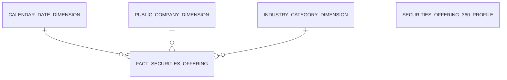
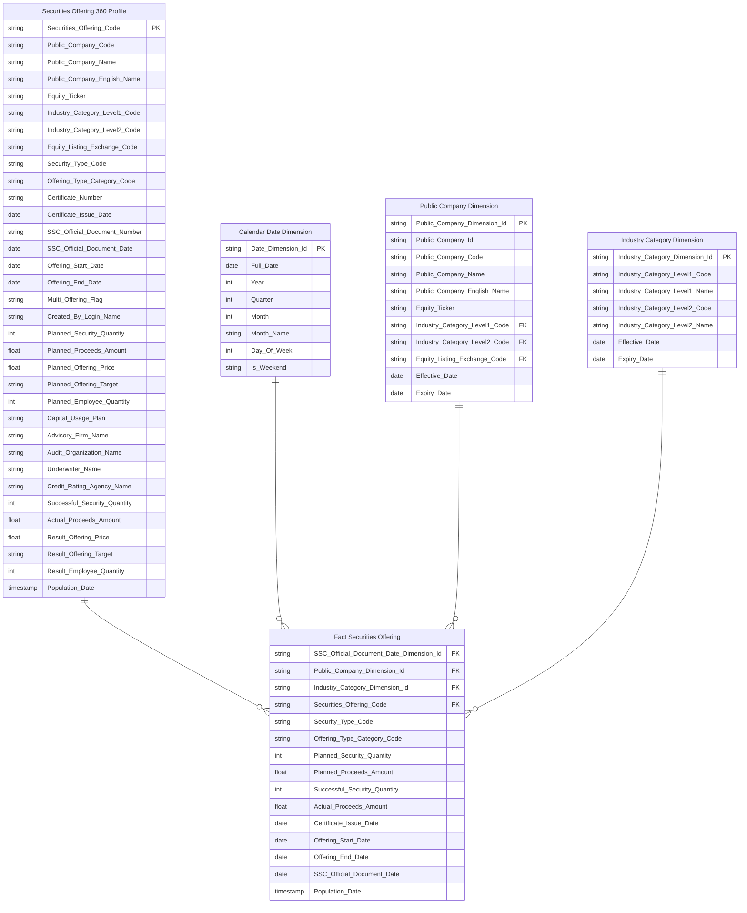
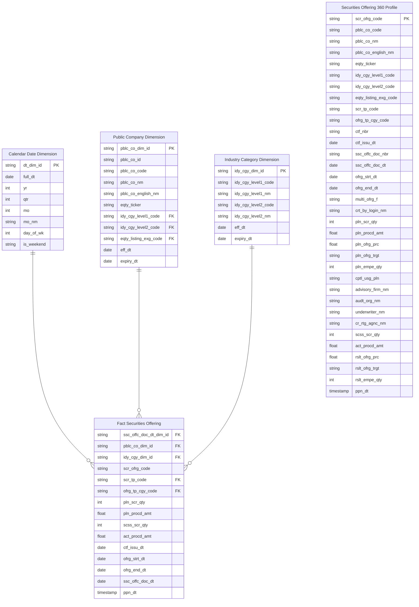

# Thiết kế Cơ sở Dữ liệu — Quản lý chào bán (QLCB)

---

## 1. Mô hình dữ liệu mức High Level / Conceptual

### Sơ đồ ERD

### Danh sách thực thể

| STT | Thực thể | Tên bảng | Mô tả |
|---|---|---|---|
| 1 | Calendar Date Dimension | cdr_dt_dim | Lịch ngày — năm/quý/tháng phục vụ slicer và phân tích theo thời gian |
| 2 | Public Company Dimension | pblc_co_dim | Công ty đại chúng — mã CK / tên / ngành / sàn niêm yết (SCD2) |
| 3 | Industry Category Dimension | idy_cgy_dim | Nhóm ngành — ETL-derived Conformed Dim từ Public Company |
| 4 | Fact Securities Offering | fct_scr_ofrg | Event chào bán/phát hành CK — 1 row per đợt chào bán của 1 công ty đại chúng |
| 5 | Securities Offering 360 Profile | scr_ofrg_360_prfl | Hồ sơ 360° đợt chào bán — tra cứu chi tiết theo 4 nhóm chỉ số |

---

## 2. Mô hình dữ liệu mức Logic

### Sơ đồ ERD

### Danh sách các bảng và thuộc tính

#### Calendar Date Dimension

| STT | Tên trường | Kiểu dữ liệu | Nullable | Unique | P/F Key | Mặc định | Mô tả |
|---|---|---|---|---|---|---|---|
| 1 | Date Dimension Id | string | | X | P | | Surrogate key ETL generated |
| 2 | Full Date | date | X | | | | Ngày dương lịch đầy đủ |
| 3 | Year | int | X | | | | Năm (YYYY) |
| 4 | Quarter | int | X | | | | Quý (1–4) |
| 5 | Month | int | X | | | | Tháng (1–12) |
| 6 | Month Name | string | X | | | | Tên tháng (tiếng Việt) |
| 7 | Day Of Week | int | X | | | | Thứ trong tuần (1=Thứ 2 ... 7=Chủ nhật) |
| 8 | Is Weekend | boolean | X | | | | Cuối tuần (True/False) |

#### Public Company Dimension

| STT | Tên trường | Kiểu dữ liệu | Nullable | Unique | P/F Key | Mặc định | Mô tả |
|---|---|---|---|---|---|---|---|
| 1 | Public Company Dimension Id | string | | X | P | | Surrogate key ETL generated |
| 2 | Public Company Id | string | | | | | Silver surrogate Id của công ty đại chúng. ETL join key. |
| 3 | Public Company Code | string | X | | | | Mã định danh công ty đại chúng (BK nguồn) |
| 4 | Public Company Name | string | X | | | | Tên công ty đại chúng (tiếng Việt) |
| 5 | Public Company English Name | string | X | | | | Tên công ty đại chúng (tiếng Anh) |
| 6 | Equity Ticker | string | X | | | | Mã chứng khoán cổ phiếu |
| 7 | Industry Category Level1 Code | string | | | F | | Mã ngành cấp 1 |
| 8 | Industry Category Level2 Code | string | | | F | | Mã ngành cấp 2 |
| 9 | Equity Listing Exchange Code | string | | | F | | Sàn niêm yết cổ phiếu (HNX/HOSE/UPCoM) |
| 10 | Effective Date | date | X | | | | Ngày hiệu lực SCD2 |
| 11 | Expiry Date | date | X | | | | Ngày hết hiệu lực SCD2 |

#### Industry Category Dimension

| STT | Tên trường | Kiểu dữ liệu | Nullable | Unique | P/F Key | Mặc định | Mô tả |
|---|---|---|---|---|---|---|---|
| 1 | Industry Category Dimension Id | string | | X | P | | Surrogate key ETL generated |
| 2 | Industry Category Level1 Code | string | | | | | Mã ngành cấp 1 (BK) |
| 3 | Industry Category Level1 Name | string | X | | | | Tên ngành cấp 1 (tiếng Việt) |
| 4 | Industry Category Level2 Code | string | X | | | | Mã ngành cấp 2 |
| 5 | Industry Category Level2 Name | string | X | | | | Tên ngành cấp 2 (tiếng Việt) |
| 6 | Effective Date | date | X | | | | Ngày hiệu lực SCD2 |
| 7 | Expiry Date | date | X | | | | Ngày hết hiệu lực SCD2 |

#### Fact Securities Offering

| STT | Tên trường | Kiểu dữ liệu | Nullable | Unique | P/F Key | Mặc định | Mô tả |
|---|---|---|---|---|---|---|---|
| 1 | SSC Official Document Date Dimension Id | string | | | F | | FK lịch theo ngày công văn UBCKNN |
| 2 | Public Company Dimension Id | string | | | F | | FK công ty đại chúng |
| 3 | Industry Category Dimension Id | string | | | F | | FK ngành cấp 1 |
| 4 | Securities Offering Code | string | X | | | | Mã đợt chào bán (Degenerate Dimension) |
| 5 | Security Type Code | string | | | F | | Loại CK phát hành |
| 6 | Offering Type Category Code | string | | | F | | Loại hình chào bán (ETL derived) |
| 7 | Planned Security Quantity | int | X | | | | Tổng số CK dự kiến chào bán |
| 8 | Planned Proceeds Amount | decimal | X | | | | Tổng tiền dự kiến thu được (VNĐ) |
| 9 | Successful Security Quantity | int | X | | | | Tổng số CK chào bán thành công |
| 10 | Actual Proceeds Amount | decimal | X | | | | Tổng tiền thực thu (VNĐ) |
| 11 | Certificate Issue Date | date | X | | | | Ngày cấp GCN chào bán |
| 12 | Offering Start Date | date | X | | | | Ngày bắt đầu chào bán CK |
| 13 | Offering End Date | date | X | | | | Ngày kết thúc chào bán CK |
| 14 | SSC Official Document Date | date | X | | | | Ngày công văn UBCKNN |
| 15 | Population Date | timestamp | X | | | | ETL load timestamp |

---

## 3. Mô hình dữ liệu mức Physical

### Sơ đồ ERD

### Dimension — Calendar Date Dimension (cdr_dt_dim)

*Mô tả bảng:* Lịch ngày — năm/quý/tháng phục vụ slicer và phân tích theo thời gian

*Đường dẫn trên kho dữ liệu:*

*Các trường Partition:*

*Thời gian lưu trữ:*

*Định dạng lưu trữ:*

| STT | Tên trường (Logical) | Tên trường (Physical) | Kiểu dữ liệu | Nullable | Unique | P/F Key | Giá trị mặc định | Mô tả | Silver Table | Silver Field Name | ETL Rules |
|---|---|---|---|---|---|---|---|---|---|---|---|
| 1 | Date Dimension Id | dt_dim_id | string | | X | P | | Surrogate key ETL generated | | | ETL derived |
| 2 | Full Date | full_dt | date | X | | | | Ngày dương lịch đầy đủ | | | ETL derived |
| 3 | Year | yr | int | X | | | | Năm (YYYY) | | | ETL derived |
| 4 | Quarter | qtr | int | X | | | | Quý (1–4) | | | ETL derived |
| 5 | Month | mo | int | X | | | | Tháng (1–12) | | | ETL derived |
| 6 | Month Name | mo_nm | string | X | | | | Tên tháng (tiếng Việt) | | | ETL derived |
| 7 | Day Of Week | day_of_wk | int | X | | | | Thứ trong tuần (1=Thứ 2 ... 7=Chủ nhật) | | | ETL derived |
| 8 | Is Weekend | is_weekend | boolean | X | | | | Cuối tuần (True/False) | | | ETL derived |

### Dimension — Public Company Dimension (pblc_co_dim)

*Mô tả bảng:* Công ty đại chúng — mã CK / tên / ngành / sàn niêm yết (SCD2)

*Đường dẫn trên kho dữ liệu:*

*Các trường Partition:*

*Thời gian lưu trữ:*

*Định dạng lưu trữ:*

| STT | Tên trường (Logical) | Tên trường (Physical) | Kiểu dữ liệu | Nullable | Unique | P/F Key | Giá trị mặc định | Mô tả | Silver Table | Silver Field Name | ETL Rules |
|---|---|---|---|---|---|---|---|---|---|---|---|
| 1 | Public Company Dimension Id | pblc_co_dim_id | string | | X | P | | Surrogate key ETL generated | | | ETL derived |
| 2 | Public Company Id | pblc_co_id | string | | | | | Silver surrogate Id của công ty đại chúng — IDS.company_profiles (PK Silver). ETL join key. | Public Company | Public Company Id | SM1:1 |
| 3 | Public Company Code | pblc_co_code | string | X | | | | Mã định danh công ty đại chúng (BK nguồn) — IDS.company_profiles.id | Public Company | Public Company Code | SM1:1 |
| 4 | Public Company Name | pblc_co_nm | string | X | | | | Tên công ty đại chúng (tiếng Việt) — IDS.company_profiles.company_name_vn | Public Company | Public Company Name | SM1:1 |
| 5 | Public Company English Name | pblc_co_english_nm | string | X | | | | Tên công ty đại chúng (tiếng Anh) — IDS.company_profiles.company_name_en | Public Company | Public Company English Name | SM1:1 |
| 6 | Equity Ticker | eqty_ticker | string | X | | | | Mã chứng khoán cổ phiếu (hiển thị trên UI) — IDS.company_profiles.equity_ticker | Public Company | Equity Ticker | SM1:1 |
| 7 | Industry Category Level1 Code | idy_cgy_level1_code | string | | | F | | Mã ngành cấp 1 — IDS.company_detail.category_l1_id | Public Company | Industry Category Level1 Code | SM1:1 |
| 8 | Industry Category Level2 Code | idy_cgy_level2_code | string | | | F | | Mã ngành cấp 2 — IDS.company_detail.category_l2_id | Public Company | Industry Category Level2 Code | SM1:1 |
| 9 | Equity Listing Exchange Code | eqty_listing_exg_code | string | | | F | | Sàn niêm yết cổ phiếu (HNX/HOSE/UPCoM) — IDS.company_profiles.equity_listing_exch_cd | Public Company | Equity Listing Exchange Code | SM1:1 |
| 10 | Effective Date | eff_dt | date | X | | | | Ngày hiệu lực SCD2 | | | ETL derived |
| 11 | Expiry Date | expiry_dt | date | X | | | | Ngày hết hiệu lực SCD2 (9999-12-31 = bản hiện hành) | | | ETL derived |

### Dimension — Industry Category Dimension (idy_cgy_dim)

*Mô tả bảng:* Nhóm ngành — ETL-derived Conformed Dim từ Public Company.category_l1/l2_id. Tái sử dụng cross-module.

*Đường dẫn trên kho dữ liệu:*

*Các trường Partition:*

*Thời gian lưu trữ:*

*Định dạng lưu trữ:*

| STT | Tên trường (Logical) | Tên trường (Physical) | Kiểu dữ liệu | Nullable | Unique | P/F Key | Giá trị mặc định | Mô tả | Silver Table | Silver Field Name | ETL Rules |
|---|---|---|---|---|---|---|---|---|---|---|---|
| 1 | Industry Category Dimension Id | idy_cgy_dim_id | string | | X | P | | Surrogate key ETL generated | | | ETL derived |
| 2 | Industry Category Level1 Code | idy_cgy_level1_code | string | | | | | Mã ngành cấp 1 (BK) — IDS.company_detail.category_l1_id. ETL extract từ Public Company. | Public Company | Industry Category Level1 Code | SM1:1 |
| 3 | Industry Category Level1 Name | idy_cgy_level1_nm | string | X | | | | Tên ngành cấp 1 (tiếng Việt) — ETL lookup từ bảng danh mục ngành IDS | | | ETL derived |
| 4 | Industry Category Level2 Code | idy_cgy_level2_code | string | X | | | | Mã ngành cấp 2 — IDS.company_detail.category_l2_id | Public Company | Industry Category Level2 Code | SM1:1 |
| 5 | Industry Category Level2 Name | idy_cgy_level2_nm | string | X | | | | Tên ngành cấp 2 (tiếng Việt) — ETL lookup từ bảng danh mục ngành IDS | | | ETL derived |
| 6 | Effective Date | eff_dt | date | X | | | | Ngày hiệu lực SCD2 | | | ETL derived |
| 7 | Expiry Date | expiry_dt | date | X | | | | Ngày hết hiệu lực SCD2 (9999-12-31 = bản hiện hành) | | | ETL derived |

### Fact — Fact Securities Offering (fct_scr_ofrg)

*Mô tả bảng:* Event chào bán/phát hành CK — 1 row per đợt chào bán của 1 công ty đại chúng

*Đường dẫn trên kho dữ liệu:*

*Các trường Partition:*

*Thời gian lưu trữ:*

*Định dạng lưu trữ:*

| STT | Tên trường (Logical) | Tên trường (Physical) | Kiểu dữ liệu | Nullable | Unique | P/F Key | Giá trị mặc định | Mô tả | Silver Table | Silver Field Name | ETL Rules |
|---|---|---|---|---|---|---|---|---|---|---|---|
| 1 | SSC Official Document Date Dimension Id | ssc_offc_doc_dt_dim_id | string | | | F | | FK lịch theo ngày công văn UBCKNN — ETL lookup từ Public Company Securities Offering.SSC Official Document Date | Public Company Securities Offering | SSC Official Document Date | SM1:1 |
| 2 | Public Company Dimension Id | pblc_co_dim_id | string | | | F | | FK công ty đại chúng — ETL lookup từ Public Company Securities Offering.Public Company Id | Public Company Securities Offering | Public Company Id | SM1:1 |
| 3 | Industry Category Dimension Id | idy_cgy_dim_id | string | | | F | | FK ngành cấp 1 — ETL lookup từ Public Company.Industry Category Level1 Code tại thời điểm ssc_official_doc_date | Public Company | Industry Category Level1 Code | SM1:1 |
| 4 | Securities Offering Code | scr_ofrg_code | string | X | | | | Mã đợt chào bán (Degenerate Dimension) — IDS.company_securities_issuance.id | Public Company Securities Offering | Public Company Securities Offering Code | SM1:1 |
| 5 | Security Type Code | scr_tp_code | string | | | F | | Loại CK phát hành — IDS.company_securities_issuance.security_type_cd | Public Company Securities Offering | Security Type Code | SM1:1 |
| 6 | Offering Type Category Code | ofrg_tp_cgy_code | string | | | F | | Loại hình chào bán (ETL derived từ planned_qty cao nhất) | | | ETL derived |
| 7 | Planned Security Quantity | pln_scr_qty | int | X | | | | Tổng số CK dự kiến chào bán — IDS.company_securities_issuance.planned_security_qty | Public Company Securities Offering | Planned Security Quantity | SM1:1 |
| 8 | Planned Proceeds Amount | pln_procd_amt | decimal(23,2) | X | | | | Tổng tiền dự kiến thu được (VNĐ) — IDS.company_securities_issuance.planned_proceeds_am | Public Company Securities Offering | Planned Proceeds Amount | SM1:1 |
| 9 | Successful Security Quantity | scss_scr_qty | int | X | | | | Tổng số CK chào bán thành công — IDS.company_securities_issuance.successful_security_qty | Public Company Securities Offering | Successful Security Quantity | SM1:1 |
| 10 | Actual Proceeds Amount | act_procd_amt | decimal(23,2) | X | | | | Tổng tiền thực thu (VNĐ) — IDS.company_securities_issuance.actual_proceeds_am | Public Company Securities Offering | Actual Proceeds Amount | SM1:1 |
| 11 | Certificate Issue Date | ctf_issu_dt | date | X | | | | Ngày cấp GCN chào bán (lưu thêm làm reference) | Public Company Securities Offering | Certificate Issue Date | SM1:1 |
| 12 | Offering Start Date | ofrg_strt_dt | date | X | | | | Ngày bắt đầu chào bán CK — IDS.company_securities_issuance.offering_start_date | Public Company Securities Offering | Offering Start Date | SM1:1 |
| 13 | Offering End Date | ofrg_end_dt | date | X | | | | Ngày kết thúc chào bán CK — IDS.company_securities_issuance.offering_end_date | Public Company Securities Offering | Offering End Date | SM1:1 |
| 14 | SSC Official Document Date | ssc_offc_doc_dt | date | X | | | | Ngày công văn UBCKNN — FK date chính trên Fact | Public Company Securities Offering | SSC Official Document Date | SM1:1 |
| 15 | Population Date | ppn_dt | timestamp | X | | | | ETL load timestamp | | | ETL derived |

### Operational — Securities Offering 360 Profile (scr_ofrg_360_prfl)

*Mô tả bảng:* Hồ sơ 360° đợt chào bán — tra cứu chi tiết theo 4 nhóm chỉ số (Thông tin cơ sở / Công văn / Cấp phép / Kết quả)

*Đường dẫn trên kho dữ liệu:*

*Các trường Partition:*

*Thời gian lưu trữ:*

*Định dạng lưu trữ:*

| STT | Tên trường (Logical) | Tên trường (Physical) | Kiểu dữ liệu | Nullable | Unique | P/F Key | Giá trị mặc định | Mô tả | Silver Table | Silver Field Name | ETL Rules |
|---|---|---|---|---|---|---|---|---|---|---|---|
| 1 | Securities Offering Code | scr_ofrg_code | string |  | X | P | | Mã đợt chào bán (PK bảng tác nghiệp) — IDS.company_securities_issuance.id | Public Company Securities Offering | Public Company Securities Offering Code | SM1:1 |
| 2 | Public Company Code | pblc_co_code | string | X |  |  | | Mã định danh công ty đại chúng — IDS.company_profiles.id | Public Company | Public Company Code | SM1:1 |
| 3 | Public Company Name | pblc_co_nm | string | X |  |  | | Tên công ty đại chúng (tiếng Việt) — IDS.company_profiles.company_name_vn | Public Company | Public Company Name | SM1:1 |
| 4 | Public Company English Name | pblc_co_english_nm | string | X |  |  | | Tên công ty đại chúng (tiếng Anh) — IDS.company_profiles.company_name_en | Public Company | Public Company English Name | SM1:1 |
| 5 | Equity Ticker | eqty_ticker | string | X |  |  | | Mã chứng khoán cổ phiếu (hiển thị trên UI) — IDS.company_profiles.equity_ticker | Public Company | Equity Ticker | SM1:1 |
| 6 | Industry Category Level1 Code | idy_cgy_level1_code | string | X |  |  | | Mã ngành cấp 1 — IDS.company_detail.category_l1_id | Public Company | Industry Category Level1 Code | SM1:1 |
| 7 | Industry Category Level2 Code | idy_cgy_level2_code | string | X |  |  | | Mã ngành cấp 2 — IDS.company_detail.category_l2_id | Public Company | Industry Category Level2 Code | SM1:1 |
| 8 | Equity Listing Exchange Code | eqty_listing_exg_code | string | X |  |  | | Sàn niêm yết — IDS.company_profiles.equity_listing_exch_cd | Public Company | Equity Listing Exchange Code | SM1:1 |
| 9 | Security Type Code | scr_tp_code | string | X |  |  | | Loại CK phát hành — IDS.company_securities_issuance.security_type_cd. Scheme: IDS_ISSUANCE_SECURITY_TYPE | Public Company Securities Offering | Security Type Code | SM1:1 |
| 10 | Offering Type Category Code | ofrg_tp_cgy_code | string | X |  |  | | Loại hình chào bán (ETL derived) — Scheme: QLCB_OFFERING_TYPE_CATEGORY. Xem O_QLCB_1 (Closed). |  |  | ETL derived |
| 11 | Certificate Number | ctf_nbr | string | X |  |  | | Số GCN chào bán — IDS.company_securities_issuance.certificate_no | Public Company Securities Offering | Certificate Number | SM1:1 |
| 12 | Certificate Issue Date | ctf_issu_dt | date | X |  |  | | Ngày cấp GCN chào bán — IDS.company_securities_issuance.certificate_issue_date | Public Company Securities Offering | Certificate Issue Date | SM1:1 |
| 13 | SSC Official Document Number | ssc_offc_doc_nbr | string | X |  |  | | Số công văn UBCKNN — IDS.company_securities_issuance.ssc_official_doc_no | Public Company Securities Offering | SSC Official Document Number | SM1:1 |
| 14 | SSC Official Document Date | ssc_offc_doc_dt | date | X |  |  | | Ngày ra công văn UBCKNN — IDS.company_securities_issuance.ssc_official_doc_date | Public Company Securities Offering | SSC Official Document Date | SM1:1 |
| 15 | Offering Start Date | ofrg_strt_dt | date | X |  |  | | Ngày bắt đầu chào bán CK — IDS.company_securities_issuance.offering_start_date | Public Company Securities Offering | Offering Start Date | SM1:1 |
| 16 | Offering End Date | ofrg_end_dt | date | X |  |  | | Ngày kết thúc chào bán CK — IDS.company_securities_issuance.offering_end_date | Public Company Securities Offering | Offering End Date | SM1:1 |
| 17 | Multi Offering Flag | multi_ofrg_f | boolean | X |  |  | | Có chào bán nhiều đợt — IDS.company_securities_issuance.multi_offering_flg | Public Company Securities Offering | Multi Offering Flag | SM1:1 |
| 18 | Created By Login Name | crt_by_login_nm | string | X |  |  | | Chuyên viên (login_name kỹ thuật) — IDS.company_securities_issuance.created_by. Xem O_QLCB_5 (Closed). | Public Company Securities Offering | Created By Login Name | SM1:1 |
| 19 | Planned Security Quantity | pln_scr_qty | int | X |  |  | | Tổng số CK dự kiến chào bán — IDS.company_securities_issuance.planned_security_qty | Public Company Securities Offering | Planned Security Quantity | SM1:1 |
| 20 | Planned Proceeds Amount | pln_procd_amt | decimal(23,2) | X |  |  | | Tổng tiền dự kiến thu được (VNĐ) — IDS.company_securities_issuance.planned_proceeds_am | Public Company Securities Offering | Planned Proceeds Amount | SM1:1 |
| 21 | Planned Offering Price | pln_ofrg_prc | decimal(23,2) | X |  |  | | Giá cấp phép theo loại hình chính (ETL pick theo Offering Type Category Code). Xem O_QLCB_5 (Closed). |  |  | ETL derived |
| 22 | Planned Offering Target | pln_ofrg_trgt | string | X |  |  | | Đối tượng cấp phép theo loại hình chính (ETL pick). Xem O_QLCB_5. |  |  | ETL derived |
| 23 | Planned Employee Quantity | pln_empe_qty | int | X |  |  | | Số lượng NLĐ cấp phép theo loại hình chính (ETL pick). Xem O_QLCB_5. |  |  | ETL derived |
| 24 | Capital Usage Plan | cptl_usg_pln | string | X |  |  | | Mục đích sử dụng vốn — IDS.company_securities_issuance.capital_usage_plan | Public Company Securities Offering | Capital Usage Plan | SM1:1 |
| 25 | Advisory Firm Name | advisory_firm_nm | string | X |  |  | | Đơn vị tư vấn — PENDING (nguồn TTHC chưa có Silver). Xem O_QLCB_2. |  |  | ETL derived |
| 26 | Audit Organization Name | audt_org_nm | string | X |  |  | | Tổ chức kiểm toán — PENDING (nguồn TTHC chưa có Silver). Xem O_QLCB_2. |  |  | ETL derived |
| 27 | Underwriter Name | underwriter_nm | string | X |  |  | | Đơn vị bảo lãnh — PENDING (nguồn TTHC chưa có Silver). Xem O_QLCB_2. |  |  | ETL derived |
| 28 | Credit Rating Agency Name | cr_rtg_agnc_nm | string | X |  |  | | Đơn vị xếp hạng tín nhiệm — PENDING (nguồn TTHC chưa có Silver). Xem O_QLCB_2. |  |  | ETL derived |
| 29 | Successful Security Quantity | scss_scr_qty | int | X |  |  | | Tổng số CK chào bán thành công — IDS.company_securities_issuance.successful_security_qty | Public Company Securities Offering | Successful Security Quantity | SM1:1 |
| 30 | Actual Proceeds Amount | act_procd_amt | decimal(23,2) | X |  |  | | Tổng tiền thực thu (VNĐ) — IDS.company_securities_issuance.actual_proceeds_am | Public Company Securities Offering | Actual Proceeds Amount | SM1:1 |
| 31 | Result Offering Price | rslt_ofrg_prc | decimal(23,2) | X |  |  | | Giá thực tế theo loại hình chính (ETL pick). Xem O_QLCB_5. |  |  | ETL derived |
| 32 | Result Offering Target | rslt_ofrg_trgt | string | X |  |  | | Đối tượng thực tế theo loại hình chính (ETL pick). Xem O_QLCB_5. |  |  | ETL derived |
| 33 | Result Employee Quantity | rslt_empe_qty | int | X |  |  | | Số lượng NLĐ thực tế theo loại hình chính (ETL pick). Xem O_QLCB_5. |  |  | ETL derived |
| 34 | Population Date | ppn_dt | timestamp | X |  |  | | ETL load timestamp |  |  | ETL derived |