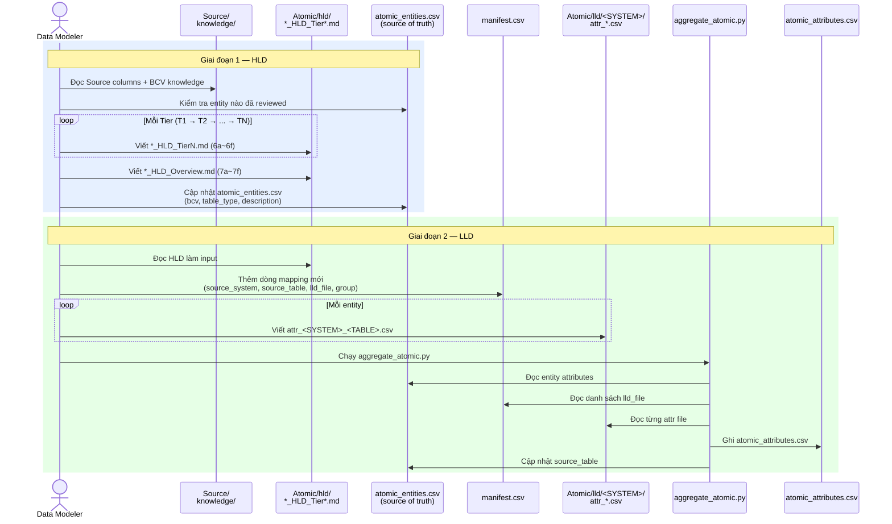
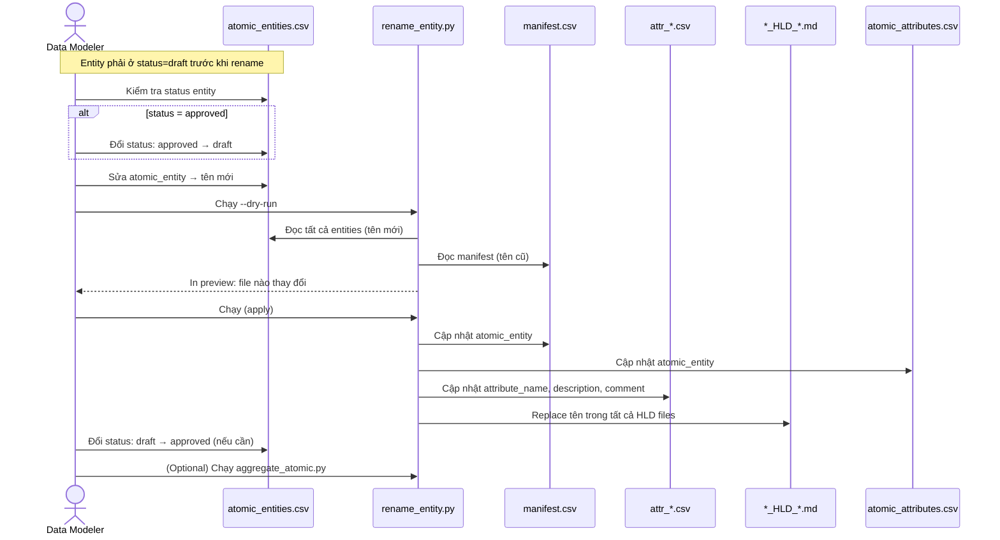
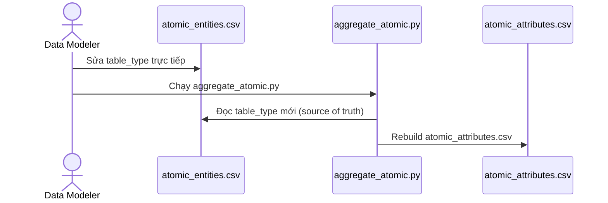

# UBCK Data Model — Atomic Layer Design Repository

> **Mục đích:** Lưu trữ và quản lý thiết kế HLD và LLD cho Atomic layer trên kiến trúc Medallion (Bronze / Atomic / Gold), phục vụ dự án Lakehouse của UBCKNN.

---

## Cấu trúc thư mục

```
ubck_atomic_design/
├── Atomic/
│   ├── hld/                                      # HLD — thiết kế mức entity
│   │   ├── <SYSTEM>_HLD_Tier<N>.md               # Thiết kế theo Tier dependency
│   │   ├── <SYSTEM>_HLD_Overview.md              # Tổng quan toàn bộ source system
│   │   ├── atomic_entities.csv                   # Tổng hợp tất cả Atomic entities (source of truth)
│   │   └── atomic_out_of_scope.csv               # Bảng ngoài scope Atomic (auto-gen từ 7f)
│   └── lld/
│       ├── DCST/                                 # Source system: DCST
│       │   └── attr_DCST_<TABLE>.csv
│       ├── FMS/                                  # Source system: FMS
│       │   └── attr_FMS_<TABLE>.csv
│       ├── NHNCK/                                # Source system: NHNCK
│       │   └── attr_NHNCK_<TABLE>.csv
│       ├── scripts/
│       │   ├── aggregate_atomic.py               # Script tổng hợp attributes + entities
│       │   ├── aggregate_out_of_scope.py         # Script tổng hợp bảng ngoài scope từ 7f
│       │   ├── rename_entity.py                  # Script propagate đổi tên entity
│       │   ├── check_consistency.py              # Script kiểm tra nhất quán HLD vs atomic_entities.csv
│       │   └── post_check_source_coverage.py     # Script kiểm tra coverage 2 chiều: source vs Atomic
│       ├── manifest.csv                          # Danh sách tất cả LLD files + entity mapping
│       ├── pending_design.csv                    # Cột nguồn chưa thiết kế (intentionally deferred)
│       ├── ref_shared_entity_classifications.csv # Chuẩn hóa Classification Value scheme/code
│       └── atomic_attributes.csv                 # Tổng hợp tất cả attributes (auto-gen)
├── Source/                                       # Cấu trúc CSDL nguồn
│   ├── <SYSTEM>_Source_Tables.*
│   └── <SYSTEM>_Source_Columns.*
├── knowledge/                                    # BCV knowledge base
│   ├── terms.csv
│   ├── term_relationships.csv
│   └── reference_data_sets.csv
└── .claude/
    └── skills/
        ├── SKILL_HLD.md                          # Quy trình thiết kế HLD
        └── SKILL_LLD.md                          # Quy trình thiết kế LLD
```

---

## Quy trình thiết kế

### Tổng quan luồng thiết kế



---

### Quy trình đổi tên entity



---

### Quy trình sửa table_type



---

### Giai đoạn 1 — HLD (High-Level Design)

**Mục tiêu:** Xác định Atomic entities, BCV Concept, và quan hệ giữa entities. Chưa đi vào chi tiết từng cột.

#### Input

| Loại | Vị trí |
|---|---|
| Cấu trúc CSDL nguồn | `Source/*_Tables.*`, `*_Columns.*` |
| BCV knowledge base | `knowledge/terms.csv`, `term_relationships.csv`, `reference_data_sets.csv` |
| HLD source system liên quan (nếu có) | `Atomic/hld/*.md` |

#### Phương pháp

**Phân tầng theo dependency — không theo nhóm nghiệp vụ:**

| Tier | Định nghĩa |
|---|---|
| Tier 1 | Không FK đến bảng nghiệp vụ nào (chỉ FK đến danh mục) |
| Tier 2 | FK đến entity Tier 1 |
| Tier N | FK đến entity Tier N-1 |

Quy tắc bổ sung:
- Nhiều entity cùng mức dependency → gộp vào 1 Tier
- Circular reference trong cùng Tier → giữ nguyên, ghi vào mục 6f
- Nếu source system đã có cách đặt tên Tier riêng → vẫn phải phân tích lại dependency từ đầu

**Phân loại bảng nguồn:**

| Loại | Xử lý |
|---|---|
| Bảng có instance data | → Atomic entity |
| Bảng chỉ có Code + Name | → Classification Value (không tạo entity) |
| Junction chỉ 2 trường FK | → Denormalize thành ARRAY trên entity cha |
| Audit Log / Snapshot nguồn | → Ngoài scope Atomic |
| Bảng chưa có cột | → Ghi vào 6e, chờ thông tin |

**Tra BCV bắt buộc** trước khi gán Concept — grep trên `knowledge/`, kiểm tra bằng cấu trúc trường thực tế, không suy luận từ tên bảng.

#### Output mỗi Tier — `<SYSTEM>_HLD_Tier<N>.md`

| Mục | Nội dung |
|---|---|
| **6a** | Bảng tổng quan BCV Concept — entity mới của Tier kèm lý do chọn BCV Term |
| **6b** | Diagram Source (Mermaid) — FK giữa các bảng nguồn |
| **6c** | Diagram Atomic (Mermaid) — Atomic entities và quan hệ |
| **6d** | Danh mục & Tham chiếu — bảng nguồn map thành Classification Value |
| **6e** | Bảng chờ thiết kế — bảng chưa có cột |
| **6f** | Điểm cần xác nhận — câu hỏi mở cần người thiết kế quyết định |

#### Output sau Tier cuối — `<SYSTEM>_HLD_Overview.md`

| Mục | Nội dung |
|---|---|
| **7a** | Bảng tổng quan tất cả Atomic entities (gộp 6a mọi Tier, thêm cột Tier) |
| **7b** | Diagram Atomic tổng — 1 diagram toàn bộ data model |
| **7c** | Toàn bộ Classification Value |
| **7d** | Toàn bộ junction table và cách denormalize |
| **7e** | Toàn bộ điểm cần xác nhận còn mở |
| **7f** | Toàn bộ bảng ngoài scope |

Sau HLD Overview → cập nhật `Atomic/hld/atomic_entities.csv`.

---

### Giai đoạn 2 — LLD (Low-Level Design)

**Mục tiêu:** Thiết kế chi tiết từng attribute — tên, data domain, FK target, nullable, source column mapping.

**Điều kiện tiên quyết:** HLD đã được duyệt.

#### Input

| Loại | Vị trí |
|---|---|
| HLD Overview + HLD Tier tương ứng | `Atomic/hld/*.md` |
| Cấu trúc CSDL nguồn | `Source/*_Columns.*` |
| LLD đã có cùng source system | `Atomic/lld/<SYSTEM>/attr_*.csv` |
| LLD entity tương đồng source khác | `Atomic/lld/<OTHER>/attr_*.csv` |
| Classification Value đã chuẩn hóa | `Atomic/lld/ref_shared_entity_classifications.csv` |
| Danh sách entity đã có | `Atomic/lld/manifest.csv` |

#### Quy tắc mapping cột nguồn

| Loại trường | Quy tắc |
|---|---|
| PK bảng nguồn | → Entity Code (BK), data domain = `Text` |
| FK đến Fundamental entity | → Cặp `[Entity] Id` (`Surrogate Key`) + `[Entity] Code` (`Text`) |
| FK đến Classification Value / danh mục | → 1 trường Code duy nhất, data domain = `Classification Value` |
| Địa chỉ / liên lạc / giấy tờ (grain = 1 IP) | → Tách ra file shared entity riêng |

**12 Data Domain chuẩn:** Text, Date, Timestamp, Currency Amount, Interest Rate, Exchange Rate, Percentage, Surrogate Key, Classification Value, Indicator, Boolean, Small Counter.

#### Cột `table_type` trong manifest và atomic_entities

Mỗi entity có 1 giá trị `table_type` xác định ETL pattern trên Delta Lake:

| table_type | Ý nghĩa | ETL pattern |
|---|---|---|
| `Fundamental` | Entity chính, Tier 1, surrogate key, lifecycle riêng | SCD2, upsert |
| `Relative` | Entity phụ thuộc, FK đến Fundamental | SCD1 hoặc SCD2 |
| `Fact Append` | Log, sự kiện, giao dịch — không update | Insert-only |
| `Snapshot` | Full load định kỳ, chụp trạng thái toàn bộ | Replace partition |

Lưu trong `atomic_entities.csv` — `aggregate_atomic.py` đọc từ đây khi rebuild `atomic_attributes.csv`.

---

#### Output mỗi entity — `attr_<SYSTEM>_<SourceTable>.csv`

Cấu trúc 10 cột:

| Cột | Mô tả |
|---|---|
| `attribute_name` | Tên attribute trên Atomic (tiếng Anh) |
| `description` | Mô tả gốc nguồn + mô tả bổ sung model |
| `data_domain` | 1 trong 12 Data Domain chuẩn |
| `nullable` | `true` / `false` |
| `is_primary_key` | `true` / `false` |
| `status` | `draft` / `approved` |
| `source_columns` | Fully qualified: `SYSTEM.schema.Table.Column` |
| `comment` | FK target, Scheme code, lý do thiết kế |
| `classification_context` | Shared entity: `SCHEME=VALUE` (1 dòng / 1 context) |
| `etl_derived_value` | Giá trị ETL-derived cố định (không lấy từ cột nguồn) |

Sau mỗi file attr → cập nhật `manifest.csv` và `ref_shared_entity_classifications.csv`.

#### Grain của `manifest.csv` và quan hệ với ETL

**Grain:** `1 dòng manifest = 1 ETL job = 1 (atomic_entity × source_table)`

Mỗi dòng đại diện cho việc load dữ liệu từ **1 bảng nguồn** vào **1 bảng đích Atomic**. Các trường hợp phổ biến:

| Pattern | Ví dụ | Số dòng manifest |
|---|---|---|
| 1 bảng nguồn → 1 Atomic entity | `FIMS.AUTHOANNOUNCE → Disclosure Authorization` | 1 |
| 1 bảng nguồn → nhiều Atomic entity | `FMS.SECURITIES → Fund Management Company + Involved Party Postal Address + ...` | N dòng (1 job / entity) |
| Nhiều bảng nguồn → 1 Atomic entity | `FMS.SECURITIES + FIMS.FUNDCOMPANY → Fund Management Company` | N dòng (1 job / source) |

Phân biệt **context** (addr_type, source_system) là logic **bên trong** từng ETL job — không phản ánh ở cấp manifest.

Khi implement ETL, mỗi job tra `atomic_attributes.csv` với filter:

```
source_system = X  AND  source_table = Y
```

để lấy toàn bộ mapping detail (source_column, classification_context) cho job đó. Cột `classification_context` trong `atomic_attributes.csv` xác định điều kiện lọc dữ liệu:

```
Source System Code = 'FIMS_AUTHOANNOUNCE'
Source System Code = 'FMS_SECURITIES' | Address Type Code = 'HEAD_OFFICE'
```

#### Bước tổng hợp cuối

```bash
cd <workspace_root>
python Atomic/lld/scripts/aggregate_atomic.py
```

Script tự động sinh:
- `Atomic/lld/atomic_attributes.csv` — toàn bộ attributes (13 cột)
- `Atomic/hld/atomic_entities.csv` — cập nhật `source_table` nếu có source mới (7 cột)

> **Lưu ý:** `aggregate_atomic.py` đọc `bcv_core_object`, `bcv_concept`, `table_type`, `description` từ `atomic_entities.csv` (source of truth) — không ghi đè các cột này.

#### Post-check sau khi aggregate

Sau khi chạy `aggregate_atomic.py`, chạy thêm script kiểm tra chất lượng:

```bash
python Atomic/lld/scripts/post_check_source_coverage.py
```

Script thực hiện **2 chiều kiểm tra**:

| Check | Hướng | Mô tả |
|---|---|---|
| **CHECK A** | Source → Atomic | Cột nguồn đã trong manifest nhưng chưa có mapping trong `atomic_attributes.csv` |
| **CHECK B** | Atomic → Source | `source_column` trong Atomic trỏ đến cột không tồn tại trong `Source/*_Columns.csv` |

Output phân loại thành 3 nhóm:

| Nhóm | Ký hiệu | Ý nghĩa |
|---|---|---|
| Chưa map | `- column` | Cần thiết kế hoặc thêm vào `pending_design.csv` |
| Pending | `~ column` | Đã ghi nhận trong `pending_design.csv`, chờ xử lý |
| Ghost mapping | `⚠ entity.attr` | Tên cột trong Atomic không tồn tại ở nguồn — cần sửa attr file |

**Các tùy chọn lọc:**

```bash
python Atomic/lld/scripts/post_check_source_coverage.py --source SCMS      # chỉ kiểm tra nguồn SCMS
python Atomic/lld/scripts/post_check_source_coverage.py --table CTCK_THONG_TIN  # chỉ 1 bảng
```

**Xử lý kết quả:**

| Check | Nguyên nhân phổ biến | Hành động |
|---|---|---|
| CHECK A — cột chưa map | Quên thiết kế hoặc bảng mới thêm vào manifest | Tạo/cập nhật attr file, hoặc thêm vào `pending_design.csv` |
| CHECK A — cột pending | Cố ý defer | Theo dõi trong `pending_design.csv`, xử lý khi đến Tier tiếp theo |
| CHECK B — ghost mapping | Tên cột gõ sai hoặc source đổi schema | Sửa `source_columns` trong attr file tương ứng |

**`pending_design.csv`** — file ghi nhận các cột nguồn cố ý chưa thiết kế:

| Cột | Mô tả |
|---|---|
| `source_system` | Tên source system |
| `source_table` | Tên bảng nguồn |
| `source_column` | Tên cột (hoặc `(all)` cho toàn bảng) |
| `description` | Mô tả cột |
| `reason` | Lý do defer |
| `action` | Bước xử lý tiếp theo |

---

### Quy trình đổi tên Atomic entity (sau review)

Khi cần rename một Atomic entity (ví dụ: `High Risk Taxpayer Assessment` → `High Risk Taxpayer Assessment Snapshot`):

**Điều kiện:** Entity phải có `status=draft`. Nếu đang `approved` → đổi về `draft` trước.

**Bước 1 — Sửa `atomic_entities.csv`:**

| Cột | Thay đổi |
|---|---|
| `atomic_entity` | Đổi sang tên mới |
| `status` | Đảm bảo là `draft` (đổi về `draft` nếu đang `approved`) |

**Bước 2 — Preview trước khi apply:**

```bash
python Atomic/lld/scripts/rename_entity.py --dry-run
```

Script in ra danh sách tất cả file và số lần thay thế — kiểm tra trước khi ghi.

**Bước 3 — Apply:**

```bash
python Atomic/lld/scripts/rename_entity.py
```

Script tự động propagate tên mới ra:
- `Atomic/lld/manifest.csv` (cột `atomic_entity` — giữ sync)
- `Atomic/lld/atomic_attributes.csv`
- `Atomic/lld/<SYSTEM>/attr_<TABLE>.csv` (attribute name prefix + description)
- Tất cả HLD Markdown files (`*_HLD_Tier*.md`, `*_HLD_Overview.md`)
- `Atomic/lld/ref_shared_entity_classifications.csv`

**Bước 4 — (Optional) Refresh aggregate:**

```bash
python Atomic/lld/scripts/aggregate_atomic.py
```

Chạy nếu cần rebuild hoàn toàn `atomic_attributes.csv`.

> **Approved lock:** Nếu entity có `status=approved`, `rename_entity.py` sẽ từ chối thực thi và báo lỗi. Phải đổi `status` về `draft` trước khi rename.

### Quy trình sửa table_type (sau review)

Khi cần sửa `table_type` của một entity:

1. Sửa cột `table_type` trong `Atomic/hld/atomic_entities.csv`
2. Chạy `aggregate_atomic.py` → `atomic_attributes.csv` được rebuild với bcv fields đúng

Không cần sửa manifest — `table_type` chỉ lưu trong `atomic_entities.csv`.

---

### Kiểm tra nhất quán HLD vs atomic_entities (sau khi re-run thiết kế)

Khi cập nhật quy tắc thiết kế và chạy lại HLD, có nguy cơ tên entity trong HLD bị ghi đè khác với tên trong `atomic_entities.csv`. Dùng script này để phát hiện xung đột:

```bash
python Atomic/lld/scripts/check_consistency.py
```

Script so sánh tất cả entity name trong HLD Markdown files với `atomic_entities.csv` và báo cáo:

| Kết quả | Ý nghĩa |
|---|---|
| `OK` | Tất cả entities nhất quán với HLD |
| `CONFLICT` | Entity trong HLD có tên khác `atomic_entities.csv` — cần sửa HLD |
| `WARN` | Entity không tìm thấy trong bất kỳ HLD file nào |

**Các tùy chọn:**

```bash
python Atomic/lld/scripts/check_consistency.py --source FMS     # chỉ kiểm tra FMS
python Atomic/lld/scripts/check_consistency.py --fix-hints      # in gợi ý cách sửa
```

**Quy tắc xử lý khi có CONFLICT:**

- Entity `status=approved` bị CONFLICT → **bắt buộc sửa** (exit code 1)
- Entity `status=draft` không tìm thấy trong HLD → WARN (exit code 0, chỉ cảnh báo)
- Nếu HLD đang dùng tên cũ → cập nhật HLD theo tên trong `atomic_entities.csv`
- Nếu muốn đổi tên mới → đảm bảo entity ở `status=draft`, sửa `atomic_entities.csv`, rồi chạy `rename_entity.py`
- Không bao giờ sửa ngược `atomic_entities.csv` theo HLD nếu `status=approved`

---

## Trạng thái thiết kế

| Status | Ý nghĩa |
|---|---|
| `draft` | Đang thiết kế — tên entity và table_type có thể thay đổi |
| `approved` | Đã duyệt — tên entity và table_type bị LOCKED, không thể rename qua script |

Để rename entity đang `approved`: đổi `status → draft` trong `atomic_entities.csv` trước, sau đó mới chạy `rename_entity.py`.

---

## Source systems hiện tại

### NHNCK — Người Hành Nghề Chứng Khoán

| Tier | Số entities | HLD file |
|---|---|---|
| Tier 1 | 4 entities | `NHNCK_HLD_Tier1.md` |
| Tier 2 | 4 entities | `NHNCK_HLD_Tier2.md` |
| Tier 3 | 12 entities | `NHNCK_HLD_Tier3.md` |
| Tier 4 | 7 entities | `NHNCK_HLD_Tier4.md` |

LLD: 34 files trong `Atomic/lld/NHNCK/` — tất cả `draft`.

### DCST — Dữ liệu Cơ quan Thuế

| Tier | Số entities | HLD file |
|---|---|---|
| Tier 1 | 3 entities | `DCST_HLD_Tier1.md` |
| Tier 2 | 6 entities | `DCST_HLD_Tier2.md` |
| Tier 3 | 2 entities | `DCST_HLD_Tier3.md` |

LLD: 14 files trong `Atomic/lld/DCST/` — tất cả `draft`.

### FMS — Quản lý Giám sát Quỹ và Công ty Chứng khoán

| Tier | Số entities | HLD file |
|---|---|---|
| Tier 1 | 7 entities | `FMS_HLD_Tier1.md` |
| Tier 2 | 7 entities | `FMS_HLD_Tier2.md` |
| Tier 3 | 5 entities | `FMS_HLD_Tier3.md` |
| Tier 4 | 3 entities | `FMS_HLD_Tier4.md` |

LLD: 38 files trong `Atomic/lld/FMS/` — tất cả `draft`.

---

## Tham chiếu nhanh

| Tài liệu | Vị trí |
|---|---|
| Quy trình thiết kế HLD | `.claude/skills/SKILL_HLD.md` |
| Quy trình thiết kế LLD | `.claude/skills/SKILL_LLD.md` |
| HLD files | `Atomic/hld/` |
| LLD files | `Atomic/lld/<SYSTEM>/` |
| Tổng hợp entities | `Atomic/hld/atomic_entities.csv` |
| Tổng hợp attributes | `Atomic/lld/atomic_attributes.csv` |
| Manifest (source of truth) | `Atomic/lld/manifest.csv` |
| Shared Entity Classifications | `Atomic/lld/ref_shared_entity_classifications.csv` |
| Script tổng hợp | `Atomic/lld/scripts/aggregate_atomic.py` |
| Script post-check coverage | `Atomic/lld/scripts/post_check_source_coverage.py` |
| Script đổi tên entity | `Atomic/lld/scripts/rename_entity.py` |
| Script kiểm tra nhất quán HLD | `Atomic/lld/scripts/check_consistency.py` |
| Cột nguồn chưa thiết kế | `Atomic/lld/pending_design.csv` |
| BCV knowledge base | `knowledge/` |
