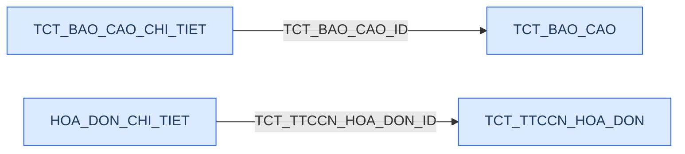
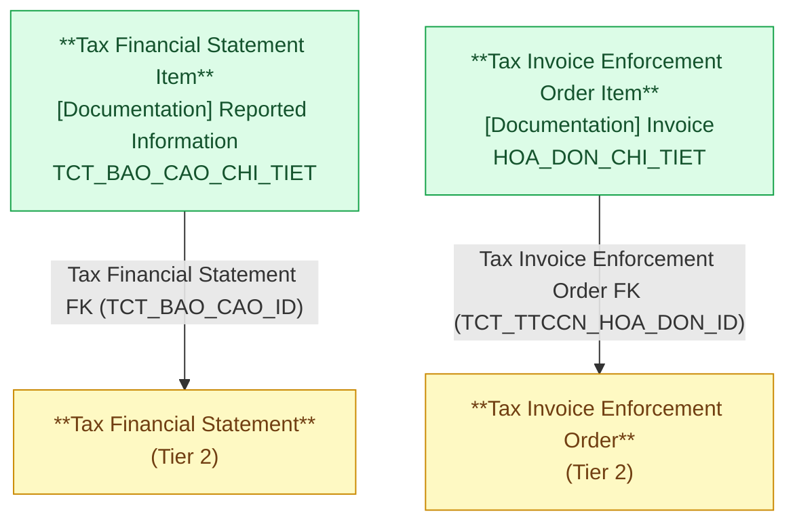

# DCST — HLD Tier 3: Phụ thuộc Tier 2

> **Phụ thuộc Tier 1:** Registered Taxpayer
> **Phụ thuộc Tier 2:** Tax Financial Statement, Tax Invoice Enforcement Order
>
> **Thiết kế theo:** [DCST_HLD_Overview.md](DCST_HLD_Overview.md)

---

## 6a. Bảng tổng quan BCV Concept

| BCV Core Object | BCV Concept | Category | Source Table | Mô tả bảng nguồn | Silver Entity | BCV Term |
|---|---|---|---|---|---|---|
| Documentation | [Documentation] Reported Information | Reported Information | TCT_BAO_CAO_CHI_TIET | Chi tiết từng chỉ tiêu trong báo cáo tài chính | Tax Financial Statement Item | Reported Information — *"Identifies a Documentation Item that contains information reported within a broader report."* Cấu trúc trường: mã/tên chỉ tiêu, tên sheet, 18 cột số liệu (wide table pattern), thông tin người lập/ký. FK đến TCT_BAO_CAO. |
| Documentation | [Documentation] Invoice | Invoice | HOA_DON_CHI_TIET | Chi tiết từng hóa đơn trong quyết định ngừng sử dụng hóa đơn | Tax Invoice Enforcement Order Item | Invoice — entity con của Tax Invoice Enforcement Order. Cấu trúc trường: ký hiệu mẫu, ký hiệu hóa đơn, số hóa đơn, loại hóa đơn. FK đến TCT_TTCCN_HOA_DON. |

---

## 6b. Diagram Source (Mermaid)

---

## 6c. Diagram Silver (Mermaid)

---

## 6d. Danh mục & Tham chiếu

| Source Table | Mô tả | Scheme Code dự kiến | Ghi chú |
|---|---|---|---|
| HOA_DON_CHI_TIET.LOAI_HOA_DON | Loại hóa đơn | INVOICE_TYPE | Phân loại hóa đơn theo quy định BTC. |

---

## 6e. Bảng chờ thiết kế

Không có bảng nào trong Tier 3 chưa đủ thông tin cột.

---

## 6f. Điểm cần xác nhận

| # | Câu hỏi | Ảnh hưởng |
|---|---|---|
| 1 | `TCT_BAO_CAO_CHI_TIET.HOATDONGLIENTUC` và `HOATDONGKHONGLIENTUC` — giá trị là gì (Y/N, 0/1, text)? | Nếu binary → chuyển sang Boolean. Hiện giữ Text. |
| 2 | Wide table TCT_BAO_CAO_CHI_TIET có các cột số liệu kiểu VARCHAR(100) — có cần normalize sang Currency Amount + currency code không? | Nếu luôn là VND và không có ngoại lệ → có thể giữ Text, làm sạch ở Gold. Nếu cần tính toán ở Silver → cần xác nhận đơn vị và chuyển kiểu. |
| 3 | HOA_DON_CHI_TIET.SO_HOA_DON — kiểu dữ liệu nguồn là gì? Có thể có leading zero không? | Ảnh hưởng cách map: nếu có leading zero → giữ Text, không ép NUMBER. |

---

## Entities trong Tier 3

### 1. Tax Financial Statement Item
**Source:** `TCT_BAO_CAO_CHI_TIET` | **BCV Concept:** [Documentation] Reported Information | **BCO:** Documentation

**Grain:** 1 dòng = 1 chỉ tiêu trong 1 tờ khai báo cáo tài chính.

**Attributes chính:** FK đến Tax Financial Statement (Id + Code), Line Item Code/Name/Note, Sheet Name, Year End/Start Amount, Current/Prior Year Amount, Current/Prior Year Opening/Closing Balance, Current/Prior Year Increase/Decrease Amount, Prior Year Decrease Amount, Preparer Name, Chief Accountant Name, Report Preparation Date, Director Name, Auditor License Number, Audit Firm Name, Going Concern Indicator, Non Going Concern Indicator.

**Lưu ý:** Wide table — giữ nguyên 18 cột số liệu, không pivot. Tất cả giá trị số từ nguồn là VARCHAR → giữ Text trên Silver.

---

### 2. Tax Invoice Enforcement Order Item
**Source:** `HOA_DON_CHI_TIET` | **BCV Concept:** [Documentation] Invoice | **BCO:** Documentation

**Grain:** 1 dòng = 1 hóa đơn trong 1 quyết định ngừng sử dụng hóa đơn.

**Attributes chính:** FK đến Tax Invoice Enforcement Order (Id + Code), Invoice Template Symbol, Invoice Series Symbol, Invoice Number, Invoice Type Code.

**Lưu ý:** Ba trường Invoice Template Symbol + Invoice Series Symbol + Invoice Number cùng định danh duy nhất 1 hóa đơn theo quy định BTC.

---

## Attribute Summary

| Silver Entity | # Attributes | PK | Key FKs |
|---|---|---|---|
| Tax Financial Statement Item | 28 | Tax Financial Statement Item Id | Tax Financial Statement |
| Tax Invoice Enforcement Order Item | 6 | Tax Invoice Enforcement Order Item Id | Tax Invoice Enforcement Order |
