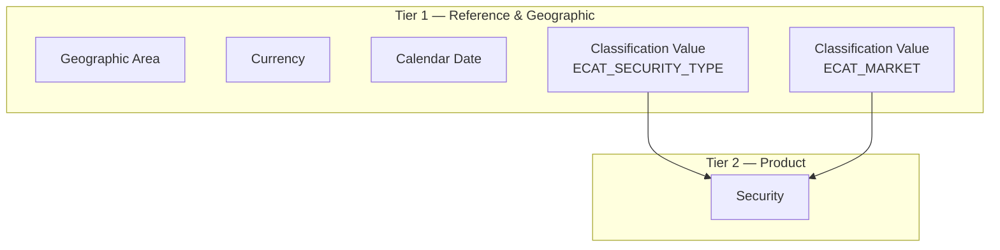
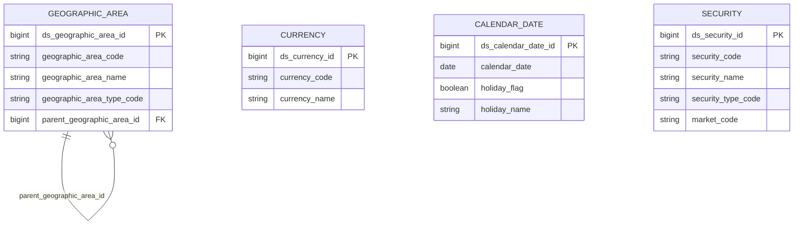

# ECAT — HLD Overview

**Source system:** ECAT — dịch vụ đồng bộ danh mục dùng chung từ HTTT về ứng dụng Kho CSDL của UBCKNN.
**Mô tả:** ECAT cung cấp 46 danh mục nền tảng (quốc gia, vùng miền, địa giới hành chính, tiền tệ, chứng khoán, chức vụ, loại báo cáo, trạng thái...). Scope trong dự án Silver: ECAT là **source chuẩn (authoritative)** cho danh mục Currency, Security (Code + Name), holiday flag của Calendar Date, và toàn bộ danh mục hành chính Việt Nam trên Geographic Area. Phần lớn các bảng còn lại (36/46) là Classification Value scheme — không tạo Silver entity riêng.

**Input:** File tham chiếu `Source/ECAT_Category.csv` (liệt kê 46 danh mục). Không có file `ECAT_Tables.csv` / `ECAT_Columns.csv` — mặc định mọi bảng schema = `Code + Name` (+ `parent_code` với bảng phân cấp). Giả định này được user xác nhận.

---

## Tổng quan Silver Entities

| Tier | Silver Entity | BCV Core Object | BCV Concept | table_type | Source Table(s) | Ghi chú |
|---|---|---|---|---|---|---|
| T1 | Geographic Area | Location | [Location] Geographic Area | Fundamental | ECAT.ECAT_01_Country, ECAT.ECAT_02_Region, ECAT.ECAT_03_ProvinceOld, ECAT.ECAT_04_Province, ECAT.ECAT_05_DistrictOld, ECAT.ECAT_06_WardOld, ECAT.ECAT_07_Ward | Shared entity (đã approved) — ECAT bổ sung source cho 7 danh mục hành chính VN. |
| T1 | Currency | Common | [Common] Currency | Fundamental | ECAT.ECAT_11_Currency | Shared entity mới — ECAT là source chuẩn. |
| T1 | Calendar Date | Common | [Common] Time Period (Calendar Day) | Fundamental | ECAT.ECAT_29_HolidayInfo | Entity mới. |
| T2 | Security | Product | [Product] Security Instrument | Fundamental | ECAT.ECAT_14_Security | Shared entity mới — ECAT là source chuẩn cho Code + Name. |

**Tổng: 4 Silver entities** (3 Tier 1, 1 Tier 2)
*(Trong đó: 3 shared entities — Geographic Area extend nguồn đã approved; Currency + Security là entity shared mới, dự kiến được các source khác extend attribute sau.)*

---

## Diagram Phân tầng Dependencies (Mermaid)

---

## Quyết định thiết kế chính

| # | Quyết định | Lý do |
|---|---|---|
| D-01 | Coi ECAT là source authoritative cho Currency, Security (Code + Name), Calendar Date | User chốt trong thiết kế HLD: các hệ thống khác đồng bộ danh mục này về từ HTTT qua ECAT. |
| D-02 | 35/46 danh mục thuần đi vào Classification Value, không tạo Silver entity riêng | Áp dụng quy tắc #11 CLAUDE.md (bảng Code + Name không phải Silver entity) + hướng dẫn skill. Ngoại lệ: Geographic Area (theo ngoại lệ skill), Currency (quy tắc #4 data domain), Security (instance data mã CK), Calendar Date (entity Time Period mới). |
| D-03 | Tỉnh/Quận/Phường cũ (ECAT_03, 05, 06) dùng `geographic_area_type_code` riêng (PROVINCE_OLD, DISTRICT_OLD, WARD_OLD) song song với type chuẩn (PROVINCE, WARD) | Sáp nhập hành chính 2025 bỏ cấp quận/huyện và đổi tên nhiều tỉnh/phường. Giữ song song 2 bộ cho phép data instance lịch sử vẫn tra cứu được; data mới mặc định FK về danh mục chuẩn (mới). |
| D-04 | Mục 16 (Danh mục chỉ tiêu) xử lý Classification Value scheme `ECAT_BUSINESS_INDICATOR` | User chốt là chỉ tiêu nghiệp vụ chung (không phải risk indicator) — không reuse QLRR Risk Indicator entity. |
| D-05 | Calendar Date được ETL tự sinh dense; ECAT_29 chỉ map 2 trường `holiday_flag` + `holiday_name` | User chốt: ECAT chỉ gửi danh sách ngày nghỉ; bảng Calendar Date nền tự ETL generate đủ dense để nghiệp vụ dùng xuyên suốt. |
| D-06 | Currency code tuân chuẩn ISO 4217 (3 ký tự) | User chốt; không cần bảng mapping nội bộ↔ISO. |
| D-07 | Security Code unique toàn thị trường → BK = `security_code` đơn | User chốt; không cần kết hợp `market_code`. |
| D-08 | Ghi nhận pending khảo sát mapping FK tỉnh/phường cũ↔mới cho các source downstream | Data instance các source mặc định FK về danh mục mới; khi mapping từng source cần kiểm tra và migration code cũ nếu có. Đã ghi vào `pending_design.csv`. |

---

## 7a. Bảng tổng quan Silver entities

| Tier | BCV Core Object | BCV Concept | Category | Source Table | Mô tả bảng nguồn | Silver Entity | BCV Term |
|---|---|---|---|---|---|---|---|
| T1 | Location | [Location] Geographic Area | Location | ECAT_01_Country + ECAT_02_Region + ECAT_03_ProvinceOld + ECAT_04_Province + ECAT_05_DistrictOld + ECAT_06_WardOld + ECAT_07_Ward | Danh mục hành chính VN: Quốc gia, Vùng/miền, Tỉnh/TP (cũ/mới), Quận/Huyện (cũ), Phường/Xã (cũ/mới) | Geographic Area | Geographic Area (Location) — khu vực địa lý phân cấp, phân biệt cấp qua `geographic_area_type_code`. |
| T1 | Common | [Common] Currency | Common | ECAT_11_Currency | Danh mục đơn vị tiền tệ | Currency | Currency (Common) — data domain riêng theo quy tắc #4. |
| T1 | Common | [Common] Time Period | Common | ECAT_29_HolidayInfo | Thông tin ngày nghỉ | Calendar Date | Calendar Day / Public Holiday Flag (Common — Time Period). BCV không có entity Holiday độc lập, dùng concept Time Period với property holiday flag. |
| T2 | Product | [Product] Security Instrument | Product | ECAT_14_Security | Danh mục chứng khoán | Security | Security Instrument (Product) — đại diện chứng khoán lưu hành (equity/debt/derivative). |

## 7b. Diagram Silver tổng (Mermaid)

> 4 entity ECAT không có FK lẫn nhau ở cấp Silver. Geographic Area có self-join thể hiện phân cấp hành chính. Security liên kết 2 scheme Classification Value (không vẽ node Classification Value theo quy tắc).

## 7c. Bảng Classification Value

| Source Table | Mô tả | BCV Term | Xử lý Silver |
|---|---|---|---|
| ECAT_08_Department | Đơn vị/phòng ban | Organization Unit | Classification Value scheme `ECAT_ORGANIZATION_UNIT` |
| ECAT_09_PositionType | Loại chức vụ | Position Type | Classification Value scheme `ECAT_POSITION_TYPE` |
| ECAT_10_Position | Chức vụ | Position | Classification Value scheme `ECAT_POSITION` (parent → ECAT_POSITION_TYPE) |
| ECAT_12_SecurityType | Loại chứng khoán | Security Type | Classification Value scheme `ECAT_SECURITY_TYPE` |
| ECAT_13_Market | Thị trường | Market | Classification Value scheme `ECAT_MARKET` |
| ECAT_15_SharePar | Mệnh giá cổ phần | Share Par Value | Classification Value scheme `ECAT_SHARE_PAR_VALUE` |
| ECAT_16_Indicator | Danh mục chỉ tiêu (nghiệp vụ chung) | Business Indicator | Classification Value scheme `ECAT_BUSINESS_INDICATOR` |
| ECAT_17_FinancialReportType | Loại báo cáo tài chính | Financial Report Type | Classification Value scheme `ECAT_FINANCIAL_REPORT_TYPE` |
| ECAT_18_BusinessOperation | Nghiệp vụ kinh doanh | Business Operation | Classification Value scheme `ECAT_BUSINESS_OPERATION` |
| ECAT_19_CorporatePositionType | Loại chức vụ doanh nghiệp | Corporate Position Type | Classification Value scheme `ECAT_CORPORATE_POSITION_TYPE` |
| ECAT_20_CorporatePosition | Chức vụ trong doanh nghiệp | Corporate Position | Classification Value scheme `ECAT_CORPORATE_POSITION` (parent → ECAT_CORPORATE_POSITION_TYPE) |
| ECAT_21_CompanyType | Loại công ty | Company Type | Classification Value scheme `ECAT_COMPANY_TYPE` |
| ECAT_22_Service | Dịch vụ | Service | Classification Value scheme `ECAT_SERVICE` |
| ECAT_23_Case | Sự vụ | Case Type | Classification Value scheme `ECAT_CASE_TYPE` |
| ECAT_24_InvestorType | Loại nhà đầu tư/cổ đông | Investor Type | Classification Value scheme `ECAT_INVESTOR_TYPE` |
| ECAT_25_AgentType | Loại đại lý | Agent Type | Classification Value scheme `ECAT_AGENT_TYPE` |
| ECAT_26_Relationship | Mối quan hệ | Relationship Type | Classification Value scheme `ECAT_RELATIONSHIP_TYPE` |
| ECAT_27_EducationLevel | Trình độ | Education Level | Classification Value scheme `ECAT_EDUCATION_LEVEL` |
| ECAT_28_ProfessionalCertType | Loại chứng chỉ hành nghề | Professional Certificate Type | Classification Value scheme `ECAT_PROFESSIONAL_CERTIFICATE_TYPE` |
| ECAT_30_AdminProcedure | Thủ tục hành chính | Administrative Procedure | Classification Value scheme `ECAT_ADMINISTRATIVE_PROCEDURE` |
| ECAT_31_AdminProcedureComponent | Thành phần TTHC | Administrative Procedure Component | Classification Value scheme `ECAT_ADMINISTRATIVE_PROCEDURE_COMPONENT` (parent → ECAT_ADMINISTRATIVE_PROCEDURE) |
| ECAT_32_IndustryLv1 | Ngành nghề cấp 1 | Industry Classification | Classification Value scheme `ECAT_INDUSTRY_LV1` |
| ECAT_33_IndustryLv2 | Ngành nghề cấp 2 | Industry Classification | Classification Value scheme `ECAT_INDUSTRY_LV2` (parent → ECAT_INDUSTRY_LV1) |
| ECAT_34_ApprovalStatus | Trạng thái duyệt | Approval Status | Classification Value scheme `ECAT_APPROVAL_STATUS` |
| ECAT_35_FrequencyType | Loại tần suất | Frequency Type | Classification Value scheme `ECAT_FREQUENCY_TYPE` |
| ECAT_36_Frequency | Tần suất | Frequency | Classification Value scheme `ECAT_FREQUENCY` (parent → ECAT_FREQUENCY_TYPE) |
| ECAT_37_AlertType | Loại cảnh báo | Alert Type | Classification Value scheme `ECAT_ALERT_TYPE` |
| ECAT_38_AlertSeverity | Mức độ cảnh báo | Alert Severity | Classification Value scheme `ECAT_ALERT_SEVERITY` |
| ECAT_39_ReportProcessingStatusType | Loại trạng thái xử lý báo cáo | Report Processing Status Type | Classification Value scheme `ECAT_REPORT_PROCESSING_STATUS_TYPE` |
| ECAT_40_AlertProcessingStatus | Trạng thái xử lý cảnh báo | Alert Processing Status | Classification Value scheme `ECAT_ALERT_PROCESSING_STATUS` |
| ECAT_41_NotificationStatusType | Loại trạng thái thông báo | Notification Status Type | Classification Value scheme `ECAT_NOTIFICATION_STATUS_TYPE` |
| ECAT_42_NotificationStatus | Trạng thái thông báo | Notification Status | Classification Value scheme `ECAT_NOTIFICATION_STATUS` (parent → ECAT_NOTIFICATION_STATUS_TYPE) |
| ECAT_43_EnterpriseType | Loại hình doanh nghiệp | Enterprise Type | Classification Value scheme `ECAT_ENTERPRISE_TYPE` |
| ECAT_44_FundType | Loại hình quỹ đầu tư | Fund Type | Classification Value scheme `ECAT_FUND_TYPE` |
| ECAT_45_OperatingStatus | Trạng thái hoạt động | Operating Status | Classification Value scheme `ECAT_OPERATING_STATUS` |
| ECAT_46_ShareholderType | Loại hình cổ đông/nhà đầu tư | Shareholder Type | Classification Value scheme `ECAT_SHAREHOLDER_TYPE` |

## 7d. Junction Tables

Không có junction table trong scope ECAT. Toàn bộ bảng nguồn đều là danh mục Code + Name hoặc entity độc lập.

## 7e. Điểm cần xác nhận

| # | Tier | Câu hỏi | Ảnh hưởng |
|---|---|---|---|
| 1 | T2 | ECAT_14 có cờ niêm yết/hủy niêm yết không? | Nếu không → lấy từ source khác. Nếu có → bổ sung attribute. |

**Đã chốt (remove):**
- Currency tuân chuẩn ISO 4217 (user chốt) → không cần mapping nội bộ.
- ECAT_29 chỉ gửi ngày nghỉ; bảng Calendar Date ETL tự sinh dense, chỉ map `holiday_flag` + `holiday_name` từ ECAT.
- Các bảng phân cấp địa lý có cột `parent_code` thực tế (user xác nhận).
- Data instance các source khác FK về code tỉnh/phường **mới** (user chốt). Việc khảo sát mapping + migration cho data tồn tại đã ghi vào `pending_design.csv` để keep track.
- ECAT_16 (Danh mục chỉ tiêu) là chỉ tiêu **nghiệp vụ chung** (không phải risk indicator) → xử lý Classification Value scheme `ECAT_BUSINESS_INDICATOR`.
- Security Code unique toàn thị trường → BK chỉ là `security_code`, không cần kết hợp `market_code`.

## 7f. Bảng ngoài scope

| Nhóm | Source Table | Mô tả bảng nguồn | Lý do ngoài scope |
|---|---|---|---|

*(Không có bảng ngoài scope. Toàn bộ 46 bảng ECAT đều thuộc scope Silver: 4 Silver entity + 36 Classification Value scheme.)*

> **Ghi chú:** ECAT là source thuần danh mục — các bảng không có FK inbound trong chính source ECAT là tình huống bình thường, không phải lý do loại khỏi scope. 36 bảng danh mục thuần được thiết kế thành Classification Value scheme (bảng Fundamental SCD4A trong kiến trúc Silver). Xem chi tiết mục 7c.
