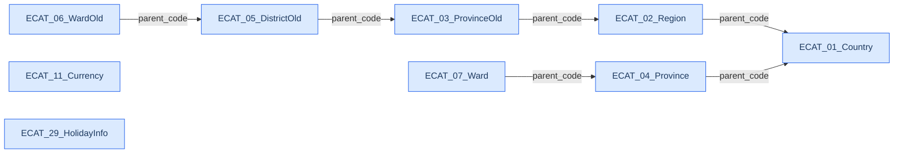
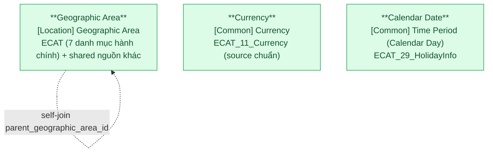

# ECAT — HLD Tier 1: Reference & Geographic (Geographic Area, Currency, Calendar Date)

> **Phụ thuộc:** Không phụ thuộc Tier nào — là nền tảng cho Tier 2.
>
> **Thiết kế theo:** [ECAT_HLD_Overview.md](ECAT_HLD_Overview.md)

**Source system:** ECAT — dịch vụ đồng bộ danh mục dùng chung từ HTTT về Kho CSDL UBCKNN.
**Scope Tier 1:** 3 Silver entity (đều shared/Fundamental) + 35 Classification Value scheme. Không có entity FK lẫn nhau trong cùng Tier.

---

## 6a. Bảng tổng quan BCV Concept

| BCV Core Object | BCV Concept | Category | Source Table | Mô tả bảng nguồn | Silver Entity | table_type | BCV Term |
|---|---|---|---|---|---|---|---|
| Location | [Location] Geographic Area | Location | ECAT_01_Country, ECAT_02_Region, ECAT_03_ProvinceOld, ECAT_04_Province, ECAT_05_DistrictOld, ECAT_06_WardOld, ECAT_07_Ward | Danh mục hành chính: Quốc gia, Vùng/miền, Tỉnh/Thành phố (cũ/mới), Quận/Huyện (cũ), Phường/Xã/Thị trấn (cũ/mới). Mặc định schema: Code + Name + parent_code (với bảng phân cấp). | Geographic Area | Fundamental | (1) BCV term `Geographic Area` (Location) = *"A Geographic Area is a place or a bounded area defined by nature, by an external authority (such as a government), or for an internal business purpose."* (2) Cấu trúc trường: Code + Name + parent_code cho phép biểu diễn phân cấp hành chính VN (Quốc gia → Vùng/miền → Tỉnh/Thành phố → Quận/Huyện → Phường/Xã). (3) Chọn term Geographic Area vì BCV có data concept Location riêng cho khu vực địa lý, và theo quy tắc ngoại lệ của skill — bảng lưu khu vực địa lý luôn là Silver entity `Geographic Area`, không phải Classification Value. |
| Common | [Common] Currency | Common | ECAT_11_Currency | Danh mục đơn vị tiền tệ (Code + Name). User chốt ECAT làm source chuẩn của Currency. | Currency | Fundamental | (1) BCV term `Currency` (Common) = *"Identifies a Unit Of Measure that qualifies the value of goods or services in terms of a particular currency; for example, United States dollar, Sterling, Euro."* (2) Cấu trúc trường: Code (VD `VND`, `USD`) + Name. (3) Chọn term Currency vì theo quy tắc #4 CLAUDE.md, Currency có data domain riêng (không phải Classification Value) — là entity reference dùng chung xuyên suốt Silver. |
| Common | [Common] Calendar Day | Common | ECAT_29_HolidayInfo | Thông tin ngày nghỉ đồng bộ từ HTTT. Mặc định schema: calendar_date + holiday_name (+ holiday_flag derived). | Calendar Date | Fundamental | (1) BCV không có entity `Holiday` độc lập. Các term gần nhất thuộc concept `Time Period` (Common): `Public Holiday Flag`, `Company Holiday Flag` (property, Boolean) + `Day Of Calendar Year` (property, Number). BCV mô tả: *"Indicates whether (1) or not (0) the day is a holiday available to the general population."* (2) Cấu trúc trường: 1 dòng = 1 ngày dương lịch có tính chất đặc biệt — grain ngày. (3) Chọn tên Silver `Calendar Date` + trường `Holiday Flag` (theo user chốt) vì entity biểu diễn từng ngày dương lịch với cờ nghỉ lễ; các property holiday flag của BCV được gắn vào entity này. |

---

## 6b. Diagram Source (Mermaid)

> Các bảng danh mục địa lý có parent_code thể hiện phân cấp hành chính. Currency và HolidayInfo độc lập, không có quan hệ FK với bảng nguồn khác trong scope.

---

## 6c. Diagram Silver (Mermaid)

> 3 entity Tier 1 độc lập — không FK lẫn nhau. Geographic Area có self-join qua `parent_geographic_area_id` để biểu diễn phân cấp (Quốc gia → Vùng/miền → Tỉnh → Quận → Phường). Entity không FK đến entity nghiệp vụ khác trong scope ECAT.

---

## 6d. Danh mục & Tham chiếu (Reference Data)

### Geographic Area types

| Source Field / Bảng | Mô tả | Scheme Code | source_type | Ghi chú |
|---|---|---|---|---|
| ECAT_01_Country | Quốc gia | `GEOGRAPHIC_AREA_TYPE` (value: `COUNTRY`) | etl_derived | Reuse scheme `GEOGRAPHIC_AREA_TYPE` đã có (FIMS/FMS/SCMS). ECAT bổ sung source cho value `COUNTRY`. |
| ECAT_02_Region | Vùng/miền | `GEOGRAPHIC_AREA_TYPE` (value: `REGION`) | etl_derived | Value mới bổ sung vào scheme hiện có. |
| ECAT_03_ProvinceOld | Tỉnh/Thành phố (cũ) | `GEOGRAPHIC_AREA_TYPE` (value: `PROVINCE_OLD`) | etl_derived | Type riêng cho danh mục tỉnh cũ (pre-sáp nhập 2025). Giữ song song với `PROVINCE` chuẩn. |
| ECAT_04_Province | Tỉnh/Thành phố (mới) | `GEOGRAPHIC_AREA_TYPE` (value: `PROVINCE`) | etl_derived | Reuse value `PROVINCE` đã có. ECAT bổ sung source. Data instance mặc định FK về value này. |
| ECAT_05_DistrictOld | Quận/Huyện (cũ) | `GEOGRAPHIC_AREA_TYPE` (value: `DISTRICT_OLD`) | etl_derived | Type riêng cho danh mục quận cũ. Không có `DISTRICT` chuẩn vì sáp nhập 2025 đã bỏ cấp quận/huyện. |
| ECAT_06_WardOld | Phường/Xã/Thị trấn (cũ) | `GEOGRAPHIC_AREA_TYPE` (value: `WARD_OLD`) | etl_derived | Type riêng cho danh mục phường cũ. |
| ECAT_07_Ward | Phường/Xã/Thị trấn (mới) | `GEOGRAPHIC_AREA_TYPE` (value: `WARD`) | etl_derived | Value mới bổ sung vào scheme. Data instance mặc định FK về value này. |

### Classification Value scheme — 35 danh mục còn lại

| Source Table | Mô tả | Scheme Code | source_type | Ghi chú |
|---|---|---|---|---|
| ECAT_08_Department | Đơn vị/phòng ban | `ECAT_ORGANIZATION_UNIT` | source_table | Danh mục đơn vị/phòng ban dùng chung. |
| ECAT_09_PositionType | Loại chức vụ | `ECAT_POSITION_TYPE` | source_table | |
| ECAT_10_Position | Chức vụ | `ECAT_POSITION` | source_table | FK: parent_code → ECAT_09. |
| ECAT_12_SecurityType | Loại chứng khoán | `ECAT_SECURITY_TYPE` | source_table | Dùng làm FK cho Product Security (Tier 2). |
| ECAT_13_Market | Thị trường | `ECAT_MARKET` | source_table | Dùng làm FK cho Product Security (Tier 2). |
| ECAT_15_SharePar | Mệnh giá cổ phần | `ECAT_SHARE_PAR_VALUE` | source_table | |
| ECAT_16_Indicator | Danh mục chỉ tiêu (nghiệp vụ chung) | `ECAT_BUSINESS_INDICATOR` | source_table | Chỉ tiêu nghiệp vụ chung (user chốt — không phải risk indicator). |
| ECAT_17_FinancialReportType | Loại báo cáo tài chính | `ECAT_FINANCIAL_REPORT_TYPE` | source_table | |
| ECAT_18_BusinessOperation | Nghiệp vụ kinh doanh | `ECAT_BUSINESS_OPERATION` | source_table | |
| ECAT_19_CorporatePositionType | Loại chức vụ doanh nghiệp | `ECAT_CORPORATE_POSITION_TYPE` | source_table | |
| ECAT_20_CorporatePosition | Chức vụ trong doanh nghiệp | `ECAT_CORPORATE_POSITION` | source_table | FK: parent_code → ECAT_19. |
| ECAT_21_CompanyType | Loại công ty | `ECAT_COMPANY_TYPE` | source_table | |
| ECAT_22_Service | Dịch vụ | `ECAT_SERVICE` | source_table | |
| ECAT_23_Case | Sự vụ | `ECAT_CASE_TYPE` | source_table | |
| ECAT_24_InvestorType | Loại nhà đầu tư/cổ đông | `ECAT_INVESTOR_TYPE` | source_table | |
| ECAT_25_AgentType | Loại đại lý | `ECAT_AGENT_TYPE` | source_table | |
| ECAT_26_Relationship | Mối quan hệ | `ECAT_RELATIONSHIP_TYPE` | source_table | |
| ECAT_27_EducationLevel | Trình độ | `ECAT_EDUCATION_LEVEL` | source_table | |
| ECAT_28_ProfessionalCertType | Loại chứng chỉ hành nghề | `ECAT_PROFESSIONAL_CERTIFICATE_TYPE` | source_table | |
| ECAT_30_AdminProcedure | Thủ tục hành chính | `ECAT_ADMINISTRATIVE_PROCEDURE` | source_table | |
| ECAT_31_AdminProcedureComponent | Thành phần TTHC | `ECAT_ADMINISTRATIVE_PROCEDURE_COMPONENT` | source_table | FK: parent_code → ECAT_30. |
| ECAT_32_IndustryLv1 | Ngành nghề cấp 1 | `ECAT_INDUSTRY_LV1` | source_table | |
| ECAT_33_IndustryLv2 | Ngành nghề cấp 2 | `ECAT_INDUSTRY_LV2` | source_table | FK: parent_code → ECAT_32. |
| ECAT_34_ApprovalStatus | Trạng thái duyệt | `ECAT_APPROVAL_STATUS` | source_table | |
| ECAT_35_FrequencyType | Loại tần suất | `ECAT_FREQUENCY_TYPE` | source_table | |
| ECAT_36_Frequency | Tần suất | `ECAT_FREQUENCY` | source_table | FK: parent_code → ECAT_35. |
| ECAT_37_AlertType | Loại cảnh báo | `ECAT_ALERT_TYPE` | source_table | |
| ECAT_38_AlertSeverity | Mức độ cảnh báo | `ECAT_ALERT_SEVERITY` | source_table | |
| ECAT_39_ReportProcessingStatusType | Loại trạng thái xử lý báo cáo | `ECAT_REPORT_PROCESSING_STATUS_TYPE` | source_table | |
| ECAT_40_AlertProcessingStatus | Trạng thái xử lý cảnh báo | `ECAT_ALERT_PROCESSING_STATUS` | source_table | |
| ECAT_41_NotificationStatusType | Loại trạng thái thông báo | `ECAT_NOTIFICATION_STATUS_TYPE` | source_table | |
| ECAT_42_NotificationStatus | Trạng thái thông báo | `ECAT_NOTIFICATION_STATUS` | source_table | FK: parent_code → ECAT_41. |
| ECAT_43_EnterpriseType | Loại hình doanh nghiệp | `ECAT_ENTERPRISE_TYPE` | source_table | |
| ECAT_44_FundType | Loại hình quỹ đầu tư | `ECAT_FUND_TYPE` | source_table | |
| ECAT_45_OperatingStatus | Trạng thái hoạt động | `ECAT_OPERATING_STATUS` | source_table | |
| ECAT_46_ShareholderType | Loại hình cổ đông/nhà đầu tư | `ECAT_SHAREHOLDER_TYPE` | source_table | |

---

## 6e. Bảng chờ thiết kế

Không có bảng nào trong Tier 1 chưa đủ thông tin cột. ECAT_16_Indicator (chỉ tiêu nghiệp vụ chung) đã được chốt xử lý thành Classification Value scheme `ECAT_BUSINESS_INDICATOR`.

---

## 6f. Điểm cần xác nhận

| # | Câu hỏi | Ảnh hưởng |
|---|---|---|

*(Không còn điểm mở — các câu hỏi T1-01 đến T1-05 đã được user chốt. Xem mục 7e Overview phần "Đã chốt".)*

---

## Entities trong Tier 1

### 1. Geographic Area (shared — extend)
**Source:** `ECAT_01_Country`, `ECAT_02_Region`, `ECAT_03_ProvinceOld`, `ECAT_04_Province`, `ECAT_05_DistrictOld`, `ECAT_06_WardOld`, `ECAT_07_Ward` | **BCV Concept:** [Location] Geographic Area | **BCO:** Location | **table_type:** Fundamental

**Grain:** 1 dòng = 1 khu vực địa lý của 1 cấp hành chính cụ thể (Quốc gia / Vùng-miền / Tỉnh / Quận / Phường) — phân biệt qua `geographic_area_type_code`.

**Shared entity:** Đã approved trong `silver_entities.csv` (source hiện có: `FIMS.NATIONAL, SCMS.DM_TINH_THANH, SCMS.DM_QUOC_TICH`). ECAT mở rộng source_table để thành master của toàn bộ danh mục hành chính VN (country, region, province old/new, district old, ward old/new).

**Self-join:** `parent_geographic_area_id` → Geographic Area. Thể hiện phân cấp Quốc gia → Vùng/miền → Tỉnh/Thành phố → Quận/Huyện → Phường/Xã.

### 2. Currency (shared — new)
**Source:** `ECAT_11_Currency` (source chuẩn — user chốt) | **BCV Concept:** [Common] Currency | **BCO:** Common | **table_type:** Fundamental

**Grain:** 1 dòng = 1 đơn vị tiền tệ theo chuẩn **ISO 4217**.

**Attributes chính:**
- `currency_code` (BK, Text) — mã tiền tệ ISO 4217 (3 ký tự: VND, USD, EUR...)
- `currency_name` (Text)
- `active_flag` (Boolean, nếu nguồn có)

**Ghi chú:**
- Theo quy tắc #4 CLAUDE.md, Currency là data domain riêng — không bọc vào Classification Value. Entity này được FK từ mọi bảng nghiệp vụ có field tiền tệ (qua cặp Currency Code dư thừa).
- Currency code tuân thủ chuẩn ISO 4217 — giả định ECAT gửi đúng chuẩn này (không cần mapping nội bộ ↔ ISO).

### 3. Calendar Date (new)
**Source:** `ECAT_29_HolidayInfo` (chỉ map `holiday_flag` + `holiday_name`); còn lại ETL tự sinh. | **BCV Concept:** [Common] Time Period (Calendar Day) | **BCO:** Common | **table_type:** Fundamental

**Grain:** 1 dòng = 1 ngày dương lịch (dense calendar — ETL tự sinh mọi ngày trong phạm vi thời gian hệ thống theo dõi).

**Attributes chính:**

| Attribute | Data Domain | Nguồn | Mô tả |
|---|---|---|---|
| ds_calendar_date_id | Surrogate Key | ETL | PK |
| calendar_date | Date | ETL generated | Ngày dương lịch (unique) — BK nghiệp vụ |
| holiday_flag | Boolean | ECAT_29_HolidayInfo | Cờ ngày nghỉ lễ (BCV: `Public Holiday Flag`). Default = 0; set = 1 nếu ngày có trong ECAT_29. |
| holiday_name | Text | ECAT_29_HolidayInfo | Tên ngày lễ (VD "Tết Dương lịch", "Quốc khánh"). NULL nếu không phải ngày nghỉ. |

**Ghi chú:**
- **Bảng Calendar Date được ETL tự sinh dense** (mọi ngày trong khoảng thời gian hệ thống theo dõi, VD 1990-01-01 đến 2099-12-31). Không phụ thuộc ECAT về danh sách ngày.
- **ECAT_29_HolidayInfo chỉ cung cấp 2 trường map vào Silver**: `holiday_flag` và `holiday_name`. ETL merge ngày ECAT gửi với Calendar Date dense: nếu match date → set `holiday_flag = 1` + load `holiday_name`.
- Không có cột `company_holiday_flag` trong scope hiện tại — chỉ dùng `holiday_flag` bao ngày nghỉ công cộng (BCV Public Holiday Flag).

---

## Ghi chú Classification Value (36 danh mục)

- Toàn bộ 36 bảng danh mục thuần (ECAT_08 đến ECAT_46 trừ các mục đã map entity riêng 11/14/29) đi vào bảng Fundamental Classification Value của dự án (SCD4A). ECAT_16 (chỉ tiêu nghiệp vụ chung) thuộc nhóm này, scheme `ECAT_BUSINESS_INDICATOR`.
- Scheme code theo convention `ECAT_<SEMANTIC>` (VD `ECAT_POSITION`, `ECAT_FUND_TYPE`, `ECAT_BUSINESS_INDICATOR`).
- Với danh mục phân cấp (ECAT_10, ECAT_20, ECAT_31, ECAT_33, ECAT_36, ECAT_42): dùng cột `parent_code` + `parent_scheme_code` để biểu diễn cha-con.
- Toàn bộ scheme được đăng ký vào `Silver/lld/ref_shared_entity_classifications.csv` — source_type = `source_table`, values load từ ECAT.
