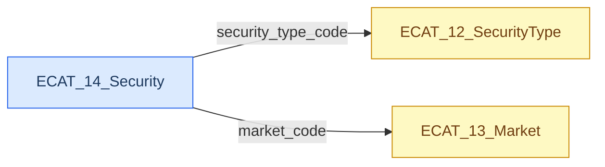
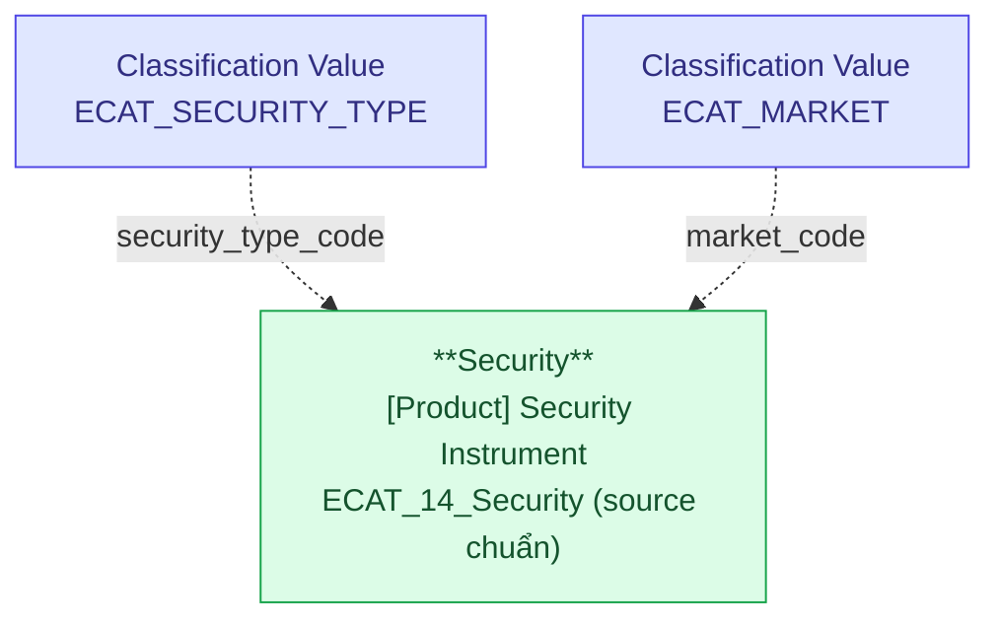

# ECAT — HLD Tier 2: Product (Security)

> **Phụ thuộc:** Tier 1 của ECAT (Classification Value scheme `ECAT_SECURITY_TYPE`, `ECAT_MARKET`).
>
> **Thiết kế theo:** [ECAT_HLD_Overview.md](ECAT_HLD_Overview.md)

**Source system:** ECAT
**Scope Tier 2:** 1 Silver entity shared — `[Product] Security`. ECAT là source chuẩn cho danh mục chứng khoán (Code + Name). Các attribute khác (ISIN, issuer, listing date...) sẽ được bổ sung từ source khác trong các Tier HLD của source tương ứng.

---

## 6a. Bảng tổng quan BCV Concept

| BCV Core Object | BCV Concept | Category | Source Table | Mô tả bảng nguồn | Silver Entity | table_type | BCV Term |
|---|---|---|---|---|---|---|---|
| Product | [Product] Security Instrument | Product | ECAT_14_Security | Danh mục chứng khoán đồng bộ từ HTTT. Mặc định schema: Code + Name (+ có thể có security_type_code và market_code tham chiếu ECAT_12 / ECAT_13). | Security | Fundamental | (1) BCV term `Security Instrument` (Product) = *"Identifies a Financial Market Instrument that is an instrument representing ownership (equity), a debt agreement (bonds), or the rights to ownership (derivatives)."* (2) Cấu trúc trường: Code (mã chứng khoán) + Name. Grain = 1 mã chứng khoán = 1 instance của chứng khoán cụ thể đang lưu hành. (3) Chọn term Security Instrument (subtype của Financial Market Instrument) vì cấu trúc phản ánh danh mục các chứng khoán đang giao dịch — cùng mức với entity Product trong các hệ thống khác. Đặt tên Silver ngắn gọn `Security` thay vì `Security Instrument` để dùng chung nhất quán với các source khác (GSGD/FIMS) sẽ mở rộng attribute sau. |

---

## 6b. Diagram Source (Mermaid)

> ECAT_14 tham chiếu 2 Classification Value scheme ở Tier 1 (`ECAT_SECURITY_TYPE`, `ECAT_MARKET`). Không có quan hệ FK với bảng ECAT khác.

---

## 6c. Diagram Silver (Mermaid)

> Security ở Tier 2 vì phụ thuộc 2 Classification Value scheme (SECURITY_TYPE, MARKET) được load từ Tier 1 của ECAT. Không FK đến Silver entity nghiệp vụ khác trong scope ECAT.

---

## 6d. Danh mục & Tham chiếu (Reference Data)

| Source Field / Bảng | Mô tả | Scheme Code | source_type | Ghi chú |
|---|---|---|---|---|
| ECAT_14_Security.security_type_code | Loại chứng khoán (cổ phiếu/trái phiếu/chứng chỉ quỹ...) | `ECAT_SECURITY_TYPE` | source_table | Scheme đã đăng ký ở Tier 1. Value load từ ECAT_12_SecurityType. |
| ECAT_14_Security.market_code | Mã thị trường (HOSE/HNX/UPCOM/OTC) | `ECAT_MARKET` | source_table | Scheme đã đăng ký ở Tier 1. Value load từ ECAT_13_Market. |

---

## 6e. Bảng chờ thiết kế

Không có bảng nào trong Tier 2 chưa đủ thông tin cột.

---

## 6f. Điểm cần xác nhận

| # | Câu hỏi | Ảnh hưởng |
|---|---|---|
| T2-02 | Khi các source khác (GSGD/FIMS) có field chứng khoán nhưng chưa thiết kế Security entity, họ sẽ FK bằng Security Code hay Security Id? | ECAT làm source chuẩn Code + Name → các source sau sẽ bổ sung thêm attribute (ISIN, issuer, listing date) vào cùng entity Security. LLD cần convention rõ. |
| T2-03 | ECAT_14 có cờ `active_flag` / `delisted_flag` không? | Nếu không → trạng thái niêm yết/hủy niêm yết lấy từ source khác. Nếu có → cần map vào attribute của Security. |

**Đã chốt:** Security Code unique toàn thị trường → BK của entity Security chỉ cần `security_code` (không kết hợp với `market_code`).

---

## Entities trong Tier 2

### 1. Security (shared — new)
**Source:** `ECAT_14_Security` (source chuẩn cho danh mục đầy đủ Code + Name) | **BCV Concept:** [Product] Security Instrument | **BCO:** Product | **table_type:** Fundamental

**Grain:** 1 dòng = 1 mã chứng khoán đang/đã lưu hành trên thị trường Việt Nam.

**Attributes chính (scope ECAT):**

| Attribute | Data Domain | Nguồn | Mô tả |
|---|---|---|---|
| ds_security_id | Surrogate Key | ETL | PK |
| security_code | Text | ECAT_14_Security.code | BK — mã chứng khoán (VD `VIC`, `VCB`) |
| security_name | Text | ECAT_14_Security.name | Tên chứng khoán |
| security_type_code | Classification Value | ECAT_14_Security.security_type_code | Scheme `ECAT_SECURITY_TYPE` |
| market_code | Classification Value | ECAT_14_Security.market_code | Scheme `ECAT_MARKET` |

**Ghi chú:**
- ECAT chỉ nuôi đầy đủ danh mục (Code + Name + type + market). Các attribute mở rộng (ISIN, par value, issuer, listing date, outstanding shares, delisting info...) sẽ được các source khác (GSGD/FIMS/IDS) bổ sung khi thiết kế HLD tương ứng — khi đó họ extend `source_table` của entity Security.
- Khi có nhiều source đồng thời nuôi entity Security, ưu tiên ECAT cho các attribute scope nêu trên (ECAT là authoritative cho danh mục).
