# FIMS — HLD Tier 1: Main Entities

> **Nguồn:** Hệ thống FIMS — Hệ thống quản lý giám sát nhà đầu tư nước ngoài (MySQL)
>
> **Phạm vi Tier 1:** Các entity độc lập — thành viên thị trường, nhà đầu tư, nhân sự CBTT, biểu mẫu báo cáo.

---

## 6a. Bảng BCV Concept

| BCV Core Object | BCV Concept | Category | Source Table | Mô tả bảng nguồn | Silver Entity | BCV Term |
|---|---|---|---|---|---|---|
| Involved Party | [Involved Party] Organization | Organization | STOCKEXCHANGE | Lưu danh sách đối tượng gửi báo cáo là Sở giao dịch chứng khoán | Stock Exchange | Cấu trúc trường: Name/EName/ShortName/Address/Telephone/Fax/Email/StatusId → tổ chức có lifecycle riêng. BCV: [Involved Party] Organization. |
| Involved Party | [Involved Party] Organization | Organization | DEPOSITORYCENTER | Lưu danh sách đối tượng gửi báo cáo là Trung tâm lưu ký chứng khoán | Depository Center | Cùng cấu trúc với STOCKEXCHANGE. BCV: [Involved Party] Organization. Đây là Trung tâm Lưu ký quốc gia (VSD) — khác biệt với Custodian Bank. |
| Involved Party | [Involved Party] Organization | Organization | FUNDCOMPANY | Lưu danh sách đối tượng gửi báo cáo là Công ty quản lý quỹ | Fund Management Company | Cấu trúc: Name/EName/IdNo/IdDate/RegNo/RegDate/Director/Capital/StatusId → tổ chức có giấy phép, vốn điều lệ. BCV: [Involved Party] Organization. **Dùng chung Silver entity với FMS.SECURITIES** — FIMS là secondary source. |
| Involved Party | [Involved Party] Organization | Organization | SECURITIESCOMPANY | Lưu danh sách đối tượng gửi báo cáo là Công ty chứng khoán | Securities Company | Cùng cấu trúc với FUNDCOMPANY. BCV: [Involved Party] Organization. |
| Involved Party | [Involved Party] Organization | Organization | BANKMONI | Lưu danh sách đối tượng gửi báo cáo là Ngân hàng lưu ký giám sát | Custodian Bank | Cùng cấu trúc với FUNDCOMPANY. BCV: [Involved Party] Organization. **Dùng chung Silver entity với FMS.BANKMONI** — FIMS là secondary source. |
| Involved Party | [Involved Party] Organization Unit | Organization Unit | BRANCHS | Lưu danh sách đối tượng gửi báo cáo là Chi nhánh công ty quản lý quỹ | Fund Management Company Organization Unit | Cấu trúc: Name/EName/IdNo/RegNo/CompanyNameParent/CertNoParent/StartDate/EndDate → đơn vị phụ thuộc CTQLQ. ETL resolve `CompanyNameParent` → FK pair đến Fund Management Company. BCV: [Involved Party] Organization Unit. |
| Involved Party | [Involved Party] Individual | Individual | INFODISCREPRES | Lưu danh sách đối tượng gửi báo cáo là người đại diện công bố thông tin | Disclosure Representative | Cấu trúc: Name/EName/IdNo/IdDate/DateOfBirth/Sex/ObjectType → cá nhân/tổ chức là đầu mối CBTT. BCV: [Involved Party] Individual. |
| Involved Party | [Involved Party] Individual | Individual | INVESTOR | Lưu danh sách danh mục nhà đầu tư | Foreign Investor | Cấu trúc: ObjectType (1:Cá nhân, 2:Tổ chức)/TransactionCode/IdNo/DepAccountNumber/SecComAddId/BankAddId → nhà đầu tư có mã giao dịch TTCK và tài khoản lưu ký. Gộp cả cá nhân lẫn tổ chức, phân biệt bằng ObjectType. BCV: [Involved Party] Individual — grain là 1 nhà đầu tư. |
| Involved Party | [Involved Party] Individual | Individual | TLPROFILES | Lưu danh sách nhân sự đại diện công bố thông tin | Disclosure Representative Key Person | Cấu trúc: Name/NaId/IdNo/CertNo/CertDate/SWorkDTE/FWorkDTE/DegreeId + 6 FK nullable đến các tổ chức → cá nhân CBTT có thể gắn với nhiều tổ chức. Giữ nhiều FK nullable trên Silver entity. BCV: [Involved Party] Individual. |
| Documentation | [Documentation] Regulatory Report | Regulatory Report | RPTTEMP | Lưu danh sách biểu mẫu báo cáo đầu vào | Report Template | Cấu trúc: Name/Code/ReportGroup/LegalBasis/ReportTypeId/Version/DateUsed → khuôn mẫu tờ khai. BCV: [Documentation] Regulatory Report. Fundamental — là reference cho RPTMEMBER và RPTPERIOD. |

> **Lưu ý tầng:** `RPTPERIOD` phụ thuộc `RPTTEMP` (RptId → RPTTEMP) → chuyển sang **Tier 2**.

---

## 6b. Diagram Source (Mermaid)

```mermaid
graph TD
    %% Reference / Geographic
    NATIONAL["NATIONAL\n[Location] Geographic Area"]
    STATUS["STATUS\n(trạng thái)"]
    REPORTTYPE["REPORTTYPE\n(loại báo cáo)"]
    DEGREE["DEGREE\n(trình độ)"]
    BUSINESS["BUSINESS\n(nghiệp vụ KD)"]
    COMPANYTYPE["COMPANYTYPE\n(loại hình DN)"]
    JOBTYPE["JOBTYPE\n(chức vụ)"]
    STOCKHOLDERTYPE["STOCKHOLDERTYPE\n(loại cổ đông)"]
    INVESTORTYPE["INVESTORTYPE\n(loại NĐT)"]

    %% Tier 1 entities
    STOCKEXCHANGE["STOCKEXCHANGE"]
    DEPOSITORYCENTER["DEPOSITORYCENTER"]
    FUNDCOMPANY["FUNDCOMPANY"]
    SECURITIESCOMPANY["SECURITIESCOMPANY"]
    BANKMONI["BANKMONI"]
    BRANCHS["BRANCHS"]
    INFODISCREPRES["INFODISCREPRES"]
    INVESTOR["INVESTOR"]
    TLPROFILES["TLPROFILES"]
    RPTTEMP["RPTTEMP"]

    %% Junction tables (Tier 1)
    FUNDCOMBUSINES["FUNDCOMBUSINES"]
    FUNDCOMTYPE["FUNDCOMTYPE"]
    SECCOMBUSINES["SECCOMBUSINES"]
    SECCOMTYPE["SECCOMTYPE"]
    BRANCHSBUSINES["BRANCHSBUSINES"]
    INDIREBUSINESS["INDIREBUSINESS"]
    TLPROJOB["TLPROJOB"]
    TLPROSTOCKH["TLPROSTOCKH"]

    STOCKEXCHANGE --> NATIONAL
    STOCKEXCHANGE --> STATUS
    DEPOSITORYCENTER --> NATIONAL
    DEPOSITORYCENTER --> STATUS
    FUNDCOMPANY --> NATIONAL
    FUNDCOMPANY --> STATUS
    SECURITIESCOMPANY --> NATIONAL
    SECURITIESCOMPANY --> STATUS
    BANKMONI --> NATIONAL
    BANKMONI --> STATUS
    BRANCHS --> NATIONAL
    BRANCHS --> STATUS
    BRANCHS -.->|"ETL resolve CompanyNameParent"| FUNDCOMPANY
    INFODISCREPRES --> NATIONAL
    INFODISCREPRES --> STATUS
    INVESTOR --> NATIONAL
    INVESTOR --> STATUS
    INVESTOR --> INVESTORTYPE
    INVESTOR --> COMPANYTYPE
    INVESTOR --> SECURITIESCOMPANY
    INVESTOR --> BANKMONI
    TLPROFILES --> NATIONAL
    TLPROFILES --> STATUS
    TLPROFILES --> DEGREE
    TLPROFILES -->|"nullable"| FUNDCOMPANY
    TLPROFILES -->|"nullable"| SECURITIESCOMPANY
    TLPROFILES -->|"nullable"| BANKMONI
    TLPROFILES -->|"nullable"| DEPOSITORYCENTER
    TLPROFILES -->|"nullable"| STOCKEXCHANGE
    TLPROFILES -->|"nullable"| INFODISCREPRES
    RPTTEMP --> REPORTTYPE

    FUNDCOMBUSINES --> FUNDCOMPANY
    FUNDCOMBUSINES --> BUSINESS
    FUNDCOMTYPE --> FUNDCOMPANY
    FUNDCOMTYPE --> COMPANYTYPE
    SECCOMBUSINES --> SECURITIESCOMPANY
    SECCOMBUSINES --> BUSINESS
    SECCOMTYPE --> SECURITIESCOMPANY
    SECCOMTYPE --> COMPANYTYPE
    BRANCHSBUSINES --> BRANCHS
    BRANCHSBUSINES --> BUSINESS
    INDIREBUSINESS --> INFODISCREPRES
    INDIREBUSINESS --> BUSINESS
    TLPROJOB --> TLPROFILES
    TLPROJOB --> JOBTYPE
    TLPROSTOCKH --> TLPROFILES
    TLPROSTOCKH --> STOCKHOLDERTYPE
```

---

## 6c. Diagram Silver (Mermaid)

```mermaid
graph TD
    classDef silver fill:#dcfce7,stroke:#16a34a,color:#14532d
    classDef shared fill:#fae8ff,stroke:#9333ea,color:#4a044e
    classDef geo fill:#fef9c3,stroke:#ca8a04,color:#713f12

    %% Geographic Area
    GEO["**Geographic Area**\n[Location] Geographic Area\nNATIONAL"]:::geo

    %% Tier 1 Silver entities
    SE["**Stock Exchange**\n[Involved Party] Organization\nSTOCKEXCHANGE"]:::silver
    DC["**Depository Center**\n[Involved Party] Organization\nDEPOSITORYCENTER"]:::silver
    FC["**Fund Management Company**\n[Involved Party] Organization\nFUNDCOMPANY (+ FMS.SECURITIES)"]:::silver
    SC["**Securities Company**\n[Involved Party] Organization\nSECURITIESCOMPANY"]:::silver
    BK["**Custodian Bank**\n[Involved Party] Organization\nBANKMONI (+ FMS.BANKMONI)"]:::silver
    OU["**Fund Management Company Organization Unit**\n[Involved Party] Organization Unit\nBRANCHS"]:::silver
    IDR["**Disclosure Representative**\n[Involved Party] Individual\nINFODISCREPRES"]:::silver
    INV["**Foreign Investor**\n[Involved Party] Individual\nINVESTOR"]:::silver
    TLP["**Disclosure Representative Key Person**\n[Involved Party] Individual\nTLPROFILES"]:::silver
    RT["**Report Template**\n[Documentation] Regulatory Report\nRPTTEMP"]:::silver

    %% Shared entities
    ADDR["IP Postal Address"]:::shared
    EADDR["IP Electronic Address"]:::shared
    ALTID["IP Alt Identification"]:::shared

    %% Geographic FK
    SE --> GEO
    DC --> GEO
    FC --> GEO
    SC --> GEO
    BK --> GEO
    OU --> GEO
    IDR --> GEO
    INV --> GEO
    TLP --> GEO

    %% BRANCHS FK to parent (ETL resolve)
    OU -->|"FK parent (ETL resolve)"| FC

    %% Key Person FK to member orgs (nullable — nhiều trường)
    TLP -->|"nullable FK"| FC
    TLP -->|"nullable FK"| SC
    TLP -->|"nullable FK"| BK
    TLP -->|"nullable FK"| DC
    TLP -->|"nullable FK"| SE
    TLP -->|"nullable FK"| IDR

    %% IP shared entities
    ADDR -.->|"HEAD_OFFICE"| SE
    ADDR -.->|"HEAD_OFFICE"| DC
    ADDR -.->|"HEAD_OFFICE"| FC
    ADDR -.->|"HEAD_OFFICE"| SC
    ADDR -.->|"HEAD_OFFICE"| BK
    ADDR -.->|"HEAD_OFFICE"| OU
    ADDR -.->|"HEAD_OFFICE"| IDR
    ADDR -.->|"HOME/BUSINESS"| INV
    EADDR -.->|"Phone/Fax/Email/Web/Hotline"| SE
    EADDR -.->|"Phone/Fax/Email/Web/Hotline"| DC
    EADDR -.->|"Phone/Fax/Email/Web"| FC
    EADDR -.->|"Phone/Fax/Email/Web"| SC
    EADDR -.->|"Phone/Fax/Email/Web"| BK
    EADDR -.->|"Phone/Fax/Email/Web"| OU
    EADDR -.->|"Phone/Fax/Email/Web"| IDR
    EADDR -.->|"Phone/Fax/Email/Web"| INV
    EADDR -.->|"Phone/Email"| TLP
    ALTID -.->|"IdNo+RegNo (GPKD + QĐ thành lập)"| FC
    ALTID -.->|"IdNo+RegNo"| SC
    ALTID -.->|"IdNo+RegNo"| BK
    ALTID -.->|"IdNo+RegNo"| OU
    ALTID -.->|"IdNo+RegNo"| IDR
    ALTID -.->|"IdNo (CCCD/HC)"| INV
    ALTID -.->|"CertNo (Chứng chỉ CBTT)"| TLP
```

---

## 6d. Danh mục & Tham chiếu

| Source Table | Mô tả | BCV Term | Xử lý Silver | Scheme Code |
|---|---|---|---|---|
| NATIONAL | Danh sách quốc tịch/quốc gia | [Location] Geographic Area | **Silver entity** — FK inbound từ nhiều bảng thành viên. Đặt tên: Geographic Area. | — (entity riêng, không phải scheme) |
| STATUS | Danh mục tình trạng hoạt động | Classification Value | Scheme: FIMS_MEMBER_STATUS. Dùng chung cho tất cả thành viên. | FIMS_MEMBER_STATUS |
| REPORTTYPE | Danh mục loại báo cáo | Classification Value | Scheme: FIMS_REPORT_TYPE. | FIMS_REPORT_TYPE |
| BUSINESS | Danh mục nghiệp vụ kinh doanh | Classification Value | Scheme: FIMS_BUSINESS_TYPE. Denormalize thành `Array<Classification Value>`. | FIMS_BUSINESS_TYPE |
| COMPANYTYPE | Danh mục loại hình doanh nghiệp | Classification Value | Scheme: FIMS_COMPANY_TYPE. Denormalize thành `Array<Classification Value>`. | FIMS_COMPANY_TYPE |
| JOBTYPE | Danh mục chức vụ nhân sự | Classification Value | Scheme: FIMS_JOB_TYPE. Denormalize thành `Array<Classification Value>` trên TLProfiles. | FIMS_JOB_TYPE |
| STOCKHOLDERTYPE | Danh mục loại cổ đông của nhân sự | Classification Value | Scheme: FIMS_STOCKHOLDER_TYPE. Denormalize thành `Array<Classification Value>` trên TLProfiles. | FIMS_STOCKHOLDER_TYPE |
| INVESTORTYPE | Danh mục loại nhà đầu tư | Classification Value | Scheme: FIMS_INVESTOR_TYPE. | FIMS_INVESTOR_TYPE |
| DEGREE | Danh mục trình độ học vấn | Classification Value | Scheme: FIMS_DEGREE. | FIMS_DEGREE |
| SECURITIESTYPE | Danh mục loại chứng khoán | Classification Value | Scheme: FIMS_SECURITIES_TYPE. | FIMS_SECURITIES_TYPE |
| SECURITIES | Danh mục chứng khoán (Code + Name) | Classification Value | Scheme: FIMS_SECURITIES_CODE. Bảng danh mục thuần túy — không có instance data. | FIMS_SECURITIES_CODE |

**Junction tables — denormalize thành Array:**

| Source Table | Bảng chính | Xử lý |
|---|---|---|
| FUNDCOMBUSINES | Fund Management Company | `Business Type Codes: Array<Classification Value>` (FIMS_BUSINESS_TYPE) |
| FUNDCOMTYPE | Fund Management Company | `Company Type Codes: Array<Classification Value>` (FIMS_COMPANY_TYPE) |
| SECCOMBUSINES | Securities Company | `Business Type Codes: Array<Classification Value>` (FIMS_BUSINESS_TYPE) |
| SECCOMTYPE | Securities Company | `Company Type Codes: Array<Classification Value>` (FIMS_COMPANY_TYPE) |
| BRANCHSBUSINES | Fund Management Company Organization Unit | `Business Type Codes: Array<Classification Value>` (FIMS_BUSINESS_TYPE) |
| INDIREBUSINESS | Disclosure Representative | `Business Type Codes: Array<Classification Value>` (FIMS_BUSINESS_TYPE) |
| TLPROJOB | Disclosure Representative Key Person | `Job Type Codes: Array<Classification Value>` (FIMS_JOB_TYPE) |
| TLPROSTOCKH | Disclosure Representative Key Person | `Stockholder Type Codes: Array<Classification Value>` (FIMS_STOCKHOLDER_TYPE) |

---

## 6e. Bảng chờ thiết kế

Không có bảng nghiệp vụ nào thiếu cấu trúc cột trong Tier 1.

---

## 6f. Điểm cần xác nhận

Tất cả câu hỏi đã được xác nhận — không còn điểm mở.
