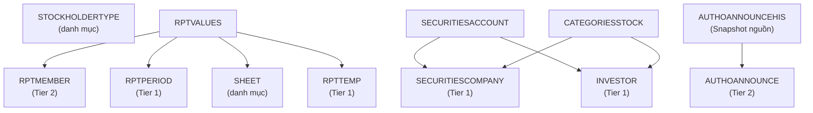
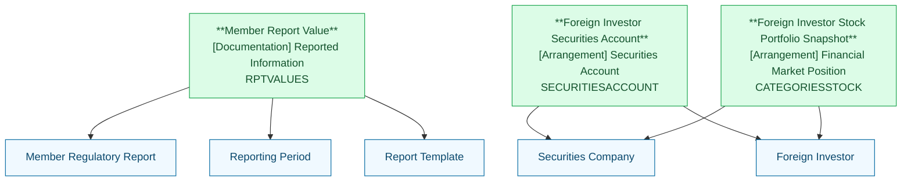

# FIMS — HLD Tier 3: Phụ thuộc Tier 2

> **Phạm vi Tier 3:** Các entity phụ thuộc Tier 2 — giá trị chỉ tiêu báo cáo, lịch sử xử lý báo cáo, sở hữu chứng khoán, tài khoản giao dịch.

---

## 6a. Bảng BCV Concept

| BCV Core Object | BCV Concept | Category | Source Table | Mô tả bảng nguồn | Silver Entity | BCV Term |
|---|---|---|---|---|---|---|
| Documentation | [Documentation] Reported Information | Reported Information | RPTVALUES | Bảng lưu giá trị của báo cáo — mỗi năm tự động sinh | Member Report Value | Cấu trúc trường: MebId (FK RPTMEMBER), TgtId/SheetId (định vị chỉ tiêu), Values/FormatDataType/IsDynamic → 1 dòng = 1 giá trị chỉ tiêu trong 1 báo cáo. Có 7 FK nullable đến thành viên (FundId/SecId/BankId/DepId/StockId/InId/BranId) — không map sang Silver entity, khai thác qua join với RPTMEMBER. BCV: [Documentation] Reported Information — "wide table" lưu từng chỉ tiêu. Fact Append (không sửa giá trị đã nộp). |
| Arrangement | [Arrangement] Securities Account | Account | SECURITIESACCOUNT | Lưu danh sách tài khoản giao dịch chứng khoán của NĐT NN | Foreign Investor Securities Account | Cấu trúc trường: SecId (FK SECURITIESCOMPANY), InvesId (FK INVESTOR), Account (số tài khoản) → 1 dòng = 1 tài khoản mở tại 1 CTCK. BCV: [Arrangement] Securities Account — tài khoản giao dịch chứng khoán. Relative. |
| Arrangement | [Arrangement] Financial Market Position | Portfolio | CATEGORIESSTOCK | Lưu danh sách danh mục chứng khoán của NĐT NN | Foreign Investor Stock Portfolio Snapshot | Cấu trúc trường: SecId (FK SECURITIESCOMPANY), InvesId (FK INVESTOR), Quantity/Rate → 1 dòng = tỷ lệ sở hữu của NĐT tại CTCK. Rate = tỷ lệ % sở hữu (data domain: Percentage). BCV: [Arrangement] — vị thế sở hữu chứng khoán. Relative (snapshot hiện tại). |

---

## 6b. Diagram Source (Mermaid)

---

## 6c. Diagram Silver (Mermaid)

---

## 6d. Danh mục & Tham chiếu

| Source Table | Mô tả | BCV Term | Xử lý Silver | Scheme Code |
|---|---|---|---|---|
| SHEET | Danh sách các sheet trong biểu mẫu báo cáo | Classification Value | Scheme: FIMS_REPORT_SHEET. Id+Name của sheet — denormalized vào Member Report Value. | FIMS_REPORT_SHEET |

---

## 6e. Bảng ngoài scope (Tier 3)

| Source Table | Mô tả | Lý do ngoài scope |
|---|---|---|
| RPTPROCESS | Lịch sử xử lý báo cáo | Activity log tại nguồn — chỉ phục vụ vận hành hệ thống FIMS, không có giá trị nghiệp vụ trên Silver. UserId chỉ là system user, không map được sang Silver entity. |
| AUTHOANNOUNCEHIS | Lịch sử ủy quyền CBTT | Snapshot nguồn — cùng schema với AUTHOANNOUNCE + `IdOld`, ghi lại trạng thái trước khi thay đổi. Không phải sự kiện nghiệp vụ tường minh. |
| INVESTORHIS | Lịch sử nhà đầu tư nước ngoài | Snapshot nguồn — cùng schema INVESTOR + `IdOld`. SCD2 sẽ được xử lý tại ETL Silver, không cần entity riêng. |
| SECURITIESACCOUNTHIS | Lịch sử tài khoản chứng khoán | Snapshot nguồn — cùng schema SECURITIESACCOUNT. |
| CATEGORIESSTOCKHIS | Lịch sử sở hữu chứng khoán | Snapshot nguồn — cùng schema CATEGORIESSTOCK. |
| ANNOUNCEINVESHIS | Lịch sử danh sách NĐT NN ủy quyền CBTT | Snapshot nguồn — cùng schema ANNOUNCEINVES. |

---

## 6f. Điểm cần xác nhận

> Tất cả câu hỏi đã được xác nhận — không còn open question.

| # | Câu hỏi | Kết quả xác nhận |
|---|---|---|
| 1 | `RPTVALUES` có 7 FK nullable đến thành viên — có cần map sang Silver entity không? | **Confirmed:** Không map. Khai thác qua join với RPTMEMBER. Giữ FK columns denormalized trong LLD nếu cần traceability. |
| 2 | `RPTPROCESS.UserId` FK đến `USERS` — có resolve sang Silver entity không? | **Confirmed:** RPTPROCESS ngoài scope Silver (activity log tại nguồn). USERS là system table. Không thiết kế. |
| 3 | `CATEGORIESSTOCK.Rate` — tỷ lệ % hay đơn vị khác? | **Confirmed:** Tỷ lệ % sở hữu → data domain: Percentage. |
