# FMS — HLD Tầng 1: Main Entities

> **Nguồn:** Thiết kế CSDL FMS — Phân hệ quản lý giám sát công ty chứng khoán và quỹ đầu tư chứng khoán (20/03/2026)
>
> **Phạm vi:** 7 bảng nguồn Tầng 1 — các entity có ý nghĩa độc lập, không FK đến bảng nghiệp vụ khác (chỉ FK đến bảng danh mục).
>
> **Ký hiệu:**
> - 🔵 Xanh dương: bảng nguồn FMS
> - 🟢 Xanh lá: entity Silver
> - 🟣 Tím: Shared entity (dùng chung cho mọi Involved Party)

---

## 1. SECURITIES — Fund Management Company

### Source (FMS)

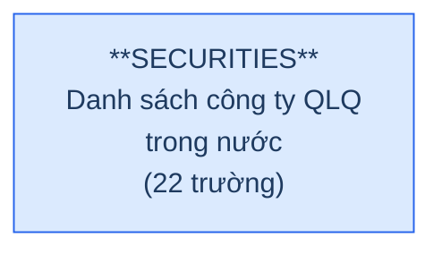

**Trường chính:** Name, ShortName, EnName, Address, Telephone, Fax, Email, Website, Decision (GP thành lập), DecisionDate, ActiveDate, StopDate, SecCapital (vốn điều lệ), Dorf (trong nước/nước ngoài), Status (FK→STATUS, danh mục).

### Silver — Proposed Model

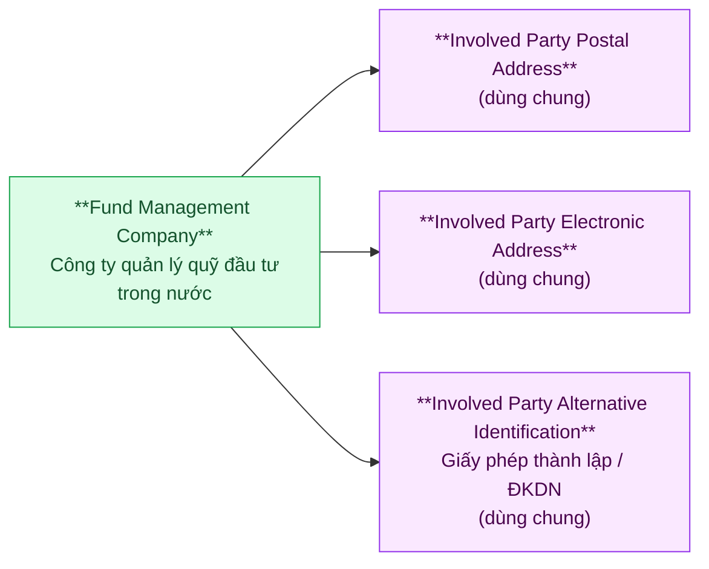

| Hạng mục | Nội dung |
|---|---|
| Silver Entity | Fund Management Company |
| BCV Concept | [Involved Party] |
| Model Table Type | Fundamental (SCD4A) |
| Grain | 1 dòng = 1 công ty quản lý quỹ trong nước |
| Shared Entities | IP Postal Address (Address), IP Electronic Address (Telephone, Fax, Email), IP Alt Identification (Decision — GP thành lập) |

> **Lưu ý:** Trường `Dorf` (1=Trong nước; 0=Nước ngoài) — cần xác nhận ý nghĩa. Website là thông tin công khai — không thuộc IP Electronic Address.

---

## 2. FORBRCH — Foreign Fund Management Organization Unit

### Source (FMS)

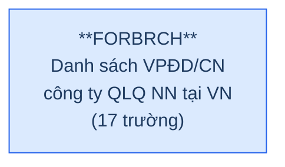

**Trường chính:** Name, EnName, Address, Email, Fax, ChangeLicense (số GPĐC gần nhất), ChangeLicenseDate, ChangeNote, EndDate, Status (FK→STATUS, danh mục), FileData. Không có FK đến SECURITIES — entity **độc lập**.

### Silver — Proposed Model

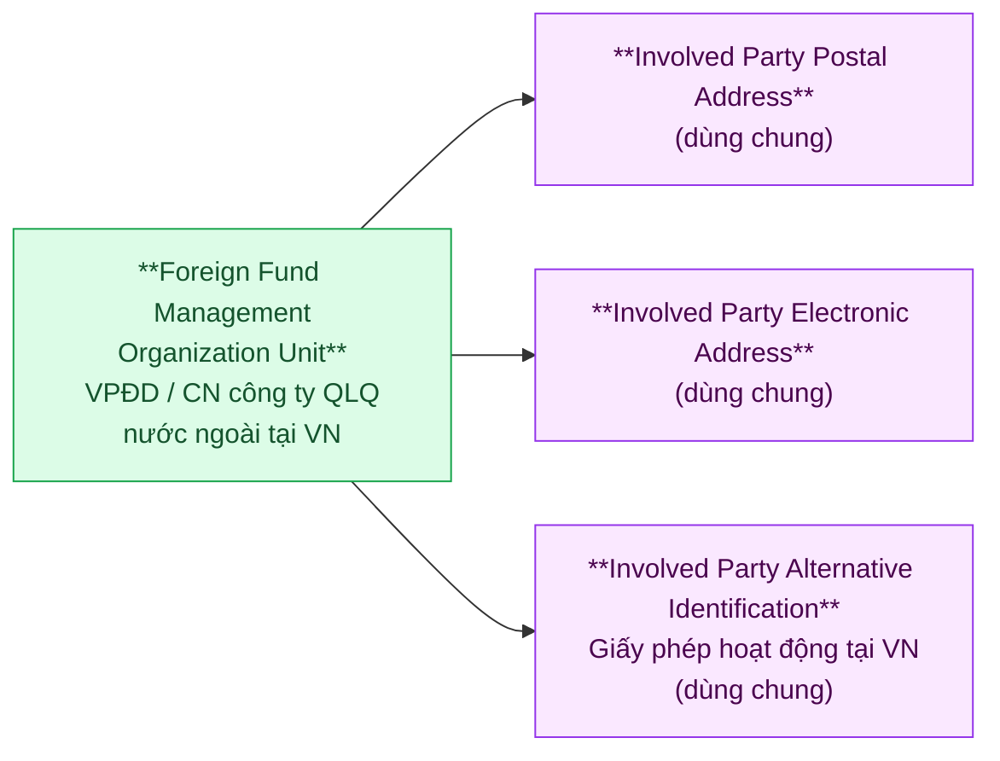

| Hạng mục | Nội dung |
|---|---|
| Silver Entity | Foreign Fund Management Organization Unit |
| BCV Concept | [Involved Party] |
| Model Table Type | Fundamental (SCD4A) |
| Grain | 1 dòng = 1 VPĐD hoặc chi nhánh công ty QLQ nước ngoài tại VN |
| Shared Entities | IP Postal Address (Address), IP Electronic Address (Email, Fax), IP Alt Identification (ChangeLicense — GP điều chỉnh) |

> **Lưu ý:** FORBRCH không FK đến SECURITIES — UBCKNN chỉ quản lý VPĐD/CN tại VN, không quản lý công ty mẹ nước ngoài.

---

## 3. BANKMONI — Custodian Bank

### Source (FMS)

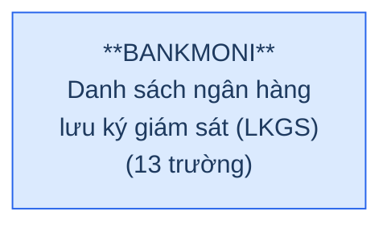

**Trường chính:** Name, ShortName, Address, Email, Telephone, Status (FK→STATUS, danh mục).

### Silver — Proposed Model

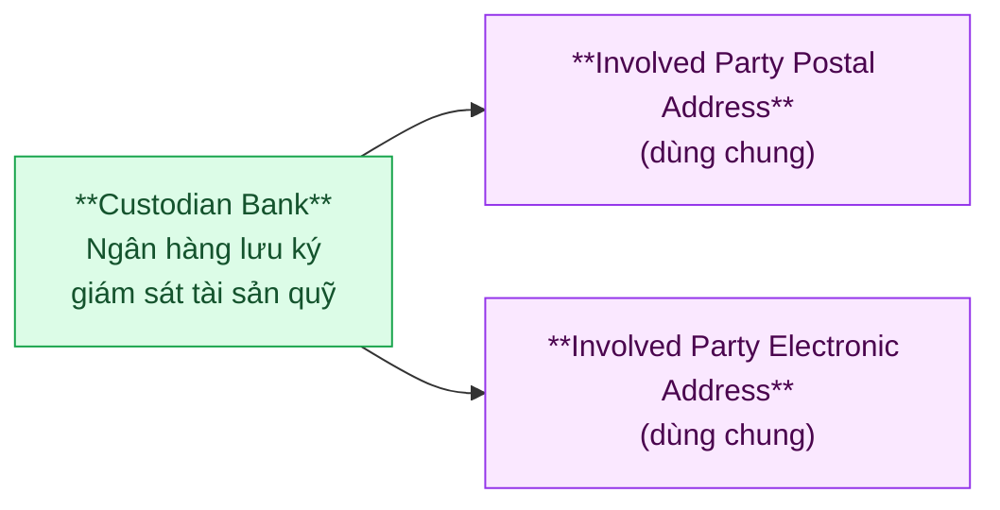

| Hạng mục | Nội dung |
|---|---|
| Silver Entity | Custodian Bank |
| BCV Concept | [Involved Party] |
| Model Table Type | Fundamental (SCD4A) |
| Grain | 1 dòng = 1 ngân hàng lưu ký giám sát |
| Shared Entities | IP Postal Address (Address), IP Electronic Address (Email, Telephone) |

---

## 4. AGENCIES — Fund Distribution Agent

### Source (FMS)

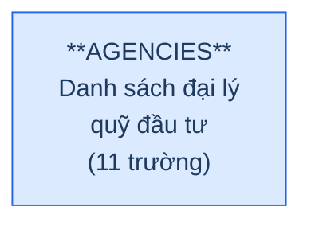

**Trường chính:** Name, ShortName, Address, AgencyTypeId (FK→AGENCYTYPE, danh mục), Status.

### Silver — Proposed Model

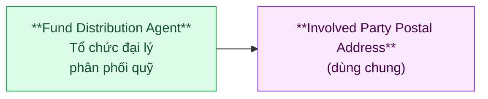

| Hạng mục | Nội dung |
|---|---|
| Silver Entity | Fund Distribution Agent |
| BCV Concept | [Involved Party] |
| Model Table Type | Fundamental (SCD4A) |
| Grain | 1 dòng = 1 tổ chức đại lý phân phối quỹ |
| Shared Entities | IP Postal Address (Address) |

---

## 5. INVES — Discretionary Investment Investor

### Source (FMS)

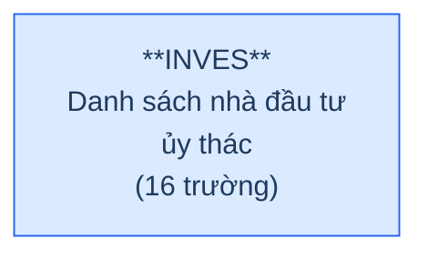

**Trường chính:** Name, Dorf (trong nước/ngoài), IdNo, IdDate, IdType (1=CMND/HC; 0=ĐKKD), NatId (FK→NATIONAL, danh mục), StoId (FK→STOCKHOLDERTYPE, danh mục), SecId (FK→SECURITIES), RelationShip.

### Silver — Proposed Model

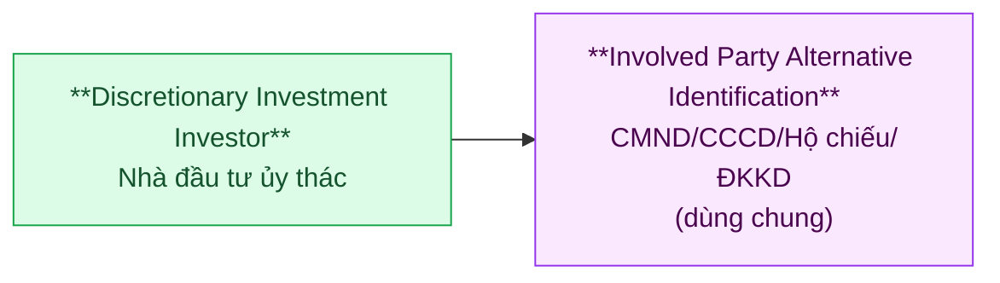

| Hạng mục | Nội dung |
|---|---|
| Silver Entity | Discretionary Investment Investor |
| BCV Concept | [Involved Party] |
| Model Table Type | Fundamental (SCD4A) |
| Grain | 1 dòng = 1 nhà đầu tư ủy thác (cá nhân hoặc tổ chức) |
| Shared Entities | IP Alt Identification (IdNo, IdDate, IdType) |

> **Lưu ý:** INVES có SecId → SECURITIES nhưng NĐT là chủ thể độc lập. SecId ghi nhận NĐT ủy thác cho QLQ nào — trên Silver thiết kế FK đến Fund Management Company. INVES đóng vai trò **investor master dùng chung** — cả INVESACC (ủy thác) lẫn MBFUND (đầu tư quỹ) đều reference.

---

## 6. RPTPERIOD — Reporting Period

### Source (FMS)

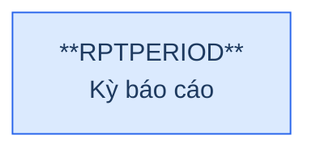

**Trường chính:** (pending column detail). Được RPTMEMBER, RPTVALUES, RPTPDSHT reference.

### Silver — Proposed Model

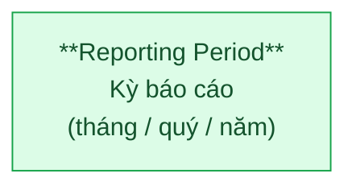

| Hạng mục | Nội dung |
|---|---|
| Silver Entity | Reporting Period |
| BCV Concept | [Condition] |
| Model Table Type | Fundamental (SCD1) |
| Grain | 1 dòng = 1 kỳ báo cáo |

---

## 7. RATINGPD — Member Rating Period

### Source (FMS)

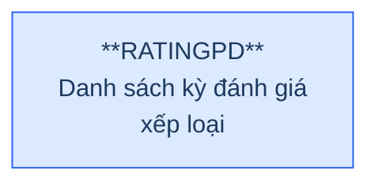

**Trường chính:** PeriodName, StartDate, EndDate, IsActive, IsDeleted. Được RANK, RNKFACTOR reference.

### Silver — Proposed Model

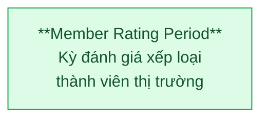

| Hạng mục | Nội dung |
|---|---|
| Silver Entity | Member Rating Period |
| BCV Concept | [Condition] |
| Model Table Type | Fundamental (SCD1) |
| Grain | 1 dòng = 1 kỳ đánh giá xếp loại |

---

## Tổng quan theo BCV Concept — Tầng 1

### 6a. Entity Silver Tầng 1

| BCV Core Object | BCV Concept | BCV Term | Source Table | Mô tả bảng nguồn | Silver Entity | Ghi chú |
|---|---|---|---|---|---|---|
| Involved Party | [Involved Party] Portfolio Fund Management Company | Portfolio Fund Management Company — "Identifies a Fund Management Company (Involved Party) that sets up the Portfolio. The Fund Management Company decides the investment strategy, appoints the agents, and is responsible for the promotion and the marketing of the Fund." Khớp chính xác. | SECURITIES | Danh sách công ty QLQ trong nước | Fund Management Company | Trường Dorf cần xác nhận. |
| Involved Party | [Involved Party] Organization Unit | Organization Unit — BCV mô tả sub-entity của Organization (có FK đến parent). FORBRCH không FK đến công ty mẹ nước ngoài — hoạt động như Organization độc lập trong scope giám sát UBCKNN. | FORBRCH | Danh sách VPĐD/CN công ty QLQ NN tại VN | Foreign Fund Management Organization Unit | Độc lập, không FK→SECURITIES |
| Involved Party | [Involved Party] Custodian | Custodian — "Identifies an Organization that holds, safeguards and accounts for property committed to its care." Khớp chính xác. Thêm: Investment Fund Portfolio Depository — "Identifies the Involved Party that holds and safeguards holdings owned by the Investment Fund." Mô tả đúng vai trò LKGS đối với quỹ. | BANKMONI | Danh sách ngân hàng lưu ký giám sát (LKGS) | Custodian Bank | |
| Involved Party | [Involved Party] Mutual Fund Distributor | Mutual Fund Distributor — "Identifies a relationship whereby an Involved Party is responsible for the distribution of shares in, or units of, a Group which is a pool of investments, such as a Mutual Fund." Khớp chính xác. Cũng gần Selling Agent nhưng Mutual Fund Distributor cụ thể hơn cho ngữ cảnh quỹ. | AGENCIES | Danh sách đại lý quỹ đầu tư | Fund Distribution Agent | |
| Involved Party | [Involved Party] | Không có term chính xác. Funds (BCV, role) — "Identifies an Involved Party that represents any managed pool of investment assets." Mô tả fund/investor ở tầm institutional. INVES là NĐT ủy thác — cá nhân hoặc tổ chức giao tài sản cho QLQ quản lý. BCV không có "Discretionary Investment Investor" cụ thể. Đặt theo ngữ cảnh FMS. | INVES | Danh sách nhà đầu tư ủy thác | Discretionary Investment Investor | Investor master dùng chung |
| Condition | [Condition] | Không có term chính xác. BCV không có "Reporting Period". Gần nhất: Time Period (Common) — khái niệm chung. Đặt theo ngữ cảnh FMS: kỳ báo cáo quy định cho thành viên thị trường. | RPTPERIOD | Kỳ báo cáo | Reporting Period | Được RPTMEMBER, RPTVALUES, RPTPDSHT reference |
| Condition | [Condition] | Không có term chính xác. BCV không có "Evaluation Period". Gần nhất: Arrangement Performance Criterion — "Identifies a Criterion according to an evaluation of how the obligations have been discharged." Đây là tiêu chí đánh giá, không phải kỳ đánh giá. Đặt theo ngữ cảnh FMS. | RATINGPD | Danh sách kỳ đánh giá xếp loại | Member Rating Period | Được RANK, RNKFACTOR reference |
| Location | [Location] Postal Address | Postal Address | SECURITIES, FORBRCH, BANKMONI, AGENCIES | — | IP Postal Address *(Shared)* | INVES không còn Address trong nguồn mới |
| Location | [Location] Electronic Address | Electronic Address | SECURITIES, FORBRCH, BANKMONI | — | IP Electronic Address *(Shared)* | Phone, Fax, Email |
| Involved Party | [Involved Party] Alternative Identification | Alternative Identification | SECURITIES, FORBRCH, INVES | — | IP Alt Identification *(Shared)* | GP thành lập, GP hoạt động, CMND/CCCD/Hộ chiếu/ĐKKD |

### Danh mục & Tham chiếu (Reference Data → Classification Value)

| Source Table | Mô tả | Xử lý trên Silver |
|---|---|---|
| STATUS | Trạng thái hoạt động | → Classification Value |
| AGENCYTYPE | Loại đại lý | → Classification Value |
| NATIONAL | Quốc gia/quốc tịch | → Classification Value |
| STOCKHOLDERTYPE | Loại hình NĐT/cổ đông | → Classification Value |

### Bảng ngoài scope Silver

| Source Table | Mô tả | Lý do |
|---|---|---|
| PARAWARN | Danh sách tham số cảnh báo | Isolated — không FK đến/từ bảng nghiệp vụ nào |

---

## Điểm cần xác nhận

| # | Câu hỏi | Ảnh hưởng |
|---|---|---|
| 1 | SECURITIES.Dorf (1=Trong nước, 0=Nước ngoài) — nếu Dorf=0 tồn tại, có cần phân luồng ETL? | Entity SECURITIES |
| 2 | RPTPERIOD — cần bổ sung column detail | Entity Reporting Period |
