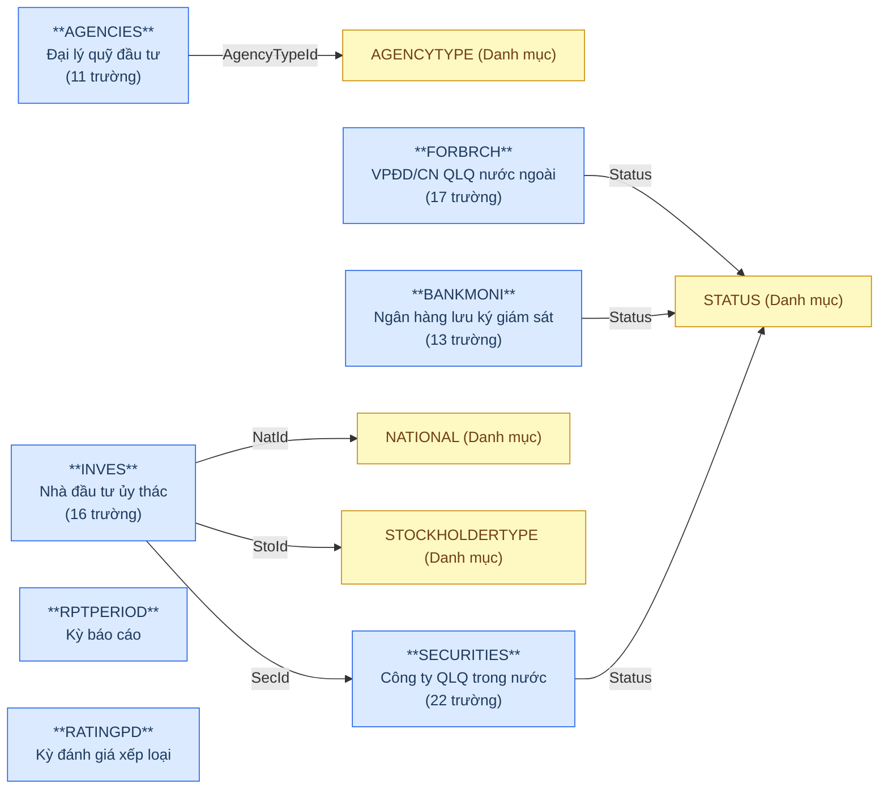
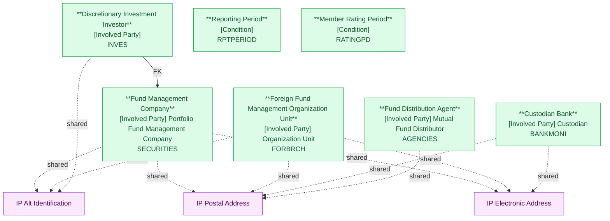

# FMS — HLD Tier 1: Main Entities

> **Nguồn:** Thiết kế CSDL FMS — Phân hệ quản lý giám sát công ty chứng khoán và quỹ đầu tư chứng khoán (20/03/2026)
>
> **Phụ thuộc:** Không có — các entity trong Tier 1 không FK đến bảng nghiệp vụ nào khác (chỉ FK đến bảng danh mục).
>
> **Thiết kế theo:** [FMS_HLD_Overview.md](FMS_HLD_Overview.md)

---

## 6a. Bảng tổng quan BCV Concept

| BCV Core Object | BCV Concept | Category | Source Table | Mô tả bảng nguồn | Silver Entity | BCV Term |
|---|---|---|---|---|---|---|
| Involved Party | [Involved Party] Portfolio Fund Management Company | Involved Party | SECURITIES | Danh sách công ty quản lý quỹ trong nước | Fund Management Company | Portfolio Fund Management Company — *"Identifies a Fund Management Company (Involved Party) that sets up the Portfolio. The Fund Management Company decides the investment strategy, appoints the agents, and is responsible for the promotion and the marketing of the Fund."* Khớp chính xác. Trường Dorf cần xác nhận. |
| Involved Party | [Involved Party] Organization Unit | Involved Party | FORBRCH | Danh sách VPĐD/CN công ty QLQ nước ngoài tại VN | Foreign Fund Management Organization Unit | Organization Unit — BCV mô tả sub-entity của Organization (có FK đến parent). FORBRCH không FK đến công ty mẹ nước ngoài — hoạt động như Organization độc lập trong scope giám sát UBCKNN. Đặt hậu tố Organization Unit vì quản lý cả VPĐD lẫn CN. |
| Involved Party | [Involved Party] Custodian | Involved Party | BANKMONI | Danh sách ngân hàng lưu ký giám sát (LKGS) | Custodian Bank | Custodian — *"Identifies an Organization that holds, safeguards and accounts for property committed to its care."* Khớp chính xác. Thêm: Investment Fund Portfolio Depository — *"Identifies the Involved Party that holds and safeguards holdings owned by the Investment Fund."* Mô tả đúng vai trò LKGS đối với quỹ. |
| Involved Party | [Involved Party] Mutual Fund Distributor | Involved Party | AGENCIES | Danh sách đại lý quỹ đầu tư | Fund Distribution Agent | Mutual Fund Distributor — *"Identifies a relationship whereby an Involved Party is responsible for the distribution of shares in, or units of, a Group which is a pool of investments, such as a Mutual Fund."* Khớp chính xác. |
| Involved Party | [Involved Party] | Involved Party | INVES | Danh sách nhà đầu tư ủy thác | Discretionary Investment Investor | Không có term chính xác trong BCV. Funds (BCV, role) — *"Identifies an Involved Party that represents any managed pool of investment assets."* Mô tả fund/investor ở tầm institutional. INVES là NĐT ủy thác — cá nhân hoặc tổ chức giao tài sản cho QLQ quản lý. Đặt tên theo ngữ cảnh FMS. Investor master dùng chung cho cả INVESACC (ủy thác) lẫn MBFUND (đầu tư quỹ). |
| Condition | [Condition] | Condition | RPTPERIOD | Kỳ báo cáo | Reporting Period | Không có term chính xác trong BCV. Gần nhất: Time Period (Common). Đặt theo ngữ cảnh FMS: kỳ báo cáo quy định cho thành viên thị trường. Được RPTMEMBER, RPTVALUES, RPTPDSHT reference. |
| Condition | [Condition] | Condition | RATINGPD | Danh sách kỳ đánh giá xếp loại | Member Rating Period | Không có term chính xác trong BCV. Gần nhất: Arrangement Performance Criterion — *"Identifies a Criterion according to an evaluation of how the obligations have been discharged."* Đây là tiêu chí đánh giá, không phải kỳ đánh giá. Đặt theo ngữ cảnh FMS. Được RANK, RNKFACTOR reference. |
| Location | [Location] Postal Address | Location | SECURITIES, FORBRCH, BANKMONI, AGENCIES | — | IP Postal Address *(Shared)* | Postal Address — Address, trong shared entity dùng chung cho mọi Involved Party. INVES không còn Address trong nguồn. |
| Location | [Location] Electronic Address | Location | SECURITIES, FORBRCH, BANKMONI | — | IP Electronic Address *(Shared)* | Electronic Address — Phone, Fax, Email. |
| Involved Party | [Involved Party] Alternative Identification | Involved Party | SECURITIES, FORBRCH, INVES | — | IP Alt Identification *(Shared)* | Alternative Identification — GP thành lập, GP hoạt động, CMND/CCCD/Hộ chiếu/ĐKKD. |

---

## 6b. Diagram Source (Mermaid)

---

## 6c. Diagram Silver (Mermaid)

---

## 6d. Danh mục & Tham chiếu

| Source Table | Mô tả | Xử lý Silver |
|---|---|---|
| STATUS | Trạng thái hoạt động | → Classification Value |
| AGENCYTYPE | Loại đại lý | → Classification Value |
| NATIONAL | Quốc gia/quốc tịch | → Classification Value |
| STOCKHOLDERTYPE | Loại hình NĐT/cổ đông | → Classification Value |

---

## 6e. Bảng chờ thiết kế

| Source Table | Mô tả bảng nguồn | Lý do chưa thiết kế |
|---|---|---|
| RPTPERIOD | Kỳ báo cáo | Chưa có thông tin cột đầy đủ |

---

## 6f. Điểm cần xác nhận

| # | Câu hỏi | Ảnh hưởng |
|---|---|---|
| 1 | SECURITIES.Dorf (1=Trong nước, 0=Nước ngoài) — nếu Dorf=0 tồn tại, có cần phân luồng ETL? | Ảnh hưởng entity Fund Management Company |
| 2 | RPTPERIOD — cần bổ sung column detail | Ảnh hưởng entity Reporting Period |
| 3 | PARAWARN — không có bảng nào FK đến bảng này. Xác nhận có thực sự trong scope FMS không? | Nếu không có entity nào sử dụng → loại khỏi scope Silver |

---

## Entities trong Tier 1

### 1. Fund Management Company
**Source:** `SECURITIES` | **BCV Concept:** [Involved Party] Portfolio Fund Management Company | **BCO:** Involved Party

**Grain:** 1 dòng = 1 công ty quản lý quỹ trong nước được UBCKNN cấp phép.

**Attributes chính:** Fund Management Company Code, Fund Management Company Name, Fund Management Company Short Name, Fund Management Company English Name, Capital Amount, Active Date, Stop Date, Dorf Indicator, Practice Status Code.

**Shared entities:** IP Postal Address (Address), IP Electronic Address (Telephone, Fax, Email), IP Alt Identification (Decision — GP thành lập).

**Được FK từ:** Investment Fund, Fund Management Company Organization Unit, Fund Management Company Key Person, Member Rating (Tier 2); Investment Fund Investor Membership, Member Periodic Report, Fund Management Company Share Transfer (Tier 3+).

---

### 2. Foreign Fund Management Organization Unit
**Source:** `FORBRCH` | **BCV Concept:** [Involved Party] Organization Unit | **BCO:** Involved Party

**Grain:** 1 dòng = 1 VPĐD hoặc chi nhánh công ty QLQ nước ngoài tại VN.

**Attributes chính:** Organization Unit Name, Organization Unit English Name, End Date, Practice Status Code, Change License Number, Change License Date, Change Note.

**Shared entities:** IP Postal Address (Address), IP Electronic Address (Email, Fax), IP Alt Identification (ChangeLicense — GP điều chỉnh).

**Ghi chú:** FORBRCH không FK đến SECURITIES — UBCKNN chỉ quản lý VPĐD/CN tại VN, không quản lý công ty mẹ nước ngoài.

---

### 3. Custodian Bank
**Source:** `BANKMONI` | **BCV Concept:** [Involved Party] Custodian | **BCO:** Involved Party

**Grain:** 1 dòng = 1 ngân hàng lưu ký giám sát tài sản quỹ.

**Attributes chính:** Custodian Bank Name, Custodian Bank Short Name, Practice Status Code.

**Shared entities:** IP Postal Address (Address), IP Electronic Address (Email, Telephone).

---

### 4. Fund Distribution Agent
**Source:** `AGENCIES` | **BCV Concept:** [Involved Party] Mutual Fund Distributor | **BCO:** Involved Party

**Grain:** 1 dòng = 1 tổ chức đại lý phân phối quỹ.

**Attributes chính:** Fund Distribution Agent Name, Fund Distribution Agent Short Name, Agency Type Code, Practice Status Code.

**Shared entities:** IP Postal Address (Address).

---

### 5. Discretionary Investment Investor
**Source:** `INVES` | **BCV Concept:** [Involved Party] | **BCO:** Involved Party

**Grain:** 1 dòng = 1 nhà đầu tư ủy thác (cá nhân hoặc tổ chức).

**Attributes chính:** Investor Name, Dorf Indicator, Identification Type Code, Nationality Code, Stockholder Type Code, Fund Management Company FK (SecId — QLQ đang nhận ủy thác).

**Shared entities:** IP Alt Identification (IdNo, IdDate, IdType — CMND/CCCD/Hộ chiếu/ĐKKD).

**Ghi chú:** INVES đóng vai trò investor master dùng chung cho cả INVESACC (ủy thác) lẫn MBFUND (đầu tư quỹ).

---

### 6. Reporting Period
**Source:** `RPTPERIOD` | **BCV Concept:** [Condition] | **BCO:** Condition

**Grain:** 1 dòng = 1 kỳ báo cáo (tháng/quý/năm).

**Ghi chú:** Chưa có thông tin cột đầy đủ — chờ thiết kế.

---

### 7. Member Rating Period
**Source:** `RATINGPD` | **BCV Concept:** [Condition] | **BCO:** Condition

**Grain:** 1 dòng = 1 kỳ đánh giá xếp loại thành viên thị trường.

**Attributes chính:** Period Name, Start Date, End Date, Is Active Indicator, Is Deleted Indicator.

---

## Attribute Summary

| Silver Entity | # Attributes | PK | Key FKs |
|---|---|---|---|
| Fund Management Company | ~14 | Fund Management Company Id | — |
| Foreign Fund Management Organization Unit | ~10 | Foreign Fund Management Organization Unit Id | — |
| Custodian Bank | ~7 | Custodian Bank Id | — |
| Fund Distribution Agent | ~6 | Fund Distribution Agent Id | — |
| Discretionary Investment Investor | ~10 | Discretionary Investment Investor Id | Fund Management Company (SecId) |
| Reporting Period | TBD | Reporting Period Id | — |
| Member Rating Period | ~7 | Member Rating Period Id | — |
