# FMS — HLD Tier 2: Phụ thuộc Main Entities

> **Nguồn:** Thiết kế CSDL FMS — Phân hệ quản lý giám sát công ty chứng khoán và quỹ đầu tư chứng khoán (20/03/2026)
>
> **Phụ thuộc Tier 1:** Fund Management Company, Foreign Fund Management Organization Unit, Custodian Bank, Fund Distribution Agent, Discretionary Investment Investor, Reporting Period, Member Rating Period.
>
> **Thiết kế theo:** [FMS_HLD_Overview.md](FMS_HLD_Overview.md)

---

## 1. FUNDS — FMS Investment Fund

### Source (FMS)

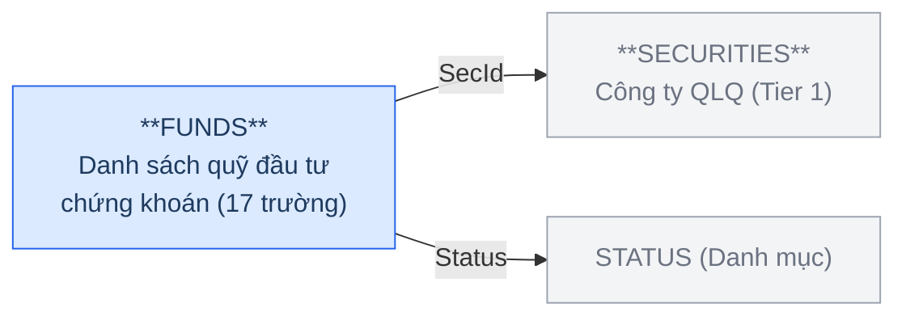

**Trường chính:** FundName, FundShortName, FundEnName, SecId (FK→SECURITIES), FundCapital, FundType, Status (FK→STATUS), DecisionDate, ActiveDate, StopDate.

### Silver — Proposed Model

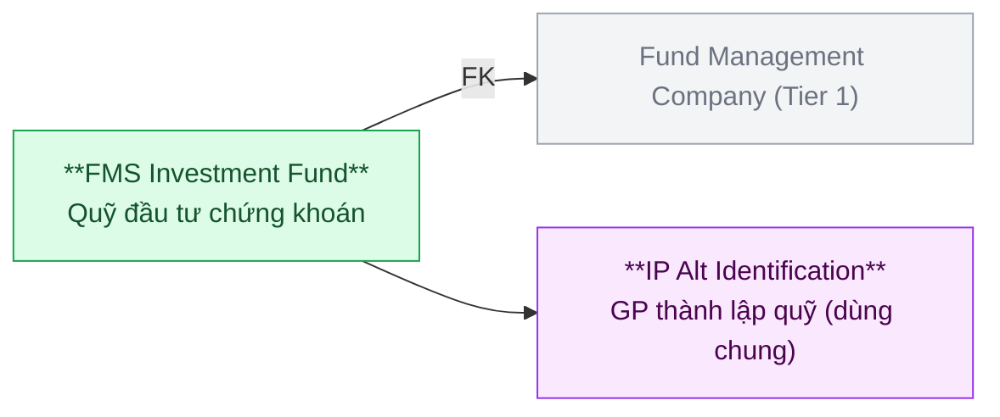

| Hạng mục | Nội dung |
|---|---|
| Silver Entity | FMS Investment Fund |
| BCV Concept | [Involved Party] Organization |
| Model Table Type | Fundamental (SCD4A) |
| Grain | 1 dòng = 1 quỹ đầu tư chứng khoán (pháp nhân) |
| FK đến Tier 1 | Fund Management Company (SecId) |
| Shared Entities | IP Alt Identification (DecisionDate — GP thành lập quỹ) |

> **Lưu ý:** FundType → Classification Value. FUNDS không có Address/Phone/Email → không tách IP Postal/Electronic Address. Entity trung tâm Tier 2 — được MBFUND, AGENFUNDS, FNDSBMN, REPRESENT, RPTMEMBER, VIOLT reference.

---

## 2. BRANCHES — FMS Fund Management Company Organization Unit

### Source (FMS)

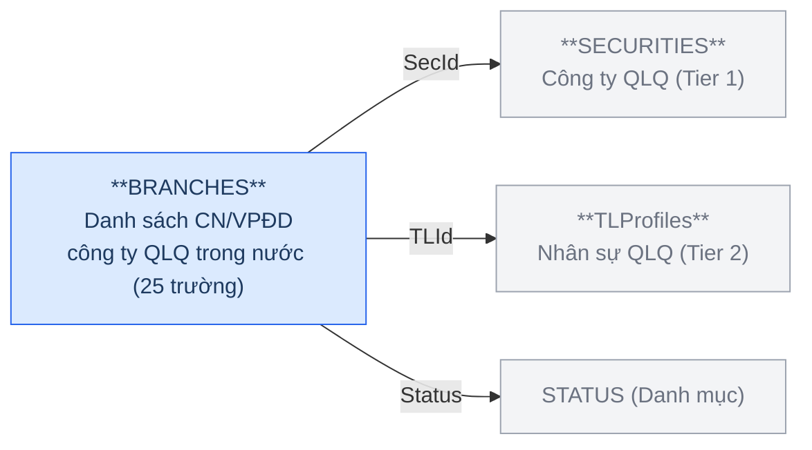

**Trường chính:** SecId (FK→SECURITIES), Name, Address, Telephone, Fax, BrType (1=CN; 4=VPĐD), BrIdowner (CN/VPĐD cha), Decision (GP thành lập), DecisionDate, Status, StopDate, TLId (FK→TLProfiles), VoucherNo, VoucherDate.

> **Dependency nội bộ Tier 2:** BRANCHES có FK đến TLProfiles — thiết kế TLProfiles trước (mục 3).

### Silver — Proposed Model

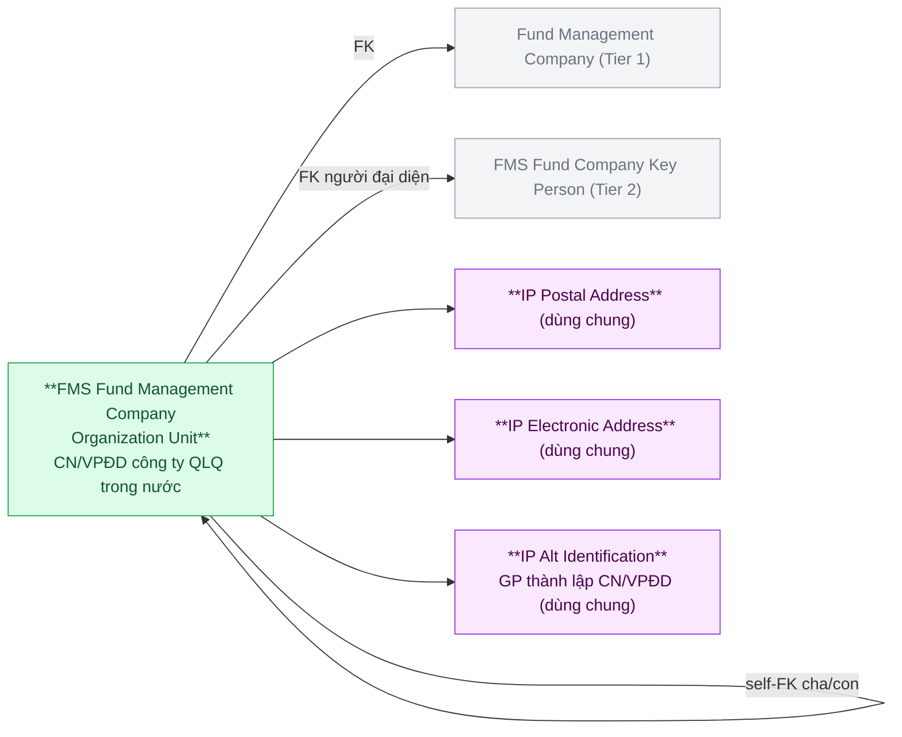

| Hạng mục | Nội dung |
|---|---|
| Silver Entity | FMS Fund Management Company Organization Unit |
| BCV Concept | [Involved Party] Organization Unit |
| Model Table Type | Fundamental (SCD4A) |
| Grain | 1 dòng = 1 đơn vị trực thuộc công ty QLQ trong nước (CN hoặc VPĐD) |
| FK đến Tier 1 | Fund Management Company (SecId) |
| FK đến Tier 2 | FMS Fund Company Key Person (TLId — người đại diện) |
| Self-FK | BrIdowner → FMS Fund Management Company Organization Unit (đơn vị cha) |
| Shared Entities | IP Postal Address (Address), IP Electronic Address (Telephone, Fax), IP Alt Identification (Decision) |

> **Lưu ý:** BrType (1=CN; 4=VPĐD) → Classification Value. Bảng chứa nhiều loại đơn vị → đặt hậu tố "Organization Unit" thay vì "Branch".

---

## 3. TLProfiles — FMS Fund Company Key Person

### Source (FMS)

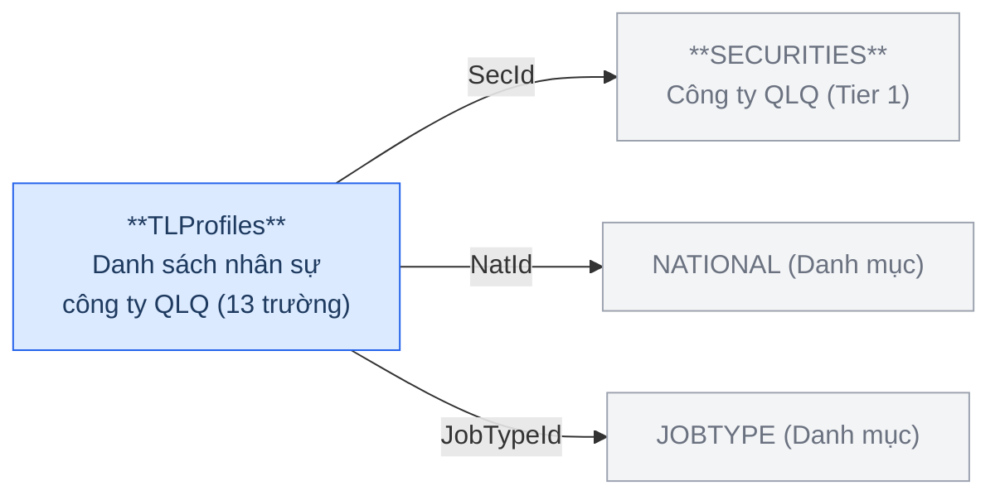

**Trường chính:** SecId (FK→SECURITIES), FullName, BirthDate, NatId (FK→NATIONAL), IdNo, JobTypeId (FK→JOBTYPE), IsLegal, IsCBTT.

### Silver — Proposed Model

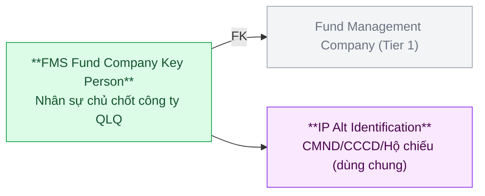

| Hạng mục | Nội dung |
|---|---|
| Silver Entity | FMS Fund Company Key Person |
| BCV Concept | [Involved Party] Individual |
| Model Table Type | Fundamental (SCD4A) |
| Grain | 1 dòng = 1 cá nhân nhân sự chủ chốt của công ty QLQ |
| FK đến Tier 1 | Fund Management Company (SecId) |
| Shared Entities | IP Alt Identification (IdNo — CMND/CCCD/Hộ chiếu) |

> **Lưu ý:** JobTypeId → Classification Value. IsLegal, IsCBTT là Indicator, giữ nguyên trên Silver.

---

## 4. AGENCIESBRA — FMS Fund Distribution Agent Organization Unit

### Source (FMS)

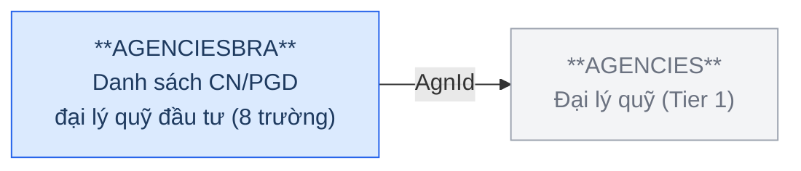

**Trường chính:** AgnId (FK→AGENCIES), Name, Address, Status.

### Silver — Proposed Model

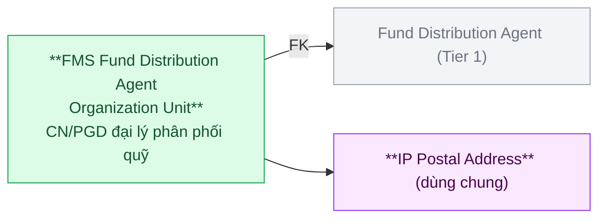

| Hạng mục | Nội dung |
|---|---|
| Silver Entity | FMS Fund Distribution Agent Organization Unit |
| BCV Concept | [Involved Party] Organization Unit |
| Model Table Type | Fundamental (SCD4A) |
| Grain | 1 dòng = 1 đơn vị trực thuộc đại lý phân phối quỹ (CN hoặc PGD) |
| FK đến Tier 1 | Fund Distribution Agent (AgnId) |
| Shared Entities | IP Postal Address (Address) |

> **Lưu ý:** Bảng chứa cả CN lẫn PGD → đặt hậu tố "Organization Unit" thay vì "Branch".

---

## 5. INVESACC — FMS Discretionary Investment Account

### Source (FMS)

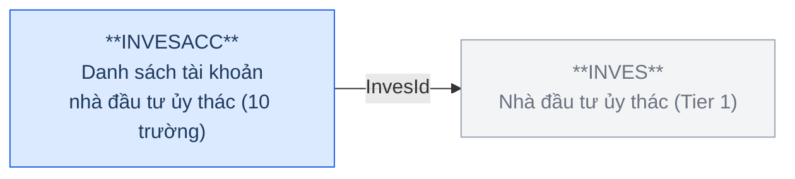

**Trường chính:** InvesId (FK→INVES), Account, AccPlace, ContractNo, ActScale, AdScale, ManagerFee, Status, DateReport.

### Silver — Proposed Model

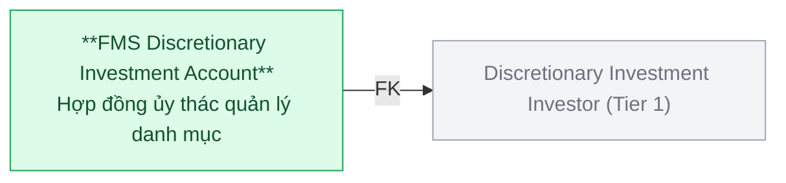

| Hạng mục | Nội dung |
|---|---|
| Silver Entity | FMS Discretionary Investment Account |
| BCV Concept | [Arrangement] Financial Portfolio Management Arrangement |
| Model Table Type | Fundamental (SCD4A) |
| Grain | 1 dòng = 1 hợp đồng ủy thác quản lý danh mục của 1 NĐT |
| FK đến Tier 1 | Discretionary Investment Investor (InvesId) |

> **Lưu ý:** ManagerFee là phí theo điều khoản hợp đồng — không phải phí thực tế phát sinh (Transaction). AccPlace (nơi lưu ký) → cần xác nhận có FK đến Custodian Bank không.

---

## 6. RANK — FMS Member Rating

### Source (FMS)

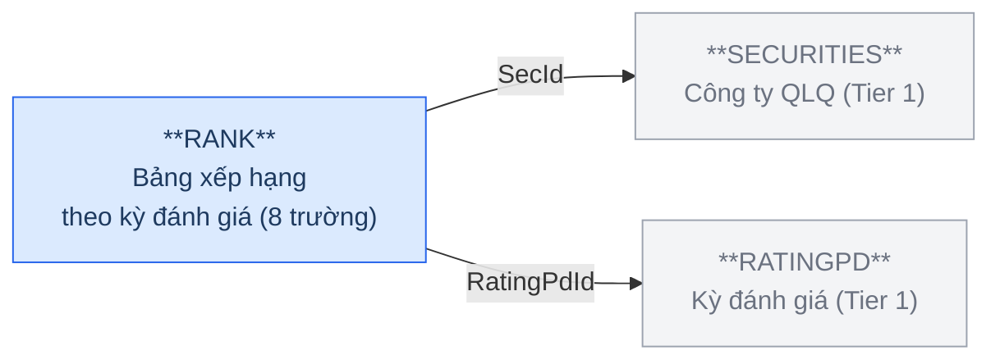

**Trường chính:** SecId (FK→SECURITIES), RatingPdId (FK→RATINGPD), TotalScore, RankValue, RankClass.

### Silver — Proposed Model

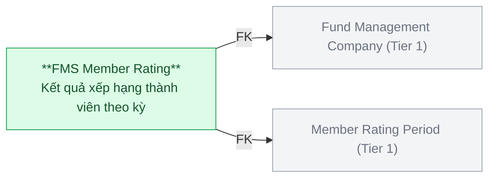

| Hạng mục | Nội dung |
|---|---|
| Silver Entity | FMS Member Rating |
| BCV Concept | [Involved Party] Involved Party Rating |
| Model Table Type | Fundamental (SCD1) |
| Grain | 1 dòng = 1 kết quả xếp hạng của 1 công ty QLQ trong 1 kỳ đánh giá |
| FK đến Tier 1 | Fund Management Company (SecId) + Member Rating Period (RatingPdId) |

---

## 7. RNKFACTOR — FMS Rating Criterion

### Source (FMS)

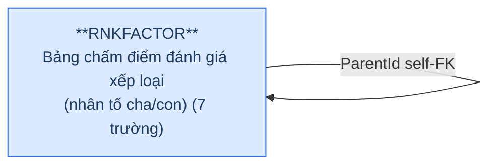

**Trường chính:** Name, ParentId (self-FK), MaxScore, Weight, IsActive.

### Silver — Proposed Model

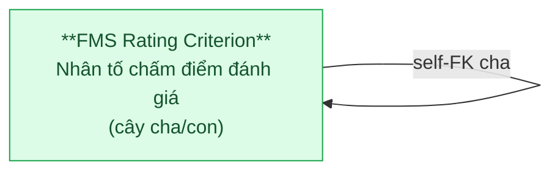

| Hạng mục | Nội dung |
|---|---|
| Silver Entity | FMS Rating Criterion |
| BCV Concept | [Condition] Criterion |
| Model Table Type | Fundamental (SCD1) |
| Grain | 1 dòng = 1 nhân tố chấm điểm (cha hoặc con) |
| Self-FK | ParentId → FMS Rating Criterion (nhân tố cha) |

> **Lưu ý:** Không FK đến entity Tier 1, nhưng được RNKGRFTOR (Tier 3) reference — đặt Tier 2 để Tier 3 có thể tham chiếu. ParentId trên Silver là self-FK surrogate.

---

## 8. SECBUSINES & FGBUSINESS — Pure Junction Table (không tạo entity Silver)

SECBUSINES = (SecId, BuId) và FGBUSINESS = (FrBchId, BuId) — mỗi bảng chỉ có 2 trường nghiệp vụ: 1 FK đến entity chính, 1 FK đến bảng danh mục BUSINESS (Classification Value). Không có attribute nghiệp vụ riêng.

→ Áp dụng quy tắc pure junction table: **không tạo Silver entity**. Denormalize thành trường `Array` trên entity chính.

| Source Table | Entity chính | Xử lý trên Silver |
|---|---|---|
| SECBUSINES | Fund Management Company | Thêm trường `business_type_codes ARRAY<STRING>` — danh sách mã ngành nghề kinh doanh |
| FGBUSINESS | Foreign Fund Management Organization Unit | Thêm trường `business_type_codes ARRAY<STRING>` — danh sách mã ngành nghề kinh doanh |

---

## 6a. Tổng quan BCV Concept

| BCV Core Object | BCV Concept | Category | Source Table | Mô tả bảng nguồn | Silver Entity | BCV Term |
|---|---|---|---|---|---|---|
| Involved Party | [Involved Party] Organization | Involved Party | FUNDS | Danh sách quỹ đầu tư chứng khoán | FMS Investment Fund | Candidate: Mutual Fund (id 10089, Group) — *"collective investment scheme that pools money."* Tuy nhiên FundCapital (vốn điều lệ), DecisionDate (GP thành lập), ActiveDate, StopDate mang đặc tính pháp nhân — quỹ VN có tư cách pháp lý độc lập. BCV Mutual Fund mô tả góc nhìn tài sản, không khớp cấu trúc. Chọn Organization (id 10894): *"Identifies an Involved Party that may stand alone in an operational or legal context."* |
| Involved Party | [Involved Party] Organization Unit | Involved Party | BRANCHES | Danh sách CN/VPĐD công ty QLQ trong nước | FMS Fund Management Company Organization Unit | Candidate: Organization Unit (id 11192) — *"A component or subdivision of an Organization established for the purpose of performing discrete functional responsibilities. For example, Branch Office #24."* Cấu trúc trường: có Address/Telephone/Fax riêng, GP riêng (Decision), vòng đời riêng (StopDate), FK đến tổ chức cha (SecId). Khớp chính xác. Tên dùng hậu tố Organization Unit vì bảng chứa cả CN lẫn VPĐD. |
| Involved Party | [Involved Party] Individual | Involved Party | TLProfiles | Danh sách nhân sự công ty QLQ | FMS Fund Company Key Person | Candidate: Individual (id 10902) — *"Identifies an Involved Party who is a natural person."* Cấu trúc trường: FullName, BirthDate, IdNo — đặc trưng thể nhân. Khớp chính xác. |
| Involved Party | [Involved Party] Organization Unit | Involved Party | AGENCIESBRA | Danh sách CN/PGD của đại lý quỹ đầu tư | FMS Fund Distribution Agent Organization Unit | Candidate: Organization Unit (id 11192) — cùng pattern với BRANCHES. Cấu trúc trường: Name, Address, FK đến đại lý cha (AgnId). Khớp chính xác. Tên dùng hậu tố Organization Unit vì bảng chứa cả CN lẫn PGD. |
| Arrangement | [Arrangement] Financial Portfolio Management Arrangement | Arrangement | INVESACC | Danh sách tài khoản nhà đầu tư ủy thác | FMS Discretionary Investment Account | Candidate: Financial Portfolio Management Arrangement — *"Identifies a service of managing of financial portfolio."* Cấu trúc trường: ContractNo (số HĐ), ActScale/AdScale (quy mô vốn cam kết và thực tế), ManagerFee (phí theo HĐ), Status (còn/hết hiệu lực) — đặc trưng hợp đồng dịch vụ. Khớp chính xác. |
| Involved Party | [Involved Party] Involved Party Rating | Involved Party | RANK | Bảng xếp hạng theo kỳ đánh giá | FMS Member Rating | Candidate ban đầu: Performance Rating (id 10096, Group) — *"Identifies a Rating Scale."* Tuy nhiên cấu trúc trường: TotalScore, RankValue, RankClass là kết quả cụ thể gán cho từng QLQ theo kỳ — không phải định nghĩa thang đo. Chọn Involved Party Rating (id 10360): *"Identifies a relationship in which a Rating Scale applies to an Involved Party."* Term này nằm trong category Group nhưng nội dung mô tả quan hệ với Involved Party → BCV Concept = [Involved Party], không phải [Group]. |
| Condition | [Condition] Criterion | Condition | RNKFACTOR | Bảng chấm điểm đánh giá xếp loại (nhân tố cha/con) | FMS Rating Criterion | Candidate ban đầu: Arrangement Performance Criterion — gắn với đánh giá thực hiện nghĩa vụ của Arrangement cụ thể. Cấu trúc trường: Name, MaxScore, Weight, IsActive — tiêu chí và trọng số tĩnh, không gắn Arrangement nào. Chọn Criterion (id 8945): *"Identifies a Condition that specifies a characteristic used as a basis of judgment."* Khớp chính xác. |

---

## 6b. Diagram Source (Mermaid)

```mermaid
graph TD
    classDef src fill:#dbeafe,stroke:#2563eb,color:#1e3a5f
    classDef ref fill:#f3f4f6,stroke:#9ca3af,color:#6b7280
    classDef dim fill:#fef9c3,stroke:#ca8a04,color:#713f12

    SECURITIES["SECURITIES (Tier 1)"]:::ref
    FORBRCH["FORBRCH (Tier 1)"]:::ref
    AGENCIES["AGENCIES (Tier 1)"]:::ref
    INVES["INVES (Tier 1)"]:::ref
    RATINGPD["RATINGPD (Tier 1)"]:::ref

    STATUS["STATUS (Danh mục)"]:::dim
    NATIONAL["NATIONAL (Danh mục)"]:::dim
    JOBTYPE["JOBTYPE (Danh mục)"]:::dim
    BUSINESS["BUSINESS (Danh mục)"]:::dim

    FUNDS["**FUNDS**\nQuỹ đầu tư"]:::src
    BRANCHES["**BRANCHES**\nCN/VPĐD QLQ trong nước"]:::src
    TLProfiles["**TLProfiles**\nNhân sự QLQ"]:::src
    AGENCIESBRA["**AGENCIESBRA**\nCN/PGD đại lý quỹ"]:::src
    INVESACC["**INVESACC**\nTK NĐT ủy thác"]:::src
    RANK["**RANK**\nBảng xếp hạng"]:::src
    RNKFACTOR["**RNKFACTOR**\nNhân tố chấm điểm"]:::src
    SECBUSINES["SECBUSINES (bridge)"]:::src
    FGBUSINESS["FGBUSINESS (bridge)"]:::src

    FUNDS -->|SecId| SECURITIES
    FUNDS -->|Status| STATUS
    BRANCHES -->|SecId| SECURITIES
    BRANCHES -->|TLId| TLProfiles
    BRANCHES -->|Status| STATUS
    TLProfiles -->|SecId| SECURITIES
    TLProfiles -->|NatId| NATIONAL
    TLProfiles -->|JobTypeId| JOBTYPE
    AGENCIESBRA -->|AgnId| AGENCIES
    INVESACC -->|InvesId| INVES
    RANK -->|SecId| SECURITIES
    RANK -->|RatingPdId| RATINGPD
    RNKFACTOR -->|ParentId| RNKFACTOR
    SECBUSINES -->|SecId| SECURITIES
    SECBUSINES -->|BuId| BUSINESS
    FGBUSINESS -->|FrBchId| FORBRCH
    FGBUSINESS -->|BuId| BUSINESS
```

---

## 6c. Diagram Silver (Mermaid)

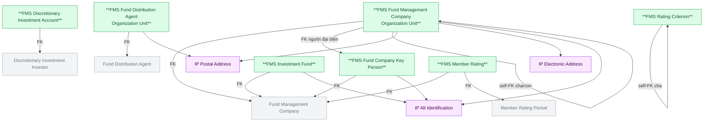

---

## 6d. Danh mục & Tham chiếu (Reference Data → Classification Value)

| Source Table | Mô tả | BCV Term | Xử lý Silver |
|---|---|---|---|
| JOBTYPE | Danh sách loại chức vụ | — | → Classification Value. Scheme: `FMS_JOB_TYPE` |
| BUSINESS | Danh mục ngành nghề kinh doanh | — | → Classification Value. Scheme: `FMS_BUSINESS_TYPE`. Được denormalize thành `ARRAY<Classification Value Code>` trên Fund Management Company (qua SECBUSINES) và Foreign Fund Management Organization Unit (qua FGBUSINESS). |

## 6d-extra. Entity từ bảng danh mục — cần thiết kế riêng

| Source Table | Mô tả | BCV Term | Xử lý Silver |
|---|---|---|---|
| LOCATION | Danh sách tỉnh/thành phố | Geographic Area (id 11736, Location) — *"A place or bounded area defined by nature, by an external authority (such as a government), or for internal business purpose."* Tỉnh/thành phố là đơn vị hành chính do nhà nước định nghĩa. Cấu trúc trường: Id, Name, SName (mã), Status, IsDeleted — có instance data, vòng đời. Không phải Classification Value thuần túy. | → Silver entity **[Location] Geographic Area**. Dùng chung cho toàn hệ thống (shared). Cần thiết kế ở HLD tổng hợp hoặc tầng riêng. |

---

## 6e. Bảng chờ thiết kế

| Source Table | Mô tả bảng nguồn | Lý do chưa thiết kế |
|---|---|---|
| FNDBUP | Bản ghi chi tiết lịch sử quỹ đầu tư | Chưa có thông tin cột |
| RNKGRFTOR | Bảng trung gian Ranks và RNKFACTOR | Chưa có thông tin cột |
| RNKFACTHISTORY | Lưu kết quả các lần lưu bảng tổng hợp đánh giá | Chưa có thông tin cột |

---

## 6f. Điểm cần xác nhận

| # | Câu hỏi | Ảnh hưởng |
|---|---|---|
| 1 | INVESACC.AccPlace (nơi lưu ký) — có phải FK đến BANKMONI không? | Nếu có → thêm FK từ FMS Discretionary Investment Account đến Custodian Bank (Tier 1) |
| 2 | BRANCHES.BrIdowner — giá trị là Id nguồn hay text? | Ảnh hưởng thiết kế self-FK surrogate trên Silver |
| 3 | TLProfiles — nhân sự có thể thuộc nhiều công ty QLQ qua thời gian không? | Nếu có → grain cần review, có thể cần tách role khỏi entity |
| 4 | PARVALUE — không có bảng nào trong FMS FK đến bảng này. Xác nhận PARVALUE có thực sự trong scope FMS không, hay là orphan table? | Nếu không có entity nào sử dụng → loại khỏi scope Silver hoàn toàn |
| 5 | LOCATION — đây là shared entity dùng chung nhiều source system, có thiết kế tập trung ở tầng nào chưa? | Tránh thiết kế trùng lặp giữa các source system |
