# FMS — HLD Tầng 2: Phụ thuộc Main Entities

> **Nguồn:** Thiết kế CSDL FMS — Phân hệ quản lý giám sát công ty chứng khoán và quỹ đầu tư chứng khoán (20/03/2026)
>
> **Phạm vi:** 9 bảng nguồn Tầng 2 — các entity có FK đến ít nhất 1 main entity Tầng 1 (SECURITIES, FORBRCH, BANKMONI, AGENCIES, INVES, RPTPERIOD, RATINGPD).
>
> **Entity tham chiếu (Tầng 1):** Fund Management Company, Foreign Fund Management Organization Unit, Custodian Bank, Fund Distribution Agent, Discretionary Investment Investor, Reporting Period, Member Rating Period.
>
> **Ký hiệu:**
> - 🔵 Xanh dương: bảng nguồn FMS
> - 🟢 Xanh lá: entity Silver mới (Tầng 2)
> - ⬜ Xám: entity Silver tham chiếu (Tầng 1 — chỉ ghi tên)
> - 🟣 Tím: Shared entity

---

## 1. FUNDS — FMS Investment Fund

### Source (FMS)

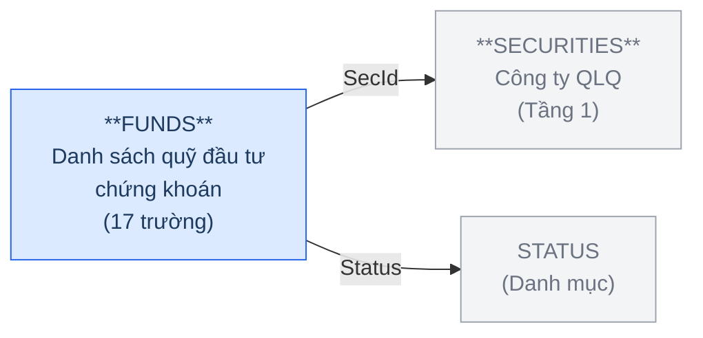

**Trường chính:** FundName, FundShortName, FundEnName, SecId (FK→SECURITIES), FundCapital, FundType, Status (FK→STATUS), DecisionDate, ActiveDate, StopDate.

**Đánh giá cấu trúc trường:** FundName (tên pháp nhân), FundCapital (vốn điều lệ), DecisionDate (ngày cấp phép thành lập), ActiveDate, StopDate (vòng đời pháp lý) — đây là đặc tính của pháp nhân độc lập được cấp phép, không phải tập hợp tài sản. BCV Mutual Fund (id 10089) xếp vào [Group] Portfolio — mô tả góc nhìn tài sản/tập hợp đầu tư, không khớp. Chọn [Involved Party] Organization.

### Silver — Proposed Model

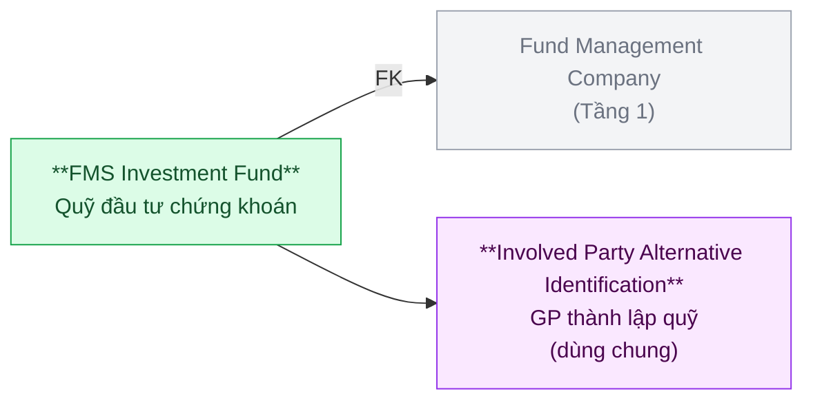

| Hạng mục | Nội dung |
|---|---|
| Silver Entity | FMS Investment Fund |
| BCV Concept | [Involved Party] Organization |
| BCV Term | Organization (id 10894) — *"Identifies an Involved Party that may stand alone in an operational or legal context."* Quỹ đầu tư VN có tư cách pháp nhân, vốn điều lệ, GP thành lập, vòng đời pháp lý độc lập. |
| Model Table Type | Fundamental (SCD4A) |
| Grain | 1 dòng = 1 quỹ đầu tư chứng khoán (pháp nhân) |
| FK đến Tầng 1 | Fund Management Company (SecId) |
| Shared Entities | IP Alt Identification (DecisionDate — GP thành lập quỹ) |

> **Lưu ý:** FundType (loại hình quỹ) → Classification Value. FUNDS không có Address/Phone/Email → không tách IP Postal/Electronic Address. Entity trung tâm Tầng 2 — được nhiều bảng Tầng 3 reference (MBFUND, AGENFUNDS, FNDSBMN, REPRESENT, VIOLT...).

---

## 2. BRANCHES — FMS Fund Management Company Branch

### Source (FMS)

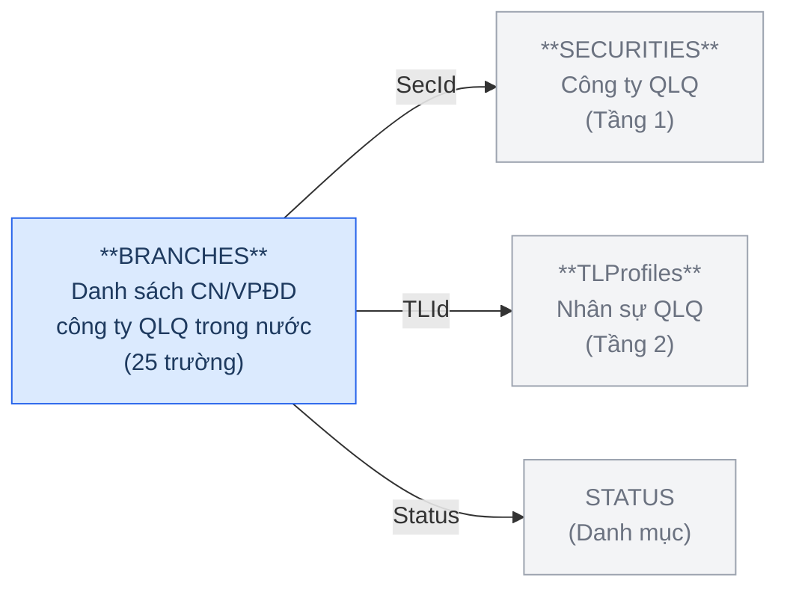

**Trường chính:** SecId (FK→SECURITIES), Name, Address, Telephone, Fax, BrType (1=CN; 4=VPĐD), BrIdowner (CN cha/con), Decision (GP thành lập), DecisionDate, Status, StopDate, TLId (FK→TLProfiles), VoucherNo, VoucherDate.

**Đánh giá cấu trúc trường:** Có tên, địa chỉ, liên lạc riêng; có GP thành lập và vòng đời riêng (Decision, StopDate); FK đến tổ chức cha (SecId→SECURITIES); BrIdowner cho cây cha/con trong nội bộ. Đây là đơn vị trực thuộc tổ chức — khớp [Involved Party] Organization Unit.

> **Lưu ý dependency:** BRANCHES có FK đến TLProfiles — entity cùng Tầng 2. Thiết kế TLProfiles trước (mục 3).

### Silver — Proposed Model

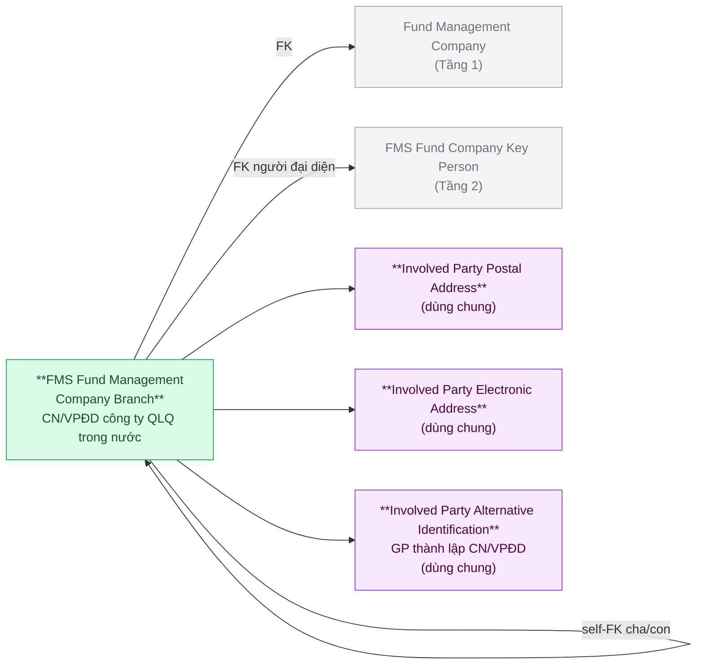

| Hạng mục | Nội dung |
|---|---|
| Silver Entity | FMS Fund Management Company Branch |
| BCV Concept | [Involved Party] Organization Unit |
| BCV Term | Organization Unit (id 11192) — *"A component or subdivision of an Organization established for the purpose of performing discrete functional responsibilities. For example, Branch Office #24."* Khớp chính xác — CN/VPĐD là đơn vị con của công ty QLQ. |
| Model Table Type | Fundamental (SCD4A) |
| Grain | 1 dòng = 1 chi nhánh hoặc VPĐD của công ty QLQ trong nước |
| FK đến Tầng 1 | Fund Management Company (SecId) |
| FK đến Tầng 2 | FMS Fund Company Key Person (TLId — người đại diện) |
| Self-FK | BrIdowner → FMS Fund Management Company Branch (CN cha) |
| Shared Entities | IP Postal Address (Address), IP Electronic Address (Telephone, Fax), IP Alt Identification (Decision — GP thành lập CN) |

> **Lưu ý:** BrType (1=CN; 4=VPĐD) → Classification Value.

---

## 3. TLProfiles — FMS Fund Company Key Person

### Source (FMS)

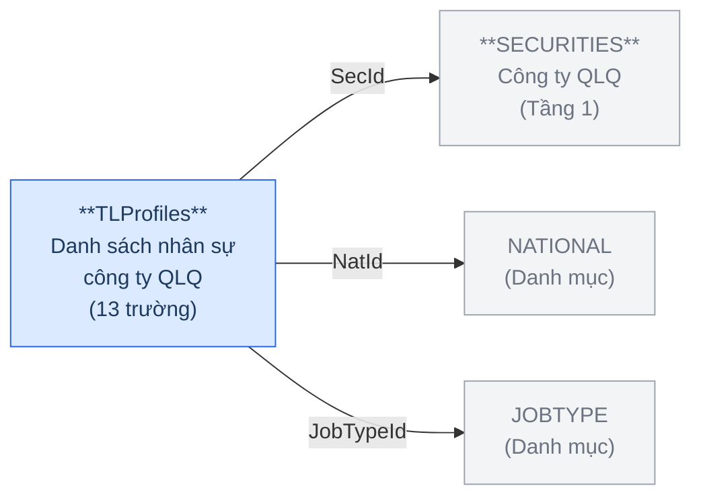

**Trường chính:** SecId (FK→SECURITIES), FullName, BirthDate, NatId (FK→NATIONAL), IdNo (CMND/CCCD/Hộ chiếu), JobTypeId (FK→JOBTYPE), IsLegal, IsCBTT.

**Đánh giá cấu trúc trường:** FullName, BirthDate, IdNo, NatId — đây là các trường đặc trưng của **cá nhân tự nhiên** (thể nhân), không phải tổ chức. Chọn [Involved Party] Individual.

### Silver — Proposed Model

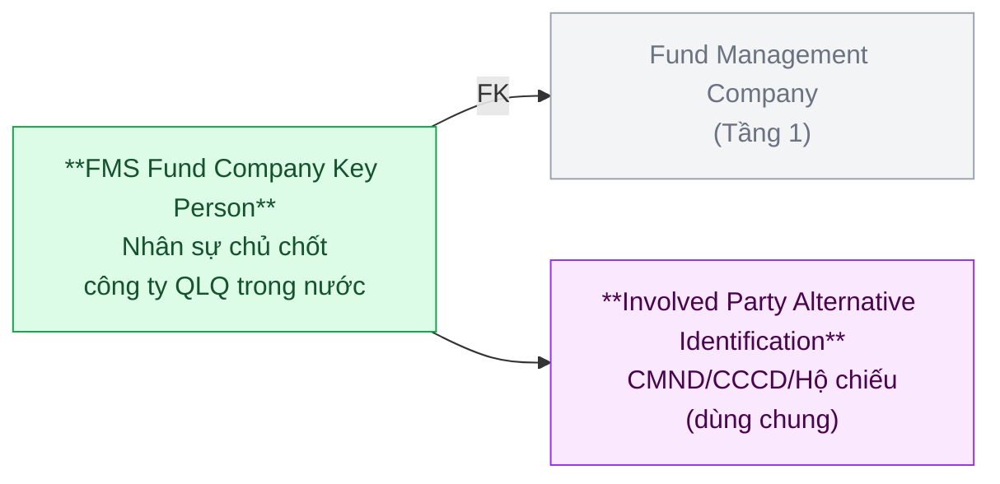

| Hạng mục | Nội dung |
|---|---|
| Silver Entity | FMS Fund Company Key Person |
| BCV Concept | [Involved Party] Individual |
| BCV Term | Individual (id 10902) — *"Identifies an Involved Party who is a natural person."* TLProfiles có FullName, BirthDate, IdNo — đặc trưng thể nhân. Khớp chính xác. |
| Model Table Type | Fundamental (SCD4A) |
| Grain | 1 dòng = 1 cá nhân nhân sự chủ chốt của công ty QLQ |
| FK đến Tầng 1 | Fund Management Company (SecId) |
| Shared Entities | IP Alt Identification (IdNo — CMND/CCCD/Hộ chiếu) |

> **Lưu ý:** JobTypeId (loại chức vụ) → Classification Value. IsLegal, IsCBTT là indicator, giữ nguyên trên Silver.

---

## 4. AGENCIESBRA — FMS Fund Distribution Agent Branch

### Source (FMS)

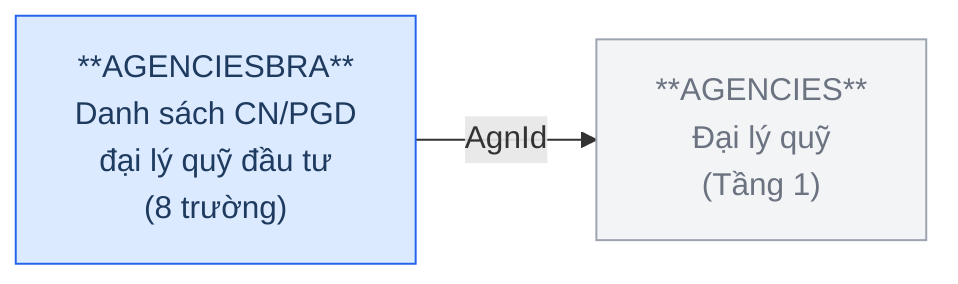

**Trường chính:** AgnId (FK→AGENCIES), Name, Address, Status.

**Đánh giá cấu trúc trường:** Có tên, địa chỉ riêng; FK đến tổ chức cha (AgnId→AGENCIES); không có vòng đời riêng (chỉ có Status). Là đơn vị trực thuộc đại lý — khớp [Involved Party] Organization Unit.

### Silver — Proposed Model

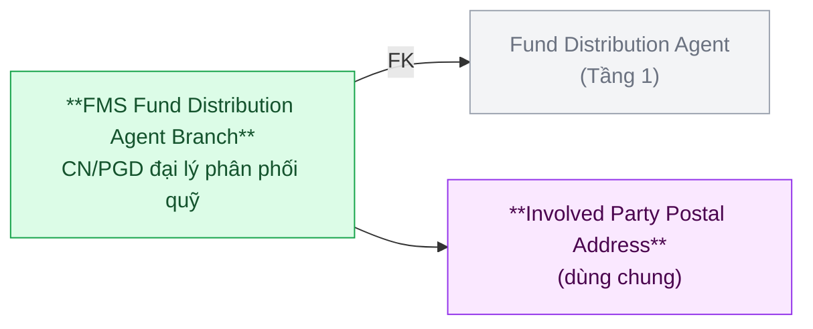

| Hạng mục | Nội dung |
|---|---|
| Silver Entity | FMS Fund Distribution Agent Branch |
| BCV Concept | [Involved Party] Organization Unit |
| BCV Term | Organization Unit (id 11192) — cùng pattern với BRANCHES. CN/PGD là đơn vị con của tổ chức đại lý. |
| Model Table Type | Fundamental (SCD4A) |
| Grain | 1 dòng = 1 CN hoặc PGD của đại lý phân phối quỹ |
| FK đến Tầng 1 | Fund Distribution Agent (AgnId) |
| Shared Entities | IP Postal Address (Address) |

---

## 5. INVESACC — FMS Discretionary Investment Account

### Source (FMS)

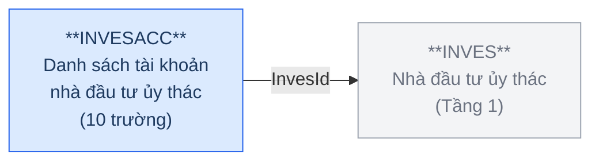

**Trường chính:** InvesId (FK→INVES), Account (số tài khoản lưu ký), AccPlace (nơi lưu ký), ContractNo (số hợp đồng ủy thác), ActScale (quy mô vốn theo HĐ), AdScale (quy mô vốn thực tế), ManagerFee (phí quản lý theo HĐ), Status, DateReport.

**Đánh giá cấu trúc trường:** ContractNo (số hợp đồng), ActScale/AdScale (quy mô vốn cam kết và thực tế), ManagerFee (phí theo điều khoản HĐ), Status (còn/hết hiệu lực) — đây là các trường của một **hợp đồng dịch vụ** giữa NĐT và công ty QLQ. Account + AccPlace là số tài khoản lưu ký được mở theo hợp đồng này. Chọn [Arrangement].

### Silver — Proposed Model

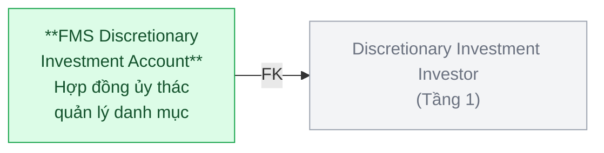

| Hạng mục | Nội dung |
|---|---|
| Silver Entity | FMS Discretionary Investment Account |
| BCV Concept | [Arrangement] Financial Portfolio Management Arrangement |
| BCV Term | Financial Portfolio Management Arrangement — *"Identifies a service of managing of financial portfolio."* ContractNo, ActScale, AdScale, ManagerFee xác nhận đây là hợp đồng dịch vụ quản lý danh mục ủy thác. Khớp chính xác. |
| Model Table Type | Fundamental (SCD4A) |
| Grain | 1 dòng = 1 hợp đồng ủy thác quản lý danh mục của 1 NĐT |
| FK đến Tầng 1 | Discretionary Investment Investor (InvesId) |

> **Lưu ý:** ManagerFee là phí theo điều khoản hợp đồng (Condition), không phải phí thực tế phát sinh (Transaction). AccPlace (nơi lưu ký) → cần xác nhận có FK đến Custodian Bank không.

---

## 6. RANK — FMS Member Rating

### Source (FMS)

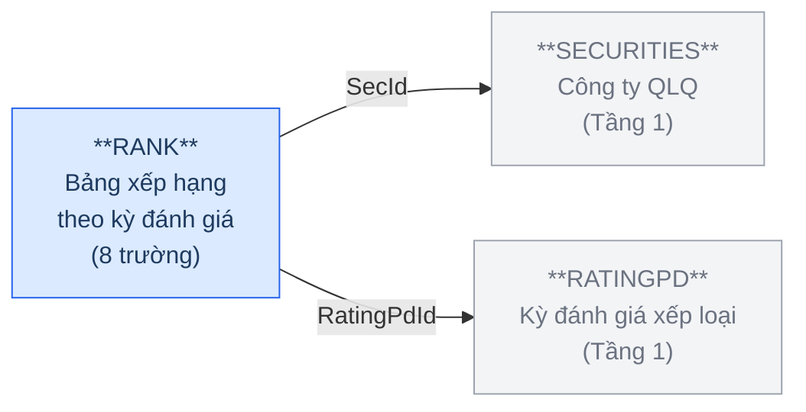

**Trường chính:** SecId (FK→SECURITIES), RatingPdId (FK→RATINGPD), TotalScore (tổng điểm), RankValue (xếp hạng), RankClass (xếp loại).

**Đánh giá cấu trúc trường:** TotalScore, RankValue, RankClass — đây là **kết quả cụ thể** gán cho 1 công ty QLQ (Involved Party) trong 1 kỳ, không phải định nghĩa thang đo. BCV Performance Rating (id 10096) mô tả **thang đánh giá** (Rating Scale) — tức tập hợp các mức được định nghĩa sẵn. Chọn [Group] **Involved Party Rating** — *"Identifies a relationship in which a Rating Scale applies to an Involved Party"* — khớp chính xác với kết quả áp thang đánh giá vào từng QLQ theo kỳ.

### Silver — Proposed Model

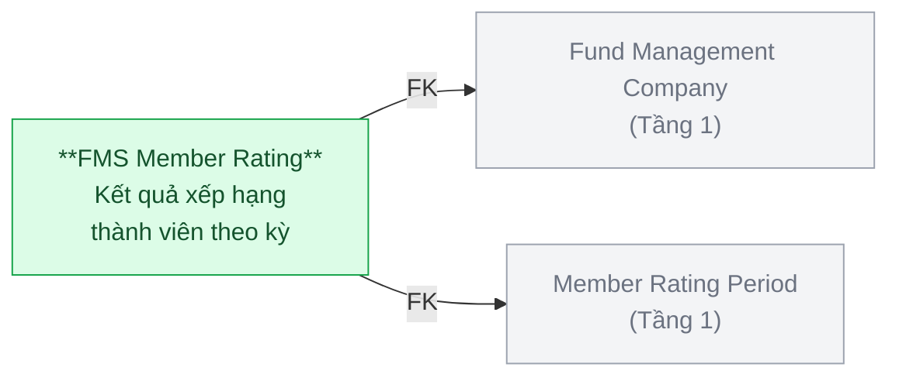

| Hạng mục | Nội dung |
|---|---|
| Silver Entity | FMS Member Rating |
| BCV Concept | [Group] Involved Party Rating |
| BCV Term | Involved Party Rating (id 10360) — *"Identifies a relationship in which a Rating Scale applies to an Involved Party."* TotalScore, RankValue, RankClass là kết quả áp thang đánh giá vào từng công ty QLQ theo kỳ. Khớp chính xác. |
| Model Table Type | Fundamental (SCD1) |
| Grain | 1 dòng = 1 kết quả xếp hạng của 1 công ty QLQ trong 1 kỳ đánh giá |
| FK đến Tầng 1 | Fund Management Company (SecId) + Member Rating Period (RatingPdId) |

---

## 7. RNKFACTOR — FMS Rating Criterion

### Source (FMS)

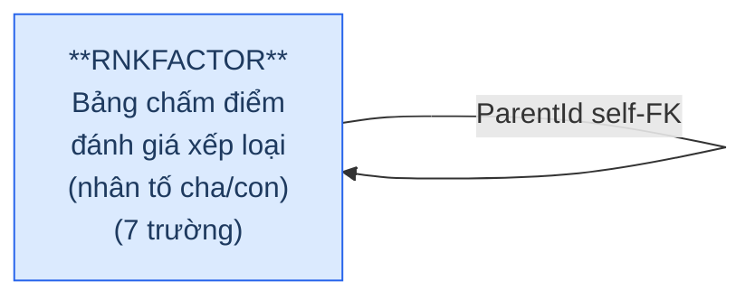

**Trường chính:** Name (tên nhân tố), ParentId (FK tự tham chiếu), MaxScore (điểm tối đa), Weight (trọng số), IsActive.

**Đánh giá cấu trúc trường:** Name, MaxScore, Weight, IsActive — đây là định nghĩa **tiêu chí và trọng số tĩnh** dùng để chấm điểm, không gắn với Arrangement cụ thể nào. BCV Arrangement Performance Criterion gắn với đánh giá thực hiện nghĩa vụ của một Arrangement — không khớp. Chọn [Condition] **Criterion** — *"Identifies a Condition that specifies a characteristic used as a basis of judgment"* — khớp chính xác với nhân tố chấm điểm.

### Silver — Proposed Model

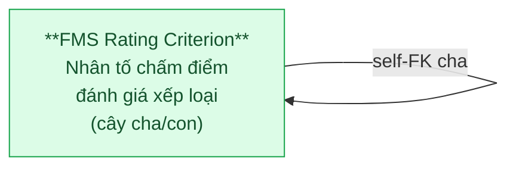

| Hạng mục | Nội dung |
|---|---|
| Silver Entity | FMS Rating Criterion |
| BCV Concept | [Condition] Criterion |
| BCV Term | Criterion (id 8945) — *"Identifies a Condition that specifies a characteristic used as a basis of judgment."* RNKFACTOR định nghĩa các nhân tố và trọng số chấm điểm — tiêu chí làm cơ sở phán đoán. Khớp chính xác. |
| Model Table Type | Fundamental (SCD1) |
| Grain | 1 dòng = 1 nhân tố chấm điểm (cha hoặc con) |
| Self-FK | ParentId → FMS Rating Criterion (nhân tố cha) |

> **Lưu ý:** RNKFACTOR không FK đến entity Tầng 1, nhưng được RNKGRFTOR (Tầng 3) reference — đặt Tầng 2 để Tầng 3 có thể tham chiếu. Surrogate key cần thiết kế riêng; ParentId trên Silver là self-FK surrogate.

---

## 8. SECBUSINES & FGBUSINESS — Bridge Table (không tạo entity Silver)

| Source Table | Mô tả | Xử lý Silver |
|---|---|---|
| SECBUSINES | Ngành nghề kinh doanh của công ty QLQ — bridge N:N giữa SECURITIES và BUSINESS | Không tạo entity riêng. Quan hệ N:N giữa Fund Management Company và Classification Value (Ngành nghề) → link table ETL hoặc attribute. |
| FGBUSINESS | Ngành nghề kinh doanh VPĐD/CN QLQ NN — bridge N:N giữa FORBRCH và BUSINESS | Tương tự. |

> **Điểm cần xác nhận:** Có yêu cầu báo cáo query ngành nghề kinh doanh không? Nếu có → thiết kế link table Silver. Nếu chỉ filter → denormalize.

---

## Tổng quan BCV Concept — Tầng 2

| BCV Concept | BCV Term | Source Table | Mô tả bảng nguồn | Silver Entity | Ghi chú |
|---|---|---|---|---|---|
| [Involved Party] Organization | Organization (id 10894) — pháp nhân độc lập, vốn điều lệ, GP thành lập, vòng đời pháp lý. | FUNDS | Danh sách quỹ đầu tư chứng khoán | FMS Investment Fund | Entity trung tâm Tầng 2 |
| [Involved Party] Organization Unit | Organization Unit (id 11192) — đơn vị con của tổ chức, địa chỉ riêng, GP riêng. | BRANCHES | Danh sách CN/VPĐD công ty QLQ trong nước | FMS Fund Management Company Branch | Self-FK BrIdowner |
| [Involved Party] Individual | Individual (id 10902) — thể nhân: FullName, BirthDate, IdNo. | TLProfiles | Danh sách nhân sự công ty QLQ | FMS Fund Company Key Person | |
| [Involved Party] Organization Unit | Organization Unit (id 11192) — đơn vị con của đại lý. | AGENCIESBRA | Danh sách CN/PGD của đại lý quỹ đầu tư | FMS Fund Distribution Agent Branch | |
| [Arrangement] Financial Portfolio Management Arrangement | ContractNo, ActScale, ManagerFee xác nhận hợp đồng dịch vụ quản lý danh mục. | INVESACC | Danh sách tài khoản nhà đầu tư ủy thác | FMS Discretionary Investment Account | AccPlace cần xác nhận |
| [Group] Involved Party Rating | Involved Party Rating (id 10360) — kết quả áp thang đánh giá vào Involved Party. TotalScore, RankValue, RankClass là instance data. | RANK | Bảng xếp hạng theo kỳ đánh giá | FMS Member Rating | Grain = 1 QLQ × 1 kỳ |
| [Condition] Criterion | Criterion (id 8945) — tiêu chí làm cơ sở phán đoán, tĩnh, không gắn Arrangement cụ thể. Name, MaxScore, Weight. | RNKFACTOR | Bảng chấm điểm đánh giá xếp loại | FMS Rating Criterion | Cây cha/con self-FK |

---

## Shared Entities (dùng chung)

| BCV Concept | Source Tables | Silver Entity | Ghi chú |
|---|---|---|---|
| [Location] Postal Address | BRANCHES, AGENCIESBRA | IP Postal Address | Tầng 1 đã thiết kế |
| [Location] Electronic Address | BRANCHES | IP Electronic Address | Telephone, Fax |
| [Involved Party] Alternative Identification | FUNDS, BRANCHES, TLProfiles | IP Alt Identification | GP thành lập quỹ, GP thành lập CN, CMND/CCCD |

---

## Danh mục & Tham chiếu (Reference Data → Classification Value)

| Source Table | Mô tả | Xử lý Silver |
|---|---|---|
| JOBTYPE | Danh sách loại chức vụ | → Classification Value |
| BUSINESS | Danh mục ngành nghề kinh doanh | → Classification Value |
| LOCATION | Danh sách tỉnh/thành phố | → Classification Value |
| PARVALUE | Danh sách mệnh giá cổ phần | → Classification Value (nếu cần trong scope) |

---

## Bảng ngoài scope Silver (Tầng 2)

| Source Table | Mô tả | Lý do |
|---|---|---|
| SECBUSINES | Ngành nghề kinh doanh của công ty QLQ | Bridge table N:N → ETL |
| FGBUSINESS | Ngành nghề kinh doanh VPĐD/CN QLQ NN | Bridge table N:N → ETL |
| BRCHBUP | Lịch sử chi tiết CN/VPĐD công ty QLQ | Audit log snapshot → Tầng ETL Pattern |
| FGBRBUP | Lịch sử chi tiết VPĐD/CN QLQ NN | Audit log snapshot → Tầng ETL Pattern |
| SECHISTORY | Lịch sử thông tin công ty QLQ | Audit log → Tầng ETL Pattern |
| SECBUP | Chi tiết lịch sử công ty QLQ (snapshot) | Audit log → Tầng ETL Pattern |
| TLPRHISTORY | Lịch sử nhân sự | Audit log → Tầng ETL Pattern |
| TLPROBUP | Chi tiết lịch sử nhân sự (snapshot) | Audit log → Tầng ETL Pattern |
| FUNDHISTORY | Lịch sử quỹ đầu tư | Audit log → Tầng ETL Pattern |

---

## Diagram Source — Tầng 2

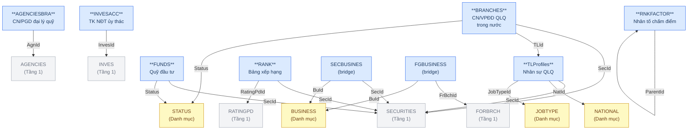

---

## Diagram Silver — Tầng 2

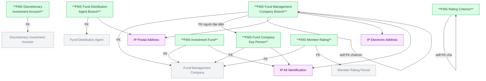

---

## Điểm cần xác nhận

| # | Câu hỏi | Ảnh hưởng |
|---|---|---|
| 1 | INVESACC.AccPlace (nơi lưu ký) — có phải FK đến BANKMONI không? | Nếu có → FK từ FMS Discretionary Investment Account đến Custodian Bank (Tầng 1) |
| 2 | SECBUSINES / FGBUSINESS — yêu cầu báo cáo có cần query ngành nghề kinh doanh không? | Nếu có → thiết kế link table Silver |
| 3 | BRANCHES.BrIdowner — self-FK giá trị là Id của bảng nguồn hay text? | Ảnh hưởng thiết kế self-FK surrogate |
| 4 | TLProfiles — nhân sự có thể thuộc nhiều công ty QLQ qua thời gian không? | Nếu có → grain cần review |
| 5 | RNKGRFTOR (chưa có column detail) — link RANK và RNKFACTOR như thế nào? | Ảnh hưởng thiết kế Tầng 3 |
