# FMS — HLD Tier 3: Phụ thuộc Tier 2

> **Nguồn:** Thiết kế CSDL FMS — Phân hệ quản lý giám sát công ty chứng khoán và quỹ đầu tư chứng khoán (20/03/2026)
>
> **Phụ thuộc Tier 1:** Fund Management Company, Foreign Fund Management Organization Unit, Custodian Bank, Fund Distribution Agent, Discretionary Investment Investor, Reporting Period, Member Rating Period.
>
> **Phụ thuộc Tier 2:** Investment Fund, Fund Management Company Organization Unit, Fund Management Company Key Person, Fund Distribution Agent Organization Unit, Discretionary Investment Account, Member Rating, Rating Criterion.
>
> **Thiết kế theo:** [FMS_HLD_Overview.md](FMS_HLD_Overview.md)

---

## 1. AGENFUNDS — Pure Junction Table (không tạo entity Silver)

AGENFUNDS = (AgnId, FndId) — chỉ có 2 trường nghiệp vụ: FK đến AGENCIES (Silver entity Fund Distribution Agent) và FK đến FUNDS (Silver entity Investment Fund). Không có attribute nghiệp vụ riêng.

→ Áp dụng quy tắc pure junction table giữa 2 Silver entity: **không tạo Silver entity**. 1 quỹ có nhiều đại lý phân phối → bên Many là Investment Fund → denormalize thành `ARRAY<STRUCT>` trên Investment Fund.

| Source Table | Entity chính | Xử lý trên Silver |
|---|---|---|
| AGENFUNDS | Investment Fund | Thêm trường `distribution_agents ARRAY<STRUCT<agent_id BIGINT, agent_code STRING>>` — danh sách đại lý phân phối quỹ (SK + mã nghiệp vụ) |

---

## 2. FNDSBMN — Pure Junction Table (không tạo entity Silver)

FNDSBMN = (FndId, BmnId) — chỉ có 2 trường nghiệp vụ: FK đến FUNDS (Silver entity Investment Fund) và FK đến BANKMONI (Silver entity Custodian Bank). Không có attribute nghiệp vụ riêng.

→ Áp dụng quy tắc pure junction table giữa 2 Silver entity: **không tạo Silver entity**. 1 quỹ có nhiều ngân hàng lưu ký giám sát → bên Many là Investment Fund → denormalize thành `ARRAY<STRUCT>` trên Investment Fund.

| Source Table | Entity chính | Xử lý trên Silver |
|---|---|---|
| FNDSBMN | Investment Fund | Thêm trường `custodian_banks ARRAY<STRUCT<bank_id BIGINT, bank_code STRING>>` — danh sách ngân hàng lưu ký giám sát (SK + mã nghiệp vụ) |

---

## 3. MBFUND — Investment Fund Investor Membership

### Source (FMS)

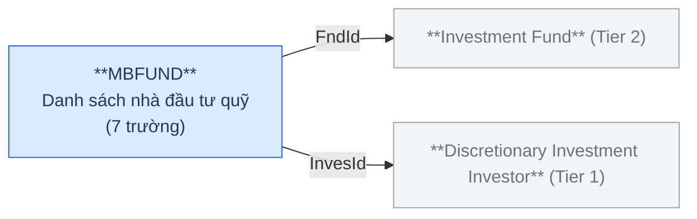

**Trường chính:** FndId (FK→FUNDS), InvesId (FK→INVES), Capital (số lượng vốn góp), Ratio (tỷ lệ sở hữu %).

### Silver — Proposed Model

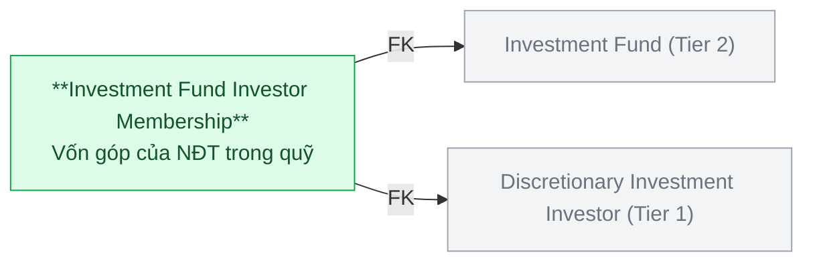

| Hạng mục | Nội dung |
|---|---|
| Silver Entity | Investment Fund Investor Membership |
| BCV Concept | [Involved Party] Involved Party Group Membership |
| Model Table Type | Fundamental (SCD1) |
| Grain | 1 dòng = 1 NĐT tham gia góp vốn vào 1 quỹ đầu tư |
| FK đến Tier 1 | Discretionary Investment Investor (InvesId) |
| FK đến Tier 2 | Investment Fund (FndId) |

> **Lưu ý:** Capital (số lượng vốn góp) và Ratio (tỷ lệ sở hữu %) là attribute nghiệp vụ của membership — giữ trên entity này. MBCHANGE (lịch sử thay đổi vốn góp) sẽ FK đến entity này ở Tier 4.

---

## 4. REPRESENT — Investment Fund Representative Board Member

### Source (FMS)

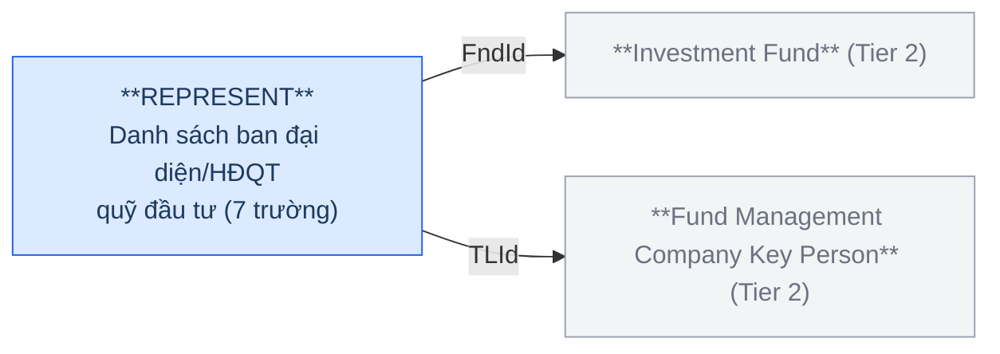

**Trường chính:** FndId (FK→FUNDS), TLId (FK→TLProfiles), IsChair (là trưởng ban đại diện), Status.

### Silver — Proposed Model

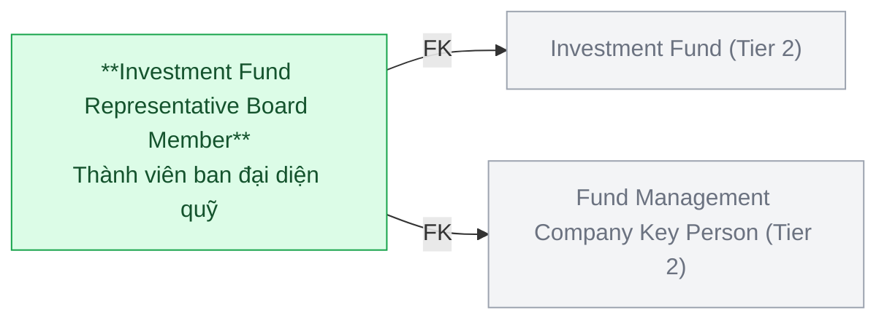

| Hạng mục | Nội dung |
|---|---|
| Silver Entity | Investment Fund Representative Board Member |
| BCV Concept | [Involved Party] Involved Party Role |
| Model Table Type | Fundamental (SCD1) |
| Grain | 1 dòng = 1 nhân sự giữ vai trò thành viên ban đại diện tại 1 quỹ |
| FK đến Tier 2 | Investment Fund (FndId) + Fund Management Company Key Person (TLId) |

> **Lưu ý:** IsChair → Indicator (trưởng ban hay thành viên thường). Status → Classification Value.

---

## 5. STFFGBRCH — Foreign Fund Management Organization Unit Staff

### Source (FMS)

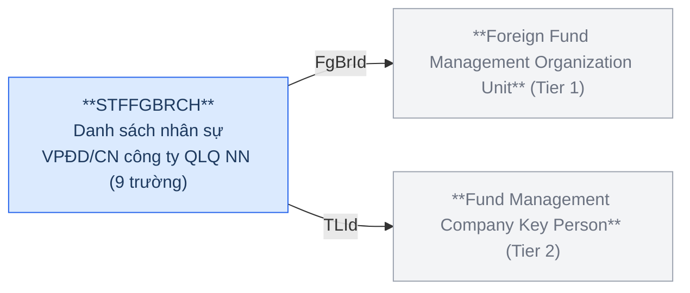

**Trường chính:** FgBrId (FK→FORBRCH), TLId (FK→TLProfiles), FnType (O=VPĐD NN; B=CN NN), Isr (người đại diện pháp luật), Isp (đại diện CBTT).

### Silver — Proposed Model

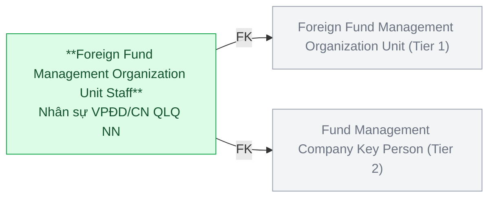

| Hạng mục | Nội dung |
|---|---|
| Silver Entity | Foreign Fund Management Organization Unit Staff |
| BCV Concept | [Involved Party] Involved Party Role |
| Model Table Type | Fundamental (SCD1) |
| Grain | 1 dòng = 1 nhân sự giữ vai trò tại 1 VPĐD/CN công ty QLQ NN |
| FK đến Tier 1 | Foreign Fund Management Organization Unit (FgBrId) |
| FK đến Tier 2 | Fund Management Company Key Person (TLId) |

> **Lưu ý:** FnType (O=VPĐD NN; B=CN NN) → Classification Value. Isr, Isp → Indicator.

---

## 6. RPTMEMBER — Member Periodic Report

### Source (FMS)

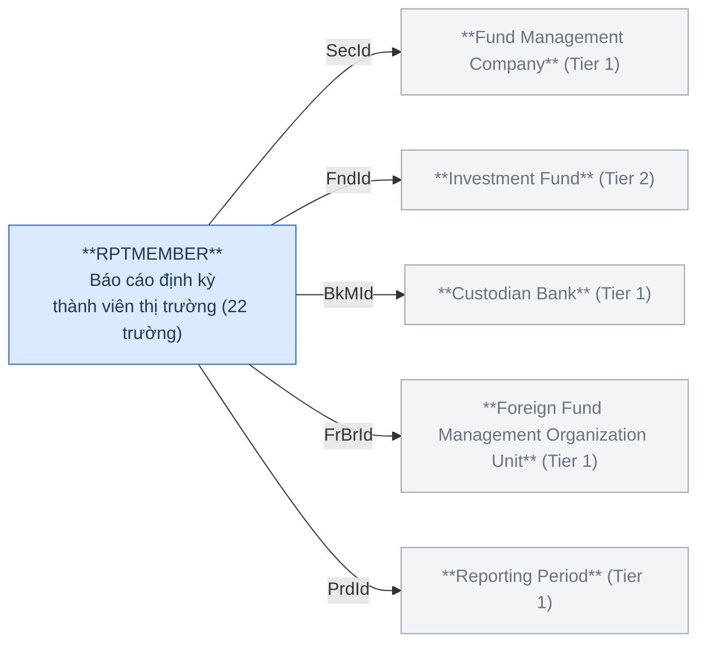

**Trường chính:** SecId, FndId, BkMId, FrBrId, PrdId, RptName, ContentSummary, ReportType (1=Định kỳ; 2=Bất thường), Type (2=QLQ; 3=NH LKGS; 4=CN QLQ NN; 5=VPĐD QLQ NN; 7=QĐT), PeriodType, YearValue, DayReport, DeadlineSend, DateSubmitted, Status (1=Chưa gửi; 2=Đã gửi; 3=Gửi muộn; 4=Bị hủy).

### Silver — Proposed Model

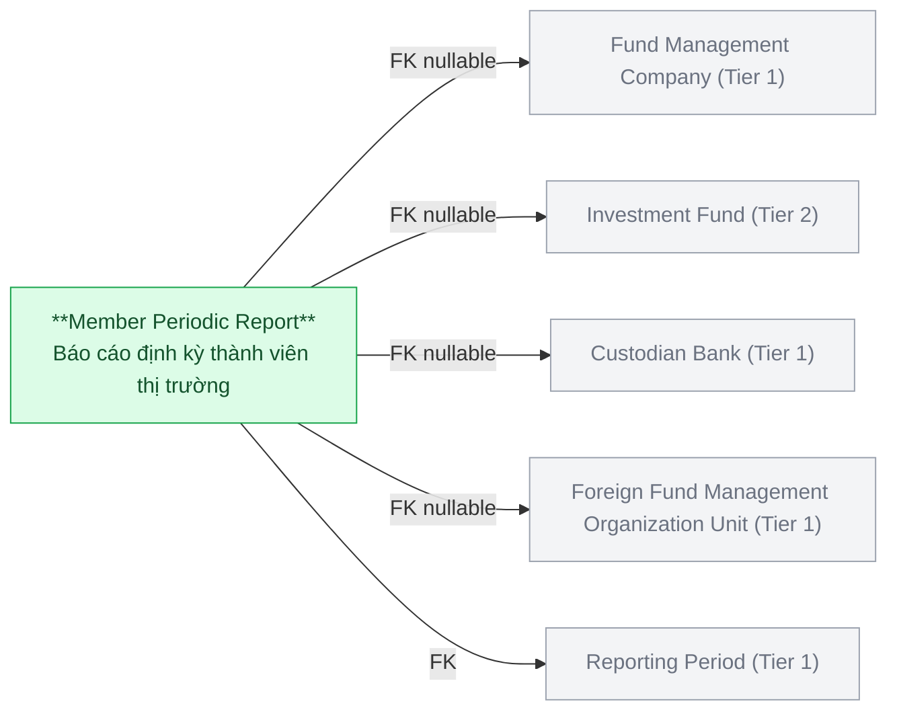

| Hạng mục | Nội dung |
|---|---|
| Silver Entity | Member Periodic Report |
| BCV Concept | [Event] Communication |
| Model Table Type | Fundamental (SCD1) |
| Grain | 1 dòng = 1 báo cáo định kỳ hoặc bất thường của 1 thành viên thị trường trong 1 kỳ báo cáo |
| FK đến Tier 1 | Fund Management Company (SecId, nullable) + Custodian Bank (BkMId, nullable) + Foreign Fund Management Organization Unit (FrBrId, nullable) + Reporting Period (PrdId) |
| FK đến Tier 2 | Investment Fund (FndId, nullable) |

> **Lưu ý:** Mỗi bản ghi báo cáo chỉ thuộc 1 loại thành viên — các FK SecId/FndId/BkMId/FrBrId là nullable (chỉ 1 trường có giá trị tùy Type). ReportType, Type, PeriodType, Status → Classification Value. RPTMBHS (lịch sử trạng thái) sẽ FK đến entity này ở Tier 4.

---

## 7. TRSFERINDER — Fund Management Company Share Transfer

### Source (FMS)

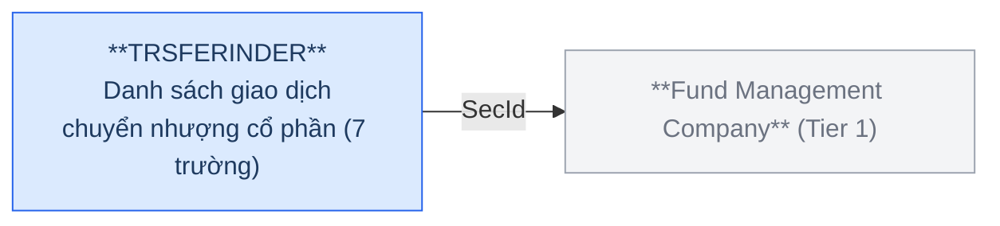

**Trường chính:** SecId (FK→SECURITIES), TransDate, Quantity (số lượng cổ phần), Price (giá giao dịch).

### Silver — Proposed Model

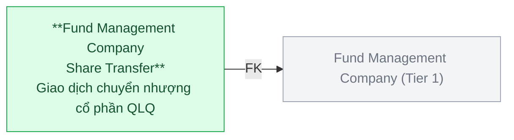

| Hạng mục | Nội dung |
|---|---|
| Silver Entity | Fund Management Company Share Transfer |
| BCV Concept | [Event] Transaction |
| Model Table Type | Fundamental (SCD1) |
| Grain | 1 dòng = 1 giao dịch chuyển nhượng cổ phần của 1 công ty QLQ |
| FK đến Tier 1 | Fund Management Company (SecId) |

> **Lưu ý:** Quantity (số lượng) và Price (giá) là attribute giao dịch. Không có FK đến bên nhận/bên chuyển nhượng cụ thể trong scope hiện tại — cần xác nhận thêm.

---

## 8. VIOLT — Fund Management Conduct Violation

### Source (FMS)

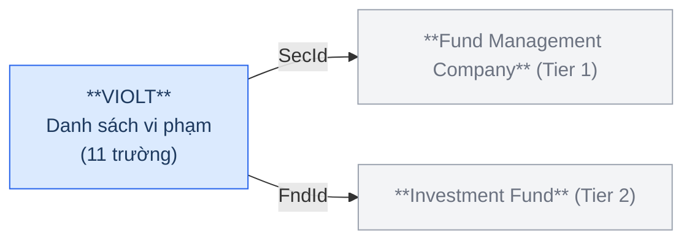

**Trường chính:** SecId (FK→SECURITIES, nullable), FndId (FK→FUNDS, nullable), ViolType (loại vi phạm), ViolContent (nội dung vi phạm), ViolDate (ngày vi phạm), ViolStatus (trạng thái xử lý), Note (ghi chú).

### Silver — Proposed Model

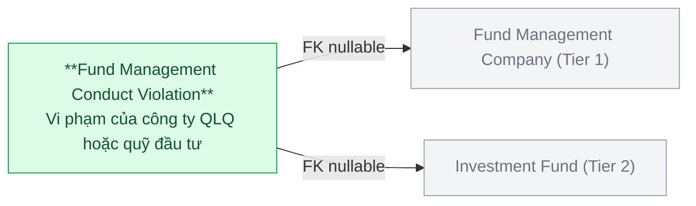

| Hạng mục | Nội dung |
|---|---|
| Silver Entity | Fund Management Conduct Violation |
| BCV Concept | [Business Activity] Conduct Violation |
| Model Table Type | Fact Append |
| Grain | 1 dòng = 1 vi phạm của 1 công ty QLQ hoặc 1 quỹ đầu tư |
| FK đến Tier 1 | Fund Management Company (SecId, nullable) |
| FK đến Tier 2 | Investment Fund (FndId, nullable) |

> **Lưu ý:** SecId và FndId là nullable — mỗi bản ghi thuộc về công ty QLQ **hoặc** quỹ đầu tư, không đồng thời cả hai. ViolType → Classification Value (Scheme: `FMS_VIOLATION_TYPE`). ViolStatus → Classification Value (Scheme: `FMS_VIOLATION_STATUS`).

---

## 6a. Tổng quan BCV Concept

| BCV Core Object | BCV Concept | Category | Source Table | Mô tả bảng nguồn | Silver Entity | BCV Term |
|---|---|---|---|---|---|---|
| Business Activity | [Business Activity] Conduct Violation | Business Activity | VIOLT | Danh sách vi phạm của công ty QLQ/quỹ | Fund Management Conduct Violation | Conduct Violation — cùng BCV Concept với NHNCK.Violations. Cấu trúc: ViolType, ViolContent, ViolDate, ViolStatus — ghi nhận hành vi vi phạm và trạng thái xử lý. Khớp chính xác. |
| Involved Party | [Involved Party] Involved Party Group Membership | Involved Party | MBFUND | Danh sách nhà đầu tư quỹ | Investment Fund Investor Membership | Candidate: Involved Party Group Membership (id 10364) — *"Identifies a relationship in which an Involved Party is a member of a Group."* Cấu trúc trường: FndId (quỹ = group), InvesId (NĐT = member), Capital (vốn góp), Ratio (tỷ lệ sở hữu). NĐT tham gia góp vốn vào quỹ = quan hệ membership có attribute. Khớp chính xác. |
| Involved Party | [Involved Party] Involved Party Role | Involved Party | REPRESENT | Danh sách ban đại diện/HĐQT quỹ đầu tư | Investment Fund Representative Board Member | Candidate: Involved Party Role (id 10362) — *"Identifies a relationship in which an Involved Party performs a defined function."* Cấu trúc trường: FndId (quỹ), TLId (nhân sự), IsChair (vai trò trưởng/thành viên), Status (còn/hết hiệu lực) — cá nhân đảm nhận vai trò trong ban đại diện. Khớp chính xác. |
| Involved Party | [Involved Party] Involved Party Role | Involved Party | STFFGBRCH | Danh sách nhân sự VPĐD/CN công ty QLQ NN | Foreign Fund Management Organization Unit Staff | Candidate: Involved Party Role (id 10362) — cùng pattern với REPRESENT. Cấu trúc trường: FgBrId (VPĐD/CN), TLId (nhân sự), FnType (loại đơn vị), Isr (người đại diện), Isp (đại diện CBTT) — cá nhân đảm nhận vai trò tại VPĐD/CN QLQ NN. Khớp chính xác. |
| Communication | [Event] Communication | Event | RPTMEMBER | Báo cáo định kỳ của thành viên thị trường | Member Periodic Report | Candidate: Communication (id 8956) — *"Identifies an Event that is a communication between Involved Parties."* Cấu trúc trường: DeadlineSend (thời hạn), DateSubmitted (ngày gửi thực tế), Status (chưa/đã gửi/gửi muộn), ContentSummary — báo cáo là hành động giao tiếp giữa thành viên và cơ quan quản lý. Khớp chính xác. |
| Transaction | [Event] Transaction | Event | TRSFERINDER | Danh sách giao dịch chuyển nhượng cổ phần | Fund Management Company Share Transfer | Candidate: Transaction (id 8954) — *"Identifies an Event that is a transaction between Involved Parties."* Cấu trúc trường: TransDate, Quantity (số lượng cổ phần), Price (giá giao dịch) — giao dịch tài chính cụ thể có giá trị và số lượng. Khớp chính xác. |

---

## 6b. Diagram Source (Mermaid)

```mermaid
graph TD
    classDef src fill:#dbeafe,stroke:#2563eb,color:#1e3a5f
    classDef ref fill:#f3f4f6,stroke:#9ca3af,color:#6b7280
    classDef dim fill:#fef9c3,stroke:#ca8a04,color:#713f12

    SECURITIES["Fund Management Company (T1)"]:::ref
    FORBRCH["Foreign Fund Management OU (T1)"]:::ref
    BANKMONI["Custodian Bank (T1)"]:::ref
    AGENCIES["Fund Distribution Agent (T1)"]:::ref
    INVES["Discretionary Investment Investor (T1)"]:::ref
    RPTPERIOD["Reporting Period (T1)"]:::ref

    FUNDS["Investment Fund (T2)"]:::ref
    TLProfiles["Fund Management Company Key Person (T2)"]:::ref

    AGENFUNDS["AGENFUNDS (bridge)"]:::src
    FNDSBMN["FNDSBMN (bridge)"]:::src
    MBFUND["**MBFUND**\nNĐT quỹ"]:::src
    REPRESENT["**REPRESENT**\nBan đại diện quỹ"]:::src
    STFFGBRCH["**STFFGBRCH**\nNhân sự VPĐD/CN QLQ NN"]:::src
    RPTMEMBER["**RPTMEMBER**\nBáo cáo định kỳ"]:::src
    TRSFERINDER["**TRSFERINDER**\nChuyển nhượng cổ phần"]:::src
    VIOLT["**VIOLT**\nVi phạm QLQ/quỹ"]:::src

    AGENFUNDS -->|AgnId| AGENCIES
    AGENFUNDS -->|FndId| FUNDS
    FNDSBMN -->|FndId| FUNDS
    FNDSBMN -->|BmnId| BANKMONI
    MBFUND -->|FndId| FUNDS
    MBFUND -->|InvesId| INVES
    REPRESENT -->|FndId| FUNDS
    REPRESENT -->|TLId| TLProfiles
    STFFGBRCH -->|FgBrId| FORBRCH
    STFFGBRCH -->|TLId| TLProfiles
    RPTMEMBER -->|SecId| SECURITIES
    RPTMEMBER -->|FndId| FUNDS
    RPTMEMBER -->|BkMId| BANKMONI
    RPTMEMBER -->|FrBrId| FORBRCH
    RPTMEMBER -->|PrdId| RPTPERIOD
    TRSFERINDER -->|SecId| SECURITIES
    VIOLT -->|SecId nullable| SECURITIES
    VIOLT -->|FndId nullable| FUNDS
```

---

## 6c. Diagram Silver (Mermaid)

```mermaid
graph TD
    classDef silver fill:#dcfce7,stroke:#16a34a,color:#14532d
    classDef refnode fill:#f3f4f6,stroke:#9ca3af,color:#6b7280

    FMC["Fund Management Company (T1)"]:::refnode
    FGOU["Foreign Fund Management OU (T1)"]:::refnode
    BNK["Custodian Bank (T1)"]:::refnode
    DII["Discretionary Investment Investor (T1)"]:::refnode
    RPD["Reporting Period (T1)"]:::refnode

    FUND["Investment Fund (T2)"]:::refnode
    KP["Fund Management Company Key Person (T2)"]:::refnode

    MBF["**Investment Fund Investor Membership**"]:::silver
    REP["**Investment Fund Representative Board Member**"]:::silver
    STF["**Foreign Fund Management OU Staff**"]:::silver
    RPT["**Member Periodic Report**"]:::silver
    TRF["**Fund Management Company Share Transfer**"]:::silver
    VIO["**Fund Management Conduct Violation**"]:::silver

    MBF -->|FK| FUND
    MBF -->|FK| DII
    REP -->|FK| FUND
    REP -->|FK| KP
    STF -->|FK| FGOU
    STF -->|FK| KP
    RPT -->|FK nullable| FMC
    RPT -->|FK nullable| FUND
    RPT -->|FK nullable| BNK
    RPT -->|FK nullable| FGOU
    RPT -->|FK| RPD
    TRF -->|FK| FMC
    VIO -->|FK nullable| FMC
    VIO -->|FK nullable| FUND
```

---

## 6d. Junction Tables — Denormalize vào entity chính

| Source Table | Junction | Xử lý trên Silver |
|---|---|---|
| AGENFUNDS | Fund Distribution Agent × Investment Fund | → `distribution_agents ARRAY<STRUCT<agent_id BIGINT, agent_code STRING>>` trên Investment Fund |
| FNDSBMN | Custodian Bank × Investment Fund | → `custodian_banks ARRAY<STRUCT<bank_id BIGINT, bank_code STRING>>` trên Investment Fund |

---

## 6e. Bảng ngoài scope Silver

| Source Table | Mô tả bảng nguồn | Lý do ngoài scope |
|---|---|---|
| SECHISTORY | Lịch sử thông tin công ty QLQ | Audit Log nguồn — có PrevValue/ValueChange/Action/DateChange. Cơ chế đặc thù source system. |
| TLPRHISTORY | Lịch sử nhân sự | Audit Log nguồn — cùng pattern với SECHISTORY. |
| FUNDHISTORY | Lịch sử quỹ đầu tư | Audit Log nguồn — cùng pattern với SECHISTORY. |
| FGBRBUP | Lịch sử thay đổi VPĐD/CN QLQ NN | Audit Log nguồn — cùng pattern với SECHISTORY. |

---

## 6e. Bảng chờ thiết kế

| Source Table | Mô tả bảng nguồn | Lý do chưa thiết kế |
|---|---|---|
| FNDBUP | Bản ghi chi tiết lịch sử quỹ đầu tư | Chưa có thông tin cột |
| RNKGRFTOR | Bảng trung gian Ranks và RNKFACTOR | Chưa có thông tin cột |
| RNKFACTHISTORY | Lưu kết quả các lần lưu bảng tổng hợp đánh giá | Chưa có thông tin cột |

---

## 6f. Điểm cần xác nhận

| # | Câu hỏi | Ảnh hưởng |
|---|---|---|
| 1 | TRSFERINDER — không có FK bên nhận/bên chuyển nhượng cụ thể. Giao dịch này có liên quan đến INVES (NĐT) không? | Nếu có → thêm FK đến Discretionary Investment Investor |
| 2 | RPTMEMBER — mỗi bản ghi chỉ thuộc 1 loại thành viên (SecId hoặc FndId hoặc BkMId hoặc FrBrId). Xác nhận logic nullable này. | Ảnh hưởng thiết kế FK nullable và kiểm tra data quality |
| ~~3~~ | ~~STFFGBRCH — TLId trỏ đến TLProfiles. VPĐD/CN QLQ NN có dùng chung bảng nhân sự không?~~ | ✅ Xác nhận: STFFGBRCH.TLId → TLProfiles.Id — dùng chung bảng nhân sự. Không cần entity riêng. |
