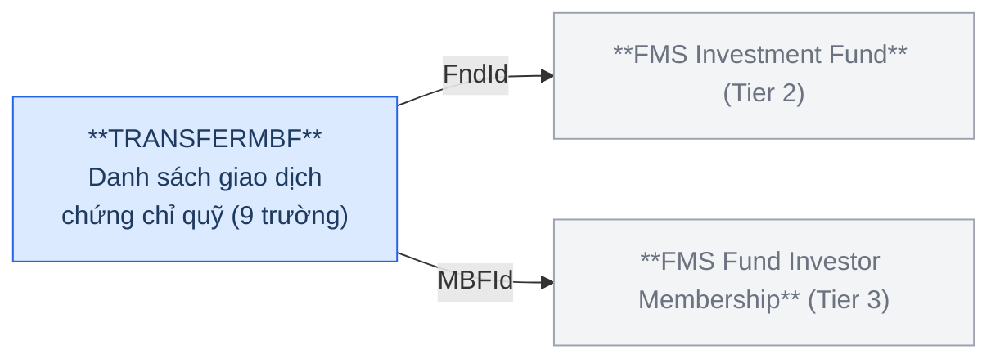
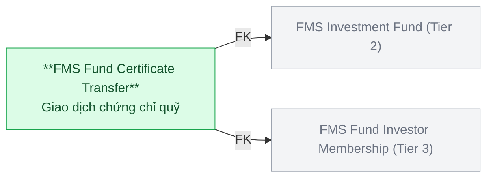
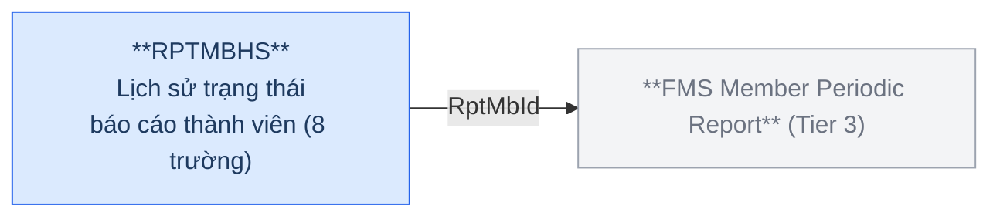
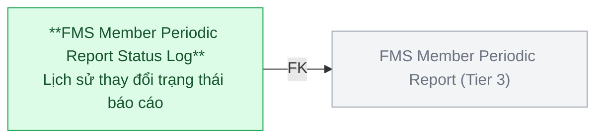
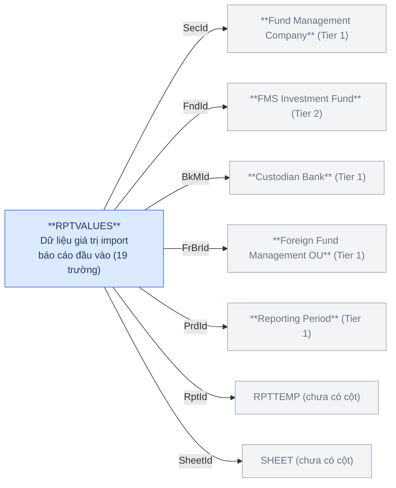
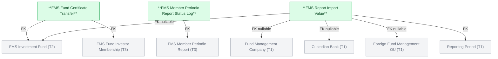

# FMS — HLD Tier 4: Phụ thuộc Tier 3

> **Nguồn:** Thiết kế CSDL FMS — Phân hệ quản lý giám sát công ty chứng khoán và quỹ đầu tư chứng khoán (20/03/2026)
>
> **Phụ thuộc Tier 1:** Fund Management Company, Custodian Bank, Foreign Fund Management Organization Unit, Reporting Period.
>
> **Phụ thuộc Tier 2:** FMS Investment Fund.
>
> **Phụ thuộc Tier 3:** FMS Fund Investor Membership, FMS Member Periodic Report.
>
> **Thiết kế theo:** [FMS_HLD_Overview.md](FMS_HLD_Overview.md)

---

## 1. TRANSFERMBF — FMS Fund Certificate Transfer

### Source (FMS)

**Trường chính:** FndId (FK→FUNDS), MBFId (FK→MBFUND), TransDate, Quantity (số lượng CCQ), Price (giá giao dịch), TransType (loại giao dịch).

### Silver — Proposed Model

| Hạng mục | Nội dung |
|---|---|
| Silver Entity | FMS Fund Certificate Transfer |
| BCV Concept | [Event] Transaction |
| Model Table Type | Fundamental (SCD1) |
| Grain | 1 dòng = 1 giao dịch chứng chỉ quỹ của 1 NĐT thành viên tại 1 quỹ |
| FK đến Tier 2 | FMS Investment Fund (FndId) |
| FK đến Tier 3 | FMS Fund Investor Membership (MBFId) |

> **Lưu ý:** TransType → Classification Value. Quantity và Price là attribute giao dịch. FK đến cả FUNDS và MBFUND — MBFUND đã chứa FndId nên FK đến FUNDS ở đây dư thừa nhưng giữ để tra cứu trực tiếp theo quỹ.

---

## 2. RPTMBHS — FMS Member Periodic Report Status Log

### Source (FMS)

**Trường chính:** RptMbId (FK→RPTMEMBER), Status (trạng thái báo cáo), ChgById (FK→USERS — người thực hiện), ContentSummary, Note, RptName, FileData.

### Silver — Proposed Model

| Hạng mục | Nội dung |
|---|---|
| Silver Entity | FMS Member Periodic Report Status Log |
| BCV Concept | [Event] Business Activity |
| Model Table Type | Fundamental (SCD1) |
| Grain | 1 dòng = 1 lần thay đổi trạng thái của 1 báo cáo định kỳ |
| FK đến Tier 3 | FMS Member Periodic Report (RptMbId) |

> **Lưu ý:** RPTMBHS không lưu Old/New value — lưu từng trạng thái mới kèm nội dung (Status, ContentSummary, Note, FileData). Đây là log sự kiện nghiệp vụ, không phải Audit Log nguồn → trong scope Silver. ChgById (FK→USERS) là trường hệ thống — không tạo FK đến Silver entity USERS, lưu dạng text để audit. Status → Classification Value.

---

## 3. RPTVALUES — FMS Report Import Value

### Source (FMS)

**Trường chính:** MebId, RptId (FK→RPTTEMP), SheetId (FK→SHEET), TgtId (ô chỉ tiêu), PrdId (FK→RPTPERIOD), SecId, FndId, BkMId, FrBrId, Values (giá trị import), AccValues, FormatDataType, IsDynamic, PeriodType, Type.

### Silver — Proposed Model

| Hạng mục | Nội dung |
|---|---|
| Silver Entity | FMS Report Import Value |
| BCV Concept | [Resource Item] Documentation |
| Model Table Type | Fundamental (SCD1) |
| Grain | 1 dòng = 1 giá trị tại 1 ô chỉ tiêu trong 1 sheet báo cáo của 1 thành viên trong 1 kỳ |
| FK đến Tier 1 | Reporting Period (PrdId) + Fund Management Company (SecId, nullable) + Custodian Bank (BkMId, nullable) + Foreign Fund Management Organization Unit (FrBrId, nullable) |
| FK đến Tier 2 | FMS Investment Fund (FndId, nullable) |
| FK chờ | RPTTEMP (RptId), SHEET (SheetId) — chưa có cột, chưa thể thiết kế Silver entity tương ứng |

> **Lưu ý:** Grain rất nhỏ (cell-level). FormatDataType (Numeric/String) → Classification Value. IsDynamic → Indicator. RPTTEMP và SHEET chưa có cột → FK tạm thời giữ dạng source key, chờ thiết kế.

---

## 6a. Tổng quan BCV Concept

| BCV Core Object | BCV Concept | Category | Source Table | Mô tả bảng nguồn | Silver Entity | BCV Term |
|---|---|---|---|---|---|---|
| Transaction | [Event] Transaction | Event | TRANSFERMBF | Danh sách giao dịch chứng chỉ quỹ | FMS Fund Certificate Transfer | Candidate: Transaction (id 8954) — *"Identifies an Event that is a transaction between Involved Parties."* Cấu trúc trường: TransDate, Quantity (số lượng CCQ), Price (giá), TransType — giao dịch tài chính cụ thể có số lượng và giá trị. Khớp chính xác. |
| Business Activity | [Event] Business Activity | Event | RPTMBHS | Lịch sử báo cáo thành viên | FMS Member Periodic Report Status Log | Candidate: Business Activity (id 8958). Cấu trúc trường: Status, ContentSummary, Note, FileData — mỗi dòng là 1 sự kiện nghiệp vụ (gửi, duyệt, hủy báo cáo). Không lưu Old/New value → không phải Audit Log nguồn, trong scope Silver. |
| Documentation | [Resource Item] Documentation | Resource Item | RPTVALUES | Báo cáo giá trị — lưu dữ liệu import | FMS Report Import Value | Candidate: Documentation (id 11050) — *"Identifies a Resource Item that is a document."* Cấu trúc trường: Values (giá trị từng ô), SheetId, TgtId (ô chỉ tiêu) — nội dung tài liệu báo cáo được import vào hệ thống. Khớp chính xác. |

---

## 6b. Diagram Source (Mermaid)

```mermaid
graph TD
    classDef src fill:#dbeafe,stroke:#2563eb,color:#1e3a5f
    classDef ref fill:#f3f4f6,stroke:#9ca3af,color:#6b7280

    SECURITIES["Fund Management Company (T1)"]:::ref
    FORBRCH["Foreign Fund Management OU (T1)"]:::ref
    BANKMONI["Custodian Bank (T1)"]:::ref
    RPTPERIOD["Reporting Period (T1)"]:::ref
    FUNDS["FMS Investment Fund (T2)"]:::ref
    MBFUND["FMS Fund Investor Membership (T3)"]:::ref
    RPTMEMBER["FMS Member Periodic Report (T3)"]:::ref
    RPTTEMP["RPTTEMP (chưa có cột)"]:::ref
    SHEET["SHEET (chưa có cột)"]:::ref

    TRANSFERMBF["**TRANSFERMBF**\nGiao dịch CCQ"]:::src
    RPTMBHS["**RPTMBHS**\nLịch sử trạng thái BC"]:::src
    RPTVALUES["**RPTVALUES**\nDữ liệu import BC"]:::src

    TRANSFERMBF -->|FndId| FUNDS
    TRANSFERMBF -->|MBFId| MBFUND
    RPTMBHS -->|RptMbId| RPTMEMBER
    RPTVALUES -->|SecId| SECURITIES
    RPTVALUES -->|FndId| FUNDS
    RPTVALUES -->|BkMId| BANKMONI
    RPTVALUES -->|FrBrId| FORBRCH
    RPTVALUES -->|PrdId| RPTPERIOD
    RPTVALUES -->|RptId| RPTTEMP
    RPTVALUES -->|SheetId| SHEET
```

---

## 6c. Diagram Silver (Mermaid)

---

## 6d. Bảng ngoài scope Silver

| Source Table | Mô tả bảng nguồn | Lý do ngoài scope |
|---|---|---|
| MBCHANGE | Lịch sử thay đổi vốn góp nhà đầu tư quỹ | Audit Log nguồn — có OldCapital/NewCapital/ChangeDate. Cơ chế đặc thù source system. |
| SECBUP | Chi tiết lịch sử công ty QLQ (bản ghi trước/sau) | Snapshot nguồn — có IsBefore + SecData (blob). Cơ chế đặc thù source system. |
| TLPROBUP | Chi tiết lịch sử nhân sự (bản ghi trước/sau) | Snapshot nguồn — có IsBefore + TLData (blob). Cơ chế đặc thù source system. |
| BRCHBUP | Lịch sử chi tiết CN/VPĐD công ty QLQ trong nước | Snapshot nguồn — FK đến SECHISTORY (Audit Log). Cơ chế đặc thù source system. |

---

## 6e. Bảng chờ thiết kế

| Source Table | Mô tả bảng nguồn | Lý do chưa thiết kế |
|---|---|---|
| RPTTEMP | Danh sách biểu mẫu báo cáo đầu vào | Chưa có thông tin cột — RPTVALUES FK đến bảng này |
| SHEET | Danh sách sheet báo cáo đầu vào | Chưa có thông tin cột — RPTVALUES FK đến bảng này |

---

## 6f. Điểm cần xác nhận

| # | Câu hỏi | Ảnh hưởng |
|---|---|---|
| 1 | TRANSFERMBF — FK đến cả FUNDS và MBFUND, MBFUND đã chứa FndId. FK đến FUNDS có cần thiết trên Silver không? | Nếu không → bỏ FK redundant đến FMS Investment Fund |
| 2 | RPTVALUES.RptId và SheetId — sau khi có cột RPTTEMP và SHEET, xác nhận đây là FK đến Silver entity hay Classification Value | Ảnh hưởng thiết kế FK của FMS Report Import Value |
