# FMS — Relationship Diagram: Source vs Silver Proposed Model (v2)

> **Phiên bản:** 2.0 — Cập nhật theo CSDL nguồn mới (20/03/2026)
>
> **Thay đổi so với v1:**
> - Loại bỏ 7 bảng nguồn cũ (INSIDER, INSDERRELA, INSDERRPRST, INSIDCHANGE, BANKEMPLOY, FGBRHISTORY, FUNDTLPRO)
> - Đổi tên 3 bảng (BRANCHS→BRANCHES, FUNDBUP→FNDBUP, FUNDHISTO→FUNDHISTORY)
> - Bổ sung 52 bảng mới (admin, danh mục, reporting framework, rating, vi phạm, ...)
> - SECURITIES không còn ForeignType → không cần phân luồng ETL nữa
> - Nguồn mới áp dụng pattern JSON Snapshot cho các bảng BUP (SECBUP, TLPROBUP)
> - Nguồn mới chuẩn hóa pattern Audit Log (Action, PrevValue, ValueChange) cho SECHISTORY, TLPRHISTORY, FGBRBUP
>
> **Render:** Mở file này trong VS Code với extension **Markdown Preview Mermaid Support**, hoặc dán từng block vào [mermaid.live](https://mermaid.live).
>
> **Ký hiệu:**
> - `──►` (mũi tên liền): quan hệ FK (Many → One)
> - `-.->` (mũi tên đứt): quan hệ ETL pattern (SCD / Audit Log of)
> - 🔵 Xanh dương: bảng nguồn FMS (Master)
> - 🟢 Xanh lá: entity Silver / Proposed Model
> - ⬜ Xám: ETL pattern — Snapshot hoặc Audit Log
> - 🟡 Vàng: bảng ngoài scope hoặc pending column detail
> - 🟣 Tím: Shared entity (dùng chung cho mọi Involved Party)

---

## Nhóm 1 — Fund Management Company & bên liên quan

> **Thay đổi so với v1:** Loại bỏ toàn bộ nhóm cổ đông (INSIDER, INSDERRELA, INSDERRPRST, INSIDCHANGE → 4 Silver entities bị loại). Thêm SECBUSINES (ngành nghề KD). STAKE giữ lại (pending column detail). SECURITIES không còn ForeignType — chỉ chứa công ty QLQ trong nước.

### Source (FMS)

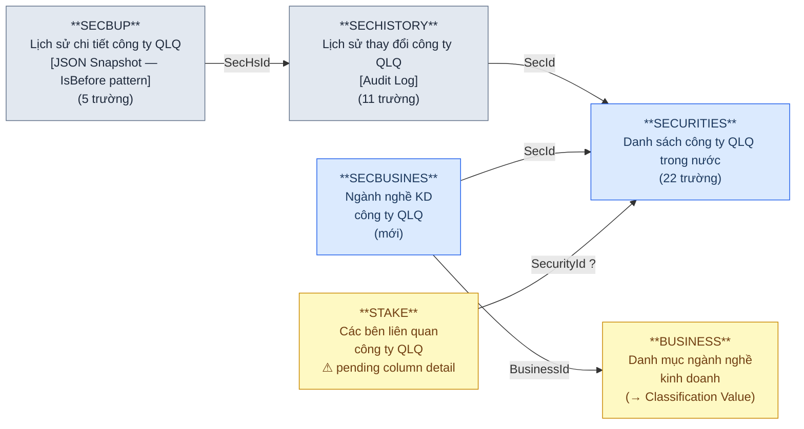

### Silver — Proposed Model

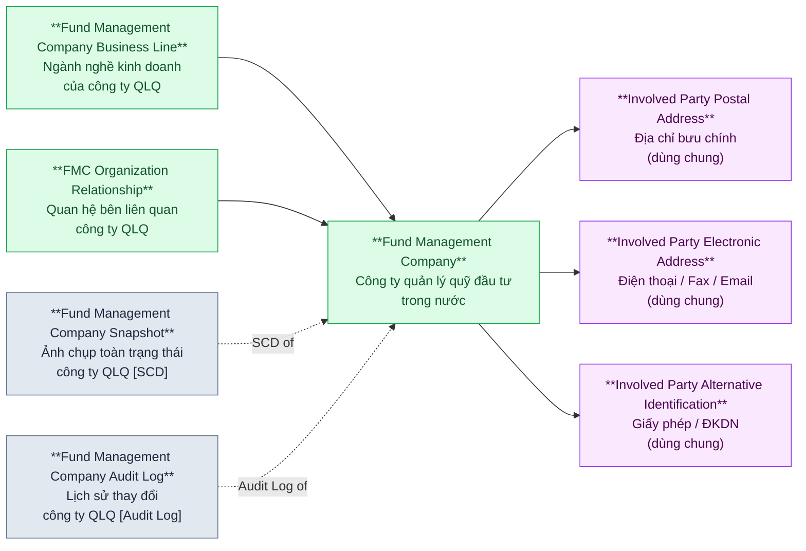

> **So với v1:** Loại 4 entity cổ đông (FMC Shareholder, FMC Shareholder Relationship, FMC Shareholder Representative, FMC Shareholder Ownership Change). Thêm FMC Business Line (từ SECBUSINES).
>
> **SECBUP** nguồn mới chỉ còn 5 trường (Id, DateCreated, SecHsId, IsBefore, SecData) — lưu JSON snapshot toàn bộ bản ghi. Silver Snapshot vẫn giữ model cũ, ETL parse JSON ra attribute.

---

## Nhóm 2 — FMC Organization Unit (Chi nhánh / VPĐD QLQ trong nước)

> **Thay đổi so với v1:** BRANCHS đổi tên thành BRANCHES. SECHISTORY.BrId bị loại bỏ → không còn audit log trực tiếp cho chi nhánh từ SECHISTORY. BRCHBUP vẫn giữ vai trò snapshot.

### Source (FMS)

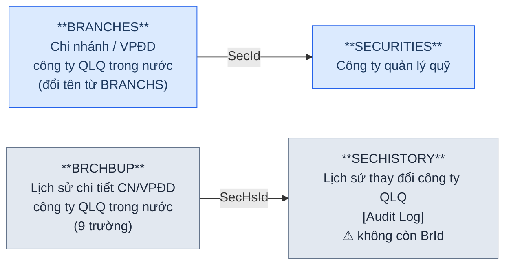

### Silver — Proposed Model

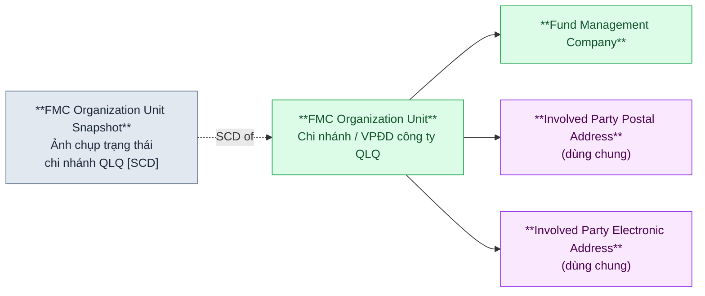

> **So với v1:** Loại FMC Organization Unit Audit Log (SECHISTORY không còn BrId). FMC Organization Unit Snapshot (từ BRCHBUP) vẫn giữ — là cơ chế lịch sử duy nhất cho chi nhánh.
>
> **Lưu ý:** BRCHBUP có SecHsId→SECHISTORY nhưng SECHISTORY không còn BrId. Cần xác nhận với nhà thầu: SECHISTORY entry cho branch change có cách nào trace lại CN cụ thể không?

---

## Nhóm 3 — FMC Employee (Nhân sự QLQ)

> **Thay đổi so với v1:** TLProfiles tinh gọn mạnh (61→14 trường). Loại bỏ BranchId, InsderId. Thêm JobTypeId, IsCBTT, IsLegal. FUNDTLPRO bị loại bỏ → không còn link Employee→Fund. TLPROBUP chuyển sang JSON Snapshot.

### Source (FMS)

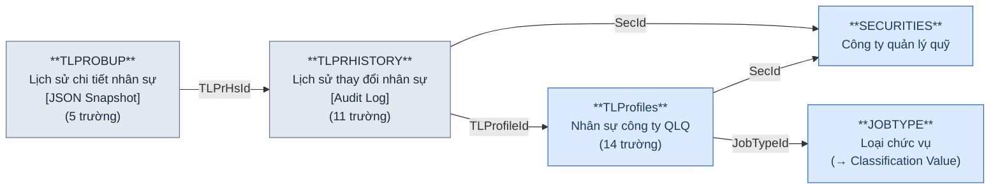

### Silver — Proposed Model

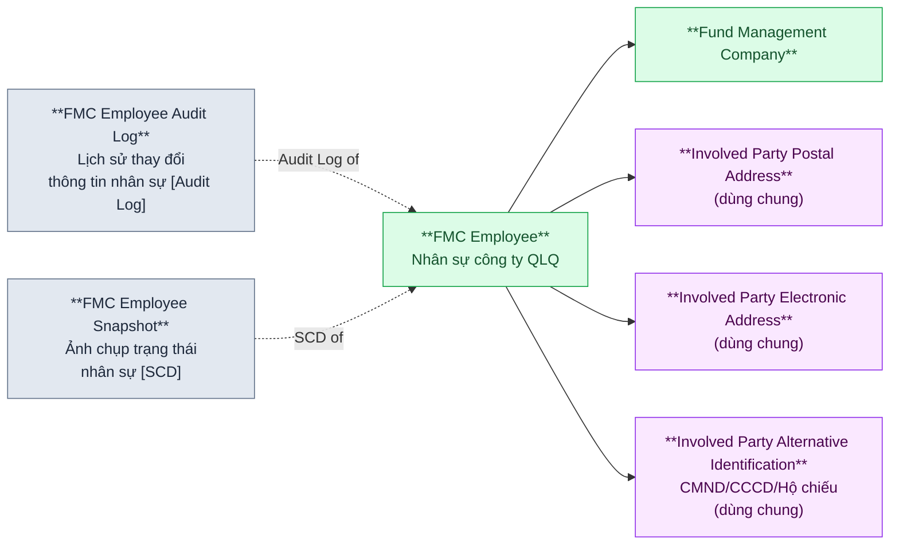

> **So với v1:** Bỏ link FMC Employee → FMC Organization Unit (BranchId bị loại). Bỏ link FMC Employee → FMC Shareholder (InsderId bị loại, INSIDER bị loại). Bỏ link FMC Employee → Fund Instrument (FUNDTLPRO bị loại).
>
> **Lưu ý:** Nguồn mới TLProfiles chỉ giữ thông tin định danh tối thiểu (Id, FullName, IdNo, NatId, BirthDate, SecId, JobTypeId, IsCBTT, IsLegal). Thông tin chi tiết cá nhân (địa chỉ, học vấn, chứng chỉ...) đã loại bỏ ở nguồn mới → shared entities (Address, Electronic Address, Alt Identification) sẽ có ít trường hơn so với v1. Cần xác nhận: thông tin chi tiết cá nhân được lưu ở bảng BUP (JSON snapshot) hay đã loại bỏ hoàn toàn?

---

## Nhóm 4 — Fund Instrument (Quỹ đầu tư)

> **Thay đổi so với v1:** FUNDS tinh gọn (34→18). FUNDHISTO→FUNDHISTORY (đổi tên). FUNDBUP→FNDBUP (đổi tên, pending detail). FUNDS.BankId bị loại → quan hệ Fund↔Bank chuyển từ 1:1 sang M:N qua FNDSBMN. REPRESENT tinh gọn mạnh (26→8, chỉ còn FK reference).

### Source (FMS)

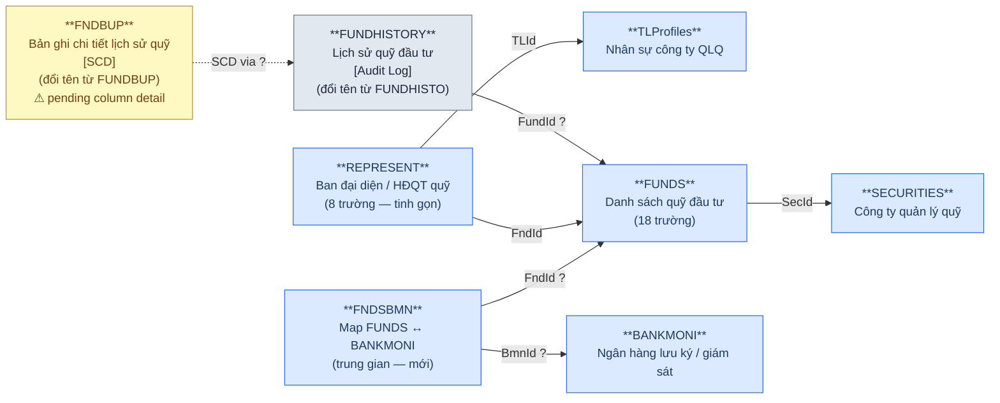

### Silver — Proposed Model

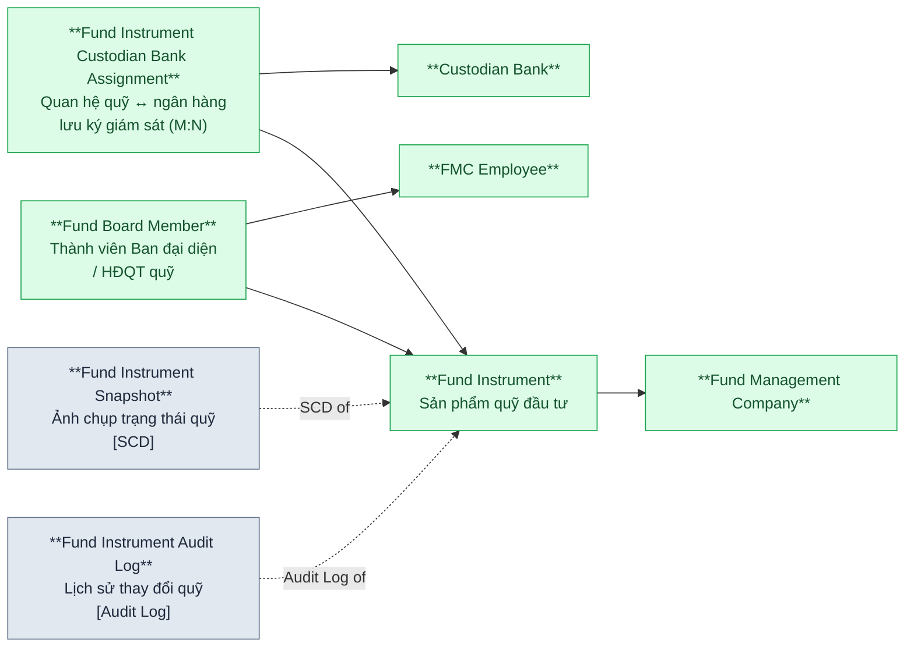

> **So với v1:** Fund→Custodian Bank chuyển từ FK trực tiếp (1:1) sang entity trung gian Fund Instrument Custodian Bank Assignment (M:N). Fund Board Member tinh gọn — chỉ còn FK đến Fund + FMC Employee + cờ IsChair, không còn thông tin cá nhân riêng.
>
> **REPRESENT đơn giản hóa:** Nguồn mới chỉ giữ FndId + TLId + IsChair → Board Member = assignment of Employee to Fund Board. Thông tin cá nhân tra qua TLProfiles.

---

## Nhóm 5 — Fund Investment & Fund Unit Transfer (NĐT quỹ & Giao dịch CCQ)

> **Thay đổi so với v1:** MBFUND tinh gọn mạnh (29→8). MBFUND giờ có InvesId (FK→INVES) thay vì lưu thông tin NĐT riêng. TRANSFERMBF tinh gọn (27→10), có MBFId (FK→MBFUND) và TransType mới.

### Source (FMS)

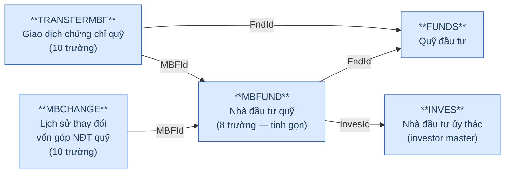

### Silver — Proposed Model

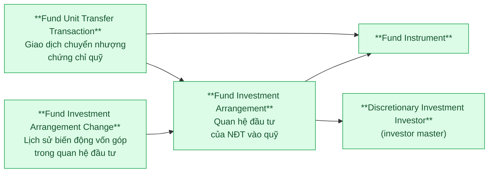

> **So với v1:** Fund Investment Arrangement giờ có FK đến Discretionary Investment Investor (từ MBFUND.InvesId→INVES). Nguồn mới chuẩn hóa: INVES là master NĐT dùng chung cho cả đầu tư ủy thác (INVESACC) lẫn đầu tư quỹ (MBFUND).
>
> **MBFUND.InvesId:** Liên kết mới — NĐT quỹ giờ reference đến INVES thay vì lưu thông tin riêng. Denormalized fields cũ (Name, IdNo, RepresentName, RepresentJob...) đã loại bỏ.
>
> **TRANSFERMBF.MBFId:** FK mới — giao dịch CCQ giờ link trực tiếp đến quan hệ đầu tư (MBFUND) thay vì chỉ link đến quỹ.

---

## Nhóm 6 — Discretionary Investment Investor (Nhà đầu tư ủy thác)

> **Thay đổi so với v1:** INVES gần như giữ nguyên (21→16, loại 5 trường tổng hợp/địa chỉ). INVESACC gần nguyên (17→16). INVES giờ đóng vai trò investor master cho cả Nhóm 5.

### Source (FMS)

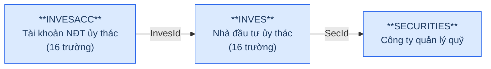

### Silver — Proposed Model

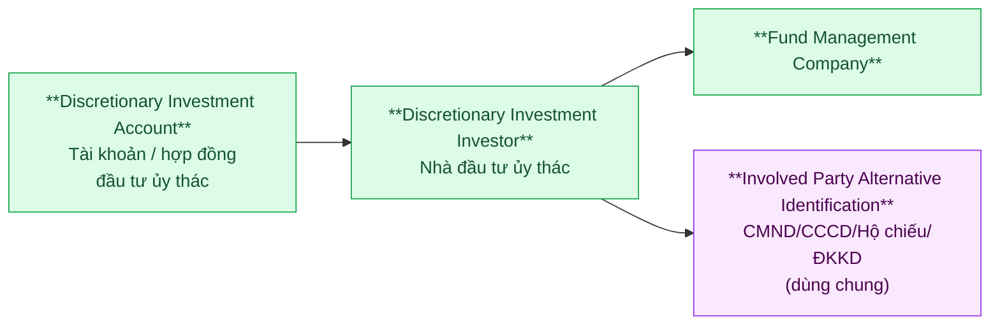

> **So với v1:** Loại IP Postal Address (INVES không còn Address trong nguồn mới). Giữ IP Alt Identification (IdNo, IdDate, IdType còn).
>
> **Lưu ý vai trò kép INVES:** INVES là investor master dùng chung — cả INVESACC (đầu tư ủy thác) lẫn MBFUND (đầu tư quỹ) đều reference đến INVES. Tuy nhiên trên Silver vẫn giữ tên "Discretionary Investment Investor" vì đó là định danh chính.

---

## Nhóm 7 — Fund Distribution Agent (Đại lý phân phối quỹ)

> **Thay đổi so với v1:** Thêm AGENFUNDS (mapping đại lý ↔ quỹ, M:N). Thêm AGENCYTYPE (→ Classification Value). AGENCIES tinh gọn (20→11).

### Source (FMS)

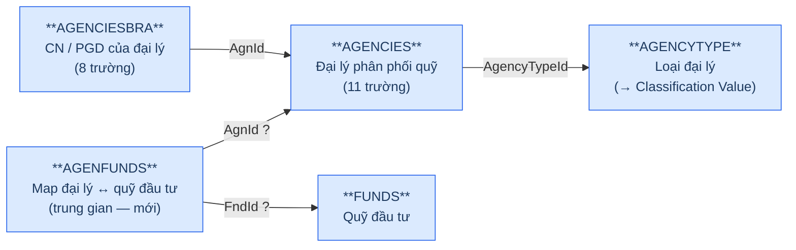

### Silver — Proposed Model

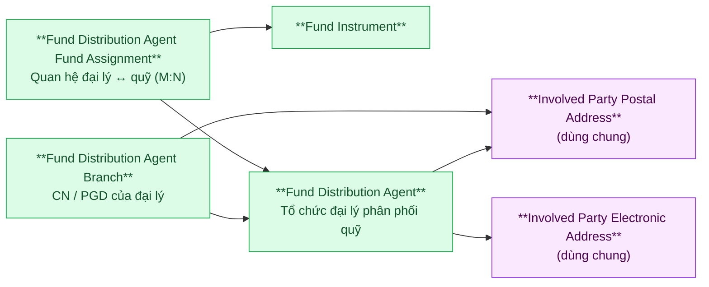

> **So với v1:** Thêm Fund Distribution Agent Fund Assignment (từ AGENFUNDS) — M:N giữa đại lý và quỹ. AGENCYTYPE → Classification Value (Agent Type Code trên entity Fund Distribution Agent).
>
> **Lưu ý:** Nguồn mới loại bỏ nhiều trường legacy của AGENCIES (ActiveDate, Decision, DecisionDate, EName, Fax, Telephone...) → ít shared entity hơn v1. IP Alt Identification bỏ nếu nguồn mới không còn giấy tờ định danh.

---

## Nhóm 8 — Custodian Bank (Ngân hàng lưu ký, giám sát)

> **Thay đổi so với v1:** BANKEMPLOY bị loại bỏ → không còn Custodian Bank Employee. BANKMONI tinh gọn (24→13).

### Source (FMS)

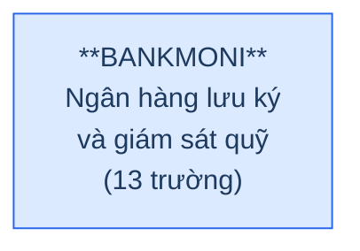

### Silver — Proposed Model

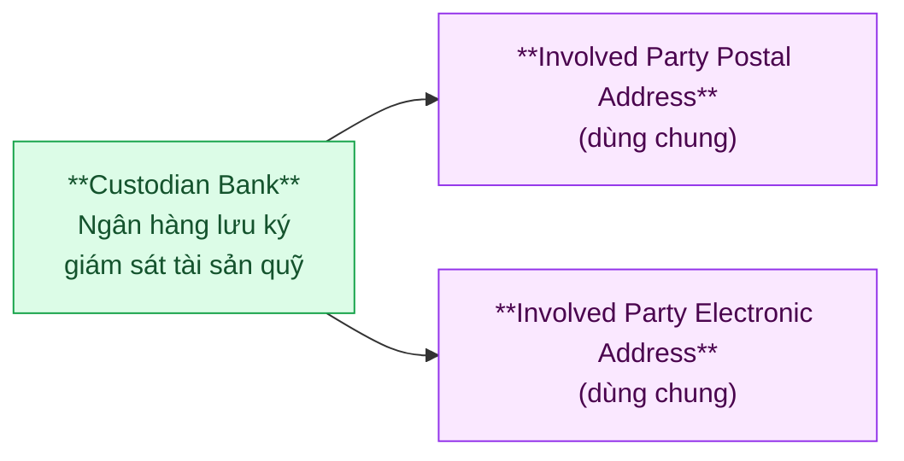

> **So với v1:** Loại Custodian Bank Employee (BANKEMPLOY bị loại khỏi nguồn mới). Giữ IP Postal Address và IP Electronic Address (BANKMONI vẫn có Address, Email, Telephone).
>
> **Lưu ý:** BANKMONI.Type (Giám sát / Lưu ký / LKGS) vẫn giữ → Silver dùng Classification Value phân biệt.

---

## Nhóm 9 — Foreign Fund Management Organization Unit (VPĐD / CN QLQ nước ngoài)

> **Thay đổi so với v1:** FGBRHISTORY bị loại bỏ — FGBRBUP đổi vai trò từ Snapshot sang Audit Log (cùng pattern Action/PrevValue/ValueChange như SECHISTORY, TLPRHISTORY). Thêm FGBUSINESS (ngành nghề KD). STFFGBRCH tinh gọn (26→9), giờ có TLId (FK→TLProfiles).

### Source (FMS)

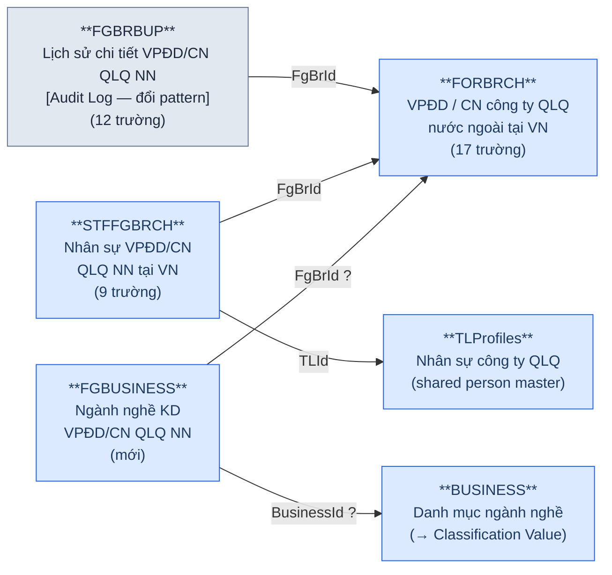

### Silver — Proposed Model

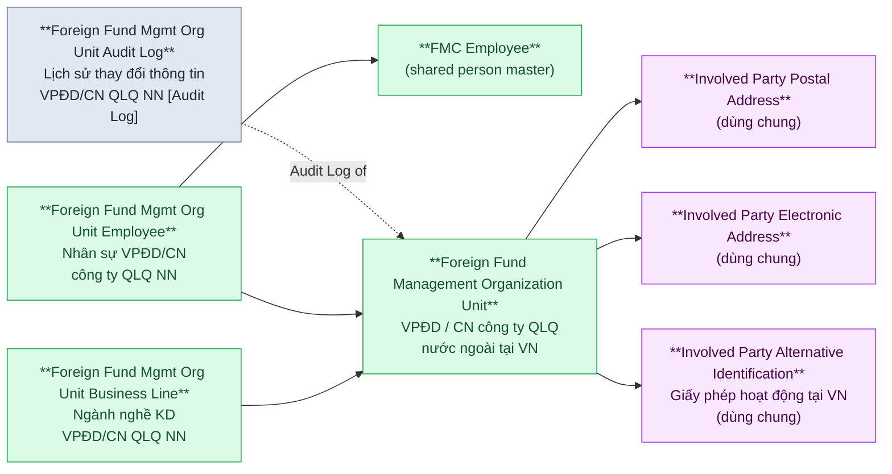

> **So với v1:** Loại Foreign Fund Mgmt Org Unit Snapshot (FGBRBUP đổi pattern sang Audit Log, không còn là Snapshot). Thêm Foreign Fund Mgmt Org Unit Business Line (từ FGBUSINESS). Foreign Fund Mgmt Org Unit Employee giờ có FK đến FMC Employee (từ STFFGBRCH.TLId→TLProfiles).
>
> **Thay đổi pattern FGBRBUP:** Nguồn cũ: FGBRBUP = Snapshot, FGBRHISTORY = Audit Log. Nguồn mới: FGBRHISTORY bị loại, FGBRBUP chuyển sang pattern Audit Log (Action, PrevValue, ValueChange, Reason, DateChange) — cùng pattern với SECHISTORY và TLPRHISTORY.

---

## Nhóm 10 — Insider Share Transfer (Giao dịch chuyển nhượng cổ phần)

> **Thay đổi so với v1:** TRSFERINDER tinh gọn mạnh (27→8). Loại bỏ InFrmId/InToId (INSIDER bị loại) → không còn from/to party. Chỉ còn SecId. Thiết kế CSDL nguồn có thể chưa đầy đủ.

### Source (FMS)

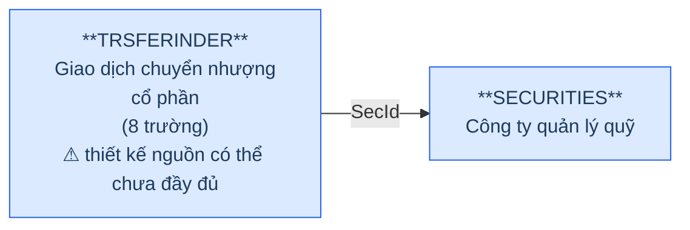

### Silver — Proposed Model

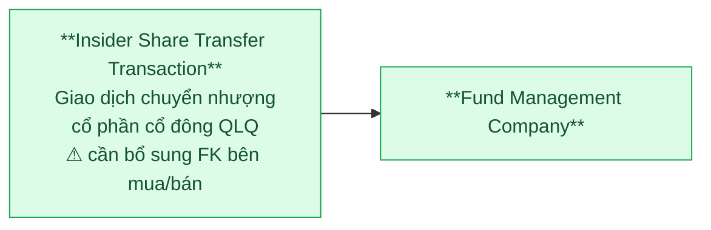

> **So với v1:** Entity giữ lại nhưng thiếu FK bên chuyển nhượng (from) và bên nhận (to). Nguồn cũ: InFrmId/InToId→INSIDER. Nguồn mới: chỉ còn SecId. Cần bổ sung FK khi thiết kế LLD — có thể link đến STAKE hoặc entity mới thay thế INSIDER.
>
> **Trường nguồn mới:** Id, SecId, Price, Quantity, TransDate, DateCreated, DateModified, Deleted.

---

## Nhóm 11 — Reporting Framework (Báo cáo thành viên thị trường)

> **Hoàn toàn mở rộng so với v1.** Nguồn cũ chỉ có 2 bảng (RPTMEMBER, RPTVALUES). Nguồn mới xây dựng framework báo cáo 16 bảng: biểu mẫu, kỳ báo cáo, sheet, import/export, lịch sử xử lý.

### Nhóm 11a — Report Template & Period (Biểu mẫu & Kỳ báo cáo)

#### Source (FMS)

```mermaid
graph LR
    classDef src fill:#dbeafe,stroke:#2563eb,color:#1e3a5f
    classDef pending fill:#fef9c3,stroke:#ca8a04,color:#713f12

    RPTPERIOD["**RPTPERIOD**\nKỳ báo cáo\n(mới)"]:::src
    RPTTEMP["**RPTTEMP**\nBiểu mẫu báo cáo đầu vào\n(mới)\n⚠ pending column detail"]:::pending
    SHEET["**SHEET**\nSheet báo cáo đầu vào\n(mới)\n⚠ pending column detail"]:::pending
    RPTTPOUT["**RPTTPOUT**\nBiểu mẫu báo cáo đầu ra\n(mới)\n⚠ pending column detail"]:::pending
    SHEETOUT["**SHEETOUT**\nSheet báo cáo đầu ra\n(mới)\n⚠ pending column detail"]:::pending
    RPTPDSHT["**RPTPDSHT**\nTrung gian SHEET ↔ RPTPERIOD\n(mới)"]:::src

    SHEET -->|RptId ?| RPTTEMP
    SHEETOUT -->|RptOutId ?| RPTTPOUT
    RPTPDSHT -->|SheetId ?| SHEET
    RPTPDSHT -->|PrdId ?| RPTPERIOD
```

#### Silver — Proposed Model

```mermaid
graph LR
    classDef silver fill:#dcfce7,stroke:#16a34a,color:#14532d

    RPT_PD["**Reporting Period**\nKỳ báo cáo\n(tháng / quý / năm)"]:::silver
    RPT_TEMP["**Report Template**\nBiểu mẫu báo cáo đầu vào"]:::silver
    RPT_SHEET["**Report Template Sheet**\nSheet trong biểu mẫu\nbáo cáo đầu vào"]:::silver
    RPT_OUT_TEMP["**Output Report Template**\nBiểu mẫu báo cáo đầu ra"]:::silver
    RPT_OUT_SHEET["**Output Report Template Sheet**\nSheet trong biểu mẫu\nbáo cáo đầu ra"]:::silver
    RPT_PD_SHEET["**Report Period Sheet Assignment**\nQuan hệ kỳ báo cáo ↔ sheet"]:::silver

    RPT_SHEET --> RPT_TEMP
    RPT_OUT_SHEET --> RPT_OUT_TEMP
    RPT_PD_SHEET --> RPT_SHEET
    RPT_PD_SHEET --> RPT_PD
```

### Nhóm 11b — Report Submission & Values (Nộp báo cáo & Giá trị)

#### Source (FMS)

```mermaid
graph LR
    classDef src fill:#dbeafe,stroke:#2563eb,color:#1e3a5f

    SECURITIES11["**SECURITIES**\nCông ty QLQ"]:::src
    BANKMONI11["**BANKMONI**\nNgân hàng lưu ký"]:::src
    FORBRCH11["**FORBRCH**\nVPĐD / CN QLQ NN"]:::src
    FUNDS11["**FUNDS**\nQuỹ đầu tư"]:::src
    RPTPERIOD11["**RPTPERIOD**\nKỳ báo cáo"]:::src
    RPTTEMP11["**RPTTEMP / SHEET**\nBiểu mẫu / Sheet"]:::src
    RPTMEMBER["**RPTMEMBER**\nBáo cáo thành viên thị trường\n(25 trường)"]:::src
    RPTVALUES["**RPTVALUES**\nGiá trị báo cáo import\n(EAV fact)\n(20 trường)"]:::src

    RPTMEMBER -->|SecId - theo Type| SECURITIES11
    RPTMEMBER -->|BkMId - theo Type| BANKMONI11
    RPTMEMBER -->|FrBrId - theo Type| FORBRCH11
    RPTMEMBER -->|FndId - theo Type| FUNDS11
    RPTMEMBER -->|PrdId| RPTPERIOD11
    RPTMEMBER -->|RptId| RPTTEMP11
    RPTVALUES -->|MebId| RPTMEMBER
    RPTVALUES -->|RptId / SheetId| RPTTEMP11
    RPTVALUES -->|PrdId| RPTPERIOD11
```

#### Silver — Proposed Model

```mermaid
graph LR
    classDef silver fill:#dcfce7,stroke:#16a34a,color:#14532d

    FMC_S11["**Fund Management Company**\n(Type=2)"]:::silver
    CB_S11["**Custodian Bank**\n(Type=3)"]:::silver
    FFMOU_S11["**Foreign Fund Mgmt Org Unit**\n(Type=4,5)"]:::silver
    FI_S11["**Fund Instrument**\n(Type=7)"]:::silver
    RPT_PD_S11["**Reporting Period**"]:::silver
    RPT_TEMP_S11["**Report Template**"]:::silver
    MRS["**Member Report Submission**\nHồ sơ nộp báo cáo\ncủa thành viên thị trường"]:::silver
    RIV["**Report Item Value**\nGiá trị từng ô báo cáo\n(1 dòng = 1 giá trị 1 ô)"]:::silver

    MRS --> FMC_S11
    MRS --> CB_S11
    MRS --> FFMOU_S11
    MRS --> FI_S11
    MRS --> RPT_PD_S11
    MRS --> RPT_TEMP_S11
    RIV --> MRS
```

### Nhóm 11c — Report History & Processing (Lịch sử & Xử lý báo cáo)

#### Source (FMS)

```mermaid
graph LR
    classDef src fill:#dbeafe,stroke:#2563eb,color:#1e3a5f
    classDef pending fill:#fef9c3,stroke:#ca8a04,color:#713f12

    RPTMEMBER11C["**RPTMEMBER**\nBáo cáo thành viên"]:::src
    RPTMBHS["**RPTMBHS**\nLịch sử báo cáo\nthành viên\n(mới)\n⚠ pending column detail"]:::pending
    RPTPROCESS["**RPTPROCESS**\nLịch sử xử lý\nbáo cáo thành viên\n(mới)\n⚠ pending column detail"]:::pending
    RPTHTORY["**RPTHTORY**\nLịch sử thay đổi\nbáo cáo đầu vào\n(mới)\n⚠ pending column detail"]:::pending

    RPTMBHS -->|MebId ?| RPTMEMBER11C
    RPTPROCESS -->|MebId ?| RPTMEMBER11C
    RPTHTORY -->|RptId ?| RPTMEMBER11C
```

#### Silver — Proposed Model

```mermaid
graph LR
    classDef silver fill:#dcfce7,stroke:#16a34a,color:#14532d
    classDef pattern fill:#e2e8f0,stroke:#64748b,color:#1e293b

    MRS_S11C["**Member Report Submission**"]:::silver
    MRS_HS["**Member Report Submission History**\nLịch sử nộp/sửa báo cáo\n[SCD hoặc Audit Log]"]:::pattern
    MRS_PROC["**Member Report Processing Log**\nLịch sử xử lý\nbáo cáo thành viên"]:::pattern
    RPT_CHG["**Report Template Change History**\nLịch sử thay đổi\nbiểu mẫu báo cáo"]:::pattern

    MRS_HS -.->|History of| MRS_S11C
    MRS_PROC -.->|Processing of| MRS_S11C
```

> **Multi-way FK (giữ từ v1):** `RPTMEMBER` có 4 FK subject (SecId / BkMId / FrBrId / FndId) — chỉ một non-null theo Type. Silver resolve thành multi-subject entity.
>
> **Entity mới so với v1:** Reporting Period, Report Template, Report Template Sheet, Output Report Template, Output Report Template Sheet, Report Period Sheet Assignment, Member Report Submission History, Member Report Processing Log, Report Template Change History.
>
> **Pending column detail:** RPTTEMP, SHEET, RPTTPOUT, SHEETOUT, RPTMBHS, RPTPROCESS, RPTHTORY — cần bổ sung từ nhà thầu.

---

## Nhóm 12 — Rating & Ranking (Đánh giá xếp loại thành viên)

> **Nhóm hoàn toàn mới.** 6 bảng: RATINGPD (kỳ đánh giá), RNKFACTOR (chấm điểm), RANK (xếp hạng), RNKFACTHISTORY (lịch sử chấm điểm), RNKGRFTOR (trung gian), PARAWARN (tham số cảnh báo).

### Source (FMS)

```mermaid
graph LR
    classDef src fill:#dbeafe,stroke:#2563eb,color:#1e3a5f
    classDef pending fill:#fef9c3,stroke:#ca8a04,color:#713f12

    SECURITIES12["**SECURITIES**\nCông ty QLQ"]:::src
    RATINGPD["**RATINGPD**\nKỳ đánh giá xếp loại\n(mới)"]:::src
    RNKFACTOR["**RNKFACTOR**\nChấm điểm đánh giá\nxếp loại\n(mới)"]:::src
    RANK["**RANK**\nXếp hạng theo kỳ\nđánh giá\n(mới)"]:::src
    RNKFACTHISTORY["**RNKFACTHISTORY**\nLịch sử chấm điểm\n(mới)\n⚠ pending column detail"]:::pending
    RNKGRFTOR["**RNKGRFTOR**\nTrung gian\nRank ↔ RnkFactor\n(mới)\n⚠ pending column detail"]:::pending
    PARAWARN["**PARAWARN**\nTham số cảnh báo\n(mới)"]:::src

    RANK -->|SecId ?| SECURITIES12
    RANK -->|RatingPdId ?| RATINGPD
    RNKFACTOR -->|SecId ?| SECURITIES12
    RNKFACTOR -->|RatingPdId ?| RATINGPD
    RNKGRFTOR -->|RankId ?| RANK
    RNKGRFTOR -->|RnkFactorId ?| RNKFACTOR
    RNKFACTHISTORY -->|RnkFactorId ?| RNKFACTOR
```

### Silver — Proposed Model

```mermaid
graph LR
    classDef silver fill:#dcfce7,stroke:#16a34a,color:#14532d
    classDef pattern fill:#e2e8f0,stroke:#64748b,color:#1e293b

    FMC_S12["**Fund Management Company**"]:::silver
    RATE_PD["**Member Rating Period**\nKỳ đánh giá xếp loại\nthành viên thị trường"]:::silver
    RATE_SCORE["**Member Rating Factor Score**\nChấm điểm theo nhân tố\ncho từng thành viên"]:::silver
    RATE_RANK["**Member Ranking**\nKết quả xếp hạng tổng hợp\ntheo kỳ đánh giá"]:::silver
    RATE_SCORE_HS["**Member Rating Factor Score History**\nLịch sử chấm điểm"]:::pattern
    RATE_RANK_SCORE["**Member Ranking Score Assignment**\nQuan hệ xếp hạng ↔ điểm nhân tố"]:::silver
    WARN_PARAM["**Member Warning Parameter**\nTham số cảnh báo\nthành viên thị trường"]:::silver

    RATE_SCORE --> FMC_S12
    RATE_SCORE --> RATE_PD
    RATE_RANK --> FMC_S12
    RATE_RANK --> RATE_PD
    RATE_RANK_SCORE --> RATE_RANK
    RATE_RANK_SCORE --> RATE_SCORE
    RATE_SCORE_HS -.->|History of| RATE_SCORE
```

> **BCV Concept:**
> - Member Rating Period → [Condition] Evaluation Period
> - Member Rating Factor Score → [Event] Business Activity (chấm điểm là hoạt động đánh giá)
> - Member Ranking → [Event] Business Activity (xếp hạng là kết quả đánh giá)
> - Member Warning Parameter → [Condition] Warning Threshold
>
> **Pending column detail:** RNKFACTHISTORY, RNKGRFTOR.

---

## Nhóm 13 — Violations (Vi phạm thành viên)

> **Nhóm hoàn toàn mới.** 1 bảng: VIOLT (danh sách vi phạm).

### Source (FMS)

```mermaid
graph LR
    classDef src fill:#dbeafe,stroke:#2563eb,color:#1e3a5f

    SECURITIES13["**SECURITIES**\nCông ty QLQ"]:::src
    VIOLT["**VIOLT**\nDanh sách vi phạm\n(mới)"]:::src

    VIOLT -->|SecId ?| SECURITIES13
```

### Silver — Proposed Model

```mermaid
graph LR
    classDef silver fill:#dcfce7,stroke:#16a34a,color:#14532d

    FMC_S13["**Fund Management Company**"]:::silver
    VIOLATION["**Member Conduct Violation**\nVi phạm của thành viên\nthị trường"]:::silver

    VIOLATION --> FMC_S13
```

> **BCV Concept:** [Business Activity] Conduct Violation — tương tự pattern Tax Violation Penalty Decision (DCST).
>
> **Lưu ý:** Cần xác nhận khi có column detail: VIOLT chỉ liên quan đến SECURITIES (công ty QLQ) hay có thể liên quan BANKMONI, FORBRCH? Nếu multi-subject, cần xử lý tương tự RPTMEMBER.

---

## Tổng quan theo BCV Concept

| BCV Concept | Category | Source Tables | Silver Entities | Ghi chú |
|---|---|---|---|---|
| **[Involved Party]** | Portfolio Fund Management Company | SECURITIES | Fund Management Company | Không còn ForeignType routing |
| **[Involved Party]** | Organization Unit | BRANCHES | FMC Organization Unit | Đổi tên từ BRANCHS |
| **[Involved Party]** | Agent | AGENCIES | Fund Distribution Agent | Tinh gọn |
| **[Involved Party]** | Organization Unit (Branch) | AGENCIESBRA | Fund Distribution Agent Branch | |
| **[Involved Party]** | Organization (Foreign) | FORBRCH | Foreign Fund Management Organization Unit | Độc lập, không FK→SECURITIES |
| **[Involved Party]** | Custodian | BANKMONI | Custodian Bank | Không còn Employee |
| **[Involved Party]** | Employee | TLProfiles | FMC Employee | Tinh gọn, shared person master |
| **[Involved Party]** | Employee (Foreign) | STFFGBRCH | Foreign Fund Mgmt Org Unit Employee | Link TLId→TLProfiles |
| **[Involved Party]** | Employment Position | REPRESENT | Fund Board Member | Tinh gọn, FK only |
| **[Involved Party]** | Investor | INVES | Discretionary Investment Investor | Investor master dùng chung |
| **[Involved Party]** | Organization Relationship | STAKE | FMC Organization Relationship | ⚠ Pending column detail |
| **[Involved Party]** | Organization Business Line | SECBUSINES | Fund Management Company Business Line | Mới |
| **[Involved Party]** | Organization Business Line | FGBUSINESS | Foreign Fund Mgmt Org Unit Business Line | Mới |
| **[Product]** | Fund Instrument | FUNDS | Fund Instrument | Tinh gọn |
| **[Arrangement]** | Fund Investment | MBFUND | Fund Investment Arrangement | Có InvesId mới |
| **[Arrangement]** | Discretionary Investment Account | INVESACC | Discretionary Investment Account | Gần nguyên |
| **[Arrangement]** | Agent–Fund Assignment | AGENFUNDS | Fund Distribution Agent Fund Assignment | Mới (M:N) |
| **[Arrangement]** | Fund–Bank Assignment | FNDSBMN | Fund Instrument Custodian Bank Assignment | Mới (M:N) |
| **[Event]** | Ownership Change | MBCHANGE | Fund Investment Arrangement Change | |
| **[Event]** | Fund Unit Transfer | TRANSFERMBF | Fund Unit Transfer Transaction | Có MBFId mới |
| **[Event]** | Insider Share Transfer | TRSFERINDER | Insider Share Transfer Transaction | ⚠ Thiếu from/to party |
| **[Event]** | Business Activity (Rating) | RNKFACTOR, RANK | Member Rating Factor Score, Member Ranking | Mới |
| **[Event]** | Business Activity (Violation) | VIOLT | Member Conduct Violation | Mới |
| **[Condition]** | Evaluation Period | RATINGPD | Member Rating Period | Mới |
| **[Condition]** | Warning Threshold | PARAWARN | Member Warning Parameter | Mới |
| **[Documentation]** | Reported Information | RPTMEMBER, RPTVALUES | Member Report Submission, Report Item Value | Giữ từ v1 |
| **[Documentation]** | Report Template | RPTTEMP, SHEET | Report Template, Report Template Sheet | Mới |
| **[Documentation]** | Output Report Template | RPTTPOUT, SHEETOUT | Output Report Template, Output Report Template Sheet | Mới |
| **[Documentation]** | Reporting Period | RPTPERIOD | Reporting Period | Mới |
| **ETL Pattern** | SCD Snapshot | SECBUP, BRCHBUP, TLPROBUP, FNDBUP | *Snapshot entities (4 bảng) | SECBUP/TLPROBUP chuyển JSON |
| **ETL Pattern** | Audit Log | SECHISTORY, TLPRHISTORY, FGBRBUP | *Audit Log entities (3 bảng) | FGBRBUP đổi pattern |
| **ETL Pattern** | Report History/Processing | RPTMBHS, RPTPROCESS, RPTHTORY | *History/Processing entities (3 bảng) | Mới, pending detail |
| **ETL Pattern** | Rating History | RNKFACTHISTORY, RNKGRFTOR | *Rating history/junction (2 bảng) | Mới, pending detail |
| **[Location]** | Postal Address *(shared)* | SECURITIES, BRANCHES, AGENCIES, AGENCIESBRA, BANKMONI, FORBRCH | Involved Party Postal Address | Giảm source do tinh gọn |
| **[Location]** | Electronic Address *(shared)* | SECURITIES, BANKMONI, FORBRCH | Involved Party Electronic Address | Giảm source |
| **[Involved Party]** | Alternative Identification *(shared)* | TLProfiles, INVES | Involved Party Alternative Identification | Giảm mạnh |

---

## Danh mục & Tham chiếu (Reference Data → Classification Value)

| Source Table | Mô tả | Xử lý trên Silver |
|---|---|---|
| BUSINESS | Danh mục ngành nghề kinh doanh | → Classification Value |
| JOBTYPE | Loại chức vụ | → Classification Value |
| LOCATION | Tỉnh/thành phố | → Classification Value |
| NATIONAL | Quốc gia/quốc tịch | → Classification Value |
| PARVALUE | Mệnh giá cổ phần | → Classification Value |
| RELATION | Mối quan hệ (cổ đông / bên liên quan) | → Classification Value |
| STATUS | Trạng thái hoạt động | → Classification Value |
| STOCKHOLDERTYPE | Loại hình NĐT/cổ đông | → Classification Value |
| AGENCYTYPE | Loại đại lý | → Classification Value |

> Nguồn cũ có thể dùng danh mục chung (shared). Nguồn mới tách riêng danh mục cho phân hệ FMS.

---

## Bảng ngoài scope Silver

### Quản trị phân hệ (8 bảng)

| Source Table | Lý do |
|---|---|
| CALENDAR | Hạ tầng hệ thống — lịch làm việc |
| CERTFCATE | Hạ tầng hệ thống — chứng thư số |
| MENUS | Phân quyền chức năng |
| REFRESHTOKEN | Session management |
| ROLES | Phân quyền chức năng |
| ROLESMENUS | Phân quyền chức năng |
| USERS | Quản lý user hệ thống |
| USERSMENUS | Phân quyền chức năng (⚠ pending column detail) |

### Phân quyền dữ liệu (4 bảng)

| Source Table | Lý do |
|---|---|
| DTSCOPE | Operational — phân quyền dữ liệu |
| DTSCBMN | Operational — phân quyền NH LKGS cho chuyên viên |
| DTSCFND | Operational — phân quyền QĐT cho chuyên viên |
| DTSCFR | Operational — phân quyền VPĐD/CN QLQ NN cho chuyên viên |

### Quản lý báo cáo — Operational (5 bảng)

| Source Table | Lý do |
|---|---|
| SELFSETPD | Operational — thành viên tự thiết lập gửi BC (⚠ pending detail) |
| SECURITIESREPORT | Operational — cấu hình hiển thị BC công ty QLQ (⚠ pending detail) |
| USERRPTO | Operational — phân quyền user UBCK với BC đầu ra (⚠ pending detail) |
| STTRGTOUT | Operational — cấu hình lấy dữ liệu BC đầu ra (⚠ pending detail) |
| TOTSTTG | Operational — trung gian cấu hình dữ liệu đầu ra (⚠ pending detail) |

### Tiện ích & Hệ thống (6 bảng)

| Source Table | Lý do |
|---|---|
| SYSVAR | Tham số hệ thống |
| SYSEMAIL | Nội dung trao đổi (⚠ pending column detail) |
| NOTIFICATION | Thông báo hệ thống (⚠ pending column detail) |
| TABSINFO | Thiết lập hiển thị (⚠ pending column detail) |
| TPOUTHTORY | Lịch sử thay đổi BC đầu ra (⚠ pending column detail) |
| USERSESSIONS | Session management (⚠ pending column detail) |

> **Tổng ngoài scope: 23 bảng** (8 admin + 4 phân quyền + 5 BC operational + 6 hệ thống)

---

## Scope tổng kết

| Nhóm | Source Tables | Silver Entities | Ghi chú |
|---|---|---|---|
| 1. FMC & bên liên quan | 5 (SECURITIES, SECBUP, SECHISTORY, SECBUSINES, STAKE) | 5 + 3 shared | Loại 4 entity cổ đông |
| 2. FMC Organization Unit | 2 (BRANCHES, BRCHBUP) | 2 | Loại Audit Log |
| 3. FMC Employee | 3 (TLProfiles, TLPRHISTORY, TLPROBUP) | 3 + 3 shared | Bỏ link Branch, Insider, Fund |
| 4. Fund Instrument | 5 (FUNDS, FUNDHISTORY, FNDBUP, REPRESENT, FNDSBMN) | 5 | M:N Fund↔Bank mới |
| 5. Fund Investment & Transfer | 3 (MBFUND, MBCHANGE, TRANSFERMBF) | 3 | Link InvesId mới |
| 6. Discretionary Investment | 2 (INVES, INVESACC) | 2 + 1 shared | Investor master dùng chung |
| 7. Fund Distribution Agent | 3 (AGENCIES, AGENCIESBRA, AGENFUNDS) | 3 | M:N Agent↔Fund mới |
| 8. Custodian Bank | 1 (BANKMONI) | 1 + 2 shared | Loại Employee |
| 9. Foreign Fund Mgmt | 4 (FORBRCH, FGBRBUP, STFFGBRCH, FGBUSINESS) | 4 + 3 shared | FGBRBUP đổi pattern |
| 10. Share Transfer | 1 (TRSFERINDER) | 1 | ⚠ Thiếu from/to |
| 11. Reporting Framework | 11 (RPTPERIOD, RPTTEMP, SHEET, RPTTPOUT, SHEETOUT, RPTPDSHT, RPTMEMBER, RPTVALUES, RPTMBHS, RPTPROCESS, RPTHTORY) | 11 | Mở rộng lớn |
| 12. Rating & Ranking | 6 (RATINGPD, RNKFACTOR, RANK, RNKFACTHISTORY, RNKGRFTOR, PARAWARN) | 7 | Hoàn toàn mới |
| 13. Violations | 1 (VIOLT) | 1 | Hoàn toàn mới |
| Reference Data | 9 bảng danh mục | → Classification Value | |
| Ngoài scope | 23 bảng | — | Admin, phân quyền, system |
| **Tổng** | **56 bảng nghiệp vụ + 9 ref data** | **~48 entities + 3 shared** | (+ 23 ngoài scope = 79 bảng) |

---

## Ghi chú thiết kế

### 1. Pattern JSON Snapshot (BUP tables)
Nguồn mới áp dụng pattern "2 bản ghi trước/sau" cho bảng BUP: 1 cột NCLOB (SecData/TLData) chứa JSON snapshot toàn bộ entity + cờ IsBefore. Silver Snapshot entity vẫn giữ model attribute-level — ETL parse JSON ra từng trường.

### 2. Pattern Audit Log chuẩn hóa
Nguồn mới chuẩn hóa Audit Log pattern qua 3 bảng: SECHISTORY, TLPRHISTORY, FGBRBUP (đổi pattern). Cấu trúc chung: Action, PrevValue, ValueChange, Reason, DateChange, AdjustmentLicense, LicenseDate, FileData.

### 3. TLProfiles — Shared Person Master
Nguồn mới sử dụng TLProfiles như person master trung tâm. REPRESENT.TLId và STFFGBRCH.TLId đều reference đến TLProfiles. Silver giữ các entity riêng (FMC Employee, Fund Board Member, Foreign Fund Mgmt Org Unit Employee) nhưng share FK về FMC Employee.

### 4. INVES — Shared Investor Master
MBFUND.InvesId (mới) → INVES: nhà đầu tư quỹ giờ reference đến cùng bảng INVES (vốn chỉ cho NĐT ủy thác). Silver giữ tên "Discretionary Investment Investor" nhưng ghi nhận vai trò kép.

### 5. Bảng cũ bị loại bỏ — dữ liệu lịch sử
7 bảng cũ bị loại cần xác nhận phương án migrate dữ liệu lịch sử:

| Bảng cũ | Rủi ro | Phương án suy luận |
|---|---|---|
| INSIDER | **Cao** | Gộp vào STAKE? Hệ thống khác? |
| INSDERRELA | Trung bình | Gộp vào RELATION? |
| INSDERRPRST | Trung bình | Gộp vào REPRESENT? |
| INSIDCHANGE | Trung bình | Gộp vào MBCHANGE? |
| BANKEMPLOY | Trung bình | Quản lý ở phân hệ khác? |
| FGBRHISTORY | Thấp | Gộp vào FGBRBUP |
| FUNDTLPRO | Thấp | Quản lý qua TLProfiles + JOBTYPE |

### 6. Bảng pending column detail (20 bảng)
Danh sách bảng có trong nguồn mới nhưng chưa có thiết kế chi tiết cột:

**Trong scope Silver (10):** FNDBUP, STAKE, RNKFACTHISTORY, RNKGRFTOR, RPTTEMP, SHEET, RPTTPOUT, SHEETOUT, RPTMBHS, RPTPROCESS, RPTHTORY

**Ngoài scope Silver (10):** NOTIFICATION, SECURITIESREPORT, SELFSETPD, STTRGTOUT, SYSEMAIL, TABSINFO, TOTSTTG, TPOUTHTORY, USERSESSIONS, USERSMENUS

### 7. SECURITIES — không còn phân luồng ForeignType
Nguồn cũ: `SECURITIES.ForeignType = NULL` → FMC; `ForeignType IN ('B','O')` → Foreign Fund Mgmt Org Unit.
Nguồn mới: SECURITIES chỉ chứa công ty QLQ trong nước (ForeignType bị loại). FORBRCH vẫn là entity độc lập cho VPĐD/CN QLQ NN. **Không cần phân luồng ETL.**

Tuy nhiên nguồn mới có trường `Dorf` trên SECURITIES — cần xác nhận ý nghĩa (Domestic or Foreign flag? hay mục đích khác?).
