# FMS — Relationship Diagram: Source vs Silver Proposed Model

> **Nguồn:** Thiết kế CSDL FMS — Phân hệ quản lý giám sát công ty chứng khoán và quỹ đầu tư chứng khoán (20/03/2026)
>
> **Render:** Mở file này trong VS Code với extension **Markdown Preview Mermaid Support**, hoặc dán từng block vào [mermaid.live](https://mermaid.live).
>
> **Ký hiệu:**
> - `──►` (mũi tên liền): quan hệ FK (Many → One)
> - `-.->` (mũi tên đứt): quan hệ ETL pattern (SCD / Audit Log of)
> - 🔵 Xanh dương: bảng nguồn FMS (Master)
> - 🟢 Xanh lá: entity Silver / Proposed Model
> - ⬜ Xám: ETL pattern — Snapshot hoặc Audit Log
> - 🟡 Vàng: bảng pending column detail
> - 🟣 Tím: Shared entity (dùng chung cho mọi Involved Party)

---

## Nhóm 1 — Fund Management Company & bên liên quan

### Source (FMS)

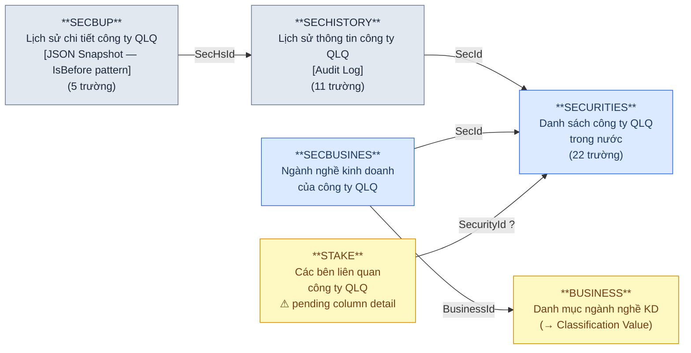

### Silver — Proposed Model

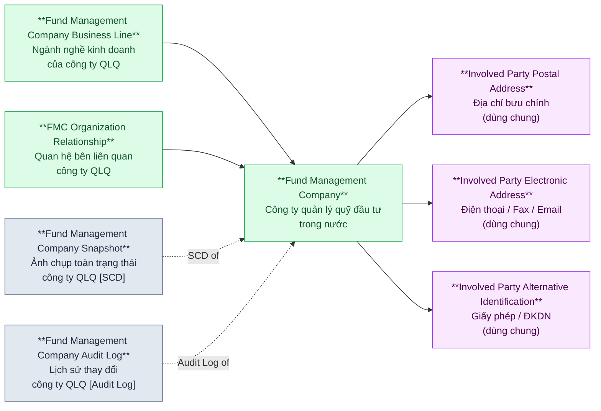

> **SECBUP** lưu JSON snapshot (SecData kiểu NCLOB + cờ IsBefore) — Silver Snapshot parse JSON ra attribute.
>
> **STAKE** pending column detail — cần bổ sung từ nhà thầu.

---

## Nhóm 2 — FMC Organization Unit (Chi nhánh / VPĐD QLQ trong nước)

### Source (FMS)

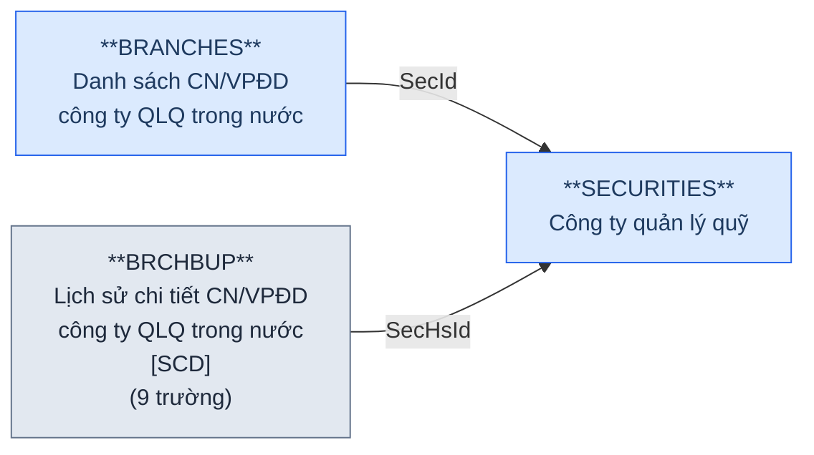

### Silver — Proposed Model

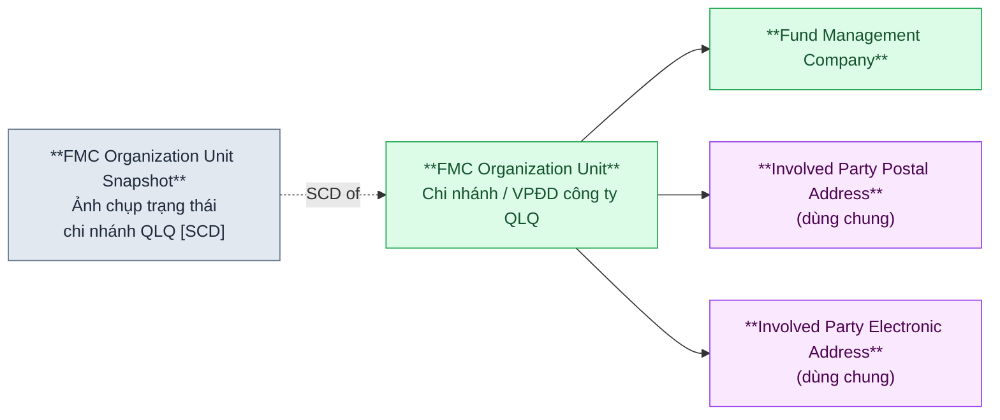

> **Lưu ý:** SECHISTORY không còn BrId — cơ chế lịch sử cho chi nhánh chỉ qua BRCHBUP (Snapshot). Cần xác nhận: BRCHBUP.SecHsId→SECHISTORY có trace được CN cụ thể không?

---

## Nhóm 3 — FMC Employee (Nhân sự QLQ)

### Source (FMS)

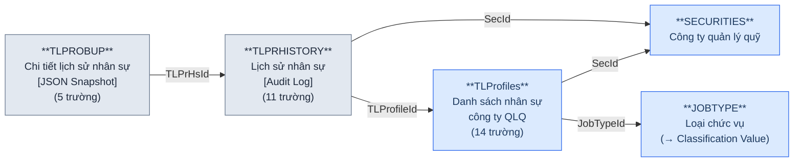

### Silver — Proposed Model

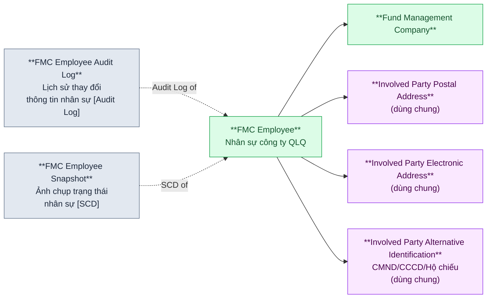

> **TLProfiles** là shared person master — REPRESENT (Nhóm 4) và STFFGBRCH (Nhóm 9) đều reference qua TLId.
>
> **Lưu ý:** TLProfiles chỉ giữ thông tin tối thiểu (FullName, IdNo, NatId, BirthDate, SecId, JobTypeId, IsCBTT, IsLegal). Thông tin chi tiết (địa chỉ, học vấn, chứng chỉ...) có thể lưu trong JSON snapshot (TLPROBUP.TLData) — cần xác nhận.

---

## Nhóm 4 — Fund Instrument (Quỹ đầu tư)

### Source (FMS)

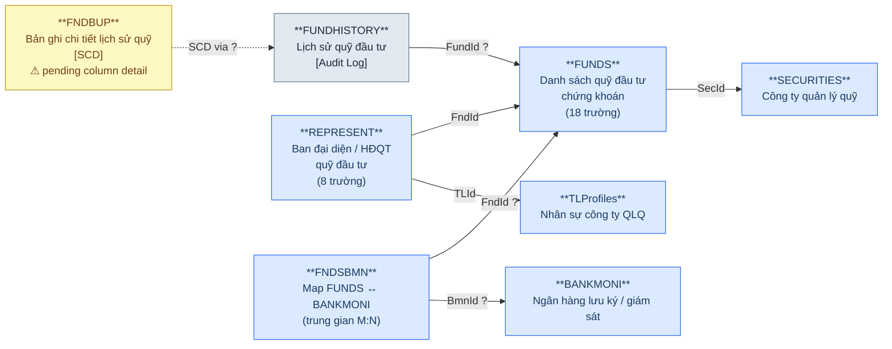

### Silver — Proposed Model

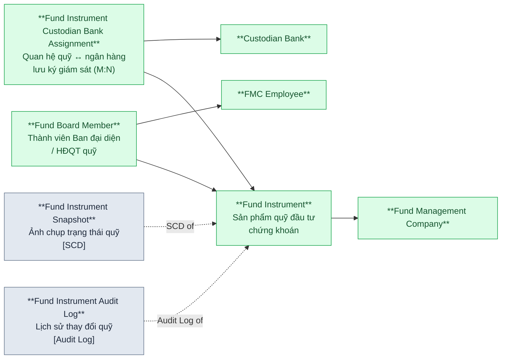

> **REPRESENT** tinh gọn — chỉ còn FK (FndId + TLId + IsChair). Fund Board Member = assignment nhân sự vào HĐQT quỹ. Thông tin cá nhân tra qua FMC Employee.
>
> **FNDSBMN** — quan hệ quỹ ↔ ngân hàng LKGS là M:N (thay vì FUNDS.BankId 1:1).

---

## Nhóm 5 — Fund Investment & Fund Unit Transfer (NĐT quỹ & Giao dịch CCQ)

### Source (FMS)

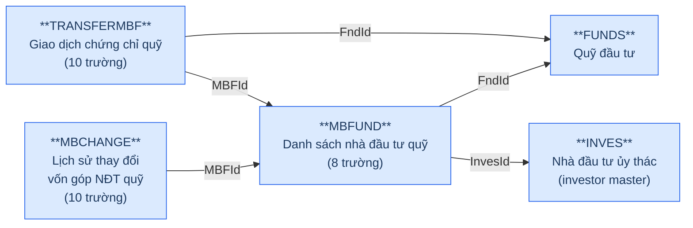

### Silver — Proposed Model

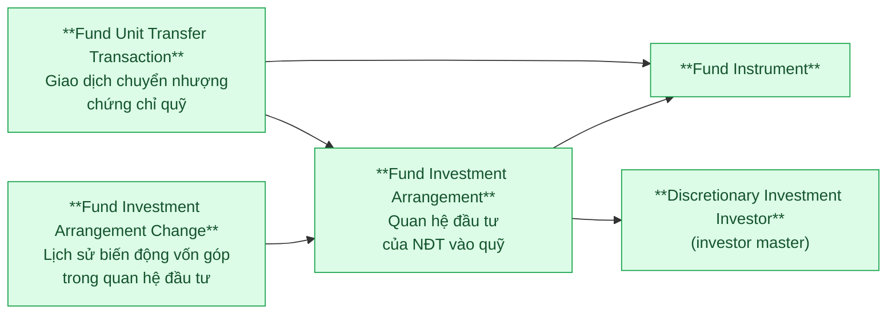

> **MBFUND.InvesId** — NĐT quỹ reference đến INVES (investor master dùng chung cho cả đầu tư ủy thác lẫn đầu tư quỹ).
>
> **TRANSFERMBF.MBFId** — giao dịch CCQ link trực tiếp đến quan hệ đầu tư (MBFUND).

---

## Nhóm 6 — Discretionary Investment Investor (Nhà đầu tư ủy thác)

### Source (FMS)

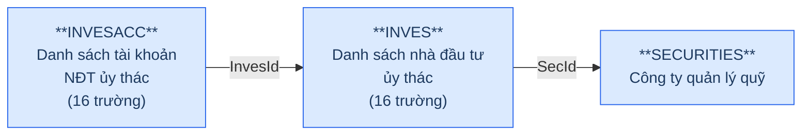

### Silver — Proposed Model

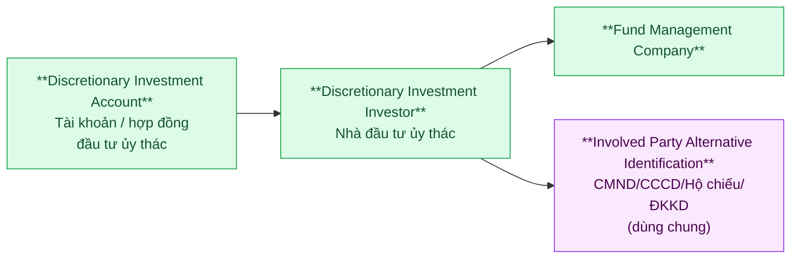

> **INVES** đóng vai trò investor master dùng chung — cả INVESACC (đầu tư ủy thác) lẫn MBFUND (đầu tư quỹ) đều reference.
>
> **INVES.IdType** phân biệt loại giấy tờ (CMND vs ĐKKD) → `Identification Type` trong IP Alt Identification.

---

## Nhóm 7 — Fund Distribution Agent (Đại lý phân phối quỹ)

### Source (FMS)

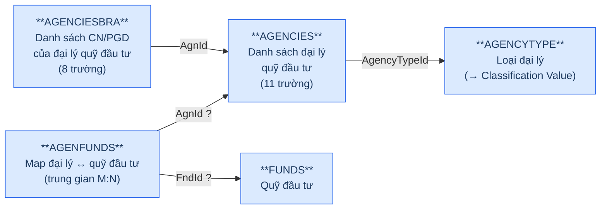

### Silver — Proposed Model

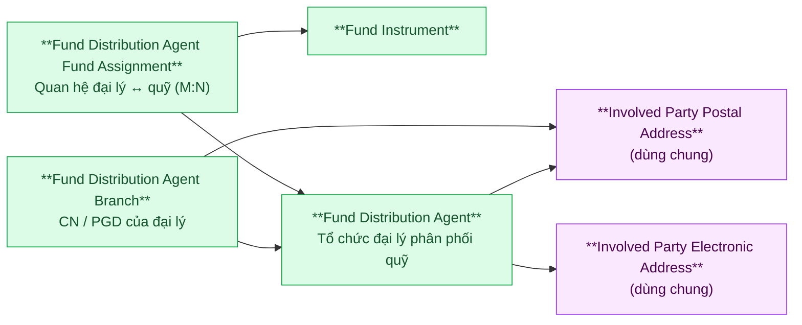

---

## Nhóm 8 — Custodian Bank (Ngân hàng lưu ký, giám sát)

### Source (FMS)

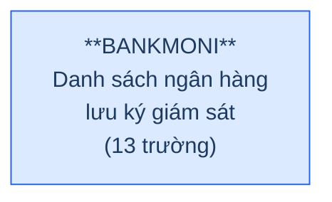

### Silver — Proposed Model

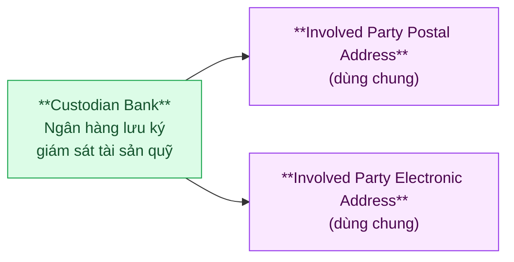

> **BANKMONI.Status** (loại ngân hàng: Giám sát / Lưu ký / LKGS) → Classification Value trên Silver.

---

## Nhóm 9 — Foreign Fund Management Organization Unit (VPĐD / CN QLQ nước ngoài)

> **FORBRCH** không có FK đến SECURITIES — entity **độc lập**, UBCKNN chỉ quản lý VPĐD/CN tại VN, không quản lý công ty mẹ nước ngoài.

### Source (FMS)

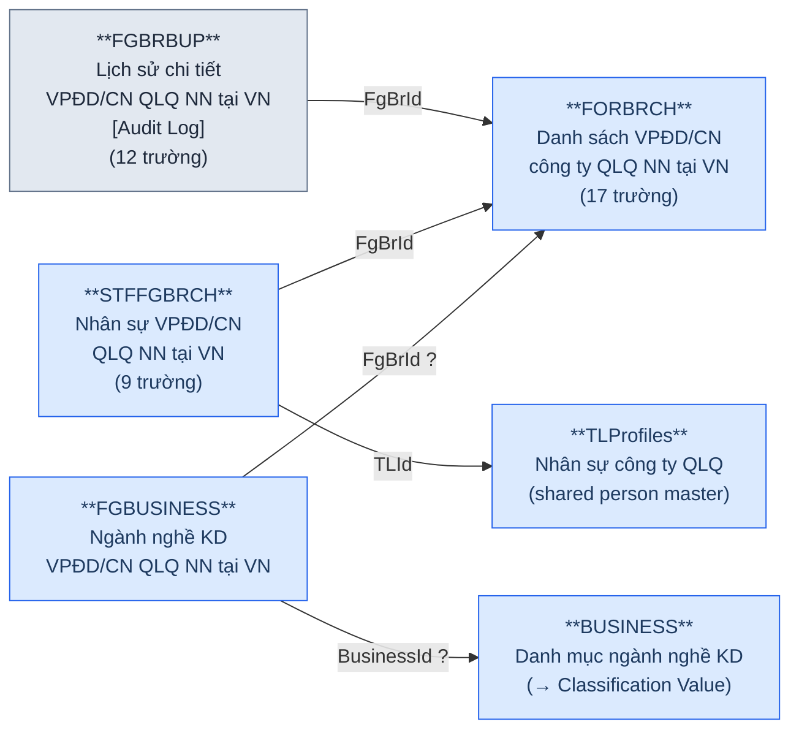

### Silver — Proposed Model

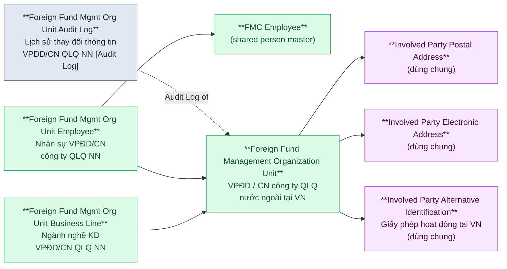

> **FGBRBUP** dùng pattern Audit Log (Action, PrevValue, ValueChange, Reason, DateChange) — cùng cấu trúc với SECHISTORY và TLPRHISTORY.
>
> **STFFGBRCH.TLId** → TLProfiles: nhân sự CN QLQ NN cũng được quản lý trong TLProfiles (shared person master).

---

## Nhóm 10 — Insider Share Transfer (Giao dịch chuyển nhượng cổ phần)

### Source (FMS)

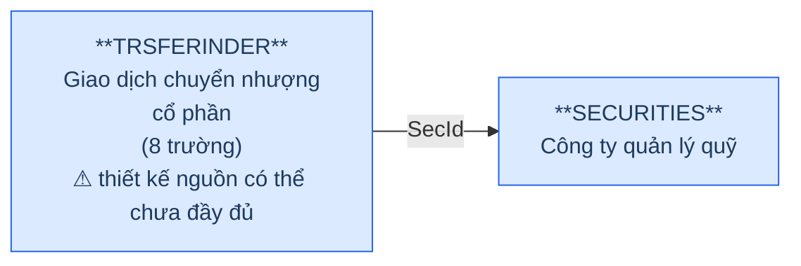

### Silver — Proposed Model

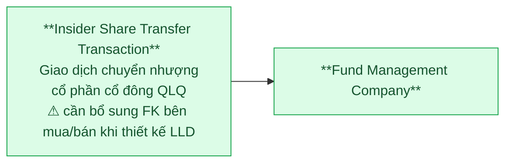

> **Trường nguồn hiện tại:** Id, SecId, Price, Quantity, TransDate, DateCreated, DateModified, Deleted. Thiếu FK bên chuyển nhượng và bên nhận — sẽ bổ sung khi thiết kế LLD.

---

## Nhóm 11 — Reporting Framework (Báo cáo thành viên thị trường)

### Nhóm 11a — Report Template & Period (Biểu mẫu & Kỳ báo cáo)

#### Source (FMS)

```mermaid
graph LR
    classDef src fill:#dbeafe,stroke:#2563eb,color:#1e3a5f
    classDef pending fill:#fef9c3,stroke:#ca8a04,color:#713f12

    RPTPERIOD["**RPTPERIOD**\nKỳ báo cáo"]:::src
    RPTTEMP["**RPTTEMP**\nBiểu mẫu báo cáo đầu vào\n⚠ pending column detail"]:::pending
    SHEET["**SHEET**\nSheet báo cáo đầu vào\n⚠ pending column detail"]:::pending
    RPTTPOUT["**RPTTPOUT**\nBiểu mẫu báo cáo đầu ra\n⚠ pending column detail"]:::pending
    SHEETOUT["**SHEETOUT**\nSheet báo cáo đầu ra\n⚠ pending column detail"]:::pending
    RPTPDSHT["**RPTPDSHT**\nTrung gian SHEET ↔ RPTPERIOD"]:::src

    SHEET -->|RptId ?| RPTTEMP
    SHEETOUT -->|RptOutId ?| RPTTPOUT
    RPTPDSHT -->|SheetId ?| SHEET
    RPTPDSHT -->|PrdId ?| RPTPERIOD
```

#### Silver — Proposed Model

```mermaid
graph LR
    classDef silver fill:#dcfce7,stroke:#16a34a,color:#14532d

    RPT_PD["**Reporting Period**\nKỳ báo cáo\n(tháng / quý / năm)"]:::silver
    RPT_TEMP["**Report Template**\nBiểu mẫu báo cáo đầu vào"]:::silver
    RPT_SHEET["**Report Template Sheet**\nSheet trong biểu mẫu\nbáo cáo đầu vào"]:::silver
    RPT_OUT_TEMP["**Output Report Template**\nBiểu mẫu báo cáo đầu ra"]:::silver
    RPT_OUT_SHEET["**Output Report Template Sheet**\nSheet trong biểu mẫu\nbáo cáo đầu ra"]:::silver
    RPT_PD_SHEET["**Report Period Sheet Assignment**\nQuan hệ kỳ báo cáo ↔ sheet"]:::silver

    RPT_SHEET --> RPT_TEMP
    RPT_OUT_SHEET --> RPT_OUT_TEMP
    RPT_PD_SHEET --> RPT_SHEET
    RPT_PD_SHEET --> RPT_PD
```

### Nhóm 11b — Report Submission & Values (Nộp báo cáo & Giá trị)

> **Multi-way FK:** `RPTMEMBER` có 4 FK subject (SecId / BkMId / FrBrId / FndId) — chỉ một non-null theo `Type`. `RPTVALUES` mirror cùng 4 FK.

#### Source (FMS)

```mermaid
graph LR
    classDef src fill:#dbeafe,stroke:#2563eb,color:#1e3a5f

    SECURITIES11["**SECURITIES**\nCông ty QLQ"]:::src
    BANKMONI11["**BANKMONI**\nNgân hàng lưu ký"]:::src
    FORBRCH11["**FORBRCH**\nVPĐD / CN QLQ NN"]:::src
    FUNDS11["**FUNDS**\nQuỹ đầu tư"]:::src
    RPTPERIOD11["**RPTPERIOD**\nKỳ báo cáo"]:::src
    RPTTEMP11["**RPTTEMP / SHEET**\nBiểu mẫu / Sheet"]:::src
    RPTMEMBER["**RPTMEMBER**\nBáo cáo định kỳ\ncủa thành viên thị trường\n(25 trường)"]:::src
    RPTVALUES["**RPTVALUES**\nBáo cáo giá trị –\nlưu dữ liệu import\n(EAV fact)\n(20 trường)"]:::src

    RPTMEMBER -->|SecId - theo Type| SECURITIES11
    RPTMEMBER -->|BkMId - theo Type| BANKMONI11
    RPTMEMBER -->|FrBrId - theo Type| FORBRCH11
    RPTMEMBER -->|FndId - theo Type| FUNDS11
    RPTMEMBER -->|PrdId| RPTPERIOD11
    RPTMEMBER -->|RptId| RPTTEMP11
    RPTVALUES -->|MebId| RPTMEMBER
    RPTVALUES -->|RptId / SheetId| RPTTEMP11
    RPTVALUES -->|PrdId| RPTPERIOD11
```

#### Silver — Proposed Model

```mermaid
graph LR
    classDef silver fill:#dcfce7,stroke:#16a34a,color:#14532d

    FMC_S11["**Fund Management Company**\n(Type=2)"]:::silver
    CB_S11["**Custodian Bank**\n(Type=3)"]:::silver
    FFMOU_S11["**Foreign Fund Mgmt Org Unit**\n(Type=4,5)"]:::silver
    FI_S11["**Fund Instrument**\n(Type=7)"]:::silver
    RPT_PD_S11["**Reporting Period**"]:::silver
    RPT_TEMP_S11["**Report Template**"]:::silver
    MRS["**Member Report Submission**\nHồ sơ nộp báo cáo\ncủa thành viên thị trường"]:::silver
    RIV["**Report Item Value**\nGiá trị từng ô báo cáo\n(1 dòng = 1 giá trị 1 ô)"]:::silver

    MRS --> FMC_S11
    MRS --> CB_S11
    MRS --> FFMOU_S11
    MRS --> FI_S11
    MRS --> RPT_PD_S11
    MRS --> RPT_TEMP_S11
    RIV --> MRS
```

### Nhóm 11c — Report History & Processing (Lịch sử & Xử lý báo cáo)

#### Source (FMS)

```mermaid
graph LR
    classDef src fill:#dbeafe,stroke:#2563eb,color:#1e3a5f
    classDef pending fill:#fef9c3,stroke:#ca8a04,color:#713f12

    RPTMEMBER11C["**RPTMEMBER**\nBáo cáo thành viên"]:::src
    RPTMBHS["**RPTMBHS**\nLịch sử báo cáo\nthành viên\n⚠ pending column detail"]:::pending
    RPTPROCESS["**RPTPROCESS**\nLịch sử xử lý\nbáo cáo thành viên\n⚠ pending column detail"]:::pending
    RPTHTORY["**RPTHTORY**\nLịch sử thay đổi\nbáo cáo đầu vào\n⚠ pending column detail"]:::pending

    RPTMBHS -->|MebId ?| RPTMEMBER11C
    RPTPROCESS -->|MebId ?| RPTMEMBER11C
    RPTHTORY -->|RptId ?| RPTMEMBER11C
```

#### Silver — Proposed Model

```mermaid
graph LR
    classDef silver fill:#dcfce7,stroke:#16a34a,color:#14532d
    classDef pattern fill:#e2e8f0,stroke:#64748b,color:#1e293b

    MRS_S11C["**Member Report Submission**"]:::silver
    RPT_TEMP_S11C["**Report Template**"]:::silver
    MRS_HS["**Member Report Submission History**\nLịch sử nộp/sửa báo cáo\n[SCD hoặc Audit Log]"]:::pattern
    MRS_PROC["**Member Report Processing Log**\nLịch sử xử lý\nbáo cáo thành viên"]:::pattern
    RPT_CHG["**Report Template Change History**\nLịch sử thay đổi\nbiểu mẫu báo cáo"]:::pattern

    MRS_HS -.->|History of| MRS_S11C
    MRS_PROC -.->|Processing of| MRS_S11C
    RPT_CHG -.->|History of| RPT_TEMP_S11C
```

---

## Nhóm 12 — Rating & Ranking (Đánh giá xếp loại thành viên)

### Source (FMS)

```mermaid
graph LR
    classDef src fill:#dbeafe,stroke:#2563eb,color:#1e3a5f
    classDef pending fill:#fef9c3,stroke:#ca8a04,color:#713f12

    SECURITIES12["**SECURITIES**\nCông ty QLQ"]:::src
    RATINGPD["**RATINGPD**\nKỳ đánh giá xếp loại"]:::src
    RNKFACTOR["**RNKFACTOR**\nChấm điểm đánh giá\nxếp loại"]:::src
    RANK["**RANK**\nXếp hạng theo kỳ\nđánh giá"]:::src
    RNKFACTHISTORY["**RNKFACTHISTORY**\nKết quả các lần lưu\nbảng tổng hợp đánh giá\n⚠ pending column detail"]:::pending
    RNKGRFTOR["**RNKGRFTOR**\nTrung gian\nRank ↔ RnkFactor\n⚠ pending column detail"]:::pending
    PARAWARN["**PARAWARN**\nTham số cảnh báo"]:::src

    RANK -->|SecId ?| SECURITIES12
    RANK -->|RatingPdId ?| RATINGPD
    RNKFACTOR -->|SecId ?| SECURITIES12
    RNKFACTOR -->|RatingPdId ?| RATINGPD
    RNKGRFTOR -->|RankId ?| RANK
    RNKGRFTOR -->|RnkFactorId ?| RNKFACTOR
    RNKFACTHISTORY -->|RnkFactorId ?| RNKFACTOR
```

### Silver — Proposed Model

```mermaid
graph LR
    classDef silver fill:#dcfce7,stroke:#16a34a,color:#14532d
    classDef pattern fill:#e2e8f0,stroke:#64748b,color:#1e293b

    FMC_S12["**Fund Management Company**"]:::silver
    RATE_PD["**Member Rating Period**\nKỳ đánh giá xếp loại\nthành viên thị trường"]:::silver
    RATE_SCORE["**Member Rating Factor Score**\nChấm điểm theo nhân tố\ncho từng thành viên"]:::silver
    RATE_RANK["**Member Ranking**\nKết quả xếp hạng tổng hợp\ntheo kỳ đánh giá"]:::silver
    RATE_SCORE_HS["**Member Rating Factor Score History**\nLịch sử chấm điểm"]:::pattern
    RATE_RANK_SCORE["**Member Ranking Score Assignment**\nQuan hệ xếp hạng ↔ điểm nhân tố"]:::silver
    WARN_PARAM["**Member Warning Parameter**\nTham số cảnh báo\nthành viên thị trường"]:::silver

    RATE_SCORE --> FMC_S12
    RATE_SCORE --> RATE_PD
    RATE_RANK --> FMC_S12
    RATE_RANK --> RATE_PD
    RATE_RANK_SCORE --> RATE_RANK
    RATE_RANK_SCORE --> RATE_SCORE
    RATE_SCORE_HS -.->|History of| RATE_SCORE
```

---

## Nhóm 13 — Violations (Vi phạm thành viên)

### Source (FMS)

```mermaid
graph LR
    classDef src fill:#dbeafe,stroke:#2563eb,color:#1e3a5f

    SECURITIES13["**SECURITIES**\nCông ty QLQ"]:::src
    VIOLT["**VIOLT**\nDanh sách vi phạm"]:::src

    VIOLT -->|SecId ?| SECURITIES13
```

### Silver — Proposed Model

```mermaid
graph LR
    classDef silver fill:#dcfce7,stroke:#16a34a,color:#14532d

    FMC_S13["**Fund Management Company**"]:::silver
    VIOLATION["**Member Conduct Violation**\nVi phạm của thành viên\nthị trường"]:::silver

    VIOLATION --> FMC_S13
```

> **Lưu ý:** Cần xác nhận — VIOLT chỉ liên quan SECURITIES (công ty QLQ) hay có thể liên quan BANKMONI, FORBRCH? Nếu multi-subject, xử lý tương tự RPTMEMBER.

---

## Tổng quan theo BCV Concept

### Involved Party

| BCV Concept | Category | Source Table | Mô tả bảng nguồn | Silver Entity | Ghi chú |
|---|---|---|---|---|---|
| [Involved Party] | Portfolio Fund Management Company | SECURITIES | Danh sách công ty QLQ trong nước | Fund Management Company | 22 trường |
| [Involved Party] | Organization Unit | BRANCHES | Danh sách CN/VPĐD công ty QLQ trong nước | FMC Organization Unit | |
| [Involved Party] | Organization Relationship | STAKE | Danh sách các bên liên quan công ty QLQ | FMC Organization Relationship | ⚠ Pending column detail |
| [Involved Party] | Organization Business Line | SECBUSINES | Ngành nghề kinh doanh của công ty QLQ | Fund Management Company Business Line | |
| [Involved Party] | Employee | TLProfiles | Danh sách nhân sự công ty QLQ | FMC Employee | Shared person master |
| [Involved Party] | Agent | AGENCIES | Danh sách đại lý quỹ đầu tư | Fund Distribution Agent | 11 trường |
| [Involved Party] | Organization Unit (Branch) | AGENCIESBRA | Danh sách CN/PGD của đại lý quỹ đầu tư | Fund Distribution Agent Branch | 8 trường |
| [Involved Party] | Custodian | BANKMONI | Danh sách ngân hàng lưu ký giám sát (LKGS) | Custodian Bank | 13 trường |
| [Involved Party] | Investor | INVES | Danh sách nhà đầu tư ủy thác | Discretionary Investment Investor | Investor master dùng chung |
| [Involved Party] | Employment Position | REPRESENT | Ban đại diện/HĐQT quỹ đầu tư | Fund Board Member | 8 trường, chỉ FK reference |
| [Involved Party] | Organization (Foreign) | FORBRCH | Danh sách VPĐD/CN công ty QLQ NN tại VN | Foreign Fund Management Organization Unit | Độc lập, không FK→SECURITIES |
| [Involved Party] | Organization Business Line | FGBUSINESS | Ngành nghề KD VPĐD/CN công ty QLQ NN tại VN | Foreign Fund Mgmt Org Unit Business Line | |
| [Involved Party] | Employee (Foreign) | STFFGBRCH | Nhân sự VPĐD/CN QLQ NN tại VN | Foreign Fund Mgmt Org Unit Employee | TLId→TLProfiles |

### Product & Arrangement

| BCV Concept | Category | Source Table | Mô tả bảng nguồn | Silver Entity | Ghi chú |
|---|---|---|---|---|---|
| [Product] | Fund Instrument | FUNDS | Danh sách quỹ đầu tư chứng khoán | Fund Instrument | 18 trường |
| [Arrangement] | Fund Investment | MBFUND | Danh sách nhà đầu tư quỹ | Fund Investment Arrangement | InvesId→INVES |
| [Arrangement] | Discretionary Investment Account | INVESACC | Danh sách tài khoản NĐT ủy thác | Discretionary Investment Account | 16 trường |
| [Arrangement] | Agent–Fund Assignment | AGENFUNDS | Map đại lý và quỹ đầu tư (trung gian) | Fund Distribution Agent Fund Assignment | M:N |
| [Arrangement] | Fund–Bank Assignment | FNDSBMN | Map FUNDS & BANKMONI (trung gian) | Fund Instrument Custodian Bank Assignment | M:N |

### Event & Transaction

| BCV Concept | Category | Source Table | Mô tả bảng nguồn | Silver Entity | Ghi chú |
|---|---|---|---|---|---|
| [Event] | Ownership Change | MBCHANGE | Lịch sử thay đổi vốn góp NĐT quỹ | Fund Investment Arrangement Change | 10 trường |
| [Event] | Fund Unit Transfer | TRANSFERMBF | Giao dịch chứng chỉ quỹ | Fund Unit Transfer Transaction | MBFId→MBFUND |
| [Event] | Insider Share Transfer | TRSFERINDER | Giao dịch chuyển nhượng cổ phần | Insider Share Transfer Transaction | ⚠ Thiếu from/to party |
| [Event] | Business Activity (Rating) | RNKFACTOR | Chấm điểm đánh giá xếp loại | Member Rating Factor Score | |
| [Event] | Business Activity (Ranking) | RANK | Xếp hạng theo kỳ đánh giá | Member Ranking | |
| [Event] | Business Activity (Violation) | VIOLT | Danh sách vi phạm | Member Conduct Violation | |

### Condition

| BCV Concept | Category | Source Table | Mô tả bảng nguồn | Silver Entity | Ghi chú |
|---|---|---|---|---|---|
| [Condition] | Evaluation Period | RATINGPD | Kỳ đánh giá xếp loại | Member Rating Period | |
| [Condition] | Warning Threshold | PARAWARN | Tham số cảnh báo | Member Warning Parameter | |

### Documentation & Reporting

| BCV Concept | Category | Source Table | Mô tả bảng nguồn | Silver Entity | Ghi chú |
|---|---|---|---|---|---|
| [Documentation] | Reporting Period | RPTPERIOD | Kỳ báo cáo | Reporting Period | |
| [Documentation] | Report Template | RPTTEMP | Biểu mẫu báo cáo đầu vào | Report Template | ⚠ Pending column detail |
| [Documentation] | Report Template Sheet | SHEET | Sheet báo cáo đầu vào | Report Template Sheet | ⚠ Pending column detail |
| [Documentation] | Output Report Template | RPTTPOUT | Biểu mẫu báo cáo đầu ra | Output Report Template | ⚠ Pending column detail |
| [Documentation] | Output Report Template Sheet | SHEETOUT | Sheet báo cáo đầu ra | Output Report Template Sheet | ⚠ Pending column detail |
| [Documentation] | Report Period–Sheet Junction | RPTPDSHT | Trung gian SHEET và RPTPERIOD | Report Period Sheet Assignment | |
| [Documentation] | Reported Information | RPTMEMBER | Báo cáo định kỳ của thành viên thị trường | Member Report Submission | Multi-way FK theo Type |
| [Documentation] | Reported Information (Detail) | RPTVALUES | Báo cáo giá trị – lưu dữ liệu import | Report Item Value | EAV fact |

### ETL Pattern — Snapshot & Audit Log

| Pattern | Source Table | Mô tả bảng nguồn | Silver Entity | Ghi chú |
|---|---|---|---|---|
| SCD Snapshot (JSON) | SECBUP | Lịch sử chi tiết công ty QLQ (2 bản ghi trước/sau) | Fund Management Company Snapshot | JSON pattern |
| SCD Snapshot | BRCHBUP | Lịch sử chi tiết CN/VPĐD công ty QLQ trong nước | FMC Organization Unit Snapshot | 9 trường |
| SCD Snapshot (JSON) | TLPROBUP | Chi tiết lịch sử nhân sự (2 bản ghi trước/sau) | FMC Employee Snapshot | JSON pattern |
| SCD Snapshot | FNDBUP | Bản ghi chi tiết lịch sử quỹ đầu tư | Fund Instrument Snapshot | ⚠ Pending column detail |
| Audit Log | SECHISTORY | Lịch sử thông tin công ty QLQ | Fund Management Company Audit Log | 11 trường |
| Audit Log | TLPRHISTORY | Lịch sử nhân sự | FMC Employee Audit Log | 11 trường |
| Audit Log | FUNDHISTORY | Lịch sử quỹ đầu tư | Fund Instrument Audit Log | |
| Audit Log | FGBRBUP | Lịch sử chi tiết VPĐD/CN công ty QLQ NN tại VN | Foreign Fund Mgmt Org Unit Audit Log | Đổi pattern từ SCD→Audit Log |
| Report History | RPTMBHS | Lịch sử báo cáo thành viên | Member Report Submission History | ⚠ Pending column detail |
| Report Processing | RPTPROCESS | Lịch sử xử lý báo cáo thành viên | Member Report Processing Log | ⚠ Pending column detail |
| Report Change History | RPTHTORY | Lịch sử thay đổi báo cáo đầu vào | Report Template Change History | ⚠ Pending column detail |
| Rating History | RNKFACTHISTORY | Kết quả các lần lưu bảng tổng hợp đánh giá | Member Rating Factor Score History | ⚠ Pending column detail |
| Rating–Ranking Junction | RNKGRFTOR | Trung gian Ranks và RNKFACTOR | Member Ranking Score Assignment | ⚠ Pending column detail |

### Shared Entities (dùng chung — không riêng FMS)

| BCV Concept | Category | Source Tables | Silver Entity | Ghi chú |
|---|---|---|---|---|
| [Location] | Postal Address | SECURITIES, BRANCHES, AGENCIES, AGENCIESBRA, BANKMONI, FORBRCH | IP Postal Address | Grain = 1 Involved Party |
| [Location] | Electronic Address | SECURITIES, BANKMONI, FORBRCH | IP Electronic Address | Phone, Fax, Email |
| [Involved Party] | Alternative Identification | TLProfiles, INVES | IP Alt Identification | CMND/CCCD/Hộ chiếu/ĐKKD |

### Danh mục & Tham chiếu (Reference Data → Classification Value)

| Source Table | Mô tả | Xử lý trên Silver |
|---|---|---|
| BUSINESS | Danh mục ngành nghề kinh doanh | → Classification Value |
| JOBTYPE | Loại chức vụ | → Classification Value |
| LOCATION | Tỉnh/thành phố | → Classification Value |
| NATIONAL | Quốc gia/quốc tịch | → Classification Value |
| PARVALUE | Mệnh giá cổ phần | → Classification Value |
| RELATION | Mối quan hệ (cổ đông / bên liên quan) | → Classification Value |
| STATUS | Trạng thái hoạt động | → Classification Value |
| STOCKHOLDERTYPE | Loại hình NĐT/cổ đông | → Classification Value |
| AGENCYTYPE | Loại đại lý | → Classification Value |

---

## Bảng ngoài scope Silver

### Quản trị phân hệ (8 bảng)

| Source Table | Mô tả | Lý do |
|---|---|---|
| CALENDAR | Lịch làm việc và lịch nghỉ | Hạ tầng hệ thống |
| CERTFCATE | Chứng thư số thành viên thị trường | Hạ tầng hệ thống |
| MENUS | Danh mục quyền chức năng | Phân quyền chức năng |
| REFRESHTOKEN | Phiên làm việc (Token đăng nhập) | Session management |
| ROLES | Nhóm quyền chức năng | Phân quyền chức năng |
| ROLESMENUS | Phân quyền menu theo nhóm quyền | Phân quyền chức năng |
| USERS | Quản lý người dùng hệ thống | Quản lý user |
| USERSMENUS | Phân quyền chức năng cho người dùng | Phân quyền chức năng (⚠ pending detail) |

### Phân quyền dữ liệu (4 bảng)

| Source Table | Mô tả | Lý do |
|---|---|---|
| DTSCOPE | Phân quyền dữ liệu – phạm vi | Operational |
| DTSCBMN | Phân quyền dữ liệu ngân hàng LKGS cho chuyên viên QLQ | Operational |
| DTSCFND | Phân quyền dữ liệu QĐT cho chuyên viên vụ QLQ | Operational |
| DTSCFR | Phân quyền dữ liệu VPĐD/CN QLQ NN cho chuyên viên | Operational |

### Quản lý báo cáo — Operational (5 bảng)

| Source Table | Mô tả | Lý do |
|---|---|---|
| SELFSETPD | Thành viên tự thiết lập gửi báo cáo | Operational (⚠ pending detail) |
| SECURITIESREPORT | Thiết lập hiển thị báo cáo công ty QLQ | Operational (⚠ pending detail) |
| USERRPTO | Phân quyền người dùng UBCK với báo cáo đầu ra | Operational (⚠ pending detail) |
| STTRGTOUT | Cấu hình lấy dữ liệu báo cáo đầu ra | Operational (⚠ pending detail) |
| TOTSTTG | Trung gian cấu hình dữ liệu đầu ra với ô dữ liệu | Operational (⚠ pending detail) |

### Tiện ích & Hệ thống (6 bảng)

| Source Table | Mô tả | Lý do |
|---|---|---|
| SYSVAR | Tham số hệ thống | Cấu hình hệ thống |
| SYSEMAIL | Nội dung trao đổi thông tin | Hệ thống (⚠ pending detail) |
| NOTIFICATION | Thông báo hệ thống | Hệ thống (⚠ pending detail) |
| TABSINFO | Thiết lập hiển thị dữ liệu | Hệ thống (⚠ pending detail) |
| TPOUTHTORY | Lịch sử thay đổi báo cáo đầu ra | Hệ thống (⚠ pending detail) |
| USERSESSIONS | Quản lý tài khoản đang truy cập | Session management (⚠ pending detail) |

> **Tổng ngoài scope: 23 bảng** (8 admin + 4 phân quyền + 5 BC operational + 6 hệ thống)

---

## Scope tổng kết

| Nhóm | Source Tables | Silver Entities |
|---|---|---|
| 1. FMC & bên liên quan | 5 (SECURITIES, SECBUP, SECHISTORY, SECBUSINES, STAKE) | 5 + 3 shared |
| 2. FMC Organization Unit | 2 (BRANCHES, BRCHBUP) | 2 |
| 3. FMC Employee | 3 (TLProfiles, TLPRHISTORY, TLPROBUP) | 3 + 3 shared |
| 4. Fund Instrument | 5 (FUNDS, FUNDHISTORY, FNDBUP, REPRESENT, FNDSBMN) | 5 |
| 5. Fund Investment & Transfer | 3 (MBFUND, MBCHANGE, TRANSFERMBF) | 3 |
| 6. Discretionary Investment | 2 (INVES, INVESACC) | 2 + 1 shared |
| 7. Fund Distribution Agent | 3 (AGENCIES, AGENCIESBRA, AGENFUNDS) | 3 |
| 8. Custodian Bank | 1 (BANKMONI) | 1 + 2 shared |
| 9. Foreign Fund Mgmt | 4 (FORBRCH, FGBRBUP, STFFGBRCH, FGBUSINESS) | 4 + 3 shared |
| 10. Share Transfer | 1 (TRSFERINDER) | 1 |
| 11. Reporting Framework | 11 (RPTPERIOD, RPTTEMP, SHEET, RPTTPOUT, SHEETOUT, RPTPDSHT, RPTMEMBER, RPTVALUES, RPTMBHS, RPTPROCESS, RPTHTORY) | 11 |
| 12. Rating & Ranking | 6 (RATINGPD, RNKFACTOR, RANK, RNKFACTHISTORY, RNKGRFTOR, PARAWARN) | 7 |
| 13. Violations | 1 (VIOLT) | 1 |
| Reference Data | 9 bảng danh mục | → Classification Value |
| Ngoài scope | 23 bảng | — |
| **Tổng** | **56 bảng nghiệp vụ + 9 ref data** | **~48 entities + 3 shared** |

---

## Ghi chú thiết kế

### 1. Pattern JSON Snapshot (BUP tables)
SECBUP và TLPROBUP lưu dạng 1 cột NCLOB (SecData/TLData) chứa JSON snapshot toàn bộ entity + cờ IsBefore. Silver Snapshot entity giữ model attribute-level — ETL parse JSON ra từng trường.

### 2. Pattern Audit Log chuẩn hóa
SECHISTORY, TLPRHISTORY, FGBRBUP dùng chung cấu trúc: Action, PrevValue, ValueChange, Reason, DateChange, AdjustmentLicense, LicenseDate, FileData.

### 3. TLProfiles — Shared Person Master
TLProfiles là person master trung tâm cho FMS. REPRESENT.TLId và STFFGBRCH.TLId đều reference đến TLProfiles. Silver giữ các entity riêng (FMC Employee, Fund Board Member, Foreign Fund Mgmt Org Unit Employee) nhưng share FK về FMC Employee.

### 4. INVES — Shared Investor Master
MBFUND.InvesId → INVES: nhà đầu tư quỹ reference đến cùng bảng INVES. Silver giữ tên "Discretionary Investment Investor" nhưng ghi nhận vai trò kép (ủy thác + quỹ).

### 5. SECURITIES — chỉ chứa công ty QLQ trong nước
Không còn ForeignType → không cần phân luồng ETL. FORBRCH là entity độc lập cho VPĐD/CN QLQ nước ngoài. Trường `Dorf` trên SECURITIES — cần xác nhận ý nghĩa.

### 6. Bảng pending column detail
**Trong scope Silver (10):** FNDBUP, STAKE, RNKFACTHISTORY, RNKGRFTOR, RPTTEMP, SHEET, RPTTPOUT, SHEETOUT, RPTMBHS, RPTPROCESS, RPTHTORY

**Ngoài scope Silver (10):** NOTIFICATION, SECURITIESREPORT, SELFSETPD, STTRGTOUT, SYSEMAIL, TABSINFO, TOTSTTG, TPOUTHTORY, USERSESSIONS, USERSMENUS

### 7. Điểm cần xác nhận với nhà thầu

| # | Câu hỏi | Ảnh hưởng |
|---|---|---|
| 1 | SECURITIES.Dorf — ý nghĩa? | Phân loại entity |
| 2 | SECHISTORY không còn BrId — audit log cho CN trace bằng cách nào? | Nhóm 2 |
| 3 | TLProfiles tinh gọn — thông tin chi tiết cá nhân lưu ở đâu? JSON trong TLPROBUP? | Nhóm 3, shared entities |
| 4 | TRSFERINDER thiếu from/to party — bổ sung FK nào? | Nhóm 10 |
| 5 | VIOLT chỉ liên quan SECURITIES hay multi-subject? | Nhóm 13 |
| 6 | 7 bảng cũ bị loại — phương án migrate dữ liệu lịch sử? | Toàn bộ |
| 7 | 10 bảng trong scope chưa có column detail — timeline bổ sung? | Nhóm 4, 11, 12 |
