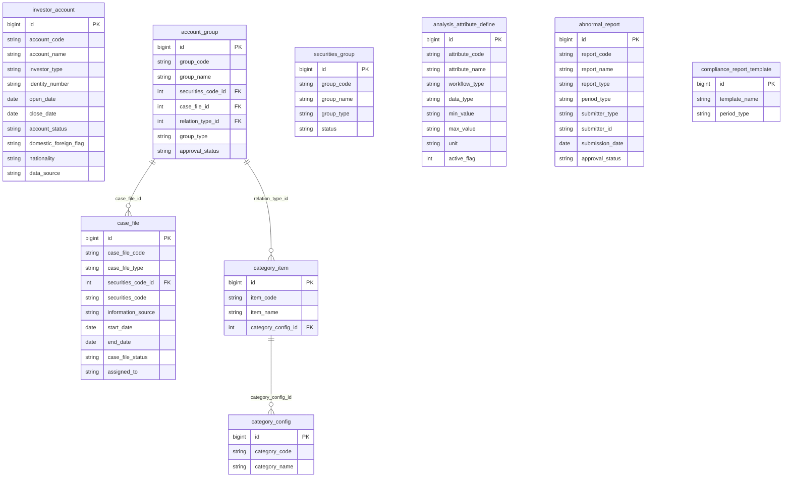

# GSGD HLD — Tier 1

**Source system:** GSGD (Giám sát Giao dịch)  
**Mô tả:** Hệ thống giám sát giao dịch chứng khoán của UBCKNN. Quản lý tài khoản nhà đầu tư, nhóm tài khoản, vụ việc giám sát, phân tích dữ liệu bất thường, và báo cáo tuân thủ.  
**Tier 1:** Các entity độc lập — không FK đến bảng nghiệp vụ khác trong scope GSGD.

---

## 6a. Bảng tổng quan BCV Concept

| BCV Core Object | BCV Concept | Category | Source Table | Mô tả bảng nguồn | Silver Entity | table_type | BCV Term |
|---|---|---|---|---|---|---|---|
| Arrangement | [Arrangement] Trading Account Arrangement | Arrangement | investor_account | Thông tin tài khoản nhà đầu tư | Investor Trading Account | Fundamental | BCV term **Trading Account Arrangement** (ID 7562): "Identifies an Account Arrangement storing information on a group of securities purchased with the express intent of selling them prior to their maturity." Cấu trúc bảng: account_code (từ VSDC), investor_type (cá nhân/tổ chức), open_date, close_date, account_status, identity_number — khớp hoàn toàn với khái niệm tài khoản giao dịch chứng khoán. **Grain = 1 tài khoản** (không phải 1 Involved Party). Các trường liên lạc (phone_number, email), địa chỉ (contact_address, permanent_address), và giấy tờ (identity_number, identity_issue_date, identity_issue_place) → **giữ denormalized** trên entity — không tách sang shared entity. |
| Involved Party | [Involved Party] Group | Group | account_group | Nhóm tài khoản | Account Investor Group | Fundamental | BCV term **Involved Party Group** (ID 10200): "Identifies a Group that groups Involved Parties in whom the Financial Institution is interested, based on selection criteria." Bảng account_group gom các tài khoản nhà đầu tư theo tiêu chí phân tích (loại quan hệ: Danh tính, IP, MAC, Tiền). Grain: 1 dòng = 1 nhóm. Không phải [Arrangement] vì nhóm không phải thoả thuận — đây là nhóm phân tích do nghiệp vụ giám sát xác định. Core Object = Group. |
| Group | [Group] Portfolio | Group | securities_group | Nhóm chứng khoán | Securities Watchlist Group | Fundamental | BCV term **Portfolio** (gốc Group): nhóm chứng khoán do nghiệp vụ giám sát tạo ra (Thường / Theo ngành). Không phải [Product] hay [Arrangement] — đây là nhóm phân loại phục vụ giám sát, tương tự watchlist. Chọn `Portfolio` trong Group vì BCV mô tả Portfolio là "professionally managed grouping of investment instruments." Dùng tên entity `Securities Watchlist Group` để phân biệt với Investment Fund Portfolio trong Silver. |
| Business Activity | [Business Activity] Audit Investigation | — | case_file | Vụ việc giám sát | Market Surveillance Case | Fundamental | BCV concept **Audit Investigation**: hồ sơ điều tra/xem xét vi phạm thị trường. Bảng case_file ghi nhận vụ việc giám sát giao dịch bất thường (case_file_type, securities_code, information_source, case_file_status, assigned_to). Grain: 1 dòng = 1 vụ việc. Đây là loại hồ sơ khởi đầu quy trình xử lý, khác với ThanhTra.GS_HO_SO (xử lý vi phạm sau giám sát). Dùng prefix `Market Surveillance` để phân biệt. |
| Condition | [Condition] Criterion | — | analysis_attribute_define | Định nghĩa tiêu chí/công thức phân tích vụ việc | Market Surveillance Analysis Criterion | Fundamental | BCV term **Criterion** trong Condition: định nghĩa tiêu chí đánh giá (attribute_code, attribute_name, data_type, min_value, max_value, workflow_type). Đây là tham số cấu hình — quy định ngưỡng phân tích (VD: tỷ trọng đặt/khớp lệnh > A%). Không phải [Product] hay [Arrangement]. Giống Rating Criterion (FMS) về cấu trúc nhưng phục vụ giám sát giao dịch. |
| Documentation | [Documentation] Regulatory Report | — | abnormal_report | Báo cáo bất thường | Abnormal Trading Report | Fundamental | BCV term **Regulatory Report**: báo cáo gửi/nhận theo yêu cầu quy định. Bảng abnormal_report ghi nhận báo cáo bất thường từ tổ chức thành viên (submitter_type, submitter_id, period, approval_status). Grain: 1 dòng = 1 báo cáo. Không phải Fact Append vì có approval_status lifecycle. |
| Condition | [Condition] | — | compliance_report_template | Danh sách các loại báo cáo tuân thủ | Market Surveillance Compliance Report Template | Fundamental | Tương tự `Report Submission Schedule` (SCMS) và `Report Template` (FIMS/SCMS). Bảng này định nghĩa các loại báo cáo tuân thủ trong hệ thống GSGD (template_name, period_type). Grain: 1 dòng = 1 loại báo cáo. Không phải Classification Value vì có period_type và lifecycle. Chọn [Condition] vì đây là quy định/nghĩa vụ báo cáo. |

---

## 6b. Diagram Source (Mermaid)



> **Ghi chú:** `account_group.case_file_id` là FK đến `case_file` — tuy nhiên, trong Silver design, entity `Account Investor Group` được giữ ở Tier 1 (tham chiếu ngược: case_file tham chiếu group, không phải group phụ thuộc case_file về mặt lifecycle). Xem điểm cần xác nhận 6f-1.

---

## 6c. Diagram Silver (Mermaid)

```mermaid
erDiagram
    InvestorTradingAccount["Investor Trading Account"] {
        bigint investor_trading_account_id PK
        string investor_trading_account_code BK
        string account_name
        string investor_type_code
        date open_date
        date close_date
        string account_status_code
        string domestic_foreign_flag
        string nationality_code
        string data_source_code
        string identity_number
        date identity_issue_date
        string identity_issue_place
        string contact_address
        string permanent_address
        string phone_number
        string email
        date margin_account_open_date
        boolean margin_service_enabled
        boolean advance_payment_service_enabled
    }

    AccountInvestorGroup["Account Investor Group"] {
        bigint account_investor_group_id PK
        string account_investor_group_code BK
        string group_name
        string group_type_code
        string relation_type_code
        string approval_status_code
    }

    SecuritiesWatchlistGroup["Securities Watchlist Group"] {
        bigint securities_watchlist_group_id PK
        string securities_watchlist_group_code BK
        string group_name
        string group_type_code
        string group_status_code
        array securities_codes
    }

    MarketSurveillanceCase["Market Surveillance Case"] {
        bigint market_surveillance_case_id PK
        string market_surveillance_case_code BK
        string case_type_code
        string securities_code
        string information_source_code
        date start_date
        date end_date
        string case_status_code
    }

    MarketSurveillanceAnalysisCriterion["Market Surveillance Analysis Criterion"] {
        bigint market_surveillance_analysis_criterion_id PK
        string market_surveillance_analysis_criterion_code BK
        string criterion_name
        string workflow_type_code
        string data_type_code
        string min_value
        string max_value
        string unit
        boolean active_flag
    }

    AbnormalTradingReport["Abnormal Trading Report"] {
        bigint abnormal_trading_report_id PK
        string abnormal_trading_report_code BK
        string report_name
        string report_type_code
        string period_type_code
        string submitter_type_code
        string submitter_id
        date submission_date
        string approval_status_code
    }

    MarketSurveillanceComplianceReportTemplate["Market Surveillance Compliance Report Template"] {
        bigint market_surveillance_compliance_report_template_id PK
        string template_name
        string period_type_code
    }
```

---

## 6d. Danh mục & Tham chiếu (Reference Data)

| Source Table | Mô tả | BCV Term | Xử lý Silver | Scheme Code | source_type |
|---|---|---|---|---|---|
| category_item (INVESTOR_TYPE) | Loại nhà đầu tư: Cá nhân / Tổ chức | Classification | Classification Value | `GSGD_INVESTOR_TYPE` | etl_derived |
| category_item (ACCOUNT_STATUS) | Trạng thái tài khoản: Đóng / Mở | Classification | Classification Value | `GSGD_ACCOUNT_STATUS` | etl_derived |
| category_item (DOMESTIC_FOREIGN_FLAG) | Trong nước / Nước ngoài | Classification | Classification Value | `GSGD_DOMESTIC_FOREIGN_FLAG` | etl_derived |
| category_item (ACCOUNT_GROUP_TYPE) | Loại nhóm TK: Thường / Nghi vấn | Classification | Classification Value | `GSGD_ACCOUNT_GROUP_TYPE` | etl_derived |
| category_item (ACCOUNT_RELATION_TYPE) | Loại quan hệ tài khoản: Danh tính / IP / MAC / Tiền | Classification | Classification Value | `GSGD_ACCOUNT_RELATION_TYPE` | source_table |
| category_item (SECURITIES_GROUP_TYPE) | Loại nhóm CK: Thường / Theo ngành | Classification | Classification Value | `GSGD_SECURITIES_GROUP_TYPE` | etl_derived |
| category_item (CASE_FILE_TYPE) | Loại vụ việc: Sơ bộ / Thao túng / Nội gián / Liên thị trường | Classification | Classification Value | `GSGD_CASE_TYPE` | etl_derived |
| category_item (CASE_FILE_STATUS) | Trạng thái vụ việc | Classification | Classification Value | `GSGD_CASE_STATUS` | source_table |
| category_item (INFORMATION_SOURCE) | Nguồn thông tin vụ việc | Classification | Classification Value | `GSGD_INFORMATION_SOURCE` | source_table |
| category_item (WORKFLOW_TYPE) | Loại quy trình phân tích: 1=Sơ bộ, 2=Thao túng, 3=Nội gián, 4=Liên thị trường | Classification | Classification Value | `GSGD_WORKFLOW_TYPE` | etl_derived |
| category_item (DATA_TYPE) | Kiểu dữ liệu tiêu chí: NUMBER / STRING / DATE / BOOLEAN | Classification | Classification Value | `GSGD_DATA_TYPE` | etl_derived |
| category_item (REPORT_TYPE) | Loại báo cáo bất thường | Classification | Classification Value | `GSGD_ABNORMAL_REPORT_TYPE` | source_table |
| category_item (PERIOD_TYPE) | Loại kỳ: Ngày / Tuần / Tháng / Quý / Năm | Classification | Classification Value | `GSGD_PERIOD_TYPE` | etl_derived |
| category_item (SUBMITTER_TYPE) | Loại người nộp: Tổ chức / Cá nhân | Classification | Classification Value | `GSGD_SUBMITTER_TYPE` | etl_derived |
| category_item (APPROVAL_STATUS) | Trạng thái phê duyệt | Classification | Classification Value | `GSGD_APPROVAL_STATUS` | etl_derived |

> **Lưu ý:** `category_config` / `category_item` là bảng danh mục động của GSGD — tất cả Classification Value đều load từ đây. Scheme Code được đặt theo từng nhóm danh mục để tránh collision với các source khác. Giá trị cụ thể cần profile từ dữ liệu thực tế.

---

## 6e. Bảng chờ thiết kế

Không có bảng nghiệp vụ nào trong Tier 1 chưa có cấu trúc cột.

---

## 6f. Điểm cần xác nhận

| # | Câu hỏi | Ảnh hưởng |
|---|---|---|
| 1 | `account_group.case_file_id` tạo circular dependency giữa T1: account_group FK → case_file, nhưng case_file (Tier 1) cũng liên quan account_group qua bảng suspicious_account (Tier 2). Account_group được giữ Tier 1 hay chuyển Tier 2? | Nếu chuyển Tier 2: thứ tự thiết kế đơn giản hơn. Nếu giữ Tier 1: case_file_id nullable — group tồn tại độc lập, chỉ liên kết case khi được gán vào vụ việc cụ thể. Đề xuất: **giữ Tier 1**, nullable FK. |
| 2 | ~~`investor_account` chứa thông tin liên lạc (phone_number, email, contact_address, permanent_address) và giấy tờ (identity_number, identity_issue_date, identity_issue_place). Grain = 1 tài khoản hay 1 Involved Party?~~ **✅ RESOLVED:** Grain = 1 tài khoản (không phải 1 Involved Party) → không tách shared entity (IP Electronic Address, IP Postal Address, IP Alt Identification). Các trường identity_number, contact_address, permanent_address, phone_number, email giữ **denormalized** trên `Investor Trading Account`. | |
| 3 | `abnormal_report.submitter_id` là mã tổ chức (CTCK/QLQ) nhưng chỉ lưu dạng text, không có FK tường minh đến entity nào trong scope. Có thể link đến Securities Company hay Fund Management Company? | Cần xác nhận giá trị thực của submitter_type và submitter_id. Nếu không có FK tường minh → **giữ denormalized** (submitter_id dạng Text). |
| 4 | ~~`case_file.securities_code_id` FK đến bảng `securities_code` — bảng này không có trong danh sách GSGD_Tables.csv. Đây là FK đến hệ thống khác?~~ **✅ RESOLVED (pending dependency):** `securities_code` ngoài scope GSGD → giữ `securities_code` dạng **Text denormalized** trên `Market Surveillance Case`. **⚠️ Pending issue:** cần xác nhận bảng `securities_code` thuộc hệ thống nguồn nào (VSD? HoSE? HNX?) để ghi nhận cross-system dependency khi thiết kế LLD. | |
| 5 | `compliance_report_template` có cần reuse entity `Report Template` (FIMS.RPTTEMP, SCMS.BM_BAO_CAO) đã có trong Silver không? | Xem xét cấu trúc: compliance_report_template chỉ có template_name + period_type, khác với Report Template (template_code, template_type, data_source, parameters). Đề xuất: **tạo entity riêng** `Market Surveillance Compliance Report Template` — scope và cấu trúc khác biệt. |
