# GSGD HLD — Tier 2

**Source system:** GSGD (Giám sát Giao dịch)  
**Tier 2:** Các entity phụ thuộc Tier 1 — FK đến entity Tier 1.

---

## 6a. Bảng tổng quan BCV Concept

| BCV Core Object | BCV Concept | Category | Source Table | Mô tả bảng nguồn | Silver Entity | table_type | BCV Term |
|---|---|---|---|---|---|---|---|
| Arrangement | [Arrangement] Financial Market | — | account_financial_service | Dịch vụ tài chính của tài khoản | Investor Trading Account Financial Service | Relative | Bảng ghi nhận dịch vụ tài chính đăng ký trên tài khoản (service_type: Ký quỹ / Ứng trước tiền bán / HĐ tài chính khác; contract_number; contract_date). FK → investor_account. Grain: 1 dòng = 1 dịch vụ tài chính × 1 tài khoản. Không có BCV term đặc thù — chọn [Arrangement] phụ thuộc Trading Account Arrangement. |
| Arrangement | [Arrangement] Authorization | — | account_authorization | Thông tin ủy quyền tài khoản | Investor Trading Account Authorization | Relative | Bảng ghi nhận ủy quyền giao dịch trên tài khoản (authorized_person_name, authorization_date). FK → investor_account. Tương tự `Disclosure Authorization` (FIMS) nhưng là ủy quyền giao dịch CK. BCV concept **Authorization** trong Arrangement. |
| Involved Party | [Involved Party] Involved Party Group Membership | Group | account_group_member | Thành viên nhóm tài khoản | Account Investor Group Member | Relative | Bảng quan hệ account ↔ account_group (relationship_type: Danh tính / IP / MAC / Tiền; status). FK → account_group + FK → investor_account. Có attribute nghiệp vụ riêng (relationship_type, status) → **không** denormalize thành ARRAY. Grain: 1 dòng = 1 tài khoản trong 1 nhóm × 1 loại quan hệ. |
| Business Activity | [Business Activity] Audit Investigation | — | account_relationship | Mối quan hệ giữa các tài khoản | Investor Account Relationship | Relative | Bảng ghi nhận quan hệ giữa 2 tài khoản nhà đầu tư (relationship_value: IP address/MAC address; strength 1-100; category_item_id = loại quan hệ). FK → investor_account (×2) + FK → account_group. Grain: 1 dòng = 1 cặp tài khoản liên quan. Đây là kết quả phân tích quan hệ trong giám sát thị trường. |
| Documentation | [Documentation] Supporting Documentation | — | case_attach_file | File đính kèm vụ việc | Market Surveillance Case Document Attachment | Relative | File đính kèm thuộc vụ việc giám sát (file_name, file_path, file_size, file_type, file_group). FK → case_file. Tương tự các entity CaseDocumentAttachment trong ThanhTra. |
| Business Activity | ETL Pattern — Activity Log | — | case_file_workflow | Quy trình xử lý vụ việc | Market Surveillance Case Workflow Step | Fact Append | Ghi nhận từng bước quy trình xử lý vụ việc (workflow_type, step_order, step_name, report_template_id, status). FK → case_file. Mỗi dòng = 1 bước quy trình tại 1 thời điểm. Append-only theo tiến trình xử lý. |
| Business Activity | ETL Pattern — Activity Log | — | case_approval_step | Tiến trình gửi duyệt vụ việc | Market Surveillance Case Approval Step Log | Fact Append | Ghi nhận từng bước phê duyệt vụ việc (step_code, step_name, assigned_role, status, action_at, action_note). FK → case_file. Mỗi dòng = 1 lần xử lý tại 1 bước duyệt. |
| Involved Party | [Involved Party] Involved Party Group Membership | — | suspicious_account | Tài khoản nghi vấn | Market Surveillance Suspicious Account | Relative | Liên kết tài khoản nghi vấn với vụ việc (criteria_flags, source: hệ thống tự động / user thêm). FK → case_file + FK → investor_account. Grain: 1 dòng = 1 tài khoản trong 1 vụ việc. Không phải Fact Append vì có lifecycle (active/deleted). |
| Involved Party | [Involved Party] Involved Party Group Membership | — | suspicious_account_group | Nhóm tài khoản nghi vấn | Market Surveillance Suspicious Account Group | Relative | Nhóm tài khoản nghi vấn trong phạm vi 1 vụ việc (group_code, group_name, relationship_criteria). FK → case_file. Grain: 1 dòng = 1 nhóm nghi vấn × 1 vụ việc. Phân biệt với `Account Investor Group` (Tier 1) — đây là nhóm trong phạm vi điều tra cụ thể. |
| Condition | [Condition] Criterion | — | analysis_attribute_value | Giá trị tiêu chí phân tích theo từng quy trình | Market Surveillance Analysis Criterion Value | Relative | Giá trị cụ thể của tiêu chí phân tích (value_number / value_string / value_date / value_boolean). FK → analysis_attribute_define. Grain: 1 dòng = 1 giá trị × 1 tiêu chí × 1 workflow_type. |
| Condition | [Condition] | — | analysis_define_report_template | Tham số cấu hình biểu mẫu báo cáo | Market Surveillance Analysis Report Template Config | Relative | Cấu hình biểu mẫu báo cáo phân tích cho từng tiêu chí (attribute_id, report_id — tham chiếu report_template trong hệ thống). FK → analysis_attribute_define. Pure junction có 2 FK: attribute_id + report_id. Tuy nhiên cần xem xét — nếu không có attribute nghiệp vụ thêm → có thể denormalize. Xem 6f-1. |
| Documentation | [Documentation] Regulatory Report | — | compliance_report_config | Định nghĩa cấu trúc bảng cho từng loại báo cáo tuân thủ | Market Surveillance Compliance Report Column Config | Relative | Cấu hình cột báo cáo tuân thủ (column_label, display_order, data_type, is_visible). FK → compliance_report_template. Grain: 1 dòng = 1 cột × 1 loại báo cáo. |
| Documentation | [Documentation] Regulatory Report | — | compliance_report_master | Thông tin tổng hợp báo cáo tuân thủ theo kỳ | Market Surveillance Compliance Report Instance | Relative | Instance báo cáo tuân thủ theo kỳ (period_type, period_value, period_year, status). FK → compliance_report_template. Grain: 1 dòng = 1 kỳ × 1 loại báo cáo. |
| Group | [Group] | — | securities_group_member | Thành viên nhóm chứng khoán | Securities Watchlist Group Member | Relative | Liên kết chứng khoán với nhóm watchlist (securities_code_id, group_id). FK → securities_group. Bảng chỉ có 2 FK nghiệp vụ (group_id + securities_code_id) — securities_code_id trỏ đến bảng ngoài scope. **Denormalize thành ARRAY** trên Securities Watchlist Group. Xem 6f-2. |
| Event | [Event] | — | company_event | Sự kiện tổ chức niêm yết | Listed Company Corporate Event | Fact Append | Sự kiện liên quan đến tổ chức niêm yết trong giám sát (company_name, event_type_id, event_id, stock_code, event_date, approval_status). Không có FK đến bảng nghiệp vụ Silver khác trong scope GSGD — tham chiếu stock_code là text denormalized. Grain: 1 dòng = 1 sự kiện. Append-only theo ngày sự kiện. |

---

## 6b. Diagram Source (Mermaid)

```mermaid
erDiagram
    investor_account {
        bigint id PK
        string account_code
        string investor_type
        string account_status
    }

    account_financial_service {
        bigint id PK
        bigint account_id FK
        string service_type
        string contract_number
        date contract_date
    }

    account_authorization {
        bigint id PK
        bigint account_id FK
        string authorized_person_name
        date authorization_date
    }

    account_group {
        bigint id PK
        string group_code
        bigint case_file_id FK
        int relation_type_id FK
        string group_type
    }

    account_group_member {
        bigint id PK
        bigint group_id FK
        bigint account_id FK
        string relationship_type
        string status
    }

    account_relationship {
        bigint id PK
        bigint account_id_1 FK
        bigint account_id_2 FK
        bigint account_group_id FK
        int category_item_id FK
        string relationship_value
        int strength
    }

    case_file {
        bigint id PK
        string case_file_code
        string case_file_status
    }

    case_attach_file {
        bigint id PK
        bigint case_file_id FK
        string file_name
        string file_type
    }

    case_file_workflow {
        bigint id PK
        bigint case_file_id FK
        string workflow_type
        int step_order
        string step_name
        string status
    }

    case_approval_step {
        bigint id PK
        bigint case_file_id FK
        string step_code
        string step_name
        string assigned_role
        string status
        datetime action_at
    }

    suspicious_account {
        bigint id PK
        bigint case_file_id FK
        bigint account_id FK
        string criteria_flags
        string source
    }

    suspicious_account_group {
        bigint id PK
        bigint case_file_id FK
        string group_code
        string relationship_criteria
    }

    analysis_attribute_define {
        bigint id PK
        string attribute_code
    }

    analysis_attribute_value {
        bigint id PK
        bigint attribute_id FK
        string workflow_type
        numeric value_number
        string value_string
        date value_date
        boolean value_boolean
    }

    analysis_define_report_template {
        bigint id PK
        bigint attribute_id FK
        bigint report_id FK
    }

    compliance_report_template {
        bigint id PK
        string template_name
        string period_type
    }

    compliance_report_config {
        bigint id PK
        bigint template_id FK
        string column_label
        int display_order
        string data_type
    }

    compliance_report_master {
        bigint id PK
        bigint template_id FK
        string period_type
        string period_value
        int period_year
        string status
    }

    securities_group {
        bigint id PK
        string group_code
    }

    securities_group_member {
        bigint id PK
        bigint group_id FK
        bigint securities_code_id FK
    }

    company_event {
        bigint id PK
        string company_name
        int event_type_id FK
        string stock_code
        date event_date
        string approval_status
    }

    account_financial_service ||--o{ investor_account : "account_id"
    account_authorization ||--o{ investor_account : "account_id"
    account_group_member ||--o{ account_group : "group_id"
    account_group_member ||--o{ investor_account : "account_id"
    account_relationship ||--o{ investor_account : "account_id_1"
    account_relationship ||--o{ investor_account : "account_id_2"
    account_relationship ||--o{ account_group : "account_group_id"
    case_attach_file ||--o{ case_file : "case_file_id"
    case_file_workflow ||--o{ case_file : "case_file_id"
    case_approval_step ||--o{ case_file : "case_file_id"
    suspicious_account ||--o{ case_file : "case_file_id"
    suspicious_account ||--o{ investor_account : "account_id"
    suspicious_account_group ||--o{ case_file : "case_file_id"
    analysis_attribute_value ||--o{ analysis_attribute_define : "attribute_id"
    analysis_define_report_template ||--o{ analysis_attribute_define : "attribute_id"
    compliance_report_config ||--o{ compliance_report_template : "template_id"
    compliance_report_master ||--o{ compliance_report_template : "template_id"
    securities_group_member ||--o{ securities_group : "group_id"
```



---

## 6c. Diagram Silver (Mermaid)

```mermaid
erDiagram
    InvestorTradingAccount["Investor Trading Account (T1)"] {
        bigint investor_trading_account_id PK
        string investor_trading_account_code BK
    }

    AccountInvestorGroup["Account Investor Group (T1)"] {
        bigint account_investor_group_id PK
        string account_investor_group_code BK
    }

    MarketSurveillanceCase["Market Surveillance Case (T1)"] {
        bigint market_surveillance_case_id PK
        string market_surveillance_case_code BK
    }

    MarketSurveillanceAnalysisCriterion["Market Surveillance Analysis Criterion (T1)"] {
        bigint market_surveillance_analysis_criterion_id PK
        string market_surveillance_analysis_criterion_code BK
    }

    MarketSurveillanceComplianceReportTemplate["Market Surveillance Compliance Report Template (T1)"] {
        bigint market_surveillance_compliance_report_template_id PK
    }

    SecuritiesWatchlistGroup["Securities Watchlist Group (T1)"] {
        bigint securities_watchlist_group_id PK
        string securities_watchlist_group_code BK
        array securities_code_list
    }

    InvestorTradingAccountFinancialService["Investor Trading Account Financial Service"] {
        bigint investor_trading_account_financial_service_id PK
        bigint investor_trading_account_id FK
        string service_type_code
        string contract_number
        date contract_date
    }

    InvestorTradingAccountAuthorization["Investor Trading Account Authorization"] {
        bigint investor_trading_account_authorization_id PK
        bigint investor_trading_account_id FK
        string authorized_person_name
        date authorization_date
    }

    AccountInvestorGroupMember["Account Investor Group Member"] {
        bigint account_investor_group_member_id PK
        bigint account_investor_group_id FK
        bigint investor_trading_account_id FK
        string relationship_type_code
        string member_status_code
    }

    InvestorAccountRelationship["Investor Account Relationship"] {
        bigint investor_account_relationship_id PK
        bigint investor_trading_account_1_id FK
        bigint investor_trading_account_1_code
        bigint investor_trading_account_2_id FK
        bigint investor_trading_account_2_code
        bigint account_investor_group_id FK
        string relationship_type_code
        string relationship_value
        small_counter strength
    }

    MarketSurveillanceCaseDocumentAttachment["Market Surveillance Case Document Attachment"] {
        bigint market_surveillance_case_document_attachment_id PK
        bigint market_surveillance_case_id FK
        string file_name
        string file_path
        string file_type_code
        string file_group_code
    }

    MarketSurveillanceCaseWorkflowStep["Market Surveillance Case Workflow Step"] {
        bigint market_surveillance_case_workflow_step_id PK
        bigint market_surveillance_case_id FK
        string workflow_type_code
        small_counter step_order
        string step_name
        string step_status_code
    }

    MarketSurveillanceCaseApprovalStepLog["Market Surveillance Case Approval Step Log"] {
        bigint market_surveillance_case_approval_step_log_id PK
        bigint market_surveillance_case_id FK
        string step_code
        string assigned_role
        string step_status_code
        timestamp action_at
        string action_note
    }

    MarketSurveillanceSuspiciousAccount["Market Surveillance Suspicious Account"] {
        bigint market_surveillance_suspicious_account_id PK
        bigint market_surveillance_case_id FK
        bigint investor_trading_account_id FK
        string investor_trading_account_code
        string criteria_flags
        string suspicious_source_code
    }

    MarketSurveillanceSuspiciousAccountGroup["Market Surveillance Suspicious Account Group"] {
        bigint market_surveillance_suspicious_account_group_id PK
        bigint market_surveillance_case_id FK
        string group_code
        string group_name
        string relationship_criteria_code
    }

    MarketSurveillanceAnalysisCriterionValue["Market Surveillance Analysis Criterion Value"] {
        bigint market_surveillance_analysis_criterion_value_id PK
        bigint market_surveillance_analysis_criterion_id FK
        string market_surveillance_analysis_criterion_code
        string workflow_type_code
        string value_number
        string value_string
        date value_date
        boolean value_boolean
    }

    MarketSurveillanceComplianceReportColumnConfig["Market Surveillance Compliance Report Column Config"] {
        bigint market_surveillance_compliance_report_column_config_id PK
        bigint market_surveillance_compliance_report_template_id FK
        string column_label
        small_counter display_order
        string data_type_code
        boolean is_visible
    }

    MarketSurveillanceComplianceReportInstance["Market Surveillance Compliance Report Instance"] {
        bigint market_surveillance_compliance_report_instance_id PK
        bigint market_surveillance_compliance_report_template_id FK
        string period_type_code
        string period_value
        small_counter period_year
        string instance_status_code
    }

    ListedCompanyCorporateEvent["Listed Company Corporate Event"] {
        bigint listed_company_corporate_event_id PK
        string company_name
        string event_type_code
        string securities_code
        date event_date
        string approval_status_code
    }

    InvestorTradingAccountFinancialService ||--o{ InvestorTradingAccount : "investor_trading_account_id"
    InvestorTradingAccountAuthorization ||--o{ InvestorTradingAccount : "investor_trading_account_id"
    AccountInvestorGroupMember ||--o{ AccountInvestorGroup : "account_investor_group_id"
    AccountInvestorGroupMember ||--o{ InvestorTradingAccount : "investor_trading_account_id"
    InvestorAccountRelationship ||--o{ InvestorTradingAccount : "account_1"
    InvestorAccountRelationship ||--o{ InvestorTradingAccount : "account_2"
    InvestorAccountRelationship ||--o{ AccountInvestorGroup : "account_investor_group_id"
    MarketSurveillanceCaseDocumentAttachment ||--o{ MarketSurveillanceCase : "market_surveillance_case_id"
    MarketSurveillanceCaseWorkflowStep ||--o{ MarketSurveillanceCase : "market_surveillance_case_id"
    MarketSurveillanceCaseApprovalStepLog ||--o{ MarketSurveillanceCase : "market_surveillance_case_id"
    MarketSurveillanceSuspiciousAccount ||--o{ MarketSurveillanceCase : "market_surveillance_case_id"
    MarketSurveillanceSuspiciousAccount ||--o{ InvestorTradingAccount : "investor_trading_account_id"
    MarketSurveillanceSuspiciousAccountGroup ||--o{ MarketSurveillanceCase : "market_surveillance_case_id"
    MarketSurveillanceAnalysisCriterionValue ||--o{ MarketSurveillanceAnalysisCriterion : "market_surveillance_analysis_criterion_id"
    MarketSurveillanceComplianceReportColumnConfig ||--o{ MarketSurveillanceComplianceReportTemplate : "template_id"
    MarketSurveillanceComplianceReportInstance ||--o{ MarketSurveillanceComplianceReportTemplate : "template_id"
```

---

## 6d. Danh mục & Tham chiếu (Reference Data)

| Source Table | Mô tả | BCV Term | Xử lý Silver | Scheme Code |
|---|---|---|---|---|
| category_item (SERVICE_TYPE) | Loại dịch vụ tài chính: Ký quỹ / Ứng trước tiền bán / HĐ tài chính khác | Classification | Classification Value | `GSGD_FINANCIAL_SERVICE_TYPE` |
| category_item (FILE_TYPE) | Loại file đính kèm: CSV / XLSX / PDF | Classification | Classification Value | `GSGD_FILE_TYPE` |
| category_item (FILE_GROUP) | Nhóm file: Hồ sơ của Sở / Danh sách TK nghi vấn | Classification | Classification Value | `GSGD_FILE_GROUP` |
| category_item (STEP_CODE) | Mã bước phê duyệt: 1=Khởi tạo, 2=Trưởng ban, 3=Phó Trưởng ban, 4=Chuyên viên | Classification | Classification Value | `GSGD_APPROVAL_STEP_CODE` |
| category_item (STEP_STATUS) | Trạng thái bước: Chưa xử lý / Đang xử lý / Đã duyệt / Từ chối | Classification | Classification Value | `GSGD_APPROVAL_STEP_STATUS` |
| category_item (SUSPICIOUS_SOURCE) | Nguồn TK nghi vấn: Hệ thống tự động / User thêm | Classification | Classification Value | `GSGD_SUSPICIOUS_SOURCE` |
| category_item (RELATIONSHIP_CRITERIA) | Tiêu chí phân nhóm: Danh tính / IP / MAC / Tiền | Classification | Classification Value | `GSGD_RELATIONSHIP_CRITERIA` |
| category_item (COMPANY_EVENT_TYPE) | Loại sự kiện tổ chức niêm yết | Classification | Classification Value | `GSGD_COMPANY_EVENT_TYPE` |

---

## 6e. Bảng chờ thiết kế

Không có bảng nghiệp vụ Tier 2 nào chưa có cấu trúc cột.

---

## 6f. Điểm cần xác nhận

| # | Câu hỏi | Ảnh hưởng |
|---|---|---|
| 1 | `analysis_define_report_template` chỉ có 2 FK: attribute_id + report_id (kỹ thuật bỏ qua). Đây là pure junction hay cần entity riêng? | Nếu pure junction 2 entity Silver → denormalize thành ARRAY `report_template_ids` trên entity `Market Surveillance Analysis Criterion`. Tuy nhiên report_id trỏ đến bảng `report_template` — bảng này ngoài scope Silver (operational). Cần xác nhận: có cần lưu quan hệ này trên Silver không? Đề xuất: **ngoài scope Silver** — thông tin cấu hình chạy báo cáo, không phải dữ liệu nghiệp vụ. |
| 2 | ~~`securities_group_member` chỉ có 2 FK: group_id + securities_code_id. `securities_code` ngoài scope → denormalize thành `ARRAY<Text>` trên `Securities Watchlist Group`.~~ **✅ RESOLVED:** Thêm `securities_codes ARRAY<Text>` vào `Securities Watchlist Group` (T1). Không tạo Silver entity riêng cho `securities_group_member`. | — |
| 3 | `company_event.event_id` — không rõ trỏ đến đâu (không có FK annotation). `company_name` không có FK đến entity niêm yết. Có cần link đến entity Securities Company không? | Nếu không có FK tường minh → giữ company_name và stock_code dạng Text denormalized. Tier 2 Fact Append, độc lập. |
| 4 | ~~`account_relationship.strength` (1-100) — Data domain phù hợp là Small Counter hay Percentage?~~ **✅ RESOLVED:** Data domain = **Small Counter** (điểm tính, không phải %). | |
