# IDS HLD — Overview

**Source system:** IDS (Hệ thống Công bố Thông tin — Information Disclosure System)  
**Mô tả:** Hệ thống quản lý công bố thông tin công ty đại chúng (CTĐC), cổ đông giao dịch, công ty kiểm toán/kiểm toán viên và báo cáo tài chính. Quản lý thông báo CBTT và corporate actions.

---

## Tổng quan Silver Entities

| Tier | Silver Entity | BCV Core Object | BCV Concept | table_type | Source Table(s) | Ghi chú |
|---|---|---|---|---|---|---|
| T1 | Audit Firm | Involved Party | [Involved Party] Organization | Fundamental | IDS.af_profiles | Merge vào entity đã có (SCMS.CT_KIEM_TOAN) |
| T1 | Financial Report Catalog | Condition | [Condition] | Fundamental | IDS.report_catalog | |
| T1 | Financial Report Row Template | Condition | [Condition] | Fundamental | IDS.rrow | |
| T1 | Financial Report Column Template | Condition | [Condition] | Fundamental | IDS.rcol | |
| T1 | Periodic Report Form | Condition | [Condition] | Fundamental | IDS.rep_forms | |
| T1 | Periodic Report Form Row Template | Condition | [Condition] | Fundamental | IDS.rep_row | |
| T1 | Periodic Report Form Column Template | Condition | [Condition] | Fundamental | IDS.rep_column | |
| T1 | Disclosure Notification | Communication | [Communication] Notification | Fact Append | IDS.notifications | Instance gửi đi, không phải template |
| T1 | Disclosure Form Definition | Condition | [Condition] | Fundamental | IDS.forms | Self-join parent_form_id |
| T2 | Public Company | Involved Party | [Involved Party] Organization | Fundamental | IDS.company_profiles + IDS.company_detail | Merge vào entity đã có (ThanhTra.DM_CONG_TY_DC) |
| T2 | Stock Holder | Involved Party | [Involved Party] Individual | Fundamental | IDS.stock_holders | Grain: cổ đông × công ty |
| T1 | Involved Party Postal Address | Involved Party | [Involved Party] Postal Address | Relative | IDS.af_profiles | Shared entity — extend source_table. Bổ sung theo SKILL_LLD (grain = IP). |
| T1 | Involved Party Electronic Address | Involved Party | [Involved Party] Electronic Address | Relative | IDS.af_profiles | Shared entity — extend source_table |
| T2 | Involved Party Postal Address | Involved Party | [Involved Party] Postal Address | Relative | IDS.stock_holders + IDS.company_detail | Shared entity — extend source_table. Bổ sung company_detail theo SKILL_LLD. |
| T2 | Involved Party Electronic Address | Involved Party | [Involved Party] Electronic Address | Relative | IDS.stock_holders + IDS.company_detail + IDS.af_legal_representative | Shared entity — extend source_table. Bổ sung company_detail + af_legal_representative theo SKILL_LLD. |
| T2 | Involved Party Alternative Identification | Involved Party | [Involved Party] Alternative Identification | Relative | IDS.af_legal_representative | Shared entity — extend source_table. Bổ sung theo SKILL_LLD (grain = IP, có identity_no). |
| T2 | Audit Firm Legal Representative | Involved Party | [Involved Party] Involved Party Role | Fundamental | IDS.af_legal_representative | |
| T2 | Audit Firm Approval | Documentation | [Documentation] Government Registration Document | Fundamental | IDS.af_approval | Gộp BTC + SSC |
| T2 | Auditor Approval | Documentation | [Documentation] Government Registration Document | Fundamental | IDS.af_auditor_approval | |
| T2 | Disclosure Notification Config | Condition | [Condition] Criterion | Fundamental | IDS.noti_config | |
| T3 | Public Company Legal Representative | Involved Party | [Involved Party] Individual | Fundamental | IDS.legal_representative | |
| T3 | Public Company Related Entity | Involved Party | [Involved Party] Involved Party Relationship | Fundamental | IDS.company_relationship | |
| T3 | Public Company State Capital | Arrangement | [Arrangement] | Fundamental | IDS.state_capital | |
| T3 | Public Company Foreign Ownership Limit | Condition | [Condition] Criterion | Fundamental | IDS.foreign_owner_limit | |
| T3 | Involved Party Alternative Identification | Involved Party | [Involved Party] Alternative Identification | Fundamental | IDS.identity | Shared entity — extend source_table |
| T3 | Stock Holder Trading Account | Arrangement | [Arrangement] Securities Account | Fundamental | IDS.account_numbers | |
| T3 | Stock Holder Relationship | Involved Party | [Involved Party] Involved Party Relationship | Fundamental | IDS.holder_relationship | |
| T3 | Stock Control | Condition | [Condition] | Fundamental | IDS.stock_controls | |
| T3 | Audit Firm Warning | Business Activity | [Business Activity] Conduct Violation | Fact Append | IDS.af_warning | |
| T3 | Audit Firm Sanction | Business Activity | [Business Activity] Conduct Violation | Fact Append | IDS.af_sanctions | |
| T4 | Public Company Capital Mobilization | Business Activity | [Business Activity] | Fact Append | IDS.capital_mobilization | |
| T4 | Public Company Capital Increase | Business Activity | [Business Activity] | Fact Append | IDS.company_add_capital | |
| T4 | Public Company Securities Offering | Business Activity | [Business Activity] | Fact Append | IDS.company_securities_issuance | |
| T4 | Public Company Tender Offer | Business Activity | [Business Activity] | Fact Append | IDS.company_tender_offer | |
| T4 | Public Company Treasury Stock Activity | Transaction | [Event] Transaction | Fact Append | IDS.company_treasury_stocks | |
| T4 | Public Company Inspection | Business Activity | [Business Activity] Audit Investigation | Fact Append | IDS.company_inspection | |
| T4 | Public Company Penalty | Business Activity | [Business Activity] Conduct Violation | Fact Append | IDS.company_penalize | |

**Tổng: 34 Silver entities** (9 Tier 1, 8 Tier 2, 10 Tier 3, 7 Tier 4)  
*(Trong đó: 4 shared entities extend source_table — không tạo mới. Mỗi shared entity có thể có nhiều dòng mapping source khác nhau theo Tier.)*

---

## Bảng out-of-scope (không thiết kế Silver)

| Source Table | Lý do |
|---|---|
| company_data | Bảng trung gian (intermediate linking table) — không có business lifecycle độc lập |
| noti_config_apply | Pure junction table — không có business attribute |
| report_approval | Cascade drop từ company_data |
| report_extensions | Cascade drop từ company_data |
| data | Cascade drop từ company_data |
| data_values | Cascade drop từ company_data. Ghi chú: nếu anchor khôi phục, cần map cả field_id và form_field_id |
| logins, users | Bảng hệ thống — không có giá trị nghiệp vụ Silver |
| user_audit_log, sms_log | Operational log — out-of-scope |
| sys_parameters, data_access_rules, data_types | System config/metadata — out-of-scope |
| fields, form_fields | Field definition metadata — denormalized vào data_values khi anchor khôi phục |
| company_profiles_his, company_detail_his, company_change_role_his, fields_history, form_fields_history, stockholder_history | Bảng lịch sử kỹ thuật — SCD2 Silver tự track |
| departments | Phòng ban UBCK — dùng shared Regulatory Authority Organization Unit khi cần FK |
| categories | Reference data set — Classification Value scheme `IDS_INDUSTRY_CATEGORY` |
| countries | Reference data set — map vào shared Geographic Area (COUNTRY) |
| provinces | Reference data set — map vào shared Geographic Area (PROVINCE) |
| lookup_values | Reference data sets — mỗi lookup_group = 1 Classification Value scheme IDS_* |

---

## Diagram Phân tầng Dependencies (Mermaid)

```mermaid
graph TD
    subgraph T1["Tier 1 — Independent Entities"]
        AF["Audit Firm (merge)"]
        FRC["Financial Report Catalog"]
        FRRow["Financial Report Row Template"]
        FRCol["Financial Report Column Template"]
        PRF["Periodic Report Form"]
        PRFRow["Periodic Report Form Row Template"]
        PRFCol["Periodic Report Form Column Template"]
        DN["Disclosure Notification (Fact Append)"]
        DFD["Disclosure Form Definition"]
    end

    subgraph T2["Tier 2 — FK to Tier 1"]
        PC["Public Company (merge)"]
        SH["Stock Holder"]
        IPPA["Inv. Party Postal Address (shared)"]
        IPEA["Inv. Party Electronic Address (shared)"]
        AFLR["Audit Firm Legal Representative"]
        AFA["Audit Firm Approval"]
        AA["Auditor Approval"]
        DNC["Disclosure Notification Config"]
    end

    subgraph T3["Tier 3 — FK to Tier 2"]
        PCLR["Public Company Legal Representative"]
        PCRE["Public Company Related Entity"]
        PCSC["Public Company State Capital"]
        PCFOL["Public Company Foreign Ownership Limit"]
        IPAI["Inv. Party Alt. Identification (shared)"]
        SHTA["Stock Holder Trading Account"]
        SHR["Stock Holder Relationship"]
        SC["Stock Control"]
        AFW["Audit Firm Warning"]
        AFS["Audit Firm Sanction"]
    end

    subgraph T4["Tier 4 — FK to Tier 2 (Public Company)"]
        CM["Public Company Capital Mobilization"]
        CI["Public Company Capital Increase"]
        SO["Public Company Securities Offering"]
        TO["Public Company Tender Offer"]
        TS["Public Company Treasury Stock Activity"]
        IN["Public Company Inspection"]
        PE["Public Company Penalty"]
    end

    FRC --> FRRow
    FRC --> FRCol
    PRF --> PRFRow
    PRF --> PRFCol
    DFD --> DN

    AF --> AFLR
    AF --> AFA
    AF --> AA
    DN --> DNC
    PC --> SH
    SH --> IPPA
    SH --> IPEA
    AF --> IPEA

    PC --> PCLR
    PC --> PCRE
    PC --> PCSC
    PC --> PCFOL
    SH --> IPAI
    SH --> SHTA
    SH --> SHR
    SH --> SC
    AFA --> AFW
    AA --> AFW
    AFA --> AFS
    AA --> AFS

    PC --> CM
    PC --> CI
    PC --> SO
    PC --> TO
    PC --> TS
    PC --> IN
    PC --> PE
```

---

## Quyết định thiết kế chính

| # | Quyết định | Lý do |
|---|---|---|
| D-01 | Gộp company_profiles + company_detail → Public Company (merge) | Quan hệ 1-1 chặt chẽ, bổ sung lẫn nhau, cùng grain. Extend entity đã có. |
| D-02 | notifications là Fact Append (instance), không phải Fundamental (template) | notifications lưu instance gửi đi — sent_date, news_status_cd. |
| D-03 | stock_holders → Stock Holder (entity mới) + extend shared Involved Party Postal/Electronic Address | Grain cổ đông × công ty (company_profile_id bắt buộc) nên tạo entity riêng. Nhưng address/phone → shared IP address entities. |
| D-04 | identity → extend shared Involved Party Alternative Identification | User xác nhận map vào shared entity, không tạo IDS-specific entity. |
| D-05 | company_data drop khỏi scope | Bảng trung gian — không có business lifecycle độc lập. |
| D-06 | Cascade drop: report_approval, report_extensions, data, data_values | Phụ thuộc company_data (đã drop). data_values cần map cả field_id + form_field_id nếu anchor khôi phục. |
| D-07 | af_approval: gộp BTC + SSC vào 1 entity | Cùng grain (1 hồ sơ per công ty KT), cùng nguồn af_approval. |
| D-08 | categories là Classification Value, không phải Silver entity | Chỉ có code + name + parent_id. Scheme IDS_INDUSTRY_CATEGORY. |
| D-09 | Không dùng prefix "IDS" trong tên Silver entity | Entity name theo pattern [Domain BCV Term], không theo source system. |
| D-10 | Bổ sung shared entity extension ngoài HLD ban đầu cho mọi nguồn có grain = Involved Party | Theo SKILL_LLD. Các nguồn bổ sung: af_profiles → IP Postal/Electronic; company_detail → IP Postal/Electronic; af_legal_representative → IP Electronic/Alt Identification. |
| D-11 | Public Company merge: company_profiles làm primary source cho trường duplicate 1-1 | Các trường trùng giá trị (tên VI/EN, business_reg_no, equity_ticker, report_type_cd, audit) chỉ map từ company_profiles. Cột company_detail tương ứng document trong pending_design.csv với reason "Đã capture qua company_profiles (1-1)". |
