# IDS HLD — Tier 4

**Source system:** IDS (Hệ thống Công bố Thông tin)  
**Tier 4:** Entity có FK đến Tier 2 (Public Company). Gồm các corporate actions của công ty đại chúng — hoạt động vốn, phát hành, mua cổ phiếu quỹ, thanh tra và xử phạt.

---

## 6a. Bảng tổng quan BCV Concept

| BCV Core Object | BCV Concept | Category | Source Table | Mô tả bảng nguồn | Silver Entity | table_type | BCV Term |
|---|---|---|---|---|---|---|---|
| Business Activity | [Business Activity] | Business Activity | capital_mobilization | Tăng vốn trước khi thành công ty đại chúng — tổng vốn cuối năm, số đợt tăng vốn, hình thức, tên công ty kiểm toán xác nhận. Grain: 1 năm × 1 công ty | Public Company Capital Mobilization | Fact Append | BCV: Business Activity — sự kiện tăng vốn được ghi nhận theo năm, trước khi doanh nghiệp đăng ký thành công ty đại chúng. FK → Public Company (Tier 2). |
| Business Activity | [Business Activity] | Business Activity | company_add_capital | Tăng vốn sau khi thành công ty đại chúng — vốn điều lệ cuối năm tài chính, vốn tăng thêm, số đợt. Grain: 1 năm × 1 công ty | Public Company Capital Increase | Fact Append | BCV: Business Activity — sự kiện tăng vốn điều lệ. FK → Public Company (Tier 2). Phân biệt với capital_mobilization: capital_mobilization là trước khi thành đại chúng, company_add_capital là sau. |
| Business Activity | [Business Activity] | Business Activity | company_securities_issuance | Hoạt động chào bán/phát hành chứng khoán — loại CK, số lượng theo từng hình thức (cổ đông hiện hữu/đấu giá/riêng lẻ/ESOP...), kết quả thực tế | Public Company Securities Offering | Fact Append | BCV: Business Activity — sự kiện phát hành chứng khoán. FK → Public Company (Tier 2). Grain: 1 đợt phát hành. |
| Business Activity | [Business Activity] | Business Activity | company_tender_offer | Chào mua công khai — bên chào mua, số lượng dự kiến/thực tế, giá, tỷ lệ sở hữu trước/sau. Grain: 1 đợt chào mua × 1 công ty mục tiêu | Public Company Tender Offer | Fact Append | BCV: Business Activity — giao dịch chào mua công khai (M&A). FK → Public Company (Tier 2). |
| Transaction | [Event] Transaction | Transaction | company_treasury_stocks | Giao dịch cổ phiếu quỹ theo năm — số lượng mua/bán, số đợt. Grain: 1 năm × 1 công ty | Public Company Treasury Stock Activity | Fact Append | BCV: Transaction — giao dịch mua/bán cổ phiếu quỹ. FK → Public Company (Tier 2). Grain: 1 năm × 1 công ty. |
| Business Activity | [Business Activity] Audit Investigation | Business Activity | company_inspection | Thanh tra/kiểm tra công ty đại chúng — loại, số quyết định, thời gian, đơn vị chủ trì, biên bản | Public Company Inspection | Fact Append | BCV: Audit Investigation — sự kiện thanh tra/kiểm tra. FK → Public Company (Tier 2). Grain: 1 quyết định thanh tra. |
| Business Activity | [Business Activity] Conduct Violation | Business Activity | company_penalize | Xử phạt hành chính công ty đại chúng hoặc nhà đầu tư liên quan — vi phạm, hình thức phạt, số tiền | Public Company Penalty | Fact Append | BCV: Conduct Violation — quyết định xử phạt hành chính. FK → Public Company (Tier 2). Grain: 1 quyết định xử phạt. penalized_subjet_type_cd phân biệt đối tượng (công ty/NĐT). |

---

## Bảng bị loại khỏi scope Silver

| Source Table | Lý do |
|---|---|
| report_approval | FK → company_data (intermediate table — đã drop). Cascade drop. |
| report_extensions | FK → company_data. Cascade drop. |
| data | FK → company_data (BCTC cell values). Cascade drop. |
| data_values | FK → company_data (form field values). Cascade drop. Ghi chú: data_values.field_id và form_field_id đều cần map nếu anchor được khôi phục sau này. |

---

## 6b. Diagram Source (Mermaid)

```mermaid
erDiagram
    capital_mobilization {
        int id PK
        int company_profile_id FK
        int report_year
        decimal paid_in_capital_eoy
        int capital_increase_count
        string capital_increase_method
        string audit_firm_name_vi
        string audit_firm_name_en
        datetime created_date
        datetime last_updated_date
    }

    company_add_capital {
        int id PK
        int company_profile_id FK
        int report_year
        decimal paid_in_capital_eofy
        decimal capital_increase_am
        int capital_increase_count
        string licensing_authority_vi
        string licensing_authority_en
        datetime created_date
        datetime last_updated_date
    }

    company_securities_issuance {
        int id PK
        int company_profile_id FK
        string security_type_cd
        string certificate_no
        date certificate_issue_date
        string ssc_official_doc_no
        date ssc_official_doc_date
        boolean multi_offering_flg
        int planned_security_qty
        decimal planned_proceeds_am
        int successful_security_qty
        decimal actual_proceeds_am
        date offering_end_date
        datetime created_date
        datetime last_updated_date
    }

    company_tender_offer {
        int id PK
        int company_profile_id FK
        string tender_offeror_name_vi
        string tender_offeror_name_en
        string offeror_id_no
        string offeror_relationship
        date planned_offer_from_date
        date planned_offer_to_date
        int pre_offer_share_qty
        decimal pre_offer_share_ratio
        int planned_offer_share_qty
        decimal planned_offer_share_ratio
        decimal planned_offer_price
        int acquired_share_qty
        decimal acquired_share_ratio
        int post_offer_share_qty
        decimal post_offer_share_ratio
        datetime created_date
        datetime last_updated_date
    }

    company_treasury_stocks {
        int id PK
        int company_profile_id FK
        int transaction_year
        int treasury_buy_qty
        int treasury_buy_rc
        int treasury_sell_qty
        int treasury_sell_rc
        datetime created_date
        datetime last_updated_date
    }

    company_inspection {
        int id PK
        int company_profile_id FK
        string inspection_type_cd
        string decision_no
        date decision_date
        string inspection_period
        date inspection_date
        string inspection_mode_cd
        string inspection_scope
        string lead_inspection_unit_vi
        string lead_inspection_unit_en
        string inspection_minutes_name
        string inspection_file_url
        datetime created_date
        datetime last_updated_date
    }

    company_penalize {
        int id PK
        int company_profile_id FK
        string penalized_subjet_type_cd
        string investor_name
        string investor_id_no
        string investor_position_title
        string penalty_decision_no
        date penalty_decision_date
        string violation_desc
        string penalty_form
        decimal penalty_amount
        string additional_penalty
        string remedial_minutes
        datetime created_date
        datetime last_updated_date
    }

    company_profiles ||--o{ capital_mobilization : "company_profile_id"
    company_profiles ||--o{ company_add_capital : "company_profile_id"
    company_profiles ||--o{ company_securities_issuance : "company_profile_id"
    company_profiles ||--o{ company_tender_offer : "company_profile_id"
    company_profiles ||--o{ company_treasury_stocks : "company_profile_id"
    company_profiles ||--o{ company_inspection : "company_profile_id"
    company_profiles ||--o{ company_penalize : "company_profile_id"
```

---

## 6c. Diagram Silver (Mermaid)

```mermaid
erDiagram
    Public_Company_Capital_Mobilization {
        bigint ds_capital_mobilization_id PK
        bigint public_company_id FK
        string public_company_code
        int report_year
        decimal paid_in_capital_eoy_am
        int capital_increase_count
        string capital_increase_method
        string audit_firm_name_vi
        string audit_firm_name_en
    }

    Public_Company_Capital_Increase {
        bigint ds_capital_increase_id PK
        bigint public_company_id FK
        string public_company_code
        int report_year
        decimal paid_in_capital_eofy_am
        decimal capital_increase_am
        int capital_increase_count
        string licensing_authority_vi
        string licensing_authority_en
    }

    Public_Company_Securities_Offering {
        bigint ds_securities_offering_id PK
        bigint public_company_id FK
        string public_company_code
        string security_type_code
        string certificate_no
        date certificate_issue_date
        string ssc_official_doc_no
        date ssc_official_doc_date
        boolean multi_offering_flag
        int planned_security_qty
        decimal planned_proceeds_am
        int successful_security_qty
        decimal actual_proceeds_am
        date offering_end_date
    }

    Public_Company_Tender_Offer {
        bigint ds_tender_offer_id PK
        bigint public_company_id FK
        string public_company_code
        string tender_offeror_name_vi
        string tender_offeror_name_en
        string offeror_id_no
        string offeror_relationship
        date planned_offer_from_date
        date planned_offer_to_date
        int pre_offer_share_qty
        decimal pre_offer_share_ratio
        int planned_offer_share_qty
        decimal planned_offer_share_ratio
        decimal planned_offer_price_am
        int acquired_share_qty
        decimal acquired_share_ratio
        int post_offer_share_qty
        decimal post_offer_share_ratio
    }

    Public_Company_Treasury_Stock_Activity {
        bigint ds_treasury_stock_id PK
        bigint public_company_id FK
        string public_company_code
        int transaction_year
        int treasury_buy_qty
        int treasury_buy_round_count
        int treasury_sell_qty
        int treasury_sell_round_count
    }

    Public_Company_Inspection {
        bigint ds_inspection_id PK
        bigint public_company_id FK
        string public_company_code
        string inspection_type_code
        string decision_no
        date decision_date
        string inspection_period
        date inspection_date
        string inspection_mode_code
        string inspection_scope
        string lead_inspection_unit_vi
        string lead_inspection_unit_en
        string inspection_minutes_name
        string inspection_file_url
    }

    Public_Company_Penalty {
        bigint ds_penalty_id PK
        bigint public_company_id FK
        string public_company_code
        string penalized_subject_type_code
        string investor_name
        string investor_id_no
        string investor_position_title
        string penalty_decision_no
        date penalty_decision_date
        string violation_desc
        string penalty_form
        decimal penalty_am
        string additional_penalty
        string remedial_minutes
    }

    Public_Company ||--o{ Public_Company_Capital_Mobilization : "public_company_id"
    Public_Company ||--o{ Public_Company_Capital_Increase : "public_company_id"
    Public_Company ||--o{ Public_Company_Securities_Offering : "public_company_id"
    Public_Company ||--o{ Public_Company_Tender_Offer : "public_company_id"
    Public_Company ||--o{ Public_Company_Treasury_Stock_Activity : "public_company_id"
    Public_Company ||--o{ Public_Company_Inspection : "public_company_id"
    Public_Company ||--o{ Public_Company_Penalty : "public_company_id"
```

---

## 6d. Danh mục & Tham chiếu (Reference Data)

| Source Field / Bảng | Mô tả | Scheme Code | source_type | Ghi chú |
|---|---|---|---|---|
| company_securities_issuance.security_type_cd | Loại chứng khoán phát hành | `IDS_ISSUANCE_SECURITY_TYPE` | source_table: lookup_values (security_type) | |
| company_inspection.inspection_type_cd | Loại thanh tra/kiểm tra | `IDS_INSPECTION_TYPE` | source_table: lookup_values (inspection_type) | |
| company_inspection.inspection_mode_cd | Thanh tra định kỳ/bất thường | `IDS_INSPECTION_MODE` | source_table: lookup_values (inspection_mode) | |
| company_penalize.penalized_subjet_type_cd | Đối tượng xử phạt (công ty/NĐT) | `IDS_PENALIZED_SUBJECT_TYPE` | source_table: lookup_values (penalized_subjet_type) | |

---

## 6e. Bảng chờ thiết kế / Out-of-scope

| Source Table | Lý do |
|---|---|
| report_approval, report_extensions, data, data_values | Cascade drop từ company_data (intermediate table). |
| sys_parameters, user_audit_log, logins, users, data_access_rules, data_types | System/operational tables — out-of-scope Silver. |
| fields, form_fields | Form field definition metadata — denormalize vào data_values khi anchor khôi phục. |
| company_profiles_his, company_detail_his, stockholder_history, fields_history, form_fields_history | Bảng lịch sử kỹ thuật — SCD2 Silver tự track. |
| sms_log | Operational log — out-of-scope. |
| departments | Phòng ban UBCK — dùng shared entity khi cần, không thiết kế riêng IDS. |

---

## 6f. Điểm cần xác nhận

| # | Câu hỏi | Kết quả |
|---|---|---|
| T4-01 | `capital_mobilization` và `company_add_capital` có gộp không? | **Không gộp** — khác nghiệp vụ (trước/sau khi thành đại chúng), khác fields. Giữ 2 entity riêng. |
| T4-02 | Các bảng report_approval, report_extensions, data, data_values có đưa lên Silver không? | **Không** — cascade drop do company_data (anchor) đã bị loại. Nếu anchor được khôi phục sau này, data_values cần map cả field_id và form_field_id. |
