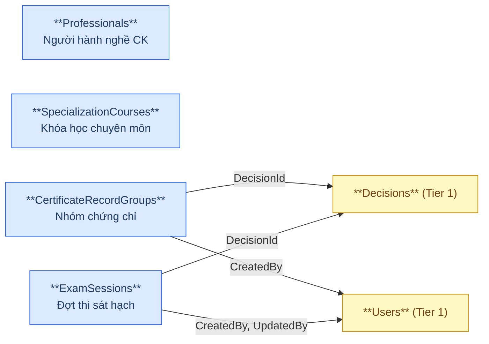
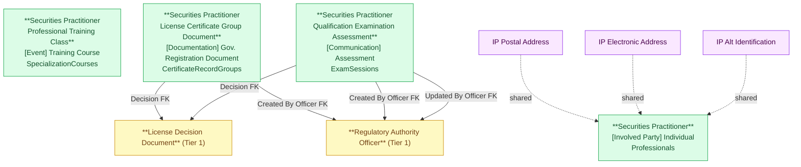

# NHNCK — HLD Tier 2: Phụ thuộc Tier 1

> **Phụ thuộc Tier 1:** Securities Practitioner License Decision Document, Regulatory Authority Officer, Securities Organization Reference
>
> **Thiết kế theo:** [NHNCK_HLD_Overview.md](NHNCK_HLD_Overview.md)

---

## 6a. Bảng tổng quan BCV Concept

| BCV Core Object | BCV Concept | Category | Source Table | Mô tả bảng nguồn | Silver Entity | BCV Term |
|---|---|---|---|---|---|---|
| Involved Party | [Involved Party] Individual | Individual | Professionals | Thông tin người hành nghề chứng khoán được UBCKNN quản lý | Securities Practitioner | Individual — *"Identifies an Involved Party who is a natural person."* Cấu trúc trường: mã người hành nghề, họ tên, ngày sinh, giới tính, quốc tịch, nơi sinh, trình độ học vấn, trạng thái hành nghề, trạng thái xác thực C06. Không FK đến bảng nghiệp vụ nào trong Tier 1 (chỉ dùng shared entities). |
| Event | [Event] Training Course | Training Course | SpecializationCourses | Danh mục khóa học chuyên môn bổ sung kiến thức cho người hành nghề | Securities Practitioner Professional Training Class | Training Course — *"Identifies an Event that is a course of instruction."* Cấu trúc trường: mã khóa học, tên khóa học, loại chuyên môn, thời gian, địa điểm, trạng thái. Master entity của khóa học — không gắn với người cụ thể. |
| Documentation | [Documentation] Gov. Registration Document | Government Registration Document | CertificateRecordGroups | Nhóm quyết định cấp/thu hồi/hủy chứng chỉ (1 quyết định có thể ảnh hưởng nhiều CCHN) | Securities Practitioner License Certificate Group Document | Government Registration Document — cấu trúc trường: tên nhóm, loại nhóm (Cấp/Thu hồi/Hủy/Chuyển đổi), FK đến Decision, FK đến Officer (CreatedBy), trạng thái nhóm. FK đến Tier 1 (Decision + Officer). |
| Communication | [Communication] Assessment | Assessment | ExamSessions | Danh mục các đợt thi sát hạch cấp CCHN do UBCKNN tổ chức | Securities Practitioner Qualification Examination Assessment | Assessment — *"Identifies a Communication that is an evaluation or appraisal."* Cấu trúc trường: Session Code/Name/Number, Examination Year/Location, Organizer Name, Registration/Examination Start/End Date, Application Source Code, Examination Status Code, FK đến Decision, FK đến Officer (CreatedBy + UpdatedBy). FK đến Tier 1 (Decision + Officer). |

---

## 6b. Diagram Source (Mermaid)

---

## 6c. Diagram Silver (Mermaid)

---

## 6d. Danh mục & Tham chiếu

Không có bảng mới nào trong Tier 2 thuộc dạng Classification Value — đã liệt kê đầy đủ ở Tier 1.

---

## 6e. Bảng chờ thiết kế

Không có bảng nào trong Tier 2 chưa đủ thông tin cột.

---

## 6f. Điểm cần xác nhận

| # | Câu hỏi | Ảnh hưởng |
|---|---|---|
| 1 | `Professionals` có FK đến bất kỳ bảng nghiệp vụ Tier 1 nào không (ngoài shared entities)? | Nếu có → phải chuyển sang Tier 3. Hiện tại thiết kế ở Tier 2 vì không thấy FK nghiệp vụ. |
| 2 | `SpecializationCourses` có FK đến bảng nào ngoài danh mục không? | Nếu có → phải điều chỉnh Tier. |

---

## Entities trong Tier 2

### 1. Securities Practitioner
**Source:** `Professionals` | **BCV Concept:** [Involved Party] Individual | **BCO:** Involved Party

**Grain:** 1 dòng = 1 người hành nghề chứng khoán được UBCKNN quản lý.

**Attributes chính:** Practitioner Code, Full Name, Date Of Birth, Individual Gender Code, Nationality Code, Birth Place, Education Level Code, Practice Status Code, C06 Verification Status Code.

**Shared entities:** IP Postal Address (PermanentAddress, CurrentAddress), IP Electronic Address (Phone, Email), IP Alt Identification (IdentityNumber — CCCD).

**Được FK từ:** License Application, License Certificate Document, Employment Status, Related Party, Conduct Violation, Organization Employment Report, Identity Verification Record, Training Class Enrollment (Tier 3), Examination Assessment Result (Tier 3).

---

### 2. Securities Practitioner Professional Training Class
**Source:** `SpecializationCourses` | **BCV Concept:** [Event] Training Course | **BCO:** Event

**Grain:** 1 dòng = 1 khóa học chuyên môn bổ sung kiến thức cho người hành nghề. Master entity — không gắn với người cụ thể.

**Attributes chính:** Training Class Code, Training Class Name, Specialization Type Code, Duration, Location, Status Code.

**Được FK từ:** Training Class Enrollment (Tier 3).

---

### 3. Securities Practitioner License Certificate Group Document
**Source:** `CertificateRecordGroups` | **BCV Concept:** [Documentation] Gov. Registration Document | **BCO:** Documentation

**Grain:** 1 dòng = 1 nhóm quyết định cấp/thu hồi/hủy chứng chỉ.

**Attributes chính:** Group Name, Group Type Code (Cấp/Thu hồi/Hủy/Chuyển đổi), License Decision Document FK (Id + Code), Created By Officer FK (Id + Code), Group Status Code.

**Được FK từ:** License Certificate Group Member (Tier 3).

---

### 4. Securities Practitioner Qualification Examination Assessment
**Source:** `ExamSessions` | **BCV Concept:** [Communication] Assessment | **BCO:** Communication

**Grain:** 1 dòng = 1 đợt thi sát hạch cấp CCHN do UBCKNN tổ chức.

**Attributes chính:** Session Code, Session Name, Session Number, Examination Year, Examination Location, Organizer Name, Registration Start/End Date, Examination Start/End Date, Application Source Code, Examination Status Code, License Decision Document FK (Id + Code), Created By Officer FK (Id + Code), Updated By Officer FK (Id + Code).

**Được FK từ:** License Application (Tier 3), Examination Assessment Result (Tier 3), Examination Assessment Fee (Tier 3).

---

## Attribute Summary

| Silver Entity | # Attributes | PK | Key FKs |
|---|---|---|---|
| Securities Practitioner | 14 | Practitioner Id | — |
| Securities Practitioner Professional Training Class | ~10 | Training Class Id | — |
| Securities Practitioner License Certificate Group Document | 13 | License Certificate Group Document Id | Decision, Officer (CreatedBy) |
| Securities Practitioner Qualification Examination Assessment | 25 | Examination Assessment Id | Decision, Officer (×2: CreatedBy + UpdatedBy) |
