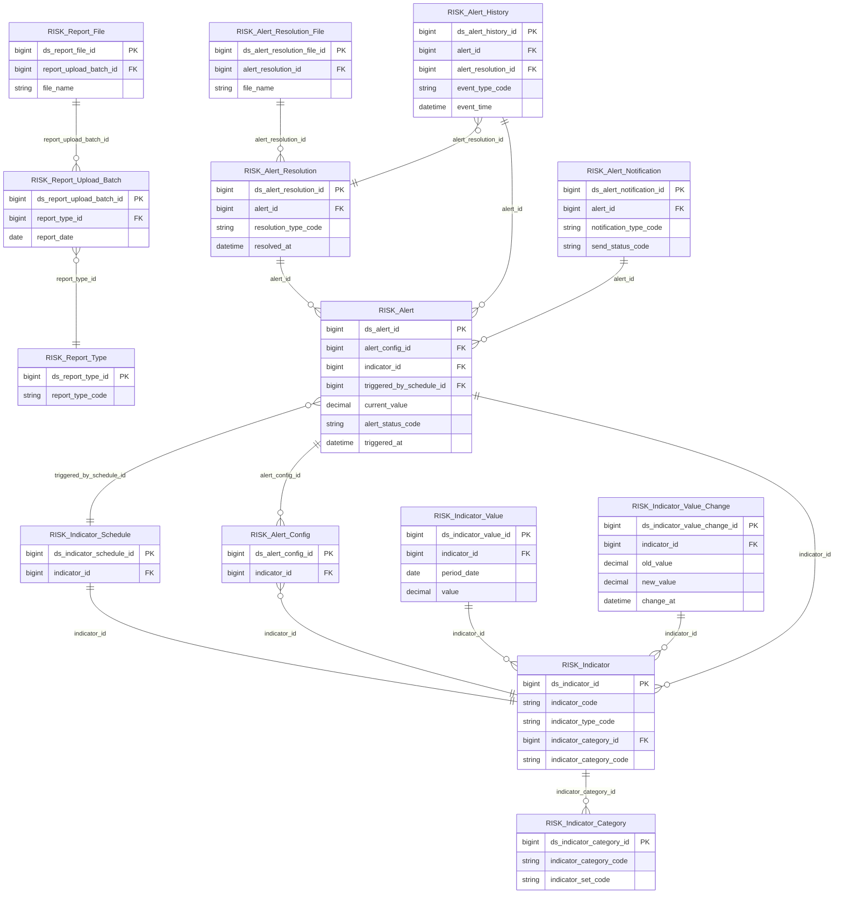

# Risk HLD — Overview

**Source system:** Risk (Quản lý Rủi ro)  
**Mô tả:** Hệ thống quản lý chỉ tiêu tài chính rủi ro (trong nước & quốc tế), cảnh báo tự động khi chỉ tiêu vượt ngưỡng, và báo cáo định kỳ của UBCKNN.

---

## 7a. Bảng tổng quan Silver Entities

| Tier | BCV Core Object | BCV Concept | Category | Source Table | Mô tả bảng nguồn | Silver Entity | table_type |
|---|---|---|---|---|---|---|---|
| 1 | Common | [Common] Classification | Common | risk_indicator_category | Nhóm chỉ tiêu trong 1 bộ (Yếu tố vĩ mô, Yếu tố tiền tệ, Thị trường cổ phiếu, …) | Risk Indicator Category | Fundamental |
| 1 | Common | [Common] Classification | Common | risk_indicator + risk_indicator_custom | Danh mục chỉ tiêu tài chính hệ thống và tự tạo (gộp 2 bảng) | Risk Indicator | Fundamental |
| 1 | Documentation | [Documentation] Regulatory Report | Documentation | risk_report_type | Danh mục loại báo cáo | Risk Report Type | Fundamental |
| 2 | Condition | [Condition] Criterion | Condition | risk_indicator_schedule | Cấu hình job đồng bộ chỉ tiêu | Risk Indicator Schedule | Fundamental |
| 2 | Condition | [Condition] Criterion | Condition | risk_alert_config | Cấu hình ngưỡng cảnh báo và người xử lý | Risk Alert Config | Fundamental |
| 2 | Business Activity | [Business Activity] | Business Activity | risk_report_upload_batch | Lượt upload file báo cáo | Risk Report Upload Batch | Fact Append |
| 3 | Transaction | [Event] Transaction | Event | risk_indicator_value | Số liệu chỉ tiêu theo từng kỳ | Risk Indicator Value | Fact Append |
| 3 | Transaction | [Event] Transaction | Event | risk_indicator_value_history | Lịch sử thay đổi số liệu chỉ tiêu | Risk Indicator Value Change | Fact Append |
| 3 | Event | [Event] | Event | risk_alert | Bản ghi cảnh báo khi chỉ tiêu vượt ngưỡng | Risk Alert | Fact Append |
| 3 | Documentation | [Documentation] Supporting Documentation | Documentation | risk_report_file | File đính kèm báo cáo | Risk Report File | Fundamental |
| 4 | Business Activity | [Business Activity] | Business Activity | risk_alert_resolution | Bản ghi xử lý cảnh báo | Risk Alert Resolution | Fact Append |
| 4 | Documentation | [Documentation] Supporting Documentation | Documentation | risk_alert_resolution_file | File đính kèm giải trình cảnh báo | Risk Alert Resolution File | Fundamental |
| 4 | Event | [Event] | Event | risk_alert_history | Lịch sử dòng thời gian cảnh báo | Risk Alert History | Fact Append |
| 4 | Communication | [Communication] Notification | Communication | risk_notification | Thông báo gửi đi từ cảnh báo | Risk Alert Notification | Fact Append |

---

## 7b. Diagram Silver tổng (Mermaid)

---

## 7c. Bảng Classification Value

| Source Field / Bảng | Mô tả | Scheme Code | source_type |
|---|---|---|---|
| risk_indicator.set_code (1=Trong nước, 2=Quốc tế) | Bộ chỉ tiêu | `RISK_INDICATOR_SET` | etl_derived |
| risk_indicator.indicator_type (derived) | Phân loại chỉ tiêu hệ thống / tự tạo | `RISK_INDICATOR_TYPE` | etl_derived |
| risk_indicator.unit_code (1=%, …10=Đơn vị tính) | Đơn vị đo lường | `RISK_UNIT` | source_table |
| risk_indicator.source_code (1=Investing, …6=VSDC) | Nguồn dữ liệu | `RISK_DATA_SOURCE` | source_table |
| risk_indicator.period_type (1=Ngày, …4=Năm) | Tần suất kỳ | `RISK_PERIOD_TYPE` | etl_derived |
| risk_indicator_value.data_origin (1=API, 2=User) | Nguồn gốc giá trị | `RISK_DATA_ORIGIN` | etl_derived |
| risk_indicator_schedule.frequency_type (1=Giờ, …5=Năm) | Tần suất job | `RISK_JOB_FREQUENCY_TYPE` | etl_derived |
| risk_indicator_schedule.last_status (SUCCESS/FAILED) | Kết quả chạy job | `RISK_JOB_RUN_STATUS` | etl_derived |
| risk_alert_config.threshold_direction (1=Tăng, 2=Giảm, 3=Tăng/Giảm) | Chiều ngưỡng cảnh báo | `RISK_ALERT_THRESHOLD_DIRECTION` | etl_derived |
| risk_indicator_value_history.change_type (SYNC/UPDATE) | Loại thay đổi giá trị | `RISK_INDICATOR_CHANGE_TYPE` | etl_derived |
| risk_alert.status (0–3) | Trạng thái cảnh báo | `RISK_ALERT_STATUS` | etl_derived |
| risk_report_file.file_type + risk_alert_resolution_file.file_type | Loại file | `RISK_FILE_TYPE` | etl_derived |
| risk_alert_resolution.resolution_type (1=Quick, 2=Detailed) | Loại xử lý cảnh báo | `RISK_ALERT_RESOLUTION_TYPE` | etl_derived |
| risk_alert_history.event_type (1–3) | Loại sự kiện cảnh báo | `RISK_ALERT_EVENT_TYPE` | etl_derived |
| risk_notification.notification_type (1=Toast, 2=Bell, 3=Email) | Kênh thông báo | `RISK_NOTIFICATION_TYPE` | etl_derived |
| risk_notification.send_status (1=SENT, 2=FAILED) | Trạng thái gửi | `RISK_NOTIFICATION_SEND_STATUS` | etl_derived |
| risk_notification.read_status (0=Chưa đọc, 1=Đã đọc) | Trạng thái đọc | `RISK_NOTIFICATION_READ_STATUS` | etl_derived |

---

## 7d. Junction Tables

*(Risk không có pure junction table)*

---

## 7e. Điểm cần xác nhận

| # | Tier | Câu hỏi | Kết quả |
|---|---|---|---|
| T1-01 | 1 | `risk_report_type.template_content` có lưu trên Silver không? | **Không lưu** — config kỹ thuật. |
| T1-02 | 1 | `risk_indicator_category.category_code` unique globally? | **Unique globally** — không cần set_code trong PK. |
| T2-01 | 2 | `risk_alert_config.handler_user_id` — có entity User riêng không? | **Không có** — lưu denormalized. |
| T2-02 | 2 | Mapping FK indicator sau gộp: indicator_type=1→indicator_id, 2→custom_indicator_id. | **Confirmed.** |
| T2-03 | 2 | Risk Report Upload Batch đặt Tier 2 phù hợp? | **Confirmed.** |
| T3-01 | 3 | **[QLRR-P01]** `risk_indicator_value` lưu cả chỉ tiêu tự tạo? | **Confirmed đúng** — indicator_id dùng chung. |
| T3-02 | 3 | `risk_alert.triggered_by_job_id` nullable khi thủ công? | **Nullable** — confirmed. |
| T3-03 | 3 | **[QLRR-P02 — Open]** `cumulative_value` — luỹ kế theo kỳ nào? | **Chưa rõ** — cần profile data trước LLD. |
| T4-01 | 4 | `risk_alert_history.resolution_id` nullable? | **Nullable** — confirmed. |
| T4-02 | 4 | `Risk Alert Resolution File` đặt Tier 4 hay Tier 5? | **Tier 4** — confirmed. |

---

## 7f. Bảng ngoài scope

| Nhóm | Source Table | Mô tả bảng nguồn | Lý do ngoài scope |
|---|---|---|---|
| Config kỹ thuật | risk_report_placeholder_config | Cấu hình mapping placeholder trong template báo cáo | Operational/system data — không có giá trị nghiệp vụ |
| Phân quyền | permission_group | Nhóm quyền | Operational/system data — không có giá trị nghiệp vụ |
| Phân quyền | permission_group_user | Phân quyền người dùng theo nhóm | Operational/system data — không có giá trị nghiệp vụ |
| Phân quyền | permission_group_indicator | Phân quyền chỉ tiêu theo nhóm | Operational/system data — không có giá trị nghiệp vụ |
