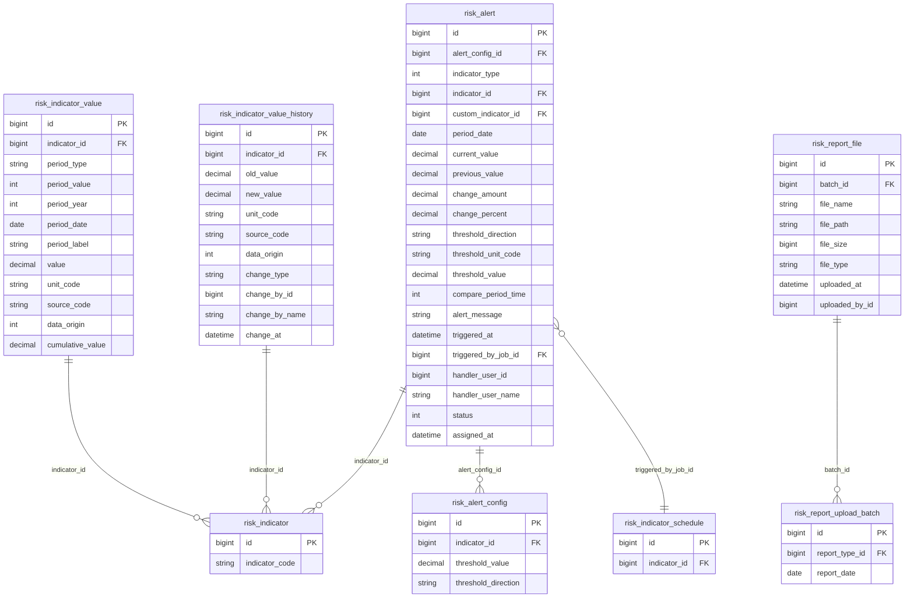
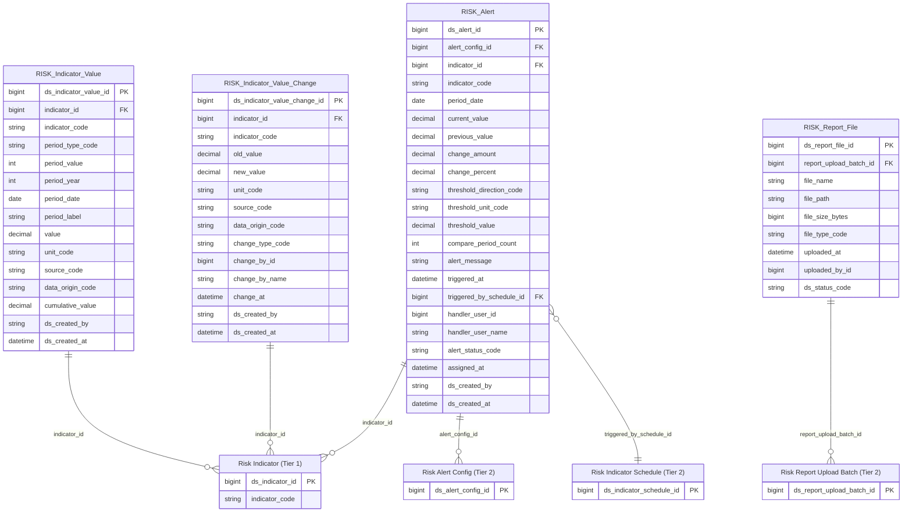

# Risk HLD — Tier 3

**Source system:** Risk (Quản lý Rủi ro)  
**Tier 3:** Entity phụ thuộc Tier 2 — FK đến Risk Alert Config, Risk Indicator Schedule, hoặc Risk Report Upload Batch.

---

## 6a. Bảng tổng quan BCV Concept

| BCV Core Object | BCV Concept | Category | Source Table | Mô tả bảng nguồn | Silver Entity | table_type | BCV Term |
|---|---|---|---|---|---|---|---|
| Transaction | [Event] Transaction | Event | risk_indicator_value | Số liệu hiện tại của chỉ tiêu theo từng kỳ (ngày/tháng/quý/năm) | Risk Indicator Value | Fact Append | BCV term gần nhất: không có "Indicator Value" cụ thể — gán [Event] Transaction vì đây là giá trị thực tế phát sinh theo kỳ, grain = chỉ tiêu × kỳ, append-only (mỗi kỳ mới = dòng mới). Cấu trúc trường: indicator_id, period_date, period_type, value, unit_code, source_code, data_origin — xác nhận đây là fact đo lường, không phải config. **Assumption QLRR-P01**: sau gộp Indicator, FK indicator_id trỏ đến cả chỉ tiêu hệ thống lẫn tự tạo. |
| Transaction | [Event] Transaction | Event | risk_indicator_value_history | Lịch sử thay đổi số liệu chỉ tiêu (tự động và thủ công) | Risk Indicator Value Change | Fact Append | Tương tự Indicator Value nhưng ghi nhận từng lần thay đổi (old_value, new_value, change_type=SYNC/UPDATE, change_by). Grain = 1 lần thay đổi. Append-only. BCV: [Event] Transaction phù hợp — mỗi dòng = 1 sự kiện thay đổi dữ liệu có timestamp. **Lưu ý**: đây không phải Audit Log nguồn dạng generic (FieldName+OldValue) vì bảng có cột tường minh old_value/new_value cố định cho 1 loại dữ liệu (giá trị chỉ tiêu). |
| Event | [Event] | Event | risk_alert | Bản ghi cảnh báo thực tế được kích hoạt khi chỉ tiêu vượt ngưỡng | Risk Alert | Fact Append | BCV term **Event**: sự kiện phát sinh thực tế. risk_alert là bản ghi cảnh báo được kích hoạt (triggered_at, current_value, change_percent, alert_message). Grain = 1 lần cảnh báo. Append-only (mỗi lần chỉ tiêu vượt ngưỡng = 1 dòng mới). FK → Risk Alert Config (Tier 2) + Risk Indicator (Tier 1). |
| Documentation | [Documentation] Supporting Documentation | Documentation | risk_report_file | File đính kèm báo cáo | Risk Report File | Fundamental | BCV term **Supporting Documentation**: file tài liệu đính kèm. Bảng risk_report_file lưu metadata file (file_name, file_path, file_size, file_type, uploaded_at). FK → Risk Report Upload Batch (Tier 2). Grain: 1 dòng = 1 file. table_type = Fundamental vì file có lifecycle riêng (có thể bị xóa soft). |

---

## 6b. Diagram Source (Mermaid)

---

## 6c. Diagram Silver (Mermaid)

---

## 6d. Danh mục & Tham chiếu (Reference Data)

| Source Field | Mô tả | Scheme Code | source_type |
|---|---|---|---|
| risk_indicator_value_history.change_type (SYNC / UPDATE) | Loại thay đổi giá trị chỉ tiêu | `RISK_INDICATOR_CHANGE_TYPE` | etl_derived |
| risk_alert.status (0=Chưa xử lý, 1=Đang xử lý, 2=Đã xử lý, 3=Đã huỷ) | Trạng thái cảnh báo | `RISK_ALERT_STATUS` | etl_derived |
| risk_report_file.file_type (DOCX / XLSX / PDF / …) | Loại file báo cáo | `RISK_FILE_TYPE` | etl_derived |

---

## 6e. Bảng chờ thiết kế

*(Không có bảng nào trong Tier 3 chưa có cấu trúc trường)*

---

## 6f. Điểm cần xác nhận

| # | Câu hỏi | Kết quả |
|---|---|---|
| T3-01 | **[QLRR-P01]** `risk_indicator_value.indicator_id` có lưu cả chỉ tiêu tự tạo không? | **Confirmed đúng** — indicator_id lưu FK cho cả hệ thống lẫn tự tạo. |
| T3-02 | `risk_alert.triggered_by_job_id` nullable khi alert thủ công? | **Nullable** — FK triggered_by_schedule_id nullable trên Silver. |
| T3-03 | **[QLRR-P02 — Open]** `cumulative_value` — luỹ kế từ đầu năm hay từ đầu kỳ nào? | **Chưa rõ** — cần profile data trước khi finalize LLD. |
