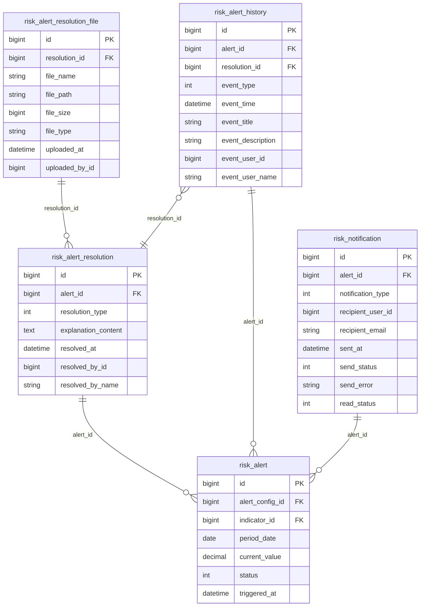
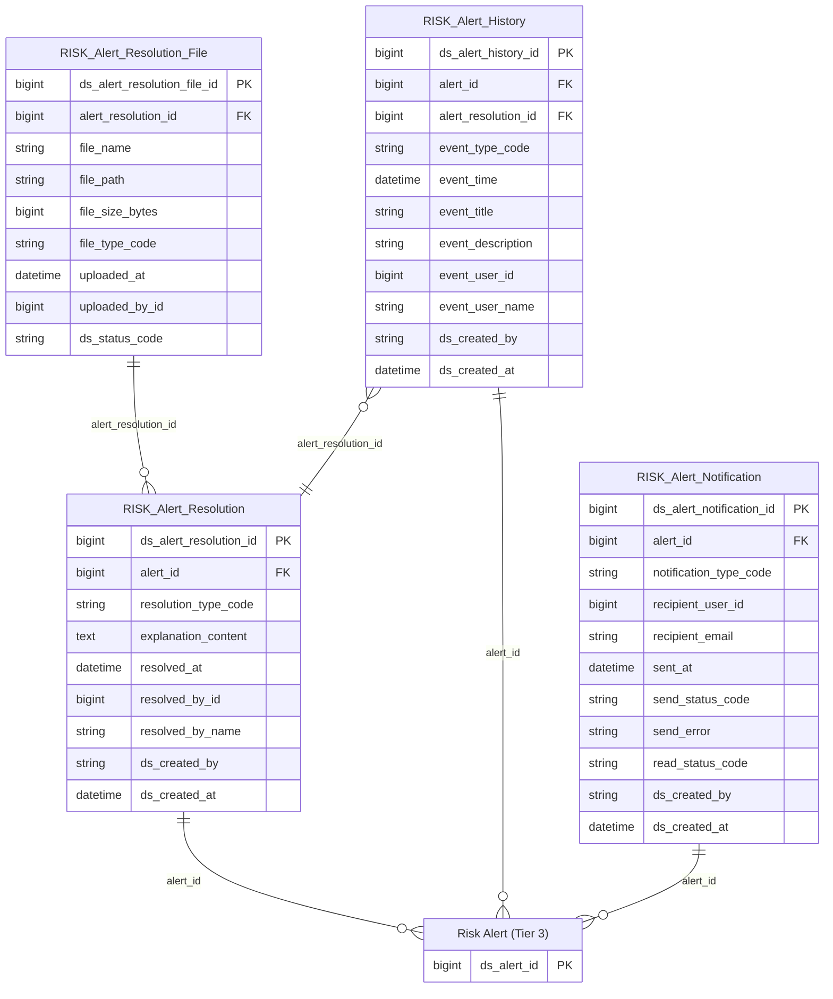

# Risk HLD — Tier 4

**Source system:** Risk (Quản lý Rủi ro)  
**Tier 4:** Entity phụ thuộc Tier 3 — FK đến Risk Alert.

---

## 6a. Bảng tổng quan BCV Concept

| BCV Core Object | BCV Concept | Category | Source Table | Mô tả bảng nguồn | Silver Entity | table_type | BCV Term |
|---|---|---|---|---|---|---|---|
| Business Activity | [Business Activity] | Business Activity | risk_alert_resolution | Bản ghi xử lý chi tiết cho cảnh báo | Risk Alert Resolution | Fact Append | BCV term gần nhất: Business Activity — hành động xử lý nghiệp vụ (resolved_at, resolved_by_id, resolution_type, explanation_content). Grain: 1 dòng = 1 lần xử lý cảnh báo (1 alert có thể có nhiều resolution nếu được mở lại). Append-only. FK → Risk Alert (Tier 3). |
| Event | [Event] | Event | risk_alert_history | Lịch sử xử lý cảnh báo theo dòng thời gian | Risk Alert History | Fact Append | BCV term **Event**: dòng thời gian sự kiện trong vòng đời cảnh báo (event_type, event_time, event_title, event_description, event_user_id). Grain: 1 dòng = 1 sự kiện (phát sinh / xử lý không giải trình / xử lý có giải trình). Append-only. FK → Risk Alert (Tier 3). Đây không phải Audit Log nguồn generic — mỗi dòng là 1 sự kiện nghiệp vụ cụ thể với cột tường minh. |
| Communication | [Communication] Notification | Communication | risk_notification | Lưu trữ thông báo gửi đi | Risk Alert Notification | Fact Append | BCV term **Notification** (ID 8536): "Identifies a Communication whose purpose is to convey information." Bảng risk_notification lưu thông báo gửi từng kênh (Toast/Bell/Email), recipient, sent_at, send_status, read_status. Grain: 1 dòng = 1 thông báo gửi 1 người. Append-only. FK → Risk Alert (Tier 3). |

---

## 6b. Diagram Source (Mermaid)

---

## 6c. Diagram Silver (Mermaid)

---

## 6d. Danh mục & Tham chiếu (Reference Data)

| Source Field | Mô tả | Scheme Code | source_type |
|---|---|---|---|
| risk_alert_resolution.resolution_type (1=Quick, 2=Detailed) | Loại xử lý cảnh báo | `RISK_ALERT_RESOLUTION_TYPE` | etl_derived |
| risk_alert_history.event_type (1=Xảy ra cảnh báo, 2=Xử lý không giải trình, 3=Xử lý có giải trình) | Loại sự kiện trong vòng đời cảnh báo | `RISK_ALERT_EVENT_TYPE` | etl_derived |
| risk_notification.notification_type (1=Toast, 2=Bell, 3=Email) | Kênh thông báo | `RISK_NOTIFICATION_TYPE` | etl_derived |
| risk_notification.send_status (1=SENT, 2=FAILED) | Trạng thái gửi thông báo | `RISK_NOTIFICATION_SEND_STATUS` | etl_derived |
| risk_notification.read_status (0=Chưa đọc, 1=Đã đọc) | Trạng thái đọc thông báo | `RISK_NOTIFICATION_READ_STATUS` | etl_derived |
| risk_alert_resolution_file.file_type | Loại file đính kèm giải trình | *(dùng chung RISK_FILE_TYPE từ Tier 3)* | etl_derived |

---

## 6e. Bảng ngoài scope

*(Tier 4 không có bảng nào ngoài scope — risk_alert_resolution_file đưa vào Silver vì có giá trị lưu trữ tài liệu nghiệp vụ)*

---

## 6f. Điểm cần xác nhận

*(Tất cả điểm cần xác nhận Tier 4 đã được chốt.)*

| # | Câu hỏi | Kết quả |
|---|---|---|
| T4-01 | `risk_alert_history.resolution_id` nullable? | **Nullable** — event_type=1 chưa có resolution. Ghi rõ trong LLD. |
| T4-02 | `Risk Alert Resolution File` đặt Tier 4 hay Tier 5? | **Tier 4** — confirmed gộp vào file Tier 4 này. |
