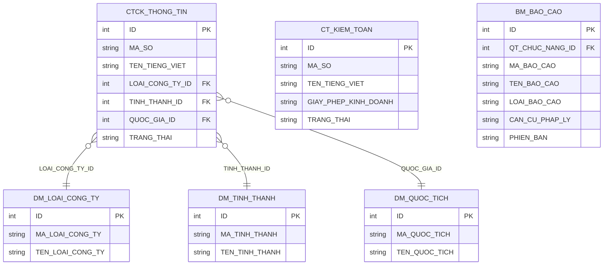
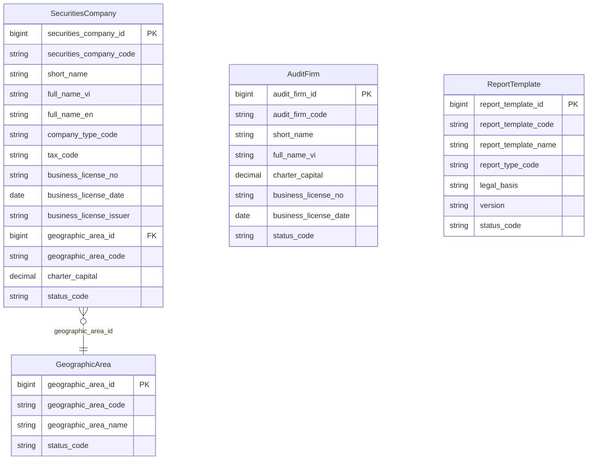

# SCMS HLD — Tier 1: Main Entities

**Source system:** SCMS (Hệ thống quản lý Công ty Chứng khoán — Securities Company Management System)  
**Phạm vi Tier 1:** Các entity độc lập, không FK đến entity nghiệp vụ khác trong scope — chỉ FK đến danh mục.

---

## 6a. Bảng tổng quan BCV Concept

| BCV Core Object | BCV Concept | Category | Source Table | Mô tả bảng nguồn | Silver Entity | BCV Term |
|---|---|---|---|---|---|---|
| Involved Party | [Involved Party] Broker Dealer | Involved Party | CTCK_THONG_TIN | Thông tin CTCK | Securities Company | **Term candidate:** `Broker Dealer` — mô tả tổ chức được cấp phép mua bán chứng khoán cho khách hàng hưởng hoa hồng. **Cấu trúc trường:** MA_SO, TEN_TIENG_VIET, VON_DIEU_LE, GIAY_PHEP_KINH_DOANH, NGAY_CAP_GPKD, LOAI_CONG_TY_ID — đây là hồ sơ pháp lý của một công ty chứng khoán được UBCK giám sát, có đầy đủ instance data (mã, tên, vốn, giấy phép, trạng thái). **Lý do chọn:** Broker Dealer là term BCV chính xác nhất — CTCK là tổ chức trung gian mua bán chứng khoán. Entity đã tồn tại trong silver_entities.csv từ source FIMS với status=approved, tên = `Securities Company`. Dùng đúng tên đã approved. |
| Involved Party | [Involved Party] Organization | Involved Party | CT_KIEM_TOAN | Danh sách công ty kiểm toán | Audit Firm | **Term candidate:** `Organization` (BCV: tổ chức pháp nhân) — không có term BCV cụ thể hơn cho công ty kiểm toán trong ngữ cảnh giám sát tài chính. **Cấu trúc trường:** MA_SO, TEN_VIET_TAT, TEN_TIENG_VIET, VON_DIEU_LE, GIAY_PHEP_KINH_DOANH, NGAY_CAP_GPKD — hồ sơ tổ chức có lifecycle riêng. Không có inbound FK từ bảng nghiệp vụ khác → entity Tier 1. **Lý do chọn:** Organization — CT_KIEM_TOAN là pháp nhân tổ chức, được UBCK chấp thuận kiểm toán CTCK. |
| Documentation | [Documentation] Regulatory Report | Documentation | BM_BAO_CAO | Danh sách biểu mẫu báo cáo | Report Template | **Term candidate:** `Reported Information` — thông tin được biên soạn và truyền đi bởi một Involved Party. Tuy nhiên, `BM_BAO_CAO` không phải báo cáo cụ thể — đây là *khuôn mẫu* (template) quy định cấu trúc báo cáo. **Cấu trúc trường:** MA_BAO_CAO, TEN_BAO_CAO, LOAI_BAO_CAO (đầu vào/đầu ra), CAN_CU_PHAP_LY, PHIEN_BAN — đây là định nghĩa biểu mẫu có căn cứ pháp lý và vòng đời phiên bản. Entity `Report Template` đã tồn tại trong silver_entities.csv với status=approved từ source FIMS. **Lý do chọn:** Dùng đúng tên đã approved — `Report Template`. BCV concept = `[Documentation] Regulatory Report`. |
| Location | [Location] Geographic Area | Location | DM_TINH_THANH, DM_QUOC_TICH | Danh mục tỉnh thành và quốc gia | Geographic Area | **Shared entity** đã approved từ FIMS.NATIONAL. Hai bảng SCMS bổ sung thêm source_table. **DM_TINH_THANH** (tỉnh/thành) → `geographic_area_type_code = PROVINCE`. **DM_QUOC_TICH** (quốc gia) → `geographic_area_type_code = COUNTRY`. Phân biệt bằng `GEOGRAPHIC_AREA_TYPE` Classification Value. |
| Involved Party | [Involved Party] Organization Unit | Involved Party | CTCK_VP_DAI_DIEN_NN | Văn phòng đại diện của công ty nước ngoài tại VN | Foreign Representative Office | **Cấu trúc trường:** TEN_CONG_TY_ME, GIAY_PHEP_KINH_DOANH, TEN_VAN_PHONG_DAI_DIEN, DIA_CHI_VAN_PHONG, TRUONG_DAI_DIEN, QUOC_TICH_ID — không có FK đến CTCK_THONG_TIN. Đây là pháp nhân nước ngoài có VP tại VN, **khác hoàn toàn** với VPĐD trong nước (trực thuộc CTCK). **Lý do chọn:** Entity độc lập → Tier 1. BCV concept = [Involved Party] Organization Unit. |

---

## 6b. Diagram Source (Mermaid)

---

## 6c. Diagram Silver (Mermaid)

---

## 6d. Danh mục & Tham chiếu (Reference Data)

| Source Table | Mô tả | BCV Term | Xử lý Silver | Scheme Code |
|---|---|---|---|---|
| DM_LOAI_CONG_TY | Danh mục loại công ty | Classification Value | Load vào Classification Value — chỉ có Code + Name, không có instance data nghiệp vụ | `SCMS_COMPANY_TYPE` |
| DM_QUOC_TICH | Danh mục quốc tịch | [Location] Geographic Area | → **Silver entity `Geographic Area`** (shared, status=approved). Bổ sung source_table. Type = `COUNTRY`. FK inbound: CTCK_CO_DONG, CTCK_NHAN_SU_CAO_CAP, CTCK_THONG_TIN, CTCK_VP_DAI_DIEN_NN. | — |
| DM_DICH_VU | Danh mục dịch vụ CTCK | Classification Value | Load vào Classification Value — Code + Name + GHI_CHU | `SCMS_SERVICE_TYPE` |
| DM_CHUC_VU | Danh mục chức vụ | Classification Value | Load vào Classification Value — dùng cho CTCK_NHAN_SU_CAO_CAP | `SCMS_POSITION_TYPE` |
| DM_MOI_QUAN_HE | Danh mục mối quan hệ cổ đông | Classification Value | Load vào Classification Value | `SCMS_SHAREHOLDER_RELATION_TYPE` |
| DM_NGANH_NGHE_KD | Danh mục ngành nghề kinh doanh | Classification Value | Load vào Classification Value | `SCMS_BUSINESS_SECTOR` |
| DM_LOAI_GIAO_DICH_CD | Danh mục loại giao dịch cổ đông | Classification Value | Load vào Classification Value | `SCMS_SHAREHOLDER_TXN_TYPE` |
| DM_LOAI_VI_PHAM | Danh mục loại vi phạm | Classification Value | Load vào Classification Value | `SCMS_VIOLATION_TYPE` |
| DM_CANH_BAO | Danh sách cảnh báo báo cáo | — | **Ngoài scope Silver.** Bảng định nghĩa rule nhập liệu hệ thống (CONG_THUC, DIEU_KIEN, CAP_DO) — không phải dữ liệu đã được nhập liệu/upload. Chỉ `BC_CANH_BAO` (kết quả cảnh báo thực tế) mới lên Silver. | — |
| DM_TRANG_THAI_CTCK | Danh mục trạng thái CTCK | Classification Value | Load vào Classification Value — có thêm flag IS_GUI_BAO_CAO, IS_CONG_BO_THONG_TIN | `SCMS_COMPANY_STATUS` |
| DM_SU_VU | Danh mục sự vụ | Classification Value | Load vào Classification Value | `SCMS_INCIDENT_TYPE` |
| DM_CHI_TIEU | Danh mục chỉ tiêu báo cáo | — | Có FK inbound từ BM_BAO_CAO_CT, BC_BAO_CAO_GT. Không phải classification value thuần túy — **thiết kế ở Tier 2 cùng nhóm BM_BAO_CAO.** | — |
| DM_CHI_TIEU_DM | Danh mục nhóm chỉ tiêu | Classification Value | Load vào Classification Value — chỉ có tên nhóm và thông tin hiển thị | `SCMS_INDICATOR_GROUP` |
| DM_THONG_KE | Danh mục mã thống kê | Classification Value | Load vào Classification Value — Code + Name + tên bảng/trường tham chiếu | `SCMS_STATISTICAL_CODE` |

---

## 6e. Bảng chờ thiết kế

*(Tier 1 không có bảng nào thiếu cấu trúc trường)*

---

## 6f. Điểm cần xác nhận

| # | Câu hỏi | Trạng thái | Quyết định |
|---|---|---|---|
| 1 | `DM_CANH_BAO` — Silver entity hay Classification Value? | ✅ Đã quyết định | Ngoài scope Silver. Đây là rule nhập liệu hệ thống, không phải dữ liệu được nhập. Chỉ `BC_CANH_BAO` (kết quả thực tế) mới lên Silver. |
| 2 | `CTCK_THONG_TIN.CTCK_THONG_TIN_ID` — business key hay FK cha? | ✅ Đã quyết định | Là Business Key (BK) — mã nghiệp vụ dùng trong liên hệ với hệ thống khác. Map thành `securities_company_bk` trên Silver. |
| 3 | `CT_KIEM_TOAN` — có entity liên kết ở Tier 2/3 không? | ⚠️ Note | Vẫn thiết kế entity. FK inbound hiện chỉ từ CT_KIEM_TOAN_VIEN. Yêu cầu liên kết CTCK→CT_KIEM_TOAN sẽ bổ sung sau. |
| 4 | `BM_BAO_CAO` và FIMS.RPTTEMP — cùng entity hay extend? | ✅ Đã quyết định | Cùng là mẫu báo cáo, phục vụ nguồn khác nhau → bổ sung `SCMS.BM_BAO_CAO` vào source_table của entity `Report Template` đã approved. Không extend attribute. |
| 5 | `CTCK_DICH_VU` — denormalize vào `Securities Company` hay tách entity con? | ✅ Đã quyết định | Tách entity con **`Securities Company Service Registration`** (Tier 2). Lý do: có metadata đăng ký đầy đủ (TRANG_THAI, NGAY_DANG_KY, NGAY_KET_THUC, SO_VB_DANG_KY) — không phải pure junction như `LK_CTCK_NGANH_NGHE_KD`. Scheme: `SCMS_SERVICE_TYPE` (loại dịch vụ), `SCMS_SERVICE_STATUS` (trạng thái). LLD: `attr_SCMS_CTCK_DICH_VU.csv`. |

---

## Bảng ngoài scope (Tier 1)

| Nhóm | Source Table | Mô tả bảng nguồn | Lý do ngoài scope |
|---|---|---|---|
| Operational/system | QT_NGUOI_DUNG | Danh sách người dùng hệ thống | Operational/system data — quản lý tài khoản đăng nhập hệ thống SCMS, không có giá trị nghiệp vụ |
| Operational/system | QT_NHOM_NGUOI_DUNG | Danh sách nhóm người dùng | Operational/system data — không có giá trị nghiệp vụ |
| Operational/system | QT_CHUC_NANG | Danh mục chức năng hệ thống | Operational/system data — không có giá trị nghiệp vụ |
| Operational/system | QT_LICH_HE_THONG | Thông tin lịch hệ thống | Operational/system data — không có giá trị nghiệp vụ |
| Operational/system | QT_LOG_HE_THONG | Danh sách log hệ thống | Operational/system data — không có giá trị nghiệp vụ |
| Operational/system | QT_NGUOI_DUNG_IP | Thông tin quản lý IP đăng ký | Operational/system data — không có giá trị nghiệp vụ |
| Operational/system | QT_THAM_SO_HE_THONG | Quản trị cấu hình tham số hệ thống | Operational/system data — không có giá trị nghiệp vụ |
| Operational/system | LK_CHUC_NANG_NGUOI | Liên kết người dùng chức năng | Operational/system data — không có giá trị nghiệp vụ |
| Operational/system | LK_CHUC_NANG_NHOM_NGUOI | Liên kết nhóm người dùng chức năng | Operational/system data — không có giá trị nghiệp vụ |
| Operational/system | LK_NGUOI_DUNG_BAO_CAO | Liên kết phân quyền khai thác báo cáo | Operational/system data — không có giá trị nghiệp vụ |
| Operational/system | LK_NGUOI_DUNG_CTCK | Liên kết phân quyền cán bộ quản trị CTCK | Operational/system data — không có giá trị nghiệp vụ |
| Operational/system | LK_NGUOI_DUNG_NHOM | Liên kết người dùng nhóm người dùng | Operational/system data — không có giá trị nghiệp vụ |
| Operational/system | CHUNG_THU_SO | Danh sách chứng thư số được quản lý | Operational/system data — dữ liệu chứng thư số phục vụ xác thực hệ thống SCMS, không phải entity nghiệp vụ |
