# SCMS HLD — Tier 2: Phụ thuộc Tier 1

**Source system:** SCMS  
**Phạm vi Tier 2:** Các entity có FK trực tiếp đến entity Tier 1 (Securities Company, Report Template, Audit Firm).

---

## 6a. Bảng tổng quan BCV Concept

| BCV Core Object | BCV Concept | Category | Source Table | Mô tả bảng nguồn | Silver Entity | BCV Term |
|---|---|---|---|---|---|---|
| Involved Party | [Involved Party] Organization Unit | Involved Party | CTCK_CHI_NHANH | Danh sách chi nhánh | Securities Company Organization Unit | **Term candidate:** `Organization Unit` — đơn vị tổ chức trực thuộc pháp nhân. **Cấu trúc trường:** TEN_DAY_DU, DIA_CHI, TINH_THANH_ID, DIEN_THOAI, FAX, SO_QUYET_DINH, GIAM_DOC, TRANG_THAI_CHI_NHANH — instance data của một chi nhánh có địa chỉ và người đại diện. **Lý do chọn:** Organization Unit khớp với BCV. Bảng CTCK_CHI_NHANH, CTCK_VP_DAI_DIEN, CTCK_PHONG_GIAO_DICH đều là các đơn vị trực thuộc CTCK → **gộp thành 1 entity** dùng Classification Value phân biệt loại (chi nhánh / VPĐD / PGD). Tên entity dùng BCV term chung thay vì tên loại cụ thể. |
| Involved Party | [Involved Party] Organization Unit | Involved Party | CTCK_VP_DAI_DIEN | Danh sách văn phòng đại diện | Securities Company Organization Unit | Gộp vào `Securities Company Organization Unit` — xem ô trên. Phân biệt qua Classification Value `SCMS_ORG_UNIT_TYPE` = `REPRESENTATIVE_OFFICE`. |
| Involved Party | [Involved Party] Organization Unit | Involved Party | CTCK_PHONG_GIAO_DICH | Danh sách phòng giao dịch | Securities Company Organization Unit | Gộp vào `Securities Company Organization Unit` — phân biệt qua `SCMS_ORG_UNIT_TYPE` = `TRANSACTION_OFFICE`. FK đến CTCK_CHI_NHANH → cần cặp parent_org_unit_id + parent_org_unit_code. |
| Involved Party | [Involved Party] Individual | Involved Party | CTCK_NGUOI_HANH_NGHE_CK | Danh sách người hành nghề chứng khoán | Securities Practitioner | **Term candidate:** Individual (BCV) — người có tên, ngày sinh, số giấy tờ, thông tin hành nghề. **Cấu trúc trường:** MA_NHAN_VIEN, HO_TEN, NGAY_SINH, SO_GIAY_TO, SO_CHUNG_CHI_HNCK, NGAY_BAT_DAU_LAM, NGAY_NGHI_VIEC — đây là hồ sơ cá nhân hành nghề chứng khoán. **Lý do chọn:** Entity `Securities Practitioner` đã tồn tại trong silver_entities.csv (status=approved từ source NHNCK). Bổ sung source_table = SCMS.CTCK_NGUOI_HANH_NGHE_CK vào dòng hiện có. |
| Involved Party | [Involved Party] Individual | Involved Party | CTCK_NHAN_SU_CAO_CAP | Danh sách nhân sự cao cấp | Securities Company Senior Personnel | **Term candidate:** Individual — cá nhân đảm nhận vị trí lãnh đạo trong CTCK. **Cấu trúc trường:** HO_TEN, GIOI_TINH, TRANG_THAI_NHAN_SU, DIA_CHI, SO_CMND, NGAY_SINH, CHUC_VU_ID, EMAIL, NGAY_THOI_VIEC — hồ sơ cá nhân có lifecycle (bổ nhiệm/thôi việc). Đây không phải người hành nghề CK → tách thành entity riêng. **Lý do chọn:** [Involved Party] Individual, tên entity = `Securities Company Senior Personnel`. |
| Involved Party | [Involved Party] Individual | Involved Party | CTCK_CO_DONG | Danh sách cổ đông | Securities Company Shareholder | **Term candidate:** Individual hoặc Organization — cổ đông có thể là cá nhân (IS_CA_NHAN=1) hoặc tổ chức (IS_CA_NHAN=0). **Cấu trúc trường:** TEN_CO_DONG, IS_CA_NHAN, NGAY_SINH, SO_CMND, QUOC_TICH_ID, SO_LUONG_NAM_GIU, TY_LE_NAM_GIU — instance data sở hữu cổ phần trong CTCK. Grain = 1 cổ đông. **Lý do chọn:** [Involved Party] Individual/Organization — dùng common entity `Securities Company Shareholder`. |
| Involved Party | [Involved Party] Individual | Involved Party | CT_KIEM_TOAN_VIEN | Danh sách kiểm toán viên | Audit Firm Practitioner | **Term candidate:** Individual — người hành nghề kiểm toán có số chứng chỉ, ngày cấp. **Cấu trúc trường:** HO_TEN, SO_CHUNG_CHI, NGAY_CAP, NGAY_CHAP_THUAN, NGAY_HUY_CHAP_THUAN — cá nhân với lifecycle chứng chỉ. **Lý do chọn:** [Involved Party] Individual, entity = `Audit Firm Practitioner`. |
| Documentation | [Documentation] Regulatory Report | Documentation | BM_SHEET | Danh sách sheet của biểu mẫu báo cáo | Report Template Sheet | **Term candidate:** `Reported Information` — thành phần của báo cáo. **Cấu trúc trường:** MA_SHEET, TEN_SHEET, KIEU_BAO_CAO (hàng cột/hàng/cột), TONG_SO_HANG_TIEU_DE — định nghĩa cấu trúc layout của 1 sheet trong biểu mẫu. Đây là entity con của Report Template. **Lý do chọn:** [Documentation] Regulatory Report (component). Entity = `Report Template Sheet`. Tên chứa "Report Template" để thỏa quy tắc entity con. |
| Documentation | [Documentation] Regulatory Report | Documentation | BM_BAO_CAO_HANG | Danh sách hàng của biểu mẫu báo cáo | Report Template Row | **Cấu trúc trường:** MA_HANG, TEN_HANG, SAP_XEP, LAP (lặp/không lặp) — định nghĩa hàng trong sheet. Entity con của Report Template Sheet. **Lý do chọn:** [Documentation] Regulatory Report (component). Entity = `Report Template Row`. |
| Documentation | [Documentation] Regulatory Report | Documentation | BM_BAO_CAO_COT | Danh sách cột của biểu mẫu báo cáo | Report Template Column | **Cấu trúc trường:** MA_COT, TEN_COT, KHOA_CHINH (là key hay không) — định nghĩa cột trong sheet. Entity con của Report Template Sheet. **Lý do chọn:** [Documentation] Regulatory Report (component). Entity = `Report Template Column`. |
| Condition | [Condition] | Condition | BM_BAO_CAO_DINH_KY | Danh sách định kỳ gửi của biểu mẫu báo cáo | Report Submission Schedule | **Term candidate:** `Condition` — quy định về chu kỳ và thời hạn nộp báo cáo (điều kiện bắt buộc). **Cấu trúc trường:** KY_BAO_CAO, T (khoảng gia hạn), THOI_GIAN — đây là điều kiện/quy định về tần suất báo cáo áp dụng cho biểu mẫu. **Lý do chọn:** [Condition] — quy định điều kiện nộp, không phải sự kiện nộp thực tế. Entity = `Report Submission Schedule`. |
| Documentation | [Documentation] Regulatory Report | Documentation | BM_BAO_CAO_TV | Danh sách đơn vị có nghĩa vụ gửi báo cáo theo biểu mẫu | — | **Cấu trúc trường:** BM_BAO_CAO_ID, CTCK_THONG_TIN_ID, NGAY_CAP_NHAT, SU_DUNG — 2 FK nghiệp vụ (Report Template + Securities Company) + field kỹ thuật. Là **pure junction table** giữa Report Template và Securities Company. **Xử lý:** Denormalize thành `ARRAY<STRUCT<securities_company_id BIGINT, securities_company_code STRING>>` trên entity `Report Template`. |
| Documentation | [Documentation] Regulatory Report | Documentation | DM_CHI_TIEU | Danh mục chỉ tiêu báo cáo | Report Indicator | **Term candidate:** `Reported Information` — chỉ tiêu là đơn vị đo lường trong báo cáo. **Cấu trúc trường:** MA_CHI_TIEU, TEN_CHI_TIEU, MA_PHAN_CAP, KIEU_DU_LIEU (danh mục/công thức/số/ký tự/ngày), LAP, CACH_TINH — có cấu trúc phân cấp và kiểu dữ liệu, không phải danh mục Code+Name đơn giản. FK inbound từ BM_BAO_CAO_CT và BC_BAO_CAO_GT. **Lý do chọn:** Silver entity riêng = `Report Indicator`. |

---

## 6b. Diagram Source (Mermaid)

```mermaid
erDiagram
    CTCK_THONG_TIN {
        int ID PK
    }
    CT_KIEM_TOAN {
        int ID PK
    }
    BM_BAO_CAO {
        int ID PK
    }

    CTCK_CHI_NHANH {
        int ID PK
        int CTCK_THONG_TIN_ID FK
        int TINH_THANH_ID FK
        string TRANG_THAI_CHI_NHANH
    }
    CTCK_VP_DAI_DIEN {
        int ID PK
        int CTCK_THONG_TIN_ID FK
        int CTCK_CHI_NHANH_ID FK
        int TINH_THANH_ID FK
    }
    CTCK_PHONG_GIAO_DICH {
        int ID PK
        int CTCK_THONG_TIN_ID FK
        int CTCK_CHI_NHANH_ID FK
        int TINH_THANH_ID FK
    }
    CTCK_NGUOI_HANH_NGHE_CK {
        int ID PK
        int CTCK_THONG_TIN_ID FK
    }
    CTCK_NHAN_SU_CAO_CAP {
        int ID PK
        int CTCK_THONG_TIN_ID FK
        int CTCK_CHI_NHANH_ID FK
        int DM_QUOC_TICH_ID FK
        int CHUC_VU_ID FK
    }
    CTCK_CO_DONG {
        int ID PK
        int CTCK_THONG_TIN_ID FK
        int QUOC_TICH_ID FK
    }
    CT_KIEM_TOAN_VIEN {
        int ID PK
        int CT_KIEM_TOAN_ID FK
    }
    BM_SHEET {
        int ID PK
        int BM_BAO_CAO_ID FK
    }
    BM_BAO_CAO_HANG {
        int ID PK
        int BM_BAO_CAO_ID FK
        int BM_SHEET_ID FK
    }
    BM_BAO_CAO_COT {
        int ID PK
        int BM_BAO_CAO_ID FK
        int BM_SHEET_ID FK
    }
    BM_BAO_CAO_DINH_KY {
        int ID PK
        int BM_BAO_CAO_ID FK
    }
    BM_BAO_CAO_TV {
        int ID PK
        int BM_BAO_CAO_ID FK
        int CTCK_THONG_TIN_ID FK
    }
    DM_CHI_TIEU {
        int ID PK
        int DM_CHI_TIEU_DM_ID FK
    }

    CTCK_CHI_NHANH }o--|| CTCK_THONG_TIN : "CTCK_THONG_TIN_ID"
    CTCK_VP_DAI_DIEN }o--|| CTCK_THONG_TIN : "CTCK_THONG_TIN_ID"
    CTCK_PHONG_GIAO_DICH }o--|| CTCK_THONG_TIN : "CTCK_THONG_TIN_ID"
    CTCK_NGUOI_HANH_NGHE_CK }o--|| CTCK_THONG_TIN : "CTCK_THONG_TIN_ID"
    CTCK_NHAN_SU_CAO_CAP }o--|| CTCK_THONG_TIN : "CTCK_THONG_TIN_ID"
    CTCK_CO_DONG }o--|| CTCK_THONG_TIN : "CTCK_THONG_TIN_ID"
    CT_KIEM_TOAN_VIEN }o--|| CT_KIEM_TOAN : "CT_KIEM_TOAN_ID"
    BM_SHEET }o--|| BM_BAO_CAO : "BM_BAO_CAO_ID"
    BM_BAO_CAO_HANG }o--|| BM_BAO_CAO : "BM_BAO_CAO_ID"
    BM_BAO_CAO_HANG }o--|| BM_SHEET : "BM_SHEET_ID"
    BM_BAO_CAO_COT }o--|| BM_BAO_CAO : "BM_BAO_CAO_ID"
    BM_BAO_CAO_COT }o--|| BM_SHEET : "BM_SHEET_ID"
    BM_BAO_CAO_DINH_KY }o--|| BM_BAO_CAO : "BM_BAO_CAO_ID"
    BM_BAO_CAO_TV }o--|| BM_BAO_CAO : "BM_BAO_CAO_ID"
    BM_BAO_CAO_TV }o--|| CTCK_THONG_TIN : "CTCK_THONG_TIN_ID"
```

---

## 6c. Diagram Silver (Mermaid)

```mermaid
erDiagram
    SecuritiesCompany["SecuritiesCompany [Tier 1]"] {
        bigint securities_company_id PK
    }
    AuditFirm["AuditFirm [Tier 1]"] {
        bigint audit_firm_id PK
    }
    ReportTemplate["ReportTemplate [Tier 1]"] {
        bigint report_template_id PK
    }
    GeographicArea["GeographicArea [Tier 1]"] {
        bigint geographic_area_id PK
    }

    SecuritiesCompanyOrganizationUnit {
        bigint org_unit_id PK
        bigint securities_company_id FK
        string securities_company_code
        string org_unit_type_code
        string org_unit_name
        bigint parent_org_unit_id FK
        string parent_org_unit_code
        bigint geographic_area_id FK
        string geographic_area_code
        string decision_no
        date decision_date
        string status_code
    }
    SecuritiesPractitioner {
        bigint securities_practitioner_id PK
        bigint securities_company_id FK
        string securities_company_code
        string employee_code
        string full_name
        date date_of_birth
        string id_number
        string license_no
        date start_date
        date end_date
        string status_code
    }
    SecuritiesCompanySeniorPersonnel {
        bigint senior_personnel_id PK
        bigint securities_company_id FK
        string securities_company_code
        bigint org_unit_id FK
        string org_unit_code
        string full_name
        string gender_code
        date date_of_birth
        string id_number
        string position_code
        string email
        date resignation_date
        string status_code
    }
    SecuritiesCompanyShareholder {
        bigint shareholder_id PK
        bigint securities_company_id FK
        string securities_company_code
        string shareholder_name
        string shareholder_type_code
        date date_of_birth
        string id_number
        string nationality_code
        decimal share_quantity
        decimal share_ratio
        string status_code
    }
    AuditFirmPractitioner {
        bigint audit_firm_practitioner_id PK
        bigint audit_firm_id FK
        string audit_firm_code
        string full_name
        string certificate_no
        date certificate_date
        date approval_date
        date revocation_date
        string status_code
    }
    ReportTemplateSheet {
        bigint sheet_id PK
        bigint report_template_id FK
        string report_template_code
        string sheet_code
        string sheet_name
        string report_layout_type_code
        int total_header_rows
        int sort_order
        string status_code
    }
    ReportTemplateRow {
        bigint row_id PK
        bigint sheet_id FK
        string sheet_code
        bigint report_template_id FK
        string report_template_code
        string row_code
        string row_name
        boolean is_repeatable
        int sort_order
        string status_code
    }
    ReportTemplateColumn {
        bigint column_id PK
        bigint sheet_id FK
        string sheet_code
        bigint report_template_id FK
        string report_template_code
        string column_code
        string column_name
        boolean is_key
        int sort_order
        string status_code
    }
    ReportSubmissionSchedule {
        bigint schedule_id PK
        bigint report_template_id FK
        string report_template_code
        string reporting_period_type_code
        int grace_period_days
        string status_code
    }
    ReportIndicator {
        bigint indicator_id PK
        string indicator_code
        string indicator_name
        string parent_indicator_code
        string hierarchy_code
        string data_type_code
        boolean is_repeatable
        string calculation_method_code
        string indicator_group_code
        string status_code
    }

    SecuritiesCompanyOrganizationUnit }o--|| SecuritiesCompany : "securities_company_id"
    SecuritiesCompanyOrganizationUnit }o--o| SecuritiesCompanyOrganizationUnit : "parent_org_unit_id"
    SecuritiesCompanyOrganizationUnit }o--|| GeographicArea : "geographic_area_id"
    SecuritiesPractitioner }o--|| SecuritiesCompany : "securities_company_id"
    SecuritiesCompanySeniorPersonnel }o--|| SecuritiesCompany : "securities_company_id"
    SecuritiesCompanySeniorPersonnel }o--o| SecuritiesCompanyOrganizationUnit : "org_unit_id"
    SecuritiesCompanyShareholder }o--|| SecuritiesCompany : "securities_company_id"
    AuditFirmPractitioner }o--|| AuditFirm : "audit_firm_id"
    ReportTemplateSheet }o--|| ReportTemplate : "report_template_id"
    ReportTemplateRow }o--|| ReportTemplateSheet : "sheet_id"
    ReportTemplateColumn }o--|| ReportTemplateSheet : "sheet_id"
    ReportSubmissionSchedule }o--|| ReportTemplate : "report_template_id"
```

---

## 6d. Danh mục & Tham chiếu (Reference Data)

| Source Table | Mô tả | BCV Term | Xử lý Silver | Scheme Code |
|---|---|---|---|---|
| BM_BAO_CAO_TV | Danh sách đơn vị có nghĩa vụ gửi | Junction table | Pure junction (Report Template + Securities Company) → denormalize thành `ARRAY<STRUCT<securities_company_id BIGINT, securities_company_code STRING>>` trên entity `Report Template` | — |

---

## 6e. Bảng chờ thiết kế

*(Tier 2 không có bảng nào thiếu cấu trúc trường)*

---

## 6f. Điểm cần xác nhận

| # | Câu hỏi | Quyết định |
|---|---|---|
| 1 | Cấu trúc 3 cấp CTCK → Chi nhánh → PGD/VPĐD — cần lưu cấp bậc riêng không? | ✅ **Chỉ dùng `parent_org_unit_id` (self-join).** Linh hoạt, không fix cứng hierarchy_level. VPĐD/PGD có `parent_org_unit_id` → Chi nhánh; Chi nhánh có `parent_org_unit_id` = NULL (hoặc FK đến CTCK nếu cần). |
| 2 | `CTCK_VP_DAI_DIEN_NN` — entity độc lập hay liên kết CTCK? | ✅ **Entity độc lập → chuyển lên Tier 1.** Không FK đến CTCK_THONG_TIN. Là pháp nhân nước ngoài có văn phòng tại VN, khác với VPĐD trong nước (trực thuộc CTCK). |
| 3 | `MA_NHAN_VIEN` trên SCMS.CTCK_NGUOI_HANH_NGHE_CK — bổ sung hay tách entity? | ✅ **Bổ sung attribute.** Cùng ý nghĩa nghiệp vụ với `Securities Practitioner` đã approved. `MA_NHAN_VIEN` là mã nội bộ CTCK, thêm vào entity như attribute nguồn SCMS. |
| 4 | `BM_BAO_CAO_LS` — Audit Log nguồn hay ETL thành Status History? | ✅ **Audit Log nguồn, ngoài scope Silver.** Cơ chế ghi lịch sử đặc thù source system, không phải sự kiện nghiệp vụ. |

---

## Bảng ngoài scope (Tier 2)

| Nhóm | Source Table | Mô tả bảng nguồn | Lý do ngoài scope |
|---|---|---|---|
| Audit Log nguồn | BM_BAO_CAO_LS | Thông tin lịch sử của biểu mẫu báo cáo | Audit Log nguồn — cơ chế ghi lịch sử đặc thù source system, không phải sự kiện nghiệp vụ. |
| Junction / derivative | BM_TIEUDE_HANG | Danh sách tiêu đề hàng thiết kế động | Metadata hiển thị UI — chỉ lưu số thứ tự tiêu đề, không có giá trị nghiệp vụ độc lập; không có FK inbound từ entity nghiệp vụ nào ngoài BM_SHEET |
| Junction / derivative | BM_TIEUDE_HANG_COT | Danh sách tiêu đề thiết kế động | Metadata layout báo cáo (FIRST_ROW, LAST_ROW, COL_SPAN...) — cấu hình hiển thị UI, không có giá trị nghiệp vụ Silver |
