# ThanhTra HLD — Tier 2

**Source system:** ThanhTra  
**Tier 2:** Các entity có FK trực tiếp đến Tier 1 — không FK đến entity ThanhTra Tier 2 trở lên.

---

## 6a. Bảng tổng quan BCV Concept

| BCV Core Object | BCV Concept | Source Table | Mô tả bảng nguồn | Silver Entity | table_type | Ghi chú |
|---|---|---|---|---|---|---|
| Business Activity | [Business Activity] Audit Investigation | TT_KE_HOACH_DOI_TUONG | Đối tượng thanh tra được liệt kê trong kế hoạch thanh tra năm | Inspection Annual Plan Subject | Fundamental | FK → Inspection Annual Plan (T1). Grain: 1 đối tượng × 1 kế hoạch. |
| Documentation | [Documentation] Supporting Documentation | TT_KE_HOACH_VAN_BAN | Văn bản kèm theo kế hoạch thanh tra (quyết định phê duyệt, biên bản...) | Inspection Annual Plan Document Attachment | Fundamental | FK → Inspection Annual Plan (T1). Grain: 1 văn bản đính kèm. |
| Business Activity | [Business Activity] Audit Investigation | TT_QUYET_DINH | Quyết định thanh tra / kiểm tra cụ thể, phát sinh từ kế hoạch hoặc đột xuất | Inspection Decision | Fundamental | FK → Inspection Annual Plan (T1, nullable — thanh tra đột xuất không có kế hoạch). Grain: 1 quyết định thanh tra. |
| Documentation | [Documentation] Supporting Documentation | TT_QUYET_DINH_VAN_BAN | Văn bản đính kèm quyết định thanh tra | Inspection Decision Document Attachment | Fundamental | FK → Inspection Decision (T2). Tier 3 — xem lưu ý bên dưới. |
| Business Activity | [Business Activity] Audit Investigation | TT_QUYET_DINH_DOI_TUONG | Đối tượng được thanh tra trong một quyết định thanh tra cụ thể | Inspection Decision Subject | Fundamental | FK → Inspection Decision (T2). Tier 3 — xem lưu ý bên dưới. |
| Business Activity | [Business Activity] Audit Investigation | TT_QUYET_DINH_THANH_PHAN | Thành viên đoàn thanh tra được chỉ định trong một quyết định | Inspection Decision Team Member | Fundamental | FK → Inspection Decision (T2) + FK → Inspection Officer (T1). Tier 3 — xem lưu ý bên dưới. |
| Documentation | [Documentation] Supporting Documentation | TT_HO_SO_VAN_BAN | Văn bản đính kèm hồ sơ thanh tra (hợp đồng, biên bản...) | Inspection Case Document Attachment | Fundamental | FK → Inspection Case (T3). Tier 4. |
| Business Activity | [Business Activity] Conduct Violation | DT_HO_SO | Hồ sơ giải quyết đơn thư khiếu nại / tố cáo | Complaint Processing Case | Fundamental | FK → Complaint Petition (T1). Grain: 1 hồ sơ giải quyết. |
| Documentation | [Documentation] Supporting Documentation | DT_HO_SO_VAN_BAN | Văn bản đính kèm hồ sơ giải quyết đơn thư | Complaint Processing Case Document Attachment | Fundamental | FK → Complaint Processing Case (T2). Tier 3. |
| Documentation | [Documentation] Supporting Documentation | GS_HO_SO_VAN_BAN | Văn bản đính kèm hồ sơ giám sát | Surveillance Case Document Attachment | Fundamental | FK → Surveillance Enforcement Case (T1). Grain: 1 văn bản. |
| Business Activity | [Business Activity] Conduct Violation | GS_VAN_BAN_XU_LY | Văn bản về việc xử lý vi phạm từ giám sát | Surveillance Enforcement Decision | Fundamental | FK → Surveillance Enforcement Case (T1). Grain: 1 văn bản xử lý. |
| Documentation | [Documentation] Supporting Documentation | PCRT_HO_SO_VAN_BAN | Văn bản đính kèm hồ sơ phòng chống rửa tiền | AML Case Document Attachment | Fundamental | FK → AML Enforcement Case (T1). |
| Business Activity | [Business Activity] Conduct Violation | PCRT_VAN_BAN_XU_LY | Văn bản xử lý vi phạm rửa tiền | AML Enforcement Decision | Fundamental | FK → AML Enforcement Case (T1). Grain: 1 văn bản xử lý. |

> **Lưu ý phân tier:** `TT_QUYET_DINH_VAN_BAN`, `TT_QUYET_DINH_DOI_TUONG`, `TT_QUYET_DINH_THANH_PHAN` có FK đến `TT_QUYET_DINH` (Tier 2) → thực chất là **Tier 3**. Để rõ ràng, chúng được mô tả trong bảng này nhưng sẽ được phân loại Tier 3 trong file HLD Tier 3.

---

## 6b. Diagram Source (Mermaid)

```mermaid
erDiagram
    TT_KE_HOACH {
        int ID PK
        string TEN_KE_HOACH
        int NAM_KE_HOACH
        string TRANG_THAI
    }

    TT_KE_HOACH_DOI_TUONG {
        int ID PK
        int KE_HOACH_ID FK
        int DOI_TUONG_ID FK
        string LOAI_DOI_TUONG
        string TEN_DOI_TUONG
        string LINH_VUC_ID FK
        string LOAI_HINH_THANH_TRA
    }

    TT_KE_HOACH_VAN_BAN {
        int ID PK
        int KE_HOACH_ID FK
        string TEN_VAN_BAN
        string SO_HIEU_VAN_BAN
        date NGAY_BAN_HANH
        string FILE_DINH_KEM
    }

    TT_QUYET_DINH {
        int ID PK
        int KE_HOACH_ID FK
        string SO_QUYET_DINH
        date NGAY_KY
        string NOI_DUNG
        string LOAI_QD
        string TRANG_THAI
        int DON_VI_CHU_TRI FK
        int LANH_DAO_KY FK
    }

    DT_DON_THU {
        int ID PK
        string LOAI_DON
        string TEN_TO_CHUC_CA_NHAN
        date NGAY_TIEP_NHAN
        string TRANG_THAI
    }

    DT_HO_SO {
        int ID PK
        int DON_THU_ID FK
        string MA_HO_SO
        string TEN_HO_SO
        int MANG_NGHIEP_VU_ID FK
        int TRANG_THAI_ID FK
        int LANH_DAO_PHU_TRACH FK
        int CHUYEN_VIEN_XU_LY FK
    }

    GS_HO_SO {
        int ID PK
        string MA_HO_SO
        string TEN_DOI_TUONG
        string TRANG_THAI
    }

    GS_HO_SO_VAN_BAN {
        int ID PK
        int HO_SO_ID FK
        string TEN_VAN_BAN
        string SO_HIEU_VAN_BAN
        date NGAY_BAN_HANH
        string FILE_DINH_KEM
    }

    GS_VAN_BAN_XU_LY {
        int ID PK
        int HO_SO_ID FK
        string SO_VAN_BAN
        string TEN_VAN_BAN
        date NGAY_BAN_HANH
        string LOAI_VAN_BAN
        string TRANG_THAI
    }

    PCRT_HO_SO {
        int ID PK
        string MA_HO_SO
        string TEN_DOI_TUONG
        string TRANG_THAI
    }

    PCRT_HO_SO_VAN_BAN {
        int ID PK
        int HO_SO_ID FK
        string TEN_VAN_BAN
        string SO_HIEU_VAN_BAN
        date NGAY_BAN_HANH
        string FILE_DINH_KEM
    }

    PCRT_VAN_BAN_XU_LY {
        int ID PK
        int HO_SO_ID FK
        string SO_VAN_BAN
        string TEN_VAN_BAN
        date NGAY_BAN_HANH
        string LOAI_VAN_BAN
        string TRANG_THAI
    }

    TT_KE_HOACH ||--o{ TT_KE_HOACH_DOI_TUONG : "KE_HOACH_ID"
    TT_KE_HOACH ||--o{ TT_KE_HOACH_VAN_BAN : "KE_HOACH_ID"
    TT_KE_HOACH ||--o{ TT_QUYET_DINH : "KE_HOACH_ID (nullable)"
    DT_DON_THU ||--o{ DT_HO_SO : "DON_THU_ID"
    GS_HO_SO ||--o{ GS_HO_SO_VAN_BAN : "HO_SO_ID"
    GS_HO_SO ||--o{ GS_VAN_BAN_XU_LY : "HO_SO_ID"
    PCRT_HO_SO ||--o{ PCRT_HO_SO_VAN_BAN : "HO_SO_ID"
    PCRT_HO_SO ||--o{ PCRT_VAN_BAN_XU_LY : "HO_SO_ID"
```



---

## 6c. Diagram Silver (Mermaid)

```mermaid
erDiagram
    InspectionAnnualPlan["Inspection Annual Plan (T1)"] {
        bigint inspection_annual_plan_id PK
        string inspection_annual_plan_code BK
    }

    InspectionAnnualPlanSubject["Inspection Annual Plan Subject"] {
        bigint inspection_annual_plan_subject_id PK
        bigint inspection_annual_plan_id FK
        string subject_type_code
        string subject_name
        string inspection_sector_code
        string inspection_type_code
    }

    InspectionAnnualPlanDocAttachment["Inspection Annual Plan Document Attachment"] {
        bigint inspection_annual_plan_doc_attachment_id PK
        bigint inspection_annual_plan_id FK
        string document_name
        string document_number
        date issue_date
        string security_level_code
        string attachment_url
    }

    InspectionDecision["Inspection Decision"] {
        bigint inspection_decision_id PK
        string inspection_decision_code BK
        bigint inspection_annual_plan_id FK
        string decision_number
        date decision_date
        string decision_type_code
        string decision_content
        string decision_status_code
        bigint issuing_unit_id FK
        bigint signing_officer_id FK
    }

    ComplaintPetition["Complaint Petition (T1)"] {
        bigint complaint_petition_id PK
    }

    ComplaintProcessingCase["Complaint Processing Case"] {
        bigint complaint_processing_case_id PK
        string complaint_processing_case_code BK
        bigint complaint_petition_id FK
        string case_name
        string business_sector_code
        string case_status_code
        bigint responsible_officer_id FK
        bigint handling_officer_id FK
    }

    SurveillanceEnforcementCase["Surveillance Enforcement Case (T1)"] {
        bigint surveillance_enforcement_case_id PK
    }

    SurveillanceCaseDocAttachment["Surveillance Case Document Attachment"] {
        bigint surveillance_case_doc_attachment_id PK
        bigint surveillance_enforcement_case_id FK
        string document_name
        string document_number
        date issue_date
        string document_form_type_code
        string attachment_url
    }

    SurveillanceEnforcementDecision["Surveillance Enforcement Decision"] {
        bigint surveillance_enforcement_decision_id PK
        bigint surveillance_enforcement_case_id FK
        string document_number
        string document_name
        date issue_date
        string document_type_code
        string decision_status_code
    }

    AMLEnforcementCase["AML Enforcement Case (T1)"] {
        bigint aml_enforcement_case_id PK
    }

    AMLCaseDocAttachment["AML Case Document Attachment"] {
        bigint aml_case_doc_attachment_id PK
        bigint aml_enforcement_case_id FK
        string document_name
        string document_number
        date issue_date
        string document_form_type_code
        string attachment_url
    }

    AMLEnforcementDecision["Surveillance Enforcement Decision"] {
        bigint aml_enforcement_decision_id PK
        bigint aml_enforcement_case_id FK
        string document_number
        string document_name
        date issue_date
        string document_type_code
        string decision_status_code
    }

    InspectionOfficer["Inspection Officer (T1)"] {
        bigint inspection_officer_id PK
    }

    InspectionAnnualPlan ||--o{ InspectionAnnualPlanSubject : "inspection_annual_plan_id"
    InspectionAnnualPlan ||--o{ InspectionAnnualPlanDocAttachment : "inspection_annual_plan_id"
    InspectionAnnualPlan ||--o{ InspectionDecision : "inspection_annual_plan_id (nullable)"
    ComplaintPetition ||--o{ ComplaintProcessingCase : "complaint_petition_id"
    ComplaintProcessingCase ||--o{ InspectionOfficer : "responsible_officer_id"
    SurveillanceEnforcementCase ||--o{ SurveillanceCaseDocAttachment : "surveillance_enforcement_case_id"
    SurveillanceEnforcementCase ||--o{ SurveillanceEnforcementDecision : "surveillance_enforcement_case_id"
    AMLEnforcementCase ||--o{ AMLCaseDocAttachment : "aml_enforcement_case_id"
    AMLEnforcementCase ||--o{ AMLEnforcementDecision : "aml_enforcement_case_id"
```

---

## 6d. Quyết định thiết kế quan trọng

### D1 — TT_QUYET_DINH: FK đến TT_KE_HOACH là nullable

Quyết định thanh tra có thể:
- **Phát sinh từ kế hoạch** → `inspection_annual_plan_id` có giá trị
- **Đột xuất** (không trong kế hoạch) → `inspection_annual_plan_id = NULL`

→ Thiết kế FK nullable. Grain: 1 quyết định thanh tra/kiểm tra.

### D2 — Gộp GS/PCRT/DT document attachment thành 1 entity?

Cả 3 luồng (GS, PCRT, DT) đều có bảng `_HO_SO_VAN_BAN` cấu trúc tương tự:
- `HO_SO_ID FK`, `TEN_VAN_BAN`, `SO_HIEU_VAN_BAN`, `NGAY_BAN_HANH`, `FILE_DINH_KEM`

**Quyết định: KHÔNG gộp** — vì:
1. FK không đồng nhất (mỗi bảng trỏ đến entity cha khác nhau)
2. Gộp sẽ tạo nullable FK không thuần nhất
3. Mỗi entity con đặt tên rõ ràng theo luồng nghiệp vụ → dễ lineage

### D3 — `issuing_unit_id` trong Inspection Decision

`DON_VI_CHU_TRI` trong `TT_QUYET_DINH` FK đến `DM_DON_VI` (Classification Value `TT_UNIT_TYPE`) — xử lý như CV, không tạo entity riêng. Lưu `issuing_unit_code` (Classification Value) + `signing_officer_id` FK đến `Inspection Officer`.

### D4 — Denormalized subject info (không có FK cứng)

`TT_KE_HOACH_DOI_TUONG` **không có trường `DOI_TUONG_ID`** trong bảng nguồn — xác nhận từ người thiết kế. Thông tin đối tượng được lưu trực tiếp (tên, loại, lĩnh vực) mà không có FK đến DM_CONG_TY_* hay DM_DOI_TUONG_KHAC. Tương tự với `TT_QUYET_DINH_DOI_TUONG`. Thiết kế Silver: hoàn toàn denormalized, không có BK reference đến entity tổ chức.

---

## 6e. Bảng chờ thiết kế (Pending)

| Bảng nguồn | Lý do chờ | Ghi chú |
|---|---|---|
| `TT_QUYET_DINH_VAN_BAN` | FK → TT_QUYET_DINH (Tier 2) → thực là Tier 3 | Sẽ thiết kế trong Tier 3 |
| `TT_QUYET_DINH_DOI_TUONG` | FK → TT_QUYET_DINH (Tier 2) → thực là Tier 3 | Sẽ thiết kế trong Tier 3 |
| `TT_QUYET_DINH_THANH_PHAN` | FK → TT_QUYET_DINH (Tier 2) + FK → DM_CAN_BO → Tier 3 | Sẽ thiết kế trong Tier 3 |
| `DT_HO_SO_VAN_BAN` | FK → DT_HO_SO (Tier 2) → thực là Tier 3 | Sẽ thiết kế trong Tier 3 |

---

## 6f. Điểm cần xác nhận

| # | Câu hỏi | Ảnh hưởng |
|---|---|---|
| 1 | **TT_KE_HOACH_DOI_TUONG.DOI_TUONG_ID** trỏ đến bảng DM_ nào? DM_CONG_TY_CK, DM_DOI_TUONG_KHAC, hay ID nội bộ không có FK cứng? | Nếu có FK → thêm vào attr file. Nếu không → giữ `source_subject_id` denormalized BK. |
| 2 | **TT_QUYET_DINH.LANH_DAO_KY** FK đến DM_CAN_BO hay SYS_NGUOI_DUNG? | Nếu DM_CAN_BO → FK đến Inspection Officer. Nếu SYS_ → bỏ qua (audit field). |
| 3 | **GS_VAN_BAN_XU_LY / PCRT_VAN_BAN_XU_LY** — đây là văn bản xử lý (yêu cầu nộp phạt, quyết định cảnh cáo...) hay kết luận thanh tra? Nếu là quyết định xử phạt → BCV nên là `Conduct Violation` (đúng). Nếu là văn bản hành chính đơn thuần → có thể là `Documentation`. | Ảnh hưởng BCV Concept assignment. |
| 4 | **PCRT_BAO_CAO** (báo cáo PCRT định kỳ) — bảng này có FK đến PCRT_HO_SO không, hay là báo cáo độc lập? | Nếu có FK → Tier 2. Nếu không → Tier 1, thêm vào silver_entities.csv. |
