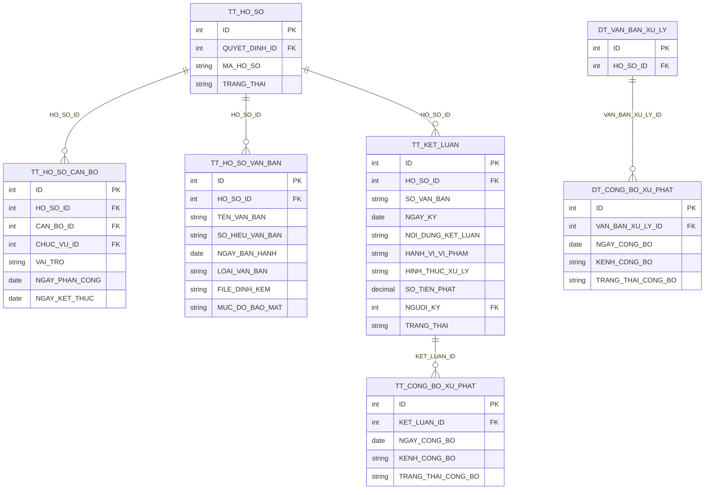
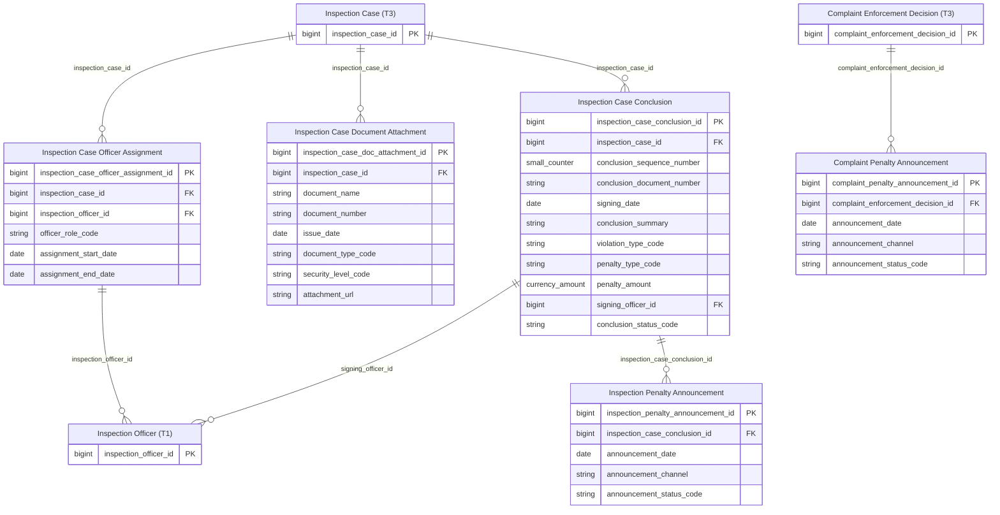

# ThanhTra HLD — Tier 4 (và Tier 5)

**Source system:** ThanhTra  
**Tier 4:** Các entity có FK đến Tier 3.  
**Tier 5:** `TT_CONG_BO_XU_PHAT` — FK đến Tier 4 (TT_KET_LUAN). Gộp chung file để tiện tham chiếu.

---

## 6a. Bảng tổng quan BCV Concept

| Tier | BCV Core Object | BCV Concept | Source Table | Mô tả bảng nguồn | Silver Entity | table_type | Ghi chú |
|---|---|---|---|---|---|---|---|
| T4 | Business Activity | [Business Activity] Audit Investigation | TT_HO_SO_CAN_BO | Phân công cán bộ xử lý hồ sơ thanh tra | Inspection Case Officer Assignment | Fundamental | FK → Inspection Case (T3) + FK → Inspection Officer (T1). Grain: 1 cán bộ × 1 hồ sơ × 1 vai trò. |
| T4 | Documentation | [Documentation] Supporting Documentation | TT_HO_SO_VAN_BAN | Văn bản đính kèm hồ sơ thanh tra (biên bản làm việc, yêu cầu cung cấp tài liệu...) | Inspection Case Document Attachment | Fundamental | FK → Inspection Case (T3). Grain: 1 văn bản. |
| T4 | Business Activity | [Business Activity] Audit Investigation | TT_KET_LUAN | Kết luận thanh tra và văn bản xử lý sau thanh tra | Inspection Case Conclusion | Fundamental | FK → Inspection Case (T3). Grain: 1 kết luận = 1 cuộc thanh tra. Có thể kèm quyết định xử phạt. |
| T4 | Business Activity | [Business Activity] Conduct Violation | DT_CONG_BO_XU_PHAT | Công bố quyết định xử phạt từ hồ sơ đơn thư | Complaint Penalty Announcement | Fundamental | FK → Complaint Enforcement Decision (T3). Grain: 1 lần công bố. |
| T5 | Business Activity | [Business Activity] Conduct Violation | TT_CONG_BO_XU_PHAT | Công bố quyết định xử phạt từ kết luận thanh tra | Inspection Penalty Announcement | Fundamental | FK → Inspection Case Conclusion (T4). Grain: 1 lần công bố. |

---

## 6b. Diagram Source (Mermaid)

---

## 6c. Diagram Silver (Mermaid)

---

## 6d. Quyết định thiết kế quan trọng

### D1 — TT_KET_LUAN: quan hệ 1:N với TT_HO_SO

**Xác nhận:** 1 hồ sơ (`Inspection Case`) có thể có nhiều kết luận — ví dụ kết luận sơ bộ, kết luận chính thức, kết luận bổ sung sau khiếu nại.

→ Grain: 1 kết luận = 1 lần ban hành văn bản kết luận cho 1 hồ sơ. Thêm `conclusion_sequence_number` (data domain: Small Counter) để xác định thứ tự phiên bản trong cùng 1 hồ sơ.

`TT_KET_LUAN` đồng thời chứa thông tin xử lý (HANH_VI_VI_PHAM, HINH_THUC_XU_LY, SO_TIEN_PHAT). Không tách thành entity riêng vì không có bảng nguồn riêng cho "quyết định xử phạt" trong luồng TT_ (khác với GS_/DT_ có bảng _VAN_BAN_XU_LY riêng).

→ Lưu `violation_type_code`, `penalty_type_code` (Classification Values) và `penalty_amount` trực tiếp trong `Inspection Case Conclusion`.

### D2 — TT_CONG_BO_XU_PHAT vs. GS_CONG_BO_XU_PHAT vs. DT_CONG_BO_XU_PHAT

Ba bảng này có cấu trúc tương tự (NGAY_CONG_BO, KENH_CONG_BO, TRANG_THAI) nhưng FK đến các entity cha khác nhau:
- `TT_CONG_BO_XU_PHAT` → `Inspection Case Conclusion` (T4)
- `GS_CONG_BO_XU_PHAT` → `Surveillance Enforcement Decision` (T2)
- `DT_CONG_BO_XU_PHAT` → `Complaint Enforcement Decision` (T3)

**Quyết định: KHÔNG gộp** — cùng lý do như Document Attachment: FK không đồng nhất. Giữ 3 entity riêng với tên rõ theo luồng nghiệp vụ.

### D3 — TT_HO_SO_CAN_BO.CHUC_VU_ID

FK đến `DM_CHUC_VU` → CV `TT_POSITION_TYPE`. Tương tự `TT_QUYET_DINH_THANH_PHAN`. Lưu `officer_role_code` (CV).

---

## 6e. Bảng chờ thiết kế

Không còn bảng nào trong scope ThanhTra chưa được xử lý, ngoại trừ:
- **`PCRT_BAO_CAO`**: chờ xác nhận (xem 6f)
- **SYS_* tables (8 bảng)**: xác nhận out-of-scope

---

## 6f. Điểm cần xác nhận

| # | Câu hỏi | Ảnh hưởng |
|---|---|---|
| 1 | **PCRT_BAO_CAO** (báo cáo PCRT định kỳ) — có FK đến PCRT_HO_SO hay độc lập? | Nếu độc lập → Tier 1 Fact Append (thêm vào silver_entities.csv cùng với `Anti-Corruption Report`). Nếu có FK → Tier 2. |
| 2 | **TT_KET_LUAN** có 1 hồ sơ → nhiều kết luận (revisions) hay chỉ 1 kết luận cuối? | Nếu 1:1 → grain không thay đổi. Nếu 1:N → cần thêm `revision_number` hoặc `is_current` indicator. |
| 3 | **TT_CONG_BO_XU_PHAT** trực tiếp FK → TT_KET_LUAN hay có bảng trung gian nào khác? | Ảnh hưởng tier assignment. |
