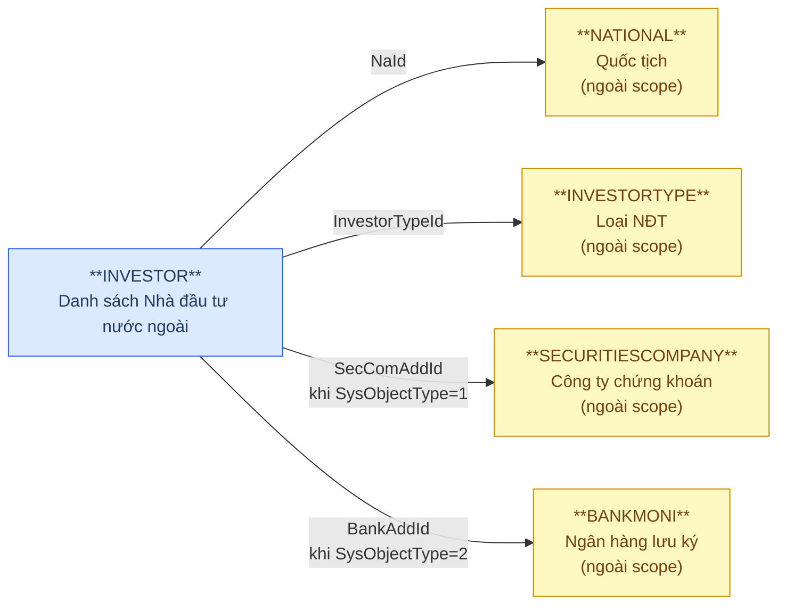
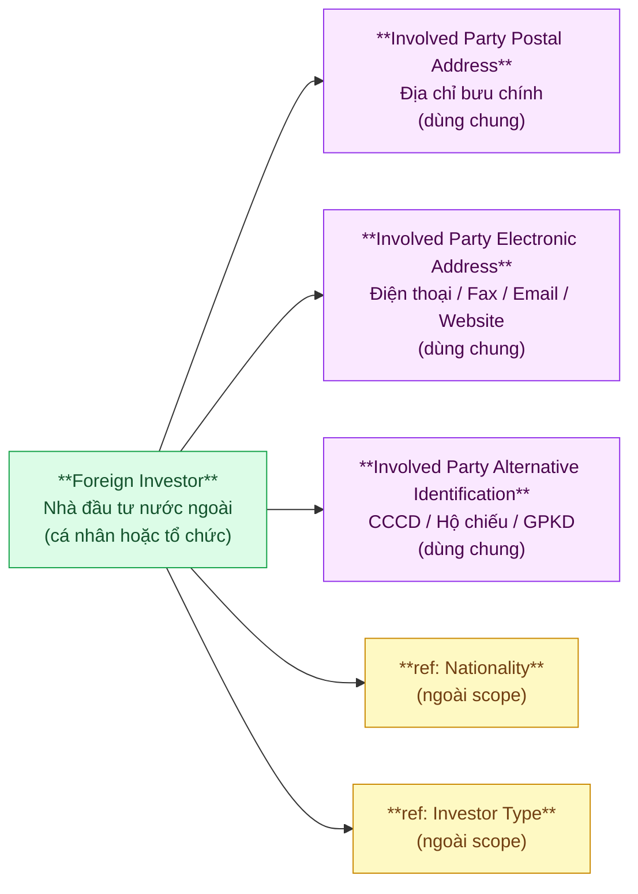
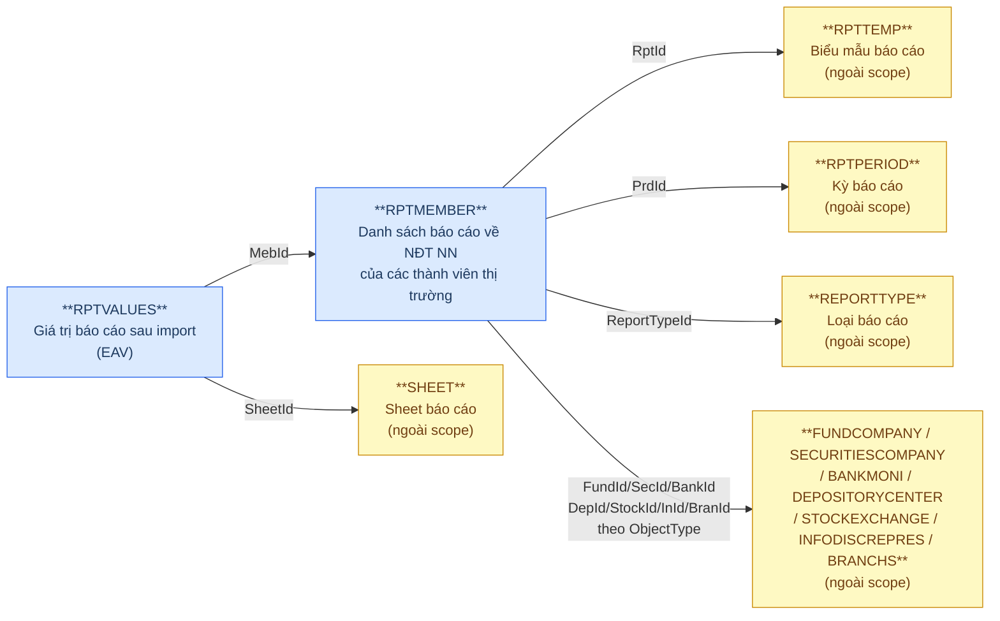
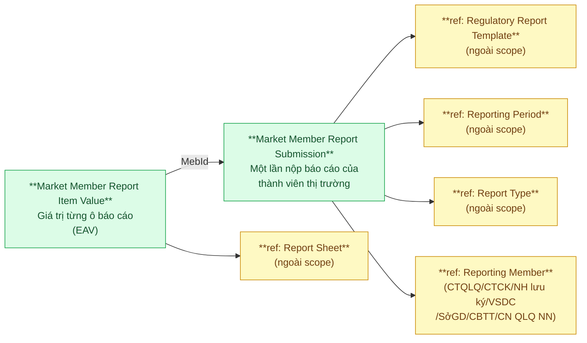

# FIMS — Relationship Diagram: Source vs Silver Proposed Model

> **Render:** Mở file này trong VS Code với extension **Markdown Preview Mermaid Support**, hoặc dán từng block vào [mermaid.live](https://mermaid.live).
>
> **Ký hiệu:**
> - `──►` (mũi tên liền): quan hệ FK (Many → One)
> - `-.->` (mũi tên đứt): quan hệ ETL pattern (SCD / Audit Log of)
> - 🔵 Xanh dương: bảng nguồn FIMS (Master)
> - 🟢 Xanh lá: entity Silver / Proposed Model
> - ⬜ Xám: ETL pattern — Snapshot hoặc Audit Log
> - 🟡 Vàng: bảng ngoài scope
> - 🟣 Tím: Shared entity (dùng chung cho mọi Involved Party)

---

## Nhóm 1 — Foreign Investor (Nhà đầu tư nước ngoài)

### Source (FIMS)

> **Multi-way FK (INVESTOR):** `SysObjectType` xác định loại tổ chức nơi NĐT mở TK lưu ký:
> - `SysObjectType=1` → `SecComAddId` (FK → SECURITIESCOMPANY)
> - `SysObjectType=2` → `BankAddId` (FK → BANKMONI)
> Chỉ một trong hai FK non-null tại mỗi bản ghi.



### Silver — Proposed Model



> **Shared Entities (tím):** `Involved Party Postal Address`, `Involved Party Electronic Address`, `Involved Party Alternative Identification` — dùng chung cho mọi Involved Party entity trong Silver.
>
> **Multi-way FK normalize:** `SysObjectType + SecComAddId/BankAddId` → ETL chuẩn hóa thành `Custodian Type Code + Custodian Identifier` trong `Foreign Investor`.
>
> **Involved Party Type (ObjectType):** 1=Cá nhân / 2=Tổ chức → map sang INDIVIDUAL / ORGANIZATION. Một số attributes chỉ áp dụng cho một loại (Sex/DateOfBirth → cá nhân; BusinessNumber/Director → tổ chức).

---

## Nhóm 2 — Market Member Report (Báo cáo thành viên thị trường)

### Source (FIMS)

> **Multi-way FK (RPTMEMBER):** `ObjectType` xác định loại tổ chức nộp báo cáo:
> - 1=CTQLQ → `FundId` (FK → FUNDCOMPANY)
> - 2=CTCK → `SecId` (FK → SECURITIESCOMPANY)
> - 3=NHlưuký → `BankId` (FK → BANKMONI)
> - 4=VSDC → `DepId` (FK → DEPOSITORYCENTER)
> - 5=SởGD → `StockId` (FK → STOCKEXCHANGE)
> - 6=CBTT → `InId` (FK → INFODISCREPRES)
> - 7=CN QLQ NN → `BranId` (FK → BRANCHS)
> Chỉ một FK non-null tại mỗi bản ghi.



### Silver — Proposed Model



> **Multi-way FK normalize (RPTMEMBER → Silver):**
> ```
> Reporting_Member_Identifier = COALESCE(FundId, SecId, BankId, DepId, StockId, InId, BranId)
> Reporting_Member_Type_Code  = ObjectType
> ```
>
> **Redundant FK trong RPTVALUES:** PrdId, RptId, Type, PeriodType, PeriodValue, FundId...BranId — không đưa vào Silver, lấy qua JOIN với Market Member Report Submission (MebId).
>
> **FIMS-specific EAV metadata:** `TableName / FieldName / Identification / TgtId` — đặc thù FIMS, nullable khi merge với FMS.RPTVALUES ở tầng Gold.

---

## Tổng quan theo BCV Concept

| BCV Concept | Source Tables | Silver Entities |
|---|---|---|
| **[Involved Party] — Investor** | INVESTOR | Foreign Investor |
| **[Involved Party] — Involved Party Type** | INVESTOR.ObjectType | *(attribute của Foreign Investor)* |
| **[Involved Party] — Involved Party Alternative Identification** | INVESTOR (IdNo, IdDate, IdAdd, BusinessNumber) | Involved Party Alternative Identification |
| **[Location] — Postal Address** | INVESTOR.Address | Involved Party Postal Address |
| **[Location] — Electronic Address** | INVESTOR (Telephone, Fax, Email, Website) | Involved Party Electronic Address |
| **[Involved Party] — Involved Party Life Cycle Status** | INVESTOR.StatusId | *(attribute của Foreign Investor)* |
| **[Documentation] — Regulatory Report** | RPTMEMBER | Market Member Report Submission |
| **[Documentation] — Regulatory Report Type** | RPTMEMBER.RptId → RPTTEMP | *(FK attribute)* |
| **[Common] — Reported Status** | RPTMEMBER.Status | *(attribute của Market Member Report Submission)* |
| **[Communication] — Response Deadline Date** | RPTMEMBER.DeadlineSend | *(attribute của Market Member Report Submission)* |
| **[Documentation] — Submission Date** | RPTMEMBER.DateSubmitted | *(attribute của Market Member Report Submission)* |
| **[Common] — Time Period Type** | RPTMEMBER.PeriodType | *(attribute của Market Member Report Submission)* |
| **[Documentation] — Reported Information** | RPTVALUES | Market Member Report Item Value |
| **[Condition] — Format Type** | RPTVALUES.FormatDataType | *(attribute của Market Member Report Item Value)* |
