# FMS — Relationship Diagram: Source vs Silver Proposed Model

> **Render:** Mở file này trong VS Code với extension **Markdown Preview Mermaid Support**, hoặc dán từng block vào [mermaid.live](https://mermaid.live).
>
> **Ký hiệu:**
> - `──►` (mũi tên liền): quan hệ FK (Many → One)
> - `-.->` (mũi tên đứt): quan hệ ETL pattern (SCD / Audit Log of)
> - 🔵 Xanh dương: bảng nguồn FMS (Master)
> - 🟢 Xanh lá: entity Silver / Proposed Model
> - ⬜ Xám: ETL pattern — Snapshot hoặc Audit Log
> - 🟡 Vàng: bảng ngoài scope
> - 🟣 Tím: Shared entity (dùng chung cho mọi Involved Party)

---

## Nhóm 1 — Fund Management Company & cổ đông, bên liên quan

### Source (FMS)

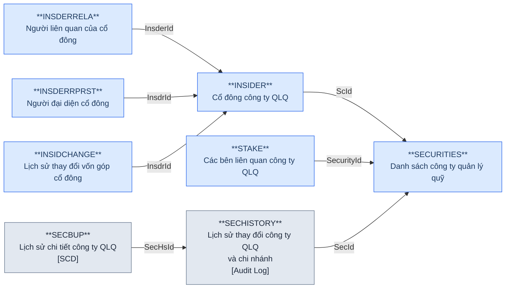

### Silver — Proposed Model

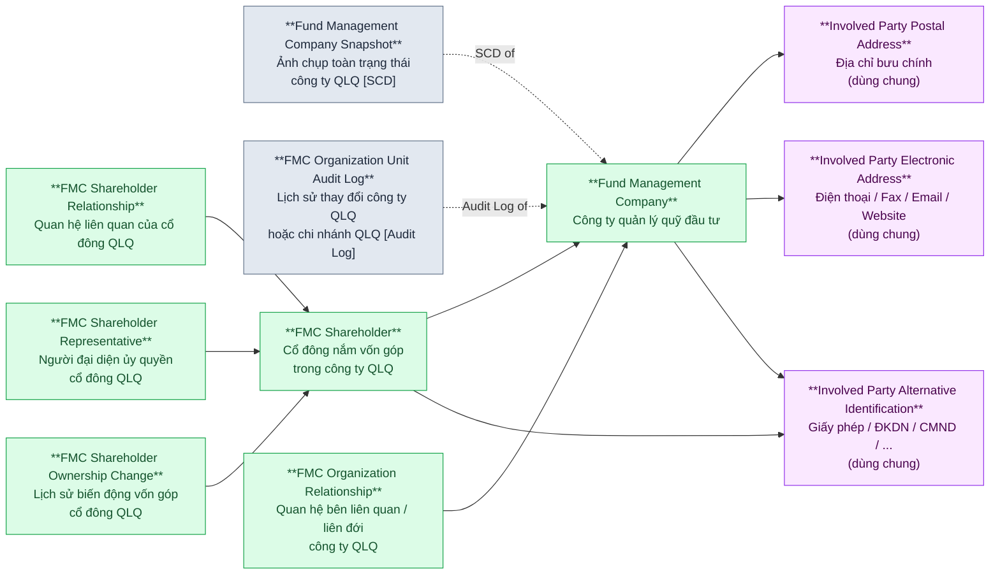

> **Shared Entities (tím):** `Involved Party Postal Address`, `Involved Party Electronic Address`, `Involved Party Alternative Identification` — dùng chung cho mọi Involved Party entity (FMC, FMC Org Unit, Custodian Bank, ...).
>
> **Phân luồng ETL:** `SECURITIES.ForeignType = NULL` → `Fund Management Company`; `ForeignType IN ('B','O')` → `Foreign Fund Management Organization Unit` (Nhóm 8).

---

## Nhóm 2 — FMC Organization Unit (Chi nhánh / VPĐD QLQ trong nước)

### Source (FMS)

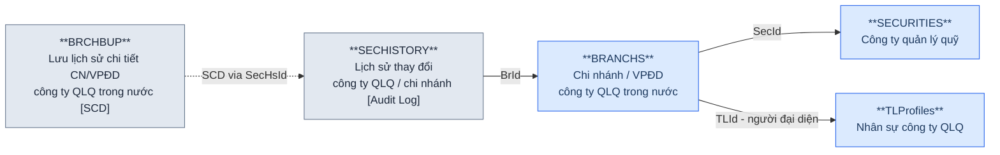

### Silver — Proposed Model

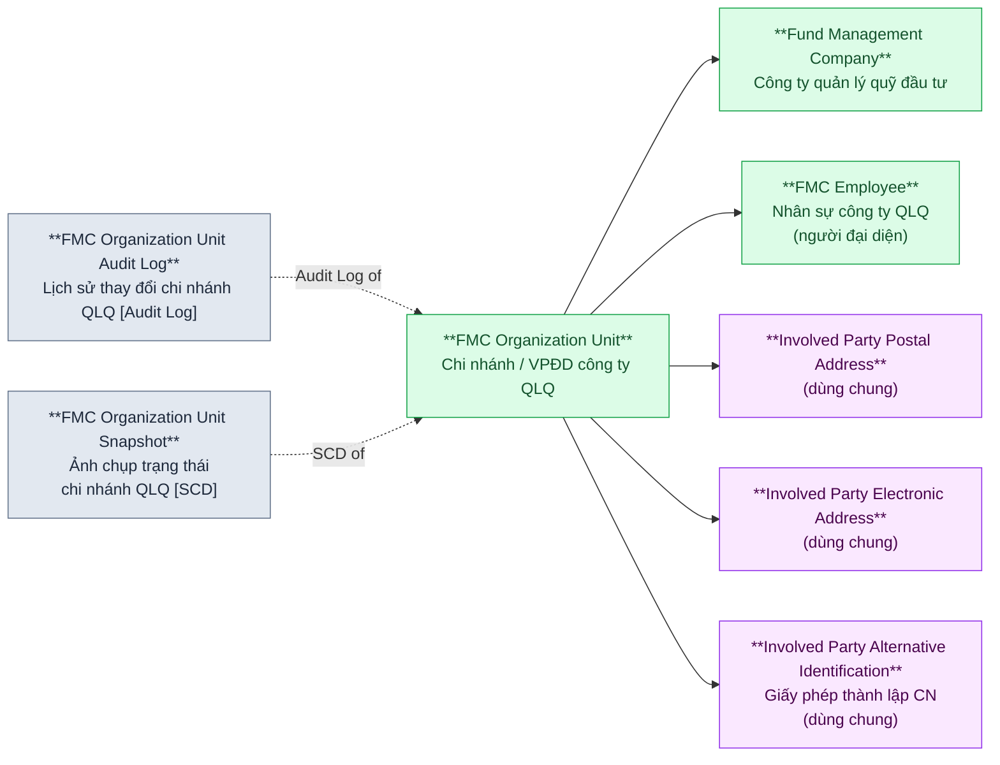

> **Lưu ý:** `BRANCHS.BrIdowner` (chi nhánh cha/con) → self-reference trong `FMC Organization Unit`. `BRCHBUP` là Snapshot của chi nhánh, không FK trực tiếp đến BRANCHS mà qua SECHISTORY.

---

## Nhóm 3 — FMC Employee (Nhân sự QLQ)

### Source (FMS)

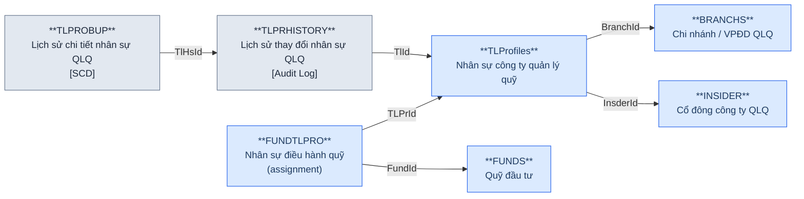

### Silver — Proposed Model

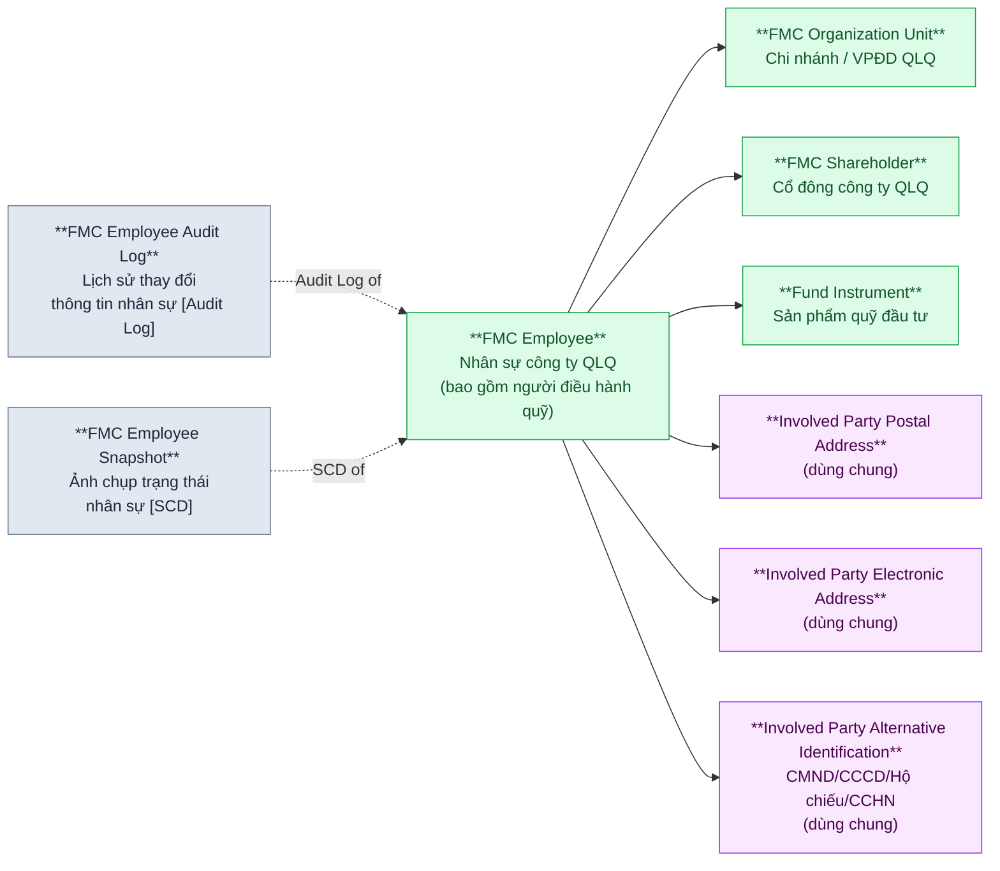

> **Lưu ý:** `FUNDTLPRO` (assignment) không tạo entity riêng trong Silver — được thể hiện qua quan hệ `FMC Employee → Fund Instrument`.
>
> `TLPROFILES` có cả địa chỉ thường trú, địa chỉ làm việc → 2 dòng trong `Involved Party Postal Address` với Address Type khác nhau (HOME / WORK).
>
> Định danh cá nhân: CMND/CCCD/Hộ chiếu (IdNo+IdDate+IdAdd) → `Involved Party Alternative Identification`. Chứng chỉ hành nghề (CertNo+CertDate+CertType) → `Involved Party Alternative Identification` với Type = "Professional Certificate".

---

## Nhóm 4 — Fund Instrument (Quỹ đầu tư) & các bảng liên quan

### Source (FMS)

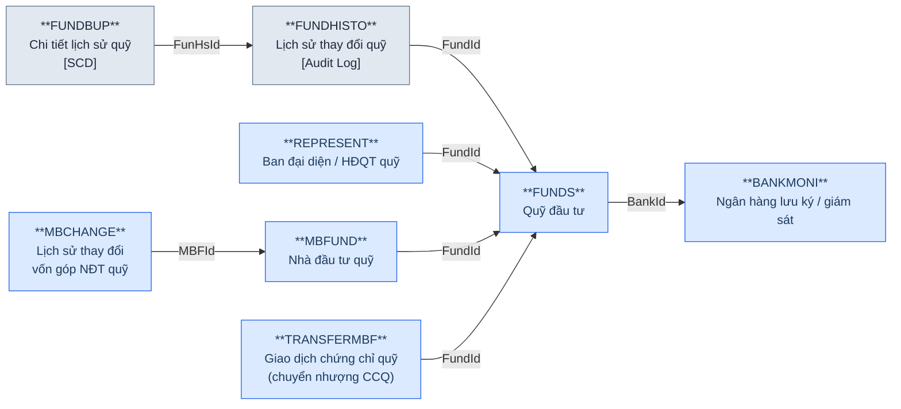

### Silver — Proposed Model

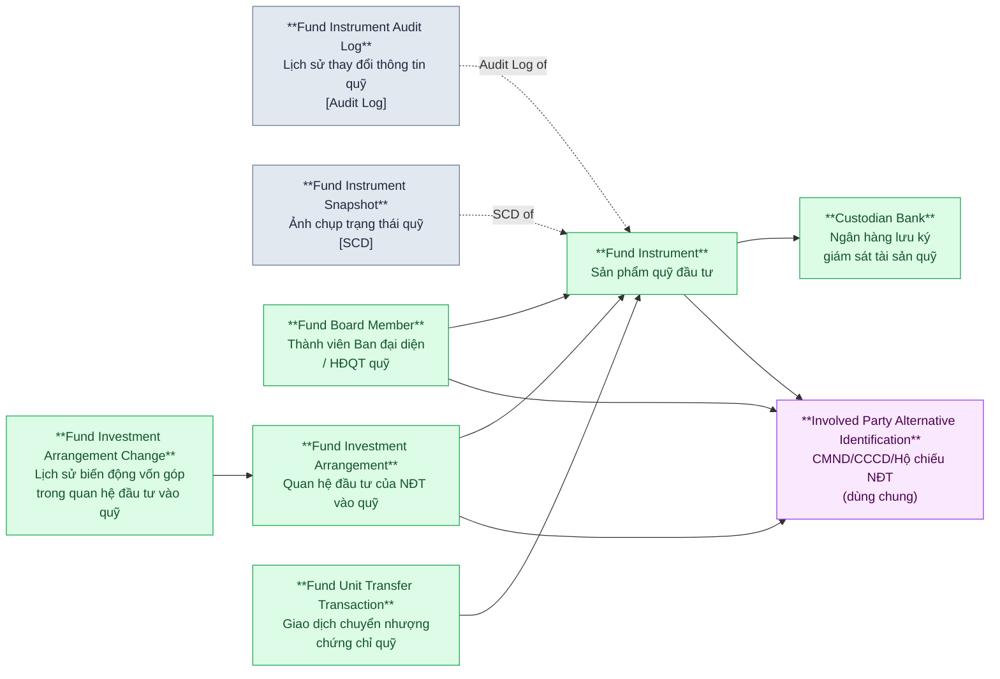

> **Lưu ý:** `REPRESENT` (Fund Board Member) có CMND/CCCD, `MBFUND` (NĐT quỹ) có CMND/CCCD/ĐKKD — đều route sang `Involved Party Alternative Identification`.
>
> `MBFUND.RepresentName / RepresentJob` → denormalized attributes trong `Fund Investment Arrangement` (không tạo entity riêng cho người đại diện vốn góp nếu chưa có thêm thông tin).

---

## Nhóm 5 — Discretionary Investment Investor (Nhà đầu tư ủy thác)

### Source (FMS)

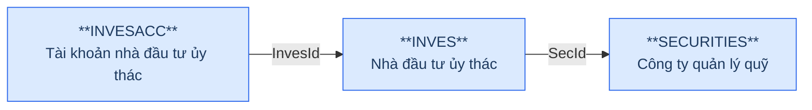

### Silver — Proposed Model

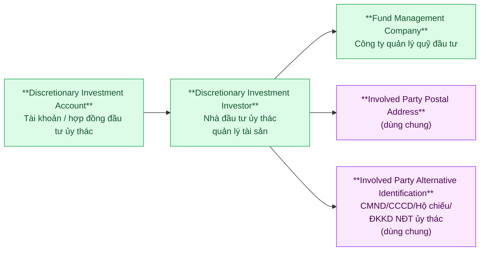

> **Lưu ý:** `INVES.IdType` phân biệt loại giấy tờ (CMND vs ĐKKD) → ánh xạ thành `Identification Type` trong `Involved Party Alternative Identification`.
>
> `INVESACC` tương ứng với `Discretionary Investment Account` — có `ContractNo` (Số hợp đồng), `Account` (Tài khoản lưu ký), `ManagerFee` (Phí quản lý).

---

## Nhóm 6 — Fund Distribution Agent (Đại lý phân phối quỹ)

### Source (FMS)

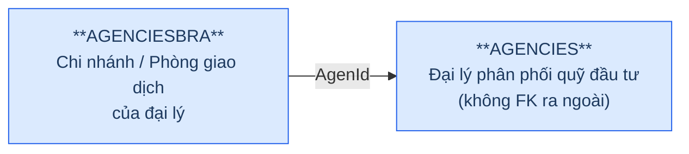

### Silver — Proposed Model

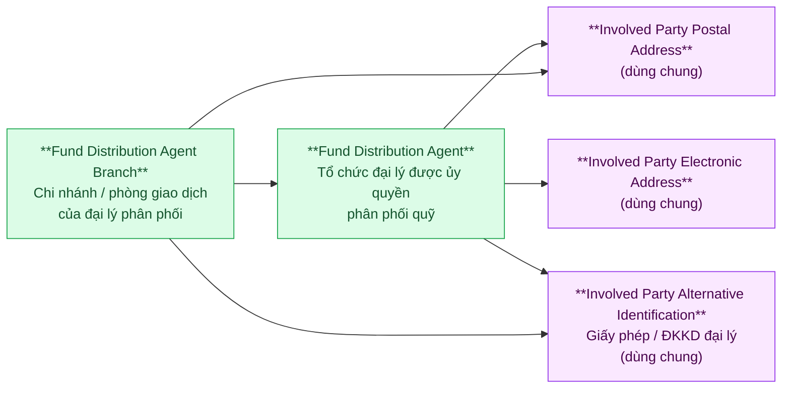

---

## Nhóm 7 — Custodian Bank (Ngân hàng lưu ký, giám sát)

### Source (FMS)

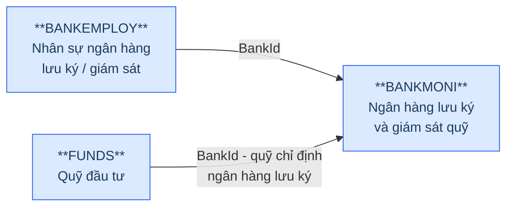

### Silver — Proposed Model

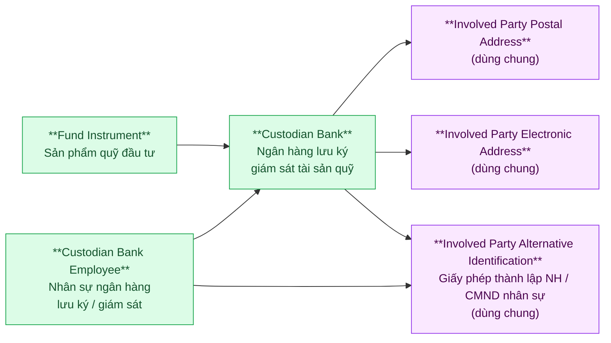

> **Lưu ý:** `BANKMONI.Type` (1: Giám sát / 2: Lưu ký / 3: LKGS) → Silver vẫn là một entity `Custodian Bank`, phân biệt bằng attribute `Custodian Bank Type`.
>
> `BANKEMPLOY` có chứng chỉ nghề nghiệp (CertNo, CertAudit, CertLaw) → route sang `Involved Party Alternative Identification` với các Identification Type khác nhau.

---

## Nhóm 8 — Foreign Fund Management Organization Unit (VPĐD / Chi nhánh QLQ nước ngoài)

> **Lưu ý:** `FORBRCH` không có FK đến `SECURITIES` — entity **độc lập**, không liên kết với FMC trong nước. UBCKNN chỉ quản lý VPĐD/chi nhánh tại VN, không quản lý công ty mẹ ở nước ngoài.

### Source (FMS)

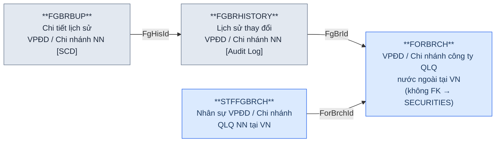

### Silver — Proposed Model

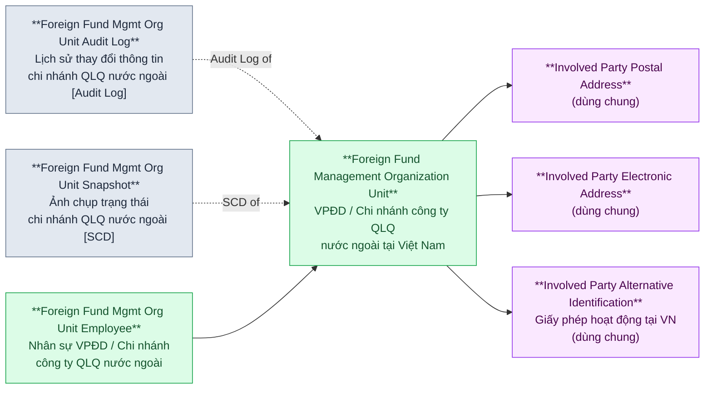

> **Phân luồng ETL:** `SECURITIES.ForeignType IN ('B','O')` → route sang `Foreign Fund Management Organization Unit`, không vào `Fund Management Company`.

---

## Nhóm 9 — Insider Share Transfer (Giao dịch chuyển nhượng cổ phần)

### Source (FMS)

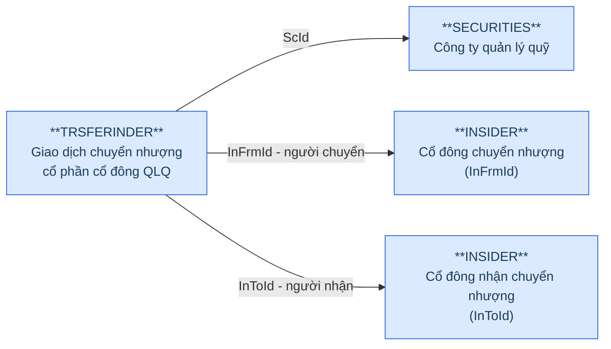

### Silver — Proposed Model

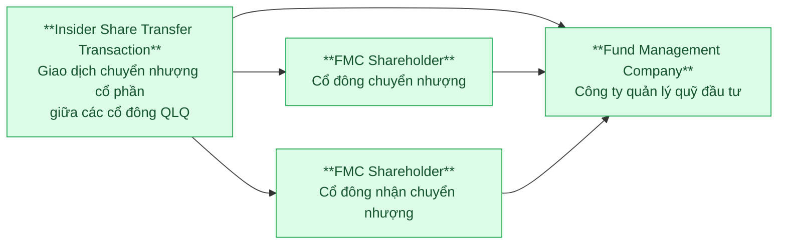

---

## Nhóm 10 — Report Submission & Report Values (Báo cáo thành viên thị trường)

> **Multi-way FK:** `RPTMEMBER` có 4 FK subject (SecId / BkMId / FrBrId / FndId) — chỉ một non-null theo `Type`. `RPTVALUES` mirror cùng 4 FK. Silver resolve thành quan hệ đa subject.

### Source (FMS)

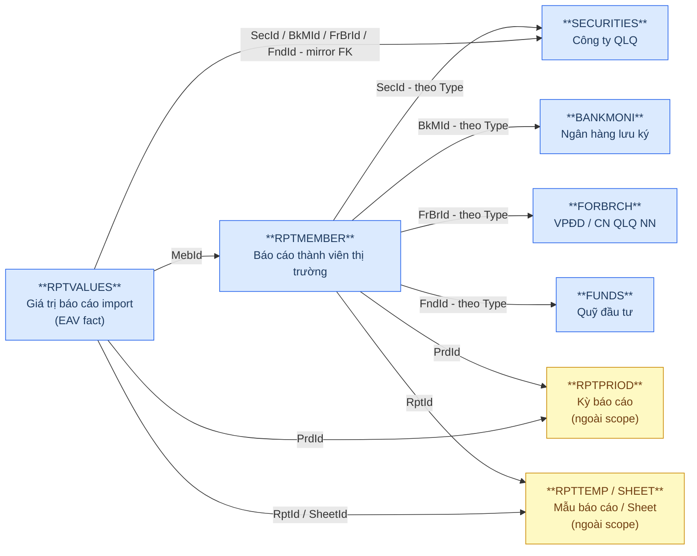

### Silver — Proposed Model

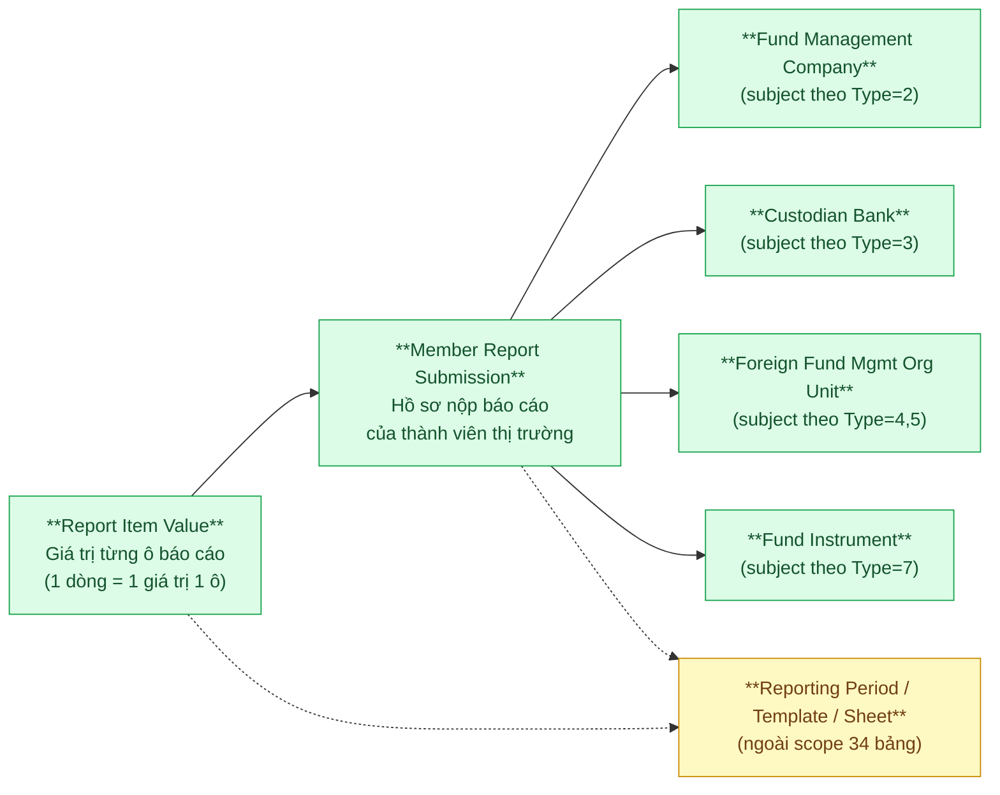

---

## Tổng quan theo BCV Concept

| BCV Concept | Source Tables | Silver Entities |
|---|---|---|
| **Involved Party — Portfolio Fund Management Company** | SECURITIES (ForeignType=NULL) | Fund Management Company |
| **Involved Party — Organization Unit** | BRANCHS, AGENCIESBRA | FMC Organization Unit, Fund Distribution Agent Branch |
| **Involved Party — Agent** | AGENCIES | Fund Distribution Agent |
| **Involved Party — Organization (Foreign)** | FORBRCH | Foreign Fund Management Organization Unit |
| **Involved Party — Custodian** | BANKMONI | Custodian Bank |
| **Involved Party — Investor (Discretionary)** | INVES | Discretionary Investment Investor |
| **Involved Party — Employment Position** | REPRESENT | Fund Board Member |
| **Involved Party — Employee** | TLProfiles, BANKEMPLOY, STFFGBRCH, FUNDTLPRO | FMC Employee, Custodian Bank Employee, Foreign Fund Mgmt Org Unit Employee |
| **Involved Party — Organization Ownership** | INSIDER, INSIDCHANGE | FMC Shareholder, FMC Shareholder Ownership Change |
| **Involved Party — Relationship** | STAKE, INSDERRELA, INSDERRPRST | FMC Organization Relationship, FMC Shareholder Relationship, FMC Shareholder Representative |
| **Product — Fund Instrument** | FUNDS | Fund Instrument |
| **Arrangement — Fund Investment Arrangement** | MBFUND, MBCHANGE | Fund Investment Arrangement, Fund Investment Arrangement Change |
| **Arrangement — Discretionary Investment Account** | INVESACC | Discretionary Investment Account |
| **Transaction — Fund Unit Transfer** | TRANSFERMBF | Fund Unit Transfer Transaction |
| **Transaction — Insider Share Transfer** | TRSFERINDER | Insider Share Transfer Transaction |
| **Documentation — Reported Information** | RPTMEMBER, RPTVALUES | Member Report Submission, Report Item Value |
| **ETL Pattern — SCD Snapshot** | SECBUP, BRCHBUP, TLPROBUP, FUNDBUP, FGBRBUP | \*Snapshot entities (5 bảng) |
| **ETL Pattern — Audit Log** | SECHISTORY, TLPRHISTORY, FUNDHISTO, FGBRHISTORY | \*Audit Log entities (4 bảng) |
| **Location — Postal Address** *(shared)* | SECURITIES, BRANCHS, AGENCIES, AGENCIESBRA, INVES, BANKMONI, TLProfiles, FORBRCH, ... | Involved Party Postal Address |
| **Location — Electronic Address** *(shared)* | SECURITIES, BRANCHS, AGENCIES, BANKMONI, FORBRCH, REPRESENT, ... | Involved Party Electronic Address |
| **Involved Party — Alternative Identification** *(shared)* | SECURITIES, BRANCHS, INSIDER, TLProfiles, MBFUND, REPRESENT, INVES, BANKEMPLOY, FORBRCH, AGENCIES, ... | Involved Party Alternative Identification |
