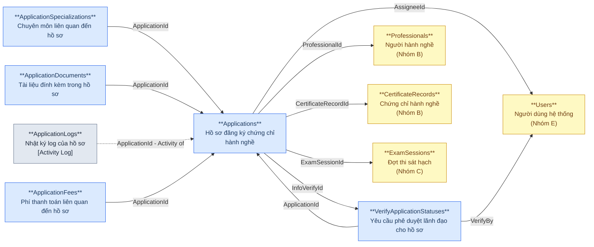
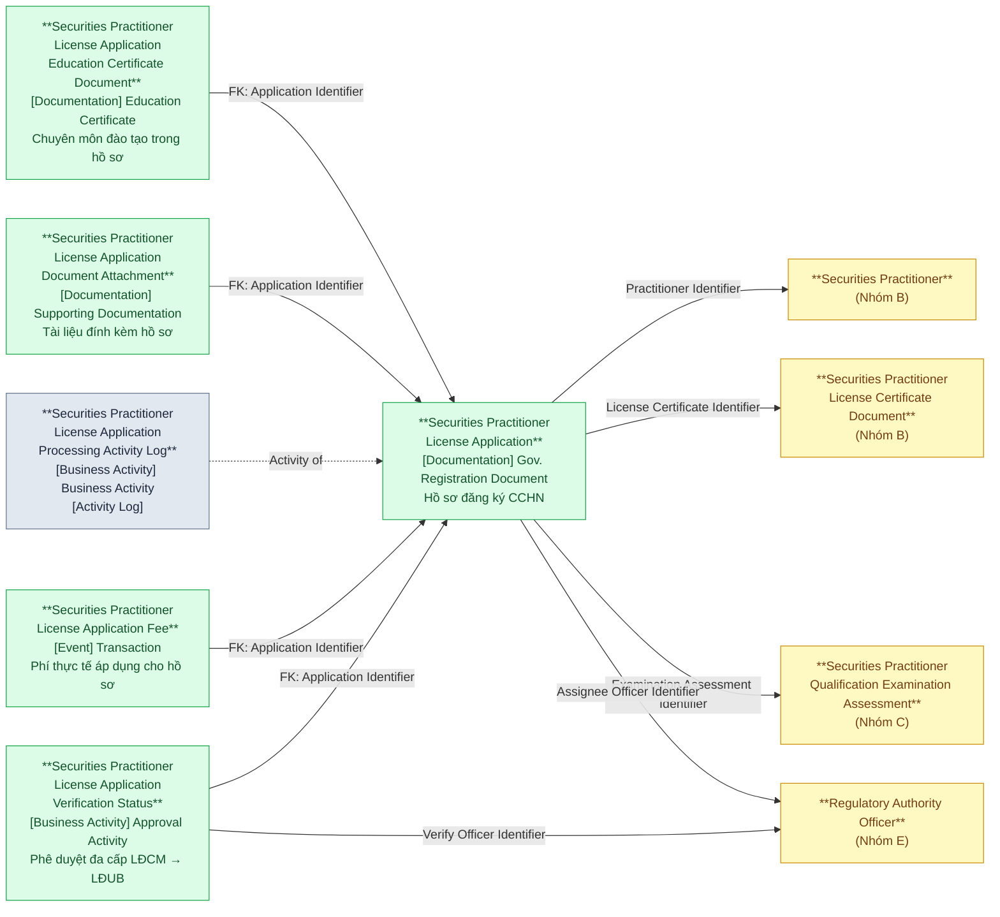
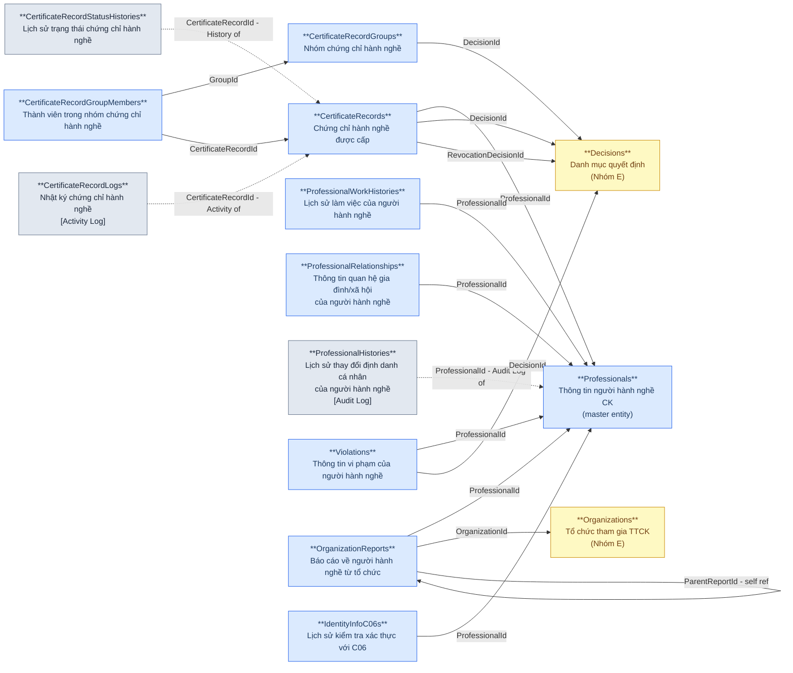
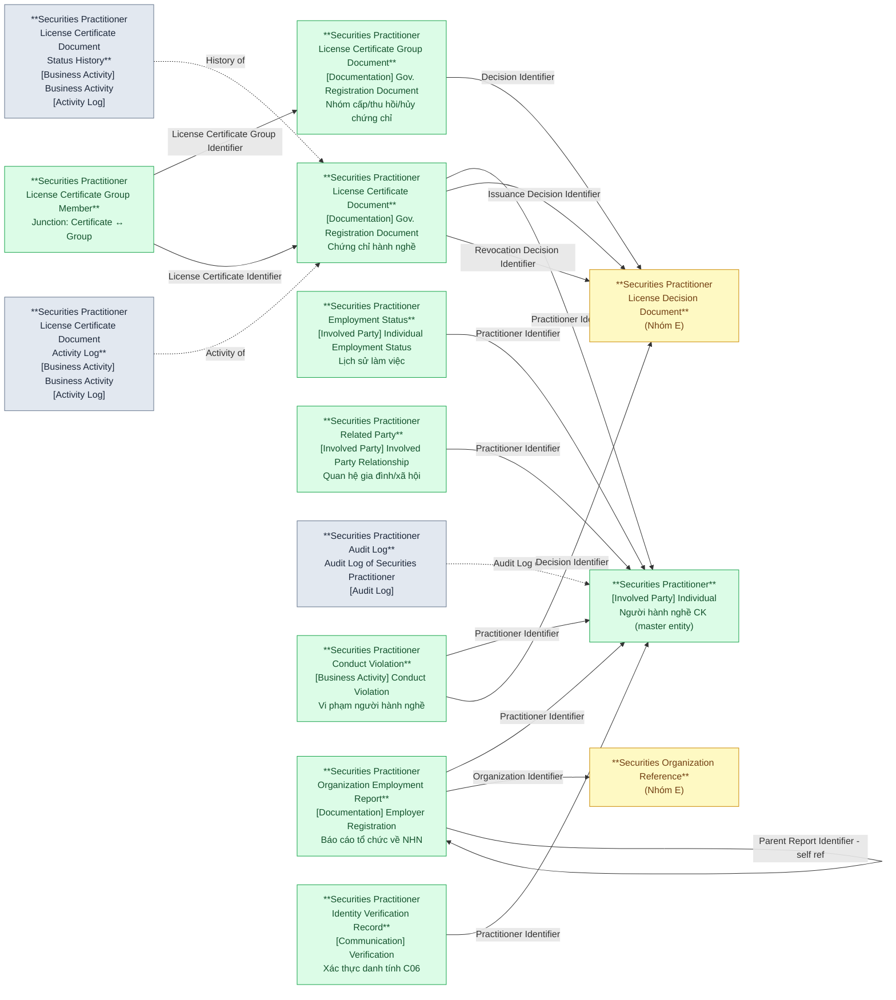
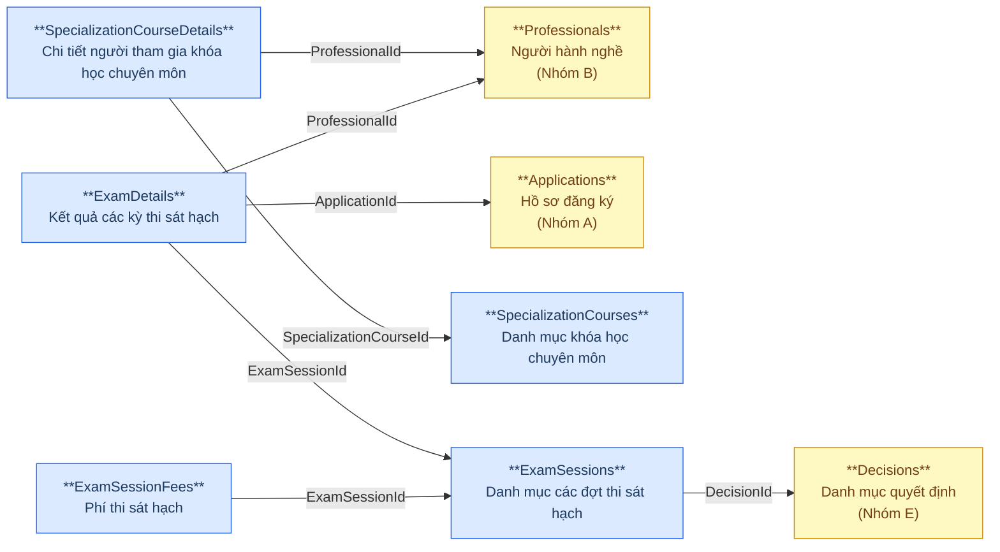
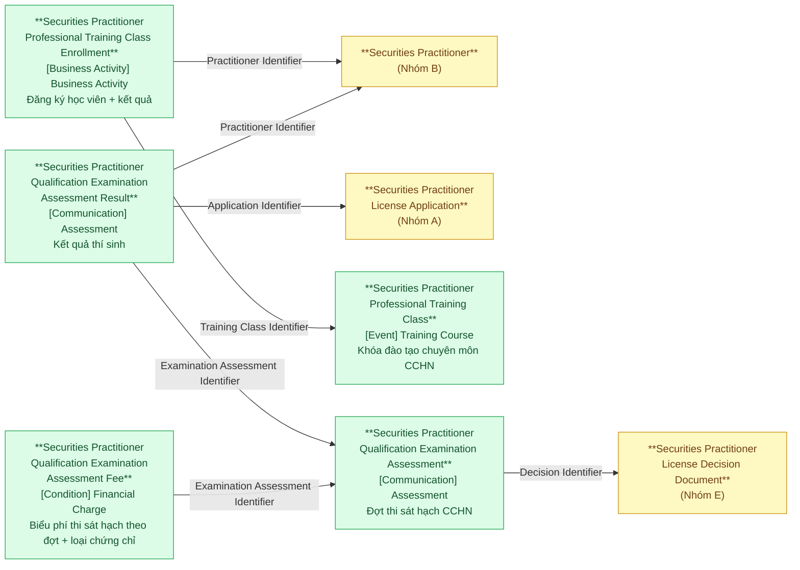
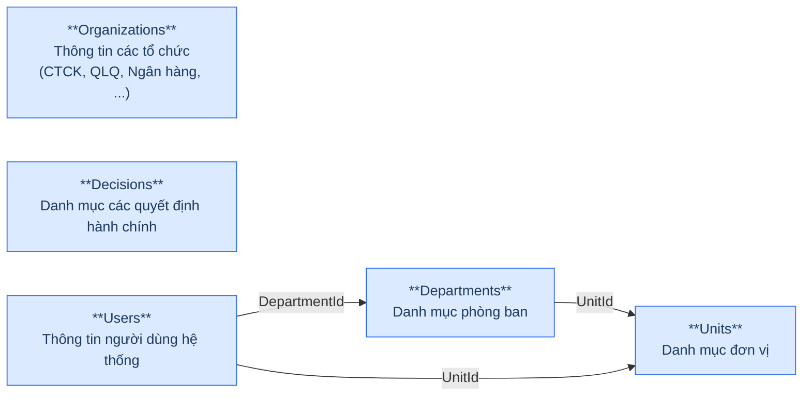
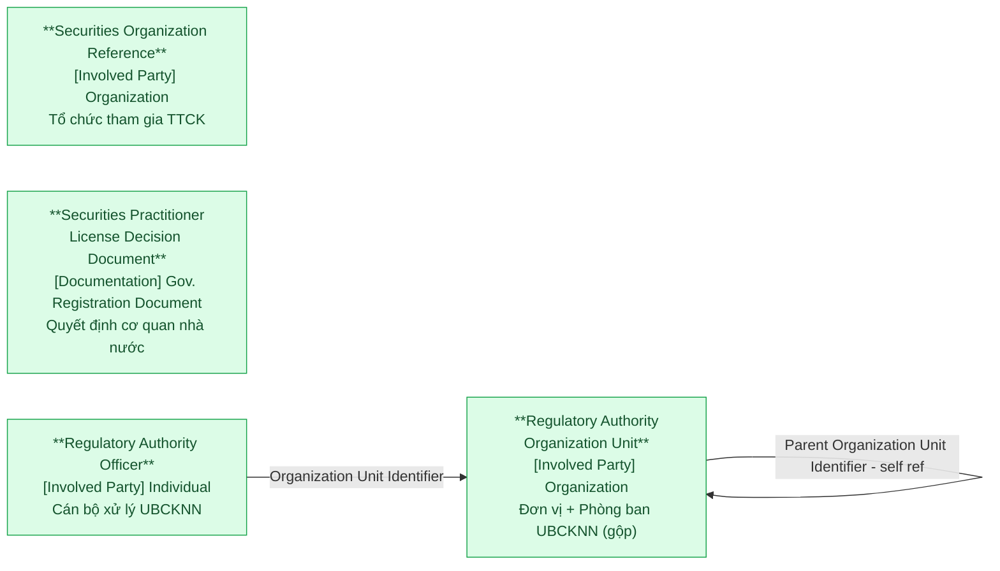

# NHNCK — Silver Layer Relationship Diagram

> **Phiên bản:** Thiết kế mới dựa trên hệ thống nguồn mới (`qlnhn`, MySQL Server, ~48 bảng).
>
> **Source system:** NHNCK (Phân hệ Quản lý giám sát người hành nghề chứng khoán)
>
> **Tài liệu tham chiếu:** `NHNCK_Source_Tables_New.xlsx`, `NHNCK_GAP_Analysis_Old_vs_New_Source.md`
>
> **Domain prefix:** Tất cả Silver entity trong nhóm NHN dùng chung prefix **"Securities Practitioner"** (theo quy tắc [Domain Prefix] + [BCV Term]).

---

## Nhóm A — Hồ sơ đăng ký CCHN (Practitioner License Application)

### Source (NHNCK)

### Silver — Proposed Model (Nhóm A)

---

## Nhóm B — Chứng chỉ & Người hành nghề (Certificate & Practitioner)

### Source (NHNCK)

### Silver — Proposed Model (Nhóm B)

---

## Nhóm C — Đào tạo & Thi sát hạch (Training & Examination)

### Source (NHNCK)

### Silver — Proposed Model (Nhóm C)

---

## Nhóm E — Danh mục & Tham chiếu (Reference Data)

### Source (NHNCK)

### Silver — Proposed Model (Nhóm E)

> **Lưu ý Nhóm E:**
> - **Classification Value** (7 danh mục): `EducationLevels`, `ApplicationStatuses`, `Certificates`, `Specializations`, `Documents`, `ApplicationSources`, `Positions` — bảng danh mục đơn giản (code-name). ETL load vào `Silver.Classification_Value` với scheme tương ứng. Không xuất hiện trong diagram theo quy tắc HLD.
> - **`Positions` → Classification Value scheme "Employment Position Type"**: Theo định nghĩa BCV, Employment Position là một vị trí việc làm cụ thể trong tổ chức (instance có người đảm nhận). Bảng `Positions` trong NHNCK chỉ chứa danh sách chức danh (Chuyên viên, Trưởng phòng...) — đây là **Employment Position Type** (reference data set), không phải Employment Position entity. Do đó map vào Classification Value, không tạo Silver entity riêng.
> - **Securities Organization Reference** (`Organizations`): entity nghiệp vụ phong phú (CharterCapital, LicenseNumber, Website...), được FK từ nhiều bảng → tạo Silver entity riêng.
> - **Securities Practitioner License Decision Document** (`Decisions`): entity nghiệp vụ thực (TypeId, SoQuyetDinh, NgayKy, NguoiKy...), được FK từ Nhóm A, B, C → tạo Silver entity riêng.
> - **Regulatory Authority Organization Unit** (`Units` + `Departments` gộp): cơ cấu tổ chức UBCKNN, cấu trúc tương tự, số trường ít → gộp thành 1 entity dạng cây (self-referencing) với Classification Value phân biệt cấp (Unit / Department). Dùng làm dimension cho báo cáo.
> - **Regulatory Authority Officer** (`Users`): cán bộ xử lý hồ sơ UBCKNN. Được FK từ Nhóm A (AssigneeId, VerifyBy) và nhiều bảng khác (CreatedBy). FK → Organization Unit. Trường chức vụ dùng Classification Value "Employment Position Type Code" (không FK entity riêng). Không bao gồm thông tin xác thực (PasswordHash) trên Silver.
> - **Bảng không lên Silver:** `UserRoles`, `Roles`, `Permissions`, `PermissionRoles`, `DepartmentAccess`, `ActionLogs`, `SystemParameters`, `DigitalCertificates`, `DigitalCertificateUsers`, `CertificateDocuments`, `CertificateSpecializations`, `CertificateDepartments`, `CertificateNumberTemplates` — operational / system data.

---

## Tổng quan theo BCV Concept (NHNCK — Tất cả nhóm)

### Nhóm A — Hồ sơ đăng ký CCHN (Practitioner License Application)

| BCV Concept | Source Tables | Mô tả bảng nguồn | Silver Entities |
|---|---|---|---|
| **[Documentation] Government Registration Document** | Applications | Hồ sơ đăng ký chứng chỉ hành nghề | Securities Practitioner License Application |
| **[Documentation] Education Certificate** | ApplicationSpecializations | Chuyên môn liên quan đến hồ sơ | Securities Practitioner License Application Education Certificate Document |
| **[Documentation] Supporting Documentation** | ApplicationDocuments | Tài liệu đính kèm trong hồ sơ | Securities Practitioner License Application Document Attachment |
| **ETL Pattern — Business Activity Log** | ApplicationLogs | Nhật ký log của hồ sơ | Securities Practitioner License Application Processing Activity Log |
| **[Event] Transaction** | ApplicationFees | Phí thanh toán liên quan đến hồ sơ | Securities Practitioner License Application Fee |
| **[Business Activity] Approval Activity** | VerifyApplicationStatuses | Yêu cầu phê duyệt lãnh đạo cho hồ sơ | Securities Practitioner License Application Verification Status |

### Nhóm B — Chứng chỉ & Người hành nghề (Certificate & Practitioner)

| BCV Concept | Source Tables | Mô tả bảng nguồn | Silver Entities |
|---|---|---|---|
| **[Involved Party] Individual** | Professionals | Thông tin người hành nghề chứng khoán | Securities Practitioner |
| **[Documentation] Gov. Registration Document** | CertificateRecords | Chứng chỉ hành nghề được cấp | Securities Practitioner License Certificate Document |
| **[Documentation] Gov. Registration Document** | CertificateRecordGroups | Nhóm chứng chỉ hành nghề | Securities Practitioner License Certificate Group Document |
| **Junction** | CertificateRecordGroupMembers | Thành viên trong nhóm chứng chỉ hành nghề | Securities Practitioner License Certificate Group Member |
| **ETL Pattern — Activity Log** | CertificateRecordStatusHistories | Lịch sử trạng thái chứng chỉ hành nghề | Securities Practitioner License Certificate Document Status History |
| **ETL Pattern — Activity Log** | CertificateRecordLogs | Nhật ký chứng chỉ hành nghề | Securities Practitioner License Certificate Document Activity Log |
| **[Involved Party] Individual Employment Status** | ProfessionalWorkHistories | Lịch sử làm việc của người hành nghề | Securities Practitioner Employment Status |
| **[Involved Party] Involved Party Relationship** | ProfessionalRelationships | Thông tin quan hệ gia đình/xã hội của người hành nghề | Securities Practitioner Related Party |
| **ETL Pattern — Audit Log** | ProfessionalHistories | Lịch sử thay đổi định danh cá nhân của người hành nghề | Securities Practitioner Audit Log |
| **[Business Activity] Conduct Violation** | Violations | Thông tin vi phạm của người hành nghề | Securities Practitioner Conduct Violation |
| **[Documentation] Employer Registration** | OrganizationReports | Báo cáo về người hành nghề từ tổ chức | Securities Practitioner Organization Employment Report |
| **[Communication] Verification** | IdentityInfoC06s | Lịch sử kiểm tra xác thực với C06 | Securities Practitioner Identity Verification Record |

### Nhóm C — Đào tạo & Thi sát hạch (Training & Examination)

| BCV Concept | Source Tables | Mô tả bảng nguồn | Silver Entities |
|---|---|---|---|
| **[Event] Training Course** | SpecializationCourses | Danh mục khóa học chuyên môn | Securities Practitioner Professional Training Class |
| **[Business Activity] Business Activity** | SpecializationCourseDetails | Chi tiết người tham gia khóa học chuyên môn | Securities Practitioner Professional Training Class Enrollment |
| **[Communication] Assessment** | ExamSessions | Danh mục các đợt thi sát hạch | Securities Practitioner Qualification Examination Assessment |
| **[Communication] Assessment** | ExamDetails | Kết quả các kỳ thi sát hạch | Securities Practitioner Qualification Examination Assessment Result |
| **[Condition] Financial Charge** | ExamSessionFees | Phí thi sát hạch | Securities Practitioner Qualification Examination Assessment Fee |

### Nhóm E — Danh mục & Tham chiếu (Reference Data)

**Classification Value** (load vào `Silver.Classification_Value`):

| Source Tables | Mô tả bảng nguồn | Classification Scheme | Ghi chú BCV |
|---|---|---|---|
| EducationLevels | Danh mục trình độ học vấn | Education Level | |
| ApplicationStatuses | Định nghĩa các trạng thái của hồ sơ | Application Status | |
| Certificates | Danh mục các loại chứng chỉ hành nghề | Certificate Type | |
| Specializations | Danh mục chuyên môn/chứng chỉ chuyên môn | Specialization | |
| Documents | Danh mục tài liệu liên quan đến hồ sơ hoặc chứng chỉ | Document Type | |
| ApplicationSources | Hình thức nộp hồ sơ | Application Source | |
| Positions | Danh mục chức vụ | Employment Position Type | BCV reference data set: "Distinguishes between Employment Positions according to the nature of the position which may be the specific label or job title assigned to an incumbent" |

**Silver Entities:**

| BCV Concept | Source Tables | Mô tả bảng nguồn | Silver Entities |
|---|---|---|---|
| **[Involved Party] Organization** | Organizations | Thông tin các tổ chức (CTCK, QLQ, Ngân hàng, ...) | Securities Organization Reference |
| **[Documentation] Gov. Registration Document** | Decisions | Danh mục các quyết định hành chính | Securities Practitioner License Decision Document |
| **[Involved Party] Organization** | Units + Departments | Đơn vị + Phòng ban UBCKNN (gộp — cấu trúc tương tự, số trường ít) | Regulatory Authority Organization Unit |
| **[Involved Party] Individual** | Users | Thông tin người dùng hệ thống | Regulatory Authority Officer |

### Shared Entities

| BCV Concept | Source Tables | Mô tả bảng nguồn | Silver Entities |
|---|---|---|---|
| **Shared Entities** | (nhiều bảng) | *(suy luận: tách từ Professionals và các bảng liên quan)* | Involved Party Postal Address, Electronic Address, Alternative Identification |
