# CƠ SỞ DỮ LIỆU (OLTP)

## DCST — Dữ liệu Cơ quan Thuế từ Tổng cục Thuế

### Các mô hình quan hệ dữ liệu

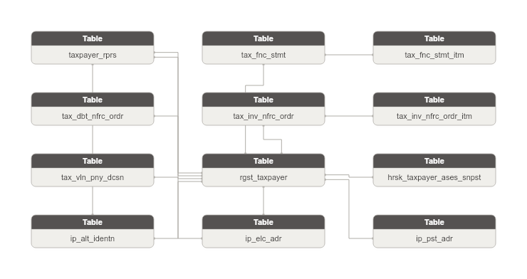

**Danh sách bảng:**

| STT | Tên bảng | Mô tả |
|---|---|---|
| 1 | tax_vln_pny_dcsn | Quyết định xử lý vi phạm hành chính về thuế. Ghi nhận hành vi vi phạm và mức phạt/truy thu. |
| 2 | tax_dbt_nfrc_ordr | Quyết định cưỡng chế nợ thuế. Ghi nhận hình thức cưỡng chế và thông tin tài sản/tài khoản liên quan. |
| 3 | tax_fnc_stmt | Tờ khai tài chính điện tử nộp lên cơ quan thuế. Ghi nhận kỳ kê khai và thông tin kiểm toán. |
| 4 | tax_fnc_stmt_itm | Chỉ tiêu chi tiết trong tờ khai tài chính. Ghi nhận giá trị số liệu theo từng ô chỉ tiêu trong biểu mẫu. |
| 5 | tax_inv_nfrc_ordr | Quyết định cưỡng chế nợ thuế theo hình thức ngừng sử dụng hóa đơn. Ghi nhận thông tin quyết định và thông báo. |
| 6 | tax_inv_nfrc_ordr_itm | Chi tiết hóa đơn thuộc quyết định cưỡng chế ngừng sử dụng hóa đơn. Ghi nhận số hiệu và loại hóa đơn. |
| 7 | hrsk_taxpayer_ases_snpst | Đánh giá xếp loại doanh nghiệp rủi ro cao về thuế theo năm. Ghi nhận thông tin tổ chức bị đánh giá rủi ro. |
| 8 | rgst_taxpayer | Doanh nghiệp/hộ kinh doanh đã đăng ký thuế với cơ quan thuế. Lưu thông tin pháp lý và trạng thái hoạt động. |
| 9 | taxpayer_rprs | Người đại diện hoặc chủ hộ kinh doanh của người nộp thuế. Ghi nhận tên và chức vụ. |
| 10 | ip_alt_identn | Lưu trữ các giấy tờ định danh thay thế của Involved Party (CMND/CCCD/Hộ chiếu/Giấy phép kinh doanh/Chứng chỉ hành nghề). Mỗi dòng = 1 loại giấy tờ từ 1 nguồn. |
| 11 | ip_elc_adr | Lưu trữ các địa chỉ liên lạc điện tử của Involved Party (điện thoại/fax/email). Mỗi dòng = 1 kênh liên lạc từ 1 nguồn. |
| 12 | ip_pst_adr | Lưu trữ các địa chỉ bưu chính của Involved Party (trụ sở/kinh doanh/thường trú/nơi ở hiện tại). Mỗi dòng = 1 loại địa chỉ từ 1 nguồn. |

### Bảng tax_vln_pny_dcsn

| STT | Tên trường | Kiểu dữ liệu và độ dài | Nullable | Unique | P/F Key | Mặc định | Mô tả |
|---|---|---|---|---|---|---|---|
| 1 | tax_vln_pny_dcsn_id | STRING |  | X | P |  | Id tự sinh (surrogate key) |
| 2 | tax_vln_pny_dcsn_code | STRING |  |  |  |  | Mã định danh bản ghi trong DCST. BK |
| 3 | src_stm_code | STRING |  |  |  | 'DCST.TT_XLY_VI_PHAM' | Mã nguồn dữ liệu. Giá trị: DCST.TT_XLY_VI_PHAM |
| 4 | rgst_taxpayer_id | STRING | X |  | F |  | Mã số thuế. FK đến Registered Taxpayer |
| 5 | rgst_taxpayer_code | STRING | X |  |  |  | Mã số thuế |
| 6 | taxpayer_nm | STRING | X |  |  |  | Tên đối tượng |
| 7 | ordr_nbr | STRING | X |  |  |  | Số quyết định xử lý |
| 8 | issu_ahr_nm | STRING | X |  |  |  | Cơ quan ban hành |
| 9 | insp_prd | STRING | X |  |  |  | Kỳ thanh tra kiểm tra |
| 10 | vln_pny_dsc | STRING | X |  |  |  | Phạt hành vi vi phạm |
| 11 | admn_vln_pny_dsc | STRING | X |  |  |  | Phạt hành vi vi phạm hành chính |
| 12 | tax_ars_rec_amt | STRING | X |  |  |  | Truy thu tiền thuế, tiền nộp chậm |

#### Constraint

**Khóa chính (Primary Key):**

| Tên trường |
|---|
| tax_vln_pny_dcsn_id |

**Khóa phụ (Foreign Key):**

| Tên trường | Bảng tham chiếu | Cột tham chiếu |
|---|---|---|
| rgst_taxpayer_id | rgst_taxpayer | rgst_taxpayer_id |

#### Index

N/A

#### Trigger

N/A

### Bảng tax_dbt_nfrc_ordr

| STT | Tên trường | Kiểu dữ liệu và độ dài | Nullable | Unique | P/F Key | Mặc định | Mô tả |
|---|---|---|---|---|---|---|---|
| 1 | tax_dbt_nfrc_ordr_id | STRING |  | X | P |  | Id tự sinh (surrogate key) |
| 2 | tax_dbt_nfrc_ordr_code | STRING |  |  |  |  | Mã định danh bản ghi trong DCST. BK |
| 3 | src_stm_code | STRING |  |  |  | 'DCST.TCT_TT_CUONG_CHE_NO' | Mã nguồn dữ liệu. Giá trị: DCST.TCT_TT_CUONG_CHE_NO |
| 4 | rgst_taxpayer_id | STRING | X |  | F |  | Mã người nhận. FK đến Registered Taxpayer |
| 5 | rgst_taxpayer_code | STRING | X |  |  |  | Mã người nhận |
| 6 | taxpayer_nm | STRING | X |  |  |  | Tên người nhận |
| 7 | taxpayer_bsn_idy | STRING | X |  |  |  | Ngành kinh doanh đối tượng bị cưỡng chế |
| 8 | tax_ahr_code | STRING | X |  |  |  | Mã cơ quan thuế |
| 9 | tax_ahr_nm | STRING | X |  |  |  | Tên cơ quan thuế |
| 10 | spvsr_tax_ahr_code | STRING | X |  |  |  | Mã cơ quan thuế quản lý |
| 11 | spvsr_tax_ahr_nm | STRING | X |  |  |  | Tên cơ quan thuế quản lý |
| 12 | nfrc_tp_code | STRING | X |  |  |  | Mã hình thức cưỡng chế |
| 13 | nfrc_tp_nm | STRING | X |  |  |  | Tên hình thức cưỡng chế |
| 14 | elc_txn_code | STRING | X |  |  |  | Mã giao dịch điện tử |
| 15 | nfrc_ordr_nbr | STRING | X |  | F |  | Số quyết định |
| 16 | nfrc_ordr_dt | DATE | X |  |  |  | Ngày quyết định |
| 17 | enforced_amt | STRING | X |  |  |  | Số tiền bị cưỡng chế |
| 18 | nfrc_eff_strt_dt | DATE | X |  |  |  | Ngày hiệu lực từ quyết định từ |
| 19 | nfrc_eff_end_dt | DATE | X |  |  |  | Ngày hiệu lực quyết định đến |
| 20 | nfrc_tm | DATE | X |  |  |  | Thời gian cưỡng chế |
| 21 | nfrc_lo | STRING | X |  |  |  | Địa điểm cưỡng chế |
| 22 | taxpayer_ac_nbr | STRING | X |  |  |  | Số tài khoản đối tượng bị cưỡng chế |
| 23 | taxpayer_ac_bnk | STRING | X |  |  |  | Nơi mở tài khoản bị cưỡng chế |
| 24 | incm_mgr_nm | STRING | X |  |  |  | Tên đối tượng quản lý thu nhập |
| 25 | incm_mgr_adr | STRING | X |  |  |  | Địa chỉ đối tượng quản lý thu nhập |
| 26 | seized_ast_dsc | STRING | X |  |  |  | Tài sản kê biên |
| 27 | seized_ast_val | STRING | X |  |  |  | Giá trị tài sản |
| 28 | ast_cstd_code | STRING | X |  | F |  | Mã đối tượng giữ tài sản cưỡng chế |
| 29 | ast_cstd_nm | STRING | X |  |  |  | Tên đối tượng giữ tài sản cưỡng chế |
| 30 | ast_cstd_adr | STRING | X |  |  |  | Địa chỉ đối tượng giữ tài sản cưỡng chế |

#### Constraint

**Khóa chính (Primary Key):**

| Tên trường |
|---|
| tax_dbt_nfrc_ordr_id |

**Khóa phụ (Foreign Key):**

| Tên trường | Bảng tham chiếu | Cột tham chiếu |
|---|---|---|
| rgst_taxpayer_id | rgst_taxpayer | rgst_taxpayer_id |

#### Index

N/A

#### Trigger

N/A

### Bảng tax_fnc_stmt

| STT | Tên trường | Kiểu dữ liệu và độ dài | Nullable | Unique | P/F Key | Mặc định | Mô tả |
|---|---|---|---|---|---|---|---|
| 1 | tax_fnc_stmt_id | STRING |  | X | P |  | Id tự sinh (surrogate key) |
| 2 | tax_fnc_stmt_code | STRING |  |  |  |  | Mã định danh bản ghi trong DCST. BK |
| 3 | src_stm_code | STRING |  |  |  | 'DCST.TCT_BAO_CAO' | Mã nguồn dữ liệu. Giá trị: DCST.TCT_BAO_CAO |
| 4 | rgst_taxpayer_id | STRING | X |  | F |  | Mã số thuế. FK đến Registered Taxpayer |
| 5 | rgst_taxpayer_code | STRING | X |  |  |  | Mã số thuế |
| 6 | taxpayer_nm | STRING | X |  |  |  | Tên người nộp thuế |
| 7 | taxpayer_adr | STRING | X |  |  |  | Địa chỉ người nộp thuế |
| 8 | taxpayer_ward | STRING | X |  |  |  | Phường xã |
| 9 | taxpayer_dstc_code | STRING | X |  |  |  | Mã huyện người nộp thuế |
| 10 | taxpayer_dstc_nm | STRING | X |  |  |  | Tên huyện người nộp thuế |
| 11 | taxpayer_prov_code | STRING | X |  |  |  | Mã tỉnh người nộp thuế |
| 12 | taxpayer_prov_nm | STRING | X |  |  |  | Tên tỉnh người nộp thuế |
| 13 | taxpayer_ph_nbr | STRING | X |  |  |  | Điện thoại người nộp thuế |
| 14 | taxpayer_fax_nbr | STRING | X |  |  |  | Fax người nộp thuế |
| 15 | taxpayer_email | STRING | X |  |  |  | Email người nộp thuế |
| 16 | bsn_idy | STRING | X |  |  |  | Ngày nghề kinh doanh |
| 17 | svc_code | STRING | X |  |  |  | Mã dịch vụ |
| 18 | svc_nm | STRING | X |  |  |  | Tên dịch vụ |
| 19 | svc_vrsn | STRING | X |  |  |  | Phiên bản dịch vụ |
| 20 | svc_pvdr_inf | STRING | X |  |  |  | Thông tin nhà cung cấp dịch vụ |
| 21 | tax_ret_code | STRING | X |  |  |  | Mã tờ khai |
| 22 | tax_ret_nm | STRING | X |  |  |  | Tên tờ khai |
| 23 | tax_ret_form_dsc | STRING | X |  |  |  | Mô tả biểu mẫu |
| 24 | tax_ret_xml_vrsn | STRING | X |  |  |  | Phiên bản tờ khai XML |
| 25 | tax_ret_tp_code | STRING | X |  |  |  | Loại tờ khai |
| 26 | amdt_cnt | INT | X |  |  |  | Số lần |
| 27 | rpt_prd_tp_code | STRING | X |  |  |  | Kiểu kỳ |
| 28 | rpt_prd | STRING | X |  |  |  | Kỳ kê khai |
| 29 | rpt_prd_strt_dt | STRING | X |  |  |  | Kỳ kê khai từ ngày |
| 30 | rpt_prd_end_dt | STRING | X |  |  |  | Kỳ kê khai đến ngày |
| 31 | rpt_prd_strt_mo | STRING | X |  |  |  | Kỳ kê khai từ tháng |
| 32 | rpt_prd_end_mo | STRING | X |  |  |  | Kỳ kê khai đến tháng |
| 33 | tax_ahr_code | STRING | X |  |  |  | Mã cơ quan thuế nơi nộp |
| 34 | tax_ahr_nm | STRING | X |  |  |  | Tên cơ quan thuế nơi nộp |
| 35 | filg_dt | STRING | X |  |  |  | Ngày lập tờ khai |
| 36 | exn_rsn_code | STRING | X |  |  |  | Mã lý do gia hạn |
| 37 | exn_rsn | STRING | X |  |  |  | Lý do gia hạn |
| 38 | signatory_nm | STRING | X |  | F |  | Người ký |
| 39 | signing_dt | DATE | X |  |  |  | Ngày ký |
| 40 | audt_st_code | STRING | X |  |  |  | Trạng thái kiểm toán |
| 41 | audt_firm_tax_identn_nbr | STRING | X |  | F |  | Mã số thuế tổ chức kiểm toán |
| 42 | audt_firm_nm | STRING | X |  |  |  | Tổ chức kiểm toán |
| 43 | auditor_code | STRING | X |  |  |  | Mã kiểm toán viên |
| 44 | auditor_nm | STRING | X |  |  |  | Kiểm toán vien |
| 45 | audited_fnc_stmt_ind | STRING | X |  |  |  | Báo cáo tài chính đã kiểm toán |
| 46 | audt_opinion_code | STRING | X |  |  |  | Mã ý kiến kiểm toán |
| 47 | audt_opinion | STRING | X |  |  |  | Ý kiến kiểm toán |
| 48 | audt_dt | DATE | X |  |  |  | Ngày kiểm toán |
| 49 | crt_dt | STRING | X |  |  |  | Ngày tạo |
| 50 | subm_dt | DATE | X |  |  |  | Ngày nộp tờ khai |
| 51 | recpt_dt | DATE | X |  |  |  | Ngày tiếp nhận |
| 52 | rpt_set_prd | STRING | X |  |  |  | Kỳ lập bộ báo cáo |
| 53 | filg_orig | STRING | X |  |  |  | Nguồn gốc tờ khai |
| 54 | filg_entr_psn | STRING | X |  |  |  | Người nhập tờ khại |
| 55 | filg_ack_dt | DATE | X |  |  |  | Ngày nhận tờ khai |
| 56 | filg_refr_id | STRING | X |  |  |  | ID tờ khai |
| 57 | sending_lo | STRING | X |  |  |  | Nơi gửi |
| 58 | receiving_lo | STRING | X |  |  |  | Nơi nhận |

#### Constraint

**Khóa chính (Primary Key):**

| Tên trường |
|---|
| tax_fnc_stmt_id |

**Khóa phụ (Foreign Key):**

| Tên trường | Bảng tham chiếu | Cột tham chiếu |
|---|---|---|
| rgst_taxpayer_id | rgst_taxpayer | rgst_taxpayer_id |

#### Index

N/A

#### Trigger

N/A

### Bảng tax_fnc_stmt_itm

| STT | Tên trường | Kiểu dữ liệu và độ dài | Nullable | Unique | P/F Key | Mặc định | Mô tả |
|---|---|---|---|---|---|---|---|
| 1 | tax_fnc_stmt_itm_id | STRING |  | X | P |  | Id tự sinh (surrogate key) |
| 2 | tax_fnc_stmt_itm_code | STRING |  |  |  |  | Mã định danh bản ghi trong DCST. BK |
| 3 | src_stm_code | STRING |  |  |  | 'DCST.TCT_BAO_CAO_CHI_TIET' | Mã nguồn dữ liệu. Giá trị: DCST.TCT_BAO_CAO_CHI_TIET |
| 4 | tax_fnc_stmt_id | STRING |  |  | F |  | ID bảng TCT_BAO_CAO. FK đến Tax Financial Statement |
| 5 | tax_fnc_stmt_code | STRING |  |  |  |  | ID bảng TCT_BAO_CAO |
| 6 | line_itm_code | STRING | X |  |  |  | Mã chỉ tiêu |
| 7 | line_itm_nm | STRING | X |  |  |  | Tên chỉ tiêu |
| 8 | line_itm_note | STRING | X |  |  |  | Thuyết minh |
| 9 | shet_nm | STRING | X |  |  |  | Tên sheet |
| 10 | yr_end_amt | STRING | X |  |  |  | Số cuối năm |
| 11 | yr_strt_amt | STRING | X |  |  |  | Số đầu năm |
| 12 | crn_yr_amt | STRING | X |  |  |  | Năm nay |
| 13 | prev_yr_amt | STRING | X |  |  |  | Năm trước |
| 14 | prev_yr_incr_amt | STRING | X |  |  |  | Số tăng năm nay |
| 15 | crn_yr_net_amt | STRING | X |  |  |  | Số năm nay |
| 16 | prev_yr_net_amt | STRING | X |  |  |  | Số năm ngoái |
| 17 | crn_yr_opn_bal | STRING | X |  |  |  | Số dư đầu năm nay |
| 18 | crn_yr_cls_bal | STRING | X |  |  |  | Số dư cuối năm nay |
| 19 | prev_yr_opn_bal | STRING | X |  |  |  | Số dư đầu năm trước |
| 20 | prev_yr_cls_bal | STRING | X |  |  |  | Số dư cuối năm trước |
| 21 | crn_yr_incr_amt | STRING | X |  |  |  | Số tăng năm nay |
| 22 | crn_yr_dec_amt | STRING | X |  |  |  | Số giảm năm nay |
| 23 | prev_yr_dec_amt | STRING | X |  |  |  | Số giảm năm trước |
| 24 | preparer_nm | STRING | X |  |  |  | Người lập biểu |
| 25 | chief_accountant_nm | STRING | X |  |  |  | Kế toán trưởng |
| 26 | rpt_prep_dt | STRING | X |  |  |  | Ngày lập |
| 27 | director_nm | STRING | X |  |  |  | Giám đốc |
| 28 | auditor_license_nbr | STRING | X |  |  |  | Số chứng chỉ hành nghề |
| 29 | audt_firm_nm | STRING | X |  |  |  | Đơn vị cung cấp dịch vụ kiểm toán |
| 30 | going_concern_ind | STRING | X |  |  |  | Hoạt động liên tục |
| 31 | non_going_concern_ind | STRING | X |  |  |  | Hoạt động không liên tục |

#### Constraint

**Khóa chính (Primary Key):**

| Tên trường |
|---|
| tax_fnc_stmt_itm_id |

**Khóa phụ (Foreign Key):**

| Tên trường | Bảng tham chiếu | Cột tham chiếu |
|---|---|---|
| tax_fnc_stmt_id | tax_fnc_stmt | tax_fnc_stmt_id |

#### Index

N/A

#### Trigger

N/A

### Bảng tax_inv_nfrc_ordr

| STT | Tên trường | Kiểu dữ liệu và độ dài | Nullable | Unique | P/F Key | Mặc định | Mô tả |
|---|---|---|---|---|---|---|---|
| 1 | tax_inv_nfrc_ordr_id | STRING |  | X | P |  | Id tự sinh (surrogate key) |
| 2 | tax_inv_nfrc_ordr_code | STRING |  |  |  |  | Mã định danh bản ghi trong DCST. BK |
| 3 | src_stm_code | STRING |  |  |  | 'DCST.TCT_TTCCN_HOA_DON' | Mã nguồn dữ liệu. Giá trị: DCST.TCT_TTCCN_HOA_DON |
| 4 | rgst_taxpayer_id | STRING | X |  | F |  | Mã số thuế của người nộp thuế. FK đến Registered Taxpayer |
| 5 | rgst_taxpayer_code | STRING | X |  |  |  | Mã số thuế của người nộp thuế |
| 6 | taxpayer_nm | STRING | X |  |  |  | Tên người nộp thuế |
| 7 | spvsr_tax_ahr_code | STRING | X |  |  |  | Mã cơ quan quản lý trực tiếp |
| 8 | spvsr_tax_ahr_nm | STRING | X |  |  |  | Tên cơ quan quản lý trực tiếp |
| 9 | taxpayer_bsn_idy | STRING | X |  |  |  | Tên ngành kinh doanh của đối tượng bị cưỡng chế |
| 10 | nfrc_tp_code | STRING | X |  |  |  | Mã hình thức cưỡng chế |
| 11 | nfrc_tp_nm | STRING | X |  |  |  | Tên hình thức cưỡng chế |
| 12 | elc_txn_code | STRING | X |  |  |  | Mã giao dịch điện tử |
| 13 | inv_nfrc_ordr_nbr | STRING | X |  |  |  | Số quyết định |
| 14 | inv_nfrc_ordr_dt | DATE | X |  |  |  | Ngày quyết định |
| 15 | nfrc_eff_strt_dt | DATE | X |  |  |  | Ngày hiệu lực từ |
| 16 | nfrc_eff_end_dt | DATE | X |  |  |  | Ngày hiệu lực đến |
| 17 | nfrc_st | STRING | X |  |  |  | Hiệu lực |
| 18 | prev_nfrc_ordr_nbr | STRING | X |  | F |  | Căn cứ số quyết định |
| 19 | prev_nfrc_ordr_dt | DATE | X |  |  |  | Căn cứ ngày quyết định |
| 20 | ntc_taxpayer_code | STRING | X |  |  |  | Thông báo: Mã số thuế người nộp thuế |
| 21 | ntc_taxpayer_nm | STRING | X |  |  |  | Thông báo: Tên người nộp thuế |
| 22 | ntc_code | STRING | X |  |  |  | Mã thông báo |
| 23 | ntc_nm | STRING | X |  |  |  | Tên thông báo |
| 24 | notified_tax_dbt_amt | STRING | X |  |  |  | Thông báo số tiền nợ và số tiền phạt nộp chậm |
| 25 | dbt_ntc_dt | DATE | X |  |  |  | Thông báo tiền nợ và tiền phạt nộp chậm |

#### Constraint

**Khóa chính (Primary Key):**

| Tên trường |
|---|
| tax_inv_nfrc_ordr_id |

**Khóa phụ (Foreign Key):**

| Tên trường | Bảng tham chiếu | Cột tham chiếu |
|---|---|---|
| rgst_taxpayer_id | rgst_taxpayer | rgst_taxpayer_id |

#### Index

N/A

#### Trigger

N/A

### Bảng tax_inv_nfrc_ordr_itm

| STT | Tên trường | Kiểu dữ liệu và độ dài | Nullable | Unique | P/F Key | Mặc định | Mô tả |
|---|---|---|---|---|---|---|---|
| 1 | tax_inv_nfrc_ordr_itm_id | STRING |  | X | P |  | Id tự sinh (surrogate key) |
| 2 | tax_inv_nfrc_ordr_itm_code | STRING |  |  |  |  | Mã định danh bản ghi trong DCST. BK |
| 3 | src_stm_code | STRING |  |  |  | 'DCST.HOA_DON_CHI_TIET' | Mã nguồn dữ liệu. Giá trị: DCST.HOA_DON_CHI_TIET |
| 4 | tax_inv_nfrc_ordr_id | STRING |  |  | F |  | ID Thông tin cưỡng chế nợ theo hóa đơn. FK đến Tax Invoice Enforcement Order |
| 5 | tax_inv_nfrc_ordr_code | STRING |  |  |  |  | ID Thông tin cưỡng chế nợ theo hóa đơn |
| 6 | inv_tpl_symb | STRING | X |  |  |  | Ký hiệu mẫu |
| 7 | inv_series_symb | STRING | X |  |  |  | Ký hiệu hóa đơn |
| 8 | inv_nbr | STRING | X |  |  |  | Số hóa đơn |
| 9 | inv_tp_code | STRING | X |  |  |  | Loại hóa đơn |

#### Constraint

**Khóa chính (Primary Key):**

| Tên trường |
|---|
| tax_inv_nfrc_ordr_itm_id |

**Khóa phụ (Foreign Key):**

| Tên trường | Bảng tham chiếu | Cột tham chiếu |
|---|---|---|
| tax_inv_nfrc_ordr_id | tax_inv_nfrc_ordr | tax_inv_nfrc_ordr_id |

#### Index

N/A

#### Trigger

N/A

### Bảng hrsk_taxpayer_ases_snpst

| STT | Tên trường | Kiểu dữ liệu và độ dài | Nullable | Unique | P/F Key | Mặc định | Mô tả |
|---|---|---|---|---|---|---|---|
| 1 | hrsk_taxpayer_ases_snpst_id | STRING |  | X | P |  | Id tự sinh (surrogate key) |
| 2 | hrsk_taxpayer_ases_snpst_code | STRING |  |  |  |  | ID bản ghi đánh giá rủi ro. BK |
| 3 | src_stm_code | STRING |  |  |  | 'DCST.DN_RUI_RO_CAO' | Mã nguồn dữ liệu. Giá trị: DCST.DN_RUI_RO_CAO |
| 4 | rgst_taxpayer_id | STRING | X |  | F |  | FK đến Registered Taxpayer — resolve qua MST |
| 5 | rgst_taxpayer_code | STRING | X |  |  |  | Mã NNT — resolve qua MST |
| 6 | org_tax_identn_nbr | STRING | X |  |  |  | Mã số doanh nghiệp |
| 7 | org_full_nm | STRING | X |  |  |  | Tên doanh nghiệp |
| 8 | org_hd_offc_adr | STRING | X |  |  |  | Địa chỉ trụ sở chính |
| 9 | spvsr_tax_ahr_nm | STRING | X |  |  |  | Cơ quan quản lý thuế |
| 10 | rsk_ases_yr | STRING | X |  |  |  | Năm đánh giá rủi ro |

#### Constraint

**Khóa chính (Primary Key):**

| Tên trường |
|---|
| hrsk_taxpayer_ases_snpst_id |

**Khóa phụ (Foreign Key):**

| Tên trường | Bảng tham chiếu | Cột tham chiếu |
|---|---|---|
| rgst_taxpayer_id | rgst_taxpayer | rgst_taxpayer_id |

#### Index

N/A

#### Trigger

N/A

### Bảng rgst_taxpayer

| STT | Tên trường | Kiểu dữ liệu và độ dài | Nullable | Unique | P/F Key | Mặc định | Mô tả |
|---|---|---|---|---|---|---|---|
| 1 | rgst_taxpayer_id | STRING |  | X | P |  | Id tự sinh (surrogate key) |
| 2 | rgst_taxpayer_code | STRING |  |  |  |  | ID bản ghi đăng ký thuế. BK |
| 3 | src_stm_code | STRING |  |  |  | 'DCST.THONG_TIN_DK_THUE' | Mã nguồn dữ liệu. Giá trị: DCST.THONG_TIN_DK_THUE |
| 4 | full_nm | STRING | X |  |  |  | Tên người nộp thuế |
| 5 | org_tax_identn_nbr | STRING | X |  |  |  | Mã số thuế |
| 6 | charter_cptl_amt | DECIMAL(23,2) | X |  |  |  | Vốn điều lệ |
| 7 | charter_cptl_ccy_code | STRING | X |  | F |  | Loại tiền vốn điều lệ |
| 8 | frgn_charter_cptl_amt | DECIMAL(23,2) | X |  |  |  | Vốn điều lệ nước ngoài |
| 9 | frgn_charter_cptl_ccy_code | STRING | X |  | F |  | Loại tiền vốn điều lệ nước ngoài |
| 10 | bsn_line_code | STRING | X |  |  |  | Mã ngành nghề kinh doanh |
| 11 | bsn_line_dsc | STRING | X |  |  |  | Ngành nghề kinh doanh |
| 12 | bsn_commencement_dt | DATE | X |  |  |  | Ngày bắt đầu hoạt động kinh doanh |
| 13 | prn_org_nm | STRING | X |  |  |  | Đơn vị chủ quan/ đơn vị quản lý trực thuộc |
| 14 | prn_org_adr | STRING | X |  |  |  | Địa chỉ đơn vị chủ quản |
| 15 | spvsr_ahr_nm | STRING | X |  |  |  | Cơ quan quản lý trực tiếp |
| 16 | spvsr_tax_ahr_code | STRING | X |  |  |  | Mã cơ quan quản lý thuế |
| 17 | lgl_rprs_nm | STRING | X |  |  |  | Tên người đại diện kinh doanh |
| 18 | lgl_rprs_identn_nbr | STRING | X |  |  |  | Số CMT/ hộ chiếu người đại diện theo pháp luật/ chủ doanh nghiệp tư nhân |
| 19 | lgl_rprs_ph_nbr | STRING | X |  |  |  | Số ĐT người đại diện theo pháp luật/ chủ doanh nghiệp tư nhân |
| 20 | director_nm | STRING | X |  |  |  | Tên giám đốc/ tổng giám đốc |
| 21 | director_ph_nbr | STRING | X |  |  |  | Số điện thoại giám đốc/ tổng giám đốc |
| 22 | lcs_code | STRING | X |  |  |  | Trạng thái hoạt động: 00, 04: Đang hoạt động; 01: Ngừng HĐ đã hoàn thành thủ tục; 03: Ngừng HĐ chưa hoàn thành; 05: Ngừng KD có thời hạn; 06: Không HĐ tại địa chỉ đăng ký |
| 23 | lcs_nm | STRING | X |  |  |  | Tên trạng thái người nộp thuế. Giá trị denormalized từ nguồn |
| 24 | cessation_rsn_dsc | STRING | X |  |  |  | Lý do ngừng hoạt động |
| 25 | cessation_tp_code | STRING | X |  |  |  | Loại ngừng hoạt động: 1. Giải thể; 2. Phá sản; 3. Chuyển đổi loại hình DN; 4. Cho làm thủ tục giải thể; 5. Phá sản; 6. Tổ chức lại; 7. Thu hồi GP; 8. Đóng theo ĐVCQ; 9. Khác |
| 26 | cessation_dt | DATE | X |  |  |  | Ngày ngừng hoạt động |
| 27 | cessation_rsn | STRING | X |  |  |  | Lý do ngừng hoạt động (chi tiết) |
| 28 | cessation_note | STRING | X |  |  |  | Ghi chú ngừng hoạt động |
| 29 | cessation_ntc_nbr | STRING | X |  |  |  | Số thông báo ngừng hoạt động |
| 30 | temp_susp_strt_dt | DATE | X |  |  |  | Tạm nghỉ/Từ ngày |
| 31 | temp_susp_end_dt | DATE | X |  |  |  | Tạm nghỉ/Đến ngày |
| 32 | temp_susp_rsn | STRING | X |  |  |  | Lý do tạm nghỉ |
| 33 | temp_susp_ntc_nbr | STRING | X |  |  |  | Số thông báo - tạm nghỉ |
| 34 | temp_susp_ntc_dt | DATE | X |  |  |  | Ngày thông báo - tạm nghỉ |

#### Constraint

**Khóa chính (Primary Key):**

| Tên trường |
|---|
| rgst_taxpayer_id |

**Khóa phụ (Foreign Key):**

| Tên trường | Bảng tham chiếu | Cột tham chiếu |
|---|---|---|
| charter_cptl_ccy_code | ccy | ccy_code |
| frgn_charter_cptl_ccy_code | ccy | ccy_code |

#### Index

N/A

#### Trigger

N/A

### Bảng taxpayer_rprs

| STT | Tên trường | Kiểu dữ liệu và độ dài | Nullable | Unique | P/F Key | Mặc định | Mô tả |
|---|---|---|---|---|---|---|---|
| 1 | taxpayer_rprs_id | STRING |  | X | P |  | Id tự sinh (surrogate key) |
| 2 | taxpayer_rprs_code | STRING |  |  |  |  | ID bản ghi người đại diện. BK |
| 3 | src_stm_code | STRING |  |  |  | 'DCST.TTKDT_NGUOI_DAI_DIEN' | Mã nguồn dữ liệu. Giá trị: DCST.TTKDT_NGUOI_DAI_DIEN |
| 4 | rgst_taxpayer_id | STRING |  |  | F |  | FK đến Registered Taxpayer |
| 5 | rgst_taxpayer_code | STRING |  |  |  |  | Mã NNT |
| 6 | rprs_nm | STRING | X |  |  |  | Tên người đại diện/chủ hộ KD |
| 7 | pos_ttl | STRING | X |  |  |  | Chức vụ người đại diện/chủ hộ KD |

#### Constraint

**Khóa chính (Primary Key):**

| Tên trường |
|---|
| taxpayer_rprs_id |

**Khóa phụ (Foreign Key):**

| Tên trường | Bảng tham chiếu | Cột tham chiếu |
|---|---|---|
| rgst_taxpayer_id | rgst_taxpayer | rgst_taxpayer_id |

#### Index

N/A

#### Trigger

N/A

### Bảng ip_alt_identn

#### Từ DCST.THONG_TIN_DK_THUE

| STT | Tên trường | Kiểu dữ liệu và độ dài | Nullable | Unique | P/F Key | Mặc định | Mô tả |
|---|---|---|---|---|---|---|---|
| 1 | ip_id | STRING |  |  | F |  | FK đến Registered Taxpayer |
| 2 | ip_code | STRING |  |  |  |  | Mã NNT |
| 3 | src_stm_code | STRING |  |  |  | 'DCST.THONG_TIN_DK_THUE' | Mã nguồn dữ liệu. |
| 4 | identn_tp_code | STRING |  |  |  |  | Loại giấy tờ — giấy phép thành lập. |
| 5 | identn_nbr | STRING | X |  |  |  | Số giấy phép thành lập |
| 6 | issu_dt | DATE | X |  |  |  | Ngày cấp giấy phép |
| 7 | issu_ahr_nm | STRING | X |  |  |  | Cơ quan cấp giấy phép thành lập |
| 8 | ip_id | STRING |  |  | F |  | FK đến Registered Taxpayer |
| 9 | ip_code | STRING |  |  |  |  | Mã NNT |
| 10 | src_stm_code | STRING |  |  |  | 'DCST.THONG_TIN_DK_THUE' | Mã nguồn dữ liệu. |
| 11 | identn_tp_code | STRING |  |  |  |  | Loại giấy tờ — quyết định thành lập. |
| 12 | identn_nbr | STRING | X |  |  |  | Số quyết định thành lập |
| 13 | issu_dt | DATE | X |  |  |  | Ngày ban hành quyết định |
| 14 | issu_ahr_nm | STRING | X |  |  |  | Cơ quan ban hành quyết định thành lập |

**Khóa chính (Primary Key):**

*Không có Primary Key.*

**Khóa phụ (Foreign Key):**

| Tên trường | Bảng tham chiếu | Cột tham chiếu |
|---|---|---|
| ip_id | rgst_taxpayer | rgst_taxpayer_id |

**Index:** N/A

**Trigger:** N/A

#### Từ DCST.TTKDT_NGUOI_DAI_DIEN

| STT | Tên trường | Kiểu dữ liệu và độ dài | Nullable | Unique | P/F Key | Mặc định | Mô tả |
|---|---|---|---|---|---|---|---|
| 1 | ip_id | STRING |  |  | F |  | FK đến Taxpayer Representative |
| 2 | ip_code | STRING |  |  |  |  | Mã người đại diện |
| 3 | src_stm_code | STRING |  |  |  | 'DCST.TTKDT_NGUOI_DAI_DIEN' | Mã nguồn dữ liệu. |
| 4 | identn_tp_code | STRING |  |  |  |  | Loại giấy tờ — CCCD. |
| 5 | identn_nbr | STRING | X |  |  |  | Số CCCD |
| 6 | issu_dt | DATE | X |  |  |  | Ngày cấp CCCD |
| 7 | issu_ahr_nm | STRING | X |  |  |  | Nơi cấp CCCD/Hộ chiếu. |
| 8 | ip_id | STRING |  |  | F |  | FK đến Taxpayer Representative |
| 9 | ip_code | STRING |  |  |  |  | Mã người đại diện |
| 10 | src_stm_code | STRING |  |  |  | 'DCST.TTKDT_NGUOI_DAI_DIEN' | Mã nguồn dữ liệu. |
| 11 | identn_tp_code | STRING |  |  |  |  | Loại giấy tờ — CMND. |
| 12 | identn_nbr | STRING | X |  |  |  | Số CMND |
| 13 | issu_dt | DATE | X |  |  |  | Ngày cấp CMND |
| 14 | issu_ahr_nm | STRING | X |  |  |  | Nơi cấp CMND/CCCD. |
| 15 | ip_id | STRING |  |  | F |  | FK đến Taxpayer Representative |
| 16 | ip_code | STRING |  |  |  |  | Mã người đại diện |
| 17 | src_stm_code | STRING |  |  |  | 'DCST.TTKDT_NGUOI_DAI_DIEN' | Mã nguồn dữ liệu. |
| 18 | identn_tp_code | STRING |  |  |  |  | Loại giấy tờ — hộ chiếu. |
| 19 | identn_nbr | STRING | X |  |  |  | Số hộ chiếu |
| 20 | issu_dt | DATE | X |  |  |  | Ngày cấp hộ chiếu |

**Khóa chính (Primary Key):**

*Không có Primary Key.*

**Khóa phụ (Foreign Key):**

| Tên trường | Bảng tham chiếu | Cột tham chiếu |
|---|---|---|
| ip_id | taxpayer_rprs | taxpayer_rprs_id |

**Index:** N/A

**Trigger:** N/A

### Bảng ip_elc_adr

#### Từ DCST.THONG_TIN_DK_THUE

| STT | Tên trường | Kiểu dữ liệu và độ dài | Nullable | Unique | P/F Key | Mặc định | Mô tả |
|---|---|---|---|---|---|---|---|
| 1 | ip_id | STRING |  |  | F |  | FK đến Registered Taxpayer |
| 2 | ip_code | STRING |  |  |  |  | Mã NNT |
| 3 | src_stm_code | STRING |  |  |  | 'DCST.THONG_TIN_DK_THUE' | Mã nguồn dữ liệu. |
| 4 | elc_adr_tp_code | STRING |  |  |  |  | Loại kênh liên lạc — email kinh doanh. |
| 5 | elc_adr_val | STRING | X |  |  |  | Email kinh doanh |
| 6 | ip_id | STRING |  |  | F |  | FK đến Registered Taxpayer |
| 7 | ip_code | STRING |  |  |  |  | Mã NNT |
| 8 | src_stm_code | STRING |  |  |  | 'DCST.THONG_TIN_DK_THUE' | Mã nguồn dữ liệu. |
| 9 | elc_adr_tp_code | STRING |  |  |  |  | Loại kênh liên lạc — fax kinh doanh. |
| 10 | elc_adr_val | STRING | X |  |  |  | Fax kinh doanh |
| 11 | ip_id | STRING |  |  | F |  | FK đến Registered Taxpayer |
| 12 | ip_code | STRING |  |  |  |  | Mã NNT |
| 13 | src_stm_code | STRING |  |  |  | 'DCST.THONG_TIN_DK_THUE' | Mã nguồn dữ liệu. |
| 14 | elc_adr_tp_code | STRING |  |  |  |  | Loại kênh liên lạc — fax trụ sở. |
| 15 | elc_adr_val | STRING | X |  |  |  | Fax trụ sở chính |
| 16 | ip_id | STRING |  |  | F |  | FK đến Registered Taxpayer |
| 17 | ip_code | STRING |  |  |  |  | Mã NNT |
| 18 | src_stm_code | STRING |  |  |  | 'DCST.THONG_TIN_DK_THUE' | Mã nguồn dữ liệu. |
| 19 | elc_adr_tp_code | STRING |  |  |  |  | Loại kênh liên lạc — điện thoại kinh doanh. |
| 20 | elc_adr_val | STRING | X |  |  |  | Số điện thoại kinh doanh |
| 21 | ip_id | STRING |  |  | F |  | FK đến Registered Taxpayer |
| 22 | ip_code | STRING |  |  |  |  | Mã NNT |
| 23 | src_stm_code | STRING |  |  |  | 'DCST.THONG_TIN_DK_THUE' | Mã nguồn dữ liệu. |
| 24 | elc_adr_tp_code | STRING |  |  |  |  | Loại kênh liên lạc — điện thoại trụ sở. |
| 25 | elc_adr_val | STRING | X |  |  |  | Số điện thoại trụ sở chính |

**Khóa chính (Primary Key):**

*Không có Primary Key.*

**Khóa phụ (Foreign Key):**

| Tên trường | Bảng tham chiếu | Cột tham chiếu |
|---|---|---|
| ip_id | rgst_taxpayer | rgst_taxpayer_id |

**Index:** N/A

**Trigger:** N/A

#### Từ DCST.TTKDT_NGUOI_DAI_DIEN

| STT | Tên trường | Kiểu dữ liệu và độ dài | Nullable | Unique | P/F Key | Mặc định | Mô tả |
|---|---|---|---|---|---|---|---|
| 1 | ip_id | STRING |  |  | F |  | FK đến Taxpayer Representative |
| 2 | ip_code | STRING |  |  |  |  | Mã người đại diện |
| 3 | src_stm_code | STRING |  |  |  | 'DCST.TTKDT_NGUOI_DAI_DIEN' | Mã nguồn dữ liệu. |
| 4 | elc_adr_tp_code | STRING |  |  |  |  | Loại kênh liên lạc — email. |
| 5 | elc_adr_val | STRING | X |  |  |  | Email |
| 6 | ip_id | STRING |  |  | F |  | FK đến Taxpayer Representative |
| 7 | ip_code | STRING |  |  |  |  | Mã người đại diện |
| 8 | src_stm_code | STRING |  |  |  | 'DCST.TTKDT_NGUOI_DAI_DIEN' | Mã nguồn dữ liệu. |
| 9 | elc_adr_tp_code | STRING |  |  |  |  | Loại kênh liên lạc — fax. |
| 10 | elc_adr_val | STRING | X |  |  |  | Fax |
| 11 | ip_id | STRING |  |  | F |  | FK đến Taxpayer Representative |
| 12 | ip_code | STRING |  |  |  |  | Mã người đại diện |
| 13 | src_stm_code | STRING |  |  |  | 'DCST.TTKDT_NGUOI_DAI_DIEN' | Mã nguồn dữ liệu. |
| 14 | elc_adr_tp_code | STRING |  |  |  |  | Loại kênh liên lạc — điện thoại. |
| 15 | elc_adr_val | STRING | X |  |  |  | Số điện thoại |

**Khóa chính (Primary Key):**

*Không có Primary Key.*

**Khóa phụ (Foreign Key):**

| Tên trường | Bảng tham chiếu | Cột tham chiếu |
|---|---|---|
| ip_id | taxpayer_rprs | taxpayer_rprs_id |

**Index:** N/A

**Trigger:** N/A

### Bảng ip_pst_adr

| STT | Tên trường | Kiểu dữ liệu và độ dài | Nullable | Unique | P/F Key | Mặc định | Mô tả |
|---|---|---|---|---|---|---|---|
| 1 | ip_id | STRING |  |  | F |  | FK đến Registered Taxpayer |
| 2 | ip_code | STRING |  |  |  |  | Mã NNT |
| 3 | src_stm_code | STRING |  |  |  | 'DCST.THONG_TIN_DK_THUE' | Mã nguồn dữ liệu. |
| 4 | adr_tp_code | STRING |  |  |  |  | Loại địa chỉ — kinh doanh. |
| 5 | adr_val | STRING | X |  |  |  | Mô tả địa chỉ kinh doanh |
| 6 | prov_code | STRING | X |  |  |  | Mã tỉnh kinh doanh |
| 7 | prov_nm | STRING | X |  |  |  | Tên tỉnh kinh doanh |
| 8 | dstc_code | STRING | X |  |  |  | Mã huyện kinh doanh |
| 9 | dstc_nm | STRING | X |  |  |  | Tên huyện kinh doanh |
| 10 | ward_code | STRING | X |  |  |  | Mã xã kinh doanh |
| 11 | ward_nm | STRING | X |  |  |  | Tên xã kinh doanh |
| 12 | adr_dtl | STRING | X |  |  |  | Địa chỉ văn phòng đại diện. |
| 13 | ip_id | STRING |  |  | F |  | FK đến Registered Taxpayer |
| 14 | ip_code | STRING |  |  |  |  | Mã NNT |
| 15 | src_stm_code | STRING |  |  |  | 'DCST.THONG_TIN_DK_THUE' | Mã nguồn dữ liệu. |
| 16 | adr_tp_code | STRING |  |  |  |  | Loại địa chỉ — trụ sở chính. |
| 17 | adr_val | STRING | X |  |  |  | Địa chỉ trụ sở chính |
| 18 | prov_id | STRING | X |  | F |  | FK đến tỉnh/thành phố trụ sở. |
| 19 | prov_code | STRING | X |  |  |  | Mã tỉnh/thành (provinces). |
| 20 | dstc_nm | STRING | X |  |  |  | Quận/huyện trụ sở. |
| 21 | ward_nm | STRING | X |  |  |  | Phường/xã trụ sở. |
| 22 | geo_id | STRING | X |  | F |  | FK đến tỉnh/thành phố đặt trụ sở chi nhánh. |
| 23 | geo_code | STRING | X |  |  |  | Mã tỉnh/thành phố đặt trụ sở chi nhánh. |
| 24 | adr_dtl | STRING | X |  |  |  | Địa chỉ văn phòng đại diện. |

#### Constraint

**Khóa chính (Primary Key):**

*Không có Primary Key.*

**Khóa phụ (Foreign Key):**

| Tên trường | Bảng tham chiếu | Cột tham chiếu |
|---|---|---|
| ip_id | rgst_taxpayer | rgst_taxpayer_id |
| prov_id | geo | geo_id |
| geo_id | geo | geo_id |

#### Index

N/A

#### Trigger

N/A

### Stored Procedure/Function

N/A

### Package

N/A

## ECAT — Danh mục điện tử dùng chung

### Các mô hình quan hệ dữ liệu

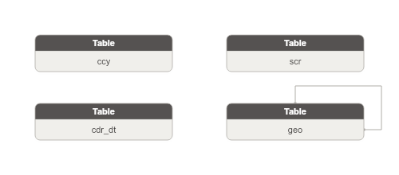

**Danh sách bảng:**

| STT | Tên bảng | Mô tả |
|---|---|---|
| 1 | geo | Đơn vị địa lý dùng làm FK tham chiếu: quốc gia/quốc tịch (COUNTRY), vùng/miền (REGION), tỉnh/thành phố mới/cũ (PROVINCE/PROVINCE_OLD), quận/huyện cũ (DISTRICT_OLD), phường/xã mới/cũ (WARD/WARD_OLD). Phân biệt bằng geographic_area_type_code. Hỗ trợ song song bộ danh mục pre- và post-sáp nhập hành chính 2025. |
| 2 | cdr_dt | Ngày dương lịch dense (ETL tự sinh mọi ngày trong phạm vi hệ thống). ECAT_29_HolidayInfo bổ sung cờ ngày nghỉ lễ công cộng (holiday_flag) và tên ngày lễ. PK dạng yyyymmdd. |
| 3 | ccy | Đơn vị tiền tệ theo chuẩn ISO 4217. ECAT là source chuẩn (authoritative). Currency là data domain riêng theo quy tắc #4 — không có surrogate key, BK = currency_code 3 ký tự. |
| 4 | scr | Danh mục chứng khoán đang/đã lưu hành trên thị trường Việt Nam (cổ phiếu, trái phiếu, chứng chỉ quỹ, chứng quyền...). ECAT là source chuẩn cho Code + Name. Các source khác (GSGD/FIMS/IDS) sẽ mở rộng attribute sau. |

### Bảng geo

#### Từ ECAT.ECAT_01_Country

| STT | Tên trường | Kiểu dữ liệu và độ dài | Nullable | Unique | P/F Key | Mặc định | Mô tả |
|---|---|---|---|---|---|---|---|
| 1 | geo_id | STRING |  | X | P |  | Khóa đại diện cho khu vực địa lý. |
| 2 | geo_code | STRING |  |  |  |  | Mã khu vực địa lý. Map từ PK bảng nguồn (cột code/id tùy bảng). Dùng chung cho mọi cấp hành chính. |
| 3 | src_stm_code | STRING |  |  |  | 'ECAT.ECAT_01_Country' | Mã hệ thống nguồn. |
| 4 | geo_shrt_code | STRING | X |  |  |  | Mã viết tắt quốc tịch/quốc gia. |
| 5 | geo_nm | STRING |  |  |  |  | Tên khu vực địa lý (tên đầy đủ tiếng Việt). |
| 6 | lcs_code | STRING | X |  |  |  | Trạng thái: 0: Không sử dụng 1: Sử dụng. |
| 7 | dsc | STRING | X |  |  |  | Mô tả. |
| 8 | crt_by | STRING | X |  |  |  | Người tạo bản ghi. |
| 9 | crt_tms | TIMESTAMP | X |  |  |  | Ngày tạo bản ghi. |
| 10 | udt_tms | TIMESTAMP | X |  |  |  | Ngày cập nhật bản ghi. |
| 11 | geo_tp_code | STRING |  |  |  | 'ETL derives từ bảng nguồn (ECAT_01→COUNTRY; ECAT_02→REGION; ECAT_03→PROVINCE_OLD; ECAT_04→PROVINCE; ECAT_05→DISTRICT_OLD; ECAT_06→WARD_OLD; ECAT_07→WARD)' | Loại khu vực địa lý — phân biệt cấp hành chính: COUNTRY/REGION/PROVINCE/PROVINCE_OLD/DISTRICT_OLD/WARD/WARD_OLD. |
| 12 | geo_bsn_code | STRING | X |  |  |  | Mã quốc tịch/quốc gia (mã nghiệp vụ). |
| 13 | note | STRING | X |  |  |  | Ghi chú. |
| 14 | prn_geo_id | STRING | X |  | F |  | FK tự tham chiếu đến khu vực cha trong phân cấp hành chính. |
| 15 | prn_geo_code | STRING | X |  |  |  | Mã khu vực cha — denormalized để tiện tra cứu. |

**Khóa chính (Primary Key):**

| Tên trường |
|---|
| geo_id |

**Khóa phụ (Foreign Key):**

| Tên trường | Bảng tham chiếu | Cột tham chiếu |
|---|---|---|
| prn_geo_id | geo | geo_id |

**Index:** N/A

**Trigger:** N/A

#### Từ ECAT.ECAT_02_Region

| STT | Tên trường | Kiểu dữ liệu và độ dài | Nullable | Unique | P/F Key | Mặc định | Mô tả |
|---|---|---|---|---|---|---|---|
| 1 | geo_id | STRING |  | X | P |  | Khóa đại diện cho khu vực địa lý. |
| 2 | geo_code | STRING |  |  |  |  | Mã khu vực địa lý. Map từ PK bảng nguồn (cột code/id tùy bảng). Dùng chung cho mọi cấp hành chính. |
| 3 | src_stm_code | STRING |  |  |  | 'ECAT.ECAT_02_Region' | Mã hệ thống nguồn. |
| 4 | geo_shrt_code | STRING | X |  |  |  | Mã viết tắt quốc tịch/quốc gia. |
| 5 | geo_nm | STRING |  |  |  |  | Tên khu vực địa lý (tên đầy đủ tiếng Việt). |
| 6 | lcs_code | STRING | X |  |  |  | Trạng thái: 0: Không sử dụng 1: Sử dụng. |
| 7 | dsc | STRING | X |  |  |  | Mô tả. |
| 8 | crt_by | STRING | X |  |  |  | Người tạo bản ghi. |
| 9 | crt_tms | TIMESTAMP | X |  |  |  | Ngày tạo bản ghi. |
| 10 | udt_tms | TIMESTAMP | X |  |  |  | Ngày cập nhật bản ghi. |
| 11 | geo_tp_code | STRING |  |  |  | 'ETL derives từ bảng nguồn (ECAT_01→COUNTRY; ECAT_02→REGION; ECAT_03→PROVINCE_OLD; ECAT_04→PROVINCE; ECAT_05→DISTRICT_OLD; ECAT_06→WARD_OLD; ECAT_07→WARD)' | Loại khu vực địa lý — phân biệt cấp hành chính: COUNTRY/REGION/PROVINCE/PROVINCE_OLD/DISTRICT_OLD/WARD/WARD_OLD. |
| 12 | geo_bsn_code | STRING | X |  |  |  | Mã quốc tịch/quốc gia (mã nghiệp vụ). |
| 13 | note | STRING | X |  |  |  | Ghi chú. |
| 14 | prn_geo_id | STRING | X |  | F |  | FK tự tham chiếu đến khu vực cha trong phân cấp hành chính. |
| 15 | prn_geo_code | STRING | X |  |  |  | Mã khu vực cha — denormalized để tiện tra cứu. |

**Khóa chính (Primary Key):**

| Tên trường |
|---|
| geo_id |

**Khóa phụ (Foreign Key):**

| Tên trường | Bảng tham chiếu | Cột tham chiếu |
|---|---|---|
| prn_geo_id | geo | geo_id |

**Index:** N/A

**Trigger:** N/A

#### Từ ECAT.ECAT_03_ProvinceOld

| STT | Tên trường | Kiểu dữ liệu và độ dài | Nullable | Unique | P/F Key | Mặc định | Mô tả |
|---|---|---|---|---|---|---|---|
| 1 | geo_id | STRING |  | X | P |  | Khóa đại diện cho khu vực địa lý. |
| 2 | geo_code | STRING |  |  |  |  | Mã khu vực địa lý. Map từ PK bảng nguồn (cột code/id tùy bảng). Dùng chung cho mọi cấp hành chính. |
| 3 | src_stm_code | STRING |  |  |  | 'ECAT.ECAT_03_ProvinceOld' | Mã hệ thống nguồn. |
| 4 | geo_shrt_code | STRING | X |  |  |  | Mã viết tắt quốc tịch/quốc gia. |
| 5 | geo_nm | STRING |  |  |  |  | Tên khu vực địa lý (tên đầy đủ tiếng Việt). |
| 6 | lcs_code | STRING | X |  |  |  | Trạng thái: 0: Không sử dụng 1: Sử dụng. |
| 7 | dsc | STRING | X |  |  |  | Mô tả. |
| 8 | crt_by | STRING | X |  |  |  | Người tạo bản ghi. |
| 9 | crt_tms | TIMESTAMP | X |  |  |  | Ngày tạo bản ghi. |
| 10 | udt_tms | TIMESTAMP | X |  |  |  | Ngày cập nhật bản ghi. |
| 11 | geo_tp_code | STRING |  |  |  | 'ETL derives từ bảng nguồn (ECAT_01→COUNTRY; ECAT_02→REGION; ECAT_03→PROVINCE_OLD; ECAT_04→PROVINCE; ECAT_05→DISTRICT_OLD; ECAT_06→WARD_OLD; ECAT_07→WARD)' | Loại khu vực địa lý — phân biệt cấp hành chính: COUNTRY/REGION/PROVINCE/PROVINCE_OLD/DISTRICT_OLD/WARD/WARD_OLD. |
| 12 | geo_bsn_code | STRING | X |  |  |  | Mã quốc tịch/quốc gia (mã nghiệp vụ). |
| 13 | note | STRING | X |  |  |  | Ghi chú. |
| 14 | prn_geo_id | STRING | X |  | F |  | FK tự tham chiếu đến khu vực cha trong phân cấp hành chính. |
| 15 | prn_geo_code | STRING | X |  |  |  | Mã khu vực cha — denormalized để tiện tra cứu. |

**Khóa chính (Primary Key):**

| Tên trường |
|---|
| geo_id |

**Khóa phụ (Foreign Key):**

| Tên trường | Bảng tham chiếu | Cột tham chiếu |
|---|---|---|
| prn_geo_id | geo | geo_id |

**Index:** N/A

**Trigger:** N/A

#### Từ ECAT.ECAT_04_Province

| STT | Tên trường | Kiểu dữ liệu và độ dài | Nullable | Unique | P/F Key | Mặc định | Mô tả |
|---|---|---|---|---|---|---|---|
| 1 | geo_id | STRING |  | X | P |  | Khóa đại diện cho khu vực địa lý. |
| 2 | geo_code | STRING |  |  |  |  | Mã khu vực địa lý. Map từ PK bảng nguồn (cột code/id tùy bảng). Dùng chung cho mọi cấp hành chính. |
| 3 | src_stm_code | STRING |  |  |  | 'ECAT.ECAT_04_Province' | Mã hệ thống nguồn. |
| 4 | geo_shrt_code | STRING | X |  |  |  | Mã viết tắt quốc tịch/quốc gia. |
| 5 | geo_nm | STRING |  |  |  |  | Tên khu vực địa lý (tên đầy đủ tiếng Việt). |
| 6 | lcs_code | STRING | X |  |  |  | Trạng thái: 0: Không sử dụng 1: Sử dụng. |
| 7 | dsc | STRING | X |  |  |  | Mô tả. |
| 8 | crt_by | STRING | X |  |  |  | Người tạo bản ghi. |
| 9 | crt_tms | TIMESTAMP | X |  |  |  | Ngày tạo bản ghi. |
| 10 | udt_tms | TIMESTAMP | X |  |  |  | Ngày cập nhật bản ghi. |
| 11 | geo_tp_code | STRING |  |  |  | 'ETL derives từ bảng nguồn (ECAT_01→COUNTRY; ECAT_02→REGION; ECAT_03→PROVINCE_OLD; ECAT_04→PROVINCE; ECAT_05→DISTRICT_OLD; ECAT_06→WARD_OLD; ECAT_07→WARD)' | Loại khu vực địa lý — phân biệt cấp hành chính: COUNTRY/REGION/PROVINCE/PROVINCE_OLD/DISTRICT_OLD/WARD/WARD_OLD. |
| 12 | geo_bsn_code | STRING | X |  |  |  | Mã quốc tịch/quốc gia (mã nghiệp vụ). |
| 13 | note | STRING | X |  |  |  | Ghi chú. |
| 14 | prn_geo_id | STRING | X |  | F |  | FK tự tham chiếu đến khu vực cha trong phân cấp hành chính. |
| 15 | prn_geo_code | STRING | X |  |  |  | Mã khu vực cha — denormalized để tiện tra cứu. |

**Khóa chính (Primary Key):**

| Tên trường |
|---|
| geo_id |

**Khóa phụ (Foreign Key):**

| Tên trường | Bảng tham chiếu | Cột tham chiếu |
|---|---|---|
| prn_geo_id | geo | geo_id |

**Index:** N/A

**Trigger:** N/A

#### Từ ECAT.ECAT_05_DistrictOld

| STT | Tên trường | Kiểu dữ liệu và độ dài | Nullable | Unique | P/F Key | Mặc định | Mô tả |
|---|---|---|---|---|---|---|---|
| 1 | geo_id | STRING |  | X | P |  | Khóa đại diện cho khu vực địa lý. |
| 2 | geo_code | STRING |  |  |  |  | Mã khu vực địa lý. Map từ PK bảng nguồn (cột code/id tùy bảng). Dùng chung cho mọi cấp hành chính. |
| 3 | src_stm_code | STRING |  |  |  | 'ECAT.ECAT_05_DistrictOld' | Mã hệ thống nguồn. |
| 4 | geo_shrt_code | STRING | X |  |  |  | Mã viết tắt quốc tịch/quốc gia. |
| 5 | geo_nm | STRING |  |  |  |  | Tên khu vực địa lý (tên đầy đủ tiếng Việt). |
| 6 | lcs_code | STRING | X |  |  |  | Trạng thái: 0: Không sử dụng 1: Sử dụng. |
| 7 | dsc | STRING | X |  |  |  | Mô tả. |
| 8 | crt_by | STRING | X |  |  |  | Người tạo bản ghi. |
| 9 | crt_tms | TIMESTAMP | X |  |  |  | Ngày tạo bản ghi. |
| 10 | udt_tms | TIMESTAMP | X |  |  |  | Ngày cập nhật bản ghi. |
| 11 | geo_tp_code | STRING |  |  |  | 'ETL derives từ bảng nguồn (ECAT_01→COUNTRY; ECAT_02→REGION; ECAT_03→PROVINCE_OLD; ECAT_04→PROVINCE; ECAT_05→DISTRICT_OLD; ECAT_06→WARD_OLD; ECAT_07→WARD)' | Loại khu vực địa lý — phân biệt cấp hành chính: COUNTRY/REGION/PROVINCE/PROVINCE_OLD/DISTRICT_OLD/WARD/WARD_OLD. |
| 12 | geo_bsn_code | STRING | X |  |  |  | Mã quốc tịch/quốc gia (mã nghiệp vụ). |
| 13 | note | STRING | X |  |  |  | Ghi chú. |
| 14 | prn_geo_id | STRING | X |  | F |  | FK tự tham chiếu đến khu vực cha trong phân cấp hành chính. |
| 15 | prn_geo_code | STRING | X |  |  |  | Mã khu vực cha — denormalized để tiện tra cứu. |

**Khóa chính (Primary Key):**

| Tên trường |
|---|
| geo_id |

**Khóa phụ (Foreign Key):**

| Tên trường | Bảng tham chiếu | Cột tham chiếu |
|---|---|---|
| prn_geo_id | geo | geo_id |

**Index:** N/A

**Trigger:** N/A

#### Từ ECAT.ECAT_06_WardOld

| STT | Tên trường | Kiểu dữ liệu và độ dài | Nullable | Unique | P/F Key | Mặc định | Mô tả |
|---|---|---|---|---|---|---|---|
| 1 | geo_id | STRING |  | X | P |  | Khóa đại diện cho khu vực địa lý. |
| 2 | geo_code | STRING |  |  |  |  | Mã khu vực địa lý. Map từ PK bảng nguồn (cột code/id tùy bảng). Dùng chung cho mọi cấp hành chính. |
| 3 | src_stm_code | STRING |  |  |  | 'ECAT.ECAT_06_WardOld' | Mã hệ thống nguồn. |
| 4 | geo_shrt_code | STRING | X |  |  |  | Mã viết tắt quốc tịch/quốc gia. |
| 5 | geo_nm | STRING |  |  |  |  | Tên khu vực địa lý (tên đầy đủ tiếng Việt). |
| 6 | lcs_code | STRING | X |  |  |  | Trạng thái: 0: Không sử dụng 1: Sử dụng. |
| 7 | dsc | STRING | X |  |  |  | Mô tả. |
| 8 | crt_by | STRING | X |  |  |  | Người tạo bản ghi. |
| 9 | crt_tms | TIMESTAMP | X |  |  |  | Ngày tạo bản ghi. |
| 10 | udt_tms | TIMESTAMP | X |  |  |  | Ngày cập nhật bản ghi. |
| 11 | geo_tp_code | STRING |  |  |  | 'ETL derives từ bảng nguồn (ECAT_01→COUNTRY; ECAT_02→REGION; ECAT_03→PROVINCE_OLD; ECAT_04→PROVINCE; ECAT_05→DISTRICT_OLD; ECAT_06→WARD_OLD; ECAT_07→WARD)' | Loại khu vực địa lý — phân biệt cấp hành chính: COUNTRY/REGION/PROVINCE/PROVINCE_OLD/DISTRICT_OLD/WARD/WARD_OLD. |
| 12 | geo_bsn_code | STRING | X |  |  |  | Mã quốc tịch/quốc gia (mã nghiệp vụ). |
| 13 | note | STRING | X |  |  |  | Ghi chú. |
| 14 | prn_geo_id | STRING | X |  | F |  | FK tự tham chiếu đến khu vực cha trong phân cấp hành chính. |
| 15 | prn_geo_code | STRING | X |  |  |  | Mã khu vực cha — denormalized để tiện tra cứu. |

**Khóa chính (Primary Key):**

| Tên trường |
|---|
| geo_id |

**Khóa phụ (Foreign Key):**

| Tên trường | Bảng tham chiếu | Cột tham chiếu |
|---|---|---|
| prn_geo_id | geo | geo_id |

**Index:** N/A

**Trigger:** N/A

#### Từ ECAT.ECAT_07_Ward

| STT | Tên trường | Kiểu dữ liệu và độ dài | Nullable | Unique | P/F Key | Mặc định | Mô tả |
|---|---|---|---|---|---|---|---|
| 1 | geo_id | STRING |  | X | P |  | Khóa đại diện cho khu vực địa lý. |
| 2 | geo_code | STRING |  |  |  |  | Mã khu vực địa lý. Map từ PK bảng nguồn (cột code/id tùy bảng). Dùng chung cho mọi cấp hành chính. |
| 3 | src_stm_code | STRING |  |  |  | 'ECAT.ECAT_07_Ward' | Mã hệ thống nguồn. |
| 4 | geo_shrt_code | STRING | X |  |  |  | Mã viết tắt quốc tịch/quốc gia. |
| 5 | geo_nm | STRING |  |  |  |  | Tên khu vực địa lý (tên đầy đủ tiếng Việt). |
| 6 | lcs_code | STRING | X |  |  |  | Trạng thái: 0: Không sử dụng 1: Sử dụng. |
| 7 | dsc | STRING | X |  |  |  | Mô tả. |
| 8 | crt_by | STRING | X |  |  |  | Người tạo bản ghi. |
| 9 | crt_tms | TIMESTAMP | X |  |  |  | Ngày tạo bản ghi. |
| 10 | udt_tms | TIMESTAMP | X |  |  |  | Ngày cập nhật bản ghi. |
| 11 | geo_tp_code | STRING |  |  |  | 'ETL derives từ bảng nguồn (ECAT_01→COUNTRY; ECAT_02→REGION; ECAT_03→PROVINCE_OLD; ECAT_04→PROVINCE; ECAT_05→DISTRICT_OLD; ECAT_06→WARD_OLD; ECAT_07→WARD)' | Loại khu vực địa lý — phân biệt cấp hành chính: COUNTRY/REGION/PROVINCE/PROVINCE_OLD/DISTRICT_OLD/WARD/WARD_OLD. |
| 12 | geo_bsn_code | STRING | X |  |  |  | Mã quốc tịch/quốc gia (mã nghiệp vụ). |
| 13 | note | STRING | X |  |  |  | Ghi chú. |
| 14 | prn_geo_id | STRING | X |  | F |  | FK tự tham chiếu đến khu vực cha trong phân cấp hành chính. |
| 15 | prn_geo_code | STRING | X |  |  |  | Mã khu vực cha — denormalized để tiện tra cứu. |

**Khóa chính (Primary Key):**

| Tên trường |
|---|
| geo_id |

**Khóa phụ (Foreign Key):**

| Tên trường | Bảng tham chiếu | Cột tham chiếu |
|---|---|---|
| prn_geo_id | geo | geo_id |

**Index:** N/A

**Trigger:** N/A

### Bảng cdr_dt

| STT | Tên trường | Kiểu dữ liệu và độ dài | Nullable | Unique | P/F Key | Mặc định | Mô tả |
|---|---|---|---|---|---|---|---|
| 1 | cdr_dt_id | INT |  | X | P |  | Khóa ngày dương lịch dạng số nguyên yyyymmdd (ví dụ: 20250429). ETL sinh dense cho toàn bộ khoảng thời gian hệ thống theo dõi. |
| 2 | cdr_dt | DATE |  |  |  | 'ETL generated (dense)' | Ngày dương lịch (duy nhất). BK của entity. |
| 3 | src_stm_code | STRING |  |  |  | 'ECAT.ECAT_29_HolidayInfo' | Mã hệ thống nguồn. |
| 4 | hol_f | BOOLEAN |  |  |  | 'false' | Cờ ngày nghỉ lễ công cộng. Mặc định = false; set = true nếu ngày có trong ECAT_29_HolidayInfo. |
| 5 | hol_nm | STRING | X |  |  |  | Tên ngày lễ (ví dụ: Tết Dương lịch, Quốc khánh). NULL nếu không phải ngày nghỉ công cộng. |

#### Constraint

**Khóa chính (Primary Key):**

| Tên trường |
|---|
| cdr_dt_id |

**Khóa phụ (Foreign Key):**

*Không có Foreign Key.*

#### Index

N/A

#### Trigger

N/A

### Bảng ccy

| STT | Tên trường | Kiểu dữ liệu và độ dài | Nullable | Unique | P/F Key | Mặc định | Mô tả |
|---|---|---|---|---|---|---|---|
| 1 | ccy_code | STRING |  | X | P |  | Mã tiền tệ theo chuẩn ISO 4217 (3 ký tự: VND, USD, EUR...). Map từ PK bảng nguồn. |
| 2 | src_stm_code | STRING |  |  |  | 'ECAT.ECAT_11_Currency' | Mã hệ thống nguồn. |
| 3 | ccy_nm | STRING |  |  |  |  | Tên tiền tệ đầy đủ. |

#### Constraint

**Khóa chính (Primary Key):**

| Tên trường |
|---|
| ccy_code |

**Khóa phụ (Foreign Key):**

*Không có Foreign Key.*

#### Index

N/A

#### Trigger

N/A

### Bảng scr

| STT | Tên trường | Kiểu dữ liệu và độ dài | Nullable | Unique | P/F Key | Mặc định | Mô tả |
|---|---|---|---|---|---|---|---|
| 1 | scr_id | STRING |  | X | P |  | Khóa đại diện cho chứng khoán. |
| 2 | scr_code | STRING |  |  |  |  | Mã chứng khoán (ví dụ: VIC, VCB, VN30F1M). Map từ PK bảng nguồn. Unique toàn thị trường. |
| 3 | src_stm_code | STRING |  |  |  | 'ECAT.ECAT_14_Security' | Mã hệ thống nguồn. |
| 4 | scr_nm | STRING |  |  |  |  | Tên chứng khoán đầy đủ. |
| 5 | scr_tp_code | STRING | X |  |  |  | Loại chứng khoán (cổ phiếu, trái phiếu, chứng chỉ quỹ, chứng quyền...). |
| 6 | mkt_code | STRING | X |  |  |  | Mã thị trường niêm yết/giao dịch (HOSE, HNX, UPCOM, OTC...). |

#### Constraint

**Khóa chính (Primary Key):**

| Tên trường |
|---|
| scr_id |

**Khóa phụ (Foreign Key):**

*Không có Foreign Key.*

#### Index

N/A

#### Trigger

N/A

### Stored Procedure/Function

N/A

### Package

N/A

## FIMS — Hệ thống quản lý giám sát nhà đầu tư nước ngoài

### Các mô hình quan hệ dữ liệu

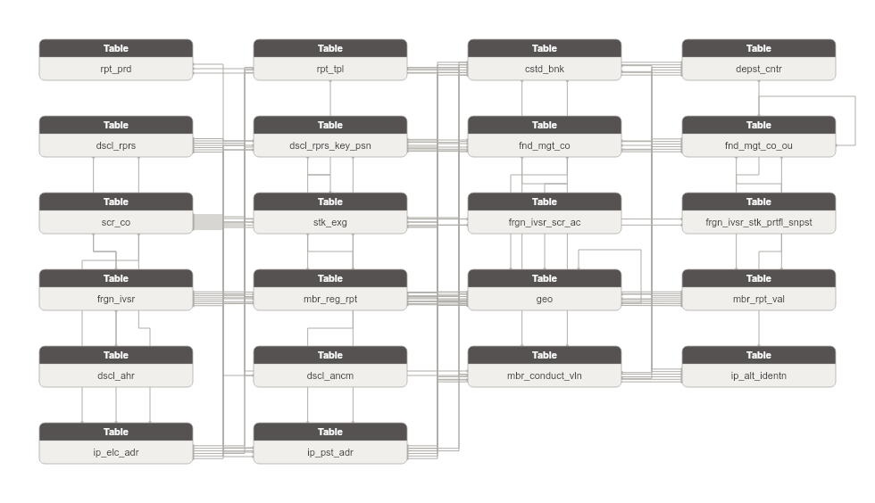

**Danh sách bảng:**

| STT | Tên bảng | Mô tả |
|---|---|---|
| 1 | dscl_ahr | Ủy quyền công bố thông tin của người đại diện CBTT cho nhà đầu tư nước ngoài. Ghi nhận bên được ủy quyền, loại quan hệ và thời hạn hiệu lực. |
| 2 | frgn_ivsr_scr_ac | Tài khoản giao dịch chứng khoán của nhà đầu tư nước ngoài tại công ty chứng khoán. |
| 3 | frgn_ivsr_stk_prtfl_snpst | Danh mục sở hữu chứng khoán của nhà đầu tư nước ngoài tại từng công ty chứng khoán. |
| 4 | mbr_conduct_vln | Vi phạm được ghi nhận từ cảnh báo hệ thống hoặc kiểm tra định kỳ đối với thành viên thị trường. |
| 5 | dscl_ancm | Tin công bố thông tin của thành viên thị trường qua người đại diện CBTT. |
| 6 | rpt_prd | Kỳ báo cáo định kỳ (ngày/tuần/tháng/quý/bán niên/năm) mà thành viên thị trường phải nộp báo cáo lên UBCKNN. |
| 7 | mbr_reg_rpt | Báo cáo định kỳ của thành viên thị trường nộp lên UBCK. Ghi nhận biểu mẫu, kỳ, trạng thái nộp và thành viên nộp. |
| 8 | mbr_rpt_val | Giá trị từng chỉ tiêu trong báo cáo định kỳ của thành viên. Mỗi dòng = 1 chỉ tiêu trong 1 báo cáo. |
| 9 | rpt_tpl | Biểu mẫu báo cáo đầu vào - khuôn mẫu tờ khai định kỳ mà thành viên thị trường phải nộp theo quy định. |
| 10 | cstd_bnk | Ngân hàng lưu ký giám sát tài sản quỹ đầu tư chứng khoán được UBCKNN chấp thuận. Chịu trách nhiệm lưu giữ và giám sát tài sản của quỹ. |
| 11 | depst_cntr | Trung tâm lưu ký chứng khoán quốc gia - thành viên thị trường trong hệ thống FIMS (VSD). |
| 12 | dscl_rprs | Người hoặc tổ chức đại diện thực hiện công bố thông tin trên thị trường chứng khoán. |
| 13 | dscl_rprs_key_psn | Nhân sự thực hiện công bố thông tin tại các tổ chức thành viên thị trường. |
| 14 | frgn_ivsr | Danh mục nhà đầu tư đăng ký giao dịch trên thị trường chứng khoán. Bao gồm cá nhân và tổ chức, phân biệt bằng ObjectType. |
| 15 | fnd_mgt_co | Công ty quản lý quỹ đầu tư chứng khoán trong nước được UBCKNN cấp phép hoạt động. Lưu thông tin pháp lý và hoạt động của công ty. |
| 16 | fnd_mgt_co_ou | Chi nhánh hoặc văn phòng đại diện của công ty quản lý quỹ trong nước. Có địa chỉ và giấy phép hoạt động riêng. |
| 17 | scr_co | Công ty chứng khoán - thành viên thị trường trong hệ thống FIMS. Quản lý tài khoản và danh mục NĐT nước ngoài. |
| 18 | stk_exg | Sở giao dịch chứng khoán - thành viên thị trường trong hệ thống FIMS (HNX, HOSE). |
| 19 | geo | Đơn vị địa lý dùng làm FK tham chiếu: quốc gia/quốc tịch (COUNTRY), vùng/miền (REGION), tỉnh/thành phố mới/cũ (PROVINCE/PROVINCE_OLD), quận/huyện cũ (DISTRICT_OLD), phường/xã mới/cũ (WARD/WARD_OLD). Phân biệt bằng geographic_area_type_code. Hỗ trợ song song bộ danh mục pre- và post-sáp nhập hành chính 2025. |
| 20 | ip_alt_identn | Lưu trữ các giấy tờ định danh thay thế của Involved Party (CMND/CCCD/Hộ chiếu/Giấy phép kinh doanh/Chứng chỉ hành nghề). Mỗi dòng = 1 loại giấy tờ từ 1 nguồn. |
| 21 | ip_elc_adr | Lưu trữ các địa chỉ liên lạc điện tử của Involved Party (điện thoại/fax/email). Mỗi dòng = 1 kênh liên lạc từ 1 nguồn. |
| 22 | ip_pst_adr | Lưu trữ các địa chỉ bưu chính của Involved Party (trụ sở/kinh doanh/thường trú/nơi ở hiện tại). Mỗi dòng = 1 loại địa chỉ từ 1 nguồn. |

### Bảng dscl_ahr

| STT | Tên trường | Kiểu dữ liệu và độ dài | Nullable | Unique | P/F Key | Mặc định | Mô tả |
|---|---|---|---|---|---|---|---|
| 1 | dscl_ahr_id | STRING |  | X | P |  | Khóa đại diện cho ủy quyền CBTT. |
| 2 | dscl_ahr_code | STRING |  |  |  |  | Mã ủy quyền CBTT. Map từ PK bảng nguồn. |
| 3 | src_stm_code | STRING |  |  |  | 'FIMS.AUTHOANNOUNCE' | Mã nguồn dữ liệu. |
| 4 | dscl_rprs_id | STRING |  |  | F |  | FK đến người đại diện CBTT được ủy quyền. |
| 5 | dscl_rprs_code | STRING |  |  |  |  | Mã người đại diện CBTT được ủy quyền. |
| 6 | rltnp_tp_code | STRING | X |  |  |  | Loại quan hệ ủy quyền. Dữ liệu lấy từ trường ID của bảng RELATIONSHIP. |
| 7 | rel_properties_code | STRING | X |  |  |  | Hình thức liên quan trong ủy quyền. Dữ liệu lấy từ trường ID của bảng RELATEDPROPERTIES. |
| 8 | eff_strt_dt | DATE | X |  |  |  | Ngày bắt đầu có hiệu lực ủy quyền. |
| 9 | eff_end_dt | DATE | X |  |  |  | Ngày kết thúc hiệu lực ủy quyền. |
| 10 | crt_by | STRING | X |  |  |  | Người tạo bản ghi. |
| 11 | crt_tms | TIMESTAMP | X |  |  |  | Ngày tạo bản ghi. |
| 12 | udt_tms | TIMESTAMP | X |  |  |  | Ngày cập nhật bản ghi. |

#### Constraint

**Khóa chính (Primary Key):**

| Tên trường |
|---|
| dscl_ahr_id |

**Khóa phụ (Foreign Key):**

| Tên trường | Bảng tham chiếu | Cột tham chiếu |
|---|---|---|
| dscl_rprs_id | dscl_rprs | dscl_rprs_id |

#### Index

N/A

#### Trigger

N/A

### Bảng frgn_ivsr_scr_ac

| STT | Tên trường | Kiểu dữ liệu và độ dài | Nullable | Unique | P/F Key | Mặc định | Mô tả |
|---|---|---|---|---|---|---|---|
| 1 | frgn_ivsr_scr_ac_id | STRING |  | X | P |  | Khóa đại diện cho tài khoản giao dịch chứng khoán. |
| 2 | frgn_ivsr_scr_ac_code | STRING |  |  |  |  | Mã tài khoản. Map từ PK bảng nguồn. |
| 3 | src_stm_code | STRING |  |  |  | 'FIMS.SECURITIESACCOUNT' | Mã nguồn dữ liệu. |
| 4 | scr_co_id | STRING |  |  | F |  | FK đến công ty chứng khoán nơi mở tài khoản. |
| 5 | scr_co_code | STRING |  |  |  |  | Mã công ty chứng khoán nơi mở tài khoản. |
| 6 | frgn_ivsr_id | STRING |  |  | F |  | FK đến nhà đầu tư nước ngoài chủ tài khoản. |
| 7 | frgn_ivsr_code | STRING |  |  |  |  | Mã nhà đầu tư nước ngoài chủ tài khoản. |
| 8 | ac_nbr | STRING |  |  |  |  | Số tài khoản giao dịch chứng khoán. |

#### Constraint

**Khóa chính (Primary Key):**

| Tên trường |
|---|
| frgn_ivsr_scr_ac_id |

**Khóa phụ (Foreign Key):**

| Tên trường | Bảng tham chiếu | Cột tham chiếu |
|---|---|---|
| scr_co_id | scr_co | scr_co_id |
| frgn_ivsr_id | frgn_ivsr | frgn_ivsr_id |

#### Index

N/A

#### Trigger

N/A

### Bảng frgn_ivsr_stk_prtfl_snpst

| STT | Tên trường | Kiểu dữ liệu và độ dài | Nullable | Unique | P/F Key | Mặc định | Mô tả |
|---|---|---|---|---|---|---|---|
| 1 | frgn_ivsr_stk_prtfl_snpst_id | STRING |  | X | P |  | Khóa đại diện cho vị thế sở hữu chứng khoán. |
| 2 | frgn_ivsr_stk_prtfl_snpst_code | STRING |  |  |  |  | Mã vị thế. Map từ PK bảng nguồn. |
| 3 | src_stm_code | STRING |  |  |  | 'FIMS.CATEGORIESSTOCK' | Mã nguồn dữ liệu. |
| 4 | scr_co_id | STRING |  |  | F |  | FK đến công ty chứng khoán lưu giữ danh mục. |
| 5 | scr_co_code | STRING |  |  |  |  | Mã công ty chứng khoán lưu giữ danh mục. |
| 6 | frgn_ivsr_id | STRING |  |  | F |  | FK đến nhà đầu tư nước ngoài sở hữu danh mục. |
| 7 | frgn_ivsr_code | STRING |  |  |  |  | Mã nhà đầu tư nước ngoài sở hữu danh mục. |
| 8 | qty | INT | X |  |  |  | Số lượng chứng khoán sở hữu. |
| 9 | own_rate | DECIMAL(5,2) | X |  |  |  | Tỷ lệ % sở hữu chứng khoán. |

#### Constraint

**Khóa chính (Primary Key):**

| Tên trường |
|---|
| frgn_ivsr_stk_prtfl_snpst_id |

**Khóa phụ (Foreign Key):**

| Tên trường | Bảng tham chiếu | Cột tham chiếu |
|---|---|---|
| scr_co_id | scr_co | scr_co_id |
| frgn_ivsr_id | frgn_ivsr | frgn_ivsr_id |

#### Index

N/A

#### Trigger

N/A

### Bảng mbr_conduct_vln

| STT | Tên trường | Kiểu dữ liệu và độ dài | Nullable | Unique | P/F Key | Mặc định | Mô tả |
|---|---|---|---|---|---|---|---|
| 1 | mbr_conduct_vln_id | STRING |  | X | P |  | Khóa đại diện cho vi phạm. |
| 2 | mbr_conduct_vln_code | STRING |  |  |  |  | Mã vi phạm. Map từ PK bảng nguồn. |
| 3 | src_stm_code | STRING |  |  |  | 'FIMS.VIOLT' | Mã nguồn dữ liệu. |
| 4 | fnd_mgt_co_id | STRING | X |  | F |  | FK đến công ty QLQ vi phạm (nullable — chỉ 1 trong các FK thành viên có giá trị). |
| 5 | fnd_mgt_co_code | STRING | X |  |  |  | Mã công ty QLQ vi phạm. |
| 6 | scr_co_id | STRING | X |  | F |  | FK đến công ty chứng khoán vi phạm. |
| 7 | scr_co_code | STRING | X |  |  |  | Mã công ty chứng khoán vi phạm. |
| 8 | cstd_bnk_id | STRING | X |  | F |  | FK đến ngân hàng lưu ký vi phạm. |
| 9 | cstd_bnk_code | STRING | X |  |  |  | Mã ngân hàng lưu ký vi phạm. |
| 10 | depst_cntr_id | STRING | X |  | F |  | FK đến trung tâm lưu ký vi phạm. |
| 11 | depst_cntr_code | STRING | X |  |  |  | Mã trung tâm lưu ký vi phạm. |
| 12 | stk_exg_id | STRING | X |  | F |  | FK đến sở giao dịch chứng khoán vi phạm. |
| 13 | stk_exg_code | STRING | X |  |  |  | Mã sở giao dịch chứng khoán vi phạm. |
| 14 | dscl_rprs_id | STRING | X |  | F |  | FK đến người đại diện CBTT vi phạm. |
| 15 | dscl_rprs_code | STRING | X |  |  |  | Mã người đại diện CBTT vi phạm. |
| 16 | fnd_mgt_co_ou_id | STRING | X |  | F |  | FK đến chi nhánh công ty QLQ NN vi phạm. |
| 17 | fnd_mgt_co_ou_code | STRING | X |  |  |  | Mã chi nhánh công ty QLQ NN vi phạm. |
| 18 | wrn_parm_id | STRING | X |  | F |  | FK đến tham số cảnh báo (PARAWARN). Nullable. |
| 19 | wrn_parm_code | STRING | X |  |  |  | Mã tham số cảnh báo. |
| 20 | wrn_cd_id | STRING | X |  | F |  | FK đến điều kiện cảnh báo (CDTWARN). Nullable. |
| 21 | wrn_cd_code | STRING | X |  |  |  | Mã điều kiện cảnh báo. |
| 22 | mbr_obj_tp_code | STRING | X |  |  |  | Loại đối tượng vi phạm: 1: Công ty QLQ 2: CTCK 3: NHLK 4: TTLK 5: SGDCK 6: Người đại diện CBTT 7: CN CTQLQ NN tại VN. |
| 23 | ivsr_nm | STRING | X |  |  |  | Nhà đầu tư liên quan (denormalized). |
| 24 | vln_yr | INT | X |  |  |  | Năm cảnh báo vi phạm. |
| 25 | vln_prd_tp_code | STRING | X |  |  |  | Kỳ cảnh báo: 1: Ngày 2: Tuần 3: Nửa tháng 4: Tháng 5: Quý 6: Bán niên 7: Năm. |
| 26 | vln_prd_val | INT | X |  |  |  | Giá trị kỳ cảnh báo. |
| 27 | vln_st_code | STRING | X |  |  |  | Trạng thái xử lý: 0: Chưa khắc phục 1: Khắc phục. |
| 28 | vln_val | STRING | X |  |  |  | Giá trị vi phạm. |
| 29 | vln_dt | DATE | X |  |  |  | Ngày phát sinh cảnh báo vi phạm. |
| 30 | cmpr_prd_tp_code | STRING | X |  |  |  | Kỳ tham số so sánh. |
| 31 | cmpr_prd_val | INT | X |  |  |  | Giá trị kỳ tham số so sánh. |
| 32 | cmpr_val | STRING | X |  |  |  | Giá trị tham số so sánh. |

#### Constraint

**Khóa chính (Primary Key):**

| Tên trường |
|---|
| mbr_conduct_vln_id |

**Khóa phụ (Foreign Key):**

| Tên trường | Bảng tham chiếu | Cột tham chiếu |
|---|---|---|
| fnd_mgt_co_id | fnd_mgt_co | fnd_mgt_co_id |
| scr_co_id | scr_co | scr_co_id |
| cstd_bnk_id | cstd_bnk | cstd_bnk_id |
| depst_cntr_id | depst_cntr | depst_cntr_id |
| stk_exg_id | stk_exg | stk_exg_id |
| dscl_rprs_id | dscl_rprs | dscl_rprs_id |
| fnd_mgt_co_ou_id | fnd_mgt_co_ou | fnd_mgt_co_ou_id |

#### Index

N/A

#### Trigger

N/A

### Bảng dscl_ancm

| STT | Tên trường | Kiểu dữ liệu và độ dài | Nullable | Unique | P/F Key | Mặc định | Mô tả |
|---|---|---|---|---|---|---|---|
| 1 | dscl_ancm_id | STRING |  | X | P |  | Khóa đại diện cho tin công bố thông tin. |
| 2 | dscl_ancm_code | STRING |  |  |  |  | Mã tin công bố. Map từ PK bảng nguồn. |
| 3 | src_stm_code | STRING |  |  |  | 'FIMS.ANNOUNCE' | Mã nguồn dữ liệu. |
| 4 | dscl_rprs_id | STRING |  |  | F |  | FK đến người đại diện CBTT gửi tin. |
| 5 | dscl_rprs_code | STRING |  |  |  |  | Mã người đại diện CBTT gửi tin. |
| 6 | ancm_tp_code | STRING | X |  |  |  | Loại CBTT. Dữ liệu lấy từ trường ID của bảng ANNOUNCETYPE. |
| 7 | ancm_ttl | STRING | X |  |  |  | Tiêu đề tin công bố. |
| 8 | cntnt_smy | STRING | X |  |  |  | Nội dung trích yếu. |
| 9 | ancm_dt | DATE | X |  |  |  | Ngày công bố thông tin. |
| 10 | ancm_st_code | STRING | X |  |  |  | Trạng thái CBTT: 0: Chưa gửi 1: Đã CBTT. |
| 11 | ancm_yr | INT | X |  |  |  | Năm báo cáo liên quan. |
| 12 | ancm_prd_tp_code | STRING | X |  |  |  | Kỳ báo cáo liên quan: 1: Ngày 2: Tuần 3: Nửa tháng 4: Tháng 5: Quý 6: Bán niên 7: Năm. |
| 13 | ancm_prd_val | INT | X |  |  |  | Giá trị kỳ báo cáo liên quan. |
| 14 | snd_by | STRING | X |  |  |  | Người gửi tin CBTT (denormalized). |
| 15 | dsc | STRING | X |  |  |  | Ghi chú. |
| 16 | frgn_ivsr_ids | ARRAY<STRUCT<...>> | X |  |  |  | Danh sách nhà đầu tư nước ngoài liên quan đến tin CBTT. InvesId → FK đến INVESTOR. |
| 17 | crt_by | STRING | X |  |  |  | Người tạo bản ghi. |
| 18 | crt_tms | TIMESTAMP | X |  |  |  | Ngày tạo bản ghi. |
| 19 | udt_tms | TIMESTAMP | X |  |  |  | Ngày cập nhật bản ghi. |

#### Constraint

**Khóa chính (Primary Key):**

| Tên trường |
|---|
| dscl_ancm_id |

**Khóa phụ (Foreign Key):**

| Tên trường | Bảng tham chiếu | Cột tham chiếu |
|---|---|---|
| dscl_rprs_id | dscl_rprs | dscl_rprs_id |

#### Index

N/A

#### Trigger

N/A

### Bảng rpt_prd

| STT | Tên trường | Kiểu dữ liệu và độ dài | Nullable | Unique | P/F Key | Mặc định | Mô tả |
|---|---|---|---|---|---|---|---|
| 1 | rpt_prd_id | STRING |  | X | P |  | Khóa đại diện cho kỳ báo cáo. |
| 2 | rpt_prd_code | STRING |  |  |  |  | Mã kỳ báo cáo. Map từ PK bảng nguồn. |
| 3 | src_stm_code | STRING |  |  |  | 'FIMS.RPTPERIOD' | Mã nguồn dữ liệu. |
| 4 | rpt_prd_nm | STRING |  |  |  |  | Tên kỳ báo cáo. |
| 5 | rpt_prd_tp_code | STRING | X |  |  |  | Kỳ báo cáo: 1: Ngày 2: Tuần 3: Nửa tháng 4: Tháng 5: Quý 6: Bán niên 7: Năm. |
| 6 | is_actv_f | BOOLEAN | X |  |  |  | Kỳ báo cáo đang hoạt động. |
| 7 | crt_by | STRING | X |  |  |  | Người tạo bản ghi. |
| 8 | crt_tms | TIMESTAMP | X |  |  |  | Ngày tạo bản ghi. |
| 9 | udt_tms | TIMESTAMP | X |  |  |  | Ngày cập nhật bản ghi. |
| 10 | self-set_prd_id | STRING | X |  | F |  | FK đến kỳ báo cáo do cán bộ UB tự thiết lập (SELFSETPD). Nullable. |
| 11 | self-set_prd_code | STRING | X |  |  |  | Mã kỳ báo cáo tự thiết lập. |
| 12 | rpt_tpl_id | STRING |  |  | F |  | FK đến biểu mẫu báo cáo áp dụng cho kỳ này. |
| 13 | rpt_tpl_code | STRING |  |  |  |  | Mã biểu mẫu báo cáo. |
| 14 | subm_ddln_dt | DATE | X |  |  |  | Thời hạn gửi báo cáo muộn nhất (áp dụng cho kỳ ngày/tuần). |
| 15 | subm_ddln_wk | INT | X |  |  |  | Thời hạn gửi báo cáo muộn nhất (tuần). |
| 16 | repeat_itrv | INT | X |  |  |  | Lặp lại sau bao nhiêu đơn vị kỳ. |
| 17 | counting_strt_dt | DATE | X |  |  |  | Ngày bắt đầu tính hạn nộp báo cáo. |
| 18 | is_wrk_day_ind | STRING | X |  |  |  | Đơn vị tính hạn nộp: 0: Ngày lịch 1: Ngày làm việc. |
| 19 | submit_wi_dys | INT | X |  |  |  | Số ngày/ngày làm việc được phép gửi báo cáo. |
| 20 | lcs_code | STRING | X |  |  |  | Trạng thái: 0: Không sử dụng 1: Sử dụng. |
| 21 | dsc | STRING | X |  |  |  | Ghi chú. |

#### Constraint

**Khóa chính (Primary Key):**

| Tên trường |
|---|
| rpt_prd_id |

**Khóa phụ (Foreign Key):**

| Tên trường | Bảng tham chiếu | Cột tham chiếu |
|---|---|---|
| rpt_tpl_id | rpt_tpl | rpt_tpl_id |

#### Index

N/A

#### Trigger

N/A

### Bảng mbr_reg_rpt

| STT | Tên trường | Kiểu dữ liệu và độ dài | Nullable | Unique | P/F Key | Mặc định | Mô tả |
|---|---|---|---|---|---|---|---|
| 1 | mbr_reg_rpt_id | STRING |  | X | P |  | Khóa đại diện cho lần nộp báo cáo của thành viên. |
| 2 | mbr_reg_rpt_code | STRING |  |  |  |  | Mã lần nộp báo cáo. Map từ PK bảng nguồn. |
| 3 | src_stm_code | STRING |  |  |  | 'FIMS.RPTMEMBER' | Mã nguồn dữ liệu. |
| 4 | rpt_tpl_id | STRING |  |  | F |  | FK đến biểu mẫu báo cáo. |
| 5 | rpt_tpl_code | STRING |  |  |  |  | Mã biểu mẫu báo cáo. |
| 6 | rpt_prd_id | STRING |  |  | F |  | FK đến kỳ báo cáo. |
| 7 | rpt_prd_code | STRING |  |  |  |  | Mã kỳ báo cáo. |
| 8 | fnd_mgt_co_id | STRING | X |  | F |  | FK đến công ty QLQ nộp báo cáo (ngữ cảnh nộp). |
| 9 | fnd_mgt_co_code | STRING | X |  |  |  | Mã công ty QLQ nộp báo cáo. |
| 10 | scr_co_id | STRING | X |  | F |  | FK đến công ty chứng khoán nộp báo cáo (ngữ cảnh nộp). |
| 11 | scr_co_code | STRING | X |  |  |  | Mã công ty chứng khoán nộp báo cáo. |
| 12 | cstd_bnk_id | STRING | X |  | F |  | FK đến ngân hàng lưu ký nộp báo cáo (ngữ cảnh nộp). |
| 13 | cstd_bnk_code | STRING | X |  |  |  | Mã ngân hàng lưu ký nộp báo cáo. |
| 14 | depst_cntr_id | STRING | X |  | F |  | FK đến trung tâm lưu ký nộp báo cáo (ngữ cảnh nộp). |
| 15 | depst_cntr_code | STRING | X |  |  |  | Mã trung tâm lưu ký nộp báo cáo. |
| 16 | stk_exg_id | STRING | X |  | F |  | FK đến sở giao dịch chứng khoán nộp báo cáo (ngữ cảnh nộp). |
| 17 | stk_exg_code | STRING | X |  |  |  | Mã sở giao dịch chứng khoán nộp báo cáo. |
| 18 | frgn_ivsr_id | STRING | X |  | F |  | FK đến nhà đầu tư nước ngoài nộp báo cáo (ngữ cảnh nộp). |
| 19 | frgn_ivsr_code | STRING | X |  |  |  | Mã nhà đầu tư nước ngoài nộp báo cáo. |
| 20 | fnd_mgt_co_ou_id | STRING | X |  | F |  | FK đến chi nhánh công ty QLQ NN nộp báo cáo (ngữ cảnh nộp). |
| 21 | fnd_mgt_co_ou_code | STRING | X |  |  |  | Mã chi nhánh công ty QLQ NN nộp báo cáo. |
| 22 | rpt_tp_code | STRING | X |  |  |  | Loại báo cáo. Dữ liệu lấy từ trường ID của bảng REPORTTYPE. |
| 23 | mbr_obj_tp_code | STRING | X |  |  |  | Loại đối tượng nộp báo cáo: 1: Công ty QLQ 2: CTCK 3: NHLK 4: TTLK 5: SGDCK 6: Người đại diện CBTT 7: CN CTQLQ NN tại VN. |
| 24 | is_impr_ind | STRING | X |  |  |  | Là báo cáo có import: 0: Không import 1: Có import. |
| 25 | rpt_nm | STRING | X |  |  |  | Tên báo cáo. |
| 26 | rpt_yr | INT | X |  |  |  | Năm báo cáo. |
| 27 | prd_val | INT | X |  |  |  | Giá trị kỳ báo cáo (số thứ tự kỳ trong năm). |
| 28 | rpt_dt | DATE | X |  |  |  | Ngày báo cáo. |
| 29 | subm_ddln_dt | DATE | X |  |  |  | Thời hạn gửi báo cáo. |
| 30 | subm_st_code | STRING | X |  |  |  | Trạng thái nộp: 1: Chưa gửi 2: Đã gửi 3: Gửi muộn 4: Bị hủy 5: Đã gửi lại. |
| 31 | subm_dt | DATE | X |  |  |  | Ngày gửi báo cáo thực tế. |
| 32 | cntnt_smy | STRING | X |  |  |  | Nội dung trích yếu. |
| 33 | note | STRING | X |  |  |  | Ghi chú. |
| 34 | rpt_prd_tp_code | STRING | X |  |  |  | Kỳ báo cáo: 1: Ngày 2: Tuần 3: Nửa tháng 4: Tháng 5: Quý 6: Bán niên 7: Năm. |
| 35 | is_wrk_day_ind | STRING | X |  |  |  | Là ngày làm việc: 1: Ngày làm việc 0: Ngày. |
| 36 | submit_wi_dys | INT | X |  |  |  | Số ngày được phép gửi báo cáo. |
| 37 | crt_by | STRING | X |  |  |  | Người tạo bản ghi. |
| 38 | crt_tms | TIMESTAMP | X |  |  |  | Ngày tạo bản ghi. |
| 39 | udt_tms | TIMESTAMP | X |  |  |  | Ngày cập nhật bản ghi. |

#### Constraint

**Khóa chính (Primary Key):**

| Tên trường |
|---|
| mbr_reg_rpt_id |

**Khóa phụ (Foreign Key):**

| Tên trường | Bảng tham chiếu | Cột tham chiếu |
|---|---|---|
| rpt_tpl_id | rpt_tpl | rpt_tpl_id |
| rpt_prd_id | rpt_prd | rpt_prd_id |
| fnd_mgt_co_id | fnd_mgt_co | fnd_mgt_co_id |
| scr_co_id | scr_co | scr_co_id |
| cstd_bnk_id | cstd_bnk | cstd_bnk_id |
| depst_cntr_id | depst_cntr | depst_cntr_id |
| stk_exg_id | stk_exg | stk_exg_id |
| frgn_ivsr_id | frgn_ivsr | frgn_ivsr_id |
| fnd_mgt_co_ou_id | fnd_mgt_co_ou | fnd_mgt_co_ou_id |

#### Index

N/A

#### Trigger

N/A

### Bảng mbr_rpt_val

| STT | Tên trường | Kiểu dữ liệu và độ dài | Nullable | Unique | P/F Key | Mặc định | Mô tả |
|---|---|---|---|---|---|---|---|
| 1 | mbr_rpt_val_id | STRING |  | X | P |  | Khóa đại diện cho giá trị chỉ tiêu báo cáo. |
| 2 | mbr_rpt_val_code | STRING |  |  |  |  | Mã giá trị chỉ tiêu. Map từ PK bảng nguồn. |
| 3 | src_stm_code | STRING |  |  |  | 'FIMS.RPTVALUES' | Mã nguồn dữ liệu. |
| 4 | mbr_reg_rpt_id | STRING |  |  | F |  | FK đến lần nộp báo cáo của thành viên. |
| 5 | mbr_reg_rpt_code | STRING |  |  |  |  | Mã lần nộp báo cáo. |
| 6 | rpt_prd_id | STRING |  |  | F |  | FK đến kỳ báo cáo. |
| 7 | rpt_prd_code | STRING |  |  |  |  | Mã kỳ báo cáo. |
| 8 | rpt_tpl_id | STRING |  |  | F |  | FK đến biểu mẫu báo cáo. |
| 9 | rpt_tpl_code | STRING |  |  |  |  | Mã biểu mẫu báo cáo. |
| 10 | rpt_shet_code | STRING | X |  |  |  | Mã sheet báo cáo. Dữ liệu lấy từ trường ID của bảng SHEET. |
| 11 | cell_id | STRING | X |  |  |  | UID ô dữ liệu trong sheet ẩn — định vị chỉ tiêu. |
| 12 | cell_code | STRING | X |  |  |  | Mã chỉ tiêu báo cáo. |
| 13 | fnd_mgt_co_id | STRING | X |  | F |  | FK đến công ty QLQ gửi báo cáo (nullable — chỉ 1 trong 7 FK thành viên có giá trị). |
| 14 | fnd_mgt_co_code | STRING | X |  |  |  | Mã công ty QLQ gửi báo cáo. |
| 15 | scr_co_id | STRING | X |  | F |  | FK đến công ty chứng khoán gửi báo cáo. |
| 16 | scr_co_code | STRING | X |  |  |  | Mã công ty chứng khoán gửi báo cáo. |
| 17 | cstd_bnk_id | STRING | X |  | F |  | FK đến ngân hàng lưu ký gửi báo cáo. |
| 18 | cstd_bnk_code | STRING | X |  |  |  | Mã ngân hàng lưu ký gửi báo cáo. |
| 19 | depst_cntr_id | STRING | X |  | F |  | FK đến trung tâm lưu ký gửi báo cáo. |
| 20 | depst_cntr_code | STRING | X |  |  |  | Mã trung tâm lưu ký gửi báo cáo. |
| 21 | stk_exg_id | STRING | X |  | F |  | FK đến sở giao dịch chứng khoán gửi báo cáo. |
| 22 | stk_exg_code | STRING | X |  |  |  | Mã sở giao dịch chứng khoán gửi báo cáo. |
| 23 | dscl_rprs_id | STRING | X |  | F |  | FK đến người đại diện CBTT gửi báo cáo. |
| 24 | dscl_rprs_code | STRING | X |  |  |  | Mã người đại diện CBTT gửi báo cáo. |
| 25 | fnd_mgt_co_ou_id | STRING | X |  | F |  | FK đến chi nhánh công ty QLQ NN tại VN gửi báo cáo. |
| 26 | fnd_mgt_co_ou_code | STRING | X |  |  |  | Mã chi nhánh công ty QLQ NN tại VN gửi báo cáo. |
| 27 | mbr_obj_tp_code | STRING | X |  |  |  | Loại đối tượng gửi báo cáo: 1: Công ty QLQ 2: CTCK 3: NHLK 4: TTLK 5: SGDCK 6: Người đại diện CBTT 7: CN CTQLQ NN tại VN. |
| 28 | rpt_prd_tp_code | STRING | X |  |  |  | Kỳ báo cáo: 1: Ngày 2: Tuần 3: Nửa tháng 4: Tháng 5: Quý 6: Bán niên 7: Năm. |
| 29 | prd_val | INT | X |  |  |  | Giá trị kỳ báo cáo. |
| 30 | rpt_yr | INT | X |  |  |  | Năm báo cáo. |
| 31 | cell_val | STRING | X |  |  |  | Giá trị ô chỉ tiêu báo cáo. |
| 32 | cell_data_tp_code | STRING | X |  |  |  | Định dạng dữ liệu ô: kiểu số hoặc kiểu ký tự. |
| 33 | is_dynamic_row_ind | STRING | X |  |  |  | Là dòng động: 0: Không 1: Có. |
| 34 | dynamic_row_indx | INT | X |  |  |  | Chỉ số dòng động. |
| 35 | src_tbl_nm | STRING | X |  |  |  | Tên bảng RPTVALUES nguồn (mỗi năm sinh 1 bảng riêng). |
| 36 | fld_nm | STRING | X |  |  |  | Tên file đính kèm (nếu có). |
| 37 | sel_data | STRING | X |  |  |  | Dữ liệu dạng ô cho phép chọn. |
| 38 | crt_by | STRING | X |  |  |  | Người tạo bản ghi. |
| 39 | crt_tms | TIMESTAMP | X |  |  |  | Ngày tạo bản ghi. |
| 40 | udt_tms | TIMESTAMP | X |  |  |  | Ngày cập nhật bản ghi. |

#### Constraint

**Khóa chính (Primary Key):**

| Tên trường |
|---|
| mbr_rpt_val_id |

**Khóa phụ (Foreign Key):**

| Tên trường | Bảng tham chiếu | Cột tham chiếu |
|---|---|---|
| mbr_reg_rpt_id | mbr_reg_rpt | mbr_reg_rpt_id |
| rpt_prd_id | rpt_prd | rpt_prd_id |
| rpt_tpl_id | rpt_tpl | rpt_tpl_id |
| fnd_mgt_co_id | fnd_mgt_co | fnd_mgt_co_id |
| scr_co_id | scr_co | scr_co_id |
| cstd_bnk_id | cstd_bnk | cstd_bnk_id |
| depst_cntr_id | depst_cntr | depst_cntr_id |
| stk_exg_id | stk_exg | stk_exg_id |
| dscl_rprs_id | dscl_rprs | dscl_rprs_id |
| fnd_mgt_co_ou_id | fnd_mgt_co_ou | fnd_mgt_co_ou_id |

#### Index

N/A

#### Trigger

N/A

### Bảng rpt_tpl

| STT | Tên trường | Kiểu dữ liệu và độ dài | Nullable | Unique | P/F Key | Mặc định | Mô tả |
|---|---|---|---|---|---|---|---|
| 1 | rpt_tpl_id | STRING |  | X | P |  | Khóa đại diện cho biểu mẫu báo cáo. |
| 2 | rpt_tpl_code | STRING |  |  |  |  | Mã biểu mẫu. Map từ PK bảng nguồn. |
| 3 | src_stm_code | STRING |  |  |  | 'FIMS.RPTTEMP' | Mã nguồn dữ liệu. |
| 4 | rpt_tp_code | STRING | X |  |  |  | Loại báo cáo. Dữ liệu lấy từ trường ID của bảng REPORTTYPE. |
| 5 | rpt_tpl_nm | STRING |  |  |  |  | Tên biểu mẫu. |
| 6 | rpt_tpl_bsn_code | STRING | X |  |  |  | Mã biểu mẫu (mã nghiệp vụ — khác với PK). |
| 7 | lgl_bss | STRING | X |  |  |  | Căn cứ pháp lý. |
| 8 | rpt_grp_code | STRING | X |  |  |  | Nhóm báo cáo: 1: Báo cáo CTQLQ 2: CTCK 3: NHLK 4: TTLK 5: SGDCK 6: Người đại diện CBTT 7: CN CTQLQ NN tại VN. |
| 9 | rpt_sbj_code | STRING | X |  |  |  | Đối tượng gửi báo cáo: 1: CTQLQ 2: CTCK 3: NHLK 4: TTLK 5: SGDCK 6: Người đại diện CBTT 7: CN CTQLQ NN tại VN. |
| 10 | vrsn | STRING | X |  |  |  | Version biểu mẫu. |
| 11 | eff_dt | DATE | X |  |  |  | Ngày bắt đầu sử dụng biểu mẫu. |
| 12 | tpl_st_code | STRING | X |  |  |  | Trạng thái: 0: Bản nháp 1: Đang sử dụng 2: Không sử dụng. |
| 13 | is_impr_rqd_ind | STRING | X |  |  |  | Báo cáo có import: 1: Có import 0: Không import. |
| 14 | is_self_prd_setting_ind | STRING | X |  |  |  | Báo cáo do cán bộ UB tự thiết lập kỳ: 1: Có 0: Không. |
| 15 | is_pblc_dscl_ind | STRING | X |  |  |  | Cho phép CBTT: 0: Không CBTT 1: Có CBTT. |
| 16 | dsc | STRING | X |  |  |  | Mô tả. |
| 17 | crt_by | STRING | X |  |  |  | Người tạo bản ghi. |
| 18 | crt_tms | TIMESTAMP | X |  |  |  | Ngày tạo bản ghi. |
| 19 | udt_tms | TIMESTAMP | X |  |  |  | Ngày cập nhật bản ghi. |
| 20 | fcn_cgy_id | STRING | X |  | F |  | FK đến danh mục chức năng (QT_CHUC_NANG). Nullable. |
| 21 | fcn_cgy_code | STRING | X |  |  |  | Mã danh mục chức năng. |
| 22 | rpt_drc_tp_code | STRING | X |  |  |  | Chiều báo cáo: 0-Đầu vào; 1-Đầu ra. |
| 23 | vrsn_dt | DATE | X |  |  |  | Ngày thay đổi phiên bản. |
| 24 | is_actv_f | BOOLEAN | X |  |  |  | Trạng thái sử dụng: 1-Sử dụng; 0-Không sử dụng. |
| 25 | is_smy_rqd_ind | STRING | X |  |  |  | Yêu cầu nhập trích yếu: 0-Không bắt buộc; 1-Bắt buộc. |
| 26 | attch_file | STRING | X |  |  |  | Tệp đính kèm mẫu báo cáo. |

#### Constraint

**Khóa chính (Primary Key):**

| Tên trường |
|---|
| rpt_tpl_id |

**Khóa phụ (Foreign Key):**

*Không có Foreign Key.*

#### Index

N/A

#### Trigger

N/A

### Bảng cstd_bnk

| STT | Tên trường | Kiểu dữ liệu và độ dài | Nullable | Unique | P/F Key | Mặc định | Mô tả |
|---|---|---|---|---|---|---|---|
| 1 | cstd_bnk_id | STRING |  | X | P |  | Khóa đại diện cho ngân hàng lưu ký giám sát. |
| 2 | cstd_bnk_code | STRING |  |  |  |  | Mã định danh ngân hàng LKGS. Map từ PK bảng nguồn. |
| 3 | src_stm_code | STRING |  |  |  | 'FIMS.BANKMONI' | Mã nguồn dữ liệu. |
| 4 | cstd_bnk_nm | STRING |  |  |  |  | Tên ngân hàng lưu ký giám sát. |
| 5 | cstd_bnk_shrt_nm | STRING | X |  |  |  | Tên viết tắt. |
| 6 | practice_st_code | STRING | X |  |  |  | Trạng thái hoạt động. |
| 7 | crt_by | STRING | X |  |  |  | Người tạo bản ghi. |
| 8 | crt_tms | TIMESTAMP | X |  |  |  | Ngày tạo bản ghi. |
| 9 | udt_tms | TIMESTAMP | X |  |  |  | Ngày cập nhật bản ghi. |
| 10 | cty_of_rgst_id | STRING | X |  | F |  | FK đến quốc gia đăng ký của ngân hàng LKGS. |
| 11 | cty_of_rgst_code | STRING | X |  |  |  | Mã quốc gia đăng ký. |
| 12 | cstd_bnk_en_nm | STRING | X |  |  |  | Tên tiếng Anh. |
| 13 | charter_cptl_amt | DECIMAL(23,2) | X |  |  |  | Vốn điều lệ (VNĐ). Thông tin bổ sung của FIMS không có trong FMS.BANKMONI. |
| 14 | lcs_code | STRING | X |  |  |  | Trạng thái hoạt động. ID lấy từ bảng STATUS. |
| 15 | director_nm | STRING | X |  |  |  | Tên Tổng giám đốc (denormalized). |
| 16 | depst_ctf_nbr | STRING | X |  |  |  | Chứng nhận lưu ký — thông tin bổ sung của FIMS không có trong FMS.BANKMONI. |
| 17 | dsc | STRING | X |  |  |  | Ghi chú. |

#### Constraint

**Khóa chính (Primary Key):**

| Tên trường |
|---|
| cstd_bnk_id |

**Khóa phụ (Foreign Key):**

| Tên trường | Bảng tham chiếu | Cột tham chiếu |
|---|---|---|
| cty_of_rgst_id | geo | geo_id |

#### Index

N/A

#### Trigger

N/A

### Bảng depst_cntr

| STT | Tên trường | Kiểu dữ liệu và độ dài | Nullable | Unique | P/F Key | Mặc định | Mô tả |
|---|---|---|---|---|---|---|---|
| 1 | depst_cntr_id | STRING |  | X | P |  | Khóa đại diện cho Trung tâm lưu ký chứng khoán. |
| 2 | depst_cntr_code | STRING |  |  |  |  | Mã định danh Trung tâm lưu ký. Map từ PK bảng nguồn. |
| 3 | src_stm_code | STRING |  |  |  | 'FIMS.DEPOSITORYCENTER' | Mã nguồn dữ liệu. |
| 4 | cty_of_rgst_id | STRING | X |  | F |  | FK đến quốc gia đăng ký của Trung tâm lưu ký. |
| 5 | cty_of_rgst_code | STRING | X |  |  |  | Mã quốc gia đăng ký. |
| 6 | full_nm | STRING |  |  |  |  | Tên Trung tâm lưu ký. |
| 7 | en_nm | STRING | X |  |  |  | Tên tiếng Anh. |
| 8 | abr | STRING | X |  |  |  | Tên viết tắt. |
| 9 | lcs_code | STRING | X |  |  |  | Trạng thái hoạt động. ID lấy từ bảng STATUS. |
| 10 | dsc | STRING | X |  |  |  | Ghi chú. |
| 11 | crt_by | STRING | X |  |  |  | Người tạo bản ghi. |
| 12 | crt_tms | TIMESTAMP | X |  |  |  | Ngày tạo bản ghi. |
| 13 | udt_tms | TIMESTAMP | X |  |  |  | Ngày cập nhật bản ghi. |

#### Constraint

**Khóa chính (Primary Key):**

| Tên trường |
|---|
| depst_cntr_id |

**Khóa phụ (Foreign Key):**

| Tên trường | Bảng tham chiếu | Cột tham chiếu |
|---|---|---|
| cty_of_rgst_id | geo | geo_id |

#### Index

N/A

#### Trigger

N/A

### Bảng dscl_rprs

| STT | Tên trường | Kiểu dữ liệu và độ dài | Nullable | Unique | P/F Key | Mặc định | Mô tả |
|---|---|---|---|---|---|---|---|
| 1 | dscl_rprs_id | STRING |  | X | P |  | Khóa đại diện cho người/tổ chức đại diện công bố thông tin. |
| 2 | dscl_rprs_code | STRING |  |  |  |  | Mã định danh người đại diện CBTT. Map từ PK bảng nguồn. |
| 3 | src_stm_code | STRING |  |  |  | 'FIMS.INFODISCREPRES' | Mã nguồn dữ liệu. |
| 4 | nat_id | STRING | X |  | F |  | FK đến quốc tịch của người đại diện CBTT. |
| 5 | nat_code | STRING | X |  |  |  | Mã quốc tịch. |
| 6 | full_nm | STRING |  |  |  |  | Tên người đại diện CBTT. |
| 7 | en_nm | STRING | X |  |  |  | Tên tiếng Anh. |
| 8 | abr | STRING | X |  |  |  | Tên viết tắt. |
| 9 | rprs_tp_code | STRING |  |  |  |  | Loại hình: 1: Cá nhân 2: Tổ chức. Phân biệt cá nhân và tổ chức là đầu mối CBTT. |
| 10 | dob | DATE | X |  |  |  | Ngày sinh (áp dụng khi là cá nhân). |
| 11 | gnd_code | STRING | X |  |  |  | Giới tính: 1: Nam 2: Nữ. |
| 12 | lcs_code | STRING | X |  |  |  | Trạng thái hoạt động. ID lấy từ bảng STATUS. |
| 13 | bsn_tp_codes | ARRAY<STRING> | X |  |  |  | Danh sách mã nghiệp vụ kinh doanh. Từ bảng junction INDIREBUSINESS. |
| 14 | dsc | STRING | X |  |  |  | Mô tả. |
| 15 | crt_by | STRING | X |  |  |  | Người tạo bản ghi. |
| 16 | crt_tms | TIMESTAMP | X |  |  |  | Ngày tạo bản ghi. |
| 17 | udt_tms | TIMESTAMP | X |  |  |  | Ngày cập nhật bản ghi. |

#### Constraint

**Khóa chính (Primary Key):**

| Tên trường |
|---|
| dscl_rprs_id |

**Khóa phụ (Foreign Key):**

| Tên trường | Bảng tham chiếu | Cột tham chiếu |
|---|---|---|
| nat_id | geo | geo_id |

#### Index

N/A

#### Trigger

N/A

### Bảng dscl_rprs_key_psn

| STT | Tên trường | Kiểu dữ liệu và độ dài | Nullable | Unique | P/F Key | Mặc định | Mô tả |
|---|---|---|---|---|---|---|---|
| 1 | dscl_rprs_key_psn_id | STRING |  | X | P |  | Khóa đại diện cho nhân sự thực hiện CBTT. |
| 2 | dscl_rprs_key_psn_code | STRING |  |  |  |  | Mã định danh nhân sự CBTT. Map từ PK bảng nguồn. |
| 3 | src_stm_code | STRING |  |  |  | 'FIMS.TLPROFILES' | Mã nguồn dữ liệu. |
| 4 | nat_id | STRING | X |  | F |  | FK đến quốc tịch của nhân sự. |
| 5 | nat_code | STRING | X |  |  |  | Mã quốc tịch. |
| 6 | fnd_mgt_co_id | STRING | X |  | F |  | FK đến công ty QLQ (nullable — nhân sự có thể gắn với nhiều tổ chức). |
| 7 | fnd_mgt_co_code | STRING | X |  |  |  | Mã công ty QLQ. |
| 8 | scr_co_id | STRING | X |  | F |  | FK đến công ty chứng khoán (nullable). |
| 9 | scr_co_code | STRING | X |  |  |  | Mã công ty chứng khoán. |
| 10 | cstd_bnk_id | STRING | X |  | F |  | FK đến ngân hàng lưu ký giám sát (nullable). |
| 11 | cstd_bnk_code | STRING | X |  |  |  | Mã ngân hàng lưu ký giám sát. |
| 12 | depst_cntr_id | STRING | X |  | F |  | FK đến trung tâm lưu ký (nullable). |
| 13 | depst_cntr_code | STRING | X |  |  |  | Mã trung tâm lưu ký. |
| 14 | stk_exg_id | STRING | X |  | F |  | FK đến sở giao dịch chứng khoán (nullable). |
| 15 | stk_exg_code | STRING | X |  |  |  | Mã sở giao dịch chứng khoán. |
| 16 | dscl_rprs_id | STRING | X |  | F |  | FK đến người đại diện CBTT (nullable). |
| 17 | dscl_rprs_code | STRING | X |  |  |  | Mã người đại diện CBTT. |
| 18 | dgr_code | STRING | X |  |  |  | ID trình độ. Dữ liệu lấy từ trường ID của bảng DEGREE. |
| 19 | lcs_code | STRING | X |  |  |  | Trạng thái nhân sự: 1: Còn hiệu lực 2: Hết hiệu lực 3: Vô thời hạn. |
| 20 | mbr_obj_tp_code | STRING | X |  |  |  | Loại đối tượng: 1: Công ty QLQ 2: CTCK 3: NHLK 4: TTLK 5: SGDCK 6: Người đại diện CBTT 7: CN công ty QLQ NN tại VN. |
| 21 | full_nm | STRING |  |  |  |  | Họ và tên nhân sự CBTT. |
| 22 | dob | DATE | X |  |  |  | Ngày sinh. |
| 23 | plc_of_brth | STRING | X |  |  |  | Nơi sinh. |
| 24 | gnd_code | STRING | X |  |  |  | Giới tính: 1: Nam 2: Nữ. |
| 25 | is_lgl_rprs_ind | STRING | X |  |  |  | Là người đại diện pháp luật: 1: Có 0: Không. |
| 26 | lgl_rprs_email | STRING | X |  |  |  | Email người đại diện pháp luật. |
| 27 | wrk_strt_dt | DATE | X |  |  |  | Ngày bắt đầu làm việc. |
| 28 | wrk_end_dt | DATE | X |  |  |  | Ngày kết thúc làm việc. |
| 29 | job_tp_codes | ARRAY<STRING> | X |  |  |  | Danh sách mã chức vụ. Từ bảng junction TLPROJOB. |
| 30 | stockholder_tp_codes | ARRAY<STRING> | X |  |  |  | Danh sách mã loại cổ đông. Từ bảng junction TLPROSTOCKH. |
| 31 | dsc | STRING | X |  |  |  | Mô tả. |
| 32 | crt_by | STRING | X |  |  |  | Người tạo bản ghi. |
| 33 | crt_tms | TIMESTAMP | X |  |  |  | Ngày tạo bản ghi. |
| 34 | udt_tms | TIMESTAMP | X |  |  |  | Ngày cập nhật bản ghi. |

#### Constraint

**Khóa chính (Primary Key):**

| Tên trường |
|---|
| dscl_rprs_key_psn_id |

**Khóa phụ (Foreign Key):**

| Tên trường | Bảng tham chiếu | Cột tham chiếu |
|---|---|---|
| nat_id | geo | geo_id |
| fnd_mgt_co_id | fnd_mgt_co | fnd_mgt_co_id |
| scr_co_id | scr_co | scr_co_id |
| cstd_bnk_id | cstd_bnk | cstd_bnk_id |
| depst_cntr_id | depst_cntr | depst_cntr_id |
| stk_exg_id | stk_exg | stk_exg_id |
| dscl_rprs_id | dscl_rprs | dscl_rprs_id |

#### Index

N/A

#### Trigger

N/A

### Bảng frgn_ivsr

| STT | Tên trường | Kiểu dữ liệu và độ dài | Nullable | Unique | P/F Key | Mặc định | Mô tả |
|---|---|---|---|---|---|---|---|
| 1 | frgn_ivsr_id | STRING |  | X | P |  | Khóa đại diện cho nhà đầu tư. |
| 2 | frgn_ivsr_code | STRING |  |  |  |  | Mã định danh nhà đầu tư. Map từ PK bảng nguồn. |
| 3 | src_stm_code | STRING |  |  |  | 'FIMS.INVESTOR' | Mã nguồn dữ liệu. |
| 4 | nat_id | STRING | X |  | F |  | FK đến quốc tịch của nhà đầu tư. |
| 5 | nat_code | STRING | X |  |  |  | Mã quốc tịch. |
| 6 | scr_co_id | STRING | X |  | F |  | FK đến công ty chứng khoán nơi mở tài khoản giao dịch. |
| 7 | scr_co_code | STRING | X |  |  |  | Mã công ty chứng khoán nơi mở tài khoản. |
| 8 | cstd_bnk_id | STRING | X |  | F |  | FK đến ngân hàng lưu ký nơi mở tài khoản. |
| 9 | cstd_bnk_code | STRING | X |  |  |  | Mã ngân hàng lưu ký nơi mở tài khoản. |
| 10 | cptl_ac_cstd_bnk_id | STRING | X |  | F |  | FK đến ngân hàng lưu ký nơi mở tài khoản vốn đầu tư gián tiếp. |
| 11 | cptl_ac_cstd_bnk_code | STRING | X |  |  |  | Mã ngân hàng lưu ký nơi mở tài khoản vốn đầu tư gián tiếp. |
| 12 | ivsr_tp_code | STRING | X |  |  |  | Loại NĐT. Dữ liệu lấy từ trường ID của bảng INVESTORTYPE. |
| 13 | ivsr_obj_tp_code | STRING |  |  |  |  | Loại hình NĐT: 1: Cá nhân 2: Tổ chức. Phân biệt grain cá nhân/tổ chức trong cùng entity. |
| 14 | co_tp_code | STRING | X |  |  |  | Loại hình doanh nghiệp (áp dụng khi là tổ chức). |
| 15 | ac_opn_obj_tp_code | STRING | X |  |  |  | Đối tượng mở tài khoản: 1: Công ty chứng khoán 2: Ngân hàng lưu ký. Phân biệt SecComAddId và BankAddId. |
| 16 | lcs_code | STRING | X |  |  |  | Trạng thái: 1: Đang hoạt động 0: Dừng hoạt động. |
| 17 | txn_code | STRING | X |  |  |  | Mã số giao dịch trên thị trường chứng khoán. |
| 18 | depst_ac_nbr | STRING | X |  |  |  | Số tài khoản lưu ký. |
| 19 | idr_ivsm_cptl_ac_nbr | STRING | X |  |  |  | Số tài khoản vốn đầu tư gián tiếp. |
| 20 | full_nm | STRING | X |  |  |  | Họ tên nhà đầu tư (áp dụng khi là cá nhân). |
| 21 | en_nm | STRING | X |  |  |  | Tên tiếng Anh. |
| 22 | gnd_code | STRING | X |  |  |  | Giới tính. |
| 23 | dob | DATE | X |  |  |  | Ngày sinh (áp dụng khi là cá nhân). |
| 24 | director_nm | STRING | X |  |  |  | Tên đại diện GD (áp dụng khi là tổ chức — denormalized). |
| 25 | bsn_rgst_nbr | STRING | X |  |  |  | Số GPKD (áp dụng khi là tổ chức). |
| 26 | dsc | STRING | X |  |  |  | Mô tả. |
| 27 | crt_by | STRING | X |  |  |  | Người tạo bản ghi. |
| 28 | crt_tms | TIMESTAMP | X |  |  |  | Ngày tạo bản ghi. |
| 29 | udt_tms | TIMESTAMP | X |  |  |  | Ngày cập nhật bản ghi. |

#### Constraint

**Khóa chính (Primary Key):**

| Tên trường |
|---|
| frgn_ivsr_id |

**Khóa phụ (Foreign Key):**

| Tên trường | Bảng tham chiếu | Cột tham chiếu |
|---|---|---|
| nat_id | geo | geo_id |
| scr_co_id | scr_co | scr_co_id |
| cstd_bnk_id | cstd_bnk | cstd_bnk_id |
| cptl_ac_cstd_bnk_id | cstd_bnk | cstd_bnk_id |

#### Index

N/A

#### Trigger

N/A

### Bảng fnd_mgt_co

| STT | Tên trường | Kiểu dữ liệu và độ dài | Nullable | Unique | P/F Key | Mặc định | Mô tả |
|---|---|---|---|---|---|---|---|
| 1 | fnd_mgt_co_id | STRING |  | X | P |  | Khóa đại diện cho công ty quản lý quỹ. |
| 2 | fnd_mgt_co_code | STRING |  |  |  |  | Mã định danh công ty QLQ. Map từ PK bảng nguồn. |
| 3 | src_stm_code | STRING |  |  |  | 'FIMS.FUNDCOMPANY' | Mã nguồn dữ liệu. |
| 4 | fnd_mgt_co_nm | STRING |  |  |  |  | Tên công ty QLQ. |
| 5 | fnd_mgt_co_shrt_nm | STRING | X |  |  |  | Tên viết tắt (ghi là Tên tiếng Việt trong nguồn). |
| 6 | fnd_mgt_co_en_nm | STRING | X |  |  |  | Tên tiếng Anh. |
| 7 | practice_st_code | STRING | X |  |  |  | Trạng thái hoạt động của công ty QLQ. |
| 8 | charter_cptl_amt | DECIMAL(23,2) | X |  |  |  | Vốn điều lệ (VNĐ). |
| 9 | dorf_ind | STRING | X |  |  |  | Loại hình trong/ngoài nước. 1=Trong nước; 0=Nước ngoài. |
| 10 | license_dcsn_nbr | STRING | X |  |  |  | Số quyết định/giấy phép thành lập. |
| 11 | license_dcsn_dt | DATE | X |  |  |  | Ngày cấp phép. |
| 12 | actv_dt | DATE | X |  |  |  | Ngày bắt đầu hoạt động. |
| 13 | stop_dt | DATE | X |  |  |  | Ngày ngừng hoạt động. |
| 14 | bsn_tp_codes | ARRAY<STRING> | X |  |  |  | Danh sách mã nghiệp vụ kinh doanh. Từ bảng junction FUNDCOMBUSINES. |
| 15 | crt_by | STRING | X |  |  |  | Người tạo bản ghi. |
| 16 | crt_tms | TIMESTAMP | X |  |  |  | Ngày tạo bản ghi. |
| 17 | udt_tms | TIMESTAMP | X |  |  |  | Ngày cập nhật bản ghi. |
| 18 | cty_of_rgst_id | STRING | X |  | F |  | FK đến quốc gia đăng ký của công ty QLQ. |
| 19 | cty_of_rgst_code | STRING | X |  |  |  | Mã quốc gia đăng ký. |
| 20 | lcs_code | STRING | X |  |  |  | Trạng thái hoạt động. ID lấy từ bảng STATUS. |
| 21 | director_nm | STRING | X |  |  |  | Tên Tổng giám đốc (denormalized). |
| 22 | depst_ctf_nbr | STRING | X |  |  |  | Chứng nhận lưu ký — thông tin bổ sung của FIMS không có trong FMS.SECURITIES. |
| 23 | co_tp_codes | ARRAY<STRING> | X |  |  |  | Danh sách mã loại hình doanh nghiệp. Từ bảng junction FUNDCOMTYPE. |
| 24 | dsc | STRING | X |  |  |  | Ghi chú. |
| 25 | co_tp_code | STRING | X |  |  |  | Loại hình công ty. |
| 26 | fnd_tp_code | STRING | X |  |  |  | Loại quỹ (áp dụng cho quỹ đầu tư). |
| 27 | bsn_license_nbr | STRING | X |  |  |  | Số giấy phép kinh doanh. |
| 28 | webst | STRING | X |  |  |  | Website chính thức. |

#### Constraint

**Khóa chính (Primary Key):**

| Tên trường |
|---|
| fnd_mgt_co_id |

**Khóa phụ (Foreign Key):**

| Tên trường | Bảng tham chiếu | Cột tham chiếu |
|---|---|---|
| cty_of_rgst_id | geo | geo_id |

#### Index

N/A

#### Trigger

N/A

### Bảng fnd_mgt_co_ou

| STT | Tên trường | Kiểu dữ liệu và độ dài | Nullable | Unique | P/F Key | Mặc định | Mô tả |
|---|---|---|---|---|---|---|---|
| 1 | fnd_mgt_co_ou_id | STRING |  | X | P |  | Khóa đại diện cho chi nhánh công ty QLQ. |
| 2 | fnd_mgt_co_ou_code | STRING |  |  |  |  | Mã định danh chi nhánh. Map từ PK bảng nguồn. |
| 3 | src_stm_code | STRING |  |  |  | 'FIMS.BRANCHS' | Mã nguồn dữ liệu. |
| 4 | fnd_mgt_co_id | STRING | X |  | F |  | FK đến công ty QLQ chủ quản. ETL resolve từ CompanyNameParent. |
| 5 | fnd_mgt_co_code | STRING | X |  |  |  | Mã công ty QLQ chủ quản. |
| 6 | fnd_mgt_co_ou_nm | STRING |  |  |  |  | Tên chi nhánh công ty QLQ. |
| 7 | ou_tp_code | STRING | X |  |  |  | Loại đơn vị: CN hoặc VPĐD. |
| 8 | prn_ou_id | STRING | X |  | F |  | FK tự thân — CN/VPĐD cha. |
| 9 | prn_ou_code | STRING | X |  |  |  | Mã CN/VPĐD cha. |
| 10 | lgl_rprs_id | STRING | X |  | F |  | FK đến người đại diện pháp luật của CN/VPĐD. |
| 11 | lgl_rprs_code | STRING | X |  |  |  | Mã người đại diện pháp luật. |
| 12 | lgl_rprs_nm | STRING | X |  |  |  | Tên người đại diện pháp luật (denormalized). |
| 13 | license_dcsn_nbr | STRING | X |  |  |  | Số quyết định thành lập CN/VPĐD. |
| 14 | license_dcsn_dt | DATE | X |  |  |  | Ngày cấp quyết định thành lập CN/VPĐD. |
| 15 | vchr_nbr | STRING | X |  |  |  | Số chứng từ liên quan. |
| 16 | vchr_dt | DATE | X |  |  |  | Ngày chứng từ. |
| 17 | practice_st_code | STRING | X |  |  |  | Trạng thái hoạt động. |
| 18 | stop_dt | DATE | X |  |  |  | Ngày ngừng hoạt động. |
| 19 | chg_dsc | STRING | X |  |  |  | Mô tả nội dung thay đổi. |
| 20 | dsc | STRING | X |  |  |  | Ghi chú. |
| 21 | crt_by | STRING | X |  |  |  | Người tạo bản ghi. |
| 22 | crt_tms | TIMESTAMP | X |  |  |  | Ngày tạo bản ghi. |
| 23 | udt_tms | TIMESTAMP | X |  |  |  | Ngày cập nhật bản ghi. |
| 24 | cty_of_rgst_id | STRING | X |  | F |  | FK đến quốc gia đăng ký của công ty mẹ. |
| 25 | cty_of_rgst_code | STRING | X |  |  |  | Mã quốc gia đăng ký. |
| 26 | en_nm | STRING | X |  |  |  | Tên tiếng Anh. |
| 27 | abr | STRING | X |  |  |  | Tên viết tắt. |
| 28 | tax_code | STRING | X |  |  |  | Mã số thuế. |
| 29 | charter_cptl_amt | DECIMAL(23,2) | X |  |  |  | Vốn được cấp (VNĐ). |
| 30 | strt_dt | DATE | X |  |  |  | Hoạt động từ ngày. |
| 31 | end_dt | DATE | X |  |  |  | Hoạt động đến ngày. |
| 32 | prn_co_nm | STRING | X |  |  |  | Tên công ty mẹ (denormalized — nguồn ETL resolve FK). |
| 33 | prn_co_rgst_nbr | STRING | X |  |  |  | Số ĐKKD công ty mẹ (denormalized). |
| 34 | prn_co_adr | STRING | X |  |  |  | Địa chỉ công ty mẹ (denormalized). |
| 35 | lcs_code | STRING | X |  |  |  | Trạng thái hoạt động. ID lấy từ bảng STATUS. |
| 36 | bsn_tp_codes | ARRAY<STRING> | X |  |  |  | Danh sách mã nghiệp vụ kinh doanh. Từ bảng junction BRANCHSBUSINES. |

#### Constraint

**Khóa chính (Primary Key):**

| Tên trường |
|---|
| fnd_mgt_co_ou_id |

**Khóa phụ (Foreign Key):**

| Tên trường | Bảng tham chiếu | Cột tham chiếu |
|---|---|---|
| fnd_mgt_co_id | fnd_mgt_co | fnd_mgt_co_id |
| prn_ou_id | fnd_mgt_co_ou | fnd_mgt_co_ou_id |
| lgl_rprs_id | fnd_mgt_co_key_psn | fnd_mgt_co_key_psn_id |
| cty_of_rgst_id | geo | geo_id |

#### Index

N/A

#### Trigger

N/A

### Bảng scr_co

| STT | Tên trường | Kiểu dữ liệu và độ dài | Nullable | Unique | P/F Key | Mặc định | Mô tả |
|---|---|---|---|---|---|---|---|
| 1 | scr_co_id | STRING |  | X | P |  | Khóa đại diện cho công ty chứng khoán. |
| 2 | scr_co_code | STRING |  |  |  |  | Mã định danh công ty chứng khoán. Map từ PK bảng nguồn. |
| 3 | src_stm_code | STRING |  |  |  | 'FIMS.SECURITIESCOMPANY' | Mã nguồn dữ liệu. |
| 4 | cty_of_rgst_id | STRING | X |  | F |  | FK đến quốc gia đăng ký của công ty chứng khoán. |
| 5 | cty_of_rgst_code | STRING | X |  |  |  | Mã quốc gia đăng ký. |
| 6 | full_nm | STRING |  |  |  |  | Tên công ty chứng khoán. |
| 7 | en_nm | STRING | X |  |  |  | Tên tiếng Anh. |
| 8 | abr | STRING | X |  |  |  | Tên viết tắt. |
| 9 | charter_cptl_amt | DECIMAL(23,2) | X |  |  |  | Vốn điều lệ (VNĐ). |
| 10 | lcs_code | STRING | X |  |  |  | Trạng thái hoạt động. ID lấy từ bảng STATUS. |
| 11 | director_nm | STRING | X |  |  |  | Tên Tổng giám đốc (denormalized). |
| 12 | depst_ctf_nbr | STRING | X |  |  |  | Chứng nhận lưu ký. |
| 13 | bsn_tp_codes | ARRAY<STRING> | X |  |  |  | Danh sách mã nghiệp vụ kinh doanh. Từ bảng junction SECCOMBUSINES. |
| 14 | co_tp_codes | ARRAY<STRING> | X |  |  |  | Danh sách mã loại hình doanh nghiệp. Từ bảng junction SECCOMTYPE. |
| 15 | dsc | STRING | X |  |  |  | Ghi chú. |
| 16 | crt_by | STRING | X |  |  |  | Người tạo bản ghi. |
| 17 | crt_tms | TIMESTAMP | X |  |  |  | Ngày tạo bản ghi. |
| 18 | udt_tms | TIMESTAMP | X |  |  |  | Ngày cập nhật bản ghi. |
| 19 | scr_co_bsn_key | STRING | X |  |  |  | ID duy nhất của CTCK dùng liên thông hệ thống (BK nghiệp vụ). |
| 20 | scr_co_bsn_code | STRING | X |  |  |  | Mã số CTCK (mã nghiệp vụ ngắn). |
| 21 | scr_co_nm | STRING | X |  |  |  | Tên tiếng Việt công ty chứng khoán. |
| 22 | scr_co_en_nm | STRING | X |  |  |  | Tên tiếng Anh công ty chứng khoán. |
| 23 | scr_co_shrt_nm | STRING | X |  |  |  | Tên viết tắt công ty chứng khoán. |
| 24 | tax_code | STRING | X |  |  |  | Mã số thuế. |
| 25 | co_tp_code | STRING | X |  |  |  | Loại hình công ty. |
| 26 | shr_qty | INT | X |  |  |  | Số lượng cổ phần. |
| 27 | bsn_sctr_codes | ARRAY<STRING> | X |  |  |  | Danh sách mã ngành nghề kinh doanh. |
| 28 | is_list_ind | STRING | X |  |  |  | Cờ niêm yết: 1-Có niêm yết; 0-Không. |
| 29 | stk_exg_nm | STRING | X |  |  |  | Sàn niêm yết. |
| 30 | scr_code | STRING | X |  |  |  | Mã chứng khoán niêm yết. |
| 31 | rgst_dt | DATE | X |  |  |  | Ngày đăng ký CTDC. |
| 32 | rgst_dcsn_nbr | STRING | X |  |  |  | Số quyết định đăng ký. |
| 33 | tmt_dt | DATE | X |  |  |  | Ngày kết thúc CTDC. |
| 34 | tmt_dcsn_nbr | STRING | X |  |  |  | Số quyết định kết thúc. |
| 35 | co_st_code | STRING | X |  |  |  | Trạng thái hoạt động của CTCK. |
| 36 | is_drft_ind | STRING | X |  |  |  | Cờ bảng tạm: 1-Bảng tạm; 0-Chính thức. |
| 37 | bsn_avy_cgy_id | STRING | X |  | F |  | FK đến ngành nghề kinh doanh (DM_NGANH_NGHE_KD). Nullable. |
| 38 | bsn_avy_cgy_code | STRING | X |  |  |  | Mã ngành nghề kinh doanh. |
| 39 | bsn_license_nbr | STRING | X |  |  |  | Số giấy phép kinh doanh. |
| 40 | webst | STRING | X |  |  |  | Website chính thức. |

#### Constraint

**Khóa chính (Primary Key):**

| Tên trường |
|---|
| scr_co_id |

**Khóa phụ (Foreign Key):**

| Tên trường | Bảng tham chiếu | Cột tham chiếu |
|---|---|---|
| cty_of_rgst_id | geo | geo_id |

#### Index

N/A

#### Trigger

N/A

### Bảng stk_exg

| STT | Tên trường | Kiểu dữ liệu và độ dài | Nullable | Unique | P/F Key | Mặc định | Mô tả |
|---|---|---|---|---|---|---|---|
| 1 | stk_exg_id | STRING |  | X | P |  | Khóa đại diện cho Sở giao dịch chứng khoán. |
| 2 | stk_exg_code | STRING |  |  |  |  | Mã định danh Sở giao dịch. Map từ PK bảng nguồn. |
| 3 | src_stm_code | STRING |  |  |  | 'FIMS.STOCKEXCHANGE' | Mã nguồn dữ liệu. |
| 4 | cty_of_rgst_id | STRING | X |  | F |  | FK đến quốc gia đăng ký của Sở giao dịch. |
| 5 | cty_of_rgst_code | STRING | X |  |  |  | Mã quốc gia đăng ký. |
| 6 | full_nm | STRING |  |  |  |  | Tên Sở giao dịch. |
| 7 | en_nm | STRING | X |  |  |  | Tên tiếng Anh. |
| 8 | abr | STRING | X |  |  |  | Tên viết tắt. |
| 9 | lcs_code | STRING | X |  |  |  | Trạng thái hoạt động. ID lấy từ bảng STATUS. |
| 10 | dsc | STRING | X |  |  |  | Ghi chú. |
| 11 | crt_by | STRING | X |  |  |  | Người tạo bản ghi. |
| 12 | crt_tms | TIMESTAMP | X |  |  |  | Ngày tạo bản ghi. |
| 13 | udt_tms | TIMESTAMP | X |  |  |  | Ngày cập nhật bản ghi. |

#### Constraint

**Khóa chính (Primary Key):**

| Tên trường |
|---|
| stk_exg_id |

**Khóa phụ (Foreign Key):**

| Tên trường | Bảng tham chiếu | Cột tham chiếu |
|---|---|---|
| cty_of_rgst_id | geo | geo_id |

#### Index

N/A

#### Trigger

N/A

### Bảng geo

| STT | Tên trường | Kiểu dữ liệu và độ dài | Nullable | Unique | P/F Key | Mặc định | Mô tả |
|---|---|---|---|---|---|---|---|
| 1 | geo_id | STRING |  | X | P |  | Khóa đại diện cho khu vực địa lý. |
| 2 | geo_code | STRING |  |  |  |  | Mã quốc tịch/quốc gia. Map từ PK bảng nguồn. |
| 3 | src_stm_code | STRING |  |  |  | 'FIMS.NATIONAL' | Mã nguồn dữ liệu. |
| 4 | geo_shrt_code | STRING | X |  |  |  | Mã viết tắt quốc tịch/quốc gia. |
| 5 | geo_nm | STRING |  |  |  |  | Tên quốc tịch/quốc gia. |
| 6 | lcs_code | STRING | X |  |  |  | Trạng thái: 0: Không sử dụng 1: Sử dụng. |
| 7 | dsc | STRING | X |  |  |  | Mô tả. |
| 8 | crt_by | STRING | X |  |  |  | Người tạo bản ghi. |
| 9 | crt_tms | TIMESTAMP | X |  |  |  | Ngày tạo bản ghi. |
| 10 | udt_tms | TIMESTAMP | X |  |  |  | Ngày cập nhật bản ghi. |
| 11 | geo_tp_code | STRING |  |  |  |  | Loại khu vực địa lý — phân biệt cấp hành chính: COUNTRY/REGION/PROVINCE/PROVINCE_OLD/DISTRICT_OLD/WARD/WARD_OLD. |
| 12 | geo_bsn_code | STRING | X |  |  |  | Mã quốc tịch/quốc gia (mã nghiệp vụ). |
| 13 | note | STRING | X |  |  |  | Ghi chú. |
| 14 | prn_geo_id | STRING | X |  | F |  | FK tự tham chiếu đến khu vực cha trong phân cấp hành chính. |
| 15 | prn_geo_code | STRING | X |  |  |  | Mã khu vực cha — denormalized để tiện tra cứu. |

#### Constraint

**Khóa chính (Primary Key):**

| Tên trường |
|---|
| geo_id |

**Khóa phụ (Foreign Key):**

| Tên trường | Bảng tham chiếu | Cột tham chiếu |
|---|---|---|
| prn_geo_id | geo | geo_id |

#### Index

N/A

#### Trigger

N/A

### Bảng ip_alt_identn

#### Từ FIMS.BANKMONI

| STT | Tên trường | Kiểu dữ liệu và độ dài | Nullable | Unique | P/F Key | Mặc định | Mô tả |
|---|---|---|---|---|---|---|---|
| 1 | ip_id | STRING |  |  | F |  | FK đến Custodian Bank. |
| 2 | ip_code | STRING |  |  |  |  | Mã ngân hàng lưu ký giám sát. |
| 3 | src_stm_code | STRING |  |  |  | 'FIMS.BANKMONI' | Mã nguồn dữ liệu. |
| 4 | identn_tp_code | STRING |  |  |  | 'BUSINESS_LICENSE' | Loại giấy tờ: giấy phép kinh doanh. |
| 5 | identn_nbr | STRING | X |  |  |  | Số giấy phép kinh doanh. |
| 6 | issu_dt | DATE | X |  |  |  | Ngày cấp giấy phép kinh doanh. |
| 7 | issu_ahr_nm | STRING | X |  |  |  | Nơi cấp giấy phép kinh doanh. |
| 8 | ip_id | STRING |  |  | F |  | FK đến Custodian Bank. |
| 9 | ip_code | STRING |  |  |  |  | Mã ngân hàng lưu ký giám sát. |
| 10 | src_stm_code | STRING |  |  |  | 'FIMS.BANKMONI' | Mã nguồn dữ liệu. |
| 11 | identn_tp_code | STRING |  |  |  | 'OPERATING_LICENSE' | Loại giấy tờ: giấy phép đăng ký/hoạt động. |
| 12 | identn_nbr | STRING | X |  |  |  | Số giấy phép đăng ký/hoạt động. |
| 13 | issu_dt | DATE | X |  |  |  | Ngày cấp giấy phép đăng ký/hoạt động. |
| 14 | issu_ahr_nm | STRING | X |  |  |  | Nơi cấp giấy phép đăng ký/hoạt động. |

**Khóa chính (Primary Key):**

*Không có Primary Key.*

**Khóa phụ (Foreign Key):**

| Tên trường | Bảng tham chiếu | Cột tham chiếu |
|---|---|---|
| ip_id | cstd_bnk | cstd_bnk_id |

**Index:** N/A

**Trigger:** N/A

#### Từ FIMS.BRANCHS

| STT | Tên trường | Kiểu dữ liệu và độ dài | Nullable | Unique | P/F Key | Mặc định | Mô tả |
|---|---|---|---|---|---|---|---|
| 1 | ip_id | STRING |  |  | F |  | FK đến Fund Management Company Organization Unit. |
| 2 | ip_code | STRING |  |  |  |  | Mã chi nhánh công ty quản lý quỹ. |
| 3 | src_stm_code | STRING |  |  |  | 'FIMS.BRANCHS' | Mã nguồn dữ liệu. |
| 4 | identn_tp_code | STRING |  |  |  | 'BUSINESS_LICENSE' | Loại giấy tờ: giấy phép kinh doanh. |
| 5 | identn_nbr | STRING | X |  |  |  | Số giấy phép kinh doanh. |
| 6 | issu_dt | DATE | X |  |  |  | Ngày cấp giấy phép kinh doanh. |
| 7 | issu_ahr_nm | STRING | X |  |  |  | Nơi cấp giấy phép kinh doanh. |
| 8 | ip_id | STRING |  |  | F |  | FK đến Fund Management Company Organization Unit. |
| 9 | ip_code | STRING |  |  |  |  | Mã chi nhánh công ty quản lý quỹ. |
| 10 | src_stm_code | STRING |  |  |  | 'FIMS.BRANCHS' | Mã nguồn dữ liệu. |
| 11 | identn_tp_code | STRING |  |  |  | 'OPERATING_LICENSE' | Loại giấy tờ: giấy phép hoạt động. |
| 12 | identn_nbr | STRING | X |  |  |  | Số giấy phép hoạt động. |
| 13 | issu_dt | DATE | X |  |  |  | Ngày cấp giấy phép hoạt động. |
| 14 | issu_ahr_nm | STRING | X |  |  |  | Nơi cấp giấy phép hoạt động. |

**Khóa chính (Primary Key):**

*Không có Primary Key.*

**Khóa phụ (Foreign Key):**

| Tên trường | Bảng tham chiếu | Cột tham chiếu |
|---|---|---|
| ip_id | fnd_mgt_co_ou | fnd_mgt_co_ou_id |

**Index:** N/A

**Trigger:** N/A

#### Từ FIMS.FUNDCOMPANY

| STT | Tên trường | Kiểu dữ liệu và độ dài | Nullable | Unique | P/F Key | Mặc định | Mô tả |
|---|---|---|---|---|---|---|---|
| 1 | ip_id | STRING |  |  | F |  | FK đến Fund Management Company. |
| 2 | ip_code | STRING |  |  |  |  | Mã công ty quản lý quỹ. |
| 3 | src_stm_code | STRING |  |  |  | 'FIMS.FUNDCOMPANY' | Mã nguồn dữ liệu. |
| 4 | identn_tp_code | STRING |  |  |  | 'BUSINESS_LICENSE' | Loại giấy tờ: giấy phép kinh doanh. |
| 5 | identn_nbr | STRING | X |  |  |  | Số giấy phép kinh doanh. |
| 6 | issu_dt | DATE | X |  |  |  | Ngày cấp giấy phép kinh doanh. |
| 7 | issu_ahr_nm | STRING | X |  |  |  | Nơi cấp giấy phép kinh doanh. |
| 8 | ip_id | STRING |  |  | F |  | FK đến Fund Management Company. |
| 9 | ip_code | STRING |  |  |  |  | Mã công ty quản lý quỹ. |
| 10 | src_stm_code | STRING |  |  |  | 'FIMS.FUNDCOMPANY' | Mã nguồn dữ liệu. |
| 11 | identn_tp_code | STRING |  |  |  | 'OPERATING_LICENSE' | Loại giấy tờ: giấy phép đăng ký/hoạt động. |
| 12 | identn_nbr | STRING | X |  |  |  | Số giấy phép đăng ký/hoạt động. |
| 13 | issu_dt | DATE | X |  |  |  | Ngày cấp giấy phép đăng ký/hoạt động. |
| 14 | issu_ahr_nm | STRING | X |  |  |  | Nơi cấp giấy phép đăng ký/hoạt động. |

**Khóa chính (Primary Key):**

*Không có Primary Key.*

**Khóa phụ (Foreign Key):**

| Tên trường | Bảng tham chiếu | Cột tham chiếu |
|---|---|---|
| ip_id | fnd_mgt_co | fnd_mgt_co_id |

**Index:** N/A

**Trigger:** N/A

#### Từ FIMS.SECURITIESCOMPANY

| STT | Tên trường | Kiểu dữ liệu và độ dài | Nullable | Unique | P/F Key | Mặc định | Mô tả |
|---|---|---|---|---|---|---|---|
| 1 | ip_id | STRING |  |  | F |  | FK đến Securities Company. |
| 2 | ip_code | STRING |  |  |  |  | Mã công ty chứng khoán. |
| 3 | src_stm_code | STRING |  |  |  | 'FIMS.SECURITIESCOMPANY' | Mã nguồn dữ liệu. |
| 4 | identn_tp_code | STRING |  |  |  | 'BUSINESS_LICENSE' | Loại giấy tờ: giấy phép kinh doanh. |
| 5 | identn_nbr | STRING | X |  |  |  | Số giấy phép kinh doanh. |
| 6 | issu_dt | DATE | X |  |  |  | Ngày cấp giấy phép kinh doanh. |
| 7 | issu_ahr_nm | STRING | X |  |  |  | Nơi cấp giấy phép kinh doanh. |
| 8 | ip_id | STRING |  |  | F |  | FK đến Securities Company. |
| 9 | ip_code | STRING |  |  |  |  | Mã công ty chứng khoán. |
| 10 | src_stm_code | STRING |  |  |  | 'FIMS.SECURITIESCOMPANY' | Mã nguồn dữ liệu. |
| 11 | identn_tp_code | STRING |  |  |  | 'OPERATING_LICENSE' | Loại giấy tờ: giấy phép đăng ký/hoạt động. |
| 12 | identn_nbr | STRING | X |  |  |  | Số giấy phép đăng ký/hoạt động. |
| 13 | issu_dt | DATE | X |  |  |  | Ngày cấp giấy phép đăng ký/hoạt động. |
| 14 | issu_ahr_nm | STRING | X |  |  |  | Nơi cấp giấy phép đăng ký/hoạt động. |

**Khóa chính (Primary Key):**

*Không có Primary Key.*

**Khóa phụ (Foreign Key):**

| Tên trường | Bảng tham chiếu | Cột tham chiếu |
|---|---|---|
| ip_id | scr_co | scr_co_id |

**Index:** N/A

**Trigger:** N/A

#### Từ FIMS.INVESTOR

| STT | Tên trường | Kiểu dữ liệu và độ dài | Nullable | Unique | P/F Key | Mặc định | Mô tả |
|---|---|---|---|---|---|---|---|
| 1 | ip_id | STRING |  |  | F |  | FK đến Foreign Investor. |
| 2 | ip_code | STRING |  |  |  |  | Mã nhà đầu tư nước ngoài. |
| 3 | src_stm_code | STRING |  |  |  | 'FIMS.INVESTOR' | Mã nguồn dữ liệu. |
| 4 | identn_tp_code | STRING |  |  |  | 'CITIZEN_ID' | Loại giấy tờ: CCCD/Hộ chiếu. |
| 5 | identn_nbr | STRING | X |  |  |  | Số CCCD/Hộ chiếu. |
| 6 | issu_dt | DATE | X |  |  |  | Ngày cấp CCCD/Hộ chiếu. |
| 7 | issu_ahr_nm | STRING | X |  |  |  | Nơi cấp CCCD/Hộ chiếu. |

**Khóa chính (Primary Key):**

*Không có Primary Key.*

**Khóa phụ (Foreign Key):**

| Tên trường | Bảng tham chiếu | Cột tham chiếu |
|---|---|---|
| ip_id | frgn_ivsr | frgn_ivsr_id |

**Index:** N/A

**Trigger:** N/A

#### Từ FIMS.TLPROFILES

| STT | Tên trường | Kiểu dữ liệu và độ dài | Nullable | Unique | P/F Key | Mặc định | Mô tả |
|---|---|---|---|---|---|---|---|
| 1 | ip_id | STRING |  |  | F |  | FK đến Disclosure Representative Key Person. |
| 2 | ip_code | STRING |  |  |  |  | Mã nhân sự CBTT. |
| 3 | src_stm_code | STRING |  |  |  | 'FIMS.TLPROFILES' | Mã nguồn dữ liệu. |
| 4 | identn_tp_code | STRING |  |  |  | 'CITIZEN_ID' | Loại giấy tờ: CCCD/Hộ chiếu. |
| 5 | identn_nbr | STRING | X |  |  |  | Số CCCD/Hộ chiếu. |
| 6 | issu_dt | DATE | X |  |  |  | Ngày cấp CCCD/Hộ chiếu. |
| 7 | issu_ahr_nm | STRING | X |  |  |  | Nơi cấp CCCD/Hộ chiếu. |
| 8 | ip_id | STRING |  |  | F |  | FK đến Disclosure Representative Key Person. |
| 9 | ip_code | STRING |  |  |  |  | Mã nhân sự CBTT. |
| 10 | src_stm_code | STRING |  |  |  | 'FIMS.TLPROFILES' | Mã nguồn dữ liệu. |
| 11 | identn_tp_code | STRING |  |  |  | 'PRACTITIONER_LICENSE' | Loại giấy tờ: chứng chỉ hành nghề. |
| 12 | identn_nbr | STRING | X |  |  |  | Số chứng chỉ hành nghề. |
| 13 | issu_dt | DATE | X |  |  |  | Ngày cấp chứng chỉ hành nghề. |
| 14 | issu_ahr_nm | STRING | X |  |  |  | Nơi cấp chứng chỉ hành nghề. |

**Khóa chính (Primary Key):**

*Không có Primary Key.*

**Khóa phụ (Foreign Key):**

| Tên trường | Bảng tham chiếu | Cột tham chiếu |
|---|---|---|
| ip_id | dscl_rprs_key_psn | dscl_rprs_key_psn_id |

**Index:** N/A

**Trigger:** N/A

#### Từ FIMS.INFODISCREPRES

| STT | Tên trường | Kiểu dữ liệu và độ dài | Nullable | Unique | P/F Key | Mặc định | Mô tả |
|---|---|---|---|---|---|---|---|
| 1 | ip_id | STRING |  |  | F |  | FK đến Disclosure Representative. |
| 2 | ip_code | STRING |  |  |  |  | Mã người/tổ chức đại diện CBTT. |
| 3 | src_stm_code | STRING |  |  |  | 'FIMS.INFODISCREPRES' | Mã nguồn dữ liệu. |
| 4 | identn_tp_code | STRING |  |  |  | 'BUSINESS_LICENSE' | Loại giấy tờ: giấy phép đăng ký kinh doanh. |
| 5 | identn_nbr | STRING | X |  |  |  | Số giấy phép đăng ký kinh doanh. |
| 6 | issu_dt | DATE | X |  |  |  | Ngày cấp giấy phép điều chỉnh. |
| 7 | issu_ahr_nm | STRING | X |  |  |  | Cơ quan cấp giấy phép thành lập |
| 8 | ip_id | STRING |  |  | F |  | FK đến Disclosure Representative. |
| 9 | ip_code | STRING |  |  |  |  | Mã người/tổ chức đại diện CBTT. |
| 10 | src_stm_code | STRING |  |  |  | 'FIMS.INFODISCREPRES' | Mã nguồn dữ liệu. |
| 11 | identn_tp_code | STRING |  |  |  | 'CITIZEN_ID' | Loại giấy tờ: CCCD. |
| 12 | identn_nbr | STRING | X |  |  |  | Số CCCD. |
| 13 | issu_dt | DATE | X |  |  |  | Ngày cấp CCCD. |
| 14 | issu_ahr_nm | STRING | X |  |  |  | Nơi cấp CCCD. |

**Khóa chính (Primary Key):**

*Không có Primary Key.*

**Khóa phụ (Foreign Key):**

| Tên trường | Bảng tham chiếu | Cột tham chiếu |
|---|---|---|
| ip_id | dscl_rprs | dscl_rprs_id |

**Index:** N/A

**Trigger:** N/A

### Bảng ip_elc_adr

#### Từ FIMS.BANKMONI

| STT | Tên trường | Kiểu dữ liệu và độ dài | Nullable | Unique | P/F Key | Mặc định | Mô tả |
|---|---|---|---|---|---|---|---|
| 1 | ip_id | STRING |  |  | F |  | FK đến Custodian Bank. |
| 2 | ip_code | STRING |  |  |  |  | Mã ngân hàng lưu ký giám sát. |
| 3 | src_stm_code | STRING |  |  |  | 'FIMS.BANKMONI' | Mã nguồn dữ liệu. |
| 4 | elc_adr_tp_code | STRING |  |  |  | 'EMAIL' | Loại kênh liên lạc — email. |
| 5 | elc_adr_val | STRING | X |  |  |  | Email. |
| 6 | ip_id | STRING |  |  | F |  | FK đến Custodian Bank. |
| 7 | ip_code | STRING |  |  |  |  | Mã ngân hàng lưu ký giám sát. |
| 8 | src_stm_code | STRING |  |  |  | 'FIMS.BANKMONI' | Mã nguồn dữ liệu. |
| 9 | elc_adr_tp_code | STRING |  |  |  | 'FAX' | Loại kênh liên lạc — fax. |
| 10 | elc_adr_val | STRING | X |  |  |  | Số fax. |
| 11 | ip_id | STRING |  |  | F |  | FK đến Custodian Bank. |
| 12 | ip_code | STRING |  |  |  |  | Mã ngân hàng lưu ký giám sát. |
| 13 | src_stm_code | STRING |  |  |  | 'FIMS.BANKMONI' | Mã nguồn dữ liệu. |
| 14 | elc_adr_tp_code | STRING |  |  |  | 'PHONE' | Loại kênh liên lạc — điện thoại. |
| 15 | elc_adr_val | STRING | X |  |  |  | Số điện thoại. |
| 16 | ip_id | STRING |  |  | F |  | FK đến Custodian Bank. |
| 17 | ip_code | STRING |  |  |  |  | Mã ngân hàng lưu ký giám sát. |
| 18 | src_stm_code | STRING |  |  |  | 'FIMS.BANKMONI' | Mã nguồn dữ liệu. |
| 19 | elc_adr_tp_code | STRING |  |  |  | 'WEBSITE' | Loại kênh liên lạc — website. |
| 20 | elc_adr_val | STRING | X |  |  |  | Website. |

**Khóa chính (Primary Key):**

*Không có Primary Key.*

**Khóa phụ (Foreign Key):**

| Tên trường | Bảng tham chiếu | Cột tham chiếu |
|---|---|---|
| ip_id | cstd_bnk | cstd_bnk_id |

**Index:** N/A

**Trigger:** N/A

#### Từ FIMS.BRANCHS

| STT | Tên trường | Kiểu dữ liệu và độ dài | Nullable | Unique | P/F Key | Mặc định | Mô tả |
|---|---|---|---|---|---|---|---|
| 1 | ip_id | STRING |  |  | F |  | FK đến Fund Management Company Organization Unit. |
| 2 | ip_code | STRING |  |  |  |  | Mã chi nhánh công ty quản lý quỹ. |
| 3 | src_stm_code | STRING |  |  |  | 'FIMS.BRANCHS' | Mã nguồn dữ liệu. |
| 4 | elc_adr_tp_code | STRING |  |  |  | 'EMAIL' | Loại kênh liên lạc — email. |
| 5 | elc_adr_val | STRING | X |  |  |  | Email. |
| 6 | ip_id | STRING |  |  | F |  | FK đến Fund Management Company Organization Unit. |
| 7 | ip_code | STRING |  |  |  |  | Mã chi nhánh công ty quản lý quỹ. |
| 8 | src_stm_code | STRING |  |  |  | 'FIMS.BRANCHS' | Mã nguồn dữ liệu. |
| 9 | elc_adr_tp_code | STRING |  |  |  | 'FAX' | Loại kênh liên lạc — fax. |
| 10 | elc_adr_val | STRING | X |  |  |  | Số fax. |
| 11 | ip_id | STRING |  |  | F |  | FK đến Fund Management Company Organization Unit. |
| 12 | ip_code | STRING |  |  |  |  | Mã chi nhánh công ty quản lý quỹ. |
| 13 | src_stm_code | STRING |  |  |  | 'FIMS.BRANCHS' | Mã nguồn dữ liệu. |
| 14 | elc_adr_tp_code | STRING |  |  |  | 'PHONE' | Loại kênh liên lạc — điện thoại. |
| 15 | elc_adr_val | STRING | X |  |  |  | Số điện thoại. |
| 16 | ip_id | STRING |  |  | F |  | FK đến Fund Management Company Organization Unit. |
| 17 | ip_code | STRING |  |  |  |  | Mã chi nhánh công ty quản lý quỹ. |
| 18 | src_stm_code | STRING |  |  |  | 'FIMS.BRANCHS' | Mã nguồn dữ liệu. |
| 19 | elc_adr_tp_code | STRING |  |  |  | 'WEBSITE' | Loại kênh liên lạc — website. |
| 20 | elc_adr_val | STRING | X |  |  |  | Website. |

**Khóa chính (Primary Key):**

*Không có Primary Key.*

**Khóa phụ (Foreign Key):**

| Tên trường | Bảng tham chiếu | Cột tham chiếu |
|---|---|---|
| ip_id | fnd_mgt_co_ou | fnd_mgt_co_ou_id |

**Index:** N/A

**Trigger:** N/A

#### Từ FIMS.DEPOSITORYCENTER

| STT | Tên trường | Kiểu dữ liệu và độ dài | Nullable | Unique | P/F Key | Mặc định | Mô tả |
|---|---|---|---|---|---|---|---|
| 1 | ip_id | STRING |  |  | F |  | FK đến Depository Center. |
| 2 | ip_code | STRING |  |  |  |  | Mã Trung tâm lưu ký. |
| 3 | src_stm_code | STRING |  |  |  | 'FIMS.DEPOSITORYCENTER' | Mã nguồn dữ liệu. |
| 4 | elc_adr_tp_code | STRING |  |  |  | 'EMAIL' | Loại kênh liên lạc — email. |
| 5 | elc_adr_val | STRING | X |  |  |  | Email. |
| 6 | ip_id | STRING |  |  | F |  | FK đến Depository Center. |
| 7 | ip_code | STRING |  |  |  |  | Mã Trung tâm lưu ký. |
| 8 | src_stm_code | STRING |  |  |  | 'FIMS.DEPOSITORYCENTER' | Mã nguồn dữ liệu. |
| 9 | elc_adr_tp_code | STRING |  |  |  | 'FAX' | Loại kênh liên lạc — fax. |
| 10 | elc_adr_val | STRING | X |  |  |  | Số fax. |
| 11 | ip_id | STRING |  |  | F |  | FK đến Depository Center. |
| 12 | ip_code | STRING |  |  |  |  | Mã Trung tâm lưu ký. |
| 13 | src_stm_code | STRING |  |  |  | 'FIMS.DEPOSITORYCENTER' | Mã nguồn dữ liệu. |
| 14 | elc_adr_tp_code | STRING |  |  |  | 'HOTLINE' | Loại kênh liên lạc — hotline. |
| 15 | elc_adr_val | STRING | X |  |  |  | Số hotline. |
| 16 | ip_id | STRING |  |  | F |  | FK đến Depository Center. |
| 17 | ip_code | STRING |  |  |  |  | Mã Trung tâm lưu ký. |
| 18 | src_stm_code | STRING |  |  |  | 'FIMS.DEPOSITORYCENTER' | Mã nguồn dữ liệu. |
| 19 | elc_adr_tp_code | STRING |  |  |  | 'PHONE' | Loại kênh liên lạc — điện thoại. |
| 20 | elc_adr_val | STRING | X |  |  |  | Số điện thoại. |
| 21 | ip_id | STRING |  |  | F |  | FK đến Depository Center. |
| 22 | ip_code | STRING |  |  |  |  | Mã Trung tâm lưu ký. |
| 23 | src_stm_code | STRING |  |  |  | 'FIMS.DEPOSITORYCENTER' | Mã nguồn dữ liệu. |
| 24 | elc_adr_tp_code | STRING |  |  |  | 'WEBSITE' | Loại kênh liên lạc — website. |
| 25 | elc_adr_val | STRING | X |  |  |  | Website. |

**Khóa chính (Primary Key):**

*Không có Primary Key.*

**Khóa phụ (Foreign Key):**

| Tên trường | Bảng tham chiếu | Cột tham chiếu |
|---|---|---|
| ip_id | depst_cntr | depst_cntr_id |

**Index:** N/A

**Trigger:** N/A

#### Từ FIMS.FUNDCOMPANY

| STT | Tên trường | Kiểu dữ liệu và độ dài | Nullable | Unique | P/F Key | Mặc định | Mô tả |
|---|---|---|---|---|---|---|---|
| 1 | ip_id | STRING |  |  | F |  | FK đến Fund Management Company. |
| 2 | ip_code | STRING |  |  |  |  | Mã công ty quản lý quỹ. |
| 3 | src_stm_code | STRING |  |  |  | 'FIMS.FUNDCOMPANY' | Mã nguồn dữ liệu. |
| 4 | elc_adr_tp_code | STRING |  |  |  | 'EMAIL' | Loại kênh liên lạc — email. |
| 5 | elc_adr_val | STRING | X |  |  |  | Email. |
| 6 | ip_id | STRING |  |  | F |  | FK đến Fund Management Company. |
| 7 | ip_code | STRING |  |  |  |  | Mã công ty quản lý quỹ. |
| 8 | src_stm_code | STRING |  |  |  | 'FIMS.FUNDCOMPANY' | Mã nguồn dữ liệu. |
| 9 | elc_adr_tp_code | STRING |  |  |  | 'FAX' | Loại kênh liên lạc — fax. |
| 10 | elc_adr_val | STRING | X |  |  |  | Số fax. |
| 11 | ip_id | STRING |  |  | F |  | FK đến Fund Management Company. |
| 12 | ip_code | STRING |  |  |  |  | Mã công ty quản lý quỹ. |
| 13 | src_stm_code | STRING |  |  |  | 'FIMS.FUNDCOMPANY' | Mã nguồn dữ liệu. |
| 14 | elc_adr_tp_code | STRING |  |  |  | 'PHONE' | Loại kênh liên lạc — điện thoại. |
| 15 | elc_adr_val | STRING | X |  |  |  | Số điện thoại. |
| 16 | ip_id | STRING |  |  | F |  | FK đến Fund Management Company. |
| 17 | ip_code | STRING |  |  |  |  | Mã công ty quản lý quỹ. |
| 18 | src_stm_code | STRING |  |  |  | 'FIMS.FUNDCOMPANY' | Mã nguồn dữ liệu. |
| 19 | elc_adr_tp_code | STRING |  |  |  | 'WEBSITE' | Loại kênh liên lạc — website. |
| 20 | elc_adr_val | STRING | X |  |  |  | Website. |

**Khóa chính (Primary Key):**

*Không có Primary Key.*

**Khóa phụ (Foreign Key):**

| Tên trường | Bảng tham chiếu | Cột tham chiếu |
|---|---|---|
| ip_id | fnd_mgt_co | fnd_mgt_co_id |

**Index:** N/A

**Trigger:** N/A

#### Từ FIMS.INFODISCREPRES

| STT | Tên trường | Kiểu dữ liệu và độ dài | Nullable | Unique | P/F Key | Mặc định | Mô tả |
|---|---|---|---|---|---|---|---|
| 1 | ip_id | STRING |  |  | F |  | FK đến Disclosure Representative. |
| 2 | ip_code | STRING |  |  |  |  | Mã người/tổ chức đại diện CBTT. |
| 3 | src_stm_code | STRING |  |  |  | 'FIMS.INFODISCREPRES' | Mã nguồn dữ liệu. |
| 4 | elc_adr_tp_code | STRING |  |  |  | 'EMAIL' | Loại kênh liên lạc — email. |
| 5 | elc_adr_val | STRING | X |  |  |  | Email. |
| 6 | ip_id | STRING |  |  | F |  | FK đến Disclosure Representative. |
| 7 | ip_code | STRING |  |  |  |  | Mã người/tổ chức đại diện CBTT. |
| 8 | src_stm_code | STRING |  |  |  | 'FIMS.INFODISCREPRES' | Mã nguồn dữ liệu. |
| 9 | elc_adr_tp_code | STRING |  |  |  | 'FAX' | Loại kênh liên lạc — fax. |
| 10 | elc_adr_val | STRING | X |  |  |  | Số fax. |
| 11 | ip_id | STRING |  |  | F |  | FK đến Disclosure Representative. |
| 12 | ip_code | STRING |  |  |  |  | Mã người/tổ chức đại diện CBTT. |
| 13 | src_stm_code | STRING |  |  |  | 'FIMS.INFODISCREPRES' | Mã nguồn dữ liệu. |
| 14 | elc_adr_tp_code | STRING |  |  |  | 'PHONE' | Loại kênh liên lạc — điện thoại. |
| 15 | elc_adr_val | STRING | X |  |  |  | Số điện thoại. |
| 16 | ip_id | STRING |  |  | F |  | FK đến Disclosure Representative. |
| 17 | ip_code | STRING |  |  |  |  | Mã người/tổ chức đại diện CBTT. |
| 18 | src_stm_code | STRING |  |  |  | 'FIMS.INFODISCREPRES' | Mã nguồn dữ liệu. |
| 19 | elc_adr_tp_code | STRING |  |  |  | 'WEBSITE' | Loại kênh liên lạc — website. |
| 20 | elc_adr_val | STRING | X |  |  |  | Website. |

**Khóa chính (Primary Key):**

*Không có Primary Key.*

**Khóa phụ (Foreign Key):**

| Tên trường | Bảng tham chiếu | Cột tham chiếu |
|---|---|---|
| ip_id | dscl_rprs | dscl_rprs_id |

**Index:** N/A

**Trigger:** N/A

#### Từ FIMS.INVESTOR

| STT | Tên trường | Kiểu dữ liệu và độ dài | Nullable | Unique | P/F Key | Mặc định | Mô tả |
|---|---|---|---|---|---|---|---|
| 1 | ip_id | STRING |  |  | F |  | FK đến Foreign Investor. |
| 2 | ip_code | STRING |  |  |  |  | Mã nhà đầu tư nước ngoài. |
| 3 | src_stm_code | STRING |  |  |  | 'FIMS.INVESTOR' | Mã nguồn dữ liệu. |
| 4 | elc_adr_tp_code | STRING |  |  |  | 'EMAIL' | Loại kênh liên lạc — email. |
| 5 | elc_adr_val | STRING | X |  |  |  | Email. |
| 6 | ip_id | STRING |  |  | F |  | FK đến Foreign Investor. |
| 7 | ip_code | STRING |  |  |  |  | Mã nhà đầu tư nước ngoài. |
| 8 | src_stm_code | STRING |  |  |  | 'FIMS.INVESTOR' | Mã nguồn dữ liệu. |
| 9 | elc_adr_tp_code | STRING |  |  |  | 'FAX' | Loại kênh liên lạc — fax. |
| 10 | elc_adr_val | STRING | X |  |  |  | Số fax. |
| 11 | ip_id | STRING |  |  | F |  | FK đến Foreign Investor. |
| 12 | ip_code | STRING |  |  |  |  | Mã nhà đầu tư nước ngoài. |
| 13 | src_stm_code | STRING |  |  |  | 'FIMS.INVESTOR' | Mã nguồn dữ liệu. |
| 14 | elc_adr_tp_code | STRING |  |  |  | 'PHONE' | Loại kênh liên lạc — điện thoại. |
| 15 | elc_adr_val | STRING | X |  |  |  | Số điện thoại. |
| 16 | ip_id | STRING |  |  | F |  | FK đến Foreign Investor. |
| 17 | ip_code | STRING |  |  |  |  | Mã nhà đầu tư nước ngoài. |
| 18 | src_stm_code | STRING |  |  |  | 'FIMS.INVESTOR' | Mã nguồn dữ liệu. |
| 19 | elc_adr_tp_code | STRING |  |  |  | 'WEBSITE' | Loại kênh liên lạc — website. |
| 20 | elc_adr_val | STRING | X |  |  |  | Website. |

**Khóa chính (Primary Key):**

*Không có Primary Key.*

**Khóa phụ (Foreign Key):**

| Tên trường | Bảng tham chiếu | Cột tham chiếu |
|---|---|---|
| ip_id | frgn_ivsr | frgn_ivsr_id |

**Index:** N/A

**Trigger:** N/A

#### Từ FIMS.SECURITIESCOMPANY

| STT | Tên trường | Kiểu dữ liệu và độ dài | Nullable | Unique | P/F Key | Mặc định | Mô tả |
|---|---|---|---|---|---|---|---|
| 1 | ip_id | STRING |  |  | F |  | FK đến Securities Company. |
| 2 | ip_code | STRING |  |  |  |  | Mã công ty chứng khoán. |
| 3 | src_stm_code | STRING |  |  |  | 'FIMS.SECURITIESCOMPANY' | Mã nguồn dữ liệu. |
| 4 | elc_adr_tp_code | STRING |  |  |  | 'EMAIL' | Loại kênh liên lạc — email. |
| 5 | elc_adr_val | STRING | X |  |  |  | Email. |
| 6 | ip_id | STRING |  |  | F |  | FK đến Securities Company. |
| 7 | ip_code | STRING |  |  |  |  | Mã công ty chứng khoán. |
| 8 | src_stm_code | STRING |  |  |  | 'FIMS.SECURITIESCOMPANY' | Mã nguồn dữ liệu. |
| 9 | elc_adr_tp_code | STRING |  |  |  | 'FAX' | Loại kênh liên lạc — fax. |
| 10 | elc_adr_val | STRING | X |  |  |  | Số fax. |
| 11 | ip_id | STRING |  |  | F |  | FK đến Securities Company. |
| 12 | ip_code | STRING |  |  |  |  | Mã công ty chứng khoán. |
| 13 | src_stm_code | STRING |  |  |  | 'FIMS.SECURITIESCOMPANY' | Mã nguồn dữ liệu. |
| 14 | elc_adr_tp_code | STRING |  |  |  | 'PHONE' | Loại kênh liên lạc — điện thoại. |
| 15 | elc_adr_val | STRING | X |  |  |  | Số điện thoại. |
| 16 | ip_id | STRING |  |  | F |  | FK đến Securities Company. |
| 17 | ip_code | STRING |  |  |  |  | Mã công ty chứng khoán. |
| 18 | src_stm_code | STRING |  |  |  | 'FIMS.SECURITIESCOMPANY' | Mã nguồn dữ liệu. |
| 19 | elc_adr_tp_code | STRING |  |  |  | 'WEBSITE' | Loại kênh liên lạc — website. |
| 20 | elc_adr_val | STRING | X |  |  |  | Website. |

**Khóa chính (Primary Key):**

*Không có Primary Key.*

**Khóa phụ (Foreign Key):**

| Tên trường | Bảng tham chiếu | Cột tham chiếu |
|---|---|---|
| ip_id | scr_co | scr_co_id |

**Index:** N/A

**Trigger:** N/A

#### Từ FIMS.STOCKEXCHANGE

| STT | Tên trường | Kiểu dữ liệu và độ dài | Nullable | Unique | P/F Key | Mặc định | Mô tả |
|---|---|---|---|---|---|---|---|
| 1 | ip_id | STRING |  |  | F |  | FK đến Stock Exchange. |
| 2 | ip_code | STRING |  |  |  |  | Mã Sở giao dịch chứng khoán. |
| 3 | src_stm_code | STRING |  |  |  | 'FIMS.STOCKEXCHANGE' | Mã nguồn dữ liệu. |
| 4 | elc_adr_tp_code | STRING |  |  |  | 'EMAIL' | Loại kênh liên lạc — email. |
| 5 | elc_adr_val | STRING | X |  |  |  | Email. |
| 6 | ip_id | STRING |  |  | F |  | FK đến Stock Exchange. |
| 7 | ip_code | STRING |  |  |  |  | Mã Sở giao dịch chứng khoán. |
| 8 | src_stm_code | STRING |  |  |  | 'FIMS.STOCKEXCHANGE' | Mã nguồn dữ liệu. |
| 9 | elc_adr_tp_code | STRING |  |  |  | 'FAX' | Loại kênh liên lạc — fax. |
| 10 | elc_adr_val | STRING | X |  |  |  | Số fax. |
| 11 | ip_id | STRING |  |  | F |  | FK đến Stock Exchange. |
| 12 | ip_code | STRING |  |  |  |  | Mã Sở giao dịch chứng khoán. |
| 13 | src_stm_code | STRING |  |  |  | 'FIMS.STOCKEXCHANGE' | Mã nguồn dữ liệu. |
| 14 | elc_adr_tp_code | STRING |  |  |  | 'HOTLINE' | Loại kênh liên lạc — hotline. |
| 15 | elc_adr_val | STRING | X |  |  |  | Số hotline. |
| 16 | ip_id | STRING |  |  | F |  | FK đến Stock Exchange. |
| 17 | ip_code | STRING |  |  |  |  | Mã Sở giao dịch chứng khoán. |
| 18 | src_stm_code | STRING |  |  |  | 'FIMS.STOCKEXCHANGE' | Mã nguồn dữ liệu. |
| 19 | elc_adr_tp_code | STRING |  |  |  | 'PHONE' | Loại kênh liên lạc — điện thoại. |
| 20 | elc_adr_val | STRING | X |  |  |  | Số điện thoại. |
| 21 | ip_id | STRING |  |  | F |  | FK đến Stock Exchange. |
| 22 | ip_code | STRING |  |  |  |  | Mã Sở giao dịch chứng khoán. |
| 23 | src_stm_code | STRING |  |  |  | 'FIMS.STOCKEXCHANGE' | Mã nguồn dữ liệu. |
| 24 | elc_adr_tp_code | STRING |  |  |  | 'WEBSITE' | Loại kênh liên lạc — website. |
| 25 | elc_adr_val | STRING | X |  |  |  | Website. |

**Khóa chính (Primary Key):**

*Không có Primary Key.*

**Khóa phụ (Foreign Key):**

| Tên trường | Bảng tham chiếu | Cột tham chiếu |
|---|---|---|
| ip_id | stk_exg | stk_exg_id |

**Index:** N/A

**Trigger:** N/A

#### Từ FIMS.TLPROFILES

| STT | Tên trường | Kiểu dữ liệu và độ dài | Nullable | Unique | P/F Key | Mặc định | Mô tả |
|---|---|---|---|---|---|---|---|
| 1 | ip_id | STRING |  |  | F |  | FK đến Disclosure Representative Key Person. |
| 2 | ip_code | STRING |  |  |  |  | Mã nhân sự CBTT. |
| 3 | src_stm_code | STRING |  |  |  | 'FIMS.TLPROFILES' | Mã nguồn dữ liệu. |
| 4 | elc_adr_tp_code | STRING |  |  |  | 'EMAIL' | Loại kênh liên lạc — email. |
| 5 | elc_adr_val | STRING | X |  |  |  | Email. |
| 6 | ip_id | STRING |  |  | F |  | FK đến Disclosure Representative Key Person. |
| 7 | ip_code | STRING |  |  |  |  | Mã nhân sự CBTT. |
| 8 | src_stm_code | STRING |  |  |  | 'FIMS.TLPROFILES' | Mã nguồn dữ liệu. |
| 9 | elc_adr_tp_code | STRING |  |  |  | 'PHONE' | Loại kênh liên lạc — điện thoại. |
| 10 | elc_adr_val | STRING | X |  |  |  | Số điện thoại. |

**Khóa chính (Primary Key):**

*Không có Primary Key.*

**Khóa phụ (Foreign Key):**

| Tên trường | Bảng tham chiếu | Cột tham chiếu |
|---|---|---|
| ip_id | dscl_rprs_key_psn | dscl_rprs_key_psn_id |

**Index:** N/A

**Trigger:** N/A

### Bảng ip_pst_adr

#### Từ FIMS.BANKMONI

| STT | Tên trường | Kiểu dữ liệu và độ dài | Nullable | Unique | P/F Key | Mặc định | Mô tả |
|---|---|---|---|---|---|---|---|
| 1 | ip_id | STRING |  |  | F |  | FK đến Custodian Bank. |
| 2 | ip_code | STRING |  |  |  |  | Mã ngân hàng lưu ký giám sát. |
| 3 | src_stm_code | STRING |  |  |  | 'FIMS.BANKMONI' | Mã nguồn dữ liệu. |
| 4 | adr_tp_code | STRING |  |  |  | 'HEAD_OFFICE' | Loại địa chỉ — trụ sở chính. |
| 5 | adr_val | STRING | X |  |  |  | Địa chỉ trụ sở chính. |
| 6 | prov_id | STRING | X |  | F |  | FK đến tỉnh/thành phố trụ sở. |
| 7 | prov_code | STRING | X |  |  |  | Mã tỉnh/thành (provinces). |
| 8 | dstc_nm | STRING | X |  |  |  | Quận/huyện trụ sở. |
| 9 | ward_nm | STRING | X |  |  |  | Phường/xã trụ sở. |
| 10 | geo_id | STRING | X |  | F |  | FK đến tỉnh/thành phố đặt trụ sở chi nhánh. |
| 11 | geo_code | STRING | X |  |  |  | Mã tỉnh/thành phố đặt trụ sở chi nhánh. |
| 12 | adr_dtl | STRING | X |  |  |  | Địa chỉ văn phòng đại diện. |

**Khóa chính (Primary Key):**

*Không có Primary Key.*

**Khóa phụ (Foreign Key):**

| Tên trường | Bảng tham chiếu | Cột tham chiếu |
|---|---|---|
| ip_id | cstd_bnk | cstd_bnk_id |
| prov_id | geo | geo_id |
| geo_id | geo | geo_id |

**Index:** N/A

**Trigger:** N/A

#### Từ FIMS.BRANCHS

| STT | Tên trường | Kiểu dữ liệu và độ dài | Nullable | Unique | P/F Key | Mặc định | Mô tả |
|---|---|---|---|---|---|---|---|
| 1 | ip_id | STRING |  |  | F |  | FK đến Fund Management Company Organization Unit. |
| 2 | ip_code | STRING |  |  |  |  | Mã chi nhánh công ty quản lý quỹ. |
| 3 | src_stm_code | STRING |  |  |  | 'FIMS.BRANCHS' | Mã nguồn dữ liệu. |
| 4 | adr_tp_code | STRING |  |  |  | 'HEAD_OFFICE' | Loại địa chỉ — trụ sở chính. |
| 5 | adr_val | STRING | X |  |  |  | Địa chỉ trụ sở. |
| 6 | prov_id | STRING | X |  | F |  | FK đến tỉnh/thành phố trụ sở. |
| 7 | prov_code | STRING | X |  |  |  | Mã tỉnh/thành (provinces). |
| 8 | dstc_nm | STRING | X |  |  |  | Quận/huyện trụ sở. |
| 9 | ward_nm | STRING | X |  |  |  | Phường/xã trụ sở. |
| 10 | geo_id | STRING | X |  | F |  | FK đến tỉnh/thành phố đặt trụ sở chi nhánh. |
| 11 | geo_code | STRING | X |  |  |  | Mã tỉnh/thành phố đặt trụ sở chi nhánh. |
| 12 | adr_dtl | STRING | X |  |  |  | Địa chỉ văn phòng đại diện. |

**Khóa chính (Primary Key):**

*Không có Primary Key.*

**Khóa phụ (Foreign Key):**

| Tên trường | Bảng tham chiếu | Cột tham chiếu |
|---|---|---|
| ip_id | fnd_mgt_co_ou | fnd_mgt_co_ou_id |
| prov_id | geo | geo_id |
| geo_id | geo | geo_id |

**Index:** N/A

**Trigger:** N/A

#### Từ FIMS.DEPOSITORYCENTER

| STT | Tên trường | Kiểu dữ liệu và độ dài | Nullable | Unique | P/F Key | Mặc định | Mô tả |
|---|---|---|---|---|---|---|---|
| 1 | ip_id | STRING |  |  | F |  | FK đến Depository Center. |
| 2 | ip_code | STRING |  |  |  |  | Mã Trung tâm lưu ký. |
| 3 | src_stm_code | STRING |  |  |  | 'FIMS.DEPOSITORYCENTER' | Mã nguồn dữ liệu. |
| 4 | adr_tp_code | STRING |  |  |  | 'HEAD_OFFICE' | Loại địa chỉ — trụ sở chính. |
| 5 | adr_val | STRING | X |  |  |  | Địa chỉ trụ sở. |
| 6 | prov_id | STRING | X |  | F |  | FK đến tỉnh/thành phố trụ sở. |
| 7 | prov_code | STRING | X |  |  |  | Mã tỉnh/thành (provinces). |
| 8 | dstc_nm | STRING | X |  |  |  | Quận/huyện trụ sở. |
| 9 | ward_nm | STRING | X |  |  |  | Phường/xã trụ sở. |
| 10 | geo_id | STRING | X |  | F |  | FK đến tỉnh/thành phố đặt trụ sở chi nhánh. |
| 11 | geo_code | STRING | X |  |  |  | Mã tỉnh/thành phố đặt trụ sở chi nhánh. |
| 12 | adr_dtl | STRING | X |  |  |  | Địa chỉ văn phòng đại diện. |

**Khóa chính (Primary Key):**

*Không có Primary Key.*

**Khóa phụ (Foreign Key):**

| Tên trường | Bảng tham chiếu | Cột tham chiếu |
|---|---|---|
| ip_id | depst_cntr | depst_cntr_id |
| prov_id | geo | geo_id |
| geo_id | geo | geo_id |

**Index:** N/A

**Trigger:** N/A

#### Từ FIMS.FUNDCOMPANY

| STT | Tên trường | Kiểu dữ liệu và độ dài | Nullable | Unique | P/F Key | Mặc định | Mô tả |
|---|---|---|---|---|---|---|---|
| 1 | ip_id | STRING |  |  | F |  | FK đến Fund Management Company. |
| 2 | ip_code | STRING |  |  |  |  | Mã công ty quản lý quỹ. |
| 3 | src_stm_code | STRING |  |  |  | 'FIMS.FUNDCOMPANY' | Mã nguồn dữ liệu. |
| 4 | adr_tp_code | STRING |  |  |  | 'HEAD_OFFICE' | Loại địa chỉ — trụ sở chính. |
| 5 | adr_val | STRING | X |  |  |  | Địa chỉ trụ sở. |
| 6 | prov_id | STRING | X |  | F |  | FK đến tỉnh/thành phố trụ sở. |
| 7 | prov_code | STRING | X |  |  |  | Mã tỉnh/thành (provinces). |
| 8 | dstc_nm | STRING | X |  |  |  | Quận/huyện trụ sở. |
| 9 | ward_nm | STRING | X |  |  |  | Phường/xã trụ sở. |
| 10 | geo_id | STRING | X |  | F |  | FK đến tỉnh/thành phố đặt trụ sở chi nhánh. |
| 11 | geo_code | STRING | X |  |  |  | Mã tỉnh/thành phố đặt trụ sở chi nhánh. |
| 12 | adr_dtl | STRING | X |  |  |  | Địa chỉ văn phòng đại diện. |

**Khóa chính (Primary Key):**

*Không có Primary Key.*

**Khóa phụ (Foreign Key):**

| Tên trường | Bảng tham chiếu | Cột tham chiếu |
|---|---|---|
| ip_id | fnd_mgt_co | fnd_mgt_co_id |
| prov_id | geo | geo_id |
| geo_id | geo | geo_id |

**Index:** N/A

**Trigger:** N/A

#### Từ FIMS.INFODISCREPRES

| STT | Tên trường | Kiểu dữ liệu và độ dài | Nullable | Unique | P/F Key | Mặc định | Mô tả |
|---|---|---|---|---|---|---|---|
| 1 | ip_id | STRING |  |  | F |  | FK đến Disclosure Representative. |
| 2 | ip_code | STRING |  |  |  |  | Mã người/tổ chức đại diện CBTT. |
| 3 | src_stm_code | STRING |  |  |  | 'FIMS.INFODISCREPRES' | Mã nguồn dữ liệu. |
| 4 | adr_tp_code | STRING |  |  |  | 'ADDRESS' | Loại địa chỉ — địa chỉ chung. |
| 5 | adr_val | STRING | X |  |  |  | Địa chỉ. |
| 6 | adr_dtl | STRING | X |  |  |  | Địa chỉ văn phòng đại diện. |

**Khóa chính (Primary Key):**

*Không có Primary Key.*

**Khóa phụ (Foreign Key):**

| Tên trường | Bảng tham chiếu | Cột tham chiếu |
|---|---|---|
| ip_id | dscl_rprs | dscl_rprs_id |

**Index:** N/A

**Trigger:** N/A

#### Từ FIMS.INVESTOR

| STT | Tên trường | Kiểu dữ liệu và độ dài | Nullable | Unique | P/F Key | Mặc định | Mô tả |
|---|---|---|---|---|---|---|---|
| 1 | ip_id | STRING |  |  | F |  | FK đến Foreign Investor. |
| 2 | ip_code | STRING |  |  |  |  | Mã nhà đầu tư nước ngoài. |
| 3 | src_stm_code | STRING |  |  |  | 'FIMS.INVESTOR' | Mã nguồn dữ liệu. |
| 4 | adr_tp_code | STRING |  |  |  | 'ADDRESS' | Loại địa chỉ — địa chỉ chung. |
| 5 | adr_val | STRING | X |  |  |  | Địa chỉ nhà đầu tư. |
| 6 | adr_dtl | STRING | X |  |  |  | Địa chỉ văn phòng đại diện. |

**Khóa chính (Primary Key):**

*Không có Primary Key.*

**Khóa phụ (Foreign Key):**

| Tên trường | Bảng tham chiếu | Cột tham chiếu |
|---|---|---|
| ip_id | frgn_ivsr | frgn_ivsr_id |

**Index:** N/A

**Trigger:** N/A

#### Từ FIMS.SECURITIESCOMPANY

| STT | Tên trường | Kiểu dữ liệu và độ dài | Nullable | Unique | P/F Key | Mặc định | Mô tả |
|---|---|---|---|---|---|---|---|
| 1 | ip_id | STRING |  |  | F |  | FK đến Securities Company. |
| 2 | ip_code | STRING |  |  |  |  | Mã công ty chứng khoán. |
| 3 | src_stm_code | STRING |  |  |  | 'FIMS.SECURITIESCOMPANY' | Mã nguồn dữ liệu. |
| 4 | adr_tp_code | STRING |  |  |  | 'HEAD_OFFICE' | Loại địa chỉ — trụ sở chính. |
| 5 | adr_val | STRING | X |  |  |  | Địa chỉ trụ sở. |
| 6 | prov_id | STRING | X |  | F |  | FK đến tỉnh/thành phố trụ sở. |
| 7 | prov_code | STRING | X |  |  |  | Mã tỉnh/thành (provinces). |
| 8 | dstc_nm | STRING | X |  |  |  | Quận/huyện trụ sở. |
| 9 | ward_nm | STRING | X |  |  |  | Phường/xã trụ sở. |
| 10 | geo_id | STRING | X |  | F |  | FK đến tỉnh/thành phố đặt trụ sở chi nhánh. |
| 11 | geo_code | STRING | X |  |  |  | Mã tỉnh/thành phố đặt trụ sở chi nhánh. |
| 12 | adr_dtl | STRING | X |  |  |  | Địa chỉ văn phòng đại diện. |

**Khóa chính (Primary Key):**

*Không có Primary Key.*

**Khóa phụ (Foreign Key):**

| Tên trường | Bảng tham chiếu | Cột tham chiếu |
|---|---|---|
| ip_id | scr_co | scr_co_id |
| prov_id | geo | geo_id |
| geo_id | geo | geo_id |

**Index:** N/A

**Trigger:** N/A

#### Từ FIMS.STOCKEXCHANGE

| STT | Tên trường | Kiểu dữ liệu và độ dài | Nullable | Unique | P/F Key | Mặc định | Mô tả |
|---|---|---|---|---|---|---|---|
| 1 | ip_id | STRING |  |  | F |  | FK đến Stock Exchange. |
| 2 | ip_code | STRING |  |  |  |  | Mã Sở giao dịch chứng khoán. |
| 3 | src_stm_code | STRING |  |  |  | 'FIMS.STOCKEXCHANGE' | Mã nguồn dữ liệu. |
| 4 | adr_tp_code | STRING |  |  |  | 'HEAD_OFFICE' | Loại địa chỉ — trụ sở chính. |
| 5 | adr_val | STRING | X |  |  |  | Địa chỉ trụ sở. |
| 6 | prov_id | STRING | X |  | F |  | FK đến tỉnh/thành phố trụ sở. |
| 7 | prov_code | STRING | X |  |  |  | Mã tỉnh/thành (provinces). |
| 8 | dstc_nm | STRING | X |  |  |  | Quận/huyện trụ sở. |
| 9 | ward_nm | STRING | X |  |  |  | Phường/xã trụ sở. |
| 10 | geo_id | STRING | X |  | F |  | FK đến tỉnh/thành phố đặt trụ sở chi nhánh. |
| 11 | geo_code | STRING | X |  |  |  | Mã tỉnh/thành phố đặt trụ sở chi nhánh. |
| 12 | adr_dtl | STRING | X |  |  |  | Địa chỉ văn phòng đại diện. |

**Khóa chính (Primary Key):**

*Không có Primary Key.*

**Khóa phụ (Foreign Key):**

| Tên trường | Bảng tham chiếu | Cột tham chiếu |
|---|---|---|
| ip_id | stk_exg | stk_exg_id |
| prov_id | geo | geo_id |
| geo_id | geo | geo_id |

**Index:** N/A

**Trigger:** N/A

#### Từ FIMS.TLPROFILES

| STT | Tên trường | Kiểu dữ liệu và độ dài | Nullable | Unique | P/F Key | Mặc định | Mô tả |
|---|---|---|---|---|---|---|---|
| 1 | ip_id | STRING |  |  | F |  | FK đến Disclosure Representative Key Person. |
| 2 | ip_code | STRING |  |  |  |  | Mã nhân sự CBTT. |
| 3 | src_stm_code | STRING |  |  |  | 'FIMS.TLPROFILES' | Mã nguồn dữ liệu. |
| 4 | adr_tp_code | STRING |  |  |  | 'ADDRESS' | Loại địa chỉ — địa chỉ chung. |
| 5 | adr_val | STRING | X |  |  |  | Địa chỉ nhân sự. |
| 6 | adr_dtl | STRING | X |  |  |  | Địa chỉ văn phòng đại diện. |

**Khóa chính (Primary Key):**

*Không có Primary Key.*

**Khóa phụ (Foreign Key):**

| Tên trường | Bảng tham chiếu | Cột tham chiếu |
|---|---|---|
| ip_id | dscl_rprs_key_psn | dscl_rprs_key_psn_id |

**Index:** N/A

**Trigger:** N/A

### Stored Procedure/Function

N/A

### Package

N/A

## FMS — Phần hệ quản lý giám sát công ty chứng khoán và quỹ đầu tư chứng khoán

### Các mô hình quan hệ dữ liệu

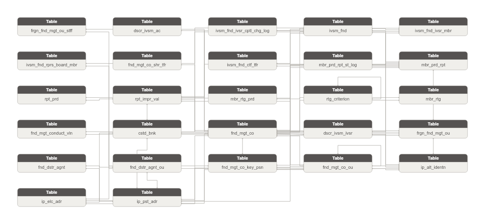

**Danh sách bảng:**

| STT | Tên bảng | Mô tả |
|---|---|---|
| 1 | dscr_ivsm_ac | Tài khoản đầu tư ủy thác — hợp đồng dịch vụ quản lý danh mục tài chính giữa nhà đầu tư ủy thác và công ty quản lý quỹ. |
| 2 | fnd_mgt_conduct_vln | Vi phạm pháp luật hoặc hành chính của công ty quản lý quỹ hoặc quỹ đầu tư. Ghi nhận loại vi phạm và trạng thái xử lý. |
| 3 | ivsm_fnd_ivsr_cptl_chg_log | Lịch sử thay đổi phần vốn góp của nhà đầu tư trong quỹ đầu tư. Ghi nhận vốn trước/sau và lý do thay đổi. |
| 4 | mbr_prd_rpt_st_log | Nhật ký thay đổi trạng thái của báo cáo định kỳ thành viên. Mỗi dòng ghi nhận một lần thay đổi trạng thái kèm nội dung tóm tắt. |
| 5 | mbr_prd_rpt | Báo cáo định kỳ do thành viên thị trường nộp lên UBCKNN theo từng kỳ báo cáo. Ghi nhận trạng thái nộp và thời hạn. |
| 6 | mbr_rtg_prd | Kỳ đánh giá xếp loại định kỳ cho các thành viên thị trường (công ty quản lý quỹ). Xác định phạm vi thời gian áp dụng tiêu chí chấm điểm. |
| 7 | rtg_criterion | Tiêu chí chấm điểm đánh giá xếp loại thành viên thị trường. Lưu tên tiêu chí và điểm tối đa/trọng số. Có cấu trúc cha/con. |
| 8 | rpt_prd | Kỳ báo cáo định kỳ (ngày/tuần/tháng/quý/bán niên/năm) mà thành viên thị trường phải nộp báo cáo lên UBCKNN. |
| 9 | rpt_impr_val | Dữ liệu giá trị từng ô chỉ tiêu trong sheet báo cáo được import vào hệ thống FMS. Grain ở mức cell-level. |
| 10 | cstd_bnk | Ngân hàng lưu ký giám sát tài sản quỹ đầu tư chứng khoán được UBCKNN chấp thuận. Chịu trách nhiệm lưu giữ và giám sát tài sản của quỹ. |
| 11 | dscr_ivsm_ivsr | Nhà đầu tư ủy thác — cá nhân hoặc tổ chức giao tài sản cho công ty quản lý quỹ quản lý theo hợp đồng ủy thác đầu tư. |
| 12 | frgn_fnd_mgt_ou | Văn phòng đại diện hoặc chi nhánh của công ty quản lý quỹ nước ngoài tại Việt Nam được UBCKNN chấp thuận hoạt động. |
| 13 | frgn_fnd_mgt_ou_stff | Nhân sự đảm nhận chức vụ tại văn phòng đại diện/chi nhánh công ty quản lý quỹ nước ngoài. Ghi nhận vai trò và tư cách pháp lý. |
| 14 | fnd_dstr_agnt | Tổ chức đại lý được ủy quyền phân phối chứng chỉ quỹ đầu tư cho nhà đầu tư. |
| 15 | fnd_dstr_agnt_ou | Chi nhánh hoặc phòng giao dịch của tổ chức đại lý phân phối quỹ đầu tư. |
| 16 | fnd_mgt_co | Công ty quản lý quỹ đầu tư chứng khoán trong nước được UBCKNN cấp phép hoạt động. Lưu thông tin pháp lý và hoạt động của công ty. |
| 17 | fnd_mgt_co_key_psn | Nhân sự chủ chốt của công ty quản lý quỹ (giám đốc/chuyên gia đầu tư/người được ủy quyền). Lưu thông tin cá nhân và chứng chỉ hành nghề. |
| 18 | fnd_mgt_co_ou | Chi nhánh hoặc văn phòng đại diện của công ty quản lý quỹ trong nước. Có địa chỉ và giấy phép hoạt động riêng. |
| 19 | ivsm_fnd | Quỹ đầu tư chứng khoán — pháp nhân độc lập do công ty quản lý quỹ thành lập và quản lý. Lưu thông tin pháp lý và vốn của quỹ. |
| 20 | ivsm_fnd_ivsr_mbr | Quan hệ thành viên của nhà đầu tư trong một quỹ đầu tư. Lưu tỷ lệ vốn góp và trạng thái tham gia. |
| 21 | ivsm_fnd_rprs_board_mbr | Thành viên ban đại diện hoặc hội đồng quản trị của quỹ đầu tư. Cá nhân đảm nhận vai trò quản trị trong cơ cấu tổ chức quỹ. |
| 22 | mbr_rtg | Kết quả xếp loại của một công ty quản lý quỹ trong một kỳ đánh giá. Ghi nhận điểm tổng hợp và hạng xếp loại. |
| 23 | fnd_mgt_co_shr_tfr | Giao dịch chuyển nhượng cổ phần của công ty quản lý quỹ. Ghi nhận bên chuyển nhượng/nhận nhượng và giá trị giao dịch. |
| 24 | ivsm_fnd_ctf_tfr | Giao dịch mua/bán chứng chỉ quỹ của nhà đầu tư thành viên. Ghi nhận số lượng và giá giao dịch theo từng quỹ. |
| 25 | ip_alt_identn | Lưu trữ các giấy tờ định danh thay thế của Involved Party (CMND/CCCD/Hộ chiếu/Giấy phép kinh doanh/Chứng chỉ hành nghề). Mỗi dòng = 1 loại giấy tờ từ 1 nguồn. |
| 26 | ip_elc_adr | Lưu trữ các địa chỉ liên lạc điện tử của Involved Party (điện thoại/fax/email). Mỗi dòng = 1 kênh liên lạc từ 1 nguồn. |
| 27 | ip_pst_adr | Lưu trữ các địa chỉ bưu chính của Involved Party (trụ sở/kinh doanh/thường trú/nơi ở hiện tại). Mỗi dòng = 1 loại địa chỉ từ 1 nguồn. |

### Bảng dscr_ivsm_ac

| STT | Tên trường | Kiểu dữ liệu và độ dài | Nullable | Unique | P/F Key | Mặc định | Mô tả |
|---|---|---|---|---|---|---|---|
| 1 | dscr_ivsm_ac_id | STRING |  | X | P |  | Khóa đại diện cho hợp đồng ủy thác quản lý danh mục. |
| 2 | dscr_ivsm_ac_code | STRING |  |  |  |  | Mã định danh tài khoản ủy thác. Map từ PK bảng nguồn. |
| 3 | src_stm_code | STRING |  |  |  | 'FMS.INVESACC' | Mã nguồn dữ liệu. |
| 4 | dscr_ivsm_ivsr_id | STRING |  |  | F |  | FK đến nhà đầu tư ủy thác. |
| 5 | dscr_ivsm_ivsr_code | STRING |  |  |  |  | Mã nhà đầu tư ủy thác. |
| 6 | ac_nbr | STRING | X |  |  |  | Số tài khoản ủy thác. |
| 7 | ac_plc | STRING | X |  | F |  | Nơi lưu ký tài khoản. |
| 8 | ctr_nbr | STRING | X |  |  |  | Số hợp đồng ủy thác quản lý danh mục. |
| 9 | cmmt_cptl_amt | DECIMAL(23,2) | X |  |  |  | Quy mô vốn ủy thác cam kết (VNĐ). |
| 10 | act_cptl_amt | DECIMAL(23,2) | X |  |  |  | Quy mô vốn ủy thác thực tế (VNĐ). |
| 11 | mgt_fee_rate | DECIMAL(5,2) | X |  |  |  | Phí quản lý theo điều khoản hợp đồng (%). |
| 12 | lcs_code | STRING | X |  |  |  | Trạng thái hợp đồng ủy thác. |
| 13 | rpt_dt | DATE | X |  |  |  | Ngày báo cáo. |
| 14 | crt_by | STRING | X |  |  |  | Người tạo bản ghi. |
| 15 | crt_tms | TIMESTAMP | X |  |  |  | Ngày tạo bản ghi. |
| 16 | udt_tms | TIMESTAMP | X |  |  |  | Ngày cập nhật bản ghi. |

#### Constraint

**Khóa chính (Primary Key):**

| Tên trường |
|---|
| dscr_ivsm_ac_id |

**Khóa phụ (Foreign Key):**

| Tên trường | Bảng tham chiếu | Cột tham chiếu |
|---|---|---|
| dscr_ivsm_ivsr_id | dscr_ivsm_ivsr | dscr_ivsm_ivsr_id |

#### Index

N/A

#### Trigger

N/A

### Bảng fnd_mgt_conduct_vln

| STT | Tên trường | Kiểu dữ liệu và độ dài | Nullable | Unique | P/F Key | Mặc định | Mô tả |
|---|---|---|---|---|---|---|---|
| 1 | fnd_mgt_conduct_vln_id | STRING |  | X | P |  | Khóa đại diện cho hành vi vi phạm quản lý quỹ. |
| 2 | fnd_mgt_conduct_vln_code | STRING |  |  |  |  | Mã định danh vi phạm. Map từ PK bảng nguồn. |
| 3 | src_stm_code | STRING |  |  |  | 'FMS.VIOLT' | Mã nguồn dữ liệu. |
| 4 | fnd_mgt_co_id | STRING | X |  | F |  | FK đến công ty QLQ vi phạm (nullable). |
| 5 | fnd_mgt_co_code | STRING | X |  |  |  | Mã công ty QLQ. |
| 6 | ivsm_fnd_id | STRING | X |  | F |  | FK đến quỹ đầu tư liên quan vi phạm (nullable). |
| 7 | ivsm_fnd_code | STRING | X |  |  |  | Mã quỹ đầu tư. |
| 8 | vln_tp_code | STRING | X |  |  |  | Loại vi phạm. |
| 9 | vln_cntnt | STRING | X |  |  |  | Nội dung mô tả vi phạm. |
| 10 | vln_dt | DATE | X |  |  |  | Ngày xác định vi phạm. |
| 11 | vln_st_code | STRING | X |  |  |  | Trạng thái xử lý vi phạm. |
| 12 | note | STRING | X |  |  |  | Ghi chú bổ sung về vi phạm. |
| 13 | crt_tms | TIMESTAMP | X |  |  |  | Ngày tạo bản ghi. |
| 14 | udt_tms | TIMESTAMP | X |  |  |  | Ngày cập nhật bản ghi. |

#### Constraint

**Khóa chính (Primary Key):**

| Tên trường |
|---|
| fnd_mgt_conduct_vln_id |

**Khóa phụ (Foreign Key):**

| Tên trường | Bảng tham chiếu | Cột tham chiếu |
|---|---|---|
| fnd_mgt_co_id | fnd_mgt_co | fnd_mgt_co_id |
| ivsm_fnd_id | ivsm_fnd | ivsm_fnd_id |

#### Index

N/A

#### Trigger

N/A

### Bảng ivsm_fnd_ivsr_cptl_chg_log

| STT | Tên trường | Kiểu dữ liệu và độ dài | Nullable | Unique | P/F Key | Mặc định | Mô tả |
|---|---|---|---|---|---|---|---|
| 1 | ivsm_fnd_ivsr_cptl_chg_log_id | STRING |  | X | P |  | Khóa đại diện cho bản ghi thay đổi vốn góp NĐT. |
| 2 | ivsm_fnd_ivsr_cptl_chg_log_code | STRING |  |  |  |  | Mã định danh bản ghi thay đổi. Map từ PK bảng nguồn. |
| 3 | src_stm_code | STRING |  |  |  | 'FMS.MBCHANGE' | Mã nguồn dữ liệu. |
| 4 | ivsm_fnd_ivsr_mbr_id | STRING |  |  | F |  | FK đến quan hệ góp vốn của NĐT trong quỹ. |
| 5 | ivsm_fnd_ivsr_mbr_code | STRING |  |  |  |  | Mã quan hệ góp vốn. |
| 6 | old_cptl_amt | DECIMAL(23,2) | X |  |  |  | Số vốn góp trước khi thay đổi (VNĐ). |
| 7 | new_cptl_amt | DECIMAL(23,2) | X |  |  |  | Số vốn góp sau khi thay đổi (VNĐ). |
| 8 | chg_dt | DATE | X |  |  |  | Ngày thực hiện thay đổi vốn góp. |
| 9 | chg_rsn | STRING | X |  |  |  | Lý do thay đổi vốn góp. |
| 10 | crt_by | STRING | X |  |  |  | Người tạo bản ghi. |
| 11 | crt_tms | TIMESTAMP | X |  |  |  | Ngày tạo bản ghi. |
| 12 | udt_tms | TIMESTAMP | X |  |  |  | Ngày cập nhật bản ghi. |

#### Constraint

**Khóa chính (Primary Key):**

| Tên trường |
|---|
| ivsm_fnd_ivsr_cptl_chg_log_id |

**Khóa phụ (Foreign Key):**

| Tên trường | Bảng tham chiếu | Cột tham chiếu |
|---|---|---|
| ivsm_fnd_ivsr_mbr_id | ivsm_fnd_ivsr_mbr | ivsm_fnd_ivsr_mbr_id |

#### Index

N/A

#### Trigger

N/A

### Bảng mbr_prd_rpt_st_log

| STT | Tên trường | Kiểu dữ liệu và độ dài | Nullable | Unique | P/F Key | Mặc định | Mô tả |
|---|---|---|---|---|---|---|---|
| 1 | mbr_prd_rpt_hist_id | STRING |  | X | P |  | Khóa đại diện cho lịch sử nộp báo cáo định kỳ thành viên. |
| 2 | mbr_prd_rpt_hist_code | STRING |  |  |  |  | Mã định danh bản ghi lịch sử. Map từ PK bảng nguồn. |
| 3 | src_stm_code | STRING |  |  |  | 'FMS.RPTMBHS' | Mã nguồn dữ liệu. |
| 4 | mbr_prd_rpt_id | STRING |  |  | F |  | FK đến báo cáo định kỳ thành viên. |
| 5 | mbr_prd_rpt_code | STRING |  |  |  |  | Mã báo cáo định kỳ. |
| 6 | rpt_subm_st_code | STRING | X |  |  |  | Trạng thái nộp báo cáo tại thời điểm lịch sử. |
| 7 | changed_by_ofcr_id | STRING | X |  | F |  | FK đến nhân sự thực hiện thay đổi trạng thái. |
| 8 | changed_by_ofcr_code | STRING | X |  |  |  | Mã nhân sự thực hiện thay đổi. |
| 9 | cntnt_smy | STRING | X |  |  |  | Tóm tắt nội dung báo cáo tại thời điểm lịch sử. |
| 10 | note | STRING | X |  |  |  | Ghi chú bổ sung. |
| 11 | rpt_nm | STRING | X |  |  |  | Tên báo cáo tại thời điểm lịch sử. |

#### Constraint

**Khóa chính (Primary Key):**

| Tên trường |
|---|
| mbr_prd_rpt_hist_id |

**Khóa phụ (Foreign Key):**

| Tên trường | Bảng tham chiếu | Cột tham chiếu |
|---|---|---|
| mbr_prd_rpt_id | mbr_prd_rpt | mbr_prd_rpt_id |
| changed_by_ofcr_id | fnd_mgt_co_key_psn | fnd_mgt_co_key_psn_id |

#### Index

N/A

#### Trigger

N/A

### Bảng mbr_prd_rpt

| STT | Tên trường | Kiểu dữ liệu và độ dài | Nullable | Unique | P/F Key | Mặc định | Mô tả |
|---|---|---|---|---|---|---|---|
| 1 | mbr_prd_rpt_id | STRING |  | X | P |  | Khóa đại diện cho báo cáo định kỳ thành viên. |
| 2 | mbr_prd_rpt_code | STRING |  |  |  |  | Mã định danh báo cáo. Map từ PK bảng nguồn. |
| 3 | src_stm_code | STRING |  |  |  | 'FMS.RPTMEMBER' | Mã nguồn dữ liệu. |
| 4 | fnd_mgt_co_id | STRING | X |  | F |  | FK đến công ty QLQ nộp báo cáo (nullable). |
| 5 | fnd_mgt_co_code | STRING | X |  |  |  | Mã công ty QLQ. |
| 6 | ivsm_fnd_id | STRING | X |  | F |  | FK đến quỹ đầu tư nộp báo cáo (nullable). |
| 7 | ivsm_fnd_code | STRING | X |  |  |  | Mã quỹ đầu tư. |
| 8 | cstd_bnk_id | STRING | X |  | F |  | FK đến ngân hàng LKGS nộp báo cáo (nullable). |
| 9 | cstd_bnk_code | STRING | X |  |  |  | Mã ngân hàng LKGS. |
| 10 | frgn_fnd_mgt_ou_id | STRING | X |  | F |  | FK đến VPĐD/CN QLQ NN nộp báo cáo (nullable). |
| 11 | frgn_fnd_mgt_ou_code | STRING | X |  |  |  | Mã VPĐD/CN QLQ NN. |
| 12 | rpt_tpl_id | STRING | X |  | F |  | FK đến biểu mẫu báo cáo. |
| 13 | rpt_tpl_code | STRING | X |  |  |  | Mã biểu mẫu báo cáo. |
| 14 | rpt_prd_id | STRING |  |  | F |  | FK đến kỳ báo cáo. |
| 15 | rpt_prd_code | STRING |  |  |  |  | Mã kỳ báo cáo. |
| 16 | is_impr_ind | STRING | X |  |  |  | Là báo cáo có import: 1-Có; 2-Không. |
| 17 | rpt_nm | STRING | X |  |  |  | Tên báo cáo. |
| 18 | cntnt_smy | STRING | X |  |  |  | Tóm tắt nội dung báo cáo. |
| 19 | rpt_tp_code | STRING | X |  |  |  | Loại báo cáo: định kỳ hoặc bất thường. |
| 20 | rpt_mbr_tp_code | STRING | X |  |  |  | Loại thành viên nộp báo cáo. |
| 21 | rpt_prd_tp_code | STRING | X |  |  |  | Kiểu kỳ báo cáo (tháng/quý/năm). |
| 22 | yr_val | STRING | X |  |  |  | Năm báo cáo. |
| 23 | day_rpt | INT | X |  |  |  | Ngày trong kỳ báo cáo. |
| 24 | subm_ddln_dt | DATE | X |  |  |  | Thời hạn nộp báo cáo. |
| 25 | subm_dt | DATE | X |  |  |  | Ngày nộp báo cáo thực tế. |
| 26 | rpt_subm_st_code | STRING | X |  |  |  | Trạng thái nộp báo cáo. |
| 27 | crt_by | STRING | X |  |  |  | Người tạo bản ghi. |
| 28 | crt_tms | TIMESTAMP | X |  |  |  | Ngày tạo bản ghi. |
| 29 | udt_tms | TIMESTAMP | X |  |  |  | Ngày cập nhật bản ghi. |
| 30 | scr_co_id | STRING |  |  | F |  | FK đến công ty chứng khoán gửi báo cáo. |
| 31 | scr_co_code | STRING |  |  |  |  | Mã công ty chứng khoán. |
| 32 | rpt_subm_shd_id | STRING | X |  | F |  | FK đến định kỳ gửi báo cáo. |
| 33 | rpt_subm_shd_code | STRING | X |  |  |  | Mã định kỳ gửi báo cáo. |
| 34 | dsc | STRING | X |  |  |  | Mô tả lần gửi. |
| 35 | rsn | STRING | X |  |  |  | Lý do gửi (áp dụng gửi lại). |
| 36 | re_subm_rsn | STRING | X |  |  |  | Lý do gửi lại. |
| 37 | attch_file | STRING | X |  |  |  | Tệp đính kèm. |
| 38 | rpt_dt | DATE | X |  |  |  | Ngày số liệu báo cáo. |
| 39 | subm_tms | TIMESTAMP | X |  |  |  | Thời điểm gửi chính xác. |
| 40 | is_del_ind | STRING | X |  |  |  | Cờ xóa tạm: 1-Xóa; 0-Không xóa. |
| 41 | subm_st_code | STRING | X |  |  |  | Trạng thái lần gửi: 4-Đã gửi; 5-Yêu cầu gửi lại; 6-Đã gửi lại. |
| 42 | vrsn | STRING | X |  |  |  | Phiên bản báo cáo. |

#### Constraint

**Khóa chính (Primary Key):**

| Tên trường |
|---|
| mbr_prd_rpt_id |

**Khóa phụ (Foreign Key):**

| Tên trường | Bảng tham chiếu | Cột tham chiếu |
|---|---|---|
| fnd_mgt_co_id | fnd_mgt_co | fnd_mgt_co_id |
| ivsm_fnd_id | ivsm_fnd | ivsm_fnd_id |
| cstd_bnk_id | cstd_bnk | cstd_bnk_id |
| frgn_fnd_mgt_ou_id | frgn_fnd_mgt_ou | frgn_fnd_mgt_ou_id |
| rpt_tpl_id | rpt_tpl | rpt_tpl_id |
| rpt_prd_id | rpt_prd | rpt_prd_id |
| scr_co_id | scr_co | scr_co_id |
| rpt_subm_shd_id | rpt_subm_shd | rpt_subm_shd_id |

#### Index

N/A

#### Trigger

N/A

### Bảng mbr_rtg_prd

| STT | Tên trường | Kiểu dữ liệu và độ dài | Nullable | Unique | P/F Key | Mặc định | Mô tả |
|---|---|---|---|---|---|---|---|
| 1 | mbr_rtg_prd_id | STRING |  | X | P |  | Khóa đại diện cho kỳ đánh giá xếp loại. |
| 2 | mbr_rtg_prd_code | STRING |  |  |  |  | Mã định danh kỳ đánh giá. Map từ PK bảng nguồn. |
| 3 | src_stm_code | STRING |  |  |  | 'FMS.RATINGPD' | Mã nguồn dữ liệu. |
| 4 | mbr_rtg_prd_nm | STRING |  |  |  |  | Tên kỳ đánh giá xếp loại. |
| 5 | rtg_prd_strt_dt | DATE | X |  |  |  | Ngày bắt đầu kỳ đánh giá. |
| 6 | rtg_prd_end_dt | DATE | X |  |  |  | Ngày kết thúc kỳ đánh giá. |
| 7 | is_actv_f | BOOLEAN | X |  |  |  | Kỳ đánh giá đang hoạt động. |
| 8 | crt_tms | TIMESTAMP | X |  |  |  | Ngày tạo bản ghi. |
| 9 | udt_tms | TIMESTAMP | X |  |  |  | Ngày cập nhật bản ghi. |

#### Constraint

**Khóa chính (Primary Key):**

| Tên trường |
|---|
| mbr_rtg_prd_id |

**Khóa phụ (Foreign Key):**

*Không có Foreign Key.*

#### Index

N/A

#### Trigger

N/A

### Bảng rtg_criterion

| STT | Tên trường | Kiểu dữ liệu và độ dài | Nullable | Unique | P/F Key | Mặc định | Mô tả |
|---|---|---|---|---|---|---|---|
| 1 | rtg_criterion_id | STRING |  | X | P |  | Khóa đại diện cho nhân tố chấm điểm đánh giá. |
| 2 | rtg_criterion_code | STRING |  |  |  |  | Mã định danh nhân tố. Map từ PK bảng nguồn. |
| 3 | src_stm_code | STRING |  |  |  | 'FMS.RNKFACTOR' | Mã nguồn dữ liệu. |
| 4 | rtg_criterion_nm | STRING |  |  |  |  | Tên nhân tố chấm điểm. |
| 5 | prn_rtg_criterion_id | STRING | X |  | F |  | FK tự thân — nhân tố cha. |
| 6 | prn_rtg_criterion_code | STRING | X |  |  |  | Mã nhân tố cha. |
| 7 | max_scor | DECIMAL(5,2) | X |  |  |  | Điểm tối đa của nhân tố. |
| 8 | wght | DECIMAL(5,2) | X |  |  |  | Trọng số của nhân tố trong tổng điểm. |
| 9 | is_actv_f | BOOLEAN | X |  |  |  | Nhân tố đang được áp dụng. |
| 10 | crt_tms | TIMESTAMP | X |  |  |  | Ngày tạo bản ghi. |
| 11 | udt_tms | TIMESTAMP | X |  |  |  | Ngày cập nhật bản ghi. |

#### Constraint

**Khóa chính (Primary Key):**

| Tên trường |
|---|
| rtg_criterion_id |

**Khóa phụ (Foreign Key):**

| Tên trường | Bảng tham chiếu | Cột tham chiếu |
|---|---|---|
| prn_rtg_criterion_id | rtg_criterion | rtg_criterion_id |

#### Index

N/A

#### Trigger

N/A

### Bảng rpt_prd

| STT | Tên trường | Kiểu dữ liệu và độ dài | Nullable | Unique | P/F Key | Mặc định | Mô tả |
|---|---|---|---|---|---|---|---|
| 1 | rpt_prd_id | STRING |  | X | P |  | Khóa đại diện cho kỳ báo cáo. |
| 2 | rpt_prd_code | STRING |  |  |  |  | Mã định danh kỳ báo cáo. Map từ PK bảng nguồn. |
| 3 | src_stm_code | STRING |  |  |  | 'FMS.RPTPERIOD' | Mã nguồn dữ liệu. |
| 4 | rpt_prd_nm | STRING |  |  |  |  | Tên kỳ báo cáo. |
| 5 | rpt_prd_tp_code | STRING | X |  |  |  | Kiểu kỳ báo cáo (tháng/quý/năm...). |
| 6 | is_actv_f | BOOLEAN | X |  |  |  | Kỳ báo cáo đang hoạt động. |
| 7 | crt_by | STRING | X |  |  |  | Người tạo bản ghi. |
| 8 | crt_tms | TIMESTAMP | X |  |  |  | Ngày tạo bản ghi. |
| 9 | udt_tms | TIMESTAMP | X |  |  |  | Ngày cập nhật bản ghi. |
| 10 | self-set_prd_id | STRING | X |  | F |  | FK đến kỳ báo cáo do cán bộ UB tự thiết lập (SELFSETPD). Nullable. |
| 11 | self-set_prd_code | STRING | X |  |  |  | Mã kỳ báo cáo tự thiết lập. |
| 12 | rpt_tpl_id | STRING |  |  | F |  | FK đến biểu mẫu báo cáo áp dụng cho kỳ này. |
| 13 | rpt_tpl_code | STRING |  |  |  |  | Mã biểu mẫu báo cáo. |
| 14 | subm_ddln_dt | DATE | X |  |  |  | Thời hạn gửi báo cáo muộn nhất (áp dụng cho kỳ ngày/tuần). |
| 15 | subm_ddln_wk | INT | X |  |  |  | Thời hạn gửi báo cáo muộn nhất (tuần). |
| 16 | repeat_itrv | INT | X |  |  |  | Lặp lại sau bao nhiêu đơn vị kỳ. |
| 17 | counting_strt_dt | DATE | X |  |  |  | Ngày bắt đầu tính hạn nộp báo cáo. |
| 18 | is_wrk_day_ind | STRING | X |  |  |  | Đơn vị tính hạn nộp: 0: Ngày lịch 1: Ngày làm việc. |
| 19 | submit_wi_dys | INT | X |  |  |  | Số ngày/ngày làm việc được phép gửi báo cáo. |
| 20 | lcs_code | STRING | X |  |  |  | Trạng thái: 0: Không sử dụng 1: Sử dụng. |
| 21 | dsc | STRING | X |  |  |  | Ghi chú. |

#### Constraint

**Khóa chính (Primary Key):**

| Tên trường |
|---|
| rpt_prd_id |

**Khóa phụ (Foreign Key):**

| Tên trường | Bảng tham chiếu | Cột tham chiếu |
|---|---|---|
| rpt_tpl_id | rpt_tpl | rpt_tpl_id |

#### Index

N/A

#### Trigger

N/A

### Bảng rpt_impr_val

| STT | Tên trường | Kiểu dữ liệu và độ dài | Nullable | Unique | P/F Key | Mặc định | Mô tả |
|---|---|---|---|---|---|---|---|
| 1 | mbr_rpt_val_id | STRING |  | X | P |  | Khóa đại diện cho giá trị chỉ tiêu trong báo cáo thành viên. |
| 2 | mbr_rpt_val_code | STRING |  |  |  |  | Mã định danh giá trị chỉ tiêu. Map từ PK bảng nguồn. |
| 3 | src_stm_code | STRING |  |  |  | 'FMS.RPTVALUES' | Mã nguồn dữ liệu. |
| 4 | mbr_prd_rpt_id | STRING |  |  | F |  | FK đến báo cáo định kỳ thành viên. |
| 5 | mbr_prd_rpt_code | STRING |  |  |  |  | Mã báo cáo định kỳ. |
| 6 | fnd_mgt_co_id | STRING | X |  | F |  | FK đến công ty QLQ nộp báo cáo (nullable). |
| 7 | fnd_mgt_co_code | STRING | X |  |  |  | Mã công ty QLQ. |
| 8 | ivsm_fnd_id | STRING | X |  | F |  | FK đến quỹ đầu tư nộp báo cáo (nullable). |
| 9 | ivsm_fnd_code | STRING | X |  |  |  | Mã quỹ đầu tư. |
| 10 | cstd_bnk_id | STRING | X |  | F |  | FK đến ngân hàng LKGS nộp báo cáo (nullable). |
| 11 | cstd_bnk_code | STRING | X |  |  |  | Mã ngân hàng LKGS. |
| 12 | frgn_fnd_mgt_ou_id | STRING | X |  | F |  | FK đến VPĐD/CN QLQ NN nộp báo cáo (nullable). |
| 13 | frgn_fnd_mgt_ou_code | STRING | X |  |  |  | Mã VPĐD/CN QLQ NN. |
| 14 | rpt_prd_id | STRING | X |  | F |  | FK đến kỳ báo cáo. |
| 15 | rpt_prd_code | STRING | X |  |  |  | Mã kỳ báo cáo. |
| 16 | rpt_shet_id | STRING | X |  |  |  | Mã trang/sheet trong biểu mẫu báo cáo. |
| 17 | rpt_trgt_id | STRING | X |  |  |  | Mã chỉ tiêu trong sheet báo cáo. |
| 18 | rpt_id | STRING | X |  |  |  | Mã biểu mẫu báo cáo. |
| 19 | val | STRING | X |  |  |  | Giá trị chỉ tiêu (text để chứa mọi kiểu dữ liệu). |
| 20 | acm_val | STRING | X |  |  |  | Giá trị lũy kế của chỉ tiêu. |
| 21 | fmt_data_tp_code | STRING | X |  |  |  | Kiểu dữ liệu định dạng của chỉ tiêu. |
| 22 | is_dynamic_ind | STRING | X |  |  |  | Cờ đánh dấu chỉ tiêu động (người dùng tự thêm). |
| 23 | rpt_prd_tp_code | STRING | X |  |  |  | Kiểu kỳ báo cáo (tháng/quý/năm). |
| 24 | val_tp_code | STRING | X |  |  |  | Loại giá trị trong báo cáo. |
| 25 | crt_by | STRING | X |  |  |  | Người tạo bản ghi. |
| 26 | mod_by | STRING | X |  |  |  | Người cập nhật bản ghi lần cuối. |
| 27 | crt_tms | TIMESTAMP | X |  |  |  | Ngày tạo bản ghi. |
| 28 | udt_tms | TIMESTAMP | X |  |  |  | Ngày cập nhật bản ghi. |

#### Constraint

**Khóa chính (Primary Key):**

| Tên trường |
|---|
| mbr_rpt_val_id |

**Khóa phụ (Foreign Key):**

| Tên trường | Bảng tham chiếu | Cột tham chiếu |
|---|---|---|
| mbr_prd_rpt_id | mbr_prd_rpt | mbr_prd_rpt_id |
| fnd_mgt_co_id | fnd_mgt_co | fnd_mgt_co_id |
| ivsm_fnd_id | ivsm_fnd | ivsm_fnd_id |
| cstd_bnk_id | cstd_bnk | cstd_bnk_id |
| frgn_fnd_mgt_ou_id | frgn_fnd_mgt_ou | frgn_fnd_mgt_ou_id |
| rpt_prd_id | rpt_prd | rpt_prd_id |

#### Index

N/A

#### Trigger

N/A

### Bảng cstd_bnk

| STT | Tên trường | Kiểu dữ liệu và độ dài | Nullable | Unique | P/F Key | Mặc định | Mô tả |
|---|---|---|---|---|---|---|---|
| 1 | cstd_bnk_id | STRING |  | X | P |  | Khóa đại diện cho ngân hàng lưu ký giám sát. |
| 2 | cstd_bnk_code | STRING |  |  |  |  | Mã định danh ngân hàng LKGS. Map từ PK bảng nguồn. |
| 3 | src_stm_code | STRING |  |  |  | 'FMS.BANKMONI' | Mã nguồn dữ liệu. |
| 4 | cstd_bnk_nm | STRING |  |  |  |  | Tên đầy đủ ngân hàng lưu ký giám sát. |
| 5 | cstd_bnk_shrt_nm | STRING | X |  |  |  | Tên viết tắt ngân hàng LKGS. |
| 6 | practice_st_code | STRING | X |  |  |  | Trạng thái hoạt động. |
| 7 | crt_by | STRING | X |  |  |  | Người tạo bản ghi. |
| 8 | crt_tms | TIMESTAMP | X |  |  |  | Ngày tạo bản ghi. |
| 9 | udt_tms | TIMESTAMP | X |  |  |  | Ngày cập nhật bản ghi. |
| 10 | cty_of_rgst_id | STRING | X |  | F |  | FK đến quốc gia đăng ký của ngân hàng LKGS. |
| 11 | cty_of_rgst_code | STRING | X |  |  |  | Mã quốc gia đăng ký. |
| 12 | cstd_bnk_en_nm | STRING | X |  |  |  | Tên tiếng Anh. |
| 13 | charter_cptl_amt | DECIMAL(23,2) | X |  |  |  | Vốn điều lệ (VNĐ). Thông tin bổ sung của FIMS không có trong FMS.BANKMONI. |
| 14 | lcs_code | STRING | X |  |  |  | Trạng thái hoạt động. ID lấy từ bảng STATUS. |
| 15 | director_nm | STRING | X |  |  |  | Tên Tổng giám đốc (denormalized). |
| 16 | depst_ctf_nbr | STRING | X |  |  |  | Chứng nhận lưu ký — thông tin bổ sung của FIMS không có trong FMS.BANKMONI. |
| 17 | dsc | STRING | X |  |  |  | Ghi chú. |

#### Constraint

**Khóa chính (Primary Key):**

| Tên trường |
|---|
| cstd_bnk_id |

**Khóa phụ (Foreign Key):**

| Tên trường | Bảng tham chiếu | Cột tham chiếu |
|---|---|---|
| cty_of_rgst_id | geo | geo_id |

#### Index

N/A

#### Trigger

N/A

### Bảng dscr_ivsm_ivsr

| STT | Tên trường | Kiểu dữ liệu và độ dài | Nullable | Unique | P/F Key | Mặc định | Mô tả |
|---|---|---|---|---|---|---|---|
| 1 | dscr_ivsm_ivsr_id | STRING |  | X | P |  | Khóa đại diện cho nhà đầu tư ủy thác. |
| 2 | dscr_ivsm_ivsr_code | STRING |  |  |  |  | Mã định danh nhà đầu tư ủy thác. Map từ PK bảng nguồn. |
| 3 | src_stm_code | STRING |  |  |  | 'FMS.INVES' | Mã nguồn dữ liệu. |
| 4 | ivsr_nm | STRING |  |  |  |  | Tên nhà đầu tư ủy thác (cá nhân hoặc tổ chức). |
| 5 | dorf_ind | STRING | X |  |  |  | Loại hình trong/ngoài nước. 1=Trong nước; 0=Nước ngoài. |
| 6 | nat_code | STRING | X |  |  |  | Quốc tịch nhà đầu tư. |
| 7 | stockholder_tp_code | STRING | X |  |  |  | Loại hình nhà đầu tư/cổ đông. |
| 8 | rltnp_tp_code | STRING | X |  |  |  | Mối quan hệ cổ đông với tổ chức liên quan. |
| 9 | fnd_mgt_co_id | STRING | X |  | F |  | FK đến công ty QLQ đang nhận ủy thác. |
| 10 | fnd_mgt_co_code | STRING | X |  |  |  | Mã công ty QLQ đang nhận ủy thác. |
| 11 | crt_by | STRING | X |  |  |  | Người tạo bản ghi. |
| 12 | crt_tms | TIMESTAMP | X |  |  |  | Ngày tạo bản ghi. |
| 13 | udt_tms | TIMESTAMP | X |  |  |  | Ngày cập nhật bản ghi. |

#### Constraint

**Khóa chính (Primary Key):**

| Tên trường |
|---|
| dscr_ivsm_ivsr_id |

**Khóa phụ (Foreign Key):**

| Tên trường | Bảng tham chiếu | Cột tham chiếu |
|---|---|---|
| fnd_mgt_co_id | fnd_mgt_co | fnd_mgt_co_id |

#### Index

N/A

#### Trigger

N/A

### Bảng frgn_fnd_mgt_ou

| STT | Tên trường | Kiểu dữ liệu và độ dài | Nullable | Unique | P/F Key | Mặc định | Mô tả |
|---|---|---|---|---|---|---|---|
| 1 | frgn_fnd_mgt_ou_id | STRING |  | X | P |  | Khóa đại diện cho VPĐD/CN công ty QLQ nước ngoài tại VN. |
| 2 | frgn_fnd_mgt_ou_code | STRING |  |  |  |  | Mã định danh VPĐD/CN QLQ NN. Map từ PK bảng nguồn. |
| 3 | src_stm_code | STRING |  |  |  | 'FMS.FORBRCH' | Mã nguồn dữ liệu. |
| 4 | frgn_fnd_mgt_ou_nm | STRING |  |  |  |  | Tên VPĐD/CN công ty QLQ nước ngoài tại VN. |
| 5 | frgn_fnd_mgt_ou_en_nm | STRING | X |  |  |  | Tên tiếng Anh VPĐD/CN. |
| 6 | practice_st_code | STRING | X |  |  |  | Trạng thái hoạt động. |
| 7 | end_dt | DATE | X |  |  |  | Ngày chấm dứt hoạt động. |
| 8 | chg_license_nbr | STRING | X |  |  |  | Số giấy phép điều chỉnh gần nhất. |
| 9 | chg_license_dt | DATE | X |  |  |  | Ngày cấp giấy phép điều chỉnh. |
| 10 | chg_note | STRING | X |  |  |  | Nội dung thay đổi theo giấy phép điều chỉnh. |
| 11 | bsn_tp_codes | ARRAY<STRING> | X |  |  |  | Danh sách mã ngành nghề kinh doanh. |
| 12 | crt_by | STRING | X |  |  |  | Người tạo bản ghi. |
| 13 | crt_tms | TIMESTAMP | X |  |  |  | Ngày tạo bản ghi. |
| 14 | udt_tms | TIMESTAMP | X |  |  |  | Ngày cập nhật bản ghi. |

#### Constraint

**Khóa chính (Primary Key):**

| Tên trường |
|---|
| frgn_fnd_mgt_ou_id |

**Khóa phụ (Foreign Key):**

*Không có Foreign Key.*

#### Index

N/A

#### Trigger

N/A

### Bảng frgn_fnd_mgt_ou_stff

| STT | Tên trường | Kiểu dữ liệu và độ dài | Nullable | Unique | P/F Key | Mặc định | Mô tả |
|---|---|---|---|---|---|---|---|
| 1 | frgn_fnd_mgt_ou_stff_id | STRING |  | X | P |  | Khóa đại diện cho nhân sự tại VPĐD/CN QLQ nước ngoài. |
| 2 | frgn_fnd_mgt_ou_stff_code | STRING |  |  |  |  | Mã định danh nhân sự VPĐD/CN QLQ NN. Map từ PK bảng nguồn. |
| 3 | src_stm_code | STRING |  |  |  | 'FMS.STFFGBRCH' | Mã nguồn dữ liệu. |
| 4 | frgn_fnd_mgt_ou_id | STRING |  |  | F |  | FK đến VPĐD/CN QLQ nước ngoài. |
| 5 | frgn_fnd_mgt_ou_code | STRING |  |  |  |  | Mã VPĐD/CN QLQ nước ngoài. |
| 6 | fnd_mgt_co_key_psn_id | STRING |  |  | F |  | FK đến nhân sự giữ vai trò tại VPĐD/CN QLQ NN. |
| 7 | fnd_mgt_co_key_psn_code | STRING |  |  |  |  | Mã nhân sự. |
| 8 | ou_tp_code | STRING | X |  |  |  | Loại đơn vị: VPĐD hoặc CN NN. |
| 9 | is_lgl_rprs_ind | STRING | X |  |  |  | Cờ đánh dấu người đại diện pháp luật tại VPĐD/CN. |
| 10 | is_dscl_rprs_ind | STRING | X |  |  |  | Cờ đánh dấu đại diện công bố thông tin. |
| 11 | crt_tms | TIMESTAMP | X |  |  |  | Ngày tạo bản ghi. |
| 12 | udt_tms | TIMESTAMP | X |  |  |  | Ngày cập nhật bản ghi. |

#### Constraint

**Khóa chính (Primary Key):**

| Tên trường |
|---|
| frgn_fnd_mgt_ou_stff_id |

**Khóa phụ (Foreign Key):**

| Tên trường | Bảng tham chiếu | Cột tham chiếu |
|---|---|---|
| frgn_fnd_mgt_ou_id | frgn_fnd_mgt_ou | frgn_fnd_mgt_ou_id |
| fnd_mgt_co_key_psn_id | fnd_mgt_co_key_psn | fnd_mgt_co_key_psn_id |

#### Index

N/A

#### Trigger

N/A

### Bảng fnd_dstr_agnt

| STT | Tên trường | Kiểu dữ liệu và độ dài | Nullable | Unique | P/F Key | Mặc định | Mô tả |
|---|---|---|---|---|---|---|---|
| 1 | fnd_dstr_agnt_id | STRING |  | X | P |  | Khóa đại diện cho tổ chức đại lý phân phối quỹ. |
| 2 | fnd_dstr_agnt_code | STRING |  |  |  |  | Mã định danh đại lý phân phối quỹ. Map từ PK bảng nguồn. |
| 3 | src_stm_code | STRING |  |  |  | 'FMS.AGENCIES' | Mã nguồn dữ liệu. |
| 4 | fnd_dstr_agnt_nm | STRING |  |  |  |  | Tên đầy đủ đại lý phân phối quỹ. |
| 5 | fnd_dstr_agnt_shrt_nm | STRING | X |  |  |  | Tên viết tắt đại lý. |
| 6 | agnc_tp_code | STRING | X |  |  |  | Loại đại lý phân phối quỹ. |
| 7 | practice_st_code | STRING | X |  |  |  | Trạng thái hoạt động. |
| 8 | crt_by | STRING | X |  |  |  | Người tạo bản ghi. |
| 9 | crt_tms | TIMESTAMP | X |  |  |  | Ngày tạo bản ghi. |
| 10 | udt_tms | TIMESTAMP | X |  |  |  | Ngày cập nhật bản ghi. |

#### Constraint

**Khóa chính (Primary Key):**

| Tên trường |
|---|
| fnd_dstr_agnt_id |

**Khóa phụ (Foreign Key):**

*Không có Foreign Key.*

#### Index

N/A

#### Trigger

N/A

### Bảng fnd_dstr_agnt_ou

| STT | Tên trường | Kiểu dữ liệu và độ dài | Nullable | Unique | P/F Key | Mặc định | Mô tả |
|---|---|---|---|---|---|---|---|
| 1 | fnd_dstr_agnt_ou_id | STRING |  | X | P |  | Khóa đại diện cho CN/PGD của đại lý phân phối quỹ. |
| 2 | fnd_dstr_agnt_ou_code | STRING |  |  |  |  | Mã định danh CN/PGD đại lý. Map từ PK bảng nguồn. |
| 3 | src_stm_code | STRING |  |  |  | 'FMS.AGENCIESBRA' | Mã nguồn dữ liệu. |
| 4 | fnd_dstr_agnt_id | STRING |  |  | F |  | FK đến đại lý phân phối quỹ. |
| 5 | fnd_dstr_agnt_code | STRING |  |  |  |  | Mã đại lý phân phối quỹ. |
| 6 | fnd_dstr_agnt_ou_nm | STRING |  |  |  |  | Tên CN/PGD đại lý phân phối quỹ. |
| 7 | practice_st_code | STRING | X |  |  |  | Trạng thái hoạt động. |
| 8 | crt_tms | TIMESTAMP | X |  |  |  | Ngày tạo bản ghi. |
| 9 | udt_tms | TIMESTAMP | X |  |  |  | Ngày cập nhật bản ghi. |

#### Constraint

**Khóa chính (Primary Key):**

| Tên trường |
|---|
| fnd_dstr_agnt_ou_id |

**Khóa phụ (Foreign Key):**

| Tên trường | Bảng tham chiếu | Cột tham chiếu |
|---|---|---|
| fnd_dstr_agnt_id | fnd_dstr_agnt | fnd_dstr_agnt_id |

#### Index

N/A

#### Trigger

N/A

### Bảng fnd_mgt_co

| STT | Tên trường | Kiểu dữ liệu và độ dài | Nullable | Unique | P/F Key | Mặc định | Mô tả |
|---|---|---|---|---|---|---|---|
| 1 | fnd_mgt_co_id | STRING |  | X | P |  | Khóa đại diện cho công ty quản lý quỹ trong nước. |
| 2 | fnd_mgt_co_code | STRING |  |  |  |  | Mã định danh công ty QLQ. Map từ PK bảng nguồn. |
| 3 | src_stm_code | STRING |  |  |  | 'FMS.SECURITIES' | Mã nguồn dữ liệu. |
| 4 | fnd_mgt_co_nm | STRING |  |  |  |  | Tên đầy đủ công ty QLQ trong nước. |
| 5 | fnd_mgt_co_shrt_nm | STRING | X |  |  |  | Tên viết tắt công ty QLQ. |
| 6 | fnd_mgt_co_en_nm | STRING | X |  |  |  | Tên tiếng Anh công ty QLQ. |
| 7 | practice_st_code | STRING | X |  |  |  | Trạng thái hoạt động của công ty QLQ. |
| 8 | charter_cptl_amt | DECIMAL(23,2) | X |  |  |  | Vốn điều lệ công ty QLQ (VNĐ). |
| 9 | dorf_ind | STRING | X |  |  |  | Loại hình trong/ngoài nước. 1=Trong nước; 0=Nước ngoài. |
| 10 | license_dcsn_nbr | STRING | X |  |  |  | Số quyết định/giấy phép thành lập. |
| 11 | license_dcsn_dt | DATE | X |  |  |  | Ngày cấp phép. |
| 12 | actv_dt | DATE | X |  |  |  | Ngày bắt đầu hoạt động. |
| 13 | stop_dt | DATE | X |  |  |  | Ngày ngừng hoạt động. |
| 14 | bsn_tp_codes | ARRAY<STRING> | X |  |  |  | Danh sách mã ngành nghề kinh doanh. |
| 15 | crt_by | STRING | X |  |  |  | Người tạo bản ghi. |
| 16 | crt_tms | TIMESTAMP | X |  |  |  | Ngày tạo bản ghi. |
| 17 | udt_tms | TIMESTAMP | X |  |  |  | Ngày cập nhật bản ghi. |
| 18 | cty_of_rgst_id | STRING | X |  | F |  | FK đến quốc gia đăng ký của công ty QLQ. |
| 19 | cty_of_rgst_code | STRING | X |  |  |  | Mã quốc gia đăng ký. |
| 20 | lcs_code | STRING | X |  |  |  | Trạng thái hoạt động. ID lấy từ bảng STATUS. |
| 21 | director_nm | STRING | X |  |  |  | Tên Tổng giám đốc (denormalized). |
| 22 | depst_ctf_nbr | STRING | X |  |  |  | Chứng nhận lưu ký — thông tin bổ sung của FIMS không có trong FMS.SECURITIES. |
| 23 | co_tp_codes | ARRAY<STRING> | X |  |  |  | Danh sách mã loại hình doanh nghiệp. Từ bảng junction FUNDCOMTYPE. |
| 24 | dsc | STRING | X |  |  |  | Ghi chú. |
| 25 | co_tp_code | STRING | X |  |  |  | Loại hình công ty. |
| 26 | fnd_tp_code | STRING | X |  |  |  | Loại quỹ (áp dụng cho quỹ đầu tư). |
| 27 | bsn_license_nbr | STRING | X |  |  |  | Số giấy phép kinh doanh. |
| 28 | webst | STRING | X |  |  |  | Website chính thức. |

#### Constraint

**Khóa chính (Primary Key):**

| Tên trường |
|---|
| fnd_mgt_co_id |

**Khóa phụ (Foreign Key):**

| Tên trường | Bảng tham chiếu | Cột tham chiếu |
|---|---|---|
| cty_of_rgst_id | geo | geo_id |

#### Index

N/A

#### Trigger

N/A

### Bảng fnd_mgt_co_key_psn

| STT | Tên trường | Kiểu dữ liệu và độ dài | Nullable | Unique | P/F Key | Mặc định | Mô tả |
|---|---|---|---|---|---|---|---|
| 1 | fnd_mgt_co_key_psn_id | STRING |  | X | P |  | Khóa đại diện cho nhân sự chủ chốt công ty QLQ. |
| 2 | fnd_mgt_co_key_psn_code | STRING |  |  |  |  | Mã định danh nhân sự. Map từ PK bảng nguồn. |
| 3 | src_stm_code | STRING |  |  |  | 'FMS.TLProfiles' | Mã nguồn dữ liệu. |
| 4 | fnd_mgt_co_id | STRING |  |  | F |  | FK đến công ty QLQ. |
| 5 | fnd_mgt_co_code | STRING |  |  |  |  | Mã công ty QLQ. |
| 6 | full_nm | STRING |  |  |  |  | Họ và tên đầy đủ nhân sự. |
| 7 | brth_dt | DATE | X |  |  |  | Ngày sinh. |
| 8 | nat_code | STRING | X |  |  |  | Quốc tịch. |
| 9 | job_tp_code | STRING | X |  |  |  | Loại chức vụ. |
| 10 | is_lgl_rprs_ind | STRING | X |  |  |  | Cờ đánh dấu người đại diện pháp luật. |
| 11 | is_dscl_rprs_ind | STRING | X |  |  |  | Cờ đánh dấu đại diện công bố thông tin (CBTT). |
| 12 | crt_by | STRING | X |  |  |  | Người tạo bản ghi. |
| 13 | crt_tms | TIMESTAMP | X |  |  |  | Ngày tạo bản ghi. |
| 14 | udt_tms | TIMESTAMP | X |  |  |  | Ngày cập nhật bản ghi. |

#### Constraint

**Khóa chính (Primary Key):**

| Tên trường |
|---|
| fnd_mgt_co_key_psn_id |

**Khóa phụ (Foreign Key):**

| Tên trường | Bảng tham chiếu | Cột tham chiếu |
|---|---|---|
| fnd_mgt_co_id | fnd_mgt_co | fnd_mgt_co_id |

#### Index

N/A

#### Trigger

N/A

### Bảng fnd_mgt_co_ou

| STT | Tên trường | Kiểu dữ liệu và độ dài | Nullable | Unique | P/F Key | Mặc định | Mô tả |
|---|---|---|---|---|---|---|---|
| 1 | fnd_mgt_co_ou_id | STRING |  | X | P |  | Khóa đại diện cho CN/VPĐD công ty QLQ trong nước. |
| 2 | fnd_mgt_co_ou_code | STRING |  |  |  |  | Mã định danh CN/VPĐD. Map từ PK bảng nguồn. |
| 3 | src_stm_code | STRING |  |  |  | 'FMS.BRANCHES' | Mã nguồn dữ liệu. |
| 4 | fnd_mgt_co_id | STRING |  |  | F |  | FK đến công ty QLQ trong nước. |
| 5 | fnd_mgt_co_code | STRING |  |  |  |  | Mã công ty QLQ trong nước. |
| 6 | fnd_mgt_co_ou_nm | STRING |  |  |  |  | Tên CN/VPĐD công ty QLQ. |
| 7 | ou_tp_code | STRING | X |  |  |  | Loại đơn vị: CN hoặc VPĐD. |
| 8 | prn_ou_id | STRING | X |  | F |  | FK tự thân — CN/VPĐD cha. |
| 9 | prn_ou_code | STRING | X |  |  |  | Mã CN/VPĐD cha. |
| 10 | lgl_rprs_id | STRING | X |  | F |  | FK đến người đại diện pháp luật của CN/VPĐD. |
| 11 | lgl_rprs_code | STRING | X |  |  |  | Mã người đại diện pháp luật. |
| 12 | lgl_rprs_nm | STRING | X |  |  |  | Tên người đại diện pháp luật (denormalized). |
| 13 | license_dcsn_nbr | STRING | X |  |  |  | Số quyết định thành lập CN/VPĐD. |
| 14 | license_dcsn_dt | DATE | X |  |  |  | Ngày cấp quyết định thành lập CN/VPĐD. |
| 15 | vchr_nbr | STRING | X |  |  |  | Số chứng từ liên quan. |
| 16 | vchr_dt | DATE | X |  |  |  | Ngày chứng từ. |
| 17 | practice_st_code | STRING | X |  |  |  | Trạng thái hoạt động. |
| 18 | stop_dt | DATE | X |  |  |  | Ngày ngừng hoạt động. |
| 19 | chg_dsc | STRING | X |  |  |  | Mô tả nội dung thay đổi. |
| 20 | dsc | STRING | X |  |  |  | Mô tả bổ sung. |
| 21 | crt_by | STRING | X |  |  |  | Người tạo bản ghi. |
| 22 | crt_tms | TIMESTAMP | X |  |  |  | Ngày tạo bản ghi. |
| 23 | udt_tms | TIMESTAMP | X |  |  |  | Ngày cập nhật bản ghi. |
| 24 | cty_of_rgst_id | STRING | X |  | F |  | FK đến quốc gia đăng ký của công ty mẹ. |
| 25 | cty_of_rgst_code | STRING | X |  |  |  | Mã quốc gia đăng ký. |
| 26 | en_nm | STRING | X |  |  |  | Tên tiếng Anh. |
| 27 | abr | STRING | X |  |  |  | Tên viết tắt. |
| 28 | tax_code | STRING | X |  |  |  | Mã số thuế. |
| 29 | charter_cptl_amt | DECIMAL(23,2) | X |  |  |  | Vốn được cấp (VNĐ). |
| 30 | strt_dt | DATE | X |  |  |  | Hoạt động từ ngày. |
| 31 | end_dt | DATE | X |  |  |  | Hoạt động đến ngày. |
| 32 | prn_co_nm | STRING | X |  |  |  | Tên công ty mẹ (denormalized — nguồn ETL resolve FK). |
| 33 | prn_co_rgst_nbr | STRING | X |  |  |  | Số ĐKKD công ty mẹ (denormalized). |
| 34 | prn_co_adr | STRING | X |  |  |  | Địa chỉ công ty mẹ (denormalized). |
| 35 | lcs_code | STRING | X |  |  |  | Trạng thái hoạt động. ID lấy từ bảng STATUS. |
| 36 | bsn_tp_codes | ARRAY<STRING> | X |  |  |  | Danh sách mã nghiệp vụ kinh doanh. Từ bảng junction BRANCHSBUSINES. |

#### Constraint

**Khóa chính (Primary Key):**

| Tên trường |
|---|
| fnd_mgt_co_ou_id |

**Khóa phụ (Foreign Key):**

| Tên trường | Bảng tham chiếu | Cột tham chiếu |
|---|---|---|
| fnd_mgt_co_id | fnd_mgt_co | fnd_mgt_co_id |
| prn_ou_id | fnd_mgt_co_ou | fnd_mgt_co_ou_id |
| lgl_rprs_id | fnd_mgt_co_key_psn | fnd_mgt_co_key_psn_id |
| cty_of_rgst_id | geo | geo_id |

#### Index

N/A

#### Trigger

N/A

### Bảng ivsm_fnd

| STT | Tên trường | Kiểu dữ liệu và độ dài | Nullable | Unique | P/F Key | Mặc định | Mô tả |
|---|---|---|---|---|---|---|---|
| 1 | ivsm_fnd_id | STRING |  | X | P |  | Khóa đại diện cho quỹ đầu tư chứng khoán. |
| 2 | ivsm_fnd_code | STRING |  |  |  |  | Mã định danh quỹ đầu tư. Map từ PK bảng nguồn. |
| 3 | src_stm_code | STRING |  |  |  | 'FMS.FUNDS' | Mã nguồn dữ liệu. |
| 4 | ivsm_fnd_nm | STRING |  |  |  |  | Tên đầy đủ quỹ đầu tư. |
| 5 | ivsm_fnd_shrt_nm | STRING | X |  |  |  | Tên viết tắt quỹ đầu tư. |
| 6 | ivsm_fnd_en_nm | STRING | X |  |  |  | Tên tiếng Anh quỹ đầu tư. |
| 7 | fnd_mgt_co_id | STRING |  |  | F |  | FK đến công ty QLQ quản lý quỹ. |
| 8 | fnd_mgt_co_code | STRING |  |  |  |  | Mã công ty QLQ quản lý quỹ. |
| 9 | fnd_cptl_amt | DECIMAL(23,2) | X |  |  |  | Vốn điều lệ quỹ đầu tư (VNĐ). |
| 10 | fnd_tp_code | STRING | X |  |  |  | Loại hình quỹ đầu tư. |
| 11 | practice_st_code | STRING | X |  |  |  | Trạng thái hoạt động quỹ. |
| 12 | license_dcsn_dt | DATE | X |  |  |  | Ngày cấp phép thành lập quỹ. |
| 13 | actv_dt | DATE | X |  |  |  | Ngày bắt đầu hoạt động. |
| 14 | stop_dt | DATE | X |  |  |  | Ngày ngừng hoạt động. |
| 15 | dstr_agnt_ids | ARRAY<STRUCT<...>> | X |  |  |  | Danh sách đại lý phân phối quỹ (SK + mã nghiệp vụ). |
| 16 | cstd_bnk_ids | ARRAY<STRUCT<...>> | X |  |  |  | Danh sách ngân hàng lưu ký giám sát (SK + mã nghiệp vụ). |
| 17 | crt_by | STRING | X |  |  |  | Người tạo bản ghi. |
| 18 | crt_tms | TIMESTAMP | X |  |  |  | Ngày tạo bản ghi. |
| 19 | udt_tms | TIMESTAMP | X |  |  |  | Ngày cập nhật bản ghi. |

#### Constraint

**Khóa chính (Primary Key):**

| Tên trường |
|---|
| ivsm_fnd_id |

**Khóa phụ (Foreign Key):**

| Tên trường | Bảng tham chiếu | Cột tham chiếu |
|---|---|---|
| fnd_mgt_co_id | fnd_mgt_co | fnd_mgt_co_id |

#### Index

N/A

#### Trigger

N/A

### Bảng ivsm_fnd_ivsr_mbr

| STT | Tên trường | Kiểu dữ liệu và độ dài | Nullable | Unique | P/F Key | Mặc định | Mô tả |
|---|---|---|---|---|---|---|---|
| 1 | ivsm_fnd_ivsr_mbr_id | STRING |  | X | P |  | Khóa đại diện cho quan hệ góp vốn của NĐT vào quỹ. |
| 2 | ivsm_fnd_ivsr_mbr_code | STRING |  |  |  |  | Mã định danh quan hệ góp vốn. Map từ PK bảng nguồn. |
| 3 | src_stm_code | STRING |  |  |  | 'FMS.MBFUND' | Mã nguồn dữ liệu. |
| 4 | ivsm_fnd_id | STRING |  |  | F |  | FK đến quỹ đầu tư. |
| 5 | ivsm_fnd_code | STRING |  |  |  |  | Mã quỹ đầu tư. |
| 6 | dscr_ivsm_ivsr_id | STRING |  |  | F |  | FK đến nhà đầu tư. |
| 7 | dscr_ivsm_ivsr_code | STRING |  |  |  |  | Mã nhà đầu tư. |
| 8 | cptl_amt | DECIMAL(23,2) | X |  |  |  | Số vốn góp của NĐT vào quỹ (VNĐ). |
| 9 | own_rto | DECIMAL(5,2) | X |  |  |  | Tỷ lệ sở hữu của NĐT trong quỹ (%). |
| 10 | crt_tms | TIMESTAMP | X |  |  |  | Ngày tạo bản ghi. |
| 11 | udt_tms | TIMESTAMP | X |  |  |  | Ngày cập nhật bản ghi. |

#### Constraint

**Khóa chính (Primary Key):**

| Tên trường |
|---|
| ivsm_fnd_ivsr_mbr_id |

**Khóa phụ (Foreign Key):**

| Tên trường | Bảng tham chiếu | Cột tham chiếu |
|---|---|---|
| ivsm_fnd_id | ivsm_fnd | ivsm_fnd_id |
| dscr_ivsm_ivsr_id | dscr_ivsm_ivsr | dscr_ivsm_ivsr_id |

#### Index

N/A

#### Trigger

N/A

### Bảng ivsm_fnd_rprs_board_mbr

| STT | Tên trường | Kiểu dữ liệu và độ dài | Nullable | Unique | P/F Key | Mặc định | Mô tả |
|---|---|---|---|---|---|---|---|
| 1 | ivsm_fnd_rprs_board_mbr_id | STRING |  | X | P |  | Khóa đại diện cho thành viên ban đại diện quỹ. |
| 2 | ivsm_fnd_rprs_board_mbr_code | STRING |  |  |  |  | Mã định danh thành viên ban đại diện. Map từ PK bảng nguồn. |
| 3 | src_stm_code | STRING |  |  |  | 'FMS.REPRESENT' | Mã nguồn dữ liệu. |
| 4 | ivsm_fnd_id | STRING |  |  | F |  | FK đến quỹ đầu tư. |
| 5 | ivsm_fnd_code | STRING |  |  |  |  | Mã quỹ đầu tư. |
| 6 | fnd_mgt_co_key_psn_id | STRING |  |  | F |  | FK đến nhân sự giữ vai trò thành viên ban đại diện. |
| 7 | fnd_mgt_co_key_psn_code | STRING |  |  |  |  | Mã nhân sự. |
| 8 | is_chair_ind | STRING | X |  |  |  | Cờ đánh dấu trưởng ban đại diện. |
| 9 | practice_st_code | STRING | X |  |  |  | Trạng thái tham gia ban đại diện. |
| 10 | crt_tms | TIMESTAMP | X |  |  |  | Ngày tạo bản ghi. |
| 11 | udt_tms | TIMESTAMP | X |  |  |  | Ngày cập nhật bản ghi. |

#### Constraint

**Khóa chính (Primary Key):**

| Tên trường |
|---|
| ivsm_fnd_rprs_board_mbr_id |

**Khóa phụ (Foreign Key):**

| Tên trường | Bảng tham chiếu | Cột tham chiếu |
|---|---|---|
| ivsm_fnd_id | ivsm_fnd | ivsm_fnd_id |
| fnd_mgt_co_key_psn_id | fnd_mgt_co_key_psn | fnd_mgt_co_key_psn_id |

#### Index

N/A

#### Trigger

N/A

### Bảng mbr_rtg

| STT | Tên trường | Kiểu dữ liệu và độ dài | Nullable | Unique | P/F Key | Mặc định | Mô tả |
|---|---|---|---|---|---|---|---|
| 1 | mbr_rtg_id | STRING |  | X | P |  | Khóa đại diện cho kết quả xếp hạng thành viên. |
| 2 | mbr_rtg_code | STRING |  |  |  |  | Mã định danh kết quả xếp hạng. Map từ PK bảng nguồn. |
| 3 | src_stm_code | STRING |  |  |  | 'FMS.RANK' | Mã nguồn dữ liệu. |
| 4 | fnd_mgt_co_id | STRING |  |  | F |  | FK đến công ty QLQ được xếp hạng. |
| 5 | fnd_mgt_co_code | STRING |  |  |  |  | Mã công ty QLQ được xếp hạng. |
| 6 | mbr_rtg_prd_id | STRING |  |  | F |  | FK đến kỳ đánh giá xếp loại. |
| 7 | mbr_rtg_prd_code | STRING |  |  |  |  | Mã kỳ đánh giá xếp loại. |
| 8 | tot_scor | DECIMAL(5,2) | X |  |  |  | Tổng điểm đánh giá. |
| 9 | rank_val | INT | X |  |  |  | Giá trị xếp hạng (thứ tự). |
| 10 | rank_clss_code | STRING | X |  |  |  | Xếp loại kết quả đánh giá. |
| 11 | crt_tms | TIMESTAMP | X |  |  |  | Ngày tạo bản ghi. |
| 12 | udt_tms | TIMESTAMP | X |  |  |  | Ngày cập nhật bản ghi. |

#### Constraint

**Khóa chính (Primary Key):**

| Tên trường |
|---|
| mbr_rtg_id |

**Khóa phụ (Foreign Key):**

| Tên trường | Bảng tham chiếu | Cột tham chiếu |
|---|---|---|
| fnd_mgt_co_id | fnd_mgt_co | fnd_mgt_co_id |
| mbr_rtg_prd_id | mbr_rtg_prd | mbr_rtg_prd_id |

#### Index

N/A

#### Trigger

N/A

### Bảng fnd_mgt_co_shr_tfr

| STT | Tên trường | Kiểu dữ liệu và độ dài | Nullable | Unique | P/F Key | Mặc định | Mô tả |
|---|---|---|---|---|---|---|---|
| 1 | fnd_mgt_co_shr_tfr_id | STRING |  | X | P |  | Khóa đại diện cho giao dịch chuyển nhượng cổ phần QLQ. |
| 2 | fnd_mgt_co_shr_tfr_code | STRING |  |  |  |  | Mã định danh giao dịch. Map từ PK bảng nguồn. |
| 3 | src_stm_code | STRING |  |  |  | 'FMS.TRSFERINDER' | Mã nguồn dữ liệu. |
| 4 | fnd_mgt_co_id | STRING |  |  | F |  | FK đến công ty QLQ có cổ phần được chuyển nhượng. |
| 5 | fnd_mgt_co_code | STRING |  |  |  |  | Mã công ty QLQ. |
| 6 | tfr_dt | DATE |  |  |  |  | Ngày thực hiện giao dịch chuyển nhượng. |
| 7 | shr_qty | INT | X |  |  |  | Số lượng cổ phần chuyển nhượng. |
| 8 | tfr_prc | DECIMAL(23,2) | X |  |  |  | Giá giao dịch chuyển nhượng (VNĐ/cổ phần). |
| 9 | crt_tms | TIMESTAMP | X |  |  |  | Ngày tạo bản ghi. |
| 10 | udt_tms | TIMESTAMP | X |  |  |  | Ngày cập nhật bản ghi. |

#### Constraint

**Khóa chính (Primary Key):**

| Tên trường |
|---|
| fnd_mgt_co_shr_tfr_id |

**Khóa phụ (Foreign Key):**

| Tên trường | Bảng tham chiếu | Cột tham chiếu |
|---|---|---|
| fnd_mgt_co_id | fnd_mgt_co | fnd_mgt_co_id |

#### Index

N/A

#### Trigger

N/A

### Bảng ivsm_fnd_ctf_tfr

| STT | Tên trường | Kiểu dữ liệu và độ dài | Nullable | Unique | P/F Key | Mặc định | Mô tả |
|---|---|---|---|---|---|---|---|
| 1 | ivsm_fnd_ivsr_cptl_tfr_id | STRING |  | X | P |  | Khóa đại diện cho giao dịch chuyển nhượng phần vốn góp quỹ. |
| 2 | ivsm_fnd_ivsr_cptl_tfr_code | STRING |  |  |  |  | Mã định danh giao dịch. Map từ PK bảng nguồn. |
| 3 | src_stm_code | STRING |  |  |  | 'FMS.TRANSFERMBF' | Mã nguồn dữ liệu. |
| 4 | ivsm_fnd_id | STRING |  |  | F |  | FK đến quỹ đầu tư có phần vốn chuyển nhượng. |
| 5 | ivsm_fnd_code | STRING |  |  |  |  | Mã quỹ đầu tư. |
| 6 | ivsm_fnd_ivsr_mbr_id | STRING |  |  | F |  | FK đến quan hệ góp vốn của NĐT trong quỹ. |
| 7 | ivsm_fnd_ivsr_mbr_code | STRING |  |  |  |  | Mã quan hệ góp vốn. |
| 8 | tfr_dt | DATE | X |  |  |  | Ngày thực hiện chuyển nhượng phần vốn. |
| 9 | tfr_qty | DECIMAL(23,2) | X |  |  |  | Số lượng phần vốn chuyển nhượng. |
| 10 | tfr_prc | DECIMAL(23,2) | X |  |  |  | Giá chuyển nhượng (VNĐ/phần vốn). |
| 11 | tfr_tp_code | STRING | X |  |  |  | Loại giao dịch chuyển nhượng. |
| 12 | crt_tms | TIMESTAMP | X |  |  |  | Ngày tạo bản ghi. |
| 13 | udt_tms | TIMESTAMP | X |  |  |  | Ngày cập nhật bản ghi. |

#### Constraint

**Khóa chính (Primary Key):**

| Tên trường |
|---|
| ivsm_fnd_ivsr_cptl_tfr_id |

**Khóa phụ (Foreign Key):**

| Tên trường | Bảng tham chiếu | Cột tham chiếu |
|---|---|---|
| ivsm_fnd_id | ivsm_fnd | ivsm_fnd_id |
| ivsm_fnd_ivsr_mbr_id | ivsm_fnd_ivsr_mbr | ivsm_fnd_ivsr_mbr_id |

#### Index

N/A

#### Trigger

N/A

### Bảng ip_alt_identn

#### Từ FMS.SECURITIES

| STT | Tên trường | Kiểu dữ liệu và độ dài | Nullable | Unique | P/F Key | Mặc định | Mô tả |
|---|---|---|---|---|---|---|---|
| 1 | ip_id | STRING |  |  | F |  | FK đến Fund Management Company. |
| 2 | ip_code | STRING |  |  |  |  | Mã công ty QLQ. |
| 3 | src_stm_code | STRING |  |  |  | 'FMS.SECURITIES' | Mã nguồn dữ liệu. |
| 4 | identn_tp_code | STRING |  |  |  |  | Loại giấy tờ — giấy phép thành lập. |
| 5 | identn_nbr | STRING | X |  |  |  | Số quyết định/giấy phép thành lập. |
| 6 | issu_dt | DATE | X |  |  |  | Ngày cấp phép thành lập. |
| 7 | issu_ahr_nm | STRING | X |  |  |  | Cơ quan cấp giấy phép thành lập |

**Khóa chính (Primary Key):**

*Không có Primary Key.*

**Khóa phụ (Foreign Key):**

| Tên trường | Bảng tham chiếu | Cột tham chiếu |
|---|---|---|
| ip_id | fnd_mgt_co | fnd_mgt_co_id |

**Index:** N/A

**Trigger:** N/A

#### Từ FMS.FORBRCH

| STT | Tên trường | Kiểu dữ liệu và độ dài | Nullable | Unique | P/F Key | Mặc định | Mô tả |
|---|---|---|---|---|---|---|---|
| 1 | ip_id | STRING |  |  | F |  | FK đến Foreign Fund Management Organization Unit. |
| 2 | ip_code | STRING |  |  |  |  | Mã VPĐD/CN QLQ NN. |
| 3 | src_stm_code | STRING |  |  |  | 'FMS.FORBRCH' | Mã nguồn dữ liệu. |
| 4 | identn_tp_code | STRING |  |  |  |  | Loại giấy tờ — giấy phép điều chỉnh. |
| 5 | identn_nbr | STRING | X |  |  |  | Số giấy phép điều chỉnh gần nhất. |
| 6 | issu_dt | DATE | X |  |  |  | Ngày cấp giấy phép điều chỉnh. |
| 7 | issu_ahr_nm | STRING | X |  |  |  | Cơ quan cấp giấy phép thành lập |

**Khóa chính (Primary Key):**

*Không có Primary Key.*

**Khóa phụ (Foreign Key):**

| Tên trường | Bảng tham chiếu | Cột tham chiếu |
|---|---|---|
| ip_id | frgn_fnd_mgt_ou | frgn_fnd_mgt_ou_id |

**Index:** N/A

**Trigger:** N/A

#### Từ FMS.INVES

| STT | Tên trường | Kiểu dữ liệu và độ dài | Nullable | Unique | P/F Key | Mặc định | Mô tả |
|---|---|---|---|---|---|---|---|
| 1 | ip_id | STRING |  |  | F |  | FK đến Discretionary Investment Investor. |
| 2 | ip_code | STRING |  |  |  |  | Mã nhà đầu tư ủy thác. |
| 3 | src_stm_code | STRING |  |  |  | 'FMS.INVES' | Mã nguồn dữ liệu. |
| 4 | identn_tp_code | STRING |  |  |  |  | Loại giấy tờ định danh. |
| 5 | identn_nbr | STRING | X |  |  |  | Số giấy tờ định danh. |
| 6 | issu_dt | DATE | X |  |  |  | Ngày cấp giấy tờ định danh. |
| 7 | issu_ahr_nm | STRING | X |  |  |  | Nơi cấp giấy tờ. |

**Khóa chính (Primary Key):**

*Không có Primary Key.*

**Khóa phụ (Foreign Key):**

| Tên trường | Bảng tham chiếu | Cột tham chiếu |
|---|---|---|
| ip_id | dscr_ivsm_ivsr | dscr_ivsm_ivsr_id |

**Index:** N/A

**Trigger:** N/A

#### Từ FMS.FUNDS

| STT | Tên trường | Kiểu dữ liệu và độ dài | Nullable | Unique | P/F Key | Mặc định | Mô tả |
|---|---|---|---|---|---|---|---|
| 1 | ip_id | STRING |  |  | F |  | FK đến Investment Fund. |
| 2 | ip_code | STRING |  |  |  |  | Mã quỹ đầu tư. |
| 3 | src_stm_code | STRING |  |  |  | 'FMS.FUNDS' | Mã nguồn dữ liệu. |
| 4 | identn_tp_code | STRING |  |  |  |  | Loại giấy tờ — quyết định thành lập quỹ. |
| 5 | identn_nbr | STRING | X |  |  |  | Số quyết định thành lập CN/VPĐD. |
| 6 | issu_dt | DATE | X |  |  |  | Ngày cấp quyết định thành lập quỹ. |
| 7 | issu_ahr_nm | STRING | X |  |  |  | Cơ quan ban hành quyết định thành lập |

**Khóa chính (Primary Key):**

*Không có Primary Key.*

**Khóa phụ (Foreign Key):**

| Tên trường | Bảng tham chiếu | Cột tham chiếu |
|---|---|---|
| ip_id | ivsm_fnd | ivsm_fnd_id |

**Index:** N/A

**Trigger:** N/A

#### Từ FMS.TLProfiles

| STT | Tên trường | Kiểu dữ liệu và độ dài | Nullable | Unique | P/F Key | Mặc định | Mô tả |
|---|---|---|---|---|---|---|---|
| 1 | ip_id | STRING |  |  | F |  | FK đến Fund Management Company Key Person. |
| 2 | ip_code | STRING |  |  |  |  | Mã nhân sự công ty QLQ. |
| 3 | src_stm_code | STRING |  |  |  | 'FMS.TLProfiles' | Mã nguồn dữ liệu. |
| 4 | identn_tp_code | STRING |  |  |  |  | Loại giấy tờ định danh cá nhân. |
| 5 | identn_nbr | STRING | X |  |  |  | Số giấy tờ định danh. |
| 6 | issu_dt | DATE | X |  |  |  | Ngày cấp CCCD/Hộ chiếu. |
| 7 | issu_ahr_nm | STRING | X |  |  |  | Nơi cấp CCCD/Hộ chiếu. |

**Khóa chính (Primary Key):**

*Không có Primary Key.*

**Khóa phụ (Foreign Key):**

| Tên trường | Bảng tham chiếu | Cột tham chiếu |
|---|---|---|
| ip_id | fnd_mgt_co_key_psn | fnd_mgt_co_key_psn_id |

**Index:** N/A

**Trigger:** N/A

#### Từ FMS.BRANCHES

| STT | Tên trường | Kiểu dữ liệu và độ dài | Nullable | Unique | P/F Key | Mặc định | Mô tả |
|---|---|---|---|---|---|---|---|
| 1 | ip_id | STRING |  |  | F |  | FK đến Fund Management Company Organization Unit. |
| 2 | ip_code | STRING |  |  |  |  | Mã CN/VPĐD công ty QLQ. |
| 3 | src_stm_code | STRING |  |  |  | 'FMS.BRANCHES' | Mã nguồn dữ liệu. |
| 4 | identn_tp_code | STRING |  |  |  |  | Loại giấy tờ — quyết định thành lập CN/VPĐD. |
| 5 | identn_nbr | STRING | X |  |  |  | Số quyết định thành lập CN/VPĐD. |
| 6 | issu_dt | DATE | X |  |  |  | Ngày cấp quyết định thành lập. |
| 7 | issu_ahr_nm | STRING | X |  |  |  | Cơ quan ban hành quyết định thành lập |

**Khóa chính (Primary Key):**

*Không có Primary Key.*

**Khóa phụ (Foreign Key):**

| Tên trường | Bảng tham chiếu | Cột tham chiếu |
|---|---|---|
| ip_id | fnd_mgt_co_ou | fnd_mgt_co_ou_id |

**Index:** N/A

**Trigger:** N/A

### Bảng ip_elc_adr

#### Từ FMS.SECURITIES

| STT | Tên trường | Kiểu dữ liệu và độ dài | Nullable | Unique | P/F Key | Mặc định | Mô tả |
|---|---|---|---|---|---|---|---|
| 1 | ip_id | STRING |  |  | F |  | FK đến Fund Management Company. |
| 2 | ip_code | STRING |  |  |  |  | Mã công ty QLQ. |
| 3 | src_stm_code | STRING |  |  |  | 'FMS.SECURITIES' | Mã nguồn dữ liệu. |
| 4 | elc_adr_tp_code | STRING |  |  |  |  | Loại liên lạc — email. |
| 5 | elc_adr_val | STRING | X |  |  |  | Địa chỉ email. |
| 6 | ip_id | STRING |  |  | F |  | FK đến Fund Management Company. |
| 7 | ip_code | STRING |  |  |  |  | Mã công ty QLQ. |
| 8 | src_stm_code | STRING |  |  |  | 'FMS.SECURITIES' | Mã nguồn dữ liệu. |
| 9 | elc_adr_tp_code | STRING |  |  |  |  | Loại liên lạc — fax. |
| 10 | elc_adr_val | STRING | X |  |  |  | Số fax trụ sở chính. |
| 11 | ip_id | STRING |  |  | F |  | FK đến Fund Management Company. |
| 12 | ip_code | STRING |  |  |  |  | Mã công ty QLQ. |
| 13 | src_stm_code | STRING |  |  |  | 'FMS.SECURITIES' | Mã nguồn dữ liệu. |
| 14 | elc_adr_tp_code | STRING |  |  |  |  | Loại liên lạc — điện thoại. |
| 15 | elc_adr_val | STRING | X |  |  |  | Số điện thoại trụ sở chính. |
| 16 | ip_id | STRING |  |  | F |  | FK đến Fund Management Company. |
| 17 | ip_code | STRING |  |  |  |  | Mã công ty QLQ. |
| 18 | src_stm_code | STRING |  |  |  | 'FMS.SECURITIES' | Mã nguồn dữ liệu. |
| 19 | elc_adr_tp_code | STRING |  |  |  |  | Loại liên lạc — website. |
| 20 | elc_adr_val | STRING | X |  |  |  | Địa chỉ website. |

**Khóa chính (Primary Key):**

*Không có Primary Key.*

**Khóa phụ (Foreign Key):**

| Tên trường | Bảng tham chiếu | Cột tham chiếu |
|---|---|---|
| ip_id | fnd_mgt_co | fnd_mgt_co_id |

**Index:** N/A

**Trigger:** N/A

#### Từ FMS.FORBRCH

| STT | Tên trường | Kiểu dữ liệu và độ dài | Nullable | Unique | P/F Key | Mặc định | Mô tả |
|---|---|---|---|---|---|---|---|
| 1 | ip_id | STRING |  |  | F |  | FK đến Foreign Fund Management Organization Unit. |
| 2 | ip_code | STRING |  |  |  |  | Mã VPĐD/CN QLQ NN. |
| 3 | src_stm_code | STRING |  |  |  | 'FMS.FORBRCH' | Mã nguồn dữ liệu. |
| 4 | elc_adr_tp_code | STRING |  |  |  |  | Loại liên lạc — email. |
| 5 | elc_adr_val | STRING | X |  |  |  | Địa chỉ email. |
| 6 | ip_id | STRING |  |  | F |  | FK đến Foreign Fund Management Organization Unit. |
| 7 | ip_code | STRING |  |  |  |  | Mã VPĐD/CN QLQ NN. |
| 8 | src_stm_code | STRING |  |  |  | 'FMS.FORBRCH' | Mã nguồn dữ liệu. |
| 9 | elc_adr_tp_code | STRING |  |  |  |  | Loại liên lạc — fax. |
| 10 | elc_adr_val | STRING | X |  |  |  | Số fax. |

**Khóa chính (Primary Key):**

*Không có Primary Key.*

**Khóa phụ (Foreign Key):**

| Tên trường | Bảng tham chiếu | Cột tham chiếu |
|---|---|---|
| ip_id | frgn_fnd_mgt_ou | frgn_fnd_mgt_ou_id |

**Index:** N/A

**Trigger:** N/A

#### Từ FMS.BANKMONI

| STT | Tên trường | Kiểu dữ liệu và độ dài | Nullable | Unique | P/F Key | Mặc định | Mô tả |
|---|---|---|---|---|---|---|---|
| 1 | ip_id | STRING |  |  | F |  | FK đến Custodian Bank. |
| 2 | ip_code | STRING |  |  |  |  | Mã ngân hàng LKGS. |
| 3 | src_stm_code | STRING |  |  |  | 'FMS.BANKMONI' | Mã nguồn dữ liệu. |
| 4 | elc_adr_tp_code | STRING |  |  |  |  | Loại liên lạc — email. |
| 5 | elc_adr_val | STRING | X |  |  |  | Địa chỉ email. |
| 6 | ip_id | STRING |  |  | F |  | FK đến Custodian Bank. |
| 7 | ip_code | STRING |  |  |  |  | Mã ngân hàng LKGS. |
| 8 | src_stm_code | STRING |  |  |  | 'FMS.BANKMONI' | Mã nguồn dữ liệu. |
| 9 | elc_adr_tp_code | STRING |  |  |  |  | Loại liên lạc — điện thoại. |
| 10 | elc_adr_val | STRING | X |  |  |  | Số điện thoại. |

**Khóa chính (Primary Key):**

*Không có Primary Key.*

**Khóa phụ (Foreign Key):**

| Tên trường | Bảng tham chiếu | Cột tham chiếu |
|---|---|---|
| ip_id | cstd_bnk | cstd_bnk_id |

**Index:** N/A

**Trigger:** N/A

#### Từ FMS.BRANCHES

| STT | Tên trường | Kiểu dữ liệu và độ dài | Nullable | Unique | P/F Key | Mặc định | Mô tả |
|---|---|---|---|---|---|---|---|
| 1 | ip_id | STRING |  |  | F |  | FK đến Fund Management Company Organization Unit. |
| 2 | ip_code | STRING |  |  |  |  | Mã CN/VPĐD công ty QLQ. |
| 3 | src_stm_code | STRING |  |  |  | 'FMS.BRANCHES' | Mã nguồn dữ liệu. |
| 4 | elc_adr_tp_code | STRING |  |  |  |  | Loại liên lạc — fax. |
| 5 | elc_adr_val | STRING | X |  |  |  | Số fax CN/VPĐD. |
| 6 | ip_id | STRING |  |  | F |  | FK đến Fund Management Company Organization Unit. |
| 7 | ip_code | STRING |  |  |  |  | Mã CN/VPĐD công ty QLQ. |
| 8 | src_stm_code | STRING |  |  |  | 'FMS.BRANCHES' | Mã nguồn dữ liệu. |
| 9 | elc_adr_tp_code | STRING |  |  |  |  | Loại liên lạc — điện thoại. |
| 10 | elc_adr_val | STRING | X |  |  |  | Số điện thoại CN/VPĐD. |

**Khóa chính (Primary Key):**

*Không có Primary Key.*

**Khóa phụ (Foreign Key):**

| Tên trường | Bảng tham chiếu | Cột tham chiếu |
|---|---|---|
| ip_id | fnd_mgt_co_ou | fnd_mgt_co_ou_id |

**Index:** N/A

**Trigger:** N/A

### Bảng ip_pst_adr

#### Từ FMS.SECURITIES

| STT | Tên trường | Kiểu dữ liệu và độ dài | Nullable | Unique | P/F Key | Mặc định | Mô tả |
|---|---|---|---|---|---|---|---|
| 1 | ip_id | STRING |  |  | F |  | FK đến Fund Management Company. |
| 2 | ip_code | STRING |  |  |  |  | Mã công ty QLQ. |
| 3 | src_stm_code | STRING |  |  |  | 'FMS.SECURITIES' | Mã nguồn dữ liệu. |
| 4 | adr_tp_code | STRING |  |  |  |  | Loại địa chỉ. |
| 5 | adr_val | STRING | X |  |  |  | Địa chỉ trụ sở chính công ty QLQ. |
| 6 | prov_id | STRING | X |  | F |  | FK đến tỉnh/thành phố trụ sở. |
| 7 | prov_code | STRING | X |  |  |  | Mã tỉnh/thành (provinces). |
| 8 | dstc_nm | STRING | X |  |  |  | Quận/huyện trụ sở. |
| 9 | ward_nm | STRING | X |  |  |  | Phường/xã trụ sở. |
| 10 | geo_id | STRING | X |  | F |  | FK đến tỉnh/thành phố đặt trụ sở chi nhánh. |
| 11 | geo_code | STRING | X |  |  |  | Mã tỉnh/thành phố đặt trụ sở chi nhánh. |
| 12 | adr_dtl | STRING | X |  |  |  | Địa chỉ văn phòng đại diện. |

**Khóa chính (Primary Key):**

*Không có Primary Key.*

**Khóa phụ (Foreign Key):**

| Tên trường | Bảng tham chiếu | Cột tham chiếu |
|---|---|---|
| ip_id | fnd_mgt_co | fnd_mgt_co_id |
| prov_id | geo | geo_id |
| geo_id | geo | geo_id |

**Index:** N/A

**Trigger:** N/A

#### Từ FMS.FORBRCH

| STT | Tên trường | Kiểu dữ liệu và độ dài | Nullable | Unique | P/F Key | Mặc định | Mô tả |
|---|---|---|---|---|---|---|---|
| 1 | ip_id | STRING |  |  | F |  | FK đến Foreign Fund Management Organization Unit. |
| 2 | ip_code | STRING |  |  |  |  | Mã VPĐD/CN QLQ NN. |
| 3 | src_stm_code | STRING |  |  |  | 'FMS.FORBRCH' | Mã nguồn dữ liệu. |
| 4 | adr_tp_code | STRING |  |  |  |  | Loại địa chỉ. |
| 5 | adr_val | STRING | X |  |  |  | Địa chỉ VPĐD/CN tại VN. |
| 6 | prov_id | STRING | X |  | F |  | FK đến tỉnh/thành phố trụ sở. |
| 7 | prov_code | STRING | X |  |  |  | Mã tỉnh/thành (provinces). |
| 8 | dstc_nm | STRING | X |  |  |  | Quận/huyện trụ sở. |
| 9 | ward_nm | STRING | X |  |  |  | Phường/xã trụ sở. |
| 10 | geo_id | STRING | X |  | F |  | FK đến tỉnh/thành phố đặt trụ sở chi nhánh. |
| 11 | geo_code | STRING | X |  |  |  | Mã tỉnh/thành phố đặt trụ sở chi nhánh. |
| 12 | adr_dtl | STRING | X |  |  |  | Địa chỉ văn phòng đại diện. |

**Khóa chính (Primary Key):**

*Không có Primary Key.*

**Khóa phụ (Foreign Key):**

| Tên trường | Bảng tham chiếu | Cột tham chiếu |
|---|---|---|
| ip_id | frgn_fnd_mgt_ou | frgn_fnd_mgt_ou_id |
| prov_id | geo | geo_id |
| geo_id | geo | geo_id |

**Index:** N/A

**Trigger:** N/A

#### Từ FMS.BANKMONI

| STT | Tên trường | Kiểu dữ liệu và độ dài | Nullable | Unique | P/F Key | Mặc định | Mô tả |
|---|---|---|---|---|---|---|---|
| 1 | ip_id | STRING |  |  | F |  | FK đến Custodian Bank. |
| 2 | ip_code | STRING |  |  |  |  | Mã ngân hàng LKGS. |
| 3 | src_stm_code | STRING |  |  |  | 'FMS.BANKMONI' | Mã nguồn dữ liệu. |
| 4 | adr_tp_code | STRING |  |  |  |  | Loại địa chỉ. |
| 5 | adr_val | STRING | X |  |  |  | Địa chỉ trụ sở ngân hàng LKGS. |
| 6 | prov_id | STRING | X |  | F |  | FK đến tỉnh/thành phố trụ sở. |
| 7 | prov_code | STRING | X |  |  |  | Mã tỉnh/thành (provinces). |
| 8 | dstc_nm | STRING | X |  |  |  | Quận/huyện trụ sở. |
| 9 | ward_nm | STRING | X |  |  |  | Phường/xã trụ sở. |
| 10 | geo_id | STRING | X |  | F |  | FK đến tỉnh/thành phố đặt trụ sở chi nhánh. |
| 11 | geo_code | STRING | X |  |  |  | Mã tỉnh/thành phố đặt trụ sở chi nhánh. |
| 12 | adr_dtl | STRING | X |  |  |  | Địa chỉ văn phòng đại diện. |

**Khóa chính (Primary Key):**

*Không có Primary Key.*

**Khóa phụ (Foreign Key):**

| Tên trường | Bảng tham chiếu | Cột tham chiếu |
|---|---|---|
| ip_id | cstd_bnk | cstd_bnk_id |
| prov_id | geo | geo_id |
| geo_id | geo | geo_id |

**Index:** N/A

**Trigger:** N/A

#### Từ FMS.AGENCIES

| STT | Tên trường | Kiểu dữ liệu và độ dài | Nullable | Unique | P/F Key | Mặc định | Mô tả |
|---|---|---|---|---|---|---|---|
| 1 | ip_id | STRING |  |  | F |  | FK đến Fund Distribution Agent. |
| 2 | ip_code | STRING |  |  |  |  | Mã đại lý phân phối quỹ. |
| 3 | src_stm_code | STRING |  |  |  | 'FMS.AGENCIES' | Mã nguồn dữ liệu. |
| 4 | adr_tp_code | STRING |  |  |  |  | Loại địa chỉ. |
| 5 | adr_val | STRING | X |  |  |  | Địa chỉ trụ sở đại lý phân phối quỹ. |
| 6 | prov_id | STRING | X |  | F |  | FK đến tỉnh/thành phố trụ sở. |
| 7 | prov_code | STRING | X |  |  |  | Mã tỉnh/thành (provinces). |
| 8 | dstc_nm | STRING | X |  |  |  | Quận/huyện trụ sở. |
| 9 | ward_nm | STRING | X |  |  |  | Phường/xã trụ sở. |
| 10 | geo_id | STRING | X |  | F |  | FK đến tỉnh/thành phố đặt trụ sở chi nhánh. |
| 11 | geo_code | STRING | X |  |  |  | Mã tỉnh/thành phố đặt trụ sở chi nhánh. |
| 12 | adr_dtl | STRING | X |  |  |  | Địa chỉ văn phòng đại diện. |

**Khóa chính (Primary Key):**

*Không có Primary Key.*

**Khóa phụ (Foreign Key):**

| Tên trường | Bảng tham chiếu | Cột tham chiếu |
|---|---|---|
| ip_id | fnd_dstr_agnt | fnd_dstr_agnt_id |
| prov_id | geo | geo_id |
| geo_id | geo | geo_id |

**Index:** N/A

**Trigger:** N/A

#### Từ FMS.BRANCHES

| STT | Tên trường | Kiểu dữ liệu và độ dài | Nullable | Unique | P/F Key | Mặc định | Mô tả |
|---|---|---|---|---|---|---|---|
| 1 | ip_id | STRING |  |  | F |  | FK đến Fund Management Company Organization Unit. |
| 2 | ip_code | STRING |  |  |  |  | Mã CN/VPĐD công ty QLQ. |
| 3 | src_stm_code | STRING |  |  |  | 'FMS.BRANCHES' | Mã nguồn dữ liệu. |
| 4 | adr_tp_code | STRING |  |  |  |  | Loại địa chỉ. |
| 5 | adr_val | STRING | X |  |  |  | Địa chỉ CN/VPĐD. |
| 6 | prov_id | STRING | X |  | F |  | FK đến tỉnh/thành phố trụ sở. |
| 7 | prov_code | STRING | X |  |  |  | Mã tỉnh/thành (provinces). |
| 8 | dstc_nm | STRING | X |  |  |  | Quận/huyện trụ sở. |
| 9 | ward_nm | STRING | X |  |  |  | Phường/xã trụ sở. |
| 10 | geo_id | STRING | X |  | F |  | FK đến tỉnh/thành phố đặt trụ sở chi nhánh. |
| 11 | geo_code | STRING | X |  |  |  | Mã tỉnh/thành phố đặt trụ sở chi nhánh. |
| 12 | adr_dtl | STRING | X |  |  |  | Địa chỉ văn phòng đại diện. |

**Khóa chính (Primary Key):**

*Không có Primary Key.*

**Khóa phụ (Foreign Key):**

| Tên trường | Bảng tham chiếu | Cột tham chiếu |
|---|---|---|
| ip_id | fnd_mgt_co_ou | fnd_mgt_co_ou_id |
| prov_id | geo | geo_id |
| geo_id | geo | geo_id |

**Index:** N/A

**Trigger:** N/A

#### Từ FMS.AGENCIESBRA

| STT | Tên trường | Kiểu dữ liệu và độ dài | Nullable | Unique | P/F Key | Mặc định | Mô tả |
|---|---|---|---|---|---|---|---|
| 1 | ip_id | STRING |  |  | F |  | FK đến Fund Distribution Agent Organization Unit. |
| 2 | ip_code | STRING |  |  |  |  | Mã CN/PGD đại lý phân phối quỹ. |
| 3 | src_stm_code | STRING |  |  |  | 'FMS.AGENCIESBRA' | Mã nguồn dữ liệu. |
| 4 | adr_tp_code | STRING |  |  |  |  | Loại địa chỉ. |
| 5 | adr_val | STRING | X |  |  |  | Địa chỉ CN/PGD đại lý phân phối quỹ. |
| 6 | prov_id | STRING | X |  | F |  | FK đến tỉnh/thành phố trụ sở. |
| 7 | prov_code | STRING | X |  |  |  | Mã tỉnh/thành (provinces). |
| 8 | dstc_nm | STRING | X |  |  |  | Quận/huyện trụ sở. |
| 9 | ward_nm | STRING | X |  |  |  | Phường/xã trụ sở. |
| 10 | geo_id | STRING | X |  | F |  | FK đến tỉnh/thành phố đặt trụ sở chi nhánh. |
| 11 | geo_code | STRING | X |  |  |  | Mã tỉnh/thành phố đặt trụ sở chi nhánh. |
| 12 | adr_dtl | STRING | X |  |  |  | Địa chỉ văn phòng đại diện. |

**Khóa chính (Primary Key):**

*Không có Primary Key.*

**Khóa phụ (Foreign Key):**

| Tên trường | Bảng tham chiếu | Cột tham chiếu |
|---|---|---|
| ip_id | fnd_dstr_agnt_ou | fnd_dstr_agnt_ou_id |
| prov_id | geo | geo_id |
| geo_id | geo | geo_id |

**Index:** N/A

**Trigger:** N/A

### Stored Procedure/Function

N/A

### Package

N/A

## GSGD — Phần hệ giám sát giao dịch

### Các mô hình quan hệ dữ liệu

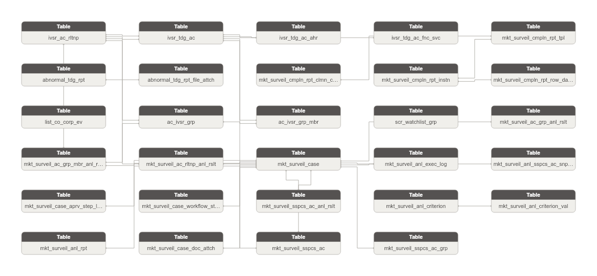

**Danh sách bảng:**

| STT | Tên bảng | Mô tả |
|---|---|---|
| 1 | ivsr_ac_rltnp | Quan hệ giữa 2 tài khoản nhà đầu tư trong giám sát (IP address, MAC address, chuyển tiền). Ghi nhận độ mạnh quan hệ. FK Investor Trading Account (x2) + Account Investor Group. |
| 2 | ivsr_tdg_ac | Tài khoản giao dịch chứng khoán của nhà đầu tư trong hệ thống GSGD. Grain: 1 dòng = 1 tài khoản (phân biệt theo account_code từ VSDC). Bao gồm cá nhân và tổ chức, trong nước và nước ngoài. |
| 3 | ivsr_tdg_ac_ahr | Ủy quyền giao dịch chứng khoán trên tài khoản nhà đầu tư. FK Investor Trading Account. |
| 4 | ivsr_tdg_ac_fnc_svc | Dịch vụ tài chính đăng ký trên tài khoản giao dịch (ký quỹ / ứng trước tiền bán / HĐ tài chính khác). FK Investor Trading Account. |
| 5 | mkt_surveil_ac_grp_anl_rslt | Kết quả phân tích nhóm tài khoản nghi vấn. FK Market Surveillance Case. |
| 6 | mkt_surveil_ac_grp_mbr_anl_rslt | Thành viên nhóm tài khoản trong kết quả phân tích. FK Market Surveillance Case + Investor Account Relationship. |
| 7 | mkt_surveil_ac_rltnp_anl_rslt | Kết quả phân tích quan hệ giữa tài khoản nghi vấn. FK Market Surveillance Case + Investor Account Relationship. |
| 8 | mkt_surveil_anl_exec_log | Log thực thi phân tích từng biểu mẫu trong vụ việc giám sát. FK Market Surveillance Case. |
| 9 | mkt_surveil_anl_sspcs_ac_snpst | Snapshot thông tin tài khoản nghi vấn tại thời điểm phân tích biểu mẫu. FK Market Surveillance Case. |
| 10 | mkt_surveil_case | Vụ việc giám sát giao dịch chứng khoán bất thường. Ghi nhận loại vụ việc, mã CK liên quan, nguồn thông tin và trạng thái xử lý. |
| 11 | mkt_surveil_case_aprv_step_log | Nhật ký phê duyệt từng bước xử lý vụ việc giám sát. Ghi nhận người duyệt, vai trò, trạng thái và thời điểm. FK Market Surveillance Case. |
| 12 | mkt_surveil_case_workflow_step | Từng bước quy trình xử lý vụ việc giám sát. Append-only. FK Market Surveillance Case. |
| 13 | mkt_surveil_sspcs_ac_anl_rslt | Kết quả phân tích/kiểm tra tài khoản nghi vấn trong vụ việc giám sát. FK Market Surveillance Case. |
| 14 | mkt_surveil_anl_criterion | Định nghĩa tiêu chí/công thức phân tích vụ việc giám sát (ngưỡng tỷ lệ, số phiên, v.v.). Grain: 1 dòng = 1 tiêu chí. |
| 15 | mkt_surveil_anl_criterion_val | Giá trị cụ thể của tiêu chí phân tích theo từng quy trình. FK Market Surveillance Analysis Criterion. |
| 16 | mkt_surveil_cmpln_rpt_tpl | Định nghĩa loại báo cáo tuân thủ trong hệ thống GSGD (tên báo cáo, kỳ báo cáo). Grain: 1 dòng = 1 loại báo cáo. |
| 17 | abnormal_tdg_rpt | Báo cáo giao dịch bất thường do tổ chức thành viên nộp lên UBCKNN. Grain: 1 dòng = 1 báo cáo. |
| 18 | abnormal_tdg_rpt_file_attch | File đính kèm báo cáo giao dịch bất thường (có chữ ký số). FK Abnormal Trading Report. |
| 19 | mkt_surveil_anl_rpt | Báo cáo output của quá trình phân tích vụ việc giám sát (report_type |
| 20 | mkt_surveil_case_doc_attch | File đính kèm vụ việc giám sát (tài liệu hồ sơ, danh sách TK nghi vấn). FK Market Surveillance Case. |
| 21 | mkt_surveil_cmpln_rpt_clmn_config | Định nghĩa cấu trúc cột của từng loại báo cáo tuân thủ GSGD. FK Market Surveillance Compliance Report Template. |
| 22 | mkt_surveil_cmpln_rpt_instn | Instance báo cáo tuân thủ theo từng kỳ. FK Market Surveillance Compliance Report Template. |
| 23 | mkt_surveil_cmpln_rpt_row_data | Dữ liệu từng dòng trong báo cáo tuân thủ GSGD (lưu dạng JSON). Grain: 1 dòng = 1 row x 1 kỳ. FK Market Surveillance Compliance Report Instance. |
| 24 | list_co_corp_ev | Sự kiện liên quan đến tổ chức niêm yết trong phạm vi giám sát GSGD. Grain: 1 dòng = 1 sự kiện. |
| 25 | mkt_surveil_sspcs_ac | Tài khoản nghi vấn được xác định trong vụ việc giám sát. FK Market Surveillance Case + Investor Trading Account. |
| 26 | mkt_surveil_sspcs_ac_grp | Nhóm tài khoản nghi vấn trong phạm vi 1 vụ việc giám sát cụ thể. FK Market Surveillance Case. |
| 27 | ac_ivsr_grp | Nhóm tài khoản nhà đầu tư do nghiệp vụ giám sát xác định theo tiêu chí quan hệ (Danh tính / IP / MAC / Tiền). Grain: 1 dòng = 1 nhóm. |
| 28 | ac_ivsr_grp_mbr | Quan hệ thành viên giữa tài khoản nhà đầu tư và nhóm giám sát. Ghi nhận loại quan hệ và trạng thái. FK Account Investor Group + Investor Trading Account. |
| 29 | scr_watchlist_grp | Nhóm chứng khoán do nghiệp vụ giám sát tạo ra (thường hoặc theo ngành). Danh sách mã CK denormalize thành ARRAY. |

### Bảng ivsr_ac_rltnp

| STT | Tên trường | Kiểu dữ liệu và độ dài | Nullable | Unique | P/F Key | Mặc định | Mô tả |
|---|---|---|---|---|---|---|---|
| 1 | ivsr_ac_rltnp_id | STRING |  | X | P |  | Khóa đại diện cho mối quan hệ giữa các tài khoản nhà đầu tư. |
| 2 | ivsr_ac_rltnp_code | STRING |  |  |  |  | PK kỹ thuật từ bảng nguồn. BK. |
| 3 | src_stm_code | STRING |  |  |  | 'GSGD.account_relationship' | Mã nguồn dữ liệu. |
| 4 | frst_ivsr_tdg_ac_id | STRING |  |  | F |  | FK đến tài khoản giao dịch thứ nhất. |
| 5 | frst_ivsr_tdg_ac_code | STRING |  |  |  |  | Mã tài khoản giao dịch thứ nhất. Denormalized. |
| 6 | scd_ivsr_tdg_ac_id | STRING |  |  | F |  | FK đến tài khoản giao dịch thứ hai. |
| 7 | scd_ivsr_tdg_ac_code | STRING |  |  |  |  | Mã tài khoản giao dịch thứ hai. Denormalized. |
| 8 | ac_ivsr_grp_id | STRING | X |  | F |  | FK đến nhóm tài khoản. |
| 9 | ac_ivsr_grp_code | STRING | X |  |  |  | Mã nhóm tài khoản. Denormalized. |
| 10 | relation_tp_code | STRING | X |  | F |  | Loại quan hệ (Danh tính / IP / MAC / Tiền). |
| 11 | rltnp_val | STRING | X |  |  |  | Giá trị quan hệ (IP address, MAC address, etc.). |
| 12 | strength | INT | X |  |  |  | Độ mạnh quan hệ (1-100). Điểm tính — không phải %. |

#### Constraint

**Khóa chính (Primary Key):**

| Tên trường |
|---|
| ivsr_ac_rltnp_id |

**Khóa phụ (Foreign Key):**

| Tên trường | Bảng tham chiếu | Cột tham chiếu |
|---|---|---|
| frst_ivsr_tdg_ac_id | ivsr_tdg_ac | ivsr_tdg_ac_id |
| scd_ivsr_tdg_ac_id | ivsr_tdg_ac | ivsr_tdg_ac_id |
| ac_ivsr_grp_id | ac_ivsr_grp | ac_ivsr_grp_id |

#### Index

N/A

#### Trigger

N/A

### Bảng ivsr_tdg_ac

| STT | Tên trường | Kiểu dữ liệu và độ dài | Nullable | Unique | P/F Key | Mặc định | Mô tả |
|---|---|---|---|---|---|---|---|
| 1 | ivsr_tdg_ac_id | STRING |  | X | P |  | Khóa đại diện cho tài khoản giao dịch chứng khoán. |
| 2 | ivsr_tdg_ac_code | STRING |  |  |  |  | Số tài khoản (từ VSDC). BK. |
| 3 | src_stm_code | STRING |  |  |  | 'GSGD.investor_account' | Mã nguồn dữ liệu. |
| 4 | ac_nm | STRING | X |  |  |  | Họ và tên nhà đầu tư. |
| 5 | ivsr_tp_code | STRING | X |  |  |  | Loại hình NĐT: 1=Cá nhân, 2=Tổ chức. |
| 6 | opn_dt | DATE | X |  |  |  | Ngày mở tài khoản. |
| 7 | cls_dt | DATE | X |  |  |  | Ngày đóng tài khoản. |
| 8 | ac_st_code | STRING | X |  |  |  | Trạng thái: 0=Đóng, 1=Mở. |
| 9 | dmst_frgn_f | STRING | X |  |  |  | Trong nước/Nước ngoài: 0=Trong nước, 1=Nước ngoài. |
| 10 | nat | STRING | X |  |  |  | Quốc tịch. Lưu dạng text denormalized — không có bảng lookup địa lý trong scope GSGD. |
| 11 | dob | DATE | X |  |  |  | Ngày tháng năm sinh/ngày thành lập DN (từ CTCK, có thể sửa). |
| 12 | lgl_rprs | STRING | X |  |  |  | Người đại diện theo pháp luật (từ CTCK, có thể sửa). |
| 13 | id_nbr | STRING | X |  |  |  | Số CCCD/Số đăng ký sở hữu. Denormalized — grain = 1 tài khoản. |
| 14 | id_issu_dt | DATE | X |  |  |  | Ngày cấp giấy tờ định danh. |
| 15 | id_issu_plc | STRING | X |  |  |  | Nơi cấp giấy tờ định danh. |
| 16 | ctc_adr | STRING | X |  |  |  | Địa chỉ liên lạc (từ CTCK, có thể sửa). Denormalized — grain = 1 tài khoản. |
| 17 | perm_adr | STRING | X |  |  |  | Địa chỉ thường trú (từ CTCK, có thể sửa). Denormalized — grain = 1 tài khoản. |
| 18 | ph_nbr | STRING | X |  |  |  | Số điện thoại (từ CTCK, có thể sửa). Denormalized — grain = 1 tài khoản. |
| 19 | email | STRING | X |  |  |  | Email (từ CTCK, có thể sửa). Denormalized — grain = 1 tài khoản. |
| 20 | bnk_ac_hldr_nm | STRING | X |  |  |  | Tên chủ tài khoản ngân hàng (từ CTCK, có thể sửa). |
| 21 | bnk_ac_nbr | STRING | X |  |  |  | Số tài khoản ngân hàng (từ CTCK, có thể sửa). |
| 22 | bnk_ac_nm | STRING | X |  |  |  | Tên ngân hàng (từ CTCK, có thể sửa). |
| 23 | mrgn_ac_opn_dt | DATE | X |  |  |  | Ngày mở tài khoản ký quỹ. |
| 24 | mrgn_svc_enabled | BOOLEAN | X |  |  |  | Dịch vụ tài chính sử dụng — Ký quỹ. |
| 25 | advnc_pymt_svc_enabled | BOOLEAN | X |  |  |  | Dịch vụ tài chính sử dụng — Ứng trước tiền bán. |
| 26 | ac_ahr_enabled | BOOLEAN | X |  |  |  | Dịch vụ tài chính sử dụng — Hợp đồng tài chính khác. |
| 27 | authorized_psn_nm | STRING | X |  |  |  | Người nhận ủy quyền (denormalized từ account_authorization). |
| 28 | ahr_dt | DATE | X |  |  |  | Ngày nhận ủy quyền (denormalized từ account_authorization). |
| 29 | aprv_st_code | STRING | X |  |  |  | Trạng thái phê duyệt tài khoản. |
| 30 | data_src_code | STRING | X |  |  |  | Nguồn dữ liệu chính: VSDC, CTCK. |
| 31 | last_mod_dt | DATE | X |  |  |  | Ngày thay đổi thông tin lần cuối. |

#### Constraint

**Khóa chính (Primary Key):**

| Tên trường |
|---|
| ivsr_tdg_ac_id |

**Khóa phụ (Foreign Key):**

*Không có Foreign Key.*

#### Index

N/A

#### Trigger

N/A

### Bảng ivsr_tdg_ac_ahr

| STT | Tên trường | Kiểu dữ liệu và độ dài | Nullable | Unique | P/F Key | Mặc định | Mô tả |
|---|---|---|---|---|---|---|---|
| 1 | ivsr_tdg_ac_ahr_id | STRING |  | X | P |  | Khóa đại diện cho ủy quyền tài khoản giao dịch. |
| 2 | ivsr_tdg_ac_ahr_code | STRING |  |  |  |  | PK kỹ thuật từ bảng nguồn. BK. |
| 3 | src_stm_code | STRING |  |  |  | 'GSGD.account_authorization' | Mã nguồn dữ liệu. |
| 4 | ivsr_tdg_ac_id | STRING |  |  | F |  | FK đến tài khoản giao dịch chứng khoán. |
| 5 | ivsr_tdg_ac_code | STRING |  |  |  |  | Mã tài khoản giao dịch. Denormalized. |
| 6 | authorized_psn_nm | STRING | X |  |  |  | Người nhận ủy quyền. |
| 7 | ahr_dt | DATE | X |  |  |  | Ngày nhận ủy quyền. |

#### Constraint

**Khóa chính (Primary Key):**

| Tên trường |
|---|
| ivsr_tdg_ac_ahr_id |

**Khóa phụ (Foreign Key):**

| Tên trường | Bảng tham chiếu | Cột tham chiếu |
|---|---|---|
| ivsr_tdg_ac_id | ivsr_tdg_ac | ivsr_tdg_ac_id |

#### Index

N/A

#### Trigger

N/A

### Bảng ivsr_tdg_ac_fnc_svc

| STT | Tên trường | Kiểu dữ liệu và độ dài | Nullable | Unique | P/F Key | Mặc định | Mô tả |
|---|---|---|---|---|---|---|---|
| 1 | ivsr_tdg_ac_fnc_svc_id | STRING |  | X | P |  | Khóa đại diện cho dịch vụ tài chính của tài khoản. |
| 2 | ivsr_tdg_ac_fnc_svc_code | STRING |  |  |  |  | PK kỹ thuật từ bảng nguồn. BK. |
| 3 | src_stm_code | STRING |  |  |  | 'GSGD.account_financial_service' | Mã nguồn dữ liệu. |
| 4 | ivsr_tdg_ac_id | STRING |  |  | F |  | FK đến tài khoản giao dịch chứng khoán. |
| 5 | ivsr_tdg_ac_code | STRING |  |  |  |  | Mã tài khoản giao dịch. Denormalized. |
| 6 | svc_tp_code | STRING |  |  |  |  | Loại dịch vụ: 1=Ký quỹ, 2=Ứng trước tiền bán, 3=HĐ tài chính khác. |
| 7 | ctr_nbr | STRING | X |  |  |  | Số hợp đồng. |
| 8 | ctr_dt | DATE | X |  |  |  | Ngày ký hợp đồng. |

#### Constraint

**Khóa chính (Primary Key):**

| Tên trường |
|---|
| ivsr_tdg_ac_fnc_svc_id |

**Khóa phụ (Foreign Key):**

| Tên trường | Bảng tham chiếu | Cột tham chiếu |
|---|---|---|
| ivsr_tdg_ac_id | ivsr_tdg_ac | ivsr_tdg_ac_id |

#### Index

N/A

#### Trigger

N/A

### Bảng mkt_surveil_ac_grp_anl_rslt

| STT | Tên trường | Kiểu dữ liệu và độ dài | Nullable | Unique | P/F Key | Mặc định | Mô tả |
|---|---|---|---|---|---|---|---|
| 1 | mkt_surveil_ac_grp_anl_rslt_id | STRING |  | X | P |  | Khóa đại diện cho kết quả phân tích nhóm tài khoản. |
| 2 | mkt_surveil_ac_grp_anl_rslt_code | STRING |  |  |  |  | PK kỹ thuật từ bảng nguồn. BK. |
| 3 | src_stm_code | STRING |  |  |  | 'GSGD.analysis_account_group' | Mã nguồn dữ liệu. |
| 4 | mkt_surveil_case_id | STRING |  |  | F |  | FK đến vụ việc giám sát. |
| 5 | mkt_surveil_case_code | STRING |  |  |  |  | Mã vụ việc. Denormalized. |
| 6 | workflow_tp_code | STRING |  |  |  |  | Loại quy trình: 1=Sơ bộ, 2=Thao túng, 3=Nội gián, 4=Liên thị trường. |
| 7 | rslt_tp_code | STRING |  |  |  |  | Loại kết quả: 1=Kết quả phân tích, 2=Kết quả kiểm tra. |
| 8 | grp_code | STRING | X |  |  |  | Mã nhóm tài khoản trong kết quả phân tích. |
| 9 | grp_nm | STRING | X |  |  |  | Tên nhóm tài khoản trong kết quả phân tích. |
| 10 | anl_dt | DATE |  |  |  |  | Ngày phân tích. |

#### Constraint

**Khóa chính (Primary Key):**

| Tên trường |
|---|
| mkt_surveil_ac_grp_anl_rslt_id |

**Khóa phụ (Foreign Key):**

| Tên trường | Bảng tham chiếu | Cột tham chiếu |
|---|---|---|
| mkt_surveil_case_id | mkt_surveil_case | mkt_surveil_case_id |

#### Index

N/A

#### Trigger

N/A

### Bảng mkt_surveil_ac_grp_mbr_anl_rslt

| STT | Tên trường | Kiểu dữ liệu và độ dài | Nullable | Unique | P/F Key | Mặc định | Mô tả |
|---|---|---|---|---|---|---|---|
| 1 | mkt_surveil_ac_grp_mbr_anl_rslt_id | STRING |  | X | P |  | Khóa đại diện cho kết quả phân tích thành viên nhóm tài khoản. |
| 2 | mkt_surveil_ac_grp_mbr_anl_rslt_code | STRING |  |  |  |  | PK kỹ thuật từ bảng nguồn. BK. |
| 3 | src_stm_code | STRING |  |  |  | 'GSGD.analysis_account_group_member' | Mã nguồn dữ liệu. |
| 4 | mkt_surveil_case_id | STRING |  |  | F |  | FK đến vụ việc giám sát. |
| 5 | mkt_surveil_case_code | STRING |  |  |  |  | Mã vụ việc. Denormalized. |
| 6 | ac_ivsr_grp_id | STRING | X |  | F |  | FK đến nhóm tài khoản. FK suy luận đã xác nhận. |
| 7 | ac_ivsr_grp_code | STRING | X |  |  |  | Mã nhóm tài khoản. Denormalized. |
| 8 | ivsr_ac_rltnp_id | STRING | X |  | F |  | FK đến mối quan hệ tài khoản. |
| 9 | ivsr_ac_rltnp_code | STRING | X |  |  |  | Mã mối quan hệ tài khoản. Denormalized. |
| 10 | workflow_tp_code | STRING |  |  |  |  | Loại quy trình: 1=Sơ bộ, 2=Thao túng, 3=Nội gián, 4=Liên thị trường. |
| 11 | rslt_tp_code | STRING |  |  |  |  | Loại kết quả: 1=Kết quả phân tích, 2=Kết quả kiểm tra. |
| 12 | ac_code | STRING | X |  |  |  | Mã tài khoản thành viên trong kết quả phân tích. |
| 13 | ac_nm | STRING | X |  |  |  | Tên tài khoản thành viên. |
| 14 | dsc | STRING | X |  |  |  | Mô tả. |
| 15 | anl_dt | DATE |  |  |  |  | Ngày phân tích. |

#### Constraint

**Khóa chính (Primary Key):**

| Tên trường |
|---|
| mkt_surveil_ac_grp_mbr_anl_rslt_id |

**Khóa phụ (Foreign Key):**

| Tên trường | Bảng tham chiếu | Cột tham chiếu |
|---|---|---|
| mkt_surveil_case_id | mkt_surveil_case | mkt_surveil_case_id |
| ac_ivsr_grp_id | ac_ivsr_grp | ac_ivsr_grp_id |
| ivsr_ac_rltnp_id | ivsr_ac_rltnp | ivsr_ac_rltnp_id |

#### Index

N/A

#### Trigger

N/A

### Bảng mkt_surveil_ac_rltnp_anl_rslt

| STT | Tên trường | Kiểu dữ liệu và độ dài | Nullable | Unique | P/F Key | Mặc định | Mô tả |
|---|---|---|---|---|---|---|---|
| 1 | mkt_surveil_ac_rltnp_anl_rslt_id | STRING |  | X | P |  | Khóa đại diện cho kết quả phân tích quan hệ tài khoản. |
| 2 | mkt_surveil_ac_rltnp_anl_rslt_code | STRING |  |  |  |  | PK kỹ thuật từ bảng nguồn. BK. |
| 3 | src_stm_code | STRING |  |  |  | 'GSGD.analysis_account_relationship' | Mã nguồn dữ liệu. |
| 4 | mkt_surveil_case_id | STRING |  |  | F |  | FK đến vụ việc giám sát. |
| 5 | mkt_surveil_case_code | STRING |  |  |  |  | Mã vụ việc. Denormalized. |
| 6 | ivsr_ac_rltnp_id | STRING | X |  | F |  | FK đến mối quan hệ tài khoản nghi vấn. |
| 7 | ivsr_ac_rltnp_code | STRING | X |  |  |  | Mã mối quan hệ tài khoản. Denormalized. |
| 8 | workflow_tp_code | STRING |  |  |  |  | Loại quy trình: 1=Sơ bộ, 2=Thao túng, 3=Nội gián, 4=Liên thị trường. |
| 9 | rslt_tp_code | STRING |  |  |  |  | Loại kết quả: 1=Kết quả phân tích, 2=Kết quả kiểm tra. |
| 10 | anl_dt | DATE |  |  |  |  | Ngày phân tích. |

#### Constraint

**Khóa chính (Primary Key):**

| Tên trường |
|---|
| mkt_surveil_ac_rltnp_anl_rslt_id |

**Khóa phụ (Foreign Key):**

| Tên trường | Bảng tham chiếu | Cột tham chiếu |
|---|---|---|
| mkt_surveil_case_id | mkt_surveil_case | mkt_surveil_case_id |
| ivsr_ac_rltnp_id | ivsr_ac_rltnp | ivsr_ac_rltnp_id |

#### Index

N/A

#### Trigger

N/A

### Bảng mkt_surveil_anl_exec_log

| STT | Tên trường | Kiểu dữ liệu và độ dài | Nullable | Unique | P/F Key | Mặc định | Mô tả |
|---|---|---|---|---|---|---|---|
| 1 | mkt_surveil_anl_exec_log_id | STRING |  | X | P |  | Khóa đại diện cho log thực thi phân tích biểu mẫu. |
| 2 | mkt_surveil_anl_exec_log_code | STRING |  |  |  |  | PK kỹ thuật từ bảng nguồn. BK. |
| 3 | src_stm_code | STRING |  |  |  | 'GSGD.analysis_execution_log' | Mã nguồn dữ liệu. |
| 4 | mkt_surveil_case_id | STRING |  |  | F |  | FK đến vụ việc giám sát. |
| 5 | mkt_surveil_case_code | STRING |  |  |  |  | Mã vụ việc. Denormalized. |
| 6 | anl_nm | STRING | X |  |  |  | Tên phân tích biểu mẫu. |
| 7 | workflow_tp_code | STRING | X |  |  |  | Loại quy trình: 1=Sơ bộ, 2=Thao túng, 3=Nội gián, 4=Liên thị trường. |
| 8 | tpl_tp_code | STRING | X |  |  |  | Loại biểu mẫu: 1=Báo cáo tổng hợp, 2=Báo cáo phân tích. |
| 9 | strt_tm | TIMESTAMP | X |  |  |  | Thời gian bắt đầu phân tích. |
| 10 | end_tm | TIMESTAMP | X |  |  |  | Thời gian kết thúc phân tích. |
| 11 | exec_st_code | STRING | X |  |  |  | Trạng thái thực thi: 0=Inactive, 1=Active. |
| 12 | rqs_param | STRING | X |  |  |  | Thông tin parameters đầu vào. |
| 13 | err_msg | STRING | X |  |  |  | Thông báo lỗi (nếu có). |
| 14 | file_path | STRING | X |  |  |  | Đường dẫn file output phân tích. |
| 15 | file_nm | STRING | X |  |  |  | Tên file output phân tích. |

#### Constraint

**Khóa chính (Primary Key):**

| Tên trường |
|---|
| mkt_surveil_anl_exec_log_id |

**Khóa phụ (Foreign Key):**

| Tên trường | Bảng tham chiếu | Cột tham chiếu |
|---|---|---|
| mkt_surveil_case_id | mkt_surveil_case | mkt_surveil_case_id |

#### Index

N/A

#### Trigger

N/A

### Bảng mkt_surveil_anl_sspcs_ac_snpst

| STT | Tên trường | Kiểu dữ liệu và độ dài | Nullable | Unique | P/F Key | Mặc định | Mô tả |
|---|---|---|---|---|---|---|---|
| 1 | mkt_surveil_anl_sspcs_ac_snpst_id | STRING |  | X | P |  | Khóa đại diện cho snapshot thông tin tài khoản nghi vấn theo biểu mẫu phân tích. |
| 2 | mkt_surveil_anl_sspcs_ac_snpst_code | STRING |  |  |  |  | PK kỹ thuật từ bảng nguồn. BK. |
| 3 | src_stm_code | STRING |  |  |  | 'GSGD.analysis_suspicious_account_code' | Mã nguồn dữ liệu. |
| 4 | mkt_surveil_case_id | STRING |  |  | F |  | FK đến vụ việc giám sát. |
| 5 | mkt_surveil_case_code | STRING |  |  |  |  | Mã vụ việc. Denormalized. |
| 6 | workflow_tp_code | STRING |  |  |  |  | Loại quy trình: 1=Sơ bộ, 2=Thao túng, 3=Nội gián, 4=Liên thị trường. |
| 7 | ac_code | STRING |  |  |  |  | Mã tài khoản nghi vấn tại thời điểm phân tích. Snapshot — không FK đến Investor Trading Account. |
| 8 | ac_nm | STRING | X |  |  |  | Họ và tên tại thời điểm phân tích. Snapshot. |
| 9 | ac_tp_code | STRING | X |  |  |  | Loại tài khoản. Snapshot. |
| 10 | id_nbr | STRING | X |  |  |  | Số CCCD/Số đăng ký sở hữu tại thời điểm phân tích. Snapshot. |
| 11 | id_issu_dt | DATE | X |  |  |  | Ngày cấp giấy tờ. Snapshot. |
| 12 | id_issu_plc | STRING | X |  |  |  | Nơi cấp giấy tờ. Snapshot. |
| 13 | ctc_adr | STRING | X |  |  |  | Địa chỉ liên lạc tại thời điểm phân tích. Snapshot — không tách shared entity. |
| 14 | dmst_frgn_f | STRING | X |  |  |  | Trong nước/Nước ngoài. Snapshot. |
| 15 | ph_nbr | STRING | X |  |  |  | Số điện thoại tại thời điểm phân tích. Snapshot. |
| 16 | email | STRING | X |  |  |  | Email tại thời điểm phân tích. Snapshot. |
| 17 | ac_st_code | STRING | X |  |  |  | Trạng thái tài khoản: 0=Đóng, 1=Mở. Snapshot. |

#### Constraint

**Khóa chính (Primary Key):**

| Tên trường |
|---|
| mkt_surveil_anl_sspcs_ac_snpst_id |

**Khóa phụ (Foreign Key):**

| Tên trường | Bảng tham chiếu | Cột tham chiếu |
|---|---|---|
| mkt_surveil_case_id | mkt_surveil_case | mkt_surveil_case_id |

#### Index

N/A

#### Trigger

N/A

### Bảng mkt_surveil_case

| STT | Tên trường | Kiểu dữ liệu và độ dài | Nullable | Unique | P/F Key | Mặc định | Mô tả |
|---|---|---|---|---|---|---|---|
| 1 | mkt_surveil_case_id | STRING |  | X | P |  | Khóa đại diện cho vụ việc giám sát giao dịch. |
| 2 | mkt_surveil_case_code | STRING |  |  |  |  | Mã vụ việc (tự sinh: MãCK+DDMMYYYY). BK. |
| 3 | src_stm_code | STRING |  |  |  | 'GSGD.case_file' | Mã nguồn dữ liệu. |
| 4 | case_tp_code | STRING | X |  |  |  | Loại vụ việc (Sơ bộ / Thao túng / Nội gián / Liên thị trường). |
| 5 | scr_code | STRING | X |  |  |  | Mã chứng khoán liên quan. Denormalized — bảng securities_code ngoài scope GSGD. |
| 6 | inf_src_code | STRING | X |  |  |  | Nguồn thông tin vụ việc. |
| 7 | inf_src_dtl | STRING | X |  |  |  | Nguồn thông tin chi tiết. |
| 8 | strt_dt | DATE | X |  |  |  | Ngày bắt đầu vụ việc. |
| 9 | end_dt | DATE | X |  |  |  | Ngày kết thúc vụ việc. |
| 10 | compl_dt | DATE | X |  |  |  | Thời gian hoàn thành vụ việc. |
| 11 | asgn_to | STRING | X |  |  |  | Người được phân công xử lý vụ việc. |
| 12 | case_st_code | STRING | X |  |  |  | Trạng thái vụ việc. |
| 13 | notes | STRING | X |  |  |  | Ghi chú vụ việc. |

#### Constraint

**Khóa chính (Primary Key):**

| Tên trường |
|---|
| mkt_surveil_case_id |

**Khóa phụ (Foreign Key):**

*Không có Foreign Key.*

#### Index

N/A

#### Trigger

N/A

### Bảng mkt_surveil_case_aprv_step_log

| STT | Tên trường | Kiểu dữ liệu và độ dài | Nullable | Unique | P/F Key | Mặc định | Mô tả |
|---|---|---|---|---|---|---|---|
| 1 | mkt_surveil_case_aprv_step_log_id | STRING |  | X | P |  | Khóa đại diện cho bước phê duyệt vụ việc giám sát. |
| 2 | mkt_surveil_case_aprv_step_log_code | STRING |  |  |  |  | PK kỹ thuật từ bảng nguồn. BK. |
| 3 | src_stm_code | STRING |  |  |  | 'GSGD.case_approval_step' | Mã nguồn dữ liệu. |
| 4 | mkt_surveil_case_id | STRING |  |  | F |  | FK đến vụ việc giám sát. |
| 5 | mkt_surveil_case_code | STRING |  |  |  |  | Mã vụ việc. Denormalized. |
| 6 | step_code | STRING |  |  |  |  | Mã bước: 1=Chuyên viên khởi tạo, 2=Trưởng ban phê duyệt, 3=Phó Trưởng ban phân công, 4=Chuyên viên xử lý. |
| 7 | step_nm | STRING | X |  |  |  | Tên bước (phục vụ hiển thị). |
| 8 | asgn_rl | STRING | X |  |  |  | Chức vụ/nhóm duyệt (ví dụ: TRUONG_BAN, PHO_TRUONG_BAN, CHUYEN_VIEN). |
| 9 | step_st_code | STRING | X |  |  |  | Trạng thái: 0=Chưa xử lý, 1=Đang xử lý, 2=Đã duyệt/Hoàn thành, 3=Từ chối. |
| 10 | actn_at | TIMESTAMP | X |  |  |  | Thời điểm duyệt/xử lý. |
| 11 | actn_note | STRING | X |  |  |  | Ghi chú khi duyệt/từ chối. |
| 12 | nxt_step_code | STRING | X |  |  |  | Bước tiếp theo. Nullable nếu là bước cuối. |
| 13 | nxt_asgn_rl | STRING | X |  |  |  | Chức vụ/nhóm của người duyệt tiếp theo. |
| 14 | due_dt | DATE | X |  |  |  | Hạn xử lý (nếu cần SLA). |

#### Constraint

**Khóa chính (Primary Key):**

| Tên trường |
|---|
| mkt_surveil_case_aprv_step_log_id |

**Khóa phụ (Foreign Key):**

| Tên trường | Bảng tham chiếu | Cột tham chiếu |
|---|---|---|
| mkt_surveil_case_id | mkt_surveil_case | mkt_surveil_case_id |

#### Index

N/A

#### Trigger

N/A

### Bảng mkt_surveil_case_workflow_step

| STT | Tên trường | Kiểu dữ liệu và độ dài | Nullable | Unique | P/F Key | Mặc định | Mô tả |
|---|---|---|---|---|---|---|---|
| 1 | mkt_surveil_case_workflow_step_id | STRING |  | X | P |  | Khóa đại diện cho bước quy trình xử lý vụ việc. |
| 2 | mkt_surveil_case_workflow_step_code | STRING |  |  |  |  | PK kỹ thuật từ bảng nguồn. BK. |
| 3 | src_stm_code | STRING |  |  |  | 'GSGD.case_file_workflow' | Mã nguồn dữ liệu. |
| 4 | mkt_surveil_case_id | STRING |  |  | F |  | FK đến vụ việc giám sát. |
| 5 | mkt_surveil_case_code | STRING |  |  |  |  | Mã vụ việc. Denormalized. |
| 6 | workflow_tp_code | STRING |  |  |  |  | Loại quy trình: 1=Sơ bộ, 2=Thao túng, 3=Nội gián, 4=Liên thị trường. |
| 7 | step_ordr | INT | X |  |  |  | Thứ tự bước trong quy trình. |
| 8 | step_nm | STRING | X |  |  |  | Tên bước quy trình. |
| 9 | step_st_code | STRING | X |  |  |  | Trạng thái bước: 0=Chưa thực hiện, 1=Đang thực hiện, 2=Hoàn thành. |

#### Constraint

**Khóa chính (Primary Key):**

| Tên trường |
|---|
| mkt_surveil_case_workflow_step_id |

**Khóa phụ (Foreign Key):**

| Tên trường | Bảng tham chiếu | Cột tham chiếu |
|---|---|---|
| mkt_surveil_case_id | mkt_surveil_case | mkt_surveil_case_id |

#### Index

N/A

#### Trigger

N/A

### Bảng mkt_surveil_sspcs_ac_anl_rslt

| STT | Tên trường | Kiểu dữ liệu và độ dài | Nullable | Unique | P/F Key | Mặc định | Mô tả |
|---|---|---|---|---|---|---|---|
| 1 | mkt_surveil_sspcs_ac_anl_rslt_id | STRING |  | X | P |  | Khóa đại diện cho kết quả phân tích tài khoản nghi vấn. |
| 2 | mkt_surveil_sspcs_ac_anl_rslt_code | STRING |  |  |  |  | PK kỹ thuật từ bảng nguồn. BK. |
| 3 | src_stm_code | STRING |  |  |  | 'GSGD.analysis_suspicious_account' | Mã nguồn dữ liệu. |
| 4 | mkt_surveil_case_id | STRING |  |  | F |  | FK đến vụ việc giám sát. |
| 5 | mkt_surveil_case_code | STRING |  |  |  |  | Mã vụ việc. Denormalized. |
| 6 | workflow_tp_code | STRING |  |  |  |  | Loại quy trình: 1=Sơ bộ, 2=Thao túng, 3=Nội gián, 4=Liên thị trường. |
| 7 | rslt_tp_code | STRING |  |  |  |  | Loại kết quả: 1=Kết quả phân tích, 2=Kết quả kiểm tra. |
| 8 | ac_code | STRING |  |  |  |  | Mã tài khoản nghi vấn. |
| 9 | anl_dt | DATE |  |  |  |  | Ngày phân tích. |

#### Constraint

**Khóa chính (Primary Key):**

| Tên trường |
|---|
| mkt_surveil_sspcs_ac_anl_rslt_id |

**Khóa phụ (Foreign Key):**

| Tên trường | Bảng tham chiếu | Cột tham chiếu |
|---|---|---|
| mkt_surveil_case_id | mkt_surveil_case | mkt_surveil_case_id |

#### Index

N/A

#### Trigger

N/A

### Bảng mkt_surveil_anl_criterion

| STT | Tên trường | Kiểu dữ liệu và độ dài | Nullable | Unique | P/F Key | Mặc định | Mô tả |
|---|---|---|---|---|---|---|---|
| 1 | mkt_surveil_anl_criterion_id | STRING |  | X | P |  | Khóa đại diện cho tiêu chí phân tích giám sát. |
| 2 | mkt_surveil_anl_criterion_code | STRING |  |  |  |  | Mã tiêu chí (ví dụ: CT_01_THRESHOLD_A). BK. |
| 3 | src_stm_code | STRING |  |  |  | 'GSGD.analysis_attribute_define' | Mã nguồn dữ liệu. |
| 4 | criterion_nm | STRING |  |  |  |  | Tên hiển thị tiêu chí (ví dụ: Tỷ trọng đặt/khớp lệnh > A% trong X ngày). |
| 5 | dsc | STRING | X |  |  |  | Mô tả chi tiết tiêu chí, dùng cho BA/SA. |
| 6 | workflow_tp_code | STRING | X |  |  |  | Quy trình áp dụng: 1=Sơ bộ, 2=Thao túng, 3=Nội gián, 4=Liên thị trường. |
| 7 | data_tp_code | STRING | X |  |  |  | Kiểu dữ liệu: NUMBER, STRING, DATE, BOOLEAN. |
| 8 | dflt_val | STRING | X |  |  |  | Giá trị mặc định (lưu dạng text, parse theo data_type). |
| 9 | min_val | STRING | X |  |  |  | Giá trị tối thiểu (nếu là NUMBER/DATE). |
| 10 | max_val | STRING | X |  |  |  | Giá trị tối đa (nếu là NUMBER/DATE). |
| 11 | unit | STRING | X |  |  |  | Đơn vị: %, ngày, phiên,... |
| 12 | step | STRING | X |  |  |  | Bước nhảy cho slider (nếu áp dụng). |
| 13 | dspl_grp | STRING | X |  |  |  | Nhóm hiển thị trên màn hình (ví dụ: Tham số cấu hình báo cáo). |
| 14 | dspl_ordr | INT | X |  |  |  | Thứ tự hiển thị. |
| 15 | actv_f | BOOLEAN | X |  |  |  | Trạng thái sử dụng: 0=Không dùng, 1=Đang dùng. |

#### Constraint

**Khóa chính (Primary Key):**

| Tên trường |
|---|
| mkt_surveil_anl_criterion_id |

**Khóa phụ (Foreign Key):**

*Không có Foreign Key.*

#### Index

N/A

#### Trigger

N/A

### Bảng mkt_surveil_anl_criterion_val

| STT | Tên trường | Kiểu dữ liệu và độ dài | Nullable | Unique | P/F Key | Mặc định | Mô tả |
|---|---|---|---|---|---|---|---|
| 1 | mkt_surveil_anl_criterion_val_id | STRING |  | X | P |  | Khóa đại diện cho giá trị tiêu chí phân tích. |
| 2 | mkt_surveil_anl_criterion_val_code | STRING |  |  |  |  | PK kỹ thuật từ bảng nguồn. BK. |
| 3 | src_stm_code | STRING |  |  |  | 'GSGD.analysis_attribute_value' | Mã nguồn dữ liệu. |
| 4 | mkt_surveil_anl_criterion_id | STRING |  |  | F |  | FK đến tiêu chí phân tích. |
| 5 | mkt_surveil_anl_criterion_code | STRING |  |  |  |  | Mã tiêu chí phân tích. Denormalized. |
| 6 | workflow_tp_code | STRING |  |  |  |  | Quy trình: 1=Sơ bộ, 2=Thao túng, 3=Nội gián, 4=Liên thị trường. |
| 7 | val_nbr | STRING | X |  |  |  | Giá trị số (nếu data_type = NUMBER). |
| 8 | val_strg | STRING | X |  |  |  | Giá trị chuỗi (nếu data_type = STRING hoặc mô tả mở rộng). |
| 9 | val_dt | DATE | X |  |  |  | Giá trị ngày (nếu data_type = DATE). |
| 10 | val_booln | BOOLEAN | X |  |  |  | Giá trị boolean: 0/1 (nếu data_type = BOOLEAN). |

#### Constraint

**Khóa chính (Primary Key):**

| Tên trường |
|---|
| mkt_surveil_anl_criterion_val_id |

**Khóa phụ (Foreign Key):**

| Tên trường | Bảng tham chiếu | Cột tham chiếu |
|---|---|---|
| mkt_surveil_anl_criterion_id | mkt_surveil_anl_criterion | mkt_surveil_anl_criterion_id |

#### Index

N/A

#### Trigger

N/A

### Bảng mkt_surveil_cmpln_rpt_tpl

| STT | Tên trường | Kiểu dữ liệu và độ dài | Nullable | Unique | P/F Key | Mặc định | Mô tả |
|---|---|---|---|---|---|---|---|
| 1 | mkt_surveil_cmpln_rpt_tpl_id | STRING |  | X | P |  | Khóa đại diện cho mẫu báo cáo tuân thủ giám sát. |
| 2 | mkt_surveil_cmpln_rpt_tpl_code | STRING |  |  |  |  | PK kỹ thuật từ bảng nguồn. BK. |
| 3 | src_stm_code | STRING |  |  |  | 'GSGD.compliance_report_template' | Mã nguồn dữ liệu. |
| 4 | tpl_nm | STRING |  |  |  |  | Tên báo cáo tuân thủ. |
| 5 | prd_tp_code | STRING | X |  |  |  | Loại kỳ báo cáo. |

#### Constraint

**Khóa chính (Primary Key):**

| Tên trường |
|---|
| mkt_surveil_cmpln_rpt_tpl_id |

**Khóa phụ (Foreign Key):**

*Không có Foreign Key.*

#### Index

N/A

#### Trigger

N/A

### Bảng abnormal_tdg_rpt

| STT | Tên trường | Kiểu dữ liệu và độ dài | Nullable | Unique | P/F Key | Mặc định | Mô tả |
|---|---|---|---|---|---|---|---|
| 1 | abnormal_tdg_rpt_id | STRING |  | X | P |  | Khóa đại diện cho báo cáo giao dịch bất thường. |
| 2 | abnormal_tdg_rpt_code | STRING |  |  |  |  | Mã báo cáo. BK. |
| 3 | src_stm_code | STRING |  |  |  | 'GSGD.abnormal_report' | Mã nguồn dữ liệu. |
| 4 | rpt_nm | STRING | X |  |  |  | Tên báo cáo. |
| 5 | rpt_tp_code | STRING | X |  |  |  | Loại báo cáo bất thường. |
| 6 | prd_tp_code | STRING | X |  |  |  | Loại kỳ báo cáo. |
| 7 | prd_val | STRING | X |  |  |  | Giá trị kỳ báo cáo (ví dụ: tháng 1 = 1). |
| 8 | prd_yr | INT | X |  |  |  | Năm kỳ báo cáo. |
| 9 | submitter_tp_code | STRING | X |  |  |  | Loại người nộp (Tổ chức / Cá nhân). |
| 10 | submitter_id | STRING | X |  |  |  | Mã người/tổ chức nộp báo cáo. Denormalized — không có FK tường minh đến entity Atomic. |
| 11 | submitter_nm | STRING | X |  |  |  | Tên người/tổ chức nộp báo cáo. |
| 12 | subm_dt | DATE | X |  |  |  | Ngày nộp báo cáo. |
| 13 | aprv_st_code | STRING | X |  |  |  | Trạng thái: 0=Chờ duyệt, 1=Đã duyệt, 2=Từ chối, 3=Yêu cầu nộp lại. |
| 14 | aprv_dt | DATE | X |  |  |  | Ngày duyệt báo cáo. |
| 15 | approver | STRING | X |  |  |  | Người duyệt. |
| 16 | rejection_rsn | STRING | X |  |  |  | Lý do từ chối. |

#### Constraint

**Khóa chính (Primary Key):**

| Tên trường |
|---|
| abnormal_tdg_rpt_id |

**Khóa phụ (Foreign Key):**

*Không có Foreign Key.*

#### Index

N/A

#### Trigger

N/A

### Bảng abnormal_tdg_rpt_file_attch

| STT | Tên trường | Kiểu dữ liệu và độ dài | Nullable | Unique | P/F Key | Mặc định | Mô tả |
|---|---|---|---|---|---|---|---|
| 1 | abnormal_tdg_rpt_file_attch_id | STRING |  | X | P |  | Khóa đại diện cho file đính kèm báo cáo bất thường. |
| 2 | abnormal_tdg_rpt_file_attch_code | STRING |  |  |  |  | PK kỹ thuật từ bảng nguồn. BK. |
| 3 | src_stm_code | STRING |  |  |  | 'GSGD.abnormal_report_file' | Mã nguồn dữ liệu. |
| 4 | abnormal_tdg_rpt_id | STRING |  |  | F |  | FK đến báo cáo giao dịch bất thường. |
| 5 | abnormal_tdg_rpt_code | STRING |  |  |  |  | Mã báo cáo bất thường. Denormalized. |
| 6 | file_nm | STRING | X |  |  |  | Tên file đính kèm. |
| 7 | file_path | STRING | X |  |  |  | Đường dẫn file. |
| 8 | file_sz | STRING | X |  |  |  | Kích thước file (bytes). |
| 9 | file_tp_code | STRING | X |  |  |  | Loại file: CSV, XLSX, PDF. |
| 10 | digital_sgn | STRING | X |  |  |  | Chữ ký số của file. |

#### Constraint

**Khóa chính (Primary Key):**

| Tên trường |
|---|
| abnormal_tdg_rpt_file_attch_id |

**Khóa phụ (Foreign Key):**

| Tên trường | Bảng tham chiếu | Cột tham chiếu |
|---|---|---|
| abnormal_tdg_rpt_id | abnormal_tdg_rpt | abnormal_tdg_rpt_id |

#### Index

N/A

#### Trigger

N/A

### Bảng mkt_surveil_anl_rpt

| STT | Tên trường | Kiểu dữ liệu và độ dài | Nullable | Unique | P/F Key | Mặc định | Mô tả |
|---|---|---|---|---|---|---|---|
| 1 | mkt_surveil_anl_rpt_id | STRING |  | X | P |  | Khóa đại diện cho báo cáo kết quả phân tích vụ việc. |
| 2 | mkt_surveil_anl_rpt_code | STRING |  |  |  |  | PK kỹ thuật từ bảng nguồn. BK. |
| 3 | src_stm_code | STRING |  |  |  | 'GSGD.analysis_report' | Mã nguồn dữ liệu. |
| 4 | mkt_surveil_case_id | STRING |  |  | F |  | FK đến vụ việc giám sát. |
| 5 | mkt_surveil_case_code | STRING |  |  |  |  | Mã vụ việc. Denormalized. |
| 6 | rpt_tp_code | STRING | X |  |  |  | Loại báo cáo phân tích vụ việc. |
| 7 | rpt_dt | DATE | X |  |  |  | Ngày lập báo cáo. |
| 8 | rpt_data | STRING | X |  |  |  | Dữ liệu báo cáo (JSON hoặc XML). Lưu raw — không parse. |
| 9 | rpt_file_path | STRING | X |  |  |  | Đường dẫn file báo cáo. |
| 10 | anl_exec_log_id | STRING | X |  | F |  | ID phân tích biểu mẫu. Denormalized — không tạo FK tường minh để tránh cross-tier dependency. |

#### Constraint

**Khóa chính (Primary Key):**

| Tên trường |
|---|
| mkt_surveil_anl_rpt_id |

**Khóa phụ (Foreign Key):**

| Tên trường | Bảng tham chiếu | Cột tham chiếu |
|---|---|---|
| mkt_surveil_case_id | mkt_surveil_case | mkt_surveil_case_id |

#### Index

N/A

#### Trigger

N/A

### Bảng mkt_surveil_case_doc_attch

| STT | Tên trường | Kiểu dữ liệu và độ dài | Nullable | Unique | P/F Key | Mặc định | Mô tả |
|---|---|---|---|---|---|---|---|
| 1 | mkt_surveil_case_doc_attch_id | STRING |  | X | P |  | Khóa đại diện cho file đính kèm vụ việc giám sát. |
| 2 | mkt_surveil_case_doc_attch_code | STRING |  |  |  |  | PK kỹ thuật từ bảng nguồn. BK. |
| 3 | src_stm_code | STRING |  |  |  | 'GSGD.case_attach_file' | Mã nguồn dữ liệu. |
| 4 | mkt_surveil_case_id | STRING |  |  | F |  | FK đến vụ việc giám sát. |
| 5 | mkt_surveil_case_code | STRING |  |  |  |  | Mã vụ việc. Denormalized. |
| 6 | file_nm | STRING | X |  |  |  | Tên file đính kèm. |
| 7 | file_path | STRING | X |  |  |  | Đường dẫn file. |
| 8 | file_sz | STRING | X |  |  |  | Kích thước file (bytes). |
| 9 | file_tp_code | STRING | X |  |  |  | Loại file: CSV, XLSX, PDF. |
| 10 | file_grp_code | STRING | X |  |  |  | Nhóm file: 1=Hồ sơ của Sở, 2=Danh sách tài khoản nghi vấn. |

#### Constraint

**Khóa chính (Primary Key):**

| Tên trường |
|---|
| mkt_surveil_case_doc_attch_id |

**Khóa phụ (Foreign Key):**

| Tên trường | Bảng tham chiếu | Cột tham chiếu |
|---|---|---|
| mkt_surveil_case_id | mkt_surveil_case | mkt_surveil_case_id |

#### Index

N/A

#### Trigger

N/A

### Bảng mkt_surveil_cmpln_rpt_clmn_config

| STT | Tên trường | Kiểu dữ liệu và độ dài | Nullable | Unique | P/F Key | Mặc định | Mô tả |
|---|---|---|---|---|---|---|---|
| 1 | mkt_surveil_cmpln_rpt_clmn_config_id | STRING |  | X | P |  | Khóa đại diện cho cấu hình cột báo cáo tuân thủ. |
| 2 | mkt_surveil_cmpln_rpt_clmn_config_code | STRING |  |  |  |  | PK kỹ thuật từ bảng nguồn. BK. |
| 3 | src_stm_code | STRING |  |  |  | 'GSGD.compliance_report_config' | Mã nguồn dữ liệu. |
| 4 | mkt_surveil_cmpln_rpt_tpl_id | STRING |  |  | F |  | FK đến mẫu báo cáo tuân thủ. |
| 5 | mkt_surveil_cmpln_rpt_tpl_code | STRING |  |  |  |  | Mã mẫu báo cáo tuân thủ. Denormalized. |
| 6 | clmn_lbl | STRING | X |  |  |  | Nhãn cột trong báo cáo. |
| 7 | dspl_ordr | INT | X |  |  |  | Thứ tự hiển thị cột. |
| 8 | data_tp_code | STRING | X |  |  |  | Kiểu dữ liệu của cột. |
| 9 | is_visible | BOOLEAN | X |  |  |  | Cờ hiển thị cột. |

#### Constraint

**Khóa chính (Primary Key):**

| Tên trường |
|---|
| mkt_surveil_cmpln_rpt_clmn_config_id |

**Khóa phụ (Foreign Key):**

| Tên trường | Bảng tham chiếu | Cột tham chiếu |
|---|---|---|
| mkt_surveil_cmpln_rpt_tpl_id | mkt_surveil_cmpln_rpt_tpl | mkt_surveil_cmpln_rpt_tpl_id |

#### Index

N/A

#### Trigger

N/A

### Bảng mkt_surveil_cmpln_rpt_instn

| STT | Tên trường | Kiểu dữ liệu và độ dài | Nullable | Unique | P/F Key | Mặc định | Mô tả |
|---|---|---|---|---|---|---|---|
| 1 | mkt_surveil_cmpln_rpt_instn_id | STRING |  | X | P |  | Khóa đại diện cho instance báo cáo tuân thủ theo kỳ. |
| 2 | mkt_surveil_cmpln_rpt_instn_code | STRING |  |  |  |  | PK kỹ thuật từ bảng nguồn. BK. |
| 3 | src_stm_code | STRING |  |  |  | 'GSGD.compliance_report_master' | Mã nguồn dữ liệu. |
| 4 | mkt_surveil_cmpln_rpt_tpl_id | STRING |  |  | F |  | FK đến mẫu báo cáo tuân thủ. |
| 5 | mkt_surveil_cmpln_rpt_tpl_code | STRING |  |  |  |  | Mã mẫu báo cáo tuân thủ. Denormalized. |
| 6 | prd_tp_code | STRING | X |  |  |  | Loại kỳ báo cáo. |
| 7 | prd_val | STRING | X |  |  |  | Giá trị kỳ báo cáo (ví dụ: tháng 1 = 1). |
| 8 | prd_yr | INT | X |  |  |  | Năm kỳ báo cáo. |
| 9 | instn_st_code | STRING | X |  |  |  | Trạng thái instance báo cáo. |

#### Constraint

**Khóa chính (Primary Key):**

| Tên trường |
|---|
| mkt_surveil_cmpln_rpt_instn_id |

**Khóa phụ (Foreign Key):**

| Tên trường | Bảng tham chiếu | Cột tham chiếu |
|---|---|---|
| mkt_surveil_cmpln_rpt_tpl_id | mkt_surveil_cmpln_rpt_tpl | mkt_surveil_cmpln_rpt_tpl_id |

#### Index

N/A

#### Trigger

N/A

### Bảng mkt_surveil_cmpln_rpt_row_data

| STT | Tên trường | Kiểu dữ liệu và độ dài | Nullable | Unique | P/F Key | Mặc định | Mô tả |
|---|---|---|---|---|---|---|---|
| 1 | mkt_surveil_cmpln_rpt_row_data_id | STRING |  | X | P |  | Khóa đại diện cho dòng dữ liệu báo cáo tuân thủ. |
| 2 | mkt_surveil_cmpln_rpt_row_data_code | STRING |  |  |  |  | PK kỹ thuật từ bảng nguồn. BK. |
| 3 | src_stm_code | STRING |  |  |  | 'GSGD.compliance_report_data' | Mã nguồn dữ liệu. |
| 4 | mkt_surveil_cmpln_rpt_instn_id | STRING |  |  | F |  | FK đến instance báo cáo tuân thủ. |
| 5 | mkt_surveil_cmpln_rpt_instn_code | STRING |  |  |  |  | Mã instance báo cáo tuân thủ. Denormalized. |
| 6 | row_data | STRING | X |  |  |  | Dữ liệu một dòng trong báo cáo tuân thủ (JSON/text raw). Schema không ổn định — không parse. |

#### Constraint

**Khóa chính (Primary Key):**

| Tên trường |
|---|
| mkt_surveil_cmpln_rpt_row_data_id |

**Khóa phụ (Foreign Key):**

| Tên trường | Bảng tham chiếu | Cột tham chiếu |
|---|---|---|
| mkt_surveil_cmpln_rpt_instn_id | mkt_surveil_cmpln_rpt_instn | mkt_surveil_cmpln_rpt_instn_id |

#### Index

N/A

#### Trigger

N/A

### Bảng list_co_corp_ev

| STT | Tên trường | Kiểu dữ liệu và độ dài | Nullable | Unique | P/F Key | Mặc định | Mô tả |
|---|---|---|---|---|---|---|---|
| 1 | list_co_corp_ev_id | STRING |  | X | P |  | Khóa đại diện cho sự kiện tổ chức niêm yết. |
| 2 | list_co_corp_ev_code | STRING |  |  |  |  | PK kỹ thuật từ bảng nguồn. BK. |
| 3 | src_stm_code | STRING |  |  |  | 'GSGD.company_event' | Mã nguồn dữ liệu. |
| 4 | co_nm | STRING | X |  |  |  | Tên tổ chức niêm yết. Denormalized — không có FK tường minh đến entity niêm yết. |
| 5 | stk_code | STRING | X |  |  |  | Mã chứng khoán. Denormalized — không có FK tường minh. |
| 6 | ev_tp_code | STRING | X |  | F |  | Loại sự kiện tổ chức niêm yết. |
| 7 | ev_id | STRING | X |  |  |  | Định danh sự kiện. Denormalized — không rõ FK đến đâu. |
| 8 | ev_dt | DATE | X |  |  |  | Ngày sự kiện. |
| 9 | aprv_st_code | STRING | X |  |  |  | Trạng thái phê duyệt. |

#### Constraint

**Khóa chính (Primary Key):**

| Tên trường |
|---|
| list_co_corp_ev_id |

**Khóa phụ (Foreign Key):**

*Không có Foreign Key.*

#### Index

N/A

#### Trigger

N/A

### Bảng mkt_surveil_sspcs_ac

| STT | Tên trường | Kiểu dữ liệu và độ dài | Nullable | Unique | P/F Key | Mặc định | Mô tả |
|---|---|---|---|---|---|---|---|
| 1 | mkt_surveil_sspcs_ac_id | STRING |  | X | P |  | Khóa đại diện cho tài khoản nghi vấn trong vụ việc. |
| 2 | mkt_surveil_sspcs_ac_code | STRING |  |  |  |  | PK kỹ thuật từ bảng nguồn. BK. |
| 3 | src_stm_code | STRING |  |  |  | 'GSGD.suspicious_account' | Mã nguồn dữ liệu. |
| 4 | mkt_surveil_case_id | STRING |  |  | F |  | FK đến vụ việc giám sát. |
| 5 | mkt_surveil_case_code | STRING |  |  |  |  | Mã vụ việc. Denormalized. |
| 6 | ivsr_tdg_ac_id | STRING |  |  | F |  | FK đến tài khoản giao dịch nghi vấn. |
| 7 | ivsr_tdg_ac_code | STRING |  |  |  |  | Mã tài khoản nghi vấn. Denormalized. |
| 8 | crit_flags | STRING | X |  |  |  | Các tiêu chí đánh giá (JSON hoặc comma-separated). |
| 9 | sspcs_src_code | STRING | X |  |  |  | Nguồn xác định TK nghi vấn: 1=Hệ thống tự động, 2=User thêm. |

#### Constraint

**Khóa chính (Primary Key):**

| Tên trường |
|---|
| mkt_surveil_sspcs_ac_id |

**Khóa phụ (Foreign Key):**

| Tên trường | Bảng tham chiếu | Cột tham chiếu |
|---|---|---|
| mkt_surveil_case_id | mkt_surveil_case | mkt_surveil_case_id |
| ivsr_tdg_ac_id | ivsr_tdg_ac | ivsr_tdg_ac_id |

#### Index

N/A

#### Trigger

N/A

### Bảng mkt_surveil_sspcs_ac_grp

| STT | Tên trường | Kiểu dữ liệu và độ dài | Nullable | Unique | P/F Key | Mặc định | Mô tả |
|---|---|---|---|---|---|---|---|
| 1 | mkt_surveil_sspcs_ac_grp_id | STRING |  | X | P |  | Khóa đại diện cho nhóm tài khoản nghi vấn trong vụ việc. |
| 2 | mkt_surveil_sspcs_ac_grp_code | STRING |  |  |  |  | Mã nhóm tài khoản nghi vấn. BK. |
| 3 | src_stm_code | STRING |  |  |  | 'GSGD.suspicious_account_group' | Mã nguồn dữ liệu. |
| 4 | mkt_surveil_case_id | STRING |  |  | F |  | FK đến vụ việc giám sát. |
| 5 | mkt_surveil_case_code | STRING |  |  |  |  | Mã vụ việc. Denormalized. |
| 6 | grp_nm | STRING | X |  |  |  | Tên nhóm tài khoản nghi vấn. |
| 7 | dsc | STRING | X |  |  |  | Mô tả nhóm. |
| 8 | rltnp_crit_code | STRING | X |  |  |  | Tiêu chí phân nhóm: Danh tính, IP, MAC, Tiền. |

#### Constraint

**Khóa chính (Primary Key):**

| Tên trường |
|---|
| mkt_surveil_sspcs_ac_grp_id |

**Khóa phụ (Foreign Key):**

| Tên trường | Bảng tham chiếu | Cột tham chiếu |
|---|---|---|
| mkt_surveil_case_id | mkt_surveil_case | mkt_surveil_case_id |

#### Index

N/A

#### Trigger

N/A

### Bảng ac_ivsr_grp

| STT | Tên trường | Kiểu dữ liệu và độ dài | Nullable | Unique | P/F Key | Mặc định | Mô tả |
|---|---|---|---|---|---|---|---|
| 1 | ac_ivsr_grp_id | STRING |  | X | P |  | Khóa đại diện cho nhóm tài khoản nhà đầu tư. |
| 2 | ac_ivsr_grp_code | STRING |  |  |  |  | Mã nhóm (hệ thống tự sinh). BK. |
| 3 | src_stm_code | STRING |  |  |  | 'GSGD.account_group' | Mã nguồn dữ liệu. |
| 4 | grp_nm | STRING | X |  |  |  | Tên nhóm. |
| 5 | grp_tp_code | STRING | X |  |  |  | Loại nhóm: 1=Thường, 2=Nghi vấn. |

#### Constraint

**Khóa chính (Primary Key):**

| Tên trường |
|---|
| ac_ivsr_grp_id |

**Khóa phụ (Foreign Key):**

*Không có Foreign Key.*

#### Index

N/A

#### Trigger

N/A

### Bảng ac_ivsr_grp_mbr

| STT | Tên trường | Kiểu dữ liệu và độ dài | Nullable | Unique | P/F Key | Mặc định | Mô tả |
|---|---|---|---|---|---|---|---|
| 1 | ac_ivsr_grp_mbr_id | STRING |  | X | P |  | Khóa đại diện cho thành viên nhóm tài khoản. |
| 2 | ac_ivsr_grp_mbr_code | STRING |  |  |  |  | PK kỹ thuật từ bảng nguồn. BK. |
| 3 | src_stm_code | STRING |  |  |  | 'GSGD.account_group_member' | Mã nguồn dữ liệu. |
| 4 | ac_ivsr_grp_id | STRING |  |  | F |  | FK đến nhóm tài khoản. |
| 5 | ac_ivsr_grp_code | STRING |  |  |  |  | Mã nhóm tài khoản. Denormalized. |
| 6 | ivsr_tdg_ac_id | STRING |  |  | F |  | FK đến tài khoản giao dịch chứng khoán. |
| 7 | ivsr_tdg_ac_code | STRING |  |  |  |  | Mã tài khoản giao dịch. Denormalized. |
| 8 | mbr_st_code | STRING | X |  |  |  | Trạng thái tài khoản trong nhóm. |
| 9 | rltnp_tp | STRING | X |  |  |  | Mối quan hệ: Danh tính, IP, MAC, Tiền. |

#### Constraint

**Khóa chính (Primary Key):**

| Tên trường |
|---|
| ac_ivsr_grp_mbr_id |

**Khóa phụ (Foreign Key):**

| Tên trường | Bảng tham chiếu | Cột tham chiếu |
|---|---|---|
| ac_ivsr_grp_id | ac_ivsr_grp | ac_ivsr_grp_id |
| ivsr_tdg_ac_id | ivsr_tdg_ac | ivsr_tdg_ac_id |

#### Index

N/A

#### Trigger

N/A

### Bảng scr_watchlist_grp

| STT | Tên trường | Kiểu dữ liệu và độ dài | Nullable | Unique | P/F Key | Mặc định | Mô tả |
|---|---|---|---|---|---|---|---|
| 1 | scr_watchlist_grp_id | STRING |  | X | P |  | Khóa đại diện cho nhóm chứng khoán giám sát. |
| 2 | scr_watchlist_grp_code | STRING |  |  |  |  | Mã nhóm (hệ thống tự sinh). BK. |
| 3 | src_stm_code | STRING |  |  |  | 'GSGD.securities_group' | Mã nguồn dữ liệu. |
| 4 | grp_nm | STRING | X |  |  |  | Tên nhóm chứng khoán. |
| 5 | grp_tp_code | STRING | X |  |  |  | Loại nhóm: 1=Thường, 2=Theo ngành. |
| 6 | dsc | STRING | X |  |  |  | Mô tả nhóm. |
| 7 | grp_st_code | STRING | X |  |  |  | Trạng thái: 1=Chờ duyệt, 2=Phê duyệt, 3=Từ chối. |
| 8 | scr_codes | ARRAY<STRING> | X |  |  |  | Danh sách mã chứng khoán trong nhóm. Denormalized từ bảng junction securities_group_member. |

#### Constraint

**Khóa chính (Primary Key):**

| Tên trường |
|---|
| scr_watchlist_grp_id |

**Khóa phụ (Foreign Key):**

*Không có Foreign Key.*

#### Index

N/A

#### Trigger

N/A

### Stored Procedure/Function

N/A

### Package

N/A

## IDS — Phần hệ quản lý công ty đại chúng & công ty kiểm toán

### Các mô hình quan hệ dữ liệu

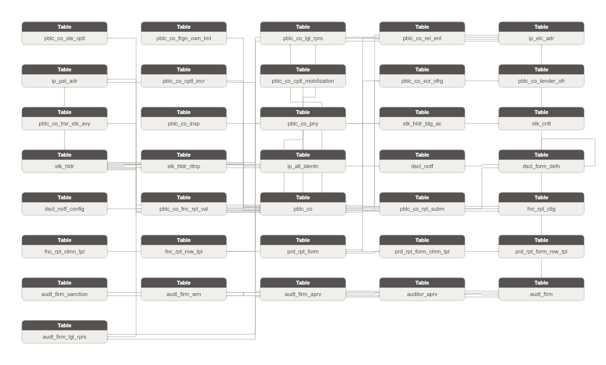

**Danh sách bảng:**

| STT | Tên bảng | Mô tả |
|---|---|---|
| 1 | pblc_co_ste_cptl | Thông tin sở hữu nhà nước trong công ty đại chúng — tên đại diện nhà nước và tỷ lệ sở hữu. FK to Public Company. |
| 2 | stk_hldr_tdg_ac | Tài khoản giao dịch chứng khoán của cổ đông tại CTCK — số tài khoản và trạng thái. FK to Stock Holder. |
| 3 | audt_firm_sanction | Xử phạt hành chính đối với công ty kiểm toán hoặc kiểm toán viên — quyết định và nội dung xử phạt. FK nullable: Audit Firm Approval hoặc Auditor Approval. |
| 4 | audt_firm_wrn | Nhắc nhở từ BTC hoặc UBCKNN đến công ty kiểm toán hoặc kiểm toán viên — số văn bản và nội dung. FK nullable: Audit Firm Approval hoặc Auditor Approval. |
| 5 | pblc_co_cptl_incr | Tăng vốn điều lệ sau khi thành công ty đại chúng — vốn cuối năm tài chính và số đợt tăng. FK to Public Company. |
| 6 | pblc_co_cptl_mobilization | Tăng vốn trước khi thành công ty đại chúng — tổng vốn cuối năm và hình thức tăng. Grain: 1 năm x 1 công ty. FK to Public Company. |
| 7 | pblc_co_insp | Thanh tra/kiểm tra công ty đại chúng — loại/số quyết định/đơn vị chủ trì/biên bản. FK to Public Company. |
| 8 | pblc_co_pny | Xử phạt hành chính công ty đại chúng hoặc nhà đầu tư liên quan — hành vi vi phạm và quyết định xử phạt. FK to Public Company. |
| 9 | pblc_co_scr_ofrg | Hoạt động chào bán/phát hành chứng khoán — loại CK/kế hoạch/kết quả thực tế theo từng hình thức. FK to Public Company. |
| 10 | pblc_co_tender_ofr | Chào mua công khai — bên chào mua/số lượng dự kiến/kết quả/tỷ lệ sở hữu trước-sau. FK to Public Company. |
| 11 | dscl_notf | Instance thông báo CBTT gửi đi — nội dung/tiêu đề/ngày gửi/trạng thái. Grain: 1 lần gửi thông báo. FK to Disclosure Form Definition. |
| 12 | dscl_form_defn | Định nghĩa loại hồ sơ/tin CBTT — loại form/quy trình duyệt/nghiệp vụ. Master entity của vòng đời CBTT. Self-join parent_form_id. |
| 13 | dscl_notf_config | Cấu hình thông báo CBTT — kênh gửi/hệ thống nhận/người quản lý. FK to Disclosure Notification. |
| 14 | fnc_rpt_ctlg | Danh mục báo cáo tài chính — loại báo cáo/năm/scope hợp nhất/loại hình doanh nghiệp. Master entity FK từ Financial Report Row/Column Template. |
| 15 | fnc_rpt_clmn_tpl | Định nghĩa cột trong biểu mẫu BCTC — mã cột/tên/công thức/thứ tự. FK to Financial Report Catalog. |
| 16 | fnc_rpt_row_tpl | Định nghĩa hàng trong biểu mẫu BCTC — mã hàng/tên/công thức/thứ tự. FK to Financial Report Catalog. |
| 17 | prd_rpt_form | Biểu mẫu báo cáo định kỳ (thường niên/quý/tháng) cho CBTT. Master entity FK từ Periodic Report Form Row/Column Template. |
| 18 | prd_rpt_form_clmn_tpl | Định nghĩa cột trong biểu mẫu báo cáo định kỳ — tên/thứ tự/công thức. FK to Periodic Report Form. |
| 19 | prd_rpt_form_row_tpl | Định nghĩa hàng trong biểu mẫu báo cáo định kỳ — tên/thứ tự/kiểu dữ liệu. FK to Periodic Report Form. |
| 20 | pblc_co_frgn_own_lmt | Giới hạn tỷ lệ sở hữu nước ngoài của công ty đại chúng — max_owner_rate và khoảng thời gian áp dụng. FK to Public Company. |
| 21 | stk_cntl | Hạn chế chuyển nhượng cổ phiếu của cổ đông — số lượng bị hạn chế/thời gian/loại hạn chế. FK to Stock Holder. |
| 22 | audt_firm_aprv | Quyết định chấp thuận/đình chỉ công ty kiểm toán từ BTC và UBCKNN — số văn bản/ngày/nội dung. Gộp 2 cơ quan. FK to Audit Firm. |
| 23 | auditor_aprv | Quyết định chấp thuận/đình chỉ kiểm toán viên từ BTC và UBCKNN — chứng chỉ hành nghề/năm chấp thuận. FK to Audit Firm. |
| 24 | pblc_co_fnc_rpt_val | Giá trị từng ô BCTC trong một lần nộp báo cáo đã duyệt. Grain: 1 dòng = 1 ô (lần nộp × biểu mẫu × hàng × cột). FK to Public Company Report Submission và Financial Report Catalog. |
| 25 | pblc_co_rpt_subm | Lần nộp báo cáo/tin CBTT của công ty đại chúng đã được phê duyệt (news_status_cd = APPROVED). Grain: 1 dòng = 1 lần nộp. FK to Public Company và Disclosure Form Definition. |
| 26 | audt_firm | Công ty kiểm toán được UBCKNN chấp thuận. Ghi nhận thông tin pháp lý và trạng thái hoạt động. |
| 27 | audt_firm_lgl_rprs | Người đại diện pháp luật của công ty kiểm toán — chức vụ và ngày bổ nhiệm/kết thúc nhiệm kỳ. FK to Audit Firm. |
| 28 | pblc_co | Công ty đại chúng được UBCKNN quản lý. Lưu thông tin pháp lý và trạng thái hoạt động. |
| 29 | pblc_co_lgl_rprs | Người đại diện pháp luật và người CBTT của công ty đại chúng — representative_role_code phân biệt 2 vai trò. FK to Public Company. |
| 30 | pblc_co_rel_ent | Công ty mẹ/con/liên kết của công ty đại chúng — tên/MST/vốn/tỷ lệ sở hữu/thời hạn hiệu lực. FK to Public Company. |
| 31 | stk_hldr | Cổ đông giao dịch — cá nhân hoặc tổ chức nắm giữ cổ phần công ty đại chúng. Grain: cổ đông x công ty. FK to Public Company. |
| 32 | stk_hldr_rltnp | Quan hệ giữa các cổ đông giao dịch — loại quan hệ/thời hạn/trạng thái. FK to Stock Holder x 2. |
| 33 | pblc_co_trsr_stk_avy | Giao dịch cổ phiếu quỹ theo năm — số lượng mua/bán và số đợt. FK to Public Company. |
| 34 | ip_alt_identn | Lưu trữ các giấy tờ định danh thay thế của Involved Party (CMND/CCCD/Hộ chiếu/Giấy phép kinh doanh/Chứng chỉ hành nghề). Mỗi dòng = 1 loại giấy tờ từ 1 nguồn. |
| 35 | ip_elc_adr | Lưu trữ các địa chỉ liên lạc điện tử của Involved Party (điện thoại/fax/email). Mỗi dòng = 1 kênh liên lạc từ 1 nguồn. |
| 36 | ip_pst_adr | Lưu trữ các địa chỉ bưu chính của Involved Party (trụ sở/kinh doanh/thường trú/nơi ở hiện tại). Mỗi dòng = 1 loại địa chỉ từ 1 nguồn. |

### Bảng pblc_co_ste_cptl

| STT | Tên trường | Kiểu dữ liệu và độ dài | Nullable | Unique | P/F Key | Mặc định | Mô tả |
|---|---|---|---|---|---|---|---|
| 1 | pblc_co_ste_cptl_id | STRING |  | X | P |  | Khóa đại diện cho bản ghi sở hữu nhà nước trong công ty đại chúng. |
| 2 | pblc_co_ste_cptl_code | STRING |  |  |  |  | Mã định danh (tự động tăng). BK. |
| 3 | src_stm_code | STRING |  |  |  | 'IDS.state_capital' | Mã nguồn dữ liệu. |
| 4 | pblc_co_id | STRING |  |  | F |  | FK đến công ty đại chúng. |
| 5 | pblc_co_code | STRING |  |  |  |  | Mã công ty đại chúng. |
| 6 | ste_rprs_nm | STRING | X |  |  |  | Tên đại diện nhà nước (tiếng Việt). |
| 7 | ste_rprs_en_nm | STRING | X |  |  |  | Tên đại diện nhà nước (tiếng Anh). |
| 8 | own_shr_qty | INT | X |  |  |  | Số cổ phiếu sở hữu nhà nước. |
| 9 | own_rto | DECIMAL(5,2) | X |  |  |  | Tỷ lệ phần trăm sở hữu nhà nước. |
| 10 | crt_by_login_nm | STRING | X |  |  |  | Người tạo (login_name của logins). |
| 11 | crt_tms | TIMESTAMP | X |  |  |  | Ngày tạo. |
| 12 | last_udt_by_login_nm | STRING | X |  |  |  | Người sửa (login_name của logins). |
| 13 | last_udt_tms | TIMESTAMP | X |  |  |  | Ngày sửa. |

#### Constraint

**Khóa chính (Primary Key):**

| Tên trường |
|---|
| pblc_co_ste_cptl_id |

**Khóa phụ (Foreign Key):**

| Tên trường | Bảng tham chiếu | Cột tham chiếu |
|---|---|---|
| pblc_co_id | pblc_co | pblc_co_id |

#### Index

N/A

#### Trigger

N/A

### Bảng stk_hldr_tdg_ac

| STT | Tên trường | Kiểu dữ liệu và độ dài | Nullable | Unique | P/F Key | Mặc định | Mô tả |
|---|---|---|---|---|---|---|---|
| 1 | stk_hldr_tdg_ac_id | STRING |  | X | P |  | Khóa đại diện cho tài khoản giao dịch của cổ đông. |
| 2 | stk_hldr_tdg_ac_code | STRING |  |  |  |  | Mã định danh (tự động tăng). BK. |
| 3 | src_stm_code | STRING |  |  |  | 'IDS.account_numbers' | Mã nguồn dữ liệu. |
| 4 | stk_hldr_id | STRING |  |  | F |  | FK đến cổ đông. |
| 5 | stk_hldr_code | STRING |  |  |  |  | Mã cổ đông. |
| 6 | tdg_ac_nbr | STRING | X |  |  |  | Số tài khoản giao dịch. |
| 7 | scr_co_code | STRING | X |  | F |  | Mã công ty chứng khoán. |
| 8 | ac_opn_dt | DATE | X |  |  |  | Ngày mở tài khoản. |
| 9 | actv_f | BOOLEAN | X |  |  |  | Trạng thái hoạt động tài khoản (1=active / 0=inactive). |
| 10 | prim_ac_f | BOOLEAN | X |  |  |  | Tài khoản chính (1=chính / 0=không chính). |
| 11 | crt_by_login_nm | STRING | X |  |  |  | Người tạo (login_name của logins). |
| 12 | crt_tms | TIMESTAMP | X |  |  |  | Ngày tạo. |
| 13 | last_udt_by_login_nm | STRING | X |  |  |  | Người sửa (login_name của logins). |
| 14 | last_udt_tms | TIMESTAMP | X |  |  |  | Ngày sửa. |

#### Constraint

**Khóa chính (Primary Key):**

| Tên trường |
|---|
| stk_hldr_tdg_ac_id |

**Khóa phụ (Foreign Key):**

| Tên trường | Bảng tham chiếu | Cột tham chiếu |
|---|---|---|
| stk_hldr_id | stk_hldr | stk_hldr_id |

#### Index

N/A

#### Trigger

N/A

### Bảng audt_firm_sanction

| STT | Tên trường | Kiểu dữ liệu và độ dài | Nullable | Unique | P/F Key | Mặc định | Mô tả |
|---|---|---|---|---|---|---|---|
| 1 | audt_firm_sanction_id | STRING |  | X | P |  | Khóa đại diện cho xử phạt hành chính công ty kiểm toán/kiểm toán viên. |
| 2 | audt_firm_sanction_code | STRING |  |  |  |  | Mã định danh (tự động tăng). BK. |
| 3 | src_stm_code | STRING |  |  |  | 'IDS.af_sanctions' | Mã nguồn dữ liệu. |
| 4 | audt_firm_aprv_id | STRING | X |  | F |  | FK đến hồ sơ chấp thuận công ty kiểm toán (nullable khi đối tượng là KTV). |
| 5 | audt_firm_aprv_code | STRING | X |  |  |  | Mã hồ sơ chấp thuận công ty kiểm toán. |
| 6 | auditor_aprv_id | STRING | X |  | F |  | FK đến hồ sơ chấp thuận kiểm toán viên (nullable khi đối tượng là công ty KT). |
| 7 | auditor_aprv_code | STRING | X |  |  |  | Mã hồ sơ chấp thuận kiểm toán viên. |
| 8 | sanction_trgt_tp_code | STRING | X |  |  |  | Đối tượng xử phạt (công ty kiểm toán hay kiểm toán viên). |
| 9 | sanction_ahr_code | STRING | X |  |  |  | Đơn vị xử phạt (BTC hay UBCKNN). |
| 10 | dcsn_nbr | STRING | X |  |  |  | Số quyết định xử phạt. |
| 11 | dcsn_dt | DATE | X |  |  |  | Ngày quyết định xử phạt. |
| 12 | sanction_cntnt | STRING | X |  |  |  | Nội dung quyết định xử phạt. |
| 13 | attch_file_url | STRING | X |  |  |  | Đường dẫn file đính kèm. |
| 14 | crt_by_login_nm | STRING | X |  |  |  | Người tạo (login_name của logins). |
| 15 | crt_tms | TIMESTAMP | X |  |  |  | Ngày tạo. |
| 16 | last_udt_by_login_nm | STRING | X |  |  |  | Người sửa (login_name của logins). |
| 17 | last_udt_tms | TIMESTAMP | X |  |  |  | Ngày sửa. |

#### Constraint

**Khóa chính (Primary Key):**

| Tên trường |
|---|
| audt_firm_sanction_id |

**Khóa phụ (Foreign Key):**

| Tên trường | Bảng tham chiếu | Cột tham chiếu |
|---|---|---|
| audt_firm_aprv_id | audt_firm_aprv | audt_firm_aprv_id |
| auditor_aprv_id | auditor_aprv | auditor_aprv_id |

#### Index

N/A

#### Trigger

N/A

### Bảng audt_firm_wrn

| STT | Tên trường | Kiểu dữ liệu và độ dài | Nullable | Unique | P/F Key | Mặc định | Mô tả |
|---|---|---|---|---|---|---|---|
| 1 | audt_firm_wrn_id | STRING |  | X | P |  | Khóa đại diện cho nhắc nhở công ty kiểm toán/kiểm toán viên. |
| 2 | audt_firm_wrn_code | STRING |  |  |  |  | Mã định danh (tự động tăng). BK. |
| 3 | src_stm_code | STRING |  |  |  | 'IDS.af_warning' | Mã nguồn dữ liệu. |
| 4 | audt_firm_aprv_id | STRING | X |  | F |  | FK đến hồ sơ chấp thuận công ty kiểm toán (nullable khi đối tượng là KTV). |
| 5 | audt_firm_aprv_code | STRING | X |  |  |  | Mã hồ sơ chấp thuận công ty kiểm toán. |
| 6 | auditor_aprv_id | STRING | X |  | F |  | FK đến hồ sơ chấp thuận kiểm toán viên (nullable khi đối tượng là công ty KT). |
| 7 | auditor_aprv_code | STRING | X |  |  |  | Mã hồ sơ chấp thuận kiểm toán viên. |
| 8 | wrn_trgt_tp_code | STRING | X |  |  |  | Đối tượng nhắc nhở (công ty kiểm toán hay kiểm toán viên). |
| 9 | wrn_src_tp_code | STRING | X |  |  |  | Cơ quan nhắc nhở (BTC hay UBCKNN). |
| 10 | wrn_doc_nbr | STRING | X |  |  |  | Số văn bản quyết định nhắc nhở. |
| 11 | wrn_issu_dt | DATE | X |  |  |  | Ngày ban hành văn bản nhắc nhở. |
| 12 | wrn_strt_dt | DATE | X |  |  |  | Ngày bắt đầu hiệu lực nhắc nhở. |
| 13 | wrn_end_dt | DATE | X |  |  |  | Ngày kết thúc hiệu lực nhắc nhở. |
| 14 | wrn_cntnt | STRING | X |  |  |  | Nội dung quyết định nhắc nhở. |
| 15 | crt_by_login_nm | STRING | X |  |  |  | Người tạo (login_name của logins). |
| 16 | crt_tms | TIMESTAMP | X |  |  |  | Ngày tạo. |
| 17 | last_udt_by_login_nm | STRING | X |  |  |  | Người sửa (login_name của logins). |
| 18 | last_udt_tms | TIMESTAMP | X |  |  |  | Ngày sửa. |

#### Constraint

**Khóa chính (Primary Key):**

| Tên trường |
|---|
| audt_firm_wrn_id |

**Khóa phụ (Foreign Key):**

| Tên trường | Bảng tham chiếu | Cột tham chiếu |
|---|---|---|
| audt_firm_aprv_id | audt_firm_aprv | audt_firm_aprv_id |
| auditor_aprv_id | auditor_aprv | auditor_aprv_id |

#### Index

N/A

#### Trigger

N/A

### Bảng pblc_co_cptl_incr

| STT | Tên trường | Kiểu dữ liệu và độ dài | Nullable | Unique | P/F Key | Mặc định | Mô tả |
|---|---|---|---|---|---|---|---|
| 1 | pblc_co_cptl_incr_id | STRING |  | X | P |  | Khóa đại diện cho bản ghi tăng vốn điều lệ sau khi thành công ty đại chúng. |
| 2 | pblc_co_cptl_incr_code | STRING |  |  |  |  | Mã định danh (tự động tăng). BK. |
| 3 | src_stm_code | STRING |  |  |  | 'IDS.company_add_capital' | Mã nguồn dữ liệu. |
| 4 | pblc_co_id | STRING |  |  | F |  | FK đến công ty đại chúng. |
| 5 | pblc_co_code | STRING |  |  |  |  | Mã công ty đại chúng. |
| 6 | rpt_yr | INT | X |  |  |  | Năm điều chỉnh vốn góp. |
| 7 | paid_in_cptl_end_of_fyr_amt | DECIMAL(23,2) | X |  |  |  | Vốn điều lệ thực góp tính đến thời điểm kết thúc năm tài chính. |
| 8 | cptl_incr_amt | DECIMAL(23,2) | X |  |  |  | Vốn điều lệ tăng thêm so với năm trước. |
| 9 | cptl_incr_cnt | INT | X |  |  |  | Số đợt tăng vốn trong năm. |
| 10 | licensing_ahr_nm | STRING | X |  |  |  | Đơn vị cấp phép (tiếng Việt). |
| 11 | licensing_ahr_en_nm | STRING | X |  |  |  | Đơn vị cấp phép (tiếng Anh). |
| 12 | crt_by_login_nm | STRING | X |  |  |  | Người tạo (login_name của logins). |
| 13 | crt_tms | TIMESTAMP | X |  |  |  | Ngày tạo. |
| 14 | last_udt_by_login_nm | STRING | X |  |  |  | Người sửa (login_name của logins). |
| 15 | last_udt_tms | TIMESTAMP | X |  |  |  | Ngày sửa. |

#### Constraint

**Khóa chính (Primary Key):**

| Tên trường |
|---|
| pblc_co_cptl_incr_id |

**Khóa phụ (Foreign Key):**

| Tên trường | Bảng tham chiếu | Cột tham chiếu |
|---|---|---|
| pblc_co_id | pblc_co | pblc_co_id |

#### Index

N/A

#### Trigger

N/A

### Bảng pblc_co_cptl_mobilization

| STT | Tên trường | Kiểu dữ liệu và độ dài | Nullable | Unique | P/F Key | Mặc định | Mô tả |
|---|---|---|---|---|---|---|---|
| 1 | pblc_co_cptl_mobilization_id | STRING |  | X | P |  | Khóa đại diện cho bản ghi tăng vốn trước khi thành công ty đại chúng. |
| 2 | pblc_co_cptl_mobilization_code | STRING |  |  |  |  | Mã định danh (tự động tăng). BK. |
| 3 | src_stm_code | STRING |  |  |  | 'IDS.capital_mobilization' | Mã nguồn dữ liệu. |
| 4 | pblc_co_id | STRING |  |  | F |  | FK đến công ty đại chúng. |
| 5 | pblc_co_code | STRING |  |  |  |  | Mã công ty đại chúng. |
| 6 | rpt_yr | INT | X |  |  |  | Năm điều chỉnh vốn góp. |
| 7 | paid_in_cptl_eoy_amt | DECIMAL(23,2) | X |  |  |  | Vốn điều lệ thực góp tính đến thời điểm cuối năm. |
| 8 | cptl_incr_cnt | INT | X |  |  |  | Số đợt tăng vốn trong năm. |
| 9 | cptl_incr_mth | STRING | X |  |  |  | Hình thức tăng vốn. |
| 10 | audt_firm_nm | STRING | X |  | F |  | Tên công ty kiểm toán xác nhận (tiếng Việt). |
| 11 | audt_firm_en_nm | STRING | X |  |  |  | Tên công ty kiểm toán xác nhận (tiếng Anh). |
| 12 | crt_by_login_nm | STRING | X |  |  |  | Người tạo (login_name của logins). |
| 13 | crt_tms | TIMESTAMP | X |  |  |  | Ngày tạo. |
| 14 | last_udt_by_login_nm | STRING | X |  |  |  | Người sửa (login_name của logins). |
| 15 | last_udt_tms | TIMESTAMP | X |  |  |  | Ngày sửa. |

#### Constraint

**Khóa chính (Primary Key):**

| Tên trường |
|---|
| pblc_co_cptl_mobilization_id |

**Khóa phụ (Foreign Key):**

| Tên trường | Bảng tham chiếu | Cột tham chiếu |
|---|---|---|
| pblc_co_id | pblc_co | pblc_co_id |

#### Index

N/A

#### Trigger

N/A

### Bảng pblc_co_insp

| STT | Tên trường | Kiểu dữ liệu và độ dài | Nullable | Unique | P/F Key | Mặc định | Mô tả |
|---|---|---|---|---|---|---|---|
| 1 | pblc_co_insp_id | STRING |  | X | P |  | Khóa đại diện cho bản ghi thanh tra/kiểm tra công ty đại chúng. |
| 2 | pblc_co_insp_code | STRING |  |  |  |  | Mã định danh (tự động tăng). BK. |
| 3 | src_stm_code | STRING |  |  |  | 'IDS.company_inspection' | Mã nguồn dữ liệu. |
| 4 | pblc_co_id | STRING |  |  | F |  | FK đến công ty đại chúng. |
| 5 | pblc_co_code | STRING |  |  |  |  | Mã công ty đại chúng. |
| 6 | insp_tp_code | STRING | X |  |  |  | Loại thanh tra/kiểm tra. |
| 7 | dcsn_nbr | STRING | X |  |  |  | Số quyết định thanh tra/kiểm tra. |
| 8 | dcsn_dt | DATE | X |  |  |  | Ngày quyết định. |
| 9 | insp_prd | STRING | X |  |  |  | Thời kỳ thanh tra/kiểm tra. |
| 10 | insp_dt | DATE | X |  |  |  | Thời gian thanh tra/kiểm tra. |
| 11 | insp_mode_code | STRING | X |  |  |  | Thanh tra định kỳ/bất thường. |
| 12 | insp_scop | STRING | X |  |  |  | Nội dung kiểm tra/thanh tra. |
| 13 | lead_insp_unit_nm | STRING | X |  | F |  | Đơn vị chủ trì kiểm tra/thanh tra (tiếng Việt). |
| 14 | lead_insp_unit_en_nm | STRING | X |  |  |  | Đơn vị chủ trì kiểm tra/thanh tra (tiếng Anh). |
| 15 | insp_mins_nm | STRING | X |  |  |  | Tên biên bản kiểm tra/thanh tra. |
| 16 | insp_file_url | STRING | X |  |  |  | Đường dẫn biên bản kiểm tra/thanh tra. |
| 17 | crt_by_login_nm | STRING | X |  |  |  | Người tạo (login_name của logins). |
| 18 | crt_tms | TIMESTAMP | X |  |  |  | Ngày tạo. |
| 19 | last_udt_by_login_nm | STRING | X |  |  |  | Người sửa (login_name của logins). |
| 20 | last_udt_tms | TIMESTAMP | X |  |  |  | Ngày sửa. |

#### Constraint

**Khóa chính (Primary Key):**

| Tên trường |
|---|
| pblc_co_insp_id |

**Khóa phụ (Foreign Key):**

| Tên trường | Bảng tham chiếu | Cột tham chiếu |
|---|---|---|
| pblc_co_id | pblc_co | pblc_co_id |

#### Index

N/A

#### Trigger

N/A

### Bảng pblc_co_pny

| STT | Tên trường | Kiểu dữ liệu và độ dài | Nullable | Unique | P/F Key | Mặc định | Mô tả |
|---|---|---|---|---|---|---|---|
| 1 | pblc_co_pny_id | STRING |  | X | P |  | Khóa đại diện cho quyết định xử phạt hành chính. |
| 2 | pblc_co_pny_code | STRING |  |  |  |  | Mã định danh (tự động tăng). BK. |
| 3 | src_stm_code | STRING |  |  |  | 'IDS.company_penalize' | Mã nguồn dữ liệu. |
| 4 | pblc_co_id | STRING |  |  | F |  | FK đến công ty đại chúng. |
| 5 | pblc_co_code | STRING |  |  |  |  | Mã công ty đại chúng. |
| 6 | penalized_sbj_tp_code | STRING | X |  |  |  | Đối tượng bị xử phạt (công ty đại chúng / nhà đầu tư liên quan). |
| 7 | ivsr_nm | STRING | X |  |  |  | Tên nhà đầu tư bị xử phạt (null khi đối tượng là công ty). |
| 8 | ivsr_identn_nbr | STRING | X |  |  |  | Số CCCD/Hộ chiếu của nhà đầu tư. |
| 9 | ivsr_pos_ttl | STRING | X |  |  |  | Chức vụ của nhà đầu tư. |
| 10 | pny_dcsn_nbr | STRING | X |  |  |  | Số quyết định xử phạt. |
| 11 | pny_dcsn_dt | DATE | X |  |  |  | Ngày quyết định xử phạt. |
| 12 | vln_dsc | STRING | X |  |  |  | Mô tả hành vi vi phạm. |
| 13 | pny_form | STRING | X |  |  |  | Hình thức phạt chính. |
| 14 | pny_amt | DECIMAL(23,2) | X |  |  |  | Số tiền phạt. |
| 15 | adl_pny | STRING | X |  |  |  | Hình thức phạt bổ sung. |
| 16 | remedial_mins | STRING | X |  |  |  | Biên bản khắc phục hậu quả. |
| 17 | crt_by_login_nm | STRING | X |  |  |  | Người tạo (login_name của logins). |
| 18 | crt_tms | TIMESTAMP | X |  |  |  | Ngày tạo. |
| 19 | last_udt_by_login_nm | STRING | X |  |  |  | Người sửa (login_name của logins). |
| 20 | last_udt_tms | TIMESTAMP | X |  |  |  | Ngày sửa. |

#### Constraint

**Khóa chính (Primary Key):**

| Tên trường |
|---|
| pblc_co_pny_id |

**Khóa phụ (Foreign Key):**

| Tên trường | Bảng tham chiếu | Cột tham chiếu |
|---|---|---|
| pblc_co_id | pblc_co | pblc_co_id |

#### Index

N/A

#### Trigger

N/A

### Bảng pblc_co_scr_ofrg

| STT | Tên trường | Kiểu dữ liệu và độ dài | Nullable | Unique | P/F Key | Mặc định | Mô tả |
|---|---|---|---|---|---|---|---|
| 1 | pblc_co_scr_ofrg_id | STRING |  | X | P |  | Khóa đại diện cho đợt phát hành chứng khoán. |
| 2 | pblc_co_scr_ofrg_code | STRING |  |  |  |  | Mã định danh (tự động tăng). BK. |
| 3 | src_stm_code | STRING |  |  |  | 'IDS.company_securities_issuance' | Mã nguồn dữ liệu. |
| 4 | pblc_co_id | STRING |  |  | F |  | FK đến công ty đại chúng. |
| 5 | pblc_co_code | STRING |  |  |  |  | Mã công ty đại chúng. |
| 6 | scr_tp_code | STRING | X |  |  |  | Loại chứng khoán phát hành. |
| 7 | ctf_nbr | STRING | X |  |  |  | Số giấy chứng nhận chào bán. |
| 8 | ctf_issu_dt | DATE | X |  |  |  | Ngày cấp giấy chứng nhận. |
| 9 | ssc_offc_doc_nbr | STRING | X |  |  |  | Số công văn của UBCKNN. |
| 10 | ssc_offc_doc_dt | DATE | X |  |  |  | Ngày công văn của UBCKNN. |
| 11 | multi_ofrg_f | BOOLEAN | X |  |  |  | Có chào bán nhiều đợt (1=có / 0=không). |
| 12 | pln_scr_qty | INT | X |  |  |  | Tổng số chứng khoán dự kiến chào bán/phát hành. |
| 13 | pln_procd_amt | DECIMAL(23,2) | X |  |  |  | Tổng số tiền dự kiến thu được (VNĐ). |
| 14 | prj_ivsm_f | BOOLEAN | X |  |  |  | Có đầu tư dự án (1=có / 0=không). |
| 15 | procd_usg_pln | STRING | X |  |  |  | Phương án sử dụng vốn thu được. |
| 16 | pln_exst_shrhlr_ofrg_qty | INT | X |  |  |  | Chào bán cho cổ đông hiện hữu — số lượng dự kiến. |
| 17 | pln_exst_shrhlr_ofrg_prc | DECIMAL(23,2) | X |  |  |  | Chào bán cho cổ đông hiện hữu — giá dự kiến. |
| 18 | rslt_exst_shrhlr_ofrg_qty | INT | X |  |  |  | Chào bán cho cổ đông hiện hữu — số lượng thực tế. |
| 19 | rslt_exst_shrhlr_ofrg_prc | DECIMAL(23,2) | X |  |  |  | Chào bán cho cổ đông hiện hữu — giá thực tế. |
| 20 | pln_auctn_ofrg_qty | INT | X |  |  |  | Đấu giá — số lượng dự kiến. |
| 21 | pln_auctn_ofrg_prc | DECIMAL(23,2) | X |  |  |  | Đấu giá — giá dự kiến. |
| 22 | rslt_auctn_ofrg_qty | INT | X |  |  |  | Đấu giá — số lượng thực tế. |
| 23 | rslt_auctn_ofrg_prc | DECIMAL(23,2) | X |  |  |  | Đấu giá — giá thực tế. |
| 24 | pln_pblc_othr_ofrg_qty | INT | X |  |  |  | Chào bán ra công chúng theo hình thức khác — số lượng dự kiến. |
| 25 | pln_pblc_othr_ofrg_prc | DECIMAL(23,2) | X |  |  |  | Chào bán ra công chúng theo hình thức khác — giá dự kiến. |
| 26 | rslt_pblc_othr_ofrg_qty | INT | X |  |  |  | Chào bán ra công chúng theo hình thức khác — số lượng thực tế. |
| 27 | rslt_pblc_othr_ofrg_prc | DECIMAL(23,2) | X |  |  |  | Chào bán ra công chúng theo hình thức khác — giá thực tế. |
| 28 | pln_pblc_co_ofrg_qty | INT | X |  |  |  | Chào bán của công ty đại chúng ra công chúng — số lượng dự kiến. |
| 29 | pln_pblc_co_ofrg_prc | DECIMAL(23,2) | X |  |  |  | Chào bán của công ty đại chúng ra công chúng — giá dự kiến. |
| 30 | rslt_pblc_co_ofrg_qty | INT | X |  |  |  | Chào bán của công ty đại chúng ra công chúng — số lượng thực tế. |
| 31 | rslt_pblc_co_ofrg_prc | DECIMAL(23,2) | X |  |  |  | Chào bán của công ty đại chúng ra công chúng — giá thực tế. |
| 32 | pln_prvt_plcmt_ofrg_qty | INT | X |  |  |  | Chào bán cổ phiếu riêng lẻ — số lượng dự kiến. |
| 33 | pln_prvt_plcmt_ofrg_prc | DECIMAL(23,2) | X |  |  |  | Chào bán cổ phiếu riêng lẻ — giá dự kiến. |
| 34 | pln_prvt_plcmt_ofrg_trgt | STRING | X |  |  |  | Chào bán cổ phiếu riêng lẻ — đối tượng dự kiến. |
| 35 | rslt_prvt_plcmt_ofrg_qty | INT | X |  |  |  | Chào bán cổ phiếu riêng lẻ — số lượng thực tế. |
| 36 | rslt_prvt_plcmt_ofrg_prc | DECIMAL(23,2) | X |  |  |  | Chào bán cổ phiếu riêng lẻ — giá thực tế. |
| 37 | rslt_prvt_plcmt_ofrg_trgt | STRING | X |  |  |  | Chào bán cổ phiếu riêng lẻ — đối tượng thực tế. |
| 38 | pln_cnvr_ofrg_qty | INT | X |  |  |  | Hoán đổi — số lượng dự kiến. |
| 39 | pln_cnvr_ofrg_trgt | STRING | X |  |  |  | Hoán đổi — đối tượng dự kiến. |
| 40 | rslt_cnvr_ofrg_qty | INT | X |  |  |  | Hoán đổi — số lượng thực tế. |
| 41 | rslt_cnvr_ofrg_trgt | STRING | X |  |  |  | Hoán đổi — đối tượng thực tế. |
| 42 | pln_dvdn_issn_qty | INT | X |  |  |  | Phát hành trả cổ tức — số lượng dự kiến. |
| 43 | rslt_dvdn_issn_qty | INT | X |  |  |  | Phát hành trả cổ tức — số lượng thực tế. |
| 44 | pln_own_cptl_issn_qty | INT | X |  |  |  | Phát hành cổ phiếu từ nguồn vốn chủ sở hữu — số lượng dự kiến. |
| 45 | pln_own_cptl_issn_src | STRING | X |  |  |  | Phát hành cổ phiếu từ nguồn vốn chủ sở hữu — nguồn dự kiến. |
| 46 | rslt_own_cptl_issn_qty | INT | X |  |  |  | Phát hành cổ phiếu từ nguồn vốn chủ sở hữu — số lượng thực tế. |
| 47 | rslt_own_cptl_issn_src | STRING | X |  |  |  | Phát hành cổ phiếu từ nguồn vốn chủ sở hữu — nguồn thực tế. |
| 48 | pln_esop_issn_qty | INT | X |  |  |  | Phát hành cổ phiếu cho người lao động — số lượng dự kiến. |
| 49 | pln_esop_issn_prc | DECIMAL(23,2) | X |  |  |  | Phát hành cổ phiếu cho người lao động — giá dự kiến. |
| 50 | pln_esop_issn_trgt | STRING | X |  |  |  | Phát hành cổ phiếu cho người lao động — đối tượng dự kiến. |
| 51 | rslt_esop_issn_qty | INT | X |  |  |  | Phát hành cổ phiếu cho người lao động — số lượng thực tế. |
| 52 | rslt_esop_issn_prc | DECIMAL(23,2) | X |  |  |  | Phát hành cổ phiếu cho người lao động — giá thực tế. |
| 53 | rslt_esop_issn_trgt | STRING | X |  |  |  | Phát hành cổ phiếu cho người lao động — đối tượng thực tế. |
| 54 | pln_bns_shr_issn_qty | INT | X |  |  |  | Phát hành cổ phiếu thưởng cho người lao động — số lượng dự kiến. |
| 55 | pln_bns_shr_issn_trgt | STRING | X |  |  |  | Phát hành cổ phiếu thưởng cho người lao động — đối tượng dự kiến. |
| 56 | pln_bns_shr_issn_prc | DECIMAL(23,2) | X |  |  |  | Phát hành cổ phiếu thưởng cho người lao động — giá dự kiến. |
| 57 | rslt_bns_shr_issn_qty | INT | X |  |  |  | Phát hành cổ phiếu thưởng cho người lao động — số lượng thực tế. |
| 58 | rslt_bns_shr_issn_trgt | STRING | X |  |  |  | Phát hành cổ phiếu thưởng cho người lao động — đối tượng thực tế. |
| 59 | rslt_bns_shr_issn_prc | DECIMAL(23,2) | X |  |  |  | Phát hành cổ phiếu thưởng cho người lao động — giá thực tế. |
| 60 | pln_itnl_bond_ofrg_qty | INT | X |  |  |  | Chào bán trái phiếu giao dịch quốc tế — số lượng dự kiến. |
| 61 | pln_itnl_bond_ofrg_prc | DECIMAL(23,2) | X |  |  |  | Chào bán trái phiếu giao dịch quốc tế — giá dự kiến. |
| 62 | rslt_itnl_bond_ofrg_qty | INT | X |  |  |  | Chào bán trái phiếu giao dịch quốc tế — số lượng thực tế. |
| 63 | rslt_itnl_bond_ofrg_prc | DECIMAL(23,2) | X |  |  |  | Chào bán trái phiếu giao dịch quốc tế — giá thực tế. |
| 64 | ofrg_end_dt | DATE | X |  |  |  | Ngày kết thúc đợt chào bán. |
| 65 | scss_scr_qty | INT | X |  |  |  | Tổng số chứng khoán chào bán/phát hành thành công. |
| 66 | act_procd_amt | DECIMAL(23,2) | X |  |  |  | Tổng số tiền thực thu từ đợt chào bán/phát hành (VNĐ). |
| 67 | cptl_usg_pln | STRING | X |  |  |  | Phương án sử dụng vốn. |
| 68 | crt_by_login_nm | STRING | X |  |  |  | Người tạo (login_name của logins). |
| 69 | crt_tms | TIMESTAMP | X |  |  |  | Ngày tạo. |
| 70 | last_udt_by_login_nm | STRING | X |  |  |  | Người sửa (login_name của logins). |
| 71 | last_udt_tms | TIMESTAMP | X |  |  |  | Ngày sửa. |

#### Constraint

**Khóa chính (Primary Key):**

| Tên trường |
|---|
| pblc_co_scr_ofrg_id |

**Khóa phụ (Foreign Key):**

| Tên trường | Bảng tham chiếu | Cột tham chiếu |
|---|---|---|
| pblc_co_id | pblc_co | pblc_co_id |

#### Index

N/A

#### Trigger

N/A

### Bảng pblc_co_tender_ofr

| STT | Tên trường | Kiểu dữ liệu và độ dài | Nullable | Unique | P/F Key | Mặc định | Mô tả |
|---|---|---|---|---|---|---|---|
| 1 | pblc_co_tender_ofr_id | STRING |  | X | P |  | Khóa đại diện cho đợt chào mua công khai. |
| 2 | pblc_co_tender_ofr_code | STRING |  |  |  |  | Mã định danh (tự động tăng). BK. |
| 3 | src_stm_code | STRING |  |  |  | 'IDS.company_tender_offer' | Mã nguồn dữ liệu. |
| 4 | pblc_co_id | STRING |  |  | F |  | FK đến công ty đại chúng (công ty mục tiêu). |
| 5 | pblc_co_code | STRING |  |  |  |  | Mã công ty đại chúng. |
| 6 | tender_offeror_nm | STRING | X |  |  |  | Tên tổ chức/cá nhân chào mua công khai (tiếng Việt). |
| 7 | tender_offeror_en_nm | STRING | X |  |  |  | Tên tổ chức/cá nhân chào mua công khai (tiếng Anh). |
| 8 | tender_offeror_identn_nbr | STRING | X |  |  |  | Số CMND/Hộ chiếu/GCN ĐKDN của bên chào mua. |
| 9 | tender_offeror_rltnp | STRING | X |  |  |  | Mối quan hệ giữa bên chào mua với công ty mục tiêu. |
| 10 | scr_agnt_nm | STRING | X |  |  |  | Tên công ty chứng khoán làm đại lý (tiếng Việt). |
| 11 | scr_agnt_en_nm | STRING | X |  |  |  | Tên công ty chứng khoán làm đại lý (tiếng Anh). |
| 12 | pln_ofr_fm_dt | DATE | X |  |  |  | Thời gian dự kiến chào mua — từ ngày. |
| 13 | pln_ofr_to_dt | DATE | X |  |  |  | Thời gian dự kiến chào mua — đến ngày. |
| 14 | pre_ofr_shr_qty | INT | X |  |  |  | Số cổ phiếu sở hữu trước khi chào mua. |
| 15 | pre_ofr_shr_rto | DECIMAL(5,2) | X |  |  |  | Tỷ lệ cổ phiếu sở hữu trước khi chào mua. |
| 16 | pln_ofr_shr_qty | INT | X |  |  |  | Số cổ phiếu dự kiến chào mua. |
| 17 | pln_ofr_shr_rto | DECIMAL(5,2) | X |  |  |  | Tỷ lệ cổ phiếu dự kiến chào mua. |
| 18 | pln_ofr_prc_amt | DECIMAL(23,2) | X |  |  |  | Giá chào mua. |
| 19 | acq_shr_qty | INT | X |  |  |  | Số cổ phiếu mua được trong đợt chào mua. |
| 20 | acq_shr_rto | DECIMAL(5,2) | X |  |  |  | Tỷ lệ cổ phiếu mua được trong đợt chào mua. |
| 21 | pst_ofr_shr_qty | INT | X |  |  |  | Số cổ phiếu sở hữu sau khi chào mua. |
| 22 | pst_ofr_shr_rto | DECIMAL(5,2) | X |  |  |  | Tỷ lệ cổ phiếu sở hữu sau khi chào mua. |
| 23 | crt_by_login_nm | STRING | X |  |  |  | Người tạo (login_name của logins). |
| 24 | crt_tms | TIMESTAMP | X |  |  |  | Ngày tạo. |
| 25 | last_udt_by_login_nm | STRING | X |  |  |  | Người sửa (login_name của logins). |
| 26 | last_udt_tms | TIMESTAMP | X |  |  |  | Ngày sửa. |

#### Constraint

**Khóa chính (Primary Key):**

| Tên trường |
|---|
| pblc_co_tender_ofr_id |

**Khóa phụ (Foreign Key):**

| Tên trường | Bảng tham chiếu | Cột tham chiếu |
|---|---|---|
| pblc_co_id | pblc_co | pblc_co_id |

#### Index

N/A

#### Trigger

N/A

### Bảng dscl_notf

| STT | Tên trường | Kiểu dữ liệu và độ dài | Nullable | Unique | P/F Key | Mặc định | Mô tả |
|---|---|---|---|---|---|---|---|
| 1 | dscl_notf_id | STRING |  | X | P |  | Khóa đại diện cho instance thông báo CBTT. |
| 2 | dscl_notf_code | STRING |  |  |  |  | Mã định danh (tự động tăng). BK. |
| 3 | src_stm_code | STRING |  |  |  | 'IDS.notifications' | Mã nguồn dữ liệu. |
| 4 | notf_bsn_code | STRING | X |  |  |  | Mã thông báo (mã nghiệp vụ). |
| 5 | dscl_form_defn_id | STRING | X |  | F |  | FK đến định nghĩa loại hồ sơ/tin CBTT. |
| 6 | dscl_form_defn_code | STRING | X |  |  |  | Mã định nghĩa loại hồ sơ/tin CBTT. |
| 7 | notf_ttl | STRING | X |  |  |  | Tiêu đề thông báo (tiếng Việt). |
| 8 | notf_en_ttl | STRING | X |  |  |  | Tiêu đề thông báo (tiếng Anh). |
| 9 | notf_cntnt | STRING | X |  |  |  | Nội dung thông báo (tiếng Việt). |
| 10 | notf_en_cntnt | STRING | X |  |  |  | Nội dung thông báo (tiếng Anh). |
| 11 | snd_shd_tp_code | STRING | X |  |  |  | Lịch gửi tin định kỳ. |
| 12 | mo_snd_day | INT | X |  |  |  | Ngày gửi thông báo định kỳ trong tháng. |
| 13 | mo_snd_mo | INT | X |  |  |  | Tháng định kỳ gửi thông báo. |
| 14 | news_st_code | STRING | X |  |  |  | Trạng thái tin thông báo. |
| 15 | news_tp_code | STRING | X |  |  |  | Loại tin gốc. |
| 16 | snd_dt | DATE | X |  |  |  | Ngày gửi tin. |
| 17 | file_url | STRING | X |  |  |  | Đường dẫn file đính kèm. |
| 18 | crt_by_login_nm | STRING | X |  |  |  | Người tạo (login_name của logins). |
| 19 | crt_tms | TIMESTAMP | X |  |  |  | Ngày tạo. |
| 20 | last_udt_by_login_nm | STRING | X |  |  |  | Người sửa (login_name của logins). |
| 21 | last_udt_tms | TIMESTAMP | X |  |  |  | Ngày sửa. |

#### Constraint

**Khóa chính (Primary Key):**

| Tên trường |
|---|
| dscl_notf_id |

**Khóa phụ (Foreign Key):**

| Tên trường | Bảng tham chiếu | Cột tham chiếu |
|---|---|---|
| dscl_form_defn_id | dscl_form_defn | dscl_form_defn_id |

#### Index

N/A

#### Trigger

N/A

### Bảng dscl_form_defn

| STT | Tên trường | Kiểu dữ liệu và độ dài | Nullable | Unique | P/F Key | Mặc định | Mô tả |
|---|---|---|---|---|---|---|---|
| 1 | dscl_form_defn_id | STRING |  | X | P |  | Khóa đại diện cho định nghĩa loại hồ sơ/tin CBTT. |
| 2 | dscl_form_defn_code | STRING |  |  |  |  | Mã định danh (tự động tăng). BK. |
| 3 | src_stm_code | STRING |  |  |  | 'IDS.forms' | Mã nguồn dữ liệu. |
| 4 | dscl_form_defn_bsn_code | STRING | X |  |  |  | Mã form (mã nghiệp vụ). |
| 5 | dscl_form_defn_nm | STRING | X |  |  |  | Tên form (tiếng Việt). |
| 6 | dscl_form_defn_en_nm | STRING | X |  |  |  | Tên form (tiếng Anh). |
| 7 | form_tp_code | STRING | X |  |  |  | Loại tin hay hồ sơ (hồ sơ, cbtt). |
| 8 | news_tp_code | STRING | X |  |  |  | Loại tin gốc. |
| 9 | sub_news_tp_code | STRING | X |  |  |  | Loại tin con. |
| 10 | ofcr_aprv_f | BOOLEAN | X |  |  |  | Chuyên viên tự động duyệt (1=đã duyệt / 0=chưa duyệt). |
| 11 | pst_checked_f | BOOLEAN | X |  |  |  | Hậu kiểm tin (1=đã kiểm tra / 0=chưa kiểm tra). |
| 12 | activated_f | BOOLEAN | X |  |  |  | Kích hoạt (1=đã kích hoạt / 0=chưa kích hoạt). |
| 13 | ca_signed_f | BOOLEAN | X |  |  |  | Ký CA (chứng thư số): 0=bắt buộc / 1=không bắt buộc. |
| 14 | leader_aprv_f | BOOLEAN | X |  |  |  | Form tự động duyệt cấp lãnh đạo (1=đã duyệt / 0=chưa duyệt). |
| 15 | published_f | BOOLEAN | X |  |  |  | Form được công bố (1=được công bố / 0=chưa công bố). |
| 16 | ttl_frml | STRING | X |  |  |  | Công thức cho tiêu đề form tin. |
| 17 | prn_dscl_form_defn_id | STRING | X |  | F |  | FK đến form cha (self-join). |
| 18 | prn_dscl_form_defn_code | STRING | X |  |  |  | Mã form cha. |
| 19 | rpt_tp | STRING | X |  |  |  | Loại báo cáo (tháng, quý, năm, bán niên...). |
| 20 | cntl_unit_code | STRING | X |  | F |  | Đơn vị kiểm soát (Dept_cd của bảng departments). |
| 21 | oprg_unit_codes | STRING | X |  |  |  | Đơn vị sử dụng (nhiều đơn vị cách nhau bằng ";" Dept_cd của bảng departments). |
| 22 | crt_usr | STRING | X |  |  |  | User khi tạo hồ sơ thuộc (ny/tv). |
| 23 | crt_by_login_nm | STRING | X |  |  |  | Người tạo (login_name của logins). |
| 24 | crt_tms | TIMESTAMP | X |  |  |  | Ngày tạo. |
| 25 | crt_dt | TIMESTAMP | X |  |  |  | Ngày tạo (legacy field). |
| 26 | last_udt_by_login_nm | STRING | X |  |  |  | Người sửa (login_name của logins). |
| 27 | last_udt_tms | TIMESTAMP | X |  |  |  | Ngày sửa. |

#### Constraint

**Khóa chính (Primary Key):**

| Tên trường |
|---|
| dscl_form_defn_id |

**Khóa phụ (Foreign Key):**

| Tên trường | Bảng tham chiếu | Cột tham chiếu |
|---|---|---|
| prn_dscl_form_defn_id | dscl_form_defn | dscl_form_defn_id |

#### Index

N/A

#### Trigger

N/A

### Bảng dscl_notf_config

| STT | Tên trường | Kiểu dữ liệu và độ dài | Nullable | Unique | P/F Key | Mặc định | Mô tả |
|---|---|---|---|---|---|---|---|
| 1 | dscl_notf_config_id | STRING |  | X | P |  | Khóa đại diện cho cấu hình thông báo CBTT. |
| 2 | dscl_notf_config_code | STRING |  |  |  |  | Mã định danh (tự động tăng). BK. |
| 3 | src_stm_code | STRING |  |  |  | 'IDS.noti_config' | Mã nguồn dữ liệu. |
| 4 | dscl_notf_id | STRING |  |  | F |  | FK đến instance thông báo CBTT. |
| 5 | dscl_notf_code | STRING |  |  |  |  | Mã thông báo CBTT. |
| 6 | notf_bsn_code | STRING | X |  |  |  | Mã thông báo (denormalized từ notifications). |
| 7 | notf_ttl | STRING | X |  |  |  | Tiêu đề thông báo (tiếng Việt — denormalized từ notifications). |
| 8 | notf_en_ttl | STRING | X |  |  |  | Tiêu đề thông báo (tiếng Anh — denormalized từ notifications). |
| 9 | snd_cnl_code | STRING | X |  |  |  | Hình thức gửi tin (email/sms/push). |
| 10 | actv_f | BOOLEAN | X |  |  |  | Trạng thái kích hoạt (1=kích hoạt / 0=không). |
| 11 | trgt_stm_code | STRING | X |  |  |  | Hệ thống nhận thông báo. |
| 12 | mgr_login_id | STRING | X |  | F |  | Id người quản lý (logins). |
| 13 | mgr_login_nm | STRING | X |  |  |  | Tên đăng nhập người quản lý. |
| 14 | crt_by_login_nm | STRING | X |  |  |  | Người tạo (login_name của logins). |
| 15 | crt_tms | TIMESTAMP | X |  |  |  | Ngày tạo. |
| 16 | last_udt_by_login_nm | STRING | X |  |  |  | Người sửa (login_name của logins). |
| 17 | last_udt_tms | TIMESTAMP | X |  |  |  | Ngày sửa. |

#### Constraint

**Khóa chính (Primary Key):**

| Tên trường |
|---|
| dscl_notf_config_id |

**Khóa phụ (Foreign Key):**

| Tên trường | Bảng tham chiếu | Cột tham chiếu |
|---|---|---|
| dscl_notf_id | dscl_notf | dscl_notf_id |

#### Index

N/A

#### Trigger

N/A

### Bảng fnc_rpt_ctlg

| STT | Tên trường | Kiểu dữ liệu và độ dài | Nullable | Unique | P/F Key | Mặc định | Mô tả |
|---|---|---|---|---|---|---|---|
| 1 | fnc_rpt_ctlg_id | STRING |  | X | P |  | Khóa đại diện cho biểu mẫu BCTC. |
| 2 | fnc_rpt_ctlg_code | STRING |  |  |  |  | Mã định danh (tự động tăng). BK. |
| 3 | src_stm_code | STRING |  |  |  | 'IDS.report_catalog' | Mã nguồn dữ liệu. |
| 4 | fnc_rpt_ctlg_bsn_code | STRING | X |  |  |  | Mã báo cáo (mã nghiệp vụ). |
| 5 | fnc_rpt_ctlg_nm | STRING | X |  |  |  | Tên báo cáo (tiếng Việt). |
| 6 | fnc_rpt_ctlg_en_nm | STRING | X |  |  |  | Tên báo cáo (tiếng Anh). |
| 7 | rpt_drc_tp_code | STRING | X |  |  |  | Loại báo cáo: i=báo cáo đầu vào, o=báo cáo đầu ra. |
| 8 | rpt_yr | INT | X |  |  |  | Năm của báo cáo. |
| 9 | rpt_scop_code | STRING | X |  |  |  | Loại hình báo cáo (hợp nhất, mẹ). |
| 10 | entp_tp_code | STRING | X |  |  |  | Loại hình doanh nghiệp (dn-doanh nghiệp, bh-bảo hiểm, td-tín dụng, ck-chứng khoán). |
| 11 | cnsld_f | BOOLEAN | X |  |  |  | Là báo cáo hợp nhất (1=có / 0=không). |
| 12 | actv_f | BOOLEAN | X |  |  |  | Trạng thái sử dụng (1=đang sử dụng / 0=không sử dụng). |
| 13 | crt_by_login_nm | STRING | X |  |  |  | Người tạo (login_name của logins). |
| 14 | crt_tms | TIMESTAMP | X |  |  |  | Ngày tạo. |
| 15 | last_udt_by_login_nm | STRING | X |  |  |  | Người sửa (login_name của logins). |
| 16 | last_udt_tms | TIMESTAMP | X |  |  |  | Ngày sửa. |

#### Constraint

**Khóa chính (Primary Key):**

| Tên trường |
|---|
| fnc_rpt_ctlg_id |

**Khóa phụ (Foreign Key):**

*Không có Foreign Key.*

#### Index

N/A

#### Trigger

N/A

### Bảng fnc_rpt_clmn_tpl

| STT | Tên trường | Kiểu dữ liệu và độ dài | Nullable | Unique | P/F Key | Mặc định | Mô tả |
|---|---|---|---|---|---|---|---|
| 1 | fnc_rpt_clmn_tpl_id | STRING |  | X | P |  | Khóa đại diện cho cột biểu mẫu BCTC. |
| 2 | fnc_rpt_clmn_tpl_code | STRING |  |  |  |  | Mã định danh (tự động tăng). BK. |
| 3 | src_stm_code | STRING |  |  |  | 'IDS.rcol' | Mã nguồn dữ liệu. |
| 4 | fnc_rpt_ctlg_id | STRING |  |  | F |  | FK đến biểu mẫu BCTC. |
| 5 | fnc_rpt_ctlg_code | STRING |  |  |  |  | Mã biểu mẫu BCTC. |
| 6 | clmn_code | STRING | X |  |  |  | Mã cột. |
| 7 | clmn_nm | STRING | X |  |  |  | Tên cột (tiếng Việt). |
| 8 | clmn_en_nm | STRING | X |  |  |  | Tên cột (tiếng Anh). |
| 9 | clmn_tp_code | STRING | X |  |  |  | Loại giá trị của cột. |
| 10 | clmn_frml | STRING | X |  |  |  | Công thức cột. |
| 11 | clmn_indx | INT | X |  |  |  | Chỉ số (thứ tự) của cột. |
| 12 | rpt_yr | INT | X |  |  |  | Năm tạo báo cáo (denormalized từ report_catalog). |
| 13 | rpt_drc_tp_code | STRING | X |  |  |  | Loại báo cáo (denormalized từ report_catalog). |
| 14 | crt_by_login_nm | STRING | X |  |  |  | Người tạo (login_name của logins). |
| 15 | crt_tms | TIMESTAMP | X |  |  |  | Ngày tạo. |
| 16 | last_udt_by_login_nm | STRING | X |  |  |  | Người sửa (login_name của logins). |
| 17 | last_udt_tms | TIMESTAMP | X |  |  |  | Ngày sửa. |

#### Constraint

**Khóa chính (Primary Key):**

| Tên trường |
|---|
| fnc_rpt_clmn_tpl_id |

**Khóa phụ (Foreign Key):**

| Tên trường | Bảng tham chiếu | Cột tham chiếu |
|---|---|---|
| fnc_rpt_ctlg_id | fnc_rpt_ctlg | fnc_rpt_ctlg_id |

#### Index

N/A

#### Trigger

N/A

### Bảng fnc_rpt_row_tpl

| STT | Tên trường | Kiểu dữ liệu và độ dài | Nullable | Unique | P/F Key | Mặc định | Mô tả |
|---|---|---|---|---|---|---|---|
| 1 | fnc_rpt_row_tpl_id | STRING |  | X | P |  | Khóa đại diện cho hàng biểu mẫu BCTC. |
| 2 | fnc_rpt_row_tpl_code | STRING |  |  |  |  | Mã định danh (tự động tăng). BK. |
| 3 | src_stm_code | STRING |  |  |  | 'IDS.rrow' | Mã nguồn dữ liệu. |
| 4 | fnc_rpt_ctlg_id | STRING |  |  | F |  | FK đến biểu mẫu BCTC. |
| 5 | fnc_rpt_ctlg_code | STRING |  |  |  |  | Mã biểu mẫu BCTC. |
| 6 | row_code | STRING | X |  |  |  | Mã hàng (auto-generated theo quy tắc r+sequence). |
| 7 | row_nm | STRING | X |  |  |  | Tên hàng (tiếng Việt). |
| 8 | row_en_nm | STRING | X |  |  |  | Tên hàng (tiếng Anh). |
| 9 | row_tp_code | STRING | X |  |  |  | Kiểu giá trị của hàng: v=value, f=formula, d=description. |
| 10 | row_frml | STRING | X |  |  |  | Công thức của hàng. |
| 11 | row_dsc_clmn_code | STRING | X |  |  |  | Mô tả nội dung của hàng (hiện đang lưu mã cột). |
| 12 | row_indx | INT | X |  |  |  | Thứ tự hàng. |
| 13 | rpt_yr | INT | X |  |  |  | Năm tạo báo cáo (denormalized từ report_catalog). |
| 14 | rpt_drc_tp_code | STRING | X |  |  |  | Loại báo cáo (denormalized từ report_catalog). |
| 15 | crt_by_login_nm | STRING | X |  |  |  | Người tạo (login_name của logins). |
| 16 | crt_tms | TIMESTAMP | X |  |  |  | Ngày tạo. |
| 17 | last_udt_by_login_nm | STRING | X |  |  |  | Người sửa (login_name của logins). |
| 18 | last_udt_tms | TIMESTAMP | X |  |  |  | Ngày sửa. |

#### Constraint

**Khóa chính (Primary Key):**

| Tên trường |
|---|
| fnc_rpt_row_tpl_id |

**Khóa phụ (Foreign Key):**

| Tên trường | Bảng tham chiếu | Cột tham chiếu |
|---|---|---|
| fnc_rpt_ctlg_id | fnc_rpt_ctlg | fnc_rpt_ctlg_id |

#### Index

N/A

#### Trigger

N/A

### Bảng prd_rpt_form

| STT | Tên trường | Kiểu dữ liệu và độ dài | Nullable | Unique | P/F Key | Mặc định | Mô tả |
|---|---|---|---|---|---|---|---|
| 1 | prd_rpt_form_id | STRING |  | X | P |  | Khóa đại diện cho biểu mẫu báo cáo định kỳ. |
| 2 | prd_rpt_form_code | STRING |  |  |  |  | Mã định danh (tự động tăng). BK. |
| 3 | src_stm_code | STRING |  |  |  | 'IDS.rep_forms' | Mã nguồn dữ liệu. |
| 4 | prd_rpt_form_bsn_code | STRING | X |  |  |  | Mã form (mã nghiệp vụ). |
| 5 | prd_rpt_form_nm | STRING | X |  |  |  | Tên form báo cáo (tiếng Việt). |
| 6 | prd_rpt_form_en_nm | STRING | X |  |  |  | Tên form báo cáo (tiếng Anh). |
| 7 | rpt_frq_tp_code | STRING | X |  |  |  | Loại báo cáo định kỳ (0=BC tháng / 1=BC quý / 2=BC năm / 3=BC thường niên / 4=BC trực tuyến 6 tháng đầu năm / 5=BC trực tuyến 6 tháng cuối năm). |
| 8 | published_f | BOOLEAN | X |  |  |  | Báo cáo được công bố hay không (1=có / 0=không). |
| 9 | rpt_cfg_link | STRING | X |  |  |  | Đường link cấu hình biểu mẫu. |
| 10 | crt_by_login_nm | STRING | X |  |  |  | Người tạo (login_name của logins). |
| 11 | crt_tms | TIMESTAMP | X |  |  |  | Ngày tạo. |
| 12 | last_udt_by_login_nm | STRING | X |  |  |  | Người sửa (login_name của logins). |
| 13 | last_udt_tms | TIMESTAMP | X |  |  |  | Ngày sửa. |

#### Constraint

**Khóa chính (Primary Key):**

| Tên trường |
|---|
| prd_rpt_form_id |

**Khóa phụ (Foreign Key):**

*Không có Foreign Key.*

#### Index

N/A

#### Trigger

N/A

### Bảng prd_rpt_form_clmn_tpl

| STT | Tên trường | Kiểu dữ liệu và độ dài | Nullable | Unique | P/F Key | Mặc định | Mô tả |
|---|---|---|---|---|---|---|---|
| 1 | prd_rpt_form_clmn_tpl_id | STRING |  | X | P |  | Khóa đại diện cho cột biểu mẫu báo cáo định kỳ. |
| 2 | prd_rpt_form_clmn_tpl_code | STRING |  |  |  |  | Mã định danh (tự động tăng). BK. |
| 3 | src_stm_code | STRING |  |  |  | 'IDS.rep_column' | Mã nguồn dữ liệu. |
| 4 | prd_rpt_form_id | STRING |  |  | F |  | FK đến biểu mẫu báo cáo định kỳ. |
| 5 | prd_rpt_form_code | STRING |  |  |  |  | Mã biểu mẫu báo cáo định kỳ. |
| 6 | clmn_nm | STRING | X |  |  |  | Tên cột (tiếng Việt). |
| 7 | clmn_en_nm | STRING | X |  |  |  | Tên cột (tiếng Anh). |
| 8 | clmn_indx | INT | X |  |  |  | Thứ tự cột. |
| 9 | dup_clmn_f | BOOLEAN | X |  |  |  | Có cho phép nhân đôi cột (1=có / 0=không). |
| 10 | clmn_data_tp_code | STRING | X |  |  |  | Kiểu dữ liệu của cột: n=number, t=text. |
| 11 | clmn_frml | STRING | X |  |  |  | Công thức tính. |
| 12 | use_frml_f | BOOLEAN | X |  |  |  | Có sử dụng công thức tính (1=có / 0=không). |
| 13 | crt_by_login_nm | STRING | X |  |  |  | Người tạo (login_name của logins). |
| 14 | crt_tms | TIMESTAMP | X |  |  |  | Ngày tạo. |
| 15 | last_udt_by_login_nm | STRING | X |  |  |  | Người sửa (login_name của logins). |
| 16 | last_udt_tms | TIMESTAMP | X |  |  |  | Ngày sửa. |

#### Constraint

**Khóa chính (Primary Key):**

| Tên trường |
|---|
| prd_rpt_form_clmn_tpl_id |

**Khóa phụ (Foreign Key):**

| Tên trường | Bảng tham chiếu | Cột tham chiếu |
|---|---|---|
| prd_rpt_form_id | prd_rpt_form | prd_rpt_form_id |

#### Index

N/A

#### Trigger

N/A

### Bảng prd_rpt_form_row_tpl

| STT | Tên trường | Kiểu dữ liệu và độ dài | Nullable | Unique | P/F Key | Mặc định | Mô tả |
|---|---|---|---|---|---|---|---|
| 1 | prd_rpt_form_row_tpl_id | STRING |  | X | P |  | Khóa đại diện cho hàng biểu mẫu báo cáo định kỳ. |
| 2 | prd_rpt_form_row_tpl_code | STRING |  |  |  |  | Mã định danh (tự động tăng). BK. |
| 3 | src_stm_code | STRING |  |  |  | 'IDS.rep_row' | Mã nguồn dữ liệu. |
| 4 | prd_rpt_form_id | STRING |  |  | F |  | FK đến biểu mẫu báo cáo định kỳ. |
| 5 | prd_rpt_form_code | STRING |  |  |  |  | Mã biểu mẫu báo cáo định kỳ. |
| 6 | row_nm | STRING | X |  |  |  | Tên dòng (tiếng Việt). |
| 7 | row_en_nm | STRING | X |  |  |  | Tên dòng (tiếng Anh). |
| 8 | row_indx | INT | X |  |  |  | Thứ tự dòng. |
| 9 | dup_row_f | BOOLEAN | X |  |  |  | Có cho phép nhân đôi dòng không (1=có / 0=không). |
| 10 | row_data_tp_code | STRING | X |  |  |  | Kiểu dữ liệu của dòng: v=value, d=description. |
| 11 | alw_clmn_sm_f | BOOLEAN | X |  |  |  | Có cho phép cột tính tổng (1=có / 0=không). |
| 12 | crt_by_login_nm | STRING | X |  |  |  | Người tạo (login_name của logins). |
| 13 | crt_tms | TIMESTAMP | X |  |  |  | Ngày tạo. |
| 14 | last_udt_by_login_nm | STRING | X |  |  |  | Người sửa (login_name của logins). |
| 15 | last_udt_tms | TIMESTAMP | X |  |  |  | Ngày sửa. |

#### Constraint

**Khóa chính (Primary Key):**

| Tên trường |
|---|
| prd_rpt_form_row_tpl_id |

**Khóa phụ (Foreign Key):**

| Tên trường | Bảng tham chiếu | Cột tham chiếu |
|---|---|---|
| prd_rpt_form_id | prd_rpt_form | prd_rpt_form_id |

#### Index

N/A

#### Trigger

N/A

### Bảng pblc_co_frgn_own_lmt

| STT | Tên trường | Kiểu dữ liệu và độ dài | Nullable | Unique | P/F Key | Mặc định | Mô tả |
|---|---|---|---|---|---|---|---|
| 1 | pblc_co_frgn_own_lmt_id | STRING |  | X | P |  | Khóa đại diện cho giới hạn sở hữu nước ngoài. |
| 2 | pblc_co_frgn_own_lmt_code | STRING |  |  |  |  | Mã định danh (tự động tăng). BK. |
| 3 | src_stm_code | STRING |  |  |  | 'IDS.foreign_owner_limit' | Mã nguồn dữ liệu. |
| 4 | pblc_co_id | STRING |  |  | F |  | FK đến công ty đại chúng. |
| 5 | pblc_co_code | STRING |  |  |  |  | Mã công ty đại chúng. |
| 6 | max_own_rate | DECIMAL(5,2) | X |  |  |  | Tỷ lệ sở hữu nước ngoài tối đa. |
| 7 | eff_fm_dt | DATE | X |  |  |  | Ngày bắt đầu áp dụng. |
| 8 | eff_to_dt | DATE | X |  |  |  | Ngày kết thúc áp dụng. |
| 9 | crt_by_login_nm | STRING | X |  |  |  | Người tạo (login_name của logins). |
| 10 | crt_tms | TIMESTAMP | X |  |  |  | Ngày tạo. |
| 11 | last_udt_by_login_nm | STRING | X |  |  |  | Người sửa (login_name của logins). |
| 12 | last_udt_tms | TIMESTAMP | X |  |  |  | Ngày sửa. |

#### Constraint

**Khóa chính (Primary Key):**

| Tên trường |
|---|
| pblc_co_frgn_own_lmt_id |

**Khóa phụ (Foreign Key):**

| Tên trường | Bảng tham chiếu | Cột tham chiếu |
|---|---|---|
| pblc_co_id | pblc_co | pblc_co_id |

#### Index

N/A

#### Trigger

N/A

### Bảng stk_cntl

| STT | Tên trường | Kiểu dữ liệu và độ dài | Nullable | Unique | P/F Key | Mặc định | Mô tả |
|---|---|---|---|---|---|---|---|
| 1 | stk_cntl_id | STRING |  | X | P |  | Khóa đại diện cho bản ghi hạn chế chuyển nhượng cổ phiếu. |
| 2 | stk_cntl_code | STRING |  |  |  |  | Mã định danh (tự động tăng). BK. |
| 3 | src_stm_code | STRING |  |  |  | 'IDS.stock_controls' | Mã nguồn dữ liệu. |
| 4 | stk_hldr_id | STRING |  |  | F |  | FK đến cổ đông. |
| 5 | stk_hldr_code | STRING |  |  |  |  | Mã cổ đông. |
| 6 | rstd_shr_qty | INT | X |  |  |  | Số cổ phiếu bị hạn chế chuyển nhượng. |
| 7 | rstn_strt_dt | DATE | X |  |  |  | Ngày bắt đầu hạn chế. |
| 8 | rstn_end_dt | DATE | X |  |  |  | Ngày hết hạn chế. |
| 9 | rstn_tp_code | STRING | X |  |  |  | Loại hạn chế chuyển nhượng. |
| 10 | exprt_st_f | STRING | X |  |  |  | Dùng cho giám sát (1=insert / 2=update). |
| 11 | crt_by_login_nm | STRING | X |  |  |  | Người tạo (login_name của logins). |
| 12 | crt_tms | TIMESTAMP | X |  |  |  | Ngày tạo. |
| 13 | last_udt_by_login_nm | STRING | X |  |  |  | Người sửa (login_name của logins). |
| 14 | last_udt_tms | TIMESTAMP | X |  |  |  | Ngày sửa. |

#### Constraint

**Khóa chính (Primary Key):**

| Tên trường |
|---|
| stk_cntl_id |

**Khóa phụ (Foreign Key):**

| Tên trường | Bảng tham chiếu | Cột tham chiếu |
|---|---|---|
| stk_hldr_id | stk_hldr | stk_hldr_id |

#### Index

N/A

#### Trigger

N/A

### Bảng audt_firm_aprv

| STT | Tên trường | Kiểu dữ liệu và độ dài | Nullable | Unique | P/F Key | Mặc định | Mô tả |
|---|---|---|---|---|---|---|---|
| 1 | audt_firm_aprv_id | STRING |  | X | P |  | Khóa đại diện cho hồ sơ chấp thuận công ty kiểm toán. |
| 2 | audt_firm_aprv_code | STRING |  |  |  |  | Mã định danh (tự động tăng). BK. |
| 3 | src_stm_code | STRING |  |  |  | 'IDS.af_approval' | Mã nguồn dữ liệu. |
| 4 | audt_firm_id | STRING |  |  | F |  | FK đến công ty kiểm toán. |
| 5 | audt_firm_code | STRING |  |  |  |  | Mã công ty kiểm toán. |
| 6 | mof_aprv_doc_nbr | STRING | X |  |  |  | Số văn bản quyết định chấp thuận của Bộ Tài chính. |
| 7 | mof_aprv_issu_dt | DATE | X |  |  |  | Ngày ban hành quyết định chấp thuận của BTC. |
| 8 | mof_aprv_strt_dt | DATE | X |  |  |  | Ngày bắt đầu hiệu lực quyết định chấp thuận của BTC. |
| 9 | mof_aprv_end_dt | DATE | X |  |  |  | Ngày kết thúc hiệu lực quyết định chấp thuận của BTC. |
| 10 | mof_aprv_cntnt | STRING | X |  |  |  | Nội dung quyết định chấp thuận của BTC. |
| 11 | ssc_aprv_doc_nbr | STRING | X |  |  |  | Số văn bản quyết định chấp thuận của UBCKNN. |
| 12 | ssc_aprv_issu_dt | DATE | X |  |  |  | Ngày ban hành quyết định chấp thuận của UBCKNN. |
| 13 | ssc_aprv_strt_dt | DATE | X |  |  |  | Ngày bắt đầu hiệu lực quyết định chấp thuận của UBCKNN. |
| 14 | ssc_aprv_end_dt | DATE | X |  |  |  | Ngày kết thúc hiệu lực quyết định chấp thuận của UBCKNN. |
| 15 | ssc_aprv_cntnt | STRING | X |  |  |  | Nội dung quyết định chấp thuận của UBCKNN. |
| 16 | mof_susp_doc_nbr | STRING | X |  |  |  | Số văn bản quyết định đình chỉ của BTC. |
| 17 | mof_susp_issu_dt | DATE | X |  |  |  | Ngày ban hành quyết định đình chỉ của BTC. |
| 18 | mof_susp_strt_dt | DATE | X |  |  |  | Ngày bắt đầu đình chỉ của BTC. |
| 19 | mof_susp_end_dt | DATE | X |  |  |  | Ngày kết thúc đình chỉ của BTC. |
| 20 | mof_susp_cntnt | STRING | X |  |  |  | Nội dung quyết định đình chỉ của BTC. |
| 21 | ssc_susp_doc_nbr | STRING | X |  |  |  | Số văn bản quyết định đình chỉ của UBCKNN. |
| 22 | ssc_susp_issu_dt | DATE | X |  |  |  | Ngày ban hành quyết định đình chỉ của UBCKNN. |
| 23 | ssc_susp_strt_dt | DATE | X |  |  |  | Ngày bắt đầu đình chỉ của UBCKNN. |
| 24 | ssc_susp_end_dt | DATE | X |  |  |  | Ngày kết thúc đình chỉ của UBCKNN. |
| 25 | ssc_susp_cntnt | STRING | X |  |  |  | Nội dung quyết định đình chỉ của UBCKNN. |
| 26 | crt_by_login_nm | STRING | X |  |  |  | Người tạo (login_name của logins). |
| 27 | crt_tms | TIMESTAMP | X |  |  |  | Ngày tạo. |
| 28 | last_udt_by_login_nm | STRING | X |  |  |  | Người sửa (login_name của logins). |
| 29 | last_udt_tms | TIMESTAMP | X |  |  |  | Ngày sửa. |

#### Constraint

**Khóa chính (Primary Key):**

| Tên trường |
|---|
| audt_firm_aprv_id |

**Khóa phụ (Foreign Key):**

| Tên trường | Bảng tham chiếu | Cột tham chiếu |
|---|---|---|
| audt_firm_id | audt_firm | audt_firm_id |

#### Index

N/A

#### Trigger

N/A

### Bảng auditor_aprv

| STT | Tên trường | Kiểu dữ liệu và độ dài | Nullable | Unique | P/F Key | Mặc định | Mô tả |
|---|---|---|---|---|---|---|---|
| 1 | auditor_aprv_id | STRING |  | X | P |  | Khóa đại diện cho hồ sơ chấp thuận kiểm toán viên. |
| 2 | auditor_aprv_code | STRING |  |  |  |  | Mã định danh (tự động tăng). BK. |
| 3 | src_stm_code | STRING |  |  |  | 'IDS.af_auditor_approval' | Mã nguồn dữ liệu. |
| 4 | audt_firm_id | STRING |  |  | F |  | FK đến công ty kiểm toán. |
| 5 | audt_firm_code | STRING |  |  |  |  | Mã công ty kiểm toán. |
| 6 | auditor_full_nm | STRING | X |  |  |  | Họ tên kiểm toán viên. |
| 7 | audt_practice_ctf_nbr | STRING | X |  |  |  | Số GCN đăng ký hành nghề kiểm toán. |
| 8 | pos_ttl_code | STRING | X |  |  |  | Chức vụ kiểm toán viên. |
| 9 | mof_aprv_doc_nbr | STRING | X |  |  |  | Số văn bản quyết định chấp thuận của Bộ Tài chính. |
| 10 | mof_aprv_issu_dt | DATE | X |  |  |  | Ngày ban hành quyết định chấp thuận của BTC. |
| 11 | mof_aprv_strt_dt | DATE | X |  |  |  | Ngày bắt đầu hiệu lực chấp thuận của BTC. |
| 12 | mof_aprv_end_dt | DATE | X |  |  |  | Ngày kết thúc hiệu lực chấp thuận của BTC. |
| 13 | mof_aprv_cntnt | STRING | X |  |  |  | Nội dung quyết định chấp thuận của BTC. |
| 14 | ssc_aprv_doc_nbr | STRING | X |  |  |  | Số văn bản quyết định chấp thuận của UBCKNN. |
| 15 | ssc_aprv_issu_dt | DATE | X |  |  |  | Ngày ban hành quyết định chấp thuận của UBCKNN. |
| 16 | ssc_aprv_strt_dt | DATE | X |  |  |  | Ngày bắt đầu hiệu lực chấp thuận của UBCKNN. |
| 17 | ssc_aprv_end_dt | DATE | X |  |  |  | Ngày kết thúc hiệu lực chấp thuận của UBCKNN. |
| 18 | ssc_aprv_cntnt | STRING | X |  |  |  | Nội dung quyết định chấp thuận của UBCKNN. |
| 19 | mof_susp_doc_nbr | STRING | X |  |  |  | Số văn bản quyết định đình chỉ của BTC. |
| 20 | mof_susp_issu_dt | DATE | X |  |  |  | Ngày ban hành quyết định đình chỉ của BTC. |
| 21 | mof_susp_strt_dt | DATE | X |  |  |  | Ngày bắt đầu đình chỉ của BTC. |
| 22 | mof_susp_end_dt | DATE | X |  |  |  | Ngày kết thúc đình chỉ của BTC. |
| 23 | mof_susp_cntnt | STRING | X |  |  |  | Nội dung quyết định đình chỉ của BTC. |
| 24 | ssc_susp_doc_nbr | STRING | X |  |  |  | Số văn bản quyết định đình chỉ của UBCKNN. |
| 25 | ssc_susp_issu_dt | DATE | X |  |  |  | Ngày ban hành quyết định đình chỉ của UBCKNN. |
| 26 | ssc_susp_strt_dt | DATE | X |  |  |  | Ngày bắt đầu đình chỉ của UBCKNN. |
| 27 | ssc_susp_end_dt | DATE | X |  |  |  | Ngày kết thúc đình chỉ của UBCKNN. |
| 28 | ssc_susp_cntnt | STRING | X |  |  |  | Nội dung quyết định đình chỉ của UBCKNN. |
| 29 | acpt_yr | INT | X |  |  |  | Năm chấp thuận (dùng cho mục đích báo cáo). |
| 30 | affiliation_end_dt | DATE | X |  |  |  | Ngày kiểm toán viên không còn thuộc công ty kiểm toán. |
| 31 | crt_by_login_nm | STRING | X |  |  |  | Người tạo (login_name của logins). |
| 32 | crt_tms | TIMESTAMP | X |  |  |  | Ngày tạo. |
| 33 | last_udt_by_login_nm | STRING | X |  |  |  | Người sửa (login_name của logins). |
| 34 | last_udt_tms | TIMESTAMP | X |  |  |  | Ngày sửa. |

#### Constraint

**Khóa chính (Primary Key):**

| Tên trường |
|---|
| auditor_aprv_id |

**Khóa phụ (Foreign Key):**

| Tên trường | Bảng tham chiếu | Cột tham chiếu |
|---|---|---|
| audt_firm_id | audt_firm | audt_firm_id |

#### Index

N/A

#### Trigger

N/A

### Bảng pblc_co_fnc_rpt_val

| STT | Tên trường | Kiểu dữ liệu và độ dài | Nullable | Unique | P/F Key | Mặc định | Mô tả |
|---|---|---|---|---|---|---|---|
| 1 | pblc_co_fnc_rpt_val_id | STRING |  | X | P |  | Khóa đại diện cho giá trị một ô trong BCTC đã nộp. |
| 2 | pblc_co_fnc_rpt_val_code | STRING |  |  |  |  | Mã định danh (tự động tăng). BK kỹ thuật. |
| 3 | src_stm_code | STRING |  |  |  | 'IDS.data' | Mã nguồn dữ liệu. |
| 4 | pblc_co_rpt_subm_id | STRING |  |  | F |  | FK đến lần nộp báo cáo của công ty đại chúng. |
| 5 | pblc_co_rpt_subm_code | STRING |  |  |  |  | Mã lần nộp báo cáo. |
| 6 | fnc_rpt_ctlg_id | STRING |  |  | F |  | FK đến biểu mẫu BCTC. |
| 7 | fnc_rpt_ctlg_code | STRING |  |  |  |  | Mã biểu mẫu BCTC. |
| 8 | row_code | STRING |  |  |  |  | Mã hàng của ô trong BCTC. |
| 9 | clmn_code | STRING |  |  |  |  | Mã cột của ô trong BCTC. |
| 10 | data_val | STRING | X |  |  |  | Giá trị của ô BCTC. |
| 11 | rpt_yr | INT | X |  |  |  | Năm báo cáo tài chính. |
| 12 | rpt_qtr | INT | X |  |  |  | Quý báo cáo tài chính. |
| 13 | cell_tp_code | STRING | X |  |  |  | Kiểu ô: i=input (đầu vào), o=output (tính toán). |
| 14 | is_cell_enabled_f | BOOLEAN | X |  |  |  | Ô sẵn sàng nhập liệu (1=enable, 0=disable). |
| 15 | crt_by_login_nm | STRING | X |  |  |  | Người tạo (login_name). |
| 16 | crt_tms | TIMESTAMP | X |  |  |  | Ngày tạo. |
| 17 | last_udt_by_login_nm | STRING | X |  |  |  | Người sửa (login_name). |
| 18 | last_udt_tms | TIMESTAMP | X |  |  |  | Ngày sửa. |

#### Constraint

**Khóa chính (Primary Key):**

| Tên trường |
|---|
| pblc_co_fnc_rpt_val_id |

**Khóa phụ (Foreign Key):**

| Tên trường | Bảng tham chiếu | Cột tham chiếu |
|---|---|---|
| pblc_co_rpt_subm_id | pblc_co_rpt_subm | pblc_co_rpt_subm_id |
| fnc_rpt_ctlg_id | fnc_rpt_ctlg | fnc_rpt_ctlg_id |

#### Index

N/A

#### Trigger

N/A

### Bảng pblc_co_rpt_subm

| STT | Tên trường | Kiểu dữ liệu và độ dài | Nullable | Unique | P/F Key | Mặc định | Mô tả |
|---|---|---|---|---|---|---|---|
| 1 | pblc_co_rpt_subm_id | STRING |  | X | P |  | Khóa đại diện cho lần nộp báo cáo/tin CBTT của công ty đại chúng. |
| 2 | pblc_co_rpt_subm_code | STRING |  |  |  |  | Mã định danh (tự động tăng). BK kỹ thuật. |
| 3 | src_stm_code | STRING |  |  |  | 'IDS.company_data' | Mã nguồn dữ liệu. |
| 4 | pblc_co_id | STRING |  |  | F |  | FK đến công ty đại chúng nộp báo cáo. |
| 5 | pblc_co_code | STRING |  |  |  |  | Mã công ty đại chúng. |
| 6 | dscl_form_defn_id | STRING |  |  | F |  | FK đến loại biểu mẫu/form báo cáo. |
| 7 | dscl_form_defn_code | STRING |  |  |  |  | Mã loại biểu mẫu. |
| 8 | prn_subm_id | STRING | X |  | F |  | FK tự tham chiếu đến lần nộp cha (tin đính chính). |
| 9 | prn_subm_code | STRING | X |  |  |  | Mã lần nộp cha. |
| 10 | corr_refr_id | STRING | X |  | F |  | FK đến lần nộp được đính chính (ref_id). |
| 11 | corr_refr_code | STRING | X |  |  |  | Mã lần nộp được đính chính. |
| 12 | doc_ttl | STRING | X |  |  |  | Tiêu đề tin/hồ sơ. |
| 13 | doc_nbr | STRING | X |  |  |  | Số công văn. |
| 14 | doc_dt | DATE | X |  |  |  | Ngày công văn. |
| 15 | doc_smy | STRING | X |  |  |  | Trích yếu nội dung. |
| 16 | doc_sign_dt | DATE | X |  |  |  | Ngày ký văn bản. |
| 17 | subm_st_code | STRING |  |  |  | ''APPROVED'' | Trạng thái phê duyệt. ETL chỉ load APPROVED. |
| 18 | rpt_yr | INT | X |  |  |  | Năm báo cáo tài chính. |
| 19 | rpt_qtr | INT | X |  |  |  | Quý báo cáo tài chính. |
| 20 | rpt_mo | INT | X |  |  |  | Tháng báo cáo. |
| 21 | subm_dt | DATE | X |  |  |  | Ngày gửi duyệt. |
| 22 | aprv_dt | DATE | X |  |  |  | Ngày phê duyệt. |
| 23 | rejection_dt | DATE | X |  |  |  | Ngày từ chối. |
| 24 | subm_ddln_dt | DATE | X |  |  |  | Ngày deadline nộp. |
| 25 | odue_dys | INT | X |  |  |  | Số ngày quá hạn (0=đúng hạn; >0=quá hạn x ngày). |
| 26 | has_digital_sgn_f | BOOLEAN | X |  |  |  | File đính kèm có chữ ký số. |
| 27 | crt_by_login_nm | STRING | X |  |  |  | Người tạo (login_name). |
| 28 | crt_tms | TIMESTAMP | X |  |  |  | Ngày tạo. |
| 29 | last_udt_by_login_nm | STRING | X |  |  |  | Người sửa (login_name). |
| 30 | last_udt_tms | TIMESTAMP | X |  |  |  | Ngày sửa. |

#### Constraint

**Khóa chính (Primary Key):**

| Tên trường |
|---|
| pblc_co_rpt_subm_id |

**Khóa phụ (Foreign Key):**

| Tên trường | Bảng tham chiếu | Cột tham chiếu |
|---|---|---|
| pblc_co_id | pblc_co | pblc_co_id |
| dscl_form_defn_id | dscl_form_defn | dscl_form_defn_id |

#### Index

N/A

#### Trigger

N/A

### Bảng audt_firm

| STT | Tên trường | Kiểu dữ liệu và độ dài | Nullable | Unique | P/F Key | Mặc định | Mô tả |
|---|---|---|---|---|---|---|---|
| 1 | audt_firm_id | STRING |  | X | P |  | Khóa đại diện cho công ty kiểm toán. |
| 2 | audt_firm_code | STRING |  |  |  |  | Mã định danh (tự động tăng). BK. |
| 3 | src_stm_code | STRING |  |  |  | 'IDS.af_profiles' | Mã nguồn dữ liệu. |
| 4 | audt_firm_bsn_code | STRING | X |  |  |  | Mã công ty kiểm toán (mã nghiệp vụ). |
| 5 | audt_firm_nm | STRING | X |  |  |  | Tên tiếng Việt. |
| 6 | audt_firm_en_nm | STRING | X |  |  |  | Tên tiếng Anh. |
| 7 | audt_firm_shrt_nm | STRING | X |  |  |  | Tên viết tắt. |
| 8 | charter_cptl_amt | DECIMAL(23,2) | X |  |  |  | Vốn điều lệ thực góp. |
| 9 | aprv_dcsn_nbr | STRING | X |  |  |  | Số quyết định chấp thuận của UBCKNN. |
| 10 | note | STRING | X |  |  |  | Ghi chú. |
| 11 | audt_firm_st_code | STRING | X |  |  |  | Trạng thái hoạt động. |
| 12 | crt_tms | TIMESTAMP | X |  |  |  | Ngày tạo. |
| 13 | udt_tms | TIMESTAMP | X |  |  |  | Ngày cập nhật. |
| 14 | bsn_rgst_nbr | STRING | X |  |  |  | Giấy chứng nhận đăng ký kinh doanh. |
| 15 | elig_ctf_nbr | STRING | X |  |  |  | Giấy chứng nhận đủ điều kiện kinh doanh dịch vụ kiểm toán. |
| 16 | aprv_dt | DATE | X |  |  |  | Ngày chấp thuận. |
| 17 | frgn_audt_mbr_f | BOOLEAN | X |  |  |  | Là thành viên hãng kiểm toán quốc tế (1=có / 0=không). |
| 18 | mbr_strt_dt | DATE | X |  |  |  | Ngày trở thành thành viên hãng kiểm toán quốc tế. |
| 19 | crt_by_login_nm | STRING | X |  |  |  | Người tạo (login_name của logins). |
| 20 | last_udt_by_login_nm | STRING | X |  |  |  | Người sửa (login_name của logins). |
| 21 | last_udt_tms | TIMESTAMP | X |  |  |  | Ngày cập nhật. |

#### Constraint

**Khóa chính (Primary Key):**

| Tên trường |
|---|
| audt_firm_id |

**Khóa phụ (Foreign Key):**

*Không có Foreign Key.*

#### Index

N/A

#### Trigger

N/A

### Bảng audt_firm_lgl_rprs

| STT | Tên trường | Kiểu dữ liệu và độ dài | Nullable | Unique | P/F Key | Mặc định | Mô tả |
|---|---|---|---|---|---|---|---|
| 1 | audt_firm_lgl_rprs_id | STRING |  | X | P |  | Khóa đại diện cho người đại diện pháp luật của công ty kiểm toán. |
| 2 | audt_firm_lgl_rprs_code | STRING |  |  |  |  | Mã định danh (tự động tăng). BK. |
| 3 | src_stm_code | STRING |  |  |  | 'IDS.af_legal_representative' | Mã nguồn dữ liệu. |
| 4 | audt_firm_id | STRING |  |  | F |  | FK đến công ty kiểm toán. |
| 5 | audt_firm_code | STRING |  |  |  |  | Mã công ty kiểm toán. |
| 6 | full_nm | STRING | X |  |  |  | Họ tên người đại diện pháp luật. |
| 7 | pos_ttl_code | STRING | X |  |  |  | Chức vụ. |
| 8 | appointment_strt_dt | DATE | X |  |  |  | Ngày bổ nhiệm. |
| 9 | appointment_end_dt | DATE | X |  |  |  | Ngày kết thúc nhiệm kỳ. |
| 10 | crt_by_login_nm | STRING | X |  |  |  | Người tạo (login_name của logins). |
| 11 | crt_tms | TIMESTAMP | X |  |  |  | Ngày tạo. |
| 12 | last_udt_by_login_nm | STRING | X |  |  |  | Người sửa (login_name của logins). |
| 13 | last_udt_tms | TIMESTAMP | X |  |  |  | Ngày sửa. |

#### Constraint

**Khóa chính (Primary Key):**

| Tên trường |
|---|
| audt_firm_lgl_rprs_id |

**Khóa phụ (Foreign Key):**

| Tên trường | Bảng tham chiếu | Cột tham chiếu |
|---|---|---|
| audt_firm_id | audt_firm | audt_firm_id |

#### Index

N/A

#### Trigger

N/A

### Bảng pblc_co

#### Từ IDS.company_profiles

| STT | Tên trường | Kiểu dữ liệu và độ dài | Nullable | Unique | P/F Key | Mặc định | Mô tả |
|---|---|---|---|---|---|---|---|
| 1 | pblc_co_id | STRING |  | X | P |  | Khóa đại diện cho công ty đại chúng. |
| 2 | pblc_co_code | STRING |  |  |  |  | Mã định danh công ty đại chúng (PK nguồn). BK. |
| 3 | src_stm_code | STRING |  |  |  | 'IDS.company_profiles' | Mã nguồn dữ liệu. |
| 4 | pblc_co_nm | STRING | X |  |  |  | Tên công ty đại chúng (tiếng Việt). |
| 5 | pblc_co_en_nm | STRING | X |  |  |  | Tên công ty đại chúng (tiếng Anh). |
| 6 | pblc_co_shrt_nm | STRING | X |  |  |  | Tên viết tắt công ty đại chúng. |
| 7 | co_tp_code | STRING | X |  |  |  | Loại hình công ty. |
| 8 | charter_cptl_amt | DECIMAL(23,2) | X |  |  |  | Vốn điều lệ. |
| 9 | lcs_code | STRING | X |  |  |  | Trạng thái hoạt động. |
| 10 | bsn_license_nbr | STRING | X |  |  |  | Số giấy phép kinh doanh. |
| 11 | webst | STRING | X |  |  |  | Website chính thức. |
| 12 | bsn_rgst_nbr | STRING | X |  |  |  | Mã số doanh nghiệp / số ĐKKD. |
| 13 | frst_rgst_dt | DATE | X |  |  |  | Ngày đăng ký lần đầu. |
| 14 | latest_rgst_dt | DATE | X |  |  |  | Ngày cấp gần nhất. |
| 15 | latest_rgst_prov_code | STRING | X |  |  |  | Tỉnh/thành nơi cấp gần nhất (mã tỉnh từ provinces). |
| 16 | idy_cgy_id | STRING | X |  | F |  | Id ngành nghề (categories). |
| 17 | idy_cgy_code | STRING | X |  |  |  | Mã ngành nghề (categories). |
| 18 | idy_cgy_level1_code | STRING | X |  |  |  | Ngành nghề cấp 1 (mã categories cấp 1). |
| 19 | idy_cgy_level2_code | STRING | X |  |  |  | Ngành nghề cấp 2 (mã categories cấp 2). |
| 20 | ids_st_code | STRING | X |  |  |  | Trạng thái niêm yết IDS. |
| 21 | auto_aprv_f | BOOLEAN | X |  |  |  | Tự động duyệt (1=tự động / 0=không). |
| 22 | co_login | STRING | X |  |  |  | User của công ty niêm yết (login_name). |
| 23 | approver_cmnt | STRING | X |  |  |  | Ý kiến người duyệt. |
| 24 | prn_co_f | BOOLEAN | X |  |  |  | Là công ty mẹ (1=có / 0=không). |
| 25 | eqty_listing_exg_code | STRING | X |  |  |  | Sàn niêm yết cổ phiếu (HNX/HOSE/UPCoM). |
| 26 | eqty_listing_exg_nm | STRING | X |  |  |  | Sàn niêm yết cổ phiếu (text từ company_detail). |
| 27 | bond_listing_exg_nm | STRING | X |  |  |  | Sàn niêm yết trái phiếu (text từ company_detail). |
| 28 | eqty_scr_f | BOOLEAN | X |  |  |  | Loại chứng khoán niêm yết là cổ phiếu (1=có / 0=không). |
| 29 | bond_scr_f | BOOLEAN | X |  |  |  | Loại chứng khoán niêm yết là trái phiếu (1=có / 0=không). |
| 30 | eqty_ticker | STRING | X |  |  |  | Mã chứng khoán cổ phiếu. |
| 31 | bond_ticker | STRING | X |  |  |  | Mã chứng khoán trái phiếu. |
| 32 | eqty_list_qty | INT | X |  |  |  | Số lượng cổ phiếu đang niêm yết. |
| 33 | bond_list_qty | INT | X |  |  |  | Số lượng trái phiếu đang niêm yết. |
| 34 | itnl_exg_nm | STRING | X |  |  |  | Sàn niêm yết quốc tế. |
| 35 | itnl_ticker | STRING | X |  |  |  | Mã chứng quốc tế. |
| 36 | isin_code | STRING | X |  |  |  | Mã ISIN. |
| 37 | scr_tp_code | STRING | X |  |  |  | Loại chứng khoán phát hành. |
| 38 | pblc_co_form_code | STRING | X |  |  |  | Hình thức trở thành công ty đại chúng (IPO / nộp hồ sơ trực tiếp). |
| 39 | cptl_paid_rpt_amt | DECIMAL(23,2) | X |  |  |  | Vốn điều lệ thực góp (cập nhật theo BCTC năm). |
| 40 | trsr_shr_qty | INT | X |  |  |  | Cổ phiếu quỹ hiện có. |
| 41 | fyr_strt_dt | DATE | X |  |  |  | Ngày bắt đầu năm tài chính. |
| 42 | fyr_end_dt | DATE | X |  |  |  | Ngày kết thúc năm tài chính. |
| 43 | fnc_stmt_tp_code | STRING | X |  |  |  | Loại báo cáo tài chính (IFRS/VAS...). |
| 44 | ids_rgst_f | BOOLEAN | X |  |  |  | Trạng thái đăng ký trên IDS (1=đã đăng ký / 0=chưa). |
| 45 | ids_rgst_dt | DATE | X |  |  |  | Ngày đăng ký trên IDS. |
| 46 | pblc_co_f | BOOLEAN | X |  |  |  | Là công ty đại chúng (1=có / 0=không). |
| 47 | pblc_bond_issur_f | BOOLEAN | X |  |  |  | Là tổ chức niêm yết trái phiếu (1=có / 0=không). |
| 48 | lrg_pblc_co_f | BOOLEAN | X |  |  |  | Là công ty đại chúng quy mô lớn (1=có / 0=không). |
| 49 | formr_ste_own_f | BOOLEAN | X |  |  |  | Tiền thân là doanh nghiệp nhà nước (1=có / 0=không). |
| 50 | equitisation_license_dt | DATE | X |  |  |  | Ngày được cấp GPKD sau cổ phần hóa. |
| 51 | cptl_at_equitisation_amt | DECIMAL(23,2) | X |  |  |  | Vốn điều lệ thực góp tại thời điểm cổ phần hóa. |
| 52 | has_ste_own_f | BOOLEAN | X |  |  |  | Có vốn nhà nước (1=có / 0=không). |
| 53 | fdi_co_f | BOOLEAN | X |  |  |  | Là doanh nghiệp FDI (1=có / 0=không). |
| 54 | has_prn_co_f | BOOLEAN | X |  |  |  | Có công ty mẹ (1=có / 0=không). |
| 55 | has_subs_f | BOOLEAN | X |  |  |  | Có công ty con (1=có / 0=không). |
| 56 | has_jnt_ventures_f | BOOLEAN | X |  |  |  | Có công ty liên doanh, liên kết (1=có / 0=không). |
| 57 | entp_tp_code | STRING | X |  |  |  | Loại hình doanh nghiệp (bh/td/ck/dn). |
| 58 | spcl_notes | STRING | X |  |  |  | Ghi chú của chuyên viên. |
| 59 | crt_by_login_nm | STRING | X |  |  |  | Người tạo (login_name của logins). |
| 60 | crt_tms | TIMESTAMP | X |  |  |  | Ngày tạo. |
| 61 | last_udt_by_login_nm | STRING | X |  |  |  | Người sửa (login_name của logins). |
| 62 | last_udt_tms | TIMESTAMP | X |  |  |  | Ngày sửa. |

**Khóa chính (Primary Key):**

| Tên trường |
|---|
| pblc_co_id |

**Khóa phụ (Foreign Key):**

*Không có Foreign Key.*

**Index:** N/A

**Trigger:** N/A

#### Từ IDS.company_detail

| STT | Tên trường | Kiểu dữ liệu và độ dài | Nullable | Unique | P/F Key | Mặc định | Mô tả |
|---|---|---|---|---|---|---|---|
| 1 | pblc_co_id | STRING |  | X | P |  | Khóa đại diện cho công ty đại chúng. |
| 2 | pblc_co_code | STRING |  |  |  |  | Mã định danh công ty đại chúng (PK nguồn). BK. |
| 3 | src_stm_code | STRING |  |  |  | 'IDS.company_detail' | Mã nguồn dữ liệu. |
| 4 | pblc_co_nm | STRING | X |  |  |  | Tên công ty đại chúng (tiếng Việt). |
| 5 | pblc_co_en_nm | STRING | X |  |  |  | Tên công ty đại chúng (tiếng Anh). |
| 6 | pblc_co_shrt_nm | STRING | X |  |  |  | Tên viết tắt công ty đại chúng. |
| 7 | co_tp_code | STRING | X |  |  |  | Loại hình công ty. |
| 8 | charter_cptl_amt | DECIMAL(23,2) | X |  |  |  | Vốn điều lệ. |
| 9 | lcs_code | STRING | X |  |  |  | Trạng thái hoạt động. |
| 10 | bsn_license_nbr | STRING | X |  |  |  | Số giấy phép kinh doanh. |
| 11 | webst | STRING | X |  |  |  | Website chính thức. |
| 12 | bsn_rgst_nbr | STRING | X |  |  |  | Mã số doanh nghiệp / số ĐKKD. |
| 13 | frst_rgst_dt | DATE | X |  |  |  | Ngày đăng ký lần đầu. |
| 14 | latest_rgst_dt | DATE | X |  |  |  | Ngày cấp gần nhất. |
| 15 | latest_rgst_prov_code | STRING | X |  |  |  | Tỉnh/thành nơi cấp gần nhất (mã tỉnh từ provinces). |
| 16 | idy_cgy_id | STRING | X |  | F |  | Id ngành nghề (categories). |
| 17 | idy_cgy_code | STRING | X |  |  |  | Mã ngành nghề (categories). |
| 18 | idy_cgy_level1_code | STRING | X |  |  |  | Ngành nghề cấp 1 (mã categories cấp 1). |
| 19 | idy_cgy_level2_code | STRING | X |  |  |  | Ngành nghề cấp 2 (mã categories cấp 2). |
| 20 | ids_st_code | STRING | X |  |  |  | Trạng thái niêm yết IDS. |
| 21 | auto_aprv_f | BOOLEAN | X |  |  |  | Tự động duyệt (1=tự động / 0=không). |
| 22 | co_login | STRING | X |  |  |  | User của công ty niêm yết (login_name). |
| 23 | approver_cmnt | STRING | X |  |  |  | Ý kiến người duyệt. |
| 24 | prn_co_f | BOOLEAN | X |  |  |  | Là công ty mẹ (1=có / 0=không). |
| 25 | eqty_listing_exg_code | STRING | X |  |  |  | Sàn niêm yết cổ phiếu (HNX/HOSE/UPCoM). |
| 26 | eqty_listing_exg_nm | STRING | X |  |  |  | Sàn niêm yết cổ phiếu (text từ company_detail). |
| 27 | bond_listing_exg_nm | STRING | X |  |  |  | Sàn niêm yết trái phiếu (text từ company_detail). |
| 28 | eqty_scr_f | BOOLEAN | X |  |  |  | Loại chứng khoán niêm yết là cổ phiếu (1=có / 0=không). |
| 29 | bond_scr_f | BOOLEAN | X |  |  |  | Loại chứng khoán niêm yết là trái phiếu (1=có / 0=không). |
| 30 | eqty_ticker | STRING | X |  |  |  | Mã chứng khoán cổ phiếu. |
| 31 | bond_ticker | STRING | X |  |  |  | Mã chứng khoán trái phiếu. |
| 32 | eqty_list_qty | INT | X |  |  |  | Số lượng cổ phiếu đang niêm yết. |
| 33 | bond_list_qty | INT | X |  |  |  | Số lượng trái phiếu đang niêm yết. |
| 34 | itnl_exg_nm | STRING | X |  |  |  | Sàn niêm yết quốc tế. |
| 35 | itnl_ticker | STRING | X |  |  |  | Mã chứng quốc tế. |
| 36 | isin_code | STRING | X |  |  |  | Mã ISIN. |
| 37 | scr_tp_code | STRING | X |  |  |  | Loại chứng khoán phát hành. |
| 38 | pblc_co_form_code | STRING | X |  |  |  | Hình thức trở thành công ty đại chúng (IPO / nộp hồ sơ trực tiếp). |
| 39 | cptl_paid_rpt_amt | DECIMAL(23,2) | X |  |  |  | Vốn điều lệ thực góp (cập nhật theo BCTC năm). |
| 40 | trsr_shr_qty | INT | X |  |  |  | Cổ phiếu quỹ hiện có. |
| 41 | fyr_strt_dt | DATE | X |  |  |  | Ngày bắt đầu năm tài chính. |
| 42 | fyr_end_dt | DATE | X |  |  |  | Ngày kết thúc năm tài chính. |
| 43 | fnc_stmt_tp_code | STRING | X |  |  |  | Loại báo cáo tài chính (IFRS/VAS...). |
| 44 | ids_rgst_f | BOOLEAN | X |  |  |  | Trạng thái đăng ký trên IDS (1=đã đăng ký / 0=chưa). |
| 45 | ids_rgst_dt | DATE | X |  |  |  | Ngày đăng ký trên IDS. |
| 46 | pblc_co_f | BOOLEAN | X |  |  |  | Là công ty đại chúng (1=có / 0=không). |
| 47 | pblc_bond_issur_f | BOOLEAN | X |  |  |  | Là tổ chức niêm yết trái phiếu (1=có / 0=không). |
| 48 | lrg_pblc_co_f | BOOLEAN | X |  |  |  | Là công ty đại chúng quy mô lớn (1=có / 0=không). |
| 49 | formr_ste_own_f | BOOLEAN | X |  |  |  | Tiền thân là doanh nghiệp nhà nước (1=có / 0=không). |
| 50 | equitisation_license_dt | DATE | X |  |  |  | Ngày được cấp GPKD sau cổ phần hóa. |
| 51 | cptl_at_equitisation_amt | DECIMAL(23,2) | X |  |  |  | Vốn điều lệ thực góp tại thời điểm cổ phần hóa. |
| 52 | has_ste_own_f | BOOLEAN | X |  |  |  | Có vốn nhà nước (1=có / 0=không). |
| 53 | fdi_co_f | BOOLEAN | X |  |  |  | Là doanh nghiệp FDI (1=có / 0=không). |
| 54 | has_prn_co_f | BOOLEAN | X |  |  |  | Có công ty mẹ (1=có / 0=không). |
| 55 | has_subs_f | BOOLEAN | X |  |  |  | Có công ty con (1=có / 0=không). |
| 56 | has_jnt_ventures_f | BOOLEAN | X |  |  |  | Có công ty liên doanh, liên kết (1=có / 0=không). |
| 57 | entp_tp_code | STRING | X |  |  |  | Loại hình doanh nghiệp (bh/td/ck/dn). |
| 58 | spcl_notes | STRING | X |  |  |  | Ghi chú của chuyên viên. |
| 59 | crt_by_login_nm | STRING | X |  |  |  | Người tạo (login_name của logins). |
| 60 | crt_tms | TIMESTAMP | X |  |  |  | Ngày tạo. |
| 61 | last_udt_by_login_nm | STRING | X |  |  |  | Người sửa (login_name của logins). |
| 62 | last_udt_tms | TIMESTAMP | X |  |  |  | Ngày sửa. |

**Khóa chính (Primary Key):**

| Tên trường |
|---|
| pblc_co_id |

**Khóa phụ (Foreign Key):**

*Không có Foreign Key.*

**Index:** N/A

**Trigger:** N/A

### Bảng pblc_co_lgl_rprs

| STT | Tên trường | Kiểu dữ liệu và độ dài | Nullable | Unique | P/F Key | Mặc định | Mô tả |
|---|---|---|---|---|---|---|---|
| 1 | pblc_co_lgl_rprs_id | STRING |  | X | P |  | Khóa đại diện cho người đại diện pháp luật/CBTT của công ty đại chúng. |
| 2 | pblc_co_lgl_rprs_code | STRING |  |  |  |  | Mã định danh (tự động tăng). BK. |
| 3 | src_stm_code | STRING |  |  |  | 'IDS.legal_representative' | Mã nguồn dữ liệu. |
| 4 | pblc_co_id | STRING |  |  | F |  | FK đến công ty đại chúng. |
| 5 | pblc_co_code | STRING |  |  |  |  | Mã công ty đại chúng. |
| 6 | full_nm | STRING | X |  |  |  | Họ tên người đại diện. |
| 7 | pos_ttl | STRING | X |  |  |  | Chức vụ. |
| 8 | appointment_dt | DATE | X |  |  |  | Ngày bổ nhiệm. |
| 9 | rprs_rl_code | STRING | X |  |  |  | Vai trò (0=người đại diện pháp luật, 1=người CBTT). |
| 10 | crt_by_login_nm | STRING | X |  |  |  | Người tạo (login_name của logins). |
| 11 | crt_tms | TIMESTAMP | X |  |  |  | Ngày tạo. |
| 12 | last_udt_by_login_nm | STRING | X |  |  |  | Người sửa (login_name của logins). |
| 13 | last_udt_tms | TIMESTAMP | X |  |  |  | Ngày sửa. |

#### Constraint

**Khóa chính (Primary Key):**

| Tên trường |
|---|
| pblc_co_lgl_rprs_id |

**Khóa phụ (Foreign Key):**

| Tên trường | Bảng tham chiếu | Cột tham chiếu |
|---|---|---|
| pblc_co_id | pblc_co | pblc_co_id |

#### Index

N/A

#### Trigger

N/A

### Bảng pblc_co_rel_ent

| STT | Tên trường | Kiểu dữ liệu và độ dài | Nullable | Unique | P/F Key | Mặc định | Mô tả |
|---|---|---|---|---|---|---|---|
| 1 | pblc_co_rel_ent_id | STRING |  | X | P |  | Khóa đại diện cho quan hệ công ty mẹ/con/liên kết của công ty đại chúng. |
| 2 | pblc_co_rel_ent_code | STRING |  |  |  |  | Mã định danh (tự động tăng). BK. |
| 3 | src_stm_code | STRING |  |  |  | 'IDS.company_relationship' | Mã nguồn dữ liệu. |
| 4 | pblc_co_id | STRING |  |  | F |  | FK đến công ty đại chúng. |
| 5 | pblc_co_code | STRING |  |  |  |  | Mã công ty đại chúng. |
| 6 | rltnp_tp_code | STRING | X |  |  |  | Loại quan hệ (mẹ / con / liên doanh liên kết). |
| 7 | rel_ent_nm | STRING | X |  |  |  | Tên công ty liên quan (tiếng Việt). |
| 8 | rel_ent_en_nm | STRING | X |  |  |  | Tên công ty liên quan (tiếng Anh). |
| 9 | rel_ent_bsn_rgst_nbr | STRING | X |  |  |  | Mã số doanh nghiệp công ty liên quan. |
| 10 | rel_ent_charter_cptl_amt | DECIMAL(23,2) | X |  |  |  | Vốn điều lệ thực góp công ty liên quan. |
| 11 | own_shr_qty | INT | X |  |  |  | Số cổ phiếu sở hữu trong công ty liên quan. |
| 12 | own_rto | DECIMAL(5,2) | X |  |  |  | Tỷ lệ phần trăm sở hữu. |
| 13 | eff_fm_dt | DATE | X |  |  |  | Ngày bắt đầu hiệu lực quan hệ. |
| 14 | eff_to_dt | DATE | X |  |  |  | Ngày kết thúc hiệu lực quan hệ. |
| 15 | crt_by_login_nm | STRING | X |  |  |  | Người tạo (login_name của logins). |
| 16 | crt_tms | TIMESTAMP | X |  |  |  | Ngày tạo. |
| 17 | last_udt_by_login_nm | STRING | X |  |  |  | Người sửa (login_name của logins). |
| 18 | last_udt_tms | TIMESTAMP | X |  |  |  | Ngày sửa. |

#### Constraint

**Khóa chính (Primary Key):**

| Tên trường |
|---|
| pblc_co_rel_ent_id |

**Khóa phụ (Foreign Key):**

| Tên trường | Bảng tham chiếu | Cột tham chiếu |
|---|---|---|
| pblc_co_id | pblc_co | pblc_co_id |

#### Index

N/A

#### Trigger

N/A

### Bảng stk_hldr

| STT | Tên trường | Kiểu dữ liệu và độ dài | Nullable | Unique | P/F Key | Mặc định | Mô tả |
|---|---|---|---|---|---|---|---|
| 1 | stk_hldr_id | STRING |  | X | P |  | Khóa đại diện cho cổ đông giao dịch. |
| 2 | stk_hldr_code | STRING |  |  |  |  | Mã định danh (tự động tăng). BK. |
| 3 | src_stm_code | STRING |  |  |  | 'IDS.stock_holders' | Mã nguồn dữ liệu. |
| 4 | pblc_co_id | STRING |  |  | F |  | FK đến công ty đại chúng. |
| 5 | pblc_co_code | STRING |  |  |  |  | Mã công ty đại chúng. |
| 6 | shrhlr_nm | STRING | X |  |  |  | Tên cổ đông (cá nhân hoặc tổ chức). |
| 7 | ent_tp_code | STRING | X |  |  |  | Loại hình cổ đông (cá nhân, tổ chức). |
| 8 | id_tp_codes | STRING | X |  |  |  | Danh sách loại giấy tờ (chuỗi cách nhau dấu "," — ví dụ "1,2", FK đến identity.identity_type_cd). |
| 9 | pos_codes | STRING | X |  |  |  | Danh sách mã chức vụ (chuỗi cách nhau dấu "," — ví dụ "6,3", FK đến positions.position_cd). |
| 10 | shrhlr_tp_codes | STRING | X |  |  |  | Danh sách loại cổ đông (chuỗi cách nhau dấu ","). |
| 11 | gnd_code | STRING | X |  |  |  | Giới tính. |
| 12 | ed_lvl_code | STRING | X |  |  |  | Trình độ học vấn. |
| 13 | brth_dt | DATE | X |  |  |  | Ngày sinh (cá nhân). |
| 14 | nat_code | STRING | X |  |  |  | Quốc tịch (text từ nguồn). |
| 15 | bsn_rgst_nbr | STRING | X |  |  |  | Mã doanh nghiệp (cổ đông tổ chức). |
| 16 | founder_hldr_f | BOOLEAN | X |  |  |  | Cổ đông sáng lập (1=có / 0=không). |
| 17 | founder_hldr_actv_dt | DATE | X |  |  |  | Ngày bắt đầu là cổ đông sáng lập. |
| 18 | founder_hldr_inact_dt | DATE | X |  |  |  | Ngày kết thúc là cổ đông sáng lập. |
| 19 | major_hldr_f | BOOLEAN | X |  |  |  | Cổ đông lớn (1=có / 0=không). |
| 20 | major_hldr_actv_dt | DATE | X |  |  |  | Ngày bắt đầu là cổ đông lớn. |
| 21 | major_hldr_inact_dt | DATE | X |  |  |  | Ngày kết thúc là cổ đông lớn. |
| 22 | strtg_hldr_f | BOOLEAN | X |  |  |  | Cổ đông chiến lược (1=có / 0=không). |
| 23 | strtg_hldr_actv_dt | DATE | X |  |  |  | Ngày bắt đầu là cổ đông chiến lược. |
| 24 | strtg_hldr_inact_dt | DATE | X |  |  |  | Ngày kết thúc là cổ đông chiến lược. |
| 25 | insider_hldr_f | BOOLEAN | X |  |  |  | Cổ đông nội bộ (1=có / 0=không). |
| 26 | insider_hldr_actv_dt | DATE | X |  |  |  | Ngày bắt đầu là cổ đông nội bộ. |
| 27 | insider_hldr_inact_dt | DATE | X |  |  |  | Ngày kết thúc là cổ đông nội bộ. |
| 28 | govt_hldr_f | BOOLEAN | X |  |  |  | Cổ đông nhà nước (1=có / 0=không). |
| 29 | govt_hldr_actv_dt | DATE | X |  |  |  | Ngày bắt đầu là cổ đông nhà nước. |
| 30 | govt_hldr_inact_dt | DATE | X |  |  |  | Ngày kết thúc là cổ đông nhà nước. |
| 31 | bnk_hldr_f | BOOLEAN | X |  |  |  | Cổ đông ngân hàng (1=có / 0=không). |
| 32 | bnk_hldr_actv_dt | DATE | X |  |  |  | Ngày bắt đầu là cổ đông ngân hàng. |
| 33 | bnk_hldr_inact_dt | DATE | X |  |  |  | Ngày kết thúc là cổ đông ngân hàng. |
| 34 | frgn_hldr_f | BOOLEAN | X |  |  |  | Cổ đông nước ngoài (1=có / 0=không). |
| 35 | frgn_hldr_actv_dt | DATE | X |  |  |  | Ngày bắt đầu là cổ đông nước ngoài. |
| 36 | frgn_hldr_inact_dt | DATE | X |  |  |  | Ngày kết thúc là cổ đông nước ngoài. |
| 37 | rel_hldr_f | BOOLEAN | X |  |  |  | Cổ đông liên quan (1=có / 0=không). |
| 38 | rel_hldr_actv_dt | DATE | X |  |  |  | Ngày bắt đầu là cổ đông liên quan. |
| 39 | rel_hldr_inact_dt | DATE | X |  |  |  | Ngày kết thúc là cổ đông liên quan. |
| 40 | othr_hldr_f | BOOLEAN | X |  |  |  | Cổ đông khác (1=có / 0=không). |
| 41 | othr_hldr_actv_dt | DATE | X |  |  |  | Ngày bắt đầu là cổ đông khác. |
| 42 | othr_hldr_inact_dt | DATE | X |  |  |  | Ngày kết thúc là cổ đông khác. |
| 43 | own_qty | INT | X |  |  |  | Số lượng cổ phiếu nắm giữ. |
| 44 | own_rto | DECIMAL(5,2) | X |  |  |  | Tỷ lệ phần trăm cổ phiếu nắm giữ. |
| 45 | tradable_shr_qty | INT | X |  |  |  | Số lượng cổ phiếu CTCK được phép giao dịch. |
| 46 | tradable_shr_rto | DECIMAL(5,2) | X |  |  |  | Tỷ lệ cổ phiếu CTCK được phép giao dịch (= tradable_share_qty / ownership_qty). |
| 47 | own_dt | DATE | X |  |  |  | Ngày đặt tỷ lệ sở hữu. |
| 48 | rel_hldr_cnt | INT | X |  |  |  | Số người liên quan. |
| 49 | dsc | STRING | X |  |  |  | Mô tả. |
| 50 | aprv_f | BOOLEAN | X |  |  |  | Trạng thái thông tin cổ đông (1=đã duyệt / 0=chưa duyệt). |
| 51 | rcrd_st_f | BOOLEAN | X |  |  |  | Trạng thái bản ghi (1=sửa / 0=mới). |
| 52 | rpt_f | BOOLEAN | X |  |  |  | Đã kết xuất ra báo cáo sang bên giám sát (1=đã / 0=chưa). |
| 53 | exprt_st_f | STRING | X |  |  |  | Dùng cho giám sát (1=insert / 2=update). |
| 54 | vsd_data_f | BOOLEAN | X |  |  |  | Dữ liệu cập nhật từ trung tâm lưu ký. |
| 55 | rsn | STRING | X |  |  |  | Lý do. |
| 56 | vsd_data_udt_tms | TIMESTAMP | X |  |  |  | Ngày cập nhật dữ liệu từ trung tâm lưu ký. |
| 57 | crt_by_login_nm | STRING | X |  |  |  | Người tạo (login_name của logins). |
| 58 | crt_tms | TIMESTAMP | X |  |  |  | Ngày tạo. |
| 59 | last_udt_by_login_nm | STRING | X |  |  |  | Người sửa (login_name của logins). |
| 60 | last_udt_tms | TIMESTAMP | X |  |  |  | Ngày sửa. |

#### Constraint

**Khóa chính (Primary Key):**

| Tên trường |
|---|
| stk_hldr_id |

**Khóa phụ (Foreign Key):**

| Tên trường | Bảng tham chiếu | Cột tham chiếu |
|---|---|---|
| pblc_co_id | pblc_co | pblc_co_id |

#### Index

N/A

#### Trigger

N/A

### Bảng stk_hldr_rltnp

| STT | Tên trường | Kiểu dữ liệu và độ dài | Nullable | Unique | P/F Key | Mặc định | Mô tả |
|---|---|---|---|---|---|---|---|
| 1 | stk_hldr_rltnp_id | STRING |  | X | P |  | Khóa đại diện cho quan hệ giữa 2 cổ đông. |
| 2 | stk_hldr_rltnp_code | STRING |  |  |  |  | Mã định danh (tự động tăng). BK. |
| 3 | src_stm_code | STRING |  |  |  | 'IDS.holder_relationship' | Mã nguồn dữ liệu. |
| 4 | stk_hldr_id | STRING |  |  | F |  | FK đến cổ đông chính. |
| 5 | stk_hldr_code | STRING |  |  |  |  | Mã cổ đông chính. |
| 6 | rel_stk_hldr_id | STRING |  |  | F |  | FK đến cổ đông liên quan. |
| 7 | rel_stk_hldr_code | STRING |  |  |  |  | Mã cổ đông liên quan. |
| 8 | rltnp_tp_code | STRING | X |  |  |  | Loại quan hệ giữa 2 cổ đông. |
| 9 | eff_dt | DATE | X |  |  |  | Ngày hiệu lực quan hệ. |
| 10 | end_dt | DATE | X |  |  |  | Ngày hết hiệu lực quan hệ. |
| 11 | actv_f | BOOLEAN | X |  |  |  | Trạng thái quan hệ (1=active / 0=inactive). |
| 12 | crt_by_login_nm | STRING | X |  |  |  | Người tạo (login_name của logins). |
| 13 | crt_tms | TIMESTAMP | X |  |  |  | Ngày tạo. |
| 14 | last_udt_by_login_nm | STRING | X |  |  |  | Người sửa (login_name của logins). |
| 15 | last_udt_tms | TIMESTAMP | X |  |  |  | Ngày sửa. |

#### Constraint

**Khóa chính (Primary Key):**

| Tên trường |
|---|
| stk_hldr_rltnp_id |

**Khóa phụ (Foreign Key):**

| Tên trường | Bảng tham chiếu | Cột tham chiếu |
|---|---|---|
| stk_hldr_id | stk_hldr | stk_hldr_id |
| rel_stk_hldr_id | stk_hldr | stk_hldr_id |

#### Index

N/A

#### Trigger

N/A

### Bảng pblc_co_trsr_stk_avy

| STT | Tên trường | Kiểu dữ liệu và độ dài | Nullable | Unique | P/F Key | Mặc định | Mô tả |
|---|---|---|---|---|---|---|---|
| 1 | pblc_co_trsr_stk_avy_id | STRING |  | X | P |  | Khóa đại diện cho hoạt động cổ phiếu quỹ theo năm. |
| 2 | pblc_co_trsr_stk_avy_code | STRING |  |  |  |  | Mã định danh (tự động tăng). BK. |
| 3 | src_stm_code | STRING |  |  |  | 'IDS.company_treasury_stocks' | Mã nguồn dữ liệu. |
| 4 | pblc_co_id | STRING |  |  | F |  | FK đến công ty đại chúng. |
| 5 | pblc_co_code | STRING |  |  |  |  | Mã công ty đại chúng. |
| 6 | txn_yr | INT | X |  |  |  | Năm giao dịch cổ phiếu quỹ. |
| 7 | trsr_buy_qty | INT | X |  |  |  | Số lượng cổ phiếu quỹ mua trong năm. |
| 8 | trsr_buy_rnd_cnt | INT | X |  |  |  | Số đợt mua cổ phiếu quỹ trong năm. |
| 9 | trsr_sell_qty | INT | X |  |  |  | Số lượng cổ phiếu quỹ bán trong năm. |
| 10 | trsr_sell_rnd_cnt | INT | X |  |  |  | Số đợt bán cổ phiếu quỹ trong năm. |
| 11 | crt_by_login_nm | STRING | X |  |  |  | Người tạo (login_name của logins). |
| 12 | crt_tms | TIMESTAMP | X |  |  |  | Ngày tạo. |
| 13 | last_udt_by_login_nm | STRING | X |  |  |  | Người sửa (login_name của logins). |
| 14 | last_udt_tms | TIMESTAMP | X |  |  |  | Ngày sửa. |

#### Constraint

**Khóa chính (Primary Key):**

| Tên trường |
|---|
| pblc_co_trsr_stk_avy_id |

**Khóa phụ (Foreign Key):**

| Tên trường | Bảng tham chiếu | Cột tham chiếu |
|---|---|---|
| pblc_co_id | pblc_co | pblc_co_id |

#### Index

N/A

#### Trigger

N/A

### Bảng ip_alt_identn

#### Từ IDS.af_legal_representative

| STT | Tên trường | Kiểu dữ liệu và độ dài | Nullable | Unique | P/F Key | Mặc định | Mô tả |
|---|---|---|---|---|---|---|---|
| 1 | ip_id | STRING |  |  | F |  | FK đến Audit Firm Legal Representative. |
| 2 | ip_code | STRING |  |  |  |  | Mã người đại diện pháp luật. |
| 3 | src_stm_code | STRING |  |  |  | 'IDS.af_legal_representative' | Mã nguồn dữ liệu. |
| 4 | identn_tp_code | STRING |  |  |  | 'NATIONAL_ID' | Loại giấy tờ — CMND/Hộ chiếu (nguồn không phân biệt rõ). |
| 5 | identn_nbr | STRING | X |  |  |  | Số CMND/Hộ chiếu. |
| 6 | issu_dt | DATE | X |  |  |  | Ngày cấp CMND/CCCD. |
| 7 | issu_ahr_nm | STRING | X |  |  |  | Nơi cấp CMND/CCCD. |

**Khóa chính (Primary Key):**

*Không có Primary Key.*

**Khóa phụ (Foreign Key):**

| Tên trường | Bảng tham chiếu | Cột tham chiếu |
|---|---|---|
| ip_id | audt_firm_lgl_rprs | audt_firm_lgl_rprs_id |

**Index:** N/A

**Trigger:** N/A

#### Từ IDS.legal_representative

| STT | Tên trường | Kiểu dữ liệu và độ dài | Nullable | Unique | P/F Key | Mặc định | Mô tả |
|---|---|---|---|---|---|---|---|
| 1 | ip_id | STRING |  |  | F |  | FK đến Public Company Legal Representative. |
| 2 | ip_code | STRING |  |  |  |  | Mã người đại diện. |
| 3 | src_stm_code | STRING |  |  |  | 'IDS.legal_representative' | Mã nguồn dữ liệu. |
| 4 | identn_tp_code | STRING |  |  |  | 'NATIONAL_ID' | Loại giấy tờ — CMND/CCCD/Hộ chiếu (nguồn không phân biệt rõ). |
| 5 | identn_nbr | STRING | X |  |  |  | Số CMND/CCCD/Hộ chiếu. |
| 6 | issu_dt | DATE | X |  |  |  | Ngày cấp giấy tờ. |
| 7 | issu_ahr_nm | STRING | X |  |  |  | Nơi cấp giấy tờ. |

**Khóa chính (Primary Key):**

*Không có Primary Key.*

**Khóa phụ (Foreign Key):**

| Tên trường | Bảng tham chiếu | Cột tham chiếu |
|---|---|---|
| ip_id | pblc_co_lgl_rprs | pblc_co_lgl_rprs_id |

**Index:** N/A

**Trigger:** N/A

#### Từ IDS.identity

| STT | Tên trường | Kiểu dữ liệu và độ dài | Nullable | Unique | P/F Key | Mặc định | Mô tả |
|---|---|---|---|---|---|---|---|
| 1 | ip_id | STRING |  |  | F |  | FK đến Stock Holder. |
| 2 | ip_code | STRING |  |  |  |  | Mã cổ đông. |
| 3 | src_stm_code | STRING |  |  |  | 'IDS.identity' | Mã nguồn dữ liệu. |
| 4 | identn_tp_code | STRING |  |  |  |  | Loại giấy tờ định danh (CMND/CCCD/Hộ chiếu/GPKD). |
| 5 | identn_nbr | STRING | X |  |  |  | Số giấy tờ. |
| 6 | issu_dt | DATE | X |  |  |  | Ngày cấp giấy tờ. |
| 7 | issu_ahr_nm | STRING | X |  |  |  | Nơi cấp giấy tờ. |

**Khóa chính (Primary Key):**

*Không có Primary Key.*

**Khóa phụ (Foreign Key):**

| Tên trường | Bảng tham chiếu | Cột tham chiếu |
|---|---|---|
| ip_id | stk_hldr | stk_hldr_id |

**Index:** N/A

**Trigger:** N/A

### Bảng ip_elc_adr

#### Từ IDS.af_profiles

| STT | Tên trường | Kiểu dữ liệu và độ dài | Nullable | Unique | P/F Key | Mặc định | Mô tả |
|---|---|---|---|---|---|---|---|
| 1 | ip_id | STRING |  |  | F |  | FK đến Audit Firm. |
| 2 | ip_code | STRING |  |  |  |  | Mã công ty kiểm toán. |
| 3 | src_stm_code | STRING |  |  |  | 'IDS.af_profiles' | Mã nguồn dữ liệu. |
| 4 | elc_adr_tp_code | STRING |  |  |  | 'FAX' | Loại kênh liên lạc — fax. |
| 5 | elc_adr_val | STRING | X |  |  |  | Số fax. |
| 6 | ip_id | STRING |  |  | F |  | FK đến Audit Firm. |
| 7 | ip_code | STRING |  |  |  |  | Mã công ty kiểm toán. |
| 8 | src_stm_code | STRING |  |  |  | 'IDS.af_profiles' | Mã nguồn dữ liệu. |
| 9 | elc_adr_tp_code | STRING |  |  |  | 'PHONE' | Loại kênh liên lạc — điện thoại. |
| 10 | elc_adr_val | STRING | X |  |  |  | Số điện thoại. |
| 11 | ip_id | STRING |  |  | F |  | FK đến Audit Firm. |
| 12 | ip_code | STRING |  |  |  |  | Mã công ty kiểm toán. |
| 13 | src_stm_code | STRING |  |  |  | 'IDS.af_profiles' | Mã nguồn dữ liệu. |
| 14 | elc_adr_tp_code | STRING |  |  |  | 'WEBSITE' | Loại kênh liên lạc — website. |
| 15 | elc_adr_val | STRING | X |  |  |  | Website. |

**Khóa chính (Primary Key):**

*Không có Primary Key.*

**Khóa phụ (Foreign Key):**

| Tên trường | Bảng tham chiếu | Cột tham chiếu |
|---|---|---|
| ip_id | audt_firm | audt_firm_id |

**Index:** N/A

**Trigger:** N/A

#### Từ IDS.company_detail

| STT | Tên trường | Kiểu dữ liệu và độ dài | Nullable | Unique | P/F Key | Mặc định | Mô tả |
|---|---|---|---|---|---|---|---|
| 1 | ip_id | STRING |  |  | F |  | FK đến Public Company. |
| 2 | ip_code | STRING |  |  |  |  | Mã công ty đại chúng. |
| 3 | src_stm_code | STRING |  |  |  | 'IDS.company_detail' | Mã nguồn dữ liệu. |
| 4 | elc_adr_tp_code | STRING |  |  |  | 'FAX' | Loại kênh liên lạc — fax. |
| 5 | elc_adr_val | STRING | X |  |  |  | Số fax. |
| 6 | ip_id | STRING |  |  | F |  | FK đến Public Company. |
| 7 | ip_code | STRING |  |  |  |  | Mã công ty đại chúng. |
| 8 | src_stm_code | STRING |  |  |  | 'IDS.company_detail' | Mã nguồn dữ liệu. |
| 9 | elc_adr_tp_code | STRING |  |  |  | 'PHONE' | Loại kênh liên lạc — điện thoại. |
| 10 | elc_adr_val | STRING | X |  |  |  | Số điện thoại. |
| 11 | ip_id | STRING |  |  | F |  | FK đến Public Company. |
| 12 | ip_code | STRING |  |  |  |  | Mã công ty đại chúng. |
| 13 | src_stm_code | STRING |  |  |  | 'IDS.company_detail' | Mã nguồn dữ liệu. |
| 14 | elc_adr_tp_code | STRING |  |  |  | 'WEBSITE' | Loại kênh liên lạc — website. |
| 15 | elc_adr_val | STRING | X |  |  |  | Website. |

**Khóa chính (Primary Key):**

*Không có Primary Key.*

**Khóa phụ (Foreign Key):**

| Tên trường | Bảng tham chiếu | Cột tham chiếu |
|---|---|---|
| ip_id | pblc_co | pblc_co_id |

**Index:** N/A

**Trigger:** N/A

#### Từ IDS.stock_holders

| STT | Tên trường | Kiểu dữ liệu và độ dài | Nullable | Unique | P/F Key | Mặc định | Mô tả |
|---|---|---|---|---|---|---|---|
| 1 | ip_id | STRING |  |  | F |  | FK đến Stock Holder. |
| 2 | ip_code | STRING |  |  |  |  | Mã cổ đông. |
| 3 | src_stm_code | STRING |  |  |  | 'IDS.stock_holders' | Mã nguồn dữ liệu. |
| 4 | elc_adr_tp_code | STRING |  |  |  | 'FAX' | Loại kênh liên lạc — fax. |
| 5 | elc_adr_val | STRING | X |  |  |  | Số fax. |
| 6 | ip_id | STRING |  |  | F |  | FK đến Stock Holder. |
| 7 | ip_code | STRING |  |  |  |  | Mã cổ đông. |
| 8 | src_stm_code | STRING |  |  |  | 'IDS.stock_holders' | Mã nguồn dữ liệu. |
| 9 | elc_adr_tp_code | STRING |  |  |  | 'PHONE' | Loại kênh liên lạc — điện thoại. |
| 10 | elc_adr_val | STRING | X |  |  |  | Số điện thoại. |

**Khóa chính (Primary Key):**

*Không có Primary Key.*

**Khóa phụ (Foreign Key):**

| Tên trường | Bảng tham chiếu | Cột tham chiếu |
|---|---|---|
| ip_id | stk_hldr | stk_hldr_id |

**Index:** N/A

**Trigger:** N/A

#### Từ IDS.af_legal_representative

| STT | Tên trường | Kiểu dữ liệu và độ dài | Nullable | Unique | P/F Key | Mặc định | Mô tả |
|---|---|---|---|---|---|---|---|
| 1 | ip_id | STRING |  |  | F |  | FK đến Audit Firm Legal Representative. |
| 2 | ip_code | STRING |  |  |  |  | Mã người đại diện pháp luật. |
| 3 | src_stm_code | STRING |  |  |  | 'IDS.af_legal_representative' | Mã nguồn dữ liệu. |
| 4 | elc_adr_tp_code | STRING |  |  |  | 'PHONE' | Loại kênh liên lạc — điện thoại. |
| 5 | elc_adr_val | STRING | X |  |  |  | Số điện thoại liên hệ. |

**Khóa chính (Primary Key):**

*Không có Primary Key.*

**Khóa phụ (Foreign Key):**

| Tên trường | Bảng tham chiếu | Cột tham chiếu |
|---|---|---|
| ip_id | audt_firm_lgl_rprs | audt_firm_lgl_rprs_id |

**Index:** N/A

**Trigger:** N/A

#### Từ IDS.legal_representative

| STT | Tên trường | Kiểu dữ liệu và độ dài | Nullable | Unique | P/F Key | Mặc định | Mô tả |
|---|---|---|---|---|---|---|---|
| 1 | ip_id | STRING |  |  | F |  | FK đến Public Company Legal Representative. |
| 2 | ip_code | STRING |  |  |  |  | Mã người đại diện. |
| 3 | src_stm_code | STRING |  |  |  | 'IDS.legal_representative' | Mã nguồn dữ liệu. |
| 4 | elc_adr_tp_code | STRING |  |  |  | 'EMAIL' | Loại kênh liên lạc — email. |
| 5 | elc_adr_val | STRING | X |  |  |  | Email. |
| 6 | ip_id | STRING |  |  | F |  | FK đến Public Company Legal Representative. |
| 7 | ip_code | STRING |  |  |  |  | Mã người đại diện. |
| 8 | src_stm_code | STRING |  |  |  | 'IDS.legal_representative' | Mã nguồn dữ liệu. |
| 9 | elc_adr_tp_code | STRING |  |  |  | 'PHONE' | Loại kênh liên lạc — điện thoại. |
| 10 | elc_adr_val | STRING | X |  |  |  | Số điện thoại. |

**Khóa chính (Primary Key):**

*Không có Primary Key.*

**Khóa phụ (Foreign Key):**

| Tên trường | Bảng tham chiếu | Cột tham chiếu |
|---|---|---|
| ip_id | pblc_co_lgl_rprs | pblc_co_lgl_rprs_id |

**Index:** N/A

**Trigger:** N/A

### Bảng ip_pst_adr

#### Từ IDS.af_profiles

| STT | Tên trường | Kiểu dữ liệu và độ dài | Nullable | Unique | P/F Key | Mặc định | Mô tả |
|---|---|---|---|---|---|---|---|
| 1 | ip_id | STRING |  |  | F |  | FK đến Audit Firm. |
| 2 | ip_code | STRING |  |  |  |  | Mã công ty kiểm toán. |
| 3 | src_stm_code | STRING |  |  |  | 'IDS.af_profiles' | Mã nguồn dữ liệu. |
| 4 | adr_tp_code | STRING |  |  |  | 'HEAD_OFFICE' | Loại địa chỉ — trụ sở chính. |
| 5 | adr_val | STRING | X |  |  |  | Địa chỉ trụ sở chính. |
| 6 | prov_id | STRING | X |  | F |  | FK đến tỉnh/thành phố trụ sở. |
| 7 | prov_code | STRING | X |  |  |  | Mã tỉnh/thành (provinces). |
| 8 | dstc_nm | STRING | X |  |  |  | Quận/huyện trụ sở. |
| 9 | ward_nm | STRING | X |  |  |  | Phường/xã trụ sở. |
| 10 | geo_id | STRING | X |  | F |  | FK đến tỉnh/thành phố đặt trụ sở chi nhánh. |
| 11 | geo_code | STRING | X |  |  |  | Mã tỉnh/thành phố đặt trụ sở chi nhánh. |
| 12 | adr_dtl | STRING | X |  |  |  | Địa chỉ văn phòng đại diện. |

**Khóa chính (Primary Key):**

*Không có Primary Key.*

**Khóa phụ (Foreign Key):**

| Tên trường | Bảng tham chiếu | Cột tham chiếu |
|---|---|---|
| ip_id | audt_firm | audt_firm_id |
| prov_id | geo | geo_id |
| geo_id | geo | geo_id |

**Index:** N/A

**Trigger:** N/A

#### Từ IDS.company_detail

| STT | Tên trường | Kiểu dữ liệu và độ dài | Nullable | Unique | P/F Key | Mặc định | Mô tả |
|---|---|---|---|---|---|---|---|
| 1 | ip_id | STRING |  |  | F |  | FK đến Public Company. |
| 2 | ip_code | STRING |  |  |  |  | Mã công ty đại chúng. |
| 3 | src_stm_code | STRING |  |  |  | 'IDS.company_detail' | Mã nguồn dữ liệu. |
| 4 | adr_tp_code | STRING |  |  |  | 'BUSINESS' | Loại địa chỉ — văn phòng giao dịch (business). |
| 5 | adr_val | STRING | X |  |  |  | Địa chỉ văn phòng giao dịch. |
| 6 | prov_code | STRING | X |  |  |  | Mã tỉnh kinh doanh |
| 7 | prov_nm | STRING | X |  |  |  | Tên tỉnh kinh doanh |
| 8 | dstc_code | STRING | X |  |  |  | Mã huyện kinh doanh |
| 9 | dstc_nm | STRING | X |  |  |  | Tên huyện kinh doanh |
| 10 | ward_code | STRING | X |  |  |  | Mã xã kinh doanh |
| 11 | ward_nm | STRING | X |  |  |  | Tên xã kinh doanh |
| 12 | adr_dtl | STRING | X |  |  |  | Địa chỉ văn phòng đại diện. |
| 13 | ip_id | STRING |  |  | F |  | FK đến Public Company. |
| 14 | ip_code | STRING |  |  |  |  | Mã công ty đại chúng. |
| 15 | src_stm_code | STRING |  |  |  | 'IDS.company_detail' | Mã nguồn dữ liệu. |
| 16 | adr_tp_code | STRING |  |  |  | 'HEAD_OFFICE' | Loại địa chỉ — trụ sở chính. |
| 17 | adr_val | STRING | X |  |  |  | Địa chỉ trụ sở chính. |
| 18 | prov_id | STRING | X |  | F |  | FK đến tỉnh/thành phố trụ sở. |
| 19 | prov_code | STRING | X |  |  |  | Mã tỉnh/thành (provinces). |
| 20 | dstc_nm | STRING | X |  |  |  | Quận/huyện trụ sở. |
| 21 | ward_nm | STRING | X |  |  |  | Phường/xã trụ sở. |
| 22 | geo_id | STRING | X |  | F |  | FK đến tỉnh/thành phố đặt trụ sở chi nhánh. |
| 23 | geo_code | STRING | X |  |  |  | Mã tỉnh/thành phố đặt trụ sở chi nhánh. |
| 24 | adr_dtl | STRING | X |  |  |  | Địa chỉ văn phòng đại diện. |

**Khóa chính (Primary Key):**

*Không có Primary Key.*

**Khóa phụ (Foreign Key):**

| Tên trường | Bảng tham chiếu | Cột tham chiếu |
|---|---|---|
| ip_id | pblc_co | pblc_co_id |
| prov_id | geo | geo_id |
| geo_id | geo | geo_id |

**Index:** N/A

**Trigger:** N/A

#### Từ IDS.stock_holders

| STT | Tên trường | Kiểu dữ liệu và độ dài | Nullable | Unique | P/F Key | Mặc định | Mô tả |
|---|---|---|---|---|---|---|---|
| 1 | ip_id | STRING |  |  | F |  | FK đến Stock Holder. |
| 2 | ip_code | STRING |  |  |  |  | Mã cổ đông. |
| 3 | src_stm_code | STRING |  |  |  | 'IDS.stock_holders' | Mã nguồn dữ liệu. |
| 4 | adr_tp_code | STRING |  |  |  | 'ADDRESS' | Loại địa chỉ — địa chỉ chung (không phân biệt loại). |
| 5 | adr_val | STRING | X |  |  |  | Địa chỉ cổ đông. |
| 6 | adr_dtl | STRING | X |  |  |  | Địa chỉ văn phòng đại diện. |

**Khóa chính (Primary Key):**

*Không có Primary Key.*

**Khóa phụ (Foreign Key):**

| Tên trường | Bảng tham chiếu | Cột tham chiếu |
|---|---|---|
| ip_id | stk_hldr | stk_hldr_id |

**Index:** N/A

**Trigger:** N/A

### Stored Procedure/Function

N/A

### Package

N/A

## MDDS — Hệ thống dữ liệu giao dịch thị trường từ các SGDCK

### Các mô hình quan hệ dữ liệu

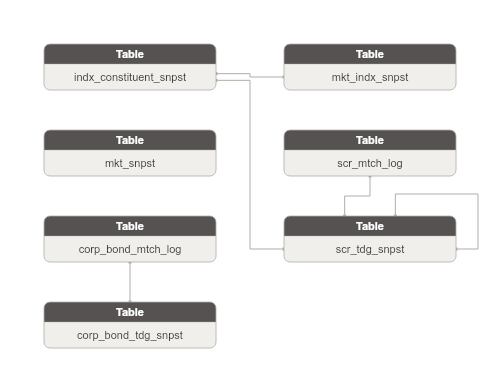

**Danh sách bảng:**

| STT | Tên bảng | Mô tả |
|---|---|---|
| 1 | corp_bond_mtch_log | Log tick-by-tick từng lần khớp lệnh trái phiếu doanh nghiệp theo thứ tự ConfirmNoCorpBond. Grain: 1 dòng = 1 lần khớp (symbol × ngày × confirm_no). Insert-only. |
| 2 | scr_mtch_log | Log tick-by-tick từng lần khớp lệnh chứng khoán theo thứ tự sequenceMsg. Grain: 1 dòng = 1 lần khớp (symbol × ngày × sequenceMsg). Insert-only. Chứa chiều giao dịch chủ động (lastColor) và tích lũy KL/GT từ đầu ngày. |
| 3 | corp_bond_tdg_snpst | Snapshot trạng thái giao dịch trái phiếu doanh nghiệp niêm yết HNX tại thời điểm phát sinh thay đổi: giá tham chiếu/trần/sàn/khớp |
| 4 | indx_constituent_snpst | Snapshot thành phần rổ chỉ số thị trường: mã chứng khoán thuộc rổ nào (IndexCode × Symbol × ngày giao dịch). Có attribute nghiệp vụ: tỷ trọng (Weighted) và ngày vào rổ (AddDate). |
| 5 | mkt_indx_snpst | Snapshot thông tin chỉ số thị trường chứng khoán (VN30/VNINDEX/HNX30...) tại thời điểm phát sinh: giá trị chỉ số |
| 6 | mkt_snpst | Snapshot trạng thái tổng hợp toàn sàn giao dịch (HOSE/HNX/UPCOM) tại mỗi thời điểm: điểm chỉ số sàn |
| 7 | scr_tdg_snpst | Snapshot trạng thái giao dịch đa loại chứng khoán (cổ phiếu/CCQ/chứng quyền/phái sinh) tại thời điểm có thay đổi lệnh/khớp lệnh: giá tham chiếu/trần/sàn |

### Bảng corp_bond_mtch_log

| STT | Tên trường | Kiểu dữ liệu và độ dài | Nullable | Unique | P/F Key | Mặc định | Mô tả |
|---|---|---|---|---|---|---|---|
| 1 | corp_bond_mtch_log_id | STRING |  | X | P |  | Khóa đại diện cho bản ghi khớp lệnh trái phiếu doanh nghiệp. |
| 2 | corp_bond_mtch_log_code | STRING |  |  |  |  | Định danh duy nhất bản tin (GUID). BK. |
| 3 | src_stm_code | STRING |  |  |  | 'MDDS.CorpBondMatch' | Mã nguồn dữ liệu. |
| 4 | corp_bond_tdg_snpst_id | STRING |  |  | F |  | FK đến bản tin thông tin giao dịch trái phiếu doanh nghiệp tương ứng. |
| 5 | symb | STRING |  |  |  |  | Mã trái phiếu doanh nghiệp. BK. |
| 6 | tdg_dt | DATE |  |  |  |  | Ngày giao dịch. BK. |
| 7 | cfrm_no | INT |  |  |  |  | Số xác nhận/số thứ tự giao dịch TPDN (thay cho sequenceMsg trong TransLog). BK. |
| 8 | mtch_tm | STRING | X |  |  |  | Giờ khớp lệnh (HH:mm:ss). |
| 9 | mtch_drc_code | STRING | X |  |  |  | Chiều giao dịch chủ động: B=Mua chủ động / S=Bán chủ động / O=ATO / C=ATC. |
| 10 | mtch_prc | DECIMAL(23,2) | X |  |  |  | Giá khớp (thường theo % mệnh giá nhân mệnh giá cho TPDN). |
| 11 | mtch_vol | INT | X |  |  |  | Khối lượng khớp của lần khớp này. |
| 12 | prc_chg_val | DECIMAL(23,2) | X |  |  |  | Thay đổi so với giá tham chiếu tại thời điểm khớp. |
| 13 | chg_color | STRING | X |  |  |  | Style hiển thị của giá thay đổi. |
| 14 | acm_vol | INT | X |  |  |  | Tổng khối lượng khớp tích lũy từ đầu ngày. |
| 15 | acm_val | DECIMAL(23,2) | X |  |  |  | Tổng giá trị khớp tích lũy từ đầu ngày (VND). |
| 16 | tot_buy_vol | INT | X |  |  |  | Tổng khối lượng mua chủ động (lastColor=B) tích lũy trong ngày. |
| 17 | tot_sell_vol | INT | X |  |  |  | Tổng khối lượng bán chủ động (lastColor=S) tích lũy trong ngày. |
| 18 | mkt_id | STRING |  |  |  | '06' | ID thị trường — luôn = 06 (trái phiếu doanh nghiệp HNX). |

#### Constraint

**Khóa chính (Primary Key):**

| Tên trường |
|---|
| corp_bond_mtch_log_id |

**Khóa phụ (Foreign Key):**

| Tên trường | Bảng tham chiếu | Cột tham chiếu |
|---|---|---|
| corp_bond_tdg_snpst_id | corp_bond_tdg_snpst | corp_bond_tdg_snpst_id |

#### Index

N/A

#### Trigger

N/A

### Bảng scr_mtch_log

| STT | Tên trường | Kiểu dữ liệu và độ dài | Nullable | Unique | P/F Key | Mặc định | Mô tả |
|---|---|---|---|---|---|---|---|
| 1 | scr_mtch_log_id | STRING |  | X | P |  | Khóa đại diện cho bản ghi khớp lệnh chứng khoán. |
| 2 | scr_mtch_log_code | STRING |  |  |  |  | Định danh duy nhất bản tin (GUID). BK. |
| 3 | src_stm_code | STRING |  |  |  | 'MDDS.TransLog' | Mã nguồn dữ liệu. |
| 4 | scr_tdg_snpst_id | STRING |  |  | F |  | FK đến bản tin thông tin giao dịch chứng khoán tương ứng. |
| 5 | symb | STRING |  |  |  |  | Mã chứng khoán. BK. |
| 6 | tdg_dt | DATE |  |  |  |  | Ngày giao dịch. BK. |
| 7 | seq_msg | INT |  |  |  |  | Số thứ tự tăng dần trong ngày — đảm bảo thứ tự xử lý và phát hiện mất gói. BK. |
| 8 | mtch_tm | STRING | X |  |  |  | Giờ khớp lệnh (HH:mm:ss) theo giờ máy chủ sở giao dịch. Nhiều tick có thể cùng timestamp trong ATO/ATC (batch matching). |
| 9 | mtch_drc_code | STRING | X |  |  |  | Chiều giao dịch chủ động: B=Mua chủ động / S=Bán chủ động / O=Khớp phiên ATO / C=Khớp phiên ATC. B/S trong MDDS là chiều của bên đặt lệnh đối ứng — ngược với hiển thị bảng giá thông thường. |
| 10 | mtch_prc | DECIMAL(23,2) | X |  |  |  | Giá khớp lệnh (VND — số nguyên không có dấu phẩy). |
| 11 | mtch_vol | INT | X |  |  |  | Khối lượng khớp của lần khớp này. |
| 12 | prc_chg_val | DECIMAL(23,2) | X |  |  |  | Thay đổi của giá khớp so với giá tham chiếu tại thời điểm khớp (+/-). |
| 13 | chg_color | STRING | X |  |  |  | Style hiển thị của giá thay đổi (tăng/giảm/đứng). |
| 14 | acm_vol | INT | X |  |  |  | Tổng khối lượng khớp tích lũy từ đầu ngày đến thời điểm này (cho mã đó). |
| 15 | acm_val | DECIMAL(23,2) | X |  |  |  | Tổng giá trị khớp tích lũy từ đầu ngày đến thời điểm này (VND). formattedAccVal / formattedAccVol = VWAP tại thời điểm. |
| 16 | tot_buy_vol | INT | X |  |  |  | Tổng khối lượng mua chủ động (lastColor=B) tích lũy trong ngày cho mã đó. |
| 17 | tot_sell_vol | INT | X |  |  |  | Tổng khối lượng bán chủ động (lastColor=S) tích lũy trong ngày cho mã đó. |

#### Constraint

**Khóa chính (Primary Key):**

| Tên trường |
|---|
| scr_mtch_log_id |

**Khóa phụ (Foreign Key):**

| Tên trường | Bảng tham chiếu | Cột tham chiếu |
|---|---|---|
| scr_tdg_snpst_id | scr_tdg_snpst | scr_tdg_snpst_id |

#### Index

N/A

#### Trigger

N/A

### Bảng corp_bond_tdg_snpst

| STT | Tên trường | Kiểu dữ liệu và độ dài | Nullable | Unique | P/F Key | Mặc định | Mô tả |
|---|---|---|---|---|---|---|---|
| 1 | corp_bond_tdg_snpst_id | STRING |  | X | P |  | Khóa đại diện cho bản tin thông tin giao dịch trái phiếu doanh nghiệp. |
| 2 | corp_bond_tdg_snpst_code | STRING |  |  |  |  | Định danh duy nhất bản tin (GUID). BK. |
| 3 | src_stm_code | STRING |  |  |  | 'MDDS.CorpBondInfor' | Mã nguồn dữ liệu. |
| 4 | symb | STRING |  |  |  |  | Mã trái phiếu doanh nghiệp (ví dụ: BHB12104). BK. |
| 5 | tdg_dt | DATE |  |  |  |  | Ngày giao dịch (dd/mm/yyyy). BK. |
| 6 | full_nm | STRING | X |  |  |  | Tên đầy đủ của trái phiếu. |
| 7 | flr_code | STRING |  |  |  | '06' | Mã sàn giao dịch — luôn = 06 (thị trường trái phiếu doanh nghiệp HNX). |
| 8 | stk_tp_code | STRING |  |  |  | '12' | Loại chứng khoán — luôn = 12 cho TPDN. |
| 9 | tdg_ssn_id | STRING | X |  |  |  | Mã trạng thái giao dịch theo quy định kết cấu phiên HNX. |
| 10 | scr_tdg_st_code | STRING | X |  |  |  | Trạng thái trái phiếu: 0=Bình thường / 1=Tạm ngừng nghỉ lễ / 2=Ngừng GD / 10=Tạm ngừng GD / 11=Hạn chế GD / 25=GD đặc biệt. |
| 11 | tdg_ssn_st_code | STRING | X |  |  |  | Trạng thái phiên giao dịch: 1=Đang nhận lệnh / 2=Tạm dừng / 13=Kết thúc nhận lệnh / 90=Chờ nhận lệnh / 97=Đóng cửa. |
| 12 | ceiling_prc | DECIMAL(23,2) | X |  |  |  | Giá trần giao dịch khớp lệnh. |
| 13 | flr_prc | DECIMAL(23,2) | X |  |  |  | Giá sàn giao dịch khớp lệnh. |
| 14 | refr_prc | DECIMAL(23,2) | X |  |  |  | Giá tham chiếu. |
| 15 | cls_prc | DECIMAL(23,2) | X |  |  |  | Giá đóng cửa (giá khớp gần nhất). |
| 16 | cls_vol | INT | X |  |  |  | Khối lượng khớp tại lần khớp gần nhất. |
| 17 | prc_chg_val | DECIMAL(23,2) | X |  |  |  | Thay đổi của giá khớp gần nhất so với giá tham chiếu. |
| 18 | opn_prc | DECIMAL(23,2) | X |  |  |  | Giá mở cửa. |
| 19 | high_prc | DECIMAL(23,2) | X |  |  |  | Giá thực hiện cao nhất của giao dịch khớp lệnh trong ngày. |
| 20 | low_prc | DECIMAL(23,2) | X |  |  |  | Giá thực hiện thấp nhất của giao dịch khớp lệnh trong ngày. |
| 21 | av_prc | DECIMAL(23,2) | X |  |  |  | Giá trung bình trong ngày (totalTradingValue / totalTrading). |
| 22 | tot_mtch_vol | INT | X |  |  |  | Tổng khối lượng giao dịch tích lũy. |
| 23 | tot_mtch_val | DECIMAL(23,2) | X |  |  |  | Tổng giá trị giao dịch tích lũy. |
| 24 | pt_mtch_vol | INT | X |  |  |  | Khối lượng thực hiện gần nhất của giao dịch thỏa thuận Outright. |
| 25 | pt_mtch_prc | DECIMAL(23,2) | X |  |  |  | Giá thực hiện gần nhất của giao dịch thỏa thuận Outright. |
| 26 | pt_tot_mtch_vol | INT | X |  |  |  | Tổng khối lượng giao dịch thỏa thuận Outright tích lũy. |
| 27 | pt_tot_mtch_val | DECIMAL(23,2) | X |  |  |  | Tổng giá trị giao dịch thỏa thuận Outright tích lũy. |
| 28 | pt_best_bid_vol | INT | X |  |  |  | Tổng khối lượng chào mua cao nhất trên order book thỏa thuận Outright. |
| 29 | pt_best_bid_prc | DECIMAL(23,2) | X |  |  |  | Giá chào mua cao nhất trên order book thỏa thuận Outright. |
| 30 | pt_best_ofr_vol | INT | X |  |  |  | Tổng khối lượng chào bán thấp nhất trên order book thỏa thuận Outright. |
| 31 | pt_best_ofr_prc | DECIMAL(23,2) | X |  |  |  | Giá chào bán thấp nhất trên order book thỏa thuận Outright. |
| 32 | pt_tot_bid_vol | INT | X |  |  |  | Tổng khối lượng chào mua toàn bộ order book thỏa thuận Outright. |
| 33 | pt_tot_ofr_vol | INT | X |  |  |  | Tổng khối lượng chào bán toàn bộ order book thỏa thuận Outright. |
| 34 | pt_max_vol | INT | X |  |  |  | Tổng khối lượng thực hiện tương ứng với giá cao nhất — giao dịch thỏa thuận Outright. |
| 35 | pt_max_prc | DECIMAL(23,2) | X |  |  |  | Giá thực hiện cao nhất — giao dịch thỏa thuận Outright. |
| 36 | pt_min_vol | INT | X |  |  |  | Tổng khối lượng thực hiện tương ứng với giá thấp nhất — giao dịch thỏa thuận Outright. |
| 37 | pt_min_prc | DECIMAL(23,2) | X |  |  |  | Giá thực hiện thấp nhất — giao dịch thỏa thuận Outright. |
| 38 | frgn_rman_room | INT | X |  |  |  | Số lượng còn lại nhà đầu tư nước ngoài được phép mua. |
| 39 | issur_nm | STRING | X |  | F |  | Mã tổ chức phát hành trái phiếu. |
| 40 | mat_dt | DATE | X |  |  |  | Ngày đáo hạn trái phiếu. |
| 41 | issu_dt | DATE | X |  |  |  | Ngày phát hành trái phiếu. |
| 42 | tot_listing_vol | INT | X |  |  |  | Tổng khối lượng trái phiếu niêm yết. |
| 43 | par_val | DECIMAL(23,2) | X |  |  |  | Mệnh giá trái phiếu (thường 100.000 VND/trái phiếu). |
| 44 | bond_prd | INT | X |  |  |  | Kỳ hạn gốc của trái phiếu. |
| 45 | prd_unit_code | STRING | X |  |  |  | Đơn vị kỳ hạn: 1=Ngày / 2=Tuần / 3=Tháng / 4=Năm. |
| 46 | prd_rman | INT | X |  |  |  | Kỳ hạn còn lại tính bằng ngày (tính toán lại hàng ngày). |
| 47 | bond_int_tp_code | STRING | X |  |  |  | Loại hình lãi suất: 1=Coupon / 2=Zero Coupon. |
| 48 | int_rate | DECIMAL(8,5) | X |  |  |  | Lãi suất danh nghĩa (coupon rate). |
| 49 | dbt_int_tp_code | STRING | X |  |  |  | Loại lãi suất: 1=Cố định / 2=Thả nổi. |
| 50 | int_prd | INT | X |  |  |  | Kỳ hạn trả lãi. |
| 51 | int_prd_unit_code | STRING | X |  |  |  | Đơn vị kỳ hạn trả lãi: 1=Ngày / 2=Tuần / 3=Tháng / 4=Năm. |
| 52 | int_cpn_tp_code | STRING | X |  |  |  | Kiểu coupon: 1=Standard / 2=Long Coupon / 3=Short Coupon / 4=Khác. |
| 53 | int_pymt_tp_code | STRING | X |  |  |  | Phương thức trả lãi: 1=Định kỳ cuối kỳ / 2=Định kỳ đầu kỳ. |
| 54 | char | STRING | X |  |  |  | Đặc điểm của trái phiếu. |

#### Constraint

**Khóa chính (Primary Key):**

| Tên trường |
|---|
| corp_bond_tdg_snpst_id |

**Khóa phụ (Foreign Key):**

*Không có Foreign Key.*

#### Index

N/A

#### Trigger

N/A

### Bảng indx_constituent_snpst

| STT | Tên trường | Kiểu dữ liệu và độ dài | Nullable | Unique | P/F Key | Mặc định | Mô tả |
|---|---|---|---|---|---|---|---|
| 1 | indx_constituent_snpst_id | STRING |  | X | P |  | Khóa đại diện cho bản ghi thành phần rổ chỉ số. |
| 2 | indx_constituent_snpst_code | STRING |  |  |  |  | Định danh duy nhất bản tin (GUID). BK. |
| 3 | src_stm_code | STRING |  |  |  | 'MDDS.CSIDXInfor' | Mã nguồn dữ liệu. |
| 4 | mkt_indx_snpst_id | STRING |  |  | F |  | FK đến bản tin thông tin chỉ số tương ứng. |
| 5 | indx_code | STRING |  |  |  |  | Mã chỉ số (VN30 / HNX30 / VNFINSELECT...). BK. |
| 6 | scr_tdg_snpst_id | STRING |  |  | F |  | FK đến bản tin thông tin giao dịch chứng khoán thành viên. |
| 7 | symb | STRING |  |  |  |  | Mã chứng khoán thành viên trong rổ chỉ số. BK. |
| 8 | snpst_tm | STRING |  |  |  |  | Thời điểm snapshot trong ngày. BK. Nguồn ghi là TradingDate nhưng tài liệu gốc mô tả "định dạng HHmmss" — ngữ nghĩa là timestamp nội ngày, không phải ngày giao dịch. Cần xác nhận lại với đội nguồn. |
| 9 | flr_code | STRING | X |  |  |  | Mã sàn giao dịch của mã chứng khoán. |
| 10 | indx_id | STRING | X |  |  |  | ID số của sàn giao dịch. |
| 11 | wght | DECIMAL(5,2) | X |  |  |  | Tỷ trọng (weight) của mã trong rổ chỉ số (dạng thập phân — ví dụ 0.0513 = 5.13%). |
| 12 | add_dt | DATE | X |  |  |  | Ngày mã được thêm vào rổ chỉ số. |
| 13 | stk_ctb | DECIMAL(23,2) | X |  |  |  | Giá trị chỉ số tại thời điểm hiện tại (dùng để tính index contribution). |
| 14 | tot_mtch_vol | INT | X |  |  |  | Tổng khối lượng khớp lệnh của mã này trong ngày (lô chẵn). |

#### Constraint

**Khóa chính (Primary Key):**

| Tên trường |
|---|
| indx_constituent_snpst_id |

**Khóa phụ (Foreign Key):**

| Tên trường | Bảng tham chiếu | Cột tham chiếu |
|---|---|---|
| mkt_indx_snpst_id | mkt_indx_snpst | mkt_indx_snpst_id |
| scr_tdg_snpst_id | scr_tdg_snpst | scr_tdg_snpst_id |

#### Index

N/A

#### Trigger

N/A

### Bảng mkt_indx_snpst

| STT | Tên trường | Kiểu dữ liệu và độ dài | Nullable | Unique | P/F Key | Mặc định | Mô tả |
|---|---|---|---|---|---|---|---|
| 1 | mkt_indx_snpst_id | STRING |  | X | P |  | Khóa đại diện cho bản tin thông tin chỉ số thị trường. |
| 2 | mkt_indx_snpst_code | STRING |  |  |  |  | Định danh duy nhất bản tin (GUID). BK. |
| 3 | src_stm_code | STRING |  |  |  | 'MDDS.IDXInfor' | Mã nguồn dữ liệu. |
| 4 | indx_code | STRING |  |  |  |  | Mã chỉ số (VNINDEX / HNXINDEX / VN30 / HNX30 / UPCOMINDEX...). BK. |
| 5 | tdg_dt | DATE |  |  |  |  | Ngày giao dịch. BK. |
| 6 | udt_tm | STRING |  |  |  |  | Thời gian cập nhật theo giờ máy chủ. BK. |
| 7 | indx_nm | STRING | X |  |  |  | Tên đầy đủ của chỉ số. |
| 8 | flr_code | STRING | X |  |  |  | Mã sàn giao dịch của chỉ số. |
| 9 | indx_tp_code | STRING | X |  |  |  | Loại chỉ số: 0=Toàn thị trường / 1=Bảng giao dịch / 2=Phức hợp / 3=Ngành / 4=Top ranking. |
| 10 | crn_st_code | STRING | X |  |  |  | Trạng thái chỉ số (=1 bình thường). |
| 11 | indx_id | STRING | X |  |  |  | ID số của sàn giao dịch. |
| 12 | indx_val | DECIMAL(23,2) | X |  |  |  | Giá trị chỉ số hiện tại. |
| 13 | prev_indx_val | DECIMAL(23,2) | X |  |  |  | Giá trị chỉ số tham chiếu (đóng cửa phiên gần nhất). |
| 14 | high_indx_val | DECIMAL(23,2) | X |  |  |  | Giá trị chỉ số cao nhất trong ngày. |
| 15 | lws_indx_val | DECIMAL(23,2) | X |  |  |  | Giá trị chỉ số thấp nhất trong ngày. |
| 16 | cls_indx_val | DECIMAL(23,2) | X |  |  |  | Giá trị chỉ số đóng cửa (cập nhật sau khi kết thúc phiên). |
| 17 | indx_chg_val | DECIMAL(23,2) | X |  |  |  | Thay đổi giá trị chỉ số so với phiên trước (tuyệt đối). |
| 18 | indx_chg_rto | DECIMAL(5,2) | X |  |  |  | Tỷ lệ phần trăm thay đổi so với phiên trước. |
| 19 | tot_mtch_vol | INT | X |  |  |  | Tổng khối lượng khớp lệnh thường (lô chẵn) tích lũy. |
| 20 | tot_mtch_val | DECIMAL(23,2) | X |  |  |  | Tổng giá trị khớp lệnh thường (lô chẵn) tích lũy. |
| 21 | pt_tot_vol | INT | X |  |  |  | Tổng khối lượng khớp lệnh thỏa thuận tích lũy. |
| 22 | pt_tval | DECIMAL(23,2) | X |  |  |  | Tổng giá trị khớp lệnh thỏa thuận tích lũy. |
| 23 | tot_stk_cnt | INT | X |  |  |  | Tổng số mã chứng khoán trong rổ tính chỉ số. |
| 24 | advnc_cnt | INT | X |  |  |  | Tổng số mã chứng khoán tăng giá trong rổ. |
| 25 | decline_cnt | INT | X |  |  |  | Tổng số mã chứng khoán giảm giá trong rổ. |
| 26 | no_chg_cnt | INT | X |  |  |  | Tổng số mã chứng khoán đứng giá trong rổ. |
| 27 | ceiling_cnt | INT | X |  |  |  | Tổng số mã chứng khoán tăng trần trong rổ. |
| 28 | flr_lmt_cnt | INT | X |  |  |  | Tổng số mã chứng khoán giảm sàn trong rổ. |

#### Constraint

**Khóa chính (Primary Key):**

| Tên trường |
|---|
| mkt_indx_snpst_id |

**Khóa phụ (Foreign Key):**

*Không có Foreign Key.*

#### Index

N/A

#### Trigger

N/A

### Bảng mkt_snpst

| STT | Tên trường | Kiểu dữ liệu và độ dài | Nullable | Unique | P/F Key | Mặc định | Mô tả |
|---|---|---|---|---|---|---|---|
| 1 | mkt_snpst_id | STRING |  | X | P |  | Khóa đại diện cho bản tin tổng quan thị trường. |
| 2 | mkt_snpst_code | STRING |  |  |  |  | Định danh duy nhất bản tin (GUID). BK. |
| 3 | src_stm_code | STRING |  |  |  | 'MDDS.MarketInfor' | Mã nguồn dữ liệu. |
| 4 | mkt_id | STRING |  |  |  |  | ID sàn/chỉ số: 10=HOSE / 02=HNX / 04=UPCOM / 06=Corp Bond / VN30 / HNX30... BK. |
| 5 | mkt_code | STRING | X |  |  |  | Mã chỉ số tương ứng với marketId. |
| 6 | tdg_dt | DATE |  |  |  |  | Ngày giao dịch. |
| 7 | seq_msg | INT |  |  |  |  | Số thứ tự tăng dần trong ngày — đảm bảo thứ tự xử lý bản tin. |
| 8 | indx_tm | STRING | X |  |  |  | Thời gian cập nhật chỉ số. |
| 9 | mkt_st_code | STRING | X |  |  |  | Trạng thái phiên giao dịch (ATO / Continuous / ATC / Closed...). |
| 10 | mkt_indx_val | DECIMAL(23,2) | X |  |  |  | Điểm chỉ số thị trường hiện tại. |
| 11 | indx_chg_val | DECIMAL(23,2) | X |  |  |  | Thay đổi điểm chỉ số so với đầu ngày (tham chiếu). |
| 12 | indx_chg_pct | DECIMAL(5,2) | X |  |  |  | Phần trăm thay đổi điểm chỉ số so với đầu ngày. |
| 13 | indx_color | STRING | X |  |  |  | Màu hiển thị chỉ số (tăng/giảm/đứng). |
| 14 | prev_mkt_indx_val | DECIMAL(23,2) | X |  |  |  | Chỉ số tham chiếu — giá trị đóng cửa phiên giao dịch gần nhất. |
| 15 | av_mkt_indx_val | DECIMAL(23,2) | X |  |  |  | Chỉ số trung bình của thị trường trong phiên. |
| 16 | av_prev_mkt_indx_val | DECIMAL(23,2) | X |  |  |  | Chỉ số trung bình đóng cửa phiên giao dịch gần nhất. |
| 17 | av_indx_chg_val | DECIMAL(23,2) | X |  |  |  | Thay đổi của chỉ số trung bình. |
| 18 | av_indx_chg_pct | DECIMAL(5,2) | X |  |  |  | Phần trăm thay đổi của chỉ số trung bình. |
| 19 | tot_mtch_trd_cnt | INT | X |  |  |  | Tổng số lệnh khớp (FloorCode=02: cổ phiếu; FloorCode=03: trái phiếu). |
| 20 | tot_mtch_vol | INT | X |  |  |  | Tổng khối lượng khớp lệnh thường toàn thị trường. |
| 21 | tot_mtch_val | DECIMAL(23,2) | X |  |  |  | Tổng giá trị khớp lệnh thường toàn thị trường. |
| 22 | advnc_cnt | INT | X |  |  |  | Số mã tăng giá. |
| 23 | decline_cnt | INT | X |  |  |  | Số mã giảm giá. |
| 24 | no_chg_cnt | INT | X |  |  |  | Số mã không đổi giá. |
| 25 | advnc_vol | INT | X |  |  |  | Tổng khối lượng chứng khoán tăng giá (bao gồm giao dịch thỏa thuận). |
| 26 | decline_vol | INT | X |  |  |  | Tổng khối lượng chứng khoán giảm giá (bao gồm giao dịch thỏa thuận). |
| 27 | no_chg_vol | INT | X |  |  |  | Tổng khối lượng chứng khoán đứng giá (bao gồm giao dịch thỏa thuận). |
| 28 | ceiling_cnt | INT | X |  |  |  | Số mã tăng trần. |
| 29 | flr_cnt | INT | X |  |  |  | Số mã giảm sàn. |
| 30 | pt_tot_trd_cnt | INT | X |  |  |  | Tổng số lệnh giao dịch thỏa thuận. |
| 31 | pt_tot_vol | INT | X |  |  |  | Tổng khối lượng giao dịch thỏa thuận. |
| 32 | pt_tval | DECIMAL(23,2) | X |  |  |  | Tổng giá trị giao dịch thỏa thuận. |
| 33 | odd_lot_tot_vol | INT | X |  |  |  | Tổng khối lượng giao dịch lô lẻ. |
| 34 | odd_lot_tval | DECIMAL(23,2) | X |  |  |  | Tổng giá trị giao dịch lô lẻ. |

#### Constraint

**Khóa chính (Primary Key):**

| Tên trường |
|---|
| mkt_snpst_id |

**Khóa phụ (Foreign Key):**

*Không có Foreign Key.*

#### Index

N/A

#### Trigger

N/A

### Bảng scr_tdg_snpst

| STT | Tên trường | Kiểu dữ liệu và độ dài | Nullable | Unique | P/F Key | Mặc định | Mô tả |
|---|---|---|---|---|---|---|---|
| 1 | scr_tdg_snpst_id | STRING |  | X | P |  | Khóa đại diện cho bản tin thông tin giao dịch chứng khoán. |
| 2 | scr_tdg_snpst_code | STRING |  |  |  |  | Định danh duy nhất bản tin (GUID). BK. |
| 3 | src_stm_code | STRING |  |  |  | 'MDDS.StockInfor' | Mã nguồn dữ liệu. |
| 4 | symb | STRING |  |  |  |  | Mã chứng khoán (VCB / HPG / VNM...). BK. |
| 5 | tdg_dt | DATE |  |  |  |  | Ngày giao dịch (dd/mm/yyyy). BK. |
| 6 | stk_id | STRING | X |  |  |  | ID nội bộ duy nhất của chứng khoán trong hệ thống MDDS. |
| 7 | full_nm | STRING | X |  |  |  | Tên đầy đủ của chứng khoán. |
| 8 | flr_code | STRING |  |  |  |  | Mã sàn giao dịch: 02=HNX / 04=UPCOM / 10=HOSE / 03=FDS (phái sinh) / 06=Corp Bond. |
| 9 | stk_tp_code | STRING | X |  |  |  | Loại chứng khoán theo sàn. HNX: BO/ST/MF/FU/OP/EF. HOSE: B=Trái phiếu / S=Cổ phiếu / U/E=CCQ / D=TP chuyển đổi / W=Chứng quyền. Parse kết hợp FloorCode. |
| 10 | tdg_ssn_id | STRING | X |  |  |  | Mã phiên giao dịch (ATO / Continuous / ATC...). |
| 11 | ceiling_prc | DECIMAL(23,2) | X |  |  |  | Giá trần trong ngày. |
| 12 | flr_prc | DECIMAL(23,2) | X |  |  |  | Giá sàn trong ngày. |
| 13 | refr_prc | DECIMAL(23,2) | X |  |  |  | Giá tham chiếu trong ngày. |
| 14 | cls_prc | DECIMAL(23,2) | X |  |  |  | Giá khớp lệnh gần nhất (giá thị trường hiện tại). |
| 15 | cls_vol | INT | X |  |  |  | Khối lượng khớp tại lần khớp gần nhất. |
| 16 | prc_chg_val | DECIMAL(23,2) | X |  |  |  | Thay đổi của giá khớp gần nhất so với giá tham chiếu (+/-). |
| 17 | prev_prc | DECIMAL(23,2) | X |  |  |  | Giá khớp gần nhất (trước lần cập nhật hiện tại). |
| 18 | opn_prc | DECIMAL(23,2) | X |  |  |  | Giá mở cửa (giá khớp ATO). |
| 19 | high_prc | DECIMAL(23,2) | X |  |  |  | Giá cao nhất trong ngày. |
| 20 | low_prc | DECIMAL(23,2) | X |  |  |  | Giá thấp nhất trong ngày. |
| 21 | av_prc | DECIMAL(23,2) | X |  |  |  | Giá trung bình (VWAP) trong ngày. |
| 22 | bid_prc_1 | DECIMAL(23,2) | X |  |  |  | Giá mua bước 1 (tốt nhất). |
| 23 | bid_vol_1 | INT | X |  |  |  | Khối lượng mua tại bước giá 1. |
| 24 | bid_prc_2 | DECIMAL(23,2) | X |  |  |  | Giá mua bước 2. |
| 25 | bid_vol_2 | INT | X |  |  |  | Khối lượng mua tại bước giá 2. |
| 26 | bid_prc_3 | DECIMAL(23,2) | X |  |  |  | Giá mua bước 3 (xa nhất). |
| 27 | bid_vol_3 | INT | X |  |  |  | Khối lượng mua tại bước giá 3. |
| 28 | ofr_prc_1 | DECIMAL(23,2) | X |  |  |  | Giá bán bước 1 (tốt nhất). |
| 29 | ofr_vol_1 | INT | X |  |  |  | Khối lượng bán tại bước giá 1. |
| 30 | ofr_prc_2 | DECIMAL(23,2) | X |  |  |  | Giá bán bước 2. |
| 31 | ofr_vol_2 | INT | X |  |  |  | Khối lượng bán tại bước giá 2. |
| 32 | ofr_prc_3 | DECIMAL(23,2) | X |  |  |  | Giá bán bước 3 (xa nhất). |
| 33 | ofr_vol_3 | INT | X |  |  |  | Khối lượng bán tại bước giá 3. |
| 34 | tot_bid_vol | INT | X |  |  |  | Tổng khối lượng chào mua cộng dồn. |
| 35 | tot_ofr_vol | INT | X |  |  |  | Tổng khối lượng chào bán cộng dồn. |
| 36 | tot_mtch_vol | INT | X |  |  |  | Tổng khối lượng khớp lệnh tích lũy từ đầu ngày. |
| 37 | tot_mtch_val | DECIMAL(23,2) | X |  |  |  | Tổng giá trị khớp lệnh tích lũy từ đầu ngày. |
| 38 | pt_mtch_vol | INT | X |  |  |  | Tổng khối lượng giao dịch thông thường (không tính thỏa thuận). |
| 39 | pt_mtch_prc | DECIMAL(23,2) | X |  |  |  | Giá thực hiện của lệnh thỏa thuận hiện thời. |
| 40 | pt_tot_mtch_vol | INT | X |  |  |  | Tổng khối lượng giao dịch thỏa thuận tích lũy. |
| 41 | pt_tot_mtch_val | DECIMAL(23,2) | X |  |  |  | Tổng giá trị giao dịch thỏa thuận tích lũy. |
| 42 | frgn_buy_vol | INT | X |  |  |  | Tổng khối lượng mua của nhà đầu tư nước ngoài. |
| 43 | frgn_sell_vol | INT | X |  |  |  | Tổng khối lượng bán của nhà đầu tư nước ngoài. |
| 44 | frgn_rman_room | INT | X |  |  |  | Số lượng còn lại nhà đầu tư nước ngoài được phép mua (cập nhật sau mỗi giao dịch NĐTNN). |
| 45 | frgn_tot_room | INT | X |  |  |  | Tổng room nhà đầu tư nước ngoài được phép mua. |
| 46 | refr_prc_1 | DECIMAL(23,2) | X |  |  |  | Giá tham chiếu phụ 1 (dùng nội bộ bảng giá). |
| 47 | refr_prc_2 | DECIMAL(23,2) | X |  |  |  | Giá tham chiếu phụ 2 (dùng nội bộ bảng giá). |
| 48 | tot_listing_vol | INT | X |  |  |  | Tổng khối lượng niêm yết — dùng cho HNX/UPCOM. |
| 49 | fnd_tp | STRING | X |  |  |  | Loại chứng khoán theo nguyên văn sở trả về (chưa convert). |
| 50 | hnx_listing_st_code | STRING | X |  |  |  | Trạng thái niêm yết HNX/UPCOM: parse từ Status (vị trí 1) — chỉ áp dụng FloorCode=02/04. |
| 51 | hnx_adj_vol | STRING | X |  |  |  | Điều chỉnh khối lượng HNX/UPCOM: parse từ Status (vị trí 2) — chỉ áp dụng FloorCode=02/04. |
| 52 | hnx_refr_st_code | STRING | X |  |  |  | Trạng thái tham chiếu HNX/UPCOM: parse từ Status (vị trí 3) — chỉ áp dụng FloorCode=02/04. |
| 53 | hnx_adj_rate | STRING | X |  |  |  | Tỷ lệ điều chỉnh HNX/UPCOM: parse từ Status (vị trí 4) — chỉ áp dụng FloorCode=02/04. |
| 54 | hnx_dvdn_rate | STRING | X |  |  |  | Tỷ lệ cổ tức HNX/UPCOM: parse từ Status (vị trí 5) — chỉ áp dụng FloorCode=02/04. |
| 55 | hnx_st | STRING | X |  |  |  | Trạng thái tổng hợp HNX/UPCOM: parse từ Status (vị trí 6) — chỉ áp dụng FloorCode=02/04. |
| 56 | hose_delist_f | STRING | X |  |  |  | Cờ hủy niêm yết HOSE: parse từ Status (vị trí 1) — chỉ áp dụng FloorCode=10. |
| 57 | hose_susp_f | STRING | X |  |  |  | Cờ đình chỉ giao dịch HOSE: parse từ Status (vị trí 2) — chỉ áp dụng FloorCode=10. |
| 58 | hose_halt_resume_f | STRING | X |  |  |  | Cờ tạm ngừng/khôi phục HOSE: parse từ Status (vị trí 3) — chỉ áp dụng FloorCode=10. |
| 59 | hose_split_f | STRING | X |  |  |  | Cờ chia tách HOSE: parse từ Status (vị trí 4) — chỉ áp dụng FloorCode=10. |
| 60 | hose_bnft_f | STRING | X |  |  |  | Cờ quyền lợi HOSE: parse từ Status (vị trí 5) — chỉ áp dụng FloorCode=10. |
| 61 | hose_mtg_f | STRING | X |  |  |  | Cờ đại hội cổ đông HOSE: parse từ Status (vị trí 6) — chỉ áp dụng FloorCode=10. |
| 62 | hose_ntc_f | STRING | X |  |  |  | Cờ thông báo HOSE: parse từ Status (vị trí 7) — chỉ áp dụng FloorCode=10. |
| 63 | hose_odd_lot_halt_resume_f | STRING | X |  |  |  | Cờ tạm ngừng/khôi phục lô lẻ HOSE: parse từ Status (vị trí 8) — chỉ áp dụng FloorCode=10. |
| 64 | ulyg_imt_id | STRING | X |  | F |  | FK đến Security Trading Snapshot của tài sản cơ sở — dùng cho phái sinh và chứng quyền. |
| 65 | ulyg_symb | STRING | X |  | F |  | Mã tài sản cơ sở (VN30...) — dùng cho phái sinh và chứng quyền. |
| 66 | opn_int | INT | X |  |  |  | Khối lượng hợp đồng mở (Open Interest) — chỉ dùng cho phái sinh. |
| 67 | opn_int_chg | INT | X |  |  |  | Thay đổi khối lượng hợp đồng mở so với phiên trước. |
| 68 | frst_tdg_dt | DATE | X |  |  |  | Ngày giao dịch đầu tiên — dùng cho phái sinh và chứng quyền. |
| 69 | last_tdg_dt | DATE | X |  |  |  | Ngày giao dịch cuối cùng — dùng cho phái sinh và chứng quyền. |
| 70 | mat_dt | DATE | X |  |  |  | Ngày đáo hạn — dùng cho chứng quyền và phái sinh. |
| 71 | cvrd_wrnt_tp_code | STRING | X |  |  |  | Loại chứng quyền — chỉ áp dụng khi StockType=W. |
| 72 | exrc_prc | DECIMAL(23,2) | X |  |  |  | Giá thực hiện — dùng cho chứng quyền. |
| 73 | exrc_rto | DECIMAL(5,2) | X |  |  |  | Tỷ lệ chuyển đổi — dùng cho chứng quyền. |
| 74 | list_shr | INT | X |  |  |  | Khối lượng chứng quyền niêm yết. |
| 75 | issur_nm | STRING | X |  |  |  | Tên tổ chức phát hành chứng quyền. |

#### Constraint

**Khóa chính (Primary Key):**

| Tên trường |
|---|
| scr_tdg_snpst_id |

**Khóa phụ (Foreign Key):**

| Tên trường | Bảng tham chiếu | Cột tham chiếu |
|---|---|---|
| ulyg_imt_id | scr_tdg_snpst | scr_tdg_snpst_id |

#### Index

N/A

#### Trigger

N/A

### Stored Procedure/Function

N/A

### Package

N/A

## NHNCK — Hệ thống Quản lý giám sát người hành nghề chứng khoán

### Các mô hình quan hệ dữ liệu

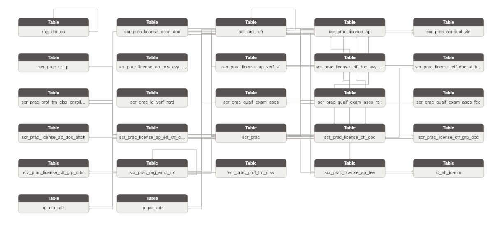

**Danh sách bảng:**

| STT | Tên bảng | Mô tả |
|---|---|---|
| 1 | scr_prac_conduct_vln | Vi phạm pháp luật hoặc hành chính của người hành nghề chứng khoán. Ghi nhận loại vi phạm và quyết định xử lý. |
| 2 | scr_prac_license_ap_pcs_avy_log | Nhật ký hoạt động xử lý hồ sơ CCHN. Ghi nhận từng bước xử lý và trạng thái hồ sơ theo thời gian. |
| 3 | scr_prac_license_ap_verf_st | Bản ghi phê duyệt nội bộ hồ sơ CCHN theo cấp lãnh đạo. Ghi nhận người phê duyệt và kết quả phê duyệt tại từng cấp. |
| 4 | scr_prac_license_ctf_doc_avy_log | Nhật ký hoạt động tác động lên chứng chỉ hành nghề. Ghi nhận hành động và người thực hiện. |
| 5 | scr_prac_license_ctf_doc_st_hist | Lịch sử thay đổi trạng thái của chứng chỉ hành nghề. Ghi nhận trạng thái trước/sau và lý do thay đổi. |
| 6 | scr_prac_prof_trn_clss_enrollment | Đăng ký tham gia và kết quả học tập của người hành nghề tại một khóa đào tạo chuyên môn. |
| 7 | scr_prac_id_verf_rcrd | Kết quả xác thực danh tính người hành nghề qua hệ thống C06 của Bộ Công An. Lưu trạng thái và phản hồi xác thực. |
| 8 | scr_prac_qualf_exam_ases | Đợt thi sát hạch cấp chứng chỉ hành nghề chứng khoán. Ghi nhận thông tin tổ chức đợt thi và quyết định công nhận kết quả. |
| 9 | scr_prac_qualf_exam_ases_rslt | Kết quả thi sát hạch của từng thí sinh trong một đợt thi. Ghi nhận điểm thi và kết quả đạt/không đạt. |
| 10 | scr_prac_qualf_exam_ases_fee | Biểu phí thi sát hạch theo đợt thi và loại chứng chỉ. Ghi nhận mức phí thi và phúc khảo. |
| 11 | scr_prac_license_ap | Hồ sơ đăng ký cấp/cấp lại/gia hạn chứng chỉ hành nghề chứng khoán. Ghi nhận đầy đủ thông tin người nộp và kết quả xử lý. |
| 12 | scr_prac_license_ap_doc_attch | Tài liệu đính kèm hồ sơ CCHN. Ghi nhận loại tài liệu và trạng thái thẩm định. |
| 13 | scr_prac_license_ap_ed_ctf_doc | Văn bằng/chứng chỉ học tập đính kèm hồ sơ CCHN. Ghi nhận loại chuyên môn và file đính kèm kèm trạng thái thẩm định. |
| 14 | scr_prac_license_ctf_doc | Chứng chỉ hành nghề chứng khoán được cấp cho người hành nghề. Ghi nhận loại chứng chỉ và quyết định cấp/thu hồi. |
| 15 | scr_prac_license_ctf_grp_doc | Nhóm chứng chỉ hành nghề trong một quyết định cấp/thu hồi/hủy tập thể. Liên kết với quyết định hành chính. |
| 16 | scr_prac_license_ctf_grp_mbr | Quan hệ thành viên giữa chứng chỉ hành nghề và nhóm cấp/thu hồi. Liên kết Certificate ↔ Group ↔ Application. |
| 17 | scr_prac_license_dcsn_doc | Quyết định hành chính của UBCKNN về cấp/thu hồi/hủy chứng chỉ hành nghề chứng khoán. |
| 18 | scr_prac_org_emp_rpt | Báo cáo của tổ chức về tình trạng tuyển dụng/chấm dứt hợp đồng người hành nghề chứng khoán. |
| 19 | scr_prac_prof_trn_clss | Khóa đào tạo chuyên môn nghiệp vụ chứng khoán do UBCKNN tổ chức. Ghi nhận thông tin khóa học và ngày thi. |
| 20 | reg_ahr_ou | Đơn vị/phòng ban thuộc UBCKNN. Cấu trúc phân cấp gộp Units và Departments. |
| 21 | scr_org_refr | Tổ chức tham gia thị trường chứng khoán (CTCK/QLQ/NH) được UBCKNN quản lý. Danh mục tổ chức tham chiếu trong hệ thống NHNCK. |
| 22 | scr_prac | Người hành nghề chứng khoán được UBCKNN cấp phép. Ghi nhận thông tin cá nhân và trạng thái hành nghề. Attribute chi tiết (BirthDate full |
| 23 | scr_prac_rel_p | Quan hệ thân nhân của người hành nghề chứng khoán. Ghi nhận loại quan hệ và thông tin người liên quan. |
| 24 | scr_prac_license_ap_fee | Phí thực tế phát sinh theo từng hồ sơ đăng ký CCHN. Ghi nhận loại phí và trạng thái thanh toán. |
| 25 | ip_alt_identn | Lưu trữ các giấy tờ định danh thay thế của Involved Party (CMND/CCCD/Hộ chiếu/Giấy phép kinh doanh/Chứng chỉ hành nghề). Mỗi dòng = 1 loại giấy tờ từ 1 nguồn. |
| 26 | ip_elc_adr | Lưu trữ các địa chỉ liên lạc điện tử của Involved Party (điện thoại/fax/email). Mỗi dòng = 1 kênh liên lạc từ 1 nguồn. |
| 27 | ip_pst_adr | Lưu trữ các địa chỉ bưu chính của Involved Party (trụ sở/kinh doanh/thường trú/nơi ở hiện tại). Mỗi dòng = 1 loại địa chỉ từ 1 nguồn. |

### Bảng scr_prac_conduct_vln

| STT | Tên trường | Kiểu dữ liệu và độ dài | Nullable | Unique | P/F Key | Mặc định | Mô tả |
|---|---|---|---|---|---|---|---|
| 1 | conduct_vln_id | STRING |  | X | P |  | Id tự sinh (surrogate key) |
| 2 | conduct_vln_code | STRING |  |  |  |  | Mã định danh (tự động tăng). BK |
| 3 | src_stm_code | STRING |  |  |  | 'NHNCK.Violations' | Mã nguồn dữ liệu |
| 4 | prac_id | STRING |  |  | F |  | FK đến Securities Practitioner |
| 5 | prac_code | STRING |  |  |  |  | Mã người hành nghề |
| 6 | full_nm | STRING | X |  |  |  | Họ và tên người vi phạm (snapshot) |
| 7 | dob | DATE | X |  |  |  | Ngày sinh (snapshot) |
| 8 | identn_nbr | STRING | X |  |  |  | Số CMND/CCCD (snapshot) |
| 9 | license_dcsn_doc_id | STRING | X |  | F |  | FK đến quyết định xử lý vi phạm |
| 10 | license_dcsn_doc_code | STRING | X |  |  |  | Mã quyết định |
| 11 | conduct_vln_tp_code | STRING | X |  |  |  | Loại vi phạm (1: Hành chính, 2: Pháp luật) |
| 12 | vln_note | STRING | X |  |  |  | Ghi chú vi phạm |
| 13 | vln_st_code | STRING | X |  |  |  | Trạng thái (1: Hoạt động, 0: Không hoạt động, -1: Đã xóa) |
| 14 | crt_by_ofcr_id | STRING | X |  | F |  | FK đến Officer |
| 15 | crt_by_ofcr_code | STRING | X |  |  |  | Mã người tạo |
| 16 | udt_by_ofcr_id | STRING | X |  | F |  | FK đến Officer |
| 17 | udt_by_ofcr_code | STRING | X |  |  |  | Mã người cập nhật |
| 18 | crt_tms | TIMESTAMP | X |  |  |  | Ngày tạo |
| 19 | udt_tms | TIMESTAMP | X |  |  |  | Ngày cập nhật |

#### Constraint

**Khóa chính (Primary Key):**

| Tên trường |
|---|
| conduct_vln_id |

**Khóa phụ (Foreign Key):**

| Tên trường | Bảng tham chiếu | Cột tham chiếu |
|---|---|---|
| prac_id | scr_prac | prac_id |
| license_dcsn_doc_id | scr_prac_license_dcsn_doc | license_dcsn_doc_id |
| crt_by_ofcr_id |  |  |
| udt_by_ofcr_id |  |  |

#### Index

N/A

#### Trigger

N/A

### Bảng scr_prac_license_ap_pcs_avy_log

| STT | Tên trường | Kiểu dữ liệu và độ dài | Nullable | Unique | P/F Key | Mặc định | Mô tả |
|---|---|---|---|---|---|---|---|
| 1 | license_ap_pcs_avy_log_id | STRING |  | X | P |  | Id tự sinh (surrogate key) |
| 2 | license_ap_pcs_avy_log_code | STRING |  |  |  |  | Mã định danh (tự động tăng). BK |
| 3 | src_stm_code | STRING |  |  |  | 'NHNCK.ActionLogs' | Mã nguồn dữ liệu |
| 4 | ofcr_id | STRING | X |  | F |  | FK đến tài khoản thực hiện |
| 5 | ofcr_code | STRING | X |  |  |  | Mã tài khoản thực hiện |
| 6 | clnt_mchn_adr | STRING | X |  |  |  | Địa chỉ IP máy thực hiện |
| 7 | avy_dtl | STRING | X |  |  |  | Mô tả nội dung thao tác |
| 8 | crt_tms | TIMESTAMP | X |  |  |  | Ngày tạo |

#### Constraint

**Khóa chính (Primary Key):**

| Tên trường |
|---|
| license_ap_pcs_avy_log_id |

**Khóa phụ (Foreign Key):**

| Tên trường | Bảng tham chiếu | Cột tham chiếu |
|---|---|---|
| ofcr_id |  |  |

#### Index

N/A

#### Trigger

N/A

### Bảng scr_prac_license_ap_verf_st

| STT | Tên trường | Kiểu dữ liệu và độ dài | Nullable | Unique | P/F Key | Mặc định | Mô tả |
|---|---|---|---|---|---|---|---|
| 1 | license_ap_verf_st_id | STRING |  | X | P |  | Id tự sinh (surrogate key) |
| 2 | license_ap_verf_st_code | STRING |  |  |  |  | Mã định danh (tự động tăng). BK |
| 3 | src_stm_code | STRING |  |  |  | 'NHNCK.VerifyApplicationStatuses' | Mã nguồn dữ liệu |
| 4 | license_ap_id | STRING |  |  | F |  | FK đến hồ sơ |
| 5 | license_ap_code | STRING |  |  |  |  | Mã hồ sơ |
| 6 | verf_st_code | STRING | X |  | F |  | Trạng thái phê duyệt (FK → ApplicationStatuses) |
| 7 | prev_verf_st_code | STRING | X |  |  |  | Trạng thái hồ sơ trước đó |
| 8 | verf_by_ofcr_id | STRING | X |  | F |  | FK đến người phê duyệt |
| 9 | verf_by_ofcr_code | STRING | X |  |  |  | Mã người phê duyệt |
| 10 | rejection_rsn_dsc | STRING | X |  |  |  | Lý do thay đổi trạng thái |
| 11 | specialization_ofcr_rsn | STRING | X |  |  |  | Nội dung ý kiến — Lãnh đạo chuyên môn |
| 12 | org_ofcr_rsn | STRING | X |  |  |  | Nội dung ý kiến — Lãnh đạo UBCK |
| 13 | overview_ofcr_rsn | STRING | X |  |  |  | Nội dung ý kiến — Cán bộ tổng hợp |
| 14 | crt_by_ofcr_id | STRING | X |  | F |  | FK đến Officer |
| 15 | crt_by_ofcr_code | STRING | X |  |  |  | Mã người tạo |
| 16 | udt_by_ofcr_id | STRING | X |  | F |  | FK đến Officer |
| 17 | udt_by_ofcr_code | STRING | X |  |  |  | Mã người cập nhật |
| 18 | crt_tms | TIMESTAMP | X |  |  |  | Ngày tạo |
| 19 | udt_tms | TIMESTAMP | X |  |  |  | Ngày cập nhật |

#### Constraint

**Khóa chính (Primary Key):**

| Tên trường |
|---|
| license_ap_verf_st_id |

**Khóa phụ (Foreign Key):**

| Tên trường | Bảng tham chiếu | Cột tham chiếu |
|---|---|---|
| license_ap_id | scr_prac_license_ap | license_ap_id |
| verf_by_ofcr_id |  |  |
| crt_by_ofcr_id |  |  |
| udt_by_ofcr_id |  |  |

#### Index

N/A

#### Trigger

N/A

### Bảng scr_prac_license_ctf_doc_avy_log

| STT | Tên trường | Kiểu dữ liệu và độ dài | Nullable | Unique | P/F Key | Mặc định | Mô tả |
|---|---|---|---|---|---|---|---|
| 1 | license_ctf_doc_avy_log_id | STRING |  | X | P |  | Id tự sinh (surrogate key) |
| 2 | license_ctf_doc_avy_log_code | STRING |  |  |  |  | Mã định danh (tự động tăng). BK |
| 3 | src_stm_code | STRING |  |  |  | 'NHNCK.CertificateRecordLogs' | Mã nguồn dữ liệu |
| 4 | license_ctf_doc_id | STRING |  |  | F |  | FK đến chứng chỉ |
| 5 | license_ctf_doc_code | STRING |  |  |  |  | Mã chứng chỉ |
| 6 | avy_tp_code | STRING | X |  |  |  | Loại hành động |
| 7 | ctf_nbr | STRING | X |  |  |  | Số chứng chỉ tại thời điểm ghi log |
| 8 | license_dcsn_doc_id | STRING | X |  | F |  | FK đến quyết định |
| 9 | license_dcsn_doc_code | STRING | X |  |  |  | Mã quyết định |
| 10 | issu_dt | DATE | X |  |  |  | Ngày quyết định |
| 11 | avy_note | STRING | X |  |  |  | Ghi chú hoạt động |
| 12 | pcs_by_ofcr_id | STRING | X |  | F |  | FK đến người xử lý |
| 13 | pcs_by_ofcr_code | STRING | X |  |  |  | Mã người xử lý |

#### Constraint

**Khóa chính (Primary Key):**

| Tên trường |
|---|
| license_ctf_doc_avy_log_id |

**Khóa phụ (Foreign Key):**

| Tên trường | Bảng tham chiếu | Cột tham chiếu |
|---|---|---|
| license_ctf_doc_id | scr_prac_license_ctf_doc | license_ctf_doc_id |
| license_dcsn_doc_id | scr_prac_license_dcsn_doc | license_dcsn_doc_id |
| pcs_by_ofcr_id |  |  |

#### Index

N/A

#### Trigger

N/A

### Bảng scr_prac_license_ctf_doc_st_hist

| STT | Tên trường | Kiểu dữ liệu và độ dài | Nullable | Unique | P/F Key | Mặc định | Mô tả |
|---|---|---|---|---|---|---|---|
| 1 | license_ctf_doc_st_hist_id | STRING |  | X | P |  | Id tự sinh (surrogate key) |
| 2 | license_ctf_doc_st_hist_code | STRING |  |  |  |  | Mã định danh (tự động tăng). BK |
| 3 | src_stm_code | STRING |  |  |  | 'NHNCK.CertificateRecordStatusHistories' | Mã nguồn dữ liệu |
| 4 | license_ctf_doc_id | STRING |  |  | F |  | FK đến chứng chỉ |
| 5 | license_ctf_doc_code | STRING |  |  |  |  | Mã chứng chỉ |
| 6 | license_dcsn_doc_id | STRING | X |  | F |  | FK đến quyết định |
| 7 | license_dcsn_doc_code | STRING | X |  |  |  | Mã quyết định |
| 8 | udt_tp_code | STRING | X |  |  |  | Loại cập nhật (Manual, System, Decision) |
| 9 | old_st_code | STRING | X |  |  |  | Trạng thái trước |
| 10 | new_st_code | STRING | X |  |  |  | Trạng thái sau |
| 11 | st_chg_rsn_dsc | STRING | X |  |  |  | Lý do thay đổi |
| 12 | st_chg_tms | TIMESTAMP | X |  |  |  | Thời điểm thay đổi |
| 13 | udt_tms | TIMESTAMP | X |  |  |  | Ngày cập nhật bản ghi |

#### Constraint

**Khóa chính (Primary Key):**

| Tên trường |
|---|
| license_ctf_doc_st_hist_id |

**Khóa phụ (Foreign Key):**

| Tên trường | Bảng tham chiếu | Cột tham chiếu |
|---|---|---|
| license_ctf_doc_id | scr_prac_license_ctf_doc | license_ctf_doc_id |
| license_dcsn_doc_id | scr_prac_license_dcsn_doc | license_dcsn_doc_id |

#### Index

N/A

#### Trigger

N/A

### Bảng scr_prac_prof_trn_clss_enrollment

| STT | Tên trường | Kiểu dữ liệu và độ dài | Nullable | Unique | P/F Key | Mặc định | Mô tả |
|---|---|---|---|---|---|---|---|
| 1 | prof_trn_clss_enrollment_id | STRING |  | X | P |  | Id tự sinh (surrogate key) |
| 2 | prof_trn_clss_enrollment_code | STRING |  |  |  |  | Mã định danh (tự động tăng). BK |
| 3 | src_stm_code | STRING |  |  |  | 'NHNCK.SpecializationCourseDetails' | Mã nguồn dữ liệu |
| 4 | prof_trn_clss_id | STRING |  |  | F |  | FK đến khóa học |
| 5 | prof_trn_clss_code | STRING |  |  |  |  | Mã khóa học |
| 6 | prac_id | STRING |  |  | F |  | FK đến Securities Practitioner |
| 7 | prac_code | STRING |  |  |  |  | Mã người hành nghề |
| 8 | full_nm | STRING | X |  |  |  | Họ và tên học viên (snapshot) |
| 9 | dob | DATE | X |  |  |  | Ngày sinh (snapshot) |
| 10 | plc_of_brth | STRING | X |  |  |  | Nơi sinh (snapshot) |
| 11 | identn_nbr | STRING | X |  |  |  | Số định danh (snapshot) |
| 12 | exam_nbr | STRING | X |  |  |  | Số dự thi |
| 13 | enrollment_dsc | STRING | X |  |  |  | Mô tả |
| 14 | ases_scor | STRING | X |  |  |  | Điểm thi |
| 15 | ases_rslt_code | STRING | X |  |  |  | Kết quả thi (1: Đạt, 0: Không đạt) |
| 16 | enrollment_note | STRING | X |  |  |  | Ghi chú |
| 17 | enrollment_st_code | STRING | X |  |  |  | Trạng thái (0: Chờ thẩm định, 1: Xác nhận, 2: Yêu cầu nộp lại, 3: Từ chối) |
| 18 | assignee_ofcr_id | STRING | X |  | F |  | FK đến cán bộ xử lý |
| 19 | assignee_ofcr_code | STRING | X |  |  |  | Mã cán bộ xử lý |
| 20 | crt_by_ofcr_id | STRING | X |  | F |  | FK đến Officer |
| 21 | crt_by_ofcr_code | STRING | X |  |  |  | Mã người tạo |
| 22 | udt_by_ofcr_id | STRING | X |  | F |  | FK đến Officer |
| 23 | udt_by_ofcr_code | STRING | X |  |  |  | Mã người cập nhật |
| 24 | crt_tms | TIMESTAMP | X |  |  |  | Ngày tạo |
| 25 | udt_tms | TIMESTAMP | X |  |  |  | Ngày cập nhật |

#### Constraint

**Khóa chính (Primary Key):**

| Tên trường |
|---|
| prof_trn_clss_enrollment_id |

**Khóa phụ (Foreign Key):**

| Tên trường | Bảng tham chiếu | Cột tham chiếu |
|---|---|---|
| prof_trn_clss_id | scr_prac_prof_trn_clss | prof_trn_clss_id |
| prac_id | scr_prac | prac_id |
| assignee_ofcr_id |  |  |
| crt_by_ofcr_id |  |  |
| udt_by_ofcr_id |  |  |

#### Index

N/A

#### Trigger

N/A

### Bảng scr_prac_id_verf_rcrd

| STT | Tên trường | Kiểu dữ liệu và độ dài | Nullable | Unique | P/F Key | Mặc định | Mô tả |
|---|---|---|---|---|---|---|---|
| 1 | id_verf_rcrd_id | STRING |  | X | P |  | Id tự sinh (surrogate key) |
| 2 | id_verf_rcrd_code | STRING |  |  |  |  | Mã định danh (tự động tăng). BK |
| 3 | src_stm_code | STRING |  |  |  | 'NHNCK.IdentityInfoC06s' | Mã nguồn dữ liệu |
| 4 | id_nbr | STRING | X |  |  |  | Số định danh cá nhân (CCCD/CMND) |
| 5 | full_nm | STRING | X |  |  |  | Họ và tên |
| 6 | frst_nm | STRING | X |  |  |  | Tên |
| 7 | dob | DATE | X |  |  |  | Ngày sinh |
| 8 | brth_yr | STRING | X |  |  |  | Năm sinh |
| 9 | idv_gnd_code | STRING | X |  |  |  | Giới tính (0: Nữ, 1: Nam) |
| 10 | nat_code | STRING | X |  |  |  | Quốc tịch |
| 11 | rlg_nm | STRING | X |  |  |  | Tôn giáo |
| 12 | cty_code | STRING | X |  |  |  | Mã quốc gia |
| 13 | plc_of_brth | STRING | X |  |  |  | Nơi sinh |
| 14 | hometown | STRING | X |  |  |  | Địa chỉ quê quán |
| 15 | perm_cty_code | STRING | X |  |  |  | Quốc gia nguyên quán |
| 16 | perm_prov_code | STRING | X |  |  |  | Tỉnh thành nguyên quán |
| 17 | perm_dstc_code | STRING | X |  |  |  | Quận huyện nguyên quán |
| 18 | perm_adr_dtl | STRING | X |  |  |  | Địa chỉ nguyên quán chi tiết |
| 19 | crn_cty_code | STRING | X |  |  |  | Quốc gia hiện tại |
| 20 | crn_prov_code | STRING | X |  |  |  | Tỉnh thành hiện tại |
| 21 | crn_dstc_code | STRING | X |  |  |  | Quận huyện hiện tại |
| 22 | crn_adr_dtl | STRING | X |  |  |  | Địa chỉ hiện tại chi tiết |
| 23 | fthr_full_nm | STRING | X |  |  |  | Họ và tên bố |
| 24 | fthr_cty_code | STRING | X |  |  |  | Quốc gia của bố |
| 25 | fthr_id_nbr | STRING | X |  |  |  | Số định danh của bố |
| 26 | fthr_id_nbr_old | STRING | X |  |  |  | Số định danh cũ của bố |
| 27 | mthr_full_nm | STRING | X |  |  |  | Họ và tên mẹ |
| 28 | mthr_cty_code | STRING | X |  |  |  | Quốc gia của mẹ |
| 29 | mthr_id_nbr | STRING | X |  |  |  | Số định danh của mẹ |
| 30 | mthr_id_nbr_old | STRING | X |  |  |  | Số định danh cũ của mẹ |
| 31 | couple_full_nm | STRING | X |  |  |  | Họ và tên vợ/chồng |
| 32 | couple_cty_code | STRING | X |  |  |  | Quốc gia của vợ/chồng |
| 33 | couple_id_nbr | STRING | X |  |  |  | Số định danh của vợ/chồng |
| 34 | couple_id_nbr_old | STRING | X |  |  |  | Số định danh cũ của vợ/chồng |
| 35 | udt_by_ofcr_id | STRING | X |  | F |  | FK đến người cập nhật |
| 36 | udt_by_ofcr_code | STRING | X |  |  |  | Mã người cập nhật |

#### Constraint

**Khóa chính (Primary Key):**

| Tên trường |
|---|
| id_verf_rcrd_id |

**Khóa phụ (Foreign Key):**

| Tên trường | Bảng tham chiếu | Cột tham chiếu |
|---|---|---|
| udt_by_ofcr_id |  |  |

#### Index

N/A

#### Trigger

N/A

### Bảng scr_prac_qualf_exam_ases

| STT | Tên trường | Kiểu dữ liệu và độ dài | Nullable | Unique | P/F Key | Mặc định | Mô tả |
|---|---|---|---|---|---|---|---|
| 1 | exam_ases_id | STRING |  | X | P |  | Id tự sinh (surrogate key) |
| 2 | exam_ases_code | STRING |  |  |  |  | Mã định danh (tự động tăng). BK |
| 3 | src_stm_code | STRING |  |  |  | 'NHNCK.ExamSessions' | Mã nguồn dữ liệu |
| 4 | ssn_code | STRING | X |  |  |  | Mã đợt thi (mã nghiệp vụ) |
| 5 | ssn_nm | STRING | X |  |  |  | Tên đợt thi |
| 6 | exam_yr | STRING | X |  |  |  | Năm thi |
| 7 | ssn_nbr | STRING | X |  |  |  | Đợt thi (số thứ tự trong năm) |
| 8 | organizer_nm | STRING | X |  |  |  | Đơn vị tổ chức |
| 9 | rgst_strt_dt | DATE | X |  |  |  | Ngày bắt đầu nhận hồ sơ |
| 10 | rgst_end_dt | DATE | X |  |  |  | Ngày kết thúc nhận hồ sơ |
| 11 | exam_strt_dt | DATE | X |  |  |  | Ngày bắt đầu thi |
| 12 | exam_end_dt | DATE | X |  |  |  | Ngày kết thúc thi |
| 13 | exam_lo | STRING | X |  |  |  | Địa điểm thi |
| 14 | notf_dt | DATE | X |  |  |  | Ngày thông báo kết quả |
| 15 | subm_mth_dsc | STRING | X |  |  |  | Phương thức nộp hồ sơ |
| 16 | attch_file_path | STRING | X |  |  |  | File thông báo đính kèm |
| 17 | license_dcsn_doc_id | STRING | X |  | F |  | FK đến quyết định công nhận kết quả |
| 18 | license_dcsn_doc_code | STRING | X |  |  |  | Mã quyết định |
| 19 | exam_st_code | STRING | X |  |  |  | Trạng thái (0: Chưa hoàn thành, 1: Đã hoàn thành) |
| 20 | crt_by_ofcr_id | STRING | X |  | F |  | FK đến Officer |
| 21 | crt_by_ofcr_code | STRING | X |  |  |  | Mã người tạo |

#### Constraint

**Khóa chính (Primary Key):**

| Tên trường |
|---|
| exam_ases_id |

**Khóa phụ (Foreign Key):**

| Tên trường | Bảng tham chiếu | Cột tham chiếu |
|---|---|---|
| license_dcsn_doc_id | scr_prac_license_dcsn_doc | license_dcsn_doc_id |
| crt_by_ofcr_id |  |  |

#### Index

N/A

#### Trigger

N/A

### Bảng scr_prac_qualf_exam_ases_rslt

| STT | Tên trường | Kiểu dữ liệu và độ dài | Nullable | Unique | P/F Key | Mặc định | Mô tả |
|---|---|---|---|---|---|---|---|
| 1 | exam_ases_rslt_id | STRING |  | X | P |  | Id tự sinh (surrogate key) |
| 2 | exam_ases_rslt_code | STRING |  |  |  |  | Mã định danh (tự động tăng). BK |
| 3 | src_stm_code | STRING |  |  |  | 'NHNCK.ExamDetails' | Mã nguồn dữ liệu |
| 4 | exam_ases_id | STRING |  |  | F |  | FK đến đợt thi |
| 5 | exam_ases_code | STRING |  |  |  |  | Mã đợt thi |
| 6 | prac_id | STRING |  |  | F |  | FK đến Securities Practitioner |
| 7 | prac_code | STRING |  |  |  |  | Mã người hành nghề |
| 8 | ctf_tp_code | STRING | X |  |  |  | Mã loại chứng chỉ dự thi |
| 9 | license_ap_id | STRING | X |  | F |  | FK đến hồ sơ |
| 10 | license_ap_code | STRING | X |  |  |  | Mã hồ sơ |
| 11 | seq_nbr | INT | X |  |  |  | Số thứ tự trong đợt thi |
| 12 | exam_nbr | STRING | X |  |  |  | Số báo danh |
| 13 | law_scor | STRING | X |  |  |  | Điểm pháp luật |
| 14 | law_rslt_ind | BOOLEAN | X |  |  |  | Kết quả luật (1: Đạt, 0: Không đạt) |
| 15 | specialization_scor | STRING | X |  |  |  | Điểm chuyên môn |
| 16 | specialization_rslt_ind | BOOLEAN | X |  |  |  | Kết quả chuyên môn (1: Đạt, 0: Không đạt) |
| 17 | exam_rslt_code | STRING | X |  |  |  | Kết quả tổng (1: Đạt, 0: Không đạt) |
| 18 | exam_note | STRING | X |  |  |  | Ghi chú |
| 19 | crt_by_ofcr_id | STRING | X |  | F |  | FK đến Officer |
| 20 | crt_by_ofcr_code | STRING | X |  |  |  | Mã người tạo |
| 21 | crt_tms | TIMESTAMP | X |  |  |  | Ngày tạo |

#### Constraint

**Khóa chính (Primary Key):**

| Tên trường |
|---|
| exam_ases_rslt_id |

**Khóa phụ (Foreign Key):**

| Tên trường | Bảng tham chiếu | Cột tham chiếu |
|---|---|---|
| exam_ases_id | scr_prac_qualf_exam_ases | exam_ases_id |
| prac_id | scr_prac | prac_id |
| license_ap_id | scr_prac_license_ap | license_ap_id |
| crt_by_ofcr_id |  |  |

#### Index

N/A

#### Trigger

N/A

### Bảng scr_prac_qualf_exam_ases_fee

| STT | Tên trường | Kiểu dữ liệu và độ dài | Nullable | Unique | P/F Key | Mặc định | Mô tả |
|---|---|---|---|---|---|---|---|
| 1 | exam_ases_fee_id | STRING |  | X | P |  | Id tự sinh (surrogate key) |
| 2 | exam_ases_fee_code | STRING |  |  |  |  | Mã định danh (tự động tăng). BK |
| 3 | src_stm_code | STRING |  |  |  | 'NHNCK.ExamSessionFees' | Mã nguồn dữ liệu |
| 4 | exam_ases_id | STRING |  |  | F |  | FK đến đợt thi |
| 5 | exam_ases_code | STRING |  |  |  |  | Mã đợt thi |
| 6 | ctf_tp_code | STRING |  |  |  |  | Mã loại chứng chỉ |
| 7 | exam_fee_amt | DECIMAL(23,2) | X |  |  |  | Phí thi (VNĐ) |
| 8 | appeal_fee_amt | DECIMAL(23,2) | X |  |  |  | Phí phúc khảo (VNĐ) |
| 9 | fee_st_code | STRING | X |  |  |  | Trạng thái |
| 10 | crt_by_ofcr_id | STRING | X |  | F |  | FK đến Officer |
| 11 | crt_by_ofcr_code | STRING | X |  |  |  | Mã người tạo |
| 12 | udt_by_ofcr_id | STRING | X |  | F |  | FK đến Officer |
| 13 | udt_by_ofcr_code | STRING | X |  |  |  | Mã người cập nhật |
| 14 | crt_tms | TIMESTAMP | X |  |  |  | Ngày tạo |
| 15 | udt_tms | TIMESTAMP | X |  |  |  | Ngày cập nhật |

#### Constraint

**Khóa chính (Primary Key):**

| Tên trường |
|---|
| exam_ases_fee_id |

**Khóa phụ (Foreign Key):**

| Tên trường | Bảng tham chiếu | Cột tham chiếu |
|---|---|---|
| exam_ases_id | scr_prac_qualf_exam_ases | exam_ases_id |
| crt_by_ofcr_id |  |  |
| udt_by_ofcr_id |  |  |

#### Index

N/A

#### Trigger

N/A

### Bảng scr_prac_license_ap

| STT | Tên trường | Kiểu dữ liệu và độ dài | Nullable | Unique | P/F Key | Mặc định | Mô tả |
|---|---|---|---|---|---|---|---|
| 1 | license_ap_id | STRING |  | X | P |  | Id tự sinh (surrogate key) |
| 2 | license_ap_code | STRING |  |  |  |  | Mã định danh (tự động tăng). BK |
| 3 | src_stm_code | STRING |  |  |  | 'NHNCK.Applications' | Mã nguồn dữ liệu |
| 4 | prac_id | STRING |  |  | F |  | FK đến Securities Practitioner |
| 5 | prac_code | STRING |  |  |  |  | Mã người hành nghề |
| 6 | ctf_tp_code | STRING | X |  |  |  | Mã loại chứng chỉ đăng ký |
| 7 | ap_st_code | STRING | X |  |  |  | Trạng thái hồ sơ (FK → ApplicationStatuses) |
| 8 | license_ctf_doc_id | STRING | X |  | F |  | FK đến CCHN đã được cấp (nếu có) |
| 9 | license_ctf_doc_code | STRING | X |  |  |  | Mã CCHN đã cấp |
| 10 | prev_ctf_tp_code | STRING | X |  |  |  | Mã loại chứng chỉ trước đó |
| 11 | prev_license_ctf_doc_id | STRING | X |  | F |  | FK đến CCHN trước đó |
| 12 | prev_license_ctf_doc_code | STRING | X |  |  |  | Mã CCHN trước đó |
| 13 | exam_ases_id | STRING | X |  | F |  | FK đến đợt thi (nếu hồ sơ gắn với kỳ thi) |
| 14 | exam_ases_code | STRING | X |  |  |  | Mã đợt thi |
| 15 | assignee_ofcr_id | STRING | X |  | F |  | FK đến cán bộ xử lý |
| 16 | assignee_ofcr_code | STRING | X |  |  |  | Mã cán bộ xử lý |
| 17 | license_ap_verf_st_id | STRING | X |  | F |  | FK đến yêu cầu phê duyệt lãnh đạo |
| 18 | license_ap_verf_st_code | STRING | X |  |  |  | Mã yêu cầu phê duyệt |
| 19 | ap_code | STRING | X |  |  |  | Mã hồ sơ (mã nghiệp vụ) |
| 20 | ap_ttl | STRING | X |  |  |  | Tiêu đề hồ sơ |
| 21 | rgst_tp_code | STRING | X |  |  |  | Loại đăng ký |
| 22 | ap_tp_code | STRING | X |  |  |  | Loại hồ sơ |
| 23 | subm_dt | DATE | X |  |  |  | Ngày nộp hồ sơ |
| 24 | supplement_dt | DATE | X |  |  |  | Ngày bổ sung hồ sơ |
| 25 | supplement_ltr_dt | DATE | X |  |  |  | Ngày thư yêu cầu bổ sung |
| 26 | reissue_rsn | STRING | X |  |  |  | Lý do cấp lại |
| 27 | rejection_rsn | STRING | X |  |  |  | Lý do từ chối |
| 28 | ctf_nbr | STRING | X |  |  |  | Số chứng chỉ (snapshot tại thời điểm cấp) |
| 29 | issu_dt | DATE | X |  |  |  | Ngày cấp chứng chỉ (snapshot) |
| 30 | prev_ctf_nbr | STRING | X |  |  |  | Số chứng chỉ trước đó (snapshot) |
| 31 | prev_issu_dt | DATE | X |  |  |  | Ngày cấp chứng chỉ trước đó (snapshot) |
| 32 | reissue_hsm_code | STRING | X |  |  |  | Mã tái cấp HSM |
| 33 | ctf_recpt_mth_code | STRING | X |  |  |  | Phương thức nhận chứng chỉ |
| 34 | ctf_recpt_adr | STRING | X |  |  |  | Địa chỉ nhận chứng chỉ |
| 35 | ctf_recpt_ph | STRING | X |  |  |  | Số điện thoại nhận chứng chỉ |
| 36 | recpt_st_code | STRING | X |  |  |  | Trạng thái nhận chứng chỉ |
| 37 | is_violated_ind | BOOLEAN | X |  |  |  | Cờ vi phạm |
| 38 | is_dt_exploitable_ind | BOOLEAN | X |  |  |  | Cờ khai thác theo ngày |
| 39 | ap_note | STRING | X |  |  |  | Ghi chú |
| 40 | crt_by_ofcr_id | STRING | X |  | F |  | FK đến Officer |
| 41 | crt_by_ofcr_code | STRING | X |  |  |  | Mã người tạo |
| 42 | udt_by_ofcr_id | STRING | X |  | F |  | FK đến Officer |
| 43 | udt_by_ofcr_code | STRING | X |  |  |  | Mã người cập nhật |
| 44 | crt_tms | TIMESTAMP | X |  |  |  | Ngày tạo |
| 45 | udt_tms | TIMESTAMP | X |  |  |  | Ngày cập nhật |

#### Constraint

**Khóa chính (Primary Key):**

| Tên trường |
|---|
| license_ap_id |

**Khóa phụ (Foreign Key):**

| Tên trường | Bảng tham chiếu | Cột tham chiếu |
|---|---|---|
| prac_id | scr_prac | prac_id |
| license_ctf_doc_id | scr_prac_license_ctf_doc | license_ctf_doc_id |
| prev_license_ctf_doc_id | scr_prac_license_ctf_doc | license_ctf_doc_id |
| exam_ases_id | scr_prac_qualf_exam_ases | exam_ases_id |
| assignee_ofcr_id |  |  |
| license_ap_verf_st_id | scr_prac_license_ap_verf_st | license_ap_verf_st_id |
| crt_by_ofcr_id |  |  |
| udt_by_ofcr_id |  |  |

#### Index

N/A

#### Trigger

N/A

### Bảng scr_prac_license_ap_doc_attch

| STT | Tên trường | Kiểu dữ liệu và độ dài | Nullable | Unique | P/F Key | Mặc định | Mô tả |
|---|---|---|---|---|---|---|---|
| 1 | license_ap_doc_attch_id | STRING |  | X | P |  | Id tự sinh (surrogate key) |
| 2 | license_ap_doc_attch_code | STRING |  |  |  |  | Mã định danh (tự động tăng). BK |
| 3 | src_stm_code | STRING |  |  |  | 'NHNCK.ApplicationDocuments' | Mã nguồn dữ liệu |
| 4 | license_ap_id | STRING |  |  | F |  | FK đến hồ sơ |
| 5 | license_ap_code | STRING |  |  |  |  | Mã hồ sơ |
| 6 | doc_tp_code | STRING | X |  | F |  | Mã loại tài liệu (FK → Documents) |
| 7 | doc_nm | STRING | X |  |  |  | Tên tài liệu |
| 8 | file_nm | STRING | X |  |  |  | Tên file |
| 9 | file_path | STRING | X |  |  |  | Đường dẫn file |
| 10 | file_fmt | STRING | X |  |  |  | Loại file (pdf, docx...) |
| 11 | file_sz | STRING | X |  |  |  | Dung lượng file (bytes) |
| 12 | attch_dsc | STRING | X |  |  |  | Mô tả tài liệu |
| 13 | attch_note | STRING | X |  |  |  | Ghi chú thẩm định |
| 14 | aprs_st_code | STRING | X |  |  |  | Trạng thái thẩm định |
| 15 | is_inval_ind | BOOLEAN | X |  |  |  | Cờ không hợp lệ |
| 16 | is_incom_ind | BOOLEAN | X |  |  |  | Cờ chưa hoàn thành |
| 17 | assignee_ofcr_id | STRING | X |  | F |  | FK đến người thẩm định |
| 18 | assignee_ofcr_code | STRING | X |  |  |  | Mã người thẩm định |
| 19 | appraisaled_tms | TIMESTAMP | X |  |  |  | Ngày thẩm định |
| 20 | crt_tms | TIMESTAMP | X |  |  |  | Ngày tạo |

#### Constraint

**Khóa chính (Primary Key):**

| Tên trường |
|---|
| license_ap_doc_attch_id |

**Khóa phụ (Foreign Key):**

| Tên trường | Bảng tham chiếu | Cột tham chiếu |
|---|---|---|
| license_ap_id | scr_prac_license_ap | license_ap_id |
| assignee_ofcr_id |  |  |

#### Index

N/A

#### Trigger

N/A

### Bảng scr_prac_license_ap_ed_ctf_doc

| STT | Tên trường | Kiểu dữ liệu và độ dài | Nullable | Unique | P/F Key | Mặc định | Mô tả |
|---|---|---|---|---|---|---|---|
| 1 | license_ap_ed_ctf_doc_id | STRING |  | X | P |  | Id tự sinh (surrogate key) |
| 2 | license_ap_ed_ctf_doc_code | STRING |  |  |  |  | Mã định danh (tự động tăng). BK |
| 3 | src_stm_code | STRING |  |  |  | 'NHNCK.ApplicationSpecializations' | Mã nguồn dữ liệu |
| 4 | license_ap_id | STRING |  |  | F |  | FK đến hồ sơ |
| 5 | license_ap_code | STRING |  |  |  |  | Mã hồ sơ |
| 6 | specialization_tp_code | STRING |  |  |  |  | Mã chuyên môn (FK → Specializations) |
| 7 | file_nm | STRING | X |  |  |  | Tên file chứng chỉ chuyên môn |
| 8 | file_path | STRING | X |  |  |  | Đường dẫn file |
| 9 | file_fmt | STRING | X |  |  |  | Loại file |
| 10 | file_sz | STRING | X |  |  |  | Dung lượng file (bytes) |
| 11 | specialization_note | STRING | X |  |  |  | Nội dung/ghi chú |
| 12 | aprs_st_code | STRING | X |  |  |  | Trạng thái thẩm định |
| 13 | assignee_ofcr_id | STRING | X |  | F |  | FK đến người thẩm định |
| 14 | assignee_ofcr_code | STRING | X |  |  |  | Mã người thẩm định |
| 15 | appraisaled_tms | TIMESTAMP | X |  |  |  | Ngày thẩm định |

#### Constraint

**Khóa chính (Primary Key):**

| Tên trường |
|---|
| license_ap_ed_ctf_doc_id |

**Khóa phụ (Foreign Key):**

| Tên trường | Bảng tham chiếu | Cột tham chiếu |
|---|---|---|
| license_ap_id | scr_prac_license_ap | license_ap_id |
| assignee_ofcr_id |  |  |

#### Index

N/A

#### Trigger

N/A

### Bảng scr_prac_license_ctf_doc

| STT | Tên trường | Kiểu dữ liệu và độ dài | Nullable | Unique | P/F Key | Mặc định | Mô tả |
|---|---|---|---|---|---|---|---|
| 1 | license_ctf_doc_id | STRING |  | X | P |  | Id tự sinh (surrogate key) |
| 2 | license_ctf_doc_code | STRING |  |  |  |  | Mã định danh (tự động tăng). BK |
| 3 | src_stm_code | STRING |  |  |  | 'NHNCK.CertificateRecords' | Mã nguồn dữ liệu |
| 4 | prac_id | STRING | X |  | F |  | FK đến Securities Practitioner |
| 5 | prac_code | STRING | X |  |  |  | Mã người hành nghề |
| 6 | prof_full_nm | STRING | X |  |  |  | Họ và tên người hành nghề (snapshot tại thời điểm cấp) |
| 7 | ctf_tp_code | STRING | X |  |  |  | Mã loại chứng chỉ |
| 8 | issn_dcsn_doc_id | STRING | X |  | F |  | FK đến quyết định cấp |
| 9 | issn_dcsn_doc_code | STRING | X |  |  |  | Mã quyết định cấp |
| 10 | revocation_dcsn_doc_id | STRING | X |  | F |  | FK đến quyết định thu hồi |
| 11 | revocation_dcsn_doc_code | STRING | X |  |  |  | Mã quyết định thu hồi |
| 12 | cncl_dcsn_doc_id | STRING | X |  | F |  | FK đến quyết định hủy |
| 13 | cncl_dcsn_doc_code | STRING | X |  |  |  | Mã quyết định hủy |
| 14 | ctf_nbr | STRING | X |  |  |  | Số chứng chỉ |
| 15 | ctf_issu_dt | DATE | X |  |  |  | Ngày cấp chứng chỉ |
| 16 | revocation_dt | DATE | X |  |  |  | Ngày thu hồi chứng chỉ |
| 17 | revocation_rsn | STRING | X |  |  |  | Lý do thu hồi |
| 18 | ctf_st_code | STRING | X |  |  |  | Trạng thái (0: Chưa sử dụng, 1: Đang sử dụng, 2: Thu hồi, 3: Đã hủy) |
| 19 | pcs_st_code | STRING | X |  |  |  | Trạng thái xử lý (Đã cấp, Đã ký, Đã trả) |
| 20 | ctf_dsc | STRING | X |  |  |  | Mô tả |
| 21 | alw_reissue_ind | BOOLEAN | X |  |  |  | Cho phép cấp lại (0: Không, 1: Có) |
| 22 | crt_by_ofcr_id | STRING | X |  | F |  | FK đến Officer |
| 23 | crt_by_ofcr_code | STRING | X |  |  |  | Mã người tạo |
| 24 | crt_tms | TIMESTAMP | X |  |  |  | Ngày tạo |

#### Constraint

**Khóa chính (Primary Key):**

| Tên trường |
|---|
| license_ctf_doc_id |

**Khóa phụ (Foreign Key):**

| Tên trường | Bảng tham chiếu | Cột tham chiếu |
|---|---|---|
| prac_id | scr_prac | prac_id |
| issn_dcsn_doc_id | scr_prac_license_dcsn_doc | license_dcsn_doc_id |
| revocation_dcsn_doc_id | scr_prac_license_dcsn_doc | license_dcsn_doc_id |
| cncl_dcsn_doc_id | scr_prac_license_dcsn_doc | license_dcsn_doc_id |
| crt_by_ofcr_id |  |  |

#### Index

N/A

#### Trigger

N/A

### Bảng scr_prac_license_ctf_grp_doc

| STT | Tên trường | Kiểu dữ liệu và độ dài | Nullable | Unique | P/F Key | Mặc định | Mô tả |
|---|---|---|---|---|---|---|---|
| 1 | license_ctf_grp_doc_id | STRING |  | X | P |  | Id tự sinh (surrogate key) |
| 2 | license_ctf_grp_doc_code | STRING |  |  |  |  | Mã định danh (tự động tăng). BK |
| 3 | src_stm_code | STRING |  |  |  | 'NHNCK.CertificateRecordGroups' | Mã nguồn dữ liệu |
| 4 | grp_nm | STRING | X |  |  |  | Tên nhóm |
| 5 | grp_tp_code | STRING | X |  |  |  | Loại nhóm (Cấp/Thu hồi/Hủy/Chuyển đổi) |
| 6 | license_dcsn_doc_id | STRING | X |  | F |  | FK đến quyết định |
| 7 | license_dcsn_doc_code | STRING | X |  |  |  | Mã quyết định |
| 8 | grp_dsc | STRING | X |  |  |  | Mô tả nhóm |
| 9 | grp_notes | STRING | X |  |  |  | Ghi chú |
| 10 | grp_st_code | STRING | X |  |  |  | Trạng thái nhóm |
| 11 | crt_tms | TIMESTAMP | X |  |  |  | Ngày tạo |
| 12 | udt_tms | TIMESTAMP | X |  |  |  | Ngày cập nhật |

#### Constraint

**Khóa chính (Primary Key):**

| Tên trường |
|---|
| license_ctf_grp_doc_id |

**Khóa phụ (Foreign Key):**

| Tên trường | Bảng tham chiếu | Cột tham chiếu |
|---|---|---|
| license_dcsn_doc_id | scr_prac_license_dcsn_doc | license_dcsn_doc_id |

#### Index

N/A

#### Trigger

N/A

### Bảng scr_prac_license_ctf_grp_mbr

| STT | Tên trường | Kiểu dữ liệu và độ dài | Nullable | Unique | P/F Key | Mặc định | Mô tả |
|---|---|---|---|---|---|---|---|
| 1 | license_ctf_grp_mbr_id | STRING |  | X | P |  | Id tự sinh (surrogate key) |
| 2 | license_ctf_grp_mbr_code | STRING |  |  |  |  | Mã định danh (tự động tăng). BK |
| 3 | src_stm_code | STRING |  |  |  | 'NHNCK.CertificateRecordGroupMembers' | Mã nguồn dữ liệu |
| 4 | license_ctf_grp_doc_id | STRING |  |  | F |  | FK đến nhóm chứng chỉ |
| 5 | license_ctf_grp_doc_code | STRING |  |  |  |  | Mã nhóm |
| 6 | license_ctf_doc_id | STRING |  |  | F |  | FK đến chứng chỉ |
| 7 | license_ctf_doc_code | STRING |  |  |  |  | Mã chứng chỉ |
| 8 | ordr_indx | INT | X |  |  |  | Thứ tự sắp xếp trong nhóm |
| 9 | is_reissue_ind | BOOLEAN | X |  |  |  | Cờ cho phép cấp lại |
| 10 | revocation_rsn | STRING | X |  |  |  | Lý do thu hồi/hủy |
| 11 | mbr_st_code | STRING | X |  |  |  | Trạng thái thành viên nhóm |

#### Constraint

**Khóa chính (Primary Key):**

| Tên trường |
|---|
| license_ctf_grp_mbr_id |

**Khóa phụ (Foreign Key):**

| Tên trường | Bảng tham chiếu | Cột tham chiếu |
|---|---|---|
| license_ctf_grp_doc_id | scr_prac_license_ctf_grp_doc | license_ctf_grp_doc_id |
| license_ctf_doc_id | scr_prac_license_ctf_doc | license_ctf_doc_id |

#### Index

N/A

#### Trigger

N/A

### Bảng scr_prac_license_dcsn_doc

| STT | Tên trường | Kiểu dữ liệu và độ dài | Nullable | Unique | P/F Key | Mặc định | Mô tả |
|---|---|---|---|---|---|---|---|
| 1 | license_dcsn_doc_id | STRING |  | X | P |  | Id tự sinh (surrogate key) |
| 2 | license_dcsn_doc_code | STRING |  |  |  |  | Mã định danh (tự động tăng). BK |
| 3 | src_stm_code | STRING |  |  |  | 'NHNCK.Decisions' | Mã nguồn dữ liệu |
| 4 | dcsn_nbr | STRING | X |  |  |  | Số quyết định |
| 5 | dcsn_ttl | STRING | X |  |  |  | Tiêu đề quyết định |
| 6 | dcsn_refr | STRING | X |  |  |  | Trích dẫn |
| 7 | dcsn_cntnt | STRING | X |  |  |  | Nội dung quyết định |
| 8 | signing_dt | DATE | X |  |  |  | Ngày ký |
| 9 | signatory_nm | STRING | X |  |  |  | Người ký |
| 10 | signatory_pos_nm | STRING | X |  |  |  | Chức vụ người ký |
| 11 | dcsn_unit_nm | STRING | X |  |  |  | Đơn vị ban hành |
| 12 | attch_file_nm | STRING | X |  |  |  | Tên file đính kèm |
| 13 | attch_file_path | STRING | X |  |  |  | Đường dẫn file |
| 14 | dcsn_tp_code | STRING | X |  |  |  | Loại quyết định |
| 15 | dcsn_st_code | STRING | X |  |  |  | Trạng thái quyết định |
| 16 | crt_by_ofcr_id | STRING | X |  | F |  | FK đến Officer |
| 17 | crt_by_ofcr_code | STRING | X |  |  |  | Mã người tạo |
| 18 | crt_tms | TIMESTAMP | X |  |  |  | Ngày tạo |
| 19 | udt_tms | TIMESTAMP | X |  |  |  | Ngày cập nhật |

#### Constraint

**Khóa chính (Primary Key):**

| Tên trường |
|---|
| license_dcsn_doc_id |

**Khóa phụ (Foreign Key):**

| Tên trường | Bảng tham chiếu | Cột tham chiếu |
|---|---|---|
| crt_by_ofcr_id |  |  |

#### Index

N/A

#### Trigger

N/A

### Bảng scr_prac_org_emp_rpt

| STT | Tên trường | Kiểu dữ liệu và độ dài | Nullable | Unique | P/F Key | Mặc định | Mô tả |
|---|---|---|---|---|---|---|---|
| 1 | org_emp_rpt_id | STRING |  | X | P |  | Id tự sinh (surrogate key) |
| 2 | org_emp_rpt_code | STRING |  |  |  |  | Mã định danh (tự động tăng). BK |
| 3 | src_stm_code | STRING |  |  |  | 'NHNCK.OrganizationReports' | Mã nguồn dữ liệu |
| 4 | prac_id | STRING |  |  | F |  | FK đến Securities Practitioner |
| 5 | prac_code | STRING |  |  |  |  | Mã người hành nghề |
| 6 | scr_org_id | STRING | X |  | F |  | FK đến tổ chức |
| 7 | scr_org_code | STRING | X |  |  |  | Mã tổ chức |
| 8 | ctf_tp_code | STRING | X |  |  |  | Mã loại chứng chỉ |
| 9 | license_ctf_doc_id | STRING | X |  | F |  | FK đến chứng chỉ hành nghề |
| 10 | license_ctf_doc_code | STRING | X |  |  |  | Mã chứng chỉ |
| 11 | prn_org_emp_rpt_id | STRING | X |  | F |  | FK self-ref — báo cáo cha |
| 12 | prn_org_emp_rpt_code | STRING | X |  |  |  | Mã báo cáo cha |
| 13 | rpt_tp_code | STRING | X |  |  |  | Loại báo cáo |
| 14 | rpt_dt | DATE | X |  |  |  | Ngày báo cáo |
| 15 | full_nm | STRING | X |  |  |  | Họ và tên (snapshot) |
| 16 | dob | DATE | X |  |  |  | Ngày sinh (snapshot) |
| 17 | identn_nbr | STRING | X |  |  |  | Số chứng minh thư (snapshot) |
| 18 | pos_nm | STRING | X |  |  |  | Chức vụ |
| 19 | dept_nm | STRING | X |  |  |  | Phòng ban |
| 20 | bsn_dept_nm | STRING | X |  |  |  | Phòng ban nghiệp vụ |
| 21 | workplace_nm | STRING | X |  |  |  | Nơi công tác |
| 22 | hire_dt | DATE | X |  |  |  | Ngày tiếp nhận |
| 23 | tmt_dt | DATE | X |  |  |  | Ngày thôi việc |
| 24 | ctf_nbr | STRING | X |  |  |  | Số chứng chỉ (snapshot) |
| 25 | ctf_issu_dt | DATE | X |  |  |  | Ngày cấp chứng chỉ (snapshot) |
| 26 | discipline_dsc | STRING | X |  |  |  | Kỷ luật (vi phạm hoặc xử phạt) |
| 27 | rpt_dsc | STRING | X |  |  |  | Mô tả báo cáo |
| 28 | sync_id | STRING | X |  |  |  | Mã đồng bộ |
| 29 | sync_crt_tms | TIMESTAMP | X |  |  |  | Ngày tạo đồng bộ |
| 30 | sync_udt_tms | TIMESTAMP | X |  |  |  | Ngày cập nhật đồng bộ |
| 31 | crt_by_ofcr_id | STRING | X |  | F |  | FK đến Officer |
| 32 | crt_by_ofcr_code | STRING | X |  |  |  | Mã người tạo |
| 33 | crt_tms | TIMESTAMP | X |  |  |  | Ngày tạo |
| 34 | udt_tms | TIMESTAMP | X |  |  |  | Ngày cập nhật |

#### Constraint

**Khóa chính (Primary Key):**

| Tên trường |
|---|
| org_emp_rpt_id |

**Khóa phụ (Foreign Key):**

| Tên trường | Bảng tham chiếu | Cột tham chiếu |
|---|---|---|
| prac_id | scr_prac | prac_id |
| scr_org_id | scr_org_refr | scr_org_refr_id |
| license_ctf_doc_id | scr_prac_license_ctf_doc | license_ctf_doc_id |
| prn_org_emp_rpt_id | scr_prac_org_emp_rpt | org_emp_rpt_id |
| crt_by_ofcr_id |  |  |

#### Index

N/A

#### Trigger

N/A

### Bảng scr_prac_prof_trn_clss

| STT | Tên trường | Kiểu dữ liệu và độ dài | Nullable | Unique | P/F Key | Mặc định | Mô tả |
|---|---|---|---|---|---|---|---|
| 1 | prof_trn_clss_id | STRING |  | X | P |  | Id tự sinh (surrogate key) |
| 2 | prof_trn_clss_code | STRING |  |  |  |  | Mã định danh (tự động tăng). BK |
| 3 | src_stm_code | STRING |  |  |  | 'NHNCK.SpecializationCourses' | Mã nguồn dữ liệu |
| 4 | specialization_tp_code | STRING |  |  | F |  | Mã chuyên môn |
| 5 | course_code | STRING | X |  |  |  | Mã khóa học (mã nghiệp vụ) |
| 6 | course_nm | STRING | X |  |  |  | Tên khóa học |
| 7 | academic_yr | STRING | X |  |  |  | Năm học |
| 8 | exam_dt | DATE | X |  |  |  | Ngày thi |
| 9 | course_dsc | STRING | X |  |  |  | Mô tả khóa học |
| 10 | attch_file_path | STRING | X |  |  |  | Đường dẫn tài liệu |
| 11 | is_actv_f | BOOLEAN | X |  |  |  | Trạng thái hoạt động |
| 12 | course_st_code | STRING | X |  |  |  | Trạng thái (1: Hoạt động, 0: Không hoạt động, -1: Đã xóa) |
| 13 | crt_by_ofcr_id | STRING | X |  | F |  | FK đến Officer |
| 14 | crt_by_ofcr_code | STRING | X |  |  |  | Mã người tạo |
| 15 | udt_by_ofcr_id | STRING | X |  | F |  | FK đến Officer |
| 16 | udt_by_ofcr_code | STRING | X |  |  |  | Mã người cập nhật |
| 17 | crt_tms | TIMESTAMP | X |  |  |  | Ngày tạo |
| 18 | udt_tms | TIMESTAMP | X |  |  |  | Ngày cập nhật |

#### Constraint

**Khóa chính (Primary Key):**

| Tên trường |
|---|
| prof_trn_clss_id |

**Khóa phụ (Foreign Key):**

| Tên trường | Bảng tham chiếu | Cột tham chiếu |
|---|---|---|
| crt_by_ofcr_id |  |  |
| udt_by_ofcr_id |  |  |

#### Index

N/A

#### Trigger

N/A

### Bảng reg_ahr_ou

#### Từ NHNCK.Units

| STT | Tên trường | Kiểu dữ liệu và độ dài | Nullable | Unique | P/F Key | Mặc định | Mô tả |
|---|---|---|---|---|---|---|---|
| 1 | ou_id | STRING |  | X | P |  | Id tự sinh (surrogate key) |
| 2 | ou_code | STRING |  |  |  |  | Mã đơn vị. BK |
| 3 | src_stm_code | STRING |  |  |  | 'NHNCK.Units' | Mã nguồn dữ liệu |
| 4 | ou_tp_code | STRING |  |  |  |  | Phân loại — Đơn vị (Unit) |
| 5 | ou_nm | STRING | X |  |  |  | Tên đơn vị |
| 6 | ou_dsc | STRING | X |  |  |  | Mô tả |
| 7 | ou_st_code | STRING | X |  |  |  | Trạng thái |
| 8 | prn_ou_id | STRING | X |  | F |  | FK đến đơn vị cha (Units) |
| 9 | prn_ou_code | STRING | X |  |  |  | Mã đơn vị cha |
| 10 | sort_ordr | INT | X |  |  |  | Thứ tự sắp xếp |

**Khóa chính (Primary Key):**

| Tên trường |
|---|
| ou_id |

**Khóa phụ (Foreign Key):**

| Tên trường | Bảng tham chiếu | Cột tham chiếu |
|---|---|---|
| prn_ou_id | reg_ahr_ou | ou_id |

**Index:** N/A

**Trigger:** N/A

#### Từ NHNCK.Departments

| STT | Tên trường | Kiểu dữ liệu và độ dài | Nullable | Unique | P/F Key | Mặc định | Mô tả |
|---|---|---|---|---|---|---|---|
| 1 | ou_id | STRING |  | X | P |  | Id tự sinh (surrogate key) |
| 2 | ou_code | STRING |  |  |  |  | Mã phòng ban. BK |
| 3 | src_stm_code | STRING |  |  |  | 'NHNCK.Departments' | Mã nguồn dữ liệu |
| 4 | ou_tp_code | STRING |  |  |  |  | Phân loại — Phòng ban (Department) |
| 5 | ou_nm | STRING | X |  |  |  | Tên phòng ban |
| 6 | ou_dsc | STRING | X |  |  |  | Mô tả |
| 7 | ou_st_code | STRING | X |  |  |  | Trạng thái |
| 8 | prn_ou_id | STRING | X |  | F |  | FK đến đơn vị cha (Units) |
| 9 | prn_ou_code | STRING | X |  |  |  | Mã đơn vị cha |
| 10 | sort_ordr | INT | X |  |  |  | Thứ tự sắp xếp |

**Khóa chính (Primary Key):**

| Tên trường |
|---|
| ou_id |

**Khóa phụ (Foreign Key):**

| Tên trường | Bảng tham chiếu | Cột tham chiếu |
|---|---|---|
| prn_ou_id | reg_ahr_ou | ou_id |

**Index:** N/A

**Trigger:** N/A

### Bảng scr_org_refr

| STT | Tên trường | Kiểu dữ liệu và độ dài | Nullable | Unique | P/F Key | Mặc định | Mô tả |
|---|---|---|---|---|---|---|---|
| 1 | scr_org_refr_id | STRING |  | X | P |  | Id tự sinh (surrogate key) |
| 2 | scr_org_refr_code | STRING |  |  |  |  | Mã định danh (tự động tăng). BK |
| 3 | src_stm_code | STRING |  |  |  | 'NHNCK.Organizations' | Mã nguồn dữ liệu |
| 4 | org_code | STRING | X |  |  |  | Mã tổ chức (mã nghiệp vụ) |
| 5 | org_nm | STRING | X |  |  |  | Tên tổ chức |
| 6 | en_nm | STRING | X |  |  |  | Tên tiếng Anh |
| 7 | abr | STRING | X |  |  |  | Tên viết tắt |
| 8 | org_tp_code | STRING | X |  |  |  | Mã loại tổ chức (1: CTCK, 2: QLQ, 3: Ngân hàng, 4: Khác) |
| 9 | org_lvl_code | STRING | X |  |  |  | Cấp độ tổ chức |
| 10 | prn_org_id | STRING | X |  | F |  | FK self-referencing — tổ chức cha |
| 11 | prn_org_code | STRING | X |  |  |  | Mã tổ chức cha |
| 12 | rprs_nm | STRING | X |  |  |  | Người đại diện |
| 13 | charter_cptl_amt | DECIMAL(23,2) | X |  |  |  | Vốn điều lệ |
| 14 | license_nbr | STRING | X |  |  |  | Số giấy phép hoạt động |
| 15 | license_issur | STRING | X |  |  |  | Cơ quan cấp giấy phép |
| 16 | license_dt | DATE | X |  |  |  | Ngày cấp giấy phép |
| 17 | webst | STRING | X |  |  |  | Địa chỉ website |
| 18 | org_dsc | STRING | X |  |  |  | Mô tả |
| 19 | org_st_code | STRING | X |  |  |  | Trạng thái |
| 20 | sort_ordr | INT | X |  |  |  | Thứ tự sắp xếp |
| 21 | linked_id | STRING | X |  |  |  | ID liên kết |
| 22 | sync_id | STRING | X |  |  |  | Mã đồng bộ |
| 23 | last_sync_dt | DATE | X |  |  |  | Lần cuối đồng bộ |
| 24 | sync_st_code | STRING | X |  |  |  | Trạng thái đồng bộ |
| 25 | crt_by_ofcr_id | STRING | X |  | F |  | FK đến Officer |
| 26 | crt_by_ofcr_code | STRING | X |  |  |  | Mã người tạo |
| 27 | crt_tms | TIMESTAMP | X |  |  |  | Ngày tạo |
| 28 | udt_tms | TIMESTAMP | X |  |  |  | Ngày cập nhật |

#### Constraint

**Khóa chính (Primary Key):**

| Tên trường |
|---|
| scr_org_refr_id |

**Khóa phụ (Foreign Key):**

| Tên trường | Bảng tham chiếu | Cột tham chiếu |
|---|---|---|
| prn_org_id | scr_org_refr | scr_org_refr_id |
| crt_by_ofcr_id |  |  |

#### Index

N/A

#### Trigger

N/A

### Bảng scr_prac

| STT | Tên trường | Kiểu dữ liệu và độ dài | Nullable | Unique | P/F Key | Mặc định | Mô tả |
|---|---|---|---|---|---|---|---|
| 1 | prac_id | STRING |  | X | P |  | Id tự sinh (surrogate key) |
| 2 | prac_code | STRING |  |  |  |  | Mã định danh người hành nghề (tự động tăng). BK |
| 3 | src_stm_code | STRING |  |  |  | 'NHNCK.Professionals' | Mã nguồn dữ liệu |
| 4 | full_nm | STRING | X |  |  |  | Họ và tên |
| 5 | brth_yr | STRING | X |  |  |  | Năm sinh |
| 6 | dob | DATE | X |  |  |  | Ngày sinh đầy đủ (ngày/tháng/năm) |
| 7 | idv_gnd_code | STRING | X |  |  |  | Giới tính |
| 8 | nat_code | STRING | X |  |  |  | Quốc tịch |
| 9 | ed_lvl_code | STRING | X |  |  |  | Trình độ học vấn |
| 10 | brth_plc | STRING | X |  |  |  | Nơi sinh |
| 11 | prac_rgst_tp_code | STRING | X |  |  |  | Hình thức đăng ký người hành nghề vào hệ thống |
| 12 | practice_st_code | STRING | X |  |  |  | Trạng thái hành nghề |
| 13 | cty_of_rsdnc_geo_id | STRING | X |  | F |  | FK đến quốc gia cư trú. |
| 14 | cty_of_rsdnc_geo_code | STRING | X |  |  |  | Mã quốc gia cư trú. |
| 15 | id_refr_code | STRING | X |  |  |  | Mã định danh giấy tờ tùy thân (FK bảng identity riêng) |
| 16 | rltnp_tp_code | STRING | X |  |  |  | Loại quan hệ người hành nghề |
| 17 | ocp_nm | STRING | X |  |  |  | Nghề nghiệp |
| 18 | workplace_nm | STRING | X |  |  |  | Nơi làm việc |
| 19 | prac_note | STRING | X |  |  |  | Ghi chú |
| 20 | crt_tms | TIMESTAMP | X |  |  |  | Ngày tạo |
| 21 | scr_co_id | STRING |  |  | F |  | FK đến công ty chứng khoán nơi hành nghề. |
| 22 | scr_co_code | STRING |  |  |  |  | Mã công ty chứng khoán. |
| 23 | empe_code | STRING | X |  |  |  | Mã nhân viên nội bộ CTCK. |
| 24 | license_nbr | STRING | X |  |  |  | Số chứng chỉ hành nghề chứng khoán. |
| 25 | emp_strt_dt | DATE | X |  |  |  | Ngày bắt đầu làm việc tại CTCK. |
| 26 | emp_end_dt | DATE | X |  |  |  | Ngày nghỉ việc. |
| 27 | note | STRING | X |  |  |  | Ghi chú. |
| 28 | prac_st_code | STRING | X |  |  |  | Trạng thái người hành nghề tại CTCK. |

#### Constraint

**Khóa chính (Primary Key):**

| Tên trường |
|---|
| prac_id |

**Khóa phụ (Foreign Key):**

| Tên trường | Bảng tham chiếu | Cột tham chiếu |
|---|---|---|
| cty_of_rsdnc_geo_id | geo | geo_id |
| scr_co_id | scr_co | scr_co_id |

#### Index

N/A

#### Trigger

N/A

### Bảng scr_prac_rel_p

| STT | Tên trường | Kiểu dữ liệu và độ dài | Nullable | Unique | P/F Key | Mặc định | Mô tả |
|---|---|---|---|---|---|---|---|
| 1 | scr_prac_rel_p_id | STRING |  | X | P |  | Id tự sinh (surrogate key) |
| 2 | scr_prac_rel_p_code | STRING |  |  |  |  | Mã định danh (tự động tăng). BK |
| 3 | src_stm_code | STRING |  |  |  | 'NHNCK.ProfessionalRelationships' | Mã nguồn dữ liệu |
| 4 | prac_id | STRING |  |  | F |  | FK đến Securities Practitioner |
| 5 | prac_code | STRING |  |  |  |  | Mã người hành nghề |
| 6 | rel_p_full_nm | STRING | X |  |  |  | Họ và tên người liên quan |
| 7 | rltnp_tp_code | STRING | X |  |  |  | Quan hệ (1: Vợ/Chồng, 2: Con, 3: Bố, 4: Mẹ, 5: Ông, 6: Bà) |
| 8 | brth_yr | STRING | X |  |  |  | Năm sinh |
| 9 | cty_code | STRING | X |  |  |  | Quốc gia |
| 10 | id_refr_code | STRING | X |  | F |  | Mã định danh giấy tờ tùy thân |
| 11 | adr | STRING | X |  |  |  | Địa chỉ |
| 12 | ocp_nm | STRING | X |  |  |  | Nghề nghiệp |
| 13 | workplace_nm | STRING | X |  |  |  | Nơi làm việc |
| 14 | rel_p_note | STRING | X |  |  |  | Ghi chú |
| 15 | crt_tms | TIMESTAMP | X |  |  |  | Ngày tạo |

#### Constraint

**Khóa chính (Primary Key):**

| Tên trường |
|---|
| scr_prac_rel_p_id |

**Khóa phụ (Foreign Key):**

| Tên trường | Bảng tham chiếu | Cột tham chiếu |
|---|---|---|
| prac_id | scr_prac | prac_id |

#### Index

N/A

#### Trigger

N/A

### Bảng scr_prac_license_ap_fee

| STT | Tên trường | Kiểu dữ liệu và độ dài | Nullable | Unique | P/F Key | Mặc định | Mô tả |
|---|---|---|---|---|---|---|---|
| 1 | license_ap_fee_id | STRING |  | X | P |  | Id tự sinh (surrogate key) |
| 2 | license_ap_fee_code | STRING |  |  |  |  | Mã định danh (tự động tăng). BK |
| 3 | src_stm_code | STRING |  |  |  | 'NHNCK.ApplicationFees' | Mã nguồn dữ liệu |
| 4 | license_ap_id | STRING |  |  | F |  | FK đến hồ sơ |
| 5 | license_ap_code | STRING |  |  |  |  | Mã hồ sơ |
| 6 | prac_id | STRING | X |  | F |  | FK đến Securities Practitioner |
| 7 | prac_code | STRING | X |  |  |  | Mã người hành nghề |
| 8 | fee_tp_code | STRING | X |  |  |  | Loại phí |
| 9 | fee_amt | DECIMAL(23,2) | X |  |  |  | Số tiền phí (VNĐ) |
| 10 | fee_cntnt | STRING | X |  |  |  | Nội dung phí |
| 11 | fee_note | STRING | X |  |  |  | Ghi chú |
| 12 | pymt_st_code | STRING | X |  |  |  | Trạng thái thanh toán |
| 13 | rqs_dt | DATE | X |  |  |  | Ngày yêu cầu thanh toán |
| 14 | pymt_dt | DATE | X |  |  |  | Ngày thanh toán |
| 15 | expiry_dt | DATE | X |  |  |  | Ngày hết hạn thanh toán |
| 16 | crt_by_ofcr_id | STRING | X |  | F |  | FK đến Officer |
| 17 | crt_by_ofcr_code | STRING | X |  |  |  | Mã người tạo |
| 18 | crt_tms | TIMESTAMP | X |  |  |  | Ngày tạo |
| 19 | udt_tms | TIMESTAMP | X |  |  |  | Ngày cập nhật |

#### Constraint

**Khóa chính (Primary Key):**

| Tên trường |
|---|
| license_ap_fee_id |

**Khóa phụ (Foreign Key):**

| Tên trường | Bảng tham chiếu | Cột tham chiếu |
|---|---|---|
| license_ap_id | scr_prac_license_ap | license_ap_id |
| prac_id | scr_prac | prac_id |
| crt_by_ofcr_id |  |  |

#### Index

N/A

#### Trigger

N/A

### Bảng ip_alt_identn

#### Từ NHNCK.Professionals

| STT | Tên trường | Kiểu dữ liệu và độ dài | Nullable | Unique | P/F Key | Mặc định | Mô tả |
|---|---|---|---|---|---|---|---|
| 1 | ip_id | STRING |  |  | F |  | FK đến Securities Practitioner |
| 2 | ip_code | STRING |  |  |  |  | Mã người hành nghề |
| 3 | src_stm_code | STRING |  |  |  | 'NHNCK.Professionals' | Mã nguồn dữ liệu |
| 4 | identn_tp_code | STRING |  |  |  |  | Loại giấy tờ định danh — CCCD/CMND |
| 5 | identn_nbr | STRING | X |  |  |  | Mã định danh giấy tờ tùy thân (FK bảng identity riêng) |
| 6 | issu_dt | DATE | X |  |  |  | Ngày cấp CCCD/Hộ chiếu. |
| 7 | issu_ahr_nm | STRING | X |  |  |  | Nơi cấp CCCD/Hộ chiếu. |

**Khóa chính (Primary Key):**

*Không có Primary Key.*

**Khóa phụ (Foreign Key):**

| Tên trường | Bảng tham chiếu | Cột tham chiếu |
|---|---|---|
| ip_id | scr_prac | prac_id |

**Index:** N/A

**Trigger:** N/A

#### Từ NHNCK.Organizations

| STT | Tên trường | Kiểu dữ liệu và độ dài | Nullable | Unique | P/F Key | Mặc định | Mô tả |
|---|---|---|---|---|---|---|---|
| 1 | ip_id | STRING |  |  | F |  | FK đến Securities Organization Reference |
| 2 | ip_code | STRING |  |  |  |  | Mã tổ chức |
| 3 | src_stm_code | STRING |  |  |  | 'NHNCK.Organizations' | Mã nguồn dữ liệu |
| 4 | identn_tp_code | STRING |  |  |  |  | Loại giấy tờ — Số giấy phép hoạt động |
| 5 | identn_nbr | STRING | X |  |  |  | Số giấy phép hoạt động |
| 6 | issu_dt | DATE | X |  |  |  | Ngày cấp giấy phép |
| 7 | issu_ahr_nm | STRING | X |  |  |  | Cơ quan cấp giấy phép |

**Khóa chính (Primary Key):**

*Không có Primary Key.*

**Khóa phụ (Foreign Key):**

| Tên trường | Bảng tham chiếu | Cột tham chiếu |
|---|---|---|
| ip_id | scr_org_refr | scr_org_refr_id |

**Index:** N/A

**Trigger:** N/A

### Bảng ip_elc_adr

#### Từ NHNCK.Professionals

| STT | Tên trường | Kiểu dữ liệu và độ dài | Nullable | Unique | P/F Key | Mặc định | Mô tả |
|---|---|---|---|---|---|---|---|
| 1 | ip_id | STRING |  |  | F |  | FK đến Securities Practitioner |
| 2 | ip_code | STRING |  |  |  |  | Mã người hành nghề |
| 3 | src_stm_code | STRING |  |  |  | 'NHNCK.Professionals' | Mã nguồn dữ liệu |

**Khóa chính (Primary Key):**

*Không có Primary Key.*

**Khóa phụ (Foreign Key):**

| Tên trường | Bảng tham chiếu | Cột tham chiếu |
|---|---|---|
| ip_id | scr_prac | prac_id |

**Index:** N/A

**Trigger:** N/A

#### Từ NHNCK.Organizations

| STT | Tên trường | Kiểu dữ liệu và độ dài | Nullable | Unique | P/F Key | Mặc định | Mô tả |
|---|---|---|---|---|---|---|---|
| 1 | ip_id | STRING |  |  | F |  | FK đến Securities Organization Reference |
| 2 | ip_code | STRING |  |  |  |  | Mã tổ chức |
| 3 | src_stm_code | STRING |  |  |  | 'NHNCK.Organizations' | Mã nguồn dữ liệu |
| 4 | elc_adr_tp_code | STRING |  |  |  |  | Loại kênh liên lạc — email |
| 5 | elc_adr_val | STRING | X |  |  |  | Email |
| 6 | ip_id | STRING |  |  | F |  | FK đến Securities Organization Reference |
| 7 | ip_code | STRING |  |  |  |  | Mã tổ chức |
| 8 | src_stm_code | STRING |  |  |  | 'NHNCK.Organizations' | Mã nguồn dữ liệu |
| 9 | elc_adr_tp_code | STRING |  |  |  |  | Loại kênh liên lạc — fax |
| 10 | elc_adr_val | STRING | X |  |  |  | Fax |
| 11 | ip_id | STRING |  |  | F |  | FK đến Securities Organization Reference |
| 12 | ip_code | STRING |  |  |  |  | Mã tổ chức |
| 13 | src_stm_code | STRING |  |  |  | 'NHNCK.Organizations' | Mã nguồn dữ liệu |
| 14 | elc_adr_tp_code | STRING |  |  |  |  | Loại kênh liên lạc — số di động |
| 15 | elc_adr_val | STRING | X |  |  |  | Số di động |
| 16 | ip_id | STRING |  |  | F |  | FK đến Securities Organization Reference |
| 17 | ip_code | STRING |  |  |  |  | Mã tổ chức |
| 18 | src_stm_code | STRING |  |  |  | 'NHNCK.Organizations' | Mã nguồn dữ liệu |
| 19 | elc_adr_tp_code | STRING |  |  |  |  | Loại kênh liên lạc — điện thoại |
| 20 | elc_adr_val | STRING | X |  |  |  | Số điện thoại |

**Khóa chính (Primary Key):**

*Không có Primary Key.*

**Khóa phụ (Foreign Key):**

| Tên trường | Bảng tham chiếu | Cột tham chiếu |
|---|---|---|
| ip_id | scr_org_refr | scr_org_refr_id |

**Index:** N/A

**Trigger:** N/A

### Bảng ip_pst_adr

#### Từ NHNCK.Professionals

| STT | Tên trường | Kiểu dữ liệu và độ dài | Nullable | Unique | P/F Key | Mặc định | Mô tả |
|---|---|---|---|---|---|---|---|
| 1 | ip_id | STRING |  |  | F |  | FK đến Securities Practitioner |
| 2 | ip_code | STRING |  |  |  |  | Mã người hành nghề |
| 3 | src_stm_code | STRING |  |  |  | 'NHNCK.Professionals' | Mã nguồn dữ liệu |
| 4 | adr_tp_code | STRING |  |  |  |  | Loại địa chỉ — địa chỉ chung |
| 5 | adr_val | STRING | X |  |  |  | Địa chỉ |
| 6 | adr_dtl | STRING | X |  |  |  | Địa chỉ văn phòng đại diện. |

**Khóa chính (Primary Key):**

*Không có Primary Key.*

**Khóa phụ (Foreign Key):**

| Tên trường | Bảng tham chiếu | Cột tham chiếu |
|---|---|---|
| ip_id | scr_prac | prac_id |

**Index:** N/A

**Trigger:** N/A

#### Từ NHNCK.Organizations

| STT | Tên trường | Kiểu dữ liệu và độ dài | Nullable | Unique | P/F Key | Mặc định | Mô tả |
|---|---|---|---|---|---|---|---|
| 1 | ip_id | STRING |  |  | F |  | FK đến Securities Organization Reference |
| 2 | ip_code | STRING |  |  |  |  | Mã tổ chức |
| 3 | src_stm_code | STRING |  |  |  | 'NHNCK.Organizations' | Mã nguồn dữ liệu |
| 4 | adr_tp_code | STRING |  |  |  |  | Loại địa chỉ — trụ sở chính |
| 5 | adr_val | STRING | X |  |  |  | Địa chỉ tổ chức |
| 6 | prov_id | STRING | X |  | F |  | FK đến tỉnh/thành phố trụ sở. |
| 7 | prov_code | STRING | X |  |  |  | Mã tỉnh/thành (provinces). |
| 8 | dstc_nm | STRING | X |  |  |  | Quận/huyện trụ sở. |
| 9 | ward_nm | STRING | X |  |  |  | Phường/xã trụ sở. |
| 10 | geo_id | STRING | X |  | F |  | FK đến tỉnh/thành phố đặt trụ sở chi nhánh. |
| 11 | geo_code | STRING | X |  |  |  | Mã tỉnh/thành phố đặt trụ sở chi nhánh. |
| 12 | adr_dtl | STRING | X |  |  |  | Địa chỉ văn phòng đại diện. |

**Khóa chính (Primary Key):**

*Không có Primary Key.*

**Khóa phụ (Foreign Key):**

| Tên trường | Bảng tham chiếu | Cột tham chiếu |
|---|---|---|
| ip_id | scr_org_refr | scr_org_refr_id |
| prov_id | geo | geo_id |
| geo_id | geo | geo_id |

**Index:** N/A

**Trigger:** N/A

### Stored Procedure/Function

N/A

### Package

N/A

## QLRR — Phần hệ quản lý rủi ro

### Các mô hình quan hệ dữ liệu

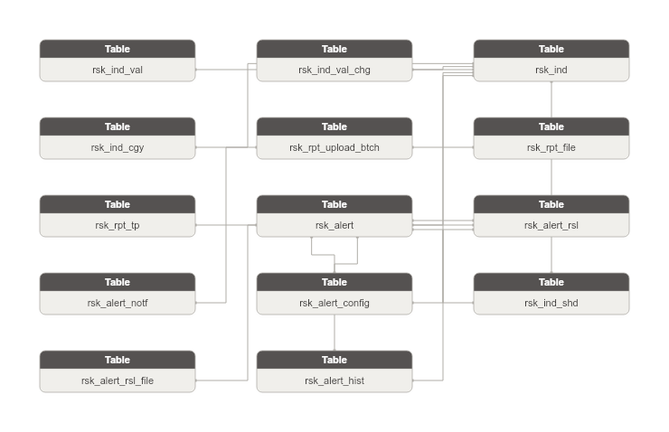

**Danh sách bảng:**

| STT | Tên bảng | Mô tả |
|---|---|---|
| 1 | rsk_alert_rsl | Bản ghi xử lý chi tiết cho cảnh báo rủi ro (giải trình hoặc không). Grain: 1 lần xử lý. Append-only. FK → Risk Alert. |
| 2 | rsk_rpt_upload_btch | Đợt upload file báo cáo rủi ro định kỳ. Grain: 1 đợt upload. FK → Risk Report Type. |
| 3 | rsk_alert_notf | Thông báo cảnh báo gửi từng kênh (Toast/Bell/Email) đến từng người nhận. Grain: 1 thông báo / 1 người. Append-only. FK → Risk Alert. |
| 4 | rsk_alert_config | Cấu hình ngưỡng và quy tắc kích hoạt cảnh báo cho từng chỉ tiêu rủi ro. Grain: 1 cấu hình / 1 chỉ tiêu. FK → Risk Indicator. |
| 5 | rsk_ind_shd | Cấu hình lịch chạy job đồng bộ chỉ tiêu rủi ro (frequency_type/cron_expression). Grain: 1-1 với Risk Indicator. FK → Risk Indicator. |
| 6 | rsk_alert_rsl_file | File đính kèm giải trình cho bản ghi xử lý cảnh báo. Grain: 1 file. FK → Risk Alert Resolution. |
| 7 | rsk_rpt_file | Metadata file đính kèm báo cáo rủi ro trong đợt upload. Grain: 1 file. FK → Risk Report Upload Batch. |
| 8 | rsk_rpt_tp | Danh mục loại báo cáo rủi ro (Báo cáo nhanh hàng tháng v.v.). Master entity có lifecycle. FK từ Risk Report Upload Batch. |
| 9 | rsk_alert | Bản ghi cảnh báo rủi ro phát sinh khi chỉ tiêu vượt ngưỡng cấu hình. Grain: 1 lần kích hoạt. Append-only. FK → Risk Alert Config + Risk Indicator. |
| 10 | rsk_alert_hist | Dòng thời gian sự kiện trong vòng đời cảnh báo (phát sinh / xử lý). Grain: 1 sự kiện nghiệp vụ. Append-only. FK → Risk Alert. |
| 11 | rsk_ind_val | Giá trị thực tế của chỉ tiêu rủi ro theo từng kỳ (ngày/tháng/quý/năm). Grain: chỉ tiêu × kỳ. Append-only. FK → Risk Indicator. |
| 12 | rsk_ind_val_chg | Lịch sử từng lần thay đổi giá trị chỉ tiêu (SYNC tự động / UPDATE thủ công). Grain: 1 lần thay đổi. Append-only. FK → Risk Indicator. |
| 13 | rsk_ind | Danh mục chỉ tiêu tài chính rủi ro — gộp chỉ tiêu hệ thống (risk_indicator) và tự tạo (risk_indicator_custom). Phân biệt bằng indicator_type_code. indicator_category_id nullable (chỉ tiêu tự tạo không có category). |
| 14 | rsk_ind_cgy | Nhóm phân loại chỉ tiêu tài chính rủi ro theo bộ (trong nước/quốc tế) và nhóm nghiệp vụ (vĩ mô/tiền tệ/thị trường CK). FK nguồn cho Risk Indicator. |

### Bảng rsk_alert_rsl

| STT | Tên trường | Kiểu dữ liệu và độ dài | Nullable | Unique | P/F Key | Mặc định | Mô tả |
|---|---|---|---|---|---|---|---|
| 1 | rsk_alert_rsl_id | STRING |  | X | P |  | Khóa đại diện cho bản ghi xử lý cảnh báo. |
| 2 | rsk_alert_rsl_code | STRING |  |  |  |  | Mã định danh bản ghi xử lý. BK. Map từ PK bảng nguồn. |
| 3 | src_stm_code | STRING |  |  |  | 'QLRR.risk_alert_resolution' | Mã hệ thống nguồn. |
| 4 | rsk_alert_id | STRING |  |  | F |  | FK đến cảnh báo liên quan. |
| 5 | rsk_alert_code | STRING |  |  |  |  | Mã cảnh báo liên quan. |
| 6 | rsl_tp_code | STRING |  |  |  |  | Loại xử lý cảnh báo: 1=Quick (không giải trình), 2=Detailed (có giải trình). |
| 7 | explanation_cntnt | STRING | X |  |  |  | Nội dung giải trình chi tiết (chỉ khi resolution_type=2). |
| 8 | rslv_at | TIMESTAMP |  |  |  |  | Thời điểm xử lý cảnh báo. |
| 9 | rslv_by_id | STRING |  |  |  |  | User ID người xử lý cảnh báo (denormalized). |
| 10 | rslv_by_nm | STRING |  |  |  |  | Tên người xử lý cảnh báo (denormalized). |

#### Constraint

**Khóa chính (Primary Key):**

| Tên trường |
|---|
| rsk_alert_rsl_id |

**Khóa phụ (Foreign Key):**

| Tên trường | Bảng tham chiếu | Cột tham chiếu |
|---|---|---|
| rsk_alert_id | rsk_alert | rsk_alert_id |

#### Index

N/A

#### Trigger

N/A

### Bảng rsk_rpt_upload_btch

| STT | Tên trường | Kiểu dữ liệu và độ dài | Nullable | Unique | P/F Key | Mặc định | Mô tả |
|---|---|---|---|---|---|---|---|
| 1 | rsk_rpt_upload_btch_id | STRING |  | X | P |  | Khóa đại diện cho đợt upload báo cáo. |
| 2 | rsk_rpt_upload_btch_code | STRING |  |  |  |  | Mã định danh đợt upload. BK. Map từ PK bảng nguồn. |
| 3 | src_stm_code | STRING |  |  |  | 'QLRR.risk_report_upload_batch' | Mã hệ thống nguồn. |
| 4 | rsk_rpt_tp_id | STRING |  |  | F |  | FK đến loại báo cáo. |
| 5 | rsk_rpt_tp_code | STRING |  |  |  |  | Mã loại báo cáo. |
| 6 | rpt_dt | DATE |  |  |  |  | Thời gian báo cáo (do người dùng chọn khi upload). |
| 7 | file_cnt | INT |  |  |  |  | Số lượng file trong đợt upload. |

#### Constraint

**Khóa chính (Primary Key):**

| Tên trường |
|---|
| rsk_rpt_upload_btch_id |

**Khóa phụ (Foreign Key):**

| Tên trường | Bảng tham chiếu | Cột tham chiếu |
|---|---|---|
| rsk_rpt_tp_id | rsk_rpt_tp | rsk_rpt_tp_id |

#### Index

N/A

#### Trigger

N/A

### Bảng rsk_alert_notf

| STT | Tên trường | Kiểu dữ liệu và độ dài | Nullable | Unique | P/F Key | Mặc định | Mô tả |
|---|---|---|---|---|---|---|---|
| 1 | rsk_alert_notf_id | STRING |  | X | P |  | Khóa đại diện cho bản ghi thông báo cảnh báo. |
| 2 | rsk_alert_notf_code | STRING |  |  |  |  | Mã định danh thông báo. BK. Map từ PK bảng nguồn. |
| 3 | src_stm_code | STRING |  |  |  | 'QLRR.risk_notification' | Mã hệ thống nguồn. |
| 4 | rsk_alert_id | STRING |  |  | F |  | FK đến cảnh báo liên quan. |
| 5 | rsk_alert_code | STRING |  |  |  |  | Mã cảnh báo liên quan. |
| 6 | notf_tp_code | STRING |  |  |  |  | Kênh thông báo: 1=Toast, 2=Bell, 3=Email. |
| 7 | rcpnt_usr_id | STRING | X |  |  |  | User ID người nhận thông báo (cho type=Toast/Bell, denormalized). |
| 8 | rcpnt_email | STRING | X |  |  |  | Địa chỉ email người nhận (cho type=Email). |
| 9 | snd_at | TIMESTAMP | X |  |  |  | Thời điểm gửi thông báo. |
| 10 | snd_st_code | STRING |  |  |  |  | Trạng thái gửi: 1=SENT, 2=FAILED. |
| 11 | snd_err | STRING | X |  |  |  | Thông tin lỗi khi gửi thông báo thất bại (nếu có). |
| 12 | rd_st_code | STRING |  |  |  |  | Trạng thái đọc: 0=Chưa đọc, 1=Đã đọc. |

#### Constraint

**Khóa chính (Primary Key):**

| Tên trường |
|---|
| rsk_alert_notf_id |

**Khóa phụ (Foreign Key):**

| Tên trường | Bảng tham chiếu | Cột tham chiếu |
|---|---|---|
| rsk_alert_id | rsk_alert | rsk_alert_id |

#### Index

N/A

#### Trigger

N/A

### Bảng rsk_alert_config

| STT | Tên trường | Kiểu dữ liệu và độ dài | Nullable | Unique | P/F Key | Mặc định | Mô tả |
|---|---|---|---|---|---|---|---|
| 1 | rsk_alert_config_id | STRING |  | X | P |  | Khóa đại diện cho cấu hình ngưỡng cảnh báo chỉ tiêu rủi ro. |
| 2 | rsk_alert_config_code | STRING |  |  |  |  | Mã định danh cấu hình cảnh báo. BK. Map từ PK bảng nguồn. |
| 3 | src_stm_code | STRING |  |  |  | 'QLRR.risk_alert_config' | Mã hệ thống nguồn. |
| 4 | rsk_ind_id | STRING |  |  | F |  | FK đến chỉ tiêu rủi ro (hệ thống hoặc tự tạo) sau gộp. |
| 5 | rsk_ind_code | STRING |  |  |  |  | Mã chỉ tiêu rủi ro. |
| 6 | thrs_drc_code | STRING |  |  |  |  | Chiều ngưỡng cảnh báo: 1=Tăng, 2=Giảm, 3=Tăng/Giảm. |
| 7 | thrs_unit_code | STRING | X |  |  |  | Đơn vị ngưỡng: 1=%, 2=Điểm, 3=Tỷ VND, 4=Triệu USD, 5=Hợp đồng, 6=Cổ phiếu, 7=Công ty, 8=VND, 9=Số tài khoản, 10=Đơn vị tính. |
| 8 | thrs_val | STRING |  |  |  |  | Giá trị ngưỡng kích hoạt cảnh báo. |
| 9 | cmpr_prd_cnt | INT | X |  |  |  | Số kỳ cần so sánh để đánh giá ngưỡng. |
| 10 | alert_msg_tpl | STRING | X |  |  |  | Nội dung mẫu thông báo cảnh báo. |
| 11 | handler_usr_id | STRING | X |  |  |  | User ID người xử lý chính (denormalized — không có User entity trên Atomic). |
| 12 | handler_usr_nm | STRING | X |  |  |  | Tên người xử lý chính (denormalized). |
| 13 | notf_bell_f | BOOLEAN |  |  |  |  | Hiển thị thông báo chuông: 0=Không, 1=Có. |
| 14 | notf_email_f | BOOLEAN |  |  |  |  | Gửi email cảnh báo: 0=Không, 1=Có. |
| 15 | notf_toast_f | BOOLEAN |  |  |  |  | Thông báo toast: 0=Không, 1=Có. |
| 16 | dspl_ordr | INT | X |  |  |  | Thứ tự hiển thị của cấu hình cảnh báo. |
| 17 | actv_f | BOOLEAN |  |  |  |  | Trạng thái: 0=Không hoạt động, 1=Đang hoạt động. |

#### Constraint

**Khóa chính (Primary Key):**

| Tên trường |
|---|
| rsk_alert_config_id |

**Khóa phụ (Foreign Key):**

| Tên trường | Bảng tham chiếu | Cột tham chiếu |
|---|---|---|
| rsk_ind_id | rsk_ind | rsk_ind_id |

#### Index

N/A

#### Trigger

N/A

### Bảng rsk_ind_shd

| STT | Tên trường | Kiểu dữ liệu và độ dài | Nullable | Unique | P/F Key | Mặc định | Mô tả |
|---|---|---|---|---|---|---|---|
| 1 | rsk_ind_shd_id | STRING |  | X | P |  | Khóa đại diện cho lịch đồng bộ chỉ tiêu rủi ro. |
| 2 | rsk_ind_shd_code | STRING |  |  |  |  | Mã định danh lịch đồng bộ. BK. Map từ PK bảng nguồn. |
| 3 | src_stm_code | STRING |  |  |  | 'QLRR.risk_indicator_schedule' | Mã hệ thống nguồn. |
| 4 | rsk_ind_id | STRING |  |  | F |  | FK đến chỉ tiêu rủi ro. |
| 5 | rsk_ind_code | STRING |  |  |  |  | Mã chỉ tiêu rủi ro. |
| 6 | frq_tp_code | STRING |  |  |  |  | Tần suất chạy job: 1=Giờ, 2=Ngày, 3=Tháng, 4=Quý, 5=Năm. |
| 7 | frq_val | INT | X |  |  |  | Mỗi bao nhiêu đơn vị (VD: mỗi 2 ngày). |
| 8 | strt_tm | TIMESTAMP | X |  |  |  | Ngày giờ bắt đầu chạy job. |
| 9 | nxt_run_tm | TIMESTAMP | X |  |  |  | Lịch chạy tiếp theo (auto-calculated). |
| 10 | last_run_tm | TIMESTAMP | X |  |  |  | Lần chạy gần nhất. |
| 11 | cron_expression | STRING | X |  |  |  | Quartz cron expression định nghĩa lịch chạy. |
| 12 | enabled_f | BOOLEAN |  |  |  |  | Trạng thái kích hoạt job: 0=Không hoạt động, 1=Hoạt động. |
| 13 | tot_run_cnt | INT | X |  |  |  | Số lần job đã chạy (thống kê tích lũy). |
| 14 | last_run_st_code | STRING | X |  |  |  | Kết quả lần chạy gần nhất: SUCCESS, FAILED. |
| 15 | last_err | STRING | X |  |  |  | Thông tin lỗi lần chạy gần nhất (nếu có). |

#### Constraint

**Khóa chính (Primary Key):**

| Tên trường |
|---|
| rsk_ind_shd_id |

**Khóa phụ (Foreign Key):**

| Tên trường | Bảng tham chiếu | Cột tham chiếu |
|---|---|---|
| rsk_ind_id | rsk_ind | rsk_ind_id |

#### Index

N/A

#### Trigger

N/A

### Bảng rsk_alert_rsl_file

| STT | Tên trường | Kiểu dữ liệu và độ dài | Nullable | Unique | P/F Key | Mặc định | Mô tả |
|---|---|---|---|---|---|---|---|
| 1 | rsk_alert_rsl_file_id | STRING |  | X | P |  | Khóa đại diện cho file đính kèm giải trình cảnh báo. |
| 2 | rsk_alert_rsl_file_code | STRING |  |  |  |  | Mã định danh file giải trình. BK. Map từ PK bảng nguồn. |
| 3 | src_stm_code | STRING |  |  |  | 'QLRR.risk_alert_resolution_file' | Mã hệ thống nguồn. |
| 4 | rsk_alert_rsl_id | STRING |  |  | F |  | FK đến bản ghi xử lý giải trình. |
| 5 | rsk_alert_rsl_code | STRING |  |  |  |  | Mã bản ghi xử lý giải trình. |
| 6 | file_nm | STRING |  |  |  |  | Tên file giải trình. |
| 7 | file_path | STRING |  |  |  |  | Đường dẫn lưu file giải trình trên hệ thống. |
| 8 | file_sz_bytes | INT | X |  |  |  | Dung lượng file tính bằng bytes. |
| 9 | file_tp_code | STRING | X |  |  |  | Loại file giải trình: PDF, DOCX, XLSX, PNG, JPG, … |
| 10 | uploaded_at | TIMESTAMP |  |  |  |  | Thời điểm upload file giải trình. |
| 11 | uploaded_by_id | STRING | X |  |  |  | User ID người upload file giải trình (denormalized). |

#### Constraint

**Khóa chính (Primary Key):**

| Tên trường |
|---|
| rsk_alert_rsl_file_id |

**Khóa phụ (Foreign Key):**

| Tên trường | Bảng tham chiếu | Cột tham chiếu |
|---|---|---|
| rsk_alert_rsl_id | rsk_alert_rsl | rsk_alert_rsl_id |

#### Index

N/A

#### Trigger

N/A

### Bảng rsk_rpt_file

| STT | Tên trường | Kiểu dữ liệu và độ dài | Nullable | Unique | P/F Key | Mặc định | Mô tả |
|---|---|---|---|---|---|---|---|
| 1 | rsk_rpt_file_id | STRING |  | X | P |  | Khóa đại diện cho file báo cáo đính kèm. |
| 2 | rsk_rpt_file_code | STRING |  |  |  |  | Mã định danh file báo cáo. BK. Map từ PK bảng nguồn. |
| 3 | src_stm_code | STRING |  |  |  | 'QLRR.risk_report_file' | Mã hệ thống nguồn. |
| 4 | rsk_rpt_upload_btch_id | STRING |  |  | F |  | FK đến đợt upload báo cáo. |
| 5 | rsk_rpt_upload_btch_code | STRING |  |  |  |  | Mã đợt upload báo cáo. |
| 6 | file_nm | STRING |  |  |  |  | Tên file hiển thị (VD: Báo cáo TTCK Q4-2025.docx). |
| 7 | file_path | STRING |  |  |  |  | Đường dẫn lưu file trên hệ thống (filesystem hoặc object storage). |
| 8 | file_sz_bytes | INT | X |  |  |  | Dung lượng file tính bằng bytes. |
| 9 | file_tp_code | STRING | X |  |  |  | Loại file: DOCX, XLSX, PDF, … |
| 10 | uploaded_at | TIMESTAMP |  |  |  |  | Thời điểm upload file. |
| 11 | uploaded_by_id | STRING | X |  |  |  | User ID người nộp file (denormalized). |

#### Constraint

**Khóa chính (Primary Key):**

| Tên trường |
|---|
| rsk_rpt_file_id |

**Khóa phụ (Foreign Key):**

| Tên trường | Bảng tham chiếu | Cột tham chiếu |
|---|---|---|
| rsk_rpt_upload_btch_id | rsk_rpt_upload_btch | rsk_rpt_upload_btch_id |

#### Index

N/A

#### Trigger

N/A

### Bảng rsk_rpt_tp

| STT | Tên trường | Kiểu dữ liệu và độ dài | Nullable | Unique | P/F Key | Mặc định | Mô tả |
|---|---|---|---|---|---|---|---|
| 1 | rsk_rpt_tp_id | STRING |  | X | P |  | Khóa đại diện cho loại báo cáo rủi ro. |
| 2 | rsk_rpt_tp_code | STRING |  |  |  |  | Mã loại báo cáo. BK. |
| 3 | src_stm_code | STRING |  |  |  | 'QLRR.risk_report_type' | Mã hệ thống nguồn. |
| 4 | rpt_tp_nm | STRING |  |  |  |  | Tên loại báo cáo. |
| 5 | dsc | STRING | X |  |  |  | Mô tả loại báo cáo. |
| 6 | dspl_ordr | INT | X |  |  |  | Thứ tự hiển thị. |
| 7 | actv_f | BOOLEAN |  |  |  |  | Trạng thái: 0=Không hoạt động, 1=Hoạt động. |

#### Constraint

**Khóa chính (Primary Key):**

| Tên trường |
|---|
| rsk_rpt_tp_id |

**Khóa phụ (Foreign Key):**

*Không có Foreign Key.*

#### Index

N/A

#### Trigger

N/A

### Bảng rsk_alert

| STT | Tên trường | Kiểu dữ liệu và độ dài | Nullable | Unique | P/F Key | Mặc định | Mô tả |
|---|---|---|---|---|---|---|---|
| 1 | rsk_alert_id | STRING |  | X | P |  | Khóa đại diện cho bản ghi cảnh báo rủi ro. |
| 2 | rsk_alert_code | STRING |  |  |  |  | Mã định danh cảnh báo. BK. Map từ PK bảng nguồn. |
| 3 | src_stm_code | STRING |  |  |  | 'QLRR.risk_alert' | Mã hệ thống nguồn. |
| 4 | rsk_alert_config_id | STRING |  |  | F |  | FK đến cấu hình ngưỡng cảnh báo. |
| 5 | rsk_alert_config_code | STRING |  |  |  |  | Mã cấu hình cảnh báo. |
| 6 | rsk_ind_id | STRING |  |  | F |  | FK đến chỉ tiêu rủi ro (hệ thống lẫn tự tạo sau gộp). |
| 7 | rsk_ind_code | STRING |  |  |  |  | Mã chỉ tiêu rủi ro. |
| 8 | prd_dt | DATE |  |  |  |  | Kỳ dữ liệu bị cảnh báo. |
| 9 | crn_val | STRING |  |  |  |  | Giá trị chỉ tiêu tại kỳ bị cảnh báo. |
| 10 | prev_val | STRING | X |  |  |  | Giá trị kỳ trước (dùng để hiển thị, null nếu không xác định). |
| 11 | chg_amt | STRING | X |  |  |  | Giá trị chênh lệch tuyệt đối. |
| 12 | chg_pct | STRING | X |  |  |  | Chênh lệch phần trăm. |
| 13 | thrs_drc_code | STRING |  |  |  |  | Chiều ngưỡng tại thời điểm phát cảnh báo: 1=Tăng, 2=Giảm, 3=Tăng/Giảm. |
| 14 | thrs_unit_code | STRING | X |  |  |  | Đơn vị ngưỡng tại thời điểm phát cảnh báo: 1=%, 2=Điểm, … |
| 15 | thrs_val | STRING |  |  |  |  | Giá trị ngưỡng tại thời điểm phát cảnh báo. |
| 16 | cmpr_prd_cnt | INT | X |  |  |  | Số kỳ so sánh tại thời điểm phát cảnh báo. |
| 17 | alert_msg | STRING | X |  |  |  | Nội dung thông báo cảnh báo (đã render từ template). |
| 18 | triggered_at | TIMESTAMP |  |  |  |  | Thời điểm phát sinh cảnh báo. |
| 19 | triggered_by_shd_id | STRING | X |  | F |  | FK đến lịch đồng bộ đã kích hoạt cảnh báo. Nullable khi alert thủ công. |
| 20 | triggered_by_shd_code | STRING | X |  |  |  | Mã lịch đồng bộ đã kích hoạt cảnh báo. |
| 21 | handler_usr_id | STRING | X |  |  |  | User ID người được giao xử lý cảnh báo (denormalized). |
| 22 | handler_usr_nm | STRING | X |  |  |  | Tên người được giao xử lý cảnh báo (denormalized). |
| 23 | alert_st_code | STRING |  |  |  |  | Trạng thái cảnh báo: 0=Chưa xử lý, 1=Đang xử lý, 2=Đã xử lý, 3=Đã huỷ/Đã bỏ qua. |
| 24 | asgn_at | TIMESTAMP | X |  |  |  | Thời điểm phân công xử lý cảnh báo. |

#### Constraint

**Khóa chính (Primary Key):**

| Tên trường |
|---|
| rsk_alert_id |

**Khóa phụ (Foreign Key):**

| Tên trường | Bảng tham chiếu | Cột tham chiếu |
|---|---|---|
| rsk_alert_config_id | rsk_alert_config | rsk_alert_config_id |
| rsk_ind_id | rsk_ind | rsk_ind_id |
| triggered_by_shd_id | rsk_ind_shd | rsk_ind_shd_id |

#### Index

N/A

#### Trigger

N/A

### Bảng rsk_alert_hist

| STT | Tên trường | Kiểu dữ liệu và độ dài | Nullable | Unique | P/F Key | Mặc định | Mô tả |
|---|---|---|---|---|---|---|---|
| 1 | rsk_alert_hist_id | STRING |  | X | P |  | Khóa đại diện cho bản ghi lịch sử sự kiện cảnh báo. |
| 2 | rsk_alert_hist_code | STRING |  |  |  |  | Mã định danh bản ghi lịch sử. BK. Map từ PK bảng nguồn. |
| 3 | src_stm_code | STRING |  |  |  | 'QLRR.risk_alert_history' | Mã hệ thống nguồn. |
| 4 | rsk_alert_id | STRING |  |  | F |  | FK đến cảnh báo liên quan. |
| 5 | rsk_alert_code | STRING |  |  |  |  | Mã cảnh báo liên quan. |
| 6 | rsk_alert_rsl_id | STRING | X |  | F |  | FK đến bản ghi xử lý liên quan. Nullable — event_type=1 (phát sinh cảnh báo) chưa có resolution. |
| 7 | rsk_alert_rsl_code | STRING | X |  |  |  | Mã bản ghi xử lý liên quan. |
| 8 | ev_tp_code | STRING |  |  |  |  | Loại sự kiện: 1=Xảy ra cảnh báo, 2=Xử lý không giải trình, 3=Xử lý có giải trình. |
| 9 | ev_tm | TIMESTAMP |  |  |  |  | Thời gian xảy ra sự kiện trong vòng đời cảnh báo. |
| 10 | ev_ttl | STRING | X |  |  |  | Tiêu đề sự kiện. |
| 11 | ev_dsc | STRING | X |  |  |  | Mô tả chi tiết sự kiện. |
| 12 | ev_usr_id | STRING | X |  |  |  | User ID người thực hiện sự kiện (denormalized). |
| 13 | ev_usr_nm | STRING | X |  |  |  | Tên người thực hiện sự kiện (denormalized). |

#### Constraint

**Khóa chính (Primary Key):**

| Tên trường |
|---|
| rsk_alert_hist_id |

**Khóa phụ (Foreign Key):**

| Tên trường | Bảng tham chiếu | Cột tham chiếu |
|---|---|---|
| rsk_alert_id | rsk_alert | rsk_alert_id |
| rsk_alert_rsl_id | rsk_alert_rsl | rsk_alert_rsl_id |

#### Index

N/A

#### Trigger

N/A

### Bảng rsk_ind_val

| STT | Tên trường | Kiểu dữ liệu và độ dài | Nullable | Unique | P/F Key | Mặc định | Mô tả |
|---|---|---|---|---|---|---|---|
| 1 | rsk_ind_val_id | STRING |  | X | P |  | Khóa đại diện cho giá trị chỉ tiêu rủi ro theo kỳ. |
| 2 | rsk_ind_val_code | STRING |  |  |  |  | Mã định danh giá trị chỉ tiêu. BK. Map từ PK bảng nguồn. |
| 3 | src_stm_code | STRING |  |  |  | 'QLRR.risk_indicator_value' | Mã hệ thống nguồn. |
| 4 | rsk_ind_id | STRING |  |  | F |  | FK đến chỉ tiêu rủi ro (hệ thống lẫn tự tạo — QLRR-P01 confirmed). |
| 5 | rsk_ind_code | STRING |  |  |  |  | Mã chỉ tiêu rủi ro. |
| 6 | prd_tp_code | STRING |  |  |  |  | Kỳ dữ liệu: 1=Ngày, 2=Tháng, 3=Quý, 4=Năm. |
| 7 | prd_val | INT | X |  |  |  | Số thứ tự kỳ trong năm. VD: period_type=Tháng, period_date=12/03/2026 → period_value=3; period_type=Quý, period_date=12/03/2026 → period_value=1. |
| 8 | prd_yr | INT |  |  |  |  | Năm của kỳ dữ liệu. |
| 9 | prd_dt | DATE |  |  |  |  | Ngày đại diện cho kỳ dữ liệu. |
| 10 | prd_lbl | STRING | X |  |  |  | Chuỗi hiển thị kỳ (VD: 2024-01, 2024-Q1, 2024). |
| 11 | val | STRING |  |  |  |  | Giá trị chỉ tiêu tại kỳ này. |
| 12 | unit_code | STRING | X |  |  |  | Đơn vị đo lường: 1=%, 2=Điểm, 3=Tỷ VND, 4=Triệu USD, 5=Hợp đồng, 6=Cổ phiếu, 7=Công ty, 8=VND, 9=Số tài khoản, 10=Đơn vị tính. |
| 13 | data_src_code | STRING | X |  |  |  | Nguồn dữ liệu: 1=Investing, 2=Tổng cục Thống kê, 3=Ngân hàng Nhà nước, 4=Nội bộ, 5=HNX, 6=VSDC. |
| 14 | data_orig_code | STRING |  |  |  |  | Nguồn gốc giá trị: 1=API CSDL tập trung, 2=User chỉnh sửa. |
| 15 | cmlv_val | STRING | X |  |  |  | Giá trị luỹ kế. [QLRR-P02 Open]: cơ sở luỹ kế chưa xác định (từ đầu năm hay từ đầu kỳ). |

#### Constraint

**Khóa chính (Primary Key):**

| Tên trường |
|---|
| rsk_ind_val_id |

**Khóa phụ (Foreign Key):**

| Tên trường | Bảng tham chiếu | Cột tham chiếu |
|---|---|---|
| rsk_ind_id | rsk_ind | rsk_ind_id |

#### Index

N/A

#### Trigger

N/A

### Bảng rsk_ind_val_chg

| STT | Tên trường | Kiểu dữ liệu và độ dài | Nullable | Unique | P/F Key | Mặc định | Mô tả |
|---|---|---|---|---|---|---|---|
| 1 | rsk_ind_val_chg_id | STRING |  | X | P |  | Khóa đại diện cho bản ghi thay đổi giá trị chỉ tiêu. |
| 2 | rsk_ind_val_chg_code | STRING |  |  |  |  | Mã định danh bản ghi thay đổi. BK. Map từ PK bảng nguồn. |
| 3 | src_stm_code | STRING |  |  |  | 'QLRR.risk_indicator_value_history' | Mã hệ thống nguồn. |
| 4 | rsk_ind_id | STRING |  |  | F |  | FK đến chỉ tiêu rủi ro. |
| 5 | rsk_ind_code | STRING |  |  |  |  | Mã chỉ tiêu rủi ro. |
| 6 | old_val | STRING | X |  |  |  | Giá trị cũ trước thay đổi (null nếu là lần tạo mới). |
| 7 | new_val | STRING | X |  |  |  | Giá trị mới sau thay đổi (null nếu là xóa). |
| 8 | unit_code | STRING | X |  |  |  | Đơn vị đo lường tại thời điểm thay đổi: 1=%, 2=Điểm, 3=Tỷ VND, … |
| 9 | data_src_code | STRING | X |  |  |  | Nguồn dữ liệu sau thay đổi: 1=Investing, 2=Tổng cục Thống kê, 3=Ngân hàng Nhà nước, 4=Nội bộ, 5=HNX, 6=VSDC. |
| 10 | data_orig_code | STRING |  |  |  |  | Nguồn gốc dữ liệu sau thay đổi: 1=API CSDL tập trung, 2=User chỉnh sửa. |
| 11 | chg_tp_code | STRING |  |  |  |  | Loại thay đổi: SYNC=đồng bộ tự động, UPDATE=chỉnh sửa thủ công. |
| 12 | chg_by_id | STRING | X |  |  |  | User ID người thực hiện thay đổi (denormalized). |
| 13 | chg_by_nm | STRING | X |  |  |  | Tên người thực hiện thay đổi (denormalized). |
| 14 | chg_at | TIMESTAMP |  |  |  |  | Thời điểm ghi nhận thay đổi. |

#### Constraint

**Khóa chính (Primary Key):**

| Tên trường |
|---|
| rsk_ind_val_chg_id |

**Khóa phụ (Foreign Key):**

| Tên trường | Bảng tham chiếu | Cột tham chiếu |
|---|---|---|
| rsk_ind_id | rsk_ind | rsk_ind_id |

#### Index

N/A

#### Trigger

N/A

### Bảng rsk_ind

#### Từ QLRR.risk_indicator

| STT | Tên trường | Kiểu dữ liệu và độ dài | Nullable | Unique | P/F Key | Mặc định | Mô tả |
|---|---|---|---|---|---|---|---|
| 1 | rsk_ind_id | STRING |  | X | P |  | Khóa đại diện cho chỉ tiêu rủi ro (hệ thống hoặc tự tạo). |
| 2 | rsk_ind_code | STRING |  |  |  |  | Mã định danh duy nhất của chỉ tiêu. BK. Hệ thống: map từ risk_indicator.id; Tự tạo: map từ risk_indicator_custom.id với prefix 'CUS_'. |
| 3 | src_stm_code | STRING |  |  |  | 'QLRR.risk_indicator' | Mã hệ thống nguồn. |
| 4 | ind_tp_code | STRING |  |  |  |  | Phân loại chỉ tiêu sau gộp: 1=Hệ thống (risk_indicator), 2=Tự tạo (risk_indicator_custom). |
| 5 | ind_nm | STRING |  |  |  |  | Tên chỉ tiêu (VD: GDP, CPI, Chỉ số VNIndex, Lạm phát Mỹ). |
| 6 | ind_set_code | STRING | X |  |  |  | Bộ chỉ tiêu: 1=Trong nước, 2=Quốc tế. Chỉ áp dụng cho chỉ tiêu hệ thống. |
| 7 | bsn_key | STRING | X |  |  |  | Mã nghiệp vụ chỉ tiêu hệ thống (VD: GDP_VN, CPI_VN). Chỉ có ở chỉ tiêu hệ thống. |
| 8 | rsk_ind_cgy_id | STRING | X |  | F |  | FK đến nhóm chỉ tiêu rủi ro. |
| 9 | rsk_ind_cgy_code | STRING | X |  |  |  | Mã nhóm chỉ tiêu rủi ro. |
| 10 | unit_code | STRING | X |  |  |  | Đơn vị mặc định: 1=%, 2=Điểm, 3=Tỷ VND, 4=Triệu USD, 5=Hợp đồng, 6=Cổ phiếu, 7=Công ty, 8=VND, 9=Số tài khoản, 10=Đơn vị tính. |
| 11 | data_src_code | STRING | X |  |  |  | Nguồn dữ liệu mặc định: 1=Investing, 2=Tổng cục Thống kê, 3=Ngân hàng Nhà nước, 4=Nội bộ, 5=HNX, 6=VSDC. |
| 12 | prd_tp_code | STRING | X |  |  |  | Tần suất chỉ tiêu: 1=Ngày, 2=Tháng, 3=Quý, 4=Năm. |
| 13 | last_sync_tm | TIMESTAMP | X |  |  |  | Thời điểm đồng bộ dữ liệu gần nhất. Chỉ áp dụng cho chỉ tiêu hệ thống. |
| 14 | dspl_ordr | INT | X |  |  |  | Thứ tự hiển thị của chỉ tiêu trên màn hình. |
| 15 | dspl_f | BOOLEAN | X |  |  |  | Có hiển thị trên màn hình không: 0=Không, 1=Có. Chỉ áp dụng cho chỉ tiêu hệ thống. |
| 16 | actv_f | BOOLEAN |  |  |  |  | Trạng thái hoạt động: 0=Không hoạt động, 1=Hoạt động. |

**Khóa chính (Primary Key):**

| Tên trường |
|---|
| rsk_ind_id |

**Khóa phụ (Foreign Key):**

| Tên trường | Bảng tham chiếu | Cột tham chiếu |
|---|---|---|
| rsk_ind_cgy_id | rsk_ind_cgy | rsk_ind_cgy_id |

**Index:** N/A

**Trigger:** N/A

#### Từ QLRR.risk_indicator_custom

| STT | Tên trường | Kiểu dữ liệu và độ dài | Nullable | Unique | P/F Key | Mặc định | Mô tả |
|---|---|---|---|---|---|---|---|
| 1 | rsk_ind_id | STRING |  | X | P |  | Khóa đại diện cho chỉ tiêu rủi ro (hệ thống hoặc tự tạo). |
| 2 | rsk_ind_code | STRING |  |  |  |  | Mã định danh duy nhất của chỉ tiêu. BK. Hệ thống: map từ risk_indicator.id; Tự tạo: map từ risk_indicator_custom.id với prefix 'CUS_'. |
| 3 | src_stm_code | STRING |  |  |  | 'QLRR.risk_indicator_custom' | Mã hệ thống nguồn. |
| 4 | ind_tp_code | STRING |  |  |  |  | Phân loại chỉ tiêu sau gộp: 1=Hệ thống (risk_indicator), 2=Tự tạo (risk_indicator_custom). |
| 5 | ind_nm | STRING |  |  |  |  | Tên chỉ tiêu (VD: GDP, CPI, Chỉ số VNIndex, Lạm phát Mỹ). |
| 6 | ind_set_code | STRING | X |  |  |  | Bộ chỉ tiêu: 1=Trong nước, 2=Quốc tế. Chỉ áp dụng cho chỉ tiêu hệ thống. |
| 7 | bsn_key | STRING | X |  |  |  | Mã nghiệp vụ chỉ tiêu hệ thống (VD: GDP_VN, CPI_VN). Chỉ có ở chỉ tiêu hệ thống. |
| 8 | rsk_ind_cgy_id | STRING | X |  | F |  | FK đến nhóm chỉ tiêu rủi ro. |
| 9 | rsk_ind_cgy_code | STRING | X |  |  |  | Mã nhóm chỉ tiêu rủi ro. |
| 10 | unit_code | STRING | X |  |  |  | Đơn vị mặc định: 1=%, 2=Điểm, 3=Tỷ VND, 4=Triệu USD, 5=Hợp đồng, 6=Cổ phiếu, 7=Công ty, 8=VND, 9=Số tài khoản, 10=Đơn vị tính. |
| 11 | data_src_code | STRING | X |  |  |  | Nguồn dữ liệu mặc định: 1=Investing, 2=Tổng cục Thống kê, 3=Ngân hàng Nhà nước, 4=Nội bộ, 5=HNX, 6=VSDC. |
| 12 | prd_tp_code | STRING | X |  |  |  | Tần suất chỉ tiêu: 1=Ngày, 2=Tháng, 3=Quý, 4=Năm. |
| 13 | last_sync_tm | TIMESTAMP | X |  |  |  | Thời điểm đồng bộ dữ liệu gần nhất. Chỉ áp dụng cho chỉ tiêu hệ thống. |
| 14 | dspl_ordr | INT | X |  |  |  | Thứ tự hiển thị của chỉ tiêu trên màn hình. |
| 15 | dspl_f | BOOLEAN | X |  |  |  | Có hiển thị trên màn hình không: 0=Không, 1=Có. Chỉ áp dụng cho chỉ tiêu hệ thống. |
| 16 | actv_f | BOOLEAN |  |  |  |  | Trạng thái hoạt động: 0=Không hoạt động, 1=Hoạt động. |

**Khóa chính (Primary Key):**

| Tên trường |
|---|
| rsk_ind_id |

**Khóa phụ (Foreign Key):**

| Tên trường | Bảng tham chiếu | Cột tham chiếu |
|---|---|---|
| rsk_ind_cgy_id | rsk_ind_cgy | rsk_ind_cgy_id |

**Index:** N/A

**Trigger:** N/A

### Bảng rsk_ind_cgy

| STT | Tên trường | Kiểu dữ liệu và độ dài | Nullable | Unique | P/F Key | Mặc định | Mô tả |
|---|---|---|---|---|---|---|---|
| 1 | rsk_ind_cgy_id | STRING |  | X | P |  | Khóa đại diện cho nhóm chỉ tiêu rủi ro. |
| 2 | rsk_ind_cgy_code | STRING |  |  |  |  | Mã nhóm chỉ tiêu (VD: MACRO, MONETARY, STOCK_MARKET). BK. |
| 3 | src_stm_code | STRING |  |  |  | 'QLRR.risk_indicator_category' | Mã hệ thống nguồn. |
| 4 | ind_set_code | STRING |  |  |  |  | Bộ chỉ tiêu: 1=Trong nước, 2=Quốc tế. Attribute bổ sung — không phân biệt entity. |
| 5 | cgy_nm | STRING |  |  |  |  | Tên nhóm chỉ tiêu (VD: Yếu tố vĩ mô). |
| 6 | actv_f | BOOLEAN |  |  |  |  | Trạng thái hoạt động: 0=Không hoạt động, 1=Hoạt động. |

#### Constraint

**Khóa chính (Primary Key):**

| Tên trường |
|---|
| rsk_ind_cgy_id |

**Khóa phụ (Foreign Key):**

*Không có Foreign Key.*

#### Index

N/A

#### Trigger

N/A

### Stored Procedure/Function

N/A

### Package

N/A

## SCMS — Phần hệ quản lý giám sát công ty chứng khoán

### Các mô hình quan hệ dữ liệu

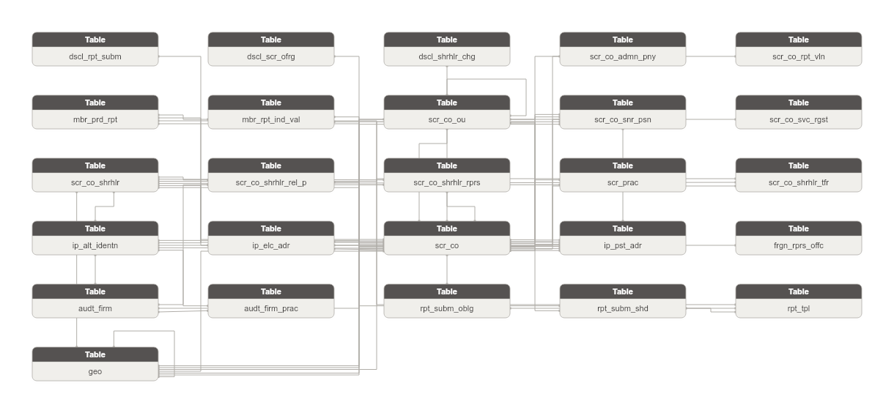

**Danh sách bảng:**

| STT | Tên bảng | Mô tả |
|---|---|---|
| 1 | dscl_rpt_subm | Báo cáo công bố thông tin do CTCK nộp lên UBCKNN theo yêu cầu minh bạch thị trường. |
| 2 | dscl_scr_ofrg | Thông tin chào bán chứng khoán được công bố bởi CTCK. Ghi nhận loại chứng khoán và điều kiện chào bán. |
| 3 | dscl_shrhlr_chg | Thông tin thay đổi cổ đông được công bố bởi CTCK. Ghi nhận cổ đông và tỷ lệ sở hữu thay đổi. |
| 4 | scr_co_admn_pny | Quyết định xử lý hành chính đối với CTCK. Ghi nhận hành vi vi phạm và quyết định xử phạt. |
| 5 | scr_co_rpt_vln | Vi phạm nộp báo cáo định kỳ của CTCK. Ghi nhận loại vi phạm và thông tin xử lý. |
| 6 | mbr_prd_rpt | Báo cáo định kỳ do thành viên thị trường nộp lên UBCKNN theo từng kỳ báo cáo. Ghi nhận trạng thái nộp và thời hạn. |
| 7 | rpt_subm_oblg | Nghĩa vụ gửi báo cáo của từng CTCK theo định kỳ cụ thể. Xác định đơn vị nào phải nộp biểu mẫu nào theo lịch nào. |
| 8 | rpt_subm_shd | Lịch định kỳ gửi báo cáo theo biểu mẫu (hàng ngày/tuần/tháng/quý/năm). Xác định tần suất nghĩa vụ nộp báo cáo. |
| 9 | mbr_rpt_ind_val | Giá trị từng chỉ tiêu trong một lần nộp báo cáo định kỳ. Grain = 1 giá trị cell-level (submission x template_indicator x row). FK đến Member Periodic Report. |
| 10 | rpt_tpl | Biểu mẫu báo cáo đầu vào - khuôn mẫu tờ khai định kỳ mà thành viên thị trường phải nộp theo quy định. |
| 11 | audt_firm | Công ty kiểm toán được UBCKNN chấp thuận. Ghi nhận thông tin pháp lý và trạng thái hoạt động. |
| 12 | audt_firm_prac | Kiểm toán viên thuộc công ty kiểm toán. Ghi nhận chứng chỉ kiểm toán và trạng thái hành nghề. |
| 13 | frgn_rprs_offc | Văn phòng đại diện của công ty chứng khoán nước ngoài tại Việt Nam. Pháp nhân độc lập, không FK đến CTCK trong nước. |
| 14 | scr_co | Công ty chứng khoán - thành viên thị trường trong hệ thống FIMS. Quản lý tài khoản và danh mục NĐT nước ngoài. |
| 15 | scr_co_ou | Đơn vị trực thuộc CTCK: chi nhánh, văn phòng đại diện, phòng giao dịch. Cấu trúc self-join qua parent_org_unit_id. |
| 16 | scr_co_snr_psn | Nhân sự cao cấp của CTCK (Chủ tịch HĐQT, Tổng Giám đốc, Kế toán trưởng...). Ghi nhận chức vụ và thời gian đảm nhận. |
| 17 | scr_co_svc_rgst | Đăng ký dịch vụ của CTCK tại UBCKNN. Grain: 1 dòng = 1 dịch vụ x 1 CTCK. Ghi nhận loại dịch vụ — số văn bản và ngày đăng ký/kết thúc — trạng thái hiệu lực. |
| 18 | scr_co_shrhlr | Cổ đông của CTCK - cá nhân hoặc tổ chức. Ghi nhận tỷ lệ sở hữu và số lượng cổ phần. |
| 19 | scr_co_shrhlr_rel_p | Người có quan hệ gia đình hoặc công tác với cổ đông của CTCK. Ghi nhận loại quan hệ và nơi làm việc. |
| 20 | scr_co_shrhlr_rprs | Người đại diện được ủy quyền bởi cổ đông của CTCK. Ghi nhận chức vụ và số lượng cổ phần đại diện. |
| 21 | scr_prac | Người hành nghề chứng khoán được UBCKNN cấp phép. Ghi nhận thông tin cá nhân và trạng thái hành nghề. Attribute chi tiết (BirthDate full |
| 22 | geo | Đơn vị địa lý dùng làm FK tham chiếu: quốc gia/quốc tịch (COUNTRY), vùng/miền (REGION), tỉnh/thành phố mới/cũ (PROVINCE/PROVINCE_OLD), quận/huyện cũ (DISTRICT_OLD), phường/xã mới/cũ (WARD/WARD_OLD). Phân biệt bằng geographic_area_type_code. Hỗ trợ song song bộ danh mục pre- và post-sáp nhập hành chính 2025. |
| 23 | scr_co_shrhlr_tfr | Giao dịch chuyển nhượng cổ phần giữa hai cổ đông của CTCK. Ghi nhận bên chuyển/nhận, số lượng và tỷ lệ chuyển nhượng. |
| 24 | ip_alt_identn | Lưu trữ các giấy tờ định danh thay thế của Involved Party (CMND/CCCD/Hộ chiếu/Giấy phép kinh doanh/Chứng chỉ hành nghề). Mỗi dòng = 1 loại giấy tờ từ 1 nguồn. |
| 25 | ip_elc_adr | Lưu trữ các địa chỉ liên lạc điện tử của Involved Party (điện thoại/fax/email). Mỗi dòng = 1 kênh liên lạc từ 1 nguồn. |
| 26 | ip_pst_adr | Lưu trữ các địa chỉ bưu chính của Involved Party (trụ sở/kinh doanh/thường trú/nơi ở hiện tại). Mỗi dòng = 1 loại địa chỉ từ 1 nguồn. |

### Bảng dscl_rpt_subm

| STT | Tên trường | Kiểu dữ liệu và độ dài | Nullable | Unique | P/F Key | Mặc định | Mô tả |
|---|---|---|---|---|---|---|---|
| 1 | dscl_rpt_subm_id | STRING |  | X | P |  | Khóa đại diện cho lần công bố thông tin báo cáo. |
| 2 | dscl_rpt_subm_code | STRING |  |  |  |  | Mã định danh (tự động tăng). BK. |
| 3 | src_stm_code | STRING |  |  |  | 'SCMS.CBTT_BAO_CAO' | Mã nguồn dữ liệu. |
| 4 | scr_co_id | STRING |  |  | F |  | FK đến công ty chứng khoán công bố. |
| 5 | scr_co_code | STRING |  |  |  |  | Mã công ty chứng khoán. |
| 6 | dscl_mth_code | STRING | X |  |  |  | Kiểu công bố thông tin. |
| 7 | dscl_tp_code | STRING | X |  |  |  | Loại công bố thông tin. |
| 8 | rpt_prd_code | STRING | X |  |  |  | Kỳ báo cáo. |
| 9 | rpt_yr | INT | X |  |  |  | Năm báo cáo. |
| 10 | ttl | STRING | X |  |  |  | Tiêu đề thông tin công bố. |
| 11 | dsc | STRING | X |  |  |  | Mô tả nội dung. |
| 12 | smy | STRING | X |  |  |  | Nội dung trích yếu. |
| 13 | disclosing_psn_nm | STRING | X |  |  |  | Người công bố thông tin. |
| 14 | dscl_dt | DATE | X |  |  |  | Ngày công bố thông tin. |
| 15 | subm_dt | DATE | X |  |  |  | Ngày gửi lên hệ thống. |
| 16 | attch_file | STRING | X |  |  |  | Tệp đính kèm. |
| 17 | err_dsc | STRING | X |  |  |  | Mô tả lỗi (nếu có). |
| 18 | dscl_st_code | STRING | X |  |  |  | Trạng thái công bố thông tin. |
| 19 | crt_tms | TIMESTAMP | X |  |  |  | Ngày tạo. |

#### Constraint

**Khóa chính (Primary Key):**

| Tên trường |
|---|
| dscl_rpt_subm_id |

**Khóa phụ (Foreign Key):**

| Tên trường | Bảng tham chiếu | Cột tham chiếu |
|---|---|---|
| scr_co_id | scr_co | scr_co_id |

#### Index

N/A

#### Trigger

N/A

### Bảng dscl_scr_ofrg

| STT | Tên trường | Kiểu dữ liệu và độ dài | Nullable | Unique | P/F Key | Mặc định | Mô tả |
|---|---|---|---|---|---|---|---|
| 1 | dscl_scr_ofrg_id | STRING |  | X | P |  | Khóa đại diện cho đợt chào bán chứng khoán được công bố. |
| 2 | dscl_scr_ofrg_code | STRING |  |  |  |  | Mã định danh (tự động tăng). BK. |
| 3 | src_stm_code | STRING |  |  |  | 'SCMS.CBTT_CHAO_BAN_CHUNG_KHOAN' | Mã nguồn dữ liệu. |
| 4 | scr_co_id | STRING |  |  | F |  | FK đến công ty chứng khoán chào bán. |
| 5 | scr_co_code | STRING |  |  |  |  | Mã công ty chứng khoán. |
| 6 | doc_nbr | STRING | X |  |  |  | Số văn bản. |
| 7 | doc_dt | DATE | X |  |  |  | Ngày văn bản. |
| 8 | eff_dt | DATE | X |  |  |  | Ngày hợp lệ hồ sơ. |
| 9 | ofrg_strt_dt | DATE | X |  |  |  | Ngày bắt đầu chào bán. |
| 10 | ofrg_end_dt | DATE | X |  |  |  | Ngày kết thúc chào bán. |
| 11 | ofrg_form_code | STRING | X |  |  |  | Hình thức chào bán. |
| 12 | trgt_ivsr_nm | STRING | X |  |  |  | Đối tượng chào bán. |
| 13 | ofrg_vol | DECIMAL(23,2) | X |  |  |  | Khối lượng chào bán. |
| 14 | ofrg_val | DECIMAL(23,2) | X |  |  |  | Giá trị chào bán. |
| 15 | note | STRING | X |  |  |  | Ghi chú. |
| 16 | disclosing_psn_nm | STRING | X |  |  |  | Người công bố thông tin. |
| 17 | dscl_dt | DATE | X |  |  |  | Ngày công bố thông tin. |
| 18 | subm_dt | DATE | X |  |  |  | Ngày gửi lên hệ thống. |
| 19 | attch_file | STRING | X |  |  |  | Tệp đính kèm. |
| 20 | err_dsc | STRING | X |  |  |  | Mô tả lỗi. |
| 21 | dscl_st_code | STRING | X |  |  |  | Trạng thái công bố. |
| 22 | crt_tms | TIMESTAMP | X |  |  |  | Ngày tạo. |
| 23 | udt_tms | TIMESTAMP | X |  |  |  | Ngày cập nhật. |

#### Constraint

**Khóa chính (Primary Key):**

| Tên trường |
|---|
| dscl_scr_ofrg_id |

**Khóa phụ (Foreign Key):**

| Tên trường | Bảng tham chiếu | Cột tham chiếu |
|---|---|---|
| scr_co_id | scr_co | scr_co_id |

#### Index

N/A

#### Trigger

N/A

### Bảng dscl_shrhlr_chg

| STT | Tên trường | Kiểu dữ liệu và độ dài | Nullable | Unique | P/F Key | Mặc định | Mô tả |
|---|---|---|---|---|---|---|---|
| 1 | dscl_shrhlr_chg_id | STRING |  | X | P |  | Khóa đại diện cho thông tin cổ đông được công bố. |
| 2 | dscl_shrhlr_chg_code | STRING |  |  |  |  | Mã định danh (tự động tăng). BK. |
| 3 | src_stm_code | STRING |  |  |  | 'SCMS.CBTT_CO_DONG' | Mã nguồn dữ liệu. |
| 4 | scr_co_id | STRING |  |  | F |  | FK đến công ty chứng khoán công bố. |
| 5 | scr_co_code | STRING |  |  |  |  | Mã công ty chứng khoán. |
| 6 | txn_tp_code | STRING | X |  | F |  | Loại giao dịch cổ đông. |
| 7 | dscl_dt | DATE | X |  |  |  | Ngày công bố thông tin. |
| 8 | cntnt | STRING | X |  |  |  | Nội dung công bố. |
| 9 | attch_file | STRING | X |  |  |  | Tệp đính kèm. |
| 10 | dscl_st_code | STRING | X |  |  |  | Trạng thái công bố. |
| 11 | crt_tms | TIMESTAMP | X |  |  |  | Ngày tạo. |

#### Constraint

**Khóa chính (Primary Key):**

| Tên trường |
|---|
| dscl_shrhlr_chg_id |

**Khóa phụ (Foreign Key):**

| Tên trường | Bảng tham chiếu | Cột tham chiếu |
|---|---|---|
| scr_co_id | scr_co | scr_co_id |

#### Index

N/A

#### Trigger

N/A

### Bảng scr_co_admn_pny

| STT | Tên trường | Kiểu dữ liệu và độ dài | Nullable | Unique | P/F Key | Mặc định | Mô tả |
|---|---|---|---|---|---|---|---|
| 1 | scr_co_admn_pny_id | STRING |  | X | P |  | Khóa đại diện cho quyết định xử lý hành chính. |
| 2 | scr_co_admn_pny_code | STRING |  |  |  |  | Mã định danh (tự động tăng). BK. |
| 3 | src_stm_code | STRING |  |  |  | 'SCMS.CTCK_XU_LY_HANH_CHINH' | Mã nguồn dữ liệu. |
| 4 | scr_co_id | STRING |  |  | F |  | FK đến công ty chứng khoán bị xử lý. |
| 5 | scr_co_code | STRING |  |  |  |  | Mã công ty chứng khoán. |
| 6 | pny_form_code | STRING | X |  |  |  | Hình thức xử lý hành chính. |
| 7 | cntnt | STRING | X |  |  |  | Nội dung quyết định xử lý. |
| 8 | pny_amt | DECIMAL(23,2) | X |  |  |  | Số tiền phạt. |
| 9 | adl_pny | STRING | X |  |  |  | Hình phạt bổ sung. |
| 10 | adl_pny_dt | DATE | X |  |  |  | Ngày áp dụng hình phạt bổ sung. |
| 11 | dcsn_nbr | STRING | X |  |  |  | Số quyết định xử lý hành chính. |
| 12 | dcsn_dt | DATE | X |  |  |  | Ngày quyết định. |
| 13 | pny_st_code | STRING | X |  |  |  | Trạng thái quyết định xử lý. |
| 14 | crt_tms | TIMESTAMP | X |  |  |  | Ngày tạo. |
| 15 | udt_tms | TIMESTAMP | X |  |  |  | Ngày cập nhật. |

#### Constraint

**Khóa chính (Primary Key):**

| Tên trường |
|---|
| scr_co_admn_pny_id |

**Khóa phụ (Foreign Key):**

| Tên trường | Bảng tham chiếu | Cột tham chiếu |
|---|---|---|
| scr_co_id | scr_co | scr_co_id |

#### Index

N/A

#### Trigger

N/A

### Bảng scr_co_rpt_vln

| STT | Tên trường | Kiểu dữ liệu và độ dài | Nullable | Unique | P/F Key | Mặc định | Mô tả |
|---|---|---|---|---|---|---|---|
| 1 | scr_co_rpt_vln_id | STRING |  | X | P |  | Khóa đại diện cho bản ghi vi phạm báo cáo. |
| 2 | scr_co_rpt_vln_code | STRING |  |  |  |  | Mã định danh (tự động tăng). BK. |
| 3 | src_stm_code | STRING |  |  |  | 'SCMS.BC_VI_PHAM' | Mã nguồn dữ liệu. |
| 4 | scr_co_id | STRING |  |  | F |  | FK đến công ty chứng khoán vi phạm. |
| 5 | scr_co_code | STRING |  |  |  |  | Mã công ty chứng khoán. |
| 6 | vln_dt | DATE | X |  |  |  | Ngày vi phạm. |
| 7 | rsn | STRING | X |  |  |  | Lý do vi phạm. |
| 8 | vln_tp_codes | ARRAY<STRING> | X |  |  |  | Danh sách mã loại vi phạm. |
| 9 | udt_tms | TIMESTAMP | X |  |  |  | Ngày cập nhật. |

#### Constraint

**Khóa chính (Primary Key):**

| Tên trường |
|---|
| scr_co_rpt_vln_id |

**Khóa phụ (Foreign Key):**

| Tên trường | Bảng tham chiếu | Cột tham chiếu |
|---|---|---|
| scr_co_id | scr_co | scr_co_id |

#### Index

N/A

#### Trigger

N/A

### Bảng mbr_prd_rpt

| STT | Tên trường | Kiểu dữ liệu và độ dài | Nullable | Unique | P/F Key | Mặc định | Mô tả |
|---|---|---|---|---|---|---|---|
| 1 | mbr_prd_rpt_id | STRING |  | X | P |  | Khóa đại diện cho lần gửi báo cáo định kỳ. |
| 2 | mbr_prd_rpt_code | STRING |  |  |  |  | Mã định danh (tự động tăng). BK. |
| 3 | src_stm_code | STRING |  |  |  | 'SCMS.BC_THANH_VIEN' | Mã nguồn dữ liệu. |
| 4 | fnd_mgt_co_id | STRING | X |  | F |  | FK đến công ty QLQ nộp báo cáo (nullable). |
| 5 | fnd_mgt_co_code | STRING | X |  |  |  | Mã công ty QLQ. |
| 6 | ivsm_fnd_id | STRING | X |  | F |  | FK đến quỹ đầu tư nộp báo cáo (nullable). |
| 7 | ivsm_fnd_code | STRING | X |  |  |  | Mã quỹ đầu tư. |
| 8 | cstd_bnk_id | STRING | X |  | F |  | FK đến ngân hàng LKGS nộp báo cáo (nullable). |
| 9 | cstd_bnk_code | STRING | X |  |  |  | Mã ngân hàng LKGS. |
| 10 | frgn_fnd_mgt_ou_id | STRING | X |  | F |  | FK đến VPĐD/CN QLQ NN nộp báo cáo (nullable). |
| 11 | frgn_fnd_mgt_ou_code | STRING | X |  |  |  | Mã VPĐD/CN QLQ NN. |
| 12 | rpt_tpl_id | STRING |  |  | F |  | FK đến biểu mẫu báo cáo. |
| 13 | rpt_tpl_code | STRING |  |  |  |  | Mã biểu mẫu báo cáo. |
| 14 | rpt_prd_id | STRING |  |  | F |  | FK đến kỳ báo cáo. |
| 15 | rpt_prd_code | STRING |  |  |  |  | Mã kỳ báo cáo. |
| 16 | is_impr_ind | STRING | X |  |  |  | Là báo cáo có import: 1-Có; 2-Không. |
| 17 | rpt_nm | STRING | X |  |  |  | Tên báo cáo. |
| 18 | cntnt_smy | STRING | X |  |  |  | Tóm tắt nội dung báo cáo. |
| 19 | rpt_tp_code | STRING | X |  |  |  | Loại báo cáo: định kỳ hoặc bất thường. |
| 20 | rpt_mbr_tp_code | STRING | X |  |  |  | Loại thành viên nộp báo cáo. |
| 21 | rpt_prd_tp_code | STRING | X |  |  |  | Kiểu kỳ báo cáo (tháng/quý/năm). |
| 22 | yr_val | STRING | X |  |  |  | Năm báo cáo. |
| 23 | day_rpt | INT | X |  |  |  | Ngày trong kỳ báo cáo. |
| 24 | subm_ddln_dt | DATE | X |  |  |  | Thời hạn nộp báo cáo. |
| 25 | subm_dt | DATE | X |  |  |  | Ngày gửi báo cáo. |
| 26 | rpt_subm_st_code | STRING | X |  |  |  | Trạng thái nộp báo cáo. |
| 27 | crt_by | STRING | X |  |  |  | Người tạo bản ghi. |
| 28 | crt_tms | TIMESTAMP | X |  |  |  | Ngày tạo. |
| 29 | udt_tms | TIMESTAMP | X |  |  |  | Ngày cập nhật bản ghi. |
| 30 | scr_co_id | STRING |  |  | F |  | FK đến công ty chứng khoán gửi báo cáo. |
| 31 | scr_co_code | STRING |  |  |  |  | Mã công ty chứng khoán. |
| 32 | rpt_subm_shd_id | STRING | X |  | F |  | FK đến định kỳ gửi báo cáo. |
| 33 | rpt_subm_shd_code | STRING | X |  |  |  | Mã định kỳ gửi báo cáo. |
| 34 | dsc | STRING | X |  |  |  | Mô tả lần gửi. |
| 35 | rsn | STRING | X |  |  |  | Lý do gửi (áp dụng gửi lại). |
| 36 | re_subm_rsn | STRING | X |  |  |  | Lý do gửi lại. |
| 37 | attch_file | STRING | X |  |  |  | Tệp đính kèm. |
| 38 | rpt_dt | DATE | X |  |  |  | Ngày số liệu báo cáo. |
| 39 | subm_tms | TIMESTAMP | X |  |  |  | Thời điểm gửi chính xác. |
| 40 | is_del_ind | STRING | X |  |  |  | Cờ xóa tạm: 1-Xóa; 0-Không xóa. |
| 41 | subm_st_code | STRING | X |  |  |  | Trạng thái lần gửi: 4-Đã gửi; 5-Yêu cầu gửi lại; 6-Đã gửi lại. |
| 42 | vrsn | STRING | X |  |  |  | Phiên bản báo cáo. |

#### Constraint

**Khóa chính (Primary Key):**

| Tên trường |
|---|
| mbr_prd_rpt_id |

**Khóa phụ (Foreign Key):**

| Tên trường | Bảng tham chiếu | Cột tham chiếu |
|---|---|---|
| fnd_mgt_co_id | fnd_mgt_co | fnd_mgt_co_id |
| ivsm_fnd_id | ivsm_fnd | ivsm_fnd_id |
| cstd_bnk_id | cstd_bnk | cstd_bnk_id |
| frgn_fnd_mgt_ou_id | frgn_fnd_mgt_ou | frgn_fnd_mgt_ou_id |
| rpt_tpl_id | rpt_tpl | rpt_tpl_id |
| rpt_prd_id | rpt_prd | rpt_prd_id |
| scr_co_id | scr_co | scr_co_id |
| rpt_subm_shd_id | rpt_subm_shd | rpt_subm_shd_id |

#### Index

N/A

#### Trigger

N/A

### Bảng rpt_subm_oblg

| STT | Tên trường | Kiểu dữ liệu và độ dài | Nullable | Unique | P/F Key | Mặc định | Mô tả |
|---|---|---|---|---|---|---|---|
| 1 | rpt_subm_oblg_id | STRING |  | X | P |  | Khóa đại diện cho nghĩa vụ gửi báo cáo. |
| 2 | rpt_subm_oblg_code | STRING |  |  |  |  | Mã định danh (tự động tăng). BK. |
| 3 | src_stm_code | STRING |  |  |  | 'SCMS.BM_BAO_CAO_DINH_KY_DON_VI' | Mã nguồn dữ liệu. |
| 4 | rpt_subm_shd_id | STRING |  |  | F |  | FK đến định kỳ gửi báo cáo. |
| 5 | rpt_subm_shd_code | STRING |  |  |  |  | Mã định kỳ gửi báo cáo. |
| 6 | scr_co_id | STRING |  |  | F |  | FK đến công ty chứng khoán có nghĩa vụ gửi. |
| 7 | scr_co_code | STRING |  |  |  |  | Mã công ty chứng khoán. |
| 8 | obligated_companies_refr_code | STRING | X |  | F |  | BK tham chiếu đến bản ghi danh sách thành viên gửi (BM_BAO_CAO_TV). |
| 9 | vrsn | STRING | X |  |  |  | Phiên bản nghĩa vụ. |

#### Constraint

**Khóa chính (Primary Key):**

| Tên trường |
|---|
| rpt_subm_oblg_id |

**Khóa phụ (Foreign Key):**

| Tên trường | Bảng tham chiếu | Cột tham chiếu |
|---|---|---|
| rpt_subm_shd_id | rpt_subm_shd | rpt_subm_shd_id |
| scr_co_id | scr_co | scr_co_id |

#### Index

N/A

#### Trigger

N/A

### Bảng rpt_subm_shd

| STT | Tên trường | Kiểu dữ liệu và độ dài | Nullable | Unique | P/F Key | Mặc định | Mô tả |
|---|---|---|---|---|---|---|---|
| 1 | rpt_subm_shd_id | STRING |  | X | P |  | Khóa đại diện cho định kỳ gửi báo cáo. |
| 2 | rpt_subm_shd_code | STRING |  |  |  |  | Mã định danh (tự động tăng). BK. |
| 3 | src_stm_code | STRING |  |  |  | 'SCMS.BM_BAO_CAO_DINH_KY' | Mã nguồn dữ liệu. |
| 4 | rpt_tpl_id | STRING |  |  | F |  | FK đến biểu mẫu báo cáo. |
| 5 | rpt_tpl_code | STRING |  |  |  |  | Mã biểu mẫu báo cáo. |
| 6 | vrsn | STRING | X |  |  |  | Phiên bản định kỳ báo cáo. |
| 7 | rpt_prd_tp_code | STRING | X |  |  |  | Kỳ báo cáo (tần suất định kỳ). |
| 8 | grc_prd_dys | INT | X |  |  |  | Khoảng thời gian gia hạn T+ (số ngày). |
| 9 | subm_ddln | STRING | X |  |  |  | Thời gian nộp báo cáo. |
| 10 | is_actv_f | BOOLEAN | X |  |  |  | Trạng thái sử dụng: 1-Sử dụng; 0-Không sử dụng. |
| 11 | udt_tms | TIMESTAMP | X |  |  |  | Ngày cập nhật. |

#### Constraint

**Khóa chính (Primary Key):**

| Tên trường |
|---|
| rpt_subm_shd_id |

**Khóa phụ (Foreign Key):**

| Tên trường | Bảng tham chiếu | Cột tham chiếu |
|---|---|---|
| rpt_tpl_id | rpt_tpl | rpt_tpl_id |

#### Index

N/A

#### Trigger

N/A

### Bảng mbr_rpt_ind_val

| STT | Tên trường | Kiểu dữ liệu và độ dài | Nullable | Unique | P/F Key | Mặc định | Mô tả |
|---|---|---|---|---|---|---|---|
| 1 | mbr_rpt_ind_val_id | STRING |  | X | P |  | Khóa đại diện cho giá trị chỉ tiêu báo cáo. |
| 2 | mbr_rpt_ind_val_code | STRING |  |  |  |  | Mã định danh (tự động tăng). BK. |
| 3 | src_stm_code | STRING |  |  |  | 'SCMS.BC_BAO_CAO_GT' | Mã nguồn dữ liệu. |
| 4 | rpt_tpl_id | STRING | X |  | F |  | FK đến biểu mẫu báo cáo. |
| 5 | rpt_tpl_code | STRING | X |  |  |  | Mã biểu mẫu báo cáo. |
| 6 | scr_co_id | STRING | X |  | F |  | FK đến công ty chứng khoán nộp báo cáo. |
| 7 | scr_co_code | STRING | X |  |  |  | Mã công ty chứng khoán. |
| 8 | rpt_tpl_shet_id | STRING | X |  | F |  | FK đến sheet báo cáo. |
| 9 | rpt_tpl_shet_code | STRING | X |  |  |  | Mã sheet báo cáo. |
| 10 | rpt_tpl_row_id | STRING | X |  | F |  | FK đến hàng báo cáo. |
| 11 | rpt_tpl_row_code | STRING | X |  |  |  | Mã hàng báo cáo. |
| 12 | rpt_tpl_clmn_id | STRING | X |  | F |  | FK đến cột báo cáo. |
| 13 | rpt_tpl_clmn_code | STRING | X |  |  |  | Mã cột báo cáo. |
| 14 | mbr_prd_rpt_id | STRING |  |  | F |  | FK đến lần nộp báo cáo. |
| 15 | mbr_prd_rpt_code | STRING |  |  |  |  | Mã lần nộp báo cáo. |
| 16 | rpt_tpl_ind_id | STRING | X |  | F |  | FK đến chỉ tiêu trong biểu mẫu. |
| 17 | rpt_tpl_ind_code | STRING | X |  |  |  | Mã chỉ tiêu trong biểu mẫu. |
| 18 | rpt_ind_id | STRING | X |  | F |  | FK đến chỉ tiêu danh mục. |
| 19 | rpt_ind_code | STRING | X |  |  |  | Mã chỉ tiêu danh mục. |
| 20 | shet_nm | STRING | X |  |  |  | Tên sheet báo cáo (denormalized). |
| 21 | row_nm | STRING | X |  |  |  | Tên hàng báo cáo (denormalized). |
| 22 | clmn_nm | STRING | X |  |  |  | Tên cột báo cáo (denormalized). |
| 23 | row_seq | INT | X |  | F |  | Số thứ tự dòng dữ liệu (cho chỉ tiêu lặp). |
| 24 | ctlg_nm | STRING | X |  |  |  | Tên danh mục tương ứng (nếu chỉ tiêu kiểu danh mục). |
| 25 | ctlg_id_refr | STRING | X |  | F |  | Khóa danh mục tương ứng. |
| 26 | ctlg_dspl_val | STRING | X |  |  |  | Giá trị hiển thị của danh mục. |
| 27 | val | STRING | X |  |  |  | Giá trị chỉ tiêu. |
| 28 | frml | STRING | X |  |  |  | Công thức tính (nếu có). |
| 29 | agrt_frml | STRING | X |  |  |  | Công thức tổng hợp. |
| 30 | rpt_dt | DATE | X |  |  |  | Ngày số liệu báo cáo. |
| 31 | vrsn | STRING | X |  |  |  | Phiên bản báo cáo. |
| 32 | crt_tms | TIMESTAMP | X |  |  |  | Ngày tạo. |
| 33 | udt_tms | TIMESTAMP | X |  |  |  | Ngày cập nhật. |

#### Constraint

**Khóa chính (Primary Key):**

| Tên trường |
|---|
| mbr_rpt_ind_val_id |

**Khóa phụ (Foreign Key):**

| Tên trường | Bảng tham chiếu | Cột tham chiếu |
|---|---|---|
| rpt_tpl_id | rpt_tpl | rpt_tpl_id |
| scr_co_id | scr_co | scr_co_id |
| rpt_tpl_shet_id |  |  |
| rpt_tpl_row_id |  |  |
| rpt_tpl_clmn_id |  |  |
| mbr_prd_rpt_id | mbr_prd_rpt | mbr_prd_rpt_id |
| rpt_tpl_ind_id |  |  |
| rpt_ind_id |  |  |

#### Index

N/A

#### Trigger

N/A

### Bảng rpt_tpl

| STT | Tên trường | Kiểu dữ liệu và độ dài | Nullable | Unique | P/F Key | Mặc định | Mô tả |
|---|---|---|---|---|---|---|---|
| 1 | rpt_tpl_id | STRING |  | X | P |  | Khóa đại diện cho biểu mẫu báo cáo. |
| 2 | rpt_tpl_code | STRING |  |  |  |  | Mã định danh (tự động tăng). BK. |
| 3 | src_stm_code | STRING |  |  |  | 'SCMS.BM_BAO_CAO' | Mã nguồn dữ liệu. |
| 4 | rpt_tp_code | STRING | X |  |  |  | Loại báo cáo. Dữ liệu lấy từ trường ID của bảng REPORTTYPE. |
| 5 | rpt_tpl_nm | STRING |  |  |  |  | Tên báo cáo. |
| 6 | rpt_tpl_bsn_code | STRING | X |  |  |  | Mã báo cáo (mã nghiệp vụ). |
| 7 | lgl_bss | STRING | X |  |  |  | Căn cứ pháp lý. |
| 8 | rpt_grp_code | STRING | X |  |  |  | Nhóm báo cáo: 1: Báo cáo CTQLQ 2: CTCK 3: NHLK 4: TTLK 5: SGDCK 6: Người đại diện CBTT 7: CN CTQLQ NN tại VN. |
| 9 | rpt_sbj_code | STRING | X |  |  |  | Đối tượng gửi báo cáo: 1: CTQLQ 2: CTCK 3: NHLK 4: TTLK 5: SGDCK 6: Người đại diện CBTT 7: CN CTQLQ NN tại VN. |
| 10 | vrsn | STRING | X |  |  |  | Phiên bản biểu mẫu. |
| 11 | eff_dt | DATE | X |  |  |  | Ngày bắt đầu sử dụng biểu mẫu. |
| 12 | tpl_st_code | STRING | X |  |  |  | Trạng thái: 0: Bản nháp 1: Đang sử dụng 2: Không sử dụng. |
| 13 | is_impr_rqd_ind | STRING | X |  |  |  | Báo cáo có import: 1: Có import 0: Không import. |
| 14 | is_self_prd_setting_ind | STRING | X |  |  |  | Báo cáo do cán bộ UB tự thiết lập kỳ: 1: Có 0: Không. |
| 15 | is_pblc_dscl_ind | STRING | X |  |  |  | Cho phép CBTT: 0: Không CBTT 1: Có CBTT. |
| 16 | dsc | STRING | X |  |  |  | Mô tả biểu mẫu. |
| 17 | crt_by | STRING | X |  |  |  | Người tạo bản ghi. |
| 18 | crt_tms | TIMESTAMP | X |  |  |  | Ngày tạo. |
| 19 | udt_tms | TIMESTAMP | X |  |  |  | Ngày cập nhật. |
| 20 | fcn_cgy_id | STRING | X |  | F |  | FK đến danh mục chức năng (QT_CHUC_NANG). Nullable. |
| 21 | fcn_cgy_code | STRING | X |  |  |  | Mã danh mục chức năng. |
| 22 | rpt_drc_tp_code | STRING | X |  |  |  | Chiều báo cáo: 0-Đầu vào; 1-Đầu ra. |
| 23 | vrsn_dt | DATE | X |  |  |  | Ngày thay đổi phiên bản. |
| 24 | is_actv_f | BOOLEAN | X |  |  |  | Trạng thái sử dụng: 1-Sử dụng; 0-Không sử dụng. |
| 25 | is_smy_rqd_ind | STRING | X |  |  |  | Yêu cầu nhập trích yếu: 0-Không bắt buộc; 1-Bắt buộc. |
| 26 | attch_file | STRING | X |  |  |  | Tệp đính kèm mẫu báo cáo. |

#### Constraint

**Khóa chính (Primary Key):**

| Tên trường |
|---|
| rpt_tpl_id |

**Khóa phụ (Foreign Key):**

*Không có Foreign Key.*

#### Index

N/A

#### Trigger

N/A

### Bảng audt_firm

| STT | Tên trường | Kiểu dữ liệu và độ dài | Nullable | Unique | P/F Key | Mặc định | Mô tả |
|---|---|---|---|---|---|---|---|
| 1 | audt_firm_id | STRING |  | X | P |  | Khóa đại diện cho công ty kiểm toán. |
| 2 | audt_firm_code | STRING |  |  |  |  | Mã định danh (tự động tăng). BK. |
| 3 | src_stm_code | STRING |  |  |  | 'SCMS.CT_KIEM_TOAN' | Mã nguồn dữ liệu. |
| 4 | audt_firm_bsn_code | STRING | X |  |  |  | Mã số công ty kiểm toán (mã nghiệp vụ). |
| 5 | audt_firm_nm | STRING | X |  |  |  | Tên tiếng Việt. |
| 6 | audt_firm_en_nm | STRING | X |  |  |  | Tên tiếng Anh. |
| 7 | audt_firm_shrt_nm | STRING | X |  |  |  | Tên viết tắt. |
| 8 | charter_cptl_amt | DECIMAL(23,2) | X |  |  |  | Vốn điều lệ. |
| 9 | aprv_dcsn_nbr | STRING | X |  |  |  | Số quyết định chấp thuận của UBCKNN. |
| 10 | note | STRING | X |  |  |  | Ghi chú. |
| 11 | audt_firm_st_code | STRING | X |  |  |  | Trạng thái hoạt động. |
| 12 | crt_tms | TIMESTAMP | X |  |  |  | Ngày tạo. |
| 13 | udt_tms | TIMESTAMP | X |  |  |  | Ngày cập nhật. |
| 14 | bsn_rgst_nbr | STRING | X |  |  |  | Giấy chứng nhận đăng ký kinh doanh. |
| 15 | elig_ctf_nbr | STRING | X |  |  |  | Giấy chứng nhận đủ điều kiện kinh doanh dịch vụ kiểm toán. |
| 16 | aprv_dt | DATE | X |  |  |  | Ngày chấp thuận. |
| 17 | frgn_audt_mbr_f | BOOLEAN | X |  |  |  | Là thành viên hãng kiểm toán quốc tế (1=có / 0=không). |
| 18 | mbr_strt_dt | DATE | X |  |  |  | Ngày trở thành thành viên hãng kiểm toán quốc tế. |
| 19 | crt_by_login_nm | STRING | X |  |  |  | Người tạo (login_name của logins). |
| 20 | last_udt_by_login_nm | STRING | X |  |  |  | Người sửa (login_name của logins). |
| 21 | last_udt_tms | TIMESTAMP | X |  |  |  | Ngày cập nhật. |

#### Constraint

**Khóa chính (Primary Key):**

| Tên trường |
|---|
| audt_firm_id |

**Khóa phụ (Foreign Key):**

*Không có Foreign Key.*

#### Index

N/A

#### Trigger

N/A

### Bảng audt_firm_prac

| STT | Tên trường | Kiểu dữ liệu và độ dài | Nullable | Unique | P/F Key | Mặc định | Mô tả |
|---|---|---|---|---|---|---|---|
| 1 | audt_firm_prac_id | STRING |  | X | P |  | Khóa đại diện cho kiểm toán viên. |
| 2 | audt_firm_prac_code | STRING |  |  |  |  | Mã định danh (tự động tăng). BK. |
| 3 | src_stm_code | STRING |  |  |  | 'SCMS.CT_KIEM_TOAN_VIEN' | Mã nguồn dữ liệu. |
| 4 | audt_firm_id | STRING |  |  | F |  | FK đến công ty kiểm toán. |
| 5 | audt_firm_code | STRING |  |  |  |  | Mã công ty kiểm toán. |
| 6 | full_nm | STRING | X |  |  |  | Họ và tên kiểm toán viên. |
| 7 | aprv_dt | DATE | X |  |  |  | Ngày UBCKNN chấp thuận. |
| 8 | revocation_dt | DATE | X |  |  |  | Ngày hủy chấp thuận. |
| 9 | note | STRING | X |  |  |  | Ghi chú. |
| 10 | audt_firm_prac_st_code | STRING | X |  |  |  | Trạng thái kiểm toán viên. |
| 11 | crt_tms | TIMESTAMP | X |  |  |  | Ngày tạo. |
| 12 | udt_tms | TIMESTAMP | X |  |  |  | Ngày cập nhật. |

#### Constraint

**Khóa chính (Primary Key):**

| Tên trường |
|---|
| audt_firm_prac_id |

**Khóa phụ (Foreign Key):**

| Tên trường | Bảng tham chiếu | Cột tham chiếu |
|---|---|---|
| audt_firm_id | audt_firm | audt_firm_id |

#### Index

N/A

#### Trigger

N/A

### Bảng frgn_rprs_offc

| STT | Tên trường | Kiểu dữ liệu và độ dài | Nullable | Unique | P/F Key | Mặc định | Mô tả |
|---|---|---|---|---|---|---|---|
| 1 | frgn_rprs_offc_id | STRING |  | X | P |  | Khóa đại diện cho văn phòng đại diện nước ngoài. |
| 2 | frgn_rprs_offc_code | STRING |  |  |  |  | Mã định danh (tự động tăng). BK. |
| 3 | src_stm_code | STRING |  |  |  | 'SCMS.CTCK_VP_DAI_DIEN_NN' | Mã nguồn dữ liệu. |
| 4 | prn_co_nm | STRING | X |  |  |  | Tên công ty mẹ (công ty chứng khoán nước ngoài). |
| 5 | prn_co_adr | STRING | X |  |  |  | Địa chỉ trụ sở công ty mẹ. |
| 6 | prn_co_license_nbr | STRING | X |  |  |  | Số giấy phép kinh doanh công ty mẹ. |
| 7 | prn_co_license_dt | DATE | X |  |  |  | Ngày cấp giấy phép kinh doanh công ty mẹ. |
| 8 | prn_co_license_issur | STRING | X |  |  |  | Nơi cấp giấy phép kinh doanh công ty mẹ. |
| 9 | offc_nm | STRING | X |  |  |  | Tên văn phòng đại diện tại Việt Nam. |
| 10 | offc_adr | STRING | X |  |  |  | Địa chỉ văn phòng đại diện tại Việt Nam. |
| 11 | offc_license_nbr | STRING | X |  |  |  | Số giấy phép hoạt động văn phòng đại diện tại VN. |
| 12 | offc_license_dt | DATE | X |  |  |  | Ngày cấp giấy phép văn phòng đại diện. |
| 13 | offc_license_issur | STRING | X |  |  |  | Nơi cấp giấy phép văn phòng đại diện. |
| 14 | rprs_nm | STRING | X |  |  |  | Trưởng văn phòng đại diện. |
| 15 | nat_id | STRING | X |  | F |  | FK đến quốc tịch trưởng đại diện. |
| 16 | nat_code | STRING | X |  |  |  | Mã quốc tịch trưởng đại diện. |
| 17 | note | STRING | X |  |  |  | Ghi chú. |
| 18 | frgn_rprs_offc_st_code | STRING | X |  |  |  | Trạng thái hoạt động. |
| 19 | crt_tms | TIMESTAMP | X |  |  |  | Ngày tạo. |
| 20 | udt_tms | TIMESTAMP | X |  |  |  | Ngày cập nhật. |

#### Constraint

**Khóa chính (Primary Key):**

| Tên trường |
|---|
| frgn_rprs_offc_id |

**Khóa phụ (Foreign Key):**

| Tên trường | Bảng tham chiếu | Cột tham chiếu |
|---|---|---|
| nat_id | geo | geo_id |

#### Index

N/A

#### Trigger

N/A

### Bảng scr_co

| STT | Tên trường | Kiểu dữ liệu và độ dài | Nullable | Unique | P/F Key | Mặc định | Mô tả |
|---|---|---|---|---|---|---|---|
| 1 | scr_co_id | STRING |  | X | P |  | Khóa đại diện cho công ty chứng khoán. |
| 2 | scr_co_code | STRING |  |  |  |  | Mã định danh CTCK (tự động tăng). BK kỹ thuật. |
| 3 | src_stm_code | STRING |  |  |  | 'SCMS.CTCK_THONG_TIN' | Mã nguồn dữ liệu. |
| 4 | cty_of_rgst_id | STRING | X |  | F |  | FK đến quốc gia đăng ký. |
| 5 | cty_of_rgst_code | STRING | X |  |  |  | Mã quốc gia đăng ký. |
| 6 | full_nm | STRING |  |  |  |  | Tên công ty chứng khoán. |
| 7 | en_nm | STRING | X |  |  |  | Tên tiếng Anh. |
| 8 | abr | STRING | X |  |  |  | Tên viết tắt. |
| 9 | charter_cptl_amt | DECIMAL(23,2) | X |  |  |  | Vốn điều lệ. |
| 10 | lcs_code | STRING | X |  |  |  | Trạng thái hoạt động. ID lấy từ bảng STATUS. |
| 11 | director_nm | STRING | X |  |  |  | Tên Tổng giám đốc (denormalized). |
| 12 | depst_ctf_nbr | STRING | X |  |  |  | Chứng nhận lưu ký. |
| 13 | bsn_tp_codes | ARRAY<STRING> | X |  |  |  | Danh sách mã nghiệp vụ kinh doanh. Từ bảng junction SECCOMBUSINES. |
| 14 | co_tp_codes | ARRAY<STRING> | X |  |  |  | Danh sách mã loại hình doanh nghiệp. Từ bảng junction SECCOMTYPE. |
| 15 | dsc | STRING | X |  |  |  | Ghi chú. |
| 16 | crt_by | STRING | X |  |  |  | Người tạo bản ghi. |
| 17 | crt_tms | TIMESTAMP | X |  |  |  | Ngày tạo. |
| 18 | udt_tms | TIMESTAMP | X |  |  |  | Ngày cập nhật. |
| 19 | scr_co_bsn_key | STRING | X |  |  |  | ID duy nhất của CTCK dùng liên thông hệ thống (BK nghiệp vụ). |
| 20 | scr_co_bsn_code | STRING | X |  |  |  | Mã số CTCK (mã nghiệp vụ ngắn). |
| 21 | scr_co_nm | STRING | X |  |  |  | Tên tiếng Việt. |
| 22 | scr_co_en_nm | STRING | X |  |  |  | Tên tiếng Anh. |
| 23 | scr_co_shrt_nm | STRING | X |  |  |  | Tên viết tắt. |
| 24 | tax_code | STRING | X |  |  |  | Mã số thuế. |
| 25 | co_tp_code | STRING | X |  |  |  | Loại hình công ty. |
| 26 | shr_qty | INT | X |  |  |  | Số lượng cổ phần. |
| 27 | bsn_sctr_codes | ARRAY<STRING> | X |  |  |  | Danh sách mã ngành nghề kinh doanh. |
| 28 | is_list_ind | STRING | X |  |  |  | Cờ niêm yết: 1-Có niêm yết; 0-Không. |
| 29 | stk_exg_nm | STRING | X |  |  |  | Sàn niêm yết. |
| 30 | scr_code | STRING | X |  |  |  | Mã chứng khoán niêm yết. |
| 31 | rgst_dt | DATE | X |  |  |  | Ngày đăng ký CTDC. |
| 32 | rgst_dcsn_nbr | STRING | X |  |  |  | Số quyết định đăng ký. |
| 33 | tmt_dt | DATE | X |  |  |  | Ngày kết thúc CTDC. |
| 34 | tmt_dcsn_nbr | STRING | X |  |  |  | Số quyết định kết thúc. |
| 35 | co_st_code | STRING | X |  |  |  | Trạng thái hoạt động của CTCK. |
| 36 | is_drft_ind | STRING | X |  |  |  | Cờ bảng tạm: 1-Bảng tạm; 0-Chính thức. |
| 37 | bsn_avy_cgy_id | STRING | X |  | F |  | FK đến ngành nghề kinh doanh (DM_NGANH_NGHE_KD). Nullable. |
| 38 | bsn_avy_cgy_code | STRING | X |  |  |  | Mã ngành nghề kinh doanh. |
| 39 | bsn_license_nbr | STRING | X |  |  |  | Số giấy phép kinh doanh. |
| 40 | webst | STRING | X |  |  |  | Website chính thức. |

#### Constraint

**Khóa chính (Primary Key):**

| Tên trường |
|---|
| scr_co_id |

**Khóa phụ (Foreign Key):**

| Tên trường | Bảng tham chiếu | Cột tham chiếu |
|---|---|---|
| cty_of_rgst_id | geo | geo_id |

#### Index

N/A

#### Trigger

N/A

### Bảng scr_co_ou

#### Từ SCMS.CTCK_CHI_NHANH

| STT | Tên trường | Kiểu dữ liệu và độ dài | Nullable | Unique | P/F Key | Mặc định | Mô tả |
|---|---|---|---|---|---|---|---|
| 1 | scr_co_ou_id | STRING |  | X | P |  | Khóa đại diện cho đơn vị trực thuộc CTCK. |
| 2 | scr_co_ou_code | STRING |  |  |  |  | Mã định danh (tự động tăng). BK. |
| 3 | src_stm_code | STRING |  |  |  | 'SCMS.CTCK_CHI_NHANH' | Mã nguồn dữ liệu. |
| 4 | ou_tp_code | STRING |  |  |  | 'BRANCH' | Loại đơn vị trực thuộc: BRANCH — chi nhánh. |
| 5 | scr_co_id | STRING |  |  | F |  | FK đến công ty chứng khoán. |
| 6 | scr_co_code | STRING |  |  |  |  | Mã công ty chứng khoán. |
| 7 | ou_nm | STRING | X |  |  |  | Tên đầy đủ chi nhánh. |
| 8 | dcsn_nbr | STRING | X |  |  |  | Số quyết định thành lập/hoạt động. |
| 9 | dcsn_dt | DATE | X |  |  |  | Ngày quyết định. |
| 10 | vld_doc_dt | DATE | X |  |  |  | Ngày hồ sơ hợp lệ. |
| 11 | director_nm | STRING | X |  |  |  | Giám đốc chi nhánh. |
| 12 | bsn_sctr_nm | STRING | X |  |  |  | Ngành nghề kinh doanh. |
| 13 | ou_st_code | STRING | X |  |  |  | Trạng thái chi nhánh. |
| 14 | note | STRING | X |  |  |  | Ghi chú. |
| 15 | is_drft_ind | STRING | X |  |  |  | Cờ bảng tạm: 1-Bảng tạm; 0-Chính thức. |
| 16 | crt_tms | TIMESTAMP | X |  |  |  | Ngày tạo. |
| 17 | udt_tms | TIMESTAMP | X |  |  |  | Ngày cập nhật. |
| 18 | lcs_code | STRING | X |  |  |  | Trạng thái bản ghi chung. |
| 19 | prn_ou_id | STRING | X |  | F |  | FK đến chi nhánh quản lý (cấp cha). |
| 20 | prn_ou_code | STRING | X |  |  |  | Mã chi nhánh quản lý. |
| 21 | rprs_nm | STRING | X |  |  |  | Người đại diện phòng giao dịch. |

**Khóa chính (Primary Key):**

| Tên trường |
|---|
| scr_co_ou_id |

**Khóa phụ (Foreign Key):**

| Tên trường | Bảng tham chiếu | Cột tham chiếu |
|---|---|---|
| scr_co_id | scr_co | scr_co_id |
| prn_ou_id | scr_co_ou | scr_co_ou_id |

**Index:** N/A

**Trigger:** N/A

#### Từ SCMS.CTCK_VP_DAI_DIEN

| STT | Tên trường | Kiểu dữ liệu và độ dài | Nullable | Unique | P/F Key | Mặc định | Mô tả |
|---|---|---|---|---|---|---|---|
| 1 | scr_co_ou_id | STRING |  | X | P |  | Khóa đại diện cho đơn vị trực thuộc CTCK. |
| 2 | scr_co_ou_code | STRING |  |  |  |  | Mã định danh (tự động tăng). BK. |
| 3 | src_stm_code | STRING |  |  |  | 'SCMS.CTCK_VP_DAI_DIEN' | Mã nguồn dữ liệu. |
| 4 | ou_tp_code | STRING |  |  |  | 'REPRESENTATIVE_OFFICE' | Loại đơn vị trực thuộc: REPRESENTATIVE_OFFICE — văn phòng đại diện. |
| 5 | scr_co_id | STRING |  |  | F |  | FK đến công ty chứng khoán. |
| 6 | scr_co_code | STRING |  |  |  |  | Mã công ty chứng khoán. |
| 7 | ou_nm | STRING | X |  |  |  | Tên đầy đủ văn phòng đại diện. |
| 8 | dcsn_nbr | STRING | X |  |  |  | Số quyết định thành lập/hoạt động. |
| 9 | dcsn_dt | DATE | X |  |  |  | Ngày quyết định. |
| 10 | vld_doc_dt | DATE | X |  |  |  | Ngày hồ sơ hợp lệ. |
| 11 | director_nm | STRING | X |  |  |  | Giám đốc chi nhánh. |
| 12 | bsn_sctr_nm | STRING | X |  |  |  | Ngành nghề kinh doanh. |
| 13 | ou_st_code | STRING | X |  |  |  | Trạng thái văn phòng đại diện. |
| 14 | note | STRING | X |  |  |  | Ghi chú. |
| 15 | is_drft_ind | STRING | X |  |  |  | Cờ bảng tạm: 1-Bảng tạm; 0-Chính thức. |
| 16 | crt_tms | TIMESTAMP | X |  |  |  | Ngày tạo. |
| 17 | udt_tms | TIMESTAMP | X |  |  |  | Ngày cập nhật. |
| 18 | lcs_code | STRING | X |  |  |  | Trạng thái bản ghi chung. |
| 19 | prn_ou_id | STRING | X |  | F |  | FK đến chi nhánh quản lý (cấp cha). |
| 20 | prn_ou_code | STRING | X |  |  |  | Mã chi nhánh quản lý. |
| 21 | rprs_nm | STRING | X |  |  |  | Người đại diện văn phòng. |

**Khóa chính (Primary Key):**

| Tên trường |
|---|
| scr_co_ou_id |

**Khóa phụ (Foreign Key):**

| Tên trường | Bảng tham chiếu | Cột tham chiếu |
|---|---|---|
| scr_co_id | scr_co | scr_co_id |
| prn_ou_id | scr_co_ou | scr_co_ou_id |

**Index:** N/A

**Trigger:** N/A

#### Từ SCMS.CTCK_PHONG_GIAO_DICH

| STT | Tên trường | Kiểu dữ liệu và độ dài | Nullable | Unique | P/F Key | Mặc định | Mô tả |
|---|---|---|---|---|---|---|---|
| 1 | scr_co_ou_id | STRING |  | X | P |  | Khóa đại diện cho đơn vị trực thuộc CTCK. |
| 2 | scr_co_ou_code | STRING |  |  |  |  | Mã định danh (tự động tăng). BK. |
| 3 | src_stm_code | STRING |  |  |  | 'SCMS.CTCK_PHONG_GIAO_DICH' | Mã nguồn dữ liệu. |
| 4 | ou_tp_code | STRING |  |  |  | 'TRANSACTION_OFFICE' | Loại đơn vị trực thuộc: TRANSACTION_OFFICE — phòng giao dịch. |
| 5 | scr_co_id | STRING |  |  | F |  | FK đến công ty chứng khoán. |
| 6 | scr_co_code | STRING |  |  |  |  | Mã công ty chứng khoán. |
| 7 | ou_nm | STRING | X |  |  |  | Tên đầy đủ phòng giao dịch. |
| 8 | dcsn_nbr | STRING | X |  |  |  | Số quyết định thành lập/hoạt động. |
| 9 | dcsn_dt | DATE | X |  |  |  | Ngày quyết định. |
| 10 | vld_doc_dt | DATE | X |  |  |  | Ngày hồ sơ hợp lệ. |
| 11 | director_nm | STRING | X |  |  |  | Giám đốc chi nhánh. |
| 12 | bsn_sctr_nm | STRING | X |  |  |  | Ngành nghề kinh doanh. |
| 13 | ou_st_code | STRING | X |  |  |  | Trạng thái phòng giao dịch. |
| 14 | note | STRING | X |  |  |  | Ghi chú. |
| 15 | is_drft_ind | STRING | X |  |  |  | Cờ bảng tạm: 1-Bảng tạm; 0-Chính thức. |
| 16 | crt_tms | TIMESTAMP | X |  |  |  | Ngày tạo. |
| 17 | udt_tms | TIMESTAMP | X |  |  |  | Ngày cập nhật. |
| 18 | lcs_code | STRING | X |  |  |  | Trạng thái bản ghi chung. |
| 19 | prn_ou_id | STRING | X |  | F |  | FK đến chi nhánh quản lý (cấp cha). |
| 20 | prn_ou_code | STRING | X |  |  |  | Mã chi nhánh quản lý. |
| 21 | rprs_nm | STRING | X |  |  |  | Người đại diện phòng giao dịch. |

**Khóa chính (Primary Key):**

| Tên trường |
|---|
| scr_co_ou_id |

**Khóa phụ (Foreign Key):**

| Tên trường | Bảng tham chiếu | Cột tham chiếu |
|---|---|---|
| scr_co_id | scr_co | scr_co_id |
| prn_ou_id | scr_co_ou | scr_co_ou_id |

**Index:** N/A

**Trigger:** N/A

### Bảng scr_co_snr_psn

| STT | Tên trường | Kiểu dữ liệu và độ dài | Nullable | Unique | P/F Key | Mặc định | Mô tả |
|---|---|---|---|---|---|---|---|
| 1 | scr_co_snr_psn_id | STRING |  | X | P |  | Khóa đại diện cho nhân sự cao cấp CTCK. |
| 2 | scr_co_snr_psn_code | STRING |  |  |  |  | Mã định danh (tự động tăng). BK. |
| 3 | src_stm_code | STRING |  |  |  | 'SCMS.CTCK_NHAN_SU_CAO_CAP' | Mã nguồn dữ liệu. |
| 4 | scr_co_id | STRING |  |  | F |  | FK đến công ty chứng khoán. |
| 5 | scr_co_code | STRING |  |  |  |  | Mã công ty chứng khoán. |
| 6 | ou_id | STRING | X |  | F |  | FK đến chi nhánh trực thuộc (nếu có). |
| 7 | ou_code | STRING | X |  |  |  | Mã chi nhánh trực thuộc. |
| 8 | full_nm | STRING | X |  |  |  | Họ và tên nhân sự cao cấp. |
| 9 | idv_gnd_code | STRING | X |  |  |  | Giới tính. |
| 10 | dob | DATE | X |  |  |  | Ngày sinh. |
| 11 | brth_plc | STRING | X |  |  |  | Nơi sinh. |
| 12 | nat_id | STRING | X |  | F |  | FK đến quốc tịch nhân sự. |
| 13 | nat_code | STRING | X |  |  |  | Mã quốc tịch nhân sự. |
| 14 | pos_tp_code | STRING | X |  | F |  | Chức vụ đảm nhận. |
| 15 | shrhlr_tp_code | STRING | X |  |  |  | Loại cổ đông nếu đồng thời là cổ đông. |
| 16 | resignation_dt | DATE | X |  |  |  | Ngày thôi việc. |
| 17 | note | STRING | X |  |  |  | Ghi chú. |
| 18 | psn_st_code | STRING | X |  |  |  | Trạng thái nhân sự. |
| 19 | is_drft_ind | STRING | X |  |  |  | Cờ bảng tạm: 0-Bảng tạm; 1-Chính thức. |
| 20 | crt_tms | TIMESTAMP | X |  |  |  | Ngày tạo. |
| 21 | udt_tms | TIMESTAMP | X |  |  |  | Ngày cập nhật. |
| 22 | lcs_code | STRING | X |  |  |  | Trạng thái bản ghi chung. |

#### Constraint

**Khóa chính (Primary Key):**

| Tên trường |
|---|
| scr_co_snr_psn_id |

**Khóa phụ (Foreign Key):**

| Tên trường | Bảng tham chiếu | Cột tham chiếu |
|---|---|---|
| scr_co_id | scr_co | scr_co_id |
| ou_id | scr_co_ou | scr_co_ou_id |
| nat_id | geo | geo_id |

#### Index

N/A

#### Trigger

N/A

### Bảng scr_co_svc_rgst

| STT | Tên trường | Kiểu dữ liệu và độ dài | Nullable | Unique | P/F Key | Mặc định | Mô tả |
|---|---|---|---|---|---|---|---|
| 1 | scr_co_svc_rgst_id | STRING |  | X | P |  | Khóa đại diện cho đăng ký dịch vụ của CTCK. |
| 2 | scr_co_svc_rgst_code | STRING |  |  |  |  | Mã định danh (tự động tăng). BK kỹ thuật. |
| 3 | src_stm_code | STRING |  |  |  | 'SCMS.CTCK_DICH_VU' | Mã nguồn dữ liệu. |
| 4 | scr_co_id | STRING |  |  | F |  | FK đến công ty chứng khoán. |
| 5 | scr_co_code | STRING |  |  |  |  | Mã công ty chứng khoán. |
| 6 | svc_tp_code | STRING |  |  |  |  | Loại dịch vụ đăng ký. |
| 7 | rgst_doc_nbr | STRING | X |  |  |  | Số văn bản đăng ký dịch vụ. |
| 8 | rgst_dt | DATE | X |  |  |  | Ngày đăng ký dịch vụ. |
| 9 | tmt_doc_nbr | STRING | X |  |  |  | Số văn bản kết thúc đăng ký. |
| 10 | tmt_dt | DATE | X |  |  |  | Ngày kết thúc đăng ký. |
| 11 | vld_doc_dt | DATE | X |  |  |  | Ngày hồ sơ hợp lệ. |
| 12 | svc_st_code | STRING | X |  |  |  | Trạng thái đăng ký dịch vụ. |
| 13 | remark | STRING | X |  |  |  | Ghi chú. |
| 14 | is_drft_ind | STRING | X |  |  |  | Cờ bảng tạm: 0-Chính thức; 1-Bảng tạm. |
| 15 | crt_tms | TIMESTAMP | X |  |  |  | Thời điểm tạo bản ghi. |
| 16 | udt_tms | TIMESTAMP | X |  |  |  | Thời điểm cập nhật gần nhất. |

#### Constraint

**Khóa chính (Primary Key):**

| Tên trường |
|---|
| scr_co_svc_rgst_id |

**Khóa phụ (Foreign Key):**

| Tên trường | Bảng tham chiếu | Cột tham chiếu |
|---|---|---|
| scr_co_id | scr_co | scr_co_id |

#### Index

N/A

#### Trigger

N/A

### Bảng scr_co_shrhlr

| STT | Tên trường | Kiểu dữ liệu và độ dài | Nullable | Unique | P/F Key | Mặc định | Mô tả |
|---|---|---|---|---|---|---|---|
| 1 | scr_co_shrhlr_id | STRING |  | X | P |  | Khóa đại diện cho cổ đông CTCK. |
| 2 | scr_co_shrhlr_code | STRING |  |  |  |  | Mã định danh (tự động tăng). BK. |
| 3 | src_stm_code | STRING |  |  |  | 'SCMS.CTCK_CO_DONG' | Mã nguồn dữ liệu. |
| 4 | scr_co_id | STRING |  |  | F |  | FK đến công ty chứng khoán. |
| 5 | scr_co_code | STRING |  |  |  |  | Mã công ty chứng khoán. |
| 6 | shrhlr_nm | STRING | X |  |  |  | Tên cổ đông (cá nhân hoặc tổ chức). |
| 7 | is_idv_ind | STRING | X |  |  |  | Loại chủ thể: 1-Cá nhân; 0-Tổ chức. |
| 8 | dob | DATE | X |  |  |  | Ngày sinh (áp dụng cho cá nhân). |
| 9 | brth_plc | STRING | X |  |  |  | Nơi sinh. |
| 10 | nat_id | STRING | X |  | F |  | FK đến quốc tịch cổ đông. |
| 11 | nat_code | STRING | X |  |  |  | Mã quốc tịch cổ đông. |
| 12 | is_p_mbr_ind | STRING | X |  |  |  | Cờ đảng viên: 1-Là đảng viên; 0-Không phải. |
| 13 | ed_lvl_nm | STRING | X |  |  |  | Trình độ học vấn. |
| 14 | ocp_nm | STRING | X |  |  |  | Nghề nghiệp. |
| 15 | dgr_nm | STRING | X |  |  |  | Bằng cấp. |
| 16 | is_lgl_rprs_ind | STRING | X |  |  |  | Cờ đại diện pháp nhân. |
| 17 | workplace_nm | STRING | X |  |  |  | Nơi làm việc. |
| 18 | job_pos_nm | STRING | X |  |  |  | Vị trí công việc. |
| 19 | is_empe_ind | STRING | X |  |  |  | Cờ nhân viên CTCK: cổ đông đồng thời là nhân viên. |
| 20 | tdg_ac_nbr | STRING | X |  |  |  | Số tài khoản giao dịch. |
| 21 | shrhlr_tp_code | STRING | X |  |  |  | Loại cổ đông. |
| 22 | shr_qty | INT | X |  |  |  | Số lượng cổ phần đang nắm giữ. |
| 23 | shr_rto | DECIMAL(5,2) | X |  |  |  | Tỷ lệ sở hữu cổ phần (%). |
| 24 | sig_shrhlr_dt | DATE | X |  |  |  | Ngày đạt tỷ lệ sở hữu đáng kể. |
| 25 | note | STRING | X |  |  |  | Ghi chú. |
| 26 | shrhlr_st_code | STRING | X |  |  |  | Trạng thái cổ đông. |
| 27 | crt_tms | TIMESTAMP | X |  |  |  | Ngày tạo. |
| 28 | udt_tms | TIMESTAMP | X |  |  |  | Ngày cập nhật. |

#### Constraint

**Khóa chính (Primary Key):**

| Tên trường |
|---|
| scr_co_shrhlr_id |

**Khóa phụ (Foreign Key):**

| Tên trường | Bảng tham chiếu | Cột tham chiếu |
|---|---|---|
| scr_co_id | scr_co | scr_co_id |
| nat_id | geo | geo_id |

#### Index

N/A

#### Trigger

N/A

### Bảng scr_co_shrhlr_rel_p

| STT | Tên trường | Kiểu dữ liệu và độ dài | Nullable | Unique | P/F Key | Mặc định | Mô tả |
|---|---|---|---|---|---|---|---|
| 1 | scr_co_shrhlr_rel_p_id | STRING |  | X | P |  | Khóa đại diện cho người có quan hệ với cổ đông. |
| 2 | scr_co_shrhlr_rel_p_code | STRING |  |  |  |  | Mã định danh (tự động tăng). BK. |
| 3 | src_stm_code | STRING |  |  |  | 'SCMS.CTCK_CD_MOI_QUAN_HE' | Mã nguồn dữ liệu. |
| 4 | scr_co_shrhlr_id | STRING |  |  | F |  | FK đến cổ đông có người liên quan. |
| 5 | scr_co_shrhlr_code | STRING |  |  |  |  | Mã cổ đông. |
| 6 | scr_co_id | STRING |  |  | F |  | FK đến công ty chứng khoán. |
| 7 | scr_co_code | STRING |  |  |  |  | Mã công ty chứng khoán. |
| 8 | rel_p_full_nm | STRING | X |  |  |  | Họ và tên người có quan hệ. |
| 9 | rltnp_tp_code | STRING | X |  |  |  | Loại mối quan hệ với cổ đông. |
| 10 | rel_p_workplace_nm | STRING | X |  |  |  | Nơi làm việc. |
| 11 | rel_p_job_pos_nm | STRING | X |  |  |  | Vị trí công việc. |
| 12 | rel_scr_co_nm | STRING | X |  | F |  | Tên CTCK có liên quan (nếu người liên quan cũng là cổ đông CTCK khác). |
| 13 | shr_qty | INT | X |  |  |  | Số lượng cổ phần người liên quan nắm giữ tại CTCK. |
| 14 | shr_rto | DECIMAL(5,2) | X |  |  |  | Tỷ lệ cổ phần người liên quan nắm giữ (%). |
| 15 | attch_file | STRING | X |  |  |  | Tệp đính kèm. |
| 16 | note | STRING | X |  |  |  | Ghi chú. |
| 17 | rel_p_st_code | STRING | X |  |  |  | Trạng thái bản ghi người liên quan. |
| 18 | crt_tms | TIMESTAMP | X |  |  |  | Ngày tạo. |
| 19 | udt_tms | TIMESTAMP | X |  |  |  | Ngày cập nhật. |

#### Constraint

**Khóa chính (Primary Key):**

| Tên trường |
|---|
| scr_co_shrhlr_rel_p_id |

**Khóa phụ (Foreign Key):**

| Tên trường | Bảng tham chiếu | Cột tham chiếu |
|---|---|---|
| scr_co_shrhlr_id | scr_co_shrhlr | scr_co_shrhlr_id |
| scr_co_id | scr_co | scr_co_id |

#### Index

N/A

#### Trigger

N/A

### Bảng scr_co_shrhlr_rprs

| STT | Tên trường | Kiểu dữ liệu và độ dài | Nullable | Unique | P/F Key | Mặc định | Mô tả |
|---|---|---|---|---|---|---|---|
| 1 | scr_co_shrhlr_rprs_id | STRING |  | X | P |  | Khóa đại diện cho người đại diện cổ đông. |
| 2 | scr_co_shrhlr_rprs_code | STRING |  |  |  |  | Mã định danh (tự động tăng). BK. |
| 3 | src_stm_code | STRING |  |  |  | 'SCMS.CTCK_CD_DAI_DIEN' | Mã nguồn dữ liệu. |
| 4 | scr_co_shrhlr_id | STRING |  |  | F |  | FK đến cổ đông được đại diện. |
| 5 | scr_co_shrhlr_code | STRING |  |  |  |  | Mã cổ đông. |
| 6 | scr_co_id | STRING |  |  | F |  | FK đến công ty chứng khoán. |
| 7 | scr_co_code | STRING |  |  |  |  | Mã công ty chứng khoán. |
| 8 | rprs_nm | STRING | X |  |  |  | Họ và tên người đại diện. |
| 9 | pos_nm | STRING | X |  |  |  | Chức vụ người đại diện. |
| 10 | shr_qty | INT | X |  |  |  | Số lượng cổ phần được đại diện. |
| 11 | shr_rto | DECIMAL(5,2) | X |  |  |  | Tỷ lệ cổ phần được đại diện (%). |
| 12 | attch_file | STRING | X |  |  |  | Tệp đính kèm. |
| 13 | note | STRING | X |  |  |  | Ghi chú. |
| 14 | rprs_st_code | STRING | X |  |  |  | Trạng thái người đại diện. |
| 15 | crt_tms | TIMESTAMP | X |  |  |  | Ngày tạo. |
| 16 | udt_tms | TIMESTAMP | X |  |  |  | Ngày cập nhật. |

#### Constraint

**Khóa chính (Primary Key):**

| Tên trường |
|---|
| scr_co_shrhlr_rprs_id |

**Khóa phụ (Foreign Key):**

| Tên trường | Bảng tham chiếu | Cột tham chiếu |
|---|---|---|
| scr_co_shrhlr_id | scr_co_shrhlr | scr_co_shrhlr_id |
| scr_co_id | scr_co | scr_co_id |

#### Index

N/A

#### Trigger

N/A

### Bảng scr_prac

| STT | Tên trường | Kiểu dữ liệu và độ dài | Nullable | Unique | P/F Key | Mặc định | Mô tả |
|---|---|---|---|---|---|---|---|
| 1 | prac_id | STRING |  | X | P |  | Khóa đại diện cho người hành nghề chứng khoán. |
| 2 | prac_code | STRING |  |  |  |  | Mã định danh (tự động tăng). BK. |
| 3 | src_stm_code | STRING |  |  |  | 'SCMS.CTCK_NGUOI_HANH_NGHE_CK' | Mã nguồn dữ liệu. |
| 4 | full_nm | STRING | X |  |  |  | Họ và tên người hành nghề. |
| 5 | brth_yr | STRING | X |  |  |  | Năm sinh |
| 6 | dob | DATE | X |  |  |  | Ngày sinh. |
| 7 | idv_gnd_code | STRING | X |  |  |  | Giới tính |
| 8 | nat_code | STRING | X |  |  |  | Quốc tịch |
| 9 | ed_lvl_code | STRING | X |  |  |  | Trình độ học vấn |
| 10 | brth_plc | STRING | X |  |  |  | Nơi sinh |
| 11 | prac_rgst_tp_code | STRING | X |  |  |  | Hình thức đăng ký người hành nghề vào hệ thống |
| 12 | practice_st_code | STRING | X |  |  |  | Trạng thái hành nghề |
| 13 | cty_of_rsdnc_geo_id | STRING | X |  | F |  | FK đến quốc gia cư trú. |
| 14 | cty_of_rsdnc_geo_code | STRING | X |  |  |  | Mã quốc gia cư trú. |
| 15 | id_refr_code | STRING | X |  |  |  | Mã định danh giấy tờ tùy thân (FK bảng identity riêng) |
| 16 | rltnp_tp_code | STRING | X |  |  |  | Loại quan hệ người hành nghề |
| 17 | ocp_nm | STRING | X |  |  |  | Nghề nghiệp |
| 18 | workplace_nm | STRING | X |  |  |  | Nơi làm việc |
| 19 | prac_note | STRING | X |  |  |  | Ghi chú |
| 20 | crt_tms | TIMESTAMP | X |  |  |  | Ngày tạo. |
| 21 | scr_co_id | STRING |  |  | F |  | FK đến công ty chứng khoán nơi hành nghề. |
| 22 | scr_co_code | STRING |  |  |  |  | Mã công ty chứng khoán. |
| 23 | empe_code | STRING | X |  |  |  | Mã nhân viên nội bộ CTCK. |
| 24 | license_nbr | STRING | X |  |  |  | Số chứng chỉ hành nghề chứng khoán. |
| 25 | emp_strt_dt | DATE | X |  |  |  | Ngày bắt đầu làm việc tại CTCK. |
| 26 | emp_end_dt | DATE | X |  |  |  | Ngày nghỉ việc. |
| 27 | note | STRING | X |  |  |  | Ghi chú. |
| 28 | prac_st_code | STRING | X |  |  |  | Trạng thái người hành nghề tại CTCK. |

#### Constraint

**Khóa chính (Primary Key):**

| Tên trường |
|---|
| prac_id |

**Khóa phụ (Foreign Key):**

| Tên trường | Bảng tham chiếu | Cột tham chiếu |
|---|---|---|
| cty_of_rsdnc_geo_id | geo | geo_id |
| scr_co_id | scr_co | scr_co_id |

#### Index

N/A

#### Trigger

N/A

### Bảng geo

#### Từ SCMS.DM_TINH_THANH

| STT | Tên trường | Kiểu dữ liệu và độ dài | Nullable | Unique | P/F Key | Mặc định | Mô tả |
|---|---|---|---|---|---|---|---|
| 1 | geo_id | STRING |  | X | P |  | Khóa đại diện cho khu vực địa lý. |
| 2 | geo_code | STRING |  |  |  |  | Mã định danh (tự động tăng). BK. |
| 3 | src_stm_code | STRING |  |  |  | 'SCMS.DM_TINH_THANH' | Mã nguồn dữ liệu. |
| 4 | geo_shrt_code | STRING | X |  |  |  | Mã viết tắt quốc tịch/quốc gia. |
| 5 | geo_nm | STRING |  |  |  |  | Tên tỉnh/thành phố. |
| 6 | lcs_code | STRING | X |  |  |  | Trạng thái sử dụng. |
| 7 | dsc | STRING | X |  |  |  | Mô tả. |
| 8 | crt_by | STRING | X |  |  |  | Người tạo bản ghi. |
| 9 | crt_tms | TIMESTAMP | X |  |  |  | Ngày tạo. |
| 10 | udt_tms | TIMESTAMP | X |  |  |  | Ngày cập nhật bản ghi. |
| 11 | geo_tp_code | STRING |  |  |  | 'PROVINCE' | Loại khu vực địa lý: PROVINCE — tỉnh/thành phố. |
| 12 | geo_bsn_code | STRING | X |  |  |  | Mã tỉnh/thành phố (mã nghiệp vụ). |
| 13 | note | STRING | X |  |  |  | Ghi chú. |
| 14 | prn_geo_id | STRING | X |  | F |  | FK tự tham chiếu đến khu vực cha trong phân cấp hành chính. |
| 15 | prn_geo_code | STRING | X |  |  |  | Mã khu vực cha — denormalized để tiện tra cứu. |

**Khóa chính (Primary Key):**

| Tên trường |
|---|
| geo_id |

**Khóa phụ (Foreign Key):**

| Tên trường | Bảng tham chiếu | Cột tham chiếu |
|---|---|---|
| prn_geo_id | geo | geo_id |

**Index:** N/A

**Trigger:** N/A

#### Từ SCMS.DM_QUOC_TICH

| STT | Tên trường | Kiểu dữ liệu và độ dài | Nullable | Unique | P/F Key | Mặc định | Mô tả |
|---|---|---|---|---|---|---|---|
| 1 | geo_id | STRING |  | X | P |  | Khóa đại diện cho khu vực địa lý. |
| 2 | geo_code | STRING |  |  |  |  | Mã định danh (tự động tăng). BK. |
| 3 | src_stm_code | STRING |  |  |  | 'SCMS.DM_QUOC_TICH' | Mã nguồn dữ liệu. |
| 4 | geo_shrt_code | STRING | X |  |  |  | Mã viết tắt quốc tịch/quốc gia. |
| 5 | geo_nm | STRING |  |  |  |  | Tên quốc tịch/quốc gia. |
| 6 | lcs_code | STRING | X |  |  |  | Trạng thái sử dụng. |
| 7 | dsc | STRING | X |  |  |  | Mô tả. |
| 8 | crt_by | STRING | X |  |  |  | Người tạo bản ghi. |
| 9 | crt_tms | TIMESTAMP | X |  |  |  | Ngày tạo. |
| 10 | udt_tms | TIMESTAMP | X |  |  |  | Ngày cập nhật bản ghi. |
| 11 | geo_tp_code | STRING |  |  |  | 'COUNTRY' | Loại khu vực địa lý: COUNTRY — quốc gia/quốc tịch. |
| 12 | geo_bsn_code | STRING | X |  |  |  | Mã quốc tịch/quốc gia (mã nghiệp vụ). |
| 13 | note | STRING | X |  |  |  | Ghi chú. |
| 14 | prn_geo_id | STRING | X |  | F |  | FK tự tham chiếu đến khu vực cha trong phân cấp hành chính. |
| 15 | prn_geo_code | STRING | X |  |  |  | Mã khu vực cha — denormalized để tiện tra cứu. |

**Khóa chính (Primary Key):**

| Tên trường |
|---|
| geo_id |

**Khóa phụ (Foreign Key):**

| Tên trường | Bảng tham chiếu | Cột tham chiếu |
|---|---|---|
| prn_geo_id | geo | geo_id |

**Index:** N/A

**Trigger:** N/A

### Bảng scr_co_shrhlr_tfr

| STT | Tên trường | Kiểu dữ liệu và độ dài | Nullable | Unique | P/F Key | Mặc định | Mô tả |
|---|---|---|---|---|---|---|---|
| 1 | scr_co_shrhlr_tfr_id | STRING |  | X | P |  | Khóa đại diện cho giao dịch chuyển nhượng cổ phần. |
| 2 | scr_co_shrhlr_tfr_code | STRING |  |  |  |  | Mã định danh (tự động tăng). BK. |
| 3 | src_stm_code | STRING |  |  |  | 'SCMS.CTCK_CD_CHUYEN_NHUONG' | Mã nguồn dữ liệu. |
| 4 | scr_co_id | STRING |  |  | F |  | FK đến công ty chứng khoán. |
| 5 | scr_co_code | STRING |  |  |  |  | Mã công ty chứng khoán. |
| 6 | fm_shrhlr_id | STRING |  |  | F |  | FK đến cổ đông chuyển nhượng. |
| 7 | fm_shrhlr_code | STRING |  |  |  |  | Mã cổ đông chuyển nhượng. |
| 8 | to_shrhlr_id | STRING |  |  | F |  | FK đến cổ đông nhận chuyển nhượng. |
| 9 | to_shrhlr_code | STRING |  |  |  |  | Mã cổ đông nhận chuyển nhượng. |
| 10 | doc_nbr | STRING | X |  |  |  | Số văn bản chuyển nhượng. |
| 11 | doc_dt | DATE | X |  |  |  | Ngày văn bản. |
| 12 | tfr_dt | DATE | X |  |  |  | Ngày chuyển nhượng hiệu lực. |
| 13 | tfr_qty | DECIMAL(23,2) | X |  |  |  | Số lượng cổ phần chuyển nhượng. |
| 14 | tfr_rto | DECIMAL(5,2) | X |  |  |  | Tỷ lệ cổ phần chuyển nhượng (%). |
| 15 | attch_file | STRING | X |  |  |  | Tệp đính kèm. |
| 16 | note | STRING | X |  |  |  | Ghi chú. |
| 17 | tfr_st_code | STRING | X |  |  |  | Trạng thái chuyển nhượng. |
| 18 | crt_tms | TIMESTAMP | X |  |  |  | Ngày tạo. |
| 19 | udt_tms | TIMESTAMP | X |  |  |  | Ngày cập nhật. |

#### Constraint

**Khóa chính (Primary Key):**

| Tên trường |
|---|
| scr_co_shrhlr_tfr_id |

**Khóa phụ (Foreign Key):**

| Tên trường | Bảng tham chiếu | Cột tham chiếu |
|---|---|---|
| scr_co_id | scr_co | scr_co_id |
| fm_shrhlr_id | scr_co_shrhlr | scr_co_shrhlr_id |
| to_shrhlr_id | scr_co_shrhlr | scr_co_shrhlr_id |

#### Index

N/A

#### Trigger

N/A

### Bảng ip_alt_identn

#### Từ SCMS.CT_KIEM_TOAN

| STT | Tên trường | Kiểu dữ liệu và độ dài | Nullable | Unique | P/F Key | Mặc định | Mô tả |
|---|---|---|---|---|---|---|---|
| 1 | ip_id | STRING |  |  | F |  | FK đến công ty kiểm toán. |
| 2 | ip_code | STRING |  |  |  |  | Mã công ty kiểm toán. |
| 3 | src_stm_code | STRING |  |  |  | 'SCMS.CT_KIEM_TOAN' | Mã nguồn dữ liệu. |
| 4 | identn_tp_code | STRING |  |  |  | 'BUSINESS_LICENSE' | Loại giấy tờ định danh: giấy phép kinh doanh. |
| 5 | identn_nbr | STRING | X |  |  |  | Số giấy phép kinh doanh. |
| 6 | issu_dt | DATE | X |  |  |  | Ngày cấp giấy phép kinh doanh. |
| 7 | issu_ahr_nm | STRING | X |  |  |  | Nơi cấp giấy phép kinh doanh. |

**Khóa chính (Primary Key):**

*Không có Primary Key.*

**Khóa phụ (Foreign Key):**

| Tên trường | Bảng tham chiếu | Cột tham chiếu |
|---|---|---|
| ip_id | audt_firm | audt_firm_id |

**Index:** N/A

**Trigger:** N/A

#### Từ SCMS.CTCK_NGUOI_HANH_NGHE_CK

| STT | Tên trường | Kiểu dữ liệu và độ dài | Nullable | Unique | P/F Key | Mặc định | Mô tả |
|---|---|---|---|---|---|---|---|
| 1 | ip_id | STRING |  |  | F |  | FK đến người hành nghề chứng khoán. |
| 2 | ip_code | STRING |  |  |  |  | Mã người hành nghề chứng khoán. |
| 3 | src_stm_code | STRING |  |  |  | 'SCMS.CTCK_NGUOI_HANH_NGHE_CK' | Mã nguồn dữ liệu. |
| 4 | identn_tp_code | STRING |  |  |  | 'NATIONAL_ID' | Loại định danh — giấy tờ tùy thân. |
| 5 | identn_nbr | STRING | X |  |  |  | Số giấy tờ tùy thân. |
| 6 | issu_dt | DATE | X |  |  |  | Ngày cấp CMND/CCCD. |
| 7 | issu_ahr_nm | STRING | X |  |  |  | Nơi cấp CMND/CCCD. |

**Khóa chính (Primary Key):**

*Không có Primary Key.*

**Khóa phụ (Foreign Key):**

| Tên trường | Bảng tham chiếu | Cột tham chiếu |
|---|---|---|
| ip_id |  |  |

**Index:** N/A

**Trigger:** N/A

#### Từ SCMS.CTCK_NHAN_SU_CAO_CAP

| STT | Tên trường | Kiểu dữ liệu và độ dài | Nullable | Unique | P/F Key | Mặc định | Mô tả |
|---|---|---|---|---|---|---|---|
| 1 | ip_id | STRING |  |  | F |  | FK đến nhân sự cao cấp. |
| 2 | ip_code | STRING |  |  |  |  | Mã nhân sự cao cấp. |
| 3 | src_stm_code | STRING |  |  |  | 'SCMS.CTCK_NHAN_SU_CAO_CAP' | Mã nguồn dữ liệu. |
| 4 | identn_tp_code | STRING |  |  |  | 'NATIONAL_ID' | Loại định danh — CMND/CCCD. |
| 5 | identn_nbr | STRING | X |  |  |  | Số CMND/CCCD. |
| 6 | issu_dt | DATE | X |  |  |  | Ngày cấp CMND/CCCD. |
| 7 | issu_ahr_nm | STRING | X |  |  |  | Nơi cấp CMND/CCCD. |

**Khóa chính (Primary Key):**

*Không có Primary Key.*

**Khóa phụ (Foreign Key):**

| Tên trường | Bảng tham chiếu | Cột tham chiếu |
|---|---|---|
| ip_id | scr_co_snr_psn | scr_co_snr_psn_id |

**Index:** N/A

**Trigger:** N/A

#### Từ SCMS.CTCK_CO_DONG

| STT | Tên trường | Kiểu dữ liệu và độ dài | Nullable | Unique | P/F Key | Mặc định | Mô tả |
|---|---|---|---|---|---|---|---|
| 1 | ip_id | STRING |  |  | F |  | FK đến cổ đông. |
| 2 | ip_code | STRING |  |  |  |  | Mã cổ đông. |
| 3 | src_stm_code | STRING |  |  |  | 'SCMS.CTCK_CO_DONG' | Mã nguồn dữ liệu. |
| 4 | identn_tp_code | STRING |  |  |  | 'NATIONAL_ID' | Loại định danh — CMND/CCCD/đăng ký kinh doanh. |
| 5 | identn_nbr | STRING | X |  |  |  | Số CMND/CCCD hoặc đăng ký kinh doanh. |
| 6 | issu_dt | DATE | X |  |  |  | Ngày cấp. |
| 7 | issu_ahr_nm | STRING | X |  |  |  | Nơi cấp. |

**Khóa chính (Primary Key):**

*Không có Primary Key.*

**Khóa phụ (Foreign Key):**

| Tên trường | Bảng tham chiếu | Cột tham chiếu |
|---|---|---|
| ip_id | scr_co_shrhlr | scr_co_shrhlr_id |

**Index:** N/A

**Trigger:** N/A

#### Từ SCMS.CT_KIEM_TOAN_VIEN

| STT | Tên trường | Kiểu dữ liệu và độ dài | Nullable | Unique | P/F Key | Mặc định | Mô tả |
|---|---|---|---|---|---|---|---|
| 1 | ip_id | STRING |  |  | F |  | FK đến Audit Firm Practitioner. |
| 2 | ip_code | STRING |  |  |  |  | Mã kiểm toán viên. |
| 3 | src_stm_code | STRING |  |  |  | 'SCMS.CT_KIEM_TOAN_VIEN' | Mã nguồn dữ liệu. |
| 4 | identn_tp_code | STRING |  |  |  | 'PRACTITIONER_LICENSE' | Loại giấy tờ: chứng chỉ hành nghề kiểm toán. |
| 5 | identn_nbr | STRING | X |  |  |  | Số chứng chỉ hành nghề kiểm toán. |
| 6 | issu_dt | DATE | X |  |  |  | Ngày cấp chứng chỉ hành nghề. |
| 7 | issu_ahr_nm | STRING | X |  |  |  | Nơi cấp chứng chỉ hành nghề. |
| 8 | ip_id | STRING |  |  | F |  | FK đến Audit Firm Practitioner. |
| 9 | ip_code | STRING |  |  |  |  | Mã kiểm toán viên. |
| 10 | src_stm_code | STRING |  |  |  | 'SCMS.CT_KIEM_TOAN_VIEN' | Mã nguồn dữ liệu. |
| 11 | identn_tp_code | STRING |  |  |  | 'PRACTITIONER_LICENSE' | Loại giấy tờ: chứng chỉ hành nghề kiểm toán. |
| 12 | identn_nbr | STRING | X |  |  |  | Số chứng chỉ hành nghề kiểm toán. |
| 13 | issu_dt | DATE | X |  |  |  | Ngày cấp chứng chỉ hành nghề. |
| 14 | issu_ahr_nm | STRING | X |  |  |  | Nơi cấp chứng chỉ hành nghề. |

**Khóa chính (Primary Key):**

*Không có Primary Key.*

**Khóa phụ (Foreign Key):**

| Tên trường | Bảng tham chiếu | Cột tham chiếu |
|---|---|---|
| ip_id | audt_firm_prac | audt_firm_prac_id |

**Index:** N/A

**Trigger:** N/A

#### Từ SCMS.CTCK_CD_DAI_DIEN

| STT | Tên trường | Kiểu dữ liệu và độ dài | Nullable | Unique | P/F Key | Mặc định | Mô tả |
|---|---|---|---|---|---|---|---|
| 1 | ip_id | STRING |  |  | F |  | FK đến người đại diện cổ đông. |
| 2 | ip_code | STRING |  |  |  |  | Mã người đại diện cổ đông. |
| 3 | src_stm_code | STRING |  |  |  | 'SCMS.CTCK_CD_DAI_DIEN' | Mã nguồn dữ liệu. |
| 4 | identn_tp_code | STRING |  |  |  | 'NATIONAL_ID' | Loại định danh — CMND/CCCD. |
| 5 | identn_nbr | STRING | X |  |  |  | Số CMND/CCCD. |
| 6 | issu_dt | DATE | X |  |  |  | Ngày cấp. |
| 7 | issu_ahr_nm | STRING | X |  |  |  | Nơi cấp. |

**Khóa chính (Primary Key):**

*Không có Primary Key.*

**Khóa phụ (Foreign Key):**

| Tên trường | Bảng tham chiếu | Cột tham chiếu |
|---|---|---|
| ip_id | scr_co_shrhlr_rprs | scr_co_shrhlr_rprs_id |

**Index:** N/A

**Trigger:** N/A

#### Từ SCMS.CTCK_CD_MOI_QUAN_HE

| STT | Tên trường | Kiểu dữ liệu và độ dài | Nullable | Unique | P/F Key | Mặc định | Mô tả |
|---|---|---|---|---|---|---|---|
| 1 | ip_id | STRING |  |  | F |  | FK đến người có quan hệ với cổ đông. |
| 2 | ip_code | STRING |  |  |  |  | Mã người có quan hệ với cổ đông. |
| 3 | src_stm_code | STRING |  |  |  | 'SCMS.CTCK_CD_MOI_QUAN_HE' | Mã nguồn dữ liệu. |
| 4 | identn_tp_code | STRING |  |  |  | 'NATIONAL_ID' | Loại định danh — CMND/CCCD. |
| 5 | identn_nbr | STRING | X |  |  |  | Số CMND/CCCD. |
| 6 | issu_dt | DATE | X |  |  |  | Ngày cấp. |
| 7 | issu_ahr_nm | STRING | X |  |  |  | Nơi cấp. |

**Khóa chính (Primary Key):**

*Không có Primary Key.*

**Khóa phụ (Foreign Key):**

| Tên trường | Bảng tham chiếu | Cột tham chiếu |
|---|---|---|
| ip_id | scr_co_shrhlr_rel_p | scr_co_shrhlr_rel_p_id |

**Index:** N/A

**Trigger:** N/A

#### Từ SCMS.CTCK_THONG_TIN

| STT | Tên trường | Kiểu dữ liệu và độ dài | Nullable | Unique | P/F Key | Mặc định | Mô tả |
|---|---|---|---|---|---|---|---|
| 1 | ip_id | STRING |  |  | F |  | FK đến công ty chứng khoán. |
| 2 | ip_code | STRING |  |  |  |  | Mã công ty chứng khoán. |
| 3 | src_stm_code | STRING |  |  |  | 'SCMS.CTCK_THONG_TIN' | Mã nguồn dữ liệu. |
| 4 | identn_tp_code | STRING |  |  |  | 'BUSINESS_LICENSE' | Loại định danh — giấy phép kinh doanh. |
| 5 | identn_nbr | STRING | X |  |  |  | Số giấy phép kinh doanh. |
| 6 | issu_dt | DATE | X |  |  |  | Ngày cấp giấy phép kinh doanh. |
| 7 | issu_ahr_nm | STRING | X |  |  |  | Nơi cấp giấy phép kinh doanh. |

**Khóa chính (Primary Key):**

*Không có Primary Key.*

**Khóa phụ (Foreign Key):**

| Tên trường | Bảng tham chiếu | Cột tham chiếu |
|---|---|---|
| ip_id | scr_co | scr_co_id |

**Index:** N/A

**Trigger:** N/A

### Bảng ip_elc_adr

#### Từ SCMS.CTCK_THONG_TIN

| STT | Tên trường | Kiểu dữ liệu và độ dài | Nullable | Unique | P/F Key | Mặc định | Mô tả |
|---|---|---|---|---|---|---|---|
| 1 | ip_id | STRING |  |  | F |  | FK đến công ty chứng khoán. |
| 2 | ip_code | STRING |  |  |  |  | Mã công ty chứng khoán. |
| 3 | src_stm_code | STRING |  |  |  | 'SCMS.CTCK_THONG_TIN' | Mã nguồn dữ liệu. |
| 4 | elc_adr_tp_code | STRING |  |  |  | 'EMAIL' | Loại kênh liên lạc — email. |
| 5 | elc_adr_val | STRING | X |  |  |  | Email. |
| 6 | ip_id | STRING |  |  | F |  | FK đến công ty chứng khoán. |
| 7 | ip_code | STRING |  |  |  |  | Mã công ty chứng khoán. |
| 8 | src_stm_code | STRING |  |  |  | 'SCMS.CTCK_THONG_TIN' | Mã nguồn dữ liệu. |
| 9 | elc_adr_tp_code | STRING |  |  |  | 'FAX' | Loại kênh liên lạc — fax. |
| 10 | elc_adr_val | STRING | X |  |  |  | Số fax. |
| 11 | ip_id | STRING |  |  | F |  | FK đến công ty chứng khoán. |
| 12 | ip_code | STRING |  |  |  |  | Mã công ty chứng khoán. |
| 13 | src_stm_code | STRING |  |  |  | 'SCMS.CTCK_THONG_TIN' | Mã nguồn dữ liệu. |
| 14 | elc_adr_tp_code | STRING |  |  |  | 'PHONE' | Loại kênh liên lạc — điện thoại. |
| 15 | elc_adr_val | STRING | X |  |  |  | Số điện thoại. |
| 16 | ip_id | STRING |  |  | F |  | FK đến công ty chứng khoán. |
| 17 | ip_code | STRING |  |  |  |  | Mã công ty chứng khoán. |
| 18 | src_stm_code | STRING |  |  |  | 'SCMS.CTCK_THONG_TIN' | Mã nguồn dữ liệu. |
| 19 | elc_adr_tp_code | STRING |  |  |  | 'WEBSITE' | Loại kênh liên lạc — website. |
| 20 | elc_adr_val | STRING | X |  |  |  | Địa chỉ website. |

**Khóa chính (Primary Key):**

*Không có Primary Key.*

**Khóa phụ (Foreign Key):**

| Tên trường | Bảng tham chiếu | Cột tham chiếu |
|---|---|---|
| ip_id | scr_co | scr_co_id |

**Index:** N/A

**Trigger:** N/A

#### Từ SCMS.CTCK_CHI_NHANH

| STT | Tên trường | Kiểu dữ liệu và độ dài | Nullable | Unique | P/F Key | Mặc định | Mô tả |
|---|---|---|---|---|---|---|---|
| 1 | ip_id | STRING |  |  | F |  | FK đến đơn vị trực thuộc CTCK. |
| 2 | ip_code | STRING |  |  |  |  | Mã đơn vị trực thuộc. |
| 3 | src_stm_code | STRING |  |  |  | 'SCMS.CTCK_CHI_NHANH' | Mã nguồn dữ liệu. |
| 4 | elc_adr_tp_code | STRING |  |  |  | 'FAX' | Loại kênh liên lạc — fax. |
| 5 | elc_adr_val | STRING | X |  |  |  | Số fax. |
| 6 | ip_id | STRING |  |  | F |  | FK đến đơn vị trực thuộc CTCK. |
| 7 | ip_code | STRING |  |  |  |  | Mã đơn vị trực thuộc. |
| 8 | src_stm_code | STRING |  |  |  | 'SCMS.CTCK_CHI_NHANH' | Mã nguồn dữ liệu. |
| 9 | elc_adr_tp_code | STRING |  |  |  | 'PHONE' | Loại kênh liên lạc — điện thoại. |
| 10 | elc_adr_val | STRING | X |  |  |  | Số điện thoại. |

**Khóa chính (Primary Key):**

*Không có Primary Key.*

**Khóa phụ (Foreign Key):**

| Tên trường | Bảng tham chiếu | Cột tham chiếu |
|---|---|---|
| ip_id | scr_co_ou | scr_co_ou_id |

**Index:** N/A

**Trigger:** N/A

#### Từ SCMS.CTCK_NHAN_SU_CAO_CAP

| STT | Tên trường | Kiểu dữ liệu và độ dài | Nullable | Unique | P/F Key | Mặc định | Mô tả |
|---|---|---|---|---|---|---|---|
| 1 | ip_id | STRING |  |  | F |  | FK đến nhân sự cao cấp CTCK. |
| 2 | ip_code | STRING |  |  |  |  | Mã nhân sự cao cấp. |
| 3 | src_stm_code | STRING |  |  |  | 'SCMS.CTCK_NHAN_SU_CAO_CAP' | Mã nguồn dữ liệu. |
| 4 | elc_adr_tp_code | STRING |  |  |  | 'EMAIL' | Loại kênh liên lạc — email. |
| 5 | elc_adr_val | STRING | X |  |  |  | Địa chỉ email. |
| 6 | ip_id | STRING |  |  | F |  | FK đến nhân sự cao cấp CTCK. |
| 7 | ip_code | STRING |  |  |  |  | Mã nhân sự cao cấp. |
| 8 | src_stm_code | STRING |  |  |  | 'SCMS.CTCK_NHAN_SU_CAO_CAP' | Mã nguồn dữ liệu. |
| 9 | elc_adr_tp_code | STRING |  |  |  | 'EMAIL_DISCLOSURE' | Loại kênh liên lạc — email công bố thông tin. |
| 10 | elc_adr_val | STRING | X |  |  |  | Email dùng riêng cho công bố thông tin. |
| 11 | ip_id | STRING |  |  | F |  | FK đến nhân sự cao cấp CTCK. |
| 12 | ip_code | STRING |  |  |  |  | Mã nhân sự cao cấp. |
| 13 | src_stm_code | STRING |  |  |  | 'SCMS.CTCK_NHAN_SU_CAO_CAP' | Mã nguồn dữ liệu. |
| 14 | elc_adr_tp_code | STRING |  |  |  | 'FAX' | Loại kênh liên lạc — fax. |
| 15 | elc_adr_val | STRING | X |  |  |  | Số fax. |
| 16 | ip_id | STRING |  |  | F |  | FK đến nhân sự cao cấp CTCK. |
| 17 | ip_code | STRING |  |  |  |  | Mã nhân sự cao cấp. |
| 18 | src_stm_code | STRING |  |  |  | 'SCMS.CTCK_NHAN_SU_CAO_CAP' | Mã nguồn dữ liệu. |
| 19 | elc_adr_tp_code | STRING |  |  |  | 'PHONE' | Loại kênh liên lạc — điện thoại. |
| 20 | elc_adr_val | STRING | X |  |  |  | Số điện thoại. |

**Khóa chính (Primary Key):**

*Không có Primary Key.*

**Khóa phụ (Foreign Key):**

| Tên trường | Bảng tham chiếu | Cột tham chiếu |
|---|---|---|
| ip_id | scr_co_snr_psn | scr_co_snr_psn_id |

**Index:** N/A

**Trigger:** N/A

#### Từ SCMS.CT_KIEM_TOAN

| STT | Tên trường | Kiểu dữ liệu và độ dài | Nullable | Unique | P/F Key | Mặc định | Mô tả |
|---|---|---|---|---|---|---|---|
| 1 | ip_id | STRING |  |  | F |  | FK đến Audit Firm. |
| 2 | ip_code | STRING |  |  |  |  | Mã công ty kiểm toán. |
| 3 | src_stm_code | STRING |  |  |  | 'SCMS.CT_KIEM_TOAN' | Mã nguồn dữ liệu. |
| 4 | elc_adr_tp_code | STRING |  |  |  | 'EMAIL' | Loại kênh liên lạc — email. |
| 5 | elc_adr_val | STRING | X |  |  |  | Email. |
| 6 | ip_id | STRING |  |  | F |  | FK đến Audit Firm. |
| 7 | ip_code | STRING |  |  |  |  | Mã công ty kiểm toán. |
| 8 | src_stm_code | STRING |  |  |  | 'SCMS.CT_KIEM_TOAN' | Mã nguồn dữ liệu. |
| 9 | elc_adr_tp_code | STRING |  |  |  | 'FAX' | Loại kênh liên lạc — fax. |
| 10 | elc_adr_val | STRING | X |  |  |  | Số fax. |
| 11 | ip_id | STRING |  |  | F |  | FK đến Audit Firm. |
| 12 | ip_code | STRING |  |  |  |  | Mã công ty kiểm toán. |
| 13 | src_stm_code | STRING |  |  |  | 'SCMS.CT_KIEM_TOAN' | Mã nguồn dữ liệu. |
| 14 | elc_adr_tp_code | STRING |  |  |  | 'PHONE' | Loại kênh liên lạc — điện thoại. |
| 15 | elc_adr_val | STRING | X |  |  |  | Số điện thoại. |
| 16 | ip_id | STRING |  |  | F |  | FK đến Audit Firm. |
| 17 | ip_code | STRING |  |  |  |  | Mã công ty kiểm toán. |
| 18 | src_stm_code | STRING |  |  |  | 'SCMS.CT_KIEM_TOAN' | Mã nguồn dữ liệu. |
| 19 | elc_adr_tp_code | STRING |  |  |  | 'WEBSITE' | Loại kênh liên lạc — website. |
| 20 | elc_adr_val | STRING | X |  |  |  | Website. |

**Khóa chính (Primary Key):**

*Không có Primary Key.*

**Khóa phụ (Foreign Key):**

| Tên trường | Bảng tham chiếu | Cột tham chiếu |
|---|---|---|
| ip_id | audt_firm | audt_firm_id |

**Index:** N/A

**Trigger:** N/A

#### Từ SCMS.CTCK_PHONG_GIAO_DICH

| STT | Tên trường | Kiểu dữ liệu và độ dài | Nullable | Unique | P/F Key | Mặc định | Mô tả |
|---|---|---|---|---|---|---|---|
| 1 | ip_id | STRING |  |  | F |  | FK đến phòng giao dịch. |
| 2 | ip_code | STRING |  |  |  |  | Mã phòng giao dịch. |
| 3 | src_stm_code | STRING |  |  |  | 'SCMS.CTCK_PHONG_GIAO_DICH' | Mã nguồn dữ liệu. |
| 4 | elc_adr_tp_code | STRING |  |  |  | 'FAX' | Loại kênh liên lạc — fax. |
| 5 | elc_adr_val | STRING | X |  |  |  | Số fax. |
| 6 | ip_id | STRING |  |  | F |  | FK đến phòng giao dịch. |
| 7 | ip_code | STRING |  |  |  |  | Mã phòng giao dịch. |
| 8 | src_stm_code | STRING |  |  |  | 'SCMS.CTCK_PHONG_GIAO_DICH' | Mã nguồn dữ liệu. |
| 9 | elc_adr_tp_code | STRING |  |  |  | 'PHONE' | Loại kênh liên lạc — điện thoại. |
| 10 | elc_adr_val | STRING | X |  |  |  | Số điện thoại. |

**Khóa chính (Primary Key):**

*Không có Primary Key.*

**Khóa phụ (Foreign Key):**

| Tên trường | Bảng tham chiếu | Cột tham chiếu |
|---|---|---|
| ip_id | scr_co_ou | scr_co_ou_id |

**Index:** N/A

**Trigger:** N/A

#### Từ SCMS.CTCK_VP_DAI_DIEN

| STT | Tên trường | Kiểu dữ liệu và độ dài | Nullable | Unique | P/F Key | Mặc định | Mô tả |
|---|---|---|---|---|---|---|---|
| 1 | ip_id | STRING |  |  | F |  | FK đến văn phòng đại diện. |
| 2 | ip_code | STRING |  |  |  |  | Mã văn phòng đại diện. |
| 3 | src_stm_code | STRING |  |  |  | 'SCMS.CTCK_VP_DAI_DIEN' | Mã nguồn dữ liệu. |
| 4 | elc_adr_tp_code | STRING |  |  |  | 'FAX' | Loại kênh liên lạc — fax. |
| 5 | elc_adr_val | STRING | X |  |  |  | Số fax. |
| 6 | ip_id | STRING |  |  | F |  | FK đến văn phòng đại diện. |
| 7 | ip_code | STRING |  |  |  |  | Mã văn phòng đại diện. |
| 8 | src_stm_code | STRING |  |  |  | 'SCMS.CTCK_VP_DAI_DIEN' | Mã nguồn dữ liệu. |
| 9 | elc_adr_tp_code | STRING |  |  |  | 'PHONE' | Loại kênh liên lạc — điện thoại. |
| 10 | elc_adr_val | STRING | X |  |  |  | Số điện thoại. |

**Khóa chính (Primary Key):**

*Không có Primary Key.*

**Khóa phụ (Foreign Key):**

| Tên trường | Bảng tham chiếu | Cột tham chiếu |
|---|---|---|
| ip_id | scr_co_ou | scr_co_ou_id |

**Index:** N/A

**Trigger:** N/A

### Bảng ip_pst_adr

#### Từ SCMS.CTCK_THONG_TIN

| STT | Tên trường | Kiểu dữ liệu và độ dài | Nullable | Unique | P/F Key | Mặc định | Mô tả |
|---|---|---|---|---|---|---|---|
| 1 | ip_id | STRING |  |  | F |  | FK đến công ty chứng khoán. |
| 2 | ip_code | STRING |  |  |  |  | Mã công ty chứng khoán. |
| 3 | src_stm_code | STRING |  |  |  | 'SCMS.CTCK_THONG_TIN' | Mã nguồn dữ liệu. |
| 4 | adr_tp_code | STRING |  |  |  | 'HEAD_OFFICE' | Loại địa chỉ — trụ sở chính. |
| 5 | adr_val | STRING | X |  |  |  | Địa chỉ trụ sở chính. |
| 6 | prov_id | STRING | X |  | F |  | FK đến tỉnh/thành phố trụ sở. |
| 7 | prov_code | STRING | X |  |  |  | Mã tỉnh/thành phố trụ sở. |
| 8 | dstc_nm | STRING | X |  |  |  | Quận/huyện trụ sở. |
| 9 | ward_nm | STRING | X |  |  |  | Phường/xã trụ sở. |
| 10 | geo_id | STRING | X |  | F |  | FK đến tỉnh/thành phố đặt trụ sở chi nhánh. |
| 11 | geo_code | STRING | X |  |  |  | Mã tỉnh/thành phố đặt trụ sở chi nhánh. |
| 12 | adr_dtl | STRING | X |  |  |  | Địa chỉ văn phòng đại diện. |

**Khóa chính (Primary Key):**

*Không có Primary Key.*

**Khóa phụ (Foreign Key):**

| Tên trường | Bảng tham chiếu | Cột tham chiếu |
|---|---|---|
| ip_id | scr_co | scr_co_id |
| prov_id | geo | geo_id |
| geo_id | geo | geo_id |

**Index:** N/A

**Trigger:** N/A

#### Từ SCMS.CTCK_CHI_NHANH

| STT | Tên trường | Kiểu dữ liệu và độ dài | Nullable | Unique | P/F Key | Mặc định | Mô tả |
|---|---|---|---|---|---|---|---|
| 1 | ip_id | STRING |  |  | F |  | FK đến đơn vị trực thuộc CTCK. |
| 2 | ip_code | STRING |  |  |  |  | Mã đơn vị trực thuộc. |
| 3 | src_stm_code | STRING |  |  |  | 'SCMS.CTCK_CHI_NHANH' | Mã nguồn dữ liệu. |
| 4 | adr_tp_code | STRING |  |  |  | 'HEAD_OFFICE' | Loại địa chỉ — trụ sở chính. |
| 5 | adr_val | STRING | X |  |  |  | Địa chỉ chi nhánh. |
| 6 | prov_id | STRING | X |  | F |  | FK đến tỉnh/thành phố trụ sở. |
| 7 | prov_code | STRING | X |  |  |  | Mã tỉnh/thành (provinces). |
| 8 | dstc_nm | STRING | X |  |  |  | Quận/huyện. |
| 9 | ward_nm | STRING | X |  |  |  | Phường/xã. |
| 10 | geo_id | STRING | X |  | F |  | FK đến tỉnh/thành phố đặt trụ sở chi nhánh. |
| 11 | geo_code | STRING | X |  |  |  | Mã tỉnh/thành phố đặt trụ sở chi nhánh. |
| 12 | adr_dtl | STRING | X |  |  |  | Địa chỉ văn phòng đại diện. |

**Khóa chính (Primary Key):**

*Không có Primary Key.*

**Khóa phụ (Foreign Key):**

| Tên trường | Bảng tham chiếu | Cột tham chiếu |
|---|---|---|
| ip_id | scr_co_ou | scr_co_ou_id |
| prov_id | geo | geo_id |
| geo_id | geo | geo_id |

**Index:** N/A

**Trigger:** N/A

#### Từ SCMS.CTCK_NHAN_SU_CAO_CAP

| STT | Tên trường | Kiểu dữ liệu và độ dài | Nullable | Unique | P/F Key | Mặc định | Mô tả |
|---|---|---|---|---|---|---|---|
| 1 | ip_id | STRING |  |  | F |  | FK đến nhân sự cao cấp CTCK. |
| 2 | ip_code | STRING |  |  |  |  | Mã nhân sự cao cấp. |
| 3 | src_stm_code | STRING |  |  |  | 'SCMS.CTCK_NHAN_SU_CAO_CAP' | Mã nguồn dữ liệu. |
| 4 | adr_tp_code | STRING |  |  |  | 'PERMANENT' | Loại địa chỉ — thường trú. |
| 5 | adr_val | STRING | X |  |  |  | Địa chỉ thường trú. |
| 6 | adr_dtl | STRING | X |  |  |  | Địa chỉ văn phòng đại diện. |

**Khóa chính (Primary Key):**

*Không có Primary Key.*

**Khóa phụ (Foreign Key):**

| Tên trường | Bảng tham chiếu | Cột tham chiếu |
|---|---|---|
| ip_id | scr_co_snr_psn | scr_co_snr_psn_id |

**Index:** N/A

**Trigger:** N/A

#### Từ SCMS.CTCK_CO_DONG

| STT | Tên trường | Kiểu dữ liệu và độ dài | Nullable | Unique | P/F Key | Mặc định | Mô tả |
|---|---|---|---|---|---|---|---|
| 1 | ip_id | STRING |  |  | F |  | FK đến cổ đông CTCK. |
| 2 | ip_code | STRING |  |  |  |  | Mã cổ đông. |
| 3 | src_stm_code | STRING |  |  |  | 'SCMS.CTCK_CO_DONG' | Mã nguồn dữ liệu. |
| 4 | adr_tp_code | STRING |  |  |  | 'CURRENT' | Loại địa chỉ — nơi ở hiện tại. |
| 5 | adr_val | STRING | X |  |  |  | Địa chỉ hiện tại. |
| 6 | adr_dtl | STRING | X |  |  |  | Địa chỉ văn phòng đại diện. |
| 7 | ip_id | STRING |  |  | F |  | FK đến cổ đông CTCK. |
| 8 | ip_code | STRING |  |  |  |  | Mã cổ đông. |
| 9 | src_stm_code | STRING |  |  |  | 'SCMS.CTCK_CO_DONG' | Mã nguồn dữ liệu. |
| 10 | adr_tp_code | STRING |  |  |  | 'PERMANENT' | Loại địa chỉ — hộ khẩu thường trú. |
| 11 | adr_val | STRING | X |  |  |  | Hộ khẩu thường trú. |
| 12 | adr_dtl | STRING | X |  |  |  | Địa chỉ văn phòng đại diện. |

**Khóa chính (Primary Key):**

*Không có Primary Key.*

**Khóa phụ (Foreign Key):**

| Tên trường | Bảng tham chiếu | Cột tham chiếu |
|---|---|---|
| ip_id | scr_co_shrhlr | scr_co_shrhlr_id |

**Index:** N/A

**Trigger:** N/A

#### Từ SCMS.CT_KIEM_TOAN

| STT | Tên trường | Kiểu dữ liệu và độ dài | Nullable | Unique | P/F Key | Mặc định | Mô tả |
|---|---|---|---|---|---|---|---|
| 1 | ip_id | STRING |  |  | F |  | FK đến Audit Firm. |
| 2 | ip_code | STRING |  |  |  |  | Mã công ty kiểm toán. |
| 3 | src_stm_code | STRING |  |  |  | 'SCMS.CT_KIEM_TOAN' | Mã nguồn dữ liệu. |
| 4 | adr_tp_code | STRING |  |  |  | 'HEAD_OFFICE' | Loại địa chỉ — trụ sở chính. |
| 5 | adr_val | STRING | X |  |  |  | Địa chỉ trụ sở chính. |
| 6 | prov_id | STRING | X |  | F |  | FK đến tỉnh/thành phố trụ sở. |
| 7 | prov_code | STRING | X |  |  |  | Mã tỉnh/thành (provinces). |
| 8 | dstc_nm | STRING | X |  |  |  | Quận/huyện trụ sở. |
| 9 | ward_nm | STRING | X |  |  |  | Phường/xã trụ sở. |
| 10 | geo_id | STRING | X |  | F |  | FK đến tỉnh/thành phố đặt trụ sở chi nhánh. |
| 11 | geo_code | STRING | X |  |  |  | Mã tỉnh/thành phố đặt trụ sở chi nhánh. |
| 12 | adr_dtl | STRING | X |  |  |  | Địa chỉ văn phòng đại diện. |

**Khóa chính (Primary Key):**

*Không có Primary Key.*

**Khóa phụ (Foreign Key):**

| Tên trường | Bảng tham chiếu | Cột tham chiếu |
|---|---|---|
| ip_id | audt_firm | audt_firm_id |
| prov_id | geo | geo_id |
| geo_id | geo | geo_id |

**Index:** N/A

**Trigger:** N/A

#### Từ SCMS.CTCK_PHONG_GIAO_DICH

| STT | Tên trường | Kiểu dữ liệu và độ dài | Nullable | Unique | P/F Key | Mặc định | Mô tả |
|---|---|---|---|---|---|---|---|
| 1 | ip_id | STRING |  |  | F |  | FK đến phòng giao dịch. |
| 2 | ip_code | STRING |  |  |  |  | Mã phòng giao dịch. |
| 3 | src_stm_code | STRING |  |  |  | 'SCMS.CTCK_PHONG_GIAO_DICH' | Mã nguồn dữ liệu. |
| 4 | adr_tp_code | STRING |  |  |  | 'HEAD_OFFICE' | Loại địa chỉ — trụ sở chính. |
| 5 | adr_val | STRING | X |  |  |  | Địa chỉ trụ sở đại lý phân phối quỹ. |
| 6 | prov_id | STRING | X |  | F |  | FK đến tỉnh/thành phố. |
| 7 | prov_code | STRING | X |  |  |  | Mã tỉnh/thành phố. |
| 8 | dstc_nm | STRING | X |  |  |  | Quận/huyện. |
| 9 | ward_nm | STRING | X |  |  |  | Phường/xã. |
| 10 | geo_id | STRING | X |  | F |  | FK đến tỉnh/thành phố đặt trụ sở chi nhánh. |
| 11 | geo_code | STRING | X |  |  |  | Mã tỉnh/thành phố đặt trụ sở chi nhánh. |
| 12 | adr_dtl | STRING | X |  |  |  | Địa chỉ phòng giao dịch. |

**Khóa chính (Primary Key):**

*Không có Primary Key.*

**Khóa phụ (Foreign Key):**

| Tên trường | Bảng tham chiếu | Cột tham chiếu |
|---|---|---|
| ip_id | scr_co_ou | scr_co_ou_id |
| prov_id | geo | geo_id |
| geo_id | geo | geo_id |

**Index:** N/A

**Trigger:** N/A

#### Từ SCMS.CTCK_VP_DAI_DIEN

| STT | Tên trường | Kiểu dữ liệu và độ dài | Nullable | Unique | P/F Key | Mặc định | Mô tả |
|---|---|---|---|---|---|---|---|
| 1 | ip_id | STRING |  |  | F |  | FK đến văn phòng đại diện. |
| 2 | ip_code | STRING |  |  |  |  | Mã văn phòng đại diện. |
| 3 | src_stm_code | STRING |  |  |  | 'SCMS.CTCK_VP_DAI_DIEN' | Mã nguồn dữ liệu. |
| 4 | adr_tp_code | STRING |  |  |  | 'HEAD_OFFICE' | Loại địa chỉ — trụ sở chính. |
| 5 | adr_val | STRING | X |  |  |  | Địa chỉ trụ sở đại lý phân phối quỹ. |
| 6 | prov_id | STRING | X |  | F |  | FK đến tỉnh/thành phố. |
| 7 | prov_code | STRING | X |  |  |  | Mã tỉnh/thành phố. |
| 8 | dstc_nm | STRING | X |  |  |  | Quận/huyện. |
| 9 | ward_nm | STRING | X |  |  |  | Phường/xã. |
| 10 | geo_id | STRING | X |  | F |  | FK đến tỉnh/thành phố đặt trụ sở chi nhánh. |
| 11 | geo_code | STRING | X |  |  |  | Mã tỉnh/thành phố đặt trụ sở chi nhánh. |
| 12 | adr_dtl | STRING | X |  |  |  | Địa chỉ văn phòng đại diện. |

**Khóa chính (Primary Key):**

*Không có Primary Key.*

**Khóa phụ (Foreign Key):**

| Tên trường | Bảng tham chiếu | Cột tham chiếu |
|---|---|---|
| ip_id | scr_co_ou | scr_co_ou_id |
| prov_id | geo | geo_id |
| geo_id | geo | geo_id |

**Index:** N/A

**Trigger:** N/A

### Stored Procedure/Function

N/A

### Package

N/A

## ThanhTra — Phần hệ phục vụ công tác thanh tra chứng khoán

### Các mô hình quan hệ dữ liệu

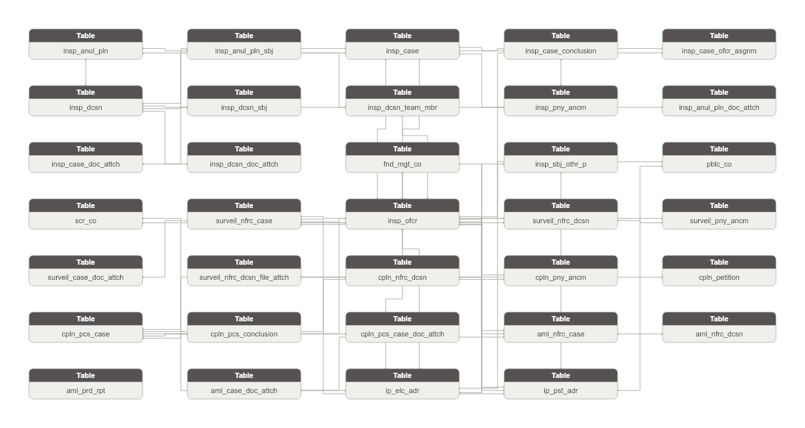

**Danh sách bảng:**

| STT | Tên bảng | Mô tả |
|---|---|---|
| 1 | aml_nfrc_case | Hồ sơ xử lý vi phạm phòng chống rửa tiền. Ghi nhận đối tượng vi phạm và trạng thái xử lý. |
| 2 | aml_nfrc_dcsn | Văn bản xử lý vi phạm rửa tiền. FK → AML Enforcement Case. |
| 3 | aml_prd_rpt | Báo cáo định kỳ về hoạt động phòng chống rửa tiền. Mỗi dòng = 1 lần lập báo cáo. |
| 4 | anti-corruption_rpt | Báo cáo tổng hợp định kỳ về hoạt động phòng chống tham nhũng. Mỗi dòng = 1 lần lập báo cáo. |
| 5 | cpln_nfrc_dcsn | Văn bản xử lý / quyết định xử phạt từ hồ sơ đơn thư. FK → Complaint Processing Case. |
| 6 | cpln_pny_ancm | Công bố quyết định xử phạt từ hồ sơ đơn thư. FK → Complaint Enforcement Decision. |
| 7 | cpln_petition | Đơn thư khiếu nại/tố cáo/phản ánh/kiến nghị nhận từ công dân hoặc tổ chức. Khởi đầu quy trình giải quyết đơn thư. |
| 8 | cpln_pcs_case | Hồ sơ giải quyết đơn thư khiếu nại/tố cáo. FK → Complaint Petition. |
| 9 | cpln_pcs_conclusion | Kết luận giải quyết đơn thư. FK → Complaint Processing Case. |
| 10 | insp_anul_pln | Kế hoạch thanh tra kiểm tra cấp năm được phê duyệt. Khởi đầu quy trình thanh tra trong năm. |
| 11 | insp_anul_pln_sbj | Đối tượng thanh tra được đưa vào kế hoạch năm. Grain: 1 đối tượng × 1 kế hoạch. |
| 12 | insp_case | Hồ sơ thanh tra cụ thể — tập hợp tài liệu và kết quả 1 cuộc thanh tra. FK → Inspection Decision. Thông tin đối tượng denormalized (snapshot tại thời điểm thanh tra). |
| 13 | insp_case_conclusion | Kết luận thanh tra kèm thông tin xử lý vi phạm. FK → Inspection Case. |
| 14 | insp_case_ofcr_asgnm | Phân công cán bộ phụ trách hồ sơ thanh tra. FK → Inspection Case + FK → Inspection Officer. |
| 15 | insp_dcsn | Quyết định thanh tra/kiểm tra cụ thể. FK → Inspection Annual Plan (nullable — thanh tra đột xuất không có kế hoạch). |
| 16 | insp_dcsn_sbj | Đối tượng cụ thể được thanh tra theo một quyết định. FK → Inspection Decision. |
| 17 | insp_dcsn_team_mbr | Thành viên đoàn thanh tra chỉ định theo quyết định. FK → Inspection Decision + FK → Inspection Officer. |
| 18 | insp_pny_ancm | Công bố quyết định xử phạt từ kết luận thanh tra. FK → Inspection Case Conclusion. |
| 19 | surveil_nfrc_case | Hồ sơ xử lý vi phạm từ kết quả giám sát thị trường. Ghi nhận đối tượng và trạng thái xử lý. |
| 20 | surveil_nfrc_dcsn | Văn bản xử lý vi phạm từ giám sát. FK → Surveillance Enforcement Case. |
| 21 | surveil_pny_ancm | Công bố quyết định xử phạt từ giám sát. FK → Surveillance Enforcement Decision. |
| 22 | aml_case_doc_attch | Văn bản đính kèm hồ sơ PCRT. FK → AML Enforcement Case. |
| 23 | cpln_pcs_case_doc_attch | Văn bản đính kèm hồ sơ giải quyết đơn thư. FK → Complaint Processing Case. |
| 24 | insp_anul_pln_doc_attch | Văn bản đính kèm kế hoạch thanh tra năm. FK → Inspection Annual Plan. |
| 25 | insp_case_doc_attch | Văn bản đính kèm hồ sơ thanh tra (biên bản làm việc v.v.). FK → Inspection Case. |
| 26 | insp_dcsn_doc_attch | Văn bản đính kèm quyết định thanh tra. FK → Inspection Decision. |
| 27 | surveil_case_doc_attch | Văn bản đính kèm hồ sơ giám sát. FK → Surveillance Enforcement Case. |
| 28 | surveil_nfrc_dcsn_file_attch | File đính kèm văn bản xử lý giám sát. FK → Surveillance Enforcement Decision. |
| 29 | fnd_mgt_co | Công ty quản lý quỹ đầu tư chứng khoán trong nước được UBCKNN cấp phép hoạt động. Lưu thông tin pháp lý và hoạt động của công ty. |
| 30 | insp_ofcr | Cán bộ thanh tra viên thuộc UBCKNN. Ghi nhận thông tin cá nhân và trạng thái công tác. |
| 31 | insp_sbj_othr_p | Đối tượng thanh tra khác (cá nhân hoặc tổ chức) không thuộc danh mục CK/QLQ/ĐC. Phân biệt qua party_type_code. |
| 32 | pblc_co | Công ty đại chúng được UBCKNN quản lý. Lưu thông tin pháp lý và trạng thái hoạt động. |
| 33 | scr_co | Công ty chứng khoán - thành viên thị trường trong hệ thống FIMS. Quản lý tài khoản và danh mục NĐT nước ngoài. |
| 34 | ip_elc_adr | Lưu trữ các địa chỉ liên lạc điện tử của Involved Party (điện thoại/fax/email). Mỗi dòng = 1 kênh liên lạc từ 1 nguồn. |
| 35 | ip_pst_adr | Lưu trữ các địa chỉ bưu chính của Involved Party (trụ sở/kinh doanh/thường trú/nơi ở hiện tại). Mỗi dòng = 1 loại địa chỉ từ 1 nguồn. |

### Bảng aml_nfrc_case

| STT | Tên trường | Kiểu dữ liệu và độ dài | Nullable | Unique | P/F Key | Mặc định | Mô tả |
|---|---|---|---|---|---|---|---|
| 1 | aml_nfrc_case_id | STRING |  | X | P |  | Khóa đại diện cho hồ sơ phòng chống rửa tiền. |
| 2 | aml_nfrc_case_code | STRING |  |  |  |  | Mã hồ sơ. Map từ PK ThanhTra.PCRT_HO_SO.ID. |
| 3 | src_stm_code | STRING |  |  |  | 'ThanhTra.PCRT_HO_SO' | Mã hệ thống nguồn. |
| 4 | case_nbr | STRING |  |  |  |  | Mã hồ sơ nghiệp vụ (duy nhất). |
| 5 | case_nm | STRING | X |  |  |  | Tên hồ sơ. |
| 6 | sbj_tp_code | STRING |  |  |  |  | Loại đối tượng: CA_NHAN / TO_CHUC. |
| 7 | sbj_nm | STRING | X |  |  |  | Tên tổ chức/cá nhân liên quan (denormalized). |
| 8 | rcvd_dt | DATE | X |  |  |  | Ngày nhận hồ sơ. |
| 9 | bsn_sctr_code | STRING | X |  |  |  | Mảng nghiệp vụ liên quan. |
| 10 | archv_nbr | STRING | X |  |  |  | Mã số lưu trữ. |
| 11 | case_cntnt | STRING | X |  |  |  | Nội dung hồ sơ. |
| 12 | case_st_code | STRING |  |  |  |  | Trạng thái hồ sơ. |
| 13 | rspl_ofcr_id | STRING | X |  | F |  | FK đến Inspection Officer — lãnh đạo phụ trách. |
| 14 | rspl_ofcr_code | STRING | X |  |  |  | Mã cán bộ lãnh đạo phụ trách. |
| 15 | pcs_ofcr_id | STRING | X |  | F |  | FK đến Inspection Officer — chuyên viên xử lý. |
| 16 | pcs_ofcr_code | STRING | X |  |  |  | Mã cán bộ chuyên viên xử lý. |

#### Constraint

**Khóa chính (Primary Key):**

| Tên trường |
|---|
| aml_nfrc_case_id |

**Khóa phụ (Foreign Key):**

| Tên trường | Bảng tham chiếu | Cột tham chiếu |
|---|---|---|
| rspl_ofcr_id | insp_ofcr | insp_ofcr_id |
| pcs_ofcr_id | insp_ofcr | insp_ofcr_id |

#### Index

N/A

#### Trigger

N/A

### Bảng aml_nfrc_dcsn

| STT | Tên trường | Kiểu dữ liệu và độ dài | Nullable | Unique | P/F Key | Mặc định | Mô tả |
|---|---|---|---|---|---|---|---|
| 1 | aml_nfrc_dcsn_id | STRING |  | X | P |  | Khóa đại diện cho quyết định xử phạt PCRT. |
| 2 | aml_nfrc_dcsn_code | STRING |  |  |  |  | Mã quyết định. Map từ PK ThanhTra.PCRT_VAN_BAN_XU_LY.ID. |
| 3 | src_stm_code | STRING |  |  |  | 'ThanhTra.PCRT_VAN_BAN_XU_LY' | Mã hệ thống nguồn. |
| 4 | aml_nfrc_case_id | STRING |  |  | F |  | FK đến AML Enforcement Case. |
| 5 | aml_nfrc_case_code | STRING |  |  |  |  | Mã hồ sơ PCRT. |
| 6 | pny_dcsn_nbr | STRING | X |  |  |  | Số quyết định xử phạt / công văn nhắc nhở. |
| 7 | vln_rpt_nbr | STRING | X |  |  |  | Số biên bản vi phạm hành chính. |
| 8 | vln_rpt_dt | DATE | X |  |  |  | Ngày ký biên bản vi phạm hành chính. |
| 9 | pny_cntnt | STRING | X |  |  |  | Nội dung xử phạt. |
| 10 | tot_pny_amt | DECIMAL(23,2) | X |  |  |  | Tổng số tiền phạt. |
| 11 | dcsn_st_code | STRING | X |  |  |  | Trạng thái. |
| 12 | remark | STRING | X |  |  |  | Ghi chú. |

#### Constraint

**Khóa chính (Primary Key):**

| Tên trường |
|---|
| aml_nfrc_dcsn_id |

**Khóa phụ (Foreign Key):**

| Tên trường | Bảng tham chiếu | Cột tham chiếu |
|---|---|---|
| aml_nfrc_case_id | aml_nfrc_case | aml_nfrc_case_id |

#### Index

N/A

#### Trigger

N/A

### Bảng aml_prd_rpt

| STT | Tên trường | Kiểu dữ liệu và độ dài | Nullable | Unique | P/F Key | Mặc định | Mô tả |
|---|---|---|---|---|---|---|---|
| 1 | aml_prd_rpt_id | STRING |  | X | P |  | Khóa đại diện cho báo cáo phòng chống rửa tiền định kỳ. |
| 2 | aml_prd_rpt_code | STRING |  |  |  |  | Mã báo cáo. Map từ ThanhTra.PCRT_BAO_CAO.MA_BAO_CAO (unique). |
| 3 | src_rcrd_id | STRING |  |  |  |  | Khóa chính nội bộ từ bảng nguồn ThanhTra.PCRT_BAO_CAO.ID. |
| 4 | src_stm_code | STRING |  |  |  | 'ThanhTra.PCRT_BAO_CAO' | Mã hệ thống nguồn. |
| 5 | rpt_nm | STRING |  |  |  |  | Tên báo cáo phòng chống rửa tiền. |
| 6 | rpt_dt | DATE | X |  |  |  | Ngày lập báo cáo. |
| 7 | rpt_snd_dt | DATE | X |  |  |  | Ngày gửi báo cáo. |
| 8 | prd_fm_dt | DATE | X |  |  |  | Từ ngày tổng hợp. |
| 9 | prd_to_dt | DATE | X |  |  |  | Đến ngày tổng hợp. |
| 10 | rpt_cntnt | STRING | X |  |  |  | Nội dung báo cáo. |
| 11 | rpt_file_url | STRING | X |  |  |  | Đường dẫn file báo cáo. |

#### Constraint

**Khóa chính (Primary Key):**

| Tên trường |
|---|
| aml_prd_rpt_id |

**Khóa phụ (Foreign Key):**

*Không có Foreign Key.*

#### Index

N/A

#### Trigger

N/A

### Bảng anti-corruption_rpt

| STT | Tên trường | Kiểu dữ liệu và độ dài | Nullable | Unique | P/F Key | Mặc định | Mô tả |
|---|---|---|---|---|---|---|---|
| 1 | anti-corruption_rpt_id | STRING |  | X | P |  | Khóa đại diện cho báo cáo phòng chống tham nhũng. |
| 2 | anti-corruption_rpt_code | STRING |  |  |  |  | Mã báo cáo PCTN. Map từ PK ThanhTra.PCTN_BAO_CAO.ID. |
| 3 | src_stm_code | STRING |  |  |  | 'ThanhTra.PCTN_BAO_CAO' | Mã hệ thống nguồn. |
| 4 | rpt_nm | STRING |  |  |  |  | Tên báo cáo phòng chống tham nhũng. |
| 5 | rpt_dt | DATE | X |  |  |  | Ngày lập báo cáo. |
| 6 | rpt_snd_dt | DATE | X |  |  |  | Ngày gửi báo cáo. |
| 7 | prd_fm_dt | DATE | X |  |  |  | Từ ngày tổng hợp. |
| 8 | prd_to_dt | DATE | X |  |  |  | Đến ngày tổng hợp. |
| 9 | citizen_rcptn_rslt | STRING | X |  |  |  | Kết quả tiếp công dân. |
| 10 | cpln_pcs_rslt | STRING | X |  |  |  | Kết quả xử lý khiếu nại tố cáo. |
| 11 | rpt_file_url | STRING | X |  |  |  | Đường dẫn file báo cáo. |

#### Constraint

**Khóa chính (Primary Key):**

| Tên trường |
|---|
| anti-corruption_rpt_id |

**Khóa phụ (Foreign Key):**

*Không có Foreign Key.*

#### Index

N/A

#### Trigger

N/A

### Bảng cpln_nfrc_dcsn

| STT | Tên trường | Kiểu dữ liệu và độ dài | Nullable | Unique | P/F Key | Mặc định | Mô tả |
|---|---|---|---|---|---|---|---|
| 1 | cpln_nfrc_dcsn_id | STRING |  | X | P |  | Khóa đại diện cho quyết định xử phạt từ hồ sơ đơn thư. |
| 2 | cpln_nfrc_dcsn_code | STRING |  |  |  |  | Mã quyết định xử phạt. Map từ PK ThanhTra.DT_VAN_BAN_XU_LY.ID. |
| 3 | src_stm_code | STRING |  |  |  | 'ThanhTra.DT_VAN_BAN_XU_LY' | Mã hệ thống nguồn. |
| 4 | cpln_pcs_case_id | STRING |  |  | F |  | FK đến Complaint Processing Case (OQ-5: DT_VAN_BAN_XU_LY FK → DT_HO_SO). |
| 5 | cpln_pcs_case_code | STRING |  |  |  |  | Mã hồ sơ đơn thư. |
| 6 | pny_dcsn_nbr | STRING | X |  |  |  | Số quyết định xử phạt. |
| 7 | vln_rpt_nbr | STRING | X |  |  |  | Số biên bản vi phạm hành chính. |
| 8 | vln_rpt_dt | DATE | X |  |  |  | Ngày biên bản vi phạm hành chính. |
| 9 | pny_cntnt | STRING | X |  |  |  | Nội dung xử phạt. |
| 10 | dcsn_st_code | STRING |  |  |  |  | Trạng thái: CHUA_NOP_PHAT / DA_NOP_PHAT / NOP_PHAT_NHIEU_LAN. |
| 11 | remark | STRING | X |  |  |  | Ghi chú. |

#### Constraint

**Khóa chính (Primary Key):**

| Tên trường |
|---|
| cpln_nfrc_dcsn_id |

**Khóa phụ (Foreign Key):**

| Tên trường | Bảng tham chiếu | Cột tham chiếu |
|---|---|---|
| cpln_pcs_case_id | cpln_pcs_case | cpln_pcs_case_id |

#### Index

N/A

#### Trigger

N/A

### Bảng cpln_pny_ancm

| STT | Tên trường | Kiểu dữ liệu và độ dài | Nullable | Unique | P/F Key | Mặc định | Mô tả |
|---|---|---|---|---|---|---|---|
| 1 | cpln_pny_ancm_id | STRING |  | X | P |  | Khóa đại diện cho công bố xử phạt từ đơn thư. |
| 2 | cpln_pny_ancm_code | STRING |  |  |  |  | Mã công bố. Map từ PK ThanhTra.DT_CONG_BO_XU_PHAT.ID. |
| 3 | src_stm_code | STRING |  |  |  | 'ThanhTra.DT_CONG_BO_XU_PHAT' | Mã hệ thống nguồn. |
| 4 | cpln_pcs_case_id | STRING | X |  | F |  | FK đến Complaint Processing Case (via HO_SO_ID — redundant navigation FK). |
| 5 | cpln_pcs_case_code | STRING | X |  |  |  | Mã hồ sơ đơn thư. |
| 6 | cpln_nfrc_dcsn_id | STRING |  |  | F |  | FK đến Complaint Enforcement Decision. |
| 7 | cpln_nfrc_dcsn_code | STRING |  |  |  |  | Mã quyết định xử phạt đơn thư. |
| 8 | ancm_cnl | STRING | X |  |  |  | Chuyên mục / kênh công bố. |
| 9 | ancm_cntnt | STRING | X |  |  |  | Nội dung công bố. |
| 10 | ancm_dt | DATE | X |  |  |  | Ngày công bố. |
| 11 | ancm_st_code | STRING |  |  |  |  | Trạng thái: CHO_DUYET / DA_DUYET. |

#### Constraint

**Khóa chính (Primary Key):**

| Tên trường |
|---|
| cpln_pny_ancm_id |

**Khóa phụ (Foreign Key):**

| Tên trường | Bảng tham chiếu | Cột tham chiếu |
|---|---|---|
| cpln_pcs_case_id | cpln_pcs_case | cpln_pcs_case_id |
| cpln_nfrc_dcsn_id | cpln_nfrc_dcsn | cpln_nfrc_dcsn_id |

#### Index

N/A

#### Trigger

N/A

### Bảng cpln_petition

| STT | Tên trường | Kiểu dữ liệu và độ dài | Nullable | Unique | P/F Key | Mặc định | Mô tả |
|---|---|---|---|---|---|---|---|
| 1 | cpln_petition_id | STRING |  | X | P |  | Khóa đại diện cho đơn thư khiếu nại tố cáo. |
| 2 | cpln_petition_code | STRING |  |  |  |  | Mã đơn thư. Map từ PK ThanhTra.DT_DON_THU.ID. |
| 3 | src_stm_code | STRING |  |  |  | 'ThanhTra.DT_DON_THU' | Mã hệ thống nguồn. |
| 4 | petition_nm | STRING | X |  |  |  | Tên đơn thư. |
| 5 | complainant_tp_code | STRING |  |  |  |  | Loại đối tượng gửi đơn: CA_NHAN / TO_CHUC. |
| 6 | complainant_nm | STRING | X |  |  |  | Tên tổ chức / cá nhân gửi đơn (snapshot tại thời điểm tiếp nhận). |
| 7 | is_anon | STRING |  |  |  |  | Nặc danh: 1-Có, 0-Không. |
| 8 | complainant_cnt | INT | X |  |  |  | Số người gửi đơn. |
| 9 | complainant_email | STRING | X |  |  |  | Email người gửi (snapshot — grain là đơn thư không phải IP). |
| 10 | complainant_adr | STRING | X |  |  |  | Địa chỉ người gửi (snapshot). |
| 11 | has_no_adr | STRING |  |  |  |  | Không có địa chỉ: 1-Có / 0-Không. |
| 12 | complainant_id_nbr | STRING | X |  |  |  | Số CMND/CCCD người gửi (cá nhân — snapshot). |
| 13 | complainant_id_issu_dt | DATE | X |  |  |  | Ngày cấp CMND/CCCD (snapshot). |
| 14 | complainant_gnd_code | STRING | X |  |  |  | Giới tính người gửi (cá nhân — snapshot). |
| 15 | petition_tp_code | STRING |  |  |  |  | Loại đơn: KHIEU_NAI / TO_CAO / PHAN_ANH / KIEN_NGHI. |
| 16 | written_dt | DATE | X |  |  |  | Ngày viết đơn. |
| 17 | petition_cntnt | STRING | X |  |  |  | Nội dung đơn thư. |
| 18 | subm_dt | DATE |  |  |  |  | Ngày tiếp nhận đơn. |
| 19 | recpt_src | STRING | X |  |  |  | Nơi/kênh tiếp nhận đơn. |
| 20 | petition_st_code | STRING |  |  |  |  | Trạng thái: MOI / DANG_XU_LY / HOAN_THANH / DONG. |

#### Constraint

**Khóa chính (Primary Key):**

| Tên trường |
|---|
| cpln_petition_id |

**Khóa phụ (Foreign Key):**

*Không có Foreign Key.*

#### Index

N/A

#### Trigger

N/A

### Bảng cpln_pcs_case

| STT | Tên trường | Kiểu dữ liệu và độ dài | Nullable | Unique | P/F Key | Mặc định | Mô tả |
|---|---|---|---|---|---|---|---|
| 1 | cpln_pcs_case_id | STRING |  | X | P |  | Khóa đại diện cho hồ sơ giải quyết đơn thư. |
| 2 | cpln_pcs_case_code | STRING |  |  |  |  | Mã hồ sơ. Map từ PK ThanhTra.DT_HO_SO.ID. |
| 3 | src_stm_code | STRING |  |  |  | 'ThanhTra.DT_HO_SO' | Mã hệ thống nguồn. |
| 4 | cpln_petition_id | STRING |  |  | F |  | FK đến Complaint Petition — đơn thư gốc. |
| 5 | cpln_petition_code | STRING |  |  |  |  | Mã đơn thư gốc. |
| 6 | case_nbr | STRING | X |  |  |  | Số hồ sơ. |
| 7 | case_nm | STRING | X |  |  |  | Tên hồ sơ. |
| 8 | archv_nbr | STRING | X |  |  |  | Mã số lưu trữ. |
| 9 | tfr_unit_nm | STRING | X |  |  |  | Đơn vị chuyển kết quả rà soát. |
| 10 | case_st_code | STRING |  |  |  |  | Trạng thái: MOI_TIEP_NHAN / DANG_GIAI_QUYET / HOAN_THANH. |
| 11 | rsl_dt | DATE | X |  |  |  | Ngày kết thúc giải quyết. |
| 12 | remark | STRING | X |  |  |  | Ghi chú. |

#### Constraint

**Khóa chính (Primary Key):**

| Tên trường |
|---|
| cpln_pcs_case_id |

**Khóa phụ (Foreign Key):**

| Tên trường | Bảng tham chiếu | Cột tham chiếu |
|---|---|---|
| cpln_petition_id | cpln_petition | cpln_petition_id |

#### Index

N/A

#### Trigger

N/A

### Bảng cpln_pcs_conclusion

| STT | Tên trường | Kiểu dữ liệu và độ dài | Nullable | Unique | P/F Key | Mặc định | Mô tả |
|---|---|---|---|---|---|---|---|
| 1 | cpln_pcs_conclusion_id | STRING |  | X | P |  | Khóa đại diện cho kết luận giải quyết đơn thư. |
| 2 | cpln_pcs_conclusion_code | STRING |  |  |  |  | Mã kết luận. Map từ PK ThanhTra.DT_KET_LUAN.ID. |
| 3 | src_stm_code | STRING |  |  |  | 'ThanhTra.DT_KET_LUAN' | Mã hệ thống nguồn. |
| 4 | cpln_pcs_case_id | STRING |  |  | F |  | FK đến Complaint Processing Case. |
| 5 | cpln_pcs_case_code | STRING |  |  |  |  | Mã hồ sơ đơn thư. |
| 6 | conclusion_nbr | STRING | X |  |  |  | Số kết luận. |
| 7 | conclusion_dt | DATE | X |  |  |  | Ngày kết luận. |
| 8 | rsl_rslt_code | STRING | X |  |  |  | Kết quả giải quyết: DUNG / SAI / DUNG_MOT_PHAN. |
| 9 | conclusion_cntnt | STRING | X |  |  |  | Nội dung kết luận. |
| 10 | offc_conclusion_dt | DATE | X |  |  |  | Ngày ra kết luận chính thức. |
| 11 | referred_to_ministry_dt | DATE | X |  |  |  | Ngày chuyển cho thanh tra bộ. |
| 12 | conclusion_st_code | STRING |  |  |  |  | Trạng thái: DANG_GIAI_QUYET / DA_HOAN_THANH. |
| 13 | remark | STRING | X |  |  |  | Ghi chú. |

#### Constraint

**Khóa chính (Primary Key):**

| Tên trường |
|---|
| cpln_pcs_conclusion_id |

**Khóa phụ (Foreign Key):**

| Tên trường | Bảng tham chiếu | Cột tham chiếu |
|---|---|---|
| cpln_pcs_case_id | cpln_pcs_case | cpln_pcs_case_id |

#### Index

N/A

#### Trigger

N/A

### Bảng insp_anul_pln

| STT | Tên trường | Kiểu dữ liệu và độ dài | Nullable | Unique | P/F Key | Mặc định | Mô tả |
|---|---|---|---|---|---|---|---|
| 1 | insp_anul_pln_id | STRING |  | X | P |  | Khóa đại diện cho kế hoạch thanh tra hàng năm. |
| 2 | insp_anul_pln_code | STRING |  |  |  |  | Mã kế hoạch. Map từ PK ThanhTra.TT_KE_HOACH.ID. |
| 3 | src_stm_code | STRING |  |  |  | 'ThanhTra.TT_KE_HOACH' | Mã hệ thống nguồn. |
| 4 | pln_tp_code | STRING |  |  |  |  | Loại kế hoạch: THANH_TRA / KIEM_TRA. |
| 5 | pln_nm | STRING |  |  |  |  | Tên kế hoạch (ví dụ: Kế hoạch thanh tra năm 2025). |
| 6 | aprv_dcsn_nbr | STRING | X |  |  |  | Số quyết định phê duyệt kế hoạch. |
| 7 | aprv_dt | DATE | X |  |  |  | Ngày ký quyết định phê duyệt. |
| 8 | pln_yr | INT |  |  |  |  | Năm kế hoạch (ví dụ: 2025). |
| 9 | offc_dispatch_nbr | STRING | X |  |  |  | Số công văn kèm kế hoạch. |
| 10 | offc_dispatch_dt | DATE | X |  |  |  | Ngày công văn. |
| 11 | remark | STRING | X |  |  |  | Ghi chú (tối đa 4000 ký tự). |
| 12 | pln_st_code | STRING |  |  |  |  | Trạng thái: 1-Hoạt động, 0-Đã xóa. |

#### Constraint

**Khóa chính (Primary Key):**

| Tên trường |
|---|
| insp_anul_pln_id |

**Khóa phụ (Foreign Key):**

*Không có Foreign Key.*

#### Index

N/A

#### Trigger

N/A

### Bảng insp_anul_pln_sbj

| STT | Tên trường | Kiểu dữ liệu và độ dài | Nullable | Unique | P/F Key | Mặc định | Mô tả |
|---|---|---|---|---|---|---|---|
| 1 | insp_anul_pln_sbj_id | STRING |  | X | P |  | Khóa đại diện cho đối tượng trong kế hoạch thanh tra. |
| 2 | insp_anul_pln_sbj_code | STRING |  |  |  |  | Mã đối tượng kế hoạch. Map từ PK ThanhTra.TT_KE_HOACH_DOI_TUONG.ID. |
| 3 | src_stm_code | STRING |  |  |  | 'ThanhTra.TT_KE_HOACH_DOI_TUONG' | Mã hệ thống nguồn. |
| 4 | insp_anul_pln_id | STRING |  |  | F |  | FK đến Inspection Annual Plan. |
| 5 | insp_anul_pln_code | STRING |  |  |  |  | Mã kế hoạch. |
| 6 | seq_nbr | INT | X |  |  |  | Số thứ tự đối tượng trong kế hoạch. |
| 7 | sbj_nm | STRING |  |  |  |  | Tên đối tượng thanh tra (denormalized — không có DOI_TUONG_ID FK). |
| 8 | sbj_adr | STRING | X |  |  |  | Địa chỉ đối tượng (denormalized). |
| 9 | pln_drtn | STRING | X |  |  |  | Thời gian dự kiến thanh tra. |
| 10 | lead_unit_nm | STRING | X |  |  |  | Đơn vị chủ trì (denormalized theo tên). |
| 11 | notf_dispatch_nbr | STRING | X |  |  |  | Số công văn thông báo. |
| 12 | notf_dispatch_dt | DATE | X |  |  |  | Ngày ký công văn thông báo. |

#### Constraint

**Khóa chính (Primary Key):**

| Tên trường |
|---|
| insp_anul_pln_sbj_id |

**Khóa phụ (Foreign Key):**

| Tên trường | Bảng tham chiếu | Cột tham chiếu |
|---|---|---|
| insp_anul_pln_id | insp_anul_pln | insp_anul_pln_id |

#### Index

N/A

#### Trigger

N/A

### Bảng insp_case

| STT | Tên trường | Kiểu dữ liệu và độ dài | Nullable | Unique | P/F Key | Mặc định | Mô tả |
|---|---|---|---|---|---|---|---|
| 1 | insp_case_id | STRING |  | X | P |  | Khóa đại diện cho hồ sơ thanh tra. |
| 2 | insp_case_code | STRING |  |  |  |  | Mã hồ sơ. Map từ PK ThanhTra.TT_HO_SO.ID. |
| 3 | src_stm_code | STRING |  |  |  | 'ThanhTra.TT_HO_SO' | Mã hệ thống nguồn. |
| 4 | insp_dcsn_id | STRING |  |  | F |  | FK đến Inspection Decision. |
| 5 | insp_dcsn_code | STRING |  |  |  |  | Mã quyết định. |
| 6 | insp_tp_code | STRING |  |  |  |  | Loại hình: THANH_TRA / KIEM_TRA. |
| 7 | bsn_sctr_code | STRING | X |  |  |  | Mảng nghiệp vụ. |
| 8 | case_nbr | STRING |  |  |  |  | Mã hồ sơ nghiệp vụ (duy nhất). |
| 9 | case_nm | STRING | X |  |  |  | Tên hồ sơ. |
| 10 | archv_nbr | STRING | X |  |  |  | Mã số lưu trữ. |
| 11 | rcvd_dt | DATE | X |  |  |  | Ngày nhận hồ sơ. |
| 12 | data_src_dsc | STRING | X |  |  |  | Nguồn cung cấp thông tin. |
| 13 | case_cntnt | STRING | X |  |  |  | Nội dung hồ sơ. |
| 14 | sbj_tp_code | STRING | X |  |  |  | Loại đối tượng: CA_NHAN / TO_CHUC (snapshot). |
| 15 | sbj_full_nm | STRING | X |  |  |  | Họ tên cá nhân đối tượng (snapshot — grain là hồ sơ không phải IP). |
| 16 | sbj_dob | DATE | X |  |  |  | Ngày sinh cá nhân đối tượng (snapshot). |
| 17 | sbj_gnd_code | STRING | X |  |  |  | Giới tính cá nhân đối tượng (snapshot). |
| 18 | sbj_nat | STRING | X |  |  |  | Quốc tịch đối tượng (snapshot — text tự do). |
| 19 | sbj_ac_nbr | STRING | X |  |  |  | Số tài khoản đối tượng (snapshot). |
| 20 | sbj_ac_bnk_nm | STRING | X |  |  |  | Nơi mở tài khoản (snapshot). |
| 21 | sbj_id_nbr | STRING | X |  |  |  | Số CMND/CCCD đối tượng cá nhân (snapshot). |
| 22 | sbj_ph_nbr | STRING | X |  |  |  | Số điện thoại đối tượng (snapshot). |
| 23 | sbj_email | STRING | X |  |  |  | Email đối tượng (snapshot). |
| 24 | sbj_adr | STRING | X |  |  |  | Địa chỉ đối tượng (snapshot). |
| 25 | sbj_org_nm | STRING | X |  |  |  | Tên tổ chức đối tượng (snapshot). |
| 26 | sbj_org_shrt_nm | STRING | X |  |  |  | Tên viết tắt tổ chức (snapshot). |
| 27 | sbj_rprs_nm | STRING | X |  |  |  | Người đại diện tổ chức (snapshot). |
| 28 | sbj_bsn_license_nbr | STRING | X |  |  |  | Số giấy phép kinh doanh tổ chức (snapshot). |
| 29 | sbj_cty | STRING | X |  |  |  | Quốc gia tổ chức (snapshot — text tự do). |
| 30 | sbj_webst | STRING | X |  |  |  | Website đối tượng (snapshot). |
| 31 | sbj_fax_nbr | STRING | X |  |  |  | Số fax đối tượng (snapshot). |
| 32 | case_st_code | STRING |  |  |  |  | Trạng thái hồ sơ. |
| 33 | rspl_ofcr_id | STRING | X |  | F |  | FK đến Inspection Officer — lãnh đạo phụ trách. |
| 34 | rspl_ofcr_code | STRING | X |  |  |  | Mã cán bộ lãnh đạo phụ trách. |
| 35 | pcs_ofcr_id | STRING | X |  | F |  | FK đến Inspection Officer — chuyên viên xử lý. |
| 36 | pcs_ofcr_code | STRING | X |  |  |  | Mã cán bộ chuyên viên xử lý. |

#### Constraint

**Khóa chính (Primary Key):**

| Tên trường |
|---|
| insp_case_id |

**Khóa phụ (Foreign Key):**

| Tên trường | Bảng tham chiếu | Cột tham chiếu |
|---|---|---|
| insp_dcsn_id | insp_dcsn | insp_dcsn_id |
| rspl_ofcr_id | insp_ofcr | insp_ofcr_id |
| pcs_ofcr_id | insp_ofcr | insp_ofcr_id |

#### Index

N/A

#### Trigger

N/A

### Bảng insp_case_conclusion

| STT | Tên trường | Kiểu dữ liệu và độ dài | Nullable | Unique | P/F Key | Mặc định | Mô tả |
|---|---|---|---|---|---|---|---|
| 1 | insp_case_conclusion_id | STRING |  | X | P |  | Khóa đại diện cho kết luận thanh tra. |
| 2 | insp_case_conclusion_code | STRING |  |  |  |  | Mã kết luận. Map từ PK ThanhTra.TT_KET_LUAN.ID. |
| 3 | src_stm_code | STRING |  |  |  | 'ThanhTra.TT_KET_LUAN' | Mã hệ thống nguồn. |
| 4 | insp_case_id | STRING |  |  | F |  | FK đến Inspection Case. |
| 5 | insp_case_code | STRING |  |  |  |  | Mã hồ sơ thanh tra. |
| 6 | conclusion_seq_nbr | INT |  |  |  |  | Số thứ tự kết luận trong 1 hồ sơ (1:N — có thể có nhiều kết luận: sơ bộ, chính thức, bổ sung). |
| 7 | doc_tp_code | STRING | X |  |  |  | Loại văn bản: KET_LUAN / VAN_BAN_XU_LY. |
| 8 | conclusion_doc_nbr | STRING | X |  |  |  | Số hiệu văn bản kết luận. |
| 9 | signing_dt | DATE | X |  |  |  | Ngày văn bản. |
| 10 | conclusion_smy | STRING | X |  |  |  | Nội dung văn bản kết luận. |
| 11 | pny_amt | DECIMAL(23,2) | X |  |  |  | Số tiền phạt. |
| 12 | vln_claus | STRING | X |  |  |  | Điều khoản hành vi vi phạm. |
| 13 | vln_reg_doc | STRING | X |  |  |  | Văn bản quy định hành vi vi phạm. |
| 14 | pny_claus | STRING | X |  |  |  | Điều khoản chế tài áp dụng. |
| 15 | pny_reg_doc | STRING | X |  |  |  | Văn bản quy định chế tài. |
| 16 | vln_tp_code | STRING | X |  |  |  | Danh mục hành vi vi phạm. |
| 17 | pny_tp_code | STRING | X |  |  |  | Danh mục hình thức phạt. |
| 18 | attch_file_nm | STRING | X |  |  |  | Tên file đính kèm kết luận. |
| 19 | attch_file_url | STRING | X |  |  |  | Đường dẫn file kết luận. |
| 20 | conclusion_st_code | STRING | X |  |  |  | Trạng thái văn bản kết luận. |

#### Constraint

**Khóa chính (Primary Key):**

| Tên trường |
|---|
| insp_case_conclusion_id |

**Khóa phụ (Foreign Key):**

| Tên trường | Bảng tham chiếu | Cột tham chiếu |
|---|---|---|
| insp_case_id | insp_case | insp_case_id |

#### Index

N/A

#### Trigger

N/A

### Bảng insp_case_ofcr_asgnm

| STT | Tên trường | Kiểu dữ liệu và độ dài | Nullable | Unique | P/F Key | Mặc định | Mô tả |
|---|---|---|---|---|---|---|---|
| 1 | insp_case_ofcr_asgnm_id | STRING |  | X | P |  | Khóa đại diện cho phân công cán bộ xử lý hồ sơ thanh tra. |
| 2 | insp_case_ofcr_asgnm_code | STRING |  |  |  |  | Mã phân công. Map từ PK ThanhTra.TT_HO_SO_CAN_BO.ID. |
| 3 | src_stm_code | STRING |  |  |  | 'ThanhTra.TT_HO_SO_CAN_BO' | Mã hệ thống nguồn. |
| 4 | insp_case_id | STRING |  |  | F |  | FK đến Inspection Case. |
| 5 | insp_case_code | STRING |  |  |  |  | Mã hồ sơ thanh tra. |
| 6 | insp_ofcr_id | STRING |  |  | F |  | FK đến Inspection Officer — cán bộ được phân công. |
| 7 | insp_ofcr_code | STRING |  |  |  |  | Mã cán bộ. |
| 8 | ofcr_rl_code | STRING |  |  |  |  | Loại phân công: LANH_DAO / CHUYEN_VIEN. |
| 9 | asgnm_dt | DATE | X |  |  |  | Ngày phân công. |
| 10 | remark | STRING | X |  |  |  | Ghi chú phân công. |

#### Constraint

**Khóa chính (Primary Key):**

| Tên trường |
|---|
| insp_case_ofcr_asgnm_id |

**Khóa phụ (Foreign Key):**

| Tên trường | Bảng tham chiếu | Cột tham chiếu |
|---|---|---|
| insp_case_id | insp_case | insp_case_id |
| insp_ofcr_id | insp_ofcr | insp_ofcr_id |

#### Index

N/A

#### Trigger

N/A

### Bảng insp_dcsn

| STT | Tên trường | Kiểu dữ liệu và độ dài | Nullable | Unique | P/F Key | Mặc định | Mô tả |
|---|---|---|---|---|---|---|---|
| 1 | insp_dcsn_id | STRING |  | X | P |  | Khóa đại diện cho quyết định thanh tra. |
| 2 | insp_dcsn_code | STRING |  |  |  |  | Mã quyết định. Map từ PK ThanhTra.TT_QUYET_DINH.ID. |
| 3 | src_stm_code | STRING |  |  |  | 'ThanhTra.TT_QUYET_DINH' | Mã hệ thống nguồn. |
| 4 | insp_anul_pln_id | STRING | X |  | F |  | FK đến Inspection Annual Plan (nullable — quyết định đột xuất không có kế hoạch). |
| 5 | insp_anul_pln_code | STRING | X |  |  |  | Mã kế hoạch. |
| 6 | insp_tp_code | STRING |  |  |  |  | Loại hình: THANH_TRA / KIEM_TRA. |
| 7 | doc_form_tp_code | STRING | X |  |  |  | Hình thức văn bản. |
| 8 | dcsn_nbr | STRING |  |  |  |  | Số quyết định (duy nhất). |
| 9 | dcsn_nm | STRING | X |  |  |  | Tên quyết định. |
| 10 | issu_dt | DATE | X |  |  |  | Ngày ra quyết định. |
| 11 | ancm_dt | DATE | X |  |  |  | Ngày công bố quyết định. |
| 12 | bsn_sctr_code | STRING | X |  |  |  | Mảng nghiệp vụ. |
| 13 | lgl_bss_tp_code | STRING | X |  |  |  | Căn cứ thanh tra (văn bản pháp lý). |
| 14 | dcsn_cntnt | STRING | X |  |  |  | Nội dung quyết định. |
| 15 | remark | STRING | X |  |  |  | Ghi chú. |
| 16 | dcsn_st_code | STRING |  |  |  |  | Trạng thái: 1-Hoạt động, 0-Đã xóa. |

#### Constraint

**Khóa chính (Primary Key):**

| Tên trường |
|---|
| insp_dcsn_id |

**Khóa phụ (Foreign Key):**

| Tên trường | Bảng tham chiếu | Cột tham chiếu |
|---|---|---|
| insp_anul_pln_id | insp_anul_pln | insp_anul_pln_id |

#### Index

N/A

#### Trigger

N/A

### Bảng insp_dcsn_sbj

| STT | Tên trường | Kiểu dữ liệu và độ dài | Nullable | Unique | P/F Key | Mặc định | Mô tả |
|---|---|---|---|---|---|---|---|
| 1 | insp_dcsn_sbj_id | STRING |  | X | P |  | Khóa đại diện cho đối tượng trong quyết định thanh tra. |
| 2 | insp_dcsn_sbj_code | STRING |  |  |  |  | Mã đối tượng quyết định. Map từ PK ThanhTra.TT_QUYET_DINH_DOI_TUONG.ID. |
| 3 | src_stm_code | STRING |  |  |  | 'ThanhTra.TT_QUYET_DINH_DOI_TUONG' | Mã hệ thống nguồn. |
| 4 | insp_dcsn_id | STRING |  |  | F |  | FK đến Inspection Decision. |
| 5 | insp_dcsn_code | STRING |  |  |  |  | Mã quyết định. |
| 6 | seq_nbr | INT | X |  |  |  | Số thứ tự đối tượng trong quyết định. |
| 7 | sbj_tp_code | STRING |  |  |  |  | Loại đối tượng: CA_NHAN / TO_CHUC. |
| 8 | sbj_nm | STRING |  |  |  |  | Tên đối tượng (denormalized — DOI_TUONG_REF_ID là polymorphic FK, không resolve được thành entity duy nhất). |
| 9 | sbj_refr_id | STRING | X |  | F |  | Tham chiếu đến bảng DM_ tương ứng (polymorphic — giá trị có thể trỏ đến DM_CONG_TY_CK/QLQ/DC/DM_DOI_TUONG_KHAC). |

#### Constraint

**Khóa chính (Primary Key):**

| Tên trường |
|---|
| insp_dcsn_sbj_id |

**Khóa phụ (Foreign Key):**

| Tên trường | Bảng tham chiếu | Cột tham chiếu |
|---|---|---|
| insp_dcsn_id | insp_dcsn | insp_dcsn_id |

#### Index

N/A

#### Trigger

N/A

### Bảng insp_dcsn_team_mbr

| STT | Tên trường | Kiểu dữ liệu và độ dài | Nullable | Unique | P/F Key | Mặc định | Mô tả |
|---|---|---|---|---|---|---|---|
| 1 | insp_dcsn_team_mbr_id | STRING |  | X | P |  | Khóa đại diện cho thành viên đoàn thanh tra trong quyết định. |
| 2 | insp_dcsn_team_mbr_code | STRING |  |  |  |  | Mã thành viên. Map từ PK ThanhTra.TT_QUYET_DINH_THANH_PHAN.ID. |
| 3 | src_stm_code | STRING |  |  |  | 'ThanhTra.TT_QUYET_DINH_THANH_PHAN' | Mã hệ thống nguồn. |
| 4 | insp_dcsn_id | STRING |  |  | F |  | FK đến Inspection Decision. |
| 5 | insp_dcsn_code | STRING |  |  |  |  | Mã quyết định. |
| 6 | insp_ofcr_id | STRING |  |  | F |  | FK đến Inspection Officer — cán bộ trong đoàn. |
| 7 | insp_ofcr_code | STRING |  |  |  |  | Mã cán bộ. |
| 8 | team_rl_dsc | STRING | X |  |  |  | Vai trò trong đoàn (trưởng đoàn, thành viên...). |
| 9 | seq_nbr | INT | X |  |  |  | Số thứ tự trong đoàn. |

#### Constraint

**Khóa chính (Primary Key):**

| Tên trường |
|---|
| insp_dcsn_team_mbr_id |

**Khóa phụ (Foreign Key):**

| Tên trường | Bảng tham chiếu | Cột tham chiếu |
|---|---|---|
| insp_dcsn_id | insp_dcsn | insp_dcsn_id |
| insp_ofcr_id | insp_ofcr | insp_ofcr_id |

#### Index

N/A

#### Trigger

N/A

### Bảng insp_pny_ancm

| STT | Tên trường | Kiểu dữ liệu và độ dài | Nullable | Unique | P/F Key | Mặc định | Mô tả |
|---|---|---|---|---|---|---|---|
| 1 | insp_pny_ancm_id | STRING |  | X | P |  | Khóa đại diện cho công bố xử phạt từ kết luận thanh tra. |
| 2 | insp_pny_ancm_code | STRING |  |  |  |  | Mã công bố. Map từ PK ThanhTra.TT_CONG_BO_XU_PHAT.ID. |
| 3 | src_stm_code | STRING |  |  |  | 'ThanhTra.TT_CONG_BO_XU_PHAT' | Mã hệ thống nguồn. |
| 4 | insp_case_id | STRING | X |  | F |  | FK đến Inspection Case (via HO_SO_ID — redundant navigation FK). |
| 5 | insp_case_code | STRING | X |  |  |  | Mã hồ sơ thanh tra. |
| 6 | insp_case_conclusion_id | STRING |  |  | F |  | FK đến Inspection Case Conclusion. |
| 7 | insp_case_conclusion_code | STRING |  |  |  |  | Mã kết luận thanh tra. |
| 8 | ancm_cnl | STRING | X |  |  |  | Chuyên mục trên cổng TTĐT. |
| 9 | ancm_cntnt | STRING | X |  |  |  | Nội dung công bố. |
| 10 | ancm_dt | DATE | X |  |  |  | Ngày công bố. |
| 11 | ancm_st_code | STRING |  |  |  |  | Trạng thái: CHO_DUYET / DA_DUYET. |

#### Constraint

**Khóa chính (Primary Key):**

| Tên trường |
|---|
| insp_pny_ancm_id |

**Khóa phụ (Foreign Key):**

| Tên trường | Bảng tham chiếu | Cột tham chiếu |
|---|---|---|
| insp_case_id | insp_case | insp_case_id |
| insp_case_conclusion_id | insp_case_conclusion | insp_case_conclusion_id |

#### Index

N/A

#### Trigger

N/A

### Bảng surveil_nfrc_case

| STT | Tên trường | Kiểu dữ liệu và độ dài | Nullable | Unique | P/F Key | Mặc định | Mô tả |
|---|---|---|---|---|---|---|---|
| 1 | surveil_nfrc_case_id | STRING |  | X | P |  | Khóa đại diện cho hồ sơ xử lý vi phạm từ giám sát. |
| 2 | surveil_nfrc_case_code | STRING |  |  |  |  | Mã hồ sơ. Map từ PK ThanhTra.GS_HO_SO.ID. |
| 3 | src_stm_code | STRING |  |  |  | 'ThanhTra.GS_HO_SO' | Mã hệ thống nguồn. |
| 4 | case_nbr | STRING |  |  |  |  | Mã hồ sơ nghiệp vụ (duy nhất trong hệ thống). |
| 5 | case_nm | STRING | X |  |  |  | Tên hồ sơ. |
| 6 | archv_nbr | STRING | X |  |  |  | Mã số lưu trữ. |
| 7 | rcvd_dt | DATE | X |  |  |  | Ngày nhận hồ sơ. |
| 8 | bsn_sctr_code | STRING | X |  |  |  | Mảng nghiệp vụ liên quan. |
| 9 | data_src_dsc | STRING | X |  |  |  | Nguồn cung cấp hồ sơ (nhiều nguồn, lưu text). |
| 10 | case_cntnt | STRING | X |  |  |  | Nội dung hồ sơ. |
| 11 | scr_lvl_code | STRING | X |  |  |  | Mức độ bảo mật hồ sơ. |
| 12 | sbj_nm | STRING | X |  |  |  | Tên đối tượng vi phạm (denormalized). |
| 13 | case_st_code | STRING |  |  |  |  | Trạng thái hồ sơ. |
| 14 | remark | STRING | X |  |  |  | Ghi chú. |
| 15 | rspl_ofcr_id | STRING | X |  | F |  | FK đến Inspection Officer — lãnh đạo phụ trách. |
| 16 | rspl_ofcr_code | STRING | X |  |  |  | Mã cán bộ lãnh đạo phụ trách. |
| 17 | pcs_ofcr_id | STRING | X |  | F |  | FK đến Inspection Officer — chuyên viên xử lý. |
| 18 | pcs_ofcr_code | STRING | X |  |  |  | Mã cán bộ chuyên viên xử lý. |

#### Constraint

**Khóa chính (Primary Key):**

| Tên trường |
|---|
| surveil_nfrc_case_id |

**Khóa phụ (Foreign Key):**

| Tên trường | Bảng tham chiếu | Cột tham chiếu |
|---|---|---|
| rspl_ofcr_id | insp_ofcr | insp_ofcr_id |
| pcs_ofcr_id | insp_ofcr | insp_ofcr_id |

#### Index

N/A

#### Trigger

N/A

### Bảng surveil_nfrc_dcsn

| STT | Tên trường | Kiểu dữ liệu và độ dài | Nullable | Unique | P/F Key | Mặc định | Mô tả |
|---|---|---|---|---|---|---|---|
| 1 | surveil_nfrc_dcsn_id | STRING |  | X | P |  | Khóa đại diện cho quyết định xử phạt từ giám sát. |
| 2 | surveil_nfrc_dcsn_code | STRING |  |  |  |  | Mã quyết định. Map từ PK ThanhTra.GS_VAN_BAN_XU_LY.ID. |
| 3 | src_stm_code | STRING |  |  |  | 'ThanhTra.GS_VAN_BAN_XU_LY' | Mã hệ thống nguồn. |
| 4 | surveil_nfrc_case_id | STRING |  |  | F |  | FK đến Surveillance Enforcement Case. |
| 5 | surveil_nfrc_case_code | STRING |  |  |  |  | Mã hồ sơ giám sát. |
| 6 | pny_dcsn_nbr | STRING | X |  |  |  | Số quyết định xử phạt / số công văn nhắc nhở. |
| 7 | vln_rpt_nbr | STRING | X |  |  |  | Số biên bản vi phạm hành chính. |
| 8 | vln_rpt_dt | DATE | X |  |  |  | Ngày ký biên bản vi phạm hành chính. |
| 9 | pny_cntnt | STRING | X |  |  |  | Nội dung xử phạt. |
| 10 | tot_pny_amt | DECIMAL(23,2) | X |  |  |  | Tổng số tiền phạt. |
| 11 | dcsn_st_code | STRING | X |  |  |  | Trạng thái hồ sơ sau xử lý. |
| 12 | remark | STRING | X |  |  |  | Ghi chú. |

#### Constraint

**Khóa chính (Primary Key):**

| Tên trường |
|---|
| surveil_nfrc_dcsn_id |

**Khóa phụ (Foreign Key):**

| Tên trường | Bảng tham chiếu | Cột tham chiếu |
|---|---|---|
| surveil_nfrc_case_id | surveil_nfrc_case | surveil_nfrc_case_id |

#### Index

N/A

#### Trigger

N/A

### Bảng surveil_pny_ancm

| STT | Tên trường | Kiểu dữ liệu và độ dài | Nullable | Unique | P/F Key | Mặc định | Mô tả |
|---|---|---|---|---|---|---|---|
| 1 | surveil_pny_ancm_id | STRING |  | X | P |  | Khóa đại diện cho thông báo công bố xử phạt từ giám sát. |
| 2 | surveil_pny_ancm_code | STRING |  |  |  |  | Mã công bố. Map từ PK ThanhTra.GS_CONG_BO_XU_PHAT.ID. |
| 3 | src_stm_code | STRING |  |  |  | 'ThanhTra.GS_CONG_BO_XU_PHAT' | Mã hệ thống nguồn. |
| 4 | surveil_nfrc_case_id | STRING | X |  | F |  | FK đến Surveillance Enforcement Case (via HO_SO_ID — redundant navigation FK). |
| 5 | surveil_nfrc_case_code | STRING | X |  |  |  | Mã hồ sơ giám sát. |
| 6 | surveil_nfrc_dcsn_id | STRING |  |  | F |  | FK đến Surveillance Enforcement Decision (via QUYET_DINH_XU_PHAT_ID). |
| 7 | surveil_nfrc_dcsn_code | STRING |  |  |  |  | Mã quyết định xử phạt. |
| 8 | ancm_cnl | STRING | X |  |  |  | Chuyên mục / kênh công bố. |
| 9 | ancm_cntnt | STRING | X |  |  |  | Nội dung công bố. |
| 10 | ancm_dt | DATE | X |  |  |  | Ngày công bố. |
| 11 | ancm_st_code | STRING |  |  |  |  | Trạng thái: CHO_DUYET / DA_DUYET. |

#### Constraint

**Khóa chính (Primary Key):**

| Tên trường |
|---|
| surveil_pny_ancm_id |

**Khóa phụ (Foreign Key):**

| Tên trường | Bảng tham chiếu | Cột tham chiếu |
|---|---|---|
| surveil_nfrc_case_id | surveil_nfrc_case | surveil_nfrc_case_id |
| surveil_nfrc_dcsn_id | surveil_nfrc_dcsn | surveil_nfrc_dcsn_id |

#### Index

N/A

#### Trigger

N/A

### Bảng aml_case_doc_attch

| STT | Tên trường | Kiểu dữ liệu và độ dài | Nullable | Unique | P/F Key | Mặc định | Mô tả |
|---|---|---|---|---|---|---|---|
| 1 | aml_case_doc_attch_id | STRING |  | X | P |  | Khóa đại diện cho văn bản đính kèm hồ sơ PCRT. |
| 2 | aml_case_doc_attch_code | STRING |  |  |  |  | Mã văn bản. Map từ PK ThanhTra.PCRT_HO_SO_VAN_BAN.ID. |
| 3 | src_stm_code | STRING |  |  |  | 'ThanhTra.PCRT_HO_SO_VAN_BAN' | Mã hệ thống nguồn. |
| 4 | aml_nfrc_case_id | STRING |  |  | F |  | FK đến AML Enforcement Case. |
| 5 | aml_nfrc_case_code | STRING |  |  |  |  | Mã hồ sơ PCRT. |
| 6 | doc_nbr | STRING | X |  |  |  | Số hiệu văn bản. |
| 7 | doc_nm | STRING |  |  |  |  | Tên tài liệu. |
| 8 | pg_cnt | INT | X |  |  |  | Số trang. |
| 9 | doc_src | STRING | X |  |  |  | Nguồn gốc tài liệu. |
| 10 | attch_file_nm | STRING | X |  |  |  | Tên file đính kèm. |
| 11 | attch_file_url | STRING | X |  |  |  | Đường dẫn file. |
| 12 | attch_file_sz | INT | X |  |  |  | Kích thước file (bytes). |

#### Constraint

**Khóa chính (Primary Key):**

| Tên trường |
|---|
| aml_case_doc_attch_id |

**Khóa phụ (Foreign Key):**

| Tên trường | Bảng tham chiếu | Cột tham chiếu |
|---|---|---|
| aml_nfrc_case_id | aml_nfrc_case | aml_nfrc_case_id |

#### Index

N/A

#### Trigger

N/A

### Bảng cpln_pcs_case_doc_attch

| STT | Tên trường | Kiểu dữ liệu và độ dài | Nullable | Unique | P/F Key | Mặc định | Mô tả |
|---|---|---|---|---|---|---|---|
| 1 | cpln_pcs_case_doc_attch_id | STRING |  | X | P |  | Khóa đại diện cho văn bản đính kèm hồ sơ đơn thư. |
| 2 | cpln_pcs_case_doc_attch_code | STRING |  |  |  |  | Mã văn bản. Map từ PK ThanhTra.DT_HO_SO_VAN_BAN.ID. |
| 3 | src_stm_code | STRING |  |  |  | 'ThanhTra.DT_HO_SO_VAN_BAN' | Mã hệ thống nguồn. |
| 4 | cpln_pcs_case_id | STRING |  |  | F |  | FK đến Complaint Processing Case. |
| 5 | cpln_pcs_case_code | STRING |  |  |  |  | Mã hồ sơ đơn thư. |
| 6 | doc_tp_code | STRING | X |  |  |  | Loại văn bản: QUYET_DINH_THU_LY / BIEN_BAN_VPHC / CONG_VAN_TB / DON_THU. |
| 7 | doc_nbr | STRING | X |  |  |  | Số hiệu văn bản. |
| 8 | doc_nm | STRING |  |  |  |  | Tên tài liệu. |
| 9 | pg_cnt | INT | X |  |  |  | Số trang. |
| 10 | doc_src | STRING | X |  |  |  | Nguồn gốc. |
| 11 | attch_file_nm | STRING | X |  |  |  | Tên file đính kèm. |
| 12 | attch_file_url | STRING | X |  |  |  | Đường dẫn file. |
| 13 | attch_file_sz | INT | X |  |  |  | Kích thước file (bytes). |

#### Constraint

**Khóa chính (Primary Key):**

| Tên trường |
|---|
| cpln_pcs_case_doc_attch_id |

**Khóa phụ (Foreign Key):**

| Tên trường | Bảng tham chiếu | Cột tham chiếu |
|---|---|---|
| cpln_pcs_case_id | cpln_pcs_case | cpln_pcs_case_id |

#### Index

N/A

#### Trigger

N/A

### Bảng insp_anul_pln_doc_attch

| STT | Tên trường | Kiểu dữ liệu và độ dài | Nullable | Unique | P/F Key | Mặc định | Mô tả |
|---|---|---|---|---|---|---|---|
| 1 | insp_anul_pln_doc_attch_id | STRING |  | X | P |  | Khóa đại diện cho văn bản kèm kế hoạch thanh tra. |
| 2 | insp_anul_pln_doc_attch_code | STRING |  |  |  |  | Mã văn bản. Map từ PK ThanhTra.TT_KE_HOACH_VAN_BAN.ID. |
| 3 | src_stm_code | STRING |  |  |  | 'ThanhTra.TT_KE_HOACH_VAN_BAN' | Mã hệ thống nguồn. |
| 4 | insp_anul_pln_id | STRING |  |  | F |  | FK đến Inspection Annual Plan. |
| 5 | insp_anul_pln_code | STRING |  |  |  |  | Mã kế hoạch. |
| 6 | doc_nbr | STRING | X |  |  |  | Số hiệu văn bản. |
| 7 | doc_nm | STRING |  |  |  |  | Tên tài liệu. |
| 8 | pg_seq_nbr | INT | X |  |  |  | Số thứ tự trang. |
| 9 | pg_cnt | INT | X |  |  |  | Số trang tài liệu. |
| 10 | doc_src | STRING | X |  |  |  | Nguồn gốc tài liệu. |
| 11 | attch_file_nm | STRING | X |  |  |  | Tên file đính kèm. |
| 12 | attch_file_url | STRING | X |  |  |  | Đường dẫn file lưu trữ. |
| 13 | attch_file_sz | INT | X |  |  |  | Kích thước file (bytes). |

#### Constraint

**Khóa chính (Primary Key):**

| Tên trường |
|---|
| insp_anul_pln_doc_attch_id |

**Khóa phụ (Foreign Key):**

| Tên trường | Bảng tham chiếu | Cột tham chiếu |
|---|---|---|
| insp_anul_pln_id | insp_anul_pln | insp_anul_pln_id |

#### Index

N/A

#### Trigger

N/A

### Bảng insp_case_doc_attch

| STT | Tên trường | Kiểu dữ liệu và độ dài | Nullable | Unique | P/F Key | Mặc định | Mô tả |
|---|---|---|---|---|---|---|---|
| 1 | insp_case_doc_attch_id | STRING |  | X | P |  | Khóa đại diện cho văn bản đính kèm hồ sơ thanh tra. |
| 2 | insp_case_doc_attch_code | STRING |  |  |  |  | Mã văn bản. Map từ PK ThanhTra.TT_HO_SO_VAN_BAN.ID. |
| 3 | src_stm_code | STRING |  |  |  | 'ThanhTra.TT_HO_SO_VAN_BAN' | Mã hệ thống nguồn. |
| 4 | insp_case_id | STRING |  |  | F |  | FK đến Inspection Case. |
| 5 | insp_case_code | STRING |  |  |  |  | Mã hồ sơ thanh tra. |
| 6 | doc_tp_code | STRING | X |  |  |  | Loại văn bản: KE_HOACH / QUYET_DINH / BIEN_BAN / KET_LUAN / CONG_VAN / GIAI_TRINH. |
| 7 | doc_nbr | STRING | X |  |  |  | Số hiệu văn bản. |
| 8 | doc_nm | STRING |  |  |  |  | Tên tài liệu. |
| 9 | pg_seq_nbr | INT | X |  |  |  | Số thứ tự. |
| 10 | pg_cnt | INT | X |  |  |  | Số trang. |
| 11 | doc_src | STRING | X |  |  |  | Nguồn gốc tài liệu. |
| 12 | attch_file_nm | STRING | X |  |  |  | Tên file đính kèm. |
| 13 | attch_file_url | STRING | X |  |  |  | Đường dẫn file. |
| 14 | attch_file_sz | INT | X |  |  |  | Kích thước file (bytes). |

#### Constraint

**Khóa chính (Primary Key):**

| Tên trường |
|---|
| insp_case_doc_attch_id |

**Khóa phụ (Foreign Key):**

| Tên trường | Bảng tham chiếu | Cột tham chiếu |
|---|---|---|
| insp_case_id | insp_case | insp_case_id |

#### Index

N/A

#### Trigger

N/A

### Bảng insp_dcsn_doc_attch

| STT | Tên trường | Kiểu dữ liệu và độ dài | Nullable | Unique | P/F Key | Mặc định | Mô tả |
|---|---|---|---|---|---|---|---|
| 1 | insp_dcsn_doc_attch_id | STRING |  | X | P |  | Khóa đại diện cho văn bản kèm quyết định thanh tra. |
| 2 | insp_dcsn_doc_attch_code | STRING |  |  |  |  | Mã văn bản. Map từ PK ThanhTra.TT_QUYET_DINH_VAN_BAN.ID. |
| 3 | src_stm_code | STRING |  |  |  | 'ThanhTra.TT_QUYET_DINH_VAN_BAN' | Mã hệ thống nguồn. |
| 4 | insp_dcsn_id | STRING |  |  | F |  | FK đến Inspection Decision. |
| 5 | insp_dcsn_code | STRING |  |  |  |  | Mã quyết định. |
| 6 | doc_nbr | STRING | X |  |  |  | Số hiệu văn bản. |
| 7 | doc_nm | STRING |  |  |  |  | Tên tài liệu. |
| 8 | pg_seq_nbr | INT | X |  |  |  | Số thứ tự. |
| 9 | pg_cnt | INT | X |  |  |  | Số trang. |
| 10 | doc_src | STRING | X |  |  |  | Nguồn gốc tài liệu. |
| 11 | attch_file_nm | STRING | X |  |  |  | Tên file đính kèm. |
| 12 | attch_file_url | STRING | X |  |  |  | Đường dẫn file. |
| 13 | attch_file_sz | INT | X |  |  |  | Kích thước file (bytes). |

#### Constraint

**Khóa chính (Primary Key):**

| Tên trường |
|---|
| insp_dcsn_doc_attch_id |

**Khóa phụ (Foreign Key):**

| Tên trường | Bảng tham chiếu | Cột tham chiếu |
|---|---|---|
| insp_dcsn_id | insp_dcsn | insp_dcsn_id |

#### Index

N/A

#### Trigger

N/A

### Bảng surveil_case_doc_attch

| STT | Tên trường | Kiểu dữ liệu và độ dài | Nullable | Unique | P/F Key | Mặc định | Mô tả |
|---|---|---|---|---|---|---|---|
| 1 | surveil_case_doc_attch_id | STRING |  | X | P |  | Khóa đại diện cho văn bản đính kèm hồ sơ giám sát. |
| 2 | surveil_case_doc_attch_code | STRING |  |  |  |  | Mã văn bản. Map từ PK ThanhTra.GS_HO_SO_VAN_BAN.ID. |
| 3 | src_stm_code | STRING |  |  |  | 'ThanhTra.GS_HO_SO_VAN_BAN' | Mã hệ thống nguồn. |
| 4 | surveil_nfrc_case_id | STRING |  |  | F |  | FK đến Surveillance Enforcement Case. |
| 5 | surveil_nfrc_case_code | STRING |  |  |  |  | Mã hồ sơ giám sát. |
| 6 | doc_nbr | STRING | X |  |  |  | Số hiệu văn bản. |
| 7 | doc_nm | STRING |  |  |  |  | Tên tài liệu. |
| 8 | seq_nbr | INT | X |  |  |  | Số thứ tự. |
| 9 | pg_cnt | INT | X |  |  |  | Số trang. |
| 10 | doc_src | STRING | X |  |  |  | Nguồn gốc tài liệu. |
| 11 | attch_file_nm | STRING | X |  |  |  | Tên file đính kèm. |
| 12 | attch_file_url | STRING | X |  |  |  | Đường dẫn file. |
| 13 | attch_file_sz | INT | X |  |  |  | Kích thước file (bytes). |

#### Constraint

**Khóa chính (Primary Key):**

| Tên trường |
|---|
| surveil_case_doc_attch_id |

**Khóa phụ (Foreign Key):**

| Tên trường | Bảng tham chiếu | Cột tham chiếu |
|---|---|---|
| surveil_nfrc_case_id | surveil_nfrc_case | surveil_nfrc_case_id |

#### Index

N/A

#### Trigger

N/A

### Bảng surveil_nfrc_dcsn_file_attch

| STT | Tên trường | Kiểu dữ liệu và độ dài | Nullable | Unique | P/F Key | Mặc định | Mô tả |
|---|---|---|---|---|---|---|---|
| 1 | surveil_nfrc_dcsn_file_attch_id | STRING |  | X | P |  | Khóa đại diện cho file đính kèm quyết định xử phạt giám sát. |
| 2 | surveil_nfrc_dcsn_file_attch_code | STRING |  |  |  |  | Mã file. Map từ PK ThanhTra.GS_VAN_BAN_XU_LY_FILE.ID. |
| 3 | src_stm_code | STRING |  |  |  | 'ThanhTra.GS_VAN_BAN_XU_LY_FILE' | Mã hệ thống nguồn. |
| 4 | surveil_nfrc_dcsn_id | STRING |  |  | F |  | FK đến Surveillance Enforcement Decision. |
| 5 | surveil_nfrc_dcsn_code | STRING |  |  |  |  | Mã quyết định xử phạt. |
| 6 | doc_nbr | STRING | X |  |  |  | Số hiệu văn bản. |
| 7 | doc_nm | STRING |  |  |  |  | Tên tài liệu. |
| 8 | pg_cnt | INT | X |  |  |  | Số trang. |
| 9 | doc_src | STRING | X |  |  |  | Nguồn gốc tài liệu. |
| 10 | attch_file_nm | STRING | X |  |  |  | Tên file đính kèm. |
| 11 | attch_file_url | STRING | X |  |  |  | Đường dẫn file. |

#### Constraint

**Khóa chính (Primary Key):**

| Tên trường |
|---|
| surveil_nfrc_dcsn_file_attch_id |

**Khóa phụ (Foreign Key):**

| Tên trường | Bảng tham chiếu | Cột tham chiếu |
|---|---|---|
| surveil_nfrc_dcsn_id | surveil_nfrc_dcsn | surveil_nfrc_dcsn_id |

#### Index

N/A

#### Trigger

N/A

### Bảng fnd_mgt_co

| STT | Tên trường | Kiểu dữ liệu và độ dài | Nullable | Unique | P/F Key | Mặc định | Mô tả |
|---|---|---|---|---|---|---|---|
| 1 | fnd_mgt_co_id | STRING |  | X | P |  | Khóa đại diện cho công ty quản lý quỹ. |
| 2 | fnd_mgt_co_code | STRING |  |  |  |  | Mã công ty quản lý quỹ. Map từ PK ThanhTra.DM_CONG_TY_QLQ.ID. |
| 3 | src_stm_code | STRING |  |  |  | 'ThanhTra.DM_CONG_TY_QLQ' | Mã hệ thống nguồn. |
| 4 | fnd_mgt_co_nm | STRING |  |  |  |  | Tên tiếng Việt công ty quản lý quỹ. |
| 5 | fnd_mgt_co_shrt_nm | STRING | X |  |  |  | Tên viết tắt công ty quản lý quỹ. |
| 6 | fnd_mgt_co_en_nm | STRING | X |  |  |  | Tên tiếng Anh công ty quản lý quỹ. |
| 7 | practice_st_code | STRING | X |  |  |  | Trạng thái hoạt động của công ty QLQ. |
| 8 | charter_cptl_amt | DECIMAL(23,2) | X |  |  |  | Vốn điều lệ. |
| 9 | dorf_ind | STRING | X |  |  |  | Loại hình trong/ngoài nước. 1=Trong nước; 0=Nước ngoài. |
| 10 | license_dcsn_nbr | STRING | X |  |  |  | Số quyết định/giấy phép thành lập. |
| 11 | license_dcsn_dt | DATE | X |  |  |  | Ngày cấp phép. |
| 12 | actv_dt | DATE | X |  |  |  | Ngày bắt đầu hoạt động. |
| 13 | stop_dt | DATE | X |  |  |  | Ngày ngừng hoạt động. |
| 14 | bsn_tp_codes | ARRAY<STRING> | X |  |  |  | Danh sách mã nghiệp vụ kinh doanh. Từ bảng junction FUNDCOMBUSINES. |
| 15 | crt_by | STRING | X |  |  |  | Người tạo bản ghi. |
| 16 | crt_tms | TIMESTAMP | X |  |  |  | Ngày tạo bản ghi. |
| 17 | udt_tms | TIMESTAMP | X |  |  |  | Ngày cập nhật bản ghi. |
| 18 | cty_of_rgst_id | STRING | X |  | F |  | FK đến quốc gia đăng ký của công ty QLQ. |
| 19 | cty_of_rgst_code | STRING | X |  |  |  | Mã quốc gia đăng ký. |
| 20 | lcs_code | STRING | X |  |  |  | Trạng thái hoạt động. |
| 21 | director_nm | STRING | X |  |  |  | Tên Tổng giám đốc (denormalized). |
| 22 | depst_ctf_nbr | STRING | X |  |  |  | Chứng nhận lưu ký — thông tin bổ sung của FIMS không có trong FMS.SECURITIES. |
| 23 | co_tp_codes | ARRAY<STRING> | X |  |  |  | Danh sách mã loại hình doanh nghiệp. Từ bảng junction FUNDCOMTYPE. |
| 24 | dsc | STRING | X |  |  |  | Ghi chú. |
| 25 | co_tp_code | STRING | X |  |  |  | Loại hình công ty. |
| 26 | fnd_tp_code | STRING | X |  |  |  | Loại quỹ (áp dụng cho quỹ đầu tư). |
| 27 | bsn_license_nbr | STRING | X |  |  |  | Số giấy phép kinh doanh. |
| 28 | webst | STRING | X |  |  |  | Website chính thức. |

#### Constraint

**Khóa chính (Primary Key):**

| Tên trường |
|---|
| fnd_mgt_co_id |

**Khóa phụ (Foreign Key):**

| Tên trường | Bảng tham chiếu | Cột tham chiếu |
|---|---|---|
| cty_of_rgst_id | geo | geo_id |

#### Index

N/A

#### Trigger

N/A

### Bảng insp_ofcr

| STT | Tên trường | Kiểu dữ liệu và độ dài | Nullable | Unique | P/F Key | Mặc định | Mô tả |
|---|---|---|---|---|---|---|---|
| 1 | insp_ofcr_id | STRING |  | X | P |  | Khóa đại diện cho cán bộ thanh tra. |
| 2 | insp_ofcr_code | STRING |  |  |  |  | Mã cán bộ thanh tra. Map từ PK bảng nguồn ThanhTra.DM_CAN_BO.ID. |
| 3 | src_stm_code | STRING |  |  |  | 'ThanhTra.DM_CAN_BO' | Mã hệ thống nguồn. |
| 4 | login_nm | STRING | X |  |  |  | Tên đăng nhập, liên kết tài khoản hệ thống nội bộ. |
| 5 | full_nm | STRING |  |  |  |  | Họ và tên cán bộ thanh tra. |
| 6 | dob | DATE | X |  |  |  | Ngày sinh cán bộ. |
| 7 | gnd_code | STRING | X |  |  |  | Giới tính: NAM / NU. |
| 8 | supervised_co_nm | STRING | X |  |  |  | Công ty phụ trách (tên công ty — denormalized, không có FK). |
| 9 | ofcr_st_code | STRING |  |  |  |  | Trạng thái cán bộ: SU_DUNG / KHONG_SU_DUNG. |

#### Constraint

**Khóa chính (Primary Key):**

| Tên trường |
|---|
| insp_ofcr_id |

**Khóa phụ (Foreign Key):**

*Không có Foreign Key.*

#### Index

N/A

#### Trigger

N/A

### Bảng insp_sbj_othr_p

| STT | Tên trường | Kiểu dữ liệu và độ dài | Nullable | Unique | P/F Key | Mặc định | Mô tả |
|---|---|---|---|---|---|---|---|
| 1 | insp_sbj_othr_p_id | STRING |  | X | P |  | Khóa đại diện cho đối tượng thanh tra khác. |
| 2 | insp_sbj_othr_p_code | STRING |  |  |  |  | Mã đối tượng. Map từ PK ThanhTra.DM_DOI_TUONG_KHAC.ID. |
| 3 | src_stm_code | STRING |  |  |  | 'ThanhTra.DM_DOI_TUONG_KHAC' | Mã hệ thống nguồn. |
| 4 | p_tp_code | STRING |  |  |  |  | Loại đối tượng: CA_NHAN / TO_CHUC. |
| 5 | nm | STRING |  |  |  |  | Tên đối tượng thanh tra. |
| 6 | shrt_nm | STRING | X |  |  |  | Tên viết tắt. |
| 7 | rprs_nm | STRING | X |  |  |  | Người đại diện (cho tổ chức). |
| 8 | bsn_license_nbr | STRING | X |  |  |  | Số giấy phép kinh doanh (cho tổ chức). |
| 9 | cty_of_rgst_id | STRING | X |  | F |  | FK đến Geographic Area — quốc gia đăng ký. |
| 10 | cty_of_rgst_code | STRING | X |  |  |  | Mã quốc gia đăng ký. |
| 11 | webst | STRING | X |  |  |  | Website. |

#### Constraint

**Khóa chính (Primary Key):**

| Tên trường |
|---|
| insp_sbj_othr_p_id |

**Khóa phụ (Foreign Key):**

| Tên trường | Bảng tham chiếu | Cột tham chiếu |
|---|---|---|
| cty_of_rgst_id | geo | geo_id |

#### Index

N/A

#### Trigger

N/A

### Bảng pblc_co

| STT | Tên trường | Kiểu dữ liệu và độ dài | Nullable | Unique | P/F Key | Mặc định | Mô tả |
|---|---|---|---|---|---|---|---|
| 1 | pblc_co_id | STRING |  | X | P |  | Khóa đại diện cho công ty đại chúng. |
| 2 | pblc_co_code | STRING |  |  |  |  | Mã công ty đại chúng. Map từ PK ThanhTra.DM_CONG_TY_DC.ID. |
| 3 | src_stm_code | STRING |  |  |  | 'ThanhTra.DM_CONG_TY_DC' | Mã hệ thống nguồn. |
| 4 | pblc_co_nm | STRING |  |  |  |  | Tên tiếng Việt công ty đại chúng. |
| 5 | pblc_co_en_nm | STRING | X |  |  |  | Tên tiếng Anh công ty đại chúng. |
| 6 | pblc_co_shrt_nm | STRING | X |  |  |  | Tên viết tắt công ty đại chúng. |
| 7 | co_tp_code | STRING | X |  |  |  | Loại hình công ty. |
| 8 | charter_cptl_amt | DECIMAL(23,2) | X |  |  |  | Vốn điều lệ. |
| 9 | lcs_code | STRING | X |  |  |  | Trạng thái hoạt động. |
| 10 | bsn_license_nbr | STRING | X |  |  |  | Số giấy phép kinh doanh. |
| 11 | webst | STRING | X |  |  |  | Website chính thức. |
| 12 | bsn_rgst_nbr | STRING | X |  |  |  | Mã số doanh nghiệp / số ĐKKD. |
| 13 | frst_rgst_dt | DATE | X |  |  |  | Ngày đăng ký lần đầu. |
| 14 | latest_rgst_dt | DATE | X |  |  |  | Ngày cấp gần nhất. |
| 15 | latest_rgst_prov_code | STRING | X |  |  |  | Tỉnh/thành nơi cấp gần nhất (mã tỉnh từ provinces). |
| 16 | idy_cgy_id | STRING | X |  | F |  | Id ngành nghề (categories). |
| 17 | idy_cgy_code | STRING | X |  |  |  | Mã ngành nghề (categories). |
| 18 | idy_cgy_level1_code | STRING | X |  |  |  | Ngành nghề cấp 1 (mã categories cấp 1). |
| 19 | idy_cgy_level2_code | STRING | X |  |  |  | Ngành nghề cấp 2 (mã categories cấp 2). |
| 20 | ids_st_code | STRING | X |  |  |  | Trạng thái niêm yết IDS. |
| 21 | auto_aprv_f | BOOLEAN | X |  |  |  | Tự động duyệt (1=tự động / 0=không). |
| 22 | co_login | STRING | X |  |  |  | User của công ty niêm yết (login_name). |
| 23 | approver_cmnt | STRING | X |  |  |  | Ý kiến người duyệt. |
| 24 | prn_co_f | BOOLEAN | X |  |  |  | Là công ty mẹ (1=có / 0=không). |
| 25 | eqty_listing_exg_code | STRING | X |  |  |  | Sàn niêm yết cổ phiếu (HNX/HOSE/UPCoM). |
| 26 | eqty_listing_exg_nm | STRING | X |  |  |  | Sàn niêm yết cổ phiếu (text từ company_detail). |
| 27 | bond_listing_exg_nm | STRING | X |  |  |  | Sàn niêm yết trái phiếu (text từ company_detail). |
| 28 | eqty_scr_f | BOOLEAN | X |  |  |  | Loại chứng khoán niêm yết là cổ phiếu (1=có / 0=không). |
| 29 | bond_scr_f | BOOLEAN | X |  |  |  | Loại chứng khoán niêm yết là trái phiếu (1=có / 0=không). |
| 30 | eqty_ticker | STRING | X |  |  |  | Mã chứng khoán cổ phiếu. |
| 31 | bond_ticker | STRING | X |  |  |  | Mã chứng khoán trái phiếu. |
| 32 | eqty_list_qty | INT | X |  |  |  | Số lượng cổ phiếu đang niêm yết. |
| 33 | bond_list_qty | INT | X |  |  |  | Số lượng trái phiếu đang niêm yết. |
| 34 | itnl_exg_nm | STRING | X |  |  |  | Sàn niêm yết quốc tế. |
| 35 | itnl_ticker | STRING | X |  |  |  | Mã chứng quốc tế. |
| 36 | isin_code | STRING | X |  |  |  | Mã ISIN. |
| 37 | scr_tp_code | STRING | X |  |  |  | Loại chứng khoán phát hành. |
| 38 | pblc_co_form_code | STRING | X |  |  |  | Hình thức trở thành công ty đại chúng (IPO / nộp hồ sơ trực tiếp). |
| 39 | cptl_paid_rpt_amt | DECIMAL(23,2) | X |  |  |  | Vốn điều lệ thực góp (cập nhật theo BCTC năm). |
| 40 | trsr_shr_qty | INT | X |  |  |  | Cổ phiếu quỹ hiện có. |
| 41 | fyr_strt_dt | DATE | X |  |  |  | Ngày bắt đầu năm tài chính. |
| 42 | fyr_end_dt | DATE | X |  |  |  | Ngày kết thúc năm tài chính. |
| 43 | fnc_stmt_tp_code | STRING | X |  |  |  | Loại báo cáo tài chính (IFRS/VAS...). |
| 44 | ids_rgst_f | BOOLEAN | X |  |  |  | Trạng thái đăng ký trên IDS (1=đã đăng ký / 0=chưa). |
| 45 | ids_rgst_dt | DATE | X |  |  |  | Ngày đăng ký trên IDS. |
| 46 | pblc_co_f | BOOLEAN | X |  |  |  | Là công ty đại chúng (1=có / 0=không). |
| 47 | pblc_bond_issur_f | BOOLEAN | X |  |  |  | Là tổ chức niêm yết trái phiếu (1=có / 0=không). |
| 48 | lrg_pblc_co_f | BOOLEAN | X |  |  |  | Là công ty đại chúng quy mô lớn (1=có / 0=không). |
| 49 | formr_ste_own_f | BOOLEAN | X |  |  |  | Tiền thân là doanh nghiệp nhà nước (1=có / 0=không). |
| 50 | equitisation_license_dt | DATE | X |  |  |  | Ngày được cấp GPKD sau cổ phần hóa. |
| 51 | cptl_at_equitisation_amt | DECIMAL(23,2) | X |  |  |  | Vốn điều lệ thực góp tại thời điểm cổ phần hóa. |
| 52 | has_ste_own_f | BOOLEAN | X |  |  |  | Có vốn nhà nước (1=có / 0=không). |
| 53 | fdi_co_f | BOOLEAN | X |  |  |  | Là doanh nghiệp FDI (1=có / 0=không). |
| 54 | has_prn_co_f | BOOLEAN | X |  |  |  | Có công ty mẹ (1=có / 0=không). |
| 55 | has_subs_f | BOOLEAN | X |  |  |  | Có công ty con (1=có / 0=không). |
| 56 | has_jnt_ventures_f | BOOLEAN | X |  |  |  | Có công ty liên doanh, liên kết (1=có / 0=không). |
| 57 | entp_tp_code | STRING | X |  |  |  | Loại hình doanh nghiệp (bh/td/ck/dn). |
| 58 | spcl_notes | STRING | X |  |  |  | Ghi chú của chuyên viên. |
| 59 | crt_by_login_nm | STRING | X |  |  |  | Người tạo (login_name của logins). |
| 60 | crt_tms | TIMESTAMP | X |  |  |  | Ngày tạo. |
| 61 | last_udt_by_login_nm | STRING | X |  |  |  | Người sửa (login_name của logins). |
| 62 | last_udt_tms | TIMESTAMP | X |  |  |  | Ngày sửa. |

#### Constraint

**Khóa chính (Primary Key):**

| Tên trường |
|---|
| pblc_co_id |

**Khóa phụ (Foreign Key):**

*Không có Foreign Key.*

#### Index

N/A

#### Trigger

N/A

### Bảng scr_co

| STT | Tên trường | Kiểu dữ liệu và độ dài | Nullable | Unique | P/F Key | Mặc định | Mô tả |
|---|---|---|---|---|---|---|---|
| 1 | scr_co_id | STRING |  | X | P |  | Khóa đại diện cho công ty chứng khoán. |
| 2 | scr_co_code | STRING |  |  |  |  | Mã công ty chứng khoán. Map từ PK ThanhTra.DM_CONG_TY_CK.ID. |
| 3 | src_stm_code | STRING |  |  |  | 'ThanhTra.DM_CONG_TY_CK' | Mã hệ thống nguồn. |
| 4 | cty_of_rgst_id | STRING | X |  | F |  | FK đến quốc gia đăng ký của công ty chứng khoán. |
| 5 | cty_of_rgst_code | STRING | X |  |  |  | Mã quốc gia đăng ký. |
| 6 | full_nm | STRING |  |  |  |  | Tên công ty chứng khoán. |
| 7 | en_nm | STRING | X |  |  |  | Tên tiếng Anh. |
| 8 | abr | STRING | X |  |  |  | Tên viết tắt. |
| 9 | charter_cptl_amt | DECIMAL(23,2) | X |  |  |  | Vốn điều lệ. |
| 10 | lcs_code | STRING | X |  |  |  | Trạng thái hoạt động. |
| 11 | director_nm | STRING | X |  |  |  | Tên Tổng giám đốc (denormalized). |
| 12 | depst_ctf_nbr | STRING | X |  |  |  | Chứng nhận lưu ký. |
| 13 | bsn_tp_codes | ARRAY<STRING> | X |  |  |  | Danh sách mã nghiệp vụ kinh doanh. Từ bảng junction SECCOMBUSINES. |
| 14 | co_tp_codes | ARRAY<STRING> | X |  |  |  | Danh sách mã loại hình doanh nghiệp. Từ bảng junction SECCOMTYPE. |
| 15 | dsc | STRING | X |  |  |  | Ghi chú. |
| 16 | crt_by | STRING | X |  |  |  | Người tạo bản ghi. |
| 17 | crt_tms | TIMESTAMP | X |  |  |  | Ngày tạo bản ghi. |
| 18 | udt_tms | TIMESTAMP | X |  |  |  | Ngày cập nhật bản ghi. |
| 19 | scr_co_bsn_key | STRING | X |  |  |  | ID duy nhất của CTCK dùng liên thông hệ thống (BK nghiệp vụ). |
| 20 | scr_co_bsn_code | STRING | X |  |  |  | Mã số CTCK (mã nghiệp vụ ngắn). |
| 21 | scr_co_nm | STRING |  |  |  |  | Tên tiếng Việt công ty chứng khoán. |
| 22 | scr_co_en_nm | STRING | X |  |  |  | Tên tiếng Anh công ty chứng khoán. |
| 23 | scr_co_shrt_nm | STRING | X |  |  |  | Tên viết tắt công ty chứng khoán. |
| 24 | tax_code | STRING | X |  |  |  | Mã số thuế. |
| 25 | co_tp_code | STRING | X |  |  |  | Loại hình công ty. |
| 26 | shr_qty | INT | X |  |  |  | Số lượng cổ phần. |
| 27 | bsn_sctr_codes | ARRAY<STRING> | X |  |  |  | Danh sách mã ngành nghề kinh doanh. |
| 28 | is_list_ind | STRING | X |  |  |  | Cờ niêm yết: 1-Có niêm yết; 0-Không. |
| 29 | stk_exg_nm | STRING | X |  |  |  | Sàn niêm yết. |
| 30 | scr_code | STRING | X |  |  |  | Mã chứng khoán niêm yết. |
| 31 | rgst_dt | DATE | X |  |  |  | Ngày đăng ký CTDC. |
| 32 | rgst_dcsn_nbr | STRING | X |  |  |  | Số quyết định đăng ký. |
| 33 | tmt_dt | DATE | X |  |  |  | Ngày kết thúc CTDC. |
| 34 | tmt_dcsn_nbr | STRING | X |  |  |  | Số quyết định kết thúc. |
| 35 | co_st_code | STRING | X |  |  |  | Trạng thái hoạt động của CTCK. |
| 36 | is_drft_ind | STRING | X |  |  |  | Cờ bảng tạm: 1-Bảng tạm; 0-Chính thức. |
| 37 | bsn_avy_cgy_id | STRING | X |  | F |  | FK đến ngành nghề kinh doanh (DM_NGANH_NGHE_KD). Nullable. |
| 38 | bsn_avy_cgy_code | STRING | X |  |  |  | Mã ngành nghề kinh doanh. |
| 39 | bsn_license_nbr | STRING | X |  |  |  | Số giấy phép kinh doanh. |
| 40 | webst | STRING | X |  |  |  | Website chính thức. |

#### Constraint

**Khóa chính (Primary Key):**

| Tên trường |
|---|
| scr_co_id |

**Khóa phụ (Foreign Key):**

| Tên trường | Bảng tham chiếu | Cột tham chiếu |
|---|---|---|
| cty_of_rgst_id | geo | geo_id |

#### Index

N/A

#### Trigger

N/A

### Bảng ip_elc_adr

#### Từ ThanhTra.DM_CAN_BO

| STT | Tên trường | Kiểu dữ liệu và độ dài | Nullable | Unique | P/F Key | Mặc định | Mô tả |
|---|---|---|---|---|---|---|---|
| 1 | ip_id | STRING |  |  | F |  | FK đến Inspection Officer. |
| 2 | ip_code | STRING |  |  |  |  | Mã cán bộ thanh tra. |
| 3 | src_stm_code | STRING |  |  |  | 'ThanhTra.DM_CAN_BO' | Mã hệ thống nguồn. |
| 4 | elc_adr_tp_code | STRING |  |  |  |  | Loại kênh liên lạc — email. |
| 5 | elc_adr_val | STRING | X |  |  |  | Email cán bộ. |
| 6 | ip_id | STRING |  |  | F |  | FK đến Inspection Officer. |
| 7 | ip_code | STRING |  |  |  |  | Mã cán bộ thanh tra. |
| 8 | src_stm_code | STRING |  |  |  | 'ThanhTra.DM_CAN_BO' | Mã hệ thống nguồn. |
| 9 | elc_adr_tp_code | STRING |  |  |  |  | Loại kênh liên lạc — điện thoại. |
| 10 | elc_adr_val | STRING | X |  |  |  | Số điện thoại cán bộ. |

**Khóa chính (Primary Key):**

*Không có Primary Key.*

**Khóa phụ (Foreign Key):**

| Tên trường | Bảng tham chiếu | Cột tham chiếu |
|---|---|---|
| ip_id | insp_ofcr | insp_ofcr_id |

**Index:** N/A

**Trigger:** N/A

#### Từ ThanhTra.DM_CONG_TY_DC

| STT | Tên trường | Kiểu dữ liệu và độ dài | Nullable | Unique | P/F Key | Mặc định | Mô tả |
|---|---|---|---|---|---|---|---|
| 1 | ip_id | STRING |  |  | F |  | FK đến Public Company. |
| 2 | ip_code | STRING |  |  |  |  | Mã công ty đại chúng. |
| 3 | src_stm_code | STRING |  |  |  | 'ThanhTra.DM_CONG_TY_DC' | Mã hệ thống nguồn. |
| 4 | elc_adr_tp_code | STRING |  |  |  |  | Loại kênh liên lạc — email. |
| 5 | elc_adr_val | STRING | X |  |  |  | Email. |
| 6 | ip_id | STRING |  |  | F |  | FK đến Public Company. |
| 7 | ip_code | STRING |  |  |  |  | Mã công ty đại chúng. |
| 8 | src_stm_code | STRING |  |  |  | 'ThanhTra.DM_CONG_TY_DC' | Mã hệ thống nguồn. |
| 9 | elc_adr_tp_code | STRING |  |  |  |  | Loại kênh liên lạc — điện thoại. |
| 10 | elc_adr_val | STRING | X |  |  |  | Số điện thoại. |

**Khóa chính (Primary Key):**

*Không có Primary Key.*

**Khóa phụ (Foreign Key):**

| Tên trường | Bảng tham chiếu | Cột tham chiếu |
|---|---|---|
| ip_id | pblc_co | pblc_co_id |

**Index:** N/A

**Trigger:** N/A

#### Từ ThanhTra.DM_CONG_TY_CK

| STT | Tên trường | Kiểu dữ liệu và độ dài | Nullable | Unique | P/F Key | Mặc định | Mô tả |
|---|---|---|---|---|---|---|---|
| 1 | ip_id | STRING |  |  | F |  | FK đến Securities Company. |
| 2 | ip_code | STRING |  |  |  |  | Mã công ty chứng khoán. |
| 3 | src_stm_code | STRING |  |  |  | 'ThanhTra.DM_CONG_TY_CK' | Mã hệ thống nguồn. |
| 4 | elc_adr_tp_code | STRING |  |  |  |  | Loại kênh liên lạc — email. |
| 5 | elc_adr_val | STRING | X |  |  |  | Email. |
| 6 | ip_id | STRING |  |  | F |  | FK đến Securities Company. |
| 7 | ip_code | STRING |  |  |  |  | Mã công ty chứng khoán. |
| 8 | src_stm_code | STRING |  |  |  | 'ThanhTra.DM_CONG_TY_CK' | Mã hệ thống nguồn. |
| 9 | elc_adr_tp_code | STRING |  |  |  |  | Loại kênh liên lạc — điện thoại. |
| 10 | elc_adr_val | STRING | X |  |  |  | Số điện thoại. |

**Khóa chính (Primary Key):**

*Không có Primary Key.*

**Khóa phụ (Foreign Key):**

| Tên trường | Bảng tham chiếu | Cột tham chiếu |
|---|---|---|
| ip_id | scr_co | scr_co_id |

**Index:** N/A

**Trigger:** N/A

#### Từ ThanhTra.DM_CONG_TY_QLQ

| STT | Tên trường | Kiểu dữ liệu và độ dài | Nullable | Unique | P/F Key | Mặc định | Mô tả |
|---|---|---|---|---|---|---|---|
| 1 | ip_id | STRING |  |  | F |  | FK đến Fund Management Company. |
| 2 | ip_code | STRING |  |  |  |  | Mã công ty quản lý quỹ. |
| 3 | src_stm_code | STRING |  |  |  | 'ThanhTra.DM_CONG_TY_QLQ' | Mã hệ thống nguồn. |
| 4 | elc_adr_tp_code | STRING |  |  |  |  | Loại kênh liên lạc — email. |
| 5 | elc_adr_val | STRING | X |  |  |  | Email. |
| 6 | ip_id | STRING |  |  | F |  | FK đến Fund Management Company. |
| 7 | ip_code | STRING |  |  |  |  | Mã công ty quản lý quỹ. |
| 8 | src_stm_code | STRING |  |  |  | 'ThanhTra.DM_CONG_TY_QLQ' | Mã hệ thống nguồn. |
| 9 | elc_adr_tp_code | STRING |  |  |  |  | Loại kênh liên lạc — điện thoại. |
| 10 | elc_adr_val | STRING | X |  |  |  | Số điện thoại. |

**Khóa chính (Primary Key):**

*Không có Primary Key.*

**Khóa phụ (Foreign Key):**

| Tên trường | Bảng tham chiếu | Cột tham chiếu |
|---|---|---|
| ip_id | fnd_mgt_co | fnd_mgt_co_id |

**Index:** N/A

**Trigger:** N/A

#### Từ ThanhTra.DM_DOI_TUONG_KHAC

| STT | Tên trường | Kiểu dữ liệu và độ dài | Nullable | Unique | P/F Key | Mặc định | Mô tả |
|---|---|---|---|---|---|---|---|
| 1 | ip_id | STRING |  |  | F |  | FK đến Inspection Subject Other Party. |
| 2 | ip_code | STRING |  |  |  |  | Mã đối tượng thanh tra. |
| 3 | src_stm_code | STRING |  |  |  | 'ThanhTra.DM_DOI_TUONG_KHAC' | Mã hệ thống nguồn. |
| 4 | elc_adr_tp_code | STRING |  |  |  |  | Loại kênh liên lạc — email. |
| 5 | elc_adr_val | STRING | X |  |  |  | Email. |
| 6 | ip_id | STRING |  |  | F |  | FK đến Inspection Subject Other Party. |
| 7 | ip_code | STRING |  |  |  |  | Mã đối tượng thanh tra. |
| 8 | src_stm_code | STRING |  |  |  | 'ThanhTra.DM_DOI_TUONG_KHAC' | Mã hệ thống nguồn. |
| 9 | elc_adr_tp_code | STRING |  |  |  |  | Loại kênh liên lạc — fax. |
| 10 | elc_adr_val | STRING | X |  |  |  | Số fax. |
| 11 | ip_id | STRING |  |  | F |  | FK đến Inspection Subject Other Party. |
| 12 | ip_code | STRING |  |  |  |  | Mã đối tượng thanh tra. |
| 13 | src_stm_code | STRING |  |  |  | 'ThanhTra.DM_DOI_TUONG_KHAC' | Mã hệ thống nguồn. |
| 14 | elc_adr_tp_code | STRING |  |  |  |  | Loại kênh liên lạc — số điện thoại. |
| 15 | elc_adr_val | STRING | X |  |  |  | Số điện thoại. |

**Khóa chính (Primary Key):**

*Không có Primary Key.*

**Khóa phụ (Foreign Key):**

| Tên trường | Bảng tham chiếu | Cột tham chiếu |
|---|---|---|
| ip_id | insp_sbj_othr_p | insp_sbj_othr_p_id |

**Index:** N/A

**Trigger:** N/A

### Bảng ip_pst_adr

#### Từ ThanhTra.DM_CAN_BO

| STT | Tên trường | Kiểu dữ liệu và độ dài | Nullable | Unique | P/F Key | Mặc định | Mô tả |
|---|---|---|---|---|---|---|---|
| 1 | ip_id | STRING |  |  | F |  | FK đến Inspection Officer. |
| 2 | ip_code | STRING |  |  |  |  | Mã cán bộ thanh tra. |
| 3 | src_stm_code | STRING |  |  |  | 'ThanhTra.DM_CAN_BO' | Mã hệ thống nguồn. |
| 4 | adr_tp_code | STRING |  |  |  |  | Loại địa chỉ — địa chỉ hiện tại. |
| 5 | adr_val | STRING | X |  |  |  | Địa chỉ cán bộ. |
| 6 | adr_dtl | STRING | X |  |  |  | Địa chỉ văn phòng đại diện. |

**Khóa chính (Primary Key):**

*Không có Primary Key.*

**Khóa phụ (Foreign Key):**

| Tên trường | Bảng tham chiếu | Cột tham chiếu |
|---|---|---|
| ip_id | insp_ofcr | insp_ofcr_id |

**Index:** N/A

**Trigger:** N/A

#### Từ ThanhTra.DM_CONG_TY_DC

| STT | Tên trường | Kiểu dữ liệu và độ dài | Nullable | Unique | P/F Key | Mặc định | Mô tả |
|---|---|---|---|---|---|---|---|
| 1 | ip_id | STRING |  |  | F |  | FK đến Public Company. |
| 2 | ip_code | STRING |  |  |  |  | Mã công ty đại chúng. |
| 3 | src_stm_code | STRING |  |  |  | 'ThanhTra.DM_CONG_TY_DC' | Mã hệ thống nguồn. |
| 4 | adr_tp_code | STRING |  |  |  |  | Loại địa chỉ — trụ sở chính. |
| 5 | adr_val | STRING | X |  |  |  | Địa chỉ trụ sở chính. |
| 6 | prov_id | STRING | X |  | F |  | FK đến tỉnh/thành phố trụ sở. |
| 7 | prov_code | STRING | X |  |  |  | Mã tỉnh/thành (provinces). |
| 8 | dstc_nm | STRING | X |  |  |  | Quận/huyện trụ sở. |
| 9 | ward_nm | STRING | X |  |  |  | Phường/xã trụ sở. |
| 10 | geo_id | STRING | X |  | F |  | FK đến tỉnh/thành phố đặt trụ sở chi nhánh. |
| 11 | geo_code | STRING | X |  |  |  | Mã tỉnh/thành phố đặt trụ sở chi nhánh. |
| 12 | adr_dtl | STRING | X |  |  |  | Địa chỉ văn phòng đại diện. |

**Khóa chính (Primary Key):**

*Không có Primary Key.*

**Khóa phụ (Foreign Key):**

| Tên trường | Bảng tham chiếu | Cột tham chiếu |
|---|---|---|
| ip_id | pblc_co | pblc_co_id |
| prov_id | geo | geo_id |
| geo_id | geo | geo_id |

**Index:** N/A

**Trigger:** N/A

#### Từ ThanhTra.DM_CONG_TY_CK

| STT | Tên trường | Kiểu dữ liệu và độ dài | Nullable | Unique | P/F Key | Mặc định | Mô tả |
|---|---|---|---|---|---|---|---|
| 1 | ip_id | STRING |  |  | F |  | FK đến Securities Company. |
| 2 | ip_code | STRING |  |  |  |  | Mã công ty chứng khoán. |
| 3 | src_stm_code | STRING |  |  |  | 'ThanhTra.DM_CONG_TY_CK' | Mã hệ thống nguồn. |
| 4 | adr_tp_code | STRING |  |  |  |  | Loại địa chỉ — trụ sở chính. |
| 5 | adr_val | STRING | X |  |  |  | Địa chỉ trụ sở chính. |
| 6 | prov_id | STRING | X |  | F |  | FK đến tỉnh/thành phố trụ sở. |
| 7 | prov_code | STRING | X |  |  |  | Mã tỉnh/thành (provinces). |
| 8 | dstc_nm | STRING | X |  |  |  | Quận/huyện trụ sở. |
| 9 | ward_nm | STRING | X |  |  |  | Phường/xã trụ sở. |
| 10 | geo_id | STRING | X |  | F |  | FK đến tỉnh/thành phố đặt trụ sở chi nhánh. |
| 11 | geo_code | STRING | X |  |  |  | Mã tỉnh/thành phố đặt trụ sở chi nhánh. |
| 12 | adr_dtl | STRING | X |  |  |  | Địa chỉ văn phòng đại diện. |

**Khóa chính (Primary Key):**

*Không có Primary Key.*

**Khóa phụ (Foreign Key):**

| Tên trường | Bảng tham chiếu | Cột tham chiếu |
|---|---|---|
| ip_id | scr_co | scr_co_id |
| prov_id | geo | geo_id |
| geo_id | geo | geo_id |

**Index:** N/A

**Trigger:** N/A

#### Từ ThanhTra.DM_CONG_TY_QLQ

| STT | Tên trường | Kiểu dữ liệu và độ dài | Nullable | Unique | P/F Key | Mặc định | Mô tả |
|---|---|---|---|---|---|---|---|
| 1 | ip_id | STRING |  |  | F |  | FK đến Fund Management Company. |
| 2 | ip_code | STRING |  |  |  |  | Mã công ty quản lý quỹ. |
| 3 | src_stm_code | STRING |  |  |  | 'ThanhTra.DM_CONG_TY_QLQ' | Mã hệ thống nguồn. |
| 4 | adr_tp_code | STRING |  |  |  |  | Loại địa chỉ — trụ sở chính. |
| 5 | adr_val | STRING | X |  |  |  | Địa chỉ trụ sở chính. |
| 6 | prov_id | STRING | X |  | F |  | FK đến tỉnh/thành phố trụ sở. |
| 7 | prov_code | STRING | X |  |  |  | Mã tỉnh/thành (provinces). |
| 8 | dstc_nm | STRING | X |  |  |  | Quận/huyện trụ sở. |
| 9 | ward_nm | STRING | X |  |  |  | Phường/xã trụ sở. |
| 10 | geo_id | STRING | X |  | F |  | FK đến tỉnh/thành phố đặt trụ sở chi nhánh. |
| 11 | geo_code | STRING | X |  |  |  | Mã tỉnh/thành phố đặt trụ sở chi nhánh. |
| 12 | adr_dtl | STRING | X |  |  |  | Địa chỉ văn phòng đại diện. |

**Khóa chính (Primary Key):**

*Không có Primary Key.*

**Khóa phụ (Foreign Key):**

| Tên trường | Bảng tham chiếu | Cột tham chiếu |
|---|---|---|
| ip_id | fnd_mgt_co | fnd_mgt_co_id |
| prov_id | geo | geo_id |
| geo_id | geo | geo_id |

**Index:** N/A

**Trigger:** N/A

#### Từ ThanhTra.DM_DOI_TUONG_KHAC

| STT | Tên trường | Kiểu dữ liệu và độ dài | Nullable | Unique | P/F Key | Mặc định | Mô tả |
|---|---|---|---|---|---|---|---|
| 1 | ip_id | STRING |  |  | F |  | FK đến Inspection Subject Other Party. |
| 2 | ip_code | STRING |  |  |  |  | Mã đối tượng thanh tra. |
| 3 | src_stm_code | STRING |  |  |  | 'ThanhTra.DM_DOI_TUONG_KHAC' | Mã hệ thống nguồn. |
| 4 | adr_tp_code | STRING |  |  |  |  | Loại địa chỉ — địa chỉ liên hệ. |
| 5 | adr_val | STRING | X |  |  |  | Địa chỉ. |
| 6 | adr_dtl | STRING | X |  |  |  | Địa chỉ văn phòng đại diện. |

**Khóa chính (Primary Key):**

*Không có Primary Key.*

**Khóa phụ (Foreign Key):**

| Tên trường | Bảng tham chiếu | Cột tham chiếu |
|---|---|---|
| ip_id | insp_sbj_othr_p | insp_sbj_othr_p_id |

**Index:** N/A

**Trigger:** N/A

### Stored Procedure/Function

N/A

### Package

N/A

