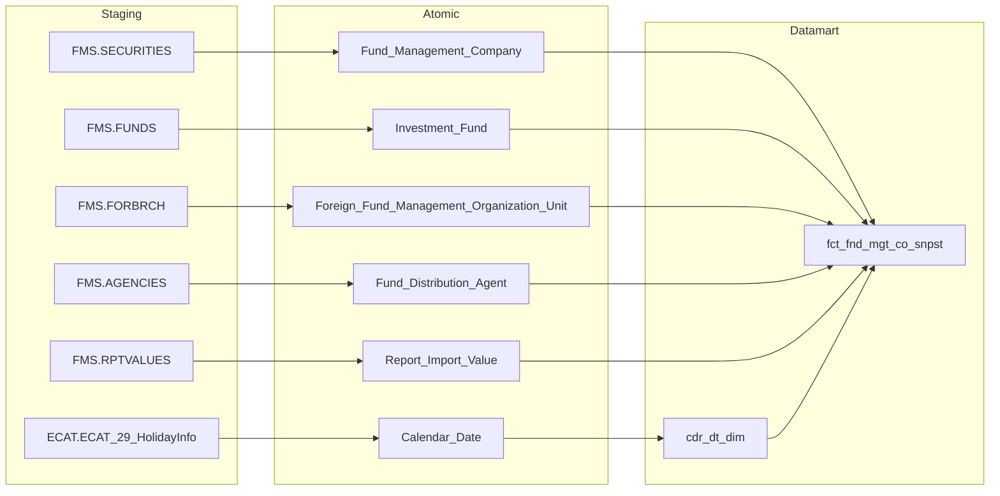
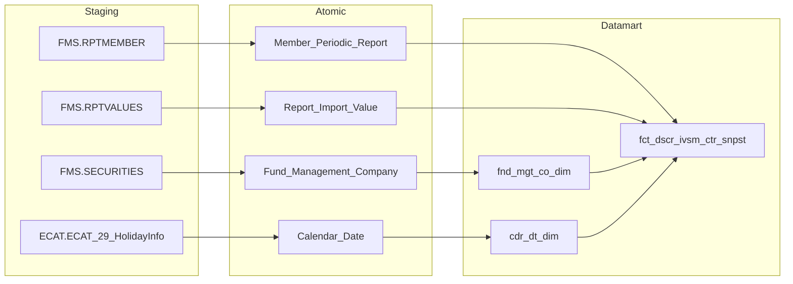
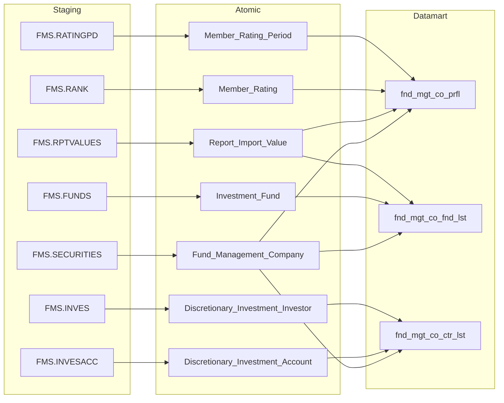
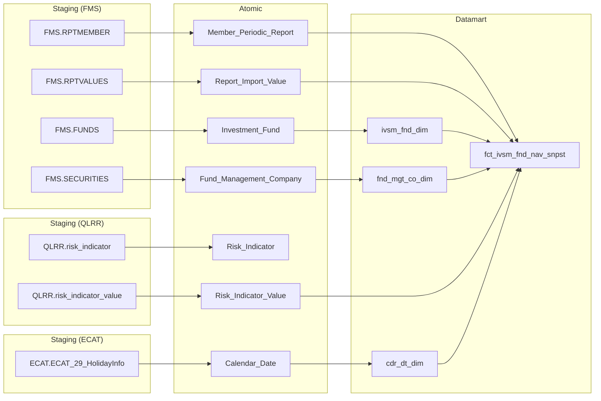
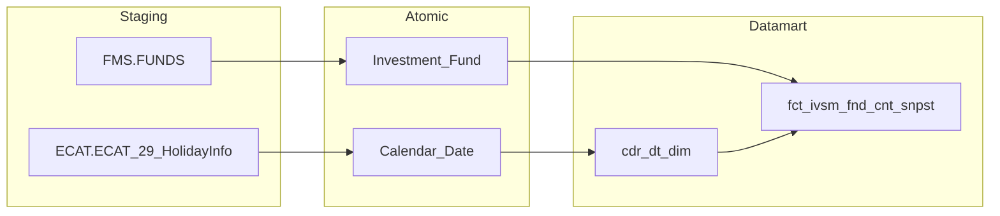
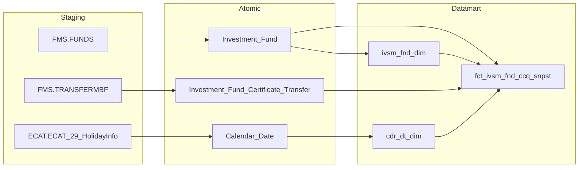
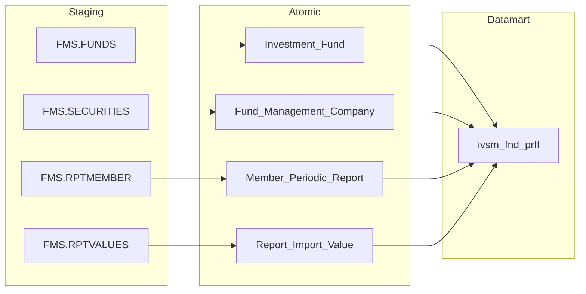
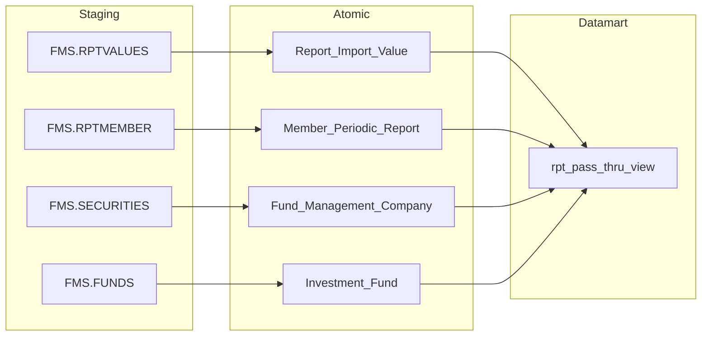
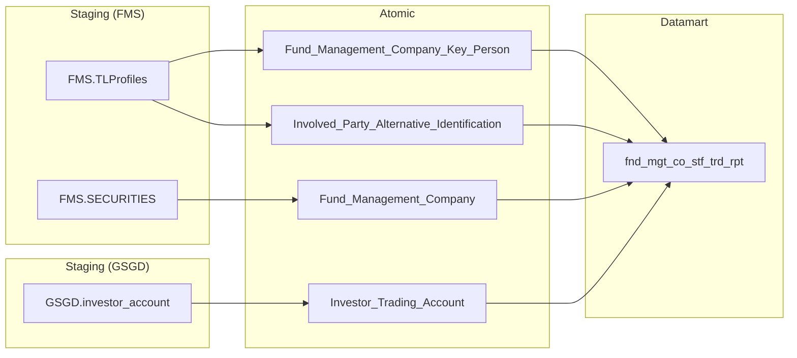

## 3.2.1 Luồng đồng bộ dữ liệu cho nhóm báo cáo Quản lý quỹ

### 3.2.1.1 Thông tin chung luồng đồng bộ

- tên job:
- nguồn dữ liệu (hệ thống nguồn): FMS, ECAT, QLRR, GSGD
- cách thức truy xuất đồng bộ dữ liệu:
- tần suất đồng bộ dữ liệu:
- dung lượng dữ liệu sẽ thực hiện đồng bộ:
- thời gian lưu trữ dữ liệu:
- thư mục lưu trữ dữ liệu trên kho dữ liệu:

### 3.2.1.2 Luồng nghiệp vụ

#### 3.2.1.2.1 Nhóm thông tin Thống kê thị trường toàn phần

**Mục đích:** Cung cấp bảng sự kiện tổng hợp thống kê toàn thị trường quản lý quỹ theo tháng, phục vụ Tab TỔNG QUAN CTQLQ — Nhóm 1 với các chỉ tiêu đếm số lượng công ty, quỹ, đại lý và tổng hợp AUM toàn thị trường.

**Mô tả luồng Staging → Atomic:**

- **Fund Management Company:** Bảng lưu thông tin công ty quản lý quỹ lấy thông tin từ bảng FMS.SECURITIES
- **Investment Fund:** Bảng lưu thông tin quỹ đầu tư lấy thông tin từ bảng FMS.FUNDS
- **Foreign Fund Management Organization Unit:** Bảng lưu thông tin văn phòng đại diện và chi nhánh công ty quản lý quỹ nước ngoài tại Việt Nam lấy thông tin từ bảng FMS.FORBRCH
- **Fund Distribution Agent:** Bảng lưu thông tin đại lý phân phối chứng chỉ quỹ lấy thông tin từ bảng FMS.AGENCIES
- **Report Import Value:** Bảng lưu giá trị các chỉ tiêu báo cáo định kỳ lấy thông tin từ bảng FMS.RPTVALUES
- **Calendar Date:** Bảng lưu thông tin lịch ngày lấy thông tin từ bảng ECAT.ECAT_29_HolidayInfo

**Mô tả luồng Atomic → Datamart:**

- **fct_fnd_mgt_co_snpst:** Bảng sự kiện tổng hợp thống kê toàn thị trường quản lý quỹ theo tháng — đếm số công ty, quỹ, văn phòng đại diện, chi nhánh, đại lý và tổng hợp AUM từ báo cáo
- **cdr_dt_dim:** Bảng lưu thông tin thời gian phục vụ slicer tháng/năm trên dashboard

---

#### 3.2.1.2.2 Nhóm thông tin Số liệu hợp đồng ủy thác danh mục per CTQLQ

**Mục đích:** Cung cấp bảng sự kiện tổng hợp số liệu hợp đồng ủy thác danh mục đầu tư theo từng công ty quản lý quỹ và kỳ báo cáo, phục vụ Tab TỔNG QUAN CTQLQ — Nhóm 2 với các chỉ tiêu số lượng và giá trị thị trường hợp đồng UTDM.

**Mô tả luồng Staging → Atomic:**

- **Member Periodic Report:** Bảng lưu thông tin kỳ báo cáo định kỳ của thành viên lấy thông tin từ bảng FMS.RPTMEMBER
- **Report Import Value:** Bảng lưu giá trị các chỉ tiêu báo cáo định kỳ lấy thông tin từ bảng FMS.RPTVALUES
- **Fund Management Company:** Bảng lưu thông tin công ty quản lý quỹ lấy thông tin từ bảng FMS.SECURITIES
- **Calendar Date:** Bảng lưu thông tin lịch ngày lấy thông tin từ bảng ECAT.ECAT_29_HolidayInfo

**Mô tả luồng Atomic → Datamart:**

- **fct_dscr_ivsm_ctr_snpst:** Bảng sự kiện tổng hợp thông tin số lượng và giá trị thị trường hợp đồng ủy thác danh mục đầu tư theo từng công ty quản lý quỹ và kỳ báo cáo
- **fnd_mgt_co_dim:** Bảng lưu thông tin công ty quản lý quỹ phục vụ tra cứu và lọc theo chiều CTQLQ
- **cdr_dt_dim:** Bảng lưu thông tin thời gian phục vụ slicer tháng/năm trên dashboard

---

#### 3.2.1.2.3 Nhóm thông tin Hồ sơ công ty quản lý quỹ

**Mục đích:** Cung cấp bảng tác nghiệp hồ sơ tổng hợp từng công ty quản lý quỹ cùng hai bảng con phục vụ drill-down danh sách quỹ và hợp đồng UTDM, phục vụ Tab TỔNG QUAN CTQLQ — Nhóm 3.

**Mô tả luồng Staging → Atomic:**

- **Fund Management Company:** Bảng lưu thông tin công ty quản lý quỹ lấy thông tin từ bảng FMS.SECURITIES
- **Investment Fund:** Bảng lưu thông tin quỹ đầu tư lấy thông tin từ bảng FMS.FUNDS
- **Report Import Value:** Bảng lưu giá trị các chỉ tiêu báo cáo định kỳ lấy thông tin từ bảng FMS.RPTVALUES
- **Member Rating:** Bảng lưu kết quả xếp loại CAMEL của thành viên lấy thông tin từ bảng FMS.RANK
- **Member Rating Period:** Bảng lưu thông tin kỳ đánh giá xếp loại lấy thông tin từ bảng FMS.RATINGPD
- **Discretionary Investment Account:** Bảng lưu thông tin tài khoản hợp đồng ủy thác danh mục đầu tư lấy thông tin từ bảng FMS.INVESACC
- **Discretionary Investment Investor:** Bảng lưu thông tin nhà đầu tư ủy thác danh mục lấy thông tin từ bảng FMS.INVES

**Mô tả luồng Atomic → Datamart:**

- **fnd_mgt_co_prfl:** Bảng tác nghiệp lưu danh sách công ty quản lý quỹ ở trạng thái mới nhất với đầy đủ thông tin hồ sơ, AUM, xếp loại CAMEL và số liệu tổng hợp
- **fnd_mgt_co_fnd_lst:** Bảng tác nghiệp lưu danh sách quỹ đầu tư theo từng công ty quản lý quỹ phục vụ popup drill-down
- **fnd_mgt_co_ctr_lst:** Bảng tác nghiệp lưu danh sách hợp đồng ủy thác danh mục đầu tư theo từng công ty quản lý quỹ phục vụ popup drill-down

---

#### 3.2.1.2.4 Nhóm thông tin NAV quỹ theo kỳ và chỉ tiêu kinh tế vĩ mô

**Mục đích:** Cung cấp bảng sự kiện NAV quỹ và phân bổ tài sản theo từng quỹ và kỳ báo cáo, kết hợp chỉ tiêu kinh tế vĩ mô GDP, VN-Index, lãi suất liên ngân hàng từ cross-module QLRR, phục vụ Tab QUỸ ĐẦU TƯ — Nhóm 4, 5, 6, 9.

**Mô tả luồng Staging → Atomic:**

- **Member Periodic Report:** Bảng lưu thông tin kỳ báo cáo định kỳ của thành viên lấy thông tin từ bảng FMS.RPTMEMBER
- **Report Import Value:** Bảng lưu giá trị các chỉ tiêu báo cáo định kỳ lấy thông tin từ bảng FMS.RPTVALUES
- **Investment Fund:** Bảng lưu thông tin quỹ đầu tư lấy thông tin từ bảng FMS.FUNDS
- **Fund Management Company:** Bảng lưu thông tin công ty quản lý quỹ lấy thông tin từ bảng FMS.SECURITIES
- **Risk Indicator:** Bảng lưu thông tin danh mục chỉ tiêu rủi ro lấy thông tin từ bảng QLRR.risk_indicator
- **Risk Indicator Value:** Bảng lưu giá trị các chỉ tiêu rủi ro và kinh tế vĩ mô (GDP, VN-Index, lãi suất liên ngân hàng) lấy thông tin từ bảng QLRR.risk_indicator_value
- **Calendar Date:** Bảng lưu thông tin lịch ngày lấy thông tin từ bảng ECAT.ECAT_29_HolidayInfo

**Mô tả luồng Atomic → Datamart:**

- **fct_ivsm_fnd_nav_snpst:** Bảng sự kiện tổng hợp thông tin NAV, phân bổ tài sản của từng quỹ đầu tư theo kỳ báo cáo, kết hợp chỉ tiêu GDP, VN-Index và lãi suất liên ngân hàng qua đêm từ cross-module QLRR
- **ivsm_fnd_dim:** Bảng lưu thông tin quỹ đầu tư phục vụ tra cứu và lọc theo chiều quỹ
- **fnd_mgt_co_dim:** Bảng lưu thông tin công ty quản lý quỹ phục vụ tra cứu và lọc theo chiều CTQLQ
- **cdr_dt_dim:** Bảng lưu thông tin thời gian phục vụ slicer tháng/năm trên dashboard

---

#### 3.2.1.2.5 Nhóm thông tin Số lượng quỹ theo loại hình

**Mục đích:** Cung cấp bảng sự kiện đếm số lượng quỹ đầu tư theo từng loại hình theo năm, phục vụ Tab QUỸ ĐẦU TƯ — Nhóm 7 với biểu đồ xu hướng số lượng quỹ qua các năm.

**Mô tả luồng Staging → Atomic:**

- **Investment Fund:** Bảng lưu thông tin quỹ đầu tư lấy thông tin từ bảng FMS.FUNDS
- **Calendar Date:** Bảng lưu thông tin lịch ngày lấy thông tin từ bảng ECAT.ECAT_29_HolidayInfo

**Mô tả luồng Atomic → Datamart:**

- **fct_ivsm_fnd_cnt_snpst:** Bảng sự kiện tổng hợp số lượng quỹ đầu tư theo từng loại hình (quỹ mở, ETF, đóng, thành viên, bất động sản, TTTTT, trái phiếu hạ tầng, hưu trí) theo năm
- **cdr_dt_dim:** Bảng lưu thông tin thời gian phục vụ slicer năm trên dashboard

---

#### 3.2.1.2.6 Nhóm thông tin Số lượng chứng chỉ quỹ lưu hành

**Mục đích:** Cung cấp bảng sự kiện số lượng chứng chỉ quỹ lưu hành theo từng quỹ và tháng snapshot, phục vụ Tab QUỸ ĐẦU TƯ — Nhóm 8 với biểu đồ tăng trưởng CCQ lưu hành theo loại hình quỹ.

**Mô tả luồng Staging → Atomic:**

- **Investment Fund:** Bảng lưu thông tin quỹ đầu tư lấy thông tin từ bảng FMS.FUNDS
- **Investment Fund Certificate Transfer:** Bảng lưu thông tin giao dịch chuyển nhượng chứng chỉ quỹ (mua/bán) lấy thông tin từ bảng FMS.TRANSFERMBF
- **Calendar Date:** Bảng lưu thông tin lịch ngày lấy thông tin từ bảng ECAT.ECAT_29_HolidayInfo

**Mô tả luồng Atomic → Datamart:**

- **fct_ivsm_fnd_ccq_snpst:** Bảng sự kiện tổng hợp số lượng chứng chỉ quỹ lưu hành per quỹ theo tháng snapshot, tính bằng tổng mua trừ tổng bán từ lịch sử giao dịch chuyển nhượng
- **ivsm_fnd_dim:** Bảng lưu thông tin quỹ đầu tư phục vụ tra cứu và lọc theo chiều quỹ
- **cdr_dt_dim:** Bảng lưu thông tin thời gian phục vụ slicer tháng/năm trên dashboard

---

#### 3.2.1.2.7 Nhóm thông tin Hồ sơ quỹ đầu tư

**Mục đích:** Cung cấp bảng tác nghiệp hồ sơ tổng hợp từng quỹ đầu tư với thông tin NAV, lợi nhuận YTD và số lượng CCQ lưu hành, phục vụ Tab QUỸ ĐẦU TƯ — Nhóm 10 với danh sách các quỹ đầu tư.

**Mô tả luồng Staging → Atomic:**

- **Investment Fund:** Bảng lưu thông tin quỹ đầu tư lấy thông tin từ bảng FMS.FUNDS
- **Fund Management Company:** Bảng lưu thông tin công ty quản lý quỹ lấy thông tin từ bảng FMS.SECURITIES
- **Member Periodic Report:** Bảng lưu thông tin kỳ báo cáo định kỳ của thành viên lấy thông tin từ bảng FMS.RPTMEMBER
- **Report Import Value:** Bảng lưu giá trị các chỉ tiêu báo cáo định kỳ lấy thông tin từ bảng FMS.RPTVALUES

**Mô tả luồng Atomic → Datamart:**

- **ivsm_fnd_prfl:** Bảng tác nghiệp lưu danh sách quỹ đầu tư ở trạng thái mới nhất với thông tin NAV, lợi nhuận YTD và số lượng CCQ lưu hành tại tháng slicer

---

#### 3.2.1.2.8 Nhóm thông tin Pass-through báo cáo định kỳ

**Mục đích:** Cung cấp bảng tác nghiệp pass-through toàn bộ nội dung báo cáo định kỳ từ hệ thống FMS, phục vụ Tab DATA EXPLORER — Nhóm 12 đến 16 bao gồm BCTC, báo cáo ATTC, QLĐMDT, báo cáo định kỳ CTQLQ và báo cáo theo loại quỹ.

**Mô tả luồng Staging → Atomic:**

- **Report Import Value:** Bảng lưu giá trị các chỉ tiêu báo cáo định kỳ lấy thông tin từ bảng FMS.RPTVALUES
- **Member Periodic Report:** Bảng lưu thông tin kỳ báo cáo định kỳ của thành viên lấy thông tin từ bảng FMS.RPTMEMBER
- **Fund Management Company:** Bảng lưu thông tin công ty quản lý quỹ lấy thông tin từ bảng FMS.SECURITIES
- **Investment Fund:** Bảng lưu thông tin quỹ đầu tư lấy thông tin từ bảng FMS.FUNDS

**Mô tả luồng Atomic → Datamart:**

- **rpt_pass_thru_view:** Bảng tác nghiệp lưu toàn bộ dữ liệu báo cáo dạng flat theo từng công ty quản lý quỹ hoặc quỹ, biểu mẫu báo cáo, kỳ báo cáo và dòng chỉ tiêu — phục vụ 63 tab pass-through và 19 tab phức tạp trên DataExplorer

---

#### 3.2.1.2.9 Nhóm thông tin Báo cáo giao dịch nhân viên công ty quản lý quỹ

**Mục đích:** Cung cấp bảng tác nghiệp báo cáo giao dịch chứng khoán của nhân viên công ty quản lý quỹ thông qua cross-module FMS và GSGD, phục vụ Tab BÁO CÁO / CÔNG TY QLQ — Nhóm 11.

**Mô tả luồng Staging → Atomic:**

- **Fund Management Company Key Person:** Bảng lưu thông tin nhân viên chủ chốt của công ty quản lý quỹ lấy thông tin từ bảng FMS.TLProfiles
- **Involved Party Alternative Identification:** Bảng lưu thông tin định danh thay thế (CCCD/Hộ chiếu) của bên liên quan lấy thông tin từ bảng FMS.TLProfiles, kết hợp thông tin tài khoản giao dịch chứng khoán từ các bảng FMS.SECURITIES, GSGD.investor_account
- **Fund Management Company:** Bảng lưu thông tin công ty quản lý quỹ lấy thông tin từ bảng FMS.SECURITIES
- **Investor Trading Account:** Bảng lưu thông tin tài khoản giao dịch chứng khoán của nhà đầu tư lấy thông tin từ bảng GSGD.investor_account

**Mô tả luồng Atomic → Datamart:**

- **fnd_mgt_co_stf_trd_rpt:** Bảng tác nghiệp lưu danh sách nhân viên công ty quản lý quỹ ở trạng thái mới nhất kèm thông tin tài khoản giao dịch chứng khoán, phục vụ giám sát giao dịch chứng khoán của nhân viên CTQLQ