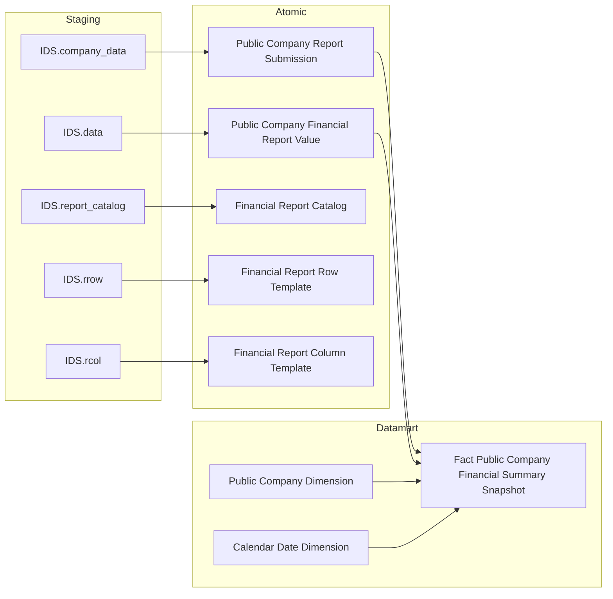
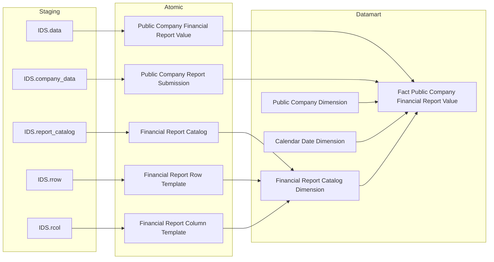

## 3.1.5 LUỒNG ĐỒNG BỘ DỮ LIỆU CHO NHÓM BÁO CÁO Giám sát Công ty Đại chúng

### 3.1.5.1 Thông tin chung luồng đồng bộ

- Tên job:
- Nguồn dữ liệu (Hệ thống nguồn): IDS
- Cách thức truy xuất đồng bộ dữ liệu:
- Tần suất đồng bộ dữ liệu:
- Dung lượng dữ liệu sẽ thực hiện đồng bộ:
- Thời gian lưu trữ dữ liệu:
- Thư mục lưu trữ dữ liệu trên kho dữ liệu:

### 3.1.5.2 Luồng nghiệp vụ

#### 3.1.5.2.1 Nhóm thông tin Báo cáo tài chính & Nộp báo cáo

**Mục đích:** Cung cấp bảng sự kiện tổng hợp tài chính theo kỳ báo cáo cho Màn hình 2 (Giám sát Tổng hợp) và Màn hình 4 (Báo cáo giám sát CTDC). Mỗi dòng tổng hợp 13 chỉ tiêu tài chính chính của một doanh nghiệp trong một kỳ (năm × quý).

**Mô tả luồng:**

Staging → Atomic:
- **Public Company Report Submission:** Bảng lưu thông tin lần nộp báo cáo của từng công ty đại chúng — kỳ báo cáo, ngày nộp, hạn nộp — lấy thông tin từ bảng IDS.company_data.
- **Public Company Financial Report Value:** Bảng lưu giá trị từng ô chỉ tiêu trong báo cáo tài chính theo định dạng tall (1 dòng / 1 ô) — lấy thông tin từ bảng IDS.data.
- **Financial Report Catalog:** Bảng lưu danh mục biểu mẫu BCTC (tên, loại hình DN, chiều) — lấy thông tin từ bảng IDS.report_catalog.
- **Financial Report Row Template:** Bảng lưu template dòng chỉ tiêu của biểu mẫu BCTC — lấy thông tin từ bảng IDS.rrow.
- **Financial Report Column Template:** Bảng lưu template cột của biểu mẫu BCTC — lấy thông tin từ bảng IDS.rcol.

Atomic → Datamart:
- **Fact Public Company Financial Summary Snapshot:** Bảng sự kiện tổng hợp tài chính dạng Periodic Snapshot — pivot 13 chỉ tiêu tài chính chính (tổng tài sản, nợ, VCSH, lợi nhuận...) từ định dạng tall Atomic sang wide, phục vụ phân tích tổng hợp và so sánh theo sàn, ngành, kỳ.
- **Public Company Dimension:** Bảng lưu thông tin chiều công ty đại chúng theo dạng SCD2, cho phép tra cứu doanh nghiệp theo thời điểm.
- **Calendar Date Dimension:** Bảng lưu thông tin thời gian.

---

#### 3.1.5.2.2 Nhóm thông tin Chi tiết BCTC từng CTDC & Danh mục template

**Mục đích:** Cung cấp bảng sự kiện chi tiết BCTC theo từng chỉ tiêu (1 dòng / CTDC / kỳ / dòng chỉ tiêu / cột) và bảng chiều danh mục BCTC phục vụ Data Explorer tra cứu giá trị từng ô BCTC của từng doanh nghiệp (Màn hình 3, STT 21–32 + STT 39).

**Mô tả luồng:**

Staging → Atomic:
- **Public Company Report Submission:** Bảng lưu thông tin lần nộp báo cáo của từng công ty đại chúng — kỳ báo cáo, ngày nộp, hạn nộp — lấy thông tin từ bảng IDS.company_data.
- **Public Company Financial Report Value:** Bảng lưu giá trị từng ô chỉ tiêu trong báo cáo tài chính theo định dạng tall (1 dòng / 1 ô) — lấy thông tin từ bảng IDS.data.
- **Financial Report Catalog:** Bảng lưu danh mục biểu mẫu BCTC (tên, loại hình DN, chiều) — lấy thông tin từ bảng IDS.report_catalog.
- **Financial Report Row Template:** Bảng lưu template dòng chỉ tiêu của biểu mẫu BCTC — lấy thông tin từ bảng IDS.rrow.
- **Financial Report Column Template:** Bảng lưu template cột của biểu mẫu BCTC — lấy thông tin từ bảng IDS.rcol.

Atomic → Datamart:
- **Fact Public Company Financial Report Value:** Bảng sự kiện chi tiết BCTC giữ nguyên định dạng tall từ Atomic — 1 dòng cho mỗi tổ hợp CTDC × kỳ × dòng chỉ tiêu × cột, phục vụ tra cứu toàn bộ chỉ tiêu BCTC trong Data Explorer.
- **Financial Report Catalog Dimension:** Bảng lưu thông tin danh mục BCTC dạng cross-tab — mỗi dòng tương ứng một tổ hợp (biểu mẫu × dòng chỉ tiêu × cột), cung cấp tên và thứ tự hiển thị cho Data Explorer.
- **Public Company Dimension:** Bảng lưu thông tin chiều công ty đại chúng theo dạng SCD2, cho phép tra cứu doanh nghiệp theo thời điểm.
- **Calendar Date Dimension:** Bảng lưu thông tin thời gian.
