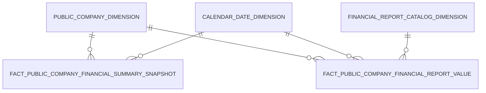

# 3. KHO DỮ LIỆU (OLAP) — Giám sát Công ty Đại chúng

## 3.1 Mô hình dữ liệu mức High Level / Conceptual

### 3.1.1 Sơ đồ ERD



### 3.1.2 Danh sách thực thể

| STT | Thực thể | Tên bảng | Mô tả |
|---|---|---|---|
| 1 | Public Company Dimension | pblc_co_dim | Chiều công ty đại chúng — SCD2. Dùng chung toàn bộ màn hình GSDC. |
| 2 | Financial Report Catalog Dimension | fnc_rpt_ctlg_dim | Chiều danh mục báo cáo tài chính dạng ma trận (báo cáo, dòng, cột) |
| 3 | Fact Public Company Financial Summary Snapshot | fct_pblc_co_fnc_sumry_snpst | Ảnh chụp tài chính tổng hợp định kỳ của công ty đại chúng theo từng kỳ báo cáo (năm, quý) |
| 4 | Fact Public Company Financial Report Value | fct_pblc_co_fnc_rpt_val | Dữ liệu chi tiết báo cáo tài chính của công ty đại chúng theo từng kỳ báo cáo và chỉ tiêu |

---

## 3.2 Mô hình dữ liệu mức Logic

### 3.2.1 Sơ đồ ERD

```mermaid
erDiagram
    PUBLIC_COMPANY_DIMENSION["Public Company Dimension"] {
        string Public_Company_Dimension_Id PK
        string Public_Company_Code NK
        string Equity_Ticker_Code
        string Public_Company_Name
        string Public_Company_Short_Name
        string Enterprise_Type_Code
        string Life_Cycle_Status_Code
        string Equity_Listing_Exchange_Code
        string Industry_Category_Level1_Code
        string Industry_Category_Level2_Code
        date IDS_Registration_Date
        boolean IDS_Registration_Flag
        string Financial_Statement_Type_Code
    }
    FINANCIAL_REPORT_CATALOG_DIMENSION["Financial Report Catalog Dimension"] {
        string Financial_Report_Catalog_Dimension_Id PK
        string Financial_Report_Catalog_Business_Code NK
        string Row_Code NK
        string Column_Code NK
        string Financial_Report_Catalog_Name
        string Enterprise_Type_Code
        string Report_Direction_Type_Code
        boolean Active_Flag
        string Row_Name
        string Row_Description_Column_Code
        int Row_Index
        string Column_Name
        int Column_Index
    }
    FACT_PUBLIC_COMPANY_FINANCIAL_SUMMARY_SNAPSHOT["Fact Public Company Financial Summary Snapshot"] {
        string Public_Company_Dimension_Id FK
        string Report_Period_Date_Dimension_Id FK
        int Report_Year DD
        int Report_Quarter DD
        string Equity_Listing_Exchange_Code DD
        string Enterprise_Type_Code DD
        string Industry_Category_Level1_Code DD
        date Submission_Date
        date Submission_Deadline_Date
        float Total_Asset_Amount
        float Total_Asset_Prior_Period_Amount
        float Total_Liability_Amount
        float Equity_Amount
        float Equity_Prior_Period_Amount
        float Charter_Capital_Amount
        float Net_Profit_Amount
        float Net_Profit_YTD_Amount
        float Pre_Tax_Profit_Amount
        float Inventory_Amount
        float Revenue_Amount
        float Receivable_Amount
        float Cash_Equivalent_Amount
    }
    FACT_PUBLIC_COMPANY_FINANCIAL_REPORT_VALUE["Fact Public Company Financial Report Value"] {
        string Public_Company_Dimension_Id FK
        string Report_Period_Date_Dimension_Id FK
        string Financial_Report_Catalog_Dimension_Id FK
        int Report_Year DD
        int Report_Quarter DD
        string Data_Value
        string Cell_Type_Code
    }
    PUBLIC_COMPANY_DIMENSION ||--o{ FACT_PUBLIC_COMPANY_FINANCIAL_SUMMARY_SNAPSHOT : " "
    PUBLIC_COMPANY_DIMENSION ||--o{ FACT_PUBLIC_COMPANY_FINANCIAL_REPORT_VALUE : " "
    FINANCIAL_REPORT_CATALOG_DIMENSION ||--o{ FACT_PUBLIC_COMPANY_FINANCIAL_REPORT_VALUE : " "
```

### 3.2.2 Danh sách các bảng và thuộc tính

#### 3.2.2.1 Bảng Public Company Dimension

| STT | Tên trường | Kiểu dữ liệu và độ dài | Nullable | Unique | P/F Key | Mặc định | Mô tả |
|---|---|---|---|---|---|---|---|
| 1 | Public Company Dimension Id | string |  | X | P |  | Khóa đại diện tự sinh |
| 2 | Public Company Code | string | | | | | Mã công ty đại chúng — khóa nghiệp vụ kết nối với Fact |
| 3 | Equity Ticker Code | string | X | | | | Mã chứng khoán cổ phiếu |
| 4 | Public Company Name | string | | | | | Tên công ty đại chúng |
| 5 | Public Company Short Name | string | X | | | | Tên viết tắt |
| 6 | Enterprise Type Code | string | X | | | | Loại hình doanh nghiệp |
| 7 | Life Cycle Status Code | string | X | | | | Trạng thái vòng đời |
| 8 | Equity Listing Exchange Code | string | X | | | | Sàn niêm yết cổ phiếu |
| 9 | Industry Category Level1 Code | string | X | | | | Mã ngành kinh tế cấp 1 |
| 10 | Industry Category Level2 Code | string | X | | | | Mã ngành kinh tế cấp 2 |
| 11 | IDS Registration Date | date | X | | | | Ngày đăng ký IDS — dùng cho KPI Số DN |
| 12 | IDS Registration Flag | boolean | X | | | | Cờ đăng ký IDS |
| 13 | Financial Statement Type Code | string | X | | | | Loại báo cáo tài chính |

#### 3.2.2.2 Bảng Financial Report Catalog Dimension

| STT | Tên trường | Kiểu dữ liệu và độ dài | Nullable | Unique | P/F Key | Mặc định | Mô tả |
|---|---|---|---|---|---|---|---|
| 1 | Financial Report Catalog Dimension Id | string |  | X | P |  | Khóa đại diện tự sinh. Composite NK: Mã biểu mẫu + Mã dòng + Mã cột |
| 2 | Financial Report Catalog Business Code | string | | | | | Mã nghiệp vụ báo cáo — phần 1 của composite NK |
| 3 | Row Code | string | | | | | Mã dòng BCTC — phần 2 của composite NK |
| 4 | Column Code | string | | | | | Mã cột BCTC — phần 3 của composite NK |
| 5 | Financial Report Catalog Name | string | X | | | | Tên báo cáo tài chính |
| 6 | Enterprise Type Code | string | X | | | | Loại hình DN áp dụng báo cáo |
| 7 | Report Direction Type Code | string | X | | | | Chiều báo cáo (nộp/phát hành) |
| 8 | Active Flag | boolean | X | | | | Cờ báo cáo đang hoạt động |
| 9 | Row Name | string | X | | | | Tên dòng chỉ tiêu BCTC |
| 10 | Row Description Column Code | string | X | | | | Mã hiển thị dòng chỉ tiêu — dùng làm bộ lọc chính cho Fact chi tiết |
| 11 | Row Index | int | X | | | | Thứ tự hiển thị dòng trong báo cáo |
| 12 | Column Name | string | X | | | | Tên cột chỉ tiêu BCTC |
| 13 | Column Index | int | X | | | | Thứ tự hiển thị cột trong báo cáo |

#### 3.2.2.3 Bảng Fact Public Company Financial Summary Snapshot

| STT | Tên trường | Kiểu dữ liệu và độ dài | Nullable | Unique | P/F Key | Mặc định | Mô tả |
|---|---|---|---|---|---|---|---|
| 1 | Public Company Dimension Id | string | | | F | | FK chiều công ty đại chúng |
| 2 | Report Period Date Dimension Id | string | | | F | | FK chiều ngày kỳ báo cáo |
| 3 | Report Year | int | X | | | | Năm báo cáo |
| 4 | Report Quarter | int | X | | | | Quý báo cáo |
| 5 | Equity Listing Exchange Code | string | X | | | | Sàn niêm yết — denormalized từ Public Company cho bộ lọc nhanh |
| 6 | Enterprise Type Code | string | X | | | | Loại hình DN — denormalized từ Public Company |
| 7 | Industry Category Level1 Code | string | X | | | | Ngành kinh tế cấp 1 — denormalized từ Public Company |
| 8 | Submission Date | date | X | | | | Ngày nộp BCTC thực tế — dùng tính tỷ lệ nộp đúng hạn |
| 9 | Submission Deadline Date | date | X | | | | Hạn nộp BCTC — dùng tính tỷ lệ nộp đúng hạn |
| 10 | Total Asset Amount | decimal(23,2) | X | | | | Tổng tài sản cuối kỳ |
| 11 | Total Asset Prior Period Amount | decimal(23,2) | X | | | | Tổng tài sản đầu kỳ |
| 12 | Total Liability Amount | decimal(23,2) | X | | | | Nợ phải trả cuối kỳ |
| 13 | Equity Amount | decimal(23,2) | X | | | | Vốn chủ sở hữu cuối kỳ |
| 14 | Equity Prior Period Amount | decimal(23,2) | X | | | | Vốn chủ sở hữu đầu kỳ |
| 15 | Charter Capital Amount | decimal(23,2) | X | | | | Vốn điều lệ |
| 16 | Net Profit Amount | decimal(23,2) | X | | | | Lợi nhuận sau thuế |
| 17 | Net Profit YTD Amount | decimal(23,2) | X | | | | Lợi nhuận sau thuế dồn tích lũy kế |
| 18 | Pre Tax Profit Amount | decimal(23,2) | X | | | | Lợi nhuận kế toán trước thuế |
| 19 | Inventory Amount | decimal(23,2) | X | | | | Hàng tồn kho |
| 20 | Revenue Amount | decimal(23,2) | X | | | | Doanh thu thuần |
| 21 | Receivable Amount | decimal(23,2) | X | | | | Phải thu (ngắn hạn và dài hạn) |
| 22 | Cash Equivalent Amount | decimal(23,2) | X | | | | Tiền và tương đương tiền |

#### 3.2.2.4 Bảng Fact Public Company Financial Report Value

| STT | Tên trường | Kiểu dữ liệu và độ dài | Nullable | Unique | P/F Key | Mặc định | Mô tả |
|---|---|---|---|---|---|---|---|
| 1 | Public Company Dimension Id | string | | | F | | FK chiều công ty đại chúng |
| 2 | Report Period Date Dimension Id | string | | | F | | FK chiều ngày báo cáo |
| 3 | Financial Report Catalog Dimension Id | string | | | F | | FK chiều danh mục BCTC |
| 4 | Report Year | int | X | | | | Năm báo cáo |
| 5 | Report Quarter | int | X | | | | Quý báo cáo |
| 6 | Data Value | string | X | | | | Giá trị chỉ tiêu BCTC — lưu dạng chuỗi; chuyển đổi sang số tại tầng truy vấn khi cần |
| 7 | Cell Type Code | string | X | | | | Loại ô dữ liệu BCTC |

---

## 3.3 Mô hình dữ liệu mức vật lý

### 3.3.1 Sơ đồ ERD

```mermaid
erDiagram
    PUBLIC_COMPANY_DIMENSION["pblc_co_dim"] {
        string pblc_co_dim_id PK
        string pblc_co_code NK
        string eqty_ticker_code
        string pblc_co_nm
        string pblc_co_shrt_nm
        string entp_tp_code
        string lcs_code
        string eqty_listing_exg_code
        string idy_cgy_level1_code
        string idy_cgy_level2_code
        date ids_rgst_dt
        boolean ids_rgst_f
        string fnc_stmt_tp_code
    }
    FINANCIAL_REPORT_CATALOG_DIMENSION["fnc_rpt_ctlg_dim"] {
        string fnc_rpt_ctlg_dim_id PK
        string fnc_rpt_ctlg_bsn_code NK
        string row_code NK
        string clmn_code NK
        string fnc_rpt_ctlg_nm
        string entp_tp_code
        string rpt_drc_tp_code
        boolean actv_f
        string row_nm
        string row_dsc_clmn_code
        int row_indx
        string clmn_nm
        int clmn_indx
    }
    FACT_SUMMARY["fct_pblc_co_fnc_sumry_snpst"] {
        string pblc_co_dim_id FK
        string rpt_period_dt_dim_id FK
        int rpt_yr
        int rpt_qtr
        string eqty_listing_exg_code
        string entp_tp_code
        string idy_cgy_level1_code
        date subm_dt
        date subm_ddln_dt
        float total_ast_amt
        float total_ast_prior_period_amt
        float total_liab_amt
        float eqty_amt
        float eqty_prior_period_amt
        float charter_cptl_amt
        float net_prft_amt
        float net_prft_ytd_amt
        float pre_tax_prft_amt
        float invt_amt
        float rev_amt
        float rcvb_amt
        float cash_eqvl_amt
    }
    FACT_DETAIL["fct_pblc_co_fnc_rpt_val"] {
        string pblc_co_dim_id FK
        string rpt_period_dt_dim_id FK
        string fnc_rpt_ctlg_dim_id FK
        int rpt_yr
        int rpt_qtr
        string data_val
        string cell_tp_code
    }
    PUBLIC_COMPANY_DIMENSION ||--o{ FACT_SUMMARY : " "
    PUBLIC_COMPANY_DIMENSION ||--o{ FACT_DETAIL : " "
    FINANCIAL_REPORT_CATALOG_DIMENSION ||--o{ FACT_DETAIL : " "
```

### 3.3.2 Danh sách bảng Dimension

#### 3.3.2.1 Bảng Public Company Dimension (pblc_co_dim)

*Mô tả bảng:* Chiều công ty đại chúng — SCD2. Dùng chung toàn bộ màn hình GSDC.
*Đường dẫn trên kho dữ liệu:*
*Các trường Partition:*
*Thời gian lưu trữ:*
*Định dạng lưu trữ:*

| STT | Tên trường | Kiểu dữ liệu và độ dài | Nullable | Unique | P/F Key | Giá trị mặc định | Mô tả | Hệ thống nguồn | Schema.Table | Source Field Name | ETL Rules |
|---|---|---|---|---|---|---|---|---|---|---|---|
| 1 | pblc_co_dim_id | string |  | X | P |  | Khóa đại diện tự sinh |  |  |  | ETL sinh tự động |
| 2 | pblc_co_code | string | | | | | Mã công ty đại chúng — khóa nghiệp vụ kết nối với Fact | IDS | ATM.pblc_co | pblc_co_code | pblc_co.pblc_co_code |
| 3 | eqty_ticker_code | string | X | | | | Mã chứng khoán cổ phiếu | IDS | ATM.pblc_co | eqty_ticker | pblc_co.eqty_ticker |
| 4 | pblc_co_nm | string | | | | | Tên công ty đại chúng | IDS | ATM.pblc_co | pblc_co_nm | pblc_co.pblc_co_nm |
| 5 | pblc_co_shrt_nm | string | X | | | | Tên viết tắt | IDS | ATM.pblc_co | pblc_co_shrt_nm | pblc_co.pblc_co_shrt_nm |
| 6 | entp_tp_code | string | X | | | | Loại hình doanh nghiệp | IDS | ATM.pblc_co | entp_tp_code | pblc_co.entp_tp_code |
| 7 | lcs_code | string | X | | | | Trạng thái vòng đời | IDS | ATM.pblc_co | lcs_code | pblc_co.lcs_code |
| 8 | eqty_listing_exg_code | string | X | | | | Sàn niêm yết cổ phiếu | IDS | ATM.pblc_co | eqty_listing_exg_code | pblc_co.eqty_listing_exg_code |
| 9 | idy_cgy_level1_code | string | X | | | | Mã ngành kinh tế cấp 1 | IDS | ATM.pblc_co | idy_cgy_level1_code | pblc_co.idy_cgy_level1_code |
| 10 | idy_cgy_level2_code | string | X | | | | Mã ngành kinh tế cấp 2 | IDS | ATM.pblc_co | idy_cgy_level2_code | pblc_co.idy_cgy_level2_code |
| 11 | ids_rgst_dt | date | X | | | | Ngày đăng ký IDS — dùng cho KPI Số DN | IDS | ATM.pblc_co | ids_rgst_dt | pblc_co.ids_rgst_dt |
| 12 | ids_rgst_f | boolean | X | | | | Cờ đăng ký IDS | IDS | ATM.pblc_co | ids_rgst_f | pblc_co.ids_rgst_f |
| 13 | fnc_stmt_tp_code | string | X | | | | Loại báo cáo tài chính | IDS | ATM.pblc_co | fnc_stmt_tp_code | pblc_co.fnc_stmt_tp_code |

#### 3.3.2.2 Bảng Financial Report Catalog Dimension (fnc_rpt_ctlg_dim)

*Mô tả bảng:* Chiều danh mục báo cáo tài chính dạng ma trận (báo cáo, dòng, cột)
*Đường dẫn trên kho dữ liệu:*
*Các trường Partition:*
*Thời gian lưu trữ:*
*Định dạng lưu trữ:*

| STT | Tên trường | Kiểu dữ liệu và độ dài | Nullable | Unique | P/F Key | Giá trị mặc định | Mô tả | Hệ thống nguồn | Schema.Table | Source Field Name | ETL Rules |
|---|---|---|---|---|---|---|---|---|---|---|---|
| 1 | fnc_rpt_ctlg_dim_id | string |  | X | P |  | Khóa đại diện tự sinh. Composite NK: Mã biểu mẫu + Mã dòng + Mã cột |  |  |  | ETL sinh tự động |
| 2 | fnc_rpt_ctlg_bsn_code | string | | | | | Mã nghiệp vụ báo cáo — phần 1 của composite NK | IDS | ATM.fnc_rpt_ctlg | fnc_rpt_ctlg_bsn_code | fnc_rpt_ctlg.fnc_rpt_ctlg_bsn_code |
| 3 | row_code | string | | | | | Mã dòng BCTC — phần 2 của composite NK | IDS | ATM.fnc_rpt_row_tpl | row_code | INNER JOIN fnc_rpt_row_tpl ON fnc_rpt_row_tpl.fnc_rpt_ctlg_id = fnc_rpt_ctlg.fnc_rpt_ctlg_id → fnc_rpt_row_tpl.row_code |
| 4 | clmn_code | string | | | | | Mã cột BCTC — phần 3 của composite NK | IDS | ATM.fnc_rpt_clmn_tpl | clmn_code | INNER JOIN fnc_rpt_clmn_tpl ON fnc_rpt_clmn_tpl.fnc_rpt_ctlg_id = fnc_rpt_ctlg.fnc_rpt_ctlg_id → fnc_rpt_clmn_tpl.clmn_code |
| 5 | fnc_rpt_ctlg_nm | string | X | | | | Tên báo cáo tài chính | IDS | ATM.fnc_rpt_ctlg | fnc_rpt_ctlg_nm | fnc_rpt_ctlg.fnc_rpt_ctlg_nm |
| 6 | entp_tp_code | string | X | | | | Loại hình DN áp dụng báo cáo | IDS | ATM.fnc_rpt_ctlg | entp_tp_code | fnc_rpt_ctlg.entp_tp_code |
| 7 | rpt_drc_tp_code | string | X | | | | Chiều báo cáo (nộp/phát hành) | IDS | ATM.fnc_rpt_ctlg | rpt_drc_tp_code | fnc_rpt_ctlg.rpt_drc_tp_code |
| 8 | actv_f | boolean | X | | | | Cờ báo cáo đang hoạt động | IDS | ATM.fnc_rpt_ctlg | actv_f | fnc_rpt_ctlg.actv_f |
| 9 | row_nm | string | X | | | | Tên dòng chỉ tiêu BCTC | IDS | ATM.fnc_rpt_row_tpl | row_nm | INNER JOIN fnc_rpt_row_tpl ON fnc_rpt_row_tpl.fnc_rpt_ctlg_id = fnc_rpt_ctlg.fnc_rpt_ctlg_id → fnc_rpt_row_tpl.row_nm |
| 10 | row_dsc_clmn_code | string | X | | | | Mã hiển thị dòng chỉ tiêu — dùng làm bộ lọc chính cho Fact chi tiết | IDS | ATM.fnc_rpt_row_tpl | row_dsc_clmn_code | INNER JOIN fnc_rpt_row_tpl ON fnc_rpt_row_tpl.fnc_rpt_ctlg_id = fnc_rpt_ctlg.fnc_rpt_ctlg_id → fnc_rpt_row_tpl.row_dsc_clmn_code |
| 11 | row_indx | int | X | | | | Thứ tự hiển thị dòng trong báo cáo | IDS | ATM.fnc_rpt_row_tpl | row_indx | INNER JOIN fnc_rpt_row_tpl ON fnc_rpt_row_tpl.fnc_rpt_ctlg_id = fnc_rpt_ctlg.fnc_rpt_ctlg_id → fnc_rpt_row_tpl.row_indx |
| 12 | clmn_nm | string | X | | | | Tên cột chỉ tiêu BCTC | IDS | ATM.fnc_rpt_clmn_tpl | clmn_nm | INNER JOIN fnc_rpt_clmn_tpl ON fnc_rpt_clmn_tpl.fnc_rpt_ctlg_id = fnc_rpt_ctlg.fnc_rpt_ctlg_id → fnc_rpt_clmn_tpl.clmn_nm |
| 13 | clmn_indx | int | X | | | | Thứ tự hiển thị cột trong báo cáo | IDS | ATM.fnc_rpt_clmn_tpl | clmn_indx | INNER JOIN fnc_rpt_clmn_tpl ON fnc_rpt_clmn_tpl.fnc_rpt_ctlg_id = fnc_rpt_ctlg.fnc_rpt_ctlg_id → fnc_rpt_clmn_tpl.clmn_indx |

### 3.3.3 Danh sách bảng Detail Fact

#### 3.3.3.1 Bảng Fact Public Company Financial Summary Snapshot (fct_pblc_co_fnc_sumry_snpst)

*Mô tả bảng:* Ảnh chụp tài chính tổng hợp định kỳ của công ty đại chúng theo từng kỳ báo cáo (năm, quý)
*Đường dẫn trên kho dữ liệu:*
*Các trường Partition:*
*Thời gian lưu trữ:*
*Định dạng lưu trữ:*

| STT | Tên trường | Kiểu dữ liệu và độ dài | Nullable | Unique | P/F Key | Giá trị mặc định | Mô tả | Hệ thống nguồn | Schema.Table | Source Field Name | ETL Rules |
|---|---|---|---|---|---|---|---|---|---|---|---|
| 1 | pblc_co_dim_id | string | | | F | | FK chiều công ty đại chúng | IDS | ATM.pblc_co_rpt_subm | pblc_co_code | JOIN pblc_co_rpt_subm ON pblc_co_rpt_subm.pblc_co_rpt_subm_id = pblc_co_fnc_rpt_val.pblc_co_rpt_subm_id → LOOKUP pblc_co_dim ON pblc_co_dim.pblc_co_code = pblc_co_rpt_subm.pblc_co_code AND pblc_co_rpt_subm.subm_dt BETWEEN pblc_co_dim.eff_dt AND pblc_co_dim.expiry_dt |
| 2 | rpt_period_dt_dim_id | string | | | F | | FK chiều ngày kỳ báo cáo | IDS | ATM.pblc_co_rpt_subm | subm_ddln_dt | JOIN pblc_co_rpt_subm ON pblc_co_rpt_subm.pblc_co_rpt_subm_id = pblc_co_fnc_rpt_val.pblc_co_rpt_subm_id → LOOKUP cdr_dt_dim ON cdr_dt_dim.dt = pblc_co_rpt_subm.subm_ddln_dt |
| 3 | rpt_yr | int | X | | | | Năm báo cáo | IDS | ATM.pblc_co_rpt_subm | rpt_yr | JOIN pblc_co_rpt_subm ON pblc_co_rpt_subm.pblc_co_rpt_subm_id = pblc_co_fnc_rpt_val.pblc_co_rpt_subm_id → pblc_co_rpt_subm.rpt_yr |
| 4 | rpt_qtr | int | X | | | | Quý báo cáo | IDS | ATM.pblc_co_rpt_subm | rpt_qtr | JOIN pblc_co_rpt_subm ON pblc_co_rpt_subm.pblc_co_rpt_subm_id = pblc_co_fnc_rpt_val.pblc_co_rpt_subm_id → pblc_co_rpt_subm.rpt_qtr |
| 5 | eqty_listing_exg_code | string | X | | | | Sàn niêm yết — denormalized từ Public Company cho bộ lọc nhanh | IDS | ATM.pblc_co | eqty_listing_exg_code | JOIN pblc_co_rpt_subm ON pblc_co_rpt_subm.pblc_co_rpt_subm_id = pblc_co_fnc_rpt_val.pblc_co_rpt_subm_id → INNER JOIN pblc_co ON pblc_co.pblc_co_code = pblc_co_rpt_subm.pblc_co_code → pblc_co.eqty_listing_exg_code |
| 6 | entp_tp_code | string | X | | | | Loại hình DN — denormalized từ Public Company | IDS | ATM.pblc_co | entp_tp_code | JOIN pblc_co_rpt_subm ON pblc_co_rpt_subm.pblc_co_rpt_subm_id = pblc_co_fnc_rpt_val.pblc_co_rpt_subm_id → INNER JOIN pblc_co ON pblc_co.pblc_co_code = pblc_co_rpt_subm.pblc_co_code → pblc_co.entp_tp_code |
| 7 | idy_cgy_level1_code | string | X | | | | Ngành kinh tế cấp 1 — denormalized từ Public Company | IDS | ATM.pblc_co | idy_cgy_level1_code | JOIN pblc_co_rpt_subm ON pblc_co_rpt_subm.pblc_co_rpt_subm_id = pblc_co_fnc_rpt_val.pblc_co_rpt_subm_id → INNER JOIN pblc_co ON pblc_co.pblc_co_code = pblc_co_rpt_subm.pblc_co_code → pblc_co.idy_cgy_level1_code |
| 8 | subm_dt | date | X | | | | Ngày nộp BCTC thực tế | IDS | ATM.pblc_co_rpt_subm | subm_dt | JOIN pblc_co_rpt_subm ON pblc_co_rpt_subm.pblc_co_rpt_subm_id = pblc_co_fnc_rpt_val.pblc_co_rpt_subm_id → pblc_co_rpt_subm.subm_dt |
| 9 | subm_ddln_dt | date | X | | | | Hạn nộp BCTC | IDS | ATM.pblc_co_rpt_subm | subm_ddln_dt | JOIN pblc_co_rpt_subm ON pblc_co_rpt_subm.pblc_co_rpt_subm_id = pblc_co_fnc_rpt_val.pblc_co_rpt_subm_id → pblc_co_rpt_subm.subm_ddln_dt |
| 10 | total_ast_amt | decimal(23,2) | X | | | | Tổng tài sản cuối kỳ | IDS | ATM.pblc_co_fnc_rpt_val | data_val | INNER JOIN fnc_rpt_row_tpl ON fnc_rpt_row_tpl.row_code = pblc_co_fnc_rpt_val.row_code AND fnc_rpt_row_tpl.fnc_rpt_ctlg_id = pblc_co_fnc_rpt_val.fnc_rpt_ctlg_id AND fnc_rpt_row_tpl.row_dsc_clmn_code IN ('270','300') AND pblc_co_fnc_rpt_val.clmn_code='1' → pblc_co_fnc_rpt_val.data_val |
| 11 | total_ast_prior_period_amt | decimal(23,2) | X | | | | Tổng tài sản đầu kỳ | IDS | ATM.pblc_co_fnc_rpt_val | data_val | INNER JOIN fnc_rpt_row_tpl ON fnc_rpt_row_tpl.row_code = pblc_co_fnc_rpt_val.row_code AND fnc_rpt_row_tpl.fnc_rpt_ctlg_id = pblc_co_fnc_rpt_val.fnc_rpt_ctlg_id AND fnc_rpt_row_tpl.row_dsc_clmn_code IN ('270','300') AND pblc_co_fnc_rpt_val.clmn_code='2' → pblc_co_fnc_rpt_val.data_val |
| 12 | total_liab_amt | decimal(23,2) | X | | | | Nợ phải trả cuối kỳ | IDS | ATM.pblc_co_fnc_rpt_val | data_val | INNER JOIN fnc_rpt_row_tpl ON fnc_rpt_row_tpl.row_code = pblc_co_fnc_rpt_val.row_code AND fnc_rpt_row_tpl.fnc_rpt_ctlg_id = pblc_co_fnc_rpt_val.fnc_rpt_ctlg_id AND fnc_rpt_row_tpl.row_dsc_clmn_code IN ('300','400') AND pblc_co_fnc_rpt_val.clmn_code='1' → pblc_co_fnc_rpt_val.data_val |
| 13 | eqty_amt | decimal(23,2) | X | | | | Vốn chủ sở hữu cuối kỳ | IDS | ATM.pblc_co_fnc_rpt_val | data_val | INNER JOIN fnc_rpt_row_tpl ON fnc_rpt_row_tpl.row_code = pblc_co_fnc_rpt_val.row_code AND fnc_rpt_row_tpl.fnc_rpt_ctlg_id = pblc_co_fnc_rpt_val.fnc_rpt_ctlg_id AND fnc_rpt_row_tpl.row_dsc_clmn_code IN ('400','500') AND pblc_co_fnc_rpt_val.clmn_code='1' → pblc_co_fnc_rpt_val.data_val |
| 14 | eqty_prior_period_amt | decimal(23,2) | X | | | | Vốn chủ sở hữu đầu kỳ | IDS | ATM.pblc_co_fnc_rpt_val | data_val | INNER JOIN fnc_rpt_row_tpl ON fnc_rpt_row_tpl.row_code = pblc_co_fnc_rpt_val.row_code AND fnc_rpt_row_tpl.fnc_rpt_ctlg_id = pblc_co_fnc_rpt_val.fnc_rpt_ctlg_id AND fnc_rpt_row_tpl.row_dsc_clmn_code IN ('400','500') AND pblc_co_fnc_rpt_val.clmn_code='2' → pblc_co_fnc_rpt_val.data_val |
| 15 | charter_cptl_amt | decimal(23,2) | X | | | | Vốn điều lệ | IDS | ATM.pblc_co_fnc_rpt_val | data_val | INNER JOIN fnc_rpt_row_tpl ON fnc_rpt_row_tpl.row_code = pblc_co_fnc_rpt_val.row_code AND fnc_rpt_row_tpl.fnc_rpt_ctlg_id = pblc_co_fnc_rpt_val.fnc_rpt_ctlg_id AND fnc_rpt_row_tpl.row_dsc_clmn_code='411' AND pblc_co_fnc_rpt_val.clmn_code='1' → pblc_co_fnc_rpt_val.data_val |
| 16 | net_prft_amt | decimal(23,2) | X | | | | Lợi nhuận sau thuế | IDS | ATM.pblc_co_fnc_rpt_val | data_val | INNER JOIN fnc_rpt_row_tpl ON fnc_rpt_row_tpl.row_code = pblc_co_fnc_rpt_val.row_code AND fnc_rpt_row_tpl.fnc_rpt_ctlg_id = pblc_co_fnc_rpt_val.fnc_rpt_ctlg_id AND fnc_rpt_row_tpl.row_dsc_clmn_code IN ('60','21') AND pblc_co_fnc_rpt_val.clmn_code='1' → pblc_co_fnc_rpt_val.data_val |
| 17 | net_prft_ytd_amt | decimal(23,2) | X | | | | Lợi nhuận sau thuế dồn tích lũy kế | IDS | ATM.pblc_co_fnc_rpt_val | data_val | INNER JOIN fnc_rpt_row_tpl ON fnc_rpt_row_tpl.row_code = pblc_co_fnc_rpt_val.row_code AND fnc_rpt_row_tpl.fnc_rpt_ctlg_id = pblc_co_fnc_rpt_val.fnc_rpt_ctlg_id AND fnc_rpt_row_tpl.row_dsc_clmn_code IN ('421','450') AND pblc_co_fnc_rpt_val.clmn_code='1' → pblc_co_fnc_rpt_val.data_val |
| 18 | pre_tax_prft_amt | decimal(23,2) | X | | | | Lợi nhuận kế toán trước thuế | IDS | ATM.pblc_co_fnc_rpt_val | data_val | INNER JOIN fnc_rpt_row_tpl ON fnc_rpt_row_tpl.row_code = pblc_co_fnc_rpt_val.row_code AND fnc_rpt_row_tpl.fnc_rpt_ctlg_id = pblc_co_fnc_rpt_val.fnc_rpt_ctlg_id AND fnc_rpt_row_tpl.row_dsc_clmn_code IN ('50','17') AND pblc_co_fnc_rpt_val.clmn_code='1' → pblc_co_fnc_rpt_val.data_val |
| 19 | invt_amt | decimal(23,2) | X | | | | Hàng tồn kho | IDS | ATM.pblc_co_fnc_rpt_val | data_val | INNER JOIN fnc_rpt_row_tpl ON fnc_rpt_row_tpl.row_code = pblc_co_fnc_rpt_val.row_code AND fnc_rpt_row_tpl.fnc_rpt_ctlg_id = pblc_co_fnc_rpt_val.fnc_rpt_ctlg_id AND fnc_rpt_row_tpl.row_dsc_clmn_code='140' AND pblc_co_fnc_rpt_val.clmn_code='1' → pblc_co_fnc_rpt_val.data_val |
| 20 | rev_amt | decimal(23,2) | X | | | | Doanh thu thuần | IDS | ATM.pblc_co_fnc_rpt_val | data_val | INNER JOIN fnc_rpt_row_tpl ON fnc_rpt_row_tpl.row_code = pblc_co_fnc_rpt_val.row_code AND fnc_rpt_row_tpl.fnc_rpt_ctlg_id = pblc_co_fnc_rpt_val.fnc_rpt_ctlg_id AND fnc_rpt_row_tpl.row_dsc_clmn_code IN ('10','03') AND pblc_co_fnc_rpt_val.clmn_code='1' → pblc_co_fnc_rpt_val.data_val |
| 21 | rcvb_amt | decimal(23,2) | X | | | | Phải thu (ngắn hạn và dài hạn) | IDS | ATM.pblc_co_fnc_rpt_val | data_val | INNER JOIN fnc_rpt_row_tpl ON fnc_rpt_row_tpl.row_code = pblc_co_fnc_rpt_val.row_code AND fnc_rpt_row_tpl.fnc_rpt_ctlg_id = pblc_co_fnc_rpt_val.fnc_rpt_ctlg_id AND fnc_rpt_row_tpl.row_dsc_clmn_code IN ('130','210','251') AND pblc_co_fnc_rpt_val.clmn_code='1' → SUM(pblc_co_fnc_rpt_val.data_val) |
| 22 | cash_eqvl_amt | decimal(23,2) | X | | | | Tiền và tương đương tiền | IDS | ATM.pblc_co_fnc_rpt_val | data_val | INNER JOIN fnc_rpt_row_tpl ON fnc_rpt_row_tpl.row_code = pblc_co_fnc_rpt_val.row_code AND fnc_rpt_row_tpl.fnc_rpt_ctlg_id = pblc_co_fnc_rpt_val.fnc_rpt_ctlg_id AND fnc_rpt_row_tpl.row_dsc_clmn_code IN ('110','120') AND pblc_co_fnc_rpt_val.clmn_code='1' → SUM(pblc_co_fnc_rpt_val.data_val) |

#### 3.3.3.2 Bảng Fact Public Company Financial Report Value (fct_pblc_co_fnc_rpt_val)

*Mô tả bảng:* Dữ liệu chi tiết báo cáo tài chính của công ty đại chúng theo từng kỳ báo cáo và chỉ tiêu
*Đường dẫn trên kho dữ liệu:*
*Các trường Partition:*
*Thời gian lưu trữ:*
*Định dạng lưu trữ:*

| STT | Tên trường | Kiểu dữ liệu và độ dài | Nullable | Unique | P/F Key | Giá trị mặc định | Mô tả | Hệ thống nguồn | Schema.Table | Source Field Name | ETL Rules |
|---|---|---|---|---|---|---|---|---|---|---|---|
| 1 | pblc_co_dim_id | string | | | F | | FK chiều công ty đại chúng | IDS | ATM.pblc_co_rpt_subm | pblc_co_code | JOIN pblc_co_rpt_subm ON pblc_co_rpt_subm.pblc_co_rpt_subm_id = pblc_co_fnc_rpt_val.pblc_co_rpt_subm_id → LOOKUP pblc_co_dim ON pblc_co_dim.pblc_co_code = pblc_co_rpt_subm.pblc_co_code AND pblc_co_rpt_subm.subm_dt BETWEEN pblc_co_dim.eff_dt AND pblc_co_dim.expiry_dt |
| 2 | rpt_period_dt_dim_id | string | | | F | | FK chiều ngày báo cáo | IDS | ATM.pblc_co_rpt_subm | subm_ddln_dt | JOIN pblc_co_rpt_subm ON pblc_co_rpt_subm.pblc_co_rpt_subm_id = pblc_co_fnc_rpt_val.pblc_co_rpt_subm_id → LOOKUP cdr_dt_dim ON cdr_dt_dim.dt = pblc_co_rpt_subm.subm_ddln_dt |
| 3 | fnc_rpt_ctlg_dim_id | string | | | F | | FK chiều danh mục BCTC | IDS | ATM.fnc_rpt_ctlg | fnc_rpt_ctlg_bsn_code / row_code / clmn_code | JOIN fnc_rpt_ctlg ON fnc_rpt_ctlg.fnc_rpt_ctlg_id = pblc_co_fnc_rpt_val.fnc_rpt_ctlg_id → LOOKUP fnc_rpt_ctlg_dim ON fnc_rpt_ctlg_dim.fnc_rpt_ctlg_bsn_code = fnc_rpt_ctlg.fnc_rpt_ctlg_bsn_code AND fnc_rpt_ctlg_dim.row_code = pblc_co_fnc_rpt_val.row_code AND fnc_rpt_ctlg_dim.clmn_code = pblc_co_fnc_rpt_val.clmn_code |
| 4 | rpt_yr | int | X | | | | Năm báo cáo | IDS | ATM.pblc_co_fnc_rpt_val | rpt_yr | pblc_co_fnc_rpt_val.rpt_yr |
| 5 | rpt_qtr | int | X | | | | Quý báo cáo | IDS | ATM.pblc_co_fnc_rpt_val | rpt_qtr | pblc_co_fnc_rpt_val.rpt_qtr |
| 6 | data_val | string | X | | | | Giá trị chỉ tiêu BCTC — lưu dạng chuỗi; chuyển đổi sang số tại tầng truy vấn khi cần | IDS | ATM.pblc_co_fnc_rpt_val | data_val | pblc_co_fnc_rpt_val.data_val |
| 7 | cell_tp_code | string | X | | | | Loại ô dữ liệu BCTC | IDS | ATM.pblc_co_fnc_rpt_val | cell_tp_code | pblc_co_fnc_rpt_val.cell_tp_code |
